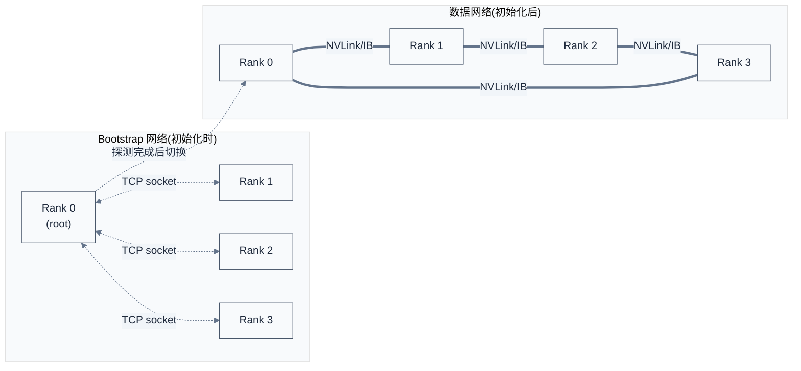

# Bootstrap 与拓扑探测

> 一句话概括:NCCL 用独立的 Bootstrap 网络(TCP socket)完成初始化时 rank 间握手,通过 NVML/CUDA/IB 探测硬件拓扑,把拓扑表示为 11 种 PATH 类型(NVL/PHB/SYS/NET 等),据此选择最优 transport 与算法图。
> **工程师视角**:90% 的"NCCL 性能不如预期"问题源于拓扑认知错误——P2P 被禁、ACS 阻断、NIC 走错 NUMA、GDR 没启用。学会用 `NCCL_TOPO_FILE=dump.xml` + `NCCL_DEBUG=INFO` 看懂 NCCL 实际探测到的拓扑,是排查这类问题的首要技能。

### 关键术语

| 缩写 | 全称 | 含义 |
|------|------|------|
| Bootstrap | — | NCCL 初始化时的 TCP socket 网络,独立于数据网络 |
| UniqueId | — | 通信器初始化邀请码(128 字节,内含 TCP 监听地址) |
| Root | Bootstrap Root | 接受其他 rank 报到的中心节点(默认 rank 0) |
| NVML | NVIDIA Management Library | GPU 管理库,查询 PCI/NVLink 拓扑 |
| PATH | — | NCCL 内部的 11 种连接类型分类(NVL/PHB/SYS/NET 等) |
| ACS | Access Control Services | PCIe ACS 阻止 P2P 跨 IOMMU |
| GDR | GPUDirect RDMA | GPU 显存直接通过 IB 收发,不经 CPU |
| MNNVL | Multi-Node NVLink | Blackwell 引入的跨节点 NVLink |
| Topology XML | — | NCCL_TOPO_FILE 指定的拓扑描述文件 |
| NUMA | Non-Uniform Memory Access | CPU 多 socket 内存访问差异 |
| NDR/HDR | Next/High Data Rate | InfiniBand 速率代号 |

**前置阅读**:
- [05-NCCL 源码架构](./05-source-architecture.md) — 数据结构与四层架构
- [02-多 GPU 互联背景](./02-gpu-interconnect-background.md) — NVLink/IB 硬件背景

**下一篇**:[07-Graph 与调度](./07-graph-and-scheduling.md)

---

## 1. Bootstrap:初始化握手网络

> [05 章](./05-source-architecture.md) 讲了 NCCL 四层架构与初始化的八阶段。本章回答下一个问题:初始化阶段 1-2(Bootstrap)如何完成 rank 间握手?阶段 4(拓扑探测)如何把硬件表示成 NCCL 能用的形式?

### 1.1 Bootstrap 是什么

NCCL 在初始化时需要建立 rank 间的通信信道,但此时还没有 NVLink/IB transport 可用(那些要等拓扑探测后才建立)。所以 NCCL 用一个**独立的 TCP socket 网络**做初始化握手,这个网络叫做 **Bootstrap 网络**。



**Bootstrap 与数据网络的关键差异**:

| 维度 | Bootstrap 网络 | 数据网络 |
|------|---------------|---------|
| 协议 | TCP socket | NVLink / PCIe / IB / SHM |
| 用途 | 初始化时握手 + 控制消息 | 实际数据传输 |
| 带宽需求 | KB 级(只传地址、状态) | TB/s 级(传 tensor) |
| 物理介质 | 任意 NIC(可与数据网络共用或独立) | 通常是高速 NIC(NVLink/NDR IB) |
| 失败影响 | 阻塞初始化 | 不影响已建立的 communicator |

### 1.2 UniqueId 机制

`ncclUniqueId` 在 [04 章 §2.1](./04-nccl-api-and-usage.md) 已介绍为"128 字节邀请码"。内部结构实际是:

```c
/* 摘自 [src/nccl.h.in](./src/nccl-src/src/nccl.h.in) 第 40-41 行 */
#define NCCL_UNIQUE_ID_BYTES 128
typedef struct { char internal[NCCL_UNIQUE_ID_BYTES]; } ncclUniqueId;
```

实际内部(摘自 `src/include/bootstrap.h`)是 `ncclSocketAddress`(rank 0 的 TCP 地址)+ `magic`(鉴权随机数)+ `nRoots`(多 root 支持,见 §1.4)。这 128 字节足够编码:

- rank 0 的 IPv4/IPv6 地址(16 字节)
- rank 0 的 TCP 端口(2 字节)
- magic number(8 字节,用于防止跨集群误连)
- 多 root 信息(用于 `ncclCommInitRankScalable`)
- 保留字段

### 1.3 Bootstrap 协议与 Root 选举

所有 rank 通过 TCP socket 连接到 root(默认 rank 0),root 充当"总台"角色,协调各 rank 间的握手。Bootstrap 协议用 tag 区分消息类型:

```c
/* 摘自 [src/bootstrap.cc](./src/nccl-src/src/bootstrap.cc) 第 22-26 行 */
#define BOOTSTRAP_TAG_CONNECT (0x1 << 31)        // rank 连接 root
#define BOOTSTRAP_TAG_ALLGATHER (0x1 << 30)      // 全交换信息
#define BOOTSTRAP_TAG_COMMSPLIT (0x1 << 29)      // comm split
#define BOOTSTRAP_TAG_INTRANODE_ALLGATHER (0x1 << 28)  // 节点内全交换
#define BOOTSTRAP_TAG_GROW_BOUNDARY (0x1 << 27)  // grow 边界
```

这些 tag 让 root 能根据消息 tag 分发到不同 handler,避免协议状态混乱。

### 1.4 多 Root 支持(NCCL 2.19+)

大规模训练(1000+ rank)时,单个 root 的 TCP socket 成为瓶颈。NCCL 引入多 root 机制:rank 0 生成多个 uniqueId,每个 uniqueId 对应一个 root,各 root 负责一部分 rank:

```c
/* 摘自 [src/bootstrap.cc](./src/nccl-src/src/bootstrap.cc) 第 49-90 行(简化) */
// returns the first rank associated to the root. must have root >=0
// if root >= n_roots, it does NOT assume periodicity
static int firstRankFromRoot(int root, int n_ranks, int nRoots, int offset) {
  if (root == -1) return 0;
  n_ranks -= offset;
  return offset + root * (n_ranks / nRoots) + std::min(root, n_ranks % nRoots);
}
// returns the root of a rank, must have rank >=0
static int rootIdFromRank(int rank, int nRanks, int nRoots, int offset) {
  if (nRoots == 0 || rank < offset) return -1;
  nRanks -= offset;
  rank -= offset;
  int rmr = nRanks % nRoots; // rank mod root
  int rpr = nRanks / nRoots; // rank per root
  int D = rmr * (rpr + 1);
  if (rank < D) return rank / (rpr + 1);
  else return (rank - D) / rpr + rmr;
}
// return the number of child for a root, root will be periodized
static int nRankFromRoot(int root, int nRanks, int nRoots, int offset) {
  if (root == -1) return 0;
  nRanks -= offset;
  int ir = BOOTSTRAP_PID(root, nRoots);
  int rmr = nRanks % nRoots;
  int rpr = nRanks / nRoots;
  return rpr + ((ir < rmr) ? 1 : 0);
}
```

这三个函数实现 rank↔root 的双向映射。在 4 root + 100 rank 场景下,每个 root 只需处理 25 个 rank 的握手,TCP 并发能力提升 4 倍。

用户通过 `ncclCommInitRankScalable` API 使用多 root:

```c
/* 摘自 [src/nccl.h.in](./src/nccl-src/src/nccl.h.in) 第 263 行 */
ncclResult_t ncclCommInitRankScalable(ncclComm_t* newcomm, int nranks,
                                      int myrank, int nId,
                                      ncclUniqueId* commIds,
                                      ncclConfig_t* config);
```

`nId` 是 uniqueId 数量,每个 rank 持有所有 uniqueId(顺序一致),根据自己的 rank 选对应的 root 连接。

### 1.5 NCCL_COMM_ID:无 MPI 的 fallback

如果用户没有 MPI 之类的通信信道广播 uniqueId,可以用 `NCCL_COMM_ID` 环境变量跳过广播:

```bash
# rank 0:
NCCL_COMM_ID=<my-ip>:<port> ./app
# 其他 rank:
NCCL_COMM_ID=<rank0-ip>:<port> ./app
```

bootstrap 网络初始化时直接读这个环境变量:

```c
/* 摘自 [src/bootstrap.cc](./src/nccl-src/src/bootstrap.cc) 第 105-138 行(简化) */
ncclResult_t bootstrapNetInit() {
  if (bootstrapNetInitDone == 0) {
    std::lock_guard<std::mutex> lock(bootstrapNetMutex);
    if (bootstrapNetInitDone == 0) {
      const char* env = ncclGetEnv("NCCL_COMM_ID");
      int nIfs = 0;
      if (env) {
        // 用 NCCL_COMM_ID 指定的远端地址,反查本端可达的网卡
        union ncclSocketAddress remoteAddr;
        if (ncclSocketGetAddrFromString(&remoteAddr, env) != ncclSuccess) {
          WARN("Invalid NCCL_COMM_ID, please use format: <ipv4>:<port> ...");
          return ncclInvalidArgument;
        }
        NCCLCHECK(ncclFindInterfaceMatchSubnet(bootstrapNetIfName,
                 &bootstrapNetIfAddr, &remoteAddr, MAX_IF_NAME_SIZE, &nIfs));
      } else {
        // 无 NCCL_COMM_ID:自动找一个能上网的网卡
        NCCLCHECK(ncclFindInterfaces(bootstrapNetIfName,
                 &bootstrapNetIfAddr, MAX_IF_NAME_SIZE, 1, &nIfs));
      }
      bootstrapNetInitDone = 1;
    }
  }
  return ncclSuccess;
}
```

**关键设计**:`ncclFindInterfaceMatchSubnet` 通过 NCCL_COMM_ID 指定的远端 IP,反查本端能到达该 IP 的网卡——这确保 bootstrap 网络的可达性,而不是盲目选第一个网卡。

> **核心要点**:Bootstrap 网络只用于初始化,与数据网络物理隔离(可走不同 NIC),失败不影响已建立的 communicator。`NCCL_COMM_ID` 是无 MPI 环境下的便捷 fallback,但需要用户保证所有 rank 知道 rank 0 的 IP:port。

---

## 2. 硬件拓扑探测

Bootstrap 握手完成后,NCCL 进入拓扑探测阶段(`ncclTopoGetSystem`),目标是把"这台机器到底有什么硬件、它们怎么连的"表示成 `ncclTopoSystem` 结构。

### 2.1 探测入口

```c
/* 摘自 [src/graph/topo.cc](./src/nccl-src/src/graph/topo.cc) 第 1765-1810 行(简化) */
ncclResult_t ncclTopoGetSystem(struct ncclComm* comm,
                               struct ncclTopoSystem** system,
                               const char* dumpXmlFile) {
  struct ncclXml* xml;
  NCCLCHECK(xmlAlloc(&xml, NCCL_TOPO_XML_MAX_NODES));

  // 1. 先尝试从 XML 文件加载(NCCL_TOPO_FILE 或 /var/run/nvidia-topologyd/)
  const char* xmlTopoFile = ncclGetEnv("NCCL_TOPO_FILE");
  if (xmlTopoFile) {
    INFO(NCCL_ENV, "NCCL_TOPO_FILE set by environment to %s", xmlTopoFile);
    NCCLCHECK(ncclTopoGetXmlFromFile(xmlTopoFile, xml, 1));
  } else {
    NCCLCHECK(ncclTopoGetXmlFromFile(
        "/var/run/nvidia-topologyd/virtualTopology.xml", xml, 0));
  }

  // 2. 标记本 rank 拥有的 GPU(其他 rank 通过 XML fusion 提供)
  char busId[NVML_DEVICE_PCI_BUS_ID_BUFFER_SIZE];
  NCCLCHECK(int64ToBusId(comm->peerInfo[comm->rank].busId, busId));
  NCCLCHECK(ncclTopoFillGpu(xml, busId, &node));
  if (node) {
    NCCLCHECK(xmlSetAttrInt(node, "keep", 1));
    NCCLCHECK(xmlSetAttrInt(node, "rank", comm->rank));
  }

  // 3. 探测 NIC / GIN / RMA / CollNet 设备
  /* ... ncclTopoProcessNet(...) for gin/rma/collnet ... */

  // 4. 全 rank 交换 XML(bootstrap allgather)
  /* ... ncclTopoXmlFusion ... */

  // 5. 把 XML 转换为 ncclTopoSystem
  NCCLCHECK(ncclTopoGetSystemFromXml(xml, system, ...));
  return ncclSuccess;
}
```

**关键步骤**:

1. **XML 优先级**:`NCCL_TOPO_FILE` > `/var/run/nvidia-topologyd/virtualTopology.xml`(nvidia-topologyd 服务生成)> 自动探测
2. **本地 GPU 探测**:每个 rank 只探测自己绑定的 GPU(其他 rank 的 GPU 通过 XML fusion 交换)
3. **NIC/GIN/RMA/CollNet 探测**:依次调用 `ncclTopoProcessNet`,按优先级 gin > rma > collnet
4. **XML fusion**:所有 rank 把自己的 XML 片段 allgather 给其他 rank,合并成完整拓扑
5. **XML → ncclTopoSystem**:把 XML 树解析为 `ncclTopoSystem` 内部结构

### 2.2 探测源(NVML + CUDA + sysfs)

NCCL 通过三个数据源探测硬件:

| 数据源 | 用途 | 调用方式 |
|--------|------|---------|
| NVML | GPU PCI 拓扑、NVLink 连接、PCIe bridge 关系 | `nvmlDeviceGetPciInfo`、`nvmlDeviceGetNvLinkDevice` |
| CUDA | GPU compute capability、device count | `cudaDeviceGetAttribute`、`cudaGetDeviceCount` |
| sysfs | PCIe bridge 拓扑(PCI 路径上的所有 bridge) | `/sys/bus/pci/devices/<bus>/` |
| IB verbs | NIC 拓扑、速率、GDR 支持 | `ibv_get_device_list`、`ibv_query_port` |
| `/sys/class/net` | NIC 与 PCI 关系 | `readlink("/sys/class/net/<iface>/device")` |

XML 自动生成器(摘自 `xml.cc` L439-470)从这些数据源读属性,填入 XML 节点:

```c
/* 摘自 [src/graph/xml.cc](./src/nccl-src/src/graph/xml.cc) 第 439-469 行 */
ncclResult_t ncclTopoSetAttrFromSys(struct ncclXmlNode* pciNode,
                                     const char* path, const char* fileName,
                                     const char* attrName) {
  char strValue[MAX_STR_LEN];
  NCCLCHECK(ncclOsTopoGetStrFromSys(path, fileName, strValue, MAX_STR_LEN));
  if (strValue[0] != '\0') NCCLCHECK(xmlSetAttr(pciNode, attrName, strValue));
  return ncclSuccess;
}

ncclResult_t ncclTopoSetAttrFromNvml(struct ncclXmlNode* pciNode,
                                     nvmlDevice_t device, const char* attrName) {
  nvmlPciInfo_t pciInfo;
  NCCLCHECK(ncclNvmlDeviceGetPciInfo(device, &pciInfo));
  char strValue[MAX_STR_LEN];
  if (strcmp(attrName, "vendor") == 0) {
    snprintf(strValue, MAX_STR_LEN, "0x%x", pciInfo.pciDeviceId & 0xFFFF);
  } else if (strcmp(attrName, "device") == 0) {
    snprintf(strValue, MAX_STR_LEN, "0x%x", (pciInfo.pciDeviceId >> 16) & 0xFFFF);
  }
  /* ... */
  NCCLCHECK(xmlSetAttr(pciNode, attrName, strValue));
  return ncclSuccess;
}
```

### 2.3 NCCL_TOPO_FILE XML 格式

XML 解析器是 NCCL 自实现的轻量级 parser(摘自 `src/graph/xml.cc`):

```c
/* 摘自 [src/graph/xml.cc](./src/nccl-src/src/graph/xml.cc) 第 29-35 行 */
typedef ncclResult_t (*xmlHandlerFunc_t)(FILE*, struct ncclXml*, struct ncclXmlNode*);

struct xmlHandler {
  const char* name;
  xmlHandlerFunc_t func;
};
```

支持的 XML 标签(摘自 `xml.cc` L344-405):

```c
/* 摘自 [src/graph/xml.cc](./src/nccl-src/src/graph/xml.cc) 第 344-405 行(简化) */
ncclResult_t ncclTopoXmlLoadGpu(FILE* file, struct ncclXml* xml, struct ncclXmlNode* head);
ncclResult_t ncclTopoXmlLoadNet(FILE* file, struct ncclXml* xml, struct ncclXmlNode* head);
ncclResult_t ncclTopoXmlLoadNic(FILE* file, struct ncclXml* xml, struct ncclXmlNode* head);
ncclResult_t ncclTopoXmlLoadPci(FILE* file, struct ncclXml* xml, struct ncclXmlNode* head);
ncclResult_t ncclTopoXmlLoadCpu(FILE* file, struct ncclXml* xml, struct ncclXmlNode* head);
ncclResult_t ncclTopoXmlLoadSystem(FILE* file, struct ncclXml* xml, struct ncclXmlNode* head);
```

入口是 `<system>` 标签,内部嵌套 `<cpu>` → `<pci>` → `<gpu>`/`<nic>`/`<pci>`,关系通过 PCI 总线 ID 关联。

**示例:2 节点 4 GPU + 2 IB NIC 的拓扑 XML**:

```xml
<system version="3">
  <cpu numaid="0" affinity="000000ff" arch="x86" vendor="Intel" model="SPR" host_hash="0x...">
    <pci busid="0000:00:00.0" class="0x0600" vendor="0x8086" device="0x09a2">
      <pci busid="0000:01:00.0" class="0x0604" vendor="0x10de" device="0x22a7">
        <gpu busid="0000:02:00.0" class="0x0302" vendor="0x10de" device="0x2330"
             rank="0" gdr="1" keep="1">
          <nvlink count="4" bw="50" peer="0000:21:00.0"/>
          <nvlink count="4" bw="50" peer="0000:41:00.0"/>
        </gpu>
      </pci>
      <pci busid="0000:01:01.0" class="0x0604" vendor="0x10de" device="0x22a7">
        <gpu busid="0000:03:00.0" rank="1" gdr="1" keep="1">
          <!-- GPU 1, NVLink to GPU 0/2/3 -->
        </gpu>
      </pci>
      <!-- ... GPU 2, 3 ... -->
    </pci>
    <pci busid="0000:80:00.0" class="0x0600" vendor="0x8086" device="0x09a2">
      <nic busid="0000:81:00.0" class="0x0207" vendor="0x15b3" device="0x0... "
           name="mlx5_0" speed="100" port="1" gdr="1"/>
      <nic busid="0000:a1:00.0" name="mlx5_1" speed="100" port="1" gdr="1"/>
    </pci>
  </cpu>
  <cpu numaid="1" affinity="0000ff00" arch="x86" vendor="Intel" model="SPR" host_hash="0x...">
    <!-- 第二个 socket 下的 GPU/NIC ... -->
  </cpu>
</system>
```

**如何阅读这份 XML**:
- 每个 `<gpu>` 通过 PCI busid 唯一标识,`rank` 字段说明它属于哪个 rank
- `<nvlink>` 子元素描述 GPU 间的 NVLink 连接,`peer` 是对端 busid,`bw` 是单口带宽(GB/s)
- `<nic>` 标签的 `name` 是 IB 设备名(如 `mlx5_0`),`speed` 是 Gb/s,`gdr=1` 表示支持 GPUDirect RDMA
- `host_hash` 区分不同节点,跨节点的 `<cpu>` 有不同 `host_hash`

### 2.4 用 NCCL_TOPO_FILE 排查问题

**典型场景**:怀疑 NCCL 没启用 NVLink,运行 `NCCL_DEBUG=INFO` 看到 transport 是 SHM 而非 P2P。

```bash
# 1. 让 NCCL 把探测到的拓扑 dump 到 XML
NCCL_TOPO_DUMP_FILE=/tmp/topo_dump.xml ./your_app

# 2. 检查 dump 的 XML 是否有 NVLink 节点
grep -A2 nvlink /tmp/topo_dump.xml
# 应看到类似:
#   <nvlink count="4" bw="50" peer="0000:21:00.0"/>
# 如果没有任何 nvlink 节点 → NVML 没检测到 NVLink → 检查 nvidia-smi nvlink -g
```

NCCL 不会自己 dump XML 到文件——但可以**强制使用某个 XML 作为输入**:

```bash
# 给定预定义 XML,跳过自动探测
NCCL_TOPO_FILE=/path/to/your/topo.xml ./your_app
```

这让"换台机器试同样拓扑"成为可能(把 A 机的 XML 拷到 B 机用),也是 CI 测试不同拓扑的标准做法。

> **核心要点**:`NCCL_TOPO_FILE` 是 NCCL 排查"拓扑认知错误"问题的首要工具。它允许离线 dump/load 拓扑,让"为什么 NCCL 选了慢路径"这类问题可以脱离具体机器分析。

---

## 3. PATH 类型:11 种连接分类

NCCL 把任意两个设备(GPU/NIC/CPU)之间的连接,根据所穿越的硬件,归为 11 种 PATH 类型。每种 PATH 类型对应不同带宽与延迟特征,直接影响 transport 选择。

### 3.1 PATH 常量定义

```c
/* 摘自 [src/include/graph.h](./src/nccl-src/src/include/graph.h) 第 117-155 行 */
// Local (myself)
#define PATH_LOC 0

// Connection traversing NVLink
#define PATH_NVL 1

// Connection through NVLink using an intermediate GPU
#define PATH_NVB 2

// Connection through C2C
#define PATH_C2C 3

// Connection traversing at most a single PCIe bridge
#define PATH_PIX 4

// Connection traversing multiple PCIe bridges (without traversing the PCIe Host Bridge)
#define PATH_PXB 5

// Connection between a GPU and a NIC using the C2C connection to the CPU
// and the PCIe connection to the NIC
#define PATH_P2C 6

// Connection between a GPU and a NIC using an intermediate GPU.
// Used to enable rail-local, aggregated network send/recv operations.
#define PATH_PXN 7

// Connection traversing PCIe as well as a PCIe Host Bridge (typically the CPU)
#define PATH_PHB 8

// Connection traversing PCIe as well as the SMP interconnect between NUMA nodes
// (e.g. QPI/UPI)
#define PATH_SYS 9

// Connection through the network
#define PATH_NET 10

// New type of path which should precede PATH_PIX
#define PATH_PORT PATH_NVL

// Disconnected
#define PATH_DIS 11
```

### 3.2 11 种 PATH 的带宽与延迟

| PATH | 含义 | 典型带宽 | 典型延迟 | 示例 |
|------|------|---------|---------|------|
| `LOC` | 自身 | ∞ | 0 | GPU 0 → GPU 0 |
| `NVL` | 直连 NVLink | 50 GB/s(H100 NV4) | ~1 μs | 同节点同 NVSwitch 域的 2 GPU |
| `NVB` | 经中间 GPU 的 NVLink | 50 GB/s(共享) | ~2 μs | 跨子域的 2 GPU(经 NVSwitch 间接) |
| `C2C` | NVLink-C2C(GH200 等) | 100 GB/s+ | <1 μs | GH200 上 GPU-CPU 直连 |
| `PIX` | 单 PCIe bridge | 16-32 GB/s(PCIe 5/6) | ~2 μs | GPU 与同 PCIe switch 上的 NIC |
| `PXB` | 多 PCIe bridge(不跨 PHB) | 16 GB/s | ~3 μs | GPU 与同 CPU 但跨 PCIe switch 的 NIC |
| `P2C` | GPU 经 C2C 到 CPU 再到 NIC | 取决于 C2C | ~3 μs | GH200 + PCIe NIC |
| `PXN` | GPU 经中间 GPU 到 NIC | NVLink 带宽 | ~2 μs | "rail-local" 优化(见 §3.4) |
| `PHB` | 跨 PCIe Host Bridge(CPU) | 16 GB/s | ~5 μs | GPU 与跨 socket 的 NIC |
| `SYS` | 跨 NUMA(QPI/UPI) | 8-12 GB/s | ~10 μs | GPU 与另一 CPU socket 的 NIC |
| `NET` | 跨节点网络 | IB 带宽(12.5-25 GB/s) | ~5-20 μs | 不同节点的 GPU |

> **如何读这张表**:从 NVL 到 SYS,带宽与延迟逐级下降。NCCL 默认优先选高带宽 PATH——NVLink(NVL)优于 PCIe(PHB/SYS)。当 NVLink 不可用时(老 GPU、PCIe only),NCCL 退化到 PIX/PXB。

### 3.3 PXN:Rail-Local 优化

`PXN(PATH_PXN)` 是个特殊 PATH,表示"GPU 通过中间 GPU 到达 NIC"。这个中间 GPU 在 NVSwitch 全互联拓扑下,可以让多个 GPU 共享一个 NIC 时减少 GPU→NIC 的 PCIe 流量:

```
普通模式:
  GPU0 → NIC0 (走 PCIe,每个 GPU 独占一条 PCIe 路径)
  GPU1 → NIC0 (走 PCIe)
  GPU2 → NIC0 (走 PCIe)
  GPU3 → NIC0 (走 PCIe)
  → 4 条 PCIe 流量

PXN 模式:
  GPU0 → GPU0 → NIC0 (NVLink + PCIe)
  GPU1 → GPU0 → NIC0 (NVLink 到 GPU0,再 PCIe 到 NIC0)
  GPU2 → GPU0 → NIC0 (NVLink + PCIe)
  GPU3 → GPU0 → NIC0 (NVLink + PCIe)
  → 仅 1 条 PCIe 流量,4 条 NVLink 流量
```

**为什么这样更好**?NVLink 带宽(50 GB/s)远高于 PCIe(16 GB/s),用 NVLink 走一段、再统一从一个 NIC 出 PCIe,可以避免 PCIe 成为瓶颈。这被称为"rail-local aggregated send/recv"。

可通过 `NCCL_PXN_DISABLE=1` 关闭该优化(默认开启)。

### 3.4 PATH 计算:`ncclTopoComputePaths`

```c
/* 摘自 [src/include/graph.h](./src/nccl-src/src/include/graph.h) 第 28 行 */
ncclResult_t ncclTopoComputePaths(struct ncclTopoSystem* system,
                                  struct ncclComm* comm);
```

这个函数对 `ncclTopoSystem` 中所有设备对,计算 PATH 类型并填充到 `ncclTopoNode.paths[]`。算法核心是 BFS:从一个设备出发,沿 PCI/NVLink/网络 边遍历,记录到其他设备的"最短 PATH 类型"。

PATH 类型优先级(从优到劣):

```
LOC > NVL > NVB > C2C > PIX > PXB > P2C > PXN > PHB > SYS > NET > DIS
```

PATH 类型决定 transport 选择(`canConnect` 返回 true/false):

```c
/* 摘自 [src/include/graph.h](./src/nccl-src/src/include/graph.h) 第 42-43 行 */
ncclResult_t ncclTopoCheckP2p(struct ncclComm* comm, struct ncclTopoSystem* system,
                              int rank1, int rank2, int* p2p, int* read,
                              int* intermediateRank, int* cudaP2p);
```

`ncclTopoCheckP2p` 返回 `p2p=1` 当且仅当 PATH 是 NVL/NVB/PIX/PXB/C2C 等"可 P2P"类型;PHB/SYS 不可 P2P(因 PCIe ACS 阻断)。

### 3.5 GDR(GPUDirect RDMA)检查

跨节点通信时,NCCL 需要判断是否可用 GDR(GPU 显存直接通过 IB 收发):

```c
/* 摘自 [src/include/graph.h](./src/nccl-src/src/include/graph.h) 第 46-53 行 */
enum ncclTopoGdrMode {
  ncclTopoGdrModeDisable = 0,   // 不用 GDR
  ncclTopoGdrModeDefault = 1,   // 用 GDR(若硬件支持)
  ncclTopoGdrModePci = 2,       // 强制走 PCIe(不用 NVLink 中转)
  ncclTopoGdrModeNum = 3
};
ncclResult_t ncclTopoCheckGdr(struct ncclTopoSystem* topo, int rank,
                              int64_t netId, int read,
                              enum ncclTopoGdrMode* gdrMode);
```

`ncclTopoCheckGdr` 返回 GDR 模式:Disable/Default/Pci。**PCI 模式**(`ncclTopoGdrModePci`)是 NCCL 2.18+ 引入的,针对 Hopper + GH200 上一代 GH 上的 GDR 强制走 PCIe 而非 NVLink,避免 cache coherence 问题。

相关环境变量:
- `NCCL_NET_GDR_LEVEL`(默认 -2,自动):GPU 与 NIC 间 PATH 优于该 level 才用 GDR
- `NCCL_NET_GDR_READ`(默认 -2):是否启用 GDR read
- `NCCL_NET_GDR_C2C`(默认 1):C2C 路径下用 GDR

> **核心要点**:11 种 PATH 类型是 NCCL 拓扑感知的核心——它把"硬件拓扑"这个连续问题离散化,让 transport 选择、算法图构建、调优参数都建立在 PATH 分类基础上。`PATH_PXN` 是 NVSwitch 拓扑下"用 NVLink 替换 PCIe"的关键优化,直接影响跨节点带宽。

---

## 4. nvidia-smi topo -m:人读拓扑

NCCL 探测出的拓扑与 `nvidia-smi topo -m` 输出一致。学会读这个输出,等于看懂了 NCCL 的拓扑认知。

### 4.1 示例输出(8 GPU H100 DGX)

```
$ nvidia-smi topo -m
       GPU0  GPU1  GPU2  GPU3  GPU4  GPU5  GPU6  GPU7  NIC0  NIC1  NIC2  NIC3
GPU0     X    NV    NV    NV    NV    NV    NV    NV    PIX   NODE  NODE  NODE
GPU1    NV     X    NV    NV    NV    NV    NV    NV    NODE  PIX   NODE  NODE
GPU2    NV    NV     X    NV    NV    NV    NV    NV    NODE  NODE  PIX   NODE
GPU3    NV    NV    NV     X    NV    NV    NV    NV    NODE  NODE  NODE  PIX
GPU4    NV    NV    NV    NV     X    NV    NV    NV    NODE  NODE  NODE  PIX
GPU5    NV    NV    NV    NV    NV     X    NV    NV    NODE  NODE  PIX   NODE
GPU6    NV    NV    NV    NV    NV    NV     X    NV    NODE  PIX   NODE  NODE
GPU7    NV    NV    NV    NV    NV    NV    NV     X    PIX   NODE  NODE  NODE
NIC0    PIX  NODE  NODE  NODE  NODE  NODE  NODE   PIX     X    NODE  NODE  NODE
NIC1   NODE  PIX   NODE  NODE  NODE  NODE   PIX  NODE   NODE    X    NODE  NODE
NIC2   NODE  NODE  PIX   NODE  NODE   PIX  NODE  NODE   NODE  NODE    X    NODE
NIC3   NODE  NODE  NODE  PIX   PIX   NODE  NODE  NODE   NODE  NODE  NODE    X
```

### 4.2 字段含义

| 字段 | 含义 | 对应 NCCL PATH |
|------|------|---------------|
| `X` | 自身 | `PATH_LOC` |
| `NV` | NVLink 直连 | `PATH_NVL` |
| `NODE` | 同 NUMA 节点,跨 PCIe bridge | `PATH_PXB` |
| `SYS` | 跨 NUMA 节点(QPI/UPI) | `PATH_SYS` |
| `PIX` | 同 PCIe switch(单 bridge) | `PATH_PIX` |
| `PXB` | 跨 PCIe switch,同 PCIe Host Bridge | `PATH_PXB` |
| `PHB` | 跨 PCIe Host Bridge | `PATH_PHB` |

### 4.3 解读示例

看 GPU0 那行:
- GPU0 ↔ GPU1-7:都是 `NV`(全 NVLink 互联,DGX H100 有 4 颗 NVSwitch,所有 8 GPU 全互联)
- GPU0 ↔ NIC0:`PIX`(同 PCIe switch,GPU0 与 NIC0 物理位置近)
- GPU0 ↔ NIC1/2/3:`NODE`(跨 NUMA,带宽较低)

**含义**:NCCL 会优先让 GPU0 用 NIC0 跨节点通信(走 `PIX` 而非 `NODE`)。如果用户强制 GPU0 用 NIC2,会跨 NUMA 节点,性能下降约 30%。

### 4.4 用 nvidia-smi 验证 NCCL 决策

```bash
# 1. 看 nvidia-smi 拓扑
nvidia-smi topo -m

# 2. 运行 NCCL,看实际选择的 transport
NCCL_DEBUG=INFO ./your_app 2>&1 | grep "via" | head -5

# 3. 对照:如果 NCCL 选了 SHM 而非 P2P,但 nvidia-smi 显示 NV,
#    说明 ACS 阻断了 P2P(见 §5 调优排查)
```

---

## 5. 常见拓扑问题排查

### 5.1 排查表

| 症状 | 可能原因 | 验证方法 | 解决方案 |
|------|---------|---------|---------|
| NCCL 选 `SHM` 而非 `P2P` | ACS 启用,PCIe P2P 阻断 | `nvidia-smi topo -m` 显示 `NV`,但 `NCCL_DEBUG=INFO` 显示 `transport=SHM` | BIOS 关 ACS 或 `NCCL_P2P_DISABLE=1`(临时) |
| AllReduce 跨节点带宽 < 单 NIC 带宽 | GDR 没启用 | `NCCL_DEBUG=INFO` 没看到 `GPUDirect RDMA=1` | 检查 `nv_peer_mem` 模块、`NCCL_NET_GDR_LEVEL` |
| AllReduce 跨节点带宽 < NIC 数 × 单 NIC 带宽 | NIC 走错 NUMA | `nvidia-smi topo -m` 看 GPU-NIC 关系,对比实际使用的 NIC | `NCCL_NET_GDR_LEVEL=PHB` 或固定 NUMA |
| 初始化 timeout | NCCL_COMM_ID 不可达 | `nccl-init` 卡在 `Bootstrap root` 等待 | 检查防火墙、`NCCL_COMM_ID` IP:port 可达 |
| P2P 跨 NUMA 失败 | PCIe ACS 或 IOMMU 启用 | `dmesg \| grep ACS` | BIOS 关 ACS / IOMMU,或 `NCCL_P2P_LEVEL=PIX` 限制 |
| 跨节点延迟 > 50 μs | IB 链路问题 | `ibstat` 看 `State: Active`,`Rate: 400`(NDR) | 检查 IB 线缆、`NCCL_IB_TIMEOUT` |
| NVLink 没启用 | `nvidia-smi nvlink -g` 报错 | `nvidia-smi -q \| grep -i nvlink` | 检查 NVLink driver、BIOS |

### 5.2 ACS 阻断 P2P 的具体表现

ACS(Access Control Services)是 PCIe 安全特性,阻止设备间直接 P2P(防止 DMA 跨 IOMMU 边界)。在服务器主板上,ACS 通常默认启用,这会让 NCCL 退化到 SHM(共享内存,走 CPU memory)。

**判断方法**:

```bash
# 1. 看 GPU 间是否 NVLink 全互联
nvidia-smi topo -m | grep -c NV   # 应该 ≥ 8*7=56(全互联)

# 2. NCCL_DEBUG 看 transport
NCCL_DEBUG=INFO ./your_app 2>&1 | grep -E "via|transport"
# 期望:GPU 间 P2P,看到 "Algo:Ring ... via P2P/..."
# 若为 SHM:看下条

# 3. 检查 ACS
find /sys/bus/pci/devices -name 'acs_ctrl' -exec cat {} \;
# 0x0 表示 ACS 启用,需要关
```

**临时绕过**(不重启):

```bash
# 加 nvidia 模块时禁用 P2P 阻断检查
sudo modprobe nvidia NVreg_OpenRmEnableUnsupportedGpus=1

# 或让 NCCL 不用 P2P(性能下降)
NCCL_P2P_DISABLE=1 ./your_app

# 根本解决:BIOS 关 ACS(每台机器 BIOS 路径不同)
# 例如 Dell BIOS:PCIe Settings → ACS Control → Disabled
```

### 5.3 GDR 没启用的具体表现

```bash
# 1. 检查 nv_peer_mem 模块
lsmod | grep nv_peer_mem
# 应看到: nv_peer_mem  xxx

# 2. NCCL 输出
NCCL_DEBUG=INFO ./your_app 2>&1 | grep -i "gdr\|gpudirect"
# 期望:NCCL INFO NET/IB: Using GPUDirect RDMA
# 若没看到:GDR 没启用

# 3. 强制启用 GDR(若硬件支持)
NCCL_NET_GDR_LEVEL=PHB ./your_app
```

### 5.4 NIC 走错 NUMA 的具体表现

```bash
# 1. 看 GPU 与 NIC 的 NUMA 关系
nvidia-smi topo -m
cat /sys/class/net/eth0/device/numa_node  # 应为 0 或 1

# 2. 看 NCCL 用的 NIC
NCCL_DEBUG=INFO ./your_app 2>&1 | grep -E "using dev|NIC"
# NCCL INFO NET/IB: Using [0]mlx5_0:1/RoCE ...

# 3. 对照:若 GPU0(NIC0 NUMA=0)用了 mlx5_3(NIC3 NUMA=1),
#    会跨 NUMA,带宽下降 30%
```

> **核心要点**:90% 的"NCCL 性能不如预期"问题源于拓扑认知错误——P2P 被禁、ACS 阻断、NIC 走错 NUMA、GDR 没启用。学会用 `nvidia-smi topo -m` + `NCCL_DEBUG=INFO` + `NCCL_TOPO_FILE` 三件套排查,是定位这类问题的首要技能。

---

## 官方文档索引

| 文档 | 用途 | 建议阅读时机 |
|------|------|------|
| [NCCL Topology](https://docs.nvidia.com/deeplearning/nccl/user-guide/docs/docs/topo.html) | NCCL 拓扑探测机制 | 学完本章后 |
| [NCCL Environment Variables](https://docs.nvidia.com/deeplearning/nccl/user-guide/docs/env.html) | `NCCL_TOPO_FILE`、`NCCL_P2P_DISABLE` 等 | 学完 §5 后 |
| [NCCL Troubleshooting](https://docs.nvidia.com/deeplearning/nccl/user-guide/docs/troubleshooting.html) | 常见问题排查 | 学完 §5 后 |
| [NVIDIA GPUDirect Documentation](https://docs.nvidia.com/cuda/gpudirect-rdma/) | GDR 与 PXN 原理 | 学完 §3.3 后 |

---

## 参考资料

- [NCCL Topology Documentation](https://docs.nvidia.com/deeplearning/nccl/user-guide/docs/docs/topo.html) — 参考了 §Topology Detection、§Path Types
- [NCCL Environment Variables](https://docs.nvidia.com/deeplearning/nccl/user-guide/docs/env.html) — 参考了 `NCCL_COMM_ID`、`NCCL_TOPO_FILE`、`NCCL_P2P_DISABLE`、`NCCL_PXN_DISABLE`
- [NCCL Bootstrap (本地源码)](./src/nccl-src/src/bootstrap.cc) — 参考了 L22-26 BOOTSTRAP_TAG_* 协议 tag、L49-90 多 root 选举算法、L105-138 bootstrapNetInit 与 NCCL_COMM_ID
- [NCCL Topology Detection (本地源码)](./src/nccl-src/src/graph/topo.cc) — 参考了 L1765-1810 ncclTopoGetSystem 探测主流程、L958 ncclTopoGetSystemFromXml
- [NCCL XML Parser (本地源码)](./src/nccl-src/src/graph/xml.cc) — 参考了 L29-35 xmlHandler 结构、L344-405 各 XML tag 加载器、L409-429 ncclTopoGetXmlFromFile 与 NCCL_TOPO_FILE
- [NCCL Graph Header (本地源码)](./src/nccl-src/src/include/graph.h) — 参考了 L28 ncclTopoComputePaths、L42-53 ncclTopoCheckP2p 与 ncclTopoCheckGdr、L78-155 PATH_* 常量、L170-189 ncclTopoGraph
