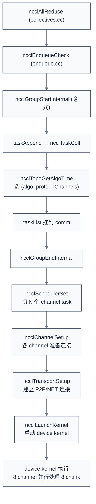

# Graph 构建与 Channel 调度

> 一句话概括:NCCL 在初始化时为每种算法(Ring/Tree/CollNet/NVLS)构建一个拓扑图,搜索算法寻找最优 channel 配置,把 collective 拆成多 channel 并行任务;Ring 用 $O(N)$ 步、Tree 用 $O(\log N)$ 步、CollNet 用 $O(1)$ 步完成归约。
> **工程师视角**:理解"channel = 算法 + transport 的绑定"和"多 channel 并行是 NCCL 性能可扩展的关键"这两点,就能看懂 `NCCL_DEBUG=INFO` 输出中 `nChannels:8` 的含义,以及为什么调 `NCCL_MAX_NCHANNELS` 能提升带宽。

### 关键术语

| 缩写 | 全称 | 含义 |
|------|------|------|
| Channel | — | 通信通道,绑定 ring/tree + transport |
| Ring | — | 环形通信图,每个 rank 有 prev/next |
| Tree | — | 树形通信图(双二叉树) |
| Btree | Binary Tree | 二叉树 |
| Dtree | Double Tree | 双二叉树(两棵互补的二叉树) |
| Cross-NIC | — | 跨 NIC 的 ring(双 NIC 双向并行) |
| Pattern | — | 拓扑模式(BALANCED_TREE/SPLIT_TREE/RING/NVLS/COLLNET) |
| nChannels | — | 通道数,决定并行度 |
| Scheduler | — | 把 collective 拆成多 channel 任务的调度器 |
| TopoGraph | — | 算法图(ring/tree/collnet 各一) |

**前置阅读**:
- [05-NCCL 源码架构](./05-source-architecture.md) — `ncclChannel` 与 `ncclComm` 数据结构
- [06-Bootstrap 与拓扑探测](./06-bootstrap-and-topology.md) — PATH 类型与拓扑系统
- [03-集合通信原语与算法](./03-collective-operations-and-algorithms.md) — Ring/Tree/CollNet 算法与性能公式

**下一篇**:[08-传输层](./08-transport-layer.md)

---

## 1. Channel:算法与传输的绑定

> [06 章](./06-bootstrap-and-topology.md) 讲了 NCCL 如何探测硬件拓扑并表示为 `ncclTopoSystem`。本章回答下一个问题:有了拓扑,如何为 Ring/Tree/CollNet 各构建一个具体可执行的图?如何把一次 collective 拆成多个并行 channel?

### 1.1 Channel 是什么

在 [05 章 §2.2](./05-source-architecture.md) 已经看过 `ncclChannel` 结构:

```c
struct ncclChannel {
  struct ncclChannelPeer** peers;
  struct ncclDevChannelPeer** devPeers;
  struct ncclRing ring;             // Ring 拓扑(prev/next 数组)
  struct ncclTree tree;             // Tree 拓扑(parent/child0/child1)
  struct ncclTree collnetChain;     // CollNet Chain
  struct ncclDirect collnetDirect;  // CollNet Direct
  struct ncclNvls nvls;             // NVLS
  int id;
  /* ... */
};
```

一个 channel **同时持有** 5 种拓扑(ring/tree/collnetChain/collnetDirect/nvls)。运行时根据 collective 选哪个算法,channel 复用对应字段。这让"加 channel"不需要分别给 ring/tree 加 channel,只需在所有 channel 上同时初始化所有算法字段。

### 1.2 为什么需要多 channel

单个 ring 在 NVLink 上带宽受限于单口(NVLink 4 单口 50 GB/s)。8 GPU H100 全互联需 4 个独立 ring 才能打满 4×50 = 200 GB/s 的聚合带宽。

**Ring 多 channel 示例**(4 GPU):

```
单 channel(带宽 50 GB/s):
  channel 0: GPU0 → GPU1 → GPU2 → GPU3 → GPU0

2 channel(带宽 100 GB/s):
  channel 0: GPU0 → GPU1 → GPU2 → GPU3 → GPU0  (正向 ring)
  channel 1: GPU0 → GPU3 → GPU2 → GPU1 → GPU0  (反向 ring)

4 channel(带宽 200 GB/s):
  channel 0: GPU0 → GPU1 → GPU2 → GPU3 → GPU0
  channel 1: GPU0 → GPU2 → GPU1 → GPU3 → GPU0  (错位)
  channel 2: GPU0 → GPU3 → GPU1 → GPU2 → GPU0
  channel 3: GPU0 → GPU1 → GPU3 → GPU2 → GPU0
```

数据被切成 N 份,各 channel 同时处理一份,**带宽近似线性扩展**。

### 1.3 channel 数的限制

| 限制因素 | 典型上限 | 调节方式 |
|---------|---------|---------|
| NVLink 物理通道数 | H100 NV4:4 通道(NVLink 4) | 硬件固定 |
| NIC 数 | 4-8(IB NDR/HDR) | 硬件配置 |
| GPU SM 数 | H100:132 SM | 硬件固定 |
| `MAXCHANNELS` 常量 | 32(编译时) | 源码硬上限 |
| `NCCL_MAX_NCHANNELS` 环境变量 | 默认 -2(自动) | 用户调节 |
| `NCCL_MIN_NCHANNELS` 环境变量 | 默认 -2(自动) | 用户下限 |

NCCL 自动选择 channel 数的依据:取 `min(NVLink 通道数, NIC 数, MAXCHANNELS, GPU SM 数/某阈值)`。

> **核心要点**:Channel 是 NCCL 性能可扩展的关键:把一个 collective 切成多个并行数据流,充分利用多 NVLink + 多 NIC。多 channel 让带宽近似线性扩展,直到硬件上限。

---

## 2. Ring 图构建

### 2.1 Ring 的本质

Ring 是一个循环列表,每个 rank 有 `prev` 和 `next`:

```
rank 0 → rank 1 → rank 2 → rank 3 → rank 0
        prev                next
```

Ring AllReduce 的两阶段(详见 [03 章](./03-collective-operations-and-algorithms.md) §3.1):
1. **Scatter-Reduce**(N-1 步):每步每个 rank 把自己的 chunk 发给 next,从 prev 收一个 chunk 并归约
2. **AllGather**(N-1 步):每步每个 rank 把归约后的 chunk 发给 next,从 prev 收一个完整 chunk

### 2.2 Ring 数据结构

```c
/* 摘自 [src/include/comm.h](./src/nccl-src/src/include/comm.h) — Ring 结构体 */
struct ncclRing {
  int prev;       // 前驱 rank
  int next;       // 后继 rank
  int* userRanks; // 完整的 rank 顺序(rank 0 视角)
  /* 其他字段:buffer 指针、tail/head 等 */
};
```

### 2.3 Ring 验证:ncclBuildRings

`ncclBuildRings` 不构造 ring,而是**验证**给定的 `prev[]`/`next[]` 数组能形成合法 ring:

```c
/* 摘自 [src/graph/rings.cc](./src/nccl-src/src/graph/rings.cc) 第 29-73 行(简化) */
ncclResult_t ncclBuildRings(int nrings, int* rings, int rank,
                            int nranks, int* prev, int* next) {
  ncclResult_t ret = ncclSuccess;
  uint64_t* rankFound;
  int rankFoundSize = DIVUP(nranks, 64);
  NCCLCHECK(ncclCalloc(&rankFound, rankFoundSize));

  for (int r = 0; r < nrings; r++) {
    int current = rank;
    for (int i = 0; i < nranks; i++) {
      rankFound[current / 64] |= (1ULL << (current % 64));  // 标记已访问
      rings[r * nranks + i] = current;                       // 记录顺序
      current = next[r * nranks + current];                  // 走到下一个
    }
    if (current != rank) {  // 必须回到起点
      WARN("Error : ring %d does not loop back to start (%d != %d)", r, current, rank);
      ret = ncclInternalError; goto end;
    }
    // 检查所有 rank 都被访问过
    for (int i = 0; i < nranks; i++) {
      uint64_t bits = rankFound[i / 64], mask = 1ULL << (i % 64);
      if (mask == 1 && bits == 0xffffffffffffffff) { i += 63; continue; }
      if ((bits & mask) == 0) {
        WARN("Error : ring %d does not contain rank %d", r, i);
        ret = ncclInternalError; goto end;
      }
    }
    memset(rankFound, 0, rankFoundSize * sizeof(uint64_t));
  }
end:
  free(rankFound);
  return ret;
}
```

**算法**:从 `rank` 出发,沿 `next[]` 走 N 步,必须:
1. 回到起点(`current == rank`)
2. 途经所有 rank(用 bitmap 检查)

如果失败,说明 `prev/next` 数组有错(可能是 `ncclTopoCompute` 算法 bug 或拓扑数据错误)。

### 2.4 Ring 构造的实际位置:`ncclTopoCompute`

真正的 ring 构造在 `search.cc` 的 `ncclTopoCompute`:

```c
/* 摘自 [src/include/graph.h](./src/nccl-src/src/include/graph.h) 第 190 行 */
ncclResult_t ncclTopoCompute(struct ncclTopoSystem* system,
                             struct ncclTopoGraph* graph);
```

`ncclTopoCompute` 是 NCCL 的"图搜索"主入口,根据 `graph->pattern` 调用不同算法:

| Pattern | 算法 | 典型用途 |
|---------|------|---------|
| `NCCL_TOPO_PATTERN_RING` (4) | Ring 构造 | 节点内 + 跨节点 ring |
| `NCCL_TOPO_PATTERN_TREE` (3) | 双二叉树 | 小消息 AllReduce |
| `NCCL_TOPO_PATTERN_BALANCED_TREE` (1) | 平衡树(NIC 流量分到 2 GPU) | 跨节点 tree |
| `NCCL_TOPO_PATTERN_SPLIT_TREE` (2) | 分裂树(NIC 流量分到 2 GPU) | 跨节点 tree 变体 |
| `NCCL_TOPO_PATTERN_NVLS` (5) | NVLS + Tree | NVSwitch 拓扑 |
| `NCCL_TOPO_PATTERN_COLLNET_DIRECT` (6) | CollNet Direct | NVSwitch + SHARP |

### 2.5 Ring 构造的关键决策:Cross-NIC

跨节点 ring 时,每个节点有多个 NIC。如何选 NIC?

```c
/* 摘自 [src/graph/search.cc](./src/nccl-src/src/graph/search.cc) — 环境变量 */
NCCL_PARAM(CrossNic, "CROSS_NIC", 2);  // 默认值 2 = 自动
```

`NCCL_CROSS_NIC` 有三个值:

| 值 | 行为 |
|----|------|
| 0 | 禁用:ring 在所有 hop 用同一个 NIC |
| 1 | 强制:ring 必须在不同 hop 用不同 NIC(若不可行则失败) |
| 2(默认) | 自动:能交叉就交叉,否则回退到单 NIC |

**Cross-NIC 的本质**:

```
单 NIC(无 Cross-NIC):
  节点 0 (NIC0) → 节点 1 (NIC0) → 节点 2 (NIC0) → 节点 3 (NIC0) → 节点 0
  所有流量走 NIC0,带宽受限于单 NIC

Cross-NIC(默认):
  节点 0 (NIC0) → 节点 1 (NIC1) → 节点 2 (NIC0) → 节点 3 (NIC1) → 节点 0
  两个 NIC 交替使用,带宽翻倍(因为发送和接收用不同 NIC)
```

Cross-NIC 让 ring 的"发送"与"接收"分别走不同 NIC,理论上带宽翻倍。代价是路由更复杂,某些 NIC 配置下可能不支持。

### 2.6 Ring 构造的 channel 数选择

```c
/* 摘自 [src/graph/connect.cc](./src/nccl-src/src/graph/connect.cc) */
NCCL_PARAM(MinNrings, "MIN_NRINGS", -2);    // -2 = 自动
NCCL_PARAM(MaxNrings, "MAX_NRINGS", -2);
NCCL_PARAM(MinNchannels, "MIN_NCHANNELS", -2);
NCCL_PARAM(MaxNchannels, "MAX_NCHANNELS", -2);
```

`NCCL_MIN_NRINGS` / `NCCL_MAX_NRINGS` 控制 ring 数(对应跨节点 channel 数);`NCCL_MIN_NCHANNELS` / `NCCL_MAX_NCHANNELS` 控制总 channel 数(包括节点内 channel)。

默认 `-2` 让 NCCL 自动选——根据拓扑带宽、NVLink/NIC 数、SM 数等综合计算。用户可通过环境变量强制扩缩,例如 `NCCL_MAX_NCHANNELS=16` 让 NCCL 用更多 channel 打满带宽。

---

## 3. Tree 图构建:双二叉树

### 3.1 为什么是双二叉树

朴素二叉树 AllReduce 的问题:根节点接收 N-1 个数据,但只发送 1 个——根节点是瓶颈。**双二叉树**(double binary tree,简称 Dtree)用两棵互补的二叉树,让每个节点在两棵树中各扮演一次"内部节点"和一次"叶子",负载均衡。

### 3.2 二叉树构造:ncclGetBtree

```c
/* 摘自 [src/graph/trees.cc](./src/nccl-src/src/graph/trees.cc) 第 32-67 行 */
ncclResult_t ncclGetBtree(int nranks, int rank, int* u, int* d0, int* d1,
                          int* parentChildType) {
  int up, down0, down1;
  int bit;
  for (bit = 1; bit < nranks; bit <<= 1) {
    if (bit & rank) break;  // 找 rank 的最低有效位
  }

  if (rank == 0) {
    *u = -1;             // 根没有 parent
    *d0 = -1;
    *d1 = nranks > 1 ? bit >> 1 : -1;  // 根只有一个 child
    return ncclSuccess;
  }

  up = (rank ^ bit) | (bit << 1);  // 父节点
  if (up >= nranks) up = (rank ^ bit);
  *parentChildType = (rank < up) ? 0 : 1;  // 0=child0, 1=child1
  *u = up;

  int lowbit = bit >> 1;
  down0 = lowbit == 0 ? -1 : rank - lowbit;  // 左孩子
  down1 = lowbit == 0 ? -1 : rank + lowbit;  // 右孩子
  while (down1 >= nranks) {  // 右孩子可能越界,逐步降位
    down1 = lowbit == 0 ? -1 : rank + lowbit;
    lowbit >>= 1;
  }
  *d0 = down0;
  *d1 = down1;
  return ncclSuccess;
}
```

**算法**:用 rank 编号的二进制位构建二叉树。每个 rank 的 parent/child 由其最低有效位决定。

**4 rank 示例**:

```
rank = 0:
  bit = 不进入循环(rank=0),直接走 if (rank==0)
  parent: -1(根)
  child1: bit >> 1 = ... 计算 nranks=4 时 bit=2, child1=1

rank = 1:
  bit 循环:bit=1 时 1 & 1=1, break, bit=1
  parent: (1 ^ 1) | (1 << 1) = 0 | 2 = 2... 但 nranks=4, 2 < 4 OK, parent=2
  Actually re-reading: up = (rank ^ bit) | (bit << 1) = (1^1) | (1<<1) = 0 | 2 = 2
  parent = 2
  lowbit = bit >> 1 = 0
  down0 = -1, down1 = -1

rank = 2:
  bit 循环:bit=1 时 1 & 2 = 0 不 break; bit=2 时 2 & 2 = 2 break, bit=2
  parent: (2 ^ 2) | (2 << 1) = 0 | 4 = 4, but nranks=4, 4>=4, so up = (2^2)=0
  parent = 0
  lowbit = bit >> 1 = 1
  down0 = rank - 1 = 1
  down1 = rank + 1 = 3

rank = 3:
  bit 循环:bit=1 时 1 & 3 = 1 break, bit=1
  parent: (3 ^ 1) | (1 << 1) = 2 | 2 = 4, but 4>=4, so up = (3^1)=2
  parent = 2
  lowbit = 0
  down0 = -1, down1 = -1

最终 tree:
            0
           /
          2
         / \
        1   3
```

### 3.3 双二叉树:ncclGetDtree

```c
/* 摘自 [src/graph/trees.cc](./src/nccl-src/src/graph/trees.cc) 第 69-112 行 */
/* Build a double binary tree. Take the previous tree for the first tree.
 * For the second tree, we use a mirror tree (if nranks is even)
 *
 * 0---------------8                   3----------------11
 *          ______/ \                 / \______
 *         4         \               /         7
 *       /   \        \             /        /   \
 *     2       6       10         1        5      9
 *    / \     / \     /  \       / \      / \    / \
 *   1   3   5   7   9   11     0   2    4   6  8   10
 *
 * or shift it by one rank (if nranks is odd).
 */
ncclResult_t ncclGetDtree(int nranks, int rank, int* s0, int* d0_0, int* d0_1,
                          int* parentChildType0, int* s1,
                          int* d1_0, int* d1_1, int* parentChildType1) {
  // First tree ... use a btree
  ncclGetBtree(nranks, rank, s0, d0_0, d0_1, parentChildType0);
  // Second tree ... mirror or shift
  if (nranks % 2 == 1) {
    // shift(奇数 rank 时,把 rank-1 后再构 btree,避免根节点重合)
    int shiftrank = (rank - 1 + nranks) % nranks;
    int u, d0, d1;
    ncclGetBtree(nranks, shiftrank, &u, &d0, &d1, parentChildType1);
    *s1 = u == -1 ? -1 : (u + 1) % nranks;
    *d1_0 = d0 == -1 ? -1 : (d0 + 1) % nranks;
    *d1_1 = d1 == -1 ? -1 : (d1 + 1) % nranks;
  } else {
    // mirror(偶数 rank 时,把 nranks-1-rank 后再构 btree)
    int u, d0, d1;
    ncclGetBtree(nranks, nranks - 1 - rank, &u, &d0, &d1, parentChildType1);
    *s1 = u == -1 ? -1 : nranks - 1 - u;
    *d1_0 = d0 == -1 ? -1 : nranks - 1 - d0;
    *d1_1 = d1 == -1 ? -1 : nranks - 1 - d1;
  }
  return ncclSuccess;
}
```

**关键设计**:两棵树用不同方法生成:
- **第一棵**:直接用 `ncclGetBtree`
- **第二棵**:nranks 偶数 → 镜像(nranks-1-rank);nranks 奇数 → 平移(rank-1)

**为什么这样设计**?保证两棵树的根不同(第一棵根 0,第二棵根不同),且两棵树的内部节点集合互补——每个 rank 在一棵树是内部节点(有发送任务),在另一棵树是叶子(只接收),负载均衡。

### 3.4 双二叉树示例(4 rank)

```
Tree 0(原始 btree):           Tree 1(镜像 btree):
        0                              3
       /                              /
      2                              1
     / \                            / \
    1   3                          0   2

每个 rank 在两棵树的角色:
  rank 0: Tree0 根(只发),Tree1 叶子(只收)  → 负载均衡
  rank 1: Tree0 叶子(只收),Tree1 内部(收+发) → 负载均衡
  rank 2: Tree0 内部(收+发),Tree1 叶子(只收) → 负载均衡
  rank 3: Tree0 叶子(只收),Tree1 根(只发)    → 负载均衡
```

两棵树交替工作:**Tree 0 做前半 Reduce(从叶到根),Tree 1 做后半 Broadcast(从根到叶)**,反之亦然。所有 rank 总流量为 $2 \times \text{data}/N$,与 Ring 一致,但步数只有 $O(\log N)$ 而非 $O(N)$。

---

## 4. Channel 搜索:`ncclTopoCompute`

### 4.1 搜索入口

```c
/* 摘自 [src/graph/search.cc](./src/nccl-src/src/graph/search.cc) 第 1074 行 */
ncclResult_t ncclTopoCompute(ncclTopoSystem* system, struct ncclTopoGraph* graph);
```

`ncclTopoCompute` 是图搜索主入口。它遍历所有可能的 channel 配置,选最优(带宽最大、latency 最小)。算法核心是 DFS + 剪枝:

```
1. 从 channel 0 开始
2. 选一个起点 GPU
3. DFS 探索下一个 GPU(NVLink 优先,然后 PIX/PXB)
4. 直到所有 GPU 都在 ring 中
5. 选第二个 NIC 构造 channel 1(若 Cross-NIC 启用)
6. 重复直到 nChannels 达到目标
7. 对每个完整 channel 配置,计算 bandwidth 估计
8. 返回最优配置
```

搜索过程中受多个环境变量影响:

```c
/* 摘自 [src/graph/search.cc](./src/nccl-src/src/graph/search.cc) */
NCCL_PARAM(CrossNic, "CROSS_NIC", 2);              // Cross-NIC ring
NCCL_PARAM(ScatterEnable, "MNNVL_SCATTER_NETS_ENABLE", 1);  // MNNVL scatter
NCCL_PARAM(MnnvlRailPerHost, "MNNVL_RAIL_PER_HOST", 0);    // MNNVL rail 模式
NCCL_PARAM(P2pPxnLevel, "P2P_PXN_LEVEL", 2);               // P2P 的 PXN 层级
```

### 4.2 拓扑图结构

```c
/* 摘自 [src/include/graph.h](./src/nccl-src/src/include/graph.h) 第 170-189 行 */
struct ncclTopoGraph {
  // Input / output
  int id; // ring : 0, tree : 1, collnet : 2, nvls : 3, collnetDirect : 4
  int pattern;
  int crossNic;
  int collNet;
  int minChannels;
  int maxChannels;
  // Output
  int nChannels;
  float bwIntra;       // 节点内带宽(GB/s)
  float bwInter;       // 节点间带宽(GB/s)
  float latencyInter;  // 节点间延迟(us)
  int typeIntra;        // 节点内 PATH 类型
  int typeInter;        // 节点间 PATH 类型
  int sameChannels;     // 是否所有 channel 用相同 ring
  int nHops;            // 跨节点 hop 数
  int intra[MAXCHANNELS * NCCL_TOPO_MAX_NODES];   // 节点内 ring 的 rank 顺序
  int64_t inter[MAXCHANNELS * 2];                  // 节点间连接(NIC ID)
};
```

每个算法对应一个 `ncclTopoGraph`:`graphs[0]`=Ring、`graphs[1]`=Tree、`graphs[2]`=CollNet、`graphs[3]`=NVLS、`graphs[4]`=CollNet Direct。

### 4.3 拓扑预设与后置:`ncclTopoPreset` / `ncclTopoPostset`

图搜索分为两阶段:

```c
/* 摘自 [src/graph/connect.cc](./src/nccl-src/src/graph/connect.cc) 第 20 行 */
ncclResult_t ncclTopoPreset(struct ncclComm* comm, struct ncclTopoGraph** graphs,
                             struct ncclTopoRanks* topoRanks);

/* 第 380 行 */
ncclResult_t ncclTopoPostset(struct ncclComm* comm, int* firstRanks,
                             int* treePatterns,
                             struct ncclTopoRanks** allTopoRanks,
                             int* rings, struct ncclTopoGraph** graphs,
                             struct ncclComm* parent);
```

**Preset 阶段**(本地):
1. 每个 rank 独立调用 `ncclTopoCompute` 选自己的 channel 配置
2. 把 `ringRecv`/`ringSend`/`treeToParent`/`treeToChild` 等 rank 角色填入 `topoRanks`

**Postset 阶段**(全局):
1. 所有 rank 通过 bootstrap allgather 交换各自的 `topoRanks`
2. 验证一致性(rank A 的 next 必须等于 rank B 的 prev,若 B 是 A 的 next)
3. 把统一后的 channel 配置填回 `comm->channels[]`

这个两阶段设计是因为:`ncclTopoCompute` 是**本地决策**(每个 rank 独立算),而最终 channel 配置需要**全局一致**——所有 rank 对 ring 顺序必须达成共识。

---

## 5. Scheduler:从 collective 到 channel task

### 5.1 Scheduler 的职责

`src/scheduler/` 目录只有两个源文件,职责很集中:

| 文件 | 职责 |
|------|------|
| `allgatherv_sched.cc` | AllGatherV(variable-size)调度 |
| `symmetric_sched.cc` | Symmetric(NVSwitch+GIN)调度 |

普通 AllReduce/AllGather 等不进 scheduler,直接由 `enqueue.cc` 的 `taskAppend` 拆成 channel task。Scheduler 仅用于:
- 数据量不均的 AllGatherV(变长 AllGather)
- NVSwitch + GIN 的 symmetric collective

### 5.2 普通 collective 的拆分

普通 collective(如固定大小的 AllReduce)的拆分逻辑:

```
ncclAllReduce(sendbuff, recvbuff, count, ..., comm, stream)
  → ncclEnqueueCheck
  → taskAppend(comm, info)
    → 选 (algorithm, protocol) via ncclTopoGetAlgoTime
    → 分配 ncclTaskColl,填充字段
    → 把 task 挂到 comm->taskList
    → 在 group end 时:
        → ncclSchedulerSet(把 task 切成 N 个 channel 子任务)
        → 每个 channel 子任务 ncclChannelSetup
        → ncclLaunchKernel(给每个 channel 启动 kernel)
```

### 5.3 多 channel 任务的流水线

每个 channel 任务执行 Ring/Tree 的一个 chunk:

```
AllReduce 1GB 数据,8 channel:
  channel 0: ring 0→1→2→3→0,处理 chunk[0..128MB]
  channel 1: ring 0→1→2→3→0(反向),处理 chunk[128..256MB]
  channel 2: ring 0→2→1→3→0,处理 chunk[256..384MB]
  ...
  channel 7: ...,处理 chunk[896..1024MB]

所有 channel 在同一个 kernel 启动,SM 内并行执行
```

### 5.4 Enqueue 路径总结



### 5.5 P2P 的 channel 调度:`ncclP2pChannelBaseForRound`

P2P(ncclSend/Recv)的 channel 调度与 collective 不同,需要支持"同一对 rank 多次 Send/Recv"的轮询:

```c
/* 摘自 [src/include/channel.h](./src/nccl-src/src/include/channel.h) 第 21-33 行 */
inline uint8_t ncclP2pChannelBaseForRound(struct ncclComm* comm, int p2pRound) {
  int base;
  if (comm->nNodes > 1) {
    int localSize = comm->p2pSchedGroupSize;
    int groupDelta = p2pRound / localSize;
    int localDelta = p2pRound % localSize;
    base = groupDelta * divUp(localSize, NCCL_MAX_DEV_WORK_P2P_PER_BATCH);
    base += localDelta / NCCL_MAX_DEV_WORK_P2P_PER_BATCH;
  } else {
    base = p2pRound;
  }
  return reverseBits(base, log2Up(comm->p2pnChannels));
}
```

**算法**:
- 单节点:直接用 `p2pRound` 作为 channel 偏移
- 多节点:考虑 `p2pSchedGroupSize`(同节点 rank 分组)和 `NCCL_MAX_DEV_WORK_P2P_PER_BATCH`(每批最大 P2P 工作数)
- `reverseBits`:用 bit 反转打散 channel 选择,避免热点

> **核心要点**:NCCL 的 scheduler 目录很小(只有 2 个文件),因为大部分 collective 的拆分逻辑在 `enqueue.cc` 的 `taskAppend` 里。Channel 任务调度主要靠 `ncclTopoCompute` 在初始化时决定的 channel 配置 + `ncclP2pChannelBaseForRound` 的 P2P 轮询算法。

---

## 6. NVLS 与 CollNet 图

### 6.1 NVLS(NVLink SHARP)

NVLS 是 NVSwitch 4+(Hopper 一代)引入的硬件归约原语,允许 NVSwitch 在转发数据时顺便做 sum/max/min 归约,把归约计算从 GPU SM 转移到 NVSwitch。

NVLS 图模式 `NCCL_TOPO_PATTERN_NVLS` (=5):
- 多个 GPU 通过 NVSwitch 形成全互联
- 每个 channel 有一个 "head" GPU 负责与 NVSwitch 通信
- 归约在 NVSwitch 上完成,GPU 只负责读写

### 6.2 CollNet Direct 与 Chain

CollNet 通过 NVSwitch SHARP 协议做归约,有两种模式:

**CollNet Direct**(`NCCL_TOPO_PATTERN_COLLNET_DIRECT` =6):
- 每个 rank 直接连接到 NVSwitch
- 所有 rank 同时发数据,NVSwitch 一次性归约后回送
- $O(1)$ 步完成,延迟最低

**CollNet Chain**:
- rank 通过 ring 串联,最后由一个 rank 与 NVSwitch 通信
- $O(N)$ 步完成,但只需一个 NVSwitch 端口

| 模式 | 步数 | 延迟 | 带宽 | 硬件要求 |
|------|------|------|------|---------|
| Ring | $O(N)$ | 中 | 高 | 任意拓扑 |
| Tree | $O(\log N)$ | 低 | 中 | 任意拓扑 |
| NVLS | $O(1)$ | 极低 | 高 | NVSwitch 4+ |
| CollNet Direct | $O(1)$ | 极低 | 极高 | NVSwitch + SHARP |
| CollNet Chain | $O(N)$ | 中 | 高 | NVSwitch + SHARP |

> **核心要点**:NVLS 和 CollNet Direct 是 NCCL 在 NVSwitch 拓扑下的"杀手锏"——把归约计算从 GPU SM 转移到 NVSwitch,既释放 SM 给用户计算,又把延迟降到 $O(1)$。代价是依赖 NVSwitch 4+ 与 SHARP 协议支持,跨节点无法使用。

---

## 7. 实际案例分析:8 GPU H100 单机

### 7.1 拓扑

- 8 GPU H100(NVLink 4,4 颗 NVSwitch 4)
- 4 颗 IB NDR NIC(每 NIC 100 Gb/s = 12.5 GB/s)
- 2 CPU socket(各 4 GPU + 2 NIC)

### 7.2 NCCL 自动选择的图

对于 1GB AllReduce(详见 [10 章](./10-environment-variables-and-tuning.md) 调优):

```
NCCL_DEBUG=INFO 输出(简化):
NCCL INFO Channel 00 : 0 1 2 3 4 5 6 7
NCCL INFO Channel 01 : 0 2 1 3 4 6 5 7
NCCL INFO Channel 02 : 0 3 2 1 4 7 6 5
...
NCCL INFO Channel 07 : 0 7 1 6 2 5 3 4
NCCL INFO AllReduce: opCount 1 ... 8 ranks
  via Algo:Ring Proto:LL128 nChannels:8 nThreads:256
```

**解读**:
- 8 个 channel,每个 channel 走不同的 ring 顺序(错位)
- 算法 Ring:大消息带宽优先
- 协议 LL128:128-bit pack,带宽最大化
- nThreads:256:每个 channel 用 256 个线程

### 7.3 带宽计算

8 个 channel 并行,每个 channel 走 NVLink(NV4 单口 50 GB/s):

```
理论带宽 = 8 × 50 GB/s × Ring 利用率 η
         = 8 × 50 × N/(2(N-1))  (8 GPU, N=8)
         = 8 × 50 × 8/14
         = 228 GB/s
```

实际 nccl-tests 测得约 200-220 GB/s(达到理论的 88-96%),剩余损失来自:
- Kernel launch 开销
- NVLink 利用率不到 100%
- PCI/NUMA 跨界开销

### 7.4 对照:若强制用 Tree

```bash
NCCL_ALGO=Tree ./your_app
# NCCL INFO ... via Algo:Tree Proto:LL nChannels:1
```

Tree 只有 1 个 channel(因为 Tree 不需要 ring 错位),带宽远低于 Ring,但延迟更低(适合小消息)。

---

## 官方文档索引

| 文档 | 用途 | 建议阅读时机 |
|------|------|------|
| [NCCL Topology](https://docs.nvidia.com/deeplearning/nccl/user-guide/docs/docs/topo.html) | 拓扑感知与 PATH 类型 | 学完本章后 |
| [NCCL Environment Variables](https://docs.nvidia.com/deeplearning/nccl/user-guide/docs/env.html) | `NCCL_CROSS_NIC`、`NCCL_MAX_NCHANNELS` 等 | 学完 §4 后 |
| [NCCL Algorithms](https://docs.nvidia.com/deeplearning/nccl/user-guide/docs/overview.html#algorithms) | Ring/Tree/CollNet 选择 | 学完 §6 后 |

---

## 参考资料

- [NCCL Topology Documentation](https://docs.nvidia.com/deeplearning/nccl/user-guide/docs/docs/topo.html) — 参考了 §Topology Detection、§Graph Computation
- [NCCL Environment Variables](https://docs.nvidia.com/deeplearning/nccl/user-guide/docs/env.html) — 参考了 `NCCL_CROSS_NIC`、`NCCL_MIN_NRINGS`、`NCCL_MAX_NCHANNELS`、`NCCL_P2P_PXN_LEVEL`、`NCCL_ALGO`
- [NCCL Ring Construction (本地源码)](./src/nccl-src/src/graph/rings.cc) — 参考了 L29-73 ncclBuildRings ring 合法性验证算法
- [NCCL Tree Construction (本地源码)](./src/nccl-src/src/graph/trees.cc) — 参考了 L32-67 ncclGetBtree 二叉树构造(位运算)、L69-112 ncclGetDtree 双二叉树(镜像/平移)
- [NCCL Topo Compute (本地源码)](./src/nccl-src/src/graph/search.cc) — 参考了 L39 ncclTopoSearchInit、L1074 ncclTopoCompute 搜索主入口、CrossNic/MnnvlRailPerHost/P2pPxnLevel 参数
- [NCCL Graph Connect (本地源码)](./src/nccl-src/src/graph/connect.cc) — 参考了 L20 ncclTopoPreset、L380 ncclTopoPostset 两阶段图构建、MinNrings/MaxNrings/MinNchannels/MaxNchannels 参数
- [NCCL Graph Header (本地源码)](./src/nccl-src/src/include/graph.h) — 参考了 L160-189 ncclTopoPattern 常量与 ncclTopoGraph 结构(pattern/crossNic/nChannels/bwIntra/bwInter)
- [NCCL Channel Header (本地源码)](./src/nccl-src/src/include/channel.h) — 参考了 L21-33 ncclP2pChannelBaseForRound P2P channel 轮询算法
- [NCCL Connect Header (本地源码)](./src/nccl-src/src/graph/connect.cc) — 参考了 NCCL_PARAM 宏定义的 channel 数调节参数
