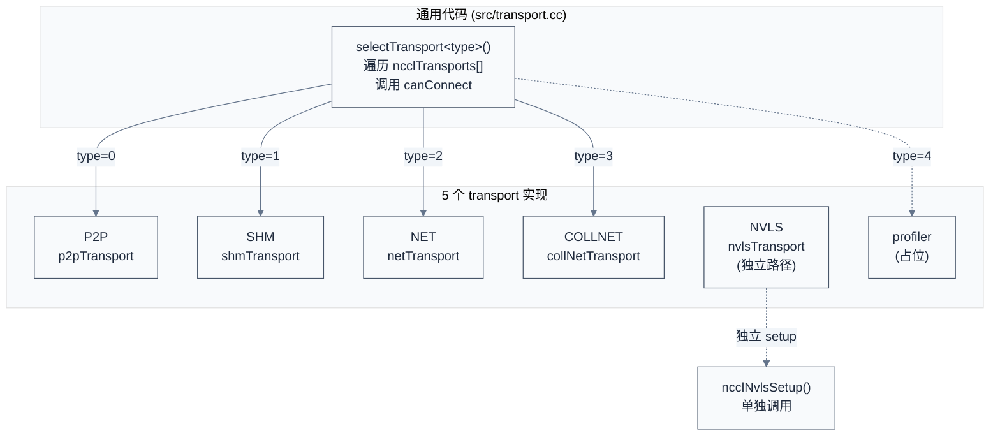
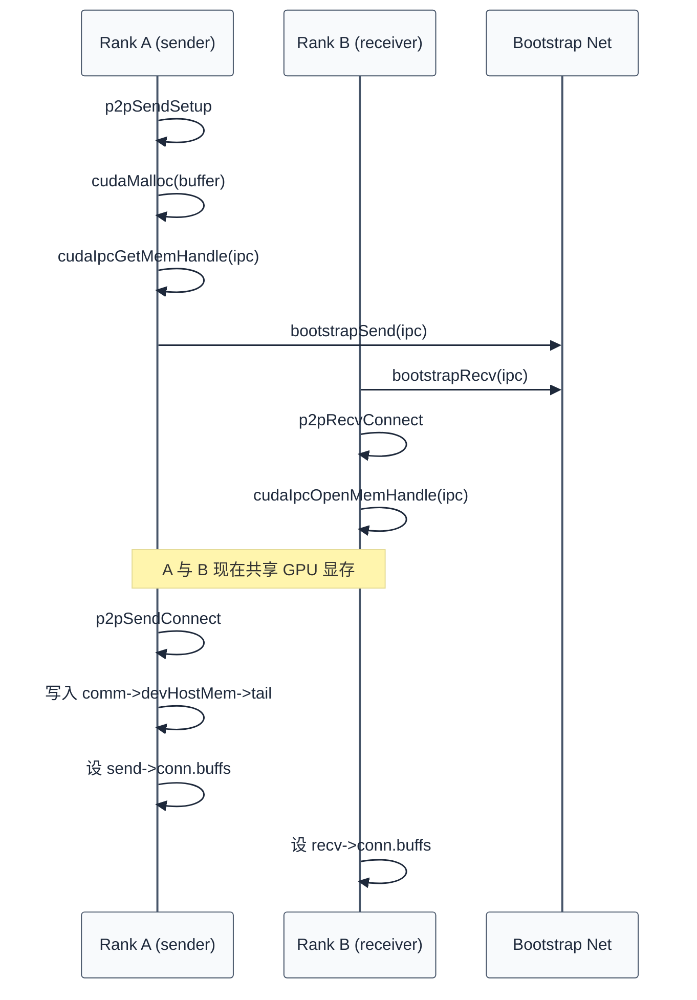
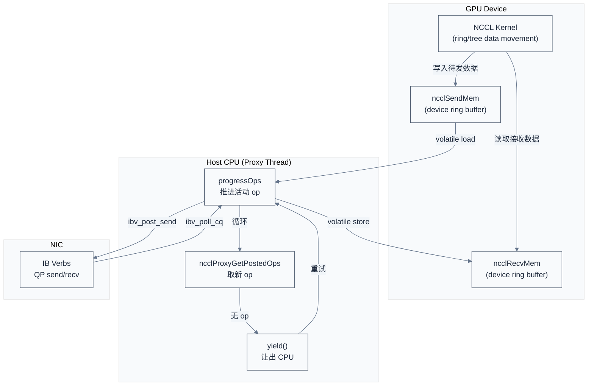
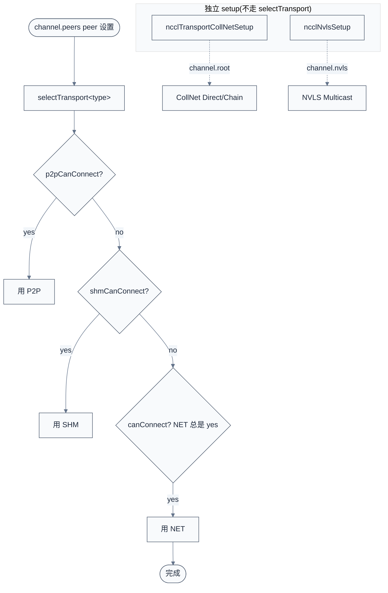

# 传输层(P2P / SHM / NET / COLLNET / NVLS + Proxy)

> 一句话概括:NCCL 用 `ncclTransport` 函数指针表把"通用集合通信逻辑"与"具体硬件传输"解耦,5 个 transport(P2P/SHM/NET/COLLNET/NVLS)各自实现 `canConnect`/`setup`/`connect`/`proxyProgress` 等回调;选择路径分为两类——P2P/SHM/NET 走 `selectTransport` 顺序优先级协商(优先 P2P → SHM → NET),COLLNET/NVLS 走独立 setup 路径(因为它们不是端到端 transport,而是"硬件归约网络")。
> **工程师视角**:理解 transport 选择机制后,看 `NCCL_DEBUG=INFO` 日志中的 `Channel 00 : 0[0] -> 1[1] via P2P/4` 这一行就能立刻判断 NCCL 选了哪条路径、为什么没选 NVLink、为什么跨节点走 IB 而不是 RoCE。

### 关键术语

| 缩写 | 全称 | 含义 |
|------|------|------|
| Transport | — | NCCL 抽象的传输后端,5 种实现 |
| P2P | Peer-to-Peer | GPU 间直接访问(NVLink/PCIe) |
| SHM | Shared Memory | 同节点进程间共享内存 |
| NET | Network | 跨节点网络(IB / Socket / 第三方) |
| COLLNET | Collective Network | NVSwitch SHARP 硬件归约网络 |
| NVLS | NVLink SHARP | 基于 NVSwitch 的 NVLink 归约(SHARP) |
| Proxy | — | host 侧 CPU 线程,推进网络进度 |
| GDR | GPUDirect RDMA | NIC 直接访问 GPU 显存 |
| IPC | Inter-Process Communication | 进程间通信(CUDA IPC handle) |
| canConnect | — | transport 自述能否用于某 peer pair 的回调 |
| setup/connect | — | transport 建立连接的两阶段回调 |
| proxyProgress | — | transport 在 proxy 线程中推进 IO 的回调 |
| connector | — | channel 中绑定的 transport 上下文(`ncclConnector`) |
| DMABUF | DMA-BUF | Linux 内核共享缓冲区机制(GDR 替代方案) |
| CE | Copy Engine | CUDA 设备的拷贝引擎 |

**前置阅读**:
- [05-NCCL 源码架构](./05-source-architecture.md) — `ncclTransport` 在四层架构中的位置
- [06-Bootstrap 与拓扑探测](./06-bootstrap-and-topology.md) — 11 种 PATH 类型与拓扑系统
- [07-Graph 构建与 Channel 调度](./07-graph-and-scheduling.md) — Channel 与 transport 的绑定

**下一篇**:[09-Device Kernel 与 CollNet](./09-device-kernels-and-collnet.md)

---

## 1. Transport 抽象:函数指针表设计

> 上一章讲了 graph 与 channel 调度——每个 channel 绑定一个 ring 或 tree,但没回答一个关键问题:channel 内部的数据到底怎么传?是走 NVLink 还是 PCIe?走 IB 还是 Socket?本章用 `ncclTransport` 抽象回答这个问题——先讲 5 个 transport 的统一接口,再逐个分析实现,最后讲 host 侧 proxy thread 如何驱动它们。

### 1.1 本质:transport 是"通用代码 × 平台实现"的契约

NCCL 的 transport 抽象与 ARM TF-A 的 `plat_psci_ops_t` 是同构设计——通用代码定义"做什么",平台代码实现"怎么做"。区别在于:TF-A 用一份 `plat_psci_ops_t` 描述整个 SoC 的电源管理能力,而 NCCL 用 5 份 `ncclTransport` 描述不同硬件路径(NVLink / PCIe / SHM / IB / NVSwitch SHARP)。

`src/include/transport.h` 定义了两个核心结构体:

```c
/* 摘自 [src/include/transport.h](./src/nccl-src/src/include/transport.h) L117-142 */

/* 每个 transport 的 send 或 recv 方向的回调集合 */
struct ncclTransportComm {
  ncclResult_t (*setup)(struct ncclComm* comm, struct ncclTopoGraph* graph,
                        struct ncclPeerInfo*, struct ncclPeerInfo*,
                        struct ncclConnect*, struct ncclConnector*,
                        int channelId, int connIndex);
  ncclResult_t (*connect)(struct ncclComm* comm, struct ncclConnect*,
                          int nranks, int rank, struct ncclConnector*);
  ncclResult_t (*free)(struct ncclComm* comm, struct ncclConnector*);
  ncclResult_t (*proxySharedInit)(struct ncclProxyConnection* connection,
                                  struct ncclProxyState* proxyState, int nChannels);
  ncclResult_t (*proxySetup)(struct ncclProxyConnection* connection, /* ... */);
  ncclResult_t (*proxyConnect)(struct ncclProxyConnection* connection, /* ... */);
  ncclResult_t (*proxyFree)(struct ncclProxyConnection* connection, /* ... */);
  ncclResult_t (*proxyProgress)(struct ncclProxyState* proxyState, struct ncclProxyArgs*);
  ncclResult_t (*proxyRegister)(struct ncclProxyConnection* connection, /* ... */);
  ncclResult_t (*proxyDeregister)(struct ncclProxyConnection* connection, /* ... */);
};

/* transport 主体:name + canConnect + send/recv 回调集 */
struct ncclTransport {
  const char name[8];
  ncclResult_t (*canConnect)(int*, struct ncclComm* comm, struct ncclTopoGraph* graph,
                             struct ncclPeerInfo*, struct ncclPeerInfo*);
  struct ncclTransportComm send;
  struct ncclTransportComm recv;
};
```

解释:这段代码体现了"通用 × 平台分离"的设计——`ncclTransportComm` 列出 9 个回调,覆盖连接生命周期(`setup`→`connect`→`free`)与代理进度(`proxySharedInit`/`proxySetup`/`proxyConnect`/`proxyFree`/`proxyProgress`/`proxyRegister`/`proxyDeregister`)。`canConnect` 是 transport 自述能力的回调——通用代码不判断"NVLink 是否可用",而是问 P2P transport:"你能连这两个 rank 吗?"

### 1.2 5 个 transport 的注册表

`src/transport.cc` 用一个全局数组注册所有 transport:

```c
/* 摘自 [src/transport.cc](./src/nccl-src/src/transport.cc) L15-22 */

#define NTRANSPORTS 4
#define TRANSPORT_P2P 0
#define TRANSPORT_SHM 1
#define TRANSPORT_NET 2
#define TRANSPORT_COLLNET 3
#define TRANSPORT_PROFILER 4  /* 仅用于 profiler ops 轮询,不参与实际传输 */

struct ncclTransport* ncclTransports[NTRANSPORTS + 1] = {
  &p2pTransport, &shmTransport, &netTransport, &collNetTransport,
  &profilerTransport
};
```

注意:`nvlsTransport` 没有进入 `ncclTransports[]` 数组——它走独立路径(见 §6)。profiler transport 是个"占位"实现,只为 proxy ops 轮询 profiler counter,不传输数据。

### 1.3 Transport 抽象可视化



> **如何读这张图**:`selectTransport<type>()` 是核心调度器,按 0→1→2→3 顺序遍历 `ncclTransports[]`,第一个返回 `canConnect=1` 的 transport 胜出。`nvlsTransport` 不进入这个数组,通过 `ncclNvlsSetup()` 在 communicator 初始化时单独设置——因为 NVLS 是"硬件归约网络",不是端到端传输。

### 1.4 与 TF-A `plat_psci_ops_t` 的对照

| 维度 | NCCL `ncclTransport` | TF-A `plat_psci_ops_t` |
|------|----------------------|------------------------|
| 抽象层级 | host 侧传输层 | ARM EL3 PSCI 服务 |
| 回调数量 | 9 个(setup/connect/free/proxyProgress/...) | ~12 个(cpu_on/suspend/system_off/...) |
| 平台数量 | 5 个(P2P/SHM/NET/COLLNET/NVLS) | 每个 SoC 一份 |
| 选择机制 | `canConnect` 协商 + 优先级遍历 | 链接器绑定(编译时) |
| 调用方向 | 通用代码 → 平台代码 | 通用 PSCI 库 → 平台代码 |

> **核心要点**:`ncclTransport` 是"通用集合算法 × 平台硬件"的解耦点——集合通信的 ring/tree 算法只关心"把数据从 A 搬到 B",不关心 B 是同节点的另一 GPU、同节点的另一进程、还是另一节点的 GPU。Transport 抽象把这个差异封装在 9 个回调里。

---

## 2. P2P Transport:GPU 间直接访问

> 上节建立了 transport 抽象,5 个实现里 P2P 是最常用、最性能最优的同节点 GPU 通信路径。本节回答:P2P transport 如何判断两个 GPU 能否 P2P?为什么 NCCL 默认走 NVLink 而不是 PCIe?如何强制走 PCIe?

### 2.1 P2P 的本质与适用场景

P2P(Peer-to-Peer)指两个 GPU 不经主存直接互访显存,通过 NVLink(高带宽)或 PCIe(低带宽)完成。NCCL P2P transport 复用 CUDA 的 P2P API(`cudaDeviceCanAccessPeer` / `cudaDeviceEnablePeerAccess` / `cudaIpcGetMemHandle`)。

P2P 的 `canConnect` 完成三步检查,任何一步失败则让位给 SHM:

```c
/* 摘自 [src/transport/p2p.cc](./src/nccl-src/src/transport/p2p.cc) L130-150 */

ncclResult_t p2pCanConnect(int* ret, struct ncclComm* comm,
                           struct ncclTopoGraph* graph,
                           struct ncclPeerInfo* info1,
                           struct ncclPeerInfo* info2) {
  initCeOperation();
  /* 第 1 步:拓扑 PATH 检查(由 06 章 PATH 类型决定) */
  int intermediateRank;
  NCCLCHECK(ncclTopoCheckP2p(comm, comm->topo, info1->rank, info2->rank,
                             ret, NULL, &intermediateRank, NULL));
  if (*ret == 0) return ncclSuccess;
  if (intermediateRank != -1) {
    if (useMemcpy) *ret = 0;  /* CE memcpy 模式不允许经中间 rank */
    return ncclSuccess;
  }
  /* 第 2 步:NET 是否更优 */
  int useNet = 0;
  NCCLCHECK(ncclTopoCheckNet(comm->topo, info1->rank, info2->rank, &useNet));
  if (useNet) { *ret = 0; return ncclSuccess; }
  /* 第 3 步:同 host + CUDA P2P API + IPC handle 测试,见下文 */
  /* ... 省略第 3 步:见 p2p.cc L156-209 ... */
}
```

解释:这段代码体现了"P2P 选择的三层判定"——拓扑层(PATH 类型,见 06 章 §4)优先,然后检查"NET 是否更优"(跨 PCIe bridge 时 P2P 反而不如走 NET),最后才到 CUDA API。`intermediateRank != -1` 表示需要经中间 GPU 中转——此时只在非 CE memcpy 模式下允许。

### 2.2 第 3 步:CUDA P2P API 与 IPC handle

第 3 步细分为三小步(见 `p2p.cc` L156-209):

1. **同 host 检查**:`info1->hostHash == info2->hostHash`?不同 host 不能 P2P(走 NET)
2. **CUDA P2P 查询**:`cudaDeviceCanAccessPeer(&p2p, cudaDev1, cudaDev2)`,CUDA 驱动根据硬件能力返回
3. **IPC handle 测试**(legacy 模式):分配一个小 buffer,`cudaIpcGetMemHandle` 取 IPC handle,失败则 P2P 不可用

第 3 小步是 WSL(Windows Subsystem for Linux)兼容性检查——WSL 早期版本不支持 CUDA IPC,NCCL 检测到后自动 fallback 到 SHM。

### 2.3 NVLink vs PCIe 路径选择

P2P transport 不直接决定走 NVLink 还是 PCIe——这个决策由 **06 章的 PATH 类型**完成。`ncclTopoCheckP2p` 根据 `NCCL_P2P_LEVEL`(默认 `PIX`)返回:

| PATH 类型 | 含义 | 是否允许 P2P |
|-----------|------|--------------|
| `LOC` | 同 GPU | N/A(自己) |
| `NVL` | NVLink 直连 | ✓ |
| `NVB` | NVSwitch 多跳 | ✓ |
| `C2C` | NVLink-C2C(Grace-Hopper) | ✓ |
| `PIX` | 同 PCIe switch 下 | ✓(默认下限) |
| `PXB` | 跨 PCIe switch,同 PCI bridge | ✓ |
| `P2C` | GPU→PCIe bridge→CPU | 需 `NCCL_P2P_LEVEL=P2C` |
| `PHB` | 跨 NUMA 节点 | 默认禁止 |
| `SYS` | 跨 CPU socket | 默认禁止 |
| `NET` | 跨节点 | 不能 P2P |

`NCCL_P2P_LEVEL=PXB` 意味着 PATH ≤ PXB(PIX/PXB)的 peer 对允许 P2P;设为 `PHB` 则扩展到跨 NUMA。设为 `LOC` 则禁用 P2P。

### 2.4 关键环境变量

| 环境变量 | 默认值 | 含义 |
|----------|--------|------|
| `NCCL_P2P_LEVEL` | `PIX` | P2P 允许的最远 PATH |
| `NCCL_P2P_DISABLE` | `0` | 全局禁用 P2P(fallback 到 SHM) |
| `NCCL_P2P_READ_ENABLE` | `-2`(auto) | 是否允许 P2P read(read 比 write 慢) |
| `NCCL_P2P_DIRECT_DISABLE` | `0` | 禁用直接 P2P,走 proxy 中转 |
| `NCCL_P2P_USE_CUDA_MEMCPY` | `0` | 用 CE(Copy Engine)做 P2P 而非 SM |
| `NCCL_P2P_NET_CHUNKSIZE` | 128 KB | P2P+NET 混合路径的 chunk |
| `NCCL_P2P_PCI_CHUNKSIZE` | 128 KB | PCIe P2P chunk |
| `NCCL_P2P_NVL_CHUNKSIZE` | 512 KB | NVLink P2P chunk(更大,因带宽高) |

> **如何读这张表**:chunk 大小影响单步传输量——NVLink 带宽高,chunk 设 512 KB 才能饱和;PCIe 带宽低,128 KB 足够。`P2P_USE_CUDA_MEMCPY=1` 让 NCCL 用 CUDA Copy Engine 异步拷贝,而不是用 SM kernel——CE 与 SM 可并行,适合"compute + comm overlap"场景。

### 2.5 P2P setup 时序

P2P setup 在两个 rank 上对称执行——A 调 `sendSetup` 生成 IPC handle,B 调 `recvSetup` 接收 handle,通过 bootstrap 网络交换。



> **核心要点**:P2P transport 不是"重新发明 GPU 间通信",而是"用 CUDA P2P API + IPC handle 实现 ring buffer 共享"。Sender 把 device buffer 的 IPC handle 通过 bootstrap 网络传给 receiver,receiver 打开后两边的 GPU 显存互相可见——后续 device kernel 直接读写 peer 显存,无需 host 介入。

---

## 3. SHM Transport:同节点进程间共享内存

> P2P 要求两个 rank 在同一 CUDA 进程或同 host 不同进程但能 IPC——如果同一 host 不同进程且 P2P 不可用(如容器隔离 IPC),就走 SHM。本节解释 SHM 何时被选中、与 P2P 的差异。

### 3.1 SHM 的 canConnect 判定

SHM 的 `canConnect` 条件最简单:

```c
/* 摘自 [src/transport/shm.cc](./src/nccl-src/src/transport/shm.cc) L60-83 */

NCCL_PARAM(ShmDisable, "SHM_DISABLE", 0);
NCCL_PARAM(ShmLocality, "SHM_LOCALITY", SHM_RECV_SIDE);  /* 1=sender 2=receiver */

static ncclResult_t shmCanConnect(int* ret, struct ncclComm* comm,
                                  struct ncclTopoGraph* graph,
                                  struct ncclPeerInfo* info1,
                                  struct ncclPeerInfo* info2) {
  *ret = 0;
  initShmLocality();
  if (ncclParamShmDisable() == 1) return ncclSuccess;
  /* 1. NET 是否更优 */
  int useNet = 0;
  NCCLCHECK(ncclTopoCheckNet(comm->topo, info1->rank, info2->rank, &useNet));
  if (useNet) return ncclSuccess;
  /* 2. 同 host? */
  if (info1->hostHash != info2->hostHash) return ncclSuccess;
  /* 3. 同 /dev/shm 设备?(容器场景关键) */
  if (info1->shmDev != info2->shmDev) return ncclSuccess;
  *ret = 1;
  return ncclSuccess;
}
```

解释:三个条件——`NCCL_SHM_DISABLE=0`、同 host(`hostHash` 一致)、同 `/dev/shm` 设备(`shmDev` 一致)。第三个条件是容器场景的关键:Docker 默认每容器独立 `/dev/shm`,两个容器即使同 host 也不能 SHM;必须用 `--ipc=host` 或 `--shm-size` 共享才能用 SHM。

### 3.2 SHM 的 ring buffer 布局

SHM 把 `ncclSendMem` 与 `ncclRecvMem` 结构放在共享内存中,两个进程通过它交换数据。`shmSendSetup` 调 `ncclProxyConnect` 让 proxy 线程分配:

```c
/* 摘自 [src/transport/shm.cc](./src/nccl-src/src/transport/shm.cc) L88-119 (简化) */

static ncclResult_t shmSendSetup(struct ncclComm* comm, /* ... */ ) {
  struct shmSendResources* resources;
  struct shmConnectInfo* info = (struct shmConnectInfo*)connectInfo;
  size_t shmSize = sizeof(struct ncclSendMem);

  NCCLCHECK(ncclCalloc(&resources, 1));
  send->transportResources = resources;
  /* SHM_LOCALITY=1 (sender) 时,buffer 分配在 sender 侧 */
  if (shmLocality == SHM_SEND_SIDE) {
    for (int p = 0; p < NCCL_NUM_PROTOCOLS; p++) shmSize += comm->buffSizes[p];
  }
  req.size = shmSize;
  /* 通过 proxy 调用 shmSendProxySetup 在共享内存分配 */
  NCCLCHECK(ncclProxyConnect(comm, TRANSPORT_SHM, 1, myInfo->rank, &send->proxyConn));
  NCCLCHECK(ncclProxyCallBlocking(comm, &send->proxyConn, ncclProxyMsgSetup,
                                  (void*)&req, sizeof(struct shmRequest),
                                  (void*)info, sizeof(struct shmConnectInfo)));
  resources->hostMem = (struct ncclSendMem*)info->buf.hptr;
  resources->devHostMem = (struct ncclSendMem*)info->buf.dptr;
  return ncclSuccess;
}
```

解释:`NCCL_SHM_LOCALITY` 控制 buffer 分配侧——`1` 在 sender 侧,`2` 在 receiver 侧。`SHM_RECV_SIDE`(默认)更优,因为 sender 写入时由 receiver 拷贝到本地 GPU,避免 sender 跨 PCIe 读。

### 3.3 关键环境变量与容器场景

| 环境变量 | 默认值 | 含义 |
|----------|--------|------|
| `NCCL_SHM_DISABLE` | `0` | 禁用 SHM(强制走 NET) |
| `NCCL_SHM_LOCALITY` | `2`(receiver) | buffer 分配侧 |
| `NCCL_SHM_DISABLE_1CYCLE_CACHE` | `0` | 禁用单 cycle cache |

容器排查:Docker 中若 `NCCL_DEBUG=INFO` 显示同 host 但走 NET 而非 SHM,检查:
1. 容器是否 `--ipc=host` 或 `--shm-size` 足够
2. `ncclPeerInfo.shmDev` 是否一致(可在 `NCCL_DEBUG=INFO` 日志中看到)

> **核心要点**:SHM 是"同 host 但 P2P 不可用"的 fallback——典型场景是容器内多进程(每进程一 GPU)且未启用 CUDA P2P。SHM 的瓶颈是 host CPU 内存带宽(双拷贝:host→GPU),性能远低于 P2P NVLink。

---

## 4. NET Transport:跨节点网络

> 同节点用 P2P 或 SHM,跨节点必须走 NET。NET 是 NCCL 最复杂的 transport——支持 IB、Socket、第三方插件三种后端,涉及 GPUDirect RDMA、DMA-BUF、resiliency 等多个子系统。本节先讲 NET 的总体结构,再聚焦 IB 后端与 GDR。

### 4.1 NET 的 canConnect:兜底设计

NET 的 `canConnect` 最简单——默认 `*ret=1`,只在同 host 时检查是否被 `NCCL_NET_DISABLE_INTRA` 禁用:

```c
/* 摘自 [src/transport/net.cc](./src/nccl-src/src/transport/net.cc) L161-169 */

static ncclResult_t canConnect(int* ret, struct ncclComm* comm,
                               struct ncclTopoGraph* graph,
                               struct ncclPeerInfo* info1,
                               struct ncclPeerInfo* info2) {
  *ret = 1;
  if (info1->hostHash == info2->hostHash) {
    /* 同 host 时检查 intra-node net 是否禁用 */
    NCCLCHECK(ncclTopoCheckNet(comm->topo, info1->rank, info2->rank, ret));
  }
  return ncclSuccess;
}
```

解释:NET 是"兜底"——只要 P2P 和 SHM 都拒绝,就一定走 NET。`NCCL_NET_DISABLE_INTRA=1` 强制同 host 也走 P2P/SHM,不通过网络回环。

### 4.2 插件式网络后端

NET transport 不直接实现网络 IO,而是通过 `ncclNet` 插件接口委托给具体后端:

| 后端 | 文件 | 适用场景 |
|------|------|----------|
| IB(InfiniBand) | `src/transport/net_ib/` | 生产环境首选 |
| Socket | `src/transport/net_socket.cc` | 无 IB 网卡的测试环境 |
| 第三方插件 | `NCCL_NET_PLUGIN` 环境变量 | AWS EFA、RoCE v2 自定义实现 |

`net_ib/` 子目录下 15 个文件分工明确:

| 文件 | 职责 |
|------|------|
| `init.cc` | IB 设备探测、verbs context 创建 |
| `connect.cc` | IB QP 建链 |
| `common.cc` | 共享工具函数 |
| `reg.cc` | MR(Memory Region)注册 |
| `gdr.cc` | GPUDirect RDMA 支持 |
| `gin.cc` | GIN(Gather-Reduce-Scatter Network) |
| `p2p.cc` | IB P2P(rdma_cm) |
| `p2p_resiliency.cc` | 链路故障恢复 |
| `gdaki/` | GDR + IB kernel module interface |

### 4.3 GPUDirect RDMA(GDR):NIC 直接访问 GPU 显存

不经 GDR 时,跨节点通信路径是:

```
Sender GPU 显存 → 主存(NIC 读) → NIC → 网络 → NIC → 主存 → Receiver GPU 显存
```

经 GDR 时:

```
Sender GPU 显存 → NIC(PCIe P2P) → 网络 → NIC → Receiver GPU 显存(PCIe P2P)
```

少了两次主存拷贝,延迟降低 ~30%、CPU 占用降低 90%+。

NCCL 用 `ncclTopoCheckGdr` 返回三态:

```c
/* 摘自 [src/include/graph.h](./src/nccl-src/src/include/graph.h) L42-53 (简化) */
enum ncclTopoGdrMode {
  ncclTopoGdrModeNone,  /* 不支持 GDR */
  ncclTopoGdrModePci,   /* GDR via PCIe(NIC 与 GPU 同 PCIe switch) */
  ncclTopoGdrModeC2c    /* GDR via C2C(Grace-Hopper 集成 NIC) */
};
```

### 4.4 关键环境变量

| 环境变量 | 默认值 | 含义 |
|----------|--------|------|
| `NCCL_NET` | 内置 IB/Socket | 第三方插件名 |
| `NCCL_NET_PLUGIN` | — | 插件 .so 路径 |
| `NCCL_IB_HCA` | — | 指定 IB 设备名 |
| `NCCL_IB_DISABLE` | `0` | 禁用 IB |
| `NCCL_NET_GDR_READ` | `-2`(auto) | 允许 GDR read(需 `nvidia-peermem` 模块) |
| `NCCL_NET_GDR_C2C` | `1` | 启用 C2C GDR(Grace-Hopper) |
| `NCCL_NET_FORCE_FLUSH` | `0` | 强制 GDR flush(PCIe bridge bug workaround) |
| `NCCL_NET_DISABLE_INTRA` | `0` | 禁用同节点 NET |
| `NCCL_NET_SHARED_BUFFERS` | `-2`(auto) | 共享 NIC buffer(多 comm 复用) |
| `NCCL_NET_SHARED_COMMS` | `1` | 共享 NIC comm 对象 |
| `NCCL_GDRCOPY_ENABLE` | `0` | 启用 gdrcopy(小消息用 GDR 拷贝) |
| `NCCL_GDRCOPY_SYNC_ENABLE` | `1` | gdrcopy 同步 |
| `NCCL_GDRCOPY_FLUSH_ENABLE` | `0` | gdrcopy flush |
| `NCCL_DMABUF_ENABLE` | `1` | DMA-BUF 替代 GDR(Linux 6.x+) |

### 4.5 DMA-BUF:GDR 的现代替代

Linux 6.x 引入 `dma-buf` 通用 buffer 共享机制,NCCL 2.19+ 用它替代 GDR:

- **GDR**:`nvidia-peermem` 内核模块,只能用于 NVIDIA GPU
- **DMA-BUF**:Linux 内核原生支持,任何符合 dma-buf 接口的设备都能用

`NCCL_DMABUF_ENABLE=1`(默认开启)自动优先使用 DMA-BUF,fallback 到 GDR。

> **核心要点**:NET transport 是"插件化"设计——NCCL 通用代码不直接调用 IB verbs,而是通过 `ncclNet` 接口委托。这让 NCCL 能支持任意网络硬件(AWS EFA、RoCE v2、Slingshot),只需实现插件接口即可。GDR/DMA-BUF 是跨节点性能的关键——不经它们,8 GPU 跨节点带宽会从 200 GB/s 跌到 50 GB/s。

---

## 5. COLLNET Transport:NVSwitch 硬件归约

> P2P/SHM/NET 是端到端 transport——A 把数据发给 B。但 CollNet 不是——它是"硬件归约网络",多个 rank 同时发给 NVSwitch,由 NVSwitch 在硬件上做归约后返回结果。这种"不是端到端"的特性决定了 CollNet 不能走 `selectTransport`,必须独立 setup。

### 5.1 canConnect 永远返回 0

```c
/* 摘自 [src/transport/coll_net.cc](./src/nccl-src/src/transport/coll_net.cc) L144-149 */

static ncclResult_t canConnect(int* ret, struct ncclComm* comm,
                               struct ncclTopoGraph* graph,
                               struct ncclPeerInfo* info1,
                               struct ncclPeerInfo* info2) {
  /* This transport cannot be used for p2p */
  *ret = 0;
  return ncclSuccess;
}
```

解释:CollNet 永远在 `selectTransport` 中失败——它不是 P2P 通信路径,而是"归约网络"。CollNet 通过 `ncclTransportCollNetSetup()` 单独设置(见 `src/transport.cc:373-449`),把 channel 的 root 节点接到 NVSwitch SHARP 上。

### 5.2 Direct vs Chain 模式

CollNet 有两种使用模式:

| 模式 | 拓扑 | 适用场景 | 入口函数 |
|------|------|----------|----------|
| Direct | 所有 rank 直连 NVSwitch,hardware reduce | 节点数少、AllReduce 占主导 | `ncclCollNetDirectBufferSetup` |
| Chain | rank 链式接到 NVSwitch,先 intra-node reduce 再发到 NVSwitch | 节点数多、intra NVLink 充足 | `ncclCollNetChainBufferSetup` |

Direct 模式 latency 最低($O(1)$ 网络往返),但消耗 NVSwitch 带宽多;Chain 模式带宽利用率高,但有 intra-node 归约开销。NCCL 根据 `NCCL_COLLNET_NODE_THRESHOLD`(默认 2)自动选择。

### 5.3 sendSetup 与 recvSetup

CollNet 的 setup 流程涉及"虚拟 rank"——把 NVSwitch 当作第 `nRanks` 个 rank:

```c
/* 摘自 [src/transport/coll_net.cc](./src/nccl-src/src/transport/coll_net.cc) L170-218 (简化) */

static ncclResult_t sendSetup(struct ncclComm* comm, struct ncclTopoGraph* graph,
                              struct ncclPeerInfo* myInfo, struct ncclPeerInfo* peerInfo,
                              struct ncclConnect* connectInfo, struct ncclConnector* send,
                              int channelId, int connIndex) {
  struct setupReq req = {0};
  int proxyRank;
  int64_t netId;
  /* 选择 NIC(netDev),并检查 GDR 支持 */
  NCCLCHECK(ncclTopoGetNetDev(comm, myInfo->rank, graph, channelId, -1, &netId, &req.netDev, &proxyRank));
  NCCLCHECK(ncclTopoCheckGdr(comm->topo, myInfo->rank, netId, 1, &req.useGdr));
  send->conn.flags |= req.useGdr ? NCCL_DIRECT_NIC : 0;
  /* 连接 proxy(注意:用 TRANSPORT_COLLNET 而非 TRANSPORT_NET) */
  send->proxyConn.tpLocalRank = comm->topParentLocalRanks[comm->localRank];
  NCCLCHECK(ncclProxyConnect(comm, TRANSPORT_COLLNET, 1, myInfo->rank, &send->proxyConn));
  ncclAtomicRefCountIncrement(&comm->collNetSharedRes->refCount);
  req.collNet = comm->collNetSharedRes;
  NCCLCHECK(ncclProxyCallBlocking(comm, &send->proxyConn, ncclProxyMsgSetup, &req, sizeof(req), NULL, 0));
  return ncclSuccess;
}
```

解释:CollNet 的 setup 复用 NET 的 NIC 选择逻辑(`ncclTopoGetNetDev` + `ncclTopoCheckGdr`),但 transport 类型是 `TRANSPORT_COLLNET`。这意味着同一个 NIC 物理设备上,可以同时跑普通 NET 通信(端到端)和 CollNet 通信(归约网络)——它们走不同的 proxy connection 与不同的 IB QP。

### 5.4 关键环境变量

| 环境变量 | 默认值 | 含义 |
|----------|--------|------|
| `NCCL_COLLNET_ENABLE` | `NCCL_CONFIG_UNDEF_INT`(auto) | 启用 CollNet |
| `NCCL_COLLNET_NODE_THRESHOLD` | `2` | 启用 CollNet 的最小节点数 |
| `NCCL_IGNORE_COLLNET_MISMATCH` | `0` | 忽略 CollNet 配置不一致 |

> **核心要点**:CollNet 的 `canConnect` 永远返回 0 是设计而非缺陷——它表明"硬件归约网络"与"端到端传输"是两种不同的通信模式。NCCL 通过 `ncclTransportCollNetSetup()` 单独把 channel root 接到 NVSwitch SHARP,把 $O(N)$ 或 $O(\log N)$ 的 ring/tree 步骤压缩到 $O(1)$ 网络往返。

---

## 6. NVLS Transport:NVLink SHARP

> CollNet 走网络(NIC + NVSwitch),NVLS 走 NVLink——本质都是"硬件归约",但 NVLS 用 CUDA Multicast API 在节点内做归约,延迟更低、带宽更高。

### 6.1 与 CollNet 的同构设计

NVLS 的 `canConnect` 与 CollNet 一样永远返回 0:

```c
/* 摘自 [src/transport/nvls.cc](./src/nccl-src/src/transport/nvls.cc) L32-50 */

ncclResult_t nvlsCanConnect(int* ret, struct ncclComm* comm,
                            struct ncclTopoGraph* graph,
                            struct ncclPeerInfo* info1,
                            struct ncclPeerInfo* info2) {
  /* This transport cannot be used for p2p */
  *ret = 0;
  return ncclSuccess;
}

ncclResult_t nvlsSendFree(struct ncclComm* comm, struct ncclConnector* send) {
  return ncclSuccess;
}
ncclResult_t nvlsRecvFree(struct ncclComm* comm, struct ncclConnector* recv) {
  return ncclSuccess;
}

struct ncclTransport nvlsTransport = {"NVLS",
                                      nvlsCanConnect,
                                      {NULL, NULL, nvlsSendFree, NULL, NULL, NULL, NULL, NULL},
                                      {NULL, NULL, nvlsRecvFree, NULL, NULL, NULL, NULL, NULL}};
```

解释:`nvlsTransport` 的注册体大量使用 `NULL`——只有 `canConnect` 与 `free` 被填充,其他 7 个回调都是 NULL。这进一步证明 NVLS 不参与端到端传输:它通过 `ncclNvlsSetup()` 在初始化时单独设置 multicast group,channel 通过 `channel->nvls` 字段直接访问 multicast buffer。

### 6.2 CUDA Multicast API

NVLS 基于 CUDA 12.1+ 的 Multicast API:

```c
/* 摘自 [src/transport/nvls.cc](./src/nccl-src/src/transport/nvls.cc) L52-72 */

ncclResult_t ncclNvlsGroupCreate(struct ncclComm* comm, CUmulticastObjectProp* prop,
                                 int rank, unsigned int nranks,
                                 CUmemGenericAllocationHandle* mcHandle,
                                 char* shareableHandle) {
  CUmemAllocationHandleType type = ncclCuMemHandleType;
  size_t size = prop->size;
  INFO(NCCL_NVLS, "NVLS Creating Multicast group nranks %d size %zu on rank %d", nranks, size, rank);
  CUCHECK(cuMulticastCreate(mcHandle, prop));
  if (type == CU_MEM_HANDLE_TYPE_FABRIC) {
    CUCHECK(cuMemExportToShareableHandle(shareableHandle, *mcHandle, ncclCuMemHandleType, 0));
  } else {
    memcpy(shareableHandle, mcHandle, sizeof(CUmemGenericAllocationHandle));
  }
  INFO(NCCL_NVLS, "NVLS Created Multicast group %llx nranks %d size %zu on rank %d",
       *mcHandle, nranks, size, rank);
  return ncclSuccess;
}
```

解释:`cuMulticastCreate` 在 NVSwitch 上创建一个 multicast group——所有参与的 GPU 都能"读到"同一个 multicast 地址,但物理存储分布在各 GPU 上。一个 write 操作,所有 GPU 同时看到——这是 NVSwitch SHARP 的硬件归约能力。

### 6.3 NVLS 启用条件

`NCCL_NVLS_ENABLE=2`(默认 auto)时,NCCL 检查:

1. CUDA 12.1+ 驱动(`cuMulticastCreate` 函数指针非 NULL)
2. GPU 支持 `CU_DEVICE_ATTRIBUTE_MULTICAST_SUPPORTED`(SM90+ 即 Hopper+)
3. 节点内有 NVSwitch(通过拓扑探测)
4. GPU 数量 ≥ 2

满足时启用 NVLS,否则 fallback 到 ring/tree。

### 6.4 NVLSTree 拓扑

NVLS 用一棵树组织 multicast group:

```c
/* channel->nvls 字段(ncclChannel 结构体,见 05 章) */
struct {
  int treeUp;        /* 父节点 rank */
  int treeDown[NCCL_MAX_NVLS_TREE_ARITY];  /* 子节点 rank 数组 */
} nvls;
```

`NCCL_MAX_NVLS_TREE_ARITY`(默认 4)是 NVLS 树的 fanout。NVLSTree 在 `ncclNvlsTreeConnect` 中通过 `ncclTransportP2pConnect` 建立 P2P 连接(因为 NVLS 树的父子之间仍走 P2P)。

### 6.5 NVLS vs CollNet 对比

| 维度 | NVLS | CollNet |
|------|------|---------|
| 物理网络 | NVSwitch(节点内 NVLink fabric) | IB/Ethernet(跨节点网络) |
| 适用范围 | 节点内归约(SM90+ + NVSwitch) | 跨节点归约(NVSwitch SHARP) |
| API | CUDA Multicast API | IB verbs + SHARP 协议 |
| 启用条件 | `NCCL_NVLS_ENABLE=2`(auto) | `NCCL_COLLNET_ENABLE`(auto)+ `NCCL_COLLNET_NODE_THRESHOLD=2` |
| 典型延迟 | <1 μs(节点内 NVLink) | 几十 μs(跨节点) |
| 典型带宽 | 900 GB/s(H100 NVSwitch) | 50-400 GB/s(IB 200G/400G) |

> **核心要点**:NVLS 与 CollNet 都是"硬件归约网络"——它们不走 `selectTransport`,走独立 setup 路径,因为它们不是"端到端传输"而是"归约网络"。差异在物理介质:NVLS 走节点内 NVSwitch,CollNet 走跨节点 IB。

---

## 7. Proxy Thread:host 侧的网络推进器

> 5 个 transport 的回调中,`proxyProgress` 是最关键的——它在 host 侧 CPU 线程中驱动实际 IO。本节回答:为什么需要 proxy thread?它怎么工作?如何调试?

### 7.1 为什么需要 Proxy Thread

GPU kernel 有个根本限制:**不能发起网络操作**。CUDA kernel 跑在 SM 上,没有 syscall 能力——不能调用 `ibv_post_send`、`socket send`、`cudaMemcpyAsync(host)`。所以跨节点通信必须由 host CPU 推进。

NCCL 的设计是:每个 communicator 启动一个 CPU 线程(`ncclProxyStart`),它负责:

1. 把 GPU kernel 写入的 `ncclSendMem` 中的数据通过 NIC 发出去
2. 把 NIC 收到的数据写入 `ncclRecvMem` 供 GPU kernel 读取
3. 注册/注销 RDMA Memory Region
4. 处理连接建立(transport 的 `proxySetup` / `proxyConnect`)

### 7.2 Proxy 主循环

```c
/* 摘自 [src/proxy.cc](./src/nccl-src/src/proxy.cc) L954-1012 (简化) */

void* ncclProxyProgress(void* proxyState_) {
  struct ncclProxyState* proxyState = (struct ncclProxyState*)proxyState_;
  INFO(NCCL_INIT, "[Proxy Progress] Device %d CPU core %d",
       proxyState->cudaDev, ncclOsGetCpu());
  if (!CUDASUCCESS(cudaSetDevice(proxyState->cudaDev))) {
    WARN("[Proxy Progress] Failed to set CUDA device %d", proxyState->cudaDev);
  }

  struct ncclProxyProgressState* state = &proxyState->progressState;
  state->nextOps = -1;
  const int sig = ncclParamProxyDumpSignal();
  if (sig != -1) signal(sig, ncclDumpProxyState);  /* SIGUSR1 触发 dump */
  ncclLastProxyState = state;

  int lastIdle = 0;
  int proxyOpAppendCounter = 0;
  do {
    int idle = 1;
    /* 1. 推进活动 op */
    ncclResult_t ret = progressOps(proxyState, state, state->active, &idle);
    if (ret != ncclSuccess) {
      COMPILER_ATOMIC_STORE(&proxyState->asyncResult, ret, std::memory_order_release);
      break;
    }
    /* 2. 节流地取新 op(PROGRESS_APPENDOP_FREQ 默认 8) */
    if (idle || !state->active ||
        (++proxyOpAppendCounter == ncclParamProgressAppendOpFreq())) {
      int added = 0;
      proxyOpAppendCounter = 0;
      ret = ncclProxyGetPostedOps(proxyState, &added);
      if (added == 0) {
        std::this_thread::yield();  /* 无 op,让出 CPU */
      }
    }
    lastIdle = idle;
  } while ((state->stop == 0 || (state->stop == 1 && state->active)) &&
           COMPILER_ATOMIC_LOAD(proxyState->abortFlag, std::memory_order_acquire) == 0);
  return NULL;
}
```

解释:这段代码体现了"忙等 + 节流 + 退出协议"三个设计——`progressOps` 推进活动 op,`ncclProxyGetPostedOps` 取新 op,两者交替。`PROGRESS_APPENDOP_FREQ=8` 节流取 op 频率(避免小消息时反复查 queue 反而拖慢);`yield()` 让出 CPU 节能;退出条件是 `stop && !active` 或 `abortFlag`(异常退出)。

### 7.3 Proxy 可视化



> **如何读这张图**:GPU kernel 把要发的数据写入 `ncclSendMem`(device 侧 ring buffer),proxy thread volatile load 读出,通过 `ibv_post_send` 发到 NIC;NIC 收到数据后 proxy 通过 `ibv_poll_cq` 拿到,volatile store 写入 `ncclRecvMem`,GPU kernel volatile load 读出。整条链路是"双 ring buffer + volatile 同步"——无锁,但要求 CPU 与 GPU 严格按顺序推进。

### 7.4 Proxy 调试

| 环境变量 | 默认值 | 含义 |
|----------|--------|------|
| `NCCL_PROXY_CPUSET` | — | 指定 proxy 线程绑定的 CPU 核 |
| `NCCL_IGNORE_CPU_AFFINITY` | `0` | 忽略 CPU 亲和性 |
| `NCCL_PROXY_APPEND_BATCH_SIZE` | `16` | 每次最多 append 的 op 数 |
| `NCCL_PROGRESS_APPENDOP_FREQ` | `8` | appendOps 节流频率 |
| `NCCL_PROXY_DUMP_SIGNAL` | `-1` | 信号号(SIGUSR1=10),触发 proxy state dump |

调试 hang 时:`kill -SIGUSR1 <pid>`,NCCL 把每个 channel 的 op 队列、proxy state 打印到 `NCCL_DEBUG_FILE`。

> **核心要点**:Proxy thread 是 host 侧的"网络推进器"——它弥补 GPU 不能 syscall 的缺陷,把 GPU 写入的 device ring buffer 数据通过 NIC 发出去。`PROGRESS_APPENDOP_FREQ=8` 是关键调优参数——太小则小消息性能回退,太大则大消息延迟增加。

---

## 8. Transport 选择流程对比

> 前面 6 节分别讲了 5 个 transport,本节用一个统一视角对比它们的选择路径——这是排查 "为什么 NCCL 没走 NVLink" 类问题的根本依据。

### 8.1 选择决策树



### 8.2 5 个 transport 总览对比

| 维度 | P2P | SHM | NET | COLLNET | NVLS |
|------|-----|-----|-----|---------|------|
| `canConnect` 返回值 | 拓扑+CUDA API 决定 | 同 host+同 shmDev | 总是 1(兜底) | **永远 0** | **永远 0** |
| 选择路径 | `selectTransport` | `selectTransport` | `selectTransport` | 独立 setup | 独立 setup |
| 适用场景 | 同 host GPU 间 | 同 host 进程间 | 跨节点 | 跨节点硬件归约 | 节点内硬件归约 |
| 物理介质 | NVLink/PCIe | 主存(`/dev/shm`) | IB/Socket | IB + NVSwitch SHARP | NVSwitch(NVLink) |
| 典型带宽(H100) | 900 GB/s(NVLink) | 50 GB/s(主存) | 50-200 GB/s(IB 200G/400G) | 同 NET | 900 GB/s |
| 典型延迟 | 1-2 μs | 5-10 μs | 10-100 μs | 同 NET | <1 μs |
| 关键 fallback | → SHM | → NET | 无(兜底) | → Ring/Tree | → Ring/Tree |

> **如何读这张表**:前 3 个 transport 走 `selectTransport` 顺序优先级,后 2 个走独立 setup。`canConnect` 永远返回 0 的两个 transport 不是"用不了",而是"不参与端到端选择"——它们是另一种通信模式(硬件归约)。

### 8.3 同节点三种路径对比

| 路径 | 经主存? | 经 NIC? | 延迟 | 带宽 | CPU 占用 |
|------|---------|---------|------|------|----------|
| P2P NVLink | 否 | 否 | 1-2 μs | 900 GB/s | 0% |
| P2P PCIe | 否 | 否 | 5-10 μs | 64 GB/s(PCIe Gen5 x16) | 0% |
| SHM | 是(双拷贝) | 否 | 5-10 μs | 50 GB/s | 高(拷贝) |
| NET(loopback) | 是 | 是(回环) | 20-50 μs | 25 GB/s | 高(NIC 协议栈) |

### 8.4 如何从日志判断选了哪个 transport

`NCCL_DEBUG=INFO` 输出类似:

```
NCCL INFO Channel 00 : 0[0] -> 1[1] via P2P/4
NCCL INFO Channel 01 : 0[0] -> 1[1] via P2P/4
NCCL INFO Channel 00 : 0[0] -> 8[8] via NET/IBV/0/GDRDMA
NCCL INFO CollNet 00/0 : 0 [send] via COLLNET/IB/0
NCCL INFO NVLS multicast support is available on dev 0
```

| 日志片段 | 含义 |
|---------|------|
| `via P2P/4` | P2P transport,`/4` 是 PATH 类型(NVL=1, PIX=4) |
| `via NET/IBV/0/GDRDMA` | NET transport,IB 后端,NIC 0,启用了 GDR |
| `via SHM/direct` | SHM transport,`/direct` 表示同进程直接共享 |
| `via COLLNET/IB/0` | CollNet transport,IB NIC 0 |
| `via COLLNET/IB/0/GDRDMA(PCI)` | CollNet + GDR via PCIe(非 C2C) |
| `NVLS multicast support is available` | NVLS 已启用 |

### 8.5 排查 transport 选择问题

| 现象 | 可能原因 | 排查方法 |
|------|----------|----------|
| 同 host GPU 间走 SHM 而非 P2P | P2P 被禁或 CUDA P2P API 失败 | 查 `NCCL_P2P_DISABLE`、`nvidia-smi topo -m` 看 NVLink |
| 同 host GPU 间走 NET loopback | SHM 被禁或 `/dev/shm` 不一致 | 查 `NCCL_SHM_DISABLE`、容器 `--ipc=host` |
| 跨节点走 NET 但带宽低 | 未启用 GDR | 查 `lsmod \| grep peermem`、`NCCL_NET_GDR_READ` |
| CollNet 未启用 | 节点数 < `NCCL_COLLNET_NODE_THRESHOLD` | 设 `NCCL_COLLNET_ENABLE=1` |
| NVLS 未启用 | CUDA < 12.1 或非 SM90+ | 查 `nvidia-smi --query-gpu=compute_cap` |
| 8 GPU 单节点 AllReduce 带宽 < 80% NVLink | channel 数不够或 P2P 路径差 | 调 `NCCL_MAX_NCHANNELS=16`、查 `nvidia-smi topo -m` |

> **核心要点**:NCCL transport 选择不是"黑盒"——`NCCL_DEBUG=INFO` 日志会明确告诉每个 channel 选择了哪个 transport、走哪条 PATH、是否启用 GDR。学会读这行日志是排查 NCCL 性能问题的第一步。两个"canConnect 永远返回 0"的 transport(CollNet/NVLS)不是异常,而是"硬件归约网络"的设计选择——它们不走端到端选择,走独立 setup 路径。

---

## 官方文档索引

| 文档 | 用途 | 建议阅读时机 |
|------|------|--------------|
| [NCCL Operations](https://docs.nvidia.com/deeplearning/nccl/user-guide/docs/overview.html) | NCCL API 总览 | 学完 §1 后 |
| [NCCL Environment Variables](https://docs.nvidia.com/deeplearning/nccl/user-guide/docs/env.html) | transport 相关环境变量 | 学完 §2-§6 后 |
| [NCCL Topology Detection](https://docs.nvidia.com/deeplearning/nccl/user-guide/docs/docs/topo.html) | PATH 类型详解 | 学完 §2 后 |
| [GPUDirect RDMA Documentation](https://docs.nvidia.com/cuda/gpudirect-rdma/) | GDR 原理 | 学完 §4 后 |
| [GPUDirect Storage](https://docs.nvidia.com/gpudirect-storage/) | DMA-BUF 与 GDR 对比 | 学完 §4.5 后 |

## 参考资料

- [NCCL Transport Header (本地源码)](./src/nccl-src/src/include/transport.h) — 参考了 L16-22 NTRANSPORTS 常量、L43-65 ncclPeerInfo 结构、L117-142 ncclTransport/ncclTransportComm 函数指针表
- [NCCL Transport Selection (本地源码)](./src/nccl-src/src/transport.cc) — 参考了 L15-22 ncclTransports[] 注册表、L20-42 selectTransport<>() 模板、L373-449 ncclTransportCollNetSetup 独立 setup 路径
- [NCCL P2P Transport (本地源码)](./src/nccl-src/src/transport/p2p.cc) — 参考了 L104-105 LegacyCudaRegister/P2pUseCudaMemcpy、L130-210 p2pCanConnect 三层判定、L327-328 P2pReadEnable/P2pDirectDisable
- [NCCL SHM Transport (本地源码)](./src/nccl-src/src/transport/shm.cc) — 参考了 L55-56 ShmDisable/ShmLocality、L61-83 shmCanConnect 三条件、L88-119 shmSendSetup 共享内存分配
- [NCCL NET Transport (本地源码)](./src/nccl-src/src/transport/net.cc) — 参考了 L161-169 canConnect 兜底设计、L171-172 NetSharedBuffers/NetSharedComms、L339-341 GdrCopySyncEnable/GdrCopyFlushEnable
- [NCCL COLLNET Transport (本地源码)](./src/nccl-src/src/transport/coll_net.cc) — 参考了 L144-149 canConnect 永远返回 0、L170-218 sendSetup/recvSetup NIC 选择 + GDR 检查
- [NCCL NVLS Transport (本地源码)](./src/nccl-src/src/transport/nvls.cc) — 参考了 L32-50 nvlsTransport 注册(大量 NULL 回调)、L52-72 ncclNvlsGroupCreate CUDA Multicast API、L159-161 NvlsEnable/NvlsChunkSize/NvlsTreeMaxChunkSize
- [NCCL Proxy Thread (本地源码)](./src/nccl-src/src/proxy.cc) — 参考了 L925-926 ProxyDumpSignal/ProgressAppendOpFreq、L954-1012 ncclProxyProgress 主循环
- [NCCL IB Backend (本地源码)](./src/nccl-src/src/transport/net_ib/) — 15 个文件覆盖 IB verbs 集成、GDR、GIN、P2P resiliency
- [NCCL Topology & GDR (本地源码)](./src/nccl-src/src/include/graph.h) — 参考了 L42-53 ncclTopoGdrMode 三态枚举
- [NCCL Environment Variables](https://docs.nvidia.com/deeplearning/nccl/user-guide/docs/env.html) — 参考了 §P2P、§SHM、§Network、§GPUDirect RDMA 相关变量
- [GPUDirect RDMA](https://docs.nvidia.com/cuda/gpudirect-rdma/) — 参考了 GDR 原理与 `nvidia-peermem` 模块
- [CUDA Multicast Programming Guide](https://docs.nvidia.com/cuda/cuda-driver-api/group__CUDA__MEM.html) — 参考了 `cuMulticastCreate`/`cuMemMap`/`cuMemSetAccess` 三步流程
