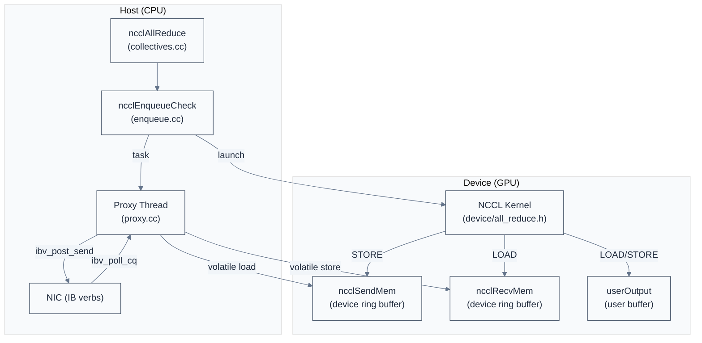
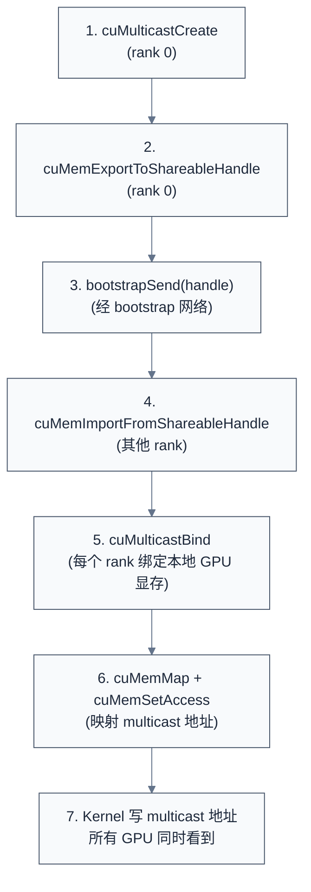

# Device Kernel 与 CollNet/NVLS 硬件归约

> 一句话概括:NCCL 的 device kernel(`src/device/`)是真正在 GPU 上执行 ring/tree data movement 与归约的代码,通过三种协议(Simple/LL/LL128)适配不同消息大小;Hopper+ 引入 persistent kernel 消除 launch 开销;CollNet/NVLS/MNNVL 是三种"硬件归约网络"——把 $O(N)$ 或 $O(\log N)$ 步骤压缩到 $O(1)$ 网络往返。
> **工程师视角**:理解 device kernel 是定位"AllReduce 性能不如预期"问题的关键——大多数性能问题不在 transport 层,而在 protocol 选择、nThreads 配置、chunkSize 调优。学会读 `NCCL_DEBUG=INFO` 日志中的 `Kernel: coll op algo proto nthreads` 行,就能立刻判断当前 kernel 的执行参数。

### 关键术语

| 缩写 | 全称 | 含义 |
|------|------|------|
| Kernel | — | GPU 上执行的函数 |
| Protocol | — | 数据传输协议(Simple/LL/LL128) |
| Simple | — | 大数据协议,无 flag 开销 |
| LL | Low-Latency | 小消息协议,数据+flag 交织 |
| LL128 | Low-Latency 128B | Volta+ 协议,128B line |
| Persistent Kernel | — | Hopper+ 不重新 launch 的 kernel |
| Symmetric Kernel | — | Hopper+ 对称 kernel 优化 |
| TMA | Tensor Memory Accelerator | Hopper 硬件异步内存传输单元 |
| Multicast | — | CUDA 12.1+ 一写多读 API |
| SHARP | Scalable Hierarchical Aggregation and Reduction Protocol | Mellanox/NVIDIA 硬件归约协议 |
| CollNet | Collective Network | NCCL 中 SHARP 的实现 |
| NVLS | NVLink SHARP | NVSwitch 上的 SHARP |
| GIN | Gather-Reduce-Scatter Network | IB SHARP 网络 |
| MNNVL | Multi-Node NVLink | 跨节点 NVLink fabric |
| RMA | Remote Memory Access | 远程内存访问插件 |
| CE | Copy Engine | CUDA 设备的拷贝引擎 |
| SM | Streaming Multiprocessor | GPU 流式多处理器 |
| CTA | Cooperative Thread Array | CUDA thread block(即 SM 上的执行单元) |
| Warp | — | 32 个线程的执行单元 |
| shmem | Shared Memory | CUDA 共享内存 |

**前置阅读**:
- [05-NCCL 源码架构](./05-source-architecture.md) — 四层架构与 `ncclComm` 数据结构
- [08-传输层](./08-transport-layer.md) — Transport 抽象与 5 个实现
- [03-集合通信原语与算法](./03-collective-operations-and-algorithms.md) — Ring/Tree/CollNet 算法

**下一篇**:[10-环境变量与调优](./10-environment-variables-and-tuning.md)

---

## 1. Host 与 Device 的职责划分

> 上一章讲了 host 侧 transport 与 proxy thread,但没回答:GPU 上跑什么代码做数据搬移?本节回答 host 与 device 的职责划分,这是理解 NCCL 执行模型的基础。

### 1.1 本质:GPU 不能 syscall,host 不能跑 SIMD

NCCL 的双处理器模型要求 host 与 device 分工:

| 角色 | host(CPU) | device(GPU) |
|------|----------|-------------|
| 职责 | 调度、网络 IO、连接管理 | 数据搬移、归约计算 |
| 代码位置 | `src/collectives.cc`、`src/enqueue.cc`、`src/proxy.cc`、`src/transport/` | `src/device/*.cuh` |
| 数据结构 | `ncclComm`、`ncclChannel`、`ncclTaskColl` | `ncclKernelComm`、`ncclDevChannel`、`ncclSendMem`、`ncclRecvMem` |
| 同步方式 | pthread + mutex | volatile load/store + memory fence |
| 通信路径 | syscall(IB verbs/socket) | ring buffer(device 侧) |

### 1.2 数据流:API → proxy → kernel → ring buffer



> **如何读这张图**:整个数据流是"双 ring buffer"结构。GPU kernel 把待发数据写入 `ncclSendMem`(device 侧),proxy thread volatile load 读出并通过 NIC 发送;NIC 收到后 proxy volatile store 写入 `ncclRecvMem`,kernel volatile load 读出。整个过程无锁,但要求 CPU 与 GPU 严格按顺序推进——这就是 NCCL `NCCL_STEPS=8` ring buffer 的本质(8 个 step 缓冲,允许 CPU/GPU 错位 8 步)。

---

## 2. 三种协议(Simple / LL / LL128)

> 知道数据流后,自然问:数据怎么放进 ring buffer?小消息和大消息用同一种格式吗?本节讲 NCCL 的三种协议——它们针对不同消息大小与 GPU 架构做了不同优化。

### 2.1 为什么需要三种协议

通信延迟有两部分:**传输延迟**(数据在链路上传)与 **同步延迟**(等对方 ready)。大消息传输延迟占主导,小消息同步延迟占主导。NCCL 用三种协议:

- **Simple**:大消息用,纯数据无 flag,带宽利用率最高
- **LL(Low-Latency)**:小消息用,数据与 flag 交织,降低同步开销但带宽折半
- **LL128**:Volta+ 用,128B line 内数据 + flag,带宽利用率比 LL 高

### 2.2 三个 Protocol 类的定义

```c
/* 摘自 [src/device/primitives.h](./src/nccl-src/src/device/primitives.h) L18-75 (简化) */

/* Simple 协议:每 step 字节数 = buffSizes[NCCL_PROTO_SIMPLE] / NCCL_STEPS */
template <int SlicePerChunk_1, int StepPerSlice_1, int Unroll_1 = COLL_UNROLL,
          int MultimemSrcs_1 = 0, int MultimemDsts_1 = 0>
struct ProtoSimple {
  static constexpr int Id = NCCL_PROTO_SIMPLE;
  static constexpr int SlicePerChunk = SlicePerChunk_1;
  static constexpr int StepPerSlice = StepPerSlice_1;
  static constexpr int Unroll = Unroll_1;
  /* ... 省略 Multimem 字段 ... */
  __device__ static int calcBytePerStep() {
    return ncclShmem.comm.buffSizes[NCCL_PROTO_SIMPLE] / NCCL_STEPS;  /* 全数据 */
  }
  __device__ static int calcBytePerGrain() { return sizeof(uint64_t); }
  static constexpr int MaxGroupWidth = 2;
};

/* LL 协议:每 step 字节数 = buffSizes[NCCL_PROTO_LL] / NCCL_STEPS / 2 (一半数据一半 flag) */
struct ProtoLL {
  static constexpr int Id = NCCL_PROTO_LL;
  __device__ static int calcBytePerStep() {
    return ncclShmem.comm.buffSizes[NCCL_PROTO_LL] / NCCL_STEPS / 2;  /* Half is data */
  }
  __device__ static int calcBytePerGrain() { return sizeof(uint64_t); }
  static constexpr int MaxGroupWidth = 1;
};

/* LL128 协议:128B line,15/16 是数据,1/16 是 flag */
struct ProtoLL128 {
  static constexpr int Id = NCCL_PROTO_LL128;
  __device__ static int calcBytePerStep() {
    return (ncclShmem.comm.buffSizes[NCCL_PROTO_LL128] / NCCL_STEPS)
           * NCCL_LL128_DATAELEMS / NCCL_LL128_LINEELEMS;  /* 15/16 是数据 */
  }
  __device__ static int calcBytePerGrain() {
    return NCCL_LL128_SHMEM_ELEMS_PER_THREAD * NCCL_LL128_DATAELEMS
           * sizeof(uint64_t) / NCCL_LL128_LINEELEMS;
  }
  static constexpr int MaxGroupWidth = 1;
};
```

解释:三个 Proto 类用模板参数(`SlicePerChunk`、`StepPerSlice`、`Unroll`)参数化协议行为,提供统一接口(`calcBytePerStep`、`calcBytePerGrain`)。这让 collective kernel 代码可以"协议无关"——同一份 ring/tree 算法代码,通过模板实例化支持三种协议。

### 2.3 LL128 常量与数值演算

```c
/* 摘自 [src/include/device.h](./src/nccl-src/src/include/device.h) L110-118 */

#define NCCL_LL128_LINESIZE 128                            /* 一行 128 字节 */
#define NCCL_LL128_LINEELEMS (NCCL_LL128_LINESIZE / sizeof(uint64_t))  /* 16 个 uint64 */
#define NCCL_LL128_DATAELEMS (NCCL_LL128_LINEELEMS - 1)   /* 15 个数据 + 1 个 flag */

#define NCCL_LL128_MAX_NTHREADS 640
#define NCCL_LL128_ELEMS_PER_THREAD 120
#define NCCL_LL128_SHMEM_ELEMS_PER_THREAD 8
#define NCCL_LL128_SHMEM_SIZE (NCCL_LL128_SHMEM_ELEMS_PER_THREAD * NCCL_LL128_MAX_NTHREADS)
```

**LL128 协议数据布局演算**(以一行 128 字节为例):

```
| uint64[0] | uint64[1] | uint64[2] | ... | uint64[14] | uint64[15] |
|  data     |  data     |  data     | ... |  data      |  flag      |
|  8 B      |  8 B      |  8 B      | ... |  8 B       |  8 B       |
```

- 一行 128 字节 = 16 个 `uint64`(每个 8 字节)
- 15 个是数据(120 字节),1 个是 flag(8 字节)
- 带宽利用率 = 15/16 = **93.75%**(LL 协议只有 50%)

**LL 协议数据布局**:

```
| uint64[0] | uint64[1] |
|  data     |  flag     |
|  8 B      |  8 B      |
```

- 8 字节 + 8 字节 = 16 字节一行
- 数据占 8 字节,flag 占 8 字节
- 带宽利用率 = 8/16 = **50%**

### 2.4 三种协议对比

| 协议 | 适用消息大小 | 带宽利用率 | GPU 架构要求 | 默认 buffer 大小 | 适用场景 |
|------|-------------|-----------|--------------|-------------------|----------|
| **Simple** | >32 KB | 100% | 任意 | `NCCL_BUFFSIZE`(默认 4 MB) | 大消息带宽最优 |
| **LL** | <16 KB | 50% | 任意 | `NCCL_LL_BUFFSIZE`(默认 1 MB) | 小消息延迟最优 |
| **LL128** | 16 KB-32 KB | 93.75% | Volta+(SM70+) | `NCCL_LL128_BUFFSIZE`(默认 2 MB) | 中等消息平衡选择 |

NCCL 用 `NCCL_THREAD_THRESHOLD` 自动选择协议(基于消息大小 + GPU 算力),也可通过 `NCCL_PROTO` 强制指定。

> **核心要点**:三种协议不是"好坏"关系,而是"消息大小 × GPU 架构"的最优选择。Simple 用 100% 带宽但同步开销大;LL 用 50% 带宽但延迟低;LL128 是 Volta+ 的折中——93.75% 带宽 + 低延迟。Hopper+ 默认优先 LL128。

---

## 3. Kernel 入口与调度

> 知道协议后,看 kernel 如何调度——一个 GPU kernel 怎么处理多 channel、多 collective 操作?本节讲 `ncclKernelMain` 的执行模型。

### 3.1 Kernel 入口模板

```c
/* 摘自 [src/device/common.h](./src/nccl-src/src/device/common.h) L355-433 (简化) */

template <int SpecializedFnId, typename SpecializedRunWorkBatch>
__device__ __forceinline__ void ncclKernelMain(struct ncclDevKernelArgs const* args) {
  int tid = threadIdx.x;
  int tn = blockDim.x;

  /* 1. 把 kernel args 拷到 shmem(避免 thread local stack) */
  if (tid < sizeof(ncclDevKernelArgs) / sizeof(uint32_t)) {
    ((uint32_t*)&ncclShmem.args)[tid] = ((uint32_t*)args)[tid];
  }

  /* 2. block-to-channel 映射:把 blockIdx.x 映射到 channelMask 中第 blockIdx.x 个 set bit */
  if (tid < MAXCHANNELS && (args->channelMask & (1ull << tid))) {
    int n = __popcll(args->channelMask & ((1ull << tid) - 1));
    if (blockIdx.x == n) ncclShmem.channelId = tid;
  }
  __syncthreads();
  if (tid == 0) {
    ncclShmem.aborted = 0;
    ncclShmem.channel.workCounter =
      ((ncclKernelCommAndChannels*)ncclShmem.args.comm)->channels[ncclShmem.channelId].workCounter;
  }

  /* 3. warp 分工加载:warp 0 加载 comm,warp 1 加载 channel,其余加载 work batch */
  switch (tid / WARP_SIZE) {
    case 0:  /* warp 0 */
      copyToShmem16(tid, &ncclShmem.comm, ncclShmem.args.comm, sizeof(ncclKernelComm));
      break;
    case 1:  /* warp 1 */
      copyToShmem16(tid - WARP_SIZE, &ncclShmem.channel,
                    &((ncclKernelCommAndChannels*)ncclShmem.args.comm)->channels[ncclShmem.channelId],
                    sizeof(ncclDevChannel));
      break;
    default:  /* warp 2+ */
      loadWorkBatchToShmem(tid - 2 * WARP_SIZE, tn - 2 * WARP_SIZE, args, /*batchIx=*/blockIdx.x);
      break;
  }
  __syncthreads();

  /* 4. Persistent kernel 主循环 */
  while (ncclShmem.aborted == 0) {
    if (0 <= SpecializedFnId && ncclShmem.funcId == (unsigned)SpecializedFnId) {
      SpecializedRunWorkBatch().run();
    } else {
      ncclDevFuncTable[ncclShmem.funcId]();
    }
    if (ncclShmem.nextBatchIx == -1) break;  /* 没有下一批,退出 */
    int batchIx = ncclShmem.nextBatchIx;
    __syncthreads();
    loadWorkBatchToShmem(tid, tn, args, batchIx);  /* 加载下一批 */
    __syncthreads();
  }
}
```

解释:这段代码体现了 4 个关键设计——(1) `args → shmem` 拷贝避免 thread local stack;(2) `blockIdx.x → channelId` 用 `__popcll` 算 set bit 位置(把 sparse channelMask 映射到 dense blockId);(3) warp 分工让 3 个 warp 并行加载 3 个数据结构,减少加载延迟;(4) `while` 循环支持 persistent kernel——不重新 launch,通过 `loadWorkBatchToShmem` 加载下一批 work。

### 3.2 kernel 专用化宏

```c
/* 摘自 [src/device/common.h](./src/nccl-src/src/device/common.h) L438-445 (简化) */

#define DEFINE_ncclDevKernel(suffix, coll, redop, ty, algo, proto, specializedFnId) \
  __global__ void ncclDevKernel_##suffix(ncclDevKernelArgs4K NCCL_GRID_CONSTANT const args4K) { \
    ncclKernelMain<specializedFnId, RunWorkBatch<coll, ty, redop<ty>, algo, proto>>(&args4K.args); \
  }
```

每个 `(coll, redop, ty, algo, proto)` 组合生成一个专用 kernel,减少分支判断。这是 NCCL 性能的关键——避免 kernel 内 `if (algo == RING)` 这种分支,而是在编译时生成专用 kernel。

### 3.3 block-to-channel 映射演算

假设 `channelMask = 0b10101010`(即 channel 1/3/5/7 被启用):

- `blockIdx.x = 0` → `__popcll(0b10101010 & 0b00000001) = 0` → 找到第 0 个 set bit 是 channel 1
- `blockIdx.x = 1` → `__popcll(0b10101010 & 0b00000111) = 1` → 找到第 1 个 set bit 是 channel 3
- `blockIdx.x = 2` → `__popcll(0b10101010 & 0b00011111) = 2` → 找到第 2 个 set bit 是 channel 5
- `blockIdx.x = 3` → `__popcll(0b10101010 & 0b01111111) = 3` → 找到第 3 个 set bit 是 channel 7

这样 `channelMask` 标识的稀疏 channel 集合被映射到 dense 的 `blockIdx.x`,launch 时只启动需要的 block。

> **核心要点**:NCCL kernel 用 `channelMask + __popcll` 把"启用的 channel 集合"映射到 GPU block,避免启动空 block 浪费 SM 资源。`DEFINE_ncclDevKernel` 宏为每个 (coll, algo, proto) 组合生成专用 kernel,消除运行时分支。

---

## 4. Persistent Kernel

> 上节看到 `while (ncclShmem.aborted == 0)` 循环,这就是 persistent kernel——Hopper+ 引入的关键优化。本节讲为什么需要它、它怎么工作、什么场景下能启用。

### 4.1 为什么需要 Persistent Kernel

普通 CUDA kernel 的工作流是:

1. host 调 `cudaLaunchKernel` 把 work 推到 GPU
2. GPU 调度器把 block 分配到 SM
3. block 执行完毕,资源释放
4. 下一批 work 重复 1-3

每次 launch 都有 ~5-10 μs 开销,对小消息(<16 KB)的延迟影响显著——小消息本身执行只 1-2 μs,但 launch 开销 5-10 μs。

### 4.2 Persistent Kernel 工作流

Persistent kernel 的工作流是:

1. host 启动一次 kernel(只调一次 `cudaLaunchKernel`)
2. kernel 进入 `while` 循环,从 work FIFO 取 work
3. 执行完毕后,检查 nextBatchIx
4. 如果有下一批,加载到 shmem 继续执行;否则退出

```c
/* 摘自 [src/device/common.h](./src/nccl-src/src/device/common.h) L417-431 */

while (ncclShmem.aborted == 0) {
  /* 执行当前 work batch */
  if (0 <= SpecializedFnId && ncclShmem.funcId == (unsigned)SpecializedFnId) {
    SpecializedRunWorkBatch().run();
  } else {
    ncclDevFuncTable[ncclShmem.funcId]();  /* 通用 dispatch 表 */
  }
  if (ncclShmem.nextBatchIx == -1) break;  /* 没有下一批,退出 */
  int batchIx = ncclShmem.nextBatchIx;
  __syncthreads();
  loadWorkBatchToShmem(tid, tn, args, batchIx);  /* 加载下一批 */
  __syncthreads();
}
```

### 4.3 启用条件与调优

| 环境变量 | 默认值 | 含义 |
|----------|--------|------|
| `NCCL_WORK_FIFO_BYTES` | 内部默认 | work FIFO 大小(字节数) |
| `NCCL_WORK_ARGS_BYTES` | `INT64_MAX` | work args 最大字节数 |
| `NCCL_PERSISTENT_KERNEL` | auto(Hopper+) | 启用 persistent kernel |

Hopper+(SM90+)默认启用 persistent kernel。Ampere(SM80)及更早架构默认不启用,因为 shmem 容量不足以容纳 work FIFO。

### 4.4 收益量化

| 消息大小 | 普通 kernel | Persistent kernel | 收益 |
|----------|-------------|-------------------|------|
| 1 KB | 8 μs(launch 5 + 执行 3) | 3 μs(执行) | 60% |
| 16 KB | 15 μs(launch 5 + 执行 10) | 10 μs(执行) | 33% |
| 1 MB | 105 μs(launch 5 + 执行 100) | 100 μs(执行) | 5% |
| 16 MB | 1005 μs(launch 5 + 执行 1000) | 1000 μs(执行) | 0.5% |

> **核心要点**:Persistent kernel 对小消息(1-16 KB)延迟提升 30-60%,对大消息几乎无收益——这是 Hopper+ 在 AI 训练中"allreduce 小张量"场景的关键优化。Work FIFO(`NCCL_WORK_FIFO_BYTES`)决定能"排队"多少个 work,太大占 shmem 太小限制 batch 深度。

---

## 5. Collective Kernels

> Persistent kernel 是执行框架,真正干活的是 collective kernel——每个 collective(AllReduce/AllGather/...)有一个 header 文件,本节讲它们的结构。

### 5.1 文件组织

`src/device/` 顶层有 6 个 collective header:

| 文件 | 集合通信 | 算法支持 |
|------|----------|----------|
| `all_reduce.h` | AllReduce | Ring / Tree / NVLS / CollNet |
| `all_gather.h` | AllGather + AllGatherV | Ring / Tree / CollNet |
| `reduce_scatter.h` | ReduceScatter | Ring / Tree / CollNet |
| `broadcast.h` | Broadcast | Ring / Tree |
| `reduce.h` | Reduce | Ring / Tree |
| `sendrecv.h` | Send / Recv | P2P |

### 5.2 五个基本动作

所有 collective kernel 共用 `Primitives<T>` 模板(`src/device/primitives.h`),组合 5 个基本动作:

| 动作 | 含义 | 实现细节 |
|------|------|----------|
| `LOAD` | 从 userInput 加载到 register | `ld.volatile.global` |
| `STORE` | 从 register 存到 userOutput | `st.volatile.global` |
| `SEND` | 写到 sendConn.buffs[proto] | `st.volatile.global` + advance tail |
| `RECV` | 从 recvConn.buffs[proto] 读 | `ld.volatile.global` + advance head |
| `REDUCE` | 把多个 src 归约到 dst | `applyReduce` + RedFn 模板参数 |

### 5.3 Ring AllReduce 示例

以 Ring AllReduce 为例(伪代码):

```c
/* 简化伪代码,基于 src/device/all_reduce.h 思路 */

template <typename T, typename RedOp, int Proto>
__device__ void AllReduceRingStep(...) {
  /* 1. RECV from prev + REDUCE with local data + SEND to next */
  recvBuff = RECV(prev);
  localData = LOAD(userInput + offset);
  reduced = REDUCE(localData, recvBuff);
  SEND(reduced, next);
  /* 2. 第二阶段:RECV from prev + STORE to userOutput */
  finalData = RECV(prev);
  STORE(userOutput + offset, finalData);
  /* 3. SEND to next(传播结果) */
  SEND(finalData, next);
}
```

实际代码用模板 `Proto` 参数化:`AllReduceRingStep<T, RedOp, ProtoSimple>`、`AllReduceRingStep<T, RedOp, ProtoLL>`、`AllReduceRingStep<T, RedOp, ProtoLL128>` 各生成一个实例,差异仅在 `RECV`/`SEND` 的 buffer 布局与同步方式。

---

## 6. Symmetric Kernel(Hopper+ 优化)

> 上面讲的 collective kernel 是"普通"实现,每次 collective 操作独立。Hopper+ 引入 symmetric kernel——把 AllReduce 拆成 ReduceScatter + AllGather 两个阶段,在同一 kernel 内完成,减少 launch 与中间 buffer。本节讲它的命名约定与设计。

### 6.1 命名约定

`src/device/symmetric/kernel.cuh` 列出 17 个入口:

```c
/* 摘自 [src/device/symmetric/kernel.cuh](./src/nccl-src/src/device/symmetric/kernel.cuh) L13-46 (简化) */

template <template <typename> typename Red, typename T>
__device__ __forceinline__ void ncclSymkRun_AllReduce_AGxLL_R(struct ncclSymkDevWorkArgs const* args);
template <template <typename> typename Red, typename T>
__device__ __forceinline__ void ncclSymkRun_AllReduce_AGxLLMC_R(struct ncclSymkDevWorkArgs const* args);

template <template <typename> typename Red, typename T>
__device__ __forceinline__ void ncclSymkRun_AllReduce_RSxLD_AGxST(struct ncclSymkDevWorkArgs const* args);
template <template <typename> typename Red, typename T>
__device__ __forceinline__ void ncclSymkRun_AllReduce_RSxLDMC_AGxSTMC(struct ncclSymkDevWorkArgs const* args);
template <template <typename> typename Red, typename T>
__device__ __forceinline__ void ncclSymkRun_AllReduce_RSxTmaLD_AGxTmaST(struct ncclSymkDevWorkArgs const* args);

__device__ __forceinline__ void ncclSymkRun_AllGather_LL(struct ncclSymkDevWorkArgs const* args);
__device__ __forceinline__ void ncclSymkRun_AllGather_LLMC(struct ncclSymkDevWorkArgs const* args);
__device__ __forceinline__ void ncclSymkRun_AllGather_ST(struct ncclSymkDevWorkArgs const* args);
__device__ __forceinline__ void ncclSymkRun_AllGather_STMC(struct ncclSymkDevWorkArgs const* args);
__device__ __forceinline__ void ncclSymkRun_AllGather_TmaST(struct ncclSymkDevWorkArgs const* args);
__device__ __forceinline__ void ncclSymkRun_AllGather_TmaSTMC(struct ncclSymkDevWorkArgs const* args);
/* ... 省略 ReduceScatter 入口 ... */
```

命名约定:`<Coll>_<Phase1>x<Load>_<Phase2>x<Store>`:

- `Coll`:`AllReduce` / `AllGather` / `ReduceScatter`
- `Phase1`:`AG`(AllGather)/ `RS`(ReduceScatter)
- `Load`/`Store`:`LL`(Low-Latency)/ `LD`(direct Load)/ `LDMC`(Multicast Load)/ `TmaLD`(TMA Load)
- `ST`(direct Store)/ `STMC`(Multicast Store)/ `TmaST`(TMA Store)
- 后缀 `_R`:Reduce(归约)

### 6.2 典型入口解读

| 入口 | 含义 |
|------|------|
| `AllReduce_AGxLL_R` | AllReduce = AllGather(LL load) + Reduce |
| `AllReduce_RSxLD_AGxST` | AllReduce = ReduceScatter(LD) + AllGather(ST) |
| `AllReduce_RSxLDMC_AGxSTMC` | 同上,但用 Multicast Load/Store(NVLS) |
| `AllReduce_RSxTmaLD_AGxTmaST` | 同上,但用 TMA Load/Store(Hopper TMA 单元) |
| `AllGather_STMC` | AllGather with Multicast Store(NVLS) |
| `AllGather_TmaST` | AllGather with TMA Store(Hopper) |

### 6.3 三种 Load/Store 模式对比

| 模式 | 含义 | GPU 架构要求 | 性能特征 |
|------|------|--------------|----------|
| `LL` | Low-Latency,数据+flag 交织 | 任意 | 小消息延迟最低,带宽 50% |
| `LD`/`ST` | direct Load/Store,volatile 读写 | 任意 | 大消息带宽最高 |
| `LDMC`/`STMC` | Multicast Load/Store,用 CUDA Multicast API | SM90+ + NVSwitch | 多播一次,多个 GPU 同时接收 |
| `TmaLD`/`TmaST` | TMA 单元异步传输 | SM90+(Hopper) | 异步,不阻塞 SM |

### 6.4 与 NVLS 的关系

`LDMC`/`STMC` 直接调用 CUDA Multicast API(`cuMemMulticastWrite` 等),底层是 NVSwitch SHARP。这是 NVLS transport(见 08 章 §6)在 device 侧的对应——transport 层创建 multicast group,kernel 层用 LDMC/STMC 写入。

> **核心要点**:Symmetric kernel 是 Hopper+ 的"两阶段融合"优化——把 AllReduce 拆成 ReduceScatter + AllGather,在同一 kernel 内完成,避免中间结果落盘 + 二次 launch。命名约定 `<Coll>_<Phase>x<Load>_<Phase>x<Store>` 让读者一眼看出该 kernel 用了什么传输模式(NVLS Multicast 还是 TMA)。

---

## 7. CollNet 硬件归约

> 前面讲的 ring/tree 都是 $O(N)$ 或 $O(\log N)$ 步骤——每个 rank 都要参与多步。CollNet 利用 NVSwitch SHARP 把这压缩到 $O(1)$ 网络往返——所有 rank 同时发给 NVSwitch,由 NVSwitch 在硬件上做归约。

### 7.1 GIN 网络

GIN(Gather-Reduce-Scatter Network)是 NVIDIA 在 IB 网络上的 SHARP 实现,由 `src/transport/net_ib/gin.cc` 实现。它把多个 rank 的数据通过 IB 网络发给 SHARP switch,由 switch 在硬件上做归约后返回结果。

### 7.2 三个 CollNet collective

`src/transport/coll_net.cc` 实现了 3 个 collective 操作(对应 SHARP API):

```c
/* 摘自 [src/transport/coll_net.cc](./src/nccl-src/src/transport/coll_net.cc) L815-832 (简化) */

static ncclResult_t collNetIallreduce(struct ncclProxyState* proxyState,
                                      struct sendResources* resources,
                                      struct ncclProxyArgs* args,
                                      struct ncclProxySubArgs* sub, ssize_t nBytes,
                                      ssize_t sendBeg, ssize_t recvBeg,
                                      void** request) {
  void* sendMhandle = resources->sendMhandles[NCCL_PROTO_SIMPLE];
  void* recvMhandle = resources->recvMhandles[NCCL_PROTO_SIMPLE];
  char* region = NCCL_NET_MAP_GET_POINTER(&resources->map, gpu, buffs[NCCL_PROTO_SIMPLE]);
  ssize_t eltSize = ncclTypeSize((ncclDataType_t)args->dtype);
  /* 调用 SHARP API:iallreduce */
  NCCLCHECK(proxyState->ncclCollNet->iallreduce(
    resources->collNetComm, region + sendBeg, region + recvBeg,
    nBytes / eltSize, (ncclDataType_t)args->dtype, (ncclDataType_t)args->redOp,
    sendMhandle, recvMhandle, request));
  return ncclSuccess;
}
```

解释:CollNet 把 collective 委托给 SHARP switch——所有 rank 调用 `iallreduce`,SHARP 在硬件上做归约,返回结果。这是 $O(1)$ 网络往返(理论上),实际有 SHARP 内部流水线延迟但远低于 ring/tree。

3 个 collective 是:

| CollNet API | 对应 NCCL 操作 | 位置 |
|-------------|---------------|------|
| `collNetIallreduce` | AllReduce | `coll_net.cc:815` |
| `collNetIallgather` | AllGather | `coll_net.cc:882` |
| `collNetIreducescatter` | ReduceScatter | `coll_net.cc:951` |

注意:CollNet 不支持 Broadcast / Reduce / SendRecv——这些是 rank-specific 操作,SHARP 归约网络不能加速。

### 7.3 Direct vs Chain 模式

| 模式 | 数据流 | 节点数 | 节点内 NIC 数 | 典型场景 |
|------|--------|--------|---------------|----------|
| **Direct** | rank → NVSwitch → rank | 任意 | 1 | AllReduce 主导,节点数少 |
| **Chain** | rank → intra-node reduce → NVSwitch → intra-node distribute → rank | 多 | 多 | 节点数多,intra NVLink 充足 |

`NCCL_COLLNET_NODE_THRESHOLD=2`(默认)是节点数阈值——超过则启用 CollNet,否则用 ring/tree。

### 7.4 关键环境变量

| 环境变量 | 默认值 | 含义 |
|----------|--------|------|
| `NCCL_COLLNET_ENABLE` | `NCCL_CONFIG_UNDEF_INT`(auto) | 启用 CollNet |
| `NCCL_COLLNET_NODE_THRESHOLD` | `2` | 启用最小节点数 |
| `NCCL_IGNORE_COLLNET_MISMATCH` | `0` | 忽略配置不一致 |

---

## 8. NVLS(NVLink SHARP)

> CollNet 走 IB 网络,延迟几十 μs;NVLS 走节点内 NVSwitch,延迟 <1 μs——本质都是 SHARP,但物理介质不同。

### 8.1 CUDA Multicast API 流程



### 8.2 关键代码:`cuMulticastCreate`

```c
/* 摘自 [src/transport/nvls.cc](./src/nccl-src/src/transport/nvls.cc) L52-72 */

ncclResult_t ncclNvlsGroupCreate(struct ncclComm* comm, CUmulticastObjectProp* prop,
                                 int rank, unsigned int nranks,
                                 CUmemGenericAllocationHandle* mcHandle,
                                 char* shareableHandle) {
  CUmemAllocationHandleType type = ncclCuMemHandleType;
  size_t size = prop->size;
  INFO(NCCL_NVLS, "NVLS Creating Multicast group nranks %d size %zu on rank %d",
       nranks, size, rank);
  CUCHECK(cuMulticastCreate(mcHandle, prop));
  if (type == CU_MEM_HANDLE_TYPE_FABRIC) {
    CUCHECK(cuMemExportToShareableHandle(shareableHandle, *mcHandle,
                                          ncclCuMemHandleType, 0));
  } else {
    memcpy(shareableHandle, mcHandle, sizeof(CUmemGenericAllocationHandle));
  }
  return ncclSuccess;
}
```

解释:`cuMulticastCreate` 在 NVSwitch 上创建 multicast group——一个虚拟地址,所有参与的 GPU 都能"读到"。物理存储分布在各 GPU 显存上,写入时由 NVSwitch 做归约(SHARP)。

### 8.3 NVLSTree 拓扑

NVLS 用一棵树组织 multicast group,通过 `ncclTransportP2pConnect` 建立 P2P 连接(见 08 章 §6.4):

```c
/* 摘自 [src/transport/nvls.cc](./src/nccl-src/src/transport/nvls.cc) L283-296 */

ncclResult_t ncclNvlsTreeConnect(struct ncclComm* comm) {
  ncclResult_t ret = ncclSuccess;
  if (comm && comm->nvlsSupport && comm->nNodes > 1) {
    for (int c = 0; c < comm->nvlsChannels; c++) {
      struct ncclChannel* channel = comm->channels + c;
      /* 建立 treeDown[NCCL_MAX_NVLS_TREE_ARITY] -> treeUp 的 P2P 连接 */
      NCCLCHECKGOTO(ncclTransportP2pConnect(comm, c, NCCL_MAX_NVLS_TREE_ARITY,
                                            channel->nvls.treeDown, 1,
                                            &channel->nvls.treeUp, 0), ret, fail);
      NCCLCHECKGOTO(ncclTransportP2pConnect(comm, c, 1, &channel->nvls.treeUp,
                                            NCCL_MAX_NVLS_TREE_ARITY,
                                            channel->nvls.treeDown, 0), ret, fail);
    }
    NCCLCHECKGOTO(ncclTransportP2pSetup(comm, &comm->graphs[NCCL_ALGO_NVLS], 0),
                  ret, fail);
    INFO(NCCL_INIT, "Connected NVLS tree");
  }
  /* ... 省略错误处理 ... */
}
```

`NCCL_MAX_NVLS_TREE_ARITY`(默认 4)是 NVLS 树的 fanout。注意只在 `comm->nNodes > 1` 时调用——单节点不需要 NVLSTree,直接用 NVLS multicast。

### 8.4 NVLS vs CollNet vs MNNVL 三种硬件归约

| 维度 | NVLS | CollNet | MNNVL |
|------|------|---------|-------|
| 物理介质 | 节点内 NVSwitch | 跨节点 IB | 跨节点 NVLink fabric |
| 启用条件 | SM90+ + NVSwitch + CUDA 12.1+ | NVSwitch SHARP switch | NVLink fabric 硬件 |
| API | CUDA Multicast API | IB SHARP 协议 | CUDA Multicast API(跨节点扩展) |
| 典型延迟 | <1 μs | 20-50 μs | <5 μs |
| 典型带宽 | 900 GB/s(H100 NVSwitch) | 50-200 GB/s(IB 200G) | 900 GB/s(NVLink fabric) |
| 节点范围 | 单节点内 | 跨节点(需 SHARP switch) | 跨节点(需 NVLink fabric) |

> **核心要点**:NVLS / CollNet / MNNVL 是三种"硬件归约网络"实现,共同点是都把 $O(N)$ 或 $O(\log N)$ ring/tree 步骤压缩到 $O(1)$ 网络往返。差异在物理介质:NVLS 走节点内 NVSwitch、CollNet 走跨节点 IB、MNNVL 走跨节点 NVLink fabric。

---

## 9. MNNVL(Multi-Node NVLink)

> NVLS 限于单节点,MNNVL 把 NVSwitch 扩展到跨节点——多个机箱通过 NVLink fabric 互联,逻辑上像一个超大 NVSwitch。

### 9.1 MNNVL 的本质

MNNVL(Multi-Node NVLink)是 NVIDIA NVLink fabric 的跨节点扩展——把多个 DGX/HGX 节点的 NVSwitch 通过 NVLink 互联,形成一个跨节点的 NVSwitch fabric。在 NCCL 视角下,MNNVL 仍用 CUDA Multicast API,但 multicast group 跨节点。

### 9.2 关键环境变量

| 环境变量 | 默认值 | 含义 |
|----------|--------|------|
| `NCCL_MNNVL_ENABLE` | auto(检测 fabric-info) | 启用 MNNVL |
| `NCCL_MNNVL_UUID` | `-1` | 指定 fabric UUID |
| `NCCL_MNNVL_CLIQUE_ID` | `-1` | 指定 clique ID(同 clique 内才能 MNNVL) |
| `NCCL_MNNVL_CROSS_CLIQUE` | `0` | 启用跨 clique 通信 |
| `NCCL_MNNVL_SCATTER_NETS_ENABLE` | `1` | 启用 scatter 多网络 |
| `NCCL_MNNVL_RAIL_PER_HOST` | `0` | 每 host 的 rail 数 |

### 9.3 fabric-info 字段

`ncclPeerInfo` 结构包含 MNNVL 相关字段:

```c
/* 摘自 [src/include/transport.h](./src/nccl-src/src/include/transport.h) L43-65 (简化) */

struct ncclPeerInfo {
  int rank;
  int cudaDev;
  int nvmlDev;
  int gdrSupport;
  uint64_t hostHash;
  uint64_t pidHash;
  dev_t shmDev;
  int64_t busId;
  cudaUUID_t gpuUuid;
  struct ncclComm* comm;
  int cudaCompCap;
  size_t totalGlobalMem;
  /* MNNVL support */
  nvmlGpuFabricInfoV_t fabricInfo;   /* fabric UUID + clique ID */
  int cuMemSupport;                  /* 是否支持 cuMem API */
  int version;
  ncclGinType_t supportedGinType;    /* GIN 类型 */
  bool crossNicSupport;
  bool rmaPluginAvailable;           /* RMA 插件可用 */
  bool cuMemGdrSupport;
  int mloPart;                       /* MLOPart partition index, or -1 */
};
```

解释:`fabricInfo` 是 NVML 提供的 fabric 信息(包含 UUID 与 clique ID),NCCL 用它判断两个 GPU 是否在同一 MNNVL fabric 内。`cuMemSupport` 标识是否能用 CUDA Multicast API(影响 NVLS 与 MNNVL)。`mloPart` 是 MLO(Multi-Instance Logically Offset)分区索引——GPU 分区场景下用。

### 9.4 clique 概念

MNNVL 把节点组织成 clique——同 clique 内的 GPU 共享同一个 NVLink fabric,可以直接 multicast。跨 clique 通信需要中转(NVLink fabric 间通过 LCN 路由):

- `NCCL_MNNVL_CLIQUE_ID` 指定 clique ID
- `NCCL_MNNVL_CROSS_CLIQUE=1` 启用跨 clique(性能较低)

---

## 10. RMA 插件

> 最后一个主题是 RMA(Remote Memory Access)插件——NCCL 的扩展点,允许第三方实现远程内存访问。本节简要介绍。

### 10.1 RMA 插件机制

`ncclPeerInfo.rmaPluginAvailable` 字段标识 RMA 插件是否可用。RMA 插件允许:

- 自定义远程内存访问实现(替代 GDR)
- 第三方 fabric 支持(如 Slingshot、BlueField DPU)
- 自定义归约网络(扩展 CollNet/NVLS)

### 10.2 与 transport 的关系

RMA 插件不是独立的 transport,而是 NET transport 的扩展——通过 `NCCL_NET_PLUGIN` 加载,在 `canConnect` 中检测 `rmaPluginAvailable` 决定是否启用。

---

## 总结:device kernel 性能调优要点

| 调优维度 | 关键环境变量 | 默认值 | 调优方向 |
|----------|-------------|--------|----------|
| 协议选择 | `NCCL_PROTO` | auto | 小消息→LL/LL128,大消息→Simple |
| Kernel 线程数 | `NCCL_NTHREADS` | auto | 大消息→大值(如 512),小消息→小值(如 256) |
| LL128 线程数 | `NCCL_LL128_NTHREADS` | auto | LL128 专用,默认 640 |
| Buffer 大小 | `NCCL_BUFFSIZE` | 4 MB | 大消息→增大,小消息→减小 |
| LL buffer | `NCCL_LL_BUFFSIZE` | 1 MB | LL 协议专用 |
| LL128 buffer | `NCCL_LL128_BUFFSIZE` | 2 MB | LL128 协议专用 |
| Channel 数 | `NCCL_MAX_NCHANNELS` | auto | 多 GPU→增大(如 16) |
| Chunk 大小 | `NCCL_CHUNK_SIZE` | auto | 大消息→增大,小消息→减小 |
| Persistent Kernel | `NCCL_WORK_FIFO_BYTES` | 内部默认 | Hopper+ 启用,小消息受益 |
| NVLS | `NCCL_NVLS_ENABLE` | 2(auto) | H100+ 启用,AllReduce 大幅加速 |

> **核心要点**:device kernel 调优的关键是"匹配消息大小 × GPU 架构 × 拓扑"——不同场景需要不同的 protocol + nThreads + chunkSize 组合。`NCCL_DEBUG=INFO` 日志会输出每次 collective 的 `Kernel: coll AllReduce algo Ring proto Simple nThreads 512 nChannels 16` 行,这是调优的根本依据。

---

## 官方文档索引

| 文档 | 用途 | 建议阅读时机 |
|------|------|--------------|
| [NCCL Operations](https://docs.nvidia.com/deeplearning/nccl/user-guide/docs/overview.html) | collective 操作总览 | 学完 §5 后 |
| [NCCL Environment Variables](https://docs.nvidia.com/deeplearning/nccl/user-guide/docs/env.html) | kernel 相关变量 | 学完 §4 后 |
| [CUDA Multicast Programming](https://docs.nvidia.com/cuda/cuda-driver-api/group__CUDA__MEM.html) | Multicast API 详解 | 学完 §8 后 |
| [NVIDIA NVSwitch Architecture](https://www.nvidia.com/en-us/data-center/nvswitch/) | NVSwitch SHARP 原理 | 学完 §7-§8 后 |
| [Hopper TMA Programming Guide](https://docs.nvidia.com/cuda/parallel-thread-execution/) | TMA 指令详解 | 学完 §6 后 |

## 参考资料

- [NCCL Device Common (本地源码)](./src/nccl-src/src/device/common.h) — 参考了 L355-433 ncclKernelMain 主入口(persistent kernel + warp 分工加载)、L438-445 DEFINE_ncclDevKernel 宏(专用 kernel 生成)
- [NCCL Device Primitives (本地源码)](./src/nccl-src/src/device/primitives.h) — 参考了 L18-75 三个 Proto 类(Simple/LL/LL128)协议参数化设计
- [NCCL Device Constants (本地源码)](./src/nccl-src/src/include/device.h) — 参考了 L26 NCCL_STEPS=8、L110-118 LL128 常量(LINESIZE=128/LINEELEMS=16/DATAELEMS=15)
- [NCCL Symmetric Kernel (本地源码)](./src/nccl-src/src/device/symmetric/kernel.cuh) — 参考了 L13-46 17 个 Symmetric kernel 入口与命名约定
- [NCCL CollNet Transport (本地源码)](./src/nccl-src/src/transport/coll_net.cc) — 参考了 L815 collNetIallreduce、L882 collNetIallgather、L951 collNetIreducescatter 三个硬件归约 API
- [NCCL NVLS Transport (本地源码)](./src/nccl-src/src/transport/nvls.cc) — 参考了 L52-72 ncclNvlsGroupCreate CUDA Multicast API、L283-296 ncclNvlsTreeConnect NVLSTree 拓扑
- [NCCL Peer Info (本地源码)](./src/nccl-src/src/include/transport.h) — 参考了 L43-65 ncclPeerInfo 结构(含 MNNVL fabricInfo/cuMemSupport/rmaPluginAvailable 字段)
- [NCCL Collective Algorithms](https://docs.nvidia.com/deeplearning/nccl/user-guide/docs/overview.html#algorithms) — 参考了 Ring/Tree/CollNet 算法选择
- [CUDA Multicast API](https://docs.nvidia.com/cuda/cuda-driver-api/group__CUDA__MEM.html) — 参考了 cuMulticastCreate/cuMemMap/cuMemSetAccess 三步流程
- [NVIDIA SHARP Technology](https://www.nvidia.com/en-us/networking/technologies/sharp/) — 参考了 SHARP 硬件归约协议
