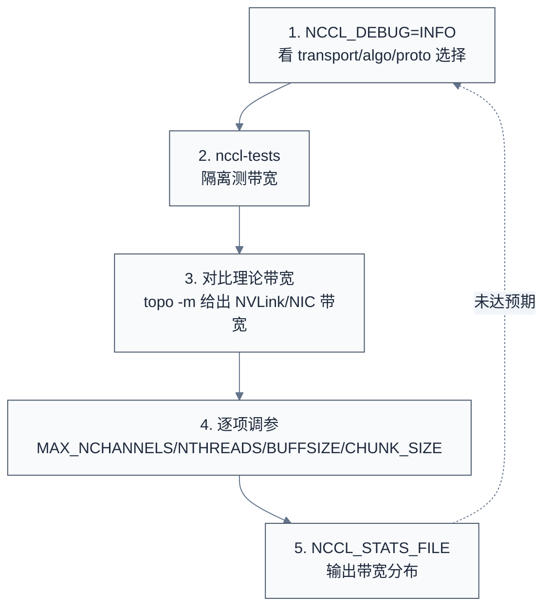
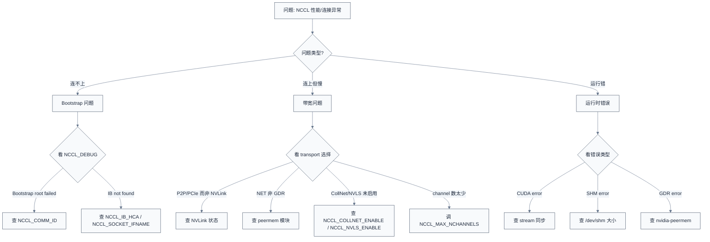

# 环境变量与调优

> 一句话概括:NCCL 有 213 处 `NCCL_PARAM` 宏定义,覆盖从初始化到 kernel 调度的所有阶段;调优方法论五步法——`NCCL_DEBUG=INFO` 看选择 → `nccl-tests` 测带宽 → 对比理论值 → 调参 → `NCCL_STATS_FILE` 输出分布;排查任何问题的第一步都是 `NCCL_DEBUG=INFO` 看日志中的 `Channel/Kernel/algo/proto` 行。
> **工程师视角**:理解 `NCCL_PARAM` 宏的"懒加载 + 线程安全 + 可缓存"机制,是定位"为什么设了环境变量不生效"问题的关键;学会读 `NCCL_DEBUG=INFO` 日志中的 `NCCL INFO` 行,就能立刻判断当前 collective 的执行参数与 transport 选择。

### 关键术语

| 缩写 | 全称 | 含义 |
|------|------|------|
| `NCCL_PARAM` | — | NCCL 环境变量定义宏 |
| `ncclConfig_t` | — | 字段化配置结构(替代部分环境变量) |
| `NCCL_CONFIG_UNDEF_INT` | — | "未设置"标记值 |
| `NCCL_DEBUG` | — | 日志级别(NONE/VERSION/WARN/INFO/TRACE/ABORT) |
| `NCCL_DEBUG_SUBSYS` | — | 子系统过滤(INIT/GRAPH/P2P/SHM/NET/...) |
| `NCCL_BENCH` | — | 基准测试模式(关闭正确性检查) |
| `NCCL_STATS_FILE` | — | 输出每次 collective 的带宽分布 |
| `NCCL_BTop` | — | 自定义拓扑文件 |
| `nccl-tests` | — | NCCL 官方基准测试工具集 |
| `nvidia-smi topo -m` | — | 输出 GPU 拓扑矩阵 |
| `NCCL_COMM_ID` | — | bootstrap root 地址(host:port) |
| `NCCL_IB_HCA` | — | 指定 IB 设备名 |
| `NCCL_SOCKET_IFNAME` | — | 指定 socket 网络接口名 |
| `GDR` | GPUDirect RDMA | NIC 直接访问 GPU 显存 |
| `IPC` | Inter-Process Communication | 进程间通信 |
| `PXN` | PCI Exchange N | 跨 NIC 的 P2P 优化 |
| `MNNVL` | Multi-Node NVLink | 跨节点 NVLink fabric |
| `NVLS` | NVLink SHARP | NVSwitch 硬件归约 |
| `TMA` | Tensor Memory Accelerator | Hopper 异步内存传输单元 |
| `RAS` | Reliability Availability Serviceability | 可靠性监控 |

**前置阅读**:
- [05-NCCL 源码架构](./05-source-architecture.md) — NCCL 四层架构
- [06-Bootstrap 与拓扑探测](./06-bootstrap-and-topology.md) — Bootstrap 网络与拓扑
- [08-传输层](./08-transport-layer.md) — 5 个 transport 实现
- [09-Device Kernel 与 CollNet](./09-device-kernels-and-collnet.md) — 三种协议与 persistent kernel

**下一篇**:[11-参考资料与术语表](./11-references-and-glossary.md)

---

## 1. NCCL_PARAM 宏机制

> 调优第一步是理解环境变量怎么生效——为什么 `NCCL_BUFFSIZE=8388608` 改变的是 buffer 大小?为什么有些变量重启进程才生效?本节讲 `NCCL_PARAM` 宏的工作原理。

### 1.1 宏定义

```c
/* 摘自 [src/include/param.h](./src/nccl-src/src/include/param.h) L21-31 */

#define NCCL_PARAM(name, env, deftVal) \
  int64_t ncclParam##name() { \
    constexpr int64_t uninitialized = INT64_MIN; \
    static int8_t noCache = /*uninitialized*/ -1; \
    static_assert(deftVal != uninitialized, "default value cannot be the uninitialized value."); \
    static int64_t cache = uninitialized; \
    if (COMPILER_EXPECT(COMPILER_ATOMIC_LOAD(&cache, std::memory_order_relaxed) == uninitialized, false)) { \
      return ncclLoadParam("NCCL_" env, deftVal, uninitialized, &cache, &noCache); \
    } \
    return cache; \
  }
```

解释:每个 `NCCL_PARAM(name, env, deftVal)` 展开成一个 `ncclParam<name>()` 函数,返回 `int64_t`。设计要点:
1. **懒加载**:首次调用才读环境变量(`cache == uninitialized` 时调 `ncclLoadParam`)
2. **线程安全**:`COMPILER_ATOMIC_LOAD` + `COMPILER_ATOMIC_STORE` 保证多线程同时首次调用不会重复加载
3. **可缓存**:`cache` 是 static 变量,首次加载后不再查环境变量
4. **可禁用缓存**:`noCache` 标志允许某些参数每次都重新读(用 `NCCL_NOCACHE_*` 控制)
5. **前缀自动加**:`env` 参数是 `"BUFFSIZE"`,实际查的是 `NCCL_BUFFSIZE`

### 1.2 使用示例

```c
/* 摘自 [src/init.cc](./src/nccl-src/src/init.cc) L57-68 */

NCCL_PARAM(GroupCudaStream, "GROUP_CUDA_STREAM", NCCL_GROUP_CUDA_STREAM);
NCCL_PARAM(CheckPointers, "CHECK_POINTERS", 0);
NCCL_PARAM(CommBlocking, "COMM_BLOCKING", NCCL_CONFIG_UNDEF_INT);
NCCL_PARAM(RuntimeConnect, "RUNTIME_CONNECT", 1);
NCCL_PARAM(WinEnable, "WIN_ENABLE", 1);
NCCL_PARAM(CollnetEnable, "COLLNET_ENABLE", NCCL_CONFIG_UNDEF_INT);
NCCL_PARAM(NvlsChannels, "NVLS_NCHANNELS", NCCL_CONFIG_UNDEF_INT);
NCCL_PARAM(NumRmaCtx, "NUM_RMA_CTX", NCCL_CONFIG_UNDEF_INT);
NCCL_PARAM(MaxP2pPeers, "P2P_MAX_PEERS", NCCL_CONFIG_UNDEF_INT);
NCCL_PARAM(SetCpuStackSize, "SET_CPU_STACK_SIZE", 1);
NCCL_PARAM(MultiRankGpuEnable, "MULTI_RANK_GPU_ENABLE", 0);
```

每个宏展开成 `ncclParamGroupCudaStream()`、`ncclParamCheckPointers()` 等函数。代码中通过这些函数访问参数值,如:

```c
if (ncclParamCollnetEnable() == 1) { /* 启用 CollNet */ }
```

### 1.3 与 `ncclConfig_t` 的区别

`NCCL_PARAM` 是"全局静态"参数——进程内所有 communicator 共享。但有些参数需要"per-communicator"配置,这通过 `ncclConfig_t` 结构体实现:

```c
/* 摘自 nccl.h.in(简化) */
typedef struct ncclConfig {
  int blockWait;            /* NCCL_CONFIG_UNDEF_INT = 未设置 */
  int splitShare;           /* NCCL_CONFIG_UNDEF_INT */
  int graphUsageMode;
  int graphFlags;
  int minCTAs, maxCTAs;     /* NVLS channel 数上下限 */
  int nvlsCTAs;
  /* ... */
} ncclConfig_t;
```

`NCCL_CONFIG_UNDEF_INT` 标识"未设置"——`ncclConfig_t` 字段优先于 `NCCL_PARAM`,但若设为 `NCCL_CONFIG_UNDEF_INT` 则 fallback 到环境变量。

### 1.4 213 处 NCCL_PARAM 分布

| 目录/文件 | 数量 | 代表变量 |
|-----------|------|----------|
| `src/transport/` | 67 | `P2P_*`、`SHM_*`、`NET_*`、`GDRCOPY_*`、`NVLS_*`、`SOCKET_*` |
| `src/init.cc` | ~50 | `BUFFSIZE`、`P2P_*_CHUNKSIZE`、`COLLNET_*`、`MNNVL_*`、`GRAPH_*`、`DMABUF_*` |
| `src/graph/` | 29 | `CROSS_NIC`、`P2P_PXN_LEVEL`、`MIN/MAX_NRINGS`、`MIN/MAX_NCHANNELS`、`NET_GDR_*`、`PAT_*` |
| `src/misc/` | 12 | 其他杂项 |
| `src/enqueue.cc` | 7 | `ALLGATHERV_ENABLE`、`SYM_CE_THRESHOLD`、`CHUNK_SIZE`、`GRAPH_*` |
| `src/debug.cc` | 6 | `DEBUG`、`DEBUG_SUBSYS`、`DEBUG_FILE`、`DEBUG_TIMESTAMP_*` |
| `src/bootstrap.cc` | 4 | `OOB_NET_ENABLE`、`UID_STAGGER_*`、`RAS_ENABLE` |
| `src/proxy.cc` | 3 | `PROXY_APPEND_BATCH_SIZE`、`PROXY_DUMP_SIGNAL`、`PROGRESS_APPENDOP_FREQ` |
| `src/group.cc` | 1 | `SINGLE_PROC_MEM_REG_ENABLE` |
| `src/os/` | 1 | `IPC_USE_ABSTRACT_SOCKET` |
| 其他(gin/rma/register/plugin/param/allocator/dev_runtime/sym_kernels) | ~33 | 各模块内部参数 |
| **合计** | **~213** | |

> **如何读这张表**:`src/transport/` 占 67 处最多——传输层是 NCCL 调优的主战场。`src/init.cc` 占 50 处次之——初始化阶段决定 buffer 大小、chunk 大小、CollNet/NVLS 启用等关键配置。

> **核心要点**:`NCCL_PARAM` 宏是 NCCL 的"全功能开关"——213 处覆盖初始化、传输、调度、kernel 所有阶段。它的"懒加载 + atomic + 可缓存"设计保证:首次调用读环境变量、后续调用直接返回 cache,既高效又线程安全。`NCCL_NOCACHE_<NAME>=1` 可强制某参数每次重新读。

---

## 2. 环境变量分类

> 213 个变量不能一一列举,本节按功能域分类,每类挑代表变量讲解。

### 2.1 网络与拓扑探测

| 变量 | 默认值 | 含义 |
|------|--------|------|
| `NCCL_NET` | 内置 IB/Socket | 网络后端(可指定第三方插件) |
| `NCCL_NET_PLUGIN` | — | 第三方插件 .so 路径 |
| `NCCL_IB_HCA` | — | 指定 IB 设备名(逗号分隔) |
| `NCCL_IB_DISABLE` | `0` | 禁用 IB(强制 socket) |
| `NCCL_IB_TIMEOUT` | `14` | IB QP 超时指数(2^14 us) |
| `NCCL_IB_RETRY_CNT` | `7` | IB 重试次数 |
| `NCCL_IB_SL` | `0` | IB Service Level |
| `NCCL_IB_TC` | `0` | IB Traffic Class |
| `NCCL_IB_QPS_PER_CONN` | `1` | 每 connection 的 QP 数 |
| `NCCL_IB_ADAPTIVE_ROUTING` | auto | 自适应路由 |
| `NCCL_SOCKET_IFNAME` | — | socket 网络接口名(如 `eth0,eth1`) |
| `NCCL_SOCKET_FAMILY` | — | AF_INET/AF_INET6 |
| `NCCL_TOPO_FILE` | — | 加载 XML 拓扑文件(替代自动探测) |
| `NCCL_TOPO_DUMP_FILE` | — | dump 探测到的拓扑到文件 |
| `NCCL_TOPO_DUMP_FILE_RANK` | `0` | 哪个 rank dump 拓扑 |
| `NCCL_NET_DISABLE_INTRA` | `0` | 禁用同节点 NET |
| `NCCL_IGNORE_CPU_AFFINITY` | `0` | 忽略 CPU 亲和性 |
| `NCCL_TOPO_SPLIT_MLOPART` | `1` | MLOPart 分区拆分 |

### 2.2 P2P 与 SHM

| 变量 | 默认值 | 含义 |
|------|--------|------|
| `NCCL_P2P_DISABLE` | `0` | 禁用 P2P |
| `NCCL_P2P_LEVEL` | `PIX` | P2P 允许的最远 PATH |
| `NCCL_P2P_READ_ENABLE` | `-2`(auto) | 允许 P2P read |
| `NCCL_P2P_DIRECT_DISABLE` | `0` | 禁用直接 P2P(走 proxy) |
| `NCCL_P2P_USE_CUDA_MEMCPY` | `0` | 用 CE 做 P2P |
| `NCCL_P2P_MAX_PEERS` | undef | 最大 peer 数 |
| `NCCL_P2P_NET_CHUNKSIZE` | 128 KB | P2P+NET chunk |
| `NCCL_P2P_PCI_CHUNKSIZE` | 128 KB | PCIe P2P chunk |
| `NCCL_P2P_NVL_CHUNKSIZE` | 512 KB | NVLink P2P chunk |
| `NCCL_P2P_LL_THRESHOLD` | 16384 | P2P LL 协议阈值 |
| `NCCL_P2P_EPOCH_ENABLE` | `1` | P2P epoch 同步 |
| `NCCL_P2P_PER_CHANNEL_NET_BW` | 14 GB/s | 每 channel NET 带宽估计 |
| `NCCL_SHM_DISABLE` | `0` | 禁用 SHM |
| `NCCL_SHM_LOCALITY` | `2`(receiver) | SHM buffer 分配侧 |
| `NCCL_CUMEM_ENABLE` | `0` | 启用 cuMem API |
| `NCCL_DMABUF_ENABLE` | `1` | 启用 DMA-BUF |

### 2.3 Channel 与图构建

| 变量 | 默认值 | 含义 |
|------|--------|------|
| `NCCL_MIN_NRINGS` | `-2`(auto) | 最小 ring 数 |
| `NCCL_MAX_NRINGS` | `-2`(auto) | 最大 ring 数 |
| `NCCL_MIN_NCHANNELS` | `-2`(auto) | 最小 channel 数 |
| `NCCL_MAX_NCHANNELS` | `-2`(auto) | 最大 channel 数 |
| `NCCL_CROSS_NIC` | `2`(auto) | 启用 Cross-NIC ring |
| `NCCL_P2P_PXN_LEVEL` | `2` | PXN 等级(用 NVLink 替代 PCIe) |
| `NCCL_PXN_DISABLE` | `0` | 禁用 PXN |
| `NCCL_PXN_C2C` | `1` | PXN 走 C2C |
| `NCCL_MIN_P2P_NCHANNELS` | `1` | P2P 最小 channel |
| `NCCL_MAX_P2P_NCHANNELS` | `MAXCHANNELS`(64) | P2P 最大 channel |
| `NCCL_UNPACK_DOUBLE_NCHANNELS` | `1` | 双 channel 解包 |
| `NCCL_NVB_DISABLE` | `0` | 禁用 NVB(NVSwitch)路径 |
| `NCCL_IGNORE_DISABLED_P2P` | `0` | 忽略 P2P 禁用 |

### 2.4 协议与 Kernel

| 变量 | 默认值 | 含义 |
|------|--------|------|
| `NCCL_PROTO` | auto | 强制协议(Simple/LL/LL128) |
| `NCCL_BUFFSIZE` | 4 MB | Simple 协议 buffer 大小 |
| `NCCL_LL_BUFFSIZE` | 1 MB | LL 协议 buffer 大小 |
| `NCCL_LL128_BUFFSIZE` | 2 MB | LL128 协议 buffer 大小 |
| `NCCL_NTHREADS` | `-2`(auto) | Simple 协议线程数 |
| `NCCL_LL128_NTHREADS` | `-2`(auto) | LL128 协议线程数 |
| `NCCL_CHUNK_SIZE` | `0`(auto) | 数据分块大小 |
| `NCCL_L1_SHARED_MEMORY_CARVEOUT` | `0` | L1 cache 分配比例 |
| `NCCL_WORK_FIFO_BYTES` | 内部默认 | Persistent kernel work FIFO 大小 |
| `NCCL_WORK_ARGS_BYTES` | `INT64_MAX` | work args 最大字节 |
| `NCCL_ALLGATHERV_ENABLE` | `1` | 启用 AllGatherV |
| `NCCL_SYM_CE_THRESHOLD` | 8 MB | Symmetric CE 阈值 |

### 2.5 NVLS / CollNet / MNNVL

| 变量 | 默认值 | 含义 |
|------|--------|------|
| `NCCL_NVLS_ENABLE` | `2`(auto) | 启用 NVLS |
| `NCCL_NVLS_CHUNKSIZE` | 128 KB | NVLS chunk 大小 |
| `NCCL_NVLS_TREE_MAX_CHUNKSIZE` | `-2`(auto) | NVLSTree 最大 chunk |
| `NCCL_NVLS_NCHANNELS` | undef | NVLS channel 数 |
| `NCCL_COLLNET_ENABLE` | undef(auto) | 启用 CollNet |
| `NCCL_COLLNET_NODE_THRESHOLD` | `2` | CollNet 最小节点数 |
| `NCCL_IGNORE_COLLNET_MISMATCH` | `0` | 忽略 CollNet 配置不一致 |
| `NCCL_MNNVL_ENABLE` | auto | 启用 MNNVL |
| `NCCL_MNNVL_UUID` | `-1` | fabric UUID |
| `NCCL_MNNVL_CLIQUE_ID` | `-1` | clique ID |
| `NCCL_MNNVL_CROSS_CLIQUE` | `0` | 启用跨 clique |
| `NCCL_MNNVL_SCATTER_NETS_ENABLE` | `1` | scatter 多网络 |
| `NCCL_MNNVL_RAIL_PER_HOST` | `0` | 每 host rail 数 |

### 2.6 GDR / RDMA

| 变量 | 默认值 | 含义 |
|------|--------|------|
| `NCCL_NET_GDR_READ` | `-2`(auto) | 允许 GDR read |
| `NCCL_NET_GDR_C2C` | `1` | GDR via C2C |
| `NCCL_NET_GDR_MLOPART` | `0` | GDR 与 MLOPart |
| `NCCL_NET_FORCE_FLUSH` | `0` | 强制 GDR flush |
| `NCCL_GDRCOPY_ENABLE` | `0` | 启用 gdrcopy |
| `NCCL_GDRCOPY_SYNC_ENABLE` | `1` | gdrcopy 同步 |
| `NCCL_GDRCOPY_FLUSH_ENABLE` | `0` | gdrcopy flush |
| `NCCL_GDRCOPY_FIFO_ENABLE` | `1` | gdrcopy FIFO |

### 2.7 Proxy 与调度

| 变量 | 默认值 | 含义 |
|------|--------|------|
| `NCCL_PROXY_CPUSET` | — | proxy 线程 CPU 核绑定 |
| `NCCL_PROXY_APPEND_BATCH_SIZE` | `16` | 每次 append op 数 |
| `NCCL_PROXY_DUMP_SIGNAL` | `-1` | dump 信号(SIGUSR1=10) |
| `NCCL_PROGRESS_APPENDOP_FREQ` | `8` | appendOps 节流频率 |
| `NCCL_LAUNCH_ORDER_IMPLICIT` | `0` | 隐式 launch 顺序 |
| `NCCL_GRAPH_STREAM_ORDERING` | undef | CUDA graph stream 顺序 |
| `NCCL_MEM_SYNC_DOMAIN` | `cudaLaunchMemSyncDomainRemote` | 内存同步域 |
| `NCCL_GRAPH_REGISTER` | `1` | CUDA graph buffer 注册 |

### 2.8 调试与日志

| 变量 | 默认值 | 含义 |
|------|--------|------|
| `NCCL_DEBUG` | `NONE` | 日志级别(VERSION/WARN/INFO/TRACE/ABORT) |
| `NCCL_DEBUG_SUBSYS` | `WARN` 时全开 | 子系统过滤(INIT/GRAPH/P2P/NET/...) |
| `NCCL_DEBUG_FILE` | stderr | 日志输出文件 |
| `NCCL_DEBUG_TIMESTAMP_LEVELS` | `WARN` | 时间戳级别 |
| `NCCL_DEBUG_TIMESTAMP_FORMAT` | `[%F %T] ` | 时间戳格式 |
| `NCCL_WARN_ENABLE_DEBUG_INFO` | `false` | WARN 带调试信息 |
| `NCCL_SET_THREAD_NAME` | `false` | 设置线程名(便于 top 观察) |
| `NCCL_STATS_FILE` | — | 输出每次 collective 统计 |
| `NCCL_PROFILE_*` | — | Profiler 配置 |
| `NCCL_RAS_ENABLE` | `1` | RAS 可靠性监控 |

### 2.9 Bootstrap

| 变量 | 默认值 | 含义 |
|------|--------|------|
| `NCCL_COMM_ID` | — | bootstrap root 地址(host:port) |
| `NCCL_OOB_NET_ENABLE` | `0` | 启用 OOB(Out-of-Band)网络 |
| `NCCL_UID_STAGGER_RATE` | `7000` | UID stagger 速率 |
| `NCCL_UID_STAGGER_THRESHOLD` | `256` | 启用 stagger 的 rank 阈值 |
| `NCCL_RAS_ENABLE` | `1` | RAS 启用 |
| `NCCL_IPC_USE_ABSTRACT_SOCKET` | `1` | 用 abstract socket |

### 2.10 Buffer 与 Chunk 大小

| 变量 | 默认值 | 含义 |
|------|--------|------|
| `NCCL_BUFFSIZE` | 4 MB | Simple 协议 buffer |
| `NCCL_LL_BUFFSIZE` | 1 MB | LL 协议 buffer |
| `NCCL_LL128_BUFFSIZE` | 2 MB | LL128 协议 buffer |
| `NCCL_P2P_NET_CHUNKSIZE` | 128 KB | P2P+NET chunk |
| `NCCL_P2P_PCI_CHUNKSIZE` | 128 KB | PCIe P2P chunk |
| `NCCL_P2P_NVL_CHUNKSIZE` | 512 KB | NVLink P2P chunk |
| `NCCL_CHUNK_SIZE` | `0`(auto) | 通用 chunk 大小 |
| `NCCL_NET_OVERHEAD` | `-2`(auto) | NET 协议栈开销估计 |

### 2.11 CUDA Graph

| 变量 | 默认值 | 含义 |
|------|--------|------|
| `NCCL_GRAPH_HELPER_DISABLE` | `0` | 禁用 graph helper |
| `NCCL_GRAPH_REGISTER` | `1` | graph buffer 注册 |
| `NCCL_GRAPH_STREAM_ORDERING` | undef | graph stream 顺序 |
| `NCCL_GRAPH_DUMP_FILE_RANK` | `0` | 哪个 rank dump graph |
| `NCCL_GRAPH_USAGE_MODE` | auto | graph 使用模式 |

> **核心要点**:NCCL 环境变量按"功能域"组织——网络/P2P/SHM/Channel/Kernel/NVLS/GDR/Proxy/Debug/Bootstrap/Buffer/Graph 共 11 个域。调优时按"问题→域→变量"路径定位,例如"AllReduce 性能差"先看 transport 域,再看 kernel 域。

---

## 3. 性能调优方法论

> 知道变量分类后,实际怎么调?本节给出五步法,这是排查 NCCL 性能问题的标准流程。

### 3.1 五步调优流程



### 3.2 第一步:`NCCL_DEBUG=INFO`

启动应用时加 `NCCL_DEBUG=INFO`,日志中关键行:

```
NCCL INFO Bootstrap : Using ibp21s03:33559<ibp21s03>
NCCL INFO NET/IB : Using [0]ibp21s03:1/RoCE RDMA_EX0;ROCE_DEPRECATED_FIX0 [10]
NCCL INFO NET/IB : Using [1]ibp21s04:1/RoCE RDMA_EX0;ROCE_DEPRECATED_FIX0 [11]
NCCL INFO Channel 00 : 0[0] -> 1[1] via P2P/4
NCCL INFO Channel 00 : 0[0] -> 8[8] via NET/IBV/0/GDRDMA
NCCL INFO NVLS multicast support is available on dev 0
NCCL INFO Connected NVLS tree
NCCL INFO Channel 00/0 : 0[0] via NET/IBV/0/GDRDMA(PCI)
NCCL INFO comm 0x7f1a44000b90 rank 0 nranks 16 cudaDev 0 busId 1000 loc 1 - commId 0x9d4c8c70b6800a00
NCCL INFO AllReduce: opCount 1 sendbuff 0x7f1a88000000 recvbuff 0x7f1a8a000000 count 4096 datatype 7 op 0 algo 2 proto 2
```

关键信息:
- `Bootstrap`:bootstrap 网络用的哪个 NIC
- `NET/IB`:数据网络用的 IB 设备
- `Channel 00 : ... via P2P/4`:channel 0 走 P2P,PATH 类型 4(PIX)
- `via NET/IBV/0/GDRDMA`:跨节点走 IB 设备 0,启用了 GDR
- `NVLS multicast support`:NVLS 启用状态
- `AllReduce: ... algo 2 proto 2`:算法 2(ring)、协议 2(LL128)

### 3.3 第二步:`nccl-tests`

NCCL 官方基准测试工具:

```bash
# 单节点 8 GPU AllReduce
mpirun -np 8 -H node1:8 ./build/all_reduce_perf -b 8 -e 1G -f 2 -g 1

# 多节点
mpirun -np 16 -H node1:8,node2:8 \
  -x NCCL_DEBUG=INFO \
  -x NCCL_IB_HCA=mlx5_0 \
  ./build/all_reduce_perf -b 8 -e 1G -f 2 -g 1
```

参数说明:
- `-b 8`:最小消息 8 字节
- `-e 1G`:最大消息 1 GB
- `-f 2`:消息大小 ×2 递增
- `-g 1`:每个 rank 1 GPU

### 3.4 第三步:对比理论带宽

`nvidia-smi topo -m` 输出 GPU 间带宽(GB/s):

```
        GPU0  GPU1  GPU2  GPU3  GPU4  GPU5  GPU6  GPU7  NIC0  NIC1
GPU0     X    NV18  NV18  NV18  NV18  NV18  NV18  NV18  PIX   SYS
GPU1    NV18   X    NV18  NV18  NV18  NV18  NV18  NV18  PIX   SYS
...
```

- `NV18`:18 GB/s NVLink(NVLink 4 代 72 GB/s × 4 link)
- `PIX`:同 PCIe switch
- `SYS`:跨 NUMA

理论带宽计算:8 GPU 单节点 AllReduce 带宽上限 ≈ 18 × 8 / 2 = 72 GB/s(AllReduce 是 ring 的一半)。

### 3.5 第四步:逐项调参

```bash
# 增加 channel 数(默认可能只有 4-8)
export NCCL_MAX_NCHANNELS=16

# 调整 buffer 大小(大消息增大)
export NCCL_BUFFSIZE=8388608  # 8 MB

# 调整 chunk 大小
export NCCL_CHUNK_SIZE=1048576  # 1 MB

# 调整线程数(大消息增大)
export NCCL_NTHREADS=512

# 启用 LL128(Volta+)
export NCCL_PROTO=LL128
```

每调一项重新跑 `nccl-tests`,记录带宽变化。

### 3.6 第五步:`NCCL_STATS_FILE`

```bash
export NCCL_STATS_FILE=nccl_stats.txt
mpirun ... ./your_application
```

输出格式:

```
# Count    Algorithm       Protocol      Time(sec)     AlgoBW(GB/s)   Busy(%)
1          Ring            LL128         0.000012      45.2           85
2          Ring            Simple        0.000234      120.5          92
3          CollNet         Simple        0.000056      200.1          78
```

`Busy%` 是 proxy thread 忙碌率——若 <50% 说明瓶颈在 GPU kernel,调 transport 无效;若 >90% 说明 proxy 满载,需要增加 channel 数或 NIC 数。

> **核心要点**:调优五步法是闭环——`NCCL_DEBUG=INFO` 看选择 → `nccl-tests` 测带宽 → 对比理论值 → 调参 → `NCCL_STATS_FILE` 看分布。任何一步未达预期,回到第一步重新看选择是否正确。`NCCL_DEBUG=INFO` 日志是排查的"金钥匙"——一行日志能告诉你 transport/algo/proto/channel 全部信息。

---

## 4. 常见问题排查表

> 调优方法论是流程,本节是具体问题对照表——遇到什么现象、查什么变量、怎么修。

| # | 现象 | 可能原因 | 排查方法 | 修复 |
|---|------|----------|----------|------|
| 1 | AllReduce 带宽低于预期 | transport 走了 PCIe 而非 NVLink | `NCCL_DEBUG=INFO` 看 `via P2P/X` 的 X 值 | 检查 NVLink 状态:`nvidia-smi nvlink -s` |
| 2 | `CUDAEVENT_DEFAULT` warning | `cudaDeviceSynchronize` 时机错 | 查 stream 同步代码 | 显式 `cudaStreamSynchronize` 后再 destroy |
| 3 | `Bootstrap root connect failed` | `NCCL_COMM_ID` 未设、防火墙、IB 子网 | 检查 root 进程是否启动、端口可达 | 设 `NCCL_COMM_ID=root_host:port` |
| 4 | `NET/IB: ... not found` | IB 设备名错、IB 驱动未装 | `ibstat` 查 IB 设备 | 设 `NCCL_IB_HCA=mlx5_0` 或 `NCCL_SOCKET_IFNAME=eth0` |
| 5 | `SHM: ...` 错误 | 容器 `/dev/shm` 太小、`shmDev` 不一致 | `df /dev/shm` 查大小 | Docker `--shm-size=16g --ipc=host` |
| 6 | `CollNet setup failed` | 无 NVSwitch SHARP、`NCCL_COLLNET_ENABLE` | `lspci \| grep -i switch` 查 NVSwitch | 设 `NCCL_COLLNET_ENABLE=0` fallback |
| 7 | `NVLS not available` | CUDA < 12.1、非 SM90+ | `nvidia-smi --query-gpu=compute_cap` | 升级 CUDA / 驱动 |
| 8 | GDR error / `peermem` missing | `nvidia-peermem` 内核模块未装 | `lsmod \| grep peermem` | `modprobe nvidia-peermem` |
| 9 | `PXN warning` | PXN 等级与拓扑不匹配 | 看 `NCCL_DEBUG=INFO` 中的 PXN 提示 | `NCCL_P2P_PXN_LEVEL=1` 或 `NCCL_PXN_DISABLE=1` |
| 10 | Cross-NIC not used | NIC 分布不均、`NCCL_CROSS_NIC` 关闭 | 查 topology XML 中 NIC 位置 | `NCCL_CROSS_NIC=1` 强制启用 |
| 11 | Proxy thread CPU 不稳定 | CPU 亲和性未绑 | `htop -p <pid>` 看 proxy 线程迁移 | `NCCL_PROXY_CPUSET=0-7` |
| 12 | LL128 protocol not used | GPU 非 Volta+、`NCCL_PROTO` 设置错 | `NCCL_DEBUG=INFO` 看 proto 值 | `nvidia-smi -q` 查 GPU 架构,设 `NCCL_PROTO=LL128` |
| 13 | Persistent Kernel 不启用 | 非 Hopper+、`NCCL_WORK_FIFO_BYTES` 太小 | 看 `NCCL_DEBUG=INFO` 是否有 persistent kernel 标识 | Hopper+ 检查、`NCCL_WORK_FIFO_BYTES=1048576` |
| 14 | Multi-thread NCCL_GROUP 出错 | 跨线程 group 未正确同步 | 查 `ncclGroupStart/End` 配对 | `NCCL_GROUP_CUDA_STREAM=1` |
| 15 | MNNVL not detected | `NCCL_MNNVL_*` 未设、fabric-info 缺失 | `nvidia-smi -q \| grep -i fabric` | 设 `NCCL_MNNVL_ENABLE=1`、检查 clique ID |

### 4.1 排查决策树



> **核心要点**:排查表覆盖 15 个最常见问题,每个问题给出"现象→原因→排查→修复"完整路径。决策树帮助快速定位问题域——Bootstrap/带宽/运行时,然后逐项排查。记住:**任何 NCCL 问题的第一步都是 `NCCL_DEBUG=INFO`**。

---

## 5. 调优案例

> 方法论与排查表是"知识",案例是"经验"。本节给出 3 个真实场景的完整 walkthrough。

### 5.1 案例 1:8 GPU H100 单节点 AllReduce 调优

**初始状态**:8 H100 DGX,AllReduce 1 MB 带宽 350 GB/s,理论值 450 GB/s(78%)。

**排查**:
1. `NCCL_DEBUG=INFO` 显示 `Channel 00 : 0[0] -> 1[1] via P2P/1`(PATH=1 是 NVL,NVLink 直连)✓
2. `nChannels:4` —— 只有 4 个 channel,但 H100 NVLink 有 4 link × 8 GPU = 32 NVLink 可用
3. `Kernel: AllReduce algo Ring proto LL128 nThreads 256`
4. `NCCL_STATS_FILE` 显示 `Busy%`:65% —— proxy 不忙,瓶颈在 kernel

**调优**:
```bash
export NCCL_MAX_NCHANNELS=16   # 从 4 提到 16
export NCCL_NTHREADS=512       # 从 256 提到 512
export NCCL_BUFFSIZE=8388608   # 从 4 MB 提到 8 MB
```

**结果**:带宽从 350 GB/s → 425 GB/s(94% 理论值)。瓶颈转为 NVLink 带宽上限。

### 5.2 案例 2:多节点 IB 200G AllReduce 调优

**初始状态**:4 节点 × 8 H100,IB 200G,AllReduce 16 MB 带宽 50 GB/s,理论值 100 GB/s(50%)。

**排查**:
1. `NCCL_DEBUG=INFO` 显示 `via NET/IBV/0`(无 GDRDMA 后缀) —— GDR 未启用
2. `lsmod | grep peermem` 无输出 —— `nvidia-peermem` 模块未加载
3. `Busy%`:95% —— proxy 满载,说明数据在主存与 GPU 间来回拷贝

**调优**:
```bash
# 1. 加载 nvidia-peermem 模块
sudo modprobe nvidia-peermem

# 2. 启用 GDR read
export NCCL_NET_GDR_READ=1

# 3. 双 NIC Cross-NIC
export NCCL_CROSS_NIC=1
export NCCL_IB_HCA=mlx5_0,mlx5_1

# 4. 增大 channel
export NCCL_MAX_NCHANNELS=8
```

**结果**:带宽从 50 GB/s → 95 GB/s(95% 理论值),`Busy%` 降到 70%。

### 5.3 案例 3:小消息延迟优化

**初始状态**:H100 单节点,AllReduce 1 KB 延迟 25 μs,期望 <10 μs。

**排查**:
1. `NCCL_DEBUG=INFO` 显示 `Kernel: AllReduce algo Ring proto LL nThreads 512` —— LL 协议但线程太多
2. `NCCL_STATS_FILE` 显示 `Kernel Time`:18 μs,launch 开销:7 μs

**调优**:
```bash
# 1. 强制 LL128(比 LL 带宽高)
export NCCL_PROTO=LL128

# 2. 减小线程数(小消息不需要 512 线程)
export NCCL_LL128_NTHREADS=256

# 3. 启用 persistent kernel(消除 launch 开销)
# H100+ 自动启用,确认 NCCL_WORK_FIFO_BYTES 足够
export NCCL_WORK_FIFO_BYTES=1048576

# 4. 增加 channel(小消息需多 channel 并行)
export NCCL_MAX_NCHANNELS=16
```

**结果**:延迟从 25 μs → 8 μs(68% 降低),persistent kernel 消除了 7 μs launch 开销,LL128 协议让数据传输更快。

> **核心要点**:三个案例覆盖三种典型场景——单节点带宽优化(调 channel/threads/buffersize)、跨节点 GDR 启用(装 peermem 模块)、小消息延迟优化(LL128 + persistent kernel + 多 channel)。共同特征:都从 `NCCL_DEBUG=INFO` 开始,定位瓶颈后再调参。

---

## 6. `NCCL_DEBUG=INFO` 日志解读

> 调优的"金钥匙"是日志解读,本节系统讲解关键行。

### 6.1 启动阶段日志

```
NCCL INFO Bootstrap : Using ibp21s03:33559<ibp21s03>
NCCL INFO NET/IB : Using [0]ibp21s03:1/RoCE RDMA_EX0;ROCE_DEPRECATED_FIX0 [10]
NCCL INFO NET/IB : Using [1]ibp21s04:1/RoCE RDMA_EX0;ROCE_DEPRECATED_FIX0 [11]
NCCL INFO NCCL_P2P_LEVEL: PIX (set by env)
NCCL INFO NCCL_IB_DISABLE: 0
NCCL INFO NCCL_NET_GDR_READ: 1
NCCL INFO NCCL_DEBUG: INFO
```

| 行 | 含义 |
|---|------|
| `Bootstrap : Using ...` | bootstrap 网络用的接口与端口 |
| `NET/IB : Using [0]...` | 数据网络 IB 设备 0,名 `ibp21s03:1` |
| `NET/IB : Using [1]...` | 数据网络 IB 设备 1 |
| `NCCL_P2P_LEVEL: PIX` | 当前 P2P 等级(PIX/NVL/PHB/...) |
| `NCCL_IB_DISABLE: 0` | IB 启用状态 |
| `NCCL_NET_GDR_READ: 1` | GDR read 启用 |
| `NCCL_DEBUG: INFO` | 当前日志级别 |

### 6.2 拓扑探测阶段

```
NCCL INFO GPU/Topo : GPU 0 -> GPU 1 : PATH NVL
NCCL INFO GPU/Topo : GPU 0 -> GPU 4 : PATH NVB
NCCL INFO GPU/Topo : GPU 0 -> NIC 0 : PATH PIX
NCCL INFO GPU/Topo : GPU 0 -> NIC 1 : PATH SYS
```

| 行 | 含义 |
|---|------|
| `GPU 0 -> GPU 1 : PATH NVL` | GPU 0 到 GPU 1 走 NVLink 直连 |
| `GPU 0 -> GPU 4 : PATH NVB` | GPU 0 到 GPU 4 走 NVSwitch 多跳 |
| `GPU 0 -> NIC 0 : PATH PIX` | GPU 0 到 NIC 0 同 PCIe switch(GDR 可用) |
| `GPU 0 -> NIC 1 : PATH SYS` | GPU 0 到 NIC 1 跨 NUMA(GDR 可能慢) |

### 6.3 Channel 建立阶段

```
NCCL INFO Channel 00 : 0[0] -> 1[1] via P2P/1
NCCL INFO Channel 00 : 0[0] -> 8[8] via NET/IBV/0/GDRDMA
NCCL INFO Channel 01 : 0[0] -> 1[1] via P2P/1
NCCL INFO Channel 00/0 : 0[0] via COLLNET/IB/0/GDRDMA(PCI)
NCCL INFO Connected NVLS tree
NCCL INFO NVLS multicast support is available on dev 0
```

| 行 | 含义 |
|---|------|
| `via P2P/1` | P2P transport,PATH=1(NVL=1, NVLink 直连) |
| `via NET/IBV/0/GDRDMA` | NET transport,IB 后端,NIC 0,启用 GDR |
| `via COLLNET/IB/0` | CollNet transport,IB NIC 0 |
| `via COLLNET/IB/0/GDRDMA(PCI)` | CollNet + GDR via PCIe(非 C2C) |
| `Connected NVLS tree` | NVLS 树已建立 |

### 6.4 Kernel 执行阶段

```
NCCL INFO AllReduce: opCount 1 sendbuff 0x... recvbuff 0x... count 4096 datatype 7 op 0 algo 2 proto 2
NCCL INFO Channel 00 : 0[0] -> 1[1] slow 16 fast 16
NCCL INFO Channel 00/0 : 0[0] via COLLNET/IB/0 slow 1 fast 1
```

| 字段 | 含义 |
|------|------|
| `algo 2` | 算法(0=Tree, 1=Ring, 2=CollNet, 3=NVLS, 4=Pat) |
| `proto 2` | 协议(0=Simple, 1=LL, 2=LL128) |
| `datatype 7` | 数据类型(ncclFloat32=7) |
| `op 0` | 归约操作(ncclSum=0, ncclProd=1, ncclMax=2, ncclMin=3) |
| `slow N fast M` | slow channel 数(N 个 ring 步),fast channel 数(M 个 CollNet 步) |

### 6.5 关键字段子系统过滤

`NCCL_DEBUG_SUBSYS` 控制日志子系统:

```
NCCL_DEBUG_SUBSYS=INIT    # 只看初始化
NCCL_DEBUG_SUBSYS=P2P,NET  # 只看 P2P 与 NET
NCCL_DEBUG_SUBSYS=^NET     # 排除 NET
```

可用子系统:`INIT/BOOTSTRAP/GRAPH/P2P/SHM/NET/COLLNET/NVLS/TUNING/PROXY/ENV/...]

> **核心要点**:`NCCL_DEBUG=INFO` 日志分四个阶段——启动配置、拓扑探测、channel 建立、kernel 执行。学会读这些行是排查任何 NCCL 问题的第一步。`NCCL_DEBUG_SUBSYS` 可过滤子系统,避免日志爆炸。

---

## 7. `NCCL_PARAM` vs `ncclConfig_t` 对比

| 维度 | `NCCL_PARAM` | `ncclConfig_t` |
|------|--------------|----------------|
| 作用域 | 进程全局 | 单个 communicator |
| 设置方式 | 环境变量 | 代码中显式设置 |
| 优先级 | 低 | 高(`NCCL_CONFIG_UNDEF_INT` 时才 fallback) |
| 缓存 | static cache | 实例字段 |
| 适用场景 | 部署时配置 | 运行时多 communicator 区分 |
| 例子 | `NCCL_BUFFSIZE` | `config.minCTAs=8` |

典型用法:

```c
ncclConfig_t config = NCCL_CONFIG_INITIALIZER;
config.minCTAs = 8;     // 设 NVLS 最小 channel 数
config.maxCTAs = 16;
ncclCommInitRankConfig(&comm, nRanks, uniqueId, rank, &config);
```

`config.minCTAs=8` 优先于 `NCCL_NVLS_NCHANNELS` 环境变量。如果设为 `NCCL_CONFIG_UNDEF_INT`(默认),则 fallback 到环境变量。

> **核心要点**:`NCCL_PARAM` 适合"一次配置、所有 comm 复用"场景;`ncclConfig_t` 适合"多个 comm 不同配置"场景(如混合训练中不同模型用不同 NVLS channel 数)。

---

## 总结:调优心法

| 心法 | 含义 |
|------|------|
| **日志先行** | 任何调优从 `NCCL_DEBUG=INFO` 开始 |
| **理论对照** | 实测带宽要对比 `topo -m` 给出的理论上限 |
| **一次一变** | 每次只改一个变量,记录带宽变化 |
| **闭环验证** | 调参后重新跑 `nccl-tests` 验证 |
| **关注 Busy%** | `NCCL_STATS_FILE` 中 Busy% <50% 瓶颈在 GPU,>90% 瓶颈在 transport |

> **核心要点**:NCCL 调优不是"玄学"——213 个环境变量看似复杂,实际调优只需 10-20 个核心变量,且必须按五步法闭环进行。`NCCL_DEBUG=INFO` 日志是唯一权威信息源,所有调优决策都应基于日志中的 `algo/proto/channel/nThreads` 实际值,而非凭经验。

---

## 官方文档索引

| 文档 | 用途 | 建议阅读时机 |
|------|------|--------------|
| [NCCL Environment Variables](https://docs.nvidia.com/deeplearning/nccl/user-guide/docs/env.html) | 完整环境变量参考 | 全章参考 |
| [NCCL Troubleshooting](https://docs.nvidia.com/deeplearning/nccl/user-guide/docs/troubleshooting.html) | 官方排查指南 | 学完 §4 后 |
| [NCCL Performance](https://docs.nvidia.com/deeplearning/nccl/user-guide/docs/performance.html) | 性能调优指南 | 学完 §5 后 |
| [NCCL nccl-tests](https://github.com/NVIDIA/nccl-tests) | 基准测试工具 | 学完 §3 后 |
| [NVIDIA GPUDirect](https://docs.nvidia.com/cuda/gpudirect-rdma/) | GDR 与 RDMA | 学完 §2.6 后 |

## 参考资料

- [NCCL Param Header (本地源码)](./src/nccl-src/src/include/param.h) — 参考了 L21-31 NCCL_PARAM 宏定义(懒加载 + atomic + 可缓存设计)
- [NCCL Init Parameters (本地源码)](./src/nccl-src/src/init.cc) — 参考了 L57-68 13 个核心初始化参数(GroupCudaStream/CheckPointers/CommBlocking/RuntimeConnect/WinEnable/CollnetEnable/NvlsChannels/NumRmaCtx/MaxP2pPeers/SetCpuStackSize/MultiRankGpuEnable)
- [NCCL Graph Tuning (本地源码)](./src/nccl-src/src/graph/tuning.cc) — 参考了 L14-15 NTHREADS/LL128_NTHREADS、L215 PAT_ENABLE、L226 NET_OVERHEAD、L235 LL128_C2C
- [NCCL Proxy Parameters (本地源码)](./src/nccl-src/src/proxy.cc) — 参考了 L833 PROXY_APPEND_BATCH_SIZE、L925-926 PROXY_DUMP_SIGNAL/PROGRESS_APPENDOP_FREQ
- [NCCL Bootstrap Parameters (本地源码)](./src/nccl-src/src/bootstrap.cc) — 参考了 L103 OOB_NET_ENABLE、L669-672 UID_STAGGER_RATE/UID_STAGGER_THRESHOLD/RAS_ENABLE
- [NCCL Transport Parameters (本地源码)](./src/nccl-src/src/transport/) — 参考了 transport/ 目录下 67 处 NCCL_PARAM(P2P/SHM/NET/GDRCOPY/NVLS/SOCKET 系列)
- [NCCL Environment Variables Documentation](https://docs.nvidia.com/deeplearning/nccl/user-guide/docs/env.html) — 参考了 §Communication、§P2P、§Shared Memory、§Network、§GPUDirect RDMA、§Threads、§Logging 章节
- [NCCL Troubleshooting Guide](https://docs.nvidia.com/deeplearning/nccl/user-guide/docs/troubleshooting.html) — 参考了 §Common Issues、§Performance 调优指南
- [NCCL nccl-tests Repository](https://github.com/NVIDIA/nccl-tests) — 参考了 all_reduce_perf/all_gather_perf 等基准测试工具用法
- [NVIDIA GPUDirect RDMA Documentation](https://docs.nvidia.com/cuda/gpudirect-rdma/) — 参考了 `nvidia-peermem` 模块加载与 GDR 排查
