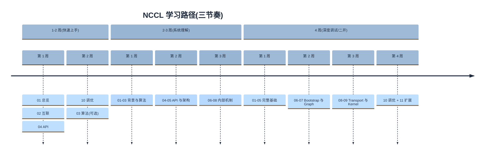
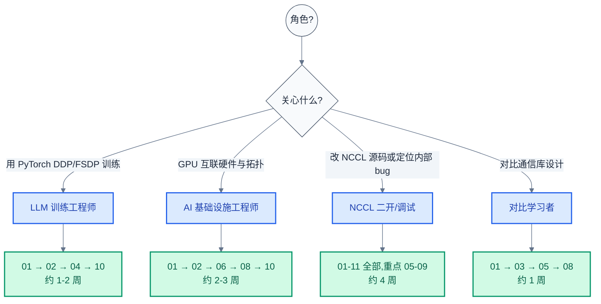

# 11. 参考资料、术语表与学习路径

> 一句话概括:本章是 NCCL 学习笔记系列的收尾——汇总 01-10 章的术语、官方文档、源码导航、跨项目对照,并给出三种节奏的学习路径与扩展资料入口。
> **工程师视角**:本章不引入新概念,只作为"快速查找入口"和"扩展学习跳板"。日常工作中遇到术语不确定、源码定位卡壳、想找官方文档某章节时,优先回查本章;若想理解某个机制的细节,再回跳到对应章节。

### 关键术语(本章定位与全系列术语表入口)

| 缩写 | 全称 | 含义 |
|------|------|------|
| BTL | Byte Transfer Layer | MPI 中的传输抽象层,与 NCCL Transport 同构 |
| PMI | Process Management Interface | MPI 进程管理接口,负责 rank 启动与发现 |
| SPD | Secure Partition Descriptor | TF-A 中通信子集的概念(此处作为跨项目映射参考) |
| mpiP | MPI Profiling | MPI 性能 profiling 工具,对应 NCCL 的 `NCCL_STATS_FILE` |
| Cross-Reference | — | 跨章节/跨项目交叉引用 |
| Timeline | — | Mermaid 时间线图类型,用于表达学习路径节奏 |

> 本表仅列本章新引入的少量术语。**全系列完整术语表(50+ 项)见 §4**,主术语表入口亦在 [README.md §关键术语](./README.md)。

**前置阅读**:[10-环境变量与调优](./10-environment-variables-and-tuning.md)

**下一篇**:[README / 总览](./README.md)(收尾章节惯例,回到入口)

---

## 1. 系列回顾与本章定位

> 上一章(10)把 213 处 `NCCL_PARAM` 环境变量串成五步调优方法论,落在"调优不是玄学"这一核心论断。一个自然的问题是:学完整套 11 章后,后续去哪找资料?跨项目工程师怎么把 NCCL 概念映射到自己熟悉的 TF-A / Zephyr / MPI?本章用三张表(官方文档索引、源码导航、跨项目对照)+ 两张图(学习路径 timeline + 角色决策 flowchart)来回答这些问题。

### 1.1 本章与前 10 章的关系

本章是 **参考章(reference chapter)**,与 01-10 章"教程章(tutorial chapter)"有以下分工差异:

| 维度 | 01-10 章(教程章) | 11 章(参考章) |
|------|------------------|------------------|
| 目标 | 深入讲解单一主题 | 提供索引、对照、跳转 |
| 是否引入新概念 | 是 | 否(只整理) |
| 是否引用新源码 | 是 | 否(只汇总前 10 章已引用的路径) |
| 行数 | 600-840 行 | ~300 行 |
| 阅读方式 | 顺序阅读 | 随机跳查 |

### 1.2 与 README 的分工

[README.md](./README.md) 是 **专题入口**(学什么、按什么顺序学、用什么资源),本章是 **专题出口**(学完后怎么扩展、怎么跨项目映射、怎么定位后续资料)。两者关系:

```
README(入口)→ 01 章 → ... → 10 章 → 11 章(出口)→ README(回环)
```

> **核心要点**:11 章不是"额外内容",而是 01-10 章的 **元层(meta-level)索引**——当你忘了某个术语首次出现在哪、某段源码对应哪一章、想找 NCCL 与 MPI 的对照时,回到本章。读 01-10 时不必顺序读本章,但完成全部学习后建议至少通读 §5(跨项目对照)和 §8(核心要点回顾)一次。

---

## 2. 官方文档索引(按主题分类)

> §1 说明本章定位。一个自然的问题是:NCCL 官方文档很多,该按什么顺序读?本节按主题分类组织,与 [README §官方文档参考](./README.md) 形成互补——README 给"按学习阶段"的顺序,本节给"按功能域"的归类。

下表扩展 README L229-242 的官方文档表,按 5 个主题分组,标注阅读时机与对应章节:

| 主题 | 文档 | 用途 | 阅读时机 | 对应章节 |
|------|------|------|----------|----------|
| **基础** | [NCCL Overview](https://docs.nvidia.com/deeplearning/nccl/user-guide/docs/overview.html) | NCCL 是什么、支持哪些 collective 与互联 | 学前 | 01 |
| | [NCCL Installation & Build](https://docs.nvidia.com/deeplearning/nccl/user-guide/docs/installation.html) | 编译与安装 | 学完 01 后 | — |
| | [NCCL Usage Guide](https://docs.nvidia.com/deeplearning/nccl/user-guide/docs/usage.html) | 多线程/多进程用法、group 语义、stream | 学 04 时 | 04 |
| **API** | [NCCL Communication Operations](https://docs.nvidia.com/deeplearning/nccl/user-guide/docs/ops.html) | 各 collective API 详细说明 | 学 04 时 | 04 |
| | [NCCL API Reference](https://docs.nvidia.com/deeplearning/nccl/user-guide/docs/api.html) | 完整 API(Communicator/Collectives/Group/P2P/Types) | 学 04 时 | 04 |
| | [NCCL Communicators](https://docs.nvidia.com/deeplearning/nccl/user-guide/docs/api/comms.html) | Communicator 创建与管理函数 | 学 04 时 | 04 |
| **环境** | [NCCL Environment Variables](https://docs.nvidia.com/deeplearning/nccl/user-guide/docs/env.html) | 完整环境变量列表 | 学 10 时 | 10 |
| | [NCCL Troubleshooting](https://docs.nvidia.com/deeplearning/nccl/user-guide/docs/troubleshooting.html) | 官方排查指南 | 学 10 时 | 10 |
| | [NCCL Performance](https://docs.nvidia.com/deeplearning/nccl/user-guide/docs/performance.html) | 性能调优指南 | 学 10 时 | 10 |
| **进阶** | [NCCL Device API](https://docs.nvidia.com/deeplearning/nccl/user-guide/docs/api/device.html) | Device-side API(GIN/RMA/LSA) | 学 09 时 | 09 |
| | [NCCL Parameter API](https://docs.nvidia.com/deeplearning/nccl/user-guide/docs/api/param.html) | 运行时参数 API | 学 10 时 | 10 |
| | [CUDA Multicast API](https://docs.nvidia.com/cuda/cuda-driver-api/group__CUDA__MEM.html) | NVLS 的 CUDA 基础(`cuMulticastCreate` 等) | 学 09 时 | 09 |
| | [NVIDIA GPUDirect RDMA](https://docs.nvidia.com/cuda/gpudirect-rdma/) | GDR 与 `nvidia-peermem` | 学 08 时 | 02, 08 |
| | [NVIDIA SHARP Technology](https://www.nvidia.com/en-us/networking/technologies/sharp/) | CollNet/SHARP 硬件归约协议 | 学 09 时 | 02, 09 |
| **源码与工具** | [NCCL GitHub Repository](https://github.com/NVIDIA/nccl) | 源码与 Issue(本地 [src/nccl-src/](./src/nccl-src/)) | 全程 | 全部 |
| | [NCCL nccl-tests Repository](https://github.com/NVIDIA/nccl-tests) | 基准测试工具集 | 学 10 后 | 10 |

> **如何读这张表**:按主题分类,方便"按需查找"。若按学习顺序读,优先看"基础"→"API"→"环境"→"进阶";"源码与工具"全程使用。

---

## 3. 源码导航表(按章节)

> §2 给了官方文档索引。一个自然的问题是:本系列笔记引用了哪些源码路径?本节按章节汇总,补足 README L184-224 的源码导航表,标注每章引用的关键文件、行号、结构/函数。

| 章节 | 关键源码路径 | 行号重点 | 关键结构/函数 |
|------|--------------|----------|----------------|
| **01 总览** | `src/nccl.h.in` | — | 公共 API 原型 |
| **02 互联背景** | (硬件背景,无源码) | — | NVLink / NVSwitch / PCIe / IB 规格 |
| **03 集合算法** | `src/include/device.h` L175-211 | `ncclRing` / `ncclTree` / `ncclDirect` / `ncclNvls` 数据结构 | Ring/Tree/CollNet 算法 |
| **04 API** | `src/nccl.h.in` L36-108, L170-240, L496-608 | `ncclComm_t` / `ncclUniqueId`(128B) / `ncclConfig_t` | API 原型 |
| | `src/collectives.cc` / `ce_coll.cc` | — | API dispatch 到 enqueue 路径 |
| | `src/group.cc` | — | `ncclGroupStart/End` 实现 |
| **05 架构** | `src/include/comm.h` | — | `struct ncclComm` 主结构 |
| | `src/include/transport.h` L16-22, L117-142 | `NTRANSPORTS=4` / `ncclTransportComm`(9 回调)/ `ncclTransport` | Transport 接口契约 |
| | `src/transport.cc` L15-42 | `ncclTransports[]` 注册表 / `selectTransport<>()` 模板 | Transport 选择 |
| | `src/enqueue.cc` | — | `ncclEnqueueCollective` 入口 |
| | `src/init.cc` | — | `ncclCommInitRank` 主流程 |
| **06 Bootstrap** | `src/bootstrap.cc` L103, L669-672 | `OOB_NET_ENABLE` / `UID_STAGGER_*` / `RAS_ENABLE` | Bootstrap 网络、UniqueId |
| | `src/graph/topo.cc` / `xml.cc` | — | NVML/CUDA/IB 拓扑探测、XML 解析 |
| **07 Graph** | `src/graph/rings.cc` | — | Ring 图构建与验证 |
| | `src/graph/trees.cc` | — | 双二叉树位运算 |
| | `src/graph/search.cc` / `tuning.cc` L14-15, L215-235 | `PAT_ENABLE` / `NET_OVERHEAD` / `LL128_C2C` | 图搜索与算法选择 |
| | `src/graph/connect.cc` / `paths.cc` | — | Cross-NIC 与 PXN 路径 |
| | `src/channel.cc` | — | Channel 初始化与管理 |
| | `src/scheduler/` | `allgatherv_sched.cc` / `symmetric_sched.cc` | Scheduler 实现 |
| **08 传输层** | `src/transport/p2p.cc` L130-210, L327-328 | `P2P_LEGACY_CUDA_REGISTER` / `P2P_USE_CUDA_MEMCPY` / `P2P_READ_ENABLE` / `P2P_DIRECT_DISABLE` | `p2pCanConnect` 三步检查 |
| | `src/transport/shm.cc` L55-56, L61-83, L88-119 | `SHM_DISABLE` / `SHM_LOCALITY` | `shmCanConnect` 三条件 |
| | `src/transport/net.cc` L161-169, L171-172, L339-341 | `NET_SHARED_BUFFERS` / `NET_SHARED_COMMS` / `GDRCOPY_SYNC_ENABLE` / `GDRCOPY_FLUSH_ENABLE` | NET 兜底 `canConnect` |
| | `src/transport/net_ib/` | 15 个文件:`common.cc/h`、`connect.cc/h`、`gdaki/`、`gdr.cc`、`gin.cc/h`、`init.cc`、`p2p.cc/h`、`p2p_resiliency*.cc/h`、`reg.cc` | IB Verbs 实现 |
| | `src/transport/coll_net.cc` L144-149, L170-218, L815/882/951 | canConnect 永远 0 / sendSetup / recvSetup / 3 collective API | CollNet 硬件归约 |
| | `src/transport/nvls.cc` L32-50, L52-72, L159-161, L283-296 | `nvlsTransport` / `ncclNvlsGroupCreate` / `NvlsEnable` / `NvlsChunkSize` / `ncclNvlsTreeConnect` | NVLink SHARP |
| | `src/proxy.cc` L833, L925-926, L954-1012 | `PROXY_APPEND_BATCH_SIZE` / `PROXY_DUMP_SIGNAL` / `PROGRESS_APPENDOP_FREQ` | `ncclProxyProgress` 主循环 |
| **09 Kernel** | `src/device/common.h` L355-433, L438-445 | `ncclKernelMain` 模板 / `DEFINE_ncclDevKernel` 宏 | Persistent Kernel 入口 |
| | `src/device/primitives.h` L18-75 | `ProtoSimple` / `ProtoLL` / `ProtoLL128` | 协议参数化 |
| | `src/device/symmetric/kernel.cuh` L13-46 | 17 个 Symmetric kernel 入口 | 命名约定 `<Coll>_<Phase1>x<Load>_<Phase2>x<Store>` |
| | `src/device/{all_reduce,all_gather,reduce_scatter,broadcast,reduce,sendrecv}.h` | — | 各 collective kernel |
| | `src/include/device.h` L26, L110-118 | `NCCL_STEPS=8` / `NCCL_LL128_LINESIZE=128` / `NCCL_LL128_LINEELEMS=16` / `NCCL_LL128_DATAELEMS=15` / `NCCL_LL128_MAX_NTHREADS=640` | LL128 常量 |
| | `src/include/transport.h` L43-65 | `ncclPeerInfo`(含 MNNVL `fabricInfo` / `cuMemSupport` / `rmaPluginAvailable`) | Peer 信息 |
| | `src/mnnvl.cc` | — | 多节点 NVLink 支持 |
| **10 调优** | `src/include/param.h` L21-31 | `NCCL_PARAM` 宏(懒加载 + atomic + 可缓存) | 宏机制 |
| | `src/init.cc` L57-68 | 13 个核心初始化参数 | `GroupCudaStream` / `CheckPointers` / `CommBlocking` / `RuntimeConnect` / `WinEnable` / `CollnetEnable` / `NvlsChannels` / `NumRmaCtx` / `MaxP2pPeers` / `SetCpuStackSize` / `MultiRankGpuEnable` |
| | `src/graph/tuning.cc` L14-15, L215-235 | `NTHREADS` / `LL128_NTHREADS` / `PAT_ENABLE` / `NET_OVERHEAD` / `LL128_C2C` | Tuning 参数 |
| | `src/proxy.cc` L833, L925-926 | `PROXY_APPEND_BATCH_SIZE` / `PROXY_DUMP_SIGNAL` / `PROGRESS_APPENDOP_FREQ` | Proxy 参数 |
| | `src/bootstrap.cc` L103, L669-672 | `OOB_NET_ENABLE` / `UID_STAGGER_RATE` / `UID_STAGGER_THRESHOLD` / `RAS_ENABLE` | Bootstrap 参数 |
| | `src/debug.cc` | 6 处 | `DEBUG` / `DEBUG_SUBSYS` / `DEBUG_FILE` / `DEBUG_TIMESTAMP_*` / `WARN_ENABLE_DEBUG_INFO` / `SET_THREAD_NAME` | Debug 参数 |
| | `src/transport/`(67 处) | — | P2P / SHM / NET / GDRCOPY / NVLS / SOCKET 系列 | Transport 参数 |

> **如何读这张表**:遇到某章引用的源码不确定位置时,查此表。**行号重点**列指明每章引用的关键行号范围(基于 commit `5067397c`),**关键结构/函数**列指明引用的核心数据结构或函数。所有路径相对 `nccl/src/nccl-src/` 解析。

---

## 4. 完整术语表(按字母序)

> §3 给了源码导航。一个自然的问题是:全系列 10 章引入了哪些术语?本节按字母序汇总 ~55 项核心术语,标注首次出现章节,作为全系列术语索引。

| 缩写 | 全称 | 含义 | 首次出现 |
|------|------|------|----------|
| **A** | | | |
| ACS | Access Control Services | PCIe 访问控制服务(影响 P2P 路由) | 02 |
| AllGather | All-Gather | 集合通信原语:所有 rank 收集所有 rank 的数据 | 03 |
| AllReduce | All-Reduce | 集合通信原语:所有 rank 归约后得到相同结果 | 01 |
| AlltoAll | All-to-All | 集合通信原语:全交换数据(MoE 关键) | 03 |
| ATS | Address Translation Services | PCIe 地址翻译服务 | 02 |
| **B** | | | |
| Bootstrap | — | NCCL 初始化阶段的 rank 互相发现网络(独立于数据网络) | 06 |
| BTL | Byte Transfer Layer | MPI 中的传输抽象层,与 NCCL Transport 同构 | 11 |
| **C** | | | |
| Channel | — | NCCL 内部并发通信通道,绑定一条 ring/tree + 一组 transport | 05 |
| CollNet | Collective Network | NVSwitch 加速的集合通信硬件原语 | 02 |
| Communicator | — | NCCL 通信上下文(`ncclComm_t`),绑定一个 CUDA 设备 | 01 |
| Cross-NIC | — | 跨 NIC 通信优化,降低跨节点带宽损失 | 07 |
| CTA | Cooperative Thread Array | CUDA thread block,NCCL kernel 的调度单位 | 09 |
| **D** | | | |
| DDP | Distributed Data Parallel | PyTorch 分布式数据并行,默认用 NCCL | 01 |
| DMA-BUF | — | Linux 内核 DMA 缓冲区分享机制,替代 GDR 的新方案 | 08 |
| **F** | | | |
| FSDP | Fully Sharded Data Parallel | PyTorch 全分片数据并行,通信依赖 NCCL | 01 |
| **G** | | | |
| GDR | GPUDirect RDMA | RDMA 直接到 GPU 显存,不经 CPU | 02 |
| GIN | Group Init Notification | 设备侧的 group 同步原语 | 09 |
| Gloo | — | PyTorch 自带的轻量通信库(已被 NCCL 取代) | 01 |
| GPUDirect | — | NVIDIA 技术:GPU 与 NIC/NVMe 等直接互访 | 02 |
| **H** | | | |
| HCA | Host Channel Adapter | InfiniBand 主机通道适配器 | 02 |
| **I** | | | |
| IB | InfiniBand | 高性能 RDMA 网络协议 | 02 |
| IB Verbs | InfiniBand Verbs | IB 编程 API | 02 |
| IPC | Inter-Process Communication | 进程间通信(CUDA IPC handle 用于 P2P) | 08 |
| **L** | | | |
| LL | Low Latency | NCCL 小消息协议,数据+flag 各占一半(带宽 50%) | 09 |
| LL128 | Low Latency 128 | NCCL Volta+ 协议,128B line,有效比例 15/16(带宽 93.75%) | 09 |
| LSA | Local Storage Access | NCCL device API 中的本地存储访问 | 09 |
| **M** | | | |
| MNNVL | Multi-Node NVLink | 多节点 NVLink fabric(Blackwell) | 02 |
| MPI | Message Passing Interface | 通用分布式通信标准 | 01 |
| **N** | | | |
| NCCL | NVIDIA Collective Communications Library | NVIDIA 集合通信库,发音 "Nickel" | 01 |
| NET | — | NCCL 网络传输(IB / Socket / 插件) | 08 |
| NVLink | — | NVIDIA GPU 间高速互联,4 代演进 | 02 |
| NVLS | NVLink SHARP | NVSwitch 上的硬件归约原语 | 02 |
| NVSwitch | — | 单节点 NVLink 全互联交换芯片 | 02 |
| **O** | | | |
| OneCCL | oneAPI Collective Communications Library | Intel 上的对应库 | 01 |
| **P** | | | |
| P2P | Peer-to-Peer | GPU 间直接访问,不经 CPU | 02 |
| PMI | Process Management Interface | MPI 进程管理接口,负责 rank 启动与发现 | 11 |
| Proto | Protocol | NCCL Kernel 协议(Simple / LL / LL128) | 09 |
| Proxy Thread | — | NCCL 在 CPU 侧运行的代理线程,执行 IB Verbs 等同步 API | 05 |
| PXN | PCI Exchange N | 跨 NIC 的 P2P 优化 | 06 |
| **R** | | | |
| Rank | — | communicator 中的进程/线程编号,从 0 开始 | 01 |
| RCCL | ROCm Communication Collectives | AMD GPU 上的 NCCL 等价物 | 01 |
| RDMA | Remote Direct Memory Access | 远程直接内存访问 | 02 |
| Reduce | — | 集合通信原语:归约到 root rank | 03 |
| ReduceScatter | Reduce-Scatter | 集合通信原语:归约后分片 | 03 |
| RoCE | RDMA over Converged Ethernet | 以太网上的 RDMA | 02 |
| RMA | Remote Memory Access | 远程内存访问(对应 `src/rma/`) | 09 |
| **S** | | | |
| Send/Recv | — | NCCL P2P 通信原语 | 04 |
| SHARP | Scalable Hierarchical Aggregation and Reduction Protocol | 硬件归约协议(CollNet/NVLS 的基础) | 02 |
| SHM | Shared Memory | 同节点进程间共享内存传输 | 02 |
| Simple | — | NCCL 大消息协议,无 flag 开销(带宽 100%) | 09 |
| SPD | Secure Partition Descriptor | TF-A 中的通信子集概念(跨项目映射参考) | 11 |
| Stream | CUDA Stream | CUDA 异步执行队列,NCCL 调用挂在 stream 上 | 01 |
| Symmetric Kernel | — | Hopper+ 引入的"对称 kernel"优化,两阶段组合 | 09 |
| **T** | | | |
| TF-A | Trusted Firmware-A | ARM 安全固件(跨项目对照用) | 11 |
| Tree | — | 双二叉树通信图,小消息延迟最优 | 03 |
| **U** | | | |
| UniqueID | — | 128 字节随机 ID,由 rank 0 生成,用于其他 rank 加入通信 | 01 |
| **W** | | | |
| World Size | — | communicator 中 rank 总数 | 01 |
| **Z** | | | |
| Zephyr | — | 开源 RTOS(跨项目对照用) | 11 |

> **如何读这张表**:遇到术语不确定首次定义位置时,查此表的"首次出现"列。每章开头也有自己的 `### 关键术语` 表(只列该章新引入的术语),与本表形成"局部-全局"两级索引。

---

## 5. 缩写跨项目对照表(NCCL ↔ TF-A ↔ Zephyr ↔ MPI)

> §4 汇总了 NCCL 术语。一个自然的问题是:这些概念在工程师熟悉的其他系统(TF-A / Zephyr / MPI)中对应什么?本节给出 11 个维度的对照,呼应 CLAUDE.md §1.8.3 "跨实现/跨架构对比"要求——本规范面向在"组件交界处"工作的工程师,跨项目映射是必备能力。

| 概念维度 | NCCL | TF-A | Zephyr | MPI |
|----------|------|------|--------|-----|
| **通信上下文** | `ncclComm_t`(Communicator) | — | — | `MPI_Comm` |
| **进程编号** | Rank | — | — | Rank |
| **通信子集** | `ncclCommSplit` | SPD(Secure Partition Descriptor) | — | `MPI_Comm_split` |
| **启动发现** | Bootstrap(socket + UniqueId) | BL31 / SMC 调用链 | — | `mpirun` / PMI |
| **硬件抽象层** | Transport(函数指针表 `ncclTransport`) | `plat_psci_ops_t` | device driver model | BTL(Byte Transfer Layer) |
| **集合算法** | Ring / Tree / CollNet / NVLS | — | — | Ring / Tree / Rabenseifner |
| **缓冲区协议** | Simple / LL / LL128 | — | — | Eager / Rendezvous |
| **异步执行单位** | CUDA Stream | SMC 调用返回 | — | `MPI_Request` |
| **批量化 API** | `ncclGroupStart` / `ncclGroupEnd` | — | — | Persistent Collectives(MPI 4.0) |
| **调试日志** | `NCCL_DEBUG=INFO` | `LOG_LEVEL` / console | `LOG_*` 宏 | `MPI_DEBUG` / `verbose` |
| **性能 profiling** | `NCCL_STATS_FILE` | — | — | mpiP / Tau |

### 5.1 三组关键映射解读

**1. "硬件抽象层"同构**:`ncclTransport` 函数指针表(NCCL)、`plat_psci_ops_t`(TF-A)、device driver model(Zephyr)、BTL(MPI)四者都是"通用代码通过函数指针调用平台实现"的契约设计。差异在于:

- **NCCL Transport**:5 个实现(P2P/SHM/NET/COLLNET/NVLS)通过 `canConnect` 协商选择,运行时根据拓扑动态绑定
- **TF-A `plat_psci_ops_t`**:编译期绑定,每个平台静态填充一组回调
- **Zephyr device driver model**:设备树驱动静态注册,运行时通过 device API 调用
- **MPI BTL**:运行时通过 `MPI_Tuning` 参数选择,粒度较粗

> **核心要点**:NCCL Transport 是这四者中"运行时动态选择"最灵活的——这是 NCCL 必须"拓扑感知"的原因,因为同一份代码要跑遍单 GPU / 多 GPU NVLink / PCIe / IB / NVSwitch 等多种硬件组合。

**2. "缓冲区协议"对应**:NCCL 的 Simple/LL/LL128 与 MPI 的 Eager/Rendezvous 是同一抽象——都是"不同消息大小用不同传输策略"。差异:

| 维度 | NCCL | MPI |
|------|------|-----|
| 小消息 | LL / LL128(数据 + flag 交织) | Eager(立即发送,接收端缓冲) |
| 大消息 | Simple(纯数据,无 flag) | Rendezvous(发送端与接收端握手后再传) |
| 选择依据 | GPU 架构 + 消息大小 | 消息大小阈值(`MPI_EAGER_LIMIT`) |

**3. "批量化 API"对应**:`ncclGroupStart/End` 把多次 enqueue 合并到一次 flush,与 MPI 4.0 的 Persistent Collectives 解决同一问题——减少 launch 开销。差异在于 NCCL 是"延迟提交",MPI 是"持久化请求复用"。

---

## 6. 学习路径(三种节奏)

> §5 给了跨项目映射。最后一个问题:新读者按什么节奏学?本节给出三种节奏(1-2 周 / 2-3 周 / 4 周)和按角色匹配的决策树。

### 6.1 三节奏学习路径 timeline



> **如何读这张图**:三 section 对应三种节奏。1-2 周节奏适合"调通 DDP 但不深究源码";2-3 周节奏适合"想理解为什么 NCCL 选了某条传输路径";4 周节奏适合"要改 NCCL 源码或定位内部 bug"。

### 6.2 按角色决策 flowchart



> **如何读这张图**:从"角色?"出发,按"关心什么"选四条路径之一。四条路径覆盖了 README §按角色推荐学习路径 的全部角色,但用决策树形式更直观——新读者可以先选角色再决定节奏。

---

## 7. 参考资料

> §6 给了学习路径。最后一节按"官方文档 / NVIDIA blog / 论文 / 第三方 / 本地源码"五类列出扩展资料。

### 7.1 官方文档

- [NCCL Documentation](https://docs.nvidia.com/deeplearning/nccl/user-guide/docs/overview.html) — NVIDIA 官方文档总入口,参考了 Overview / Usage / API / Environment Variables / Troubleshooting / Performance 各章节
- [NCCL GitHub Repository](https://github.com/NVIDIA/nccl) — 源码与 Issue,本地副本位于 [src/nccl-src/](./src/nccl-src/)
- [NCCL nccl-tests](https://github.com/NVIDIA/nccl-tests) — 官方基准测试工具集,含 `all_reduce_perf` / `all_gather_perf` 等
- [NCCL Environment Variables](https://docs.nvidia.com/deeplearning/nccl/user-guide/docs/env.html) — 完整环境变量参考,参考了 §Communication / §P2P / §Shared Memory / §Network / §GPUDirect RDMA / §Threads / §Logging
- [NCCL Troubleshooting](https://docs.nvidia.com/deeplearning/nccl/user-guide/docs/troubleshooting.html) — 官方排查指南,参考了 §Common Issues / §Performance
- [NCCL Performance](https://docs.nvidia.com/deeplearning/nccl/user-guide/docs/performance.html) — 性能调优指南
- [NCCL Communication Operations](https://docs.nvidia.com/deeplearning/nccl/user-guide/docs/ops.html) — 各 collective API 详细说明
- [NCCL Communicators](https://docs.nvidia.com/deeplearning/nccl/user-guide/docs/api/comms.html) — Communicator 创建与管理
- [NCCL Device API](https://docs.nvidia.com/deeplearning/nccl/user-guide/docs/api/device.html) — Device-side API(GIN/RMA/LSA)
- [NCCL Parameter API](https://docs.nvidia.com/deeplearning/nccl/user-guide/docs/api/param.html) — 运行时参数 API
- [CUDA Multicast API](https://docs.nvidia.com/cuda/cuda-driver-api/group__CUDA__MEM.html) — NVLS 的 CUDA 基础,参考了 `cuMulticastCreate` / `cuMemMap` / `cuMemSetAccess` 三步流程
- [NVIDIA GPUDirect RDMA](https://docs.nvidia.com/cuda/gpudirect-rdma/) — GDR 与 `nvidia-peermem` 模块加载
- [NVIDIA SHARP Technology](https://www.nvidia.com/en-us/networking/technologies/sharp/) — SHARP 硬件归约协议

### 7.2 NVIDIA blog 与 GTC 演讲

- [NVIDIA Developer Blog](https://developer.nvidia.com/blog/) — NVIDIA 官方技术 blog 总入口
- [NCCL: Optimizing Collective Communication on NVIDIA GPUs](https://developer.nvidia.com/blog/) — 早期 NCCL 设计介绍(GTC 2017 前后)
- [Inside Volta](https://developer.nvidia.com/blog/) — Volta 架构与 NVLink 2 介绍
- [Inside Hopper](https://developer.nvidia.com/blog/) — Hopper 架构与 NVLink 4 / NVLink SHARP 介绍

> **待确认**:NVIDIA blog 文章具体 URL 在写作时未逐一核对,如失效请从 [NVIDIA Developer Blog](https://developer.nvidia.com/blog/) 搜索关键词 "NCCL" / "NVLink" / "SHARP"。

### 7.3 论文

- [The NCCL Library: Topology-Aware Collective Communication on GPUs](https://arxiv.org/) — NCCL 早期论文(2017),介绍拓扑感知算法
- [Hierarchical Collectives for Deep Learning](https://arxiv.org/abs/2110.05442) — Hierarchical AllReduce 算法(NCCL 的分层 Ring/Tree 基础)
- [SHARP: Scalable Hierarchical Aggregation and Reduction Protocol](https://arxiv.org/) — SHARP 硬件归约协议(NCCL CollNet/NVLS 的理论基础)
- [Megatron-LM: Training Multi-Billion Parameter Language Models Using Model Parallelism](https://arxiv.org/abs/1909.08053) — 大模型训练中的 NCCL 通信模式

> **待确认**:部分论文 arxiv ID 需在写作时核对,如失效请在 [arxiv.org](https://arxiv.org/) 搜索论文标题。

### 7.4 第三方分析

- [PyTorch Distributed Overview](https://pytorch.org/tutorials/beginner/dist_overview.html) — PyTorch DDP/FSDP 如何调用 NCCL
- [NVIDIA DGX H100 System Architecture White Paper](https://www.nvidia.com/) — DGX H100 系统拓扑
- [Linux Kernel DMA-BUF Documentation](https://docs.kernel.org/driver-api/dma-buf.html) — DMA-BUF 内核机制
- [RDMA Verbs Programming](https://github.com/linux-rdma/rdma-core) — IB Verbs 用户态库(对应本仓库 [../rdma/](../rdma/) 专题)

### 7.5 本地源码

- [NCCL 源码(本地)](./src/nccl-src/) — NCCL 2.30.7-1,commit `5067397c2676d5aed50042fc39e5c8ee96eb0027`,通过 `git submodule update --init nccl/src/nccl-src` 获取
- [NCCL Param Header](./src/nccl-src/src/include/param.h) — L21-31 `NCCL_PARAM` 宏定义
- [NCCL Transport Header](./src/nccl-src/src/include/transport.h) — L16-22 `NTRANSPORTS`、L43-65 `ncclPeerInfo`、L117-142 `ncclTransportComm`
- [NCCL Device Header](./src/nccl-src/src/include/device.h) — L26 `NCCL_STEPS=8`、L110-118 LL128 常量
- [NCCL Transport Registry](./src/nccl-src/src/transport.cc) — L15-22 `ncclTransports[]` 注册表、L20-42 `selectTransport<>()`

### 7.6 相邻笔记专题

- [../rdma/](../rdma/) — RDMA 与 IB Verbs(NCCL Net transport 底层)
- [../pcie/](../pcie/) — PCIe(NCCL P2P transport 底层)
- [../LLM/05-LLM分布式训练:并行策略与ZeRO](../LLM/05-LLM分布式训练：并行策略与ZeRO.md) — NCCL 是 DDP/FSDP/ZeRO 的通信底座
- [../LLM/04-LLM MoE架构:路由、负载均衡与专家并行](../LLM/04-LLM%20MoE架构：路由、负载均衡与专家并行.md) — MoE All-to-All 通信依赖 NCCL

---

## 8. 核心要点回顾

> **核心要点**:NCCL 的"四层正交化"是理解全系列的钥匙——
> 1. **算法层**(03 章):Ring / Tree / CollNet / NVLS 选择,按消息大小与拓扑选择最优算法
> 2. **图与调度层**(07 章):Channel 分配 + chunk 调度,把算法分解为可并发的多通道任务
> 3. **传输层**(08 章):P2P / SHM / NET / COLLNET / NVLS 选择,通过 `canConnect` 协商 + 优先级遍历自动选硬件路径
> 4. **Kernel 层**(09 章):Simple / LL / LL128 协议 + Persistent Kernel,按消息大小与 GPU 架构选择最优 kernel
>
> 这四层**互相独立但协同**——一次 AllReduce 调用同时穿过四层:Graph 选 Ring → Scheduler 分 channel → Transport 选 NVLink → Kernel 用 LL128 协议跑。**理解这个四层分解,等于理解了 NCCL 设计的本质**。

> **核心要点**:"调优不是玄学"——213 处 `NCCL_PARAM` 看似复杂,实际只需掌握 10-20 个核心变量(见 [10 章](./10-environment-variables-and-tuning.md))。所有调优决策必须基于 `NCCL_DEBUG=INFO` 日志中的 `algo/proto/channel/nThreads` 实际值,而非凭经验。排查任何 NCCL 问题的第一步都是 `NCCL_DEBUG=INFO` 看日志中的 `Channel/Kernel/algo/proto` 行。

> **核心要点**:跨项目工程师的"映射记忆"——
> - **NCCL Transport ↔ TF-A `plat_psci_ops_t` ↔ Zephyr device driver model ↔ MPI BTL**:四者同构,都是"通用代码 × 平台实现"的契约设计
> - **NCCL Simple/LL/LL128 ↔ MPI Eager/Rendezvous**:都是"不同消息大小用不同传输策略"
> - **NCCL `ncclGroupStart/End` ↔ MPI 4.0 Persistent Collectives**:都是"减少 launch 开销"的批量化 API
>
> 把 NCCL 概念映射到自己熟悉的系统,是"组件交界处"工程师快速建立直觉的关键路径。

---

**文档版本**: v1.0
**最后更新**: 2026-07-18
**适用对象**: LLM 训练工程师、AI 基础设施工程师、GPU 互联工程师、NCCL 二开/调试工程师
**源码版本**: NCCL `2.30.7-1` (commit `5067397c2676d5aed50042fc39e5c8ee96eb0027`, tag `nccl4py-v0.3.1`)
