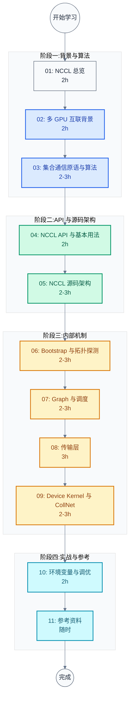
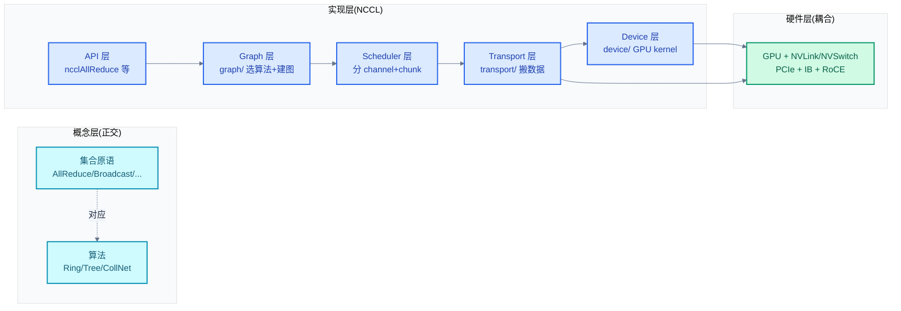

# NCCL 学习笔记:NVIDIA 集合通信库

> 面向系统软件与 AI 基础设施工程师的 NCCL 完整学习指南。从多 GPU 互联硬件到集合通信算法,从 API 用法到源码内部机制,覆盖 NCCL 2.30 版本。
>
> **工程师视角**:NCCL 是 LLM 分布式训练通信层事实标准,但它的设计本质是"拓扑感知 × 算法自动选择 × 多传输抽象"。本指南以"硬件 → 算法 → API → 源码"为序,既能让你调通 PyTorch DDP 也能让你定位 NVSwitch 上的 AllReduce 性能问题。

### 关键术语

| 缩写 | 全称 | 含义 |
|------|------|------|
| NCCL | NVIDIA Collective Communications Library | NVIDIA 集合通信库,发音 "Nickel" |
| Communicator | — | NCCL 通信上下文(`ncclComm_t`),绑定一个 CUDA 设备,类似 MPI communicator |
| Rank | — | communicator 中的进程/线程编号,从 0 开始 |
| World Size | — | communicator 中 rank 总数 |
| UniqueID | — | 128 字节随机 ID,由 rank 0 生成,用于其他 rank 加入通信 |
| Channel | — | NCCL 内部并发通信通道,绑定一条 ring/tree + 一组 transport |
| Ring | — | 环形通信图,大消息带宽最优 |
| Tree | — | 双二叉树通信图,小消息延迟最优 |
| CollNet | — | NVSwitch 加速的集合通信硬件原语 |
| NVLink | — | NVIDIA GPU 间高速互联,4 代演进 |
| NVSwitch | — | 单节点 NVLink 全互联交换芯片 |
| MNNVL | Multi-Node NVLink | 多节点 NVLink(Blackwell) |
| NVLS | NVLink SHARP | NVSwitch 上的硬件归约原语 |
| Bootstrap | — | NCCL 初始化阶段的 rank 互相发现网络(独立于数据网络) |
| Proxy Thread | — | NCCL 在 CPU 侧运行的代理线程,执行 IB Verbs 等同步 API |
| P2P | Peer-to-Peer | GPU 间直接访问,不经 CPU |
| SHM | Shared Memory | 同节点进程间共享内存传输 |
| GDR | GPUDirect RDMA | RDMA 直接到 GPU 显存,不经 CPU |
| ATS | Address Translation Services | PCIe 地址翻译服务 |
| ACS | Access Control Services | PCIe 访问控制服务(影响 P2P 路由) |
| IB | InfiniBand | 高性能 RDMA 网络协议 |
| RoCE | RDMA over Converged Ethernet | 以太网上的 RDMA |
| IB Verbs | InfiniBand Verbs | IB 编程 API(参考 [rdma/04](../rdma/04-rdma-verbs-api.md)) |
| GIN | Group Init Notification | 设备侧的 group 同步原语 |
| RMA | Remote Memory Access | 远程内存访问(对应 `src/rma/`) |
| CTA | Cooperative Thread Array | CUDA thread block,NCCL kernel 的调度单位 |
| RCCL | ROCm Communication Collectives | AMD GPU 上的 NCCL 等价物 |
| OneCCL | oneAPI Collective Communications Library | Intel 上的对应库 |
| MPI | Message Passing Interface | 通用分布式通信标准 |

---

## 学习路线图



> **如何读这张图**:四阶段从硬件背景到源码内部再到调优实战,严格按依赖关系推进。阶段一建立硬件与算法直觉(不读源码);阶段二把 API 和源码架构打通;阶段三深入 NCCL 四大子系统(Bootstrap/Graph/Transport/Device);阶段四用环境变量串起来。每篇 2-3 小时,总计约 25-30 小时。

---

## 文档索引

| 序号 | 文档 | 核心问题 | 概要 | 建议学时 |
|:----:|------|----------|------|:--------:|
| 01 | [NCCL 总览](./01-nccl-overview.md) | NCCL 在系统中干什么?与 MPI/Gloo 怎么比? | NCCL 本质、三层背景、与 CUDA Stream 协作、跨实现对比 | 2h |
| 02 | [多 GPU 互联背景](./02-gpu-interconnect-background.md) | NCCL 跑在什么硬件上? | NVLink/NVSwitch/NVLink-C2C/MNNVL、PCIe P2P、IB/RoCE、GPUDirect、DGX 拓扑 | 2h |
| 03 | [集合通信原语与算法](./03-collective-operations-and-algorithms.md) | NCCL 提供哪些集合操作?底层算法? | 8 个 collective 数据流、Ring/Tree/CollNet 算法、AllReduce 数值演算 | 2-3h |
| 04 | [NCCL API 与基本用法](./04-nccl-api-and-usage.md) | NCCL API 怎么用?多进程怎么组织? | Communicator 初始化、集合 API、Stream/Group 语义、P2P、最小完整示例 | 2h |
| 05 | [NCCL 源码架构](./05-source-architecture.md) | 源码怎么组织?一次 AllReduce 经哪些层? | 顶层目录、核心数据结构、调用层次、关键设计决策 | 2-3h |
| 06 | [Bootstrap 与拓扑探测](./06-bootstrap-and-topology.md) | 多 rank 怎么互发现?拓扑怎么探测? | Bootstrap 网络、UniqueID、NVML/CUDA/IB 探测、XML 拓扑 | 2-3h |
| 07 | [Graph 与调度](./07-graph-and-scheduling.md) | 通信图怎么选?任务怎么分到 channel? | Ring/Tree 图构建、Channel 概念、Scheduler、enqueue 流程 | 2-3h |
| 08 | [传输层](./08-transport-layer.md) | 数据怎么搬?为什么需要 proxy? | 4 种 transport、P2P/Net/SHM/CollNet、proxy thread、transport 接口契约 | 3h |
| 09 | [Device Kernel 与 CollNet](./09-device-kernels-and-collnet.md) | GPU kernel 长啥样?CollNet 怎么用 NVSwitch? | device/ kernel、devcomm/rma/register/gin、NVLS、MNNVL | 2-3h |
| 10 | [环境变量与调优](./10-environment-variables-and-tuning.md) | NCCL 怎么调?问题怎么定位? | 网络选择/调试/性能 env、调优方法论、常见问题排查表 | 2h |
| 11 | [参考资料与术语表](./11-references-and-glossary.md) | 后续去哪找资料? | 术语汇总、源码导航、官方文档、推荐论文、按角色路径 | 随时 |

---

## 按角色推荐学习路径

### LLM 训练工程师(PyTorch DDP/FSDP/Megatron 用户)

关注 API 与调优,不深究源码:

```
01 总览 → 02 互联背景 → 04 API(重点)→ 10 调优(重点)→ 03 算法(可选)
```

- **04 和 10 是核心**:API 用法直接对应日常工作,调优解决训练慢/卡死
- 02 帮你理解为什么 NCCL 选了某条传输路径
- 03 帮你看懂 NCCL_DEBUG 中的 ring/tree/collnet 字样

### AI 基础设施 / GPU 互联工程师

关注硬件拓扑与传输路径:

```
01 总览 → 02 互联背景(重点)→ 03 算法 → 06 拓扑(重点)→ 08 传输层(重点)→ 10 调优
```

- **02、06、08 是核心**:从硬件到 NCCL 的拓扑感知全链路
- 03 帮你理解为什么大消息用 ring、小消息用 tree
- 10 的网络选择部分排查 IB/NIC 选择问题

### NCCL 二开 / 深度调试工程师

需要改源码或定位内部 bug:

```
全部 11 章,重点 05-09
```

- **05-09 是核心**:源码架构 + 四大子系统
- 11 的源码导航表帮你快速定位文件
- 必备:能读懂 `NCCL_DEBUG=TRACE` 输出,能改 graph/ 或 transport/ 代码

### 对比学习(NCCL ↔ MPI ↔ RCCL ↔ OneCCL)

关注设计差异:

```
01 总览(跨实现对比表)→ 03 算法(与 MPI 对比)→ 05 架构 → 08 传输层(与 MPI BTL 对比)
```

- 01 的跨实现对比表是基线
- 03 的 Ring 算法与 MPI 的 Ring AllReduce 对比
- 05 看 NCCL 的"channel + transport"分层与 MPI 的 BTL/BBCP 对比

---

## 源码管理

本项目使用 Git Submodule 管理 NCCL 源码,以 `--depth=1` 浅克隆:

```bash
# 初始化 submodule
git submodule update --init nccl/src/nccl-src

# 更新到最新
git submodule update --remote nccl/src/nccl-src

# 固定到特定 commit(保证文档行号稳定)
cd nccl/src/nccl-src
git checkout <tag-or-commit>
```

> **注意**:`nccl/src/nccl-src/` 已加入 `.gitignore`(沿用 `trusted-firmware/src/` 模式),避免 IDE 索引大量源码。但 submodule gitlink 仍由 git 跟踪,clone 仓库后执行 `git submodule update --init nccl/src/nccl-src` 即可获取源码。

---

## 源码阅读导航

| 仓库 | 路径 | 关键目录 | 职责 | 对应文档 |
|------|------|----------|------|----------|
| **NCCL** | [src/nccl-src/](./src/nccl-src/) | `src/nccl.h.in` | 公共 API 原型 | 01, 04 |
| | | `src/init.cc` (146K) | Communicator 初始化、`ncclCommInitRank` 主流程 | 04, 05, 06 |
| | | `src/bootstrap.cc` (57K) | Bootstrap 网络、UniqueID、rank 互发现 | 06 |
| | | `src/enqueue.cc` (144K) | 集合操作入口,任务入队 | 05, 07 |
| | | `src/collectives.cc` / `ce_coll.cc` | 集合操作实现 | 04 |
| | | `src/group.cc` | ncclGroupStart/End 实现 | 04 |
| | | `src/channel.cc` | Channel 初始化与管理 | 07 |
| | | `src/graph/` | 拓扑与通信图构建 | 06, 07 |
| | | ↳ `topo.cc` / `xml.cc` | 拓扑探测与 XML | 06 |
| | | ↳ `rings.cc` / `trees.cc` | Ring/Tree 图构建 | 07 |
| | | ↳ `search.cc` / `tuning.cc` | 图搜索与算法选择 | 07 |
| | | `src/transport.cc` (22K) | Transport 注册表与 P2P 连接 | 05, 08 |
| | | `src/transport/` | 各 transport 实现 | 08 |
| | | ↳ `p2p.cc` | NVLink / PCIe P2P 传输 | 08 |
| | | ↳ `net.cc` / `net_ib/` / `net_socket.cc` | IB Verbs / Sockets 网络传输 | 08 |
| | | ↳ `coll_net.cc` / `nvls.cc` | NVSwitch CollNet / NVLS 传输 | 09 |
| | | ↳ `shm.cc` | 共享内存传输 | 08 |
| | | `src/proxy.cc` (83K) | CPU proxy thread 主循环 | 08 |
| | | `src/device/` | GPU kernel 代码(`.cu`/`.h`) | 09 |
| | | ↳ `common.cu` / `primitives.h` | kernel 通用框架 | 09 |
| | | ↳ `all_reduce.h` / `all_gather.h` / `reduce_scatter.h` / `broadcast.h` | 各 collective kernel | 09 |
| | | ↳ `prims_ll128.h` / `prims_ll.h` / `prims_simple.h` | 三种协议(LL128/LL/Simple) | 09 |
| | | `src/devcomm/` | device 侧 communicator 状态 | 09 |
| | | `src/rma/` | Remote Memory Access | 09 |
| | | `src/register/` | GPU memory registration(用于 RDMA MR) | 08, 09 |
| | | `src/gin/` | Group Init Notification 设备侧原语 | 09 |
| | | `src/mnnvl.cc` | 多节点 NVLink 支持 | 09 |
| | | `src/dev_runtime.cc` (74K) | Device kernel 运行时调度 | 09 |
| | | `src/include/` | 所有内部头文件 | 全部 |
| | | ↳ `comm.h` | `ncclComm` / `ncclChannel` 数据结构 | 05, 07 |
| | | ↳ `transport.h` | `ncclTransport` 接口契约 | 05, 08 |
| | | ↳ `graph.h` | 拓扑与图函数声明 | 06, 07 |
| | | ↳ `proxy.h` | `ncclProxyState` 数据结构 | 08 |
| | | `src/param/` | 运行时参数 API(对应 env vars) | 10 |
| | | `src/mem_manager.cc` | 显存与 host 内存管理 | 05 |
| | | `src/allocator.cc` | 用户 buffer 注册 | 04 |
| | | `src/misc/` / `src/os/` | OS 抽象与工具 | 05 |
| | | `makefiles/version.mk` | NCCL 版本号 | — |

---

## 官方文档参考

| 文档 | 用途 | 阶段 |
|------|------|------|
| [NCCL Overview](https://docs.nvidia.com/deeplearning/nccl/user-guide/docs/overview.html) | NCCL 是什么、支持哪些 collective 与互联 | 学完 01 后 |
| [NCCL Installation & Build](https://docs.nvidia.com/deeplearning/nccl/user-guide/docs/installation.html) | 编译与安装 | 学完 04 后 |
| [NCCL Communication Operations](https://docs.nvidia.com/deeplearning/nccl/user-guide/docs/ops.html) | 各 collective API 详细说明 | 学完 04 后 |
| [NCCL API Reference](https://docs.nvidia.com/deeplearning/nccl/user-guide/docs/api.html) | 完整 API(Communicator/Collectives/Group/P2P/Types) | 学完 04 后 |
| [NCCL Communicators](https://docs.nvidia.com/deeplearning/nccl/user-guide/docs/api/comms.html) | Communicator 创建与管理函数 | 学完 04 后 |
| [NCCL Usage Guide](https://docs.nvidia.com/deeplearning/nccl/user-guide/docs/usage.html) | 多线程/多进程用法、group 语义、stream | 学完 04 后 |
| [NCCL Environment Variables](https://docs.nvidia.com/deeplearning/nccl/user-guide/docs/env.html) | 完整环境变量列表 | 学完 10 后 |
| [NCCL Device API](https://docs.nvidia.com/deeplearning/nccl/user-guide/docs/api/device.html) | Device-side API(GIN/RMA/LSA) | 学完 09 后 |
| [NCCL Parameter API](https://docs.nvidia.com/deeplearning/nccl/user-guide/docs/api/param.html) | 运行时参数 API | 学完 10 后 |
| [NCCL GitHub Repo](https://github.com/NVIDIA/nccl) | 源码(本地 [src/nccl-src/](./src/nccl-src/)) | 全程 |
| [NCCL Tests Repo](https://github.com/NVIDIA/nccl-tests) | 性能测试工具集 | 学完 10 后 |

---

## 三层主题关系速览



> **如何读这张图**:概念层(集合原语 × 算法)正交,但实现层把它们串成一条调用链:API → Graph(选算法)→ Scheduler(分并发度)→ Transport(选硬件路径)→ Device(GPU kernel 执行)。Transport 与 Device 都直接耦合硬件——NCCL 的"拓扑感知"就体现在 Graph 根据 HW 拓扑选算法、Transport 根据 HW 拓扑选 P2P/Net/CollNet。

---

## 与相邻笔记的关系

| 主题 | 关系 | 推荐阅读时机 |
|------|------|-------------|
| [../rdma/](../rdma/) | NCCL Net transport 底层用 IB Verbs/RDMA | 学 08 前 |
| [../pcie/](../pcie/) | NCCL P2P transport 底层走 PCIe P2P | 学 08 前 |
| [../LLM/05-LLM分布式训练](../LLM/05-LLM分布式训练：并行策略与ZeRO.md) | NCCL 是 DDP/FSDP/ZeRO 的通信底座 | 学 01 后 |
| [../LLM/04-LLM MoE架构](../LLM/04-LLM%20MoE架构：路由、负载均衡与专家并行.md) | MoE All-to-All 通信依赖 NCCL | 学 03 后 |

---

**文档版本**: v1.0
**最后更新**: 2026-07-18
**适用对象**: LLM 训练工程师、AI 基础设施工程师、GPU 互联工程师、NCCL 二开/调试工程师
**源码版本**: NCCL `2.30.7-1` (commit `5067397c2676d5aed50042fc39e5c8ee96eb0027`, tag `nccl4py-v0.3.1`)
