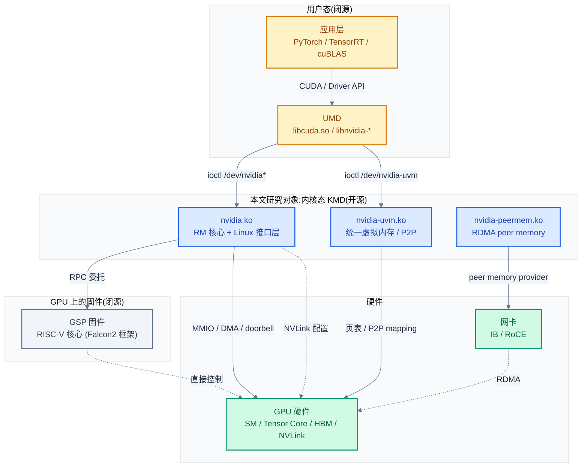
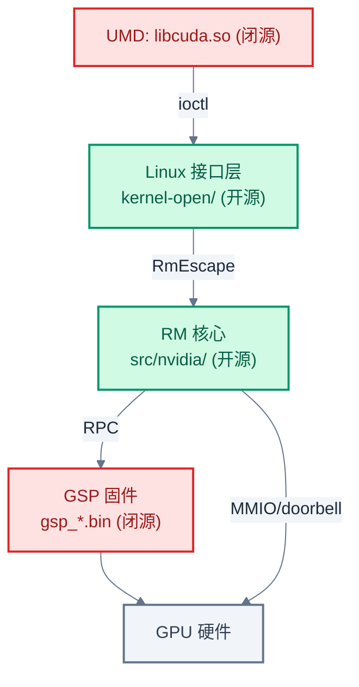

# 01 - KMD 总览与系统上下文

> NVIDIA 开源 GPU 内核驱动(open-gpu-kernel-modules)在 AI 软件栈中担任什么角色,与 UMD、硬件、相邻实现如何耦合。本章建立整个专题的认知基线。
>
> **工程师视角**:在 Linux 上,用户态的 `libcuda.so` 不能直接操作 GPU 寄存器——它必须通过内核驱动进入硬件。理解 KMD 的职责边界,才能在"UMD 报错但不知哪层的问题""P2P 性能不达标""Xid 刷屏"这类交界处问题上定位到正确的层。

### 关键术语

| 缩写 | 全称 | 含义 |
|------|------|------|
| KMD | Kernel Mode Driver | 内核态驱动,运行在 Linux 内核空间 |
| UMD | User Mode Driver | 用户态驱动,如 `libcuda.so` / `libnvidia-glcore.so` |
| RM | Resource Manager | NVIDIA 驱动的资源管理核心,对象化体系 |
| GSP | GPU System Processor | GPU 上的独立微控制器,承载部分 RM 逻辑 |
| BAR | Base Address Register | PCIe 基地址寄存器,CPU 通过它访问 GPU MMIO |
| MMIO | Memory-Mapped I/O | 内存映射 I/O,CPU 读写寄存器的方式 |
| DRM | Direct Rendering Manager | Linux 图形/显示子系统框架 |
| KMS | Kernel Mode Setting | 内核模式设置,显示输出配置 |
| NVSwitch | — | 单节点 NVLink 全互联交换芯片 |
| amdgpu | — | AMD 开源 GPU 内核驱动(对照对象) |
| nouveau | — | 社区开源 NVIDIA 驱动(对照对象) |

---

## 1. 概述

### 1.1 前置知识

| 需要了解 | 参考文档 |
|----------|----------|
| CUDA 编程模型与 GPU 硬件结构(SM/Warp/HBM) | [../cuda/01-GPU架构基础](../cuda/01-GPU架构基础.md)、[../cuda/02-CUDA编程模型](../cuda/02-CUDA编程模型.md) |
| CUDA Driver API 的用户态语义(`cuMemAlloc`/`cuLaunchKernel`) | [../cuda/06-CUDA-Driver接口与实现](../cuda/06-CUDA-Driver接口与实现.md) |
| 多 GPU 互联硬件背景(NVLink/NVSwitch/PCIe P2P) | [../nccl/02-gpu-interconnect-background](../nccl/02-gpu-interconnect-background.md) |
| Linux 内核模块、字符设备、ioctl 基础 | 内核文档 Documentation/ |
| PCIe 基础(BAR/ACS/配置空间) | [../pcie/](../pcie/) |

### 1.2 系统上下文

**项目定位**:open-gpu-kernel-modules 是 NVIDIA 于 2022 年开源的 Linux GPU 内核驱动源码,支持 Turing 及以后架构(Turing/Ampere/Ada Lovelace/Hopper/Blackwell)。它在 AI 软件栈中处于**用户态驱动(UMD)与 GPU 硬件之间**,是 `libcuda.so` 等用户态库通往 GPU 的必经之路。从 560 驱动系列起,开源内核模块成为 Turing+ GPU 的**默认推荐安装**(见 [NVIDIA Kernel Modules 文档](https://docs.nvidia.com/datacenter/tesla/driver-installation-guide/kernel-modules.html))。

**软硬件耦合点**:KMD 是典型的"组件交界处"软件,它同时耦合四个方向:

1. **向上耦合 UMD**:通过字符设备 `/dev/nvidia*`、`/dev/nvidiactl`、`/dev/nvidia-uvm` 暴露 ioctl 接口,`libcuda.so` 通过这些 ioctl 提交命令、分配显存、注册回调。UMD 是闭源的,ioctl 契约是开源 KMD 与闭源 UMD 的唯一边界。
2. **向下耦合硬件**:通过 PCIe BAR0/BAR1/BAR2 的 MMIO 访问 GPU 寄存器,通过 DMA 传输数据,通过 MSI/MSI-X 中断接收 GPU 事件。NVLink 链路、HBM 显存、Tensor Core 都由 KMD 配置与驱动。
3. **横向耦合 OS 子系统**:注册到 Linux 的字符设备框架、PCI 子系统、中断框架、电源管理(PM)、DMA-BUF、DRM(显示)。`nvidia-peermem.ko` 还注册到 IB/RDMA 子系统,让网卡能访问 GPU 显存。
4. **斜向耦合 GSP 固件**:Turing+ 架构把大量 RM 逻辑(电源、时钟、拓扑、内存训练)下沉到 GPU 上的独立微控制器(GSP)运行,KMD 的 RM 核心通过 RPC 与 GSP 固件通信。固件二进制闭源,但 RPC 协议与客户端代码开源。

**跨实现对比**:NVIDIA 的 KMD 设计与 AMD、Intel、社区方案有本质差异,详见 §5。核心区别在于 NVIDIA 把 RM 核心 OS 无关化(`src/`)+ 部分逻辑卸载到 GSP 固件,而 amdgpu 是全开源单体驱动、nouveau 依赖逆向的固件。



> **如何读这张图**:UMD 通过**两个 ioctl 入口**进入 KMD——`/dev/nvidia*`(命令提交、显存分配,走 nvidia.ko)和 `/dev/nvidia-uvm`(统一内存、P2P,走 nvidia-uvm.ko)。nvidia.ko 的 RM 核心把硬件控制逻辑通过 RPC 委托给 GSP 固件,但命令提交(GPFIFO/doorbell)由 RM 直接写 MMIO 完成。nvidia-peermem.ko 是独立的"桥梁"模块,注册到 IB 子系统,让网卡的 RDMA 引擎能直接访问 GPU 显存。

> **核心要点**:NVIDIA KMD 不是单体驱动,而是**三模块协作 + 一份固件委托**的结构——nvidia.ko 管命令与资源、nvidia-uvm.ko 管内存与 P2P、nvidia-peermem.ko 管 RDMA 桥接,GSP 固件承接硬件底层控制。这种拆分让每个模块职责单一、可独立加载,但也让"一次推理"的数据流跨多个模块,调试时需要理清在哪个模块的哪条路径上。

---

## 2. KMD 本质:在系统里干什么

在讲 5 个模块的细节之前,先回答本质问题:**KMD 到底在做什么?**

一个简化的场景:用户程序调用 `cudaMalloc(1024)` 申请 1KB 显存。这条调用经过的路径是:

```
cudaMalloc → libcuda.so(UMD) → ioctl(/dev/nvidia0, NV_ESC_RM_ALLOC_MEMORY)
    → nvidia.ko 接收 ioctl → RmEscape 解码 → RM 核心
    → (部分情况)RPC 给 GSP 固件分配 vidmem
    → 更新 GPU 页表(PDE/PTE)→ 返回 handle 给 UMD
```

KMD 在这条路径上做了三件事,这三件事构成了 KMD 的全部职责:

1. **资源管理(Resource Management)**:GPU 的显存、channel、context、event 都是有限资源,KMD 负责分配、回收、隔离。多个进程共享一个 GPU 时,KMD 保证进程 A 拿不到进程 B 的显存。这套对象化的资源管理体系就是 **RM(Resource Manager)**,是 nvidia.ko 的核心。
2. **命令提交(Submission)**:CPU 不能直接执行 GPU 代码,它只能把"要做什么"写成命令放进队列,然后通知 GPU 来取。KMD 负责管理这个队列(GPFIFO)、把 UMD 的高层请求翻译成 GPU 能懂的 method 命令、通过 doorbell 寄存器通知 GPU。
3. **硬件中介(Hardware Mediation)**:CPU 访问 GPU 的所有路径——MMIO 寄存器、DMA 传输、中断响应、电源状态——都必须经过内核态(用户态没有权限直接操作硬件)。KMD 是这些硬件访问的唯一合法入口,它做权限检查、地址翻译、中断分发。

> **为什么需要 KMD,而不是让 UMD 直接操作硬件?** 三个原因:① **安全**:多进程共享 GPU,必须有仲裁者防止越权;② **抽象**:GPU 硬件接口复杂(数千个寄存器、多代架构差异),UMD 不应关心这些;③ **OS 集成**:Linux 的内存、中断、电源、PCIe 子系统都要求内核态驱动才能接入。这与"为什么需要内核而不是用户态直接操作磁盘"是同一类问题。

KMD 的"薄与厚"是一个关键设计问题。在 NVIDIA 的实现里,KMD 的 RM 核心**看起来很薄**,因为大量底层硬件控制(PLL 配置、内存训练、链路训练、微码加载)被下沉到了 GSP 固件(详见 02)。但 RM 核心仍然管理着 channel、内存、中断等核心资源——这些是不能下沉到固件的,因为它们必须与 OS 交互(进程上下文、内存映射、文件描述符)。

---

## 3. 五个内核模块职责

open-gpu-kernel-modules 构建出 5 个可加载内核模块(.ko),每个职责单一。本专题按用户需求,重点讲前 3 个,后 2 个(显示)跳过。

| 模块 | 职责 | 本专题覆盖 | 依赖 |
|------|------|:----------:|------|
| **nvidia.ko** | 核心 GPU 驱动:PCI 探测、RM 资源管理、ioctl、中断、命令提交、显存分配、GSP 通信 | ✅ 重点 | GSP 固件 |
| **nvidia-uvm.ko** | 统一虚拟内存:CPU-GPU 共享地址空间、按需分页、页面迁移、P2P mapping | ✅ 重点 | nvidia.ko |
| **nvidia-peermem.ko** | RDMA peer memory:注册为 IB peer memory provider,让网卡访问显存 | ✅ 重点 | nvidia.ko、IB 驱动 |
| nvidia-drm.ko | DRM/KMS:显示输出、原子模式设置、Wayland 支持 | ❌ 跳过 | nvidia.ko、nvidia-modeset.ko |
| nvidia-modeset.ko | 内核模式设置:分辨率、刷新率、多显示器 | ❌ 跳过 | nvidia.ko |

### 3.1 nvidia.ko —— 核心驱动与 RM

nvidia.ko 是唯一**直接与 PCIe 设备对话**的模块。它注册 PCI 驱动、探测每张卡、映射 BAR、管理电源。同时它暴露用户态设备 `/dev/nvidia0..N`(每张卡一个)和 `/dev/nvidiactl`(控制设备),承载所有 RM ioctl。

模块入口在 `nv.c` 的 `nvidia_init_module`,字符设备注册在最后阶段:

```c
/* 摘自 [kernel-open/nvidia/nv.c](./src/open-gpu-kernel-modules/kernel-open/nvidia/nv.c) 第 975-993 行 */
    /*
     * Register char devices for both the region of regular devices
     * as well as the control device.
     *
     * NOTE: THIS SHOULD BE DONE LAST.
     */
    rc = nv_register_chrdev(0, NV_MINOR_DEVICE_NUMBER_REGULAR_MAX + 1,
            &nv_linux_devices_cdev, "nvidia", &nvidia_fops);
    if (rc < 0)
    {
        goto drivers_exit;
    }

    rc = nv_register_chrdev(NV_MINOR_DEVICE_NUMBER_CONTROL_DEVICE, 1,
            &nv_linux_control_device_cdev, "nvidiactl", &nvidia_fops);
```

这段代码体现了两个设计决策:① **两类字符设备**——`/dev/nvidia0..N` 绑定单张卡(`/dev/nvidia0` 对应 GPU0),`/dev/nvidiactl` 是全局控制设备(用于跨卡操作如版本协商、事件监听);② **最后注册**——注释 "THIS SHOULD BE DONE LAST" 说明字符设备一旦注册,用户态就能 open,因此必须在所有初始化(PCI 探测、UVM 启动、NVLink)完成后才暴露,避免用户态拿到未就绪的设备。

用户态 open 后的操作集由 `nvidia_fops` 定义:

```c
/* 摘自 [kernel-open/nvidia/nv.c](./src/open-gpu-kernel-modules/kernel-open/nvidia/nv.c) 第 249-260 行 */
/* character device entry points*/
static struct file_operations nvidia_fops = {
    .owner     = THIS_MODULE,
    .poll      = nvidia_poll,
    .unlocked_ioctl = nvidia_unlocked_ioctl,
#if NVCPU_IS_X86_64 || NVCPU_IS_AARCH64
    .compat_ioctl = nvidia_unlocked_ioctl,
#endif
    .mmap      = nvidia_mmap,
    .open      = nvidia_open,
    .release   = nvidia_close,
};
```

这个 `file_operations` 是 KMD 与 UMD 的**唯一契约边界**——UMD 通过 open/ioctl/mmap/poll 四类系统调用与 KMD 交互。注意 `compat_ioctl` 在 64 位内核处理 32 位用户态调用时也指向同一个函数,说明 ioctl 处理逻辑兼容 32/64 位。这个 fops 结构是 04 篇的起点。

> **核心要点**:nvidia.ko 通过 `nvidia_fops`(open/ioctl/mmap/poll/release)这五个入口承接所有 UMD 请求。`nvidia_fops` 既是 KMD-UMD 的契约边界,也是后续所有功能的起点——命令提交、显存分配、事件等待,最终都从这五个函数之一进入。

### 3.2 nvidia-uvm.ko —— 统一虚拟内存

nvidia-uvm.ko 是一个**独立的内核模块**,有自己独立的字符设备 `/dev/nvidia-uvm`、独立的 ioctl 体系、独立的数据结构。它不依赖 nvidia.ko 的 RM 对象体系,而是自己管理虚拟地址空间。

为什么 UVM 要独立成模块?因为 UVM 的核心职责——**按需分页与页面迁移**——需要深度挂钩 Linux 的内存子系统(`mm_struct`、`address_space`、fault handler),而 RM 核心是 OS 无关的(为了跨 Windows/Linux 复用)。把 UVM 拆出来,既能让它自由使用 Linux 内存 API,又能保持 RM 核心的 OS 无关性。这是典型的"职责驱动拆分"。

UVM 模块入口在 `uvm.c`,其 `uvm_fops`(L1070)与 nvidia.ko 的 `nvidia_fops` 完全独立。UVM 的细节在 08 篇展开,这里只需记住:UVM 独立、有自己的 ioctl、管理 CPU-GPU 共享地址空间和 P2P。

### 3.3 nvidia-peermem.ko —— RDMA 桥接

nvidia-peermem.ko 是一个小而关键的模块(单文件约 700 行),它**注册到 Linux IB/RDMA 子系统**的 peer memory provider 接口,让 IB 网卡能通过 RDMA 直接访问 GPU 显存,绕过 CPU 拷贝。

```c
/* 摘自 [kernel-open/nvidia-peermem/nvidia-peermem.c](./src/open-gpu-kernel-modules/kernel-open/nvidia-peermem/nvidia-peermem.c) 第 570 行附近 */
    reg_handle = ib_register_peer_memory_client(&nv_mem_client_ex.client,
                                                 ...);
```

这行代码是 peermem 的核心——它把一个 `peer_memory_client` 结构体注册到 IB 核心,之后当 IB 驱动需要 pin 一段 GPU 显存做 RDMA 时,会回调 peermem 提供的 `get_pages` 接口(内部调用 nvidia.ko 的 `nvidia_p2p_get_pages`)。这是 11 篇的核心,这里只需理解:peermem 是"GPU 显存 ↔ 网卡"的桥梁。

### 3.4 显示模块(drm/modeset)

nvidia-drm.ko 实现了 Linux DRM 子系统接口,nvidia-modeset.ko 是内核模式设置的桥接(底层仍调用闭源的 NVKMS 二进制 `nv-modeset-kernel.o`)。本专题聚焦推理与计算路径,显示模块不讲,但要知道它们存在——安装驱动时 `nvidia-drm modeset=1` 是常见参数。

---

## 4. 开源 vs 闭源 vs GSP:三层架构

NVIDIA 驱动的"开源程度"是分层的,容易混淆。这里明确三层:

| 层 | 开源? | 内容 | 位置 |
|----|:----:|------|------|
| **Linux 接口层** | ✅ 全开源 | PCI/字符设备/中断/锁等 Linux glue | `kernel-open/` |
| **RM 核心(OS 无关)** | ✅ GitHub 全开源 | channel/内存/fifo/gsp 客户端等 RM 逻辑 | `src/` |
| **GSP 固件二进制** | ❌ 闭源 | 运行在 GPU 微控制器上的固件 | `/lib/firmware/nvidia/<ver>/gsp_*.bin` |

### 4.1 一个常见误解:RM 核心是开源的

很多人以为"NVIDIA 只开源了薄薄一层接口,RM 核心是闭源二进制"。这只对 `.run` 安装包成立——`.run` 包为节省用户编译时间,把 `src/` 预编译为 `nv-kernel.o_binary` 打包。但 **GitHub 仓库的 `src/` 是完整源码**。README 明确说明:

> When packaged in the NVIDIA .run installation package, the OS-agnostic component is provided as a binary... Neither nvidia-drm.ko nor nvidia-uvm.ko have OS-agnostic components.
> —— [README §Kernel Interface](./src/open-gpu-kernel-modules/README.md) L140-147

也就是说,nvidia-uvm.ko 和 nvidia-drm.ko 根本没有 OS 无关部分,整个模块就是 Linux 接口层;nvidia.ko 和 nvidia-modeset.ko 才有 OS 无关的 RM 核心,而这部分在 GitHub 上是源码。这意味着 channel 调度、内存分配、fence、Xid 处理等 RM 逻辑**都能读到源码**,本专题的源码引用是扎实的。

### 4.2 GSP 固件:真正闭源的部分

GSP(GPU System Processor)是 Turing+ 架构引入的标志性设计:在 GPU 上设置一个独立的微控制器(基于 RISC-V 核心,通过 Falcon2 软件框架管理),把大量 RM 逻辑下沉到它上面跑固件。这些逻辑包括:

- 电源与时钟管理(PLL、性能状态 P0/P5)
- 内存训练(DDR/HBM 初始化、ZQ 校准)
- NVLink 链路训练的 PHY 序列
- 显示管线配置
- 微码加载(SEC2/FSP 等子引擎)

GSP 固件以二进制 blob 形式提供(`/lib/firmware/nvidia/610.43.03/gsp_ga10x.bin`、`gsp_tu10x.bin`),**闭源**。但 RM 核心(`src/nvidia/src/kernel/gpu/gsp/kernel_gsp.c`)通过 RPC 与 GSP 通信的**协议与客户端代码是开源的**——你能看到 RM 发什么 RPC 请求、GSP 返回什么,但看不到 GSP 内部怎么处理。

> **为什么要把 RM 逻辑下沉到 GSP 固件?** 三个原因:① **跨 OS 复用**:同一份固件能在 Linux/Windows/vGPU 上跑,RM 核心只需发 RPC,不必每平台都实现一套硬件初始化;② **保护 IP**:PLL 配置、训练算法是 NVIDIA 的核心知识产权,放固件里不开源;③ **稳定性**:固件运行在独立微控制器上,不受 CPU 侧 OS 崩溃影响,能做更可靠的错误恢复。这与 ARM TF-A 把底层 PSCI 实现放 EL3 固件是同类设计(见 [../trusted-firmware/](../trusted-firmware/))。

### 4.3 三层在源码中的对应



> **如何读这张图**:红色是闭源(UMD 与 GSP 固件),绿色是开源(Linux 接口层与 RM 核心)。UMD 通过 ioctl 进入开源的 Linux 接口层,再经 `RmEscape` 进入开源的 RM 核心;RM 核心把硬件控制类逻辑通过 RPC 委托给闭源的 GSP 固件,但命令提交(MMIO/doorbell)由 RM 核心直接完成。**本专题能引用的源码是两个绿色层**,红色层的内部逻辑只能通过行为推断或官方文档。

---

## 5. 跨实现对比:NVIDIA vs AMD vs nouveau

把 NVIDIA KMD 放到行业背景里,才能看清它的设计取舍。

| 对比维度 | NVIDIA open-gpu-kernel-modules | AMD amdgpu | nouveau(社区 NVIDIA) |
|----------|-------------------------------|------------|------------------------|
| **KMD 开源** | ✅ Linux 接口层 + RM 核心 | ✅ 全开源(单体) | ✅ 全开源 |
| **UMD 开源** | ❌ libcuda.so 闭源 | ✅ Mesa(radv/radeonsi) | ✅ Mesa(nouveau) |
| **固件开源** | ❌ GSP 固件闭源 | ⚠️ 部分固件开源 | ❌ 依赖逆向 GSP(曾受阻) |
| **架构分层** | 接口层 + RM 核心(OS 无关)+ GSP 固件 | 单体驱动,无 OS 无关分离 | 单体驱动 |
| **硬件控制位置** | GSP 固件(下沉) | KMD 内(直接写寄存器) | KMD 内(逆向寄存器) |
| **支持架构** | Turing+(2018+) | GCN/RDNA 全系 | 多代但功能受限 |
| **默认推荐** | 560+ 系列起默认(Turing+) | 一直是默认 | 发行版可选 |
| **计算生态** | CUDA(闭源 UMD) | ROCm/OpenCL(Mesa+ROCm) | 有限(无 CUDA) |
| **显示** | nvidia-drm + NVKMS 闭件 | amdgpu + Mesa(DCN) | nouveau + Mesa(NV) |

> **核心要点**:NVIDIA 的设计是**"KMD 开源、UMD 闭源、固件闭源"**的三明治结构——与 AMD 的"全开源栈(KMD+UMD+部分固件)"形成鲜明对比。这意味着:理解 NVIDIA 推理全链路,只能看到 KMD 这一层的源码;而理解 AMD 推理全链路,能从 Mesa 一路看到寄存器。但 NVIDIA 的 GSP 固件设计换来了跨 OS 复用与 IP 保护,这是商业取舍。

对学习者的启示:
- 想看"完整开源 GPU 栈",AMD amdgpu + Mesa 是更好的对象
- 想看"现代 GPU 驱动的工程化分层与固件卸载",NVIDIA KMD 是优秀样本
- 想理解"为什么 NVIDIA 能保持 CUDA 生态壁垒",看 UMD 闭源 + GSP 固件闭源这两层

nouveau 是特殊存在——它是社区为 NVIDIA GPU 逆向的开源驱动,长期受 GSP 固件不可用困扰(Turing+ 必须用 GSP 才能初始化)。NVIDIA 开源官方 KMD 后,nouveau 反而能从官方源码获取固件布局信息(README 提到 `nouveau/` 目录的工具用于提取固件图像)。

---

## 6. 与 cuda/nccl 笔记的衔接

本专题不是从零开始,而是衔接已有两个专题:

### 6.1 从 cuda/ 接续

[cuda/](../cuda/) 系列 10 篇覆盖了 GPU 硬件、CUDA 编程模型、Runtime、Driver API,但**停在用户态界面**:

| cuda/ 讲到哪 | nvidia-kmd/ 从哪接 |
|--------------|---------------------|
| [cuda/06 §5](../cuda/06-CUDA-Driver接口与实现.md) `cuMemAlloc`/`cuMemFree` 的 API 语义与错误码 | 04 讲 `NV_ESC_RM_ALLOC_MEMORY`(0x27)在内核侧如何分配显存 |
| [cuda/06 §4](../cuda/06-CUDA-Driver接口与实现.md) `cuModuleLoad`/`cuLaunchKernel` 的 API | 05 讲 `cuLaunchKernel` 如何变成 channel 里的 GPFIFO 命令 |
| [cuda/09 §3](../cuda/09-多GPU编程与互联拓扑.md) `cudaDeviceEnablePeerAccess` 的 UMD 语义 | 10 讲它最终走到 `uvm_api_enable_peer_access` 建立 peer mapping |

### 6.2 从 nccl/ 接续

[nccl/](../nccl/) 系列 11 篇覆盖了集合通信库,但**停在 transport 层的"CUDA API 调用"**:

| nccl/ 讲到哪 | nvidia-kmd/ 从哪接 |
|--------------|---------------------|
| [nccl/08 §2](../nccl/08-transport-layer.md) P2P transport "复用 CUDA 的 `cudaDeviceEnablePeerAccess`" | 10 拆解这个 API 在内核做了什么(UVM peer mapping + NVLink 拓扑检查) |
| [nccl/08 §4.3](../nccl/08-transport-layer.md) GDR "需 `nvidia-peermem` 模块" 一句带过 | 11 完整拆解 peermem 模块的 `ib_register_peer_memory_client` 与回调机制 |
| [nccl/02](../nccl/02-gpu-interconnect-background.md) NVLink 硬件背景(NVLink4/NVSwitch/MNNVL) | 09 不重复硬件,只讲 KMD 视角——拓扑发现、链路训练、sysfs 暴露 |

### 6.3 不重复原则

本专题严格遵守"不讲相邻笔记已讲过的":

| 主题 | 已在 | 本专题不讲,只讲 |
|------|------|-----------------|
| CUDA API 语义 | cuda/ | 内核侧落地(ioctl/RM) |
| NVLink 硬件背景 | nccl/02 | KMD 如何发现/配置 NVLink |
| IB Verbs/RDMA 协议 | rdma/ | peermem 如何注册为 provider |
| PCIe P2P 协议 | pcie/ | `nvidia_p2p_get_pages` 实现与 ACS 影响 |
| NCCL transport 选择 | nccl/08 | 被选中的内核侧路径 |

> **核心要点**:本专题的定位是**填空**——cuda/ 讲到 UMD 界面停下,nccl/ 讲到 transport 的 CUDA API 调用停下,本专题从这两处停下地方接续,深入到内核态。阅读时建议把 cuda/06 与 nccl/08 作为前置,随时对照"UMD 侧的 API"与"KMD 侧的实现"。

---

## 7. 阅读地图

后续 10 篇按四个阶段递进:

- **阶段一(02)**:源码架构与 RM/GSP 分层——讲清 `kernel-open/` 与 `src/` 的分层动机、RM 三层架构、GSP 的 RPC 模型、构建系统。这是理解后续所有章节的基础。
- **阶段二(03-07)**:推理全链路——03 总览一次推理经过的所有层,04-07 分别展开 ioctl 接口、命令提交、中断同步、显存管理。同步篇紧跟命令提交,闭合"提交→执行→通知"的回路。
- **阶段三(08)**:UVM 独立子系统——按需分页与页面迁移,推理中 CUDA Managed Memory 的 KMD 落地。
- **阶段四(09-11)**:多卡通信——NVLink 拓扑与训练、P2P peer mapping、GPUDirect RDMA,每篇以 NCCL 期望的内核契约开篇。

---

## 官方文档索引

- [open-gpu-kernel-modules README](./src/open-gpu-kernel-modules/README.md) — 本地源码 README,§Kernel Interface 讲清开源/闭源分层,§Directory Structure 讲清目录布局
- [NVIDIA Kernel Modules Documentation](https://docs.nvidia.com/datacenter/tesla/driver-installation-guide/kernel-modules.html) — 官方安装指南,讲开源 vs 闭源模块选型、Turing+ 限制
- [NVIDIA GPU Driver README (kernel_open)](https://us.download.nvidia.com/XFree86/Linux-x86_64/610.43.03/README/kernel_open.html) — 开源模块特性与限制
- [NVIDIA Open GPU Kernel Modules (DeepWiki)](https://deepwiki.com/NVIDIA/open-gpu-kernel-modules) — 社区源码导览,辅助理解各子系统

---

## 参考资料

- [NVIDIA/open-gpu-kernel-modules](https://github.com/NVIDIA/open-gpu-kernel-modules) — 参考了 README §Kernel Interface(L130-147 开源分层说明)、§Directory Structure(L153-165 目录布局)
- [NVIDIA Kernel Modules Documentation](https://docs.nvidia.com/datacenter/tesla/driver-installation-guide/kernel-modules.html) — 参考了"560 系列起开源模块为默认推荐""Turing+ 限制"
- [Exploring NVIDIA Linux Drivers Internals](https://fuzzinglabs.com/exploring-nvidia-linux-drivers-internals-basics-ioctls/) — 参考了 5 模块职责、GSP 固件路径、ioctl 入口分析
- [Revealing NVIDIA Closed-Source Driver Command Streams (arXiv:2604.26889)](https://arxiv.org/html/2604.26889v1) — 参考了 §4 命令提交架构(GPFIFO/doorbell/GP_Put)
- 本地源码 [src/open-gpu-kernel-modules/](./src/open-gpu-kernel-modules/) — 版本 610.43.03

---

**下一篇**:[02 - 源码架构与 RM/GSP 分层设计](./02-源码架构与RM分层设计.md) —— 从 5 模块的职责进入源码内部,讲清 `kernel-open/` 与 `src/` 的分层动机、RM 三层架构、GSP 固件的 RPC 委托模型,以及构建系统如何把两套源码组装成 .ko。
