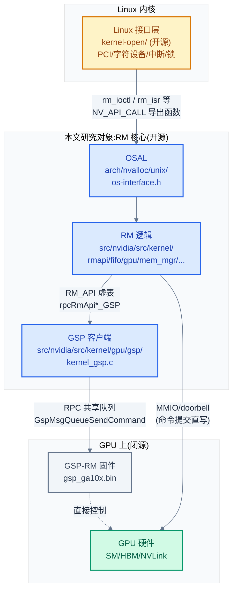
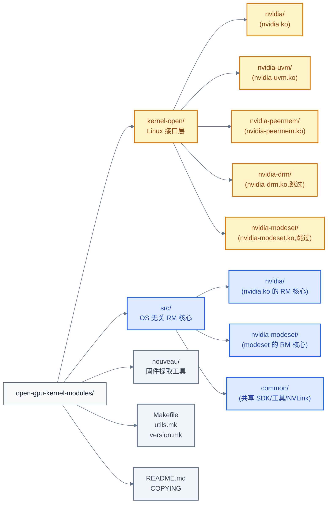
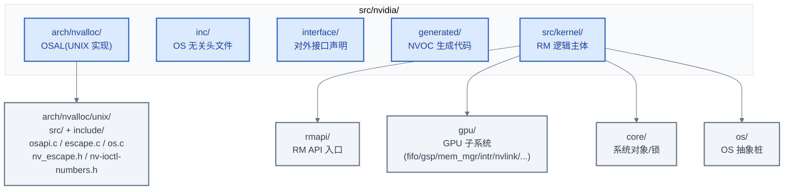
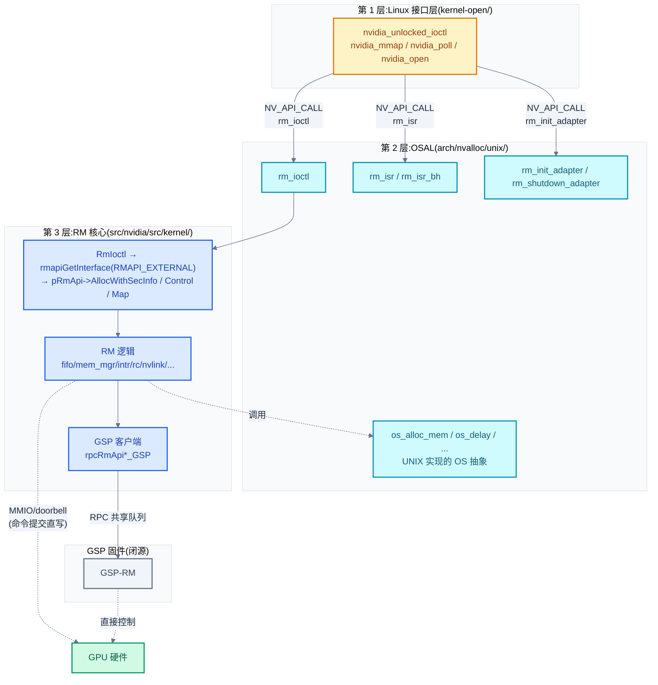
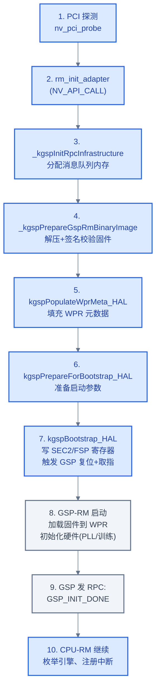
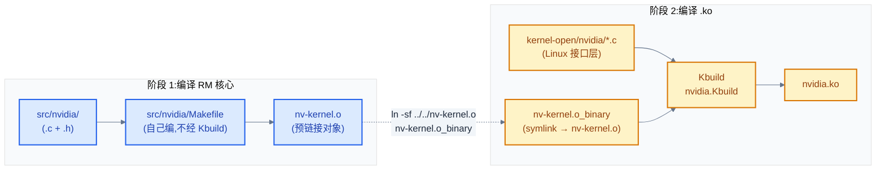
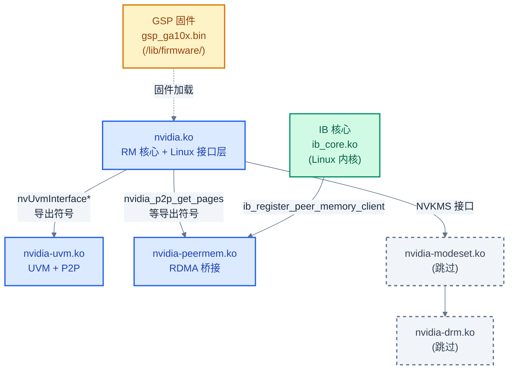
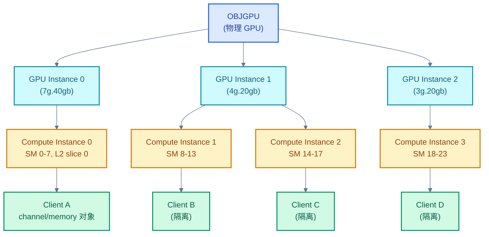

# 02 - 源码架构与 RM/GSP 分层设计

> 从 5 模块的职责进入源码内部,讲清 `kernel-open/` 与 `src/` 的分层动机、RM 三层架构、GSP 固件的 RPC 委托模型,以及构建系统如何把两套源码组装成 `.ko`。
>
> **工程师视角**:看到 `_kgspRpcSendMessage`、`rmapiGetInterface(RMAPI_EXTERNAL)->AllocWithSecInfo(...)` 这类调用时,能立刻判断"现在在 Linux 接口层 / RM 核心 / GSP RPC 边界"的哪一层,是定位 KMD 问题、阅读堆栈的基本功。

### 关键术语

| 缩写 | 全称 | 含义 |
|------|------|------|
| RM | Resource Manager | NVIDIA 驱动的资源管理核心,对象化体系 |
| RM API | — | RM 暴露给调用者的虚函数表(`RM_API` 结构体),封装 Alloc/Free/Control/Map 等操作 |
| GSP | GPU System Processor | GPU 上的独立微控制器(Turing+ 引入,RISC-V 核心 + Falcon2 框架),承载部分 RM 逻辑 |
| GSP-RM | GSP Resource Manager | 运行在 GSP 上的 RM 实例,处理物理硬件控制 |
| CPU-RM | — | 运行在 CPU 内核态的 RM 客户端逻辑(本专题主要研究对象) |
| RPC | Remote Procedure Call | RM 核心与 GSP 固件之间的通信原语,经共享消息队列 |
| OSAL | OS Abstraction Layer | OS 抽象层,RM 核心通过它访问 OS 服务(内存/锁/中断) |
| OS-agnostic | — | OS 无关,RM 核心不依赖具体 OS,可跨 Linux/Windows 复用 |
| NVOC | NVIDIA Object Class | RM 内部的对象系统,生成器根据类描述生成 HAL 跳转代码 |
| HAL | Hardware Abstraction Layer | 硬件抽象层,按 GPU 架构族(TU10x/GA10x/AD10x/...)提供不同实现 |
| MIG | Multi-Instance GPU | Hopper/Ampere 起的 GPU 切片技术,把一张卡切成多个独立实例 |
| WPR | Write Protected Region | GSP 固件镜像所在显存区,只读保护 |
| MCTP | Management Component Transport Protocol | GSP RPC 消息的传输层协议头 |
| NVDM | NVIDIA Data Message | GSP RPC 消息的 NVIDIA 私有消息头 |
| Kbuild | — | Linux 内核构建系统,`nvidia.Kbuild` 描述 nvidia.ko 的源文件与编译选项 |

---

## 1. 概述

### 1.1 前置知识

| 需要了解 | 参考文档 |
|----------|----------|
| KMD 在系统中的位置、5 模块职责、开源/闭源三层 | [01-KMD总览与系统上下文](./01-KMD总览与系统上下文.md) |
| Linux 内核模块的 Kbuild 构建系统、字符设备框架 | 内核文档 Documentation/kbuild/ |
| 面向对象的 C 设计模式(函数指针表 / vtable) | 通用知识 |
| GPU 架构代号(Turing/Ampere/Hopper/Blackwell) | [../cuda/01-GPU架构基础](../cuda/01-GPU架构基础.md) |

### 1.2 系统上下文

> 上一章建立了"5 模块 + 三层架构(开源接口层 / 开源 RM 核心 / 闭源 GSP 固件)"的认知基线。一个自然的问题是:**这套分层在源码里长什么样?为什么 RM 核心看起来"薄",而 GSP 固件承担了那么多?** 本章从源码组织出发回答这个问题——先看仓库顶层结构,再拆 `kernel-open/` 与 `src/` 两套源码,接着讲 RM 三层架构如何通过 `RM_API` 虚表把 CPU-RM 与 GSP-RM 透明切换,最后讲构建系统如何把两套源码组装成 5 个 `.ko`。

**项目定位(回顾)**:open-gpu-kernel-modules 是 NVIDIA 在 Linux 上唯一的官方 KMD 源码。它不是从零写的 Linux 驱动,而是 **NVIDIA 跨平台 RM 核心在 Linux 上的移植**——RM 核心是一份 OS 无关代码(`src/`),通过一层薄薄的 Linux 接口层(`kernel-open/`)接入 Linux 内核。这种"OS 无关核心 + OS 接口层"的分层是 NVIDIA 驱动跨 Windows/Linux/vGPU 复用的基础。

**软硬件耦合点**:本章聚焦的耦合点是**RM 核心与 GSP 固件之间的 RPC 边界**——这是开源代码与闭源固件的接口,也是理解"为什么 RM 看起来薄"的关键。所有需要直接操作硬件寄存器(PLL、内存训练、链路训练)的逻辑都被下沉到 GSP-RM,CPU-RM 通过 RPC 委托。

**跨实现对比**:与 AMD amdgpu 的"单体驱动 + 直接寄存器访问"相比,NVIDIA 的"RM 核心 + GSP RPC 委托"分层让代码 OS 无关化做得更彻底,但也让一次硬件操作的延迟变长(要走 RPC 往返)。详见 §10。



> **如何读这张图**:Linux 接口层通过 `rm_ioctl`/`rm_isr` 等 `NV_API_CALL` 导出函数进入 RM 核心;RM 核心内部按 OSAL → RM 逻辑 → GSP 客户端的顺序串联;当 RM 逻辑需要操作硬件底层(分配 vidmem、配置 PLL、训练 NVLink)时,通过 `RM_API` 虚表调用 `rpcRmApi*_GSP` 系列函数,这些函数把请求打包成 RPC 消息,通过共享消息队列(`GspMsgQueueSendCommand`)发给 GSP-RM 固件;GSP-RM 直接控制硬件。但**命令提交(GPFIFO/doorbell)不走 RPC**,由 RM 核心直接写 MMIO 完成——这是性能关键路径,RPC 往返无法承受。

> **核心要点**:NVIDIA KMD 的源码是**"Linux 接口层(`kernel-open/`)+ RM 核心(`src/`)"两套代码,加上一份闭源 GSP 固件**组装而成。RM 核心通过 `RM_API` 虚表把"硬件控制类操作"透明重定向到 GSP-RM 固件,使 CPU-RM 看起来很薄,但保留了"命令提交"等性能关键路径在 CPU 侧直接执行。

---

## 2. 仓库顶层结构

进入 `nvidia-kmd/src/open-gpu-kernel-modules/`,顶层只有 5 个目录:



| 目录 | 内容 | 编译产物 |
|------|------|----------|
| `kernel-open/` | **Linux 接口层**:PCI 探测、字符设备、ioctl 入口、MSI 中断、Linux 锁与内存 API | 5 个 `.ko` |
| `src/` | **OS 无关 RM 核心**:RM 对象体系、channel/fifo、内存管理、GSP 客户端 | `nv-kernel.o`(预链接对象) |
| `nouveau/` | Python 工具:从源码提取 GSP 固件二进制布局,供 nouveau 驱动使用 | 工具脚本 |
| 顶层 `Makefile` + `utils.mk` | 构建 orchestrator:先编 `src/` 得到 `nv-kernel.o`,再编 `kernel-open/` 得到 `.ko` | — |
| `version.mk` | 驱动版本号(本仓库为 610.43.03) | — |

> **为什么 `src/` 下没有 `nvidia-uvm/` 与 `nvidia-peermem/`?** 因为这两个模块**根本没有 OS 无关部分**——UVM 和 peermem 的所有逻辑都深度依赖 Linux 内存/IB 子系统,无法跨 OS 复用。README L140-147 明确说:"Neither nvidia-drm.ko nor nvidia-uvm.ko have OS-agnostic components." 所以 UVM 与 peermem 整个模块就是 Linux 接口层,没有 RM 核心那种分层。这是"按 OS 耦合度拆分"的典型设计。

---

## 3. `kernel-open/`:Linux 接口层

`kernel-open/` 是 KMD 与 Linux 内核的直接接触面。它包含 5 个子目录,每个对应一个 `.ko`:

| 子目录 | 模块 | 行数(估) | 关键文件 |
|--------|------|----------|----------|
| `nvidia/` | nvidia.ko | ~10万 | `nv.c`(入口)、`nv-pci.c`(PCI)、`nv-frontend.c`、`nv-p2p.c`、`nvlink_linux.c`、`nv-acpi.c`、`nv-msi.c` |
| `nvidia-uvm/` | nvidia-uvm.ko | ~13万 | `uvm.c`(入口)、`uvm_va_space.c`、`uvm_va_block.c`、`uvm_gpu.c` 等 |
| `nvidia-peermem/` | nvidia-peermem.ko | ~700 | `nvidia-peermem.c`(单文件) |
| `nvidia-drm/` | nvidia-drm.ko | — | 跳过 |
| `nvidia-modeset/` | nvidia-modeset.ko | — | 跳过 |

接口层只做三件事,不做业务逻辑:

1. **OS 集成**:注册 PCI 驱动、注册字符设备、注册 MSI/MSI-X 中断、注册到 DRM/PM/ACPI 子系统。所有 Linux 特定的框架接入都在这里。
2. **数据搬运**:把 UMD 通过 `ioctl`/`mmap`/`poll` 提交的参数从用户空间拷贝到内核,转交给 RM 核心;RM 处理完后再拷贝回去。
3. **接口适配**:把 Linux 内核的概念(`tasklet`/`spinlock_t`/`mm_struct`)翻译成 RM 核心期望的 OSAL 接口(`os_wait_queue`/`portSyncSpinlock`)。

接口层的入口是 `nv.c` 的 `nvidia_init_module`,它先注册 PCI 驱动,再注册字符设备(详见 [01 §3.1](./01-KMD总览与系统上下文.md#31-nvidiako--核心驱动与-rm))。一旦用户态 `open("/dev/nvidia0")`,后续的 `ioctl` 全部进入 `nvidia_unlocked_ioctl`:

```c
/* 摘自 [kernel-open/nvidia/nv.c](./src/open-gpu-kernel-modules/kernel-open/nvidia/nv.c) 第 2833-2840 行 */
long nvidia_unlocked_ioctl(
    struct file *file,
    unsigned int cmd,
    unsigned long i_arg
)
{
    return nvidia_ioctl(NV_FILE_INODE(file), file, cmd, i_arg);
}
```

`nvidia_ioctl` 内部是一个 `switch (cmd)`,但**只直接处理 8 个简单 ioctl**——版本协商、卡信息查询、NUMA、DMA-BUF 导出、设备中断查询。这些 ioctl 不涉及 RM 对象,纯 OS 层操作:

```c
/* 摘自 [kernel-open/nvidia/nv.c](./src/open-gpu-kernel-modules/kernel-open/nvidia/nv.c) 第 2804-2807 行 */
    default:
        rmStatus = rm_ioctl(sp, nv, &nvlfp->nvfp, arg_cmd, arg_copy, arg_size);
        status = ((rmStatus == NV_OK) ? 0 : -EINVAL);
        break;
```

所有其他 ioctl(NV_ESC_RM_ALLOC / NV_ESC_RM_FREE / NV_ESC_RM_CONTROL / NV_ESC_RM_ALLOC_MEMORY 等)落入 `default:` 分支,调用 `rm_ioctl()`。这个函数是 Linux 接口层与 RM 核心的边界——`NV_API_CALL` 注解说明它由 RM 核心导出:

```c
/* 摘自 [src/nvidia/arch/nvalloc/unix/include/nv.h](./src/open-gpu-kernel-modules/src/nvidia/arch/nvalloc/unix/include/nv.h) 第 1172 行 */
NV_STATUS  NV_API_CALL  rm_ioctl                 (nvidia_stack_t *, nv_state_t *, nv_file_private_t *, NvU32, void *, NvU32);
```

> **为什么需要 `NV_API_CALL`?** 这个宏在 [kernel-open/common/inc/nv-kernel-interface-api.h](./src/open-gpu-kernel-modules/kernel-open/common/inc/nv-kernel-interface-api.h) L36-38 定义,在 x86_64 + altstack 环境下展开为 `__attribute__((altstack(0)))`,告诉编译器这个函数不能在 alternate signal stack 上执行(因为 RM 栈较大,会溢出 altstack)。这是 NVIDIA 为了解决"内核信号栈太小导致 RM 调用栈溢出"问题的工程修复。功能上等同于普通函数调用,但标记了"跨层边界"——所有 `NV_API_CALL` 函数都是 Linux 接口层与 RM 核心之间的桥接函数。

> **核心要点**:`kernel-open/` 是**薄 OS 适配层**——只做 PCI/字符设备/中断注册、参数拷贝、OS 概念翻译,不做任何业务逻辑。它通过 `rm_ioctl`/`rm_isr`/`rm_init_adapter` 等 `NV_API_CALL` 函数把控制权交给 RM 核心。这种"薄 OS 层 + 厚 RM 核心"是 NVIDIA 跨 OS 复用 RM 代码的基础——Windows 驱动也用同一份 RM 核心,只换 OS 层。

---

## 4. `src/`:OS 无关 RM 核心

`src/` 是 RM 核心所在地,跨 Linux/Windows/vGPU 复用。它内部又分三层:



### 4.1 `src/nvidia/arch/nvalloc/unix/`:OSAL 的 UNIX 实现

OSAL 是 OS 抽象层。RM 核心通过一组 `os_*` 函数访问 OS 服务(分配内存、加锁、读时间),不直接调用 Linux API。`arch/nvalloc/unix/` 是这套抽象的 UNIX 实现:

| 文件 | 职责 |
|------|------|
| `src/osapi.c` (6232 行) | OSAL 主入口:实现 `rm_ioctl`、`rm_cleanup_file_private`、`rm_validate_ioctls` 等导出函数;事件管理;client 清理 |
| `src/os.c` | `os_alloc_mem`/`os_free_mem`/`os_get_current_tick`/`os_delay` 等 OS 抽象的 UNIX 实现 |
| `src/osinit.c` | OSAL 初始化 |
| `src/osmemdesc.c` | 内存描述符的 OS 层实现(对接 Linux 的 `dma_alloc_coherent`/`alloc_pages`) |
| `src/osunix.c` | UNIX 通用 OS 例程 |
| `src/unix_intr.c` | 中断处理的 UNIX 适配 |
| `src/escape.c` (1011 行) | 旧的 `RmEscape` 解码分发(已被 `rm_ioctl` 替代,保留兼容) |
| `include/os-interface.h` | OSAL 函数声明(供 RM 核心调用) |
| `include/nv_escape.h` | `NV_ESC_*` ioctl 命令宏定义 |
| `include/nv-ioctl-numbers.h` | `NV_ESC_*` 编号(详见 04 篇) |
| `include/nv-ioctl.h` | ioctl 参数结构体 |

`rm_ioctl` 在 OSAL 层做最后一道分发——它先处理 3 个 OS 层 ioctl(alloc OS event、free OS event、get event data),其余继续下沉到 RM 核心的 `RmIoctl`:

```c
/* 摘自 [src/nvidia/arch/nvalloc/unix/src/osapi.c](./src/open-gpu-kernel-modules/src/nvidia/arch/nvalloc/unix/src/osapi.c) 第 2908-2982 行 */
NV_STATUS NV_API_CALL rm_ioctl(
    nvidia_stack_t     *sp,
    nv_state_t         *pNv,
    nv_file_private_t  *nvfp,
    NvU32               Command,
    void               *pData,
    NvU32               dataSize
)
{
    /* ... 省略 NV_ENTER_RM_RUNTIME ... */
    switch (Command)
    {
        case NV_ESC_ALLOC_OS_EVENT:
        {
            /* ... 直接由 OSAL 处理 ... */
            break;
        }
        case NV_ESC_FREE_OS_EVENT:
        {
            /* ... 直接由 OSAL 处理 ... */
            break;
        }
        case NV_ESC_RM_GET_EVENT_DATA:
        {
            /* ... 直接由 OSAL 处理 ... */
            break;
        }
        default:
        {
            threadStateInit(&threadState, THREAD_STATE_FLAGS_NONE);
            rmStatus = RmIoctl(pNv, nvfp, Command, pData, dataSize);
            threadStateFree(&threadState, THREAD_STATE_FLAGS_NONE);
            break;
        }
    }
    /* ... 省略 NV_EXIT_RM_RUNTIME ... */
    return rmStatus;
}
```

这段代码体现了 OSAL 的设计取舍:① **OS 层快路径**——OS event alloc/free/get 这三个高频小 ioctl 不必进入 RM 核心加锁,直接在 OSAL 处理;② **委托 RM 核心**——`NV_ESC_RM_ALLOC/FREE/CONTROL` 等 RM 对象操作必须走 `RmIoctl`,因为它们需要 RM API 锁、GPU 锁、对象查找;③ **线程状态**——进入 RM 前后必须 `threadStateInit`/`Free`,因为 RM 内部的超时与递归检查依赖线程本地存储。

### 4.2 `src/nvidia/src/kernel/`:RM 逻辑主体

这是 RM 核心的"业务代码",按子系统组织:

| 子目录 | 职责 | 关键文件 |
|--------|------|----------|
| `rmapi/` | RM API 入口与分发:`RmIoctl`、`rmapiGetInterface`、`AllocWithSecInfo`/`Control`/`Map` 等虚函数实现 | `rmapi.c`(1098)、`entry_points.c`(599)、`alloc_free.c`、`mapping.c` |
| `gpu/fifo/` | Channel/GPFIFO/Runlist 调度 | `kernel_fifo.c`(3866)、`kernel_channel.c`(4704)、`kernel_fifo_ctrl.c`、`usermode_api.c` |
| `gpu/gsp/` | GSP 客户端:RPC 队列、固件加载、booter | `kernel_gsp.c`(6901)、`message_queue_cpu.c`、`kernel_gsp_booter.c` |
| `gpu/mem_mgr/` | 显存分配、堆管理、residency | `mem_mgr.c`(4240)、`sem_surf.c` |
| `gpu/mmu/` | 页表(PDE/PTE)构建与管理 | `kernel_mmu.c` 系列 |
| `gpu/intr/` | 中断分发与处理 | `intr.c`、`intr_service.c` |
| `gpu/rc/` | RC(Resource Check)错误处理与 Xid | `kernel_rc.c` 系列 |
| `gpu/nvlink/` | NVLink 拓扑/训练/连接管理 | `kernel_nvlink.c`、`kernel_nvlinkcorelibtrain.c` |
| `gpu/mig_mgr/` | MIG 切片管理 | `kernel_mig_manager.c` |
| `gpu/` 顶层 | `OBJGPU` 对象,所有 GPU 状态的中心 | `gpu.c`、`device.c`、`subdevice.c` |
| `core/` | 系统对象 `OBJSYS`、锁、HAL 管理器 | `system.c`、`locks.c`、`hal_mgr.c` |
| `os/` | OS 抽象桩(空实现,由 OSAL 覆盖) | `os_init.c`、`os_stubs.c` |

`gpu/` 子目录还有大量按引擎划分的目录:`gr/`(Graphics)、`ce/`(Copy Engine)、`nvdec/`、`nvenc/`、`sec2/`、`fsp/`、`pmu/`、`timer/`、`bus/`、`bif/`、`mc/`(Master Control)、`perf/`、`power/` 等。每个引擎都是一个 `OBJGPU` 子对象,有 `*_init`/`*_destroy`/`*_getState` 等方法。这是 NVIDIA 把 GPU 硬件功能模块化的方式。

### 4.3 `src/common/`:跨模块共享代码

`src/common/` 包含多个模块共享的代码,最关键的是:

- `src/common/sdk/nvidia/inc/` — 公共 SDK 头文件(类定义、寄存器定义、ioctl 编号)
- `src/common/nvlink/` — NVLink 子系统(独立于 nvidia.ko 的 RM,被 nvidia.ko 与 nvswitch.ko 共享)
- `src/common/shared/inc/` — 跨平台工具头文件
- `src/common/uproc/os/` — GSP/PMU 等微控制器固件用的 LibOS 头文件

---

## 5. RM 三层架构

把 §3、§4 串起来,得到 RM 的完整三层架构。这是本章的核心图:



> **如何读这张图**:三层颜色由浅到深——黄色是 Linux 接口层(只做 OS 适配)、青色是 OSAL(UNIX 实现的 OS 抽象)、蓝色是 RM 核心(业务逻辑)。层与层之间通过 `NV_API_CALL` 导出函数耦合,每层都有明确的输入输出契约。**特别注意**:RM 核心有两路到达硬件——一路通过 RPC 委托给 GSP-RM(用于硬件控制类操作),一路直接写 MMIO(用于命令提交,即 GPFIFO/doorbell)。这两路的分离是性能关键设计。

### 5.1 一次 `cuMemAlloc` 的层间穿梭

用一个具体例子把三层串起来。用户态调用 `cuMemAlloc(1024)`,经过 UMD 后变成 `ioctl(/dev/nvidia0, NV_ESC_RM_ALLOC_MEMORY, ...)` 进入内核:

1. **Linux 接口层**:`nvidia_unlocked_ioctl` → `nvidia_ioctl` switch default → `rm_ioctl(sp, nv, nvfp, NV_ESC_RM_ALLOC_MEMORY, ...)`。这一层只做参数拷贝与命令分发。
2. **OSAL**:`rm_ioctl` switch default → `RmIoctl(pNv, nvfp, NV_ESC_RM_ALLOC_MEMORY, ...)`。这一层做线程状态初始化、加 RM API 锁。
3. **RM 核心**:`RmIoctl` 解码命令 → `rmapiGetInterface(RMAPI_EXTERNAL)->AllocWithSecInfo(...)` → 选择 `MemoryManager` 类的 alloc 方法 → 在堆里找一段 vidmem → **如果是 GSP-client GPU**(Turing+ 默认),`AllocWithSecInfo` 被虚表重定向到 `rpcRmApiAlloc_GSP` → 打包 RPC → `GspMsgQueueSendCommand` → GSP-RM 真正分配 vidmem 并返回 handle。
4. **返回路径**:handle 经 RM 核心 → OSAL → Linux 接口层 → UMD → 用户态。

这个例子展示了三层各自干什么:**接口层搬运,OSAL 加锁与线程状态,RM 核心做业务(可能再委托给 GSP)**。理解了这条路径,后续看任何 RM 调用栈都能立刻定位"在哪一层"。

---

## 6. RM 对象模型与 `RM_API` 虚表

### 6.1 对象化资源体系

RM 把 GPU 上的所有资源都对象化——client、device、context、channel、memory、event 都是对象,有统一的 handle 与生命周期。这套体系的入口是 `RsResInfoInitialize()` 与 `serverConstruct()`:

```c
/* 摘自 [src/nvidia/src/kernel/rmapi/rmapi.c](./src/open-gpu-kernel-modules/src/nvidia/src/kernel/rmapi/rmapi.c) 第 96-109 行 */
    RsResInfoInitialize();
    status = serverConstruct(&g_resServ, RS_PRIV_LEVEL_HOST, 0);

    if (status != NV_OK)
    {
        NV_PRINTF(LEVEL_ERROR, "*** Cannot initialize resource server\n");
        goto failed_free_cache;
    }

    serverSetClientHandleBase(&g_resServ, RS_CLIENT_HANDLE_BASE);

    listInit(&g_clientListBehindGpusLock, g_resServ.pAllocator);
    listInit(&g_userInfoList, g_resServ.pAllocator);
    multimapInit(&g_osInfoList, g_resServ.pAllocator);
```

这段代码体现了 RM 对象模型的三个核心概念:① **`g_resServ` 是全局资源服务器**——所有 RM 对象都在它里面登记,生命周期由它管理;② **`RS_PRIV_LEVEL_HOST`**——privilege level(特权级),区分 kernel/user/host 三种来源的对象,做权限隔离;③ **三个全局链表**——`g_clientListBehindGpusLock` 跨 GPU 的 client、`g_userInfoList` 用户信息、`g_osInfoList` OS 信息,用于在 client 销毁时清理资源。

对象通过 `class ID`(如 `NV01_ROOT`、`NV01_MEMORY_LOCAL_USER`)区分类型。每个 class 在 `resource_list.h` 注册了一组方法(alloc/free/control/map)。NVOC 代码生成器根据类描述生成 HAL 跳转表——例如 `mem_mgr.c` 里的 `MemoryManager` 类有 `memmgrInit*_KERNEL`、`memmgrAlloc*_FWCLIENT` 等多个按架构/客户端类型生成的实现。

### 6.2 `RM_API` 虚表:CPU-RM 与 GSP-RM 的透明切换

`RM_API` 是 RM 暴露给调用者的虚函数表,封装 Alloc/Free/Control/Map 等操作。它的精髓在于:**同一份调用代码,可以根据 GPU 类型透明切换到 CPU-RM 直接执行 或 GSP-RM RPC 委托**。

```c
/* 摘自 [src/nvidia/src/kernel/rmapi/rmapi.c](./src/open-gpu-kernel-modules/src/nvidia/src/kernel/rmapi/rmapi.c) 第 114-120 行 */
    _rmapiInitInterface(&g_RmApiList[RMAPI_EXTERNAL],                NULL,     NV_FALSE, NV_FALSE, NV_FALSE);
    _rmapiInitInterface(&g_RmApiList[RMAPI_EXTERNAL_KERNEL],         &secInfo, NV_FALSE, NV_FALSE, NV_FALSE);
    _rmapiInitInterface(&g_RmApiList[RMAPI_MODS_LOCK_BYPASS],        &secInfo, NV_FALSE, NV_TRUE,  NV_TRUE );
    _rmapiInitInterface(&g_RmApiList[RMAPI_API_LOCK_INTERNAL],       &secInfo, NV_TRUE,  NV_TRUE,  NV_FALSE);
    _rmapiInitInterface(&g_RmApiList[RMAPI_GPU_LOCK_INTERNAL],       &secInfo, NV_TRUE,  NV_TRUE,  NV_TRUE );

    rmapiInitStubInterface(&g_RmApiList[RMAPI_STUBS]);
```

这一段初始化了 6 种 `RM_API` 实例,差异在锁行为(`bTlsInternal`/`bApiLockInternal`/`bGpuLockInternal`):

| 类型 | 用途 | TLS 内部 | API 锁内部 | GPU 锁内部 |
|------|------|:--------:|:----------:|:----------:|
| **RMAPI_EXTERNAL** | UMD 经 ioctl 调用(最常用) | ❌ | ❌ | ❌ |
| **RMAPI_EXTERNAL_KERNEL** | 内核态外部调用 | ❌ | ❌ | ❌ |
| **RMAPI_MODS_LOCK_BYPASS** | 内部测试工具 MODS,绕过 API/GPU 锁 | ❌ | ✅ | ✅ |
| **RMAPI_API_LOCK_INTERNAL** | RM 内部调用,自管 TLS 与 API 锁 | ✅ | ✅ | ❌ |
| **RMAPI_GPU_LOCK_INTERNAL** | RM 内部调用,自管 TLS/API/GPU 锁 | ✅ | ✅ | ✅ |
| **RMAPI_STUBS** | 占位实现,返回 NOT_SUPPORTED | — | — | — |

`RMAPI_EXTERNAL` 是 UMD 调用入口,它要求调用者自己加 API 锁与 GPU 锁(由 `rm_ioctl`/`RmIoctl` 完成);`RMAPI_GPU_LOCK_INTERNAL` 是 RM 内部递归调用时使用,自动加锁避免死锁。

但 `RM_API` 虚表的真正魔法在另一个维度——**它根据 GPU 类型决定 Alloc/Control 是 CPU-RM 直接执行还是 RPC 委托给 GSP-RM**:

```c
/* 摘自 [src/nvidia/src/kernel/rmapi/rpc_common.c](./src/open-gpu-kernel-modules/src/nvidia/src/kernel/rmapi/rpc_common.c) 第 54-81 行 */
static void rpcRmApiSetup(OBJGPU *pGpu)
{
    RM_API *pRmApi = GPU_GET_PHYSICAL_RMAPI(pGpu);
    PORT_UNREFERENCED_VARIABLE(pRmApi);

    if (IS_VIRTUAL(pGpu))
    {
        // none for now
    }
    else if (IS_DCE_CLIENT(pGpu))
    {
        pRmApi->Control         = rpcRmApiControl_dce;
        pRmApi->AllocWithHandle = rpcRmApiAlloc_dce;
        pRmApi->Free            = rpcRmApiFree_dce;
        pRmApi->DupObject       = rpcRmApiDupObject_dce;
    }
    else if (IS_GSP_CLIENT(pGpu))
    {
        pRmApi->Control         = rpcRmApiControl_GSP;
        pRmApi->AllocWithHandle = rpcRmApiAlloc_GSP;
        pRmApi->Free            = rpcRmApiFree_GSP;
        pRmApi->DupObject       = rpcRmApiDupObject_GSP;
    }
}
```

这段代码体现了 NVIDIA 驱动跨场景复用的核心设计:① **`IS_GSP_CLIENT(pGpu)`**——Turing+ 原生 GPU,把 Control/Alloc/Free 重定向到 `rpcRmApi*_GSP`(打包 RPC 发给 GSP-RM);② **`IS_DCE_CLIENT(pGpu)`**——DCE(Data Center Engine)客户端,走另一套 RPC;③ **`IS_VIRTUAL(pGpu)`**——vGPU,走 vGPU hypervisor RPC。同一份调用代码 `pRmApi->Control(pRmApi, hClient, hObject, cmd, pParams, paramsSize)`,在不同 GPU 类型下走完全不同的路径。

> **为什么这样设计?** 因为 RM 核心需要在三种部署形态下复用:① **裸机**(Turing+ 走 GSP-RM,把硬件控制下沉到固件);② **vGPU**(hypervisor 截获 RM 调用转发给 host 上的真实 RM);③ **DCE**(数据中心引擎,类似 GSP 但更早期)。`RM_API` 虚表让上层调用代码完全不用关心部署形态——只需调 `pRmApi->Control(...)`,虚表自动选对路径。这是经典的策略模式(Strategy Pattern)在大型驱动里的应用。

### 6.3 一个 `RmControl` 调用的虚表跳转

具体看 `rpcRmApiControl_GSP` 的开头,理解 RPC 委托是怎么发生的:

```c
/* 摘自 [src/nvidia/src/kernel/vgpu/rpc.c](./src/open-gpu-kernel-modules/src/nvidia/src/kernel/vgpu/rpc.c) 第 10659-10683 行 */
NV_STATUS rpcRmApiControl_GSP
(
    RM_API *pRmApi,
    NvHandle hClient,
    NvHandle hObject,
    NvU32 cmd,
    void *pParamStructPtr,
    NvU32 paramsSize
)
{
    NV_STATUS status = NV_ERR_NOT_SUPPORTED;
    OBJGPU *pGpu = (OBJGPU*)pRmApi->pPrivateContext;
    OBJRPC *pRpc = GPU_GET_RPC(pGpu);

    rpc_message_header_v *large_message_copy = NULL;
    rpc_gsp_rm_control_v03_00 *rpc_params = NULL;

    const NvU32 fixed_param_size = sizeof(rpc_message_header_v) + sizeof(rpc_gsp_rm_control_v03_00);
    NvU32 message_buffer_remaining = pRpc->maxRpcSize - fixed_param_size;
    /* ... 省略锁检查与缓存逻辑 ... */

    if (!rmDeviceGpuLockIsOwner(pGpu->gpuInstance))
    {
        NV_PRINTF(LEVEL_WARNING, "Calling RPC RmControl 0x%08x without adequate locks!\n", cmd);
        /* ... 升级 GPU 锁 ... */
    }
    /* ... 省略参数序列化与 RPC 发送 ... */
}
```

这个函数是 RM 核心与 GSP-RM 的边界——它把一个高层 RM Control 调用(`hClient`/`hObject`/`cmd`/`pParamStructPtr`)序列化为 `rpc_gsp_rm_control_v03_00` 结构,塞进 `rpc_message_header_v` 信封,通过 `pRpc` 发给 GSP-RM。`v03_00` 是 RPC 协议版本号——每次协议变更都升级 minor 版本,保证向后兼容。

注意 `pRmApi->pPrivateContext` 的设计——`RM_API` 虚表是无状态的(只有函数指针),实际 GPU 上下文通过 `pPrivateContext` 传入。这让同一份虚表代码可以服务多个 GPU 实例(多卡场景),每个 GPU 有自己的 `OBJGPU` 与 `OBJRPC`。

---

## 7. GSP 固件:RPC 委托模型

### 7.1 GSP 是什么

GSP(GPU System Processor)是 Turing 架构引入的独立微控制器,基于 RISC-V 核心(通过 Falcon2 软件框架管理)。它运行一份固件(`gsp_ga10x.bin` 或 `gsp_tu10x.bin`),这份固件里包含一个完整的 RM 实例——称为 **GSP-RM**。GSP-RM 接管了所有"硬件底层控制"类逻辑:

| 由 GSP-RM 处理(下沉到固件) | 由 CPU-RM 直接处理(留在内核) |
|------------------------------|----------------------------------|
| 电源与时钟(PLL、P-State) | channel 创建与调度 |
| 内存训练(DDR/HBM 初始化) | GPFIFO/doorbell 命令提交 |
| NVLink PHY 链路训练序列 | 中断 top-half 分发 |
| 显示管线配置 | fence/semaphore 同步 |
| 微码加载(SEC2/FSP/PMU) | 显存堆管理(handle 分配) |
| GPU 初始化序列(GFW_BOOT 后续) | 用户态 mmap 与 mapping 表 |

> **为什么这么分?** 看两边的特征:GSP-RM 处理的都是"与 OS 无关 + 与硬件细节强耦合 + IP 敏感"的逻辑——这些逻辑放固件里既能跨 OS 复用又能保护 IP;CPU-RM 处理的都是"与 OS 强耦合 + 高频性能路径"——这些逻辑必须留在内核才能接入 Linux 子系统并保证性能。**channel/GPFIFO 不走 RPC 是关键**——如果每次 doorbell 写都要 RPC 往返,延迟不可承受。

### 7.2 RPC 通信模型:共享消息队列

CPU-RM 与 GSP-RM 之间通过**共享显存里的消息队列**通信。这不是网络 RPC,而是基于共享内存的本地 RPC——两边通过物理内存直接交换消息,延迟在微秒级。

队列结构在 `message_queue_cpu.c` 中初始化:

```c
/* 摘自 [src/nvidia/src/kernel/gpu/gsp/message_queue_cpu.c](./src/open-gpu-kernel-modules/src/nvidia/src/kernel/gpu/gsp/message_queue_cpu.c) 第 89-164 行(简化) */
    pRmQueueInfo->queueElementSizeMax = RM_PAGE_SIZE * 16;  // 单条 RPC 消息最大 64KB
    /* ... 省略尺寸计算 ... */
    pMQI->pMetaData = (void *)((NvUPtr)pMQI->pCmdQueueElement + pMQI->queueElementSizeMax);
    /* ... 省略 status queue 与 element queue 分配 ... */
```

每个 GPU 有自己的消息队列集合(`MESSAGE_QUEUE_COLLECTION`),包含一个或多个命令队列(CPU→GSP)与状态队列(GSP→CPU)。元素最大 64KB(`RM_PAGE_SIZE * 16`),超过的消息需要分片(continuation record)。

发送 RPC 的核心是 `GspMsgQueueSendCommand`,它在共享命令队列里写一条消息:

```c
/* 摘自 [src/nvidia/src/kernel/gpu/gsp/message_queue_cpu.c](./src/open-gpu-kernel-modules/src/nvidia/src/kernel/gpu/gsp/message_queue_cpu.c) 第 478-512 行 */
NV_STATUS GspMsgQueueSendCommand(MESSAGE_QUEUE_INFO *pMQI, OBJGPU *pGpu)
{
    GSP_MSG_QUEUE_ELEMENT *pCQE = pMQI->pCmdQueueElement;
    /* ... 省略长度检查与对齐 ... */

    pCQE->mctpHeader = mctpCreateTransportHeader(
        1,                    // SOM = 1 (start of message)
        1,                    // EOM = 1 (assume single packet)
        0, 0, 0);             // SEID/DEID/SEQ unused
    pCQE->nvdmHeader = mctpCreateNvdmHeader(NVDM_TYPE_RM_RPC);

    pCQE->seqNum    = pMQI->txSeqNum;
    pCQE->checkSum  = 0; // The checkSum field is included in the checksum calculation

    if (pMQI->bEncryptionEnabled)
    {
        /* ... Confidential Computing 加密路径 ... */
    }
    /* ... 省略 checksum 计算与拷贝到共享队列 ... */
}
```

消息格式有三层封装:

| 层 | 字段 | 作用 |
|----|------|------|
| **MCTP Transport** | `mctpHeader` | 标识消息起止(SOM/EOM),借用 MCTP 协议头格式 |
| **NVDM** | `nvdmHeader` | NVIDIA 私有消息类型(此处为 `NVDM_TYPE_RM_RPC`) |
| **RPC Payload** | `rpc_message_header_v` + 具体消息体 | RM 命令(header 含 `function`/`signature`/`sequence`/`length`)+ 参数(如 `rpc_gsp_rm_control_v03_00`) |

发送完成后,CPU-RM 还要写一个**门铃(doorbell)**通知 GSP-RM 有新消息——这是 `kgspSetCmdQueueHead_HAL`:

```c
/* 摘自 [src/nvidia/src/kernel/gpu/gsp/kernel_gsp.c](./src/open-gpu-kernel-modules/src/nvidia/src/kernel/gpu/gsp/kernel_gsp.c) 第 410-424 行 */
    nvStatus = GspMsgQueueSendCommand(pRpc->pMessageQueueInfo, pGpu);
    if (nvStatus != NV_OK)
    {
        /* ... 错误处理 ... */
        return nvStatus;
    }

    kgspSetCmdQueueHead_HAL(pGpu, pKernelGsp, pRpc->pMessageQueueInfo->queueIdx, 0);

    _kgspAddRpcHistoryEntry(pRpc, pRpc->rpcHistory, &pRpc->rpcHistoryCurrent);
    return NV_OK;
```

`kgspSetCmdQueueHead_HAL` 写一个 MMIO 寄存器,把队列 head 指针更新给 GSP。GSP-RM 轮询这个寄存器,一旦变化就去共享队列取消息处理,完成后把响应写进 status queue,再触发一个 CPU 中断通知 CPU-RM 来取。CPU-RM 在 `_kgspRpcRecvPoll` 里轮询 status queue:

```c
/* 摘自 [src/nvidia/src/kernel/gpu/gsp/kernel_gsp.c](./src/open-gpu-kernel-modules/src/nvidia/src/kernel/gpu/gsp/kernel_gsp.c) 第 3189-3190 行 */
    rpcSendMessage_FNPTR(pRpc) = _kgspRpcSendMessage;
    rpcRecvPoll_FNPTR(pRpc)    = _kgspRpcRecvPoll;
```

这两个函数指针被装进 `OBJRPC` 对象,所有 RPC 调用都通过它们发送/接收。`_FNPTR` 是 NVOC 生成的 HAL 跳转宏,允许不同架构族覆盖。

### 7.3 GSP 启动流程

GSP-RM 固件不是开机就在跑,而是由 CPU-RM 在 `rm_init_adapter` 时加载启动:



关键步骤:`_kgspBootGspRm` 在 [kernel_gsp.c:4796](./src/open-gpu-kernel-modules/src/nvidia/src/kernel/gpu/gsp/kernel_gsp.c) 调用 `kgspBootstrap_HAL(pGpu, pKernelGsp, KGSP_BOOT_MODE_NORMAL)` 触发 GSP 复位并跳转到固件入口。GSP-RM 启动后,先初始化硬件(PLL、内存训练、链路训练),完成后通过 RPC `GSP_INIT_DONE` 通知 CPU-RM——CPU-RM 收到这个 RPC 后才继续后面的引擎枚举与中断注册。

> **核心要点**:GSP-RM 是 NVIDIA 在 GPU 上设置的"硬件底层管家"——CPU-RM 通过共享消息队列发 RPC 委托它处理硬件初始化、电源、训练等底层操作。RPC 协议有三层封装(MCTP/NVDM/RPC payload),通过门铃寄存器+MSI 中断完成双向通知。这种"CPU-RM 客户端 + GSP-RM 服务端"的架构让 RM 核心能在不同 OS 上复用同一份硬件控制逻辑(固件),是 NVIDIA 跨 OS 战略的基础。

---

## 8. 构建系统:从两套源码到一个 `.ko`

理解了 `kernel-open/` 与 `src/` 的分层,构建系统的作用就是把两套源码合并成一个 `.ko` 文件。构建分两阶段,在顶层 `Makefile` 里编排:



### 8.1 阶段 1:编译 `nv-kernel.o`(OS 无关 RM 核心)

```makefile
# 摘自 [Makefile](./src/open-gpu-kernel-modules/Makefile) 第 32-46 行
nv_kernel_o                = src/nvidia/$(OUTPUTDIR)/nv-kernel.o
nv_kernel_o_binary         = kernel-open/nvidia/nv-kernel.o_binary

.PHONY: $(nv_kernel_o)
$(nv_kernel_o):
	$(MAKE) -C src/nvidia

$(nv_kernel_o_binary): $(nv_kernel_o)
	cd $(dir $@) && ln -sf ../../$^ $(notdir $@)
```

`make -C src/nvidia` 走 `src/nvidia/Makefile`,这个 Makefile 不走 Linux Kbuild,而是用 NVIDIA 自己的工具链(`nv-compiler.sh`)编译所有 RM 核心源码,链接成一个大的预链接对象 `nv-kernel.o`。`srcs.mk` 列出了所有要编译的 `.c` 文件(数千个)。

为什么不用 Kbuild 直接编译?因为 RM 核心要跨 Linux/Windows 复用,不能依赖 Linux 内核头文件——它用自己的 `cpuopsys.h` 等 OS 抽象头,通过 OSAL 接入 OS。这种"独立编译 + 最后链接"的方式让 RM 核心真正 OS 无关。

### 8.2 阶段 2:Kbuild 编译 `.ko`

`nv-kernel.o` 被符号链接到 `kernel-open/nvidia/nv-kernel.o_binary`,然后 Kbuild 把它与 `kernel-open/nvidia/*.c` 一起链接成 `nvidia.ko`:

```makefile
# 摘自 [Makefile](./src/open-gpu-kernel-modules/Makefile) 第 56-59 行
.PHONY: modules
modules: $(nv_kernel_o_binary) $(nv_modeset_kernel_o_binary)
	$(MAKE) -C kernel-open modules
```

```makefile
# 摘自 [kernel-open/nvidia/nvidia.Kbuild](./src/open-gpu-kernel-modules/kernel-open/nvidia/nvidia.Kbuild) 第 31-50 行(简化)
NVIDIA_BINARY_OBJECT := $(src)/nvidia/nv-kernel.o_binary
NVIDIA_BINARY_OBJECT_O := nvidia/nv-kernel.o

targets += $(NVIDIA_BINARY_OBJECT_O)

$(obj)/$(NVIDIA_BINARY_OBJECT_O): $(NVIDIA_BINARY_OBJECT) FORCE
	$(call if_changed,symlink)

nvidia-y += $(NVIDIA_BINARY_OBJECT_O)
```

关键设计:① **`nv-kernel.o_binary` 用符号链接而不是拷贝**——`nv-kernel.o` 很大(几十 MB),符号链接节省磁盘与时间;② **Kbuild 的 `nvidia-y` 变量列出所有要链接进 `nvidia.ko` 的对象**,包括 `nv-kernel.o_binary` 与 `kernel-open/nvidia/*.c` 编译出的 `.o` 文件。

### 8.3 `.run` 包 vs GitHub 源码的区别

这是容易混淆的点,需要明确:

| 形态 | `nv-kernel.o` 来源 | `nvidia.ko` 怎么得到 |
|------|---------------------|----------------------|
| **GitHub 仓库** | 用户自己 `make -C src/nvidia` 编译 | `make modules` 把 `nv-kernel.o` + `kernel-open/` 一起链接 |
| **`.run` 安装包** | 预编译好的 `nv-kernel.o_binary` 二进制 | DKM 在目标内核上编 `kernel-open/` 部分,再链接 |

`.run` 包为节省用户编译时间,把耗时的 `src/nvidia` 编译预先做完。但 **GitHub 仓库的 `src/` 是完整源码**,自己编出来的 `nv-kernel.o` 与 `.run` 包里的二进制功能等价。这意味着本专题引用的所有 RM 核心源码都是可读、可验证的。

### 8.4 UVM 与 peermem 的特殊构建

UVM 与 peermem 没有 OS 无关部分,所以构建更简单——只有 Kbuild 阶段,没有 `nv-kernel.o`:

| 模块 | 阶段 1 | 阶段 2 | 源码量 |
|------|--------|--------|--------|
| nvidia.ko | ✅ 编译 `src/nvidia/` → `nv-kernel.o` | ✅ Kbuild 链接 | 巨大(~50万行) |
| nvidia-modeset.ko | ✅ 编译 `src/nvidia-modeset/` → `nv-modeset-kernel.o` | ✅ Kbuild 链接 | 大 |
| **nvidia-uvm.ko** | ❌ 无 | ✅ Kbuild 直接编 `kernel-open/nvidia-uvm/` | ~13万行 |
| **nvidia-peermem.ko** | ❌ 无 | ✅ Kbuild 直接编 `kernel-open/nvidia-peermem/` | ~700 行 |
| nvidia-drm.ko | ❌ 无 | ✅ Kbuild 直接编 `kernel-open/nvidia-drm/` | — |

---

## 9. 5 模块依赖图

最后把 5 个 `.ko` 的依赖关系画清楚——这决定了加载顺序与符号耦合:



> **如何读这张图**:加载顺序自上而下——固件先在 GPU 上电时由 PCI 子系统加载(实际加载由 `nvidia.ko` 触发),`nvidia.ko` 必须在所有其他模块之前加载(它提供 `nvUvmInterface*` 与 `nvidia_p2p_*` 导出符号),`nvidia-uvm.ko` 与 `nvidia-peermem.ko` 依赖 `nvidia.ko`。`nvidia-peermem.ko` 还反向依赖 IB 核心(注册为 peer memory provider)。这种"单向依赖 + 反向注册"的设计让 peermem 可以在 IB 已经加载后才加载,而 nvidia.ko 不必知道 IB 的存在。

### 9.1 模块间通信:导出符号

模块之间通过 Linux 的 `EXPORT_SYMBOL` 机制通信。nvidia.ko 导出大量符号给 UVM 与 peermem 用:

- `nvUvmInterfaceCreateChannel` / `nvUvmInterfaceDupAllocation` 等 `nvUvmInterface*` 函数(给 UVM)
- `nvidia_p2p_get_pages` / `nvidia_p2p_put_pages` / `nvidia_p2p_dma_map_pages`(给 peermem 与 UVM P2P)
- `nvUvmInterfaceGetGpuInfo` / `nvUvmInterfaceSetP2pAttribution`(给 UVM)

这些导出符号是模块间的**契约**——一旦签名变化,所有依赖模块都要重编。这也是为什么 NVIDIA 驱动升级时所有 `.ko` 必须一起替换。

### 9.2 模块加载的并发性

Linux 模块加载是序列化的(由 `module_mutex` 保护),但**模块内多 GPU 初始化可以并行**——NVIDIA 在 `gpuInit` 时支持 relaxed locking(`_kgspShouldRelaxGspInitLocking`)让多卡 GSP 启动并行,显著缩短 8 卡系统的初始化时间。这是后文 09 篇多卡场景会再提到的优化。

---

## 10. MIG 切片:对象命名空间的隔离

MIG(Multi-Instance GPU,Ampere+ )把一张 GPU 切成多个独立实例,每个实例有自己的 SM/内存/NVLink 带宽。在 RM 视角下,MIG 是**对象命名空间的隔离**:



MIG 在 RM 中的体现是三层隔离:

1. **GPU Instance(GI)**:硬件级切片,隔离 SM/L2/HBM 带宽。由 GSP-RM 配置(因为涉及硬件分区)。
2. **Compute Instance(CI)**:GI 内的进一步切片,隔离 SM 调度。也是 GSP-RM 配置。
3. **Client 对象隔离**:每个 client 在 alloc channel/memory 时绑定到一个 CI,RM 保证它看不到其他 CI 的资源。

MIG 相关代码在 [src/nvidia/src/kernel/gpu/mig_mgr/](./src/open-gpu-kernel-modules/src/nvidia/src/kernel/gpu/mig_mgr/),关键文件 `kernel_mig_manager.c`。MIG 的 `MIG_INSTANCE_REF` 结构体是 client 与 CI 绑定的句柄:

```c
/* 摘自 [src/nvidia/src/kernel/gpu/mig_mgr/kernel_mig_manager.c](./src/open-gpu-kernel-modules/src/nvidia/src/kernel/gpu/mig_mgr/kernel_mig_manager.c) 第 136-165 行(简化) */
typedef struct
{
    KERNEL_MIG_GPU_INSTANCE    *pKernelMIGGpuInstance;
    KERNEL_MIG_COMPUTE_INSTANCE *pMIGComputeInstance;
} MIG_INSTANCE_REF;

/* ... 工具函数:创建/比较/置空 MIG_INSTANCE_REF ... */
```

这个结构体是 MIG 隔离的核心——每次 client 调用 `NV_ESC_RM_ALLOC` 创建 channel 时,RM 会查它的 `MIG_INSTANCE_REF`,把 channel 绑定到对应的 CI。后续 channel 提交命令时,硬件 PBDMA 调度器根据这个绑定把命令路由到正确的 SM 切片。

> **为什么 MIG 要 GSP-RM 配置?** 因为 MIG 切片涉及硬件分区寄存器(SM mask、L2 mask、HBM 带宽配额),这些寄存器是安全关键的——一旦配错会破坏隔离。把它们放 GSP-RM(闭源固件)里,既保护分区算法 IP,又保证配置原子性(固件内序列化)。

MIG 不是本专题重点,但需要理解它存在——因为推理服务场景下 MIG 越来越常见(一张 H100 切 7 份跑 7 个推理服务),KMD 的资源管理逻辑都受 MIG 影响。

---

## 11. 与相邻实现对比

把 NVIDIA 的 RM/GSP 分层放到行业里看,设计取舍更清晰:

| 对比维度 | NVIDIA open-gpu-kernel-modules | AMD amdgpu | nouveau(社区 NVIDIA) |
|----------|-------------------------------|------------|------------------------|
| **OS 无关核心** | ✅ `src/` 跨 Linux/Windows 复用 | ❌ 单体驱动,Linux 专用 | ❌ 单体驱动 |
| **OSAL 形式** | `arch/nvalloc/unix/` 抽象层 | 直接调 Linux API | 直接调 Linux API |
| **硬件底层控制位置** | GSP-RM 固件(下沉,RPC 委托) | KMD 内(直接写寄存器) | KMD 内(逆向寄存器) |
| **构建方式** | 两阶段:RM 核心独立编译 + Kbuild 链接 | 单阶段 Kbuild | 单阶段 Kbuild |
| **HAL 机制** | NVOC 代码生成器按架构族生成跳转表 | C 函数指针 + 宏 | C 函数指针 |
| **跨 OS 复用** | ✅ RM 核心跨 Windows/Linux/vGPU | ❌ Linux 专有 | ❌ Linux 专有 |
| **IP 保护** | GSP 固件闭源保护训练/PLL 算法 | 全开源 | 依赖逆向 |

> **核心要点**:NVIDIA 的"OS 无关核心 + OSAL + GSP 固件"三层架构是为了**跨 OS 复用 + IP 保护**——这与 AMD 的"全开源 Linux 单体驱动"形成鲜明对比。NVIDIA 的代价是:① **代码复杂度更高**(NVOC 代码生成、多层抽象);② **一次硬件操作延迟更高**(走 RPC 往返);③ **调试更难**(GSP 固件内部不可见)。换来的是:① **跨 OS 一份代码**(Windows/Linux/vGPU 共用 RM 核心);② **IP 保护**(PLL/训练算法闭源);③ **稳定性**(固件在独立微控制器上,不受 CPU OS 崩溃影响)。

### 11.1 与 ARM TF-A BL31 的类比

NVIDIA 的"CPU-RM 客户端 + GSP-RM 服务端"架构,与 ARM TrustZone 的"Normal World + Secure World(Secure Monitor)"是同构设计:

| 对比维度 | NVIDIA KMD | ARM TF-A |
|----------|-----------|----------|
| 客户端 | CPU-RM(内核态) | Normal World OS 内核 |
| 服务端 | GSP-RM(GPU 微控制器) | Secure World(BL31 在 EL3) |
| 通信原语 | 共享消息队列 + doorbell | SMC 指令 + 共享内存 |
| 委托的操作 | 硬件初始化、电源、训练 | PSCI 电源管理、安全服务 |
| 服务端代码开源? | ❌ GSP 固件闭源 | ✅ TF-A 开源 |
| 隔离机制 | GPU 微控制器独立运行 | EL3 硬件特权级 |

详见 [../trusted-firmware/](../trusted-firmware/)。两者的本质都是**把底层硬件控制从 OS 内核下沉到独立微控制器/特权级**,换 OS 无关复用与隔离。差异是 NVIDIA 的固件闭源(保护 IP),ARM 的 TF-A 开源(生态开放)。

---

## 12. 阅读地图

后续 9 篇按"推理链路 → 内存延伸 → 多卡通信"三个阶段递进,都建立在本章的三层架构基础上:

- **阶段二(03-07)推理全链路**:03 给端到端鸟瞰图,04 展开 Linux 接口层的 `nvidia_fops`/`NV_ESC_*` ioctl 体系,05 进入 RM 核心的 `kernel_fifo.c`/`kernel_channel.c` 讲 channel/GPFIFO/doorbell,06 讲中断与 fence 闭合回路,07 讲 `mem_mgr.c` 显存管理。
- **阶段三(08)UVM**:展开 `kernel-open/nvidia-uvm/` 这个独立模块,讲按需分页与页面迁移。
- **阶段四(09-11)多卡通信**:09 讲 NVLink KMD(承接 nccl/02 的硬件背景),10 讲 UVM peer mapping(承接 nccl/08 的 P2P transport),11 讲 peermem(承接 nccl/08 的 GDR)。

阅读建议:**先把本章的"三层架构 + RM_API 虚表 + GSP RPC"三张图记住**,后续每篇都会回到这三张图定位"现在在哪一层"。

---

## 官方文档索引

- [open-gpu-kernel-modules README](./src/open-gpu-kernel-modules/README.md) — 本地源码 README,§Kernel Interface 讲清开源/闭源分层,§Directory Structure 讲清目录布局,§Compatible GPUs 列出支持的 GPU
- [NVIDIA Open GPU Kernel Modules (DeepWiki)](https://deepwiki.com/NVIDIA/open-gpu-kernel-modules) — 社区源码导览,辅助理解 RM 各子系统
- [GSP Firmware Documentation (NVIDIA docs)](https://docs.nvidia.com/gpu-data-center-gpu-driver/index.html) — 官方驱动文档,提及 GSP 固件加载与版本兼容

---

## 参考资料

- [NVIDIA/open-gpu-kernel-modules](https://github.com/NVIDIA/open-gpu-kernel-modules) — 参考了 README §Kernel Interface(L130-147 开源分层)、§Directory Structure(L153-165 目录布局)、§Compatible GPUs(L180-)
- 本地源码 [src/open-gpu-kernel-modules/](./src/open-gpu-kernel-modules/) — 版本 610.43.03
- 本地源码 [kernel-open/nvidia/nv.c](./src/open-gpu-kernel-modules/kernel-open/nvidia/nv.c) — 参考了 L249-260 nvidia_fops、L2804-2807 rm_ioctl 转发、L2833-2840 nvidia_unlocked_ioctl
- 本地源码 [src/nvidia/arch/nvalloc/unix/src/osapi.c](./src/open-gpu-kernel-modules/src/nvidia/arch/nvalloc/unix/src/osapi.c) — 参考了 L2863-2906 rm_validate_ioctls、L2908-2982 rm_ioctl 三层分发
- 本地源码 [src/nvidia/src/kernel/rmapi/rmapi.c](./src/open-gpu-kernel-modules/src/nvidia/src/kernel/rmapi/rmapi.c) — 参考了 L96-109 serverConstruct、L114-120 RMAPI 类型初始化
- 本地源码 [src/nvidia/src/kernel/rmapi/rpc_common.c](./src/open-gpu-kernel-modules/src/nvidia/src/kernel/rmapi/rpc_common.c) — 参考了 L54-81 rpcRmApiSetup 虚表切换
- 本地源码 [src/nvidia/src/kernel/gpu/gsp/kernel_gsp.c](./src/open-gpu-kernel-modules/src/nvidia/src/kernel/gpu/gsp/kernel_gsp.c) — 参考了 L387-429 _kgspRpcSendMessage、L3189-3190 RPC 函数指针装配、L4796-4840 _kgspBootGspRm
- 本地源码 [src/nvidia/src/kernel/gpu/gsp/message_queue_cpu.c](./src/open-gpu-kernel-modules/src/nvidia/src/kernel/gpu/gsp/message_queue_cpu.c) — 参考了 L89-164 队列初始化、L478-512 GspMsgQueueSendCommand
- 本地源码 [src/nvidia/src/kernel/vgpu/rpc.c](./src/open-gpu-kernel-modules/src/nvidia/src/kernel/vgpu/rpc.c) — 参考了 L10659-10735 rpcRmApiControl_GSP、L10945+ rpcRmApiAlloc_GSP
- [Exploring NVIDIA Linux Drivers Internals](https://fuzzinglabs.com/exploring-nvidia-linux-drivers-internals-basics-ioctls/) — 参考了 GSP 固件路径与 ioctl 入口分析
- [NVIDIA GPU System Processor (GSP) — CUDA programming model documentation](https://docs.nvidia.com/cuda/cuda-c-programming-guide/) — 参考了 GSP 在驱动栈中角色的官方描述

---

**下一篇**:[03 - 推理全链路总览:从 PyTorch 到 SM](./03-推理全链路总览.md) —— 从分层架构进入"一次推理"的端到端时序,用 5 个 checkpoint 把 PyTorch → UMD → KMD → GSP → SM 的全链路串起来,作为 04-07 的鸟瞰图。
