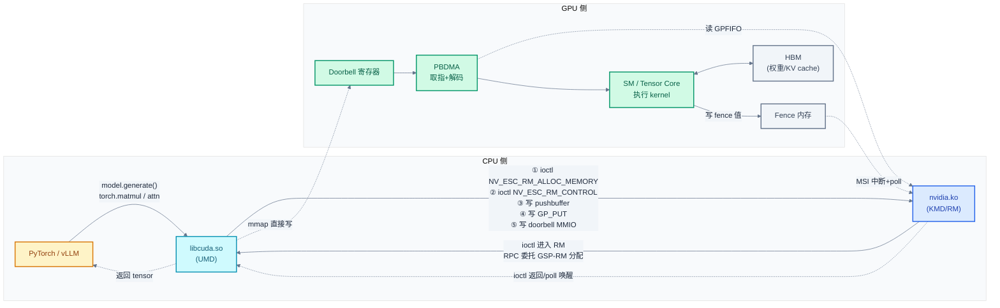
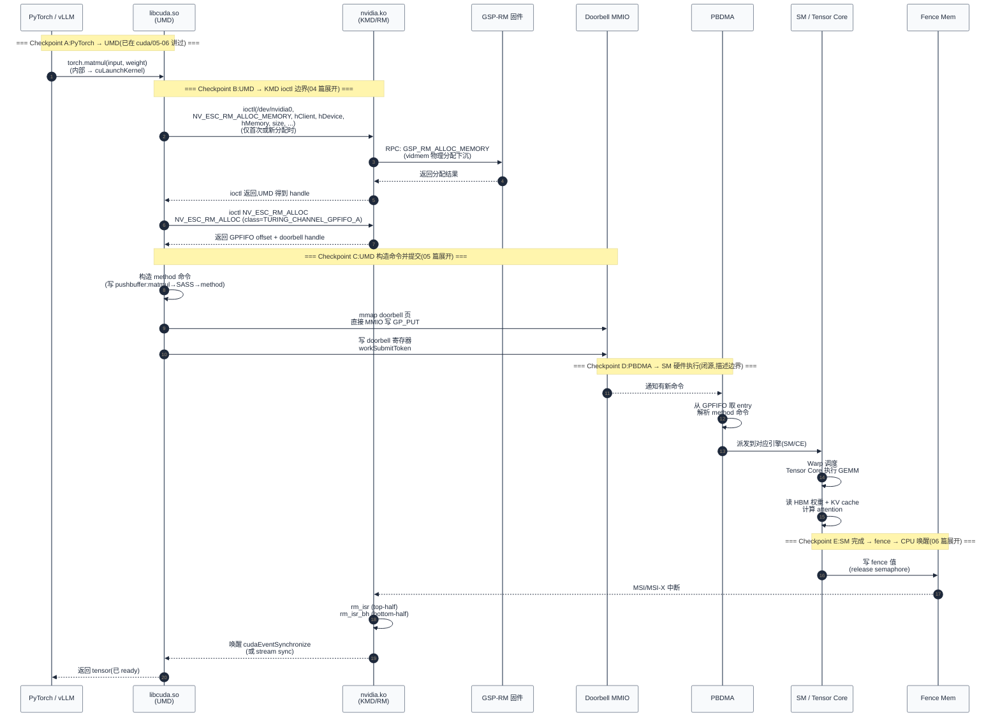
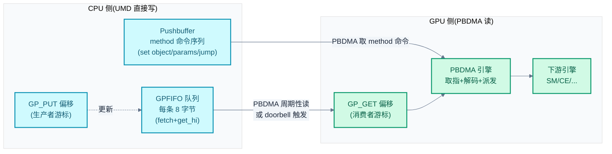
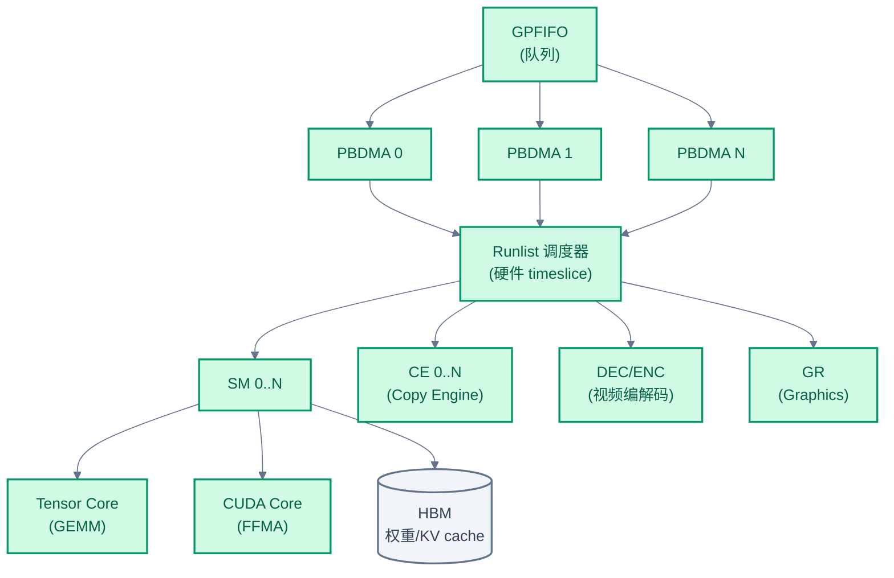
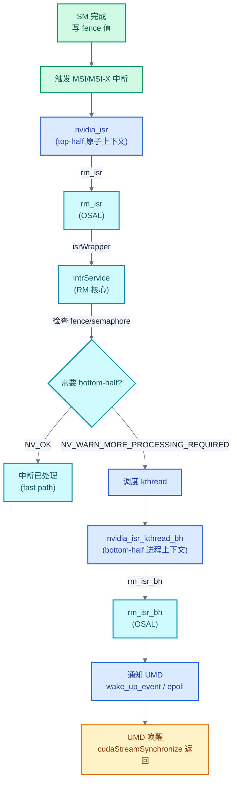

# 03 - 推理全链路总览:从 PyTorch 到 SM

> 一次 `model.generate()` 背后的全链路:从 PyTorch 经过 `libcuda.so`、`nvidia.ko`、GSP 固件,最终在 GPU 的 SM 上执行,再通过 fence 通知 CPU。本章用 5 个 checkpoint 把这条链路串起来,作为 04-07 篇的鸟瞰图。
>
> **工程师视角**:推理慢、卡死、Xid 报错时,定位问题的关键是"先判断停在哪一层"——是 UMD 没把命令发出来?是 KMD 收到 ioctl 但卡在 RM 锁?是命令进了 GPFIFO 但 doorbell 没响?是 SM 在跑但 fence 没回?本章给出的 5 个 checkpoint 就是 5 个诊断切入点。

### 关键术语

| 缩写 | 全称 | 含义 |
|------|------|------|
| UMD | User Mode Driver | 用户态驱动 `libcuda.so` |
| KMD | Kernel Mode Driver | 内核态驱动 `nvidia.ko` 等 |
| RM | Resource Manager | NVIDIA 驱动的资源管理核心 |
| GSP | GPU System Processor | GPU 上的微控制器,承载 GSP-RM 固件 |
| SM | Streaming Multiprocessor | GPU 的计算单元,跑 kernel 代码 |
| PBDMA | PushBuffer DMA | GPU 硬件单元,从 GPFIFO 取指并解析 method 命令 |
| GPFIFO | Graphics Processing FIFO | GPU 命令队列,UMD 写入、PBDMA 读取 |
| Pushbuffer | — | UMD 写入的 method 命令缓冲区,GPFIFO 指向它 |
| Doorbell | — | 触发 GPU 检查 GPFIFO 的 MMIO 寄存器(每个 channel 一个) |
| Method | — | GPU 命令格式,由 PBDMA 解码后送给下游引擎(SM/CE/...) |
| Runlist | — | PBDMA 调度的 channel 列表,硬件按 timeslice 切换 |
| Fence | — | "栅栏",GPU 完成命令后写的内存值,CPU 轮询或被中断唤醒 |
| Semaphore | — | 信号量,GPU 之间或 GPU→CPU 的同步原语 |
| CF | Compute Fabric | GPU 内部互联(NVLink/C2C),与外部 NVLink 区分 |
| KV cache | Key-Value cache | LLM 推理的注意力缓存,prefill 后增量增长 |
| CUDA Stream | — | UMD 侧的命令序列化抽象,对应底层 channel |
| CUDA Graph | — | 预录制的命令图,可整体 replay,降低 UMD 提交开销 |
| PTX | Parallel Thread eXecution | CUDA 的虚拟指令集,SASS 的前端 |
| SASS | Streaming Assembler | GPU 硬件实际执行的指令集 |
| Tensor Core | — | SM 内部执行 GEMM 的硬件单元 |

---

## 1. 概述

### 1.1 前置知识

| 需要了解 | 参考文档 |
|----------|----------|
| CUDA 编程模型、SM/Warp 执行模型 | [../cuda/02-CUDA编程模型](../cuda/02-CUDA编程模型.md)、[../cuda/04-执行模型与同步机制](../cuda/04-执行模型与同步机制.md) |
| CUDA Runtime 与 Driver API 的 UMD 实现 | [../cuda/05-CUDA-Runtime架构设计](../cuda/05-CUDA-Runtime架构设计.md)、[../cuda/06-CUDA-Driver接口与实现](../cuda/06-CUDA-Driver接口与实现.md) |
| GPU 内存层次(HBM/L2/L1/Reg) | [../cuda/03-内存管理与地址空间](../cuda/03-内存管理与地址空间.md) |
| KMD 三层架构、RM_API 虚表、GSP RPC | [02-源码架构与RM分层设计](./02-源码架构与RM分层设计.md) |
| KMD 在系统中的位置、5 模块职责 | [01-KMD总览与系统上下文](./01-KMD总览与系统上下文.md) |

### 1.2 系统上下文

> 上一章拆解了 KMD 的源码架构——`kernel-open/` Linux 接口层、`src/` RM 核心、GSP 固件三层。一个自然的问题是:**这套分层在实际推理时怎么动起来?一次 `model.generate()` 经过哪些层?** 本章用一次 LLM decode step 作为载体,把全链路切成 5 个 checkpoint,每个 checkpoint 对应一层或一个边界,后续 04-07 篇各展开一个。

**项目定位(本章视角)**:本章是 nvidia-kmd 专题的"鸟瞰图",不深入任何一层代码,只回答"一次推理经过哪些层、每层做什么、层与层之间的契约是什么"。读完本章,后续 04(ioctl 接口)、05(命令提交)、06(中断同步)、07(显存管理)四篇各自展开一个 checkpoint,有清晰的定位锚点。

**软硬件耦合点**:推理链路的耦合点是**命令的"生产-传递-执行-通知"回路**——UMD 生产 method 命令(pushbuffer),KMD 提供通道(GPFIFO)与触发机制(doorbell),GPU 硬件执行(PBDMA→SM),完成后通过 fence/中断通知 CPU。这条回路涉及 UMD↔KMD(ioctl)、KMD↔硬件(MMIO)、CPU↔GPU(中断)三类耦合,每类都有自己的延迟特征与诊断方法。

**跨实现对比**:与 CPU 推理(直接函数调用)对比,GPU 推理的"异步"特征来自这条回路——CPU 把命令扔进队列就返回,GPU 异步执行,完成后再异步通知 CPU。这与 DMA 引擎的"提交-完成中断"模型同构,只是 GPU 命令队列更复杂(优先级、timeslice、依赖关系)。详见 §9。



> **如何读这张图**:CPU 侧三层(App/UMD/KMD)是软件,GPU 侧四层(Doorbell/PBDMA/SM/HBM)是硬件。一次推理有 5 步:① UMD 通过 ioctl 让 KMD 分配显存与 channel;② UMD 通过 ioctl 让 KMD 配置 channel(runlist/通知);③ UMD 直接写 pushbuffer(经 mmap 的 GPU 显存);④ UMD 更新 GPFIFO 的 GP_PUT 入口并写 doorbell MMIO;⑤ PBDMA 取指→SM 执行→写 fence→MSI 中断→KMD 唤醒 UMD。**关键洞察**:命令提交(③④⑤)其实是 UMD ↔ GPU 的直接交互,KMD 只负责前期资源准备(①②);命令执行完成后,KMD 才再次介入(中断处理)。这种"轻 KMD 提交、重 KMD 资源管理"是 GPU 驱动性能的关键设计。

> **核心要点**:GPU 推理是**异步命令队列**模型——CPU 把命令扔进队列就返回,GPU 异步执行,完成后通过 fence/中断异步通知 CPU。这条链路的性能瓶颈不在 KMD(它只参与资源准备与中断处理),而在 UMD 的命令构造、pushbuffer 拷贝、doorbell 写入——这些都在用户态完成,不经内核。理解这一点是定位推理性能问题的起点。

---

## 2. 全链路时序图

下面用一次 LLM decode step(单 token 生成)作为载体,展示从 PyTorch 调用到 fence 完成的完整时序。**注意:这不是一次同步调用,而是分两个阶段**——prefill/decode 前的 setup(同步、走 ioctl)+ decode 提交(异步、走 pushbuffer/doorbell)+ 完成等待(异步、走 fence)。



> **如何读这张图**:时序图分 5 段,颜色对应 5 个 checkpoint。**关键观察**:
> - **步骤 ③④(UMD 构造+写 doorbell)不经 KMD**——UMD 直接通过 mmap 的 GPU 显存与 doorbell 页操作硬件,这是性能关键路径,KMD 不参与。
> - **KMD 主要介入两次**——开头 ioctl 阶段(②)做资源准备;结尾中断阶段(⑮)做完成通知。中间执行全在硬件。
> - **GSP-RM 只在资源分配时介入**——步骤 ② 的 RPC 把 vidmem 分配委托给 GSP-RM,但命令提交完全不走 GSP。
> - **fence 写入是 SM 的最后一条 method 命令**——UMD 在 pushbuffer 末尾放一条"写 fence"指令,SM 执行到这条指令时表示前面所有命令都完成了。

---

## 3. 5 个 Checkpoint 详解

下面逐个展开 5 个 checkpoint,每个给出:① 在做什么;② 关键代码指针;③ 边界与闭源部分;④ 对应的后续展开篇。

### 3.1 Checkpoint A:PyTorch → libcuda.so(UMD)

**在做什么**:PyTorch 的 `torch.matmul(input, weight)` 经过 ATen dispatcher → `at::cuda::blas::gemm` → cuBLAS → 最终调用 `cuLaunchKernel(kernel, grid, block, args, ...)`。这一层完全在用户态,PyTorch 与 cuBLAS 都是 UMD 的客户端,通过 CUDA Driver API 调用 `libcuda.so`。

**已在 cuda/ 系列讲过**:
- [../cuda/05-CUDA-Runtime架构设计 §6.4.1](../cuda/05-CUDA-Runtime架构设计.md) 讲了 `cudaLaunchKernel` → `cuLaunchKernel` 的转换
- [../cuda/06-CUDA-Driver接口与实现 §4.3](../cuda/06-CUDA-Driver接口与实现.md) 讲了 `cuLaunchKernel` 的 API 语义与参数 ABI
- [../cuda/06 §5.1](../cuda/06-CUDA-Driver接口与实现.md) 讲了 `cuMemAlloc` 的 API 语义

**本专题不再重复**——本专题从 `libcuda.so` 收到 `cuLaunchKernel` 调用之后开始。

**UMD 收到调用后做什么**:`cuLaunchKernel` 不是直接调 ioctl,它在用户态做大量工作:

1. **参数序列化**:把 `args` 数组按 ABI 打包成 pushbuffer 里的 method 命令参数
2. **PTX → SASS**:如果 module 还没 JIT 编译,调用 PTX JIT(用户态 libnvidia-ptxjitcompiler.so)把 PTX 编译成 SASS
3. **Stream → Channel**:把当前 CUDA Stream 映射到 channel handle
4. **构造 pushbuffer**:把 kernel 启动的 method 命令写进 pushbuffer 内存(UMD 通过 mmap 直接写 GPU 显存)
5. **更新 GPFIFO**:在 GPFIFO 队列里追加一条 entry,指向 pushbuffer
6. **写 doorbell**:触发 GPU 来取命令

步骤 4-6 全在用户态完成,不经 KMD。**只有第一次需要 KMD 介入**——分配 channel、分配 pushbuffer 显存、映射 doorbell 页——这些走 ioctl。

> **核心要点**:UMD 是"重"的——参数序列化、PTX 编译、pushbuffer 构造全在用户态。这与一般直觉"驱动逻辑在内核"相反。NVIDIA 把能放用户态的全放用户态,既减少 ioctl 开销,又能闭源保护 IP(PTX 编译器、命令构造逻辑都是闭源)。

### 3.2 Checkpoint B:UMD → KMD ioctl 边界

**在做什么**:UMD 通过 `ioctl(/dev/nvidia0, NV_ESC_RM_*, ...)` 进入 KMD。这是 UMD 与 KMD 的唯一交互通道。最常用的几个 ioctl:

| ioctl 编号 | 名称 | 用途 | 触发频率 |
|------------|------|------|----------|
| `0x27` | `NV_ESC_RM_ALLOC_MEMORY` | 分配显存(`cuMemAlloc` 走这里) | 中(首次分配/新对象) |
| `0x2B` | `NV_ESC_RM_ALLOC` | 创建 RM 对象(channel/context/device) | 低(初始化期) |
| `0x29` | `NV_ESC_RM_FREE` | 释放对象 | 低(销毁期) |
| `0x2A` | `NV_ESC_RM_CONTROL` | RM 控制命令(配置 channel、查属性) | 中 |
| `0x4E` | `NV_ESC_RM_MAP_MEMORY` | 把显存映射到用户态地址空间 | 中 |
| `0x52` | `NV_ESC_RM_GET_EVENT_DATA` | 取事件(fence 完成、错误通知) | 高(每次同步) |

ioctl 编号定义在 [src/nvidia/arch/nvalloc/unix/include/nv_escape.h](./src/open-gpu-kernel-modules/src/nvidia/arch/nvalloc/unix/include/nv_escape.h) 第 31-53 行。这些编号直接作为 Linux ioctl 命令字的 `_IOC_NR` 字段(配合 magic `'F'`,见 [kernel-open/common/inc/nv-ioctl-numbers.h](./src/open-gpu-kernel-modules/kernel-open/common/inc/nv-ioctl-numbers.h) 第 33 行)。`NV_IOCTL_BASE`(200)只用于另一组非 RM ioctl(如 `NV_ESC_CARD_INFO = NV_IOCTL_BASE + 0`),不与 `NV_ESC_RM_*` 编号组合(详见 04 篇)。

**进入 KMD 的路径**(02 篇已建立):

```
用户态: ioctl(/dev/nvidia0, cmd, arg)
  ↓
Linux 接口层: nvidia_unlocked_ioctl  (kernel-open/nvidia/nv.c:2833)
  ↓
nvidia_ioctl switch default: rm_ioctl  (kernel-open/nvidia/nv.c:2805)
  ↓
OSAL: rm_ioctl switch default: RmIoctl  (src/nvidia/arch/nvalloc/unix/src/osapi.c:2973)
  ↓
RM 核心: RmIoctl 解码 → rmapiGetInterface(RMAPI_EXTERNAL)->AllocWithSecInfo(...)
  ↓
(若是 GSP-client GPU)→ rpcRmApiAlloc_GSP → GSP-RM 固件
```

**关键设计:UMD 写的 ioctl 参数直接进 RM 核心,不经 Linux 接口层解释**。Linux 接口层只做参数拷贝(`copy_from_user`),不解析 RM 命令语义。这让 RM 命令体系可以跨 OS 复用——Windows 驱动也用同一套 `NV_ESC_RM_*` 命令,只是入口不是 ioctl 而是 Windows API。

**对应展开**:04 篇详细拆解 `nvidia_fops`、`NV_ESC_*` 体系、`rm_ioctl` 三层分发、RM client/handle 对象模型。

### 3.3 Checkpoint C:命令提交(channel/GPFIFO/pushbuffer/doorbell)

**在做什么**:UMD 把构造好的 method 命令写进 pushbuffer,在 GPFIFO 里追加一条 entry 指向 pushbuffer,然后写 doorbell 寄存器通知 GPU。

**关键概念**:



> **如何读这张图**:GPFIFO 是一个环形队列,每条 entry 8 字节,包含 pushbuffer 的物理地址(`GET` 字段)与控制位(`FETCH`)。UMD 是生产者(更新 `GP_PUT`),PBDMA 是消费者(更新 `GP_GET`)。当 `GP_PUT != GP_GET` 时,说明队列里有未处理命令。**关键**:GPFIFO 与 pushbuffer 都在 GPU 显存(经 mmap 映射到 UMD 地址空间),UMD 写它们不经 KMD——这是命令提交的核心快路径。

**GPFIFO entry 的格式**(以 Turing 为例):

```c
/* 摘自 [src/common/sdk/nvidia/inc/class/clc46f.h](./src/open-gpu-kernel-modules/src/common/sdk/nvidia/inc/class/clc46f.h) 第 264-270 行 */
#define NVC46F_GP_ENTRY__SIZE                                   8
#define NVC46F_GP_ENTRY0_FETCH                                0:0
#define NVC46F_GP_ENTRY0_FETCH_UNCONDITIONAL           0x00000000
#define NVC46F_GP_ENTRY0_FETCH_CONDITIONAL             0x00000001
#define NVC46F_GP_ENTRY0_GET                                 31:2
#define NVC46F_GP_ENTRY0_OPERAND                             31:0
#define NVC46F_GP_ENTRY1_GET_HI                               7:0
```

每条 entry 8 字节(2×32bit):`ENTRY0` 低 32 位含 `FETCH`(无条件/条件取指)+ `GET`(pushbuffer 低 30 位地址);`ENTRY1` 高 32 位含 `GET_HI`(pushbuffer 高 8 位地址)。对比 Volta(`clc36f.h`),Turing(`clc46f.h`)已移除 `PRIV` 字段——用户/特权命令的隔离改由 channel 创建时的 class 与 RM 权限控制完成,不再依赖 entry 内的位标志。

**Doorbell 机制**:写 doorbell 是触发 GPU 来检查 GPFIFO 的"通知"。在 Turing+ 架构,doorbell 是一个 32 位 MMIO 寄存器(`NV_VIRTUAL_FUNCTION_DOORBELL`),UMD 通过 mmap 的 usermode 页直接写它:

```c
/* 摘自 [src/nvidia/src/kernel/gpu/fifo/arch/turing/kernel_fifo_tu102.c](./src/open-gpu-kernel-modules/src/nvidia/src/kernel/gpu/fifo/arch/turing/kernel_fifo_tu102.c) 第 49-62 行 */
NV_STATUS
kfifoUpdateUsermodeDoorbell_TU102
(
    OBJGPU     *pGpu,
    KernelFifo *pKernelFifo,
    NvU32       workSubmitToken
)
{
    NV_PRINTF(LEVEL_INFO, "Poking workSubmitToken 0x%x\n", workSubmitToken);

    GPU_VREG_WR32(pGpu, NV_VIRTUAL_FUNCTION_DOORBELL, workSubmitToken);

    return NV_OK;
}
```

注意这是 **RM 内部的 doorbell 写函数**(`kfifoUpdateUsermodeDoorbell_TU102`),用于 KMD 自己提交命令时(如内存清零、CE 拷贝)。**用户态命令提交的 doorbell 写由 UMD 直接做**——UMD 在 channel 创建时通过 `NV_ESC_RM_ALLOC` 创建 channel,并经 mmap 把 doorbell MMIO 映射到用户态;之后所有命令提交都直接写它,不经 KMD。`workSubmitToken` 则通过 `NV_ESC_RM_CONTROL` 查询,UMD 写 doorbell 时必须带上正确的 token。这种"用户态直接 doorbell"是 GPU 性能的关键。

**`workSubmitToken`**:这是 channel 的"工作提交令牌",由 KMD 在 channel 创建时生成(见 `kfifoGenerateWorkSubmitTokenHal_TU102`),UMD 写 doorbell 时必须带上正确的 token。token 的作用是防伪——避免 UMD A 写 doorbell 触发 UMD B 的 channel,造成跨 client 干扰。

**CUDA Stream 与 channel 的映射**:
- 1 个 CUDA Stream = 1 个 channel(基本映射)
- 默认 Stream(Default Stream)共用一个全局 channel
- 多 Stream 多 channel,可在 GPU 上并发执行(timeslice 调度)
- CUDA Graph 是预录制的命令序列,可以一次性 replay 多条 GPFIFO entry,降低 UMD 提交开销

**对应展开**:05 篇详细拆解 channel 创建、GPFIFO 填充、GP_PUT/GP_GET 生产消费、doorbell 写、PBDMA 取指,以及 CUDA Graph 在 KMD 的体现。

### 3.4 Checkpoint D:PBDMA → SM 硬件执行(闭源边界)

**在做什么**:PBDMA 从 GPFIFO 取 entry,从 pushbuffer 读 method 命令,解码后派发给下游引擎(SM/CE/2D/...)。SM 收到 kernel 启动命令后,Warp 调度器分配线程块到 SM,执行 SASS 指令。

**这是闭源边界**:PBDMA 的微观调度算法、SM Warp 调度、Tensor Core 数据路径都是 GPU 硬件内部逻辑,**KMD 完全不可见**。KMD 只能:
- 配置 channel 的优先级、timeslice(经 RM API)
- 通过中断得知命令完成或出错
- 在出错时(Xid)做错误恢复

**PBDMA 与 SM 的关系**(简化):



> **如何读这张图**:GPFIFO 是软件层(UMD 写、PBDMA 读),PBDMA/Runlist/Engine 是硬件层。多个 PBDMA 实例可以并发取指(提高吞吐),Runlist 调度器按 timeslice 在 channel 之间切换(实现并发执行)。SM 内部有 Tensor Core(执行 GEMM,LLM 推理的主力)+ CUDA Core(执行 FFMA 等通用指令)。SM 直接访问 HBM 读权重与 KV cache。

**LLM 推理在 SM 上的执行**:
- **matmul**:Tensor Core 执行 GEMM,把权重矩阵与激活矩阵相乘(`M×K × K×N = M×N`)。Tensor Core 一个周期可完成一个 tile(如 16×16×16)的乘加。
- **attention**:softmax + matmul,部分走 Tensor Core,部分走 CUDA Core(归一化)。
- **KV cache 读写**:从 HBM 读 K/V,经 L2 cache 缓存,SM 内部寄存器堆暂存中间结果。
- **fence 写入**:最后一条 method 命令是"写 fence 值到指定地址",SM 执行到这条指令时表示前面所有命令都完成了。

**为什么不走 RPC**:命令提交是高频路径,每秒可能有数十万次提交。如果每次都 RPC 委托给 GSP-RM,RPC 往返延迟(微秒级)会成为瓶颈。所以 NVIDIA 把命令提交路径设计为"UMD 直写 + 硬件直读",KMD 完全不参与——这是性能关键设计。

**Xid 错误**:如果 SM 执行中出错(如非法内存访问、ECC 错误),硬件会触发 Xid 中断,KMD 收到后记录错误码并通过事件通知 UMD。Xid 错误码定义在 [src/nvidia/src/kernel/gpu/rc/kernel_rc.c](./src/open-gpu-kernel-modules/src/nvidia/src/kernel/gpu/rc/kernel_rc.c) 系列(详见 06 篇)。

> **核心要点**:从 PBDMA 到 SM 是**完全闭源的硬件路径**——KMD 只能配置 channel 优先级、timeslice、收到完成中断或错误中断。这一层是"硬件的黑盒",本专题只能讲到边界,内部细节需要查阅 GPU 架构白皮书。理解这一点有助于定位"命令进了 GPFIFO 但 GPU 没执行"这类问题——通常是 channel 配置错或硬件故障,不是 KMD 代码 bug。

### 3.5 Checkpoint E:SM 完成 → fence → CPU 唤醒

**在做什么**:SM 执行完所有命令后,最后一条 method 命令把 fence 值写到一段共享内存。KMD 通过 MSI/MSI-X 中断得知 GPU 有事件,在中断处理里检查 fence 值,如果达到 UMD 等待的值就唤醒 UMD 的 `cudaEventSynchronize` / `cudaStreamSynchronize`。

**中断处理路径**(02 篇已建立,这里展开):



**关键代码指针**:

```c
/* 摘自 [kernel-open/nvidia/nv.c](./src/open-gpu-kernel-modules/kernel-open/nvidia/nv.c) 第 1463-1465 行 */
    rc = request_threaded_irq(nv->interrupt_line, nvidia_isr,
                              nvidia_isr_kthread_bh, nv_default_irq_flags(nv),
                              nv_device_name, (void *)nvl);
```

这行代码注册了 Linux 的 threaded IRQ——`nvidia_isr` 是 top-half(硬中断上下文,不能睡眠),`nvidia_isr_kthread_bh` 是 bottom-half(kthread 上下文,可以睡眠)。这种 top/bottom 分离是 Linux 内核处理硬中断的标准模式。

```c
/* 摘自 [src/nvidia/arch/nvalloc/unix/src/unix_intr.c](./src/open-gpu-kernel-modules/src/nvidia/arch/nvalloc/unix/src/unix_intr.c) 第 780-828 行(简化) */
NvBool NV_API_CALL rm_isr(
    nvidia_stack_t *sp,
    nv_state_t *nv,
    NvU32      *NeedBottomHalf
)
{
    /* ... 省略 GPU 状态检查 ... */
    NV_ENTER_RM_RUNTIME(sp,fp);
    status = isrWrapper(pGpu->testIntr, pGpu);

    switch (status)
    {
        case NV_OK:
            *NeedBottomHalf = NV_FALSE;  // 中断已处理,无需 bottom-half
            retval = NV_TRUE;
            break;
        case NV_WARN_MORE_PROCESSING_REQUIRED:
            *NeedBottomHalf = NV_TRUE;   // 需 bottom-half 进一步处理
            retval = NV_TRUE;
            break;
        case NV_ERR_NO_INTR_PENDING:
        default:
            *NeedBottomHalf = NV_FALSE;
            retval = NV_FALSE;            // 不是我们的中断
            break;
    }
    /* ... 省略 NV_EXIT_RM_RUNTIME ... */
    return retval;
}
```

这段代码体现了三个返回状态的语义:① **`NV_OK`**——简单中断(如 fence 完成)在 top-half 就能处理完,不需要 bottom-half,延迟最低;② **`NV_WARN_MORE_PROCESSING_REQUIRED`**——复杂中断(如 Xid 错误恢复)需要 bottom-half 进一步处理,因为 top-half 不能睡眠;③ **`NV_ERR_NO_INTR_PENDING`**——这不是 nvidia.ko 的中断(可能是共享 IRQ),返回 `NV_FALSE` 让内核继续找其他驱动处理。

**fence 与 semaphore 的区别**:
- **fence**:一个内存值,GPU 写、CPU 轮询或被中断唤醒。简单但需要 GPU 知道写到哪。
- **semaphore**:GPU 之间或 GPU→CPU 的同步原语,GPU 主动等待某值。复杂但能做 GPU-GPU 同步。
- **`sem_surf`(Semaphore Surface)**:NVIDIA 在 Linux 上的高级同步原语,在显存里组织多个 semaphore,支持多 client 共享。代码在 [src/nvidia/src/kernel/gpu/mem_mgr/sem_surf.c](./src/open-gpu-kernel-modules/src/nvidia/src/kernel/gpu/mem_mgr/sem_surf.c)。

**UMD 等待 fence 的方式**:
1. **轮询**:UMD 通过 mmap 直接读 fence 内存,循环比较值。低延迟但占 CPU。
2. **`cudaEventSynchronize`**:走 `ioctl(NV_ESC_RM_GET_EVENT_DATA)` 阻塞等待,KMD 在中断 bottom-half 唤醒。高延迟(中断+唤醒)但不占 CPU。
3. **epoll `/dev/nvidia0`**:UMD 把 fd 加入 epoll,KMD 在中断时 `wake_up_event`,UMD 被唤醒。批量等待多事件时高效。

**对应展开**:06 篇详细拆解 MSI/MSI-X 注册、threaded IRQ、top-half/bottom-half 分工、fence/semaphore/sem_surf 机制、Xid 错误处理与通知链。

---

## 4. 推理中的两类典型链路

LLM 推理不是单一链路,根据阶段不同,链路特征也不同。下面区分 prefill 与 decode 两种典型链路,以及与之对比的多卡通信链路。

### 4.1 prefill 链路:compute-bound

**特征**:输入 prompt 长(数百到数千 token),需要一次性计算所有 token 的 KV cache。计算量大,受 SM 算力限制(compute-bound)。

**链路特点**:
- 大量 matmul 计算,每次 launch 都是大 kernel(grid 大)
- 内存分配以权重(常驻)+ KV cache(本次新建)为主
- UMD 提交频率低(几个大 kernel),fence 等待时间长
- 性能瓶颈在 SM 算力与 HBM 带宽,KMD 与 UMD 提交开销占比小

```
prefill step:
  1. 申请 KV cache 显存(一次 ioctl,首次)
  2. for each layer:
       a. 提交 matmul(Q/K/V projection)→ doorbell → SM 跑
       b. 提交 attention → doorbell → SM 跑
       c. 提交 matmul(O projection)→ doorbell → SM 跑
       d. 提交 FFN matmul → doorbell → SM 跑
  3. 等待最后一个 fence 完成
```

### 4.2 decode 链路:memory-bound

**特征**:每步生成 1 个 token,计算量小但需要读全部 KV cache。受 HBM 带宽限制(memory-bound)。

**链路特点**:
- 每步多个小 kernel(grid 小),UMD 提交频率高
- KV cache 增量追加(可能用 CUDA Graph 重放)
- fence 等待时间短,但 UMD 提交开销占比大(可能成为瓶颈)
- 用 CUDA Graph 降低提交开销是常见优化

```
decode step (每 token):
  1. (CUDA Graph replay)一次性提交所有 layer 的 kernel
  2. 等待 fence 完成
  3. 采样下一个 token
```

**KMD 角度看 decode 优化**:
- **CUDA Graph**:UMD 预录制命令,一次性 replay 多个 GPFIFO entry。KMD 角度看,channel 的 pushbuffer 占用减小(共享)、doorbell 写次数减少。
- **Persistent kernel**:UMD 用一个常驻 kernel 持续消费任务队列,KMD 角度看,channel 持续在 runlist 中被调度(不进 idle),timeslice 切换开销降低。
- **连续批处理(continuous batching)**:多个请求复用同一 channel,KMD 角度看,channel 资源利用率提高。

### 4.3 多卡通信链路(TP/PP)

多卡推理(Tensor Parallel / Pipeline Parallel)的链路多了一条**通信路径**:

```
TP forward(GPU 0 与 GPU 1 协同):
  1. GPU 0 计算自己的 layer 部分
  2. GPU 0 通过 NCCL all-reduce / all-gather 与 GPU 1 通信
     - 同节点:走 NVLink P2P(NCCL P2P transport)
     - 跨节点:走 IB GDR(NCCL NET transport)
  3. GPU 1 收到数据后继续计算
```

**KMD 在多卡通信中的角色**:
- **NVLink 路径**:KMD 通过 `uvm_api_enable_peer_access` 建立 peer mapping,让 GPU 0 的显存对 GPU 1 可见(详见 10 篇)
- **GDR 路径**:KMD 通过 `nvidia-peermem.ko` 把 GPU 显存注册为 IB peer memory,让网卡能 RDMA 访问(详见 11 篇)
- **NVLink 拓扑发现**:KMD 在启动时探测 NVLink 拓扑,暴露给 NCCL(详见 09 篇)

多卡通信链路与单卡推理链路的区别:**单卡推理 KMD 主要是"资源准备+中断处理",通信路径上 KMD 还要"建立映射+注册 RDMA"**。这些 KMD 操作的延迟会直接影响通信性能,所以 NVIDIA 在 KMD 里做了大量优化(如 peer mapping cache、RDMA registration cache)。

> **核心要点**:推理链路不是单一形态——**prefill 是 compute-bound(大 kernel 低频提交)、decode 是 memory-bound(小 kernel 高频提交)、多卡通信是 latency-bound(依赖 KMD 建立的 P2P/RDMA 路径)**。理解这三类链路的差异,才能针对性优化:prefill 优化 SM 算力,decode 优化提交开销(用 CUDA Graph),多卡通信优化 KMD 映射建立延迟。

---

## 5. 与 cuda/nccl 笔记的衔接(再强调)

本专题作为"填空"专题,5 个 checkpoint 中的 Checkpoint A 与多卡通信路径都和已有笔记强耦合。下面把衔接点再列一次,作为阅读时的对照表:

### 5.1 与 cuda/ 的衔接

| cuda/ 讲到哪 | 本专题从哪接 | 对应 checkpoint |
|--------------|-----------------|------------------|
| [cuda/06 §5.1](../cuda/06-CUDA-Driver接口与实现.md) `cuMemAlloc` API 语义、错误码、`CUdeviceptr` 含义 | 04 讲 `NV_ESC_RM_ALLOC_MEMORY`(0x27)在内核侧如何分配 vidmem | Checkpoint B |
| [cuda/06 §4.3](../cuda/06-CUDA-Driver接口与实现.md) `cuLaunchKernel` API 语义、参数 ABI、`kernelParams`/`extra` 两套 ABI | 05 讲 `cuLaunchKernel` 如何变成 channel 里的 GPFIFO 命令 | Checkpoint C |
| [cuda/05 §6.4.1](../cuda/05-CUDA-Runtime架构设计.md) `cudaLaunchKernel` → `cuLaunchKernel` 转换 | 03(本章)只是引用,不展开 | Checkpoint A |
| [cuda/09 §3](../cuda/09-多GPU编程与互联拓扑.md) `cudaDeviceEnablePeerAccess` UMD 语义、双向启用要求 | 10 讲它最终走到 `uvm_api_enable_peer_access` 建立 peer mapping | 多卡通信 |
| [cuda/04](../cuda/04-执行模型与同步机制.md) Stream/Event 同步原语的 UMD 语义 | 06 讲 Stream/Event 在 KMD 的落地(fence/sem_surf) | Checkpoint E |

### 5.2 与 nccl/ 的衔接

| nccl/ 讲到哪 | 本专题从哪接 | 对应 checkpoint |
|--------------|-----------------|------------------|
| [nccl/08 §2](../nccl/08-transport-layer.md) P2P transport "复用 CUDA 的 `cudaDeviceEnablePeerAccess`"、NCCL 的 `canConnect`/`setup`/`connectP2p` 回调 | 10 拆解这个 API 在内核做了什么(UVM peer mapping + NVLink 拓扑检查) | 多卡通信 |
| [nccl/08 §4.3](../nccl/08-transport-layer.md) GDR "需 `nvidia-peermem` 模块" 一句带过 | 11 完整拆解 peermem 模块的 `ib_register_peer_memory_client` 与回调机制 | 多卡通信 |
| [nccl/02](../nccl/02-gpu-interconnect-background.md) NVLink 硬件背景(NVLink4/NVSwitch/MNNVL)、拓扑结构 | 09 不重复硬件,只讲 KMD 视角——拓扑发现、链路训练、sysfs 暴露 | 多卡通信 |
| [nccl/06](../nccl/06-bootstrap-and-topology.md) NCCL 拓扑探测读 `nvmlPciTree` / sysfs | 09 讲这些 sysfs 是 KMD 怎么暴露出来的 | 多卡通信 |

### 5.3 不重复原则(再确认)

本专题严格遵守"不讲相邻笔记已讲过的":

| 主题 | 已在 | 本专题不讲,只讲 |
|------|------|-----------------|
| CUDA API 语义、PyTorch → cuBLAS → cuLaunchKernel 路径 | cuda/ | 内核侧落地(ioctl/RM/channel) |
| NVLink 硬件协议、NVSwitch 拓扑 | nccl/02 | KMD 如何发现/配置 NVLink |
| IB Verbs/RDMA 协议 | rdma/ | peermem 如何注册为 provider |
| PCIe P2P 协议、ACS | pcie/ | `nvidia_p2p_get_pages` 实现与 ACS 影响 |
| NCCL transport 选择机制 | nccl/08 | 被选中的内核侧路径 |
| SM Warp 调度、Tensor Core 微架构 | cuda/01-04 | KMD 视角的边界(闭源部分) |

> **核心要点**:本专题是"cuda/ 与 nccl/ 的 KMD 延伸"——cuda/ 讲到 `cuLaunchKernel` 的 UMD 实现停下,本专题从这里接续;nccl/ 讲到 transport 调用 CUDA API 停下,本专题从这里接续。Checkpoint A 与多卡通信路径是衔接点,本专题的 5 个 checkpoint 把"UMD 侧的 API 调用"翻译成"KMD 侧的硬件操作"。

---

## 6. 性能特征:每层的延迟与开销

理解全链路后,看每层的延迟特征,有助于性能优化与问题定位:

| 层 | 典型延迟 | 频率 | 优化方向 |
|----|----------|------|----------|
| PyTorch → cuBLAS → cuLaunchKernel | ~1-10 μs | 每次 kernel launch | CUDA Graph 批量提交 |
| UMD 构造 pushbuffer | ~0.5-5 μs | 每次 kernel launch | Persistent kernel |
| UMD 写 doorbell | ~100 ns | 每次 kernel launch | (无法优化,已是用户态直写) |
| KMD ioctl(NV_ESC_RM_*) | ~5-50 μs | 资源分配/查询时 | 缓存 handle,避免重复 ioctl |
| GSP-RM RPC 往返 | ~10-100 μs | 硬件控制类操作 | (无法优化,固件内部) |
| PBDMA 取指 | ~100 ns | 每条 GPFIFO entry | (硬件内部) |
| SM 执行 | 视 kernel 而定 | 每次 kernel | 算法优化 + Tensor Core |
| Fence 写 + MSI 中断 | ~1-5 μs | 每次 kernel 完成 | 轮询 vs 中断的取舍 |
| KMD 中断 top-half | ~1-5 μs | 每次 fence | (已很快) |
| KMD 唤醒 UMD | ~1-10 μs | 每次 fence | (取决于调度器) |

> **如何读这张表**:大部分延迟在微秒级,但累加起来影响显著。**关键观察**:KMD 直接参与的延迟(ioctl + 中断)约 10-100 μs,占一次 kernel launch 的 10-50%。UMD 直接参与的延迟(构造 pushbuffer + doorbell)约 1-10 μs。SM 执行延迟差异最大(从 ns 到秒)。优化重点:decode 高频小 kernel 时减少 UMD 提交开销(CUDA Graph);prefill 大 kernel 时优化 SM 算力;多卡通信时减少 KMD 映射建立延迟。

---

## 7. 全链路调优 checklist

基于 5 个 checkpoint,给出推理性能调优的 checklist:

### 7.1 UMD 侧(Checkpoint A)

- [ ] 用 CUDA Graph 录制 decode step,减少 UMD 提交开销
- [ ] 用 `cudaStreamCreateWithPriority` 给关键 stream 高优先级
- [ ] 避免在 hot path 调用 `cudaMalloc`/`cudaFree`(用内存池)
- [ ] 用 `cuMemPoolSetAccess` 配置多卡访问(避免运行时映射)

### 7.2 KMD 侧(Checkpoint B/C)

- [ ] 检查 `nvidia-smi -q` 中 channel 数量是否合理(过多会争用 timeslice)
- [ ] 设置 `NVreg_RmNvLutDmaCacheSize` 等寄存器参数(若适用)
- [ ] 检查是否启用了 `nvidia.ko` 的 `reg_role` 等推理优化参数

### 7.3 硬件执行(Checkpoint D)

- [ ] `nvidia-smi dmon` 看 SM 利用率(prefill 应接近 100%)
- [ ] `nvidia-smi dmon -m 2-4` 看 HBM 带宽利用率(decode 应接近峰值)
- [ ] 检查 ECC 错误计数(`nvidia-smi -q -d ECC`)
- [ ] 检查 Xid 错误日志(`dmesg | grep Xid`)

### 7.4 同步与中断(Checkpoint E)

- [ ] 用 `cudaEventRecord` + `cudaEventSynchronize` 而非 `cudaStreamSynchronize`(可批量等待)
- [ ] 避免在 hot path 调用 `cudaDeviceSynchronize`(全局同步代价高)
- [ ] 用 epoll 批量等待多个 fence(高并发场景)

### 7.5 多卡通信

- [ ] 确认 NCCL 选了 NVLink 而非 PCIe(`NCCL_DEBUG=INFO` 看 `via P2P/NVL`)
- [ ] 检查 `nvidia-smi nvlink -s` 链路状态
- [ ] 确认 `nvidia-peermem.ko` 已加载(`lsmod | grep peermem`)
- [ ] 检查 PCIe ACS 是否影响 P2P 路径(`lspci -vvv | grep AccessControl`)

---

## 8. 与相邻实现对比

把 NVIDIA 的全链路与 AMD ROCm、CPU 推理对比,凸显设计取舍:

| 对比维度 | NVIDIA CUDA | AMD ROCm | CPU 推理 |
|----------|-------------|----------|----------|
| **UMD 开源?** | ❌ libcuda.so 闭源 | ✅ Mesa + ROCm 开源 | N/A |
| **KMD 开源?** | ✅ nvidia.ko RM 核心开源 | ✅ amdgpu 全开源 | N/A |
| **UMD↔KMD 接口** | ioctl + mmap(doorbell/pushbuffer) | DRM ioctl + mmap | 函数调用 |
| **命令提交路径** | UMD 直写 pushbuffer + doorbell | UMD 直写 user queue | 直接函数调用 |
| **完成通知** | MSI 中断 + fence + epoll | DRM event + fence | 函数返回 |
| **典型延迟** | 1-100 μs(取决于路径) | 类似 NVIDIA | ns 级 |
| **固件层** | GSP-RM(闭源) | 没有等价物 | 无 |

> **核心要点**:NVIDIA 与 AMD 的命令提交路径设计相似——都是"UMD 直写硬件队列 + doorbell 触发",KMD 不参与 hot path。差异在开源程度与固件层:AMD 全开源(UMD/KMD/无固件层),NVIDIA 闭源 UMD 与 GSP 固件换取 IP 保护与跨 OS 复用。CPU 推理是同步函数调用,没有"提交-执行-通知"回路,延迟最低但吞吐受限。

---

## 9. 阅读地图

后续 4 篇按 5 个 checkpoint 逐个展开,每篇聚焦一个:

- **04 UMD↔KMD 接口**:展开 Checkpoint B——`/dev/nvidia*` 字符设备、`nvidia_fops`、`NV_ESC_*` ioctl 体系、`rm_ioctl` 三层分发、RM client/handle 对象模型。
- **05 命令提交**:展开 Checkpoint C——Context/Channel 模型、KernelFifo 对象、GPFIFO 填充、GP_PUT/GP_Get 生产消费、doorbell 写、PBDMA 取指边界、CUDA Graph 在 KMD 的体现。
- **06 中断、同步与 fence**:展开 Checkpoint E——MSI/MSI-X + threaded IRQ、top-half/bottom-half、fence/semaphore/sem_surf、Stream/Event 在 KMD 的落地、Xid/RC 错误处理。
- **07 内存管理**:与 Checkpoint B 相关但独立成篇——`MemoryManager` 显存分配路径、VM/PDE/PTE 构建、heap 类型、residency 管理、推理中的内存模式(KV cache/权重/激活布局)。

后续多卡通信三篇(09-11)在推理链路基础上增加通信路径,每篇以"NCCL 期望的内核契约"开篇。

---

## 官方文档索引

- [CUDA Driver API Documentation](https://docs.nvidia.com/cuda/cuda-driver-api/) — 参考了 cuLaunchKernel/cuMemAlloc 的 UMD 语义(本专题从其下游接续)
- [CUDA C++ Programming Guide](https://docs.nvidia.com/cuda/cuda-c-programming-guide/) — 参考了 Stream/Event 同步原语的 UMD 语义
- [NVIDIA GPU Driver Documentation](https://docs.nvidia.com/datacenter/tesla/driver-installation-guide/) — 参考了 Xid 错误码、`nvidia-smi` 输出含义
- [PTX ISA Documentation](https://docs.nvidia.com/cuda/parallel-thread-execution/) — 参考了 PTX → SASS 编译流程
- [NVIDIA Open GPU Kernel Modules (DeepWiki)](https://deepwiki.com/NVIDIA/open-gpu-kernel-modules) — 参考了 RM 各子系统的导览
- [NVIDIA Fermi/Kelper/Maxwell/Pascal/Volta/Turing/Ampere/Hopper/Blackwell Whitepapers](https://www.nvidia.com/) — 参考了 SM/PBDMA/Tensor Core 硬件架构(Checkpoint D 闭源边界)

---

## 参考资料

- [NVIDIA/open-gpu-kernel-modules](https://github.com/NVIDIA/open-gpu-kernel-modules) — 版本 610.43.03
- 本地源码 [kernel-open/nvidia/nv.c](./src/open-gpu-kernel-modules/kernel-open/nvidia/nv.c) — 参考了 L1463-1465 request_threaded_irq、L2804-2807 rm_ioctl 转发、L2871-2985 nvidia_isr、L2988 nvidia_isr_kthread_bh、L3039 rm_isr_bh
- 本地源码 [src/nvidia/arch/nvalloc/unix/include/nv_escape.h](./src/open-gpu-kernel-modules/src/nvidia/arch/nvalloc/unix/include/nv_escape.h) — 参考了 L31-53 NV_ESC_RM_* ioctl 编号
- 本地源码 [src/nvidia/arch/nvalloc/unix/src/unix_intr.c](./src/open-gpu-kernel-modules/src/nvidia/arch/nvalloc/unix/src/unix_intr.c) — 参考了 L780-828 rm_isr 三状态返回
- 本地源码 [src/nvidia/src/kernel/gpu/fifo/arch/turing/kernel_fifo_tu102.c](./src/open-gpu-kernel-modules/src/nvidia/src/kernel/gpu/fifo/arch/turing/kernel_fifo_tu102.c) — 参考了 L49-62 kfifoUpdateUsermodeDoorbell_TU102
- 本地源码 [src/common/sdk/nvidia/inc/class/clc46f.h](./src/open-gpu-kernel-modules/src/common/sdk/nvidia/inc/class/clc46f.h) — 参考了 L264-270 NVC46F_GP_ENTRY 字段定义
- 本地源码 [src/nvidia/src/kernel/gpu/mem_mgr/sem_surf.c](./src/open-gpu-kernel-modules/src/nvidia/src/kernel/gpu/mem_mgr/sem_surf.c) — 参考了 semaphore surface 实现
- [Exploring NVIDIA Linux Drivers Internals](https://fuzzinglabs.com/exploring-nvidia-linux-drivers-internals-basics-ioctls/) — 参考了 ioctl 入口与字符设备分析
- [Revealing NVIDIA Closed-Source Driver Command Streams (arXiv:2604.26889)](https://arxiv.org/html/2604.26889v1) — 参考了 §4 命令提交架构(GPFIFO/doorbell/GP_Put/PBDMA)
- [NVIDIA Fermi Architecture Whitepaper](https://www.nvidia.com/content/PDF/fermi_white_papers/NVIDIA_Fermi_Compute_Architecture_Whitepaper.pdf) — 参考了 PBDMA/SM 调度模型
- [How CUDA Graphs Work (NVIDIA Developer Blog)](https://developer.nvidia.com/blog/cuda-graphs/) — 参考了 CUDA Graph 在 UMD/KMD 的实现要点

---

**下一篇**:[04 - UMD↔KMD 接口:字符设备与 ioctl](./04-UMD与KMD接口.md) —— 从 Checkpoint B 展开,详细拆解 `/dev/nvidia*` 字符设备、`nvidia_fops` 五个入口、`NV_ESC_*` ioctl 编号体系、`rm_ioctl` 三层分发、RM client/handle 对象模型。
