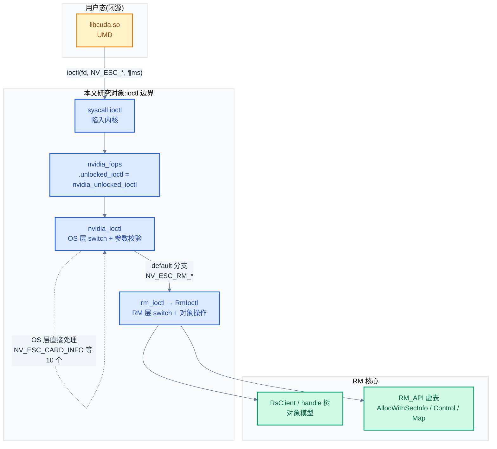
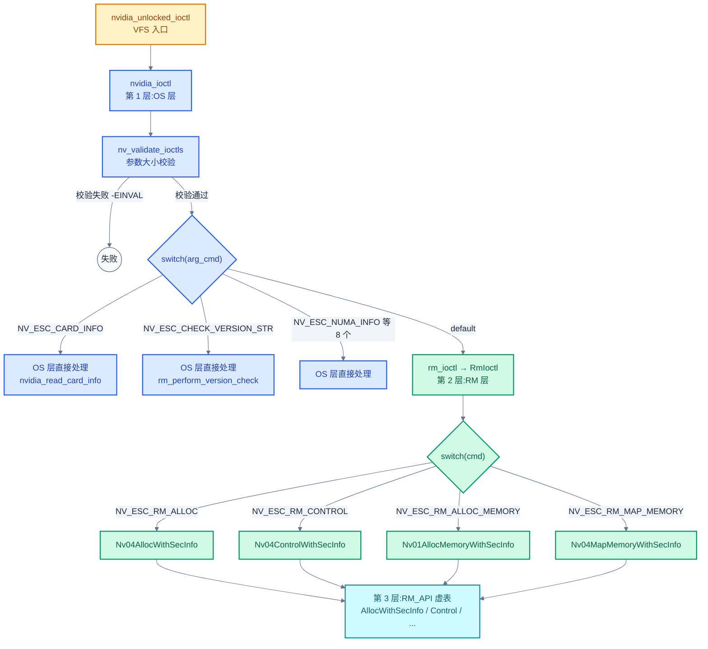
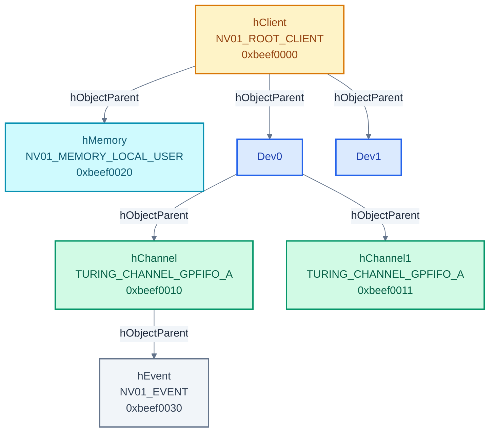

# 04 - UMD↔KMD 接口:字符设备与 ioctl

> UMD(libcuda.so)通过 `/dev/nvidia*` 字符设备进入内核,经过三层 ioctl 分发,最终落到 RM 对象模型的 Alloc/Control/Map 操作。本章讲清这条边界链路的设计——为什么用 minor number 区分设备、为什么 OS 层只直接处理 10 个 ioctl、RM client/handle 对象模型如何组织 GPU 资源。
>
> **工程师视角**:看到 `strace` 里成串的 `ioctl(fd, _IO('F', ...))` 时,能立刻判断这是 OS 层 ioctl 还是 RM 层 ioctl、参数结构体是哪个、最终调用哪个 RM API。这是定位 UMD↔KMD 交互问题(如 cuMemAlloc 失败、cuLaunchKernel 卡住)的基本功。

### 关键术语

| 缩写 | 全称 | 含义 |
|------|------|------|
| UMD | User Mode Driver | 用户态驱动(libcuda.so),发起 ioctl 的一方 |
| KMD | Kernel Mode Driver | 内核态驱动(nvidia.ko),接收 ioctl 的一方 |
| RM | Resource Manager | NVIDIA 驱动资源管理核心,对象化体系 |
| ioctl | input/output control | Unix 字符设备控制接口,UMD↔KMD 的唯一同步通道 |
| chardev | character device | 字符设备,Linux 一类以字节流访问的设备节点 |
| minor number | — | 次设备号,区分同一主设备号下的不同设备实例 |
| NV_ESC_* | NVIDIA Escape | NVIDIA 私有 ioctl 命令编号前缀 |
| RM API | — | RM 暴露的虚函数表(`RM_API` 结构体),封装 Alloc/Free/Control/Map |
| client | — | RM 的客户端根对象(NV01_ROOT_CLIENT),一个 UMD 进程通常对应一个 |
| handle | NvHandle | RM 对象的 32 位标识符,client 内唯一 |
| RsClient | Resource Server Client | 资源服务器中的客户端对象,承载 handle 树 |
| RsResource | Resource Server Resource | 资源服务器中的资源对象,挂在 client 的 handle 树上 |
| secInfo | API Security Info | API 安全信息,携带调用者权限级别(用户/管理员/内核) |
| mmap context | — | mmap 上下文,RM 预建立的映射元数据,mmap 时校验 |

---

## 1. 概述

### 1.1 前置知识

| 需要了解 | 参考文档 |
|----------|----------|
| KMD 5 模块职责、开源/闭源三层 | [01-KMD总览与系统上下文](./01-KMD总览与系统上下文.md) |
| RM 三层架构、Linux 接口层与 RM 核心的边界 | [02-源码架构与RM分层设计](./02-源码架构与RM分层设计.md) |
| 推理全链路 5 个 checkpoint、ioctl 在链路中的位置 | [03-推理全链路总览](./03-推理全链路总览.md) |
| CUDA Driver API 的用户态语义(cuMemAlloc/cuLaunchKernel) | [../cuda/06-CUDA-Driver接口与实现](../cuda/06-CUDA-Driver接口与实现.md) |
| Linux 字符设备框架(file_operations / cdev / ioctl) | 内核文档 Documentation/driver-api/ |

### 1.2 系统上下文

> 上一章(03)用一张端到端时序图把推理链路切成 5 个 checkpoint,其中 checkpoint B 正是"libcuda.so 通过 ioctl 进入 nvidia.ko"。一个自然的问题是:**这个 ioctl 边界到底长什么样?UMD 发来的几百种请求,KMD 怎么区分和分发?** 本章回答这个问题——先看字符设备体系(`/dev/nvidia*` 怎么来),再拆 ioctl 的三层分发链,接着讲 `NV_ESC_*` 编号体系,最后落到 RM client/handle 对象模型。

**项目定位(回顾)**:本章研究的是 UMD 与 KMD 之间的**同步控制边界**。在 NVIDIA 的架构里,UMD(libcuda.so)与 KMD(nvidia.ko)之间没有共享内存 RPC、没有 netlink,只有一个经典 Unix 接口——字符设备 + ioctl。所有 GPU 资源的分配、命令提交的控制、状态的查询,都编码为一次 `ioctl(fd, cmd, arg)` 系统调用。这种"单一边界、多路复用"的设计让 UMD/KMD 解耦干净,但也意味着 ioctl 编号体系本身就是一份 UMD↔KMD 契约。

**软硬件耦合点**:本章聚焦的耦合点是 **ioctl 参数的拷贝与校验边界**。UMD 在用户态构造参数结构体(如 `NVOS21_PARAMETERS`),通过 ioctl 陷入内核;Linux 接口层(`kernel-open/nvidia/nv.c`)负责 `copy_from_user` 把参数搬进内核、校验大小、按 cmd 分发。这是"用户态不可信"的第一道防线——参数大小不符直接 `-EINVAL`,权限不对直接 `-EACCES`。跨过这道边界后,参数进入 RM 核心,按对象模型处理。

**跨实现对比**:与 AMD amdgpu 的 ioctl 模型对比——amdgpu 用 `drm_ioctl` 框架(DRM 通用 ioctl 表 + 驱动私有 ioctl),参数校验由 DRM 核心统一做;NVIDIA 则是**裸字符设备 + 自研 switch 分发**,不走 DRM 框架(nvidia-drm.ko 才走 DRM,但只管显示)。NVIDIA 的设计更"重"(自己实现参数校验表 `RmValidateIoctl`),但换来与 Windows 驱动共用 RM 核心的好处——Windows 没有 DRM,却有几乎相同的 RM API 虚表。详见 §8。



> **如何读这张图**:一次 ioctl 从上往下穿过三层——系统调用入口(`nvidia_unlocked_ioctl`)→ OS 层分发(`nvidia_ioctl` 的 switch)→ RM 层分发(`RmIoctl` 的 switch)。OS 层只直接处理 10 个与设备管理相关的基础 ioctl(版本、卡信息、NUMA、DMA-BUF);其余所有 RM 对象操作(分配/释放/控制/映射)落入 `default` 分支,委托 `rm_ioctl` → `RmIoctl`,最终调用 `RM_API` 虚表上的 `AllocWithSecInfo`/`Control`/`MapMemory` 等函数,操作 RsClient 上的 handle 树。

> **核心要点**:NVIDIA 的 UMD↔KMD 边界是**裸字符设备 + 三层 ioctl 分发**——OS 层只管设备管理与参数校验,RM 层管对象模型。所有 GPU 资源(显存、channel、event)都是 RM 对象,通过 `NV_ESC_RM_ALLOC` 分配、`NV_ESC_RM_CONTROL` 控制、handle 树组织。这种"一切皆对象"的设计让 RM API 与 Windows 驱动完全一致,是跨 OS 复用的基础。

---

## 2. 字符设备体系:minor number 区分设备

### 2.1 两个字符设备的分工

NVIDIA KMD 在 Linux 上注册两类字符设备,共用同一个主设备号 **195**、同一套 `nvidia_fops`,但用**次设备号(minor number)**区分用途:

| 设备节点 | minor number | 用途 | 典型 ioctl |
|----------|:------------:|------|-----------|
| `/dev/nvidia0`、`/dev/nvidia1`... | 0 ~ 247 | **实际 GPU 设备**:每张卡一个节点 | `NV_ESC_RM_ALLOC_MEMORY`(显存)、`NV_ESC_QUERY_DEVICE_INTR`(中断状态) |
| `/dev/nvidiactl` | 255 | **控制设备**:全局管理,client/session 在此创建 | `NV_ESC_RM_ALLOC`(创建 client)、`NV_ESC_RM_FREE`、`NV_ESC_RM_CONTROL` |
| `/dev/nvidia-modeset` | 254 | 模式设置设备(NVKMS,本专题跳过) | — |

> **为什么要把"控制"和"实际设备"分开?** 因为 client(会话)是进程级全局对象,不属于任何一张卡——一个 UMD 进程先在 `/dev/nvidiactl` 上 `NV_ESC_RM_ALLOC` 创建一个 client(NV01_ROOT_CLIENT),再通过 `NV_ESC_ATTACH_GPUS_TO_FD` 把若干 GPU 绑定到这个 fd,之后才能在 `/dev/nvidia0` 上分配显存、提交命令。这种"控制端建会话、设备端做操作"的分离,让多卡场景下 client 与 GPU 解耦——一个 client 可以同时操作多张卡。

minor number 的定义集中在 [nv-chardev-numbers.h](./src/open-gpu-kernel-modules/kernel-open/common/inc/nv-chardev-numbers.h):

```c
/* 摘自 [kernel-open/common/inc/nv-chardev-numbers.h](./src/open-gpu-kernel-modules/kernel-open/common/inc/nv-chardev-numbers.h) 第 28-40 行 */
// NVIDIA's reserved major character device number (Linux).
#define NV_MAJOR_DEVICE_NUMBER  195

// Minor numbers 0 to 247 reserved for regular devices
#define NV_MINOR_DEVICE_NUMBER_REGULAR_MAX         247

// Minor numbers 248 to 253 currently unused

// Minor number 254 reserved for the modeset device (provided by NVKMS)
#define NV_MINOR_DEVICE_NUMBER_MODESET_DEVICE      254

// Minor number 255 reserved for the control device
#define NV_MINOR_DEVICE_NUMBER_CONTROL_DEVICE      255
```

这段常量定义体现了 minor number 的分区规划:0-247 给最多 248 张 GPU(实际系统远到不了),248-253 留空备用,254 给显示,255 给控制。分区留白是为了未来扩展——比如新增一类设备时不必挤占已有编号。

### 2.2 字符设备注册

模块加载时(`nvidia_init_module`),`nv.c` 用两次 `nv_register_chrdev` 注册两个字符设备区域:

```c
/* 摘自 [kernel-open/nvidia/nv.c](./src/open-gpu-kernel-modules/kernel-open/nvidia/nv.c) 第 975-993 行 */
    /*
     * Register char devices for both the region of regular devices
     * as well as the control device.
     *
     * NOTE: THIS SHOULD BE DONE LAST.
     */
    rc = nv_register_chrdev(0, NV_MINOR_DEVICE_NUMBER_REGULAR_MAX + 1,
            &nv_linux_devices_cdev, "nvidia", &nvidia_fops);
    if (rc < 0)
    {
        goto drivers_exit;
    }

    rc = nv_register_chrdev(NV_MINOR_DEVICE_NUMBER_CONTROL_DEVICE, 1,
            &nv_linux_control_device_cdev, "nvidiactl", &nvidia_fops);
```

第一次调用注册 minor 0~247 共 248 个设备节点(设备名 `nvidia0`~`nvidia247`),第二次注册 minor 255 一个控制节点(设备名 `nvidiactl`)。两者共用同一套 `nvidia_fops`——意味着 `open`/`ioctl`/`mmap` 入口函数相同,函数内部通过 `nv_is_control_device(inode)` 判断当前是哪类设备,走不同分支。

> **为什么共用 fops 而不分开?** 因为大部分代码路径(参数校验、copy_from_user、锁管理)对两类设备是相同的,分开会重复代码。差异点(如 `NV_ESC_CARD_INFO` 只在控制设备有效、`NV_ESC_RM_ALLOC_MEMORY` 只在实际设备有效)用 `NV_CTL_DEVICE_ONLY(nv)` / `NV_ACTUAL_DEVICE_ONLY(nv)` 宏在 switch 分支内做断言——如果 UMD 在错误的设备上发了某个 ioctl,直接返回 `NV_ERR_INVALID_ARGUMENT`。这是一种"共用入口、分支校验"的取舍。

---

## 3. file_operations:open/close/mmap/poll

### 3.1 nvidia_fops 结构体

字符设备的所有系统调用入口集中在 `nvidia_fops`:

```c
/* 摘自 [kernel-open/nvidia/nv.c](./src/open-gpu-kernel-modules/kernel-open/nvidia/nv.c) 第 249-260 行 */
static struct file_operations nvidia_fops = {
    .owner     = THIS_MODULE,
    .poll      = nvidia_poll,
    .unlocked_ioctl = nvidia_unlocked_ioctl,
#if NVCPU_IS_X86_64 || NVCPU_IS_AARCH64
    .compat_ioctl = nvidia_unlocked_ioctl,
#endif
    .mmap      = nvidia_mmap,
    .open      = nvidia_open,
    .release   = nvidia_close,
};
```

这张函数指针表回答了"UMD 用哪些系统调用与 KMD 交互":

| 系统调用 | 入口函数 | 用途 | 频率 |
|----------|----------|------|------|
| `open` | `nvidia_open` | 打开设备,创建文件私有数据(`nv_file_private_t`) | 进程启动时 1-2 次 |
| `ioctl` | `nvidia_unlocked_ioctl` | **核心通道**:所有 RM 操作(分配/控制/映射) | 极高,每次 cuMemAlloc/cuLaunchKernel 都走 |
| `mmap` | `nvidia_mmap` | 把已分配的显存/系统内存映射到用户态地址空间 | 中,分配后 1 次 |
| `poll` | `nvidia_poll` | 等待 event(notifier 触发的事件) | 中,同步等待时 |
| `release` | `nvidia_close` | 关闭设备,清理 RM 资源 | 进程退出时 1 次 |

注意 `compat_ioctl` 也指向 `nvidia_unlocked_ioctl`——这意味着 32 位用户态进程在 64 位内核上调用 ioctl 时,走同一路径(参数结构体已设计为 64 位对齐兼容)。仅在 x86_64 和 aarch64 上启用,因为这两个架构有实际的 32/64 位混用场景。

### 3.2 nvidia_open:设备打开与文件私有数据

`open` 是 UMD 与 KMD 建立联系的第一步。`nvidia_open` 的核心任务是创建**文件私有数据**(`nv_file_private_t`),它是后续所有 ioctl/mmap 的上下文载体:

```c
/* 摘自 [kernel-open/nvidia/nv.c](./src/open-gpu-kernel-modules/kernel-open/nvidia/nv.c) 第 1849-1887 行(简化) */
int nvidia_open(struct inode *inode, struct file *file)
{
    nv_linux_file_private_t *nvlfp = NULL;
    nvidia_stack_t *sp = NULL;

    nvlfp = nv_alloc_file_private();          /* 分配文件私有数据 */
    /* ... 分配 RM 调用栈 sp(altstack,见 02 §3) ... */

    NV_SET_FILE_PRIVATE(file, nvlfp);         /* 挂到 file->private_data */
    nvlfp->sp = sp;

    /* for control device, just jump to its open routine */
    if (nv_is_control_device(inode))
    {
        rc = nvidia_ctl_open(inode, file);    /* 控制设备走独立路径 */
        return rc;
    }

    /* 实际设备:按 minor number 找到 nv_linux_state_t */
    LOCK_NV_LINUX_DEVICES();
    nvl = find_minor_locked(NV_DEVICE_MINOR_NUMBER(inode));
    /* ... nv_open_device_for_nvlfp 初始化设备 ... */
}
```

这段代码体现了一个关键设计:**文件私有数据 `nvlfp` 是 UMD↔KMD 会话的载体**。它承载:
- `nvptr`:指向所属设备(`nv_linux_state_t`),决定后续 ioctl 作用在哪张卡
- `sp`:RM 调用栈(altstack),避免 RM 深调用栈溢出信号栈(见 02 §3)
- `nvfp`:RM 文件私有数据,关联 RM client
- `attached_gpus`:通过 `NV_ESC_ATTACH_GPUS_TO_FD` 绑定的 GPU 列表

控制设备与实际设备走不同分支:控制设备直接调 `nvidia_ctl_open`(只设标志、计数),实际设备要按 minor number 查找设备状态、初始化硬件。这种区分源于 §2.1 的"控制端建会话、设备端做操作"设计。

### 3.3 控制设备打开:nvidia_ctl_open

控制设备的打开非常轻量——只设置标志和引用计数,真正的 client 创建发生在后续的 `NV_ESC_RM_ALLOC`:

```c
/* 摘自 [kernel-open/nvidia/nv.c](./src/open-gpu-kernel-modules/kernel-open/nvidia/nv.c) 第 3110-3139 行 */
/*
** nv control driver open entry point.  Sessions are created here.
*/
static int nvidia_ctl_open(struct inode *inode, struct file *file)
{
    nv_linux_state_t *nvl = &nv_ctl_device;
    nv_state_t *nv = NV_STATE_PTR(nvl);
    nv_linux_file_private_t *nvlfp = NV_GET_LINUX_FILE_PRIVATE(file);

    down(&nvl->ldata_lock);
    nvlfp->nvptr = nvl;                          /* 关联控制设备状态 */

    if (atomic64_read(&nvl->usage_count) == 0)
    {
        nv->flags |= (NV_FLAG_INITIALIZED | NV_FLAG_CONTROL);
    }
    atomic64_inc(&nvl->usage_count);
    up(&nvl->ldata_lock);
    return 0;
}
```

注释写"Sessions are created here"略有误导——严格说 `open` 只准备了会话容器(`nvlfp`),真正的 RM client 对象要等 UMD 发 `NV_ESC_RM_ALLOC`(class=`NV01_ROOT_CLIENT`)才创建(见 §7.1)。`NV_FLAG_CONTROL` 标志让后续 `NV_CTL_DEVICE_ONLY(nv)` 宏能识别"这是控制设备 fd",从而允许 `NV_ESC_RM_ALLOC` 等 client 级操作。

### 3.4 mmap:两步映射机制

NVIDIA 的 mmap 采用**两步映射**——先 ioctl 建立映射上下文,再 mmap 完成实际映射:

1. **第一步**(ioctl):UMD 调用 `NV_ESC_RM_ALLOC_MEMORY`(分配显存)或 `NV_ESC_RM_MAP_MEMORY`(映射已分配内存),RM 在内部调用 `rm_create_mmap_context` 建立**映射上下文**(`mmap_context`),记录物理地址、大小、缓存属性。
2. **第二步**(mmap):UMD 调用 `mmap()` 系统调用,`nvidia_mmap` 校验映射上下文存在后,按上下文配置 VMA 的页保护属性。

```c
/* 摘自 [kernel-open/nvidia/nv-mmap.c](./src/open-gpu-kernel-modules/kernel-open/nvidia/nv-mmap.c) 第 521-601 行(简化) */
int nvidia_mmap_helper(nv_state_t *nv, nv_linux_file_private_t *nvlfp,
                       nvidia_stack_t *sp, struct vm_area_struct *vma, void *vm_priv)
{
    nv_alloc_mapping_list_node_t **pfile_mapping_list = nv_acquire_file_va(&nvlfp->nvfp, NV_FALSE);

    /*
     * If mmap context is not valid on this file descriptor, this mapping wasn't
     * previously validated with the RM so it must be rejected.
     */
    if (*pfile_mapping_list == NULL)
    {
        nv_printf(NV_DBG_ERRORS, "NVRM: VM: invalid mmap context\n");
        goto done;
    }
    mmap_context = &(*pfile_mapping_list)->context;

    /*
     * Nvidia device node(nvidia#) maps device's BAR memory,
     * Nvidia control node(nvidiactrl) maps system memory.
     */
    if (!NV_IS_CTL_DEVICE(nv))
    {
        if (IS_REG_OFFSET(nv, access_start, access_len))      /* BAR0 寄存器 */
            nv_encode_caching(&vma->vm_page_prot, NV_MEMORY_UNCACHED, NV_MEMORY_TYPE_REGISTERS);
        else if (IS_FB_OFFSET(nv, access_start, access_len))  /* BAR1 显存 */
            /* ... 按 UD/非 UD 区分缓存属性 ... */
    }
    /* ... 控制设备映射系统内存 ... */
}
```

这段代码体现了两个设计决策:① **安全校验**——mmap 必须有预先建立的映射上下文,防止 UMD 伪造偏移直接映射任意显存;② **缓存属性按区域区分**——寄存器区(BAR0)强制 uncached,显存区(BAR1)按是否在 UD(User Define)区区分,系统内存(控制设备)走另一套缓存策略。缓存属性错配会导致 GPU 计算/可见性问题,是常见踩坑点。

> **核心要点**:NVIDIA 的 mmap 是**两步机制**——ioctl 先在 RM 建立映射上下文(记录物理地址与缓存属性),mmap 再据此配置 VMA。这分离了"权限校验/地址分配"(ioctl,可睡眠、持 RM 锁)与"页表建立"(mmap,走 Linux mm 子系统),使两者各司其职。UMD 不能跳过 ioctl 直接 mmap——没有上下文会被拒绝。

---

## 4. ioctl 分发链

### 4.1 三层分发总览

UMD 发出的 ioctl 要穿过三层 switch 才到达最终的 RM 操作:



> **如何读这张图**:三层从左到右依次过滤——第 1 层(OS 层 `nvidia_ioctl`)拦截 10 个基础 ioctl 自己处理,其余落 default;第 2 层(RM 层 `RmIoctl`)按 RM 命令分发到 `Nv04*WithSecInfo` 系列入口函数;第 3 层(`RM_API` 虚表)是 CPU-RM 与 GSP-RM 的切换点(见 02 §5)。每层都有参数校验,层层收紧。

### 4.2 第 1 层:nvidia_ioctl 与参数校验

`nvidia_unlocked_ioctl` 是 VFS 入口,直接转发给 `nvidia_ioctl`:

```c
/* 摘自 [kernel-open/nvidia/nv.c](./src/open-gpu-kernel-modules/kernel-open/nvidia/nv.c) 第 2833-2840 行 */
long nvidia_unlocked_ioctl(
    struct file *file,
    unsigned int cmd,
    unsigned long i_arg
)
{
    return nvidia_ioctl(NV_FILE_INODE(file), file, cmd, i_arg);
}
```

`nvidia_ioctl` 的开头是**参数校验**——这是第一道安全防线:

```c
/* 摘自 [kernel-open/nvidia/nv.c](./src/open-gpu-kernel-modules/kernel-open/nvidia/nv.c) 第 2455-2490 行(简化) */
int nvidia_ioctl(struct inode *inode, struct file *file,
                 unsigned int cmd, unsigned long i_arg)
{
    nv_linux_file_private_t *nvlfp = NV_GET_LINUX_FILE_PRIVATE(file);

    if (nv_validate_ioctls(cmd) != NV_OK)       /* 参数大小校验 */
    {
        return -EINVAL;
    }

    /* ... 等待设备打开完成(非控制设备)... */

    arg_size = _IOC_SIZE(cmd);
    arg_cmd  = _IOC_NR(cmd);                     /* 取 ioctl 编号(去掉 magic) */

    /* 大参数走 XFER 通道:先拷一个小结构,里面含真实指针与大小 */
    if (arg_cmd == NV_ESC_IOCTL_XFER_CMD)
    {
        copy_from_user(&ioc_xfer, arg_ptr, sizeof(ioc_xfer));
        arg_cmd  = ioc_xfer.cmd;
        arg_size = ioc_xfer.size;
        arg_ptr  = NvP64_VALUE(ioc_xfer.ptr);
    }

    NV_KMALLOC(arg_copy, arg_size);              /* 分配内核缓冲 */
    copy_from_user(arg_copy, arg_ptr, arg_size); /* 拷贝参数进内核 */
    /* ... switch (arg_cmd) { ... } ... */
}
```

这段代码体现了三个设计决策:

1. **参数大小校验先行**(`nv_validate_ioctls`):在 `copy_from_user` 之前就用 cmd 自带的 size 字段(`_IOC_SIZE(cmd)`)查表校验,大小不符直接拒绝,避免读越界。校验表分两张——OS 层表(`nv_ioctls_table`,10 个基础 ioctl)和 RM 层表(`RmValidateIoctl`,~20 个 RM ioctl)。
2. **大参数走 XFER 通道**:ioctl 的 `arg` 通常是一个指针,但单个 ioctl 的 `_IOC_SIZE` 有限(Linux 限制)。`NV_ESC_IOCTL_XFER_CMD` 是个"元 ioctl"——它的参数是个小结构 `{cmd, size, ptr}`,先拷这个小结构,再按里面的 `ptr`/`size` 拷真实大参数。这绕过了 ioctl 大小限制。
3. **统一 copy_from_user**:所有 ioctl 参数先拷进内核缓冲 `arg_copy`,处理后 `copy_to_user` 拷回。这是"用户态不可信"的基本姿态——绝不直接解引用用户态指针。

### 4.3 OS 层直接处理的 ioctl

`nvidia_ioctl` 的 switch 只直接处理 10 个左右基础 ioctl,都是**设备管理类**而非 RM 对象操作:

| ioctl | 编号 | 作用 | 设备限制 |
|-------|:----:|------|----------|
| `NV_ESC_CARD_INFO` | 200 | 返回所有 GPU 的 PCI 信息、minor number、寄存器地址 | 仅控制设备 |
| `NV_ESC_CHECK_VERSION_STR` | 210 | UMD/KMD 版本协商 | 仅控制设备 |
| `NV_ESC_ATTACH_GPUS_TO_FD` | 212 | 把 GPU 绑定到当前 fd(多卡) | 仅控制设备 |
| `NV_ESC_SYS_PARAMS` | 214 | 设置 NUMA memblock 大小 | 仅控制设备 |
| `NV_ESC_NUMA_INFO` | 215 | 查询 GPU NUMA 拓扑 | 仅实际设备 |
| `NV_ESC_SET_NUMA_STATUS` | 216 | NUMA 联/脱机 | 仅实际设备 |
| `NV_ESC_QUERY_DEVICE_INTR` | 213 | 查询设备中断状态(轮询) | 仅实际设备 |
| `NV_ESC_EXPORT_TO_DMABUF_FD` | 217 | 导出显存为 DMA-BUF fd(跨进程/驱动共享) | 仅实际设备 |
| `NV_ESC_WAIT_OPEN_COMPLETE` | 218 | 等待设备打开完成 | 两者皆可 |
| `NV_ESC_IOCTL_XFER_CMD` | 211 | 大参数传递通道(见 §4.2) | 两者皆可 |

这些 ioctl 的共同特点:**不涉及 RM 对象(client/handle),纯 OS 层操作**。比如 `NV_ESC_CARD_INFO` 只是遍历已注册的 GPU 列表返回 PCI 信息,不需要 RM client;`NV_ESC_ATTACH_GPUS_TO_FD` 只是给 `nvlfp->attached_gpus` 赋值并增加设备引用计数。

以 `NV_ESC_CARD_INFO` 为例:

```c
/* 摘自 [kernel-open/nvidia/nv.c](./src/open-gpu-kernel-modules/kernel-open/nvidia/nv.c) 第 2592-2601 行 */
        /* pass out info about the card */
        case NV_ESC_CARD_INFO:
        {
            size_t num_arg_devices = arg_size / sizeof(nv_ioctl_card_info_t);

            NV_CTL_DEVICE_ONLY(nv);                       /* 断言:仅控制设备 */

            status = nvidia_read_card_info(arg_copy, num_arg_devices);
            break;
        }
```

`NV_CTL_DEVICE_ONLY(nv)` 宏在 `NV_ESC_CARD_INFO` 上断言"只在控制设备有效"——UMD 必须在 `/dev/nvidiactl` 上发这个 ioctl,在 `/dev/nvidia0` 上发会被拒。这呼应了 §2.1 的设备分工。

### 4.4 default 分支:委托 rm_ioctl

所有 RM 对象操作落入 `default` 分支,委托给 RM 核心的 `rm_ioctl`:

```c
/* 摘自 [kernel-open/nvidia/nv.c](./src/open-gpu-kernel-modules/kernel-open/nvidia/nv.c) 第 2804-2808 行 */
        default:
            rmStatus = rm_ioctl(sp, nv, &nvlfp->nvfp, arg_cmd, arg_copy, arg_size);
            status = ((rmStatus == NV_OK) ? 0 : -EINVAL);
            break;
```

`rm_ioctl` 是 `NV_API_CALL` 导出函数(见 02 §3),跨过 Linux 接口层与 RM 核心的边界。它在 OSAL 层(`osapi.c`)再做一次分发——先处理 3 个 OS event ioctl(`NV_ESC_ALLOC_OS_EVENT`/`FREE_OS_EVENT`/`RM_GET_EVENT_DATA`,高频小操作,直接在 OSAL 处理不走 RM 锁),其余继续下沉到 `RmIoctl`:

```c
/* 摘自 [src/nvidia/arch/nvalloc/unix/src/osapi.c](./src/open-gpu-kernel-modules/src/nvidia/arch/nvalloc/unix/src/osapi.c) 第 2908-2982 行(简化) */
NV_STATUS NV_API_CALL rm_ioctl(nvidia_stack_t *sp, nv_state_t *pNv,
                               nv_file_private_t *nvfp, NvU32 Command,
                               void *pData, NvU32 dataSize)
{
    switch (Command)
    {
        case NV_ESC_ALLOC_OS_EVENT:        /* OS event 分配,OSAL 直接处理 */
        case NV_ESC_FREE_OS_EVENT:         /* OS event 释放 */
        case NV_ESC_RM_GET_EVENT_DATA:     /* 读取已触发的事件 */
            /* ... 直接在 OSAL 处理,不进 RM 核心 ... */
            break;
        default:
            threadStateInit(&threadState, THREAD_STATE_FLAGS_NONE);
            rmStatus = RmIoctl(pNv, nvfp, Command, pData, dataSize);
            threadStateFree(&threadState, THREAD_STATE_FLAGS_NONE);
            break;
    }
}
```

这段代码体现了一个性能优化设计:**OS event 的 alloc/free/get 三个高频小 ioctl 不进 RM 核心**。OS event 是 UMD 等待 GPU 事件(notifier)的机制,等待时 `poll` 或 `NV_ESC_RM_GET_EVENT_DATA` 会高频轮询——如果每次都进 RM 核心(加 API 锁、GPU 锁),开销不可接受。把它们留在 OSAL 层直接处理,是快路径优化。

> **核心要点**:ioctl 分发是**三层漏斗**——OS 层 `nvidia_ioctl` 拦截 10 个基础设备管理 ioctl;OSAL 层 `rm_ioctl` 拦截 3 个高频 event ioctl;剩下的 RM 对象操作(Alloc/Free/Control/Map)进入 `RmIoctl`,调用 `RM_API` 虚表。每层都在"快路径"上做减法,把高频小操作挡在 RM 锁外。

---

## 5. NV_ESC_* ioctl 编号体系

### 5.1 两套编号:基础 ioctl 与 RM ioctl

NVIDIA 的 ioctl 编号分两套,分别定义在两个头文件:

| 头文件 | 编号风格 | magic / base | 示例 |
|--------|----------|:------------:|------|
| [nv-ioctl-numbers.h](./src/open-gpu-kernel-modules/src/nvidia/arch/nvalloc/unix/include/nv-ioctl-numbers.h) | `NV_IOCTL_BASE + n` | magic `'F'`, base 200 | `NV_ESC_CARD_INFO`(200)、`NV_ESC_ATTACH_GPUS_TO_FD`(212) |
| [nv_escape.h](./src/open-gpu-kernel-modules/src/nvidia/arch/nvalloc/unix/include/nv_escape.h) | 硬编码十六进制 | 无 magic,直接 0x27~0x5F | `NV_ESC_RM_ALLOC`(0x2B)、`NV_ESC_RM_CONTROL`(0x2A) |

```c
/* 摘自 [src/nvidia/arch/nvalloc/unix/include/nv-ioctl-numbers.h](./src/open-gpu-kernel-modules/src/nvidia/arch/nvalloc/unix/include/nv-ioctl-numbers.h) 第 33-47 行 */
#define NV_IOCTL_MAGIC      'F'
#define NV_IOCTL_BASE       200
#define NV_ESC_CARD_INFO             (NV_IOCTL_BASE + 0)      /* 200 */
#define NV_ESC_REGISTER_FD           (NV_IOCTL_BASE + 1)      /* 201 */
#define NV_ESC_ALLOC_OS_EVENT        (NV_IOCTL_BASE + 6)      /* 206 */
#define NV_ESC_FREE_OS_EVENT         (NV_IOCTL_BASE + 7)      /* 207 */
#define NV_ESC_STATUS_CODE           (NV_IOCTL_BASE + 9)      /* 209 */
#define NV_ESC_CHECK_VERSION_STR     (NV_IOCTL_BASE + 10)     /* 210 */
#define NV_ESC_IOCTL_XFER_CMD        (NV_IOCTL_BASE + 11)     /* 211 */
#define NV_ESC_ATTACH_GPUS_TO_FD     (NV_IOCTL_BASE + 12)     /* 212 */
#define NV_ESC_QUERY_DEVICE_INTR     (NV_IOCTL_BASE + 13)     /* 213 */
#define NV_ESC_SYS_PARAMS            (NV_IOCTL_BASE + 14)     /* 214 */
#define NV_ESC_EXPORT_TO_DMABUF_FD   (NV_IOCTL_BASE + 17)     /* 217 */
#define NV_ESC_WAIT_OPEN_COMPLETE    (NV_IOCTL_BASE + 18)     /* 218 */
```

```c
/* 摘自 [src/nvidia/arch/nvalloc/unix/include/nv_escape.h](./src/open-gpu-kernel-modules/src/nvidia/arch/nvalloc/unix/include/nv_escape.h) 第 31-53 行 */
#define NV_ESC_RM_ALLOC_MEMORY                      0x27
#define NV_ESC_RM_ALLOC_OBJECT                      0x28
#define NV_ESC_RM_FREE                              0x29
#define NV_ESC_RM_CONTROL                           0x2A
#define NV_ESC_RM_ALLOC                             0x2B
#define NV_ESC_RM_DUP_OBJECT                        0x34
#define NV_ESC_RM_SHARE                             0x35
#define NV_ESC_RM_IDLE_CHANNELS                     0x41
#define NV_ESC_RM_VID_HEAP_CONTROL                  0x4A
#define NV_ESC_RM_MAP_MEMORY                        0x4E
#define NV_ESC_RM_UNMAP_MEMORY                      0x4F
#define NV_ESC_RM_GET_EVENT_DATA                    0x52
#define NV_ESC_RM_ALLOC_CONTEXT_DMA2                0x54
#define NV_ESC_RM_MAP_MEMORY_DMA                    0x57
#define NV_ESC_RM_UNMAP_MEMORY_DMA                  0x58
#define NV_ESC_RM_BIND_CONTEXT_DMA                  0x59
#define NV_ESC_RM_EXPORT_OBJECT_TO_FD               0x5C
#define NV_ESC_RM_IMPORT_OBJECT_FROM_FD             0x5D
#define NV_ESC_RM_UPDATE_DEVICE_MAPPING_INFO        0x5E
#define NV_ESC_RM_LOCKLESS_DIAGNOSTIC               0x5F
```

> **为什么有两套编号?** 基础 ioctl 是 Linux 专属(走 `_IO('F', n)` 风格,有 magic),RM ioctl 是跨 OS 共享的(硬编码 0x27~0x5F,无 magic)。RM ioctl 的编号在 Windows 上也一致——Windows 没有 ioctl,但 RM API 的命令编号相同,只是传输方式不同(Windows 用 NtDeviceIoControl,Linux 用 ioctl)。两套编号的分裂正是"OS 层 vs RM 核心"分层在编号体系上的投影。

### 5.2 ioctl 编号速查表

下表汇总推理链路中常见的 ioctl,按用途分组:

| ioctl | 编号 | 参数结构体 | 作用 | 推理链路位置 |
|-------|:----:|----------|------|-----------|
| `NV_ESC_RM_ALLOC` | 0x2B | `NVOS21_PARAMETERS` / `NVOS64_PARAMETERS` | 分配 RM 对象(client/channel/event/内存) | 初始化阶段建 client、建 channel |
| `NV_ESC_RM_FREE` | 0x29 | `NVOS00_PARAMETERS` | 释放 RM 对象 | 进程退出清理 |
| `NV_ESC_RM_CONTROL` | 0x2A | `NVOS54_PARAMETERS` | 控制命令(查询/配置对象) | channel 配置、内存信息查询 |
| `NV_ESC_RM_ALLOC_MEMORY` | 0x27 | `NVOS02_PARAMETERS` | 分配显存/系统内存 | `cuMemAlloc` 落点 |
| `NV_ESC_RM_MAP_MEMORY` | 0x4E | `NVOS33_PARAMETERS` | 建立 CPU 可见映射 | `cuMemAllocHost` 落点 |
| `NV_ESC_RM_UNMAP_MEMORY` | 0x4F | `NVOS34_PARAMETERS` | 解除映射 | — |
| `NV_ESC_RM_VID_HEAP_CONTROL` | 0x4A | `NVOS32_PARAMETERS` | 显存堆操作(保留/释放/信息) | 显存碎片管理 |
| `NV_ESC_RM_IDLE_CHANNELS` | 0x41 | `NVOS30_PARAMETERS` | 等待 channel 空闲 | `cudaStreamSynchronize` 落点 |
| `NV_ESC_RM_GET_EVENT_DATA` | 0x52 | `NVOS41_PARAMETERS` | 读取已触发的事件 | fence/event 等待(见 06) |
| `NV_ESC_ALLOC_OS_EVENT` | 206 | `nv_ioctl_alloc_os_event_t` | 注册 OS event | event 机制初始化(见 06) |
| `NV_ESC_RM_DUP_OBJECT` | 0x34 | `NVOS55_PARAMETERS` | 跨 client 复制对象 | 多进程共享显存 |
| `NV_ESC_RM_EXPORT_OBJECT_TO_FD` | 0x5C | — | 导出对象到 fd(跨进程) | 进程间共享 |

> **如何读这张表**:关注"推理链路位置"列——推理热路径上的 ioctl 主要是 `NV_ESC_RM_ALLOC_MEMORY`(分配显存)、`NV_ESC_RM_CONTROL`(配置 channel)、`NV_ESC_RM_IDLE_CHANNELS`/`NV_ESC_RM_GET_EVENT_DATA`(同步等待)。`strace` 一个推理进程,你会看到 `NV_ESC_RM_CONTROL` 出现频率最高(每次 kernel launch 前的 channel 状态查询),其次是 `NV_ESC_RM_ALLOC`(初始化时建 channel)。

---

## 6. RmIoctl 分发:RM 对象操作

### 6.1 RmIoctl 的 switch 结构

`RmIoctl`(在 `escape.c`)是 RM 层的分发中枢,按 cmd 调用对应的 `Nv*WithSecInfo` 入口函数:

```c
/* 摘自 [src/nvidia/arch/nvalloc/unix/src/escape.c](./src/open-gpu-kernel-modules/src/nvidia/arch/nvalloc/unix/src/escape.c) 第 356-383 行(简化) */
NV_STATUS RmIoctl(nv_state_t *nv, nv_file_private_t *nvfp,
                  NvU32 cmd, void *data, NvU32 dataSize)
{
    NV_STATUS rmStatus = NV_ERR_GENERIC;
    API_SECURITY_INFO secInfo = { };

    secInfo.privLevel = osIsAdministrator() ? RS_PRIV_LEVEL_USER_ROOT : RS_PRIV_LEVEL_USER;
    secInfo.paramLocation = PARAM_LOCATION_USER;
    secInfo.clientOSInfo = nvfp->ctl_nvfp ?: nvfp;     /* 关联到 RM client */

    switch (cmd)
    {
        case NV_ESC_RM_ALLOC_MEMORY:  /* → Nv01AllocMemoryWithSecInfo */
        case NV_ESC_RM_ALLOC_OBJECT:  /* → Nv01AllocObjectWithSecInfo */
        case NV_ESC_RM_ALLOC:         /* → Nv04AllocWithSecInfo */
        case NV_ESC_RM_FREE:          /* → Nv01FreeWithSecInfo */
        case NV_ESC_RM_CONTROL:       /* → Nv04ControlWithSecInfo */
        case NV_ESC_RM_VID_HEAP_CONTROL: /* → Nv04VidHeapControlWithSecInfo */
        case NV_ESC_RM_MAP_MEMORY:    /* → Nv04MapMemoryWithSecInfo */
        /* ... 其余分支 ... */
    }
}
```

这段代码体现了一个关键设计:**`API_SECURITY_INFO` 在入口处统一构造**。`secInfo.privLevel` 根据调用者是否 root 决定权限级别(`RS_PRIV_LEVEL_USER_ROOT` vs `RS_PRIV_LEVEL_USER`),贯穿后续所有 RM API 调用——RM 对象有不同的访问权限要求(如某些控制命令只允许 root),权限校验在 RM 核心基于 `secInfo` 完成。`clientOSInfo` 把当前 fd 关联到 RM client,用于 client 级别的资源追踪。

### 6.2 NV_ESC_RM_ALLOC:对象分配入口

`NV_ESC_RM_ALLOC` 是 RM 对象模型的核心入口。它的参数是 `NVOS21_PARAMETERS`(或带权限的 `NVOS64_PARAMETERS`):

```c
/* 摘自 [src/common/sdk/nvidia/inc/nvos.h](./src/open-gpu-kernel-modules/src/common/sdk/nvidia/inc/nvos.h) 第 465-476 行 */
typedef struct
{
    NvHandle hRoot;          /* [IN] client handle */
    NvHandle hObjectParent;  /* [IN] parent handle of new object */
    NvHandle hObjectNew;     /* [INOUT] new object handle, 0 to generate */
    NvV32    hClass;         /* [in] class num of new object */
    NvP64    pAllocParms;    /* [IN] class-specific alloc parameters */
    NvU32    paramsSize;
    NvV32    status;         /* [OUT] status */
} NVOS21_PARAMETERS;
```

每个字段的含义:`hRoot` 是 client handle(谁在分配),`hObjectParent` 是父对象(channel 挂在 client 下、event 挂在 channel 下),`hObjectNew` 是新对象 handle(填 0 让 RM 自动生成),`hClass` 是对象类型(如 `NV01_ROOT_CLIENT`=0x41 创建 client、`KEPLER_CHANNEL_GPFIFO_A` 创建 channel),`pAllocParms` 是 class 特定的分配参数。

`RmIoctl` 对 `NV_ESC_RM_ALLOC` 有特殊处理——根据 `hClass` 区分设备限制:

```c
/* 摘自 [src/nvidia/arch/nvalloc/unix/src/escape.c](./src/open-gpu-kernel-modules/src/nvidia/arch/nvalloc/unix/src/escape.c) 第 452-501 行(简化) */
        case NV_ESC_RM_ALLOC:
        {
            NVOS21_PARAMETERS *pApi = data;
            NvBool bAccessApi = (dataSize == sizeof(NVOS64_PARAMETERS));

            switch (pApi->hClass)
            {
                case NV01_ROOT:                    /* 0x00 */
                case NV01_ROOT_CLIENT:              /* 0x41 */
                case NV01_ROOT_NON_PRIV:            /* 0x01 */
                {
                    NV_CTL_DEVICE_ONLY(nv);         /* client 只能在控制设备创建 */
                    pApi->hClass = NV01_ROOT_CLIENT; /* 强制降级为 _CLIENT */
                    break;
                }
                case NV01_EVENT:                    /* event 可在实际设备创建 */
                case NV01_EVENT_OS_EVENT:
                case NV01_EVENT_KERNEL_CALLBACK:
                    break;
                default:
                    NV_CTL_DEVICE_ONLY(nv);         /* 其他对象也要控制设备 */
                    break;
            }

            if (!bAccessApi)
                Nv04AllocWithSecInfo(pApi, secInfo);
            else
                Nv04AllocWithAccessSecInfo(pApiAccess, secInfo);
            break;
        }
```

两个关键设计:① **client 创建只允许在控制设备**——`NV_CTL_DEVICE_ONLY(nv)` 断言,因为 client 是全局对象不属于某张卡;② **强制降级为 `NV01_ROOT_CLIENT`**——即使 UMD 请求 `NV01_ROOT`(内核级 root),也被改写为 `NV01_ROOT_CLIENT`(用户级 client),防止用户态获取内核权限。这是"用户态不可信"的权限降级,在入口处完成。

`Nv04AllocWithSecInfo` 最终调用 `RM_API` 虚表的 `AllocWithSecInfo`:

```c
/* 摘自 [src/nvidia/src/kernel/rmapi/alloc_free.c](./src/open-gpu-kernel-modules/src/nvidia/src/kernel/rmapi/alloc_free.c) 第 1169-1171 行 */
NV_STATUS rmapiAlloc(RM_API *pRmApi, NvHandle hClient, NvHandle hParent,
                     NvHandle *phObject, NvU32 hClass, void *pAllocParams, NvU32 paramsSize)
{
    /* ... */
    return pRmApi->AllocWithSecInfo(pRmApi, hClient, hParent, phObject, hClass,
                                    NV_PTR_TO_NvP64(pAllocParams), paramsSize,
                                    RMAPI_ALLOC_FLAGS_NONE, NvP64_NULL, &pRmApi->defaultSecInfo);
}
```

`pRmApi->AllocWithSecInfo` 是虚函数——在 GSP 客户端(现代 GPU)上指向 `rpcRmApiAlloc_GSP`,把请求打包成 RPC 发给 GSP-RM 固件(见 02 §5);在裸金属(无 GSP)上指向本地实现。这种透明切换让 `RmIoctl` 的代码不感知 GSP 存在。

### 6.3 NV_ESC_RM_ALLOC_MEMORY 与映射建立

显存分配走 `NV_ESC_RM_ALLOC_MEMORY`(0x27),与通用 `NV_ESC_RM_ALLOC` 不同——它专门处理内存类对象,且在分配后自动建立 mmap 上下文:

```c
/* 摘自 [src/nvidia/arch/nvalloc/unix/src/escape.c](./src/open-gpu-kernel-modules/src/nvidia/arch/nvalloc/unix/src/escape.c) 第 385-433 行(简化) */
        case NV_ESC_RM_ALLOC_MEMORY:
        {
            nv_ioctl_nvos02_parameters_with_fd *pApi = data;
            NVOS02_PARAMETERS *pParms = &pApi->params;

            NV_ACTUAL_DEVICE_ONLY(nv);              /* 仅实际设备 */

            if (pParms->hClass == NV01_MEMORY_SYSTEM_OS_DESCRIPTOR)
                RmAllocOsDescriptor(pParms, secInfo);  /* OS 描述符:用户态内存注册 */
            else
            {
                Nv01AllocMemoryWithSecInfo(pParms, secInfo);  /* 分配显存/系统内存 */

                /* 若分配系统内存且需要映射,立即建立 mmap 上下文 */
                if ((pParms->hClass == NV01_MEMORY_SYSTEM) &&
                    (!FLD_TEST_DRF(OS02, _FLAGS, _MAPPING, _NO_MAP, flags)) &&
                    (pParms->status == NV_OK))
                {
                    rm_create_mmap_context(pParms->hRoot, pParms->hObjectParent,
                            pParms->hObjectNew, pParms->pMemory,
                            pParms->limit + 1, 0, NV_MEMORY_DEFAULT, pApi->fd);
                }
            }
            break;
        }
```

两种内存分配路径:① **OS 描述符**(`NV01_MEMORY_SYSTEM_OS_DESCRIPTOR`)——UMD 把已分配的用户态内存"注册"给 GPU,让 GPU 能直接访问(零拷贝),走 `RmAllocOsDescriptor`,内部 `os_lock_user_pages` 锁定用户页防止换出;② **普通分配**——RM 分配新的显存或系统内存,若标志要求映射,顺手建立 mmap 上下文,UMD 后续 `mmap()` 即可直接拿到地址。

`NV_ACTUAL_DEVICE_ONLY(nv)` 断言——显存分配只在实际设备(`/dev/nvidia0`)有效,不能在控制设备上分配。这与 client 创建(`NV_CTL_DEVICE_ONLY`)恰好相反。

### 6.4 NV_ESC_RM_MAP_MEMORY:CPU 可见映射

`NV_ESC_RM_MAP_MEMORY`(0x4E)用于为已分配的内存建立 CPU 可见映射:

```c
/* 摘自 [src/nvidia/arch/nvalloc/unix/src/escape.c](./src/open-gpu-kernel-modules/src/nvidia/arch/nvalloc/unix/src/escape.c) 第 578-601 行(简化) */
        case NV_ESC_RM_MAP_MEMORY:
        {
            nv_ioctl_nvos33_parameters_with_fd *pApi = data;
            NVOS33_PARAMETERS *pParms = &pApi->params;

            NV_CTL_DEVICE_ONLY(nv);                 /* 映射在控制设备 */

            /* 不允许用户态覆盖缓存类型 */
            pParms->flags = FLD_SET_DRF(OS33, _FLAGS, _CACHING_TYPE, _DEFAULT, pParms->flags);
            Nv04MapMemoryWithSecInfo(pParms, secInfo);

            if (pParms->status == NV_OK)
            {
                pParms->status = rm_create_mmap_context(pParms->hClient, ...);
            }
            break;
        }
```

注意一个看似矛盾的设计:`NV_ESC_RM_MAP_MEMORY` 要 `NV_CTL_DEVICE_ONLY`(控制设备),而 `NV_ESC_RM_ALLOC_MEMORY` 要 `NV_ACTUAL_DEVICE_ONLY`(实际设备)。这是因为**分配与映射的语义不同**——分配显存作用在某张卡(实际设备),但映射是给 client 用的(client 绑定在控制设备 fd 上)。UMD 的典型流程是:在 `/dev/nvidiactl` 建 client → `ATTACH_GPUS_TO_FD` 绑卡 → 在 `/dev/nvidia0` 分配显存 → 回 `/dev/nvidiactl` 建映射 → `mmap`。

另一个细节:`FLD_SET_DRF(OS33, _FLAGS, _CACHING_TYPE, _DEFAULT, ...)` 强制把缓存类型设为 DEFAULT——**不允许用户态指定缓存类型**,防止 UMD 把本应 uncached 的显存设为 cached 导致数据不一致。缓存类型由 RM 根据内存类型自动决定。

---

## 7. RM client/handle 对象模型

### 7.1 一切皆对象:NV01_ROOT_CLIENT

NVIDIA RM 的核心设计是**一切皆对象**——client、device、channel、event、memory 都是 RM 对象,用 handle(32 位整数)标识,组织成一棵 handle 树。

对象树的根是 **client**(`NV01_ROOT_CLIENT`,class 0x41)。UMD 启动时第一个 RM 操作就是创建 client:

```
UMD 启动序列(简化):
1. open("/dev/nvidiactl")           → 获得 ctl fd
2. NV_ESC_RM_ALLOC(hClass=NV01_ROOT_CLIENT)  → 创建 client,返回 hClient
3. NV_ESC_ATTACH_GPUS_TO_FD(gpu_ids)          → 绑定 GPU 到 fd
4. open("/dev/nvidia0")              → 获得 device fd
5. NV_ESC_RM_ALLOC(hParent=hClient, hClass=NV01_DEVICE_0)  → 创建 device 对象
6. NV_ESC_RM_ALLOC(hParent=device, hClass=KEPLER_CHANNEL_GPFIFO_A)  → 创建 channel
7. NV_ESC_RM_ALLOC_MEMORY(...)       → 分配显存
8. NV_ESC_RM_CONTROL(channel, ...)   → 配置/提交命令
```

每个对象都有一个 **class**(类型编号),决定它的行为和参数。常见 class:

| class 名 | 值 | 含义 | 挂在哪 |
|----------|:--:|------|--------|
| `NV01_ROOT_CLIENT` | 0x41 | client 根对象 | 树根 |
| `NV01_DEVICE_0` | 0x80 | GPU 设备对象 | client 下 |
| `KEPLER_CHANNEL_GPFIFO_A` | 0xA06F | Kepler 架构 channel | device 下 |
| `TURING_CHANNEL_GPFIFO_A` | 0xC46F | Turing 架构 channel | device 下 |
| `AMPERE_CHANNEL_GPFIFO_A` | 0xC56F | Ampere 架构 channel | device 下 |
| `NV01_MEMORY_LOCAL_USER` | 0x40 | 显存(用户映射) | client/device 下 |
| `NV01_MEMORY_SYSTEM` | 0x3E | 系统内存 | client 下 |
| `NV01_EVENT` | 0x5 | 事件对象 | channel/client 下 |

### 7.2 handle 树:parent-child 关系

RM 对象通过 `hObjectParent` 组织成树。这棵树的形状反映了 GPU 资源的隶属关系:



> **如何读这张图**:handle 树的父子关系不是任意组合,而是反映资源隶属——device 挂在 client 下(一个 client 可操作多张卡),channel 挂在 device 下(channel 属于某张卡的引擎),event 挂在 channel 下(event 通常关联某 channel 的完成通知),memory 可挂在 client 或 device 下。释放父对象时,RM 自动释放所有子对象——比如释放 client 会级联释放其下所有 device/channel/memory/event。

这种树形组织有几个工程优势:① **级联清理**——进程退出时 `NV_ESC_RM_FREE(hClient)` 一次调用释放整棵树,无泄漏;② **权限继承**——子对象继承父对象的访问权限,UMD 不能越权访问其他 client 的对象;③ **命名空间隔离**——handle 在 client 内唯一,不同 client 可重用相同 handle 值。

### 7.3 RM_API 虚表:跨 OS 的统一接口

`Nv04*WithSecInfo` 系列入口函数最终都调用 `RM_API` 虚表上的方法。`RM_API` 是一个函数指针表结构体,封装了 Alloc/Free/Control/Map 等操作:

```c
/* 摘自 [src/nvidia/src/kernel/rmapi/rmapi.c](./src/open-gpu-kernel-modules/src/nvidia/src/kernel/rmapi/rmapi.c) 第 96-109 行 */
    RsResInfoInitialize();
    status = serverConstruct(&g_resServ, RS_PRIV_LEVEL_HOST, 0);

    if (status != NV_OK)
    {
        NV_PRINTF(LEVEL_ERROR, "*** Cannot initialize resource server\n");
        goto failed_free_cache;
    }

    serverSetClientHandleBase(&g_resServ, RS_CLIENT_HANDLE_BASE);
```

这是 RM 初始化代码——`serverConstruct` 构建全局资源服务器(`g_resServ`),所有 client/handle 都注册其中。`RM_API` 虚表的实现在 `rpcRmApiSetup` 中按 GPU 类型切换(见 02 §5):

- **GSP 客户端**(现代 GPU,Turing 起):`AllocWithSecInfo` → `rpcRmApiAlloc_GSP`,打包 RPC 发给 GSP-RM 固件
- **DCE 客户端**(vGPU):`AllocWithSecInfo` → `rpcRmApiAlloc_dce`,发给虚拟化层
- **裸金属**(旧架构):`AllocWithSecInfo` → 本地实现,直接操作硬件

这种虚表设计让 `RmIoctl` 的代码完全不感知后端是 GSP 还是裸金属——同一份 ioctl 处理代码,在 Turing 上走 RPC,在 Maxwell 上走本地,透明切换。

> **核心要点**:RM 的**一切皆对象**模型把 GPU 资源组织成 handle 树——client 是根,device/channel/memory/event 是子节点,通过 `NV_ESC_RM_ALLOC` 的 `hObjectParent` 参数建立父子关系。`RM_API` 虚表把对象的 Alloc/Control/Map 操作透明重定向到 GSP-RM 或本地实现,使同一份 ioctl 代码跨架构复用。这种设计让 NVIDIA 的 RM 核心在 Linux/Windows、Turing/Hopper、裸机/vGPU 上保持一致。

---

## 8. 跨实现对比:与 amdgpu 的 ioctl 模型

| 对比维度 | NVIDIA nvidia.ko | AMD amdgpu |
|----------|------------------|------------|
| **设备框架** | 裸字符设备(major 195) | DRM 子系统(`drm_ioctl` 框架) |
| **ioctl 入口** | `nvidia_unlocked_ioctl`(自研 switch) | `drm_ioctl`(DRR 核心统一分发) |
| **参数校验** | 自研 `RmValidateIoctl` 表 | DRM 核心按 `drm_ioctl_desc` 表校验 |
| **对象模型** | RM client/handle 树(NV01_ROOT_CLIENT) | DRM 文件 + GEM 对象(`drm_file`/`drm_gem_object`) |
| **资源标识** | NvHandle(32 位,client 内唯一) | GEM handle(u32,fd 内唯一) |
| **跨 OS 复用** | RM 核心跨 Linux/Windows(同 RM_API 虚表) | amdgpu 仅 Linux(Windows 用单独驱动) |
| **控制/设备分离** | 控制设备 + 实际设备分离(`/dev/nvidiactl` vs `/dev/nvidia0`) | 统一一个 render node(`/dev/dri/renderD128`) |
| **命令提交** | ioctl 配置 + 用户态直写 doorbell(见 05) | ioctl 提交到 `drm_sched` 调度器 |
| **闭源部分** | GSP 固件二进制(逻辑通过 RPC 委托) | 全开源(无独立固件,部分 PM 微码闭源) |

> **如何读这张表**:关注"跨 OS 复用"与"对象模型"两行——NVIDIA 的 RM client/handle 模型是其跨 OS 复用的基础(Windows 用同一份 RM 核心),代价是引入了自研的 ioctl 分发与参数校验(不走 DRM);amdgpu 走 DRM 标准,与 Linux 生态整合更好,但失去跨 OS 能力。这反映了两种工程哲学:NVIDIA 的"封闭全栈自研"vs AMD 的"拥抱开源标准"。对推理场景,影响在于:调试 NVIDIA 要看 `strace` 的 `NV_ESC_*` ioctl,调试 amdgpu 要看 DRM 的 `ioctl` 调用与 `drm_sched` 状态。

---

## 9. 与推理链路的衔接

本章讲清了 UMD↔KMD 的 ioctl 边界。回到 03 的推理链路 5 个 checkpoint,本章对应 **checkpoint B**(libcuda.so → ioctl → nvidia.ko):

| 推理阶段 | 涉及的 ioctl | 衔接章节 |
|----------|-------------|----------|
| 初始化:建 client、建 channel | `NV_ESC_RM_ALLOC`(NV01_ROOT_CLIENT、CHANNEL_GPFIFO) | 05 展开 channel 创建 |
| 分配显存(KV cache、权重) | `NV_ESC_RM_ALLOC_MEMORY` | 07 展开显存分配 |
| 提交 kernel launch | `NV_ESC_RM_CONTROL`(channel 配置) + 用户态直写 doorbell | 05 展开 GPFIFO/doorbell |
| 同步等待 | `NV_ESC_RM_IDLE_CHANNELS`、`NV_ESC_RM_GET_EVENT_DATA` | 06 展开 fence/event |
| 进程退出清理 | `NV_ESC_RM_FREE`(client) | — |

下一篇 [05-命令提交:channel/GPFIFO/doorbell](./05-命令提交channel与GPFIFO.md) 展开 checkpoint C——ioctl 配置好 channel 后,UMD 如何通过 GPFIFO 和 doorbell 把命令直接发给 GPU 硬件,绕过内核(用户态直写 MMIO)。

---

## 参考资料

- [NVIDIA Open GPU Kernel Modules README](https://github.com/NVIDIA/open-gpu-kernel-modules/blob/main/README.md) — 参考了开源模块说明
- [Linux Device Drivers, Chapter 3: Char Drivers](https://lwn.net/Kernel/LDD3/) — 参考了 file_operations / ioctl 框架
- [Linux Kernel: Character Devices](https://www.kernel.org/doc/html/latest/driver-api/driver-model.html) — 参考了 cdev / minor number 机制
- [CUDA Driver API Reference: cuMemAlloc](https://docs.nvidia.com/cuda/cuda-driver-api/group__CUDA__MEM.html) — 参考了 cuMemAlloc 的 UMD 语义,对应 `NV_ESC_RM_ALLOC_MEMORY`
- [AMD amdgpu Documentation](https://www.kernel.org/doc/html/latest/gpu/amdgpu/index.html) — 参考了 DRM ioctl 模型对照
- 本地源码:
  - [kernel-open/nvidia/nv.c](./src/open-gpu-kernel-modules/kernel-open/nvidia/nv.c) — `nvidia_fops`(L249)、字符设备注册(L975)、`nvidia_ioctl`(L2455)、`nvidia_open`(L1849)、`nvidia_ctl_open`(L3113)
  - [src/nvidia/arch/nvalloc/unix/src/escape.c](./src/open-gpu-kernel-modules/src/nvidia/arch/nvalloc/unix/src/escape.c) — `RmIoctl`(L356)、`RmValidateIoctl`(L289)
  - [src/nvidia/arch/nvalloc/unix/src/osapi.c](./src/open-gpu-kernel-modules/src/nvidia/arch/nvalloc/unix/src/osapi.c) — `rm_ioctl`(L2908)
  - [src/nvidia/arch/nvalloc/unix/include/nv-ioctl-numbers.h](./src/open-gpu-kernel-modules/src/nvidia/arch/nvalloc/unix/include/nv-ioctl-numbers.h) — 基础 ioctl 编号
  - [src/nvidia/arch/nvalloc/unix/include/nv_escape.h](./src/open-gpu-kernel-modules/src/nvidia/arch/nvalloc/unix/include/nv_escape.h) — RM ioctl 编号
  - [src/nvidia/src/kernel/rmapi/alloc_free.c](./src/open-gpu-kernel-modules/src/nvidia/src/kernel/rmapi/alloc_free.c) — `rmapiAlloc`(L1165)
  - [kernel-open/common/inc/nv-chardev-numbers.h](./src/open-gpu-kernel-modules/kernel-open/common/inc/nv-chardev-numbers.h) — minor number 分区
