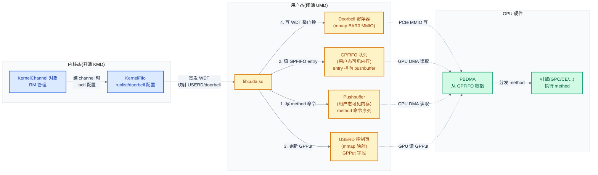
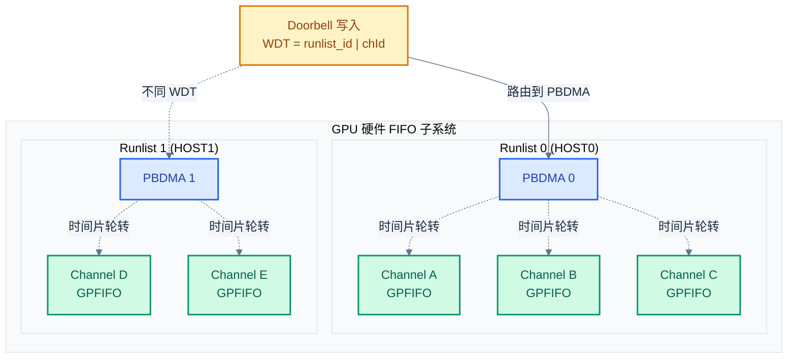
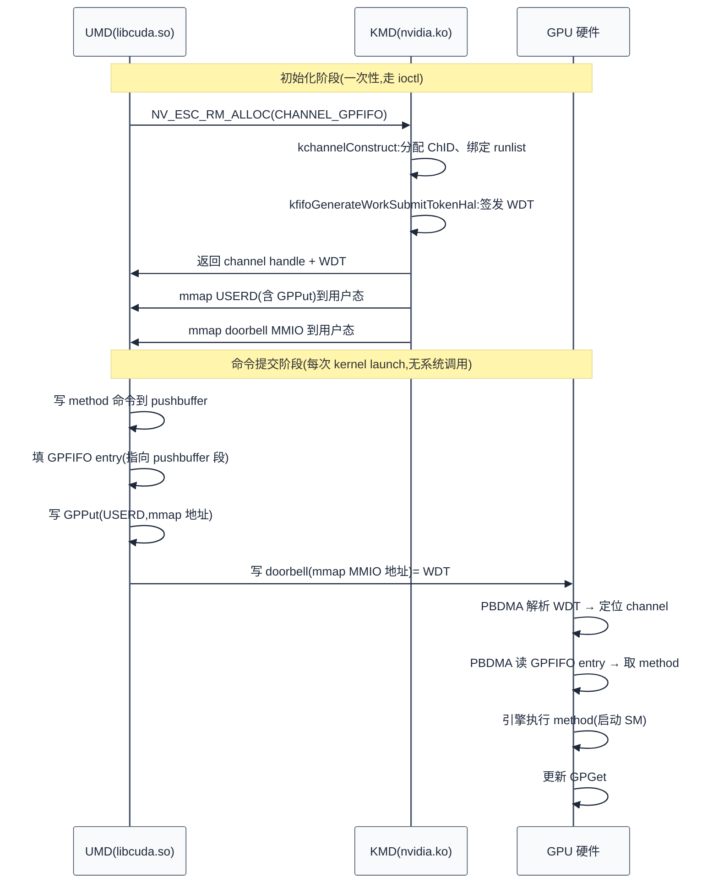

# 05 - 命令提交:channel/GPFIFO/doorbell

> 从 ioctl 配置好的 channel 出发,讲清 UMD 如何通过 GPFIFO 环形队列 + doorbell MMIO 把命令直接推给 GPU 硬件——这是推理链路中"绕过内核"的关键设计,也是 NVIDIA 命令提交模型的核心。
>
> **工程师视角**:理解 channel/GPFIFO/doorbell 三件套后,你能回答"为什么一次 kernel launch 不需要每次都陷入内核"——UMD 把 method 命令写进 pushbuffer,填一个 GPFIFO entry,更新 GPPut,然后直写 doorbell 寄存器,全程在用户态完成(除初始化建 channel 外)。这是 GPU 高吞吐的基石。

### 关键术语

| 缩写 | 全称 | 含义 |
|------|------|------|
| Channel | — | GPU 命令提交通道,绑定一个 GPFIFO 队列与一个引擎 |
| Context | — | GPU 地址空间与资源的容器,一个 Context 可含多个 Channel |
| TSG | Time Slice Group | 通道组,一组 channel 作为一个调度单元共享时间片 |
| Runlist | — | channel 的调度队列,GPU 硬件按 runlist 轮转 channel |
| GPFIFO | GPU Pushbuffer FIFO | GPU 命令队列环形缓冲,驱动写 GPPut、GPU 读 GPGet |
| Pushbuffer | — | 装载 GPU method 命令的内存缓冲,GPFIFO entry 指向其中一段 |
| Method | — | GPU 命令的最小单元,由 method address + data 组成 |
| GPPut / GPGet | — | GPFIFO 的生产者/消费者指针,UMD 写 Put、GPU 硬件读 Get |
| USERD | User Region for Doorbell | 用户态可映射的 channel 控制页,含 GPPut 等字段 |
| Doorbell | — | 通知 GPU 有新命令的门铃寄存器(PCIe BAR0 MMIO) |
| WDT | Work Submit Token | 工作提交令牌,doorbell 写入的值,编码 runlist + channel |
| PBDMA | Pushbuffer DMA | GPU 硬件单元,从 GPFIFO 取指并分发到引擎 |
| WFI | Wait For Idle | 等待空闲的 method,用于同步 |
| CE | Copy Engine | 拷贝引擎,用于显存搬运(KMD 内部 channel 常用) |
| GPC | Graphics Processing Cluster | GPU 硬件调度单元,含多个 TPC/SM |
| SM | Streaming Multiprocessor | GPU 计算执行单元,见 [../cuda/01](../cuda/01-GPU架构基础.md) |

---

## 1. 概述

### 1.1 前置知识

| 需要了解 | 参考文档 |
|----------|----------|
| UMD↔KMD ioctl 边界、RM client/handle 对象模型 | [04-字符设备与ioctl接口](./04-字符设备与ioctl接口.md) |
| 推理全链路 5 个 checkpoint,本文对应 checkpoint C | [03-推理全链路总览](./03-推理全链路总览.md) |
| RM 三层架构、GSP RPC 委托 | [02-源码架构与RM分层设计](./02-源码架构与RM分层设计.md) |
| CUDA 编程模型(stream/kernel launch) | [../cuda/05-CUDA编程模型与执行模型](../cuda/05-CUDA编程模型与执行模型.md) |
| GPU 硬件结构(SM/GPC/引擎) | [../cuda/01-GPU架构基础](../cuda/01-GPU架构基础.md) |

### 1.2 系统上下文

> 上一章(04)讲清了 UMD 通过 ioctl 在 KMD 里创建 RM 对象(client/device/channel)的过程。但 ioctl 只负责"配置"——建好 channel 后,真正的命令提交**不走 ioctl**,而是 UMD 在用户态直接写 pushbuffer、填 GPFIFO、敲 doorbell。一个自然的问题是:**为什么要绕过内核?GPFIFO 和 doorbell 怎么让用户态直接驱动硬件?** 本章回答这个问题——先建立 channel 的对象模型,再拆 GPFIFO 环形队列,接着讲 GPPut/GPGet 的无锁生产消费,然后是 doorbell 的 usermode 直写,最后落到 PBDMA 硬件取指。

**项目定位(回顾)**:本章研究的是 **UMD 与 GPU 硬件之间的命令提交通道**。在 NVIDIA 的架构里,命令提交被设计成**用户态可直达硬件**——UMD 把 method 命令写进 pushbuffer(用户态可见内存),在 GPFIFO 队列里填一个 entry 指向这段命令,更新 GPPut 指针,然后写一次 doorbell 寄存器通知 GPU 来取。除了初始化建 channel 需要 ioctl,每次 kernel launch 的命令提交完全在用户态完成,没有系统调用开销。这是 GPU 实现高吞吐(每秒数十万次 kernel launch)的关键。

**软硬件耦合点**:本章聚焦的耦合点是 **USERD(User Region for Doorbell)与 doorbell 寄存器的双映射**。UMD 通过 mmap 把 channel 的控制页(USERD,含 GPPut 字段)和 doorbell 寄存器(BAR0 MMIO)映射到用户态地址空间,之后写 GPPut 和敲 doorbell 都是对用户态地址的 store 指令,CPU 直接走 PCIe 写请求到达 GPU。这种"用户态直写 MMIO"绕过了内核,但也带来安全考量——doorbell 写入的值(WDT)必须由 KMD 在建 channel 时签发,防止 UMD 伪造 token 敲别人的 channel。

**跨实现对比**:与 AMD amdgpu 的 `amdgpu_cs` (command submission)对比——amdgpu 每次提交命令都走 ioctl(`DRM_IOCTL_AMDGPU_CS`),把 IB(Indirect Buffer)指针交给 `drm_sched` 调度器;NVIDIA 则是"一次建 channel,之后用户态直推",命令提交无 ioctl。这反映两种调度哲学:NVIDIA 的"硬件调度(runlist 轮转)+ 用户态直推"vs AMD 的"软件调度(drm_sched)+ 内核中转"。详见 §8。



> **如何读这张图**:命令提交的 4 步全在用户态(黄色)完成——写 pushbuffer、填 GPFIFO、更新 GPPut、敲 doorbell。KMD(蓝色)只在建 channel 时介入一次,通过 ioctl 配置 KernelFifo、签发 WDT、映射 USERD 和 doorbell 到用户态。之后每次提交,KMD 完全不参与——doorbell 的 MMIO 写直接到达 GPU 的 PBDMA 硬件(绿色),PBDMA 通过 DMA 从 GPFIFO/pushbuffer 取指,分发 method 给引擎执行。这就是"绕过内核"的完整图景。

> **核心要点**:NVIDIA 命令提交是**用户态直推模型**——UMD 把 method 写进 pushbuffer,在 GPFIFO 填 entry 指向它,更新 GPPut,直写 doorbell。除建 channel 外,每次 kernel launch 无系统调用、无内核参与。这是通过 USERD + doorbell 的双 mmap 映射实现的:用户态 store 指令直接走 PCIe 到达 GPU 硬件。代价是 WDT 必须由 KMD 签发,防止越权敲别人的 channel。

---

## 2. Context 与 Channel:命令提交的对象模型

### 2.1 Channel 是什么:一条通向 GPU 引擎的命令管道

先建立直觉:一个 channel 就是一条**从 CPU 通向 GPU 某个引擎的命令管道**。UMD 往管道里塞 method 命令,GPU 引擎从管道里取命令执行。

考虑一个推理场景:PyTorch 调 `model.forward()`,内部会发射多个 kernel(matmul、attention、layernorm)。每个 kernel 是一段 PTX/SASS 指令,被封装成 method 命令塞进 pushbuffer,再通过 channel 提交给 GPU。一个推理进程通常开多个 channel——计算 channel(绑 GPC 引擎)、拷贝 channel(绑 CE 引擎),分别走不同管道,实现计算与搬运重叠。

Channel 与 Context 的关系:

| 概念 | 粒度 | 内容 | 类比 |
|------|------|------|------|
| **Context** | 进程级 | GPU 地址空间(VASpace)+ 资源集合(显存、channel) | 进程的"GPU 上下文" |
| **Channel Group (TSG)** | 调度级 | 一组 channel,共享时间片与地址空间 | 线程组 |
| **Channel** | 命令管道 | 一条 GPFIFO 队列 + 绑定一个引擎 | 单线程的命令流 |

一个 Context 可含多个 Channel Group,一个 Channel Group 可含多个 Channel。推理进程典型布局:一个 Context,下挂若干计算 channel 和拷贝 channel,共享同一 VASpace(这样所有 channel 看到相同的显存地址)。

### 2.2 Channel 分配:NV_ESC_RM_ALLOC + CHANNEL_GPFIFO

Channel 是 RM 对象,通过 `NV_ESC_RM_ALLOC` 分配。它的 class 是架构相关的——Turing 架构用 `TURING_CHANNEL_GPFIFO_A`(0xC46F),Ampere 用 `AMPERE_CHANNEL_GPFIFO_A`,Kepler 用 `KEPLER_CHANNEL_GPFIFO_A`(0xA06F)。分配参数是 `NV_CHANNEL_ALLOC_PARAMS`(别名 `NV_CHANNELGPFIFO_ALLOCATION_PARAMETERS`):

```c
/* 摘自 [src/common/sdk/nvidia/inc/alloc/alloc_channel.h](./src/open-gpu-kernel-modules/src/common/sdk/nvidia/inc/alloc/alloc_channel.h) 第 296-349 行 */
typedef struct NV_CHANNEL_ALLOC_PARAMS {
    NvHandle hObjectError;                                    // error context DMA
    NvHandle hObjectBuffer;                                   // no longer used
    NV_DECLARE_ALIGNED(NvU64 gpFifoOffset, 8);               // offset to beginning of GP FIFO
    NvU32    gpFifoEntries;                                   // number of GP FIFO entries

    NvU32    flags;

    NvHandle hContextShare;                                   // context share handle
    NvHandle hVASpace;                                        // Pointer-based VASpace
    NvHandle hHandleVASpace;                                  // Handle-based VASpace

    // handle to UserD memory object for channel, ignored if hUserdMemory[0]=0
    NvHandle hUserdMemory[NV_MAX_SUBDEVICES];
    // offset to beginning of UserD within hUserdMemory[x]
    NV_DECLARE_ALIGNED(NvU64 userdOffset[NV_MAX_SUBDEVICES], 8);

    NvU32    engineType;                                      // NV2080_ENGINE_TYPE_*
    NvU32    cid;                                             // Channel identifier
    NvU32    subDeviceId;

    NV_DECLARE_ALIGNED(NV_MEMORY_DESC_PARAMS instanceMem, 8);  // channel instance 内存
    NV_DECLARE_ALIGNED(NV_MEMORY_DESC_PARAMS userdMem, 8);     // USERD 内存
    NV_DECLARE_ALIGNED(NV_MEMORY_DESC_PARAMS ramfcMem, 8);     // RAMFC(通道上下文)
    NV_DECLARE_ALIGNED(NV_MEMORY_DESC_PARAMS mthdbufMem, 8);   // method buffer
    /* ... 其余字段 ... */
} NV_CHANNEL_ALLOC_PARAMS;
typedef NV_CHANNEL_ALLOC_PARAMS NV_CHANNELGPFIFO_ALLOCATION_PARAMETERS;
```

这个结构体体现了 channel 的几大组成:

- **GPFIFO**:`gpFifoOffset` + `gpFifoEntries` 描述命令队列环形缓冲的位置与容量。UMD 先分配一块内存作 GPFIFO,把偏移和 entry 数填进来。
- **USERD**:`hUserdMemory` + `userdOffset` 描述用户态控制页——GPPut 指针就写在这里,用户态可直接映射访问。
- **VASpace**:`hVASpace` 绑定地址空间,同组 channel 共享同一 VASpace 才能互见显存。
- **引擎**:`engineType` 指定 channel 绑定哪个引擎(GPC 计算 / CE 拷贝 / SEC2 安全)。
- **通道实例内存**:`instanceMem`/`ramfcMem`/`mthdbufMem` 是 GPU 硬件为 channel 分配的上下文内存——RAMFC(RAM Function Context)存 channel 的硬件状态(寄存器快照),mthdbuf 存溢出的 method。

`kchannelConstruct_IMPL` 是 channel 对象的构造函数,处理这些参数:

```c
/* 摘自 [src/nvidia/src/kernel/gpu/fifo/kernel_channel.c](./src/open-gpu-kernel-modules/src/nvidia/src/kernel/gpu/fifo/kernel_channel.c) 第 125-200 行(简化) */
NV_STATUS kchannelConstruct_IMPL(KernelChannel *pKernelChannel,
    CALL_CONTEXT *pCallContext, RS_RES_ALLOC_PARAMS_INTERNAL *pParams)
{
    OBJGPU            *pGpu             = GPU_RES_GET_GPU(pKernelChannel);
    KernelFifo        *pKernelFifo      = GPU_GET_KERNEL_FIFO(pGpu);
    NV_CHANNEL_ALLOC_PARAMS *pChannelGpfifoParams = pParams->pAllocParams;
    NvHandle           hKernelCtxShare  = pChannelGpfifoParams->hContextShare;

    // We only support physical channels.
    NV_ASSERT_OR_RETURN(FLD_TEST_DRF(OS04, _FLAGS, _CHANNEL_TYPE, _PHYSICAL, flags),
        NV_ERR_NOT_SUPPORTED);

    pKernelChannel->refCount = 1;
    pKernelChannel->cid = portAtomicIncrementU32(&pSys->currentChannelUniqueId);
    pKernelChannel->engineType = RM_ENGINE_TYPE_NULL;

    /* ... 查找 device、分配 channel ID、绑定 VASpace、分配通道实例内存 ... */
}
```

注意 `NV_ASSERT_OR_RETURN(FLD_TEST_DRF(OS04, _FLAGS, _CHANNEL_TYPE, _PHYSICAL, flags), ...)`——只支持物理 channel(virtual channel 已废弃)。物理 channel 直接绑定硬件引擎,virtual channel 原本用于虚拟化但已被 SR-IOV 取代。

### 2.3 Channel Group (TSG):调度单元

单个 channel 独立调度会导致 GPU 硬件 runlist 切换频繁(每个 channel 切换要换上下文)。NVIDIA 引入 **TSG(Time Slice Group,通道组)**——把一组相关 channel 绑成一个调度单元,共享时间片与 VASpace。

推理场景的典型用法:把多个计算 channel 放进一个 TSG,GPU 硬件在 TSG 内部切换 channel 时无需换 VASpace(共享),只有 TSG 间切换才换。这降低了上下文切换开销。TSG 的分配也是 `NV_ESC_RM_ALLOC`,class 是 `KEPLER_CHANNEL_GROUP_A`(0xA06C)等,channel 创建时通过 `hObjectParent` 挂到 TSG 下。

### 2.4 Runlist:channel 的调度队列

GPU 硬件不是直接逐个 channel 调度,而是把 channel 组织成 **runlist**——一个 runlist 是一组 channel 的调度队列,GPU 的 PBDMA 硬件按 runlist 顺序轮转 channel,每个 channel 跑一个时间片后切下一个。

一个 GPU 有多个 runlist(如 Turing 有 HOST0~HOST11),每个 runlist 绑定若干引擎类型。channel 创建时被分配到某个 runlist,之后该 channel 的命令由对应 runlist 的 PBDMA 取指。runlist 的概念解释了 doorbell 的 WDT 为什么编码 runlist_id——GPU 收到 doorbell 后,根据 WDT 里的 runlist_id 找到对应 PBDMA,再按 channel_id 找到 channel 的 GPFIFO。



> **如何读这张图**:GPU 的 FIFO 子系统把 channel 组织成多个 runlist,每个 runlist 由一个 PBDMA 硬件单元驱动,按时间片轮转其中的 channel。Doorbell 写入的 WDT 编码了 `runlist_id | channel_id`,GPU 据此路由到正确的 PBDMA,该 PBDMA 再从对应 channel 的 GPFIFO 取指。这种"两级路由(doorbell → runlist → channel)"让多个 channel 的命令提交互不干扰。

> **核心要点**:channel 是 RM 对象,通过 `NV_ESC_RM_ALLOC` + `CHANNEL_GPFIFO` class 分配,参数携带 GPFIFO 位置、USERD 位置、VASpace、引擎类型。channel 被分配到某个 runlist,由对应 PBDMA 按时间片轮转调度。TSG 把一组 channel 绑成调度单元,共享 VASpace 降低切换开销。这是命令提交的"对象模型层"——建好后,后续提交全在用户态。

---

## 3. GPFIFO:环形命令队列

### 3.1 GPFIFO 的本质:生产者-消费者环形缓冲

GPFIFO 的本质是一个**生产者-消费者环形缓冲**:

- **生产者(CPU/UMD)**:把 method 命令写进 pushbuffer,在 GPFIFO 队列里填一个 entry 指向这段 pushbuffer,然后更新 GPPut 指针(指向下一个要填的 entry 位置)。
- **消费者(GPU/PBDMA)**:从 GPGet 指针位置读 GPFIFO entry,按 entry 里的地址去 pushbuffer 取 method 命令,执行完后更新 GPGet。

GPPut 和 GPGet 是两个指针,在环形缓冲上追逐——只要 Put != Get,说明有未消费的命令;Put 追上 Get(环形回绕)说明队列满,生产者要等。

用一个具体小例子说明环形缓冲的工作过程。假设 GPFIFO 有 4 个 entry(实际通常 1024+):

```
初始状态:GPGet=0, GPPut=0(空队列)

Entry[0]: 空
Entry[1]: 空
Entry[2]: 空
Entry[3]: 空

UMD 提交 kernel A(占 pushbuffer 0x1000~0x1020):
  填 Entry[0] = {GET=0x1000, LENGTH=0x20}
  GPPut = 1

Entry[0]: {GET=0x1000, LENGTH=0x20}  ← GPU 取走,GPGet=1
Entry[1]: 空
...

UMD 提交 kernel B(占 pushbuffer 0x1020~0x1040):
  填 Entry[1] = {GET=0x1020, LENGTH=0x20}
  GPPut = 2

UMD 连续提交,GPPut 追到 4,回绕到 0:
  填 Entry[2], Entry[3], GPPut=4 → 回绕 GPPut=0
  若此时 GPGet=1,队列有 3 个未消费(Entry[2,3,0])
```

这种环形缓冲的优势:① **无锁**——生产者只写 Put,消费者只写 Get,通过比较两者判断状态,无需加锁(只需内存屏障保证可见性);② **批量提交**——UMD 可以连续填多个 entry 再敲一次 doorbell,GPU 批量取指;③ **自然背压**——队列满时 Put==Get(回绕后),UMD 必须等 GPU 消费。

### 3.2 GPFIFO entry 格式

GPFIFO 的每个 entry 是 8 字节(两个 32 位字),格式定义在 channel class 头文件(以 Turing `clc46f.h` 为例):

```c
/* 摘自 [src/common/sdk/nvidia/inc/class/clc46f.h](./src/open-gpu-kernel-modules/src/common/sdk/nvidia/inc/class/clc46f.h) 第 264-282 行 */
/* GPFIFO entry format */
#define NVC46F_GP_ENTRY__SIZE                                   8
#define NVC46F_GP_ENTRY0_FETCH                                0:0
#define NVC46F_GP_ENTRY0_FETCH_UNCONDITIONAL           0x00000000
#define NVC46F_GP_ENTRY0_FETCH_CONDITIONAL             0x00000001
#define NVC46F_GP_ENTRY0_GET                                 31:2
#define NVC46F_GP_ENTRY0_OPERAND                             31:0
#define NVC46F_GP_ENTRY1_GET_HI                               7:0
#define NVC46F_GP_ENTRY1_LEVEL                                9:9
#define NVC46F_GP_ENTRY1_LEVEL_MAIN                    0x00000000
#define NVC46F_GP_ENTRY1_LEVEL_SUBROUTINE              0x00000001
#define NVC46F_GP_ENTRY1_LENGTH                             30:10
#define NVC46F_GP_ENTRY1_SYNC                               31:31
#define NVC46F_GP_ENTRY1_SYNC_PROCEED                  0x00000000
#define NVC46F_GP_ENTRY1_SYNC_WAIT                     0x00000001
#define NVC46F_GP_ENTRY1_OPCODE                               7:0
#define NVC46F_GP_ENTRY1_OPCODE_NOP                    0x00000000
#define NVC46F_GP_ENTRY1_OPCODE_ILLEGAL                0x00000001
#define NVC46F_GP_ENTRY1_OPCODE_GP_CRC                 0x00000002
#define NVC46F_GP_ENTRY1_OPCODE_PB_CRC                 0x00000003
```

逐字段解释:

| 字段 | 位 | 含义 |
|------|:--:|------|
| `GET` | Entry0[31:2] + Entry1[7:0] | pushbuffer 中命令段的起始地址(40 位,字对齐) |
| `LENGTH` | Entry1[30:10] | 命令段长度(字数) |
| `FETCH` | Entry0[0] | `UNCONDITIONAL`=无条件取;`CONDITIONAL`=条件取(依赖 semaphore) |
| `LEVEL` | Entry1[9] | `MAIN`=主命令;`SUBROUTINE`=子程序调用 |
| `SYNC` | Entry1[31] | `PROCEED`=不等;`WAIT`=等前面的 semaphore |
| `OPCODE` | Entry1[7:0] | 特殊操作(NOP/GP_CRC/PB_CRC,用于容错) |

一个 entry 的语义:"去 pushbuffer 的 `GET` 地址,取 `LENGTH` 个字,当作 method 命令执行"。`FETCH=CONDITIONAL` + `SYNC=WAIT` 组合实现命令间同步——等某个 semaphore 满足条件后才取这段命令,这是 CUDA Stream 间依赖的底层机制。

### 3.3 Pushbuffer:method 命令的载体

Pushbuffer 是 UMD 分配的一块内存(通常显存或 PCIe 可见系统内存),里面装的是 **method 命令序列**。GPFIFO entry 指向 pushbuffer 的一段,GPU 把这段当作 method 流解析。

Method 是 GPU 命令的最小单元,格式如下(以 Turing 为例):

```c
/* 摘自 [src/common/sdk/nvidia/inc/class/clc46f.h](./src/open-gpu-kernel-modules/src/common/sdk/nvidia/inc/class/clc46f.h) 第 285-307 行 */
/* dma method formats */
#define NVC46F_DMA_METHOD_ADDRESS                                  11:0
#define NVC46F_DMA_METHOD_SUBCHANNEL                               15:13
#define NVC46F_DMA_TERT_OP                                         17:16
#define NVC46F_DMA_TERT_OP_GRP0_INC_METHOD                         (0x00000000)
#define NVC46F_DMA_METHOD_COUNT                                    28:16
#define NVC46F_DMA_SEC_OP                                          31:29
#define NVC46F_DMA_SEC_OP_INC_METHOD                               (0x00000001)
#define NVC46F_DMA_SEC_OP_NON_INC_METHOD                           (0x00000003)
#define NVC46F_DMA_SEC_OP_IMMD_DATA_METHOD                         (0x00000004)
#define NVC46F_DMA_SEC_OP_END_PB_SEGMENT                           (0x00000007)
/* dma incrementing method format */
#define NVC46F_DMA_INCR_ADDRESS                                    11:0
#define NVC46F_DMA_INCR_SUBCHANNEL                                 15:13
#define NVC46F_DMA_INCR_COUNT                                      28:16
#define NVC46F_DMA_INCR_OPCODE                                     31:29
#define NVC46F_DMA_INCR_OPCODE_VALUE                               (0x00000001)
#define NVC46F_DMA_INCR_DATA                                       31:0
```

一条 method 由**头字 + 数据字**组成:

- **头字**:`[31:29]` SEC_OP(操作类型) + `[15:13]` SUBCHANNEL(子通道,区分计算/图形) + `[28:16]` COUNT(数据个数) + `[11:0]` ADDRESS(寄存器地址)
- **数据字**:紧跟头字,个数由 COUNT 决定

几种 SEC_OP:
- `INC_METHOD`(0x1):递增 method——每个数据写到 ADDRESS、ADDRESS+1、ADDRESS+2...(写连续寄存器)
- `NON_INC_METHOD`(0x3):非递增——所有数据写到同一 ADDRESS
- `IMMD_DATA_METHOD`(0x4):立即数据——数据直接编码在头字里(单字 method,无后续数据字)
- `END_PB_SEGMENT`(0x7):pushbuffer 段结束标志

一个 method 的语义:"把数据写到 GPU 引擎的寄存器 ADDRESS"。这些寄存器是 GPU 硬件的"控制旋钮"——写 `SET_PROGRAM_REGION` 配置 shader 地址,写 `LAUNCH_GRID` 触发 kernel 启动,写 `SEM_EXECUTE` 释放 semaphore 通知 CPU。一次 kernel launch 就是往 pushbuffer 写一串 method(配置 grid 维度、shader 地址、启动),GPFIFO entry 指向这串 method。

```
Pushbuffer 布局示例(一次 kernel launch):
+0x0000: [INC_METHOD | SUBCH=1 | COUNT=3 | ADDR=SET_PROGRAM_REGION]
         数据0: shader 基地址低 32 位
         数据1: shader 基地址高 32 位
         数据2: 程序区域大小
+0x0010: [INC_METHOD | SUBCH=1 | COUNT=4 | ADDR=LAUNCH_GRID]
         数据0: grid 维度 X
         数据1: grid 维度 Y
         数据2: grid 维度 Z
         数据3: 启动标志
+0x0024: [END_PB_SEGMENT]                  ← 段结束
```

### 3.4 KMD 内部 channel 的 GPFIFO 填充

`channelFillGpFifo` 是 KMD 内部 channel(用于 CE 拷贝、内存清理等)填充 GPFIFO entry 的函数,展示了 entry 构造与 GPPut 更新的完整过程:

```c
/* 摘自 [src/nvidia/src/kernel/gpu/mem_mgr/channel_utils.c](./src/open-gpu-kernel-modules/src/nvidia/src/kernel/gpu/mem_mgr/channel_utils.c) 第 453-531 行(简化) */
NV_STATUS channelFillGpFifo(OBJCHANNEL *pChannel, NvU32 putIndex, NvU32 methodsLength)
{
    NvU32 *pGpEntry;
    NvU32  GpEntry0, GpEntry1;
    NvU64  pbPutOffset = (pChannel->pbGpuVA + (putIndex * pChannel->methodSizePerBlock));

    // 构造 GPFIFO entry 的两个 32 位字
    GpEntry0 = DRF_DEF(906F, _GP_ENTRY0, _NO_CONTEXT_SWITCH, _FALSE) |
               DRF_NUM(906F, _GP_ENTRY0, _GET, NvU64_LO32(pbPutOffset) >> 2);  // pushbuffer 地址低 32 位(字对齐)

    GpEntry1 = DRF_NUM(906F, _GP_ENTRY1, _GET_HI, NvU64_HI32(pbPutOffset)) |  // 地址高 8 位
               DRF_NUM(906F, _GP_ENTRY1, _LENGTH, methodsLength >> 2) |        // 命令长度(字数)
               DRF_DEF(906F, _GP_ENTRY1, _LEVEL, _MAIN);                       // 主命令

    // 写入 GPFIFO 队列的对应 entry
    pGpEntry = (NvU32 *)(((NvU8 *)pChannel->pbCpuVA) + pChannel->channelPbSize +
                (pChannel->lastSubmittedEntry * NV906F_GP_ENTRY__SIZE));
    MEM_WR32(&pGpEntry[0], GpEntry0);
    MEM_WR32(&pGpEntry[1], GpEntry1);

    osFlushCpuWriteCombineBuffer();   // 刷新写组合缓冲,确保 GPU 可见

    // 写 GPPut 指针(在 USERD 控制页中)
    MEM_WR32(&pChannel->pControlGPFifo->GPPut, putIndex);
    osFlushCpuWriteCombineBuffer();

    // 敲 doorbell
    kfifoRingChannelDoorBell_HAL(pGpu, pKernelFifo, pKernelChannel);
}
```

这段代码完整展示了命令提交的三步:① **填 entry**——把 pushbuffer 地址和长度编码进 8 字节 entry,写入 GPFIFO 队列;② **更新 GPPut**——把新的 put 索引写入 USERD 控制页的 `GPPut` 字段;③ **敲 doorbell**——调 `kfifoRingChannelDoorBell_HAL` 通知 GPU。

注意 `osFlushCpuWriteCombineBuffer()` 出现两次——写 entry 后和写 GPPut 后都要刷写组合缓冲(write-combine buffer)。写组合是 CPU 对 PCIe 内存的优化批量写机制,不刷的话 GPU 可能看不到最新数据。这是"CPU↔GPU 内存可见性"的细节,漏刷会导致 GPU 取到旧命令。

> **为什么 KMD 内部 channel 走这条路径,而 UMD 的 channel 不走?** 因为 UMD 的 channel 提交完全在用户态(UMD 自己写 entry、写 GPPut、敲 doorbell),不调这个函数。`channelFillGpFifo` 是 KMD 自己的 channel(如 CE 内存清理、SEC2 安全操作)用的——这些 channel 不暴露给用户态,KMD 在内核里直接填 entry。

> **核心要点**:GPFIFO 是生产者-消费者环形缓冲——UMD 填 entry(指向 pushbuffer 的 method 段)、更新 GPPut;GPU 的 PBDMA 读 entry、取 method、执行、更新 GPGet。两者无锁协作,只靠内存屏障保证可见性。GPFIFO entry 8 字节,编码 pushbuffer 地址 + 长度 + 同步标志。Pushbuffer 里是 method 命令(头字 + 数据),一条 method 就是"写 GPU 引擎的某个寄存器"。

---

## 4. GPPut / GPGet:无锁生产消费

### 4.1 USERD:用户态可直接访问的控制页

GPPut 指针存在 **USERD(User Region for Doorbell)**——一块用户态可映射的内存页。channel 分配时,UMD 提供 `hUserdMemory` + `userdOffset` 指定 USERD 位置,之后 UMD 把这块内存 mmap 到用户态,直接写 GPPut。

USERD 的结构(简化):

```
USERD 控制页布局:
偏移 0x000-0x03f: 保留(16 dwords)
偏移 0x040: Put       (channel 级 put,UMD 读写)
偏移 0x044: Get       (channel 级 get,GPU 写,UMD 只读)
偏移 0x048: Reference (完成计数,GPU 写,UMD 只读)
偏移 0x050: SetReferenceThreshold (通知阈值)
偏移 0x088: GPGet     (GPFIFO get,GPU 硬件写,UMD 只读)
偏移 0x08c: GPPut     (GPFIFO put,UMD 写,GPU 硬件读)
```

关键:GPGet 由 GPU 硬件写,GPPut 由 UMD 写——两者各管一个指针,互不覆盖,这是无锁的前提。UMD 比较 `GPPut - GPGet` 判断队列剩余空间,GPU 比较 `GPPut != GPGet` 判断有无可消费命令。

### 4.2 为什么无锁是安全的

无锁的正确性依赖**单生产者 + 单消费者**的约束:

- **生产者唯一**:一个 channel 同一时刻只有一个 CPU 线程在填 entry(UMD 保证,通常一个 stream 对应一个 channel)。
- **消费者唯一**:一个 channel 绑定一个 PBDMA 硬件单元,GPU 保证串行取指。

在这种约束下,GPPut 只有一个写者(UMD),GPGet 只有一个写者(GPU),两者读对方的指针判断状态。只要用内存屏障保证"写 entry → 写 GPPut"的顺序(UMD 侧)和"读 GPPut → 读 entry"的顺序(GPU 侧),就不会出现"GPU 看到 GPPut 更新但 entry 还没写完"的竞态。`channelFillGpFifo` 里的 `osFlushCpuWriteCombineBuffer()` 就是这个屏障。

> **如果多个 CPU 线程往同一 channel 提交怎么办?** UMD 必须自己加锁(或用原子操作序列化提交)。CUDA Stream 的默认行为是同一 stream 内的 kernel 串行执行,UMD 在用户态保证一个 stream 的命令按顺序填 entry。如果多个 stream 共用一个 channel,UMD 需要协调——这也是为什么 CUDA 通常给每个 stream 独立的 channel。

---

## 5. Doorbell:通知 GPU 有新命令

### 5.1 Doorbell 的本质:一次 MMIO 写

Doorbell 是 GPU 暴露的一个 **MMIO 寄存器**(`NV_VIRTUAL_FUNCTION_DOORBELL`),位于 PCIe BAR0 的某个偏移。写这个寄存器就是"按门铃"——告诉 GPU"这个 channel 有新命令了,快来取"。

从 CPU 视角,写 doorbell 就是一次对 MMIO 地址的 store 指令。因为 BAR0 可以 mmap 到用户态,所以 UMD 能在用户态直接写 doorbell,不需要系统调用。这就是"绕过内核"的关键——doorbell 寄存器被映射进用户态地址空间,用户态 store 指令直接走 PCIe 到达 GPU。

```c
/* 摘自 [src/nvidia/src/kernel/gpu/fifo/arch/turing/kernel_fifo_tu102.c](./src/open-gpu-kernel-modules/src/nvidia/src/kernel/gpu/fifo/arch/turing/kernel_fifo_tu102.c) 第 49-62 行 */
NV_STATUS kfifoUpdateUsermodeDoorbell_TU102(OBJGPU *pGpu, KernelFifo *pKernelFifo,
                                             NvU32 workSubmitToken)
{
    NV_PRINTF(LEVEL_INFO, "Poking workSubmitToken 0x%x\n", workSubmitToken);

    GPU_VREG_WR32(pGpu, NV_VIRTUAL_FUNCTION_DOORBELL, workSubmitToken);

    return NV_OK;
}
```

`GPU_VREG_WR32(pGpu, NV_VIRTUAL_FUNCTION_DOORBELL, workSubmitToken)` 是对虚拟函数寄存器的 32 位写——写入 WDT(work submit token)。这是 KMD 内部 channel 敲 doorbell 的路径;UMD 的 channel 则直接在用户态写映射的 doorbell 地址,不走这个函数。

### 5.2 Work Submit Token (WDT)

Doorbell 寄存器写入的值是 **WDT(work submit token)**,它编码了"哪个 runlist 的哪个 channel 有新命令"。WDT 由 KMD 在建 channel 时签发:

```c
/* 摘自 [src/nvidia/src/kernel/gpu/fifo/arch/turing/kernel_fifo_tu102.c](./src/open-gpu-kernel-modules/src/nvidia/src/kernel/gpu/fifo/arch/turing/kernel_fifo_tu102.c) 第 74-133 行(简化) */
NV_STATUS kfifoGenerateWorkSubmitTokenHal_TU102(OBJGPU *pGpu, KernelFifo *pKernelFifo,
    KernelChannel *pKernelChannel, NvU32 *pGeneratedToken, NvBool bUsedForHost)
{
    NvU32 chId = pKernelChannel->ChID;
    NvU32 val = 0;

    /* ... vGPU SR-IOV 的虚拟 channel id 映射 ... */

    // Here we construct token to be a concatenation of runlist id and channel id
    val = FLD_SET_DRF_NUM(_CTRL, _VF_DOORBELL, _RUNLIST_ID, kchannelGetRunlistId(pKernelChannel), val);
    val = FLD_SET_DRF_NUM(_CTRL, _VF_DOORBELL, _VECTOR, chId, val);
    *pGeneratedToken = val;

    return NV_OK;
}
```

WDT = `[runlist_id | channel_id]` 的位拼接。GPU 收到 doorbell 写后,解析 WDT 得到 runlist_id,路由到对应的 PBDMA,再按 channel_id 找到 channel 的 GPFIFO 开始取指。

> **为什么 WDT 要由 KMD 签发,不能让 UMD 自己拼?** 这是安全设计——如果 UMD 能随意构造 WDT,它就能敲别人的 channel(比如别的进程的 channel),把命令注入到别人的地址空间。KMD 在建 channel 时签发 WDT 给 UMD,UMD 只能敲自己的 channel。WDT 本质是"doorbell 写入权限的凭证"。

### 5.3 Usermode doorbell:用户态直写

现代 GPU(Turing 起)支持 **usermode doorbell**——doorbell 寄存器位于虚拟函数的 MMIO 空间(`NV_VIRTUAL_FUNCTION_DOORBELL`),可以映射到用户态。UMD 在建 channel 时通过 ioctl 拿到 doorbell 的映射地址,之后每次提交命令直接 `*(volatile NvU32 *)doorbell_addr = wdt`,无需任何系统调用。

对比**传统 doorbell**(Turing 之前):doorbell 寄存器在内核独占的 BAR0 区域,UMD 不能直接写,必须通过 ioctl 让 KMD 代写——每次提交都要系统调用。usermode doorbell 消除了这个开销,是 Turing 架构的重要改进。



> **如何读这张图**:分两阶段——初始化走 ioctl(KMD 介入:分配 channel、签发 WDT、映射 USERD/doorbell);命令提交完全在用户态(UMD 写 pushbuffer → 填 GPFIFO → 写 GPPut → 敲 doorbell,GPU 硬件取指执行)。关键是命令提交阶段没有 KMD 参与,这是高吞吐的来源。

> **核心要点**:doorbell 是 GPU 的 MMIO 寄存器,写它就是"按门铃"通知 GPU 取命令。Turing 起的 usermode doorbell 让 UMD 能在用户态直写(通过 mmap BAR0),无需系统调用。WDT 编码 runlist+channel,由 KMD 签发防伪——UMD 只能敲自己的 channel。这是命令提交"绕过内核"的硬件基础。

---

## 6. PBDMA:硬件取指单元(闭源边界)

### 6.1 PBDMA 从 GPFIFO 取指并分发

PBDMA(Pushbuffer DMA)是 GPU 硬件的命令取指单元,工作流程:

1. 收到 doorbell 中断(或轮询发现 GPPut 变化)
2. 读 GPPut,与 GPGet 比较,若有新 entry 则取指
3. 读 GPFIFO entry,得到 pushbuffer 地址 + 长度
4. 从 pushbuffer DMA 取 method 命令
5. 解析 method 头字,按 SEC_OP 处理数据字
6. 把 method 写入对应引擎的寄存器(经 subchannel 路由)
7. 执行完一个 entry,更新 GPGet,继续下一个

PBDMA 还负责 method 命令的**校验与容错**——非法 method 地址、越权寄存器访问会触发 PBDMA fault,上报为 Xid 错误(见 06)。channel 的 `hObjectError` 参数指定的 error context DMA 就是接收 PBDMA 错误通知的缓冲区。

### 6.2 引擎分发:method 到 SM

PBDMA 把 method 写到引擎寄存器后,具体执行由引擎完成:

| method 目标 | 引擎 | 动作 |
|-------------|------|------|
| `SET_PROGRAM_REGION` / `LAUNCH_GRID` | GPC(图形/计算) | 加载 shader、启动 SM 执行 kernel |
| `SRC/DST_ADDRESS` / `LAUNCH_DMA` | CE(拷贝引擎) | 显存搬运 |
| `SEM_EXECUTE` | 任意 | 释放 semaphore,通知 CPU 完成 |
| `WFI`(Wait For Idle) | 任意 | 等待当前引擎空闲 |

对推理场景,最关键的是 `LAUNCH_GRID`——这个 method 触发 SM 开始执行 kernel。shader 代码(PTX/SASS 编译产物)已经通过 prior method 加载到 GPU,`LAUNCH_GRID` 配置 grid/block 维度后启动。一次 matmul kernel 的 method 序列大致是:设置 shader 地址 → 设置 grid 维度 → 设置常量内存 → `LAUNCH_GRID` → `SEM_EXECUTE`(释放完成信号)。

> **闭源边界**:PBDMA 的微观调度(如何轮转 channel、如何处理 method 流水线、如何做 fault 恢复)是 GPU 硬件实现,源码不可见。KMD 只通过 RPC 委托 GSP-RM 配置 PBDMA 的寄存器(如 runlist 表地址、doorbell 基址),PBDMA 内部状态机由硬件维护。错误时 PBDMA 上报 fault 到中断向量,KMD 的中断服务例程处理(见 06)。

---

## 7. 命令提交的完整流程(推理场景)

### 7.1 一次 cuLaunchKernel 的命令提交

把前面的概念串起来,一次 `cuLaunchKernel` 在 KMD 视角的完整流程:

1. **初始化(一次性)**:UMD 通过 `NV_ESC_RM_ALLOC` 创建 channel,Turing 架构 class=`TURING_CHANNEL_GPFIFO_A`。参数携带 GPFIFO 位置(UMD 预分配)、USERD 位置、VASpace。KMD 分配 ChID、绑定 runlist、签发 WDT,通过 mmap 把 USERD 和 doorbell 映射到用户态。

2. **kernel launch(每次提交,无系统调用)**:
   - UMD 把 kernel 的 method 命令(shader 地址、grid 维度、参数、启动信号)写进 pushbuffer
   - UMD 在 GPFIFO 队列填一个 entry,指向刚写的 pushbuffer 段
   - UMD 写 USERD 的 GPPut 字段(更新生产者指针)
   - UMD 写 doorbell MMIO(值=WDT)
   - GPU 的 PBDMA 收到 doorbell,解析 WDT 定位 channel,读 GPFIFO entry,取 method,执行 `LAUNCH_GRID`,SM 开始跑

3. **同步等待**:UMD 调 `cudaStreamSynchronize` → 通过 `NV_ESC_RM_IDLE_CHANNELS` 或 event 机制等 GPU 完成(见 06)。GPU 完成后 method 里的 `SEM_EXECUTE` 释放 semaphore,触发中断或更新 notifier,UMD 感知完成。

### 7.2 CUDA Graph:预录制重放

CUDA Graph 优化的是"每次 launch 都重新构造 method 序列"的开销。传统模式:每次 `cuLaunchKernel` UMD 都要重新生成 method(查 shader 地址、填参数、编码 method 头字)。CUDA Graph 把一整个计算图的 method 序列**预录制**到 pushbuffer,之后每次重放只需:

1. 更新少量变化的参数(用 `cudaGraphExecKernelNodeSetParams`)
2. 填一个 GPFIFO entry 指向预录制的 pushbuffer 段
3. 更新 GPPut、敲 doorbell

对 KMD 而言,CUDA Graph 透明——它只是"一个更大的 pushbuffer 段",GPFIFO entry 照常指向它。KMD 不感知"这是 Graph 重放还是普通 launch"。优化全在 UMD 侧(减少 method 构造开销),KMD 命令提交路径不变。

> **核心要点**:一次 `cuLaunchKernel` 在 KMD 视角只有"初始化建 channel"走 ioctl,之后每次提交都是 UMD 用户态直写 pushbuffer → GPFIFO → GPPut → doorbell,无系统调用。CUDA Graph 把 method 序列预录制,重放时只更新参数,进一步降低 UMD 开销——但对 KMD 透明,命令提交路径不变。

---

## 8. 闭源边界与跨实现对比

### 8.1 闭源边界

| 层 | 开源情况 | 可见性 |
|----|----------|--------|
| RM channel 对象(KernelChannel) | 开源 | `kernel_channel.c` 完整可读 |
| GPFIFO entry 格式、method 格式 | 开源 | `clc46f.h` 等头文件完整定义 |
| KMD 内部 channel 提交(channelFillGpFifo) | 开源 | `channel_utils.c` 完整可读 |
| UMD 侧命令构造(pushbuffer 填充) | **闭源** | libcuda.so 内部,不可见 |
| PBDMA 硬件取指状态机 | **闭源** | GPU 硬件,源码不存在 |
| SM Warp 调度 | **闭源** | GPU 硬件 |
| doorbell 寄存器硬件处理 | **闭源** | GPU 硬件 |

### 8.2 与 amdgpu 命令提交对比

| 对比维度 | NVIDIA channel/GPFIFO | AMD amdgpu_cs |
|----------|----------------------|---------------|
| **提交方式** | 用户态直写 pushbuffer + doorbell | ioctl(`DRM_IOCTL_AMDGPU_CS`)提交 IB |
| **每次提交开销** | 无系统调用(初始化后) | 每次 ioctl 系统调用 |
| **调度主体** | GPU 硬件(runlist 轮转) | 软件调度器(`drm_sched`) |
| **命令缓冲** | GPFIFO 环形队列 + pushbuffer | IB(Indirect Buffer)链表 |
| **通知机制** | doorbell MMIO 写 | ioctl 返回 + fence |
| **安全模型** | WDT 签发 + PRIV 标志 | DRM 文件权限 + GEM handle |
| **用户态映射** | USERD + doorbell 双 mmap | 不映射硬件寄存器 |

> **如何读这张表**:NVIDIA 的"硬件调度 + 用户态直推"把命令提交延迟压到最低(无系统调用、无内核中转),代价是硬件设计复杂(runlist/PBDMA/doorbell);AMD 的"软件调度 + ioctl 中转"更灵活(调度策略可软件定制),但每次提交有系统调用开销。这反映了 NVIDIA"硬件优先"vs AMD"软件优先"的设计哲学。对推理场景,NVIDIA 的模型在高频小 kernel launch(launch overhead 敏感)时优势明显。

---

## 9. 与推理链路的衔接

本章讲清了 checkpoint C(ioctl 配置 channel → UMD 直推命令 → GPU PBDMA 取指)。下一篇 [06-中断、同步与 fence](./06-中断同步与fence.md) 展开 checkpoint E——GPU 执行完命令后,如何通过中断 + fence + notifier 通知 CPU,闭合命令提交回路。这两章一起构成"提交→执行→完成通知"的完整循环。

---

## 参考资料

- [NVIDIA Open GPU Kernel Modules README](https://github.com/NVIDIA/open-gpu-kernel-modules/blob/main/README.md) — 参考了开源模块说明
- [PTX ISA Reference](https://docs.nvidia.com/cuda/parallel-thread-execution/) — 参考了 shader 指令集,method 命令的最终执行目标
- [CUDA Driver API: cuLaunchKernel](https://docs.nvidia.com/cuda/cuda-driver-api/group__CUDA__EXEC.html) — 参考了 kernel launch 的 UMD 语义
- [CUDA Graphs](https://docs.nvidia.com/cuda/cuda-c-programming-guide/index.html#cuda-graphs) — 参考了 CUDA Graph 预录制重放
- [AMD amdgpu CS (Command Submission)](https://www.kernel.org/doc/html/latest/gpu/amdgpu/driver-core.html) — 参考了 DRM 命令提交模型对照
- 本地源码:
  - [src/nvidia/src/kernel/gpu/fifo/kernel_channel.c](./src/open-gpu-kernel-modules/src/nvidia/src/kernel/gpu/fifo/kernel_channel.c) — `kchannelConstruct_IMPL`(L125)
  - [src/nvidia/src/kernel/gpu/mem_mgr/channel_utils.c](./src/open-gpu-kernel-modules/src/nvidia/src/kernel/gpu/mem_mgr/channel_utils.c) — `channelFillGpFifo`(L453)、`channelSetupIDs`(L50)
  - [src/nvidia/src/kernel/gpu/fifo/arch/turing/kernel_fifo_tu102.c](./src/open-gpu-kernel-modules/src/nvidia/src/kernel/gpu/fifo/arch/turing/kernel_fifo_tu102.c) — `kfifoUpdateUsermodeDoorbell_TU102`(L49)、`kfifoGenerateWorkSubmitTokenHal_TU102`(L74)
  - [src/common/sdk/nvidia/inc/class/clc46f.h](./src/open-gpu-kernel-modules/src/common/sdk/nvidia/inc/class/clc46f.h) — GPFIFO entry 格式(L261)、DMA method 格式(L285)
  - [src/common/sdk/nvidia/inc/alloc/alloc_channel.h](./src/open-gpu-kernel-modules/src/common/sdk/nvidia/inc/alloc/alloc_channel.h) — `NV_CHANNEL_ALLOC_PARAMS`(L296)
