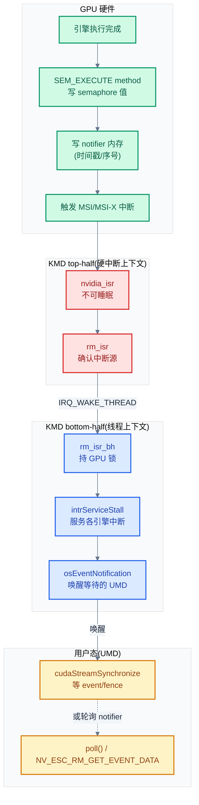

# 06 - 中断、同步与 fence

> 命令提交后,CPU 怎么知道 GPU 执行完了?本章讲清 NVIDIA KMD 的中断体系(MSI/MSI-X + threaded IRQ)、同步原语(fence/semaphore/Semaphore Surface)、Stream/Event 机制,以及 Xid/RC 错误处理——闭合命令提交回路。
>
> **工程师视角**:理解中断与同步后,你能读懂 `dmesg` 里的 Xid 错误(43/48/79 等),能判断 `cudaStreamSynchronize` 卡住是 GPU 真没跑完还是 fence 通知丢了,能定位"GPU 占用 100% 但推理不动"的中断风暴问题。

### 关键术语

| 缩写 | 全称 | 含义 |
|------|------|------|
| MSI | Message Signaled Interrupt | 消息信号中断,通过内存写而非物理中断线传递 |
| MSI-X | MSI Extended | MSI 扩展,支持多向量(每引擎一个) |
| ISR | Interrupt Service Routine | 中断服务例程,分 top-half(硬中断)与 bottom-half(线程) |
| threaded IRQ | — | Linux 中断机制,top-half 在硬中断上下文,bottom-half 在内核线程 |
| DPC | Deferred Procedure Call | 延迟过程调用,把可延迟的工作排队到稍后处理 |
| fence | — | 栅栏,GPU 完成命令后释放的同步信号 |
| semaphore | — | 信号量,GPU/CPU 互相通知的值,SEM_EXECUTE method 释放 |
| Semaphore Surface | — | 批量同步原语,一块内存装多个 semaphore,减少分配开销 |
| notifier | — | 通知内存,GPU 完成命令后写入的缓冲,含时间戳/序号 |
| event | — | RM 事件对象,UMD 可等待的完成通知 |
| Stream | — | CUDA 流,命令序列化的抽象,对应一个或多个 channel |
| Xid | — | NVIDIA GPU 错误事件标识,dmesg 里 "NVRM: Xid:NN" |
| RC | Robust Channels | 容错通道机制,channel 出错后隔离恢复 |
| WFI | Wait For Idle | 等待空闲的 method |
| MMU | Memory Management Unit | 内存管理单元,GPU 的页表遍历器 |
| UVM | Unified Virtual Memory | 统一虚拟内存,有独立的中断路径(见 08) |

---

## 1. 概述

### 1.1 前置知识

| 需要了解 | 参考文档 |
|----------|----------|
| 命令提交模型(channel/GPFIFO/doorbell) | [05-命令提交channel与GPFIFO](./05-命令提交channel与GPFIFO.md) |
| ioctl 边界、RM client/handle | [04-字符设备与ioctl接口](./04-字符设备与ioctl接口.md) |
| 推理全链路 5 个 checkpoint,本文对应 checkpoint E | [03-推理全链路总览](./03-推理全链路总览.md) |
| Linux 中断框架(request_threaded_irq / threaded IRQ) | 内核文档 Documentation/core-api/genericirq.rst |
| CUDA Stream 同步语义 | [../cuda/05-CUDA编程模型与执行模型](../cuda/05-CUDA编程模型与执行模型.md) |

### 1.2 系统上下文

> 上一章(05)讲了命令提交——UMD 把命令推进 GPFIFO、敲 doorbell,GPU 的 PBDMA 取走执行。但故事没完:CPU 怎么知道 GPU 执行完了?一个自然的问题是:**GPU 完成命令后如何通知 CPU?这个通知链路在 KMD 里怎么落地?** 本章回答这个问题——先讲中断硬件基础(MSI/MSI-X),再拆 top-half/bottom-half 的分工,接着讲 fence/semaphore 同步原语,然后是 Stream/Event 机制,最后是 Xid/RC 错误处理。这闭合了"提交→执行→完成通知"的回路。

**项目定位(回顾)**:本章研究的是 **GPU→CPU 的完成通知链路**。在 NVIDIA 的架构里,完成通知是**双机制**——GPU 完成命令后,先往 notifier 内存写一个完成标志(含时间戳/序号),然后触发中断;CPU 侧既可轮询 notifier(忙等或 `poll` 系统调用),也可等中断回调。这种"内存标志 + 中断"的双机制让用户态可以选择延迟模式:高频小 kernel 适合轮询(中断开销大于等待),低频大 kernel 适合等中断(省 CPU)。

**软硬件耦合点**:本章聚焦三个耦合点:① **中断向量与引擎的映射**——MSI-X 每个向量对应一组引擎,中断来了 KMD 要快速定位是哪个引擎;② **notifier 内存的可见性**——GPU 写 notifier 走 PCIe 写,CPU 读要保证缓存一致性(MMI/O vs 普通内存);③ **fence 值的序号语义**——notifier 里的序号是单调递增的,CPU 比较序号判断完成进度,序号回绕是边界情况。

**跨实现对比**:与 AMD amdgpu 的 fence 机制对比——amdgpu 用 `dma_fence` 标准 Linux 机制(`dma_fence_init`/`dma_fence_signal`),集成到 `drm_sched` 调度器;NVIDIA 用自研的 Semaphore Surface + notifier,不走 `dma_fence`,因为命令提交也不走 `drm_sched`。这反映了"NVIDIA 全栈自研"的延续。详见 §9。



> **如何读这张图**:完成通知从右下到右上——GPU 引擎执行完,经 SEM_EXECUTE 写 semaphore,写 notifier,触发 MSI 中断。KMD 的 top-half(`nvidia_isr`)在硬中断上下文快速确认,返回 `IRQ_WAKE_THREAD` 唤醒 bottom-half;bottom-half(`rm_isr_bh`)在内核线程上下文持 GPU 锁,调 `intrServiceStall` 服务各引擎中断,最后 `osEventNotification` 唤醒等待的 UMD。UMD 也可不等中断,直接轮询 notifier 内存(右下虚线)。

> **核心要点**:NVIDIA 的完成通知是**双机制**——notifier 内存(轮询)+ MSI 中断(回调)。中断走 threaded IRQ:top-half 在硬中断上下文快速确认中断源,bottom-half 在内核线程持 GPU 锁做完整处理。fence/semaphore 是 GPU→CPU 的值传递机制,封装在 Semaphore Surface 里批量管理。Xid 错误经同一中断链路上报,RC 机制做 channel 级容错恢复。

---

## 2. 中断注册:MSI/MSI-X 与 threaded IRQ

### 2.1 MSI vs MSI-X:中断向量数

GPU 有多个引擎(GPC 计算、CE 拷贝、NVLink、显示、GSP...),每个引擎都可能产生中断。传统 INTx 只有一个中断线,所有引擎共享,KMD 要读寄存器判断是谁;MSI 提供 1/2/4/8/16/32 个向量;MSI-X 提供**每个引擎独立向量**,中断来了直接知道是谁,无需读寄存器。

NVIDIA 驱动优先用 MSI-X(每向量一个 ISR),退化到 MSI(单向量共享),再退化到 INTx。注册逻辑在 `nv_start_device`(`nv.c:1368`):

```c
/* 摘自 [kernel-open/nvidia/nv.c](./src/open-gpu-kernel-modules/kernel-open/nvidia/nv.c) 第 1455-1472 行(简化) */
    if (nv->flags & NV_FLAG_SOC_DISPLAY)
    {
        rc = nv_soc_register_irqs(nv);
    }
    else if (!(nv->flags & NV_FLAG_USES_MSIX))
    {
        /* 非 MSI-X:单向量 MSI 或 INTx,top-half + threaded bottom-half */
        rc = request_threaded_irq(nv->interrupt_line, nvidia_isr,
                              nvidia_isr_kthread_bh, nv_default_irq_flags(nv),
                              nv_device_name, (void *)nvl);
    }
    else
    {
        /* MSI-X:每向量独立注册 */
        rc = nv_request_msix_irq(nvl);
    }
```

非 MSI-X 路径用 `request_threaded_irq` 注册一个共享中断——`nvidia_isr` 是 top-half,`nvidia_isr_kthread_bh` 是 bottom-half。MSI-X 路径调 `nv_request_msix_irq`(在 `nv-msi.c`),为每个向量单独注册:

```c
/* 摘自 [kernel-open/nvidia/nv-msi.c](./src/open-gpu-kernel-modules/kernel-open/nvidia/nv-msi.c) 第 152-153 行 */
        rc = request_threaded_irq(msix_entries->vector, nvidia_isr_msix,
                                  nvidia_isr_msix_kthread_bh, nv_default_irq_flags(nv),
```

每个 MSI-X 向量绑定 `nvidia_isr_msix`/`nvidia_isr_msix_kthread_bh`。注意 `nvidia_isr_msix` 内部仍调 `nvidia_isr`(加自旋锁串行化),因为多个向量可能同时触发但 RM 核心不并发安全——这是个"big hammer"串行化,见 §3。

### 2.2 threaded IRQ:top-half + bottom-half

`request_threaded_irq` 是 Linux 的**线程化中断**机制,把中断处理分两半:

| 半 | 运行上下文 | 可否睡眠 | 职责 |
|----|----------|:--------:|------|
| **top-half**(`nvidia_isr`) | 硬中断上下文 | 否 | 快速确认中断、关中断源、决定是否唤醒 bottom-half |
| **bottom-half**(`nvidia_isr_kthread_bh`) | 内核线程 | 是 | 完整处理:持 GPU 锁、服务各引擎、唤醒等待者 |

> **为什么要分两半?** 因为硬中断上下文不能睡眠(不能持mutex、不能分配内存),但 GPU 中断处理需要持 GPU 锁(可能与其他 RM 路径竞争,需要调度等待)。top-half 只做"确认中断源 + 关中断"(寄存器操作,不睡眠),把耗时且需要锁的工作推迟到 bottom-half 线程。这样硬中断被快速确认(避免中断风暴),重活在线程里慢慢做。

top-half 通过返回 `IRQ_WAKE_THREAD` 通知内核唤醒 bottom-half:

```c
/* 摘自 [kernel-open/nvidia/nv.c](./src/open-gpu-kernel-modules/kernel-open/nvidia/nv.c) 第 2969-2984 行(简化) */
    if (need_to_run_bottom_half_gpu_lock_held)
    {
        return IRQ_WAKE_THREAD;          /* 唤醒 threaded bottom-half */
    }
    else
    {
        /* 若只需 fault 处理但不需要持 GPU 锁,走 kthread 队列 */
        if (rm_fault_handling_needed)
            nv_kthread_q_schedule_q_item(&nvl->bottom_half_q, &nvl->bottom_half_q_item);
    }

    return IRQ_RETVAL(rm_handled || uvm_handled || rm_fault_handling_needed);
```

这里有两条 bottom-half 路径:① **threaded IRQ bottom-half**——`rm_isr` 返回需要持 GPU 锁时,返回 `IRQ_WAKE_THREAD`,内核调度 `nvidia_isr_kthread_bh`;② **kthread 队列 bottom-half**——只需 fault 处理(不需 GPU 锁)时,用 `nv_kthread_q_schedule_q_item` 调度 `nvidia_isr_bh_unlocked`。两条路径对应不同锁需求,避免不必要的锁竞争。

---

## 3. 中断 top-half:nvidia_isr

### 3.1 三路中断处理

`nvidia_isr` 是所有中断的入口,依次处理三路:

```c
/* 摘自 [kernel-open/nvidia/nv.c](./src/open-gpu-kernel-modules/kernel-open/nvidia/nv.c) 第 2872-2909 行(简化) */
irqreturn_t nvidia_isr(int irq, void *arg)
{
    nv_linux_state_t *nvl = (void *) arg;
    nv_state_t *nv = NV_STATE_PTR(nvl);
    NvU32 need_to_run_bottom_half_gpu_lock_held = 0;
    NvBool rm_handled = NV_FALSE, uvm_handled = NV_FALSE, rm_fault_handling_needed = NV_FALSE;

    /* 1. MMU fault 快速处理(可服务 fault 先取走) */
    rm_gpu_handle_mmu_faults(nvl->sp[NV_DEV_STACK_ISR], nv, &rm_serviceable_fault_cnt);
    rm_fault_handling_needed = (rm_serviceable_fault_cnt != 0);

    /* 2. UVM 中断(UVM 有独立的中断处理路径,见 08) */
    if (nv_uvm_event_interrupt(nv_get_cached_uuid(nv)) == NV_OK)
        uvm_handled = NV_TRUE;

    /* 3. RM 核心中断 */
    rm_handled = rm_isr(nvl->sp[NV_DEV_STACK_ISR], nv,
                        &need_to_run_bottom_half_gpu_lock_held);

    /* ... 中断计数与未处理阈值追踪 ... */

    if (need_to_run_bottom_half_gpu_lock_held)
        return IRQ_WAKE_THREAD;
    /* ... */
}
```

三路处理的职责:

| 路 | 函数 | 处理内容 | 为什么单独 |
|----|------|----------|-----------|
| MMU fault | `rm_gpu_handle_mmu_faults` | GPU MMU 页错误(fault),快速取走可服务 fault | fault 高频,需在 top-half 快速清空避免中断风暴 |
| UVM | `nv_uvm_event_interrupt` | UVM 的 fault/access 通知(见 08) | UVM 是独立模块,有自己的中断逻辑 |
| RM 核心 | `rm_isr` | 引擎完成、Xid 错误、fence 释放等 | RM 核心的通用中断服务 |

> **为什么 MMU fault 在 top-half 快速处理?** 因为 GPU MMU fault 可能高频发生(如 UVM 按需分页时,每次缺页都触发 fault 中断)。如果在 bottom-half 慢慢处理,fault 队列会溢出。top-half 先把可服务 fault 取走(放进内部队列),bottom-half 再慢慢处理页迁移。这是"快取走 + 慢处理"的典型中断设计。

### 3.2 rm_isr:RM 核心中断确认

`rm_isr` 是 RM 核心的中断确认函数(`NV_API_CALL` 导出),在 top-half 调用。它读中断状态寄存器,确认有无可服务中断,设置 `need_to_run_bottom_half_gpu_lock_held` 标志。具体的服务(调各引擎的 ISR 回调)推迟到 bottom-half 的 `intrServiceStall`。

这种"top-half 只确认、bottom-half 才服务"的分工,是为了把耗时的引擎 ISR 回调(可能需要遍历 channel 列表、更新 notifier)移出硬中断上下文。

### 3.3 未处理中断追踪

`nvidia_isr` 还做**未处理中断计数**——如果连续多次中断都 `rm_handled == NV_FALSE`(没找到可服务的中断),会打印告警:

```c
/* 摘自 [kernel-open/nvidia/nv.c](./src/open-gpu-kernel-modules/kernel-open/nvidia/nv.c) 第 2954-2962 行 */
                if (nvl->irq_count[index].total >= RM_THRESHOLD_TOTAL_IRQ_COUNT)
                {
                    if (nvl->irq_count[index].unhandled > RM_THRESHOLD_UNAHNDLED_IRQ_COUNT)
                        nv_printf(NV_DBG_ERRORS,"NVRM: Going over RM unhandled interrupt threshold for irq %d\n", irq);

                    nvl->irq_count[index].total = 0;
                    nvl->irq_count[index].unhandled = 0;
                }
```

这条 "NVRM: Going over RM unhandled interrupt threshold" 日志是中断风暴的诊断信号——意味着中断频繁触发但 KMD 找不到对应的中断源(可能是硬件误触发或中断 mask 没关好),常见于 PCIe 链路问题或 GPU 掉卡。

> **核心要点**:top-half `nvidia_isr` 依次处理三路中断——MMU fault(快取走)、UVM(独立路径)、RM 核心(确认 + 延迟服务)。返回 `IRQ_WAKE_THREAD` 唤醒 bottom-half 做完整处理。MMU fault 在 top-half 快速清空是为了避免 fault 队列溢出。未处理中断计数是中断风暴的诊断手段。

---

## 4. 中断 bottom-half:完整服务

### 4.1 两条 bottom-half 路径

bottom-half 有两条路径,对应不同锁需求:

| 路径 | 函数 | 持锁 | 触发条件 |
|------|------|------|----------|
| **threaded IRQ BH** | `nvidia_isr_kthread_bh` → `rm_isr_bh` | GPU 锁 | `rm_isr` 返回需要持锁 |
| **kthread BH** | `nvidia_isr_bh_unlocked` → `rm_isr_bh_unlocked` | 无 GPU 锁 | 只需 fault 处理 |

```c
/* 摘自 [kernel-open/nvidia/nv.c](./src/open-gpu-kernel-modules/kernel-open/nvidia/nv.c) 第 3023-3081 行(简化) */
static irqreturn_t nvidia_isr_common_bh(void *data)
{
    nv_state_t *nv = (nv_state_t *) data;
    nvidia_stack_t *sp = nvl->sp[NV_DEV_STACK_ISR_BH];

    status = nv_check_gpu_state(nv);
    if (status == NV_ERR_GPU_IS_LOST)
        nv_printf(NV_DBG_INFO, "NVRM: GPU is lost, skipping ISR bottom half\n");
    else
        rm_isr_bh(sp, nv);              /* 持 GPU 锁的完整服务 */

    return IRQ_HANDLED;
}

static void nvidia_isr_bh_unlocked(void *args)
{
    nv_state_t *nv = (nv_state_t *) args;
    nvidia_stack_t *sp = nvl->sp[NV_DEV_STACK_ISR_BH_UNLOCKED];

    /* 同步多个 kthread(共享 altstack) */
    status = os_acquire_mutex(nvl->isr_bh_unlocked_mutex);
    /* ... */
    rm_isr_bh_unlocked(sp, nv);         /* 无 GPU 锁的快路径 */
    os_release_mutex(nvl->isr_bh_unlocked_mutex);
}
```

`rm_isr_bh` 持 GPU 锁做完整服务——调 `intrServiceStall` 遍历各引擎、调引擎 ISR 回调、唤醒等待者。`rm_isr_bh_unlocked` 不持 GPU 锁,只处理不需要锁的快路径(如部分 fault 后处理)。分开是为了让快路径不被 GPU 锁阻塞——如果某次中断只需 fault 处理,不必等正在持 GPU 锁的 RM 路径释放。

### 4.2 RC 定时器:看门狗

除了中断驱动的 bottom-half,还有**周期性 RC 定时器**:

```c
/* 摘自 [kernel-open/nvidia/nv.c](./src/open-gpu-kernel-modules/kernel-open/nvidia/nv.c) 第 3083-3103 行(简化) */
static void nvidia_rc_timer_callback(struct nv_timer *nv_timer)
{
    nv_linux_state_t *nvl = container_of(nv_timer, nv_linux_state_t, rc_timer);
    nvidia_stack_t *sp = nvl->sp[NV_DEV_STACK_TIMER];

    status = nv_check_gpu_state(nv);
    if (status == NV_ERR_GPU_IS_LOST)
        return;

    if (rm_run_rc_callback(sp, nv) == NV_OK)
    {
        /* set another timeout 1 sec in the future: */
    }
}
```

RC 定时器每秒触发一次 `rm_run_rc_callback`,做**看门狗**检查——检测 channel 是否卡死(长时间无进度)、GPU 是否掉卡、是否需要强制恢复。这是中断之外的补充机制:中断是"事件驱动"(GPU 主动通知),定时器是"轮询驱动"(KMD 主动检查),两者结合保证即使中断丢失也能发现异常。

---

## 5. RM 核心中断分发:intrServiceStall

### 5.1 引擎位向量

`intrServiceStall` 是 RM 核心的中断服务主函数,用**位向量**(`MC_ENGINE_BITVECTOR`)表示哪些引擎有 pending 中断:

```c
/* 摘自 [src/nvidia/src/kernel/gpu/intr/intr.c](./src/open-gpu-kernel-modules/src/nvidia/src/kernel/gpu/intr/intr.c) 第 115-186 行(简化) */
void intrServiceStall_IMPL(OBJGPU *pGpu, Intr *pIntr)
{
    MC_ENGINE_BITVECTOR pendingEngines;

    /* 检查 GPU 是否在总线(防止 surprise remove 误读寄存器) */
    if (!RMCFG_FEATURE_PLATFORM_GSP)
    {
        NvU32 regReadValue = GPU_REG_RD32(pGpu, NV_PMC_BOOT_0);
        if (regReadValue == GPU_REG_VALUE_INVALID)
            NV_PRINTF(LEVEL_ERROR, "GPU off the bus?\n");
    }

    _stuckIntrNewGeneration();

    if (pIntr->getProperty(pIntr, PDB_PROP_INTR_DISABLE_PER_INTR_DPC_QUEUEING))
    {
        /* 直接服务模式:循环直到无 pending */
        do {
            intrGetPendingStall_HAL(pGpu, pIntr, &pendingEngines, NULL);
            bPending = _intrServiceStallExactList(pGpu, pIntr, &pendingEngines);
        } while (bPending);
    }
    else if (!pIntr->bDpcStarted)
    {
        /* DPC 队列模式:取 pending 引擎,排队 DPC */
        intrGetPendingStall_HAL(pGpu, pIntr, &pendingEngines, NULL);
        if (!bitVectorTestAllCleared(&pendingEngines))
        {
            nextEngine = bitVectorCountTrailingZeros(&pendingEngines);
            intrQueueInterruptBasedDpc(pGpu, pIntr, nextEngine);
            bitVectorClr(&pIntr->pmcIntrPending, nextEngine);
            pIntr->bDpcStarted = NV_TRUE;
            intrProcessDPCQueue_HAL(pGpu, pIntr);
        }
    }
    else
    {
        intrProcessDPCQueue_HAL(pGpu, pIntr);
    }
}
```

两种服务模式:① **直接服务**(`PDB_PROP_INTR_DISABLE_PER_INTR_DPC_QUEUEING` 属性)——循环取 pending 引擎并立即服务,直到无 pending,适合低延迟场景;② **DPC 队列**——把 pending 引擎排队,逐个处理 DPC,适合需要排序的场景。两种模式都从 `intrGetPendingStall_HAL` 取 pending 引擎位向量——这个 HAL 函数读 GPU 的中断状态寄存器,返回哪些引擎有中断。

`MC_ENGINE_BITVECTOR` 是一个位图,每个位对应一个引擎(`MC_ENGINE_IDX_GR` 图形、`MC_ENGINE_IDX_CE` 拷贝、`MC_ENGINE_IDX_GSP`、`MC_ENGINE_IDX_GMMU` MMU...)。`bitVectorCountTrailingZeros` 找第一个 pending 的引擎,`_intrServiceStallExactList` 逐个服务。

### 5.2 引擎 ISR 回调

每个引擎在中断注册表(`intrServiceTable`)里注册了自己的 ISR 回调。`intrServiceStall` 遍历 pending 引擎,调对应回调:

- **GR(图形/计算)**:检查 channel 完成、更新 notifier、唤醒等待的 event
- **CE(拷贝引擎)**:同上,拷贝完成通知
- **GMMU(MMU)**:处理页错误 fault(已部分在 top-half 处理)
- **GSP**:GSP 固件的消息通知(RPC 响应到达)
- **NVLink**:链路状态变化、错误

引擎 ISR 回调最终会调 `osEventNotification`——这是把"GPU 完成"事件传递给 UMD 的关键函数,它唤醒等待 event 的用户态进程(通过 `poll` 或 `NV_ESC_RM_GET_EVENT_DATA`)。

> **核心要点**:`intrServiceStall` 是 RM 核心的中断服务主函数——读中断状态寄存器得到 pending 引擎位向量,逐个调引擎 ISR 回调,最终 `osEventNotification` 唤醒等待的 UMD。两种服务模式(直接 vs DPC 队列)适应不同延迟需求。引擎位向量是"一次中断可能有多个引擎 pending"的紧凑表示。

---

## 6. 同步原语:fence 与 semaphore

### 6.1 GPU→CPU 通知的本质:notifier + 中断

先建立直觉:GPU 完成命令后怎么告诉 CPU?两步——① **写 notifier 内存**:GPU 在命令流的末尾插一条 `SEM_EXECUTE` method,执行时往一块约定好的内存(notifier)写一个值(序号/时间戳);② **触发中断**:写完 notifier 后,GPU 硬件触发 MSI 中断,通知 KMD "有完成事件"。

CPU 侧有两种感知方式:
- **轮询**:UMD 直接读 notifier 内存(已 mmap),比较序号是否到达预期。不陷入内核,但耗 CPU。
- **等中断**:UMD 通过 event 机制(`NV_ESC_RM_GET_EVENT_DATA` 或 `poll`)阻塞等待,中断来了 KMD 唤醒它。不耗 CPU,但有中断延迟。

推理场景的选择:小 kernel(<10μs)用轮询(中断开销 > 等待);大 kernel(>100μs)等中断(省 CPU)。CUDA 的 `cudaStreamSynchronize` 默认混合策略——先轮询一段时间,超时再等中断。

### 6.2 Semaphore Surface:批量同步原语

**Semaphore Surface** 是 NVIDIA 的批量同步原语——一块内存装多个 semaphore,减少为每个同步点单独分配的开销。它的核心数据结构是 `SEM_SHARED_DATA`:

```c
/* 摘自 [src/nvidia/src/kernel/gpu/mem_mgr/sem_surf.c](./src/open-gpu-kernel-modules/src/nvidia/src/kernel/gpu/mem_mgr/sem_surf.c) 第 58-80 行(简化) */
static NvU64 _semsurfGetValue(SEM_SHARED_DATA *pShared, NvU64 index)
{
    volatile NvU8 *pSem          = pShared->pSem;           /* semaphore 值数组基址 */
    volatile NvU8 *pMaxSubmitted = pShared->pMaxSubmitted;  /* 最大已提交值数组 */
    volatile NvU8 *pSemBase      = pSem + index * pShared->layout.size;  /* 第 index 个 semaphore */

    portAtomicMemoryFenceFull();   /* 内存屏障,保证读到 GPU 最新写入 */

    if (pShared->bIs64Bit)
    {
        volatile NvU64 *pSemVal = (volatile NvU64 *)pSemBase;
        return *pSemVal;            /* 64 位 semaphore 值 */
    }
    else
    {
        const volatile NvU32 *pSemVal = (volatile NvU32 *)pSemBase;
        return *pSemVal;            /* 32 位 semaphore 值 */
    }
}
```

Semaphore Surface 的内存布局:

```
Semaphore Surface 内存布局:
+-----------+-----------+-----------+-----------+
| Sem[0]    | Sem[1]    | Sem[2]    | ...       |  ← pSem,每个 layout.size 字节
+-----------+-----------+-----------+-----------+
| MaxSub[0] | MaxSub[1] | MaxSub[2] | ...       |  ← pMaxSubmitted,追踪最大已提交值
+-----------+-----------+-----------+-----------+

每个 Sem[i] 是一个独立的 semaphore:
  - GPU 通过 SEM_EXECUTE method 写入递增值(序号)
  - CPU 轮询或等中断,比较值是否到达预期
  - bIs64Bit 决定每个 semaphore 是 4 字节还是 8 字节
```

> **为什么用 Surface 而非单个 semaphore?** 因为推理场景有大量同步点(每个 kernel launch 后一个 fence)。如果每个 fence 单独分配一个 RM 对象(alloc/free),ioctl 开销巨大。Semaphore Surface 一次分配一大块内存装成千上万个 semaphore,UMD 按索引使用,零分配开销——只是数组下标运算。这是"批量预分配 + 索引访问"的经典优化。

### 6.3 SEM_EXECUTE method:GPU 释放信号量

GPU 侧释放 semaphore 是通过 `SEM_EXECUTE` method(在 pushbuffer 命令流里)。以 Volta `clc36f.h` 为例(`clc36f.h` 对应 `VOLTA_CHANNEL_GPFIFO_A = 0xC36F`,Turing 对应 `clc46f.h` = 0xC46F,字段定义一致):

```c
/* 摘自 [src/common/sdk/nvidia/inc/class/clc36f.h](./src/open-gpu-kernel-modules/src/common/sdk/nvidia/inc/class/clc36f.h) 第 209-241 行(节选) */
#define NVC36F_SEM_EXECUTE                                         (0x0000006c)
#define NVC36F_SEM_EXECUTE_OPERATION                                       2:0
#define NVC36F_SEM_EXECUTE_OPERATION_ACQUIRE                        0x00000000
#define NVC36F_SEM_EXECUTE_OPERATION_RELEASE                        0x00000001
#define NVC36F_SEM_EXECUTE_OPERATION_ACQ_STRICT_GEQ                 0x00000002  /* >= */
#define NVC36F_SEM_EXECUTE_OPERATION_ACQ_CIRC_GEQ                   0x00000003  /* 循环 >= */
#define NVC36F_SEM_EXECUTE_OPERATION_ACQ_AND                        0x00000004
#define NVC36F_SEM_EXECUTE_OPERATION_ACQ_NOR                        0x00000005
#define NVC36F_SEM_EXECUTE_OPERATION_REDUCTION                      0x00000006
#define NVC36F_SEM_EXECUTE_ACQUIRE_SWITCH_TSG                            12:12
#define NVC36F_SEM_EXECUTE_RELEASE_WFI                                   20:20
#define NVC36F_SEM_EXECUTE_PAYLOAD_SIZE                                  24:24
#define NVC36F_SEM_EXECUTE_PAYLOAD_SIZE_32BIT                       0x00000000
#define NVC36F_SEM_EXECUTE_PAYLOAD_SIZE_64BIT                       0x00000001
#define NVC36F_SEM_EXECUTE_RELEASE_TIMESTAMP                             25:25
#define NVC36F_SEM_EXECUTE_REDUCTION                                     30:27
#define NVC36F_SEM_EXECUTE_REDUCTION_FORMAT                              31:31
#define NVC36F_SEM_EXECUTE_REDUCTION_FORMAT_UNSIGNED                0x00000001
```

`SEM_EXECUTE` 的 `OPERATION` 字段(3 位,支持 8 种操作)主要有两类:`RELEASE`(GPU 写 semaphore,通知 CPU)和 `ACQUIRE`(GPU 等 semaphore,等 CPU 或其他 GPU 通知)。推理场景常用 `RELEASE`——kernel 执行完后,`SEM_EXECUTE` 往 notifier 写完成序号,触发中断。`ACQUIRE` 用于 stream 间依赖——stream B 等 stream A 的结果时,B 的命令流开头插 `SEM_EXECUTE.ACQUIRE`,GPU 硬件阻塞直到 A 释放对应 semaphore。`ACQ_STRICT_GEQ`/`ACQ_CIRC_GEQ` 是"≥"语义的获取(用于环形缓冲序号比较),`PAYLOAD_SIZE` 选择 32/64 位 payload(与 Semaphore Surface 的 `bIs64Bit` 对应)。

`portAtomicMemoryFenceFull()` 在 `_semsurfGetValue` 里很关键——它保证 CPU 读到 GPU 的最新写入。GPU 写 semaphore 走 PCIe 内存写,CPU 缓存可能有过期副本;内存屏障强制 CPU 重新从总线读,确保可见性。这是"CPU↔GPU 内存一致性"的关键细节。

---

## 7. Stream/Event 机制

### 7.1 event 分配与绑定

Event 是 RM 对象(class `NV01_EVENT`),UMD 通过 `NV_ESC_RM_ALLOC` 创建,绑定到某个 channel。event 有两种触发方式:

- **OS event**:`NV_ESC_ALLOC_OS_EVENT` 注册一个 Linux `eventfd` 或文件描述符,GPU 完成时 KMD 通过 `osEventNotification` 唤醒它。适合 `poll()` 等待。
- **内核回调**:`NV01_EVENT_KERNEL_CALLBACK`,KMD 内部使用(如 KMD 自己的 CE channel 完成),不暴露给 UMD。

UMD 的典型用法:为一个 stream 创建一个 event,绑定到对应 channel。每次提交命令时,pushbuffer 末尾插 `SEM_EXECUTE.RELEASE` 写 event 对应的 semaphore;GPU 完成后触发中断,KMD 的引擎 ISR 回调调 `osEventNotification` 唤醒等待的 UMD。

### 7.2 NV_ESC_RM_GET_EVENT_DATA:读取事件

UMD 等待 event 有两种方式:

- **阻塞等**:`NV_ESC_RM_GET_EVENT_DATA`——这个 ioctl 阻塞直到有 event 触发,返回已触发的事件列表。在 OSAL 层处理(不走 RM 核心,见 04 §4.4),高频小操作快路径。
- **poll 等**:`poll(/dev/nvidia*, ...)`——`nvidia_poll` 注册等待队列,`osEventNotification` 唤醒时 `poll` 返回,UMD 再调 `NV_ESC_RM_GET_EVENT_DATA` 读取详情。

### 7.3 cudaStreamSynchronize 的落地

`cudaStreamSynchronize` 的完整落地:

1. UMD 提交命令时,pushbuffer 末尾插 `SEM_EXECUTE.RELEASE` 写 stream 对应的 notifier(序号 = N)
2. UMD 调 `cudaStreamSynchronize` → 内部走 `NV_ESC_RM_IDLE_CHANNELS` 或等 event
3. KMD 检查 notifier 序号是否到达 N:
   - 已到达:直接返回(命令已完成)
   - 未到达:阻塞等中断(GPU 完成后 `SEM_EXECUTE` 触发中断 → KMD 唤醒 UMD)
4. 或 UMD 直接轮询 notifier(读 mmap 的内存,比较序号)

`NV_ESC_RM_IDLE_CHANNELS`(0x41)是"等 channel 空闲"的 ioctl——它检查 channel 的所有命令是否执行完(比较 GP_Get 是否追上 GP_Put + notifier 序号),未完成则阻塞。

> **核心要点**:完成通知是**双机制**——notifier 内存(轮询)+ 中断(回调)。Semaphore Surface 批量管理同步原语,避免每个 fence 单独分配。GPU 通过 `SEM_EXECUTE.RELEASE` method 写 semaphore + 触发中断;CPU 轮询或等中断。`cudaStreamSynchronize` 混合策略——先轮询,超时等中断。

---

## 8. Xid 错误与 RC 容错

### 8.1 Xid 编号与含义

Xid 是 NVIDIA GPU 错误事件的标识,出现在 `dmesg` 里。常见 Xid(编号定义在 `src/common/sdk/nvidia/inc/nverror.h`):

| Xid | 宏定义 | 含义 | 典型原因 | 严重度 |
|:---:|------|------|----------|:------:|
| 13 | `ROBUST_CHANNEL_GR_EXCEPTION` | GR 异常 | Graphics engine 异常(图形/计算引擎) | 高 |
| 31 | `ROBUST_CHANNEL_FIFO_ERROR_MMU_ERR_FLT` | FIFO MMU 错误过滤 | FIFO 路径上的 MMU fault | 中 |
| 32 | `ROBUST_CHANNEL_PBDMA_ERROR` | PBDMA 错误 | Pushbuffer DMA 硬件错误(命令取指) | 高 |
| 43 | `ROBUST_CHANNEL_RESETCHANNEL_VERIF_ERROR` | channel 重置验证错误 | channel 状态校验失败,需重置 | 高 |
| 45 | `ROBUST_CHANNEL_PREEMPTIVE_REMOVAL` | 抢占式移除 | GPU 被强制移除(如驱动重载、热拔) | 致命 |
| 48 | `ROBUST_CHANNEL_GPU_ECC_DBE` | double-bit ECC | HBM ECC 不可纠正(双位错) | 高 |
| 61 | `PMU_BREAKPOINT` | PMU 断点 | PMU(电源管理微控制器)命中断点 | 高 |
| 62 | `PMU_HALT_ERROR` | PMU 停机 | PMU 执行 halt 指令(致命错误) | 高 |
| 63 | `INFOROM_PAGE_RETIREMENT_EVENT` | InfoROM 页退役事件 | ECC 错误导致坏页隔离记录 | 中 |
| 74 | `NVLINK_ERROR` | NVLink 错误 | NVLink 链路错误 | 中 |
| 79 | `ROBUST_CHANNEL_GPU_HAS_FALLEN_OFF_THE_BUS` | GPU 掉线 | surprise removal / 掉卡(PCIe 总线丢失) | 致命 |
| 94 | `ROBUST_CHANNEL_CONTAINED_ERROR` | 已包含错误 | 可恢复的硬件错误(如可纠正 ECC 的容器化报告) | 中 |
| 95 | `ROBUST_CHANNEL_UNCONTAINED_ERROR` | 未包含错误 | 不可恢复的硬件错误(可能数据损坏) | 致命 |
| 119 | `GSP_RPC_TIMEOUT` | GSP RPC 超时 | CPU↔GSP 固件通信超时(固件挂死) | 致命 |
| 120 | `GSP_ERROR` | GSP 错误 | GSP 固件内部错误 | 致命 |

> **如何读这张表**:Xid 编号定义在 `nverror.h`,前缀 `ROBUST_CHANNEL_` 表示该错误会被 RC(Robust Channels)机制捕获并尝试恢复(见 §8.3)。`PMU_*` 前缀是 PMU 微控制器错误(不是 GSP)。`INFOROM_*` 是 InfoROM(固件信息 ROM)记录事件。生产环境调试时,先看 Xid 编号定位错误源,再看 dmesg 的详细堆栈。

### 8.2 krcReportXid:错误上报

Xid 错误经中断链路上报——GPU 触发错误中断,KMD 的引擎 ISR 回调识别错误类型,调 `krcReportXid` 记录到 `dmesg`:

```c
/* 摘自 [src/nvidia/src/kernel/gpu/rc/kernel_rc.c](./src/open-gpu-kernel-modules/src/nvidia/src/kernel/gpu/rc/kernel_rc.c) 第 296-405 行(简化) */
void krcReportXid_IMPL(OBJGPU *pGpu, KernelRc *pKernelRc, XidContext context, const char *pMsg)
{
    if (GPU_GET_KERNEL_RC(pGpu)->bLogEvents)
    {
        KernelChannel *pKernelChannel = krcGetChannelInError(pKernelRc);

        /* 找出出错 channel 关联的进程 */
        if (pKernelChannel != NULL)
        {
            RsClient *pClient = RES_GET_CLIENT(pKernelChannel);
            RmClient *pRmClient = dynamicCast(pClient, RmClient);
            procName = pRmClient->name;
            nvDbgSnprintf(pidStr, sizeof(pidStr), "%u", pKernelChannel->ProcessID);
        }

        krcGetMigAttributionForError_HAL(pKernelRc, context.xid,
                                         &gpuPartitionId, &computeInstanceId);

        /* 打印格式:NVRM: Xid (PCI:domain:bus:device GPU-I:xx GPU-CI:xx): XidNum, pid=..., name=..., msg */
        XID_PRINT_WITH_ATTR("PCI:%04x:%02x:%02x GPU-I:%02u GPU-CI:%02u",
                            gpuGetDomain(pGpu), gpuGetBus(pGpu), gpuGetDevice(pGpu),
                            gpuPartitionId, computeInstanceId);
    }
}
```

Xid 日志格式:`NVRM: Xid (PCI:domain:bus:device GPU-I:xx GPU-CI:xx): XidNum, pid=xxx, name=xxx, msg`。关键字段:① **PCI 地址**——定位哪张卡;② **GPU-I/GPU-CI**——MIG 实例归属(MIG 模式下定位哪个切片);③ **pid/name**——出错 channel 关联的进程;④ **XidNum**——错误类型;⑤ **msg**——错误详情。

> **调试技巧**:看到 `dmesg` 里的 Xid,先看 XidNum 查上表定位错误类型,再看 PCI 地址定位哪张卡,再看 pid 定位哪个进程。Xid 43/63 通常是某个 channel 的 kernel 出问题(如越界访问);Xid 79/119 通常是硬件/驱动级别问题(掉卡、驱动重载);Xid 48 是 HBM ECC 不可纠正,硬件可能需要更换。

### 8.3 RC 容错:channel 级恢复

RC(Robust Channels)是容错机制——channel 出错后,不崩溃整个 GPU,而是隔离出错 channel 并尝试恢复。RC 通过 `NV_REG_STR_RM_ROBUST_CHANNELS` 注册表键控制:

```c
/* 摘自 [src/nvidia/src/kernel/gpu/rc/kernel_rc.c](./src/open-gpu-kernel-modules/src/nvidia/src/kernel/gpu/rc/kernel_rc.c) 第 72-83 行 */
    if (osReadRegistryDword(pGpu, NV_REG_STR_RM_ROBUST_CHANNELS, &dword) !=
        NV_OK)
    {
        dword = NV_REG_STR_RM_ROBUST_CHANNELS_ENABLE;   /* 默认启用 */
    }
```

RC 默认启用。出错时 RC 机制:① 标记出错 channel 为 faulted;② 通知该 channel 的所有者(UMD)通过 error notifier;③ 尝试重置该 channel 的引擎状态(不影响其他 channel);④ 如果不可恢复,杀死该 channel(其他 channel 继续)。这是"channel 级隔离"——一个进程的 bad kernel 不会拖垮整个 GPU。

RC 定时器(§4.2 的 `nvidia_rc_timer_callback`)每秒检查一次——是否有 channel 长时间无进度(卡死)、是否需要强制恢复。这是中断之外的看门狗,防止"中断丢失导致永远等不到完成"的死锁。

> **核心要点**:Xid 错误经中断链路上报,`krcReportXid` 记录到 dmesg(含 PCI 地址、MIG 实例、进程信息)。RC(Robust Channels)机制做 channel 级容错——出错 channel 隔离恢复,不影响其他 channel。RC 定时器每秒看门狗检查,防止中断丢失导致的死锁。调试时看 Xid 编号定位错误类型,看 PCI/pid 定位卡和进程。

---

## 9. 闭源边界与跨实现对比

### 9.1 闭源边界

| 层 | 开源情况 | 可见性 |
|----|----------|--------|
| 中断注册(MSI/MSI-X/threaded IRQ) | 开源 | `nv.c`/`nv-msi.c` 完整 |
| top-half(`nvidia_isr`)、bottom-half | 开源 | `nv.c` 完整 |
| RM 中断分发(`intrServiceStall`) | 开源 | `intr.c` 完整 |
| Semaphore Surface(CPU 侧读写) | 开源 | `sem_surf.c` 完整 |
| Xid 上报与 RC 容错 | 开源 | `kernel_rc.c` 完整 |
| GPU 硬件中断触发机制 | **闭源** | GPU 硬件,源码不存在 |
| SEM_EXECUTE 硬件执行细节 | **闭源** | GPU 硬件 |
| notifier 硬件写入时序 | **闭源** | GPU 硬件 |

### 9.2 与 amdgpu fence 机制对比

| 对比维度 | NVIDIA fence/sem_surf | AMD amdgpu dma_fence |
|----------|----------------------|---------------------|
| **同步原语** | Semaphore Surface(自研) | `dma_fence`(Linux 标准) |
| **通知机制** | notifier 内存 + MSI 中断 | `dma_fence_signal` + 回调 |
| **用户态等待** | `poll` / `NV_ESC_RM_GET_EVENT_DATA` | `sync_file` / `poll` |
| **集成调度器** | 不集成(命令提交不走调度器) | 集成 `drm_sched` |
| **跨驱动共享** | 不支持(私有原语) | 支持(`dma_fence` 是标准) |
| **错误处理** | Xid + RC(channel 级) | `drm_sched` job 错误回调 |

> **如何读这张表**:NVIDIA 的 fence 是自研私有原语(Semaphore Surface),不与 Linux 生态共享;amdgpu 用标准 `dma_fence`,可与其他驱动(如网卡、显示)交互。这反映了 NVIDIA"封闭全栈"vs AMD"拥抱标准"的延续。对推理场景,影响在于:NVIDIA 的 fence 优化(批量 Surface)更激进,但调试工具少(靠 Xid);amdgpu 的 fence 可用标准工具(`sync_debug`)。

---

## 10. 与推理链路的衔接

本章闭合了命令提交回路——checkpoint E(GPU 完成 → fence → CPU)。至此,推理链路的核心四篇已完整:

| 章节 | checkpoint | 内容 |
|------|-----------|------|
| 04 | B | UMD → ioctl → KMD |
| 05 | C | KMD → GPFIFO → doorbell → GPU |
| 06 | E | GPU 完成 → 中断 → fence → CPU |

下一篇 [07-内存管理:显存与虚拟地址空间](./07-内存管理显存与地址空间.md) 转向推理链路的另一支柱——显存分配与 VM 组织,这是 `cuMemAlloc` 的内核落地。

---

## 参考资料

- [NVIDIA Open GPU Kernel Modules README](https://github.com/NVIDIA/open-gpu-kernel-modules/blob/main/README.md) — 参考了开源模块说明
- [Linux Kernel: Using MSI/MSI-X](https://www.kernel.org/doc/html/latest/PCI/msi-howto.html) — 参考了 MSI/MSI-X 机制
- [Linux Kernel: Threaded Interrupt Handlers](https://www.kernel.org/doc/html/latest/core-api/genericirq.html) — 参考了 threaded IRQ 机制
- [CUDA Driver API: cudaStreamSynchronize](https://docs.nvidia.com/cuda/cuda-driver-api/group__CUDA__STREAM.html) — 参考了 stream 同步语义
- [NVIDIA GPU Xid Errors](https://docs.nvidia.com/deploy/xid-errors/index.html) — 参考了 Xid 编号含义
- [AMD amdgpu fence](https://www.kernel.org/doc/html/latest/gpu/amdgpu/driver-core.html) — 参考了 dma_fence 对照
- 本地源码:
  - [kernel-open/nvidia/nv.c](./src/open-gpu-kernel-modules/kernel-open/nvidia/nv.c) — `request_threaded_irq`(L1463)、`nvidia_isr`(L2872)、`nvidia_isr_common_bh`(L3023)、`nvidia_isr_bh_unlocked`(L3046)、RC 定时器(L3083)
  - [kernel-open/nvidia/nv-msi.c](./src/open-gpu-kernel-modules/kernel-open/nvidia/nv-msi.c) — MSI-X 注册(L152)
  - [src/nvidia/src/kernel/gpu/intr/intr.c](./src/open-gpu-kernel-modules/src/nvidia/src/kernel/gpu/intr/intr.c) — `intrServiceStall_IMPL`(L116)
  - [src/nvidia/src/kernel/gpu/mem_mgr/sem_surf.c](./src/open-gpu-kernel-modules/src/nvidia/src/kernel/gpu/mem_mgr/sem_surf.c) — `_semsurfGetValue`(L58)
  - [src/nvidia/src/kernel/gpu/rc/kernel_rc.c](./src/open-gpu-kernel-modules/src/nvidia/src/kernel/gpu/rc/kernel_rc.c) — `krcReportXid_IMPL`(L296)、RC 启用(L72)
  - [src/common/sdk/nvidia/inc/class/clc36f.h](./src/open-gpu-kernel-modules/src/common/sdk/nvidia/inc/class/clc36f.h) — `SEM_EXECUTE` method(L230)
