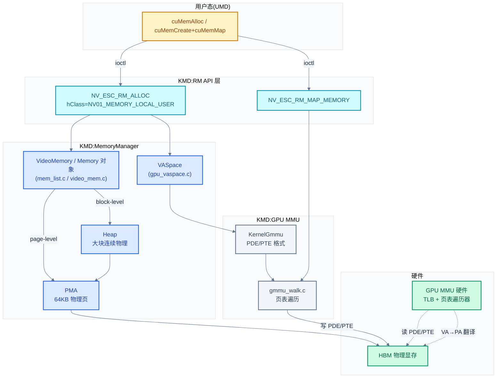
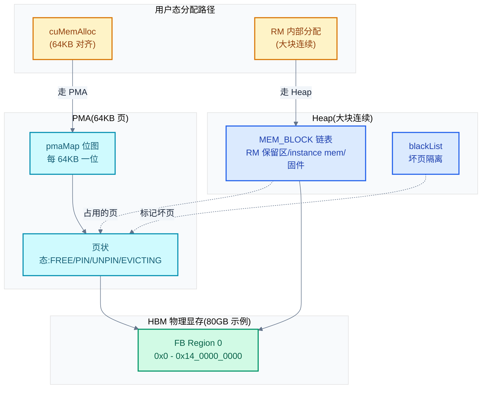
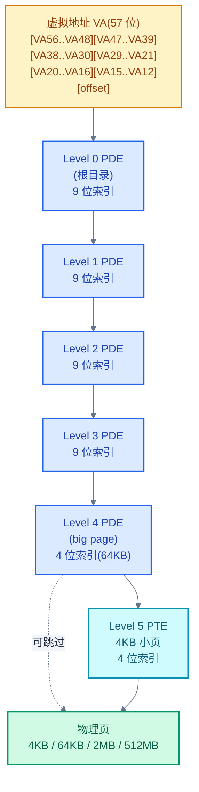
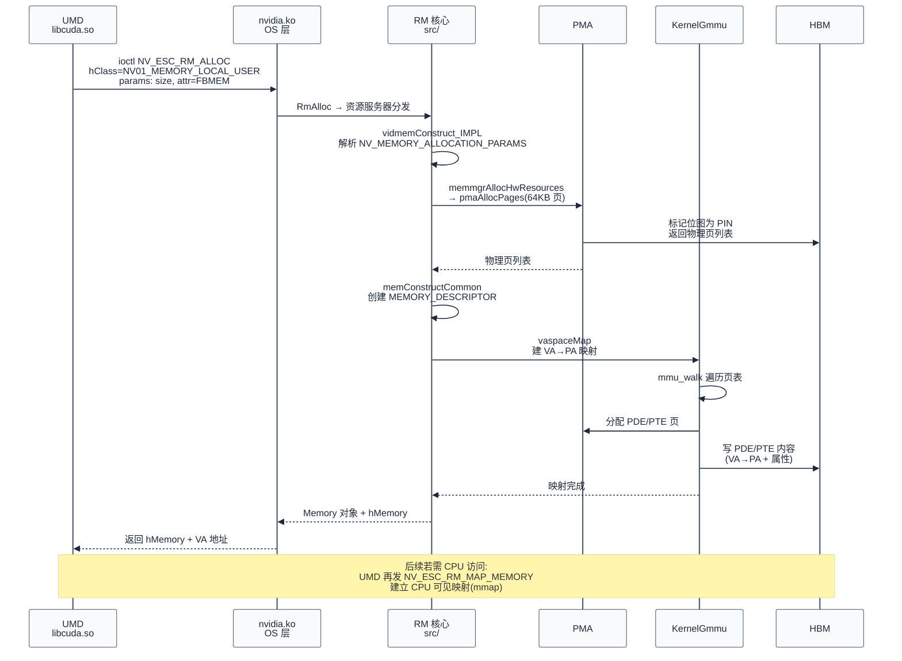

# 内存管理:显存与虚拟地址空间

> 显存是 GPU 推理最稀缺的资源——KV cache 装不下就得换小模型或换解码策略,权重大了就得切分。本章拆解 `cuMemAlloc` 在 KMD 里的落地:MemoryManager 如何组织 FB(Framebuffer)、PMA 如何按 64KB 颗粒管理物理页、VASpace 如何分配 57 位虚拟地址、GPU MMU 的多级页表怎么落地 PDE/PTE,以及推理场景下的三类内存(weights / KV cache / activations)走哪条路径。
>
> **工程师视角**:理解本章后,你能读懂 `nvidia-smi` 里 "Used / Free / Total" 背后的物理堆(Heap)、能解释 `cudaMalloc` 与 `cuMemCreate + cuMemMap` 的差异(前者是封装的物理分配,后者是物理+虚拟分离)、能定位 "out of memory" 是 PMA 没页了还是 VASpace 满了、能理解 MIG 切片对显存配额的影响。

### 关键术语

| 缩写 | 全称 | 含义 |
|------|------|------|
| FB | Frame Buffer | 显存,本文指 HBM(GPU 板载内存) |
| HBM | High Bandwidth Memory | 高带宽显存,H100/A100 用 HBM2e/HBM3 |
| PMA | Physical Memory Allocator | 物理内存分配器,RM 内 64KB 颗粒的页管理 |
| Heap | — | 显存块管理器,管理大块连续物理区间(MEM_BLOCK 链表) |
| VA | Virtual Address | 虚拟地址 |
| VASpace | Virtual Address Space | 虚拟地址空间,RM 对象(`FERMI_VASPACE_A`) |
| MMU | Memory Management Unit | GPU 的内存管理单元,做 VA→PA 翻译 |
| PDE | Page Directory Entry | 页目录项,指向下一级页表 |
| PTE | Page Table Entry | 页表项,指向物理页 |
| GMMU | GPU MMU | GPU 端的 MMU 实现 |
| GVA | Global VA Space | 全局虚拟地址空间,所有 GPU 共享 |
| FLA | Fabric Linear Address | 网状线性地址,MIG/NVSwitch 场景用 |
| MIG | Multi-Instance GPU | GPU 硬件分片,显存切片 |
| memdesc | Memory Descriptor | 内存描述符,RM 里描述一块内存的对象 |
| NUMA | Non-Uniform Memory Access | 非一致性内存访问,Grace-Hopper 等支持显存作为 NUMA 节点 |
| CPR | Confidential Protected Region | 机密保护内存区(Hopper CC) |
| ATS | Address Translation Services | PCIe 地址翻译服务,CPU-GPU 共享 VA |
| UVM | Unified Virtual Memory | 统一虚拟内存,独立子系统(见 [08](./08-统一内存UVM.md)) |

---

## 1. 概述

### 1.1 前置知识

| 需要了解 | 参考文档 |
|----------|----------|
| RM client/handle 对象模型、`NV_ESC_RM_ALLOC` | [04-字符设备与ioctl接口](./04-字符设备与ioctl接口.md) |
| 命令提交模型(channel 需要绑 VASpace) | [05-命令提交channel与GPFIFO](./05-命令提交channel与GPFIFO.md) |
| 推理全链路 5 个 checkpoint,本文深入 checkpoint C 的内存侧 | [03-推理全链路总览](./03-推理全链路总览.md) |
| x86/Linux 页表基础(四级页表、TLB、huge page) | 内核文档 Documentation/mm/ |
| GPU 硬件结构(HBM/SM/L2) | [../cuda/01-GPU架构基础](../cuda/01-GPU架构基础.md) |

### 1.2 系统上下文

> 上一章(06)闭合了命令提交与完成通知的回路。但回看 05 的命令提交——channel 要绑 VASpace,pushbuffer 要在显存里,GPFIFO 也要在显存里,SM 执行时取权重和 KV cache 还是要从显存读。一个自然的问题是:**这些显存到底怎么分配出来的?虚拟地址怎么映射到物理显存?** 本章回答这个问题——先讲 MemoryManager 与 PMA/Heap 的物理分配,再讲 VASpace 与 GMMU 的虚拟映射,最后讨论推理场景下的三类内存模式。

**项目定位**:本章研究的是 **`cuMemAlloc` 的内核落地链路**。在 NVIDIA 的内存架构里,显存分配是**物理/虚拟分离**的——`cuMemAlloc(cudaMalloc)` 是封装好的"物理+虚拟一体"快捷路径;`cuMemCreate + cuMemAddressReserve + cuMemMap` 是分离的"先拿物理、再保虚拟地址、再映射"路径,后者支持跨进程共享、延迟映射、稀疏映射(sparse)等高级特性。两条路径在 KMD 都汇入 MemoryManager,差别在调几个 RM API。

**软硬件耦合点**:本章聚焦四个耦合点:① **物理页粒度**——PMA 用 64KB(`PMA_PAGE_SHIFT=16`)做物理页管理,但 GPU MMU 支持 4KB/64KB/2MB/512MB 多种页大小,KMD 要做粒度换算;② **页表存储位置**——PDE/PTE 默认放在显存里(`ADDR_FBMEM`,见 [kern_gmmu.c:122-132](./src/open-gpu-kernel-modules/src/nvidia/src/kernel/gpu/mmu/kern_gmmu.c)),页表本身也吃显存;③ **NUMA 与一致性**——Grace-Hopper 等自托管 GPU 把显存作为 NUMA 节点 onlline 到 Linux,KMD 要兼顾 NUMA 内存策略;④ **MIG 切片**——MIG 把显存切成多个物理分区,每个分区独立的 PMA、Heap、VASpace。

**跨实现对比**:与 Linux 的 `buddy allocator + slab` 对比——Linux 物理页管理用 buddy(2 的幂次方阶)+ slab(小对象),PMA 用 64KB 等粒度 + 位图(`pmaMap`),不做 buddy 合并,因为 GPU 显存碎片化影响小(SM 访存走页表,不要求物理连续);与 AMD amdgpu 的 TTM(Translation Table Manager)对比——amdgpu 用通用 TTM 框架管理 VRAM/GTT/系统内存,NVIDIA 用自研 PMA + Heap,因为 RM 跨 OS(OSAL),不能依赖 Linux 特定框架。详见 §10。



> **如何读这张图**:从上到下是 `cuMemAlloc` 的下沉路径。UMD 调 `cuMemAlloc` 进 ioctl `NV_ESC_RM_ALLOC`(类 `NV01_MEMORY_LOCAL_USER`)。RM 创建 `VideoMemory`/`Memory` 对象,委托 PMA(64KB 物理页)或 Heap(大块)分配物理显存。若涉及虚拟映射(非纯物理分配),还要创建 `VASpace` 对象,调 KernelGmmu 走 `gmmu_walk.c` 写 PDE/PTE。GPU MMU 硬件在 SM 访存时读这些 PDE/PTE 做 VA→PA 翻译。Page table 本身也放在 HBM 里(自引用)。

> **核心要点**:NVIDIA 的显存管理是**物理/虚拟分离**的双层架构——PMA 管物理(64KB 等粒度位图),VASpace + GMMU 管虚拟(57 位多级页表)。`cuMemAlloc` 是封装路径(物理+虚拟一起),`cuMemCreate + cuMemMap` 是分离路径(分别调 RM API)。Page table 自身在显存里,形成自引用结构;PMA 不做 buddy 合并(等粒度管理),与 Linux 物理内存管理风格迥异。

---

## 2. 显存类与对象模型:NV01_MEMORY_*

### 2.1 内存类编号

NVIDIA 用 RM 对象类(`hClass`)区分内存类型。所有内存对象都从 `NV01_ROOT_CLIENT` 派生,常见的内存类编号:

```c
/* 摘自 [src/nvidia/generated/g_allclasses.h](./src/open-gpu-kernel-modules/src/nvidia/generated/g_allclasses.h) 第 268-403 行(节选) */
#ifndef NV01_ROOT
#define NV01_ROOT                                (0x00000000)
#endif
#ifndef NV01_NULL_OBJECT
#define NV01_NULL_OBJECT                         (0x00000000) // alias
#endif
#ifndef NV01_ROOT_CLIENT
#define NV01_ROOT_CLIENT                         (0x00000041)
#endif
#ifndef NV01_DEVICE_0
#define NV01_DEVICE_0                            (0x00000080)
#endif
#ifndef NV01_MEMORY_SYSTEM
#define NV01_MEMORY_SYSTEM                       (0x0000003e)
#endif
#ifndef NV01_MEMORY_LOCAL_PRIVILEGED
#define NV01_MEMORY_LOCAL_PRIVILEGED             (0x0000003f)
#endif
#ifndef NV01_MEMORY_LOCAL_USER
#define NV01_MEMORY_LOCAL_USER                   (0x00000040)
#endif
#ifndef NV01_MEMORY_LOCAL_PHYSICAL
#define NV01_MEMORY_LOCAL_PHYSICAL               (0x000000c2)
#endif
#ifndef NV01_MEMORY_LIST_SYSTEM
#define NV01_MEMORY_LIST_SYSTEM                  (0x00000081)
#endif
#ifndef NV01_MEMORY_LIST_FBMEM
#define NV01_MEMORY_LIST_FBMEM                   (0x00000082)
#endif
```

解释:这段定义体现了"NVIDIA 一切皆对象"的设计——内存不是裸指针,是 RM 对象。每个 `#define` 对应一个 hClass 编号,UMD 调 `NV_ESC_RM_ALLOC` 时填这个 hClass 决定分配什么类型:

- `NV01_MEMORY_LOCAL_USER`(0x40):**用户态显存**,最常见的 `cudaMalloc` 路径,分配在 GPU 板载 HBM
- `NV01_MEMORY_SYSTEM`(0x3E):**系统内存**,host 内存在 GPU 视角的对象化(常用于 staging buffer)
- `NV01_MEMORY_LIST_FBMEM`(0x82):**物理页列表**,已分配的物理页打散成 page list,用于 sparse mapping
- `NV01_MEMORY_LOCAL_PHYSICAL`(0xC2):**物理地址连续**,用于 IOMMU/DMA 场景

### 2.2 内存类速查表

| hClass | 名称 | 物理位置 | 典型用途 | 对应 `cuMem*` API |
|--------|------|----------|----------|-------------------|
| 0x40 | `NV01_MEMORY_LOCAL_USER` | HBM | 普通显存分配(weights/KV cache/activations) | `cuMemAlloc` / `cudaMalloc` |
| 0x3E | `NV01_MEMORY_SYSTEM` | 系统内存 | host staging buffer、小常量 | `cuMemAllocHost` |
| 0x82 | `NV01_MEMORY_LIST_FBMEM` | HBM(已有页) | sparse mapping、CUmemCreate | `cuMemCreate` |
| 0x81 | `NV01_MEMORY_LIST_SYSTEM` | 系统内存(已有页) | P2P 系统内存端 | `cuMemCreate` |
| 0xC2 | `NV01_MEMORY_LOCAL_PHYSICAL` | HBM(连续物理) | IOMMU 一致性、特定硬件路径 | 内部用 |
| 0x3F | `NV01_MEMORY_LOCAL_PRIVILEGED` | HBM(特权区) | RM 内部、固件数据 | 内部用 |

> **如何读这张表**:第一列是 hClass 编号(16 进制),UMD 通过 ioctl 传给 KMD。注意 `cuMemAlloc` 与 `cuMemCreate` 的区别——`cuMemAlloc` 走 `NV01_MEMORY_LOCAL_USER`(物理+虚拟打包);`cuMemCreate` 走 `NV01_MEMORY_LIST_FBMEM`(只拿物理页,不绑 VA),后续要 `cuMemAddressReserve`(保 VA)+ `cuMemMap`(建立 VA→PA 映射)三步。这种分离设计是 vGPU 共享、稀疏映射、跨进程共享的基础。

### 2.3 NV_MEMORY_ALLOCATION_PARAMS:分配参数

UMD 调 `NV_ESC_RM_ALLOC` 时,除了 hClass 还要传分配参数。`NV01_MEMORY_LOCAL_USER` 的参数是 `NV_MEMORY_ALLOCATION_PARAMS`:

```c
/* 摘自 [src/common/sdk/nvidia/inc/nvos.h](./src/open-gpu-kernel-modules/src/common/sdk/nvidia/inc/nvos.h) 第 1600-1634 行 */
typedef struct
{
    NvU32     owner;                        // [IN]  - memory owner ID
    NvU32     type;                         // [IN]  - surface type, see below TYPE* defines
    NvU32     flags;                        // [IN]  - allocation modifier flags, see below ALLOC_FLAGS* defines

    NvU32     width;                        // [IN]  - width of surface in pixels
    NvU32     height;                       // [IN]  - height of surface in pixels
    NvS32     pitch;                        // [IN/OUT] - desired pitch AND returned actual pitch allocated

    NvU32     attr;                         // [IN/OUT] - surface attributes requested, and surface attributes allocated
    NvU32     attr2;                        // [IN/OUT] - surface attributes requested, and surface attributes allocated

    NvU32     format;                       // [IN/OUT] - format requested, and format allocated
    NvU32     comprCovg;                    // [IN/OUT] - compr covg requested, and allocated
    NvU32     zcullCovg;                    // [OUT] - zcull covg allocated

    NvU64     rangeLo   NV_ALIGN_BYTES(8);  // [IN]  - allocated memory will be limited to the range
    NvU64     rangeHi   NV_ALIGN_BYTES(8);  // [IN]  - from rangeBegin to rangeEnd, inclusive.

    NvU64     size      NV_ALIGN_BYTES(8);  // [IN/OUT]  - size of allocation - also returns the actual size allocated
    NvU64     alignment NV_ALIGN_BYTES(8);  // [IN]  - requested alignment - NVOS32_ALLOC_FLAGS_ALIGNMENT* must be on
    NvU64     offset    NV_ALIGN_BYTES(8);  // [IN/OUT]  - desired offset if NVOS32_ALLOC_FLAGS_FIXED_ADDRESS_ALLOCATE is on AND returned offset
    NvU64     limit     NV_ALIGN_BYTES(8);  // [OUT] - returned surface limit
    NvP64     address   NV_ALIGN_BYTES(8);  // [OUT] - returned address

    NvU32     ctagOffset;                   // [IN] - comptag offset for this surface (see NVOS32_ALLOC_COMPTAG_OFFSET)
    NvHandle  hVASpace;                     // [IN]  - VASpace handle. Used when flag is VIRTUAL.

    NvU32     internalflags;                // [IN]  - internal flags to change allocation behaviors from internal paths

    NvU32     tag;                          // [IN] - memory tag used for debugging

    NvS32     numaNode;                     // [IN] - CPU NUMA node from which memory should be allocated
} NV_MEMORY_ALLOCATION_PARAMS;
```

逐字段解释(只挑推理场景重要的):

- `owner`:分配者 ID,用于追踪哪类客户(UMD/内部 RM/GSP)分配
- `type` / `flags`:类型与修饰符;`flags` 里的 `NVOS32_ALLOC_FLAGS_VIRTUAL`(0x00080000)表示**纯虚拟分配**(不分配物理,只占 VA 空间)
- `attr` / `attr2`:物理位置与属性,如 `ADDR_FBMEM`(显存)、`ADDR_SYSMEM`(系统内存)、是否可压缩、是否 GPU cacheable
- `size` / `alignment`:大小与对齐;推理场景权重通常按 2MB 对齐(匹配 huge page)
- `offset` / `address`:返回的物理偏移与虚拟地址
- `hVASpace`:绑定的 VASpace 句柄(虚拟分配时用)
- `numaNode`:NUMA 节点(Grace-Hopper 等自托管 GPU 用)

### 2.4 关键分配标志

```c
/* 摘自 [src/common/sdk/nvidia/inc/nvos.h](./src/open-gpu-kernel-modules/src/common/sdk/nvidia/inc/nvos.h) 第 1441-1484 行(节选) */
#define NVOS32_ALLOC_FLAGS_FIXED_ADDRESS_ALLOCATE       0x00000010
#define NVOS32_ALLOC_FLAGS_MAP_NOT_REQUIRED             0x00008000
#define NVOS32_ALLOC_FLAGS_PERSISTENT_VIDMEM            0x00010000
#define NVOS32_ALLOC_FLAGS_VIRTUAL                      0x00080000
```

逐条解释(每个标志解决什么问题):

- `FIXED_ADDRESS_ALLOCATE`(0x10):**要求固定物理地址**。用于 vGPU 上下文恢复、硬件寄存器映射——这些场景物理地址不能漂移
- `MAP_NOT_REQUIRED`(0x8000):**不需要 CPU 可见映射**。推理 weights 通常不需要 CPU 直接读,只 GPU 访问,跳过 mmap 节省页表
- `PERSISTENT_VIDMEM`(0x10000):**持久显存**,不会被驱逐到系统内存。推理 weights 必须设这个,否则可能被 UVM 换出
- `VIRTUAL`(0x80000):**纯虚拟分配**,不分配物理,只占 VA。配合 `cuMemMap` 后续建立映射,这是 sparse / 共享内存的基础

> **核心要点**:NVIDIA 的内存类系统是"**用对象编号区分物理位置 + 用 flags 区分分配语义**"的双层设计。hClass 决定内存的"种类"(显存/系统/列表),flags 决定分配的"方式"(虚拟/物理/固定地址/持久)。`cuMemAlloc` 是 hClass=`NV01_MEMORY_LOCAL_USER` + 不设 `VIRTUAL` 的快捷组合;`cuMemCreate + cuMemMap` 是 hClass=`NV01_MEMORY_LIST_FBMEM` + 后续单独建 VA 映射的分离组合。

---

## 3. MemoryManager 初始化:PMA 与 Heap

### 3.1 MemoryManager 对象构造

`MemoryManager` 是 GPU 的"内存管家"对象,每个 GPU 一个。构造时创建子对象、应用注册表覆盖,但不真正分配显存——显存分配推迟到 `memmgrStateInitLocked`(状态初始化阶段)。

```c
/* 摘自 [src/nvidia/src/kernel/gpu/mem_mgr/mem_mgr.c](./src/open-gpu-kernel-modules/src/nvidia/src/kernel/gpu/mem_mgr/mem_mgr.c) 第 77-106 行 */
NV_STATUS
memmgrConstructEngine_IMPL
(
    OBJGPU        *pGpu,
    MemoryManager *pMemoryManager,
    ENGDESCRIPTOR  engDesc
)
{
    NV_STATUS rmStatus;

    pMemoryManager->overrideInitHeapMin = 0;
    pMemoryManager->overrideHeapMax     = ~0ULL;
    pMemoryManager->Ram.fbOverrideSizeMb = ~0ULL;
    pMemoryManager->localEgmPeerId = BUS_INVALID_PEER;
    pMemoryManager->localEgmNodeId = -1;

    // Create the children
    rmStatus = _memmgrCreateChildObjects(pMemoryManager);
    if (rmStatus != NV_OK)
        return rmStatus;

    pMemoryManager->MIGMemoryPartitioningInfo.hClient = NV01_NULL_OBJECT;
    pMemoryManager->MIGMemoryPartitioningInfo.hDevice = NV01_NULL_OBJECT;
    pMemoryManager->MIGMemoryPartitioningInfo.hSubdevice = NV01_NULL_OBJECT;
    pMemoryManager->MIGMemoryPartitioningInfo.partitionableMemoryRange = NV_RANGE_EMPTY;

    _memmgrInitRegistryOverridesAtConstruct(pGpu, pMemoryManager);

    return NV_OK;
}
```

解释:构造函数只做最小初始化——设置默认堆范围(`overrideHeapMax = ~0ULL` 表示不限制)、创建子对象(包括 `Heap`)、清空 MIG 分区信息。`_memmgrCreateChildObjects` 内部 `objCreate` 一个 `Heap` 对象挂到 `pMemoryManager->pHeap`,这是后续大块物理分配的入口。注意 `MIGMemoryPartitioningInfo.partitionableMemoryRange = NV_RANGE_EMPTY`——MIG 还没启用时,整个 FB 是一整块。

### 3.2 PMA 初始化:64KB 物理页管理器

PMA 是 RM 自研的物理内存分配器,管 64KB 粒度的物理页。它在 `memmgrStateInitLocked` 阶段初始化:

```c
/* 摘自 [src/nvidia/src/kernel/gpu/mem_mgr/mem_mgr.c](./src/open-gpu-kernel-modules/src/nvidia/src/kernel/gpu/mem_mgr/mem_mgr.c) 第 3300-3349 行 */
NV_STATUS
memmgrPmaInitialize_IMPL
(
    OBJGPU        *pGpu,
    MemoryManager *pMemoryManager,
    PMA          **ppPma
)
{
    NvU32 pmaInitFlags = PMA_INIT_NONE;
    NV_STATUS status = NV_OK;
    NvBool bNumaEnabled = osNumaOnliningEnabled(pGpu->pOsGpuInfo);
    PMA          *pPma;

    NV_ASSERT(memmgrIsPmaEnabled(pMemoryManager) &&
              memmgrIsPmaSupportedOnPlatform(pMemoryManager));

    if (memmgrIsPmaForcePersistence(pMemoryManager))
    {
        pmaInitFlags |= PMA_INIT_FORCE_PERSISTENCE;
    }

    if (memmgrIsScrubOnFreeEnabled(pMemoryManager))
    {
        pmaInitFlags |= PMA_INIT_SCRUB_ON_FREE;
    }

    // Disable client page table management on SLI.
    if (IsSLIEnabled(pGpu))
    {
        memmgrSetClientPageTablesPmaManaged(pMemoryManager, NV_FALSE);
    }

    if (bNumaEnabled)
    {
        NV_PRINTF(LEVEL_INFO, "Initializing PMA with NUMA flag.\n");
        pmaInitFlags |= PMA_INIT_NUMA;

        if (gpuIsSelfHosted(pGpu))
        {
            NV_PRINTF(LEVEL_INFO, "Initializing PMA with NUMA_AUTO_ONLINE flag.\n");
            pmaInitFlags |= PMA_INIT_NUMA_AUTO_ONLINE;
        }
    }

    status = pmaInitialize(ppPma, pmaInitFlags);
    if (status != NV_OK)
    {
        NV_PRINTF(LEVEL_ERROR, "Failed to initialize PMA!\n");
        return status;
    }

    pPma = *ppPma;

    pmaRegisterUpdateStatsCb(pPma, _memmgrPmaStatsUpdateCb, pGpu);

    if (bNumaEnabled)
    {
        /* ... NUMA region online 逻辑,详见下文 §3.4 ... */
    }

    return NV_OK;
}
```

逐段解释(每个分支解决什么问题):

- **`PMA_INIT_SCRUB_ON_FREE`**:释放时清零。推理 weights 含敏感数据(模型权重有商业价值),释放时必须擦除,防止下一个 client 读到残留
- **`PMA_INIT_NUMA` / `NUMA_AUTO_ONLINE`**:Grace-Hopper 等自托管 GPU 把显存作为 NUMA 节点暴露给 Linux,这两位让 PMA 知道显存已被内核 NUMA 子系统接管,需要协调
- **`IsSLIEnabled` 关 client page table**:SLI 多 GPU 场景下,客户端页表(用户态分配的页表)不让 PMA 管,避免跨 GPU 一致性问题

`pmaInitialize` 本身做什么?分配 PMA 结构、初始化锁、初始化统计:

```c
/* 摘自 [src/nvidia/src/kernel/gpu/mem_mgr/phys_mem_allocator/phys_mem_allocator.c](./src/open-gpu-kernel-modules/src/nvidia/src/kernel/gpu/mem_mgr/phys_mem_allocator/phys_mem_allocator.c) 第 108-180 行(简化) */
NV_STATUS
pmaInitialize(PMA **ppPma, NvU32 initFlags)
{
    NV_STATUS status = NV_OK;
    PMA_MAP_INFO *pMapInfo;
    PMA *pPma;

    if (ppPma == NULL)
        return NV_ERR_INVALID_ARGUMENT;

    *ppPma = portMemAllocNonPaged(sizeof(PMA));
    if (*ppPma == NULL)
        return NV_ERR_NO_MEMORY;

    pPma = *ppPma;
    portMemSet(pPma, 0, sizeof(PMA));

    // 分配四把锁:PmaLock(spinlock,快速分配路径)、EvictionCallbacksLock(mutex,驱逐回调)、
    //            AllocLock(mutex,长分配路径)、ScrubberValidLock(rwlock,scrubber 状态查询)
    pPma->pPmaLock = (PORT_SPINLOCK *)portMemAllocNonPaged(portSyncSpinlockSize);
    /* ... 省略错误处理 ... */
    portSyncSpinlockInitialize(pPma->pPmaLock);

    pPma->pEvictionCallbacksLock = (PORT_MUTEX *)portMemAllocNonPaged(portSyncMutexSize);
    /* ... 省略 ... */
    portSyncMutexInitialize(pPma->pEvictionCallbacksLock);

    pPma->pAllocLock = (PORT_MUTEX *)portMemAllocNonPaged(portSyncMutexSize);
    /* ... 省略 ... */
    portSyncMutexInitialize(pPma->pAllocLock);

    pPma->pScrubberValidLock = (PORT_RWLOCK *)portMemAllocNonPaged(portSyncRwLockSize);
    /* ... 省略其余初始化 ... */

    pPma->bScrubOnFree = (initFlags & PMA_INIT_SCRUB_ON_FREE) != 0;
    pPma->bNuma        = (initFlags & PMA_INIT_NUMA) != 0;
    /* ... 配置 pmaMap 接口表(可插拔的位图实现)... */
    return NV_OK;
}
```

解释:这段体现了 PMA 的并发模型——**四把锁分管四类操作**:

- `pPmaLock`(spinlock):页状态读写,极短临界区(改位图),用自旋锁避免睡眠开销
- `pEvictionCallbacksLock`(mutex):驱逐回调注册/调用,可睡眠(UVM 按需分页触发驱逐时持有)
- `pAllocLock`(mutex):长分配路径(可能触发驱逐、scrub),可睡眠
- `pScrubberValidLock`(rwlock):scrubber 状态查询,多读单写

为什么不全用一把锁?因为分配是热路径(`cuMemAlloc` 一次推理调几百次),用大锁会让所有分配串行,毁掉并发性。

### 3.3 PMA 区块注册:FB Region

PMA 初始化只搭框架,真正把 HBM 物理区间登记进去是 `pmaRegisterRegion`:

```c
/* 摘自 [src/nvidia/src/kernel/gpu/mem_mgr/phys_mem_allocator/phys_mem_allocator.c](./src/open-gpu-kernel-modules/src/nvidia/src/kernel/gpu/mem_mgr/phys_mem_allocator/phys_mem_allocator.c) 第 482-555 行(简化) */
NV_STATUS
pmaRegisterRegion
(
    PMA                   *pPma,
    NvU32                  id,
    NvBool                 bAsyncEccScrub,
    PMA_REGION_DESCRIPTOR *pRegionDesc,
    NvU32                  blacklistCount,
    PPMA_BLACKLIST_ADDRESS pBlacklistPageBase
)
{
    NvU64 numFrames;
    void *pMap;
    NvU64 physBase, physLimit;
    NV_STATUS status = NV_OK;

    /* ... 参数校验省略 ... */

    physBase = pRegionDesc->base;
    physLimit = pRegionDesc->limit;

    // 区间必须按 64KB 对齐(PMA_GRANULARITY)
    if (!NV_IS_ALIGNED(physBase, PMA_GRANULARITY) ||
        !NV_IS_ALIGNED((physLimit + 1), PMA_GRANULARITY))
    {
        NV_PRINTF(LEVEL_ERROR, "ERROR: Region range %llx..%llx unaligned\n",
            physBase, physLimit);
        return NV_ERR_INVALID_ARGUMENT;
    }

    numFrames = (physLimit - physBase + 1) >> PMA_PAGE_SHIFT;

    // 调 pmaMap 接口初始化位图(每帧 1 个状态位)
    pMap = pPma->pMapInfo->pmaMapInit(numFrames, physBase, &pPma->pmaStats,
                                      pRegionDesc->bProtected);
    if (pMap == NULL)
        return NV_ERR_NO_MEMORY;

    pPma->pRegions[id] = pMap;

    // 深拷贝 region descriptor(保存 base/limit/bProtected 等元信息)
    pPma->pRegDescriptors[id] =
      (PMA_REGION_DESCRIPTOR *) portMemAllocNonPaged(sizeof(PMA_REGION_DESCRIPTOR));
    portMemCopy(pPma->pRegDescriptors[id], sizeof(PMA_REGION_DESCRIPTOR),
        pRegionDesc, sizeof(PMA_REGION_DESCRIPTOR));

    pPma->regSize++;

    /* ... 后续 ECC scrub 启动、blacklist 标记省略 ... */
    return NV_OK;
}
```

逐段解释(每个步骤解决什么问题):

- **对齐校验**(`PMA_GRANULARITY` = 64KB):PMA 用 64KB 颗粒管理,区间边界必须对齐,否则位图索引算不准
- **`numFrames` 计算**:帧数 = 区间大小 / 64KB。位图大小 = 帧数 / 8 字节(H100 80GB 显存约需 80GB/64KB/8 = 160KB 位图,可忽略)
- **`pmaMapInit`**:初始化位图,每帧一位,初始全 "free"。`bProtected` 标记 CPR 区(Hopper CC 机密计算保护区)
- **`pRegDescriptors[id]`**:保存区间元信息(物理起止、是否受保护),PMA 支持多 region(如 MIG 切片后每片一个 region)

### 3.4 PMA 配置常量

```c
/* 摘自 [src/nvidia/inc/kernel/gpu/mem_mgr/phys_mem_allocator/map_defines.h](./src/open-gpu-kernel-modules/src/nvidia/inc/kernel/gpu/mem_mgr/phys_mem_allocator/map_defines.h) 第 51-52 行 */
#define PMA_GRANULARITY 0x10000
#define PMA_PAGE_SHIFT 16
```

解释:`PMA_GRANULARITY = 0x10000 = 64KB`,`PMA_PAGE_SHIFT = 16`(2^16 = 64KB)。这是 PMA 管理的最小物理页粒度。

**为什么是 64KB 而不是 4KB?**

- GPU HBM 带宽极高(H100 HBM3 ≈ 3TB/s),4KB 小页会让 TLB miss 成本飙升
- GPU 访存模式以大块连续为主(weights/KV cache 几 MB 到几十 MB),不需要 4KB 精细粒度
- 64KB 与 ARM64 的 huge page、Linux 的 compound page 下限对齐,便于 NUMA online

GPU MMU 硬件仍支持 4KB/64KB/2MB/512MB 多种页大小(见 §6),但 PMA 物理管理统一用 64KB,大页(2MB/512MB)由上层按 64KB 倍数组合。

### 3.5 Heap:大块连续物理分配

PMA 管 64KB 单页,但有些场景需要大块连续物理区间(如 RM 内部的 instance memory、固件数据)。Heap 是另一层分配器,管理 `MEM_BLOCK` 链表:

```c
/* 摘自 [src/nvidia/src/kernel/gpu/mem_mgr/heap.c](./src/open-gpu-kernel-modules/src/nvidia/src/kernel/gpu/mem_mgr/heap.c) 第 1341-1397 行(简化) */
NV_STATUS heapAlloc_IMPL
(
    OBJGPU                        *pGpu,
    NvHandle                       hClient,
    Heap                          *pHeap,
    MEMORY_ALLOCATION_REQUEST     *pAllocRequest,
    NvHandle                       memHandle,
    OBJHEAP_ALLOC_DATA            *pAllocData,
    FB_ALLOC_INFO                 *pFbAllocInfo,
    HWRESOURCE_INFO              **pHwResource,
    NvBool                        *pNoncontigAllocation,
    NvBool                         bNoncontigAllowed,
    NvBool                         bAllocedMemdesc
)
{
    NV_MEMORY_ALLOCATION_PARAMS   *pVidHeapAlloc        = pAllocRequest->pUserParams;
    MemoryManager                 *pMemoryManager       = GPU_GET_MEMORY_MANAGER(pGpu);
    NvU64                          desiredOffset        = pFbAllocInfo->offset;
    NvU64                          adjustedSize         = pFbAllocInfo->size - pFbAllocInfo->alignPad;

    NV_ASSERT_OR_RETURN(
        (memmgrAllocGetAddrSpace(GPU_GET_MEMORY_MANAGER(pGpu), pVidHeapAlloc->flags, pVidHeapAlloc->attr)
            == ADDR_FBMEM) &&
        (pAllocRequest->pPmaAllocInfo[gpumgrGetSubDeviceInstanceFromGpu(pGpu)] == NULL),
        NV_ERR_INVALID_ARGUMENT);

    if (pVidHeapAlloc->flags & NVOS32_ALLOC_FLAGS_FIXED_ADDRESS_ALLOCATE)
        desiredOffset -= pFbAllocInfo->alignPad;

    // 处理坏页(blacklist)隔离:页退役机制
    if (pGpu->getProperty(pGpu, PDB_PROP_GPU_ALLOW_PAGE_RETIREMENT) &&
        gpuCheckPageRetirementSupport_HAL(pGpu) &&
        FLD_TEST_DRF(OS32, _ATTR2, _BLACKLIST, _OFF, pVidHeapAlloc->attr2))
    {
        NV_PRINTF(LEVEL_INFO,
                  "Trying to turn blacklisting pages off for this allocation of size: %llx\n",
                  pVidHeapAlloc->size);
        if (!hypervisorIsVgxHyper())
            _heapFreeBlacklistPages(pGpu, pMemoryManager, &pHeap->blackList, desiredOffset, pVidHeapAlloc->size);
        else
            _heapFreeBlacklistPages(pGpu, pMemoryManager, &pHeap->blackList, pHeap->base, pHeap->total);
    }

    /* ... 范围限制、bank placement、查找 free block、切分等逻辑省略 ... */
}
```

解释:这段体现了 Heap 与 PMA 的分工——

- `NV_ASSERT_OR_RETURN(... == ADDR_FBMEM) && (pPmaAllocInfo == NULL))`:Heap 只处理显存且 PMA 没接手的分配。PMA 接手的(普通 64KB 对齐分配)走 PMA 路径
- **坏页隔离**(`_heapFreeBlacklistPages`):HBM 可能有坏页(出厂或运行时老化),Heap 把坏页加入 `blackList` 链表,分配时跳过。这是 NVIDIA 的页退役机制(`PDB_PROP_GPU_ALLOW_PAGE_RETIREMENT`),类似 Linux 的 `memory_failure`

Heap 与 PMA 的关系——**Heap 是 PMA 的"上游"**,负责:
- 大块连续物理分配(整片 instance memory、固件区)
- 坏页管理(blacklist)
- 区间预留(RM 内部保留区,如 console scanout、固件数据)

普通用户态 `cuMemAlloc` 默认走 **PMA 路径**(64KB 物理页 + 虚拟映射),Heap 只在 RM 内部分配特殊区间时用。

### 3.6 PMA + Heap 分层小结



> **如何读这张图**:用户态 `cuMemAlloc` 默认走 PMA(64KB 页);RM 内部需要大块连续时走 Heap。两者都映射到同一片 HBM 物理区间,Heap 占用的页在 PMA 位图里标记为 "PIN",不被 PMA 重复分配。坏页(blacklist)在 PMA 里也标记为不可用。

> **核心要点**:NVIDIA 的物理显存是**双分配器分工**——PMA 管 64KB 单页(用户态 `cuMemAlloc` 默认路径),Heap 管大块连续(RM 内部)。两者通过共享 PMA 位图避免双重分配,坏页通过 blackList 隔离。PMA 不做 buddy 合并(等粒度管理),与 Linux 物理内存管理的 buddy+slab 风格迥异——因为 GPU 显存碎片化影响小(访存走页表,不要求物理连续)。

---

## 4. 物理分配入口:vidmemConstruct

### 4.1 从 ioctl 到 vidmemConstruct

UMD 调 `NV_ESC_RM_ALLOC` with `hClass=NV01_MEMORY_LOCAL_USER` 后,RM 资源服务器分发到 `vidmemConstruct`(因为 `NV01_MEMORY_LOCAL_USER` 是 `VideoMemory` 类):

```c
/* 摘自 [src/nvidia/src/kernel/mem_mgr/video_mem.c](./src/open-gpu-kernel-modules/src/nvidia/src/kernel/mem_mgr/video_mem.c) 第 539-600 行(简化) */
NV_STATUS
vidmemConstruct_IMPL
(
    VideoMemory                  *pVideoMemory,
    CALL_CONTEXT                 *pCallContext,
    RS_RES_ALLOC_PARAMS_INTERNAL *pParams
)
{
    Memory                      *pMemory               = staticCast(pVideoMemory, Memory);
    NV_MEMORY_ALLOCATION_PARAMS *pAllocData            = pParams->pAllocParams;
    NvHandle                     hClient               = pCallContext->pClient->hClient;
    MEMORY_ALLOCATION_REQUEST    allocRequest          = {0};
    MEMORY_ALLOCATION_REQUEST   *pAllocRequest         = &allocRequest;
    OBJGPU                      *pGpu                  = pMemory->pGpu;
    MemoryManager               *pMemoryManager        = GPU_GET_MEMORY_MANAGER(pGpu);
    Heap                        *pHeap                 = NULL;
    NvBool                       bIsPmaAlloc           = NV_FALSE;
    NvU64                        sizeOut;
    NvU64                        offsetOut;
    FB_ALLOC_INFO               *pFbAllocInfo          = NULL;
    NV_STATUS                    rmStatus              = NV_OK;

    NV_ASSERT_OR_RETURN(pRmClient != NULL, NV_ERR_INVALID_CLIENT);

    NV_ASSERT_OK_OR_RETURN(
        refFindAncestorOfType(pResourceRef, classId(Device), &pDeviceRef));

    pDevice = dynamicCast(pDeviceRef->pResource, Device);

    if (RS_IS_COPY_CTOR(pParams))
    {
        /* ... 跨进程共享场景:复制构造,跳过物理重新分配 ... */
        rmStatus = vidmemCopyConstruct(pVideoMemory, pCallContext, pParams);
        goto done;
    }

    /* ... 解析 pAllocData 到 allocRequest,准备 FB_ALLOC_INFO ... */
    /* ... 调 memmgrAllocHwResources(pGpu, pMemoryManager, pFbAllocInfo) ... */
    /* ... 根据 bIsPmaAlloc 决定走 PMA 还是 Heap ... */
    /* ... 创建 MEMORY_DESCRIPTOR 描述这块物理内存 ... */
    /* ... 调 memConstructCommon 把 Memory 对象初始化 ... */
}
```

解释:`vidmemConstruct` 是 `NV01_MEMORY_LOCAL_USER` 的构造函数,核心职责三步:

1. **解析参数**(`NV_MEMORY_ALLOCATION_PARAMS` → `MEMORY_ALLOCATION_REQUEST`):把 UMD 传的参数翻译成内部格式
2. **物理分配**(`memmgrAllocHwResources` → PMA 或 Heap):真正从 HBM 拿页
3. **构造 Memory 对象**(`memConstructCommon`):创建 `MEMORY_DESCRIPTOR` 描述这块内存(物理地址、大小、属性),挂到 `Memory` 对象

注意 `RS_IS_COPY_CTOR` 分支——这是跨进程共享场景(如 `cuMemImportFromShareHandle`),不重新分配物理,只增加引用计数。

### 4.2 memConstructCommon:统一的 Memory 对象初始化

无论走 PMA 还是 Heap,最终都汇入 `memConstructCommon`:

```c
/* 摘自 [src/nvidia/src/kernel/mem_mgr/mem.c](./src/open-gpu-kernel-modules/src/nvidia/src/kernel/mem_mgr/mem.c) 第 328-373 行 */
NV_STATUS
memConstructCommon_IMPL
(
    Memory             *pMemory,
    NvU32               categoryClassId,
    NvU32               flags,
    MEMORY_DESCRIPTOR  *pMemDesc,
    NvU32               heapOwner,
    Heap               *pHeap,
    NvU32               attr,
    NvU32               attr2,
    NvU32               Pitch,
    NvU32               type,
    NvU32               tag,
    HWRESOURCE_INFO    *pHwResource
)
{
    OBJGPU            *pGpu           = NULL;
    NV_STATUS          status         = NV_OK;
    NvHandle           hParent        = RES_GET_PARENT_HANDLE(pMemory);
    NvHandle           hMemory        = RES_GET_HANDLE(pMemory);

    if (pMemDesc == NULL)
        return NV_ERR_INVALID_ARGUMENT;

    // initialize the memory description
    pMemory->categoryClassId = categoryClassId;
    pMemory->pMemDesc        = pMemDesc;
    pMemory->Length          = pMemDesc->Size;
    pMemory->RefCount        = 1;
    pMemory->HeapOwner       = heapOwner;
    pMemory->pHeap           = pHeap;
    pMemory->Attr            = attr;
    pMemory->Attr2           = attr2;
    pMemory->Pitch           = Pitch;
    pMemory->Type            = type;
    pMemory->Flags           = flags;
    pMemory->tag             = tag;
    pMemory->isMemDescOwner  = NV_TRUE;
    pMemory->bRpcAlloc       = NV_FALSE;

    // We are finished if this instance is device-less
    if (pMemory->pDevice == NULL)
        goto done;

    if (pMemDesc->pGpu == NULL)
        return NV_ERR_INVALID_STATE;

    // Memory has hw resources associated with it that need to be tracked.
    if ((pHwResource != NULL) &&
        ((pHwResource->hwResId != 0) || (RES_GET_REF(pMemory)->externalClassId == NV01_MEMORY_HW_RESOURCES)))
    {
        pMemory->pHwResource = portMemAllocNonPaged(sizeof(HWRESOURCE_INFO));
        if (pMemory->pHwResource != NULL)
        {
            *pMemory->pHwResource = *pHwResource;       // struct copy
            pMemory->pHwResource->refCount = 1;
        }
    }

    /* ... 后续 attr/flags 应用到 memdesc ... */
}
```

解释:这段体现了 RM 的"**Memory 对象 = 元信息 + memdesc**"设计:

- `pMemory->pMemDesc`:指向 `MEMORY_DESCRIPTOR`,这是物理内存的"指针"(包含物理地址列表、大小、aperture 等)
- `pMemory->Length`、`Attr`、`Pitch`、`Flags`:用户可见的元信息
- `pMemory->pHwResource`:硬件资源追踪(comptag、ZBC 等硬件状态),`NV01_MEMORY_HW_RESOURCES` 类才有

`MEMORY_DESCRIPTOR` 是 RM 的核心数据结构,描述一块内存——可能是连续物理(单段)、可能是离散物理(多段 page array)、可能是虚拟(无物理)。它有多种 subclass:`MEMORY_DESCRIPTOR_LOCAL`、`PHYSICAL_MEM_DESC`、`HUGE_PAGE_MEM_DESC` 等,体现 NVIDIA 用 NVOC 对象体系管理内存的统一性。

> **核心要点**:`NV01_MEMORY_LOCAL_USER` 分配走 `vidmemConstruct` 三步——解析参数 → `memmgrAllocHwResources`(PMA 或 Heap)→ `memConstructCommon`(建 memdesc + Memory 对象)。物理分配与对象构造分离,让"换物理分配方式"(PMA/Heap/物理连续)不影响 Memory 对象的对外接口。

---

## 5. 虚拟地址空间:VASpace

### 5.1 VASpace 对象

物理分配拿到的是物理页,但 SM 执行时用的是虚拟地址。VA 空间由 `VASpace` 对象管理,最常用的是 `FERMI_VASPACE_A`(Fermi 架构引入,沿用至今):

```c
/* 摘自 [src/nvidia/generated/g_allclasses.h](./src/open-gpu-kernel-modules/src/nvidia/generated/g_allclasses.h) 第 894-895 行 */
#ifndef FERMI_VASPACE_A
#define FERMI_VASPACE_A                          (0x000090f1)
#endif
```

`FERMI_VASPACE_A` hClass = `0x90F1`。每个 CUDA context 创建时会分配一个 VASpace,channel 绑定到这个 VASpace(详见 [05 §3](./05-命令提交channel与GPFIFO.md))。UMD 也可单独分配 VASpace(`cuCtxCreate` 时隐式,`cuMemAddressReserve` 时显式)。

### 5.2 NV_VASPACE_ALLOCATION_PARAMS

```c
/* 摘自 [src/common/sdk/nvidia/inc/nvos.h](./src/open-gpu-kernel-modules/src/common/sdk/nvidia/inc/nvos.h) 第 3146-3160 行 */
typedef struct
{
    NvU32   index;
    NvV32   flags;
    NvU64   vaSize NV_ALIGN_BYTES(8);
    NvU64   vaStartInternal NV_ALIGN_BYTES(8);
    NvU64   vaLimitInternal NV_ALIGN_BYTES(8);
    NvU32   bigPageSize;
    NvU64   vaBase NV_ALIGN_BYTES(8);
    NvU32   pasid;
} NV_VASPACE_ALLOCATION_PARAMETERS;

#define NV_VASPACE_ALLOCATION_FLAGS_NONE                            (0x00000000)
#define NV_VASPACE_ALLOCATION_FLAGS_MINIMIZE_PTETABLE_SIZE                BIT(0)
#define NV_VASPACE_ALLOCATION_FLAGS_RETRY_PTE_ALLOC_IN_SYS                BIT(1)
```

逐字段解释:

- `index`:VASpace 索引(一个 device 可有多个 VASpace)
- `flags`:`MINIMIZE_PTETABLE_SIZE`(小页表,节省显存)、`RETRY_PTE_ALLOC_IN_SYS`(PTE 分配失败时退化到系统内存)
- `vaSize`:VA 空间大小,H100 等支持 57 位 VA(128PB),实际默认分配按需
- `vaStartInternal` / `vaLimitInternal`:RM 内部保留的 VA 区(给 RM 自己的对象用,如 channel instance memory)
- `bigPageSize`:大页大小,64KB 或 128KB
- `vaBase`:VA 起始地址(默认非 0,便于捕获 NULL 指针解引用)
- `pasid`:Process Address Space Identifier,ATS/SVA 场景用(共享 CPU-GPU VA)

### 5.3 gvaspaceConstruct:VASpace 构造

```c
/* 摘自 [src/nvidia/src/kernel/mem_mgr/gpu_vaspace.c](./src/open-gpu-kernel-modules/src/nvidia/src/kernel/mem_mgr/gpu_vaspace.c) 第 482-555 行(简化) */
    NV_ASSERT_OR_RETURN(FERMI_VASPACE_A == classId, NV_ERR_INVALID_ARGUMENT);

    // Save off flags.
    pGVAS->flags = flags;

    if (flags & VASPACE_FLAGS_ENABLE_FAULTING)
    {
        // All channels in this address space will have faulting enabled.
       pGVAS->bIsFaultCapable = NV_TRUE;
    }
    if (flags & VASPACE_FLAGS_IS_EXTERNALLY_OWNED)
    {
        // This address space is managed by the UVM driver.
       pGVAS->bIsExternallyOwned = NV_TRUE;
    }
    if (flags & VASPACE_FLAGS_ENABLE_ATS)
    {
        pGVAS->bIsAtsEnabled = NV_TRUE;
        NV_PRINTF(LEVEL_INFO, "ATS Enabled VaSpace\n");
        pGVAS->processAddrSpaceId = NV_U32_MAX;
    }

    if (flags & VASPACE_FLAGS_FLA)
    {
        pGVAS->flags |= VASPACE_FLAGS_INVALIDATE_SCOPE_NVLINK_TLB;
    }

    // Determine requested big page size based on flags.
    switch (DRF_VAL(_VASPACE, _FLAGS, _BIG_PAGE_SIZE, flags))
    {
        case NV_VASPACE_FLAGS_BIG_PAGE_SIZE_64K:
            reqBigPageSize = RM_PAGE_SIZE_64K;
            break;
        case NV_VASPACE_FLAGS_BIG_PAGE_SIZE_128K:
            reqBigPageSize = RM_PAGE_SIZE_128K;
            break;
        case NV_VASPACE_FLAGS_BIG_PAGE_SIZE_DEFAULT:
            reqBigPageSize = 0; // Let GMMU pick based on format.
            break;
        default:
            NV_ASSERT_OR_RETURN(0, NV_ERR_NOT_SUPPORTED);
            break;
    }

    // Create per-GPU state array.
    pGVAS->pGpuStates = portMemAllocNonPaged(sizeof(*pGVAS->pGpuStates) * (highestBitIdx + 1));

    // Loop over each GPU associated with VAS.
    FOR_EACH_GPU_IN_MASK_UC(32, pSys, pGpu, pVAS->gpuMask)
    {
        pGpuState = gvaspaceGetGpuState(pGVAS, pGpu);
        status = _gvaspaceGpuStateConstruct(pGVAS, pGpu, pGpuState, reqBigPageSize,
                                            vaStart, vaLimit,  vaStartInternal,
                                            vaLimitInternal, flags,
                                            bFirst,
                                            &fullPdeCoverage, &partialPdeExpMax);
        /* ... */
    }
```

逐段解释(每个分支解决什么问题):

- **`VASPACE_FLAGS_IS_EXTERNALLY_OWNED`**:VASpace 由 UVM 驱动接管,RM 不建页表,只保留元信息。这是 UVM 路径的关键标志(详见 [08](./08-统一内存UVM.md))
- **`VASPACE_FLAGS_ENABLE_FAULTING`**:启用可 fault 模式,MMU 缺页时触发中断,RM/UVM 处理(按需分页)
- **`VASPACE_FLAGS_ENABLE_ATS`**:启用 PCIe ATS,CPU-GPU 共享 VA(用 PASID 标识进程)
- **`VASPACE_FLAGS_FLA`**:Fabric Linear Address,MIG/NVSwitch 场景的统一编址
- **`bigPageSize` 选择**:64KB / 128KB / 默认。推理场景通常用 2MB 大页(由 GMMU 自动组合 64KB PMA 页),`bigPageSize` 是中间档

注意 `FOR_EACH_GPU_IN_MASK_UC` 循环——一个 VASpace 可以跨多 GPU(SLI 或 P2P 场景),每 GPU 一份独立页表(因为各 GPU 的 MMU 独立),但 VA 编址统一。这是 NCCL P2P 的基础(详见 [10](./10-多卡P2P-UVM-peer-mapping.md))。

> **核心要点**:VASpace 是 RM 的"VA 空间对象",`FERMI_VASPACE_A` 是事实标准。关键标志:`IS_EXTERNALLY_OWNED`(UVM 接管)、`ENABLE_FAULTING`(按需分页)、`ENABLE_ATS`(CPU-GPU 共享 VA)。一个 VASpace 可跨多 GPU,每 GPU 独立页表但 VA 统一——这是多卡 P2P 的基础。

---

## 6. GPU MMU:多级页表

### 6.1 GMMU 格式族

GPU MMU 有三个版本,对应不同 VA 位宽:

```c
/* 摘自 [src/nvidia/inc/libraries/mmu/gmmu_fmt.h](./src/open-gpu-kernel-modules/src/nvidia/inc/libraries/mmu/gmmu_fmt.h) 第 193-212 行(节选) */
/*!
 * 2-level (40b VA) format supported Fermi through Maxwell.
 * Still supported in Pascal HW as fallback.
 */
#define GMMU_FMT_VERSION_1        1

/*!
 * 5-level (49b VA) format supported on Pascal+.
 */
#define GMMU_FMT_VERSION_2        2

/*!
 * 6-level (57b VA) format supported on Hopper+.
 */
#define GMMU_FMT_VERSION_3        3

/*!
 * Maximum number of MMU versions supported.
 */
#define GMMU_FMT_MAX_VERSION_COUNT 3
```

| 版本 | VA 位宽 | 层级数 | 支持架构 | 典型 VA 范围 |
|------|---------|--------|----------|--------------|
| V1 | 40 位 | 2 级 | Fermi ~ Maxwell(Pascal 保留为 fallback) | 1TB |
| V2 | 49 位 | 5 级 | Pascal+ | 512TB |
| V3 | 57 位 | 6 级 | Hopper+ | 128PB |

> **如何读这张表**:VA 位宽从 40→49→57 演进,层级从 2→5→6 增加(V1 的 2 级指 PDE 可直接指向 PTE 或子 PDE 的 dual-level 结构)。H100 用 V3(57 位),这是为大模型 + KV cache + 多卡统一编址预留的——单个 LLM 推理实例的 KV cache 可能达几十 GB,多卡 P2P 时统一编址需要大 VA 空间。

### 6.2 kgmmuFmtInit:页表格式初始化

```c
/* 摘自 [src/nvidia/src/kernel/gpu/mmu/kern_gmmu.c](./src/open-gpu-kernel-modules/src/nvidia/src/kernel/gpu/mmu/kern_gmmu.c) 第 613-657 行 */
NV_STATUS
kgmmuFmtInit_IMPL(KernelGmmu *pKernelGmmu)
{
    NvU32       v;
    NvU32       b;

    // Allocate and init MMU formats for the supported big page sizes.
    for (v = 0; v < GMMU_FMT_MAX_VERSION_COUNT; ++v)
    {
        const NvU32      ver  = g_gmmuFmtVersions[v];
        GMMU_FMT_FAMILY *pFam = pKernelGmmu->pFmtFamilies[v];
        if (NULL != pFam)
        {
            for (b = 0; b < GMMU_FMT_MAX_BIG_PAGE_SIZES; ++b)
            {
                const NvU32 bigPageShift = g_gmmuFmtBigPageShifts[b];

                // Allocate +1 level for the last dual-level.
                const NvU32 numLevels = GMMU_FMT_MAX_LEVELS + 1;
                const NvU32 size = sizeof(GMMU_FMT) + sizeof(MMU_FMT_LEVEL) * numLevels;
                MMU_FMT_LEVEL *pLvls;

                // Allocate format and levels in one chunk.
                pFam->pFmts[b] = portMemAllocNonPaged(size);
                NV_ASSERT_OR_RETURN((pFam->pFmts[b] != NULL), NV_ERR_NO_MEMORY);
                portMemSet(pFam->pFmts[b], 0, size);

                // Levels stored contiguously after the format struct.
                pLvls = (MMU_FMT_LEVEL *)(pFam->pFmts[b] + 1);

                // Common init.
                pFam->pFmts[b]->version    = ver;
                pFam->pFmts[b]->pRoot      = pLvls;
                pFam->pFmts[b]->pPdeMulti  = &pFam->pdeMulti;
                pFam->pFmts[b]->pPde       = &pFam->pde;
                pFam->pFmts[b]->pPte       = &pFam->pte;

                kgmmuFmtInitLevels_HAL(pKernelGmmu, pLvls, numLevels, ver, bigPageShift);
                kgmmuFmtInitCaps_HAL(pKernelGmmu, pFam->pFmts[b]);
            }
        }
    }

    return NV_OK;
}
```

解释:这段体现了 GMMU 格式的**多维矩阵初始化**——

- **维度 1**:版本(V1/V2/V3,3 种)
- **维度 2**:big page size(16/17,即 64KB/128KB,2 种)
- 共 3×2=6 套格式预初始化

每套格式包含:
- `pRoot`:根页目录(顶层 PDE)
- `pPdeMulti`:多子级 PDE(dual-level 节点,可同时指向页表和子目录)
- `pPde`:普通 PDE
- `pPte`:PTE

`kgmmuFmtInitLevels_HAL` 是 HAL 函数,按架构(Maxwell/Pascal/Hopper)填具体位域格式。这种"预初始化所有格式"的设计让运行时映射只需查表,不必每次重新计算位域。

### 6.3 GMMU 构造:PDE/PTE 默认放显存

```c
/* 摘自 [src/nvidia/src/kernel/gpu/mmu/kern_gmmu.c](./src/open-gpu-kernel-modules/src/nvidia/src/kernel/gpu/mmu/kern_gmmu.c) 第 122-132 行 */
    portMemSet(&pKernelGmmu->mmuFaultBuffer, 0, sizeof(pKernelGmmu->mmuFaultBuffer));

    // Default placement for PDEs is in vidmem.
    pKernelGmmu->PDEAperture = ADDR_FBMEM;
    pKernelGmmu->PDEAttr = NV_MEMORY_WRITECOMBINED;
    pKernelGmmu->PDEBAR1Aperture = ADDR_FBMEM;
    pKernelGmmu->PDEBAR1Attr = NV_MEMORY_WRITECOMBINED;

    // Default placement for PTEs is in vidmem.
    pKernelGmmu->PTEAperture = ADDR_FBMEM;
    pKernelGmmu->PTEAttr = NV_MEMORY_WRITECOMBINED;
    pKernelGmmu->PTEBAR1Aperture = ADDR_FBMEM;
    pKernelGmmu->PTEBAR1Attr = NV_MEMORY_WRITECOMBINED;
```

解释:PDE/PTE 默认放**显存**(`ADDR_FBMEM`),属性是 `WRITECOMBINED`(写合并)。

**为什么页表放显存?**

- GPU MMU 硬件直接读页表,放显存延迟最低(HBM 带宽 3TB/s,vs PCIe 64GB/s)
- 页表访问模式是 GPU 内部行为,放显存不占用 PCIe 带宽
- `WRITECOMBINED` 让 CPU 写页表(映射建立时)合并 PCIe 写,减少事务数

**BAR1 是什么?**BAR1 是 PCIe BAR1 寄存器映射的窗口,GPU 用它把显存一部分暴露给 CPU。`PDEBAR1Aperture` 指 BAR1 窗口里的 PDE 也放显存。详见 [04 §3.4](./04-字符设备与ioctl接口.md)。

### 6.4 多级页表结构(Hopper V3 6 级)

Hopper V3 6 级页表结构(57 位 VA):



> **如何读这张图**:57 位 VA 拆成 6 段 9 位索引 + 4 位(64KB big page)+ 4 位(4KB 小页)。MMU 硬件逐级读 PDE,每级 9 位索引选 512 个表项中的一个。Level 4 是 big page 边界——若分配的是 64KB 大页,直接指向物理页(虚线);若分配的是 4KB 小页,再走一级 Level 5 PTE。2MB / 512MB 大页在更高级别提前终止。

页表项数估算(H100 80GB 显存,4KB 小页):
- 80GB / 4KB = 20M 页
- 每页 8 字节 PTE → 160MB PTE
- 加上 PDE ~ 数 MB → 页表总开销 ~ 200MB(占 80GB 的 0.25%)

若用 64KB big page:
- 80GB / 64KB = 1.25M 页
- PTE 总开销 ~ 10MB

> **这就是为什么 GPU 偏好大页**:小页页表开销 200MB vs 大页 10MB,差 20 倍。推理 weights 几十 GB,用 64KB 或 2MB 大页能显著节省页表显存。

### 6.5 页表写入:gmmu_walk.c

实际写 PDE/PTE 的逻辑在 `gmmu_walk.c`,通过 MMU format 抽象层遍历:

```c
/* gmmu_walk.c 提供回调接口,由通用 mmu_walk 驱动 */
/* 摘自 [src/nvidia/src/kernel/gpu/mmu/gmmu_walk.c](./src/open-gpu-kernel-modules/src/nvidia/src/kernel/gpu/mmu/gmmu_walk.c) 第 89-100 行(节选,关键回调签名) */
static NV_STATUS
_gmmuWalkCBLevelAlloc
(
    MMU_WALK_USER_CTX       *pUserCtx,
    const MMU_FMT_LEVEL     *pLevelFmt,
    const NvU64              vaBase,
    const NvU64              vaLimit,
    const NvBool             bTarget,
    MMU_WALK_MEMDESC       **ppMemDesc,
    NvU32                   *pMemSize,
    NvBool                  *pBChanged
)
{
    /* 统一分配 PDE/PTE 页(根据 levelFmt 判断层级),从 PMA 拿显存 */
    /* ... 省略 memdesc 分配、对齐、aperture 选择 ... */
}
```

实际的回调表在 `gmmu_walk.c:1017` 注册,共 6 个回调(注意命名是 `WalkCB` 大写 B,是 Callback 缩写):

```c
/* 摘自 [src/nvidia/src/kernel/gpu/mmu/gmmu_walk.c](./src/open-gpu-kernel-modules/src/nvidia/src/kernel/gpu/mmu/gmmu_walk.c) 第 1017-1025 行 */
const MMU_WALK_CALLBACKS g_gmmuWalkCallbacks =
{
    _gmmuWalkCBLevelAlloc,      /* 分配页目录/页表页(统一入口,按 levelFmt 区分) */
    _gmmuWalkCBLevelFree,       /* 释放页目录/页表页 */
    _gmmuWalkCBUpdatePdb,       /* 更新根页目录(PDB) */
    _gmmuWalkCBUpdatePde,       /* 更新 PDE 表项 */
    _gmmuWalkCBFillEntries,     /* 填 PTE 内容(VA→PA 映射、属性、comptag) */
    _gmmuWalkCBCopyEntries,     /* 复制表项(用于分裂/合并) */
    NULL,
};
```

`gmmu_walk.c` 实现了"页表遍历器"的回调——通用 `mmu_walk` 模块负责树遍历(从根 PDE 找到目标 PTE 路径),GMMU 提供具体回调:

- `_gmmuWalkCBLevelAlloc`:需要新页目录/页表页时调,从 PMA 分配(不区分 PDE/PTE,按 `pLevelFmt` 判断层级)
- `_gmmuWalkCBUpdatePde`:更新 PDE 表项(指向下一级页表)
- `_gmmuWalkCBFillEntries`:填 PTE 内容(VA→PA 映射、属性、comptag)
- `_gmmuWalkCBCopyEntries`:复制表项(用于大页分裂/合并)

这种"通用遍历 + GMMU 特定回调"的设计让 RM 用同一套遍历逻辑支持 V1/V2/V3 三种格式,只需 HAL 替换位域填充。

> **核心要点**:GPU MMU 用多级页表(Hopper V3 是 6 级 57 位 VA),页表自身放显存(`ADDR_FBMEM` + `WRITECOMBINED`)。GMMU 格式按"版本 × big page size"预初始化 6 套(V1/V2/V3 × 64KB/128KB)。推理场景偏好 64KB 或 2MB 大页,可节省页表开销 20 倍以上。页表遍历通过 `mmu_walk` 通用模块 + GMMU 回调实现,支持多版本格式。

---

## 7. 完整分配链路:cuMemAlloc 端到端

### 7.1 端到端时序

把前几节串起来,`cuMemAlloc(size)` 的完整路径:



> **如何读这张图**:从上到下是 `cuMemAlloc` 的完整下沉路径。注意三个关键阶段——① **物理分配**(PMA 拿 64KB 页);② **对象构造**(`memConstructCommon` 建 memdesc);③ **虚拟映射**(`vaspaceMap` 写 PDE/PTE)。三者解耦,允许"先分配物理、后建映射"的分离路径(`cuMemCreate + cuMemMap`)。

### 7.2 三类典型分配路径

| API 路径 | hClass | 物理分配 | 虚拟映射 | 适用场景 |
|----------|--------|----------|----------|----------|
| `cuMemAlloc` | `NV01_MEMORY_LOCAL_USER` | PMA 64KB | 隐式建立 | 普通 weights / activations |
| `cuMemCreate` + `cuMemMap` | `NV01_MEMORY_LIST_FBMEM` | PMA 64KB | 显式 `cuMemAddressReserve` + `cuMemMap` | sparse / 共享 / 大页预分配 |
| `cuMemAllocHost` | `NV01_MEMORY_SYSTEM` | 系统内存(slab) | 隐式建立 + CPU 可见 | staging buffer / 小常量 |
| 纯虚拟分配 | `NV01_MEMORY_LOCAL_USER` + `VIRTUAL` flag | 不分配 | 仅占 VA 空间 | 占位 / 延迟映射 |

> **如何读这张表**:第一行是默认路径,绝大多数推理场景用。第二行是高级路径,稀疏注意力(sparse attention)、大模型分片(TP)会用——先批量分配物理页,再统一建映射,减少 ioctl 次数。第三行是 host 内存,用于数据搬运中转。第四行是只占 VA 不分配物理,常见于预分配大 VA 空间后按需映射。

### 7.3 NV_ESC_RM_MAP_MEMORY:CPU 可见映射

`cuMemAlloc` 默认不建立 CPU 可见映射(`NVOS32_ALLOC_FLAGS_MAP_NOT_REQUIRED`),需要 CPU 访问时(如 `cuMemcpyHtoD` 走 staging)UMD 再发 `NV_ESC_RM_MAP_MEMORY`:

```c
/* NV_ESC_RM_MAP_MEMORY 走 mmap 路径,在 04 §6.4 已介绍 */
/* 摘自 [04-字符设备与ioctl接口.md §6.4] */
/* 1. UMD 调 ioctl NV_ESC_RM_MAP_MEMORY,RM 在 CPU 地址空间找一段 */
/* 2. UMD 调 mmap(/dev/nvidia0, ...),触发 nvidia_mmap */
/* 3. nvidia_mmap 建立 CPU 虚拟地址 → 物理显存的映射 */
/* 4. CPU 通过 PCIe BAR 访问显存(走 PCIe,带宽受限于 PCIe) */
```

这条路径涉及 BAR 窗口映射——CPU 不能直接寻址 HBM,要通过 PCIe BAR 的 aperture 间接访问。所以 CPU 访问显存带宽受限于 PCIe(64GB/s for PCIe 5.0 x16),远低于 HBM(3TB/s)。这就是为什么推理 weights 加载一次后尽量留在显存,不要 CPU 反复读。

---

## 8. 推理场景的内存模式

### 8.1 三类内存对比

推理服务的显存占用主要三类:weights、KV cache、activations:

| 内存类型 | 大小(70B 模型,FP16,BS=8) | 分配路径 | 生命周期 | 性能要求 |
|----------|---------------------------|----------|----------|----------|
| **Weights** | ~140GB(单卡装不下,需 TP) | `cuMemAlloc` + `PERSISTENT_VIDMEM` | 进程级常驻 | 高带宽(连续读) |
| **KV cache** | ~16GB / 1K context | `cuMemAlloc` + 稀疏映射 | 请求级动态 | 高带宽(随机读) |
| **Activations** | ~1-2GB / forward | `cuMemAlloc` + scratch pool | forward 级临时 | 中带宽 |

> **如何读这张表**:weights 是常驻显存,进程启动加载,生命周期最长,必须设 `PERSISTENT_VIDMEM` 防止被 UVM 换出。KV cache 是请求级动态分配,长上下文(32K+ token)时占大头,需要稀疏映射(部分页按需分配)。Activations 是 forward 内临时用,scratch pool 复用避免反复分配。

### 8.2 KV cache 的稀疏映射

KV cache 的特点是**随上下文增长**——每生成一个 token,append 一对 K/V 向量。如果一开始就分配 max context 大小,会浪费显存(实际请求往往短)。

NVIDIA 推荐用稀疏映射(sparse mapping):

```
1. cuMemAddressReserve(va, max_size, alignment=2MB)  // 占 VA,不分配物理
2. 对每个新 token:
   a. cuMemCreate(physical, 64KB 块)                 // 按需分配物理页
   b. cuMemMap(va + offset, 64KB, physical)           // 建立 VA→PA 映射
3. 序列结束时:cuMemUnmap + cuMemRelease
```

这种"按需分配物理 + 预留 VA"的模式依赖 `cuMemCreate + cuMemMap` 的分离路径(见 §7.2 第二行)。RM 侧对应的是 `NV01_MEMORY_LIST_FBMEM`(物理页列表)+ `NV_ESC_RM_VID_HEAP_CONTROL` 控制 VA 映射。

### 8.3 大页优化:2MB huge page

推理 weights 几十 GB,用 4KB 小页会让页表占 200MB+(见 §6.4 估算),且 TLB miss 频繁。NVIDIA 推荐:

- **Weights**:2MB huge page 对齐(`alignment=2MB`),GMMU 自动用 2MB 页表项
- **KV cache**:64KB big page(单 token K/V 向量通常 < 64KB,2MB 浪费)
- **Activations**:64KB 或 2MB,看 layer 大小

`cuMemAlloc` 的 `alignment` 参数决定对齐,PMA 会按对齐边界分配物理页。GMMU 在映射时根据对齐自动选择页表层级(2MB 在 Level 3 终止,64KB 在 Level 4 终止)。

### 8.4 MIG 内存切片

MIG 把 GPU 切成多个独立实例,每个实例有独立的显存配额。RM 侧通过 `MIGMemoryPartitioningInfo` 管理:

```c
/* 摘自 [src/nvidia/src/kernel/gpu/mem_mgr/mem_mgr.c](./src/open-gpu-kernel-modules/src/nvidia/src/kernel/gpu/mem_mgr/mem_mgr.c) 第 98-101 行 */
    pMemoryManager->MIGMemoryPartitioningInfo.hClient = NV01_NULL_OBJECT;
    pMemoryManager->MIGMemoryPartitioningInfo.hDevice = NV01_NULL_OBJECT;
    pMemoryManager->MIGMemoryPartitioningInfo.hSubdevice = NV01_NULL_OBJECT;
    pMemoryManager->MIGMemoryPartitioningInfo.partitionableMemoryRange = NV_RANGE_EMPTY;
```

MIG 启用时,`partitionableMemoryRange` 被设置为可分片的物理区间,然后按切片配置切分成多个子区间,每个子区间一个独立的 PMA region(见 §3.3 `pmaRegisterRegion` 的 `id` 参数)。每个 MIG 实例看到的显存是隔离的——`cuMemAlloc` 在实例 0 拿到的物理地址,实例 1 看不到。

MIG 显存切片的物理边界由 GSP 固件计算(`NV2080_CTRL_CMD_INTERNAL_MEM_GRP_GET_PARTITIONABLE_MEMORY_RANGE`),RM 只接收结果。这体现了 NVIDIA 把硬件分区逻辑下沉到 GSP 的设计(详见 [02](./02-源码架构与RM分层设计.md))。

> **核心要点**:推理显存三类——weights(常驻,2MB huge page,`PERSISTENT_VIDMEM`)、KV cache(动态,稀疏映射 `cuMemCreate+cuMemMap`,64KB big page)、activations(scratch pool 复用)。MIG 启用时,显存按物理切片隔离,每片独立 PMA region,实例间互不可见。

---

## 9. NUMA 与 Grace-Hopper 一致性内存

### 9.1 自托管 GPU 的 NUMA 模型

传统 GPU 是 PCIe 设备,显存对 CPU 不可寻址。Grace-Hopper 等自托管 GPU(Self-Hosted)用 NVLink-C2C 把 CPU 和 GPU 直连,显存作为 NUMA 节点 online 到 Linux:

```c
/* 摘自 [src/nvidia/src/kernel/gpu/mem_mgr/mem_mgr.c](./src/open-gpu-kernel-modules/src/nvidia/src/kernel/gpu/mem_mgr/mem_mgr.c) 第 3332-3375 行(简化) */
    if (bNumaEnabled)
    {
        NV_PRINTF(LEVEL_INFO, "Initializing PMA with NUMA flag.\n");
        pmaInitFlags |= PMA_INIT_NUMA;

        if (gpuIsSelfHosted(pGpu))
        {
            NV_PRINTF(LEVEL_INFO, "Initializing PMA with NUMA_AUTO_ONLINE flag.\n");
            pmaInitFlags |= PMA_INIT_NUMA_AUTO_ONLINE;
        }
    }

    status = pmaInitialize(ppPma, pmaInitFlags);
    /* ... */

    if (bNumaEnabled)
    {
        KernelMemorySystem *pKernelMemorySystem = GPU_GET_KERNEL_MEMORY_SYSTEM(pGpu);
        NvU32 numaSkipReclaimVal = NV_REG_STR_RM_NUMA_ALLOC_SKIP_RECLAIM_PERCENTAGE_DEFAULT;

        /* ... 注册表覆盖 reclaim 阈值 ... */
        pmaNumaSetReclaimSkipThreshold(pPma, numaSkipReclaimVal);

        // Full FB memory is added and onlined already
        if (pKernelMemorySystem->memPartitionNumaInfo[0].bInUse)
        {
            NV_ASSERT_OK_OR_RETURN(pmaNumaOnlined(pPma, pGpu->numaNodeId,
                                                  pKernelMemorySystem->coherentCpuFbBase,
                                                  pKernelMemorySystem->numaOnlineSize));
        }
    }
```

解释:这段是 NUMA 模式的核心——

- **`PMA_INIT_NUMA`**:PMA 知道显存被 Linux NUMA 子系统接管,分配时要协调
- **`PMA_INIT_NUMA_AUTO_ONLINE`**:自托管 GPU 自动 online 显存为 NUMA 节点(无需手动 `online_memory` 脚本)
- **`pmaNumaSetReclaimSkipThreshold`**:reclaim 阈值——Linux 内核可能从显存 NUMA 节点 reclaim 页(把它换到 DRAM),设置阈值避免过度 reclaim 影响推理性能
- **`pmaNumaOnlined`**:通知 PMA 显存已 online,后续分配走 NUMA 路径

### 9.2 一致性内存的优势

Grace-Hopper 的 NVLink-C2C 提供 CPU-GPU cache 一致性(`PDB_PROP_GPU_COHERENT_CPU_MAPPING`):

- CPU 可直接读写显存(走 NVLink-C2C,~900GB/s,远高于 PCIe)
- GPU 可直接读写 CPU DRAM
- 不需要 `cudaMemcpy` 搬运,用统一指针

这对推理的影响:
- weights 可放 CPU DRAM,GPU 按需读(大模型装不下显存时的解法)
- KV cache 可在 CPU-GPU 间共享,无需显式同步

但一致性内存有性能代价——GPU 写显存要 invalid CPU cache,可能拖慢推理。所以推理 weights 通常还是放显存(非一致性路径),只有 CPU-GPU 共享的元数据(如调度状态)用一致性内存。

---

## 10. 跨实现对比

### 10.1 与 Linux 物理内存管理对比

| 对比维度 | NVIDIA PMA + Heap | Linux buddy + slab |
|----------|-------------------|---------------------|
| **基本粒度** | 64KB(PMA) / 大块(Heap) | 4KB(page) / 2^N 阶(buddy) |
| **分配算法** | 位图 + 线性扫描 | buddy 系统(2^N 合并/分裂) |
| **合并策略** | 不合并(等粒度) | 自动合并连续页 |
| **大块分配** | Heap(MEM_BLOCK 链表) | buddy 高阶分配 |
| **小对象** | 不支持(回到 64KB) | slab/slub |
| **坏页隔离** | blacklist 链表 | `memory_failure` + `PageHWPoison` |
| **NUMA 支持** | 自托管 GPU 时 online 为 NUMA 节点 | 原生 NUMA |
| **页表存储** | 显存(`ADDR_FBMEM`) | 系统内存(`DRAM`) |

> **如何读这张表**:核心差异是"等粒度 vs buddy"——PMA 不做 buddy 合并,因为 GPU 访存走页表,不要求物理连续,碎片化影响小。Linux 用 buddy 是因为 CPU DMA 常要求物理连续(老硬件)。PMA 的"等粒度 + 位图"在 GPU 高带宽场景下更高效,但浪费空间(64KB 是最小单位,4KB 对象也要占 64KB)。

### 10.2 与 AMD amdgpu TTM 对比

| 对比维度 | NVIDIA RM(PMA + Heap) | AMD amdgpu TTM |
|----------|------------------------|------------------|
| **抽象层** | RM 自研(跨 OS,OSAL) | TTM(Translation Table Manager,Linux 通用 DRM) |
| **placement 类型** | FB(显存) / SYS(系统) / peer | VRAM / GTT / SYSTEM |
| **buffer 对象** | Memory + memdesc | `ttm_buffer_object` |
| **迁移机制** | UVM(独立子系统) | TTM 自带(bo move) |
| **跨 OS** | 是(Linux/Windows/Solaris) | 仅 Linux |
| **与 Linux DMA-BUF 集成** | `NV_ESC_EXPORT_TO_DMABUF_FD` | 原生 |

> **如何读这张表**:NVIDIA 用自研 RM 抽象(因为要跨 OS),AMD 用 Linux 原生 TTM(因为 amdgpu 只在 Linux)。结果:NVIDIA 的内存管理更封闭但跨 OS 一致;amdgpu 更开放,与 Linux DMA-BUF/sync_file 标准机制集成更深。对推理场景,影响在于:NVIDIA 的内存隔离更严(每个 client 独立 VASpace),amdgpu 的共享更方便(标准 DMA-BUF)。

### 10.3 闭源边界

| 层 | 开源情况 | 可见性 |
|----|----------|--------|
| MemoryManager / PMA / Heap | 开源 | `mem_mgr.c` / `phys_mem_allocator.c` / `heap.c` 完整 |
| GMMU 格式初始化 | 开源 | `kern_gmmu.c` / `gmmu_fmt.c` 完整 |
| 页表遍历 | 开源 | `gmmu_walk.c` / `mmu_fmt.c` 完整 |
| VASpace 构造与映射 | 开源 | `gpu_vaspace.c` 完整 |
| 内存对象(Memory / VideoMemory) | 开源 | `mem.c` / `video_mem.c` / `mem_list.c` 完整 |
| MIG 显存分区计算 | **部分闭源** | RM 接收 GSP RPC 结果,计算在 GSP 固件 |
| GMMU 硬件页表遍历器 | **闭源** | GPU 硬件,源码不存在 |
| HBM 物理拓扑/坏页出厂信息 | **闭源** | 出厂烧录,通过 RPC 读 |
| Scrubber 硬件实现 | **闭源** | GPU 硬件 DMA 引擎 |

---

## 11. 与推理链路的衔接

本章拆解了 `cuMemAlloc` 的内核落地——从 ioctl 到 MemoryManager 到 PMA/Heap 到 GMMU 页表。至此,推理链路的"内存侧"已完整:

| 章节 | checkpoint | 内容 |
|------|-----------|------|
| 04 | B | UMD → ioctl → KMD |
| 05 | C | KMD → GPFIFO → doorbell → GPU(命令侧) |
| 06 | E | GPU 完成 → 中断 → fence → CPU |
| 07 | C(内存侧) | UMD → ioctl → PMA/Heap → GMMU(内存分配与映射) |

至此推理链路的核心五篇(03-07)完整闭合:命令怎么提交(05)、CPU 怎么知道完成(06)、内存怎么分配(07)。

下一篇 [08-统一内存 UVM:按需分页与页面迁移](./08-统一内存UVM.md) 转向另一个内存子系统——UVM(Unified Virtual Memory)。UVM 是独立 `nvidia-uvm.ko` 模块,与本章的 RM 内存管理是**并行的两套机制**:本章讲的是"显式分配"(UMD 调 `cuMemAlloc`),UVM 讲的是"按需分页"(CPU-GPU 共享 VA,缺页时迁移)。两者通过 `VASPACE_FLAGS_IS_EXTERNALLY_OWNED` 衔接——UVM 接管 VASpace 后,RM 不建页表,改由 UVM 建。

---

## 参考资料

- [NVIDIA Open GPU Kernel Modules README](https://github.com/NVIDIA/open-gpu-kernel-modules/blob/main/README.md) — 参考了开源模块说明
- [NVIDIA A100 Architecture Whitepaper](https://resources.nvidia.com/en-us-hopper-architecture/h100-tensor-core-gpu-architecture-whitepaper) — 参考了 HBM2e 容量/带宽、MIG 切片
- [NVIDIA Hopper Architecture Whitepaper](https://resources.nvidia.com/en-us-hopper-architecture/h100-tensor-core-gpu-architecture-whitepaper) — 参考了 57 位 VA、GMMU V3、一致性内存
- [CUDA Driver API: Memory Management](https://docs.nvidia.com/cuda/cuda-driver-api/group__CUDA__MEM.html) — 参考了 `cuMemAlloc` / `cuMemCreate` / `cuMemMap` 语义
- [CUDA Driver API: Virtual Memory Management](https://docs.nvidia.com/cuda/cuda-driver-api/group__CUDA__VA.html) — 参考了稀疏映射、VA 预留
- [GPUDirect RDMA Documentation](https://docs.nvidia.com/cuda/gpudirect-rdma/) — 参考了 `PERSISTENT_VIDMEM`、物理页导出
- [Linux Kernel: Physical Memory Management](https://www.kernel.org/doc/html/latest/admin-guide/mm/concepts.html) — 参考了 buddy/NUMA 对照
- [AMD amdgpu TTM Documentation](https://www.kernel.org/doc/html/latest/gpu/amdgpu/driver-core.html) — 参考了 TTM 对照
- 本地源码:
  - [src/nvidia/src/kernel/gpu/mem_mgr/mem_mgr.c](./src/open-gpu-kernel-modules/src/nvidia/src/kernel/gpu/mem_mgr/mem_mgr.c) — `memmgrConstructEngine_IMPL`(L78)、`memmgrPmaInitialize_IMPL`(L3301)
  - [src/nvidia/src/kernel/gpu/mem_mgr/phys_mem_allocator/phys_mem_allocator.c](./src/open-gpu-kernel-modules/src/nvidia/src/kernel/gpu/mem_mgr/phys_mem_allocator/phys_mem_allocator.c) — `pmaInitialize`(L109)、`pmaRegisterRegion`(L483)
  - [src/nvidia/src/kernel/gpu/mem_mgr/heap.c](./src/open-gpu-kernel-modules/src/nvidia/src/kernel/gpu/mem_mgr/heap.c) — `heapAlloc_IMPL`(L1341)
  - [src/nvidia/src/kernel/gpu/mmu/kern_gmmu.c](./src/open-gpu-kernel-modules/src/nvidia/src/kernel/gpu/mmu/kern_gmmu.c) — `kgmmuFmtInit_IMPL`(L614)、PDE/PTE 默认位置(L122)
  - [src/nvidia/src/kernel/gpu/mmu/gmmu_walk.c](./src/open-gpu-kernel-modules/src/nvidia/src/kernel/gpu/mmu/gmmu_walk.c) — 页表遍历回调(L49)
  - [src/nvidia/src/libraries/mmu/gmmu_fmt.c](./src/open-gpu-kernel-modules/src/nvidia/src/libraries/mmu/gmmu_fmt.c) — 格式版本数组(L30)
  - [src/nvidia/inc/libraries/mmu/gmmu_fmt.h](./src/open-gpu-kernel-modules/src/nvidia/inc/libraries/mmu/gmmu_fmt.h) — V1/V2/V3 定义(L195)
  - [src/nvidia/src/kernel/mem_mgr/video_mem.c](./src/open-gpu-kernel-modules/src/nvidia/src/kernel/mem_mgr/video_mem.c) — `vidmemConstruct_IMPL`(L540)
  - [src/nvidia/src/kernel/mem_mgr/mem.c](./src/open-gpu-kernel-modules/src/nvidia/src/kernel/mem_mgr/mem.c) — `memConstructCommon_IMPL`(L329)
  - [src/nvidia/src/kernel/mem_mgr/gpu_vaspace.c](./src/open-gpu-kernel-modules/src/nvidia/src/kernel/mem_mgr/gpu_vaspace.c) — `gvaspaceConstruct`(L482)
  - [src/nvidia/src/kernel/mem_mgr/mem_list.c](./src/open-gpu-kernel-modules/src/nvidia/src/kernel/mem_mgr/mem_list.c) — `NV01_MEMORY_LIST_FBMEM`(L175)
  - [src/common/sdk/nvidia/inc/nvos.h](./src/open-gpu-kernel-modules/src/common/sdk/nvidia/inc/nvos.h) — `NV_MEMORY_ALLOCATION_PARAMS`(L1600)、`NV_VASPACE_ALLOCATION_PARAMETERS`(L3146)、`NVOS32_ALLOC_FLAGS_*`(L1441)
  - [src/nvidia/generated/g_allclasses.h](./src/open-gpu-kernel-modules/src/nvidia/generated/g_allclasses.h) — 类编号定义(L268)
  - [src/nvidia/inc/kernel/gpu/mem_mgr/phys_mem_allocator/map_defines.h](./src/open-gpu-kernel-modules/src/nvidia/inc/kernel/gpu/mem_mgr/phys_mem_allocator/map_defines.h) — `PMA_GRANULARITY`(L51)
