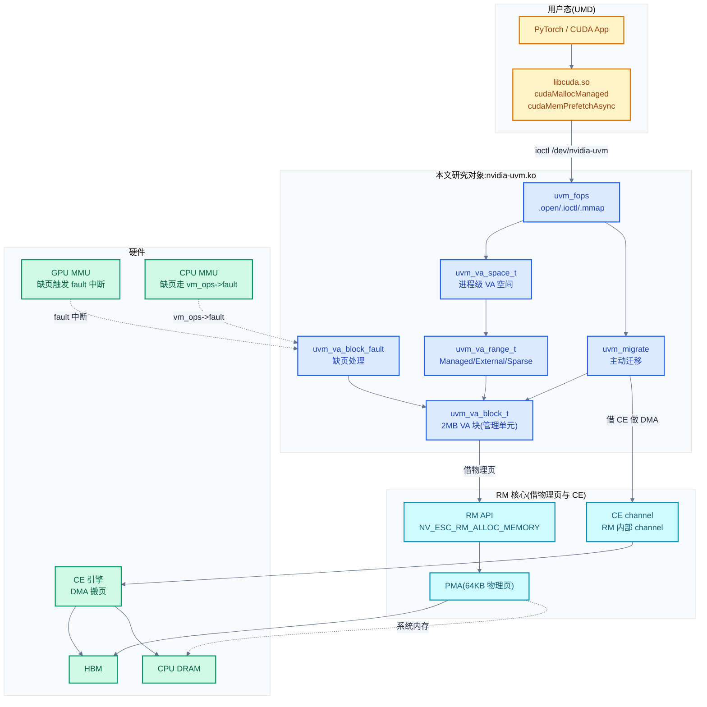
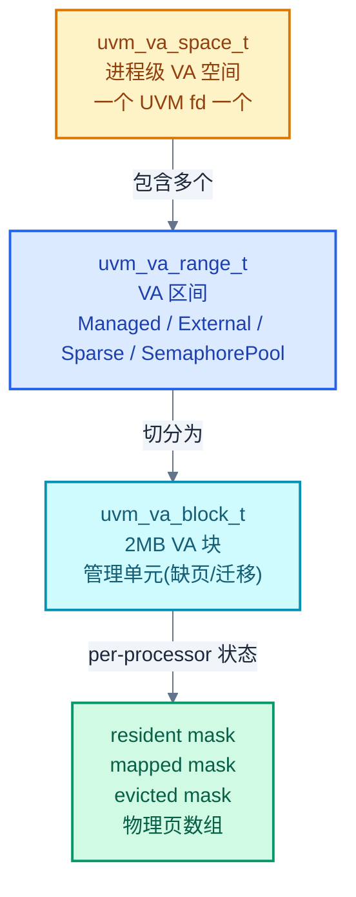
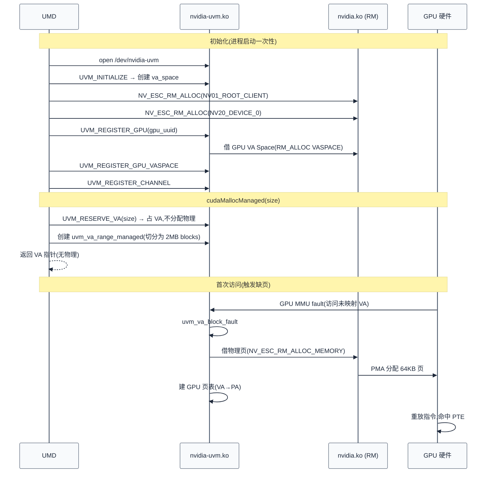

# 统一内存 UVM:按需分页与页面迁移

> 07 讲的 `cuMemAlloc` 是"显式分配"——UMD 调一次 ioctl 拿到一段显存。但有些场景 UMD 不想显式管理:大模型权重大小不确定、CPU-GPU 数据流向动态变化、跨卡迁移频繁。**UVM(Unified Virtual Memory,统一虚拟内存)** 是 NVIDIA 的另一种内存模型——CPU 和 GPU 共享同一虚拟地址空间,缺页时由 KMD 按需分页、按需迁移。本章拆解独立的 `nvidia-uvm.ko` 模块:它如何作为字符设备暴露给 UMD、`uvm_va_space`/`uvm_va_block` 怎么组织共享 VA、GPU MMU 缺页怎么经中断回到 UVM、`UVM_MIGRATE` ioctl 怎么把页面在 CPU/GPU 间搬。
>
> **工程师视角**:理解本章后,你能区分 `cudaMalloc`(走 RM,见 07)与 `cudaMallocManaged`(走 UVM,本章)、能解释 `cudaMemPrefetchAsync` 在内核的落点(`UVM_MIGRATE` ioctl)、能定位 "Managed Memory 慢" 是缺页频繁还是迁移抖动、能理解为什么 `cuCtxSetCurrent` 后 Managed Memory 才真正绑定到 GPU。

### 关键术语

| 缩写 | 全称 | 含义 |
|------|------|------|
| UVM | Unified Virtual Memory | 统一虚拟内存,CPU-GPU 共享 VA、按需分页的内存子系统 |
| UMD | User Mode Driver | 用户态驱动,通过 `/dev/nvidia-uvm` 调用 UVM |
| VA Space | Virtual Address Space | UVM 的 VA 空间对象,一个 UVM fd 对应一个 |
| VA Block | — | UVM 的基本管理单元,2MB 对齐的 VA 区间 |
| VA Range | — | UVM 的 VA 区间对象,Managed/External/Sparse 等 |
| Managed Memory | — | CUDA Managed Memory,`cudaMallocManaged` 分配的内存 |
| Prefetch | — | 预取,`cudaMemPrefetchAsync` 把页面迁到指定处理器 |
| Fault | — | 缺页,处理器访问未映射 VA 时触发的硬件异常 |
| Access Counter | — | GPU 硬件访问计数器,记录 VA 区域的访问热度,用于迁移决策 |
| PMA | Physical Memory Allocator | RM 的物理分配器(见 07),UVM 通过 RM API 借用 |
| CE | Copy Engine | 拷贝引擎,用于页面迁移的 DMA |
| RM | Resource Manager | RM 核心,UVM 通过 RM 控制通道借 CE |
| ATS | Address Translation Services | PCIe 地址翻译服务(本章结尾未覆盖主题) |
| SVA | Shared Virtual Addressing | CPU-GPU 共享 VA 的 PCIe 标准(本章结尾未覆盖) |
| HMM | Heterogeneous Memory Management | Linux 内核的异构内存管理框架,UVM 与之协作 |
| CDMM | Coherent Device Memory Manager | 一致性设备内存管理(自托管 GPU) |
| NUMA | Non-Uniform Memory Access | 非一致性内存访问,自托管 GPU 显存作为 NUMA 节点 |

---

## 1. 概述

### 1.1 前置知识

| 需要了解 | 参考文档 |
|----------|----------|
| RM 内存管理、`cuMemAlloc` 的物理+虚拟分离 | [07-内存管理显存与地址空间](./07-内存管理显存与地址空间.md) |
| 中断 top-half/bottom-half、MMU fault 路径 | [06-中断同步与fence](./06-中断同步与fence.md) |
| channel/GPFIFO 命令提交,UVM 借 CE 做迁移 | [05-命令提交channel与GPFIFO](./05-命令提交channel与GPFIFO.md) |
| RM client/handle 对象模型 | [04-字符设备与ioctl接口](./04-字符设备与ioctl接口.md) |
| Linux mm 子系统(VMA/缺页/migrate_vma) | 内核文档 Documentation/admin-guide/mm/concepts.rst |

### 1.2 系统上下文

> 上一章(07)讲的是"显式分配"——UMD 调 `cuMemAlloc` 一次性拿物理+虚拟,常驻显存。但有些场景不适合显式管理:① 大模型权重在不同 GPU 间切分(TP),用户不想手动 `cudaMemcpy`;② 推理时 KV cache 随上下文增长,VA 范围预分配但物理按需;③ CPU-GPU 数据共享(如 CPU 预处理 → GPU 推理),`cudaMemcpy` 太繁琐。一个自然的问题是:**能不能让 CPU 和 GPU 用同一个虚拟地址,谁访问谁触发分配/迁移,像 Linux 缺页一样自动管理?** 这就是 UVM 的核心目标。

**项目定位**:本章研究的是 **`nvidia-uvm.ko` 独立模块**。在 NVIDIA 的双驱动模型里,RM(见 04-07)管"显式分配",UVM 管"按需分页"——两者是**并行的两套机制**,通过 `VASPACE_FLAGS_IS_EXTERNALLY_OWNED` 衔接(见 07 §5.3):UVM 接管 VASpace 后,RM 不建页表,改由 UVM 建。UVM 是个**完全独立的内核模块**,有自己的字符设备(`/dev/nvidia-uvm`)、自己的 ioctl 体系(`UVM_*` 编号,~50 个)、自己的数据结构(`uvm_va_space`/`uvm_va_block`)、自己的中断处理路径(与 RM 共享 GPU 中断向量,但有独立 top-half 分支,见 06 §3.1)。这种"独立模块"设计让 UVM 可以独立演进(它有自己的 release cadence),且不污染 RM 的核心代码。

**软硬件耦合点**:本章聚焦五个耦合点:① **GPU MMU fault 中断路由**——GPU 访问未映射 VA 时触发 MMU fault 中断,经 06 §3.1 的 `rm_gpu_handle_mmu_faults` 路径,如果该 VA 属于 UVM,转交 UVM 的 fault 处理;② **CPU 缺页路由到 UVM**——CPU 访问 Managed Memory 触发普通 Linux 缺页,VMA 的 `vm_ops->fault` 指向 UVM 的 `uvm_vm_fault`,转交 UVM;③ **物理页借自 RM 的 PMA**——UVM 自己不分物理页,通过 RM API `NV_ESC_RM_ALLOC_MEMORY` 借,迁移时也通过 RM 借 CE channel 做 DMA;④ **Access Counter 硬件**——GPU 硬件记录 VA 区域访问热度,定期中断通知 UVM,UVM 据此做预测性迁移;⑤ **HMM/migrate_vma 集成**——Linux 4.20+ 的 HMM 框架允许设备驱动接管 CPU 缺页,UVM 用 `migrate_vma` 把页面从 CPU 迁到 GPU(或反之)。

**跨实现对比**:与 Linux 的 `migrate_pages`/`migrate_vma` 对比——UVM 自研迁移逻辑而非用内核标准 `migrate_pages`,因为 GPU 是 PCIe 设备,迁移要走 CE DMA 不能用 CPU 拷贝;与 AMD amdgpu 的 HMM 集成对比——amdgpu 重度依赖 Linux HMM 框架(`migrate_vma`/`hmm_range_fault`),NVIDIA 的 UVM 是"半独立"——CPU 侧用 HMM(自托管 GPU),GPU 侧自研(因为 GPU 内部 CE/fault buffer 不在 HMM 抽象内)。详见 §10。



> **如何读这张图**:UVM 是中间的蓝色块,上游接 UMD(黄色),下游接 RM(青色)借物理页和 CE channel,直接对接硬件(绿色)的 MMU/CE/CPU。两条缺页路径:① **GPU 侧**——GPU MMU 访问未映射 VA 触发 fault 中断 → 06 的中断路径 → UVM 的 `uvm_va_block_fault` → 借物理页建映射;② **CPU 侧**——CPU 访问 Managed Memory 触发 Linux 缺页 → VMA 的 `vm_ops->fault` = `uvm_vm_fault` → UVM 处理。主动迁移走 `UVM_MIGRATE` ioctl → 借 CE channel 做 DMA。

> **核心要点**:UVM 是**与 RM 并行的独立子系统**——RM 管"显式分配"(常驻、UMD 主动管理),UVM 管"按需分页"(动态、KMD 自动管理)。两者通过 `VASPACE_FLAGS_IS_EXTERNALLY_OWNED` 切换页表所有权。UVM 不分物理页(借 RM 的 PMA)、不直接驱动硬件(借 RM 的 CE channel),只管"VA→物理映射 + 缺页处理 + 迁移决策"。

---

## 2. UVM 模块入口:字符设备与 fops

### 2.1 nvidia-uvm.ko 的独立定位

`nvidia-uvm.ko` 是**独立内核模块**,与 `nvidia.ko`(RM)平级。模块加载时注册字符设备 `/dev/nvidia-uvm`,有自己的主设备号(动态分配,非 195):

```c
/* 摘自 [kernel-open/nvidia-uvm/uvm.c](./src/open-gpu-kernel-modules/kernel-open/nvidia-uvm/uvm.c) 第 1128-1150 行 */
static int uvm_chardev_create(void)
{
    dev_t uvm_dev;

    int ret = alloc_chrdev_region(&g_uvm_base_dev,
                                  0,
                                  NVIDIA_UVM_NUM_MINOR_DEVICES,
                                  NVIDIA_UVM_DEVICE_NAME);
    if (ret != 0) {
        UVM_ERR_PRINT("alloc_chrdev_region failed: %d\n", ret);
        return ret;
    }
    uvm_dev = MKDEV(MAJOR(g_uvm_base_dev), NVIDIA_UVM_PRIMARY_MINOR_NUMBER);

    uvm_init_character_device(&g_uvm_cdev, &uvm_fops);
    ret = cdev_add(&g_uvm_cdev, uvm_dev, 1);
    if (ret != 0) {
        UVM_ERR_PRINT("cdev_add (major %u, minor %u) failed: %d\n", MAJOR(uvm_dev), MINOR(uvm_dev), ret);
        unregister_chrdev_region(g_uvm_base_dev, NVIDIA_UVM_NUM_MINOR_DEVICES);
        return ret;
    }

    return 0;
}
```

解释:这段体现了 UVM 模块化的设计——① **动态主设备号**(`alloc_chrdev_region`),不固定 195,因为 195 给了 `nvidia.ko`;② **独立 cdev**(`g_uvm_cdev`),有自己的 `file_operations`(`uvm_fops`);③ **独立 minor 区域**(`NVIDIA_UVM_NUM_MINOR_DEVICES`),通常只用主 minor(`/dev/nvidia-uvm`)。这种"完全独立字符设备"让 UVM 可以单独 insmod/rmmod(实践中要后于 nvidia.ko 加载、先于 nvidia.ko 卸载,因为 UVM 依赖 RM 的 API)。

### 2.2 uvm_fops:与 nvidia_fops 的对比

UVM 的 `file_operations` 结构非常精简,只有 4 个回调:

```c
/* 摘自 [kernel-open/nvidia-uvm/uvm.c](./src/open-gpu-kernel-modules/kernel-open/nvidia-uvm/uvm.c) 第 1070-1080 行 */
static const struct file_operations uvm_fops =
{
    .open            = uvm_open_entry,
    .release         = uvm_release_entry,
    .mmap            = uvm_mmap_entry,
    .unlocked_ioctl  = uvm_unlocked_ioctl_entry,
#if NVCPU_IS_X86_64
    .compat_ioctl    = uvm_unlocked_ioctl_entry,
#endif
    .owner           = THIS_MODULE,
};
```

与 `nvidia_fops`(见 04 §3.1)对比:

| 对比维度 | `nvidia_fops` | `uvm_fops` |
|----------|---------------|------------|
| **设备** | `/dev/nvidia0`、`/dev/nvidiactl` | `/dev/nvidia-uvm` |
| **回调数** | 5(open/ioctl/mmap/poll/release) | 4(open/ioctl/mmap/release,无 poll) |
| **open 职责** | 找设备状态、初始化 RM 文件私有数据 | 仅分配 `address_space`(隔离映射) |
| **ioctl 分发** | 三层(OS 层 + OSAL + RM 核心) | 一层(直接 switch 到 `uvm_api_*`) |
| **mmap 用途** | 映射已分配显存到用户态 | 映射 Managed Memory 到用户态(CPU 可见) |
| **poll** | 等待 event | 无(用 ioctl 阻塞等) |

> **为什么 UVM 没有 poll?** 因为 UVM 的事件通知机制不同——RM 用 event + notifier(见 06),UVM 用 ioctl 阻塞等待(`UVM_MIGRATE` 的同步模式直接 ioctl 返回时即完成)。UVM 不需要 poll,因为它的"事件"主要是缺页(内核自动处理)和迁移完成(同步 ioctl 等待)。

### 2.3 uvm_open:address_space 隔离

`uvm_open` 的核心任务是**为每个 fd 创建独立的 `address_space`**:

```c
/* 摘自 [kernel-open/nvidia-uvm/uvm.c](./src/open-gpu-kernel-modules/kernel-open/nvidia-uvm/uvm.c) 第 144-179 行 */
static int uvm_open(struct inode *inode, struct file *filp)
{
    struct address_space *mapping;
    NV_STATUS status = uvm_global_get_status();

    if (status != NV_OK)
        return -nv_status_to_errno(status);

    mapping = uvm_kvmalloc(sizeof(*mapping));
    if (!mapping)
        return -ENOMEM;

    // By default all struct files on the same inode share the same
    // address_space structure (the inode's) across all processes. This means
    // unmap_mapping_range would unmap virtual mappings across all processes on
    // that inode.
    //
    // Since the UVM driver uses the mapping offset as the VA of the file's
    // process, we need to isolate the mappings to each process.
    address_space_init_once(mapping);
    mapping->host = inode;

    // Some paths in the kernel ... check the function pointers within
    // file->f_mapping->a_ops for validity. ... Handle that by using the
    // inode's a_ops pointer, which is what f_mapping->a_ops would point to
    // anyway if we weren't re-assigning f_mapping.
    mapping->a_ops = inode->i_mapping->a_ops;

    filp->private_data = NULL;
    filp->f_mapping = mapping;

    return NV_OK;
}
```

解释:这段代码体现了一个**关键设计决策**——为每个 fd 创建独立 `address_space`,而不是用 inode 共享的默认 `address_space`。原因:Linux 默认所有打开同一 inode 的 `struct file` 共享 `address_space`,这意味着 `unmap_mapping_range`(用于失效 CPU 映射)会跨所有进程。但 UVM 用 mmap 的 offset 作为 VA,**VA 是进程私有的**——进程 A 的 VA 0x1000 和进程 B 的 VA 0x1000 是不同内存,不能共享 `address_space`。所以 UVM 给每个 fd 独立 `address_space`,让 `unmap_mapping_range` 只影响当前进程。

这是 UVM 与标准字符设备的关键差异——它**深度介入 Linux mm 子系统**,需要处理 VMA、缺页、映射失效等通常只有文件系统和 shm 才处理的事务。

### 2.4 fd 类型:VA_SPACE / MM / TEST

UVM 的 fd 有多种"类型",由 `uvm_fd_type` 标识:

| fd 类型 | 创建方式 | 用途 |
|---------|----------|------|
| `UVM_FD_UNINITIALIZED` | `open` 后默认 | 尚未初始化,等待 `UVM_INITIALIZE` |
| `UVM_FD_VA_SPACE` | `UVM_INITIALIZE` 后 | 主 fd,承载 `uvm_va_space_t` |
| `UVM_FD_MM` | `UVM_MM_INITIALIZE` 后 | 辅助 fd,关联到某进程的 `mm_struct` |
| `UVM_FD_TEST` | test ioctl | 测试用,本专题跳过 |

`UVM_FD_VA_SPACE` 是主类型,一个进程通常只有一个。`UVM_FD_MM` 用于多进程共享场景——子进程 fork 后,父子的 VA Space 共享但 `mm` 不同,需要为每个 `mm` 单独建 fd。

`uvm_release` 按 fd 类型分发清理:

```c
/* 摘自 [kernel-open/nvidia-uvm/uvm.c](./src/open-gpu-kernel-modules/kernel-open/nvidia-uvm/uvm.c) 第 250-277 行 */
static int uvm_release(struct inode *inode, struct file *filp)
{
    void *ptr;
    uvm_fd_type_t fd_type = uvm_fd_type(filp, &ptr);

    switch (fd_type) {
        case UVM_FD_UNINITIALIZED:
            uvm_kvfree(filp->f_mapping);
            break;

        case UVM_FD_VA_SPACE:
            uvm_release_va_space(filp, (uvm_va_space_t *)ptr);
            break;

        case UVM_FD_MM:
            uvm_release_mm(filp, (struct file *)ptr);
            break;

        case UVM_FD_TEST:
            uvm_test_file_release(filp, (uvm_test_file_t *)ptr);
            break;

        default:
            UVM_ASSERT_MSG(0, "Unexpected fd type: %d\n", fd_type);
    }

    return 0;
}
```

注意 `uvm_release_va_space` 有**延迟释放机制**——如果 `pm.lock`(电源管理锁)拿不到(系统正在 suspend),把 va_space 的销毁推迟到 `deferred_release_q` 队列,避免 release 阻塞 suspend。这是 UVM 对电源管理的细致处理。

> **核心要点**:UVM 是**独立字符设备 + 独立 fops**——4 个回调(open/ioctl/mmap/release),无 poll。`uvm_open` 为每个 fd 创建独立 `address_space`(因为 VA 是进程私有的,不能共享 inode 的 mapping)。fd 有 4 种类型(VA_SPACE/MM/TEST/UNINITIALIZED),通过 `UVM_INITIALIZE`/`UVM_MM_INITIALIZE` ioctl 切换。

---

## 3. UVM ioctl 体系

### 3.1 ioctl 分发:扁平 switch

UVM 的 ioctl 分发是**扁平 switch**(对比 RM 的三层漏斗,见 04 §4),所有 `UVM_*` 命令在一个 switch 内分发:

```c
/* 摘自 [kernel-open/nvidia-uvm/uvm.c](./src/open-gpu-kernel-modules/kernel-open/nvidia-uvm/uvm.c) 第 997-1047 行 */
static long uvm_ioctl(struct file *filp, unsigned int cmd, unsigned long arg)
{
    switch (cmd)
    {
        case UVM_DEINITIALIZE:
            return 0;

        UVM_ROUTE_CMD_STACK_NO_INIT_CHECK(UVM_INITIALIZE,                  uvm_api_initialize);
        UVM_ROUTE_CMD_STACK_NO_INIT_CHECK(UVM_MM_INITIALIZE,               uvm_api_mm_initialize);

        UVM_ROUTE_CMD_STACK_INIT_CHECK(UVM_PAGEABLE_MEM_ACCESS,            uvm_api_pageable_mem_access);
        UVM_ROUTE_CMD_STACK_INIT_CHECK(UVM_PAGEABLE_MEM_ACCESS_ON_GPU,     uvm_api_pageable_mem_access_on_gpu);
        UVM_ROUTE_CMD_STACK_INIT_CHECK(UVM_REGISTER_GPU,                   uvm_api_register_gpu);
        UVM_ROUTE_CMD_STACK_INIT_CHECK(UVM_UNREGISTER_GPU,                 uvm_api_unregister_gpu);
        UVM_ROUTE_CMD_STACK_INIT_CHECK(UVM_ENABLE_PEER_ACCESS,             uvm_api_enable_peer_access);
        UVM_ROUTE_CMD_STACK_INIT_CHECK(UVM_DISABLE_PEER_ACCESS,            uvm_api_disable_peer_access);
        UVM_ROUTE_CMD_STACK_INIT_CHECK(UVM_CREATE_EXTERNAL_RANGE,          uvm_api_create_external_range);
        UVM_ROUTE_CMD_ALLOC_INIT_CHECK(UVM_MAP_EXTERNAL_ALLOCATION,        uvm_api_map_external_allocation);
        UVM_ROUTE_CMD_STACK_INIT_CHECK(UVM_MAP_EXTERNAL_SPARSE,            uvm_api_map_external_sparse);
        UVM_ROUTE_CMD_STACK_INIT_CHECK(UVM_FREE,                           uvm_api_free);
        UVM_ROUTE_CMD_STACK_INIT_CHECK(UVM_DISCARD,                        uvm_api_discard);
        UVM_ROUTE_CMD_STACK_INIT_CHECK(UVM_SET_PREFERRED_LOCATION,         uvm_api_set_preferred_location);
        UVM_ROUTE_CMD_STACK_INIT_CHECK(UVM_UNSET_PREFERRED_LOCATION,       uvm_api_unset_preferred_location);
        UVM_ROUTE_CMD_STACK_INIT_CHECK(UVM_SET_ACCESSED_BY,                uvm_api_set_accessed_by);
        UVM_ROUTE_CMD_STACK_INIT_CHECK(UVM_UNSET_ACCESSED_BY,              uvm_api_unset_accessed_by);
        UVM_ROUTE_CMD_STACK_INIT_CHECK(UVM_REGISTER_GPU_VASPACE,           uvm_api_register_gpu_va_space);
        UVM_ROUTE_CMD_STACK_INIT_CHECK(UVM_UNREGISTER_GPU_VASPACE,         uvm_api_unregister_gpu_va_space);
        UVM_ROUTE_CMD_STACK_INIT_CHECK(UVM_REGISTER_CHANNEL,               uvm_api_register_channel);
        UVM_ROUTE_CMD_STACK_INIT_CHECK(UVM_UNREGISTER_CHANNEL,             uvm_api_unregister_channel);
        UVM_ROUTE_CMD_STACK_INIT_CHECK(UVM_ENABLE_READ_DUPLICATION,        uvm_api_enable_read_duplication);
        UVM_ROUTE_CMD_STACK_INIT_CHECK(UVM_DISABLE_READ_DUPLICATION,       uvm_api_disable_read_duplication);
        UVM_ROUTE_CMD_STACK_INIT_CHECK(UVM_MIGRATE,                        uvm_api_migrate);
        /* ... 其余 ~20 个 ... */
        UVM_ROUTE_CMD_STACK_INIT_CHECK(UVM_QUERY_RESIDENCY,                uvm_api_query_residency);
    }

    // Try the test ioctls if none of the above matched
    return uvm_test_ioctl(filp, cmd, arg);
}
```

解释:`UVM_ROUTE_CMD_*` 是宏,展开后做三件事:① 检查 fd 是否已初始化(`INIT_CHECK` vs `NO_INIT_CHECK`);② 在内核栈或堆栈上分配 thread context(`STACK` vs `ALLOC`);③ 调用对应的 `uvm_api_*` 函数。这种"宏 + 扁平 switch"的设计让新增 ioctl 极简——加一行 `UVM_ROUTE_CMD_*(UVM_NEW_CMD, uvm_api_new)` 即可。

外层 `uvm_unlocked_ioctl` 加 PM 读锁:

```c
/* 摘自 [kernel-open/nvidia-uvm/uvm.c](./src/open-gpu-kernel-modules/kernel-open/nvidia-uvm/uvm.c) 第 1049-1063 行 */
static long uvm_unlocked_ioctl(struct file *filp, unsigned int cmd, unsigned long arg)
{
    long ret;

    if (!uvm_down_read_trylock(&g_uvm_global.pm.lock))
        return -EAGAIN;

    ret = uvm_ioctl(filp, cmd, arg);

    uvm_up_read(&g_uvm_global.pm.lock);

    uvm_thread_assert_all_unlocked();

    return ret;
}
```

PM 锁是**读锁**——多个 ioctl 可并发(读共享),但系统 suspend 时拿写锁,所有 ioctl 阻塞或返回 `-EAGAIN`。这是 UVM 的电源管理同步点。

### 3.2 UVM_* ioctl 编号体系

UVM ioctl 编号定义在 [uvm_ioctl.h](./src/open-gpu-kernel-modules/kernel-open/nvidia-uvm/uvm_ioctl.h),用 `UVM_IOCTL_BASE(i)` 宏(在 Linux 上等于 `i`):

```c
/* 摘自 [kernel-open/nvidia-uvm/uvm_ioctl.h](./src/open-gpu-kernel-modules/kernel-open/nvidia-uvm/uvm_ioctl.h) 第 37-53 行 */
#if defined(WIN32) || defined(WIN64)
#   define UVM_IOCTL_BASE(i)       CTL_CODE(FILE_DEVICE_UNKNOWN, 0x800+i, METHOD_BUFFERED, FILE_READ_DATA | FILE_WRITE_DATA)
#else
#   define UVM_IOCTL_BASE(i) i
#endif

//
// UvmReserveVa
//
#define UVM_RESERVE_VA                                                UVM_IOCTL_BASE(1)

typedef struct
{
    NvU64     requestedBase NV_ALIGN_BYTES(8); // IN
    NvU64     length        NV_ALIGN_BYTES(8); // IN
    NV_STATUS rmStatus;                        // OUT
} UVM_RESERVE_VA_PARAMS;
```

关键设计:**Windows 用 `CTL_CODE` 宏编码(Linux 上等价于 `i`)**,这让 UVM ioctl 编号在 Windows 和 Linux 上保持一致——UMD(libcuda.so / nvcuda.dll)用同一套编号,只是传输不同。这与 RM 的 `NV_ESC_RM_*`(见 04 §5)如出一辙,体现 NVIDIA 跨 OS 复用的设计哲学。

### 3.3 UVM ioctl 速查表

推理场景常见的 UVM ioctl(按用途分组):

| 分组 | ioctl | 编号 | 作用 | 对应 CUDA API |
|------|-------|:----:|------|---------------|
| **初始化** | `UVM_INITIALIZE` | `0x30000001`(Linux 特有 `_IO` 编码) | 创建 `uvm_va_space_t` | `cuMemAllocManaged` 首次调用 |
| | `UVM_MM_INITIALIZE` | 75 | 关联 mm(多进程) | fork 后 |
| **GPU 注册** | `UVM_REGISTER_GPU` | 37 | 把 GPU 加入 VA Space | `cuCtxSetCurrent` |
| | `UVM_REGISTER_GPU_VASPACE` | 25 | 注册 GPU VASpace(从 RM 借) | 内部 |
| | `UVM_REGISTER_CHANNEL` | 27 | 注册 channel(用于 fault 追踪) | 内部 |
| **分配** | `UVM_CREATE_EXTERNAL_RANGE` | 73 | 占 VA(不分配物理) | `cuMemAddressReserve` |
| | `UVM_MAP_EXTERNAL_ALLOCATION` | 33 | 把 RM 分配的物理映射到 VA | `cuMemMap` |
| | `UVM_FREE` | 34 | 释放 VA 区间 | `cuMemFree` |
| **策略** | `UVM_SET_PREFERRED_LOCATION` | 42 | 设置首选位置(CPU/GPU) | `cudaMemAdvise` |
| | `UVM_SET_ACCESSED_BY` | 46 | 设置访问者列表 | `cudaMemAdvise` |
| | `UVM_ENABLE_READ_DUPLICATION` | 44 | 启用读复制 | `cudaMemAdvise` |
| **迁移** | `UVM_MIGRATE` | 51 | 主动迁移 | `cudaMemPrefetchAsync` |
| | `UVM_QUERY_RESIDENCY` | 81 | 查询页面驻留位置 | `cudaMemRangeGetAttribute` |
| **多卡** | `UVM_ENABLE_PEER_ACCESS` | 29 | 启用 GPU 间 P2P(见 [10](./10-多卡P2P-UVM-peer-mapping.md)) | `cudaDeviceEnablePeerAccess` |
| | `UVM_ALLOC_DEVICE_P2P` | 78 | 分配 P2P 内存 | 内部 |

> **如何读这张表**:推理热路径上的 UVM ioctl 主要是 `UVM_MIGRATE`(`cudaMemPrefetchAsync` 落点)和 `UVM_SET_PREFERRED_LOCATION`(`cudaMemAdvise` 落点)。`UVM_INITIALIZE` 是一次性初始化,`UVM_REGISTER_GPU` 在 `cuCtxSetCurrent` 时调用。`strace` 一个用 Managed Memory 的推理进程,你会看到大量 `UVM_MIGRATE`(prefetch)和偶尔的 `UVM_SET_PREFERRED_LOCATION`。

### 3.4 UVM_INITIALIZE:va_space 创建

`UVM_INITIALIZE` 是 UVM 的第一个 ioctl,创建 `uvm_va_space_t`:

```c
/* 摘自 [kernel-open/nvidia-uvm/uvm.c](./src/open-gpu-kernel-modules/kernel-open/nvidia-uvm/uvm.c) 第 927-987 行 */
static NV_STATUS uvm_api_initialize(UVM_INITIALIZE_PARAMS *params, struct file *filp)
{
    uvm_va_space_t *va_space;
    NV_STATUS status;
    uvm_fd_type_t old_fd_type;

    // Normally we expect private_data == UVM_FD_UNINITIALIZED. However multiple
    // threads may call this ioctl concurrently so we have to be careful to
    // avoid initializing multiple va_spaces and/or leaking memory. To do this
    // we do an atomic compare and swap. Only one thread will observe
    // UVM_FD_UNINITIALIZED and that thread will allocate and setup the
    // va_space.
    //
    // Other threads will either see UVM_FD_INITIALIZING or UVM_FD_VA_SPACE. In
    // the case of UVM_FD_VA_SPACE we return success if and only if the
    // initialization flags match. If another thread is still initializing the
    // va_space we return NV_ERR_BUSY_RETRY.
    old_fd_type = uvm_fd_type_init_cas(filp);
    switch (old_fd_type) {
        case UVM_FD_UNINITIALIZED:
            status = uvm_va_space_create(filp->f_mapping, &va_space, params->flags);
            if (status != NV_OK) {
                uvm_fd_type_set(filp, UVM_FD_UNINITIALIZED, NULL);
                return status;
            }

            uvm_fd_type_set(filp, UVM_FD_VA_SPACE, va_space);
            break;

        case UVM_FD_VA_SPACE:
            va_space = uvm_va_space_get(filp);
            if (params->flags != va_space->initialization_flags)
                status = NV_ERR_INVALID_ARGUMENT;
            else
                status = NV_OK;

            break;

        case UVM_FD_INITIALIZING:
            status = NV_ERR_BUSY_RETRY;
            break;
        /* ... */
    }

    return status;
}
```

这段代码体现了**多线程初始化的精细处理**——UMD 可能多线程同时调 `UVM_INITIALIZE`,UVM 用原子 CAS(`uvm_fd_type_init_cas`)保证只有一个线程真正创建 va_space,其他线程要么看到 `UVM_FD_INITIALIZING` 返回 `NV_ERR_BUSY_RETRY`(让 UMD 重试),要么看到 `UVM_FD_VA_SPACE` 直接返回成功(若 flags 匹配)。这是无锁初始化的典型模式,避免大锁阻塞并发。

> **核心要点**:UVM ioctl 是**扁平 switch + 宏路由**——~50 个 `UVM_*` 命令在一个 switch 内分发到 `uvm_api_*` 函数,外层加 PM 读锁。编号在 Linux/Windows 上一致(`UVM_IOCTL_BASE(i)` 宏)。`UVM_INITIALIZE` 用原子 CAS 处理多线程并发初始化,创建 `uvm_va_space_t`。

---

## 4. 核心数据结构:va_space / va_block / va_range

### 4.1 三层结构总览

UVM 用三层结构组织 VA 空间:



> **如何读这张图**:VA 空间从上到下三层——`va_space`(进程级)包含多个 `va_range`(区间,类型决定语义),每个 range 切分为若干 `va_block`(2MB 块,缺页/迁移的基本单元)。每个 block 维护 per-processor 状态(resident/mapped/evicted 位图 + 物理页数组)。

### 4.2 uvm_va_space_t:进程级 VA 空间

`uvm_va_space_t` 是 UVM 的顶层对象,一个 UVM fd 对应一个。它的字段非常多(900+ 行头文件),核心字段分几类:

```c
/* 摘自 [kernel-open/nvidia-uvm/uvm_va_space.h](./src/open-gpu-kernel-modules/kernel-open/nvidia-uvm/uvm_va_space.h) 第 232-320 行(节选) */
    // Interpreting these processor masks:
    //      uvm_processor_mask_test(foo[A], B)
    // ...should be read as "test if A foo B." For example:
    //      uvm_processor_mask_test(accessible_from[B], A)
    // means "test if B is accessible_from A."

    // Pre-computed masks that contain, for each processor, a mask of processors
    // which that processor can directly access. In other words, this will test
    // whether A has direct access to B:
    //      uvm_processor_mask_test(can_access[A], B)
    uvm_processor_mask_t can_access[UVM_ID_MAX_PROCESSORS];

    // Pre-computed masks that contain, for each processor memory, a mask with
    // the processors that have direct access enabled to its memory. This is the
    // opposite direction as can_access.
    uvm_processor_mask_t accessible_from[UVM_ID_MAX_PROCESSORS];

    // Pre-computed masks that contain, for each processor memory, a mask with
    // the processors that can directly copy to and from its memory, using the
    // Copy Engine. These masks are usually the same as accessible_from masks.
    uvm_processor_mask_t can_copy_from[UVM_ID_MAX_PROCESSORS];

    // Pre-computed masks that contain, for each processor, a mask of processors
    // to which that processor has NVLINK or C2C access.
    uvm_processor_mask_t has_fast_link[UVM_ID_MAX_PROCESSORS];

    // Pre-computed masks that contain, for each processor memory, a mask with
    // the processors that have direct access to its memory and native support
    // for atomics in HW. This is a subset of accessible_from.
    uvm_processor_mask_t has_native_atomics[UVM_ID_MAX_PROCESSORS];

    // Mask of gpu_va_spaces registered with the va space
    uvm_processor_mask_t registered_gpu_va_spaces;

    /* ... */

    // Array of GPU VA spaces
    uvm_gpu_va_space_t *gpu_va_spaces[UVM_ID_MAX_GPUS];
```

解释:这段体现了 UVM 的**拓扑感知设计**——`uvm_va_space_t` 维护多组**预计算的处理器掩码**:

- `can_access[A]`:处理器 A 能直接访问哪些处理器的内存(决定 P2P 路径)
- `accessible_from[B]`:哪些处理器能访问 B 的内存(反向)
- `can_copy_from`:能用 CE 拷贝的(通常与 accessible_from 相同)
- `has_fast_link`:有 NVLink/C2C 连接的(决定迁移速度)
- `has_native_atomics`:硬件原子支持的(决定同步原语选择)

这些掩码在 `UVM_REGISTER_GPU` / `UVM_ENABLE_PEER_ACCESS` 时预计算,后续缺页/迁移决策时 O(1) 查表,避免每次都遍历拓扑。这是 UVM 性能的关键——**拓扑信息前置**。

`gpu_va_spaces[]` 数组持有每个注册到本 VA Space 的 GPU VA Space(从 RM 借的 `FERMI_VASPACE_A`),UVM 通过它操作 GPU 页表。

### 4.3 锁层级:多锁协同

UVM 的锁体系复杂(注释里反复强调 lock ordering),核心是 `va_space->lock`(rwsem):

```c
/* 摘自 [kernel-open/nvidia-uvm/uvm_va_space.h](./src/open-gpu-kernel-modules/kernel-open/nvidia-uvm/uvm_va_space.h) 第 442-489 行 */
#define uvm_va_space_down_write(__va_space)                             \
    do {                                                                \
        uvm_mutex_lock(&(__va_space)->serialize_writers_lock);          \
        uvm_mutex_lock(&(__va_space)->read_acquire_write_release_lock); \
        uvm_down_write(&(__va_space)->lock);                            \
    } while (0)

#define uvm_va_space_up_write(__va_space)                                   \
    do {                                                                    \
        uvm_up_write(&(__va_space)->lock);                                  \
        uvm_mutex_unlock(&(__va_space)->read_acquire_write_release_lock);   \
        uvm_mutex_unlock(&(__va_space)->serialize_writers_lock);            \
    } while (0)

#define uvm_va_space_down_read(__va_space)                                              \
    do {                                                                                \
        uvm_mutex_lock(&(__va_space)->read_acquire_write_release_lock);                 \
        uvm_down_read(&(__va_space)->lock);                                             \
        uvm_mutex_unlock_out_of_order(&(__va_space)->read_acquire_write_release_lock);  \
    } while (0)
```

解释:写锁要拿**三把**——`serialize_writers_lock`(串行化写者)+ `read_acquire_write_release_lock`(读-写同步)+ `lock`(主 rwsem)。这种"三锁组合"是为了解决一个微妙的死锁:单纯 rwsem 在写者降级为读者时可能与新读者竞争,导致死锁。三锁的设计保证:① 写者串行(一次只有一个写者);② 写者降级时不会与新读者冲突;③ 读者快速路径只拿主 rwsem(读锁不用 mutex,性能好)。

UVM 的锁体系是它最复杂的部分(头文件注释几百行讲锁顺序),本节只点到为止——理解"UVM 用精细的锁层级支持高并发缺页处理"即可。

### 4.4 uvm_va_block_t:2MB 管理单元

`uvm_va_block_t` 是 UVM 的**核心管理单元**,固定 2MB 对齐(`UVM_VA_BLOCK_SIZE = 2MB`)。所有缺页、迁移、 residency 追踪都以 block 为单位:

```c
/* 摘自 [kernel-open/nvidia-uvm/uvm_va_block.h](./src/open-gpu-kernel-modules/kernel-open/nvidia-uvm/uvm_va_block.h) 第 268-345 行(节选) */
struct uvm_va_block_struct
{
    // Reference count for this block.
    nv_kref_t kref;

    // Lock protecting the block.
    uvm_mutex_t lock;

    // Parent managed range. Managed blocks have this set. HMM blocks will have
    // managed_range set to NULL and hmm.va_space set instead.
    uvm_va_range_managed_t *managed_range;

    // Virtual address [start, end] covered by this block.
    NvU64 start;
    NvU64 end;

    // Per-processor residency bit vector, used for fast lookup of which
    // processors are active in this block.
    //
    // A set bit means the corresponding processor has a coherent physical copy
    // of memory somewhere in the block.
    uvm_processor_mask_t resident;

    // Page mask tracking the set of block pages which have been discarded.
    uvm_page_mask_t discarded_pages;

    // The set of processors on which the VA block has ever been fully
    // resident. This is used when determining whether GPU chunks need to zeroed.
    uvm_processor_mask_t ever_fully_resident;

    // Per-processor mapping bit vector.
    //
    // A set bit means the corresponding processor has an active, valid page
    // table mapping to some VA in this block.
    uvm_processor_mask_t mapped;

    // Per-processor evicted bit vector.
    //
    // A set bit means the corresponding processor was the residency of some of
    // the pages in the block when they were evicted due to memory capacity
    // limitations.
    uvm_processor_mask_t evicted_gpus;

    /* ... per-processor 物理页数组、CPU NUMA 状态、PTE bits 等 ... */
};
```

逐字段解释:

- `kref` + `lock`:引用计数 + 自带锁。block 可能在多个路径同时被访问(缺页、迁移、eviction),用 kref 管理生命周期
- `managed_range`:父区间,指向 `uvm_va_range_managed_t`(Managed Memory 的 range)。HMM 块此字段为 NULL,改用 `hmm.va_space`
- `start` / `end`:VA 范围,2MB 对齐(`UVM_VA_BLOCK_SIZE = 2MB`)
- `resident`:**驻留掩码**——哪些处理器有这个 block 的物理副本。这是 UVM 的核心状态,决定缺页时是否要迁移
- `mapped`:**映射掩码**——哪些处理器有有效页表映射。与 `resident` 区别:有物理副本不一定有映射(可能被 unmap 但物理页还在)
- `evicted_gpus`:**被驱逐掩码**——哪些 GPU 的页面因显存不足被驱逐到 CPU。驱逐不同于释放,物理页还在(在 CPU),可按需迁回
- `discarded_pages`:**已丢弃页**——显式 discard 的页,下次访问要重新分配(无物理副本)

> **为什么 block 大小是 2MB?** 这是性能与开销的权衡:① 太小(如 4KB)——block 数量爆炸(80GB 显存 = 20M 个 block),元数据开销巨大;② 太大(如 64MB)——缺页时迁移整个 block,浪费带宽(实际可能只访问几 KB)。2MB 与 Linux huge page、GPU GMMU 大页对齐,是个甜点。每个 block 元数据约 1-2KB,80GB 显存约 4 万个 block,元数据共 ~40MB(可接受)。

### 4.5 uvm_va_range_t:VA 区间类型

`uvm_va_range_t` 是 VA 区间对象,有多种类型:

| 类型 | 创建方式 | 物理分配 | 用途 | 对应 CUDA API |
|------|----------|----------|------|---------------|
| **Managed** | `cudaMallocManaged` | UVM 按需(借 PMA) | CUDA Managed Memory | `cudaMallocManaged` |
| **External** | `UVM_MAP_EXTERNAL_ALLOCATION` | RM 预分配(借物理) | 把 RM 分配的内存纳入 UVM VA | `cuMemMap` + Managed |
| **Sparse** | `UVM_MAP_EXTERNAL_SPARSE` | 按需(部分页) | 稀疏映射 | `cuMemMap` sparse |
| **SemaphorePool** | `UVM_ALLOC_SEMAPHORE_POOL` | UVM 分配 | 跨进程同步原语 | `cuMemAllocHost` semaphore |
| **HMM** | Linux HMM 自动 | Linux mm + UVM | CPU 内存纳入 UVM 管理 | 自动 |

推理场景最常用的是 **Managed**(`cudaMallocManaged`)和 **External**(把 RM 分配的 weights 纳入 UVM 管理,实现跨 GPU 自动迁移)。

> **核心要点**:UVM 三层结构——`va_space`(进程级,持拓扑掩码与 GPU VA Spaces)→ `va_range`(区间,决定分配语义)→ `va_block`(2MB 块,缺页/迁移单元)。block 的 `resident`/`mapped`/`evicted` 掩码是 UVM 状态机的核心。锁体系复杂(三锁协同支持高并发),2MB block 大小是性能/开销权衡的甜点。

---

## 5. 缺页处理:GPU 与 CPU 双路径

### 5.1 两条缺页路径

UVM 的缺页处理有两条路径,分别对应 GPU 和 CPU:

| 路径 | 触发 | 入口 | 处理 |
|------|------|------|------|
| **GPU fault** | GPU MMU 访问未映射 VA | 06 §3.1 的 `rm_gpu_handle_mmu_faults` → UVM fault 处理 | 借物理页、建 GPU 页表 |
| **CPU fault** | CPU 访问 Managed Memory | Linux 缺页 → VMA `vm_ops->fault` = `uvm_vm_fault` | 借物理页、建 CPU 页表 |

两条路径最终都调 `uvm_va_block_fault`(在 `uvm_va_block.c`),但入口和上下文不同。

### 5.2 GPU fault 路径:中断驱动

GPU fault 路径的关键已在 06 §3.1 讲过——`nvidia_isr` 调 `rm_gpu_handle_mmu_faults` 取走可服务 fault,然后 UVM 的中断处理函数处理。具体流程:

1. **GPU MMU 触发 fault**:SM 访问 VA `0x1234` 没有有效 PTE,MMU 硬件写 fault buffer(一块 RM 预分配的内存)
2. **fault buffer 满或定时器到**:触发 MSI 中断
3. **`nvidia_isr` top-half**:`rm_gpu_handle_mmu_faults` 读 fault buffer,把 fault 信息(地址、引擎、访问类型)转入 UVM 队列
4. **UVM bottom-half**:调度 `uvm_va_block_fault` 处理每个 fault
5. **fault 处理**:查 `va_space` 找到 VA 对应的 `va_block`,检查 `resident` 掩码——若某处理器已有物理副本,迁移过来;否则分配新物理页
6. **建映射**:通过 `uvm_gpu_va_space_t` 操作 GPU 页表,建立 VA→PA 映射
7. **重放指令**:GPU 硬件重放 fault 指令,这次命中 PTE,继续执行

fault buffer 是关键数据结构——GPU 硬件把每个 fault 信息(8-16 字节,含 VA、引擎、访问类型、时间戳)写入 buffer,KMD 批量读取。这避免了"一个 fault 一个中断"的开销。

### 5.3 CPU fault 路径:vm_ops->fault

CPU 侧访问 Managed Memory 触发普通 Linux 缺页。UVM 在 mmap 时设置 VMA 的 `vm_ops`:

```c
/* uvm_mmap 设置 vm_ops,触发时调 uvm_vm_fault */
/* 摘自 [kernel-open/nvidia-uvm/uvm.c](./src/open-gpu-kernel-modules/kernel-open/nvidia-uvm/uvm.c) 第 759-820 行(简化) */
static int uvm_mmap(struct file *filp, struct vm_area_struct *vma)
{
    uvm_va_space_t *va_space = uvm_va_space_get(filp);
    /* ... 检查 va_space 初始化、对齐 ... */

    // Replace the vma->vm_ops with our own. This is required for:
    //  - Implementing vm_ops->fault for CPU fault handling
    //  - Tracking open/close to manage va_block refcounts
    vma->vm_ops = &uvm_vm_ops_managed;
    /* ... */
}
```

CPU 缺页时,Linux mm 子系统调 `vma->vm_ops->fault`(`uvm_vm_fault` 定义在 `uvm.c:558`),UVM 在那里调 `uvm_va_space_cpu_fault_managed`(`uvm_va_space.c:2662`)→ `uvm_va_block_cpu_fault`(`uvm_va_block.c:12424`)。与 GPU 路径的区别:① CPU fault 是同步的(当前进程陷入缺页,处理完继续);② CPU 页表用 Linux mm 子系统的接口(`vm_insert_page` 等),不走 GMMU;③ CPU 物理页用 `alloc_pages_node`(走 Linux buddy),不走 PMA。

### 5.4 uvm_va_block_cpu_fault 的核心逻辑

无论 GPU 还是 CPU 缺页,最终都在 `uvm_va_block` 层处理——CPU 侧调 `uvm_va_block_cpu_fault`(`uvm_va_block.c:12424`),GPU 侧经 `uvm_gpu_replayable_faults.c` 的 `service_fault_batch_*` 系列函数最终也调到 `uvm_va_block` 的 fault 处理(13000+ 行的核心逻辑,本节给概念不贴代码):

1. **定位 block**:用 VA 查 `va_space` 的 range tree,找到包含该 VA 的 `va_block`
2. **加 block 锁**:`uvm_mutex_lock(&block->lock)`,防止并发修改
3. **检查 resident**:看哪些处理器有物理副本
   - 若**已有副本**在某处理器:决定是否迁移到当前处理器(基于策略)
   - 若**无副本**:分配新物理页(借 PMA 或 Linux buddy)
4. **迁移**(若需要):借 CE channel 做 DMA,把页面从源处理器拷到目标
5. **建映射**:在当前处理器页表建立 VA→PA 映射
6. **更新掩码**:设置 `resident[current_processor]` 和 `mapped[current_processor]`
7. **释放锁**:`uvm_mutex_unlock(&block->lock)`

关键设计:**block 锁粒度**——以 2MB block 为单位加锁,不同 block 的缺页可并发处理(多 CPU/多 GPU 同时 fault)。这是 UVM 高并发的关键。

> **核心要点**:UVM 缺页有两条路径——GPU fault(中断驱动,fault buffer 批量上报,经 06 的中断路径转 UVM)和 CPU fault(Linux mm 调 `vm_ops->fault`,同步处理)。两者最终都调 `uvm_va_block_fault`,以 2MB block 为单位加锁,支持高并发。GPU 侧走 GMMU 页表 + PMA,CPU 侧走 Linux mm + buddy。

---

## 6. 页面迁移:UVM_MIGRATE 与策略

### 6.1 UVM_MIGRATE:主动迁移

`UVM_MIGRATE` 是主动迁移的 ioctl,对应 `cudaMemPrefetchAsync`:

```c
/* 摘自 [kernel-open/nvidia-uvm/uvm_migrate.c](./src/open-gpu-kernel-modules/kernel-open/nvidia-uvm/uvm_migrate.c) 第 839-940 行(简化) */
NV_STATUS uvm_api_migrate(UVM_MIGRATE_PARAMS *params, struct file *filp)
{
    uvm_va_space_t *va_space = uvm_va_space_get(filp);
    uvm_tracker_t tracker = UVM_TRACKER_INIT();
    uvm_gpu_t *dest_gpu = NULL;
    struct mm_struct *mm;
    NV_STATUS status = NV_OK;
    const bool synchronous = !(params->flags & UVM_MIGRATE_FLAG_ASYNC);

    // We temporarily allow 0 length in the IOCTL parameters as a signal to
    // only release the semaphore.
    if (params->length > 0 || synchronous || params->semaphoreAddress == 0) {
        if (uvm_api_range_invalid(params->base, params->length))
            return NV_ERR_INVALID_ADDRESS;
    }

    if (params->flags & ~UVM_MIGRATE_FLAGS_ALL)
        return NV_ERR_INVALID_ARGUMENT;

    // mmap_lock will be needed if we have to create CPU mappings
    mm = uvm_va_space_mm_or_current_retain_lock(va_space);
    uvm_va_space_down_read(va_space);

    if (synchronous) {
        if (params->semaphoreAddress != 0) {
            status = NV_ERR_INVALID_ARGUMENT;
            goto done;
        }
    }
    else {
        // 异步模式:用 semaphore 通知完成
        if (params->semaphoreAddress == 0) {
            if (params->semaphorePayload != 0) {
                status = NV_ERR_INVALID_ARGUMENT;
                goto done;
            }
        }
        else {
            sema_va_range = uvm_va_range_semaphore_pool_find(va_space, params->semaphoreAddress);
            /* ... 校验 ... */
        }
    }

    if (!uvm_uuid_is_cpu(&params->destinationUuid)) {
        // 迁移到 GPU
        dest_gpu = uvm_va_space_get_gpu_by_uuid_with_gpu_va_space(va_space, &params->destinationUuid);
        if (!dest_gpu) {
            status = NV_ERR_INVALID_DEVICE;
            goto done;
        }

        if (params->length > 0 && !uvm_gpu_can_address(dest_gpu, params->base, params->length)) {
            status = NV_ERR_OUT_OF_RANGE;
            goto done;
        }
    }
    else {
        // 迁移到 CPU:校验 NUMA 节点
        if (cpu_numa_node != -1 &&
            (!nv_numa_node_has_memory(cpu_numa_node) ||
             !node_isset(cpu_numa_node, node_possible_map) ||
             uvm_va_space_find_gpu_with_memory_node_id(va_space, cpu_numa_node))) {
            status = NV_ERR_INVALID_ARGUMENT;
            goto done;
        }
    }

    /* ... 实际迁移:遍历 va_block,逐个迁移 ... */
}
```

这段代码体现了 UVM 迁移的几个关键设计:

1. **同步 vs 异步**(`UVM_MIGRATE_FLAG_ASYNC`):同步模式 ioctl 阻塞到迁移完成;异步模式立即返回,用 semaphore 通知完成(类似 06 的 fence 机制)
2. **目标处理器**(`destinationUuid`):可以是 CPU 或某个 GPU。迁到 CPU 时还可指定 NUMA 节点(`cpuNumaNode`),用于自托管 GPU 的显存-CPU DRAM 亲和性
3. **VA 范围校验**:`uvm_api_range_invalid` 检查 base/length 对齐(4K 或 64K)
4. **mm 锁**:`uvm_va_space_mm_or_current_retain_lock` 拿 mmap_lock——因为迁移可能要改 CPU 页表(若迁离 CPU)

### 6.2 迁移的物理路径:借 CE channel

UVM 自己不做 DMA,而是**借 RM 的 CE channel**(见 05 §6.2):

1. UVM 通过 `uvm_gpu_va_space_t` 持有 RM 的 GPU VA Space 句柄
2. 迁移时,UVM 向 CE channel 提交 method 命令(源地址、目标地址、长度、`LAUNCH_DMA`)
3. CE 引擎做 DMA,把页从源物理拷到目标物理
4. UVM 等 fence 确认完成(类似 06 的同步机制)
5. UVM 更新 block 的 `resident`/`mapped` 掩码,失效旧映射

这条路径是 UVM 与 RM 的核心协作点——UVM 是"调度决策者"(决定迁哪、何时迁),RM 是"执行者"(提供 CE channel 做实际搬运)。

### 6.3 迁移策略:preferred_location / accessed_by / read_duplication

UVM 不只在显式 `UVM_MIGRATE` 时迁移,还根据策略自动迁移:

| 策略 | ioctl | 含义 | 推理场景 |
|------|-------|------|----------|
| `preferred_location` | `UVM_SET_PREFERRED_LOCATION` | 首选位置,缺页时优先迁到这里 | weights 设为某 GPU,缺页自动迁回 |
| `accessed_by` | `UVM_SET_ACCESSED_BY` | 声明访问者,允许建立只读副本 | 多 GPU 读同一权重,各建副本 |
| `read_duplication` | `UVM_ENABLE_READ_DUPLICATION` | 启用读复制(多处理器各持副本) | 多 GPU 读 KV cache |
| `hints` | `cudaMemAdvise` | 访问模式提示(读为主/写为主) | 预取决策 |

推理场景的典型用法:

```c
// 大模型推理:weights 设为 preferred_location = GPU0
cudaMemAdvise(weights, size, cudaMemAdviseSetPreferredLocation, 0);

// 多 GPU 读同一份权重:accessed_by = [GPU0, GPU1, GPU2, ...]
cudaMemAdvise(weights, size, cudaMemAdviseSetAccessedBy, 1);
cudaMemAdvise(weights, size, cudaMemAdviseSetAccessedBy, 2);
// ...

// 启用读复制:各 GPU 各持一份
cudaMemAdvise(weights, size, cudaMemAdviseSetReadMostly, 0);
```

这些策略在 KMD 侧对应到 `uvm_va_block` 的状态字段,影响缺页时的决策:

- `preferred_location` 设为 GPU0:GPU1 缺页时,如果 GPU0 有副本,迁过来(若 read_duplication 则复制,否则迁移走)
- `accessed_by` 包含 GPU1:GPU1 缺页时,即使 preferred 是 GPU0,也允许在 GPU1 建只读副本
- `read_duplication`:多处理器各持副本,写时失效其他副本(类似 CPU 缓存一致性)

### 6.4 Access Counter:预测性迁移

除了被动缺页,UVM 还支持**预测性迁移**——GPU 硬件的 Access Counter 记录 VA 区域的访问热度,定期中断通知 UVM,UVM 据此把热数据提前迁到访问者:

1. GPU 硬件维护 access counter buffer,记录 VA 区域的访问次数
2. buffer 满或定时器到,触发中断(类似 fault buffer)
3. UVM 读 access counter,识别热区域
4. 若热区域当前不在访问者处,UVM 主动迁移(不等缺页)

这减少了缺页延迟(预测性迁移在后台做,不阻塞 SM)。推理场景下,Access Counter 让 weights 在多 GPU 间自动平衡。

> **核心要点**:`UVM_MIGRATE` 是主动迁移入口,支持同步/异步(用 semaphore 通知),目标可以是 CPU(指定 NUMA 节点)或 GPU。迁移的物理搬运借 RM 的 CE channel 做 DMA。策略(`preferred_location`/`accessed_by`/`read_duplication`)影响缺页决策,通过 `cudaMemAdvise` 设置。Access Counter 硬件支持预测性迁移,减少缺页延迟。

---

## 7. CUDA Managed Memory 的 KMD 落地

### 7.1 cudaMallocManaged 的完整路径

把 `cudaMallocManaged(size)` 的完整路径串起来:



> **如何读这张图**:分三阶段——① **初始化**(进程启动一次性):建 va_space、注册 GPU、借 GPU VA Space;② **分配**:`cudaMallocManaged` 只占 VA(无物理),返回指针;③ **首次访问**:GPU 缺页 → UVM 处理 → 借物理页 → 建页表 → 重放。关键:`cudaMallocManaged` 不分配物理,物理在首次访问时按需分配,这是 UVM 与 `cuMemAlloc`(立即分配)的根本区别。

### 7.2 cudaMemPrefetchAsync 的落地

`cudaMemPrefetchAsync` 是显式预取,把页面提前迁到目标处理器,避免运行时缺页:

```c
// UMD 侧
cudaMemPrefetchAsync(ptr, size, deviceId);

// KMD 侧(简化)
UVM_MIGRATE_PARAMS params = {
    .base = ptr,
    .length = size,
    .destinationUuid = gpu_uuid(deviceId),
    .flags = UVM_MIGRATE_FLAG_ASYNC,  // 异步,立即返回
    .semaphoreAddress = ...,           // 完成时通知
    .semaphorePayload = ...,
};
ioctl(uvm_fd, UVM_MIGRATE, &params);
```

异步模式立即返回,GPU 在后台迁移,完成时写 semaphore。UMD 可继续提交其他 kernel,等真正需要数据时再等 semaphore。

### 7.3 cudaMemAdvise 的落地

`cudaMemAdvise` 设置策略,对应多个 UVM ioctl:

| `cudaMemAdvise` 值 | UVM ioctl | 作用 |
|--------------------|-----------|------|
| `cudaMemAdviseSetPreferredLocation` | `UVM_SET_PREFERRED_LOCATION` | 首选位置 |
| `cudaMemAdviseUnsetPreferredLocation` | `UVM_UNSET_PREFERRED_LOCATION` | 取消 |
| `cudaMemAdviseSetAccessedBy` | `UVM_SET_ACCESSED_BY` | 访问者 |
| `cudaMemAdviseUnsetAccessedBy` | `UVM_UNSET_ACCESSED_BY` | 取消 |
| `cudaMemAdviseSetReadMostly` | `UVM_ENABLE_READ_DUPLICATION` | 读复制 |

这些策略存到 `uvm_va_range` 和 `uvm_va_block` 的字段,影响后续缺页与迁移决策。

### 7.4 推理场景的 UVM 模式

| 场景 | UVM 用法 | 优势 | 劣势 |
|------|----------|------|------|
| **大模型 TP 切分** | weights 用 Managed + `preferred_location` 各 GPU | 自动切分,无需 `cudaMemcpy` | 首次访问有缺页延迟 |
| **CPU 预处理 → GPU 推理** | 用 Managed,CPU 写 → GPU 读 | 零拷贝(指针共享) | 迁移延迟 |
| **KV cache 动态增长** | Managed + sparse mapping | 按需分配物理 | 缺页频繁 |
| **多 GPU 读同一权重** | `read_duplication` + `accessed_by` | 各 GPU 本地副本,无远程读 | 写时要失效其他副本 |

> **何时用 UVM,何时用显式分配?** UVM 适合:① 数据流向动态(无法预知 CPU/GPU 谁先访问);② 大模型装不下单卡(自动切分);③ 开发便利性优先于性能。显式分配适合:① 性能敏感(推理热路径,避免缺页);② 数据流向明确(weights 常驻显存);③ 精细控制(自定义布局)。推理生产环境通常用显式分配,UVM 多用于开发/原型阶段。

> **核心要点**:`cudaMallocManaged` 在 KMD 侧只占 VA(无物理),物理在首次缺页时按需分配。`cudaMemPrefetchAsync` 走 `UVM_MIGRATE` 异步模式。`cudaMemAdvise` 设置 `preferred_location`/`accessed_by`/`read_duplication` 策略。推理生产环境通常用显式分配,UVM 多用于开发便利或大模型自动切分。

---

## 8. UVM 与 RM 的协作

### 8.1 UVM 借 RM 的三样东西

UVM 不是独立完成所有工作,它从 RM 借三样关键资源:

| 借的东西 | 怎么借 | 用途 |
|----------|--------|------|
| **GPU VA Space** | `UVM_REGISTER_GPU_VASPACE` → RM `NV_ESC_RM_ALLOC`(VASPACE)+ `VASPACE_FLAGS_IS_EXTERNALLY_OWNED` | 操作 GPU 页表 |
| **物理页** | RM `NV_ESC_RM_ALLOC_MEMORY`(`NV01_MEMORY_LOCAL_USER`/`NV01_MEMORY_LIST_FBMEM`) | 给 block 分配物理 |
| **CE channel** | RM `NV_ESC_RM_ALLOC`(CHANNEL_GPFIFO)+ 内部 channel | 做 DMA 搬页 |

这种"UVM 决策 + RM 执行"的分工是 NVIDIA 双驱动模型的核心——UVM 是"大脑"(决定迁哪、何时迁),RM 是"手脚"(提供物理页、CE channel、页表操作)。

### 8.2 IS_EXTERNALLY_OWNED:页表所有权切换

`VASPACE_FLAGS_IS_EXTERNALLY_OWNED`(见 07 §5.3)是 UVM 与 RM 的关键衔接点:

- **不设此 flag**(默认):RM 管页表,`cuMemAlloc` 时 RM 自动建 VA→PA 映射(见 07 §7)
- **设此 flag**:UVM 管页表,RM 不建映射,只提供 VASpace 对象和 PMA 物理页

一个进程的 VA Space 只能有一个所有者——要么 RM 管(`cuMemAlloc` 路径),要么 UVM 管(`cudaMallocManaged` 路径)。CUDA context 创建时决定走哪条路:`cuCtxCreate` 默认 RM 管,`cuCtxCreate` with `CU_CTX_MAP_TYPE` 标志走 UVM。

### 8.3 UVM 的中断路径(回顾 06)

UVM 的中断处理已在 06 §3.1 讲过——`nvidia_isr` 调 `nv_uvm_event_interrupt` 把 UVM 相关中断转交 UVM:

```c
/* 摘自 [kernel-open/nvidia/nv.c](./src/open-gpu-kernel-modules/kernel-open/nvidia/nv.c) 第 2889-2892 行 */
    if (nv_uvm_event_interrupt(nv_get_cached_uuid(nv)) == NV_OK)
        uvm_handled = NV_TRUE;
```

UVM 处理两类中断:① **MMU fault**(VA 未映射);② **Access Counter**(访问热度上报)。两者都通过 fault buffer / access counter buffer 批量上报,UVM 在自己的 bottom-half 处理。

> **核心要点**:UVM 从 RM 借三样东西——GPU VA Space(通过 `IS_EXTERNALLY_OWNED` 接管页表)、物理页(通过 `NV_ESC_RM_ALLOC_MEMORY`)、CE channel(通过 `NV_ESC_RM_ALLOC`)。UVM 是决策者,RM 是执行者。中断路径与 RM 共享(`nv_uvm_event_interrupt` 转交)。

---

## 9. HMM 与 Linux 集成

### 9.1 HMM 是什么

HMM(Heterogeneous Memory Management)是 Linux 4.20+ 引入的框架,允许设备驱动接管 CPU 地址空间的页面管理。UVM 在较新内核上用 HMM 与 Linux mm 子系统集成,主要场景是**自托管 GPU**(Grace-Hopper):

- CPU 进程的地址空间可以被 GPU 共享(通过 PASID/SVA)
- CPU 缺页时,GPU 设备驱动可以介入(迁移到 GPU 显存)
- GPU 缺页时,可以触发 CPU 侧的 `migrate_vma` 把页面迁过来

`uvm_va_space_t` 有专门的 HMM 字段:

```c
/* 摘自 [kernel-open/nvidia-uvm/uvm_va_space.h](./src/open-gpu-kernel-modules/kernel-open/nvidia-uvm/uvm_va_space.h) 第 390-395 行 */
    // HMM information about this VA space.
    uvm_hmm_va_space_t hmm;

    /* ... */

    struct
    {
        // Whether va_space supports pageable access.
        bool access_enabled;

        // Whether va_space supports pageable device migrations.
        bool migrations_enabled;

        // true if HMM or CDMM is enabled, false otherwise.
        bool cdmm_enabled;
    } pageable;
```

`pageable.access_enabled` 控制是否支持 CPU pageable 内存(非 Managed Memory 的普通 malloc 内存)被 GPU 访问。这是 HMM 的核心能力——让 GPU 直接访问进程的任意内存,无需显式 `cudaMallocManaged`。

### 9.2 migrate_vma:Linux 标准迁移接口

UVM 用 Linux 的 `migrate_vma` 接口做 CPU↔GPU 页面迁移(在自托管 GPU 上):

- `migrate_vma_setup`:准备迁移(扫描页面、分配目标页)
- `migrate_vma_pages`:实际迁移(更新页表、拷贝数据)
- `migrate_vma_finalize`:清理(释放源页)

这是 UVM 与 Linux mm 子系统深度集成的体现——它不再完全自研迁移,而是用内核标准接口(在支持的内核上)。但 GPU 侧的迁移(GPU↔GPU)仍用 CE channel 自研,因为 HMM 不覆盖设备内部迁移。

> **核心要点**:UVM 在较新内核上用 HMM 框架与 Linux mm 集成,主要场景是自托管 GPU 的 CPU pageable 内存访问。CPU↔GPU 迁移用 Linux 标准 `migrate_vma`,GPU↔GPU 迁移仍用 CE channel 自研。

---

## 10. 跨实现对比与闭源边界

### 10.1 与 AMD amdgpu HMM 对比

| 对比维度 | NVIDIA UVM | AMD amdgpu HMM |
|----------|------------|-----------------|
| **模块独立性** | 独立 `nvidia-uvm.ko` | 集成在 `amdgpu.ko` |
| **HMM 依赖** | 部分(自托管 GPU 用) | 重度(核心机制) |
| **GPU 侧迁移** | 自研 CE channel | 自研 SDMA(类似 CE) |
| **CPU 侧迁移** | `migrate_vma`(HMM) | `migrate_vma`(HMM) |
| **Access Counter** | 硬件支持 | 软件模拟(部分 GPU 硬件) |
| **跨 OS** | 是(Linux/Windows) | 仅 Linux |
| **Managed Memory API** | `cudaMallocManaged` | OpenCL 2.0 SVM / ROCm |
| **策略 hint** | `cudaMemAdvise`(丰富) | OpenCL hint(较少) |

> **如何读这张表**:NVIDIA UVM 与 AMD amdgpu HMM 在 CPU 侧都用 Linux `migrate_vma`,但 GPU 侧都自研(因为 HMM 不覆盖设备内部)。NVIDIA 的 Access Counter 硬件支持是性能优势(预测性迁移),AMD 多数 GPU 用软件模拟。UVM 跨 OS(Windows 也支持)是 NVIDIA 全栈的优势。

### 10.2 与 Linux 标准 migrate_pages 对比

| 对比维度 | UVM 迁移 | Linux `migrate_pages` |
|----------|----------|----------------------|
| **触发** | 缺页/Access Counter/`UVM_MIGRATE` | NUMA balancing/显式 `move_pages` |
| **搬运** | CE channel DMA | CPU 拷贝(`copy_highpage`) |
| **目标** | CPU DRAM / GPU HBM | CPU NUMA 节点 |
| **粒度** | 2MB block(可子页) | 4KB page |
| **一致性** | GPU cache invalid | CPU cache flush |

> **如何读这张表**:UVM 迁移与 Linux `migrate_pages` 的核心差异是"搬运方式"——UVM 用 CE DMA(GPU 硬件搬运,不占 CPU),Linux 用 CPU 拷贝。这是因为 GPU 是 PCIe 设备,迁移要走 DMA;CPU NUMA 节点间迁移可以用 CPU 直接拷贝。

### 10.3 闭源边界

| 层 | 开源情况 | 可见性 |
|----|----------|--------|
| UVM 模块入口、fops、ioctl 分发 | 开源 | `uvm.c` 完整 |
| va_space / va_block / va_range 数据结构 | 开源 | `uvm_va_space.h` / `uvm_va_block.h` 完整 |
| 缺页处理、迁移逻辑 | 开源 | `uvm_va_block.c`(13000+ 行)完整 |
| UVM ioctl 实现 | 开源 | `uvm_api.h` + 各 `uvm_*.c` 完整 |
| HMM 集成 | 开源 | `uvm_hmm.c` 完整 |
| Access Counter 硬件实现 | **闭源** | GPU 硬件,源码不存在 |
| fault buffer 硬件时序 | **闭源** | GPU 硬件 |
| CE channel 硬件调度 | **闭源** | GPU 硬件 |
| GSP 固件对 UVM 的支持 | **部分闭源** | RPC 协议开源,固件实现闭源 |

> **核心要点**:UVM 几乎全开源(除硬件部分)——`uvm.c`、`uvm_va_block.c`(13000+ 行)、`uvm_migrate.c` 等都完整可读。闭源的只有 GPU 硬件(Access Counter、fault buffer、CE 调度)和 GSP 固件内部。这使得 UVM 是 NVIDIA 最开放、最可学习的子系统之一。

---

## 11. 与推理链路的衔接

本章拆解了 UVM——与 RM 并行的"按需分页"内存子系统。至此,内存侧的两套机制都已完整:

| 章节 | 机制 | 特点 |
|------|------|------|
| 07 | RM 显式分配(`cuMemAlloc`) | 物理立即分配,常驻,UMD 主动管理 |
| 08 | UVM 按需分页(`cudaMallocManaged`) | 物理按需分配,可迁移,KMD 自动管理 |

两者通过 `VASPACE_FLAGS_IS_EXTERNALLY_OWNED` 切换页表所有权,通过 RM API 借物理页和 CE channel。

下一篇 [09-NVLink KMD:拓扑发现与训练](./09-NVLink-KMD拓扑与训练.md) 转向多卡通信——KMD 怎么发现和配置 NVLink 硬件。这是 [10-多卡 P2P](./10-多卡P2P-UVM-peer-mapping.md) 和 [11-GPUDirect RDMA](./11-GPUDirect-RDMA-peermem.md) 的硬件基础。

---

## 参考资料

- [NVIDIA Open GPU Kernel Modules: UVM](https://github.com/NVIDIA/open-gpu-kernel-modules/tree/main/kernel-open/nvidia-uvm) — 参考了 UVM 模块源码
- [CUDA C++ Programming Guide: Unified Memory](https://docs.nvidia.com/cuda/cuda-c-programming-guide/index.html#unified-memory) — 参考了 Managed Memory 语义
- [CUDA Driver API: Memory Management](https://docs.nvidia.com/cuda/cuda-driver-api/group__CUDA__MEM.html) — 参考了 `cuMemAllocManaged` / `cuMemPrefetchAsync` / `cuMemAdvise` API
- [Linux Kernel: HMM](https://www.kernel.org/doc/html/latest/mm/hmm.html) — 参考了 HMM 框架
- [Linux Kernel: migrate_vma](https://www.kernel.org/doc/html/latest/admin-guide/mm/concepts.html) — 参考了页面迁移机制
- [AMD amdgpu HMM](https://www.kernel.org/doc/html/latest/gpu/amdgpu/driver-core.html) — 参考了 amdgpu HMM 对照
- 本地源码:
  - [kernel-open/nvidia-uvm/uvm.c](./src/open-gpu-kernel-modules/kernel-open/nvidia-uvm/uvm.c) — `uvm_fops`(L1070)、`uvm_open`(L144)、`uvm_release`(L250)、`uvm_ioctl`(L997)、`uvm_api_initialize`(L927)、`uvm_chardev_create`(L1128)
  - [kernel-open/nvidia-uvm/uvm_ioctl.h](./src/open-gpu-kernel-modules/kernel-open/nvidia-uvm/uvm_ioctl.h) — `UVM_*` 编号(L40+)、`UVM_MIGRATE`(L602)、`UVM_ENABLE_PEER_ACCESS`(L341)
  - [kernel-open/nvidia-uvm/uvm_api.h](./src/open-gpu-kernel-modules/kernel-open/nvidia-uvm/uvm_api.h) — `uvm_api_*` 声明(L233+)
  - [kernel-open/nvidia-uvm/uvm_va_space.h](./src/open-gpu-kernel-modules/kernel-open/nvidia-uvm/uvm_va_space.h) — `uvm_va_space_t`(L232+)、锁宏(L442+)
  - [kernel-open/nvidia-uvm/uvm_va_block.h](./src/open-gpu-kernel-modules/kernel-open/nvidia-uvm/uvm_va_block.h) — `uvm_va_block_struct`(L268)
  - [kernel-open/nvidia-uvm/uvm_va_block.c](./src/open-gpu-kernel-modules/kernel-open/nvidia-uvm/uvm_va_block.c) — 缺页处理核心(13000+ 行)
  - [kernel-open/nvidia-uvm/uvm_migrate.c](./src/open-gpu-kernel-modules/kernel-open/nvidia-uvm/uvm_migrate.c) — `uvm_api_migrate`(L839)
  - [kernel-open/nvidia-uvm/uvm_gpu.c](./src/open-gpu-kernel-modules/kernel-open/nvidia-uvm/uvm_gpu.c) — `uvm_api_register_gpu`(L4036)、`uvm_api_register_gpu_va_space`(L4066)
  - [kernel-open/nvidia-uvm/uvm_va_space.c](./src/open-gpu-kernel-modules/kernel-open/nvidia-uvm/uvm_va_space.c) — `uvm_api_enable_peer_access`(L2061,见 10)
