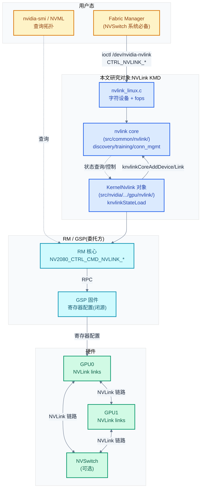
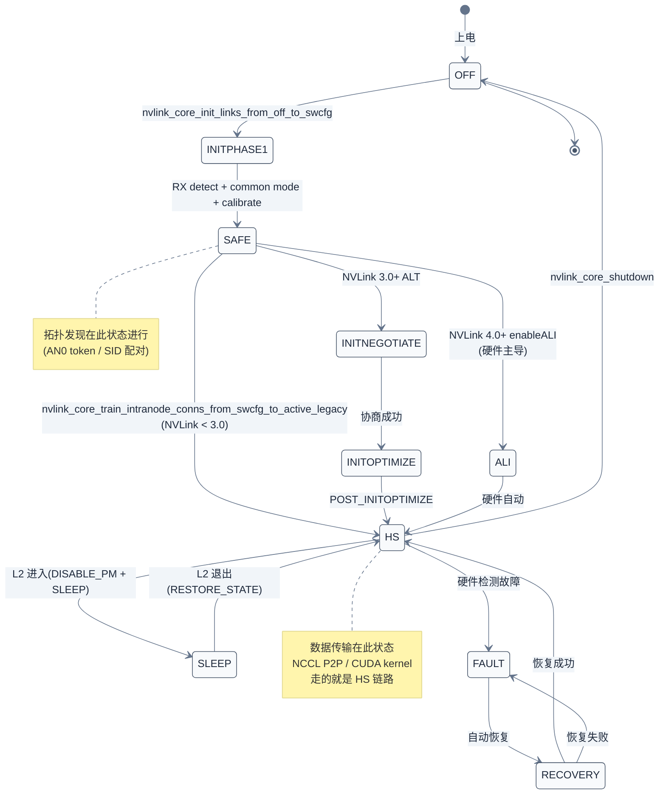

# NVLink KMD:拓扑发现与链路训练

> 08 讲的 UVM 解决了"CPU-GPU 共享地址空间",但大模型推理/训练里更常见的是"GPU-GPU"通信——张量并行(TP)切分权重、AllReduce 聚合梯度,这些都跑在 NVLink 上。一个自然的问题是:**KMD 怎么知道 GPU0 的 link3 连的是 GPU1 的 link5 而不是 GPU2 的 link1?怎么把这些链路从"上电初期的 OFF 状态"训到"全速 ACTIVE 状态"?又是怎么把这些信息暴露给 NCCL 让它选最优传输路径?** 本章拆解 NVLink 在 KMD 中的完整路径:独立的 `nvlink_linux.c` 接口层 + `src/common/nvlink/` 的 OS-agnostic 核心 + RM 侧 `KernelNvlink` 对象,聚焦三件事——拓扑发现(AN0 token / SID 机制)、链路训练状态机(OFF→SAFE→HS→ACTIVE)、连接管理(intranode/internode conn)。
>
> **工程师视角**:读完本章你能解释 `nvidia-smi topo -m` 那张表里的 `NV#` / `SYS` / `PHB` / `NODE` 标签从哪来、为什么 NCCL 启动日志里会打印 `Channel 00/02 : 0[0] -> 1[0] via P2P/IPC` 而不是 `via NVLink`、为什么某些 link 上电后停在 SAFE 没进 HS(通常是远端没配 token)、为什么 FM(Fabric Manager) 在 NVSwitch 系统里是必备进程。

### 关键术语

| 缩写 | 全称 | 含义 |
|------|------|------|
| NVLink | — | NVIDIA GPU 间高速互联,见 [../nccl/02](../nccl/02-gpu-interconnect-background.md) |
| KMD | Kernel Mode Driver | 内核态驱动,本文研究对象 |
| RM | Resource Manager | NVIDIA 驱动核心,见 [02](./02-源码架构与RM分层设计.md) |
| GSP | GPU System Processor | GPU 上微控制器,承载部分 RM 逻辑 |
| ALI | Adaptive Link Training | NVLink 4.0+ 的自适应链路训练(硬件主导) |
| AN0 | Alignment 0 packet | NVLink 拓扑发现用的"探测包",携带 token |
| SID | System ID | NVLink 3.0+ 用于标识端点的系统唯一 ID |
| FM | Fabric Manager | 集中式 fabric 管理进程(NVSwitch 系统必备) |
| HS | High Speed | 链路高速模式(全速运行) |
| SAFE / SWCFG | Safe / Software Config | 链路低速安全模式(用于发现与配置) |
| Ioctrl | I/O Control | NVLink 子系统的 I/O 控制器(物理分组) |
| NVSwitch | — | NVLink 交换芯片,扩展拓扑(见 [../nccl/02](../nccl/02-gpu-interconnect-background.md) §3) |
| MNNVL | Multi-Node NVLink | 跨节点 NVLink(NVLink 4.0+) |
| P2P | Peer-to-Peer | 设备间直接访问显存,见 [10](./10-多卡P2P-UVM-peer-mapping.md) |
| NCCL | NVIDIA Collective Communications Library | 多卡通信库,见 [../nccl/](../nccl/) |
| EGM | Extended GPU Memory | 扩展 GPU 内存(自托管 GPU 的 HBM 作为 NUMA) |
| NVML | NVIDIA Management Library | GPU 管理库,nvidia-smi 底层 |
| OSAL | OS Abstraction Layer | OS 抽象层,见 [02](./02-源码架构与RM分层设计.md) §3 |

---

## 1. 概述

### 1.1 前置知识

| 需要了解 | 参考文档 |
|----------|----------|
| NVLink/NVSwitch 硬件背景(NVLink 1-4 代、lane、速率、拓扑) | [../nccl/02-gpu-interconnect-background](../nccl/02-gpu-interconnect-background.md) |
| KMD 源码分层(`kernel-open/` vs `src/`)、RM 三层架构 | [02-源码架构与RM分层设计](./02-源码架构与RM分层设计.md) |
| RM client/handle 对象模型、ioctl 通用路径 | [04-字符设备与ioctl接口](./04-字符设备与ioctl接口.md) |
| GSP 固件与 RPC 委托模式 | [02-源码架构与RM分层设计](./02-源码架构与RM分层设计.md) §4 |
| RM 状态机(StateLoad/StateInit) | [02-源码架构与RM分层设计](./02-源码架构与RM分层设计.md) §3 |

### 1.2 系统上下文

**项目定位**:本章研究的是 **NVLink 在 KMD 中的三层实现**——这是 NVIDIA 在 `open-gpu-kernel-modules` 里少有的"OS-agnostic 核心代码全开源"的子系统(对比 RM 核心虽开源但与 GSP 固件紧耦合,NVLink 核心是纯软件逻辑,不依赖 GSP)。它独立于 RM 的 `MemoryManager`/`Fifo` 等对象,通过 `nvlink_lib_*` 接口暴露给 RM 侧的 `KernelNvlink` 对象调用,同时通过 `/dev/nvidia-nvlink` 字符设备暴露给用户态的 Fabric Manager 进程。理解 NVLink KMD 是定位多卡性能问题(NCCL 走 NVLink 还是 PCIe)、配置问题(为什么 link 没训起来)、规模问题(NVSwitch 系统为什么必须 FM)的基础。

**软硬件耦合点**:本章聚焦五个耦合点:

1. **PCIe 探测 → RM 注册 → NVLink core 注册三级链路**:GPU 通过 `nv-pci.c` 被 PCI 子系统探测,创建 `OBJGPU` 对象;RM 状态机跑到 `knvlinkStateLoad` 时,把每个 GPU 作为 `nvlink_device`、每个 enabled link 作为 `nvlink_link` 注册到 `src/common/nvlink/` 的核心库;核心库维护全局 `nv_devicelist_head` 链表。这是 RM ↔ NVLink core 的边界。
2. **AN0 token / SID 硬件机制**:NVLink 链路在 `SAFE` 模式下能注入 AN0 数据包,接收端读回 token——这是硬件提供的"链路两端配对"机制。NVLink 3.0+ 改用 SID(System ID)+ R4 token,软件读取 `localSid`/`remoteSid`/`remoteLinkId` 直接配对,不必注入包。这是 NVLink KMD 拓扑发现依赖的硬件契约。
3. **链路训练状态机**:link 状态由 `NVLINK_LINKSTATE_*` 宏定义(OFF→INITPHASE1→SAFE→HS→ACTIVE),每个状态对应 PHY/DL(Data Link)层的具体硬件配置。KMD 只驱动状态转换的"软件侧",真正的 PHY 训练序列(PLL 锁定、RX 校准、lane alignment)由硬件状态机完成,KMD 通过 `link_handlers->set_dl_link_mode` 下达命令后**轮询等待**。
4. **GSP RPC 委托**:RM 通过 `knvlinkExecGspRmRpc(NV2080_CTRL_CMD_NVLINK_*)` 把"具体硬件寄存器写"委托给 GSP 固件——这是 NVLink 命令在 GSP 架构下的落地方式。软件侧的状态机判断在 RM/core,寄存器写在 GSP。
5. **Fabric Manager(用户态进程)与 NVLink core 的契约**:NVSwitch 系统(MNNVL、大规模 NVLink fabric)需要一个**集中式**的 FM 进程来编排训练顺序——因为训练必须两端同时下命令、且按特定 link 顺序进行。FM 通过 `/dev/nvidia-nvlink` 的 `CTRL_NVLINK_*` ioctl 调度,获取 `fabric-mgmt` capability 才有权限。

**跨实现对比**:与 AMD Infinity Fabric 对比——AMD 的 GPU-GPU 互联在内核侧没有独立模块,融在 `amdgpu` 的 `amdgpu_xgmi` 子系统里,与显存管理紧耦合;NVIDIA 把 NVLink 抽象成独立的核心库 + 独立字符设备,这种"独立子系统"设计让 NVLink 可以被 RM 调用(进程内调用)、也可以被用户态 FM 调用(跨进程 ioctl),灵活度更高。与 PCIe P2P 对比——PCIe P2P 不需要"链路训练状态机"(PCIe 链路训练由硬件 LINK_CTRL 自治),但 NVLink 是 point-to-point 的高速 SERDES,必须软件编排训练顺序。详见 §8。



> **如何读这张图**:三条路径汇入 NVLink core(`src/common/nvlink/`):① 用户态 FM 经 `/dev/nvidia-nvlink` 字符设备调用(蓝线);② RM 侧 `KernelNvlink` 经 `knvlinkCoreAddDevice/Link` 注册设备并调用 core API(蓝线);③ RM 经 GSP RPC 下达硬件寄存器配置(青线)。三者分工:Linux 接口层管字符设备与权限,core 管拓扑/训练/连接的状态机,RM 管与 GPU 对象生命周期绑定。绿色硬件层接收 GSP 配置并执行 PHY 训练。

---

## 2. NVLink 模块的三层结构

> 上一章(08)讲 UVM 是"一个独立模块 + 一个字符设备"。NVLink 不同——它**不是独立 .ko 模块**,而是嵌入在 `nvidia.ko` 里的子系统。但代码上分成三层:`kernel-open/nvidia/nvlink_linux.c`(Linux 接口层)、`src/common/nvlink/kernel/nvlink/core/`(OS-agnostic 核心)、`src/nvidia/.../gpu/nvlink/`(RM 侧 `KernelNvlink` 对象)。本章逐层拆解,先看入口。

### 2.1 Linux 接口层:字符设备与 capability

NVLink 在 Linux 侧的核心入口是 `nvlink_linux.c`——它注册一个字符设备 `/dev/nvidia-nvlink`,提供 `open/release/unlocked_ioctl` 三个 file operations,但**没有 mmap**(NVLink 不暴露显存到用户态,只提供控制接口)。

```c
/* 摘自 [kernel-open/nvidia/nvlink_linux.c](./src/open-gpu-kernel-modules/kernel-open/nvidia/nvlink_linux.c) 第 307-312 行 */
static const struct file_operations nvlink_fops = {
    .owner           = THIS_MODULE,
    .open            = nvlink_fops_open,
    .release         = nvlink_fops_release,
    .unlocked_ioctl  = nvlink_fops_unlocked_ioctl,
};
```

这个 fops 表的设计决策:**独占打开 + ioctl-only**。对比 `nvidia_fops`([04 §3](./04-字符设备与ioctl接口.md))支持多客户端 open + mmap,NVLink 的 fops 限制更严——因为它是给 FM 用的"控制平面",不是给普通 UMD 用的"数据平面"。

```c
/* 摘自 [kernel-open/nvidia/nvlink_linux.c](./src/open-gpu-kernel-modules/kernel-open/nvidia/nvlink_linux.c) 第 171-203 行(简化) */
static int nvlink_fops_open(struct inode *inode, struct file *filp)
{
    nvlink_file_private_t *private = NULL;

    mutex_lock(&nvlink_drvctx.lock);

    // nvlink lib driver is currently exclusive open.
    if (nvlink_drvctx.opened)
    {
        rc = -EBUSY;
        goto open_error;
    }

    private = (nvlink_file_private_t *)nvlink_malloc(sizeof(*private));
    /* ... 省略错误处理 ... */
    private->capability_fds.fabric_mgmt = -1;
    NVLINK_SET_FILE_PRIVATE(filp, private);

    // mark our state as opened
    nvlink_drvctx.opened = NV_TRUE;

open_error:
    mutex_unlock(&nvlink_drvctx.lock);
    return rc;
}
```

**为什么独占打开?** 因为 NVLink core 内部维护的是**全局唯一**的 `nvlinkLibCtx`(拓扑、连接、训练状态),多个客户端并发操作会破坏状态机。`nvlink_drvctx.opened` 标志保证同一时间只有一个进程能持 `/dev/nvidia-nvlink` 的 fd——这个进程就是 Fabric Manager(NVSwitch 系统)或一个简化的"NVLink 控制器"(无 NVSwitch 系统)。普通 UMD(libcuda.so)**不直接打开这个设备**,而是通过 RM 的 `NV_ESC_RM_CONTROL` 走 `NV2080_CTRL_CMD_NVLINK_*` 路径查询拓扑(见 §6)。

**ioctl 分发**:与 `nvidia_ioctl` 走 `RmEscape` 解码不同,`nvlink_fops_ioctl` 直接把 cmd 转发给 `nvlink_lib_ioctl_ctrl`(在 `src/common/nvlink/` 核心里):

```c
/* 摘自 [kernel-open/nvidia/nvlink_linux.c](./src/open-gpu-kernel-modules/kernel-open/nvidia/nvlink_linux.c) 第 233-295 行(简化) */
static int nvlink_fops_ioctl(struct inode *inode,
                             struct file *filp,
                             unsigned int cmd,
                             unsigned long arg)
{
    nvlink_ioctrl_params ctrl_params = {0};
    int param_size = _IOC_SIZE(cmd);
    void *param_buf = NULL;
    NvlStatus ret_val = 0;

    // no buffer for simple _IO types
    if (param_size)
    {
        param_buf = kzalloc(param_size, GFP_KERNEL);
        /* ... copy_from_user ... */
    }

    ctrl_params.osPrivate = filp->private_data;
    ctrl_params.cmd = _IOC_NR(cmd);          // 取 ioctl 编号(去掉 magic/dir/size)
    ctrl_params.buf = param_buf;
    ctrl_params.size = param_size;

    ret_val = nvlink_lib_ioctl_ctrl(&ctrl_params);   // 转发给核心库
    /* ... copy_to_user ... */
}
```

**设计决策**:`nvlink_fops_ioctl` 是个**透传层**——它不解析 cmd,只做 `copy_from_user` → 调 `nvlink_lib_ioctl_ctrl` → `copy_to_user`。这与 `RmEscape` 的"解码 NV_ESC_RM_ALLOC 再分发到 RM API"不同——NVLink 的 cmd 语义解析全部在 OS-agnostic 的核心层,Linux 层只管"把用户 buffer 安全搬到内核"。这种分层让 NVLink 核心可以复用到 Windows(Windows 版的 fops 等价物也只做透传)。

**模块初始化**:`nvlink_core_init` 是模块加载入口(`nvidia.ko` 的 `nvidia_init` 调用),它按顺序做四件事:① 初始化 `nvlink_lib_initialize`(核心库的全局上下文);② `alloc_chrdev_region` 注册字符设备;③ `nvlink_procfs_init` 创建 `/proc/driver/nvidia-nvlink/*`;④ `nvlink_cap_init` 创建 capability 文件。

```c
/* 摘自 [kernel-open/nvidia/nvlink_linux.c](./src/open-gpu-kernel-modules/kernel-open/nvidia/nvlink_linux.c) 第 314-371 行(简化) */
int __init nvlink_core_init(void)
{
    NvlStatus ret_val;
    int rc;

    if (NV_TRUE == nvlink_drvctx.initialized)
        return -EBUSY;

    mutex_init(&nvlink_drvctx.lock);

    ret_val = nvlink_lib_initialize();             // 1. 核心库初始化
    if (NVL_SUCCESS != ret_val) { /* ... */ }

    rc = alloc_chrdev_region(&nvlink_drvctx.devno, 0, NVLINK_NUM_MINOR_DEVICES,
                             NVLINK_DEVICE_NAME);  // 2. 字符设备号
    /* ... */

    cdev_init(&nvlink_drvctx.cdev, &nvlink_fops);
    rc = cdev_add(&nvlink_drvctx.cdev, nvlink_drvctx.devno, NVLINK_NUM_MINOR_DEVICES);  // 3. cdev 注册
    /* ... */

    rc = nvlink_procfs_init();                      // 4. procfs
    rc = nvlink_cap_init(NVLINK_PROCFS_DIR);        // 5. capability(/proc/driver/nvidia-nvlink/fabric-mgmt)

    nvlink_drvctx.initialized = NV_TRUE;
    return 0;
}
```

> **核心要点**:NVLink Linux 层是个"瘦适配层"——字符设备 + capability + 透传 ioctl,核心逻辑全在 OS-agnostic 的 `src/common/nvlink/`。这种分层让 NVLink 核心可以独立于 OS,也方便 RM 在不经过字符设备的情况下直接进程内调用(见 §3)。

### 2.2 OS-agnostic 核心:core/ 与 interface/

NVLink 核心库在 `src/common/nvlink/kernel/nvlink/` 下,分为 `core/` 与 `interface/` 两个子目录:

| 子目录 | 关键文件 | 职责 |
|--------|----------|------|
| `core/` | `nvlink_initialize.c` | 链路初始化(OFF→SWCFG),分 ALI/非 ALI 两条路径 |
| | `nvlink_discovery.c` | 拓扑发现(AN0 token / SID 配对) |
| | `nvlink_training.c` | 链路训练(SAFE→HS,分 intranode/internode) |
| | `nvlink_conn_mgmt.c` | 连接管理(intranode/internode conn 添加/删除) |
| | `nvlink_link_mgmt.c` | 链路状态查询、enable/disable |
| | `nvlink_shutdown.c` | 关闭与 L2 睡眠 |
| | `nvlink_ioctl.c` | ioctl cmd 的具体实现 |
| `interface/` | `nvlink_ioctl_entry.c` | ioctl cmd 的 switch 分发 |
| | `nvlink_kern_discovery_entry.c` / `training_entry.c` 等 | 各功能的 entry 包装 |

**为什么 core/ 与 interface/ 分开?** 这是 NVIDIA 在 RM 之外另一处贯彻"接口与实现分离"的地方。`interface/` 是 entry 层(参数校验、锁获取、错误码包装),`core/` 是 implementation。这种分层的核心收益是 `core/` 函数可以被 RM 侧**直接调用**(进程内,不经字符设备),而 `interface/` 是给用户态 FM 经字符设备调用的。

举例:`nvlink_core_train_intranode_conns_from_swcfg_to_active_non_ALI`(在 `core/nvlink_training.c`)是核心实现之一(NVLink 3.0+ 非 ALI 路径);`nvlink_lib_ctrl_train_intranode_conns_parallel`(在 `interface/` 包装)是给 ioctl 用的。RM 内部如果要触发训练,直接调 `nvlink_core_train_intranode_conns_from_swcfg_to_active_*` 系列(还有 `_ALT`、`_legacy` 等变体,按 NVLink 版本与 ALI 支持情况选择),不经 `interface/`。

### 2.3 全局上下文:nvlinkLibCtx

核心库用一个全局单例 `nvlinkLibCtx` 持有整个系统的 NVLink 状态:

```c
/* 摘自 [src/common/nvlink/kernel/nvlink/nvlink_ctx.h](./src/open-gpu-kernel-modules/src/common/nvlink/kernel/nvlink/nvlink_ctx.h) 第 36-85 行 */
typedef struct
{
    /*
     * Lock for all core lib structures except nvlink_link structures
     */
    void *topLevelLock;

    /*
     * Head of the device-list
     */
    nvlink_device nv_devicelist_head;

    /*
     * Head of the established intranode nvlink connections list
     */
    nvlink_intranode_conn nv_intraconn_head;

    /*
     * Head of the added internode nvlink connections list
     */
    nvlink_internode_conn nv_interconn_head;

    /*
     * Topology information
     *    registeredEndpoints  : #Endpoints registered in the core library
     *    connectedEndpoints   : #Endpoints whose remote has been determined
     *    notConnectedEndpoints: #Endpoints whose remote has not been determined
     */
    NvU32  registeredEndpoints;
    NvU32  connectedEndpoints;
    NvU32  notConnectedEndpoints;
    NvBool bNewEndpoints;

    /*
     * Endpoint count in different link states
     *    endpointsInSafe  : #Endpoints in SAFE state
     *    endpointsInFail  : #Endpoints that failed to transition to ACTIVE
     *    endpointsInActive: #Endpoints in ACTIVE
     */
    NvU32 endpointsInSafe;
    NvU32 endpointsInFail;
    NvU32 endpointsInActive;

    /*
     * Fabric node id set by ioctl interface. This id will be assigned to each
     * nvlink device during registration and matched for endpoint look-up on
     * ioctls, which operate on endpoints.
     */
    NvU16 nodeId;
} nvlink_lib_context;

extern nvlink_lib_context nvlinkLibCtx;
```

**几个易错点**:① 类型名是 `nvlink_lib_context`(下划线分词),不是 `nvlink_libctx_t`;全局变量名才是 `nvlinkLibCtx`(驼峰)。② `nv_devicelist_head`/`nv_intraconn_head`/`nv_interconn_head` 是**嵌入式链表头**(直接 `nvlink_device` 类型,非指针)——NVIDIA 在这里用 `nvListHead` 模式,链表节点嵌入到对象内部而非用指针串联。③ `nodeId` 是 `NvU16`(16 位),跨节点 fabric 的节点编号空间不大。④ `endpointsInSafe`/`endpointsInFail`/`endpointsInActive` 三个计数器用于在 ioctl 返回时快速报告系统状态,无需遍历链表。

这个全局上下文的设计决策:**单例而非 per-GPU**。因为 NVLink 拓扑本质上是**系统级**的——一个 GPU 的 link 配对的是另一个 GPU 的 link,只能用全局链表 `nv_devicelist_head` 串起来。这与 UVM 的 `uvm_va_space`(per-fd,见 [08 §3](./08-统一内存UVM.md))形成对比——UVM 是 per-process 的,NVLink 是 system-wide 的。

---

## 3. RM 侧 KernelNvlink 对象与注册流程

> §2 讲了 NVLink 核心库的"被动 API"——`nvlink_lib_register_device` 等等。但这些 API 是谁调的?答案是 RM 侧的 `KernelNvlink` 对象,在 GPU 状态机的 `knvlinkStateLoad` 阶段触发。本节拆解这条"GPU 探测 → RM 注册到 NVLink core"的链路。

### 3.1 KernelNvlink 对象

每个 GPU 在 RM 里都有一个 `KernelNvlink` 对象(`src/nvidia/src/kernel/gpu/nvlink/kernel_nvlink.c`),它持有该 GPU 的 NVLink 状态:`discoveredLinks`/`enabledLinks`/`connectedLinksMask` 等位向量、`ioctrlMask`(哪些 IOCTRL 物理分组被启用)、`initDisabledLinksMask`(虚拟化下被 hypervisor 禁用的 link)、`pNvlinkDev`(指向 core 的 `nvlink_device`)。

`KernelNvlink` 通过 NVOC(NVIDIA Object Class,见 [02 §3](./02-源码架构与RM分层设计.md))声明,与 `OBJGPU` 一一绑定,在 GPU 状态机的 StateLoad 阶段被构造。

### 3.2 knvlinkStateLoad:注册到 core 的入口

GPU 状态机跑到 `knvlinkStateLoad_IMPL` 时,会执行一系列初始化,其中两步关键——把 device 和每个 link 注册到 NVLink core:

```c
/* 摘自 [src/nvidia/src/kernel/gpu/nvlink/kernel_nvlinkstate.c](./src/open-gpu-kernel-modules/src/nvidia/src/kernel/gpu/nvlink/kernel_nvlinkstate.c) 第 410-565 行(简化) */
    // Filter IOCTRLs which have no discovered links (vbios or regkey)
    status = _knvlinkFilterIoctrls(pGpu, pKernelNvlink);
    /* ... */

    // Set the link training mode to be used by the device
    status = knvlinkIsAliSupported_HAL(pGpu, pKernelNvlink);  // 是否启用 ALI(NVLink 4.0+)

    // Add the NVGPU device to the nvlink core
    status = knvlinkCoreAddDevice(pGpu, pKernelNvlink);        // 注册 device
    /* ... */

    // Track un-connected links, we assume all discovered links are connected.
    bitVectorCopy(&pKernelNvlink->connectedLinksMask, &pKernelNvlink->discoveredLinks);
    pKernelNvlink->initializedLinks = 0;

    // For GSP-Clients, the link masks and vbios info need to synchronize with GSP
    status = knvlinkSyncLinkMasksAndVbiosInfo(pGpu, pKernelNvlink);

    // Load link speed if forced from OS
    status = knvlinkProgramLinkSpeed_HAL(pGpu, pKernelNvlink);

    // Override configuration for NVLink topology (legacy forced / chiplib forced)
    status = knvlinkOverrideConfig_HAL(pGpu, pKernelNvlink, NVLINK_PHASE_STATE_LOAD);

    // Finalize the enabledLinks mask
    if (pKernelNvlink->bRegistryLinkOverride) {
        /* 与 registryLinkMask 取交集 */
    } else {
        bitVectorCopy(&pKernelNvlink->enabledLinks, &pKernelNvlink->discoveredLinks);
    }

    // Sense NVLink bridge presence and remove links on missing bridges.
    knvlinkFilterBridgeLinks_HAL(pGpu, pKernelNvlink);   // 检测桥接器是否插好

    // Register links in the nvlink core library
    FOR_EACH_IN_BITVECTOR(&pKernelNvlink->enabledLinks, i)
    {
        status = knvlinkCoreAddLink(pGpu, pKernelNvlink, i);   // 注册每个 enabled link
    }
    FOR_EACH_IN_BITVECTOR_END();

    // RPC to GSP-RM to perform pre-topology setup on mask of enabled links
    status = knvlinkExecGspRmRpc(pGpu, pKernelNvlink,
                                 NV2080_CTRL_CMD_NVLINK_ENABLE_LINKS,
                                 NULL, 0);
    /* ... */
    knvlinkDetectNvswitchProxy(pGpu, pKernelNvlink);   // 检测 NVSwitch proxy
```

**这段代码体现了三个设计决策**:

1. **device 与 link 分两步注册**——`knvlinkCoreAddDevice` 先建 `nvlink_device`(GPU 作为整体),然后 `FOR_EACH_IN_BITVECTOR` 遍历每个 enabled link 调 `knvlinkCoreAddLink`。这种分层让"GPU 出错时整体移除"与"单 link 出错时局部移除"成为可能。
2. **HAL 化的关键节点**——`knvlinkIsAliSupported_HAL`、`knvlinkProgramLinkSpeed_HAL`、`knvlinkOverrideConfig_HAL`、`knvlinkFilterBridgeLinks_HAL` 都是 HAL 函数,按 GPU 架构(Ampere/Hopper/Blackwell)分发到不同实现。这是因为每代 NVLink 的 PHY 训练序列、速率配置都不同。
3. **GSP RPC 委托硬件操作**——`knvlinkExecGspRmRpc(NV2080_CTRL_CMD_NVLINK_ENABLE_LINKS, ...)` 把"具体写哪些寄存器来 enable link"委托给 GSP 固件。RM 只下达"enable 这些 link"的语义命令,具体寄存器写在 GSP 里(闭源)。这是 GSP 架构(见 [02 §4](./02-源码架构与RM分层设计.md))在 NVLink 的落地。

### 3.3 knvlinkCoreAddDevice:构造 nvlink_device

`knvlinkCoreAddDevice_IMPL` 在 `kernel_nvlinkcorelib.c`,构造一个 `nvlink_device` 结构,填入 GPU 的 PCI 信息、UUID、IOCTRL 数量等,然后调 `nvlink_lib_register_device` 加入 core 的全局链表:

```c
/* 摘自 [src/nvidia/src/kernel/gpu/nvlink/kernel_nvlinkcorelib.c](./src/open-gpu-kernel-modules/src/nvidia/src/kernel/gpu/nvlink/kernel_nvlinkcorelib.c) 第 134-234 行(简化) */
NV_STATUS
knvlinkCoreAddDevice_IMPL
(
    OBJGPU        *pGpu,
    KernelNvlink  *pKernelNvlink
)
{
    nvlink_device *dev = NULL;

    // Return if the device is already registered
    if (pKernelNvlink->pNvlinkDev) {
        return status;
    }

    /* 分配 driverName / deviceName("GPU0" 等) ... */

    // Allocate memory for the nvlink_device struct
    dev = portMemAllocNonPaged(sizeof(nvlink_device));
    /* ... */

    // Initialize values for the nvlink_device struct
    dev->driverName               = pKernelNvlink->driverName;
    dev->deviceName               = pKernelNvlink->deviceName;
    dev->type                     = NVLINK_DEVICE_TYPE_GPU;
    dev->pciInfo.domain           = gpuGetDomain(pGpu);
    dev->pciInfo.bus              = gpuGetBus(pGpu);
    dev->pciInfo.device           = gpuGetDevice(pGpu);
    dev->pciInfo.function         = 0;
    dev->pciInfo.pciDeviceId      = pGpu->idInfo.PCIDeviceID;
    dev->pciInfo.bars[0].baseAddr = GPU_GET_KERNEL_BUS(pGpu)->pciBars[0];
    dev->initialized              = 1;
    dev->enableALI                = pKernelNvlink->bEnableAli;
    dev->numIoctrls               = nvPopCount32(pKernelNvlink->ioctrlMask);
    dev->numActiveLinksPerIoctrl  = knvlinkGetNumActiveLinksPerIoctrl(pGpu, pKernelNvlink);
    dev->numLinksPerIoctrl        = knvlinkGetTotalNumLinksPerIoctrl(pGpu, pKernelNvlink);
    dev->bReducedNvlinkConfig     = knvlinkIsGpuReducedNvlinkConfig_HAL(pGpu, pKernelNvlink);
    dev->linkStateSupportedMask   = knvlinkGetSupportedCoreLinkStateMask_HAL(pGpu, pKernelNvlink);
    dev->bLinkStatesSymmetric     = pKernelNvlink->getProperty(pKernelNvlink,
                                    PDB_PROP_KNVLINK_UNILATERAL_LINK_STATE_CHANGE_SUPPORTED);

    // Register the GPU in nvlink core
    if (nvlink_lib_register_device(dev) != 0) {
        goto knvlinkCoreAddDevice_exit;
    }

    pKernelNvlink->pNvlinkDev = dev;
    return status;
}
```

**这段代码体现的设计**:RM 侧的 `KernelNvlink` 与 core 侧的 `nvlink_device` 是**双向引用**——`pKernelNvlink->pNvlinkDev` 指向 core 对象,而 core 对象的 `dev->driverName` 等又指回 RM 分配的内存。这种"对象互引"是 RM 与 core 紧耦合的表现:RM 通过 `pNvlinkDev` 调 core API,core 通过 `link_handlers`(函数指针表)回调 RM/GSP 的硬件操作。

`knvlinkCoreAddLink` 的模式类似——构造 `nvlink_link`,填入 `linkNumber`、`version`、`localSid`/`remoteSid`(SID 在 NVLink 3.0+ 用)、`link_handlers`(回调表),然后调 `nvlink_lib_register_link`。

### 3.4 link_handlers:RM/GSP 操作的回调表

`nvlink_link` 结构里最关键的字段是 `link_handlers`——一个函数指针表,core 通过它回调硬件操作:

| 回调 | 作用 | 实现位置 |
|------|------|----------|
| `set_dl_link_mode` | 设置 link 状态(OFF/SAFE/HS/...) | RM HAL → GSP RPC |
| `get_dl_link_mode` | 查询当前 link 状态 | RM HAL → GSP RPC |
| `set_tx_mode` / `set_rx_mode` | 设置 sublink TX/RX 模式 | RM HAL → GSP RPC |
| `write_discovery_token` | 写 AN0 发现 token(NVLink 2.0) | RM HAL → GSP RPC |
| `read_discovery_token` | 读 AN0 发现 token | RM HAL → GSP RPC |
| `training_complete` | 训练完成通知(NVLink 3.0+) | RM HAL → GSP RPC |
| `ali_training` | 触发 ALI 自适应训练(NVLink 4.0+) | RM HAL → GSP RPC |

> **核心要点**:SID(`localSid`/`remoteSid`)不是回调,而是 `nvlink_link` 结构体的字段(见 `nvlink.h` L231-234),core 代码直接读 `link->localSid`/`link->remoteSid` 即可——因为 NVLink 3.0+ 的 Minion 微控制器在硬件协商阶段已把对端 SID 写入这两个字段,软件无需再回调 RM/GSP 读取。这与 AN0 token 不同:token 需要主动注入/读取(走 `write_discovery_token`/`read_discovery_token` 回调),SID 是硬件自动填好的软件可见字段。

**为什么用回调表而不是直接调?** 因为 core 是 OS-agnostic,不能直接调 RM/GSP 的具体函数。`link_handlers` 是依赖注入(Dependency Injection)——RM 注册 link 时填入自己的实现,core 调用时通过函数指针间接调用。这与 `plat_psci_ops_t`(见 [02](./02-源码架构与RM分层设计.md) 跨实现对比)的模式完全一致:通用代码通过函数指针调用平台实现。

---

## 4. 拓扑发现:AN0 token 与 SID 机制

> §3 把 device/link 注册进了 core,但**注册 ≠ 配对**——core 只知道"系统里有 8 个 GPU、每个 GPU 有 18 个 link",不知道"GPU0 link3 连的是 GPU1 link5"。配对是拓扑发现的任务,本节拆解。

### 4.1 发现的触发时机

`nvlink_core_discover_and_get_remote_end` 是发现入口,它在两个时机被调用:① RM 状态机主动触发(查询某 link 的远端);② 用户态 FM 经 ioctl `CTRL_NVLINK_DISCOVER_INTRANODE_CONNS` 触发(全系统拓扑发现)。

```c
/* 摘自 [src/common/nvlink/kernel/nvlink/core/nvlink_discovery.c](./src/open-gpu-kernel-modules/src/common/nvlink/kernel/nvlink/core/nvlink_discovery.c) 第 46-125 行(简化) */
void
nvlink_core_discover_and_get_remote_end
(
    nvlink_link  *end,
    nvlink_link **remote_end,
    NvU32         flags,
    NvBool        bForceDiscovery
)
{
    nvlink_intranode_conn *conn      = NULL;
    nvlink_device         *dev       = NULL;
    nvlink_link           *link      = NULL;
    NvU32                  linkCount = 0;

    if (nvlinkLibCtx.bNewEndpoints || bForceDiscovery)
    {
        if (!_nvlink_core_all_links_initialized())
        {
            // Initialize the links to SWCFG mode
            FOR_EACH_DEVICE_REGISTERED(dev, nvlinkLibCtx.nv_devicelist_head, node)
            {
                FOR_EACH_LINK_REGISTERED(link, dev, node)
                {
                    pLinks[linkCount++] = link;
                }
            }

            if (pLinks[0]->version >= NVLINK_DEVICE_VERSION_40)
            {
                if (!pLinks[0]->dev->enableALI)
                    nvlink_core_init_links_from_off_to_swcfg_non_ALI(pLinks, linkCount, flags);
            }
            else
            {
                nvlink_core_init_links_from_off_to_swcfg(pLinks, linkCount, flags);
            }
        }

        // Re-discover the nvlink topology
        _nvlink_core_discover_topology();
    }

    // Get the connection for the endpoint
    nvlink_core_get_intranode_conn(end, &conn);
    if (conn != NULL)
    {
        *remote_end = (conn->end0 == end ? conn->end1 : conn->end0);
    }
}
```

**这段代码的核心决策:发现前必须先训练到 SWCFG**。因为 AN0 token 注入只能在 `SAFE` 或 `HS` 模式下进行(OFF 模式下链路物理上不通)。所以发现流程是:**OFF → SWCFG(初始化)→ 注入 token → 配对**。

代码里 `NVLINK_DEVICE_VERSION_40`(NVLink 4.0,即 Hopper)走 `non_ALI` 路径,否则走老路径。ALI(Adaptive Link Training)是 NVLink 4.0+ 的硬件主导训练模式,如果 `enableALI=true`,硬件自动完成大部分训练,软件只需等待——所以 `_non_ALI` 才是软件驱动的训练路径。

### 4.2 _nvlink_core_discover_topology:token 配对核心

`_nvlink_core_discover_topology` 是发现的真正实现,核心思路:**遍历每个未配对的 link,写入一个 token,然后扫描所有其他 link 看谁读到了这个 token**——读到就是配对的远端。

```c
/* 摘自 [src/common/nvlink/kernel/nvlink/core/nvlink_discovery.c](./src/open-gpu-kernel-modules/src/common/nvlink/kernel/nvlink/core/nvlink_discovery.c) 第 132-267 行(简化) */
static void
_nvlink_core_discover_topology(void)
{
    nvlink_device         *dev0         = NULL;
    nvlink_link           *end0         = NULL;
    nvlink_link           *end1         = NULL;
    nvlink_intranode_conn *conn         = NULL;
    NvU64                  linkMode     = NVLINK_LINKSTATE_OFF;
    NvBool                 isTokenFound = NV_FALSE;
    NvU64                  token        = 0;

    nvlinkLibCtx.notConnectedEndpoints = 0;

    FOR_EACH_DEVICE_REGISTERED(dev0, nvlinkLibCtx.nv_devicelist_head, node)
    {
        FOR_EACH_LINK_REGISTERED(end0, dev0, node)
        {
            // 跳过未检测到 RX 或 TX common mode 失败的 link
            if (!end0->bRxDetected || end0->bTxCommonModeFail)
                continue;

            // 已配对的跳过
            conn = NULL;
            nvlink_core_get_intranode_conn(end0, &conn);
            if (conn != NULL)
                continue;

            // 超过重试次数的跳过
            if (end0->packet_injection_retries > NVLINK_MAX_NUM_PACKET_INJECTION_RETRIES) {
                nvlinkLibCtx.notConnectedEndpoints++;
                continue;
            }

            end0->link_handlers->get_dl_link_mode(end0, &linkMode);

            // Packet injection can only happen on links that are in SAFE or ACTIVE
            if (!((linkMode == NVLINK_LINKSTATE_SAFE) || (linkMode == NVLINK_LINKSTATE_HS)))
            {
                nvlinkLibCtx.notConnectedEndpoints++;
                continue;
            }

            //
            // Send the AN0 packet.
            // For Nvlink3.0, token mechanism is handled by Minion.
            // SW gets Sids values and so write_discovery_token is Stubbed for Nvlink 3.0
            //
            if ((end0->version < NVLINK_DEVICE_VERSION_30) ||
                ((end0->localSid == 0) || (end0->remoteSid == 0)))
            {
                end0->link_handlers->write_discovery_token(end0, end0->token);
            }
            end0->packet_injection_retries++;
            isTokenFound = NV_FALSE;

            FOR_EACH_DEVICE_REGISTERED(dev1, nvlinkLibCtx.nv_devicelist_head, node)
            {
                FOR_EACH_LINK_REGISTERED(end1, dev1, node)
                {
                    if (!end1->bRxDetected || end1->bTxCommonModeFail)
                        continue;

                    token = 0;

                    if ((end0->version >= NVLINK_DEVICE_VERSION_30) &&
                        (end0->localSid != 0) && (end0->remoteSid != 0))
                    {
                        // NVLink 3.0+:用 SID 直接配对(无需注入包)
                        if ((end0->remoteSid    == end1->localSid) &&
                            (end0->remoteLinkId == end1->linkNumber))
                        {
                            token = end0->token;
                        }
                    }
                    else
                    {
                        // NVLink 2.0:读回 AN0 接收端的 token
                        end1->link_handlers->read_discovery_token(end1, (NvU64 *) &token);
                    }

                    // If token matches, establish the connection
                    if (token == end0->token)
                    {
                        isTokenFound = NV_TRUE;

                        // Add to the connections list
                        nvlink_core_add_intranode_conn(end0, end1);
                        break;
                    }
                }

                if (isTokenFound) break;
            }
        }
    }
}
```

**这段代码是本章的核心**,体现了三个关键设计:

#### 4.2.1 AN0 token 机制(NVLink 2.0 及以前)

NVLink 2.0 时代(Volta/Turing)的发现流程是**主动注入 + 被动读取**:

1. `end0` 调 `write_discovery_token(end0, end0->token)` 把一个唯一 token(通常是 link 编号或随机值)塞进 AN0 包发出去;
2. 链路对端物理上收到这个 token(因为 link 已在 SAFE 模式,链路是通的);
3. 软件遍历所有其他 link,调 `read_discovery_token(end1, &token)` 读 link1 的接收缓冲;
4. 谁读到的 token 等于 `end0->token`,谁就是配对端。

这是个 **O(N²)** 算法(N 是 link 总数),但因为只在启动时做一次,可接受。

#### 4.2.2 SID 机制(NVLink 3.0+)

NVLink 3.0(Ampere)开始,硬件提供 SID(System ID)+ `remoteLinkId` 寄存器——每个 link 启动时硬件自动协商出对端的 SID 和 link 编号,软件**直接读寄存器**就能配对,不需要注入 AN0 包。代码里的分支:

```c
if ((end0->remoteSid == end1->localSid) &&
    (end0->remoteLinkId == end1->linkNumber))
{
    token = end0->token;  // 直接确认配对
}
```

**为什么改用 SID?** 因为 NVLink 3.0+ 引入了 Minion(微控制器)处理链路训练,硬件已经知道对端是谁,软件再注入 token 是冗余的。SID 机制把发现的复杂度从 O(N²) 降到 O(N),且更可靠(不依赖软件注入时序)。代码注释里说 `token mechanism is handled by Minion`、`SW gets Sids values`——Minion 是 NVLink 3.0+ 的链路训练微控制器,这是它的职责之一。

#### 4.2.3 退化路径:SID 为 0 时回退到 token

注意条件 `(end0->localSid == 0) || (end0->remoteSid == 0)`——如果 SID 还没协商出来(硬件没准备好),代码会回退到老的 token 注入路径。这种"新机制优先,老机制兜底"的渐进设计在驱动代码里很常见,保证了向前兼容。

> **核心要点**:NVLink 拓扑发现的本质是"配对两端"——NVLink 2.0 用主动注入 AN0 token + O(N²) 扫描读取,NVLink 3.0+ 用硬件协商的 SID 直接 O(N) 配对。SID 机制是硬件帮软件做的优化,把发现的复杂度降了一个数量级。

### 4.3 连接对象:nvlink_intranode_conn

配对成功后,`nvlink_core_add_intranode_conn` 把两个 `nvlink_link` 封装成一个 `nvlink_intranode_conn`,加入全局 `nv_intraconn_head` 链表:

```c
/* 摘自 [src/common/nvlink/kernel/nvlink/core/nvlink_conn_mgmt.c](./src/open-gpu-kernel-modules/src/common/nvlink/kernel/nvlink/core/nvlink_conn_mgmt.c) 第 98-161 行(简化) */
NvlStatus
nvlink_core_add_intranode_conn
(
    nvlink_link *end0,
    nvlink_link *end1
)
{
    nvlink_intranode_conn *conn = NULL;

    // 已有连接则校验一致性
    nvlink_core_get_intranode_conn(end0, &conn);
    if (conn != NULL)
    {
        conn->end0 == end0 ?
            nvlink_assert(conn->end1 == end1) :
            nvlink_assert(conn->end0 == end1);
        return NVL_SUCCESS;
    }

    // create a new intranode connection object
    conn = (nvlink_intranode_conn*)nvlink_malloc(sizeof(nvlink_intranode_conn));
    /* ... */

    // Initialize the connection endpoints
    conn->end0 = end0;
    conn->end1 = end1;

    // Add the connection to the list of connections
    nvListAppend(&conn->node, &nvlinkLibCtx.nv_intraconn_head.node);

    //
    // Update the count of connected endpoints
    // Loopback link, increment by 1
    // Non loopback link, increment by 2
    //
    nvlinkLibCtx.connectedEndpoints = ( end0 == end1 ?
                           nvlinkLibCtx.connectedEndpoints + 1:
                           nvlinkLibCtx.connectedEndpoints + 2 );

    return NVL_SUCCESS;
}
```

**设计细节**:

1. **幂等性**——重复添加同一对端点不会出错(`if (conn != NULL) return NVL_SUCCESS`),因为发现可能被多次触发。
2. **loopback 计数**——`end0 == end1`(自环,用于测试)只算 1 个端点,正常连接算 2 个。这个计数用于判断"所有端点是否都配对了"(`connectedEndpoints == registeredEndpoints - notConnectedEndpoints`)。
3. **节点内 vs 跨节点分离**——`nvlink_intranode_conn` 与 `nvlink_internode_conn` 是不同结构:intranode 的两端都是本地 `nvlink_link` 指针,internode 的一端是本地 link、另一端是 `nvlink_remote_endpoint_info`(只存 UUID/SID,没有指针,因为远端 link 在另一个节点的内核里)。这种分离反映了 MNNVL(Multi-Node NVLink)的现实——跨节点不能共享指针,只能共享标识符。

---

## 5. 链路训练状态机

> §4 解决了"配对",但配对后链路还在 `SAFE` 模式(低速,只够发控制包)。真正跑数据要训到 `HS`(High Speed,全速)。本节拆解训练状态机——NVLink link 状态的完整生命周期。

### 5.1 链路状态枚举

NVLink link 的状态由 `NVLINK_LINKSTATE_*` 宏定义(`src/common/nvlink/interface/nvlink.h` 第 337-366 行):

| 宏 | 值 | 含义 |
|----|----|------|
| `NVLINK_LINKSTATE_OFF` | 0x00 | 关闭,链路不通 |
| `NVLINK_LINKSTATE_HS` | 0x01 | 高速,全速运行(ACTIVE) |
| `NVLINK_LINKSTATE_SAFE` | 0x02 | 安全/发现模式,低速(用于配置与发现) |
| `NVLINK_LINKSTATE_FAULT` | 0x03 | 故障 |
| `NVLINK_LINKSTATE_RECOVERY` | 0x04 | 恢复中 |
| `NVLINK_LINKSTATE_FAIL` | 0x05 | 未连接/失败 |
| `NVLINK_LINKSTATE_DETECT` | 0x06 | 检测模式 |
| `NVLINK_LINKSTATE_RESET` | 0x07 | 复位 |
| `NVLINK_LINKSTATE_SLEEP` | 0x0A | L2 睡眠(省电) |
| `NVLINK_LINKSTATE_INITPHASE1` | 0x13 | INITPHASE1(初始化阶段 1) |
| `NVLINK_LINKSTATE_INITNEGOTIATE` | 0x14 | 链路协商(Ampere+) |
| `NVLINK_LINKSTATE_INITOPTIMIZE` | 0x16 | INITOPTIMIZE(优化) |
| `NVLINK_LINKSTATE_INITPHASE5` | 0x1B | INITPHASE5(NVLink 4.0+) |
| `NVLINK_LINKSTATE_ALI` | 0x1C | ALI(自适应训练) |
| `NVLINK_LINKSTATE_ACTIVE_PENDING` | 0x1D | 即将 ACTIVE 的中间态 |

> **如何读这张表**:状态分三类——① **稳定态**(OFF/SAFE/HS/FAULT/SLEEP):链路长期停留的状态;② **过渡态**(INITPHASE1/INITNEGOTIATE/INITOPTIMIZE/INITPHASE5/ALI/ACTIVE_PENDING):训练过程中的临时状态,完成后自动转下一态;③ **控制命令**(RESET/ENABLE_PM/DISABLE_PM/LANE_SHUTDOWN):不是状态而是"下发即返回"的命令。sublink(TX/RX 方向)另有独立状态机(`NVLINK_SUBLINK_STATE_TX_HS`/`TX_SAFE`/`RX_HS`/`RX_SAFE`),与 link 状态机协同。

### 5.2 完整生命周期



> **如何读这张图**:从 OFF 到 HS 有三条路径——① NVLink 2.0 及以前:OFF→INITPHASE1→SAFE→HS(软件驱动每一步);② NVLink 3.0 ALT:SAFE→INITNEGOTIATE→INITOPTIMIZE→HS(软件发起,硬件协助);③ NVLink 4.0+ ALI:SAFE→ALI→HS(硬件主导,软件只等待)。HS 是数据传输态;SLEEP 是省电态(L2);FAULT 是故障态,可经 RECOVERY 恢复。**拓扑发现必须在 SAFE 完成**(见 §4)。

### 5.3 训练入口:nvlink_core_train_internode_conns_from_swcfg_to_active

`nvlink_core_train_internode_conns_from_swcfg_to_active` 把跨节点连接从 SAFE 训到 HS。注意:这是 **internode**(跨节点)训练函数,操作 `nvlink_internode_conn`(只有 `local_end` 是本地 `nvlink_link` 指针,远端是 `remote_end` 标识符);intranode(节点内)训练有独立的函数族 `nvlink_core_train_intranode_conns_from_swcfg_to_active_{non_ALI,ALT,legacy}`,操作 `nvlink_intranode_conn`(两端都是本地 `nvlink_link` 指针)。这里以 internode 函数为例,因为它清晰地展示了"前置状态校验 → master end 驱动 → 轮询等待"的训练三步。核心逻辑:

```c
/* 摘自 [src/common/nvlink/kernel/nvlink/core/nvlink_training.c](./src/open-gpu-kernel-modules/src/common/nvlink/kernel/nvlink/core/nvlink_training.c) 第 82-204 行(简化,函数 nvlink_core_train_internode_conns_from_swcfg_to_active) */
    //
    // For NVLink version < 3.0, we can train link to ACTIVE only when link is
    // at SWCFG and sublink are at HS
    //
    if (conns[i]->local_end->version < NVLINK_DEVICE_VERSION_30)
    {
        if (!(nvlink_core_check_link_state(conns[i]->local_end, NVLINK_LINKSTATE_SAFE)) ||
            !(nvlink_core_check_tx_sublink_state(conns[i]->local_end,
                                                 NVLINK_SUBLINK_STATE_TX_HS)) ||
            !(nvlink_core_check_rx_sublink_state(conns[i]->local_end,
                                                 NVLINK_SUBLINK_STATE_RX_HS)))
        {
            /* 报错:Invalid link/sublink mode */
            skipConn[i] = NV_TRUE;
        }
    }

    for (i = 0; i < connCount; i++)
    {
        if ((conns[i] == NULL) || skipConn[i])
            continue;

        _nvlink_core_set_link_pre_active_settings(conns[i]->local_end, flags);

        // Change mode for master link. The other link end should transition to active.
        if (isMasterEnd[i] == NV_TRUE)
        {
            conns[i]->local_end->link_handlers->set_dl_link_mode(conns[i]->local_end,
                                                                 NVLINK_LINKSTATE_HS,
                                                                 flags);
        }
    }

    for (i = 0; i < connCount; i++)
    {
        // Wait for the link state to change.
        status = nvlink_core_poll_link_state(conns[i]->local_end,
                                             NVLINK_LINKSTATE_HS,
                                             NVLINK_TRANSITION_HS_TIMEOUT);
        if (status != NVL_SUCCESS) {
            /* 报错 */
        } else {
            /* 成功 */
        }

        // Do all the miscellaneous settings once the link is trained to ACTIVE.
        _nvlink_core_set_link_post_active_settings(conns[i]->local_end, flags);
    }

    //
    // Always return success to FM on training failures
    // FM will read link states to determine sucessfull training
    //
    return NVL_SUCCESS;
```

**这段代码体现了三个关键设计**:

1. **前置状态校验**——NVLink 2.0 训练到 HS 前,要求 link 在 SAFE 且 TX/RX sublink 都在 HS。这是个看似矛盾的条件("训到 HS 要求 sublink 已在 HS"),原因是 sublink 状态机与 link 状态机解耦——sublink 可以独立切到 HS(物理 lane 训练),然后 link 整体切 HS(协议层启用)。NVLink 3.0+ 取消了这个要求,因为 ALT 序列自动处理。
2. **master end 驱动**——一个连接的两端只在一端(`isMasterEnd == NV_TRUE`)下发 `set_dl_link_mode(HS)` 命令,另一端"应该"自动跟着切换。这种"单端驱动 + 双端同步"的设计避免了双端同时下发导致的竞争——硬件保证一端切 HS 时另一端会跟随。
3. **轮询等待 + 软超时**——`nvlink_core_poll_link_state(NVLINK_LINKSTATE_HS, NVLINK_TRANSITION_HS_TIMEOUT)` 是轮询,等硬件完成 PHY 训练。如果超时,函数**仍返回 SUCCESS**——这是设计选择,注释说"FM 会读 link 状态判断是否真的成功"。这种"软成功 + 事后验证"避免了训练阻塞 FM 主循环。
4. **`pre_active`/`post_active` 钩子**——`_nvlink_core_set_link_pre_active_settings` 和 `_nvlink_core_set_link_post_active_settings` 是 HAL 化的钩子,让不同架构的 GPU 在训练前后做特定配置(如缓存策略、错误检测开关)。

### 5.4 关闭与 L2 睡眠

`nvlink_core_shutdown` 把链路从 ACTIVE/HS 退回 OFF 或 SLEEP(L2)。L2 是 NVLink 的低功耗状态,在 GPU 空闲时进入(配合 GPU 的 RTD3/FGC6 状态):

```c
/* 摘自 [src/common/nvlink/kernel/nvlink/core/nvlink_shutdown.c](./src/open-gpu-kernel-modules/src/common/nvlink/kernel/nvlink/core/nvlink_shutdown.c)
   L2 路径:nvlink_core_powerdown_intranode_conns_from_active_to_L2(第 43-406 行)
   OFF 路径:nvlink_core_powerdown_intranode_conns_from_active_to_off(第 473-720 行)
   以下综合两条路径的关键步骤(简化,省略 end1 与轮询) */
    // STEP 0: Disable HeartBeat(仅 L2 路径,L105-122)
    conns[i]->end0->link_handlers->set_dl_link_mode(conns[i]->end0,
                                                    NVLINK_LINKSTATE_DISABLE_HEARTBEAT,
                                                    flags);

    // STEP 1: Disable PM(L124-141 / L504-513)
    conns[i]->end0->link_handlers->set_dl_link_mode(conns[i]->end0,
                                                    NVLINK_LINKSTATE_DISABLE_PM,
                                                    flags);

    // STEP 2: Transition link to SWCFG(L190-203 / L515-524)
    conns[i]->end0->link_handlers->set_dl_link_mode(conns[i]->end0,
                                                    NVLINK_LINKSTATE_SAFE,
                                                    flags);
    /* ... nvlink_core_poll_link_state(NVLINK_LINKSTATE_SAFE, NVLINK_TRANSITION_SAFE_TIMEOUT) ... */

    if (bEnterL2) {
        // L2 路径:STEP 3 set sublink TX_SAFE → STEP 4 SAVE_STATE → STEP 5 SLEEP
        // STEP 5 用 set_tl_link_mode(传输层),不是 set_dl_link_mode(L345-368)
        conns[i]->end0->link_handlers->set_tl_link_mode(conns[i]->end0,
                                                        NVLINK_LINKSTATE_SLEEP,
                                                        NVLINK_STATE_CHANGE_SYNC);
    } else {
        // OFF 路径:STEP 3 Disable error detection(L641-649)
        conns[i]->end0->link_handlers->set_dl_link_mode(conns[i]->end0,
                                                        NVLINK_LINKSTATE_DISABLE_ERR_DETECT,
                                                        flags);
        // STEP 4: LANE_DISABLE → LANE_SHUTDOWN(L654-701)
        conns[i]->end0->link_handlers->set_dl_link_mode(conns[i]->end0,
                                                        NVLINK_LINKSTATE_LANE_DISABLE,
                                                        flags);
        conns[i]->end0->link_handlers->set_dl_link_mode(conns[i]->end0,
                                                        NVLINK_LINKSTATE_LANE_SHUTDOWN,
                                                        flags);
        // STEP 5: OFF(L703-708)
        conns[i]->end0->link_handlers->set_dl_link_mode(conns[i]->end0,
                                                        NVLINK_LINKSTATE_OFF,
                                                        flags);
    }
```

**关闭顺序的设计**:① **STEP 0** 先关 HeartBeat(仅 L2 路径,避免进入低功耗时心跳超时误报错)→ ② **STEP 1** 关 PM(避免训练过程中被 PM 打断)→ ③ **STEP 2** 退到 SAFE(降低速率,准备关 lane)→ ④ L2 路径直接 `set_tl_link_mode(SLEEP)`(传输层命令,进入 L2);OFF 路径继续 `DISABLE_ERR_DETECT` → `LANE_DISABLE` → `LANE_SHUTDOWN` → `OFF`(数据链路层逐级关 lane)。这个顺序**不可逆**,每步都有物理意义——比如关 lane 前必须退到 SAFE,因为 HS 模式下关 lane 会触发 fault。注意所有命令都通过 `link_handlers->set_dl_link_mode` / `set_tl_link_mode` 回调下发,**没有** `nvlink_core_set_link_mode` 这个 API——core 层直接通过函数指针调用 RM/GSP 注册的实现,这与 §3.4 的 `link_handlers` 回调表设计一致。

> **核心要点**:NVLink 训练状态机的核心是"软件下发命令 + 硬件完成训练 + 软件轮询确认"。软件只控制状态转换的编排顺序(OFF→SAFE→HS),真正的 PHY 训练(PLL 锁定、RX 校准、lane alignment)由硬件状态机自治完成。NVLink 4.0+ 的 ALI 进一步把"软件编排"也交给硬件(Adaptive Link Training),软件只等待最终结果——这是硬件/软件责任边界持续向硬件侧迁移的体现。

---

## 6. ioctl 接口与 UMD 查询路径

> §2-5 讲的是 core 内部机制。但 UMD(libcuda.so / NCCL)怎么查询拓扑?答案有两条路径:① 直接经 `/dev/nvidia-nvlink` 的 ioctl(只 FM 有权限);② 经 RM 的 `NV2080_CTRL_CMD_NVLINK_*` 控制命令(普通 UMD 走这条)。本节拆解两条路径。

### 6.1 NVLink ioctl 命令体系

`/dev/nvidia-nvlink` 的 ioctl cmd 通过 `CTRL_NVLINK_*` 编号区分,在 `interface/nvlink_ioctl_entry.c` 的 switch 里分发:

```c
/* 摘自 [src/common/nvlink/kernel/nvlink/interface/nvlink_ioctl_entry.c](./src/open-gpu-kernel-modules/src/common/nvlink/kernel/nvlink/interface/nvlink_ioctl_entry.c) 第 107-295 行(节选) */
    switch (ctrlParams->cmd)
    {
        case CTRL_NVLINK_CHECK_VERSION:
            /* 版本握手 */
            break;

        case CTRL_NVLINK_SET_NODE_ID:
            /* 设置节点 ID(跨节点 fabric) */
            break;

        //
        // The following commands operate on all the links registered in the
        // core library. Hence, clubbing them into a group so, we don't have
        // to duplicate the lock acquire/release for each of them
        //
        case CTRL_NVLINK_INITPHASE1:
        case CTRL_NVLINK_RX_INIT_TERM:
        case CTRL_NVLINK_SET_RX_DETECT:
        case CTRL_NVLINK_GET_RX_DETECT:
        case CTRL_NVLINK_SET_TX_COMMON_MODE:
        case CTRL_NVLINK_CALIBRATE:
        case CTRL_NVLINK_ENABLE_DATA:
        case CTRL_NVLINK_LINK_INIT_ASYNC:
        case CTRL_NVLINK_INITNEGOTIATE:
        case CTRL_NVLINK_INITPHASE5:
        {
            nvlink_lib_ctrl_all_links(ctrlParams);   // 统一分发到 all_links 处理
            break;
        }

        case CTRL_NVLINK_DEVICE_LINK_INIT_STATUS:
            /* 查询 link 初始化状态 */
            break;

        case CTRL_NVLINK_DEVICE_WRITE_DISCOVERY_TOKENS:
            /* 写发现 token(NVLink 2.0) */
            break;

        case CTRL_NVLINK_DEVICE_READ_DISCOVERY_TOKENS:
            /* 读发现 token */
            break;

        case CTRL_NVLINK_DEVICE_READ_SIDS:
            /* 读 SID(NVLink 3.0+) */
            break;

        case CTRL_NVLINK_DISCOVER_INTRANODE_CONNS:
            /* 触发节点内拓扑发现 */
            break;

        case CTRL_NVLINK_DEVICE_GET_INTRANODE_CONNS:
            /* 查询节点内连接 */
            break;

        case CTRL_NVLINK_ADD_INTERNODE_CONN:
            /* 添加跨节点连接 */
            break;

        case CTRL_NVLINK_REMOVE_INTERNODE_CONN:
            /* 移除跨节点连接 */
            break;

        case CTRL_NVLINK_TRAIN_INTRANODE_CONN:
            /* 训练节点内连接 */
            break;

        case CTRL_NVLINK_TRAIN_INTRANODE_CONNS_PARALLEL:
            /* 并行训练多个节点内连接 */
            break;
    }
```

**命令分组的设计决策**:把"作用于所有 link 的命令"(`INITPHASE1`/`SET_RX_DETECT`/`CALIBRATE`/`ENABLE_DATA`/`INITNEGOTIATE`/`INITPHASE5`)合并在一个 case 块里,统一调 `nvlink_lib_ctrl_all_links`——这样只需在一处获取/释放全局锁,避免每个命令重复加锁。这是 NVLink core 的并发控制设计:**全局锁保护所有 link 操作**,因为 link 状态机有跨 link 依赖(训练顺序、连接配对)。

### 6.2 命令分类与典型调用方

按用途分类,`CTRL_NVLINK_*` 命令分五大类:

| 类别 | 代表命令 | 典型调用方 | 何时调 |
|------|----------|-----------|--------|
| **版本与节点** | `CHECK_VERSION`、`SET_NODE_ID` | FM 启动时 | FM 初始化 |
| **链路初始化** | `INITPHASE1`、`SET_RX_DETECT`、`SET_TX_COMMON_MODE`、`CALIBRATE`、`ENABLE_DATA`、`INITNEGOTIATE`、`INITPHASE5` | FM 或 RM | 链路从 OFF→SAFE |
| **拓扑发现** | `WRITE_DISCOVERY_TOKENS`、`READ_DISCOVERY_TOKENS`、`READ_SIDS`、`DISCOVER_INTRANODE_CONNS`、`GET_INTRANODE_CONNS` | FM | SAFE 模式下配对 |
| **训练** | `TRAIN_INTRANODE_CONN`、`TRAIN_INTRANODE_CONNS_PARALLEL`、`TRAIN_INTERNODE_CONN_LINK` | FM | SAFE→HS |
| **跨节点** | `ADD_INTERNODE_CONN`、`REMOVE_INTERNODE_CONN` | FM(MNNVL) | 跨节点 fabric 建立 |

> **核心要点**:NVLink ioctl 的典型调用方是 **Fabric Manager 进程**,不是普通 UMD。FM 在 NVSwitch 系统/MNNVL 系统里是必备进程,负责编排训练顺序(因为训练必须两端同步,集中式编排比分布式协商简单)。无 NVSwitch 的单节点 DGX 系统,RM 自己编排训练,不一定需要 FM。

### 6.3 UMD 查询拓扑:走 RM 而非 NVLink 字符设备

普通 UMD(libcuda.so、NCCL)**不打开 `/dev/nvidia-nvlink`**——它没有 `fabric-mgmt` capability,被 `nvlink_fops_open` 的独占检查挡住。UMD 查询拓扑走的是 RM 的 `NV2080_CTRL_CMD_NVLINK_*` 控制命令,经 `/dev/nvidia*` 的 `NV_ESC_RM_CONTROL` ioctl 进入 RM(见 [04 §4](./04-字符设备与ioctl接口.md))。

RM 侧的 `kernel_nvlinkapi.c` 实现了这些控制命令:

| RM 控制命令(`NV2080_*` 命名空间) | 作用 |
|------------|------|
| `NV2080_CTRL_CMD_NVLINK_GET_NVLINK_CAPS` | 查询本 GPU 的 NVLink 能力(版本、link 数、特性位) |
| `NV2080_CTRL_CMD_NVLINK_GET_NVLINK_STATUS` | 查询每个 link 的当前状态(link state / sublink TX/RX state) |
| `NV2080_CTRL_CMD_NVLINK_GET_LOCAL_DEVICE_INFO` | 查询本 GPU 的 NVLink device 信息(UUID / SID 等) |
| `NV2080_CTRL_CMD_NVLINK_GET_ERR_INFO` | 查询 NVLink 错误信息 |
| `NV2080_CTRL_CMD_NVLINK_GET_COUNTERS` | 查询 NVLink 流量计数器 |
| `NV2080_CTRL_CMD_NVLINK_DIRECT_CONNECT_CHECK` | 检查直连 GPU 间的 NVLink bridge 数量与在位状态 |

> **核心要点**:这里列出的都是 `NV2080_CTRL_CMD_NVLINK_*` 命名空间的 **RM 控制命令**(走 `/dev/nvidia*` 的 `NV_ESC_RM_CONTROL`)。查询"节点内连接列表"的命令 `CTRL_NVLINK_DEVICE_GET_INTRANODE_CONNS` 属于 **NVLink core ioctl 命名空间**(`CTRL_NVLINK_*`,走 `/dev/nvidia-nvlink`,见 §6.1),只对持 `fabric-mgmt` capability 的 FM 开放——普通 UMD 拿不到完整连接列表,只能通过 `NV2080_CTRL_CMD_NVLINK_GET_NVLINK_STATUS` 逐 link 查询状态来推断拓扑。NVSwitch proxy 状态则是 RM 内部函数 `knvlinkIsNvswitchProxyPresent`(非控制命令),UMD 不可直接查询。

这些命令在 RM 内部最终调 `nvlink_lib_*` core API(进程内调用,不经字符设备)。所以 NVLink core 有**两个调用入口**:① 用户态 FM 经字符设备(需 capability);② RM 内部直接调(进程内)。这是 NVLink core 设计成 OS-agnostic 库(而非独立 .ko)的收益之一。

### 6.4 nvidia-smi topo -m 的数据来源

`nvidia-smi topo -m` 输出形如:

```
        GPU0    GPU1    GPU2    GPU3    ...
GPU0     X      NV12    NV12    SYS     ...
GPU1    NV12     X      NV12    SYS     ...
GPU2    NV12    NV12     X      SYS     ...
GPU3    SYS     SYS     SYS      X      ...
```

其中 `NV12` 表示 12 条 NVLink 连接,`SYS` 表示跨 NUMA 节点走 PCIe,`NODE` 表示同 NUMA 节点 PCIe。这张表的数据来源是:

- `NV#` 标签:来自 RM 的 `NV2080_CTRL_CMD_NVLINK_GET_NVLINK_STATUS`(逐 link 查询状态)与 `NV2080_CTRL_CMD_NVLINK_DIRECT_CONNECT_CHECK`(检查直连 bridge 数),统计两个 GPU 间的 NVLink 连接数;
- `SYS`/`NODE`/`PHB`:来自 PCIe 拓扑(`nv-pci.c` 的 `pci_get_domain_bus_slot` + NUMA 节点查询),与 NVLink 无关。

NCCL 启动时打印的 `Channel 00/02 : 0[0] -> 1[0] via P2P/IPC` 就是基于这张表决策——如果 `NV#` > 0,优先走 NVLink P2P;否则走 PCIe P2P 或 SHM(见 [10](./10-多卡P2P-UVM-peer-mapping.md) 与 [../nccl/08](../nccl/08-transport-layer.md))。

---

## 7. Fabric Manager 与 capability

> §6 提到 FM 经 `/dev/nvidia-nvlink` 调用,但谁能打开这个设备?答案是:只有持有 `fabric-mgmt` capability 的进程。本节拆解 NVLink 的 capability 机制。

### 7.1 capability 文件

`nvlink_caps.c` 在 procfs 下创建 capability 文件:

```c
/* 摘自 [kernel-open/nvidia/nvlink_caps.c](./src/open-gpu-kernel-modules/kernel-open/nvidia/nvlink_caps.c) 第 29-122 行(简化) */
#define NVLINK_CAP_FABRIC_MGMT "fabric-mgmt"

typedef struct
{
    nv_cap_t *root;
    nv_cap_t *fabric_mgmt;
} nvlink_caps_t;

static nvlink_caps_t nvlink_caps = {0};

int nvlink_cap_init(const char *path)
{
    if (path == NULL) {
        return -1;
    }

    /* 在 /proc/driver/nvidia-nvlink/ 下初始化 cap 根目录 */
    nvlink_caps.root = nv_cap_init(path);
    if (nvlink_caps.root == NULL) {
        return -1;
    }

    /* 创建 /proc/driver/nvidia-nvlink/fabric-mgmt(权限 S_IRUSR:仅 owner 可读) */
    nvlink_caps.fabric_mgmt = nv_cap_create_file_entry(nvlink_caps.root,
                                                       NVLINK_CAP_FABRIC_MGMT,
                                                       S_IRUSR);
    if (nvlink_caps.fabric_mgmt == NULL) {
        nvlink_cap_exit();
        return -1;
    }
    return 0;
}
```

capability 机制基于 Linux 的 `O_RDWR` 文件权限 + fd 传递:进程 A 打开 `/proc/driver/nvidia-nvlink/fabric-mgmt` 拿到 fd,通过 Unix socket 把 fd 传给进程 B,B 用这个 fd 调 `ioctl(/dev/nvidia-nvlink, CTRL_NVLINK_*, fd)` 才能执行特权命令。这是 NVIDIA 的"capability as fd"模式——比传统的 root 权限检查更细粒度,允许非 root 进程(但有 capability 的)执行特定操作。

### 7.2 fabric_mgmt capability 的获取

`nvlink_acquire_fabric_mgmt_cap` 在 ioctl 处理时被调用,校验调用者是否持有 capability:

```c
/* 摘自 [kernel-open/nvidia/nvlink_linux.c](./src/open-gpu-kernel-modules/kernel-open/nvidia/nvlink_linux.c) 第 604-637 行(简化)
   以及 [kernel-open/nvidia/nvlink_caps.c](./src/open-gpu-kernel-modules/kernel-open/nvidia/nvlink_caps.c) 第 39-69 行的 nvlink_cap_acquire */
NvlStatus nvlink_acquire_fabric_mgmt_cap(void *osPrivate, NvU64 capDescriptor)
{
    int dup_fd = -1;
    nvlink_file_private_t *private_data = (nvlink_file_private_t *)osPrivate;

    if (private_data == NULL)
    {
        return NVL_BAD_ARGS;
    }

    /* nvlink_cap_acquire 内部再调 nv_cap_validate_and_dup_fd 校验 fd */
    dup_fd = nvlink_cap_acquire((int)capDescriptor,
                                NVLINK_CAP_FABRIC_MANAGEMENT);
    if (dup_fd < 0)
    {
        return NVL_ERR_OPERATING_SYSTEM;
    }

    private_data->capability_fds.fabric_mgmt = dup_fd;
    return NVL_SUCCESS;
}

/* 返回值是 int(0/1),不是 NvBool */
int nvlink_is_fabric_manager(void *osPrivate)
{
    nvlink_file_private_t *private_data = (nvlink_file_private_t *)osPrivate;

    /* Make sure that fabric mgmt capability fd is valid */
    if ((private_data == NULL) ||
        (private_data->capability_fds.fabric_mgmt < 0))
    {
        return 0;
    }

    return 1;
}
```

**设计决策**:`fabric-mgmt` capability 是**进程级**的——一个进程要么是 FM(持 capability),要么不是。这与 RM 的 client/handle 模型(每个 client 有独立权限,见 [04 §5](./04-字符设备与ioctl接口.md))不同,因为 NVLink core 是**全局单例**,没必要做 per-client 权限。FM 进程通常是 root 启动的守护进程(NVSwitch 系统的 `nv-fabricmanager.service`),它持有 capability 后才能编排训练。

### 7.3 何时需要 FM

| 系统类型 | 是否需要 FM | 训练编排方 |
|----------|------------|-----------|
| 单 GPU,无 NVLink | 不需要 | 无 NVLink |
| 多 GPU 直连(NVLink P2P,无 NVSwitch) | 可选 | RM 内部编排(默认) |
| NVSwitch 系统(DGX H100 等) | **必备** | FM 编排 |
| MNNVL(Multi-Node NVLink) | **必备** | FM 编排(跨节点) |

**为什么 NVSwitch 必须有 FM?** 因为 NVSwitch 系统里,每个 GPU 的 link 都连到 NVSwitch 而不是另一个 GPU——拓扑是"星型"而非"全互联"。训练时,NVSwitch 的端口也要同步配置,且 fabric 路由表(哪个 GPU 的 traffic 走哪个 NVSwitch 端口)需要集中式编排。FM 是唯一掌握全局拓扑的进程,由它下发训练命令保证一致性。MNNVL 更复杂——跨节点的 link 配对需要 FM 之间互相通信(经 `ADD_INTERNODE_CONN` ioctl 注册跨节点连接)。

> **核心要点**:NVLink 的"控制平面"权限模型是 capability-based——只有持 `fabric-mgmt` capability 的 FM 进程才能执行训练/发现命令。普通 UMD 走 RM 的 `NV2080_CTRL_CMD_NVLINK_*` 路径只能**查询**,不能**配置**。这是 NVSwitch 系统稳定性的基础——避免误操作破坏 fabric。

---

## 8. 跨实现对比与设计取舍

### 8.1 NVLink KMD vs AMD XGMI vs PCIe P2P

| 维度 | NVIDIA NVLink KMD | AMD XGMI(amdgpu) | PCIe P2P |
|------|-------------------|-------------------|----------|
| **代码组织** | 独立核心库(`src/common/nvlink/`)+ RM 集成 | 融入 amdgpu 的 `amdgpu_xgmi.c`,与显存管理紧耦合 | 无独立模块,PCIe 子系统原生支持 |
| **拓扑发现** | AN0 token(NVLink 2.0)/ SID(NVLink 3.0+) | 硬件协商,驱动读寄存器 | PCIe 枚举(配置空间) |
| **链路训练** | 软件状态机(OFF→SAFE→HS),ALI 趋向硬件主导 | 硬件自治,驱动只等待 | PCIe LINK_CTRL 硬件自治 |
| **用户态接口** | 独立字符设备 `/dev/nvidia-nvlink` + capability | sysfs(`/sys/class/drm/card*/device/xgmi*`) | 无(走标准 PCI 配置空间) |
| **集中式管理** | FM 进程(NVSwitch 系统必备) | 无需 FM,驱动自治 | 无需 |
| **跨节点支持** | MNNVL(NVLink 4.0+),FM 编排 | 不支持跨节点 | 不支持跨节点(PCIe 单节点) |
| **P2P 内存访问** | 见 [10](./10-多卡P2P-UVM-peer-mapping.md) | amdgpu peer2peer | 见 [10](./10-多卡P2P-UVM-peer-mapping.md) |

**设计差异的本质**:NVIDIA 把 NVLink 抽象成"独立子系统 + 集中式 FM",因为 NVSwitch/MNNVL 的拓扑复杂度远超点对点——星型 fabric 需要集中编排。AMD 的 XGMI 主要是点对点全互联(无 NVSwitch 等价物),驱动自治就够。PCIe P2P 最简单,硬件自治完全不需要软件编排。

### 8.2 NVLink KMD vs UVM 的"独立模块"对比

| 维度 | NVLink KMD | UVM([08](./08-统一内存UVM.md)) |
|------|-----------|------|
| **是否独立 .ko** | 否,嵌入 nvidia.ko | 是,独立 nvidia-uvm.ko |
| **字符设备** | `/dev/nvidia-nvlink`(控制平面) | `/dev/nvidia-uvm`(数据平面) |
| **mmap** | 不支持 | 支持(VA 映射) |
| **权限模型** | capability-based(`fabric-mgmt`) | 进程级(每个 UVM fd 独立 VA space) |
| **数据结构** | 全局单例 `nvlinkLibCtx` | per-fd `uvm_va_space` |
| **调用方** | FM(特权)+ RM(内部) | UMD(普通进程) |

**为什么 NVLink 嵌入 nvidia.ko 而 UVM 独立?** 因为 NVLink 与 RM 的耦合更深——`KernelNvlink` 对象是 GPU 状态机的一部分,link 状态查询走 RM 控制命令,二者共享进程内调用。UVM 是"用户态内存管理",与 RM 的显式分配是并行机制,独立 .ko 让它能独立 release、独立演进(见 [08 §1.2](./08-统一内存UVM.md))。

### 8.3 训练状态机的"软件 vs 硬件"边界演进

| NVLink 版本 | 软件参与程度 | 硬件自治程度 |
|-------------|-------------|-------------|
| NVLink 1.0(Pascal) | 高:软件驱动每个 INITPHASE | 低 |
| NVLink 2.0(Volta/Turing) | 中:软件注入 token、编排训练 | 中:PHY 训练硬件自治 |
| NVLink 3.0(Ampere) | 低:SID 硬件协商、ALT 序列 | 高:Minion 微控制器处理训练 |
| NVLink 4.0+(Hopper/Blackwell) | 极低:ALI 硬件主导 | 极高:软件只等待最终 ACTIVE |

**演进方向**:软件参与越来越少,硬件自治越来越多。这是高速 SERDES 互联的必然趋势——25G/50G/100G lane 速率下,PHY 训练的复杂度(均衡、时钟恢复、lane alignment)远超软件能实时处理的范围,必须硬件状态机自治。ALI(Adaptive Link Training)是这个趋势的终点——软件只说"训这个 link",硬件自己完成全部训练序列。

---

## 9. 闭源边界与不可见部分

本章引用的代码全部开源,但 NVLink 子系统仍有几处**闭源或硬件不可见**的边界,需要明确标注:

### 9.1 闭源边界

| 边界 | 闭源内容 | 开源内容 | 本章处理 |
|------|----------|----------|----------|
| **GSP 固件** | NVLink 寄存器配置的具体实现 | `NV2080_CTRL_CMD_NVLINK_*` RPC 契约(见 [02 §4](./02-源码架构与RM分层设计.md)) | 标注"RM 经 RPC 委托给 GSP",不深入固件 |
| **PHY 训练序列** | PLL 锁定、RX 校准、lane alignment 的硬件状态机 | `link_handlers->set_dl_link_mode` 接口 | 标注"软件下发命令 + 轮询等待",不展开 PHY |
| **Minion 微控制器** | NVLink 3.0+ 的链路训练微控制器固件 | SID 读取接口 | 标注"Minion 处理训练",不深入固件 |
| **ALI 硬件状态机** | NVLink 4.0+ 自适应训练的硬件实现 | `enableALI` 标志、ALI 状态查询 | 标注"硬件主导",不展开状态机 |
| **NVSwitch 内部** | NVSwitch 芯片的 fabric 路由表、端口管理 | NVSwitch proxy 检测接口 | 不展开(本章聚焦 GPU 侧) |

### 9.2 规范定义 vs 实现不可见

| 项 | 规范/开源 | 实现不可见 |
|----|----------|-----------|
| NVLink link 状态枚举 | `NVLINK_LINKSTATE_*` 宏开源(§5.1) | 状态转换的硬件时序 |
| 拓扑发现机制 | AN0 token / SID 配对逻辑开源(§4.2) | AN0 包的物理格式、SID 协商的硬件握手 |
| 训练顺序 | `nvlink_core_train_internode_conns_from_swcfg_to_active`(§5.3)与 intranode 训练函数族均开源 | `set_dl_link_mode` 在硬件里具体写哪些寄存器 |
| FM 编排逻辑 | FM 是闭源用户态进程(`nv-fabricmanager`) | FM 内部的训练编排算法 |

### 9.3 待确认

> **待确认**:
> - NVLink 4.0 ALI 模式下,软件如何检测训练失败?本章引用的代码显示 `nvlink_core_poll_link_state` 轮询 HS 状态,但 ALI 模式下是否有额外的硬件中断通知机制,源码未明确。
> - MNNVL 跨节点连接的 `nvlink_remote_endpoint_info` 结构具体字段(UUID/SID 格式),源码散落在多个头文件,未集中展示。
> - NVSwitch proxy 检测的具体协议(`knvlinkDetectNvswitchProxy` 的实现),涉及 NVSwitch 固件交互,本章未深入。

---

## 10. 总结与下一篇

### 10.1 本章核心结论

> **核心要点**:NVLink KMD 的设计可以归纳为三层分离——① **Linux 接口层**(`nvlink_linux.c`)做字符设备与 capability,是瘦适配层;② **OS-agnostic 核心**(`src/common/nvlink/`)做拓扑发现、训练状态机、连接管理,是核心逻辑;③ **RM 侧 `KernelNvlink`**(`src/nvidia/.../gpu/nvlink/`)做与 GPU 对象生命周期的绑定,通过 `link_handlers` 回调表注入硬件操作。三层通过函数指针表(`link_handlers`)与全局单例(`nvlinkLibCtx`)解耦,既支持 RM 进程内调用,也支持用户态 FM 经字符设备调用。

> **核心要点**:NVLink 的"配对两端"问题有两个解——NVLink 2.0 用主动注入 AN0 token + O(N²) 扫描(软件驱动),NVLink 3.0+ 用硬件协商的 SID + O(N) 配对(硬件驱动)。这是硬件/软件责任边界持续向硬件侧迁移的典型案例——随互联速率提升,软件越来越难以及时处理 PHY 层细节,ALI(Adaptive Link Training)是这个趋势的终点。

> **核心要点**:NVLink 的权限模型是 capability-based——`fabric-mgmt` capability 决定谁能执行训练/发现命令。普通 UMD 走 RM 的 `NV2080_CTRL_CMD_NVLINK_*` 路径只能查询,FM 进程走 `/dev/nvidia-nvlink` 路径才能配置。这是 NVSwitch 系统稳定性的基础——避免误操作破坏 fabric。

### 10.2 与推理/训推场景的关联

本章内容在推理/训推场景下的体现:

- **NCCL 启动拓扑探测**:NCCL 启动时调 `cuDeviceGetP2PAttribute` 查询 NVLink 连接数,走的就是 RM 的 `NV2080_CTRL_CMD_NVLINK_GET_NVLINK_STATUS` 路径(见 §6.3),逐 link 读取链路状态来推断拓扑。如果某个 link 停在 SAFE 没训到 HS,NCCL 会看到"NVLink 数量减少",降级走 PCIe P2P 或 SHM。
- **TP(Tensor Parallel)切分**:TP 把权重切到多卡,AllReduce 走 NVLink。如果 NVLink 没训起来,AllReduce 走 PCIe,带宽降一个数量级(NVLink4 900GB/s vs PCIe5 128GB/s)。
- **长跑稳定性**:NVLink fault 会触发 `NVLINK_LINKSTATE_FAULT` → `RECOVERY` → `HS` 自动恢复(见 §5.2)。如果恢复失败,link 进 `FAIL` 状态,NCCL 会重试或报错。Xid 79(NVLink 错误)就是这条路径上的事件(见 [06 §5](./06-中断同步与fence.md))。
- **MNNVL 跨节点训练**:Hopper 的 MNNVL 允许跨节点 NVLink,FM 必须在每个节点运行,通过 `ADD_INTERNODE_CONN` ioctl 注册跨节点连接。这是 DGX H100 SuperPOD 等大规模训练集群的基础。

### 10.3 下一篇

下一篇 [10-多卡 P2P:UVM peer mapping](./10-多卡P2P-UVM-peer-mapping.md) 解决下一个问题:**两个 GPU 的显存怎么互相可见?** 本章讲的是 NVLink 物理链路(链路训起来),下一篇讲的是逻辑映射(显存怎么映射到对端 GPU 的地址空间)。涉及 `uvm_api_enable_peer_access` 的内核路径、`uvm_va_range_device_p2p.c` 建立 peer mapping、`nvidia_p2p_get_pages` 接口、NVLink vs PCIe P2P 路径选择、PCIe ACS 对 P2P 路由的影响,以及与 NCCL P2P transport 的衔接。

---

## 参考资料

- [NVIDIA Open GPU Kernel Modules](https://github.com/NVIDIA/open-gpu-kernel-modules) — 参考了 `kernel-open/nvidia/nvlink_linux.c`、`src/common/nvlink/kernel/nvlink/core/`、`src/nvidia/src/kernel/gpu/nvlink/`(610.43.03 版本)
- [NVIDIA GPU Driver README (kernel_open)](https://us.download.nvidia.com/XFree86/Linux-x86_64/610.43.03/README/kernel_open.html) — 参考了 NVLink 开源模块特性说明
- [NVIDIA NVLink High-Speed Interconnect](https://www.nvidia.com/en-us/data-center/nvlink/) — NVLink 产品页(NVLink 规范本身需 NDA,本章不引用规范细节)
- [NVIDIA Fabric Manager](https://docs.nvidia.com/datacenter/tesla/fabric-manager-user-guide/) — 参考了 FM 在 NVSwitch 系统的角色
- [../nccl/02-gpu-interconnect-background](../nccl/02-gpu-interconnect-background.md) — 参考了 NVLink 硬件背景(NVLink 1-4 代、NVSwitch、MNNVL),本章不重复硬件介绍
- [../nccl/08-transport-layer](../nccl/08-transport-layer.md) — 参考了 NCCL P2P transport 期望的内核契约(下一篇 10 衔接)
- [NVIDIA A100 / H100 Architecture Whitepaper](https://resources.nvidia.com/en-us-hopper-architecture/h100-tensor-core-gpu-architecture-whitepaper) — 参考了 NVLink 3.0/4.0 硬件结构背景
