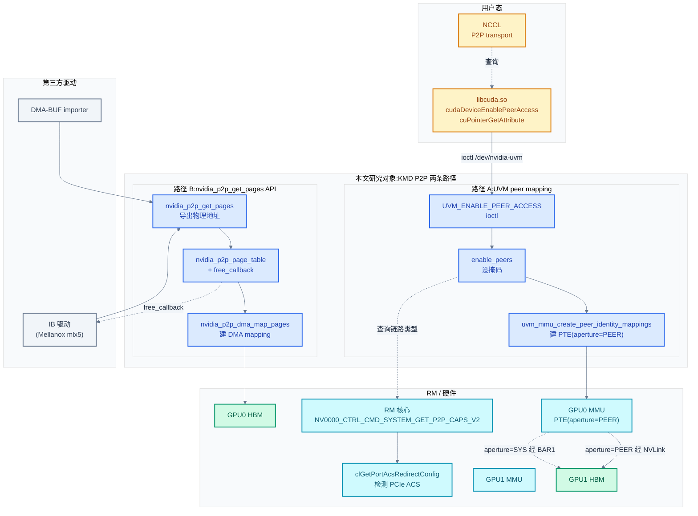

# 多卡 P2P:UVM peer mapping 与 nvidia_p2p_get_pages

> 09 讲的是 NVLink 物理链路怎么训起来——但物理链路通了不等于显存能互相访问。GPU0 的 link3 物理上连到 GPU1 的 link5,这只是"线通了";要真正让 GPU0 的 SM 访问 GPU1 显存的某个地址,还需要建立"逻辑映射"——把 GPU1 的物理显存地址翻译成 GPU0 能识别的 aperture。这就是 P2P(Peer-to-Peer)的内核侧落地。NCCL 在 [../nccl/08](../nccl/08-transport-layer.md) §2 的 P2P transport 调 `cudaDeviceEnablePeerAccess` + `cuPointerGetAttribute` 期望内核返回"这块显存能被对端 GPU 直接访问"的契约——本章拆解这个契约的内核实现。
>
> **工程师视角**:读完本章你能解释 `cudaDeviceEnablePeerAccess` 在内核做了什么(`UVM_ENABLE_PEER_ACCESS` ioctl → 建 peer identity mapping)、能区分两条 P2P 路径——UVM peer mapping(给 UVM Managed Memory 用)vs `nvidia_p2p_get_pages`(给 RDMA/IB 驱动用)、能定位"P2P 不可用"的根因(PCIe ACS 阻断、NVLink 没训起来、MIG 隔离)、能理解 NCCL 启动日志 `via P2P/IPC` vs `via SHM` 的决策依据。

### 关键术语

| 缩写 | 全称 | 含义 |
|------|------|------|
| P2P | Peer-to-Peer | 设备间直接访问显存,不经 CPU |
| UVM | Unified Virtual Memory | 统一虚拟内存,见 [08](./08-统一内存UVM.md) |
| UMD | User Mode Driver | 用户态驱动 libcuda.so |
| RM | Resource Manager | NVIDIA 驱动核心 |
| GSP | GPU System Processor | GPU 微控制器,见 [02](./02-源码架构与RM分层设计.md) |
| VA Space | Virtual Address Space | UVM 的 VA 空间对象,见 [08](./08-统一内存UVM.md) |
| VA Range | — | UVM 的 VA 区间对象(Managed/External/Device P2P) |
| Aperture | — | GPU MMU 的地址孔径,标识物理内存来源(SYS/PEER/NVLINK) |
| BAR1 | Base Address Register 1 | GPU 的 PCIe BAR1,映射显存到 CPU 地址空间 |
| NVLink | — | GPU 间高速互联,见 [09](./09-NVLink-KMD拓扑与训练.md) |
| NVSwitch | — | NVLink 交换芯片,见 [../nccl/02](../nccl/02-gpu-interconnect-background.md) |
| ACS | Access Control Services | PCIe 访问控制服务(影响 P2P 路由) |
| RDMA | Remote Direct Memory Access | 远程直接内存访问 |
| IB | InfiniBand | RDMA 网络协议 |
| GDR | GPUDirect RDMA | RDMA 直接访问显存,见 [11](./11-GPUDirect-RDMA-peermem.md) |
| NCCL | NVIDIA Collective Communications Library | 多卡通信库 |
| MIG | Multi-Instance GPU | GPU 硬件分片,见 [02](./02-源码架构与RM分层设计.md) |
| SMC | Scalable Memory Complexity | MIG 的现代命名(算力+显存分片) |
| DMA-BUF | — | Linux 内核的 DMA 缓冲共享框架 |
| CE | Copy Engine | 拷贝引擎 |
| PDB | Page Directory Base | 页表根物理地址 |

---

## 1. 概述

### 1.1 前置知识

| 需要了解 | 参考文档 |
|----------|----------|
| NVLink 物理链路训练(本章前提:链路通了才能 P2P) | [09-NVLink-KMD拓扑与训练](./09-NVLink-KMD拓扑与训练.md) |
| UVM 数据结构与 VA Space 模型 | [08-统一内存UVM](./08-统一内存UVM.md) |
| GPU MMU 与页表(PDE/PTE/aperture) | [07-内存管理显存与地址空间](./07-内存管理显存与地址空间.md) |
| RM client/handle 与 ioctl 通用路径 | [04-字符设备与ioctl接口](./04-字符设备与ioctl接口.md) |
| NCCL P2P transport 期望的内核契约 | [../nccl/08-transport-layer](../nccl/08-transport-layer.md) §2 |
| UMD 侧 `cudaDeviceEnablePeerAccess` 语义 | [../cuda/09-多GPU编程与互联拓扑](../cuda/09-多GPU编程与互联拓扑.md) |
| PCIe ACS 协议背景 | [../pcie/](../pcie/) |

### 1.2 系统上下文

**项目定位**:本章研究的是 **KMD 如何让两个 GPU 的显存互相可见**。这是多卡推理/训练的底座——TP(Tensor Parallel)切分权重后跨卡 AllReduce、PP(Pipeline Parallel)的激活在卡间传递、EP(Expert Parallel)的 MoE 路由,底层都依赖 P2P 显存访问。NVIDIA 在内核侧提供**两条并行机制**:

1. **UVM peer mapping**(`nvidia-uvm.ko`):给 UVM Managed Memory(`cudaMallocManaged`)和 UVM 外部分配(`cuMemAlloc`)用,通过 `UVM_ENABLE_PEER_ACCESS` ioctl 在两个 GPU 的 VA space 之间建"peer identity mapping",让 GPU0 的页表里直接指向 GPU1 的物理显存。
2. **`nvidia_p2p_get_pages` API**(`nvidia.ko` 的 `nv-p2p.c`):给**第三方内核驱动**(IB 驱动、DMA-BUF、peermem)用,把 GPU 显存的物理地址导出为 `nvidia_p2p_page_table`,让其他驱动能 DMA 访问。这是 GPUDirect RDMA 的底座(见 [11](./11-GPUDirect-RDMA-peermem.md))。

两条机制的边界:**UVM peer mapping 是"GPU-GPU"**(两端都是 NVIDIA GPU,走 NVLink 或 PCIe BAR1 P2P);**`nvidia_p2p_get_pages` 是"GPU-任意设备"**(对端可以是网卡、FPGA、另一家厂商的 GPU)。

**软硬件耦合点**:本章聚焦六个耦合点:

1. **`UVM_ENABLE_PEER_ACCESS` ioctl → `enable_peers`**:UMD 调 `cudaDeviceEnablePeerAccess` 经 `/dev/nvidia-uvm` 进入 UVM,在 `uvm_va_space` 的处理器掩码(`can_access`/`accessible_from`/`has_fast_link`/`has_native_atomics`)里标记两个 GPU 互可访问。这是 UVM 内部的"权限授予",不直接建映射。
2. **peer identity mapping**:真正建映射是 `uvm_mmu_create_peer_identity_mappings`——在 GPU0 的页表里写一个特殊 PTE,其 aperture 是 `UVM_APERTURE_PEER(peer_id)`(走 NVLink)或 `UVM_APERTURE_SYS`(走 BAR1),指向 GPU1 的物理显存。这是 P2P 的硬件落地。
3. **aperture 选择**:NVLink 直连用 `UVM_APERTURE_PEER`,PCIe P2P(无 NVLink)用 `UVM_APERTURE_SYS`(经系统内存路由)或 `UVM_APERTURE_SYS_NON_COHERENT`(无 PCIe 原子)。选择逻辑在 `parent_gpu_peer_aperture`。
4. **`nvidia_p2p_get_pages` + free_callback**:第三方驱动调此 API 拿到 `nvidia_p2p_page_table`,NVIDIA 驱动注册一个 `free_callback`——当底层显存被释放/迁移时(如 `cuMemFree`),回调通知第三方驱动失效映射。这是 P2P 生命周期的关键。
5. **PCIe ACS 阻断**:如果两个 GPU 之间的 PCIe 拓扑上有 ACS-enabled 交换机,P2P 流量会被重定向到 root complex,性能骤降。RM 的 `clGetPortAcsRedirectConfig` 检测 ACS 状态,UVM 据此决定是否允许 BAR1 P2P。
6. **NVSwitch fabric P2P**:NVSwitch 系统里,两个 GPU 可能没有直接 NVLink(都连到 NVSwitch),P2P 走 fabric 路由——需要 FM 配置 fabric 地址(`knvlinkGetUniqueFabricBaseAddress`),UVM 经 `UVM_APERTURE_PEER` 访问。

**跨实现对比**:与 Linux 内核标准 `pci_p2pdma` 框架对比——Linux 4.20+ 的 `pci_p2pdma` 提供 `pci_p2pmem_publish` 让设备发布可 P2P 的内存,其他设备经 `pci_alloc_p2pmem` 获取;NVIDIA 不用这套,因为 GPU 显存不是 PCIe BAR 内存(是独立 HBM),且 NVIDIA 需要支持 NVLink P2P(不走 PCIe)。与 AMD amdgpu peer2peer 对比——amdgpu 用 `amdgpu_gem_prime` + DMA-BUF 导出显存,NVIDIA 用自研 `nvidia_p2p_get_pages`(历史更早,pre-DMA-BUF);现代 NVIDIA 也支持 DMA-BUF(见 [11](./11-GPUDirect-RDMA-peermem.md))。详见 §8。



> **如何读这张图**:P2P 有两条路径。**路径 A(蓝)**:UMD 经 UVM ioctl 在两个 GPU 间建 peer identity mapping,GPU0 的 MMU 直接用 `aperture=PEER` 访问 GPU1 HBM(走 NVLink),或 `aperture=SYS` 经 BAR1 访问(走 PCIe)。**路径 B(灰)**:第三方驱动(IB/DMA-BUF importer)调 `nvidia_p2p_get_pages` 拿到 GPU 显存的物理地址表 + DMA mapping,直接 DMA 访问。RM(青)提供链路类型查询与 ACS 检测。绿色 HBM 是最终被访问的物理显存。

---

## 2. UVM peer mapping 路径

> 本节拆解"GPU-GPU"P2P 的内核路径——从 `cudaDeviceEnablePeerAccess` 到 peer identity mapping 的建立。这是 NCCL P2P transport 的直接底座。

### 2.1 入口:uvm_api_enable_peer_access

`cudaDeviceEnablePeerAccess` 在 UMD 经 `cuDeviceEnablePeerAccess` 翻译为 `UVM_ENABLE_PEER_ACCESS` ioctl(见 [08 §2](./08-统一内存UVM.md) 的 ioctl 表),进入 `uvm_api_enable_peer_access`:

```c
/* 摘自 [kernel-open/nvidia-uvm/uvm_va_space.c](./src/open-gpu-kernel-modules/kernel-open/nvidia-uvm/uvm_va_space.c) 第 2061-2093 行 */
NV_STATUS uvm_api_enable_peer_access(UVM_ENABLE_PEER_ACCESS_PARAMS *params, struct file *filp)
{
    uvm_va_space_t *va_space = uvm_va_space_get(filp);
    NV_STATUS status = NV_OK;
    uvm_gpu_t *gpu0 = NULL;
    uvm_gpu_t *gpu1 = NULL;
    NvU32 pair_index;

    uvm_mutex_lock(&g_uvm_global.global_lock);
    status = retain_pcie_peers_from_uuids(va_space, &params->gpuUuidA, &params->gpuUuidB, &gpu0, &gpu1);
    uvm_mutex_unlock(&g_uvm_global.global_lock);
    if (status != NV_OK)
        return status;

    uvm_va_space_down_write(va_space);

    pair_index = uvm_gpu_pair_index(gpu0->id, gpu1->id);
    if (test_bit(pair_index, va_space->enabled_peers))
        status = NV_ERR_INVALID_DEVICE;          // 已启用,重复调用报错
    else
        status = enable_peers(va_space, gpu0, gpu1);

    uvm_va_space_up_write(va_space);

    if (status != NV_OK) {
        uvm_mutex_lock(&g_uvm_global.global_lock);
        uvm_gpu_release_pcie_peer_access(gpu0, gpu1);
        uvm_mutex_unlock(&g_uvm_global.global_lock);
    }

    return status;
}
```

**这段代码的设计**:

1. **两阶段锁**——先持 `g_uvm_global.global_lock`(全局锁,保护 GPU 注册表)调 `retain_pcie_peers_from_uuids`(保留两个 GPU 的引用计数,防止期间被卸载),释放后持 `va_space->lock`(写锁,保护 VA space 的处理器掩码)。两把锁不能同时持有(避免死锁),所以中间释放 global_lock。
2. **幂等检查**——`test_bit(pair_index, va_space->enabled_peers)` 检查是否已启用,重复调用返回 `NV_ERR_INVALID_DEVICE`。这与 `nvlink_core_add_intranode_conn` 的幂等设计一致(见 [09 §4.3](./09-NVLink-KMD拓扑与训练.md))。
3. **失败回滚**——如果 `enable_peers` 失败,要在 global_lock 下调 `uvm_gpu_release_pcie_peer_access` 释放引用计数。这是 RAII 风格的资源管理。

### 2.2 enable_peers:设掩码 + 建映射

`enable_peers` 是真正的实现,做两件事:① 在 `va_space` 的处理器掩码里标记互可访问;② 对已有 VA range 重建 peer mapping。

```c
/* 摘自 [kernel-open/nvidia-uvm/uvm_va_space.c](./src/open-gpu-kernel-modules/kernel-open/nvidia-uvm/uvm_va_space.c) 第 1229-1298 行(简化) */
static NV_STATUS enable_peers(uvm_va_space_t *va_space, uvm_gpu_t *gpu0, uvm_gpu_t *gpu1)
{
    NV_STATUS status = NV_OK;
    NvU32 pair_index;
    uvm_va_range_t *va_range;

    uvm_assert_rwsem_locked_write(&va_space->lock);

    // 校验两个 GPU 都已注册到本 VA space
    if (!uvm_processor_mask_test(&va_space->registered_gpus, gpu0->id) ||
        !uvm_processor_mask_test(&va_space->registered_gpus, gpu1->id)) {
        return NV_ERR_INVALID_DEVICE;
    }

    pair_index = uvm_gpu_pair_index(gpu0->id, gpu1->id);
    UVM_ASSERT(!test_bit(pair_index, va_space->enabled_peers));

    // 1. 更新处理器掩码:can_access / accessible_from / can_copy_from
    processor_mask_array_set(va_space->can_access, gpu0->id, gpu1->id);
    processor_mask_array_set(va_space->can_access, gpu1->id, gpu0->id);
    processor_mask_array_set(va_space->accessible_from, gpu0->id, gpu1->id);
    processor_mask_array_set(va_space->accessible_from, gpu1->id, gpu0->id);

    if (gpu0->parent->peer_copy_mode != UVM_GPU_PEER_COPY_MODE_UNSUPPORTED) {
        processor_mask_array_set(va_space->can_copy_from, gpu1->id, gpu0->id);
        processor_mask_array_set(va_space->can_copy_from, gpu0->id, gpu1->id);
    }

    // 2. 根据 link 类型设置 has_fast_link / has_native_atomics
    if (uvm_gpus_are_smc_peers(gpu0, gpu1)) {
        // MIG/SMC 切片内 peer:支持原生原子
        processor_mask_array_set(va_space->has_native_atomics, gpu0->id, gpu1->id);
        processor_mask_array_set(va_space->has_native_atomics, gpu1->id, gpu0->id);
    }
    else if (uvm_parent_gpu_peer_link_type(gpu0->parent, gpu1->parent) >= UVM_GPU_LINK_NVLINK_1) {
        // NVLink peer:快速链路 + 原生原子
        processor_mask_array_set(va_space->has_fast_link, gpu0->id, gpu1->id);
        processor_mask_array_set(va_space->has_fast_link, gpu1->id, gpu0->id);
        processor_mask_array_set(va_space->has_native_atomics, gpu0->id, gpu1->id);
        processor_mask_array_set(va_space->has_native_atomics, gpu1->id, gpu0->id);
    }

    enable_egm_peers(va_space, gpu0, gpu1);
    enable_egm_peers(va_space, gpu1, gpu0);

    __set_bit(pair_index, va_space->enabled_peers);

    // 3. 对所有已有 VA range 重建 peer mapping
    uvm_for_each_va_range(va_range, va_space) {
        status = uvm_va_range_enable_peer(va_range, gpu0, gpu1);
        if (status != NV_OK)
            break;
    }

    if (status != NV_OK) {
        disable_peers(va_space, gpu0, gpu1, &deferred_free_list);
    }

    return status;
}
```

**这段代码的核心决策**:

1. **掩码分层**——`can_access`(A 能访问 B 吗)/`accessible_from`(B 能被 A 访问吗,反向)/`can_copy_from`(A 能用 CE 拷贝 B 的内存吗)/`has_fast_link`(A 和 B 间是 NVLink 吗)/`has_native_atomics`(A 对 B 有硬件原子支持吗)。这五个掩码在 [08 §3](./08-统一内存UVM.md) 的 `uvm_va_space_t` 结构里定义,本章揭示它们的填充时机——就是 `enable_peers`。UVM 的缺页处理、迁移决策、原子操作路由都查这些掩码。
2. **NVLink vs MIG/SMC peer 区分**——`uvm_gpus_are_smc_peers` 检查是否是同一物理 GPU 的两个 MIG 切片(MIG 内 peer 走片内互联,不走 NVLink 但仍有原子);否则检查 `link_type >= NVLINK_1` 判断是否 NVLink。MIG peer 是个特殊场景——同一 GPU 切两片,peer 走 L2 缓存互联,比 NVLink 还快。
3. **`enable_egm_peers`**——EGM(Extended GPU Memory,自托管 GPU 的 HBM 作为 NUMA 节点)有独立的 peer 路径,与普通 peer 分开处理。
4. **遍历已有 VA range**——`uvm_for_each_va_range` 遍历 VA space 里所有已分配的 VA range,对每个调 `uvm_va_range_enable_peer` 重建映射。这是因为 peer access 是后启用的——之前分配的 VA range 没有 peer mapping,现在要补上。新分配的 VA range 在创建时就会检查 `enabled_peers` 自动建映射。

### 2.3 peers_init:真正建 peer identity mapping

`enable_peers` 调 `peers_retain`(在 `uvm_gpu.c`),首次调用时触发 `peers_init`——这是真正建物理映射的地方:

```c
/* 摘自 [kernel-open/nvidia-uvm/uvm_gpu.c](./src/open-gpu-kernel-modules/kernel-open/nvidia-uvm/uvm_gpu.c) 第 2537-2581 行(简化) */
static NV_STATUS peers_init(uvm_gpu_t *gpu0, uvm_gpu_t *gpu1, uvm_gpu_peer_t *peer_caps)
{
    NV_STATUS status;

    uvm_assert_mutex_locked(&g_uvm_global.global_lock);
    UVM_ASSERT(peer_caps->ref_count == 0);

    status = parent_peers_retain(gpu0->parent, gpu1->parent);
    if (status != NV_OK)
        return status;

    // Establish peer mappings from each GPU to the other.
    status = uvm_mmu_create_peer_identity_mappings(gpu0, gpu1);   // GPU0 → GPU1
    if (status != NV_OK)
        goto cleanup_parent;

    status = uvm_mmu_create_peer_identity_mappings(gpu1, gpu0);   // GPU1 → GPU0
    if (status != NV_OK)
        goto cleanup_mappings;

    peer_caps->ref_count = 1;

    set_optimal_p2p_write_ces(gpu0, gpu1);   // 选择最优 CE 用于 P2P 写

    uvm_spin_lock(&gpu0->peer_info.peer_gpu_lock);
    uvm_processor_mask_set(&gpu0->peer_info.peer_gpu_mask, gpu1->id);
    uvm_spin_unlock(&gpu0->peer_info.peer_gpu_lock);

    uvm_spin_lock(&gpu1->peer_info.peer_gpu_lock);
    uvm_processor_mask_set(&gpu1->peer_info.peer_gpu_mask, gpu0->id);
    uvm_spin_unlock(&gpu1->peer_info.peer_gpu_lock);

    return NV_OK;

cleanup_mappings:
    uvm_mmu_destroy_peer_identity_mappings(gpu0, gpu1);

cleanup_parent:
    parent_peers_release(gpu0->parent, gpu1->parent);

    return status;
}
```

**设计决策**:

1. **双向建映射**——`uvm_mmu_create_peer_identity_mappings(gpu0, gpu1)` 和 `(gpu1, gpu0)` 分别建两个方向的映射。P2P 是双向的,GPU0 要能访问 GPU1、GPU1 也要能访问 GPU0。
2. **引用计数**——`peer_caps->ref_count` 记录有多少 VA space 启用了这对 peer。多个进程同时启用同一对 GPU 的 peer access 时,只在第一个进程触发 `peers_init`(建映射),后续进程只增加计数。这是性能优化——建映射是昂贵操作(写 GPU 页表)。
3. **`set_optimal_p2p_write_ces`**——为这对 peer 选择最优的 CE(Copy Engine)。P2P 写需要用 CE 做 DMA,不同 CE 对不同 peer 的性能不同(有的 CE 与某 NVLink 端口物理上更近),这里做优化。
4. **`peer_gpu_mask`**——每个 GPU 维护一个 `peer_gpu_mask`,记录它有哪些 peer。缺页处理时快速判断"这个 VA 在对端 GPU 上有 peer 映射吗"。

### 2.4 peer identity mapping 的本质:aperture 选择

`uvm_mmu_create_peer_identity_mappings` 在 GPU0 的页表里写一组 PTE,这些 PTE 不指向系统内存,而是指向 `aperture=PEER` 的对端 GPU 物理地址。"identity mapping"的含义是:**VA 等于 PA**——GPU0 页表里 VA `X` 映射到对端 GPU 的物理地址 `X`(直接身份映射),这样 GPU0 访问 VA `X` 时,MMU 翻译出 `aperture=PEER(peer_id) + PA=X`,硬件经 NVLink 发到对端。

aperture 的选择在 `parent_gpu_peer_aperture`:

```c
/* 摘自 [kernel-open/nvidia-uvm/uvm_gpu.c](./src/open-gpu-kernel-modules/kernel-open/nvidia-uvm/uvm_gpu.c) 第 881-909 行 */
static uvm_aperture_t parent_gpu_peer_aperture(uvm_parent_gpu_t *local,
                                               uvm_parent_gpu_t *remote,
                                               uvm_parent_gpu_peer_t *parent_peer_caps)
{
    size_t peer_index;

    UVM_ASSERT(parent_peer_caps->ref_count);
    UVM_ASSERT(parent_peer_caps->link_type != UVM_GPU_LINK_INVALID);

    if (uvm_parent_id_value(local->id) < uvm_parent_id_value(remote->id))
        peer_index = 0;
    else
        peer_index = 1;

    if (parent_peer_caps->link_type == UVM_GPU_LINK_PCIE_BAR1) {
        // UVM_APERTURE_SYS can be used if either the local (accessing) GPU
        // _DOES NOT_ use PCIE atomics, or the remote (owning) GPU _DOES_
        // accept PCIE atomics. Moreover, the bus topology needs to support
        // routing of PCIe atomics between the devices.
        //
        // If either of the above conditions is not met we need to use
        // UVM_APERTURE_SYS_NON_COHERENT to prevent use of PCIe atomics.
        // RM provides the consolidated information in P2P properties.
        const bool enable_atomics = parent_peer_caps->bar1_p2p_pcie_atomics_enabled[peer_index];
        return enable_atomics ? UVM_APERTURE_SYS : UVM_APERTURE_SYS_NON_COHERENT;
    }

    return UVM_APERTURE_PEER(parent_peer_caps->peer_ids[peer_index]);
}
```

**这是 P2P 路径选择的核心**,体现三个设计:

#### 2.4.1 三种 aperture 的物理含义

| Aperture | 含义 | 物理路径 | 典型场景 |
|----------|------|----------|----------|
| `UVM_APERTURE_PEER(peer_id)` | 走 NVLink 到对端 GPU | GPU0 → NVLink → GPU1 HBM | NVLink 直连 |
| `UVM_APERTURE_SYS` | 走系统内存路由(一致) | GPU0 → PCIe → Root Complex → PCIe → GPU1 BAR1 | PCIe P2P(有原子) |
| `UVM_APERTURE_SYS_NON_COHERENT` | 走系统内存路由(非一致) | 同上,但不支持 PCIe 原子 | PCIe P2P(无原子) |
| `UVM_APERTURE_SYS`(coherent GPU) | 系统内存(GPU HBM 作为 NUMA) | GPU0 → C2C/NVLink → CPU内存/GPU HBM | Grace Hopper(自托管 GPU) |

**为什么 PCIe P2P 走 SYS 而不是 PEER?** 因为 PCIe 没有"peer aperture"概念——GPU 的 MMU 看到对端 GPU 的显存时,必须经系统地址空间路由。具体是:GPU0 把对端 GPU 的 BAR1 物理地址映射到自己的页表(经 `bar1_p2p_dma_base_address`),MMU 翻译出 `aperture=SYS + PA=对端 BAR1 地址`,硬件发 PCIe TLP 到 root complex,root complex 转发到对端 GPU 的 BAR1,对端 GPU 再从 BAR1 取 HBM 数据。这条路径比 NVLink 慢一个数量级。

#### 2.4.2 PCIe 原子性的影响

`bar1_p2p_pcie_atomics_enabled` 决定能否用 PCIe 原子操作。PCIe 原子(`AtomicOp` TLP)需要:① 访问端 GPU 不用 PCIe 原子,或 ② 被访问端 GPU 接受 PCIe 原子,且 ③ 总线拓扑支持原子路由。三者都满足才能用 `UVM_APERTURE_SYS`(一致,支持原子),否则降级 `UVM_APERTURE_SYS_NON_COHERENT`(非一致,禁用原子)。这是个微妙的权衡——原子操作对某些算法(如 lock-free 队列)关键,但 PCIe 原子的路由依赖 ACS 配置(见 §5)。

#### 2.4.3 peer_index 的对称性处理

`peer_index = (local.id < remote.id) ? 0 : 1`——一对 GPU 有两个方向的 peer mapping,存为 `peer_ids[0]` 和 `peer_ids[1]`。这个对称设计保证:无论从哪端发起访问,都能找到正确的 peer_id。

> **核心要点**:UVM peer mapping 的本质是在 GPU0 的页表里写一组"aperture=PEER"或"aperture=SYS"的 PTE,让 GPU0 的 MMU 把对 GPU1 显存的访问路由到 NVLink 或 PCIe。aperture 选择由 link 类型决定——NVLink 用 PEER(快),PCIe 用 SYS(慢)。这是 KMD 在硬件 MMU 之上做的"逻辑 P2P"抽象。

---

## 3. nvidia_p2p_get_pages:第三方驱动的 P2P API

> §2 讲的是"GPU-GPU"P2P。但 GPUDirect RDMA 需要"GPU-网卡"P2P——网卡不是 NVIDIA GPU,不能用 UVM peer mapping。NVIDIA 提供独立的 `nvidia_p2p_get_pages` API,让 IB 驱动、DMA-BUF importer 等第三方驱动能拿到 GPU 显存的物理地址。本节拆解这个 API。

### 3.1 API 概览与适用场景

`nvidia_p2p_get_pages` 在 `kernel-open/nvidia/nv-p2p.c` 实现,导出为 `NV_EXPORT_SYMBOL` 供其他内核模块调用。它有四个核心 API:

| API | 作用 | 典型调用方 |
|-----|------|-----------|
| `nvidia_p2p_get_pages` | 获取 GPU 显存的物理地址表(非持久) | IB 驱动(短期映射) |
| `nvidia_p2p_get_pages_persistent` | 获取持久映射(显存不被迁移) | DMA-BUF、长期 RDMA |
| `nvidia_p2p_put_pages` / `nvidia_p2p_put_pages_persistent` | 释放映射 | 配对调用 |
| `nvidia_p2p_dma_map_pages` | 为对端设备建 DMA mapping | IB 驱动注册 MR 时 |

**关键约束**(来自 `nv-p2p.h` 的文档):**只支持 pinned、GPU-resident 显存**(如 `cudaMalloc` 分配的),不支持 Managed Memory(那是 UVM 的)。地址和长度必须 **64KB 对齐**。这些约束源于 GPU MMU 的页大小(64KB big page 是 NVIDIA P2P 的默认粒度)。

### 3.2 入口:nvidia_p2p_get_pages

```c
/* 摘自 [kernel-open/nvidia/nv-p2p.c](./src/open-gpu-kernel-modules/kernel-open/nvidia/nv-p2p.c) 第 650-683 行 */
int nvidia_p2p_get_pages(
    uint64_t p2p_token,
    uint32_t va_space,
    uint64_t virtual_address,
    uint64_t length,
    struct nvidia_p2p_page_table **page_table,
    void (*free_callback)(void * data),
    void *data
)
{
    if (free_callback == NULL)
    {
        return -EINVAL;
    }

    return nv_p2p_get_pages(NV_P2P_PAGE_TABLE_TYPE_NON_PERSISTENT,
                            p2p_token, va_space, virtual_address,
                            length, NVIDIA_P2P_FLAGS_DEFAULT,
                            page_table, free_callback, data);
}
NV_EXPORT_SYMBOL(nvidia_p2p_get_pages);

int nvidia_p2p_get_pages_persistent(
    uint64_t virtual_address,
    uint64_t length,
    struct nvidia_p2p_page_table **page_table,
    uint32_t flags
)
{
    return nv_p2p_get_pages(NV_P2P_PAGE_TABLE_TYPE_PERSISTENT, 0, 0,
                            virtual_address, length, flags, page_table,
                            NULL, NULL);
}
NV_EXPORT_SYMBOL(nvidia_p2p_get_pages_persistent);
```

**两个变体的差异**:

| 维度 | `nvidia_p2p_get_pages`(非持久) | `nvidia_p2p_get_pages_persistent`(持久) |
|------|----------------------------------|------------------------------------------|
| `p2p_token` / `va_space` | 必传(标识进程 VA space) | 不需要 |
| `free_callback` | **必传**(显存释放时回调) | 不需要(持久,不会释放) |
| 显存迁移 | 允许(触发 callback) | 禁止(pin 住) |
| 适用场景 | 短期 RDMA 操作 | 长期映射(DMA-BUF) |

**为什么非持久必须有 callback?** 因为非持久映射期间,显存可能被 UVM 迁移或释放——如果不注册 callback,调用方会访问已释放的物理地址,导致数据损坏或 PCIe 错误。callback 是 NVIDIA 驱动对调用方的"承诺":显存一旦要释放,先调 callback 通知你失效映射,等你确认后才真正释放。这是 P2P 生命周期的关键安全机制。

### 3.3 nv_p2p_get_pages 的内部实现

`nv_p2p_get_pages` 是核心实现,做参数校验 + 调 RM API 获取物理地址:

```c
/* 摘自 [kernel-open/nvidia/nv-p2p.c](./src/open-gpu-kernel-modules/kernel-open/nvidia/nv-p2p.c) 第 388-430 行(简化) */
static int nv_p2p_get_pages(
    nv_p2p_page_table_type_t pt_type,
    uint64_t p2p_token,
    uint32_t va_space,
    uint64_t virtual_address,
    uint64_t length,
    uint8_t  flags,
    struct nvidia_p2p_page_table **page_table,
    void (*free_callback)(void * data),
    void *data
)
{
    NV_STATUS status;
    nvidia_stack_t *sp = NULL;
    struct nvidia_p2p_page *page;
    struct nv_p2p_mem_info *mem_info = NULL;
    NvU32 entries;
    NvU64 *physical_addresses = NULL;
    NvU32 page_count;
    NvU32 page_size = NVRM_P2P_PAGESIZE_BIG_64K;   // 默认 64KB big page

    if (!NV_IS_ALIGNED64(virtual_address, NVRM_P2P_PAGESIZE_BIG_64K) ||
        !NV_IS_ALIGNED64(length, NVRM_P2P_PAGESIZE_BIG_64K))
    {
        // 地址和长度必须 64KB 对齐
        return -EINVAL;
    }
    /* ... 后续:调 RM API 获取物理地址,填充 page_table ... */
}
```

**关键设计**:64KB 对齐要求。这是因为 GPU MMU 的 big page 是 64KB(或 128KB,见 [07 §3](./07-内存管理显存与地址空间.md)),P2P 映射必须按 big page 对齐才能用硬件页表。调用方(如 mlx5 驱动)必须自己保证对齐,否则直接 `-EINVAL`。

### 3.4 数据结构:nvidia_p2p_page_table 与 page

API 返回的核心数据结构在公开头文件 `nv-p2p.h`:

```c
/* 摘自 [kernel-open/nvidia/nv-p2p.h](./src/open-gpu-kernel-modules/kernel-open/nvidia/nv-p2p.h) 第 122-153 行 */
typedef
struct nvidia_p2p_page {
    uint64_t physical_address;            // GPU 显存的物理地址
    union nvidia_p2p_request_registers {
        struct {
            uint32_t wreqmb_h;            // 写请求 mailbox(给 RM 用)
            uint32_t rreqmb_h;            // 读请求 mailbox
            uint32_t rreqmb_0;
            uint32_t reserved[3];
        } fermi;
    } registers;
} nvidia_p2p_page_t;

typedef
struct nvidia_p2p_page_table {
    uint32_t version;                     // 版本号(ABI 兼容性)
    uint32_t page_size;                   // enum nvidia_p2p_page_size_type
    struct nvidia_p2p_page **pages;       // 页数组
    uint32_t entries;                     // 页数
    uint8_t *gpu_uuid;                    // 所属 GPU 的 UUID
    uint32_t flags;                       // NVIDIA_P2P_PAGE_TABLE_FLAGS_CPU_CACHEABLE 等
} nvidia_p2p_page_table_t;
```

**设计决策**:

1. **`physical_address` 是 GPU 物理地址**——不是系统物理地址。调用方拿到后,要用 `nvidia_p2p_dma_map_pages` 转成对端设备能 DMA 的地址(经 IOMMU 或 PCIe 转换)。
2. **`gpu_uuid` 标识所属 GPU**——P2P mapping 与具体 GPU 绑定,如果该 GPU 被卸载,mapping 失效。`nvidia_p2p_dma_map_pages` 用它找到正确的 RM 资源。
3. **`version` 字段**——ABI 兼容性。NVIDIA 驱动升级可能扩展结构,调用方用 `NVIDIA_P2P_PAGE_TABLE_VERSION_COMPATIBLE` 宏检查版本,避免结构不匹配。
4. **`registers.fermi`**——历史遗留(Fermi 架构时代的 mailbox 寄存器),现代 GPU 不用但保留字段。这是 ABI 向后兼容的代价。

### 3.5 nvidia_p2p_dma_map_pages:建 DMA mapping

调用方拿到 `nvidia_p2p_page_table` 后,还要调 `nvidia_p2p_dma_map_pages` 为对端设备建 DMA mapping:

```c
/* 摘自 [kernel-open/nvidia/nv-p2p.c](./src/open-gpu-kernel-modules/kernel-open/nvidia/nv-p2p.c) 第 769-855 行(简化) */
int nvidia_p2p_dma_map_pages(
    struct pci_dev *peer,
    struct nvidia_p2p_page_table *page_table,
    struct nvidia_p2p_dma_mapping **dma_mapping
)
{
    NV_STATUS status;
    nv_dma_device_t peer_dma_dev = {{ 0 }};
    nvidia_stack_t *sp = NULL;
    NvU64 *dma_addresses = NULL;
    NvU32 page_count;
    NvU32 page_size;
    enum nvidia_p2p_page_size_type page_size_type;
    struct nv_p2p_mem_info *mem_info = NULL;

    if (peer == NULL || page_table == NULL || dma_mapping == NULL ||
        page_table->gpu_uuid == NULL)
    {
        return -EINVAL;
    }

    mem_info = container_of(page_table, nv_p2p_mem_info_t, page_table);

    // Only CPU mappings are supported for forced PCIe config through
    // nv-p2p APIs. IO mappings will not be supported.
    if (mem_info->force_pcie)
    {
        return -ENOTSUPP;
    }

    *dma_mapping = NULL;
    status = os_alloc_mem((void **)dma_mapping, sizeof(**dma_mapping));
    /* ... */

    page_count = page_table->entries;
    status = os_alloc_mem((void **)&dma_addresses, (page_count * sizeof(NvU64)));
    /* ... */

    page_size_type = page_table->page_size;
    page_size = nvidia_p2p_page_size_mappings[page_size_type];

    for (i = 0; i < page_count; i++)
    {
        dma_addresses[i] = page_table->pages[i]->physical_address;   // 拷贝物理地址
    }

    peer_dma_dev.dev = &peer->dev;                    // 对端 PCI 设备(如 mlx5 网卡)
    peer_dma_dev.addressable_range.limit = peer->dma_mask;

    status = rm_p2p_dma_map_pages(sp, &peer_dma_dev,
            page_table->gpu_uuid, page_size, page_count, dma_addresses, &priv);
    /* ... */

    (*dma_mapping)->version = NVIDIA_P2P_DMA_MAPPING_VERSION;
    (*dma_mapping)->page_size_type = page_size_type;
    (*dma_mapping)->entries = page_count;
    (*dma_mapping)->dma_addresses = dma_addresses;     // 返回 DMA 地址(经 IOMMU 转换后)
    (*dma_mapping)->private = priv;
    (*dma_mapping)->pci_dev = peer;
}
```

**这段代码的设计**:

1. **两步分离:物理地址 → DMA 地址**——`nvidia_p2p_get_pages` 返回 GPU 物理地址,`nvidia_p2p_dma_map_pages` 把它转成对端设备能 DMA 的地址。这种分离让调用方可以:① 只拿物理地址(自己管 DMA);② 拿 DMA 地址(让 NVIDIA 帮忙建 mapping)。
2. **`peer_dma_dev` 是对端设备的 DMA 抽象**——`peer->dev` 是调用方传入的 `struct pci_dev`(如 mlx5 网卡),`dma_mask` 是它的 DMA 地址宽度。`rm_p2p_dma_map_pages` 据此决定是否需要 IOMMU 转换。
3. **`force_pcie` 拒绝 IO mapping**——如果显存被强制走 PCIe(`NVIDIA_P2P_FLAGS_FORCE_BAR1_MAPPING`),不允许建 DMA mapping(只支持 CPU mapping)。这是个限制——强制 PCIe 模式是为 CPU 访问优化的,不适合设备 DMA。
4. **`rm_p2p_dma_map_pages` 委托 RM**——实际建 DMA mapping 的逻辑在 RM 核心(经 `nvidia_stack_t` 调用),可能涉及 IOMMU 编程、PCIe ATS 配置。这是 RM 与 nv-p2p.c 的边界。

### 3.6 free_callback:生命周期通知

`nv_p2p_mem_info_free_callback` 是 callback 机制的实现:

```c
/* 摘自 [kernel-open/nvidia/nv-p2p.c](./src/open-gpu-kernel-modules/kernel-open/nvidia/nv-p2p.c) 第 379-386 行 */
static void nv_p2p_mem_info_free_callback(void *data)
{
    nv_p2p_mem_info_t *mem_info = (nv_p2p_mem_info_t*) data;

    mem_info->free_callback(mem_info->data);   // 调用调用方注册的 callback

    nv_p2p_free_platform_data(&mem_info->page_table);   // 释放 page_table
}
```

**触发时机**:当显存被释放(`cuMemFree`)或迁移(UVM 迁移)时,RM 调用 `nv_p2p_mem_info_free_callback`,进而调调用方注册的 `free_callback`。调用方收到通知后必须:① 停止使用该 `page_table` 的物理地址;② 释放相关资源(如 IB MR);③ 返回后 NVIDIA 才真正释放显存。

**这个机制是 P2P 安全的核心**——没有它,显存释放后调用方还在 DMA 访问,会导致 PCIe 错误(对端读到脏数据或 fault)。callback 是"显存即将释放"的提前通知,给调用方清理时间。

### 3.7 nv_p2p_mem_info:内部封装

```c
/* 摘自 [kernel-open/nvidia/nv-p2p.c](./src/open-gpu-kernel-modules/kernel-open/nvidia/nv-p2p.c) 第 45-56 行 */
typedef struct nv_p2p_mem_info {
    void (*free_callback)(void *data);     // 调用方注册的 callback
    void *data;                            // 调用方的私有数据
    struct nvidia_p2p_page_table page_table;  // 嵌入的 page_table(对外返回)
    struct {
        struct list_head list_head;        // DMA mapping 链表头
        struct semaphore lock;             // 保护链表
    } dma_mapping_list;                    // 一个 page_table 可能有多个 dma_mapping
    void *private;
    void *mig_info;                        // MIG 切片信息
    NvBool force_pcie;                     // 是否强制走 BAR1
} nv_p2p_mem_info_t;
```

**设计细节**:

1. **`page_table` 嵌入而非指针**——`container_of(page_table, nv_p2p_mem_info_t, page_table)` 可以从公开的 `page_table` 找回内部 `mem_info`。这是 C 语言里常见的"封装内部结构"模式——对外只暴露 `nvidia_p2p_page_table`,内部用 `nv_p2p_mem_info` 跟踪额外状态。
2. **`dma_mapping_list` 是链表**——一个 `page_table`(一段显存)可以被多个设备同时 DMA 访问(如多个网卡),每个设备一个 `dma_mapping`,用链表管理。
3. **`mig_info`**——MIG 切片信息。MIG 启用时,P2P mapping 与切片绑定,切片销毁时 mapping 失效。

---

## 4. NVLink P2P vs PCIe P2P:路径选择

> §2.4 讲了 aperture 选择,本节深入"什么时候走 NVLink、什么时候走 PCIe"的决策逻辑。这是 NCCL 传输路径选择的内核基础。

### 4.1 决策依据:link_type

`uvm_parent_gpu_peer_link_type` 返回两个 GPU 之间的链路类型,枚举值(`uvm_gpu.h`):

| link_type | 含义 | aperture |
|-----------|------|----------|
| `UVM_GPU_LINK_INVALID` | 无连接 | 不可 P2P |
| `UVM_GPU_LINK_PCIE_BAR1` | 走 PCIe BAR1 | `UVM_APERTURE_SYS` / `SYS_NON_COHERENT` |
| `UVM_GPU_LINK_NVLINK_1` ~ `NVLINK_4` | NVLink 1-4 代 | `UVM_APERTURE_PEER` |
| `UVM_GPU_LINK_C2C` | Grace CPU 与 GPU 间 C2C | `UVM_APERTURE_SYS`(coherent) |

`enable_peers` 里 `link_type >= UVM_GPU_LINK_NVLINK_1` 判断是否 NVLink,据此设置 `has_fast_link` 掩码。这个掩码在 UVM 的迁移决策里用——`has_fast_link` 为真时,UVM 倾向于在对端 GPU 上建副本(NVLink 迁移快);否则不建(PCIe 迁移慢,不如直接 remote access)。

### 4.2 NVSwitch 系统:间接 P2P

NVSwitch 系统里,两个 GPU 可能没有直接 NVLink(都连到 NVSwitch),P2P 走 fabric 路由。`knvlinkGetP2pConnectionStatus` 检查两个 GPU 间的 NVLink 连接数:

```c
/* 摘自 [src/nvidia/src/kernel/gpu/nvlink/kernel_nvlink.c](./src/open-gpu-kernel-modules/src/nvidia/src/kernel/gpu/nvlink/kernel_nvlink.c) 第 472-565 行(简化) */
NV_STATUS
knvlinkGetP2pConnectionStatus_IMPL
(
    OBJGPU       *pGpu,
    KernelNvlink *pKernelNvlink,
    OBJGPU       *pPeerGpu
)
{
    NV_STATUS     status         = NV_OK;
    OBJGPU       *pGpu0          = pGpu;
    OBJGPU       *pGpu1          = pPeerGpu;
    KernelNvlink *pKernelNvlink0 = pKernelNvlink;
    KernelNvlink *pKernelNvlink1 = NULL;
    NvU32         numPeerLinks   = 0;

    /* ... 校验 ... */

    // Get the remote ends of the links of local GPU from the nvlink core
    status = knvlinkCoreGetRemoteDeviceInfo(pGpu0, pKernelNvlink0);
    /* ... */

    // Post topology link enable on links of local GPU
    enabledLinks = KNVLINK_BITVECTOR_TO_MASK(pKernelNvlink0, enabledLinks, 32);
    status = knvlinkEnableLinksPostTopology_HAL(pGpu0, pKernelNvlink0, enabledLinks);
    /* ... */

    numPeerLinks = knvlinkGetNumLinksToPeer(pGpu0, pKernelNvlink0, pGpu1);

    // Maybe knvlinkCoreGetRemoteDeviceInfo was never called on pGpu1.
    // This can happen on systems where FM doesn't configure GPUs
    // using RM control calls explicitly.
    if ((numPeerLinks == 0) && gpuFabricProbeIsSupported(pGpu1))
    {
        /* ... NVSwitch fabric 路径 ... */
    }

    /* ... 返回 P2P 状态 ... */
}
```

**`knvlinkGetNumLinksToPeer` 返回直连 NVLink 数**。如果为 0,检查 `gpuFabricProbeIsSupported`(是否支持 fabric probe)——这是 NVSwitch 系统的回退路径:虽然没有直连 NVLink,但经 NVSwitch fabric 仍可 P2P。UVM 经 `UVM_APERTURE_PEER` 访问,物理上经 NVSwitch 路由到对端 GPU。

### 4.3 NCCL 的路径选择

NCCL 启动时通过 `cuDeviceGetP2PAttribute(CU_DEVICE_P2P_ATTRIBUTE_ACCESS_ACCESS_SUPPORTED, ...)` 查询两个 GPU 间是否支持 P2P 访问。这个查询最终走 RM 的 `NV0000_CTRL_CMD_SYSTEM_GET_P2P_CAPS_V2` 控制命令(在 `p2p_api.c` 与 `nv_gpu_ops.c` 中调用),其处理函数 `gpumgrGetP2PCaps` 内部调 `knvlinkGetP2pConnectionStatus` 检查 NVLink 直连数。NCCL 据此决定:

| 查询结果 | NCCL 选择 |
|----------|-----------|
| NVLink 直连(numPeerLinks > 0) | `via P2P/IPC`(走 NVLink,最快) |
| NVSwitch fabric(无直连但 fabric 可达) | `via P2P/IPC`(走 fabric) |
| 仅 PCIe BAR1 P2P(无 NVLink) | `via P2P/IPC`(走 PCIe,慢)或 `via SHM`(走 CPU 内存中转) |
| ACS 阻断 / 不支持 P2P | `via SHM`(经 CPU 内存拷贝) |

NCCL 启动日志的 `Channel 00/02 : 0[0] -> 1[0] via P2P/IPC` vs `via SHM` 就是这个决策的体现。如果看到 `via SHM`,通常是 P2P 失败(ACS、MIG 隔离、驱动配置)。

---

## 5. PCIe ACS 对 P2P 的影响

> P2P 不是"有 NVLink 就一定能用"——PCIe 拓扑里的 ACS(Access Control Services)会阻断 P2P 路由。本节拆解 ACS 的检测与影响。

### 5.1 ACS 是什么

ACS(Access Control Services)是 PCIe 规范的可选扩展 capability,提供"访问控制"——决定 PCIe TLP(Transaction Layer Packet)如何路由。ACS 的关键 bit:

| ACS bit | 含义 | 对 P2P 的影响 |
|---------|------|---------------|
| `ACS_SOURCE_VALIDATION` | 校验 TLP 来源 ID | 阻断伪造源的 P2P |
| `ACS_P2P_REQUEST_REDIRECT` | P2P 请求重定向到 root complex | **P2P 流量绕路,性能骤降** |
| `ACS_P2P_COMPLETION_REDIRECT` | P2P 完成重定向 | 同上 |
| `ACS_P2P_EGRESS_CONTROL` | 控制 P2P 出端口 | 可禁用某些方向的 P2P |

**为什么 ACS 会阻断 P2P?** 在多 GPU 服务器里,几个 GPU 通常挂在一个 PCIe switch 下(如 PLX/ Broadcom switch)。如果该 switch 启用了 ACS(常见于服务器 BIOS 默认配置,出于安全/虚拟化隔离考虑),GPU0 到 GPU1 的 P2P TLP 不会直接走 switch 内部路径,而是被重定向到 root complex 再回来——这不仅慢(多一跳),还可能触发 root complex 的 ACS 检查再次重定向,导致 P2P 完全不可用。

### 5.2 RM 的 ACS 检测

RM 在 `chipset_pcie.c` 提供 `clGetPortAcsRedirectConfig` 检测 ACS 状态:

```c
/* 摘自 [src/nvidia/src/kernel/platform/chipset/chipset_pcie.c](./src/open-gpu-kernel-modules/src/nvidia/src/kernel/platform/chipset/chipset_pcie.c) 第 5744-5786 行 */
NV_STATUS
clGetPortAcsRedirectConfig_IMPL
(
    OBJGPU *pGpu,
    OBJCL  *pCl,
    NvU32   domain,
    NvU8    bus,
    NvU8    device,
    NvU8    func,
    NvU32  *pAcsRoutingConfig
)
{
    PORTDATA portData = {0};
    NvU32 acsCtrl;
    NvU32 acsCap;

    *pAcsRoutingConfig = 0;

    // Initialize portData struct for the PCI node.
    portData.addr.domain = domain;
    portData.addr.bus    = bus;
    portData.addr.device = device;
    portData.addr.func   = func;
    portData.addr.valid  = 0x1;
    portData.addr.handle = osPciInitHandle(domain, bus, device, func, 0, 0);

    NV_ASSERT_OK_OR_RETURN(objClSetPortPcieEnhancedCapsOffsets(pCl, &portData));

    // If ACS is not implemented by the bridge or RC, RM will return here. This is not an error.
    if (clPcieReadPortConfigReg(pGpu, pCl, &portData, CL_ACS_CAP, &acsCap) != NV_OK)
    {
        return NV_OK;
    }
    if (clPcieReadPortConfigReg(pGpu, pCl, &portData, CL_ACS_CTRL, &acsCtrl) != NV_OK)
    {
        return NV_OK;
    }

    // Ctrl bits set without a corresponding capability bit are filtered.
    *pAcsRoutingConfig = acsCtrl & acsCap;

    return NV_OK;
}
```

**这段代码的设计**:

1. **读 PCI 配置空间的 ACS capability**——`CL_ACS_CAP`(ACS 能力寄存器,描述支持哪些 ACS 功能)与 `CL_ACS_CTRL`(ACS 控制寄存器,描述启用了哪些)。`acsCtrl & acsCap` 过滤掉"启用了但不支持"的 bit,得到实际生效的 ACS 配置。
2. **"不支持 ACS 不是错误"**——`if (... != NV_OK) return NV_OK;` 如果设备没实现 ACS capability,返回成功(ACS 配置为 0,即不限制 P2P)。这是常见情况——消费级主板通常没 ACS。
3. **返回值是 bitmask**——调用方(如 `kernel_bus.c` 的 P2P 决策)按 bit 判断:`ACS_P2P_REQUEST_REDIRECT` 置位则 P2P 会被重定向,应该禁用 PCIe P2P 或走 NVLink。

### 5.3 ACS 对 P2P 决策的影响

UVM 和 RM 在以下场景检查 ACS:

- **`enable_peers` 时**:如果两个 GPU 间无 NVLink(只能走 PCIe BAR1 P2P),且 ACS 阻断 P2P,则 `enable_peers` 失败,UMD 收到错误。
- **`bar1_p2p_pcie_atomics_enabled` 设置**:`parent_peer_caps->bar1_p2p_pcie_atomics_enabled` 由 RM 填充(在 `uvm_gpu.c` 的 P2P properties 查询时),考虑 ACS 是否阻断原子路由。如果阻断,降级为 `UVM_APERTURE_SYS_NON_COHERENT`(禁用原子)。
- **`nvidia_p2p_dma_map_pages` 时**:如果对端设备(如网卡)与 GPU 间有 ACS 阻断,DMA mapping 可能失败或走 root complex 绕路。

**实际影响**:在带 ACS 的服务器(常见于 Intel C620/X550 芯片组、某些 AMD 平台)上,如果没禁用 ACS,BIOS 默认配置会导致 GPU P2P 性能降一个数量级甚至不可用。解决方案:① BIOS 里禁用 ACS(如果有选项);② Linux 内核参数 `pcie_acs_override=nosrc;no downstream;...`;③ 用 NVLink(不受 ACS 影响,因为 NVLink 是独立互联,不走 PCIe switch)。

### 5.4 NVLink 不受 ACS 影响

NVLink 是独立的 SERDES 互联,不经过 PCIe switch,所以 ACS 对 NVLink P2P 完全无影响。这也是为什么 NVLink 系统在 P2P 性能上远超 PCIe——不仅带宽高(NVLink4 900GB/s vs PCIe5 128GB/s),而且没有 ACS 路由问题。

> **核心要点**:PCIe ACS 是 P2P 的"隐形杀手"——服务器 BIOS 默认启用 ACS 出于安全/虚拟化隔离,但会阻断 GPU 间 P2P 路由,导致性能骤降。RM 的 `clGetPortAcsRedirectConfig` 检测 ACS 状态,UVM/RM 据此决定是否允许 PCIe BAR1 P2P。NVLink 完全独立于 PCIe,不受 ACS 影响——这是 NVLink 系统的另一个关键优势。

---

## 6. UVM Device P2P VA Range

> §2-5 讲的是"两个 GPU 间启用 peer access"。本节讲一个特殊场景:UVM 如何管理通过 `nvidia_p2p_get_pages` 导入的第三方设备内存(如另一个 GPU 的显存经 DMA-BUF 导入)。这涉及第三种 VA range 类型——`UVM_VA_RANGE_TYPE_DEVICE_P2P`。

### 6.1 三种 VA Range 类型

回顾 [08 §3](./08-统一内存UVM.md),UVM 的 VA range 有三种类型(见 `uvm_va_range.h` 的 `uvm_va_range_type_t` 枚举):

| 类型 | 用途 | 创建方式 |
|------|------|----------|
| `UVM_VA_RANGE_TYPE_MANAGED` | Managed Memory(`cudaMallocManaged`) | `mmap(/dev/nvidia-uvm)`(见 [08 §2.3](./08-统一内存UVM.md)) |
| `UVM_VA_RANGE_TYPE_EXTERNAL` | 外部分配(`cuMemAlloc` 显式分配) | `UVM_MAP_EXTERNAL_ALLOCATION` ioctl / `UVM_MAP_EXTERNAL_SPARSE` ioctl(稀疏) |
| `UVM_VA_RANGE_TYPE_DEVICE_P2P` | 设备 P2P 内存(导入的) | `uvm_va_range_create_device_p2p`(内部) |

`DEVICE_P2P` 是给"DMA-BUF 导入"或"nvidia_p2p_get_pages 持久映射"用的——当一段外部设备的内存(可能是另一个 GPU 的显存)被导入到 UVM VA space 时,UVM 创建一个 device P2P VA range 来管理它。

### 6.2 uvm_va_range_create_device_p2p

```c
/* 摘自 [kernel-open/nvidia-uvm/uvm_va_range_device_p2p.c](./src/open-gpu-kernel-modules/kernel-open/nvidia-uvm/uvm_va_range_device_p2p.c) 第 164-202 行 */
static NV_STATUS uvm_va_range_create_device_p2p(uvm_va_space_t *va_space,
                                                struct mm_struct *mm,
                                                NvU64 start,
                                                NvU64 length,
                                                NvU64 offset,
                                                uvm_device_p2p_mem_t *p2p_mem,
                                                uvm_va_range_device_p2p_t **out_va_range)
{
    uvm_va_range_device_p2p_t *device_p2p_range = NULL;
    NV_STATUS status;

    device_p2p_range = nv_kmem_cache_zalloc(g_uvm_va_range_device_p2p_cache, NV_UVM_GFP_FLAGS);
    if (!device_p2p_range)
        return NV_ERR_NO_MEMORY;

    status = uvm_va_range_initialize_reclaim(&device_p2p_range->va_range,
                                             mm,
                                             UVM_VA_RANGE_TYPE_DEVICE_P2P,
                                             va_space,
                                             start,
                                             start + length - 1);
    if (status != NV_OK) {
        kmem_cache_free(g_uvm_va_range_device_p2p_cache, device_p2p_range);
        return status;
    }

    status = uvm_range_tree_add(&va_space->va_range_tree, &device_p2p_range->va_range.node);
    if (status != NV_OK) {
        uvm_va_range_destroy(&device_p2p_range->va_range, NULL);
        return status;
    }

    device_p2p_range->p2p_mem = p2p_mem;
    device_p2p_range->gpu = p2p_mem->gpu;
    device_p2p_range->offset = offset;
    *out_va_range = device_p2p_range;

    return NV_OK;
}
```

**设计决策**:

1. **专用 slab cache**——`g_uvm_va_range_device_p2p_cache` 是专用 kmem_cache,因为 device P2P range 频繁创建/销毁(DMA-BUF 导入/释放),slab cache 比普通 kmalloc 快。
2. **`uvm_va_range_initialize_reclaim`**——可重试的初始化(如果中途 VA range tree 锁冲突,可重试)。这是 UVM 的并发设计——VA range 创建可能与缺页处理冲突,需要可重试。
3. **`p2p_mem` 持有底层内存引用**——`p2p_mem` 是 `uvm_device_p2p_mem_t` 结构,持有对底层 GPU 显存的引用(RM memory handle)。VA range 销毁时释放引用。
4. **`gpu` 字段**——记录这段内存属于哪个 GPU。缺页处理时知道该把访问路由到哪。

### 6.3 get_gpu_pfns:获取 GPU 物理地址

device P2P range 创建后,需要获取底层显存的物理地址(PFN)来建映射:

```c
/* 摘自 [kernel-open/nvidia-uvm/uvm_va_range_device_p2p.c](./src/open-gpu-kernel-modules/kernel-open/nvidia-uvm/uvm_va_range_device_p2p.c) 第 204-255 行(简化) */
static NV_STATUS get_gpu_pfns(uvm_gpu_t *gpu,
                              NvHandle duped_memory,
                              NvU64 *pfns,
                              NvU64 pfn_count,
                              NvLength size)
{
    UvmGpuExternalPhysAddrInfo ext_mapping_info;
    NV_STATUS status;
    NvU64 i;

    memset(&ext_mapping_info, 0, sizeof(ext_mapping_info));
    ext_mapping_info.physAddrBuffer = pfns;
    ext_mapping_info.physAddrBufferSize = pfn_count * sizeof(*pfns);

    status = uvm_rm_locked_call(nvUvmInterfaceGetExternalAllocPhysAddrs(gpu->rm_address_space,
                                                                        duped_memory,
                                                                        0,
                                                                        size,
                                                                        &ext_mapping_info));
    if (status != NV_OK) {
        UVM_ERR_PRINT("Failed to read external address");
        return status;
    }

    // get_gpu_pfns returns GPU physical addresses rather than absolute
    // pfn's so we need to convert these to absolute pfns by adding the BAR1
    // start address or system memory start address and right shifting by
    // PAGE_SHIFT.
    for (i = 0; i < ext_mapping_info.numWrittenPhysAddrs; i++)
        // MEMORY_DEVICE_COHERENT pages are in the system memory window so are
        // the same as normal struct pages for the purposes of calculating pfn.
        if (uvm_parent_gpu_is_coherent(gpu->parent)) {
            NvU64 last_pfn = gpu->parent->system_bus.memory_window_end >> PAGE_SHIFT;

            pfns[i] = (gpu->parent->system_bus.memory_window_start + pfns[i]) >> PAGE_SHIFT;
            UVM_ASSERT(pfns[i] <= last_pfn);
        }
        else {
            NvU64 last_pfn = ((gpu->parent->static_bar1_start + gpu->parent->static_bar1_size) >> PAGE_SHIFT) - 1;

            pfns[i] = (gpu->parent->static_bar1_start + pfns[i]) >> PAGE_SHIFT;
            UVM_ASSERT(pfns[i] <= last_pfn);
        }
}
```

**这段代码的核心**:`nvUvmInterfaceGetExternalAllocPhysAddrs` 调 RM API 获取 GPU 物理地址,然后根据 GPU 类型转换:

- **Coherent GPU(Grace Hopper 等自托管 GPU)**:HBM 在系统内存窗口内,PFN = `(memory_window_start + gpu_phys_addr) >> PAGE_SHIFT`。
- **非 Coherent GPU(普通 PCIe GPU)**:HBM 经 BAR1 暴露,PFN = `(bar1_start + gpu_phys_addr) >> PAGE_SHIFT`。

这个转换是必要的——Linux 内核的 `struct page` 和 DMA API 需要系统 PFN,而 GPU 内部用的是 GPU 物理地址。两种 GPU 类型的转换公式不同,反映了 coherent(系统内存一致)vs non-coherent(经 BAR1 间接)的本质差异。

---

## 7. 跨实现对比与设计取舍

### 7.1 NVIDIA P2P vs Linux pci_p2pdma vs AMD amdgpu

| 维度 | NVIDIA(nvidia_p2p + UVM peer) | Linux pci_p2pdma | AMD amdgpu peer2peer |
|------|-------------------------------|------------------|----------------------|
| **API** | `nvidia_p2p_get_pages`(自研,pre-DMA-BUF)+ UVM ioctl | `pci_alloc_p2pmem` / `pci_p2pmem_publish` | `amdgpu_gem_prime_export` + DMA-BUF |
| **内存来源** | GPU HBM(独立,非 BAR 内存) | 设备 BAR 内存 | GPU HBM(经 PCIe BAR) |
| **NVLink 支持** | 是(`UVM_APERTURE_PEER`) | 否(仅 PCIe) | 部分支持(XGMI) |
| **回调机制** | `free_callback`(显存释放通知) | 无(内存由发布方管理) | DMA-BUF 的 `attach_ops` |
| **现代 path** | DMA-BUF(见 [11](./11-GPUDirect-RDMA-peermem.md)) | pci_p2pdma 原生 | DMA-BUF |
| **持久映射** | `nvidia_p2p_get_pages_persistent` | 不区分 | DMA-BUF 长期 attach |

**为什么 NVIDIA 不用 pci_p2pdma?** 三个原因:① `nvidia_p2p_get_pages` 是 2010 年代的 API,早于 pci_p2pdma(4.20);② GPU 显存不是 PCIe BAR 内存(是独立 HBM),不符合 pci_p2pdma 的"BAR 内存"模型;③ NVIDIA 需要支持 NVLink P2P(不走 PCIe),pci_p2pdma 只管 PCIe。现代 NVIDIA 也支持 DMA-BUF(见 [11](./11-GPUDirect-RDMA-peermem.md)),但 `nvidia_p2p_get_pages` 仍是 RDMA 的主流路径(兼容性好)。

### 7.2 UVM peer mapping vs nvidia_p2p_get_pages

| 维度 | UVM peer mapping | nvidia_p2p_get_pages |
|------|------------------|----------------------|
| **使用方** | UMD(libcuda.so / NCCL) | 第三方内核驱动(IB / DMA-BUF) |
| **入口** | `UVM_ENABLE_PEER_ACCESS` ioctl | 内核符号 `nvidia_p2p_get_pages` |
| **粒度** | VA range 级(整段映射) | 页级(64KB/128KB) |
| **生命周期** | 与 VA space 绑定 | 由 `free_callback` 通知 |
| **访问方** | GPU SM(经 MMU) | 设备 DMA(不经 GPU MMU) |
| **页表** | UVM 建(GPU MMU 页表) | 调用方自建(IOMMU/DMA) |

**两条路径的本质差异**:UVM peer mapping 是"GPU 视角的 P2P"——GPU SM 访问对端 GPU 显存,经 GPU MMU 翻译,走 NVLink/PCIe;`nvidia_p2p_get_pages` 是"设备视角的 P2P"——外部设备(网卡)直接 DMA GPU 显存,不经 GPU MMU,经 IOMMU/PCIe 直接访问物理地址。两者解决不同问题,共存于 NVIDIA 驱动。

### 7.3 P2P 生命周期的设计对比

| 机制 | 失效通知 | 调用方职责 |
|------|----------|-----------|
| UVM peer mapping | UVM 内部管理(无显式 callback) | UMD 不管,UMD 自动处理 |
| `nvidia_p2p_get_pages`(非持久) | `free_callback` 回调 | 调用方必须注册并响应 |
| `nvidia_p2p_get_pages_persistent` | 无(显存 pin 住) | 调用方负责 `put_pages_persistent` |
| Linux DMA-BUF | `attach_ops.detach` | importer 响应 detach |

**设计取舍**:UVM 把复杂性内化(UMD 不感知 P2P 生命周期),代价是 UVM 必须管理所有细节;`nvidia_p2p_get_pages` 把复杂性外移(callback),代价是调用方必须正确处理 callback(否则数据损坏)。两种设计各有适用场景——UVM 适合"GPU 程序员不想管 P2P 细节",`nvidia_p2p_get_pages` 适合"驱动开发者需要精细控制"。

---

## 8. 闭源边界与不可见部分

### 8.1 闭源边界

| 边界 | 闭源内容 | 开源内容 | 本章处理 |
|------|----------|----------|----------|
| **RM 物理地址查询** | `nvUvmInterfaceGetExternalAllocPhysAddrs` 的 RM 核心实现 | UVM 调用接口 | 标注"调 RM API 获取",不深入 RM |
| **`rm_p2p_dma_map_pages`** | RM 内部的 DMA mapping 建立(IOMMU 编程) | 调用接口 | 标注"委托 RM",不展开 |
| **IOMMU 配置** | ARM SMMU / Intel VT-d 的具体配置 | `peer_dma_dev` 抽象 | 不展开(属于 IOMMU 驱动范畴) |
| **NVSwitch fabric 路由** | NVSwitch 芯片的 fabric 路由表 | `knvlinkGetUniqueFabricBaseAddress` 接口 | 不展开(见 [09](./09-NVLink-KMD拓扑与训练.md)) |
| **GSP NVLink 配置** | GSP 固件内的 NVLink 寄存器配置 | `NV2080_CTRL_CMD_NVLINK_*` RPC 契约 | 标注"经 RPC 委托",见 [09 §3.2](./09-NVLink-KMD拓扑与训练.md) |

### 8.2 规范定义 vs 实现不可见

| 项 | 规范/开源 | 实现不可见 |
|----|----------|-----------|
| P2P aperture 类型 | `UVM_APERTURE_*` 枚举开源(§2.4) | aperture 到硬件路由的具体映射 |
| `nvidia_p2p_page_table` 结构 | 公开头文件 `nv-p2p.h` 开源(§3.4) | RM 内部如何填充物理地址 |
| ACS 检测 | `clGetPortAcsRedirectConfig` 开源(§5.2) | 具体哪些 ACS bit 影响哪些 P2P 路径 |
| peer identity mapping | `uvm_mmu_create_peer_identity_mappings` 接口开源 | 具体 PTE 格式(见 [07](./07-内存管理显存与地址空间.md) §4) |

### 8.3 待确认

> **待确认**:
> - `bar1_p2p_pcie_atomics_enabled` 的具体填充逻辑在 RM 核心代码里,涉及 PCIe 拓扑遍历,本章只引用了 UVM 侧的读取,未深入 RM 侧的设置。
> - NVSwitch fabric P2P 的 fabric 地址分配(`knvlinkGetUniqueFabricBaseAddress`)在 NVSwitch 系统里如何保证全局唯一,涉及 FM 与 RM 的协作,本章未深入。
> - MIG 切片间 peer(`uvm_gpus_are_smc_peers`)的物理路径(L2 缓存互联 vs NVLink)在 GSP 固件里,本章只标注了"片内互联"。

---

## 9. 总结与下一篇

### 9.1 本章核心结论

> **核心要点**:NVIDIA 在内核侧提供两条并行的 P2P 机制——① **UVM peer mapping**(`nvidia-uvm.ko`)给"GPU-GPU"P2P 用,通过 `UVM_ENABLE_PEER_ACCESS` ioctl 在两个 GPU 的 VA space 间建 peer identity mapping,GPU MMU 用 `aperture=PEER`(NVLink)或 `aperture=SYS`(PCIe BAR1)路由访问;② **`nvidia_p2p_get_pages` API**(`nvidia.ko`)给"GPU-第三方设备"P2P 用,导出 GPU 显存的物理地址表 + DMA mapping,通过 `free_callback` 通知生命周期。两条路径解决不同问题:UVM 是 GPU 视角(经 MMU),`nvidia_p2p_get_pages` 是设备视角(直接 DMA)。

> **核心要点**:P2P 路径选择由 link 类型决定——NVLink 直连用 `UVM_APERTURE_PEER`(走 NVLink,900GB/s),PCIe P2P 用 `UVM_APERTURE_SYS`(经 root complex,128GB/s 且受 ACS 影响),NVSwitch fabric 用 `UVM_APERTURE_PEER`(经 fabric 路由)。`enable_peers` 在 `uvm_va_space` 的五个处理器掩码(`can_access`/`accessible_from`/`can_copy_from`/`has_fast_link`/`has_native_atomics`)里标记互可访问,这些掩码驱动 UVM 的缺页处理、迁移决策、原子操作路由。

> **核心要点**:PCIe ACS 是 P2P 的隐形杀手——服务器 BIOS 默认启用 ACS 会阻断 GPU 间 PCIe P2P 路由,性能降一个数量级。RM 的 `clGetPortAcsRedirectConfig` 检测 ACS,UVM/RM 据此决定是否允许 BAR1 P2P。NVLink 完全独立于 PCIe,不受 ACS 影响——这是 NVLink 系统的关键优势之一。NCCL 启动日志的 `via P2P/IPC` vs `via SHM` 反映了这个决策。

### 9.2 与推理/训推场景的关联

- **NCCL P2P transport**:NCCL 的 P2P transport 直接依赖本章机制——`cudaDeviceEnablePeerAccess` 触发 `UVM_ENABLE_PEER_ACCESS`,`cuPointerGetAttribute(CU_DEVICE_P2P_ATTRIBUTE_ACCESS_SUPPORTED)` 经 `NV0000_CTRL_CMD_SYSTEM_GET_P2P_CAPS_V2` 查询 P2P 能力(内部调 `knvlinkGetP2pConnectionStatus`)。如果 P2P 不可用,NCCL 降级到 SHM(经 CPU 内存中转),带宽降一个数量级。
- **TP(张量并行)AllReduce**:TP 切分权重后,AllReduce 走 NVLink P2P。NVLink 4.0 单向 450GB/s,双向 900GB/s,AllReduce 4 个 GPU 的 1MB 数据约 1μs;如果走 PCIe,约 8μs,严重影响训练吞吐。
- **MoE 专家路由**:MoE 的 token 路由到不同 GPU 的专家,走 P2P 显存访问。如果 P2P 失败,降级到 `cudaMemcpy`(经 CPU 中转),延迟增加 5-10 倍。
- **KV cache 共享**:多卡推理时 KV cache 可以跨卡共享(避免重复计算),走 P2P 读。这要求 P2P 读性能高(NVLink)且稳定(无 ACS)。
- **GPUDirect RDMA**:跨节点训练时,GPU 显存经 RDMA 直接发到网卡,不经 CPU 中转——这是 [11](./11-GPUDirect-RDMA-peermem.md) 的主题,底座就是 `nvidia_p2p_get_pages`。

### 9.3 下一篇

下一篇 [11-GPUDirect RDMA:nvidia-peermem.ko](./11-GPUDirect-RDMA-peermem.md) 解决下一个问题:**GPU 显存怎么被网卡直接访问,绕过 CPU 中转?** 本章讲的 `nvidia_p2p_get_pages` 是底座,下一篇拆解 `nvidia-peermem.ko` 模块如何注册为 IB 子系统的 peer memory provider,让 Mellanox mlx5 等网卡能直接 DMA GPU 显存。涉及 `ib_register_peer_memory_client` 接口、`get_pages`/`put_pages` 回调、与 RDMA 协议栈的协作、以及 DMA-BUF 现代 path 与传统 peermem 的对比。

---

## 参考资料

- [NVIDIA Open GPU Kernel Modules](https://github.com/NVIDIA/open-gpu-kernel-modules) — 参考了 `kernel-open/nvidia/nv-p2p.c`、`kernel-open/nvidia/nv-p2p.h`、`kernel-open/nvidia-uvm/uvm_va_space.c`、`uvm_gpu.c`、`uvm_va_range_device_p2p.c`、`src/nvidia/.../chipset/chipset_pcie.c`、`src/nvidia/.../gpu/nvlink/kernel_nvlink.c`(610.43.03)
- [NVIDIA P2P API Documentation](https://docs.nvidia.com/cuda/gpudirect-rdma/) — 参考了 `nvidia_p2p_get_pages` API 语义、`free_callback` 机制
- [NVIDIA GPUDirect RDMA Documentation](https://docs.nvidia.com/cuda/gpudirect-rdma/) — 参考了 P2P 与 RDMA 协作的设计(下一篇 11 衔接)
- [Linux PCI P2P DMA Documentation](https://docs.kernel.org/driver-api/pci/p2pdma.html) — 参考了 `pci_p2pdma` 框架的对比
- [PCI Express Base Specification (ACS)](https://pcisig.com/) — 参考了 ACS capability 的协议定义(§7.7.11)
- [../cuda/09-多GPU编程与互联拓扑](../cuda/09-多GPU编程与互联拓扑.md) — 参考了 `cudaDeviceEnablePeerAccess` 的 UMD 语义
- [../nccl/08-transport-layer](../nccl/08-transport-layer.md) — 参考了 NCCL P2P transport 期望的内核契约
- [../pcie/](../pcie/) — 参考了 PCIe ACS 协议背景
- [NVIDIA A100 / H100 Architecture Whitepaper](https://resources.nvidia.com/en-us-hopper-architecture/h100-tensor-core-gpu-architecture-whitepaper) — 参考了 NVLink 3.0/4.0 P2P 带宽数据
