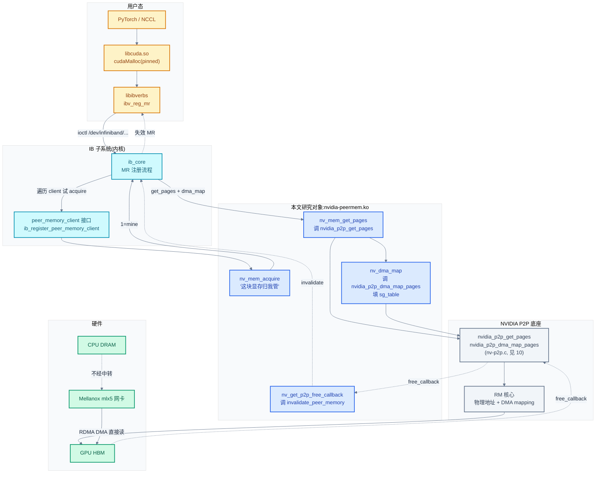
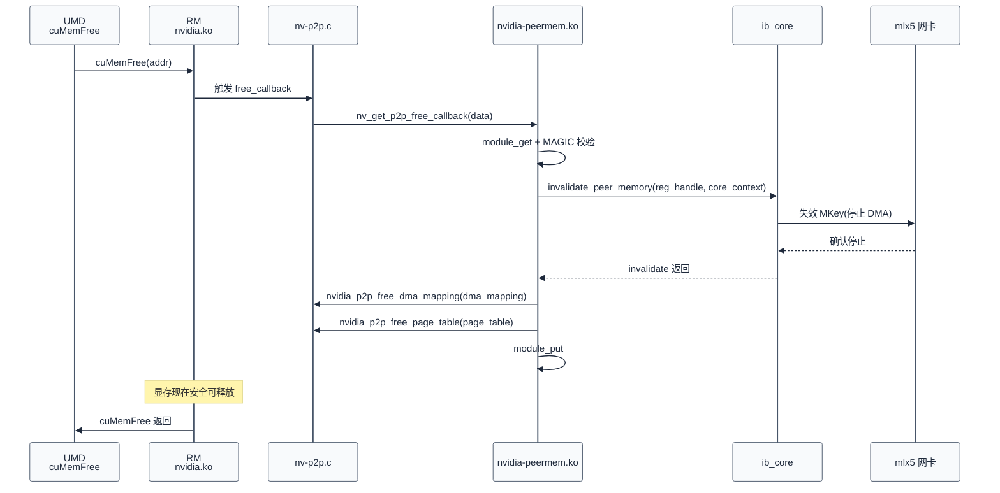
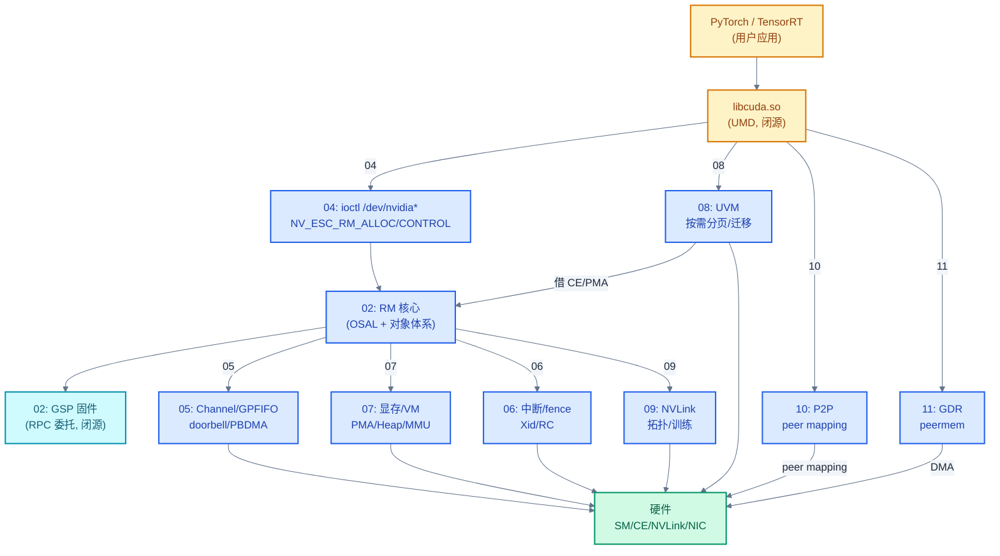

# GPUDirect RDMA:nvidia-peermem.ko

> 10 讲的是"GPU-GPU"P2P(`cudaDeviceEnablePeerAccess`)和"GPU-第三方设备"P2P(`nvidia_p2p_get_pages`)。但分布式训练/推理里最关键的场景是"GPU 显存直接被网卡 DMA 发出去"——不经 CPU 中转,延迟降一个数量级。这就是 GPUDirect RDMA(GDR)。NCCL 在 [../nccl/08](../nccl/08-transport-layer.md) §4.3 一句带过"GDR 需要 nvidia-peermem.ko",本章拆解这个独立内核模块:`nvidia-peermem.ko` 是个**胶水层**——它把 NVIDIA 的 `nvidia_p2p_get_pages` API(见 [10 §3](./10-多卡P2P-UVM-peer-mapping.md))适配为 Linux IB(InfiniBand)子系统的 `peer_memory_client` 接口,让 Mellanox mlx5 等网卡能"认出"GPU 显存并直接 DMA。
>
> **工程师视角**:读完本章你能解释 `nvidia-peermem.ko` 与 `nvidia.ko` 的关系(独立模块,依赖 `nvidia_p2p_*` 符号)、能区分两条 GDR 路径——传统 peermem(`ib_register_peer_memory_client`)vs 现代 DMA-BUF(`dma_buf_export`)、能定位"GDR 不工作"的常见原因(peermem 没加载、IB 驱动先于 nvidia 加载、GPU 显存不是 pinned)、能理解为什么 NCCL 跨节点训练必须加载 `nvidia-peermem.ko`(否则走 `cudaMemcpy` 到 CPU 再发,带宽降 5-10 倍)。

### 关键术语

| 缩写 | 全称 | 含义 |
|------|------|------|
| GDR | GPUDirect RDMA | RDMA 直接访问 GPU 显存,绕过 CPU |
| RDMA | Remote Direct Memory Access | 远程直接内存访问 |
| IB | InfiniBand | RDMA 网络协议(亦支持 RoCE) |
| RoCE | RDMA over Converged Ethernet | 基于以太网的 RDMA |
| MR | Memory Region | IB 注册的内存区域,RDMA 访问的前提 |
| MKey | Memory Key | IB 的内存访问密钥,绑定到 MR |
| FMR | Fast Memory Registration | IB 快速内存注册 |
| ODP | On-Demand Paging | IB 按需分页(隐式注册) |
| UMD | User Mode Driver | 用户态驱动 libcuda.so |
| KMD | Kernel Mode Driver | 内核态驱动 |
| P2P | Peer-to-Peer | 设备间直接访问,见 [10](./10-多卡P2P-UVM-peer-mapping.md) |
| DMA | Direct Memory Access | 直接内存访问 |
| DMA-BUF | — | Linux 内核的 DMA 缓冲共享框架 |
| sg_table | Scatter-Gather Table | Linux 内核的散列-聚集表,DMA 地址列表 |
| NIC | Network Interface Card | 网卡 |
| NCCL | NVIDIA Collective Communications Library | 多卡通信库 |
| NVLink | — | GPU 间互联,见 [09](./09-NVLink-KMD拓扑与训练.md) |
| MLNX | Mellanox | NVIDIA 收购的网络厂商,mlx5 驱动 |
| CE | Copy Engine | 拷贝引擎 |
| BAR | Base Address Register | PCIe 基地址寄存器 |

---

## 1. 概述

### 1.1 前置知识

| 需要了解 | 参考文档 |
|----------|----------|
| `nvidia_p2p_get_pages` API 与 `free_callback` 机制 | [10-多卡P2P:UVM peer mapping](./10-多卡P2P-UVM-peer-mapping.md) §3 |
| GPU 显存物理地址导出、DMA mapping 建立 | [10-多卡P2P:UVM peer mapping](./10-多卡P2P-UVM-peer-mapping.md) §3.5 |
| NCCL transport 层期望的内核契约 | [../nccl/08-transport-layer](../nccl/08-transport-layer.md) §4.3 |
| IB Verbs API 与 MR 注册语义 | [../rdma/](../rdma/) |
| Linux 内核模块与 EXPORT_SYMBOL | [02-源码架构与RM分层设计](./02-源码架构与RM分层设计.md) §3 |
| PCIe BAR 与 DMA | [../pcie/](../pcie/) |

### 1.2 系统上下文

**项目定位**:本章研究的是 **`nvidia-peermem.ko` 独立内核模块**——它是 NVIDIA 在 Linux IB 子系统里的"代言人"。问题背景:IB 驱动(mlx5)在注册 MR(Memory Region)时,需要拿到内存的物理地址(DMA 地址)来填 MKey。对于普通 CPU 内存,这是 `ib_umem_get` → `dma_map_sg` 的标准流程;但对于 GPU 显存,`dma_map_sg` 不认识——GPU 显存不在 CPU 的 `struct page` 体系内(除非是 Grace Hopper 等自托管 GPU),Linux 内核没有标准的"GPU 显存导出"接口。

为解决这个,Linux IB 子系统提供了**peer memory client** 机制——一个内核模块可以注册为"peer memory provider",声明"我能处理这种内存的注册"。IB 驱动遇到非标准内存时,遍历所有注册的 peer memory client,问"这块地址归你管吗",谁应答"是我的"就用谁。`nvidia-peermem.ko` 就是 NVIDIA 注册的 peer memory client,它把 IB 的请求翻译为 `nvidia_p2p_get_pages` 调用(见 [10](./10-多卡P2P-UVM-peer-mapping.md))。

**软硬件耦合点**:本章聚焦五个耦合点:

1. **模块依赖链**:`nvidia-peermem.ko` 依赖 `nvidia.ko` 的 `nvidia_p2p_*` 符号(`EXPORT_SYMBOL`)与 IB 核心的 `ib_register_peer_memory_client` 符号。**加载顺序敏感**——如果 IB 驱动先于 nvidia 加载,或 peermem 没加载,IB 注册 GPU 显存的 MR 会失败,NCCL 跨节点通信降级为 `cudaMemcpy`(经 CPU 中转)。
2. **`peer_memory_client` 回调契约**:IB 核心定义了 `acquire`/`get_pages`/`dma_map`/`dma_unmap`/`put_pages`/`release` 六个回调,peermem 实现它们,把 IB 的请求翻译为 `nvidia_p2p_*` 调用。这是两个子系统的边界。
3. **`invalidate_peer_memory` 回调**:IB 核心向 peermem 注册一个 `invalidate` 回调,当 GPU 显存被释放(`cuMemFree`)触发 `nvidia_p2p` 的 `free_callback` 时,peermem 调 IB 的 `invalidate` 通知 IB 失效相关 MR。这是 GDR 生命周期的关键。
4. **legacy vs nc(non-coherent)两套 client**:peermem 注册两个 client——legacy 用非持久 `nvidia_p2p_get_pages`(带 callback),nc 用持久 `nvidia_p2p_get_pages_persistent`(无 callback,显存 pin 住)。这是新旧两种 MR 注册策略的并存。
5. **DMA-BUF 现代 path**:Linux 5.x 推荐用 DMA-BUF 替代 peer memory client。NVIDIA 在 `nv-dmabuf.c` 实现 `dma_buf_export`,提供更标准的显存导出。但 IB 驱动对 DMA-BUF 的支持仍在演进,peermem 仍是主流。

**跨实现对比**:与 Linux 标准 DMA-BUF 对比——DMA-BUF 是内核原生的"buffer 共享"框架,通过 `dma_buf_export`/`dma_buf_get`/`dma_buf_attach` 三步让多个设备共享 buffer;peermem 是 IB 子系统专用的"peer memory"框架,早于 DMA-BUF 出现。现代趋势是 DMA-BUF 取代 peermem,但 IB 驱动(尤其老版 mlx5)仍主要用 peermem。与 AMD amdgpu 对比——amdgpu 直接用 DMA-BUF(`amdgpu_gem_prime_export`),没有独立 peermem 模块;NVIDIA 因历史原因两套并存。详见 §8。



> **如何读这张图**:GDR 的完整路径——用户态 `ibv_reg_mr`(黄)经 IB 核心(青)调用 peermem(蓝)的 `acquire` 探测"这块地址归我管吗",是的则 `get_pages` + `dma_map`(蓝)调 `nvidia_p2p_*`(灰)拿到 GPU 显存的 DMA 地址,填 `sg_table` 返回给 IB 核心。IB 据此填 MKey,网卡(绿)就能直接 DMA GPU HBM。**关键是没有任何 CPU 中转**——数据从 GPU HBM 直接经 PCIe/NVLink 到网卡,再到对端节点。失效路径(虚线):GPU 显存被释放时,`nvidia_p2p` 经 `free_callback` → peermem → IB 的 `invalidate` 通知用户态失效 MR。

---

## 2. 模块入口与加载顺序

> 本节拆解 `nvidia-peermem.ko` 的模块入口与加载顺序约束——这是 GDR 能否工作的第一个门槛。

### 2.1 模块初始化

`nvidia-peermem.c` 的模块入口是 `nv_mem_client_init`,它注册两个 peer memory client:

```c
/* 摘自 [kernel-open/nvidia-peermem/nvidia-peermem.c](./src/open-gpu-kernel-modules/kernel-open/nvidia-peermem/nvidia-peermem.c) 第 641-678 行(简化) */
static int __init nv_mem_client_init(void)
{
#if defined (NV_MLNX_IB_PEER_MEM_SYMBOLS_PRESENT)
    int rc;
    rc = nv_mem_param_peerdirect_conf_check();   // 校验模块参数
    if (rc) return rc;

    rc = nv_mem_param_persistent_api_conf_check();
    if (rc) return rc;

    if (persistent_api_support == NV_MEM_PERSISTENT_API_SUPPORT_LEGACY) {
        rc = nv_mem_legacy_client_init();        // 注册 legacy client(非持久)
        if (rc) goto out;
    }

    rc = nv_mem_nc_client_init();                // 注册 nc client(持久)
    if (rc) goto out;

out:
    if (rc) {
        if (reg_handle) {
            ib_unregister_peer_memory_client(reg_handle);
            reg_handle = NULL;
        }
        if (reg_handle_nc) {
            ib_unregister_peer_memory_client(reg_handle_nc);
            reg_handle_nc = NULL;
        }
    }
    return rc;
#else
    return -EINVAL;     // 编译时未检测到 IB peer_mem 符号,拒绝加载
#endif
}
```

**这段代码体现了三个设计决策**:

1. **`NV_MLNX_IB_PEER_MEM_SYMBOLS_PRESENT` 编译时检测**——peermem 在编译时检查 IB 核心是否提供了 `ib_register_peer_memory_client` 等符号。如果没有(老内核或 IB 没装),整个模块编译为"返回 -EINVAL"的空壳,加载时直接失败。这避免了运行时符号缺失导致的 oops。
2. **两个 client 并存**——`nv_mem_legacy_client_init` 注册 legacy client(非持久,带 callback),`nv_mem_nc_client_init` 注册 nc client(non-coherent,持久,无 callback)。**注意 `if (persistent_api_support == LEGACY)` 条件**——只有强制 legacy 模式才注册 legacy client;默认只注册 nc client。这是从 legacy 向 persistent 的渐进迁移。
3. **失败回滚**——如果 nc client 注册失败,要撤销 legacy client 的注册。这是标准的资源管理。

### 2.2 加载顺序约束

`nvidia-peermem.ko` 的依赖:

```
nvidia-peermem.ko
  ├── nvidia.ko          (提供 nvidia_p2p_get_pages 等 EXPORT_SYMBOL)
  └── ib_core            (提供 ib_register_peer_memory_client)
        └── mlx5_ib / mlx5_core  (NIC 驱动)
```

**加载顺序**:`nvidia.ko` → `ib_core` → `mlx5_core` → `mlx5_ib` → `nvidia-peermem.ko`。Linux 的 modprobe 通常按依赖自动排序,但**手动加载或 initramfs 配置错误**会破坏顺序。常见问题:

- **peermem 没加载**:IB 注册 GPU 显存 MR 时,没有 client 应答 `acquire`,返回错误。NCCL 跨节点通信降级为 `cudaMemcpy`(经 CPU 中转)。
- **nvidia.ko 没加载**:peermem 找不到 `nvidia_p2p_get_pages` 符号,加载失败(`Unknown symbol` 错误)。
- **IB 驱动在 peermem 之前注册 MR**:MR 注册会失败,需要 peermem 加载后重试。

NVIDIA 驱动安装包通常会在 `modprobe.d` 配置 `softdep nvidia-peermem post: nvidia ib_core`,确保顺序。但用户自编译时容易漏配。

> **核心要点**:peermem 是个"依赖两端"的胶水模块——依赖 `nvidia.ko`(P2P 底座)与 `ib_core`(peer memory client 框架)。加载顺序错误是 GDR 故障的最常见原因。`lsmod | grep peermem` 是排查 GDR 问题的第一步。

---

## 3. peer_memory_client 接口

> 本节拆解 peermem 注册给 IB 核心的回调表——这是 IB 子系统与 NVIDIA 驱动的契约边界。

### 3.1 两个 client 结构

```c
/* 摘自 [kernel-open/nvidia-peermem/nvidia-peermem.c](./src/open-gpu-kernel-modules/kernel-open/nvidia-peermem/nvidia-peermem.c) 第 491-499 行 + 第 534-542 行 */
static struct peer_memory_client_ex nv_mem_client_ex = { .client = {
    .acquire        = nv_mem_acquire,
    .get_pages  = nv_mem_get_pages,
    .dma_map    = nv_dma_map,
    .dma_unmap  = nv_dma_unmap,
    .put_pages  = nv_mem_put_pages,
    .get_page_size  = nv_mem_get_page_size,
    .release        = nv_mem_release,
}};

static struct peer_memory_client nv_mem_client_nc = {
    .acquire        = nv_mem_acquire_nc,
    .get_pages      = nv_mem_get_pages_nc,
    .dma_map        = nv_dma_map,
    .dma_unmap      = nv_dma_unmap,
    .put_pages      = nv_mem_put_pages_nc,
    .get_page_size  = nv_mem_get_page_size,
    .release        = nv_mem_release,
};
```

**六个回调的职责**:

| 回调 | 作用 | 调用时机 | peermem 实现 |
|------|------|----------|-------------|
| `acquire` | 探测"这块地址归我管吗" | IB 注册 MR 时,遍历 client 调 acquire | 试调 `nvidia_p2p_get_pages`,成功则返回 1(归我管),失败返回 0(不归我) |
| `get_pages` | 获取页(DMA 地址) | acquire 成功后 | 调 `nvidia_p2p_get_pages`,注册 `free_callback` |
| `dma_map` | 建 DMA mapping | get_pages 后 | 调 `nvidia_p2p_dma_map_pages`,填 `sg_table` |
| `dma_unmap` | 解除 DMA mapping | MR 释放或 invalidate 时 | 调 `nvidia_p2p_dma_unmap_pages` |
| `put_pages` | 释放页 | dma_unmap 后 | 调 `nvidia_p2p_put_pages` |
| `release` | 释放 client context | MR 完全销毁 | 释放 `nv_mem_context` |
| `get_page_size` | 返回页大小 | IB 计算 MR 对齐 | 返回 64KB(GPU_PAGE_SIZE) |

**两套 client 的差异**:

| 维度 | legacy(`nv_mem_client_ex`) | nc(`nv_mem_client_nc`) |
|------|----------------------------|------------------------|
| `acquire` | `nv_mem_acquire`(用 `nvidia_p2p_get_pages` 探测) | `nv_mem_acquire_nc`(用 `nvidia_p2p_get_pages_persistent` 探测) |
| `get_pages` | `nv_mem_get_pages`(注册 `free_callback`) | `nv_mem_get_pages_nc`(无 callback,显存 pin 住) |
| `put_pages` | `nv_mem_put_pages` | `nv_mem_put_pages_nc` |
| 失效通知 | **有**(经 `invalidate_peer_memory`) | 无(显存不会失效) |
| 注册结构 | `peer_memory_client_ex`(扩展,带 flags) | `peer_memory_client`(基础) |
| 注册时获取 invalidate | 是(`ib_register_peer_memory_client` 第二参数) | 否(传 NULL) |

**为什么 nc 不需要 invalidate?** 因为 nc 用 `nvidia_p2p_get_pages_persistent`,显存被 pin 住不会迁移/释放,所以不会有失效通知。代价是显存占用——只要 MR 存在,显存就不能被 UVM 迁移或回收。legacy 用非持久 mapping,显存可以正常迁移,但每次迁移要通知 IB 失效旧 MR、重注册新 MR,开销大。

### 3.2 legacy client 的 invalidate 机制

```c
/* 摘自 [kernel-open/nvidia-peermem/nvidia-peermem.c](./src/open-gpu-kernel-modules/kernel-open/nvidia-peermem/nvidia-peermem.c) 第 544-577 行(简化) */
static int nv_mem_legacy_client_init(void)
{
    BUG_ON(strlen(DRV_NAME) > IB_PEER_MEMORY_NAME_MAX-1);
    strcpy(nv_mem_client_ex.client.name, DRV_NAME);          // "nv_mem"

    // [VER_MAX-1]=1 <-- last byte is used as flag
    // [VER_MAX-2]=0 <-- version string terminator
    strcpy(nv_mem_client_ex.client.version, DRV_VERSION);
    nv_mem_client_ex.client.version[IB_PEER_MEMORY_VER_MAX-1] = 1;   // 标记新 client 类型

    if (peerdirect_support != NV_MEM_PEERDIRECT_SUPPORT_LEGACY) {
        nv_mem_client_ex.ex_size = sizeof(struct peer_memory_client_ex);
        // PEER_MEM_INVALIDATE_UNMAPS allow clients to opt out of
        // unmap/put_pages during invalidation, i.e. the client tells the
        // infiniband layer that it does not need to call
        // unmap/put_pages in the invalidation callback
        nv_mem_client_ex.flags = PEER_MEM_INVALIDATE_UNMAPS;   // peermem 自己管 unmap
    } else {
        nv_mem_client_ex.ex_size = 0;
        nv_mem_client_ex.flags = 0;
    }

    reg_handle = ib_register_peer_memory_client(&nv_mem_client_ex.client,
                         &mem_invalidate_callback);   // 第二参数获取 invalidate 回调
    if (!reg_handle) return -EINVAL;
    return 0;
}
```

**这段代码的设计**:

1. **version 字节的"标志位"技巧**——`version[IB_PEER_MEMORY_VER_MAX-1] = 1` 用版本字符串的最后一个字节作为"新 client 类型"标志。这是个 ABI 兼容性 hack——老 IB 核心不读这个字节,新 IB 核心读它判断是否支持 `ex_size`/`flags` 字段。这种"在字符串尾部藏标志"的做法是为了向前兼容(老核心仍能加载新模块)。
2. **`PEER_MEM_INVALIDATE_UNMAPS` flag**——告诉 IB 核心"peermem 自己处理 unmap/put_pages,你不要在 invalidate 回调里调"。这是因为 peermem 在 `nv_get_p2p_free_callback` 里会自己调 `nvidia_p2p_free_dma_mapping`,如果 IB 核心也调会重复释放。这是责任划分的显式声明。
3. **`mem_invalidate_callback` 出参**——`ib_register_peer_memory_client` 的第二参数是出参,IB 核心填入它的 `invalidate_peer_memory` 函数指针。peermem 保存这个指针,在 GPU 显存失效时调它通知 IB。

### 3.3 nc client 注册

```c
/* 摘自 [kernel-open/nvidia-peermem/nvidia-peermem.c](./src/open-gpu-kernel-modules/kernel-open/nvidia-peermem/nvidia-peermem.c) 第 579-606 行 */
static int nv_mem_nc_client_init(void)
{
    // The nc client enables support for persistent pages.
    if (persistent_api_support == NV_MEM_PERSISTENT_API_SUPPORT_LEGACY)
    {
        // If legacy behavior is forced via module param,
        // both legacy and persistent clients are registered and are named
        // "nv_mem"(legacy) and "nv_mem_nc"(persistent).
        strcpy(nv_mem_client_nc.name, DRV_NAME "_nc");    // 强制 legacy:nc 改名
    }
    else
    {
        // With default persistent behavior, the client name shall be "nv_mem"
        // so that libraries can use the persistent client under the same name.
        strcpy(nv_mem_client_nc.name, DRV_NAME);           // 默认:nc 用 nv_mem 名字
    }

    strcpy(nv_mem_client_nc.version, DRV_VERSION);

    reg_handle_nc = ib_register_peer_memory_client(&nv_mem_client_nc, NULL);   // 第二参数 NULL,无 invalidate
    if (!reg_handle_nc) return -EINVAL;
    return 0;
}
```

**命名策略的设计**:默认情况下 nc client 名字是 `nv_mem`(与 legacy 同名)——这样用户态库(如 NCCL、Mellanox 的 `nv_peer_mem` 用户态辅助)按名字查找时,优先匹配到 nc client(因为 nc 后注册,排在 client 链表前面)。只有强制 legacy 模式时,nc 改名 `nv_mem_nc`,让 legacy 独占 `nv_mem` 名字。这是从 legacy 向 persistent 迁移的平滑过渡——默认用 nc,需要兼容老行为时强制 legacy。

---

## 4. acquire:探测"归我管吗"

> IB 核心注册 MR 时,遍历所有 peer memory client 调 `acquire`,谁返回 1(归我管)就用谁。本节拆解 peermem 的 acquire 实现。

### 4.1 nv_mem_acquire(legacy)

```c
/* 摘自 [kernel-open/nvidia-peermem/nvidia-peermem.c](./src/open-gpu-kernel-modules/kernel-open/nvidia-peermem/nvidia-peermem.c) 第 198-243 行(简化) */
/* acquire return code: 1 mine, 0 - not mine */
static int nv_mem_acquire(unsigned long addr, size_t size, void *peer_mem_private_data,
                          char *peer_mem_name, void **client_context)
{
    int ret = 0;
    struct nv_mem_context *nv_mem_context;

    nv_mem_context = kzalloc(sizeof *nv_mem_context, GFP_KERNEL);
    if (!nv_mem_context)
        return 0;   // 内存分配失败,当作"不归我管"让其他 client 试

    nv_mem_context->pad1 = NV_MEM_CONTEXT_MAGIC;
    nv_mem_context->page_virt_start = addr & GPU_PAGE_MASK;            // 64KB 对齐
    nv_mem_context->page_virt_end   = (addr + size + GPU_PAGE_SIZE - 1) & GPU_PAGE_MASK;
    nv_mem_context->mapped_size  = nv_mem_context->page_virt_end - nv_mem_context->page_virt_start;
    nv_mem_context->pad2 = NV_MEM_CONTEXT_MAGIC;

    // 试调 nvidia_p2p_get_pages 探测地址是否是 GPU 显存
    ret = nvidia_p2p_get_pages(0, 0, nv_mem_context->page_virt_start, nv_mem_context->mapped_size,
                               &nv_mem_context->page_table, nv_mem_dummy_callback, nv_mem_context);

    if (ret < 0)
        goto err;

    // 探测成功,立即 put_pages 释放(只是探测,真正 get_pages 在 nv_mem_get_pages)
    ret = nvidia_p2p_put_pages(0, 0, nv_mem_context->page_virt_start,
                               nv_mem_context->page_table);
    if (ret < 0) {
        peer_err("nv_mem_acquire -- error %d while calling nvidia_p2p_put_pages()\n", ret);
        goto err;
    }

    /* 1 means mine */
    *client_context = nv_mem_context;
    __module_get(THIS_MODULE);
    return 1;

err:
    memset(nv_mem_context, 0, sizeof(*nv_mem_context));
    kfree(nv_mem_context);
    return 0;   // 出错也当作"不归我管"
}
```

**这段代码体现了三个关键设计**:

1. **"试调 `nvidia_p2p_get_pages` 探测"**——`nvidia_p2p_get_pages` 如果地址不是 GPU 显存,返回错误;是则成功。peermem 借这个语义做"是否归我管"的判断。这是个**试探性调用**——成功后立即 `put_pages` 释放,只是确认归属。
2. **"出错当不归我管"**——任何错误都返回 0(不归我管),让 IB 核心继续问下一个 client。这是健壮性设计——peermem 不应该因为自己出错阻塞 IB 注册流程。
3. **`__module_get(THIS_MODULE)` 引用计数**——acquire 成功后增加模块引用计数,防止 MR 存活期间 peermem 被卸载。对应的 `release` 里 `module_put`。

### 4.2 64KB 对齐的重要性

`addr & GPU_PAGE_MASK` 把地址向下对齐到 64KB 边界。这是因为 `nvidia_p2p_get_pages` 要求 64KB 对齐(见 [10 §3.3](./10-多卡P2P-UVM-peer-mapping.md))。如果用户传的地址不对齐,peermem 自动对齐到包含该地址的 64KB 块——但这意味着映射范围可能比用户请求的大,可能跨多个 GPU 显存分配。IB 核心据此计算 MR 大小,可能比用户预期大。

### 4.3 nv_mem_dummy_callback:探测期的占位 callback

注意 acquire 里 `nvidia_p2p_get_pages` 传的 callback 是 `nv_mem_dummy_callback`,不是 `nv_get_p2p_free_callback`:

```c
/* 摘自 [kernel-open/nvidia-peermem/nvidia-peermem.c](./src/open-gpu-kernel-modules/kernel-open/nvidia-peermem/nvidia-peermem.c) 第 182-195 行 */
/* At that function we don't call IB core - no ticket exists */
static void nv_mem_dummy_callback(void *data)
{
    struct nv_mem_context *nv_mem_context = (struct nv_mem_context *)data;
    int ret = 0;

    __module_get(THIS_MODULE);

    ret = nvidia_p2p_free_page_table(nv_mem_context->page_table);
    if (ret)
        peer_err("nv_mem_dummy_callback -- error %d while calling nvidia_p2p_free_page_table()\n", ret);

    module_put(THIS_MODULE);
    return;
}
```

注释说"At that function we don't call IB core - no ticket exists"——探测期还没有 IB 的 `core_context`(IB 给的 ticket,用于 invalidate 回调时定位 MR),所以不能调 IB 的 invalidate。dummy callback 只做最简单的清理(释放 page_table),不通知 IB。真正的 callback 在 `nv_mem_get_pages` 里注册为 `nv_get_p2p_free_callback`(此时已有 `core_context`)。

---

## 5. get_pages 与 dma_map:建立映射

> acquire 成功后,IB 核心调 `get_pages` 真正获取页,再调 `dma_map` 建 DMA mapping。本节拆解这两个核心回调。

### 5.1 nv_mem_get_pages(legacy)

```c
/* 摘自 [kernel-open/nvidia-peermem/nvidia-peermem.c](./src/open-gpu-kernel-modules/kernel-open/nvidia-peermem/nvidia-peermem.c) 第 452-478 行(简化) */
static int nv_mem_get_pages(unsigned long addr,
                            size_t size, int write, int force,
                            struct sg_table *sg_head,
                            void *client_context,
                            u64 core_context)
{
    int ret;
    struct nv_mem_context *nv_mem_context;

    nv_mem_context = (struct nv_mem_context *)client_context;
    if (!nv_mem_context)
        return -EINVAL;

    nv_mem_context->core_context = core_context;   // 保存 IB 的 ticket(用于 invalidate)
    nv_mem_context->page_size = GPU_PAGE_SIZE;

    ret = nvidia_p2p_get_pages(0, 0, nv_mem_context->page_virt_start, nv_mem_context->mapped_size,
                               &nv_mem_context->page_table, nv_get_p2p_free_callback, nv_mem_context);
    if (ret < 0) {
        peer_err("error %d while calling nvidia_p2p_get_pages()\n", ret);
        return ret;
    }

    return 0;
}
```

**关键差异 vs acquire**:`get_pages` 注册的是 `nv_get_p2p_free_callback`(真正的失效回调),不是 `nv_mem_dummy_callback`。因为此时已收到 IB 的 `core_context`(ticket),可以通知 IB 失效 MR。

`nv_mem_get_pages_nc`(持久版本)的差异:用 `nvidia_p2p_get_pages_persistent`,传 `NULL` 作为 callback——显存 pin 住,不会有失效通知。

### 5.2 nv_dma_map:建 DMA mapping 并填 sg_table

```c
/* 摘自 [kernel-open/nvidia-peermem/nvidia-peermem.c](./src/open-gpu-kernel-modules/kernel-open/nvidia-peermem/nvidia-peermem.c) 第 300-355 行(简化) */
static int nv_dma_map(struct sg_table *sg_head, void *context,
                      struct device *dma_device, int dmasync,
                      int *nmap)
{
    int i, ret;
    struct scatterlist *sg;
    struct nv_mem_context *nv_mem_context =
        (struct nv_mem_context *) context;
    struct nvidia_p2p_page_table *page_table = nv_mem_context->page_table;
    struct nvidia_p2p_dma_mapping *dma_mapping;
    struct pci_dev *pdev = to_pci_dev(dma_device);

    if (page_table->page_size != NVIDIA_P2P_PAGE_SIZE_64KB) {
        peer_err("nv_dma_map -- assumption of 64KB pages failed size_id=%u\n",
                    nv_mem_context->page_table->page_size);
        return -EINVAL;
    }

    if (!pdev) {
        peer_err("nv_dma_map -- invalid pci_dev\n");
        return -EINVAL;
    }

    ret = nvidia_p2p_dma_map_pages(pdev, page_table, &dma_mapping);   // 建映射
    if (ret) {
        peer_err("nv_dma_map -- error %d while calling nvidia_p2p_dma_map_pages()\n", ret);
        return ret;
    }

    if (!NVIDIA_P2P_DMA_MAPPING_VERSION_COMPATIBLE(dma_mapping)) {
        peer_err("error, incompatible dma mapping version 0x%08x\n",
                 dma_mapping->version);
        /* ... */
    }

    nv_mem_context->dma_mapping = dma_mapping;
    nv_mem_context->sg_allocated = 1;
    // 填 sg_table:每个 sg 项对应一个 GPU 页的 DMA 地址
    for_each_sg(sg_head->sgl, sg, nv_mem_context->npages, i) {
        sg_set_page(sg, NULL, nv_mem_context->page_size, 0);   // page=NULL(非 CPU 页)
        sg_dma_address(sg) = dma_mapping->dma_addresses[i];   // DMA 地址
        sg_dma_len(sg) = nv_mem_context->page_size;
    }
    nv_mem_context->sg_head = *sg_head;
    *nmap = nv_mem_context->npages;

    return 0;
}
```

**这段代码体现了三个设计**:

1. **`nvidia_p2p_dma_map_pages` 委托 P2P 层**——peermem 不自己建 DMA mapping,调 [10 §3.5](./10-多卡P2P-UVM-peer-mapping.md) 的 `nvidia_p2p_dma_map_pages`(传入网卡 `pdev`)。这是层次分明的设计——peermem 只做 IB ↔ NVIDIA 的翻译,DMA 细节由 P2P 层处理。
2. **`sg_set_page(sg, NULL, ...)`**——`struct page` 设为 NULL!这是 GPU 显存的关键特征——它不在 Linux 的 `struct page` 体系内(除非是 coherent GPU)。`sg_dma_address` 直接填 DMA 地址,IB 驱动据此填 MKey,不依赖 `struct page`。这是 peermem 能工作的核心——绕过了 Linux "DMA 必须有 struct page"的假设。
3. **版本兼容性检查**——`NVIDIA_P2P_DMA_MAPPING_VERSION_COMPATIBLE` 检查 `dma_mapping->version`,如果不兼容直接报错。这是 ABI 保护——驱动升级后 `nvidia_p2p_dma_mapping` 结构可能扩展,旧 peermem 用旧版本字段,新驱动可能填新版本,检查避免字段错位。

### 5.3 64KB 假设的硬编码

`if (page_table->page_size != NVIDIA_P2P_PAGE_SIZE_64KB)` 检查页大小必须是 64KB——这是个**硬编码假设**。如果 GPU 用 128KB 大页(某些配置),`nv_dma_map` 直接返回 `-EINVAL`。这是个限制——peermem 假设 GPU 用 64KB big page,与 IB MR 的页大小对齐。这个假设在大多数场景成立(64KB 是 NVIDIA P2P 的默认页大小),但 MIG 或特定配置下可能用 128KB,此时 GDR 不可用。

---

## 6. 失效回调:GDR 生命周期的关键

> 本节拆解 peermem 如何处理 GPU 显存失效——这是 GDR 安全性的核心。如果显存被释放但 IB MR 还指向它,网卡 DMA 会读到脏数据或触发 PCIe 错误。

### 6.1 nv_get_p2p_free_callback

```c
/* 摘自 [kernel-open/nvidia-peermem/nvidia-peermem.c](./src/open-gpu-kernel-modules/kernel-open/nvidia-peermem/nvidia-peermem.c) 第 129-179 行(简化) */
static void nv_get_p2p_free_callback(void *data)
{
    int ret = 0;
    struct nv_mem_context *nv_mem_context = (struct nv_mem_context *)data;
    struct nvidia_p2p_page_table *page_table = NULL;
    struct nvidia_p2p_dma_mapping *dma_mapping = NULL;

    __module_get(THIS_MODULE);

    if (!NV_MEM_CONTEXT_CHECK_OK(nv_mem_context)) {
        peer_err("detected invalid context, skipping further processing\n");
        goto out;
    }

    if (!nv_mem_context->page_table) {
        peer_err("nv_get_p2p_free_callback -- invalid page_table\n");
        goto out;
    }

    /* Save page_table locally to prevent it being freed as part of nv_mem_release
     *  in case it's called internally by that callback.
     */
    page_table = nv_mem_context->page_table;

    if (!nv_mem_context->dma_mapping) {
        peer_err("nv_get_p2p_free_callback -- invalid dma_mapping\n");
        goto out;
    }
    dma_mapping = nv_mem_context->dma_mapping;

    /* For now don't set nv_mem_context->page_table to NULL,
     * confirmed by NVIDIA that inflight put_pages with valid pointer will fail gracefully.
     */

    nv_mem_context->callback_task = current;
    (*mem_invalidate_callback) (reg_handle, nv_mem_context->core_context);   // 通知 IB 失效 MR
    nv_mem_context->callback_task = NULL;

    ret = nvidia_p2p_free_dma_mapping(dma_mapping);   // 释放 DMA mapping
    if (ret)
        peer_err("nv_get_p2p_free_callback -- error %d while calling nvidia_p2p_free_dma_mapping()\n", ret);

    ret = nvidia_p2p_free_page_table(page_table);     // 释放 page_table
    if (ret)
        peer_err("nv_get_p2p_free_callback -- error %d while calling nvidia_p2p_free_page_table()\n", ret);

out:
    module_put(THIS_MODULE);
    return;
}
```

**这段代码是 GDR 安全的核心**,体现四个设计:

1. **`__module_get` 引用计数**——回调可能在模块正在卸载时触发,先增加引用计数确保 peermem 不会被卸载。
2. **`NV_MEM_CONTEXT_CHECK_OK` 魔数校验**——检查 `nv_mem_context` 的 `pad1`/`pad2` 是否等于 `NV_MEM_CONTEXT_MAGIC`。这是防御性编程——如果 context 已被释放或损坏,魔数会变,跳过处理避免 use-after-free。
3. **保存 `page_table` 到本地变量**——注释说"防止 `nv_mem_release` 内部调用时释放"。这是个并发场景——`mem_invalidate_callback` 可能触发 IB 核心调 `release`,而 `release` 会 `kfree(nv_mem_context)`。先把 `page_table` 指针保存到栈变量,即使 context 被释放,本地指针仍有效,可以继续调 `nvidia_p2p_free_*`。
4. **`callback_task = current`**——记录当前任务是回调。后续 `nv_dma_unmap`/`nv_mem_put_pages` 检查这个字段,如果是回调任务发起的,跳过重复释放(因为回调已经释放了)。

### 6.2 失效流程的时序



> **如何读这张图**:GPU 显存释放时,RM 触发 `nvidia_p2p` 的 `free_callback` → peermem 收到 → 通知 IB 核心 invalidate MR → IB 通知网卡停止 DMA → 网卡确认 → peermem 释放 DMA mapping 和 page_table → 显存真正释放。**整个流程是同步的**——`cuMemFree` 阻塞直到 invalidate 完成,保证释放后不会有 in-flight DMA。这是 GDR 安全性的核心保证。

### 6.3 callback_task 的并发控制

`nv_dma_unmap` 和 `nv_mem_put_pages_common` 都检查 `callback_task == current`:

```c
/* 摘自 [kernel-open/nvidia-peermem/nvidia-peermem.c](./src/open-gpu-kernel-modules/kernel-open/nvidia-peermem/nvidia-peermem.c) 第 357-381 行(简化) */
static int nv_dma_unmap(struct sg_table *sg_head, void *context,
               struct device  *dma_device)
{
    struct pci_dev *pdev = to_pci_dev(dma_device);
    struct nv_mem_context *nv_mem_context = (struct nv_mem_context *)context;

    /* ... */

    if (nv_mem_context->callback_task == current)
        goto out;   // 失效回调发起的,跳过(回调里已释放)

    if (nv_mem_context->dma_mapping)
        nvidia_p2p_dma_unmap_pages(pdev, nv_mem_context->page_table,
                                   nv_mem_context->dma_mapping);

out:
    return 0;
}
```

**为什么需要这个检查?** 因为失效回调里调 `invalidate_peer_memory`,IB 核心可能**同步**调回 `dma_unmap`/`put_pages`(因为 `PEER_MEM_INVALIDATE_UNMAPS` flag 说 peermem 自己管,但 IB 仍可能调)。如果不检查,会重复释放:`nv_get_p2p_free_callback` 已调 `nvidia_p2p_free_dma_mapping`,IB 又调 `dma_unmap` 触发 `nvidia_p2p_dma_unmap_pages`——双重释放。

`callback_task = current` 标记"我现在在回调里",后续 IB 同步调回的 `dma_unmap`/`put_pages` 看到这个标记就跳过,避免重复。这是 peermem 处理回调重入的精巧设计。

---

## 7. 数据结构:nv_mem_context

> 本节拆解 peermem 的核心数据结构 `nv_mem_context`,它是连接 IB MR 与 NVIDIA P2P mapping 的桥梁。

### 7.1 结构定义

```c
/* 摘自 [kernel-open/nvidia-peermem/nvidia-peermem.c](./src/open-gpu-kernel-modules/kernel-open/nvidia-peermem/nvidia-peermem.c) 第 97-113 行 */
#define NV_MEM_CONTEXT_MAGIC ((u64)0xF1F4F1D0FEF0DAD0ULL)

struct nv_mem_context {
    u64 pad1;                                       // 魔数(开头)
    struct nvidia_p2p_page_table *page_table;       // GPU 页表(物理地址)
    struct nvidia_p2p_dma_mapping *dma_mapping;     // DMA mapping(DMA 地址)
    u64 core_context;                               // IB 的 ticket(失效时定位 MR)
    u64 page_virt_start;                            // VA 起始(64KB 对齐)
    u64 page_virt_end;                              // VA 结束
    size_t mapped_size;                             // 映射大小
    unsigned long npages;                           // 页数
    unsigned long page_size;                        // 页大小(64KB)
    struct task_struct *callback_task;              // 失效回调任务(并发控制)
    int sg_allocated;                               // sg_table 是否已分配
    struct sg_table sg_head;                        // 散列-聚集表(给 IB)
    u64 pad2;                                       // 魔数(结尾)
};
```

**设计决策**:

1. **`page_table` + `dma_mapping` 双引用**——peermem 同时持有 NVIDIA P2P 的两个核心对象(见 [10 §3.4](./10-多卡P2P-UVM-peer-mapping.md) 与 §3.5)。`page_table` 给 GPU 物理地址,`dma_mapping` 给网卡 DMA 地址,两者通过 `nv_mem_context` 桥接。
2. **`core_context` 是 IB 的 ticket**——IB 核心在 `get_pages` 时传入,peermem 保存。失效回调时用这个 ticket 告诉 IB"是哪个 MR 要失效"。这是 IB 与 peermem 的双向引用:peermem 用 `core_context` 找 IB 的 MR,IB 用 `client_context`(`nv_mem_context` 指针)找 peermem 的状态。
3. **`callback_task` 并发控制**——记录"当前是否在失效回调里",防止 IB 同步调回 `dma_unmap`/`put_pages` 时的重复释放(见 §6.3)。
4. **`sg_head` 散列-聚集表**——填好 DMA 地址的 `sg_table`,IB 核心据此填 MKey。这是 Linux DMA 的标准数据结构,peermem 把 GPU 显存"伪装"成标准的 sg_table 让 IB 能处理。

### 7.2 魔数校验:防御性编程

```c
/* 摘自 [kernel-open/nvidia-peermem/nvidia-peermem.c](./src/open-gpu-kernel-modules/kernel-open/nvidia-peermem/nvidia-peermem.c) 第 115-127 行 */
#define NV_MEM_CONTEXT_CHECK_OK(MC) ({                                  \
    struct nv_mem_context *mc = (MC);                                   \
    int rc = ((0 != mc) &&                                              \
              (READ_ONCE(mc->pad1) == NV_MEM_CONTEXT_MAGIC) &&          \
              (READ_ONCE(mc->pad2) == NV_MEM_CONTEXT_MAGIC));           \
    if (!rc) {                                                          \
        peer_trace("invalid nv_mem_context=%px pad1=%016llx pad2=%016llx\n", \
                   mc,                                                  \
                   mc?mc->pad1:0,                                       \
                   mc?mc->pad2:0);                                      \
    }                                                                   \
    rc;                                                                 \
})
```

**为什么用双魔数(头尾各一个)?**

- **`pad1`(头)**:检测 context 是否被分配且未损坏。如果 `pad1 != MAGIC`,要么 context 是空指针、要么是已释放的内存(被覆盖)、要么是错误指针。
- **`pad2`(尾)**:检测 context 是否被越界写破坏。如果 `pad1` 对但 `pad2` 不对,说明中间字段被越界写坏了(如 `sg_head` 写溢出)。

双魔数是 C 语言里常见的"canary"模式——Linux slab 的 `SLAB_POISON` 也是类似思路。在 peermem 这种"回调可能在任意时机触发"的场景下,context 可能已被释放,魔数校验避免 use-after-free 导致的 oops。

### 7.3 生命周期

`nv_mem_context` 的生命周期与 IB MR 绑定:

1. **`acquire`**:`kzalloc` 分配,填魔数,试调 `nvidia_p2p_get_pages` 探测。
2. **`get_pages`**:填 `core_context`,正式调 `nvidia_p2p_get_pages` 拿 `page_table`。
3. **`dma_map`**:调 `nvidia_p2p_dma_map_pages` 拿 `dma_mapping`,填 `sg_head`。
4. **MR 存活期间**:IB 用 `sg_head` 里的 DMA 地址做 RDMA,peermem 不参与(被动等失效回调)。
5. **`dma_unmap` + `put_pages`**:MR 释放时,调 `nvidia_p2p_dma_unmap_pages` + `nvidia_p2p_put_pages` 释放。
6. **`release`**:`sg_free_table` + `kfree(nv_mem_context)`。

失效回调是异步触发的——可能在步骤 4 期间任意时刻发生(显存被释放),此时跳过步骤 5,直接在回调里释放。

---

## 8. DMA-BUF 现代 path 与跨实现对比

### 8.1 DMA-BUF:Linux 内核原生的替代方案

Linux 5.x 推荐用 DMA-BUF 替代 peer memory client 机制。NVIDIA 在 `nv-dmabuf.c` 实现了 DMA-BUF 导出:

```c
/* 摘自 [kernel-open/nvidia/nv-dmabuf.c](./src/open-gpu-kernel-modules/kernel-open/nvidia/nv-dmabuf.c) 第 1543-1561 行 */
//
// So stubs are added to prevent dma_buf_export() failure.
//
static const struct dma_buf_ops nv_dma_buf_ops = {
    .attach        = nv_dma_buf_attach,
    .map_dma_buf   = nv_dma_buf_map,
    .unmap_dma_buf = nv_dma_buf_unmap,
    .release       = nv_dma_buf_release,
    .mmap          = nv_dma_buf_mmap,
#if defined(NV_DMA_BUF_OPS_HAS_MAP)
    .map          = nv_dma_buf_map_stub,
    .unmap        = nv_dma_buf_unmap_stub,
#endif
#if defined(NV_DMA_BUF_OPS_HAS_MAP_ATOMIC)
    .map_atomic   = nv_dma_buf_map_atomic_stub,
    .unmap_atomic = nv_dma_buf_unmap_atomic_stub,
#endif
};
```

DMA-BUF 的标准三步:① `dma_buf_export`(导出 buffer,返回 fd);② `dma_buf_get`(其他设备拿 fd);③ `dma_buf_attach` + `map_dma_buf`(建 DMA mapping)。NVIDIA 的 `nv_dma_buf_ops` 实现这些回调,让 GPU 显存能作为 DMA-BUF 被其他设备(网卡、另一个 GPU、显示控制器)导入。

### 8.2 peermem vs DMA-BUF 对比

| 维度 | peermem(`peer_memory_client`) | DMA-BUF(`dma_buf_ops`) |
|------|-------------------------------|------------------------|
| **标准化** | IB 子系统专用,非 Linux 通用 | Linux 内核原生,跨子系统 |
| **API** | `ib_register_peer_memory_client` | `dma_buf_export` |
| **导入方** | IB 驱动(mlx5) | 任意设备(网卡、GPU、V4L2、DRM) |
| **失效通知** | `invalidate_peer_memory` 回调 | `dma_buf_ops.release` + attach 管理 |
| **粒度** | MR 级(整段映射) | fd 级(更细粒度) |
| **历史** | 2010 年代,早于 DMA-BUF | Linux 3.3+(2012),5.x 完善 |
| **现状** | 仍主流(IB 驱动兼容好) | 现代 path,逐步取代 peermem |

**为什么 peermem 仍主流?** 因为 IB 驱动(尤其 mlx5)对 peermem 的支持成熟稳定,且 IB MR 注册流程与 peermem 的 `acquire`/`get_pages`/`dma_map` 模型契合度高。DMA-BUF 的 IB 集成(`ib_umem_dmabuf`)在 Linux 5.x 才完善,老内核不支持。NVIDIA 维护两条路径,让用户根据内核版本与驱动选择。

### 8.3 NVIDIA vs AMD amdgpu 的 GDR 路径对比

| 维度 | NVIDIA | AMD amdgpu |
|------|--------|-----------|
| **GDR 模块** | 独立 `nvidia-peermem.ko` + `nv-dmabuf.c` | 直接用 `amdgpu_gem_prime_export`(DMA-BUF) |
| **peer memory client** | 注册(nvidia-peermem.ko) | 不注册(直接用 DMA-BUF) |
| **P2P API** | `nvidia_p2p_get_pages`(自研,见 [10](./10-多卡P2P-UVM-peer-mapping.md)) | `amdgpu_gem_prime` + DMA-BUF |
| **失效通知** | `free_callback` → `invalidate_peer_memory` | DMA-BUF 的 `attach_ops` |
| **历史包袱** | 重(peermem + DMA-BUF 并存) | 轻(纯 DMA-BUF) |

**NVIDIA 的"重"是历史代价**——`nvidia_p2p_get_pages` 是 2010 年代的 API,早于 DMA-BUF 成熟。AMD 进入晚,直接用 DMA-BUF 没有历史包袱。NVIDIA 不能轻易砍掉 peermem,因为大量生产环境的 mlx5 驱动依赖它。这是技术债与兼容性的典型权衡。

---

## 9. 与推理/训推场景的关联

### 9.1 NCCL 跨节点通信

NCCL 的 Net transport(见 [../nccl/08](../nccl/08-transport-layer.md) §4.3)在跨节点通信时:

- **GDR 可用**(`nvidia-peermem.ko` 已加载):NCCL 调 `ibv_reg_mr` 注册 GPU 显存 MR,网卡直接 DMA GPU HBM 发送/接收。1MB 消息延迟约 5μs,带宽可达 100Gbps+。
- **GDR 不可用**:NCCL 降级为 `cudaMemcpy`(GPU → CPU 内存)+ `ibv_reg_mr`(CPU 内存)+ 网卡 DMA CPU 内存。1MB 消息延迟约 25μs(多两次拷贝),带宽受 CPU 内存带宽限制。

NCCL 启动日志的 `Channel 00 : 0[0] -> net0:15#15 via P2P/IPC` vs `via SHM/Copy` 反映了这个决策——如果 GDR 可用,走 P2P 直接到网卡;否则经 CPU 中转。

### 9.2 大模型分布式训练

H100 训练 175B 参数模型,跨节点 AllReduce 每步传输数百 GB 梯度:

- **GDR 可用**:8x H100 + 8x 400G IB 卡,AllReduce 带宽 3.2Tbps,单步约 1s。
- **GDR 不可用**:降级到 CPU 中转,CPU 内存带宽(约 200GB/s)成瓶颈,AllReduce 单步 5-10s,训练吞吐降 5-10 倍。

这就是为什么大规模训练集群必须确保 `nvidia-peermem.ko` 正确加载——它是性能的基础。

### 9.3 推理服务化

LLM 推理服务的跨节点场景:

- **KV cache 迁移**:多卡推理时,KV cache 可能跨节点迁移(如 continuous batching 的请求重路由),走 GDR 直接传 GPU 显存。
- **模型权重分发**:TP 切分的权重在节点间同步,走 GDR。
- **专家路由(MoE)**:MoE 的 token 跨节点路由到专家,走 GDR 传激活。

这些场景对延迟敏感——GDR 把延迟从 25μs 降到 5μs,对吞吐和 SLO 都关键。

### 9.4 故障排查清单

GDR 不工作时,按以下顺序排查:

1. **`lsmod | grep peermem`**——确认 `nvidia-peermem` 已加载。没加载则 `modprobe nvidia-peermem`。
2. **`dmesg | grep peermem`**——看加载日志,是否有 "Unknown symbol" 错误(依赖缺失)。
3. **`cat /proc/driver/nvidia/params`**——确认 `nvidia.ko` 已加载且支持 P2P。
4. **`ibv_devinfo`**——确认 IB 设备正常,`transport` 应为 `InfiniBand` 或 `Ethernet`(RoCE)。
5. **NCCL 启动日志**——看 `NCCL_DEBUG=INFO` 输出,`via P2P/IPC` 表示 GDR 工作,`via SHM/Copy` 表示不工作。
6. **GPU 显存是否 pinned**——GDR 只支持 `cudaMalloc`(pinned),不支持 `cudaMallocManaged`(见 [10 §3.1](./10-多卡P2P-UVM-peer-mapping.md))。
7. **ACS 是否阻断**——见 [10 §5](./10-多卡P2P-UVM-peer-mapping.md),`nvidia-smi topo -m` 看 GPU 与 NIC 的拓扑,`lspci -vvv | grep ACS` 检查。

---

## 10. 闭源边界与全专题总结

### 10.1 本章闭源边界

| 边界 | 闭源内容 | 开源内容 | 本章处理 |
|------|----------|----------|----------|
| **IB 核心内部** | `ib_register_peer_memory_client` 的实现(Linux 内核,非 NVIDIA) | `peer_memory_client` 结构定义 | 标注"IB 核心提供",不深入 Linux IB |
| **mlx5 驱动** | Mellanox mlx5 的 MR 注册实现 | IB Verbs API | 不展开(属 IB 驱动范畴) |
| **RM 物理地址查询** | `nvUvmInterfaceGetExternalAllocPhysAddrs` 的 RM 实现 | 调用接口 | 见 [10 §3](./10-多卡P2P-UVM-peer-mapping.md) |
| **DMA-BUF 现代 path** | `nv_dma_buf_map` 的完整实现(部分开源) | `nv_dma_buf_ops` 结构 | 简要引用,不深入 |
| **GPU IOMMU 配置** | IOMMU/SMMU 如何映射 GPU 显存 | `nvidia_p2p_dma_map_pages` 接口 | 不展开(属 IOMMU 驱动) |

### 10.2 规范定义 vs 实现不可见

| 项 | 规范/开源 | 实现不可见 |
|----|----------|-----------|
| peer_memory_client 接口 | Linux IB 子系统开源 | IB 核心如何遍历 client、调度 invalidate |
| `nvidia_p2p_*` API | 公开头文件 `nv-p2p.h` 开源 | RM 内部如何填充物理地址、建 DMA mapping |
| `nv_mem_context` 结构 | peermem 开源(§7.1) | IB 核心的 `core_context` 内部布局 |
| DMA-BUF ops | `nv_dma_buf_ops` 开源 | `nv_dma_buf_map` 的完整逻辑(部分开源) |

### 10.3 待确认

> **待确认**:
> - `PEER_MEM_INVALIDATE_UNMAPS` flag 的具体语义在不同 IB 核心版本可能有差异,本章基于 610.43.03 版本的实现描述。
> - DMA-BUF 现代 path 与 peermem 在 IB 驱动里的优先级——mlx5 优先用哪个?这取决于 mlx5 驱动版本与内核版本,本章未深入。
> - Grace Hopper 等 coherent GPU 的 GDR 路径——因为 HBM 在系统内存窗口内,可能走标准 `ib_umem_get` 而非 peermem,本章未深入。

---

## 11. 全专题总结

### 11.1 本章核心结论

> **核心要点**:`nvidia-peermem.ko` 是个**胶水模块**——把 NVIDIA 的 `nvidia_p2p_get_pages` API(见 [10](./10-多卡P2P-UVM-peer-mapping.md))适配为 Linux IB 子系统的 `peer_memory_client` 接口,让 Mellanox 网卡能直接 DMA GPU 显存。它的核心是六个回调(`acquire`/`get_pages`/`dma_map`/`dma_unmap`/`put_pages`/`release`),把 IB 的 MR 注册请求翻译为 `nvidia_p2p_*` 调用。失效回调(`nv_get_p2p_free_callback` → `invalidate_peer_memory`)是 GDR 安全的核心——保证显存释放前先通知 IB 失效 MR,避免 in-flight DMA 读脏数据。

> **核心要点**:peermem 提供两套 client——legacy(非持久,带失效回调,显存可迁移)与 nc(持久,无回调,显存 pin 住)。默认用 nc(性能好,无失效开销),强制 legacy 时两者并存。这种"新旧并存 + 默认新"的渐进迁移模式,在 NVIDIA 驱动里很常见(对比 NVLink 的 ALI vs 非 ALI,见 [09 §5](./09-NVLink-KMD拓扑与训练.md))。

> **核心要点**:DMA-BUF 是 Linux 内核原生的 buffer 共享框架,正在逐步取代 peermem。NVIDIA 同时维护两条路径(peermem + DMA-BUF),让用户根据内核版本与 IB 驱动选择。这是历史包袱与兼容性的权衡——`nvidia_p2p_get_pages` 早于 DMA-BUF,大量生产环境依赖 peermem,不能轻易砍掉。

### 11.2 全专题回顾:从 ioctl 到硬件的完整链路

回顾这 11 篇笔记,模型推理的全链路在 KMD 中的落地:



> **如何读这张图**:用户态(黄)经 `ioctl`(04)进入 KMD(蓝),RM 核心(02)是枢纽,通过 GSP 固件(青,RPC 委托)控制硬件(绿)。推理链路核心:05 命令提交 + 06 同步 + 07 显存(单卡)。多卡与跨节点:08 UVM(共享 VA)+ 09 NVLink(物理链路)+ 10 P2P(显存互见)+ 11 GDR(网卡直接读显存)。每一层都对应一篇笔记,从 UMD/KMD 边界(ioctl)到硬件执行单元(SM/CE/NVLink/NIC)。

### 11.3 KMD 的优秀设计总结

回顾全专题,NVIDIA KMD 的优秀设计可以归纳为五点:

1. **分层清晰**——Linux 接口层(`kernel-open/`)、OSAL、RM 核心(`src/`)、GSP 固件四层分离,每层职责单一。RM 核心是 OS-agnostic 的,可以复用到 Windows;GSP 固件卸载了硬件细节,RM 只管状态机与对象模型(见 [02](./02-源码架构与RM分层设计.md))。
2. **对象体系(NVOC)**——RM 用 NVOC(NVIDIA Object Class)实现 C 风格的 OOP,`OBJGPU`/`KernelFifo`/`MemoryManager`/`KernelNvlink` 等对象各有 HAL,按架构分发。这让新 GPU 架构的支持主要是新增 HAL 实现,不改核心逻辑(见 [02 §3](./02-源码架构与RM分层设计.md))。
3. **channel/GPFIFO 命令提交模型**——UMD 直接写 pushbuffer、doorbell,KMD 只做资源管理不做命令翻译,延迟极低。这是 GPU 驱动区别于块设备驱动的核心(见 [05](./05-命令提交channel与GPFIFO.md))。
4. **UVM 独立子系统**——UVM 作为独立 .ko 模块,有自己的 ioctl、数据结构、中断路径,与 RM 并行。这种"独立模块"设计让 UVM 能独立演进,且不污染 RM 核心(见 [08](./08-统一内存UVM.md))。
5. **多卡通信的三层支撑**——NVLink(物理链路,见 [09](./09-NVLink-KMD拓扑与训练.md))+ P2P(显存互见,见 [10](./10-多卡P2P-UVM-peer-mapping.md))+ GDR(网卡读显存,见本章)三层独立但协作,每层有清晰的硬件契约与软件抽象。

### 11.4 后续学习方向

完成本专题后,根据工作方向选择进阶:

- **推理服务化**:深入 [07](./07-内存管理显存与地址空间.md) 的 KV cache 内存模式 + MIG 分片 + [../LLM/](../LLM/) 的推理框架。
- **多卡调试**:深入 [09-11](./09-NVLink-KMD拓扑与训练.md) + [../nccl/10](../nccl/10-environment-variables-and-tuning.md),能读懂 `nvidia-smi topo -m`、`NCCL_DEBUG=TRACE`、`ibv_devinfo` 的对应关系。
- **驱动移植**:对照 [amdgpu](https://gitlab.freedesktop.org/agd5f/linux) 看 [02](./02-源码架构与RM分层设计.md) 的分层设计差异,理解"NVIDIA RM + GSP 卸载"vs"amdgpu 全开源"的取舍。
- **固件设计**:对照 [../trusted-firmware/](../trusted-firmware/) 的 TF-A BL31 看"GSP 固件卸载"与"EL3 固件"的异同,理解"硬件/软件责任边界"的演进。
- **RDMA 深入**:深入 [../rdma/](../rdma/) 的 IB Verbs 协议,理解 MR/MKey/ODP 的完整语义。

---

## 参考资料

- [NVIDIA Open GPU Kernel Modules](https://github.com/NVIDIA/open-gpu-kernel-modules) — 参考了 `kernel-open/nvidia-peermem/nvidia-peermem.c`、`kernel-open/nvidia/nv-dmabuf.c`、`kernel-open/nvidia/nv-p2p.c`(610.43.03)
- [NVIDIA GPUDirect RDMA Documentation](https://docs.nvidia.com/cuda/gpudirect-rdma/) — 参考了 GDR 设计、peermem 角色、`nvidia_p2p_get_pages` 与 RDMA 协作
- [Linux IB Peer Memory Client Interface](https://www.kernel.org/doc/html/latest/infiniband/peer_memory.html) — 参考了 `peer_memory_client` 接口规范(若可用)
- [Linux DMA-BUF Documentation](https://docs.kernel.org/driver-api/dma-buf.html) — 参考了 DMA-BUF 框架与 peermem 的对比
- [Mellanox MLX5 Driver](https://community.mellanox.com/s/article/linux-mellanox-ofed-driver) — 参考了 mlx5 与 peermem 的协作
- [../nccl/08-transport-layer](../nccl/08-transport-layer.md) — 参考了 NCCL Net transport 期望的 GDR 契约(§4.3)
- [../rdma/](../rdma/) — 参考了 IB Verbs/MR/MKey 语义(本章不讲协议,只讲 peermem 与 IB 协作)
- [NVIDIA A100 / H100 Architecture Whitepaper](https://resources.nvidia.com/en-us-hopper-architecture/h100-tensor-core-gpu-architecture-whitepaper) — 参考了 H100 的 GDR 带宽数据
