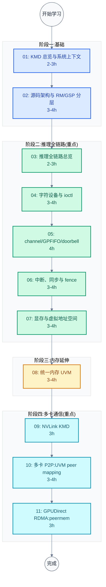
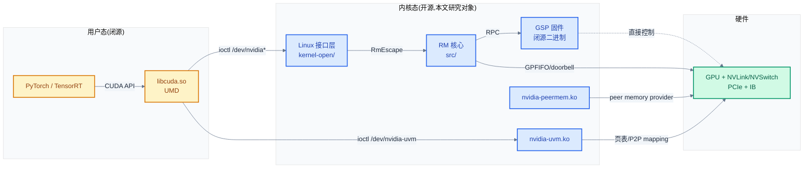

# NVIDIA KMD 学习笔记:开源 GPU 内核驱动

> 面向嵌入式与系统软件工程师的 NVIDIA 开源 GPU 内核驱动(open-gpu-kernel-modules)完整学习指南。从 UMD/KMD 边界(ioctl)到硬件执行单元,覆盖推理全链路与多卡通信两大场景,基于 610.43.03 版本源码。
>
> **工程师视角**:NVIDIA 开源的是 KMD(内核态驱动),UMD(用户态 libcuda.so)仍闭源。本专题填补已有 [cuda/](../cuda/)(停在 UMD 界面)与 [nccl/](../nccl/)(停在 transport 层)之间的 KMD 空白——回答"一行 `cudaLaunchKernel` 在内核里究竟做了什么、两个 GPU 显存怎么互相可见、网卡怎么直接读 GPU 显存"。理解 KMD 的分层设计(RM / OSAL / GSP 固件)与 channel/GPFIFO/doorbell 命令提交模型,是在组件交界处(固件↔驱动↔硬件↔OS)定位问题的基础。

### 关键术语

| 缩写 | 全称 | 含义 |
|------|------|------|
| KMD | Kernel Mode Driver | 内核态驱动,本文研究对象(nvidia.ko 等) |
| UMD | User Mode Driver | 用户态驱动(libcuda.so / libnvidia-* ),闭源 |
| RM | Resource Manager | NVIDIA 驱动核心,管理 GPU 资源的对象体系 |
| GSP | GPU System Processor | GPU 上的独立微控制器(Turing+ 引入,RISC-V 核心 + Falcon2 框架),承载部分 RM 逻辑 |
| OSAL | OS Abstraction Layer | 操作系统抽象层,RM 核心与 Linux 内核间的适配 |
| SM | Streaming Multiprocessor | GPU 计算执行单元,见 [../cuda/01](../cuda/01-GPU架构基础.md) |
| Channel | — | GPU 命令提交通道,绑定一个 GPFIFO 队列 |
| Context | — | GPU 地址空间与资源的容器,一个 Context 可含多个 Channel |
| GPFIFO | GPU Pushbuffer FIFO | GPU 命令队列环形缓冲,驱动写 GP_Put、GPU 读 GP_Get |
| Pushbuffer | — | 装载 GPU 方法(method)命令的内存缓冲 |
| Doorbell | — | 通知 GPU 有新命令的门铃寄存器(PCIe BAR0 MMIO) |
| PBDMA | Pushbuffer DMA | GPU 硬件单元,从 GPFIFO 取指并分发到引擎 |
| UVM | Unified Virtual Memory | 统一虚拟内存,CPU-GPU 共享地址空间(nvidia-uvm.ko) |
| P2P | Peer-to-Peer | 设备间直接访问显存,不经 CPU |
| GDR | GPUDirect RDMA | RDMA 直接访问 GPU 显存,绕过 CPU |
| NVLink | — | NVIDIA GPU 间高速互联,见 [../nccl/02](../nccl/02-gpu-interconnect-background.md) |
| Xid | — | NVIDIA GPU 错误事件标识(Xid 43/48/79 等),见 dmesg |
| RC | Robust Channels | 容错通道机制,错误恢复 |
| MIG | Multi-Instance GPU | GPU 硬件分片,把一个 GPU 切成多个独立实例 |
| ATS | Address Translation Services | PCIe 地址翻译服务 |
| ACS | Access Control Services | PCIe 访问控制服务(影响 P2P 路由) |
| Falcon | — | NVIDIA 微控制器架构,Falcon2 是其软件框架,GSP 基于 RISC-V 核心通过 Falcon2 管理 |
| NVML | NVIDIA Management Library | GPU 管理库,查询拓扑/状态 |
| amdgpu | — | AMD 开源 GPU 内核驱动(对照对象) |
| nouveau | — | 社区开源 NVIDIA 驱动(对照对象) |

---

## 学习路线图



> **如何读这张图**:四阶段按依赖关系递进。阶段一建立源码分层与 GSP 架构认知(理解 RM 为什么这样薄);阶段二贯穿推理链路——从 ioctl 到 channel 到 fence 到显存,同步篇紧跟命令提交以闭合回路;阶段三讲 UVM 这个独立子系统;阶段四讲多卡通信三大支撑(NVLink / P2P / RDMA)。每篇 2-4 小时,总计约 35-40 小时。

---

## 文档索引

| 序号 | 文档 | 核心问题 | 概要 | 建议学时 |
|:----:|------|----------|------|:--------:|
| 01 | [KMD 总览与系统上下文](./01-KMD总览与系统上下文.md) | KMD 在 AI 栈中干什么? | 5 模块职责、开源 vs 闭源 vs GSP、与 amdgpu/nouveau 对比、UMD↔KMD↔HW 耦合图 | 2-3h |
| 02 | [源码架构与 RM/GSP 分层设计](./02-源码架构与RM分层设计.md) | 源码怎么分层?为什么 RM 薄? | kernel-open vs src、RM 三层架构、GSP 固件与 RPC、构建系统、MIG | 3-4h |
| 03 | [推理全链路总览:从 PyTorch 到 SM](./03-推理全链路总览.md) | 一次推理经过哪些层? | 端到端时序图、5 个 checkpoint、衔接 cuda/06·09 与 nccl/08 | 2-3h |
| 04 | [UMD↔KMD 接口:字符设备与 ioctl](./04-字符设备与ioctl接口.md) | UMD 怎么调进内核? | /dev/nvidia*、nvidia_fops、NV_ESC_* 编号、RmEscape、RM client/handle | 3-4h |
| 05 | [命令提交:channel/GPFIFO/doorbell](./05-命令提交channel与GPFIFO.md) | 命令怎么发给 SM? | Context/Channel、KernelFifo、GPFIFO 填充、GP_Put/Get、doorbell、PBDMA、CUDA Graph | 4h |
| 06 | [中断、同步与 fence](./06-中断同步与fence.md) | CPU 怎么知道执行完? | MSI/MSI-X、threaded IRQ、fence/semaphore、sem_surf、Stream/Event、Xid/RC | 3-4h |
| 07 | [内存管理:显存与虚拟地址空间](./07-内存管理显存与地址空间.md) | 显存怎么分配?VM 怎么组织? | MemoryManager、VM/PDE/PTE、heap、residency、KV cache 内存模式 | 3-4h |
| 08 | [统一内存 UVM:按需分页与页面迁移](./08-统一内存UVM.md) | CPU-GPU 共享地址空间怎么实现? | nvidia-uvm.ko、uvm_va_space/va_block、UVM ioctl、fault、页面迁移 | 3-4h |
| 09 | [NVLink KMD:拓扑发现与链路训练](./09-NVLink-KMD拓扑与训练.md) | KMD 怎么发现配置 NVLink? | nvlink_linux.c、core/、拓扑发现、训练状态机、连接管理 | 3h |
| 10 | [多卡 P2P:UVM peer mapping](./10-多卡P2P-UVM-peer-mapping.md) | 两个 GPU 显存怎么互见? | uvm_api_enable_peer_access、uvm_va_range_device_p2p、nvidia_p2p_get_pages、与 NCCL 衔接 | 3-4h |
| 11 | [GPUDirect RDMA:nvidia-peermem.ko](./11-GPUDirect-RDMA-peermem.md) | 网卡怎么直接读显存? | peermem 模块、peer memory provider、与 IB 驱动协作、DMA-BUF、GDR | 3h |

---

## 未覆盖的主题

本专题聚焦「推理链路 + 多卡通信」,以下主题不在范围内,作为后续学习方向:

| 主题 | 简述 | 参考方向 |
|------|------|----------|
| **显示与 KMS** | nvidia-drm.ko / nvidia-modeset.ko,DRM 子系统、原子模式设置、Wayland | 推理场景非核心,如需了解见 [NVIDIA DRM 文档](https://us.download.nvidia.com/XFree86/Linux-x86_64/610.43.03/README/kernel_open.html) |
| **图形渲染管线** | OpenGL / Vulkan 图形路径,与计算路径差异 | 本专题只讲计算(CUDA)路径 |
| **vGPU** | GPU 虚拟化,SR-IOV / vGPU 配置 | 见 README.vgpu(vGPU Host Package) |
| **GSP 固件内部** | 固件二进制闭源,内部状态机不可见 | 本专题讲 RM↔GSP 的 RPC 契约,不讲固件内部 |
| **ATS / SVA / Confidential Computing** | UVM 的高级特性,共享虚拟地址、机密计算 | 08 结尾"未覆盖主题"提及 |
| **电源与热管理细节** | P0/P5/P8 状态、动态功耗、thermal | 02/06 各放一节概览,不深入 |

> **学习建议**:完成 11 篇后,根据工作方向选择进阶。若做推理服务化,深入 07(KV cache 内存)+ MIG;若做多卡调试,深入 09-11 + [../nccl/10](../nccl/10-environment-variables-and-tuning.md);若做驱动移植,对照 amdgpu 看 02 的分层设计。

---

## 按角色推荐学习路径

### AI 基础设施 / 推理服务工程师

关注推理链路与多卡拓扑,定位"为什么慢/卡死":

```
01 总览 → 03 推理链路(重点)→ 05 命令提交(重点)→ 07 显存(重点)→ 09 NVLink → 10 P2P → 11 RDMA
```

- **03、05、07 是核心**:推理路径上 KMD 的三大职责(提交命令、管理显存、暴露拓扑)
- 09-11 帮你理解 NCCL 为什么选某条传输路径、为什么 P2P/RDMA 会失败
- 06 的 Xid 是长跑必遇的调试词汇

### 驱动 / 系统软件工程师

关注 KMD 架构设计与内核接口契约:

```
01 总览 → 02 源码架构(重点)→ 04 ioctl(重点)→ 05 channel(重点)→ 06 中断 → 08 UVM → 10 P2P
```

- **02、04、05 是核心**:RM 分层、ioctl 契约、channel 模型是驱动设计的骨架
- 08 的 UVM 是独立子系统,设计精巧,值得对照 amdgpu 的对应实现
- 对照 [../trusted-firmware/](../trusted-firmware/) 的 TF-A BL31 看"GSP 固件卸载"与"EL3 固件"的异同

### 多卡通信 / NCCL 二开工程师

关注 KMD 如何支撑 NCCL 的传输层:

```
01 总览 → 09 NVLink(重点)→ 10 P2P(重点)→ 11 RDMA(重点)→ 08 UVM → 复习 ../nccl/08
```

- **09、10、11 是核心**:多卡通信三大支撑,每篇开篇用 NCCL 契约引入
- 必备:能读懂 `nvidia-smi topo -m` 与 `NCCL_DEBUG=TRACE` 的对应关系
- 10 的 `nvidia_p2p_get_pages` 是 P2P 与 RDMA 的公共底座

### 对照学习(NVIDIA KMD ↔ AMD amdgpu ↔ nouveau)

关注跨实现设计差异:

```
01 总览(跨实现对比表)→ 02 源码架构(对照 amdgpu 分层)→ 05 channel(对照 amdgpu_sched)→ 08 UVM(对照 HMM)→ 11 peermem(对照 amdgpu peer2peer)
```

- 01 的跨实现对比表是基线
- 02 看"NVIDIA 把 RM 核心与 OS 层分离 + GSP 固件卸载"与 amdgpu 全开源驱动的差异
- 05 对照 amdgpu 的 scheduler / ring 机制

---

## 官方文档

| 文档 | 用途 | 建议阅读时机 |
|------|------|--------------|
| [NVIDIA Open GPU Kernel Modules README](https://github.com/NVIDIA/open-gpu-kernel-modules/blob/main/README.md) | 项目说明、构建、支持 GPU 列表 | 学 01 时必读 |
| [NVIDIA GPU Driver README (kernel_open)](https://us.download.nvidia.com/XFree86/Linux-x86_64/610.43.03/README/kernel_open.html) | 开源内核模块特性与限制 | 学 01 时参考 |
| [CUDA Driver API Reference](https://docs.nvidia.com/cuda/cuda-driver-api/) | UMD 侧 API,04/05 衔接用 | 学 04 时参考 |
| [PTX ISA Reference](https://docs.nvidia.com/cuda/parallel-thread-execution/) | GPU 指令集,05 命令提交的终点 | 学 05 时参考 |
| [NVIDIA A100 / H100 Architecture Whitepaper](https://resources.nvidia.com/en-us-hopper-architecture/h100-tensor-core-gpu-architecture-whitepaper) | 硬件结构(SM/Tensor Core/HBM/NVLink) | 学 03/05 时参考 |
| [NVLink High-Speed Interconnect](https://www.nvidia.com/en-us/data-center/nvlink/) | NVLink 产品页(规范需 NDA) | 学 09 时参考 |
| [GPUDirect RDMA Documentation](https://docs.nvidia.com/cuda/gpudirect-rdma/) | GDR 设计与使用 | 学 11 时必读 |
| [NVIDIA Open GPU Kernel Modules (DeepWiki)](https://deepwiki.com/NVIDIA/open-gpu-kernel-modules) | 社区源码导览,辅助理解 | 全程参考 |

---

## 源码管理

本项目使用 Git submodule 管理 NVIDIA 开源内核驱动源码,以 `--depth=1` 浅克隆:

```bash
# 初始化 submodule
git submodule update --init nvidia-kmd/src/open-gpu-kernel-modules

# 更新到最新
git submodule update --remote nvidia-kmd/src/open-gpu-kernel-modules

# 固定到特定 commit(保证文档行号稳定)
cd nvidia-kmd/src/open-gpu-kernel-modules
git checkout <tag-or-commit>
```

> **注意**:`nvidia-kmd/src/` 已加入 `.gitignore`(沿用 `trusted-firmware/src/`、`nccl/src/nccl-src/` 模式),避免 IDE 索引大量源码。但 submodule gitlink 仍由 git 跟踪,clone 仓库后执行 `git submodule update --init nvidia-kmd/src/open-gpu-kernel-modules` 即可获取源码。当前固定在 `610.43.03` 版本(2026 年 7 月)。

---

## 源码阅读导航

源码根目录:`nvidia-kmd/src/open-gpu-kernel-modules/`,分为两大部分(详见 02):

- `kernel-open/` — Linux 内核接口层(OS-specific glue),全部开源
- `src/` — OS-agnostic RM 核心,全部开源(`.run` 包里才预编译为 `nv-kernel.o_binary`)

| 仓库区域 | 路径 | 关键文件 | 职责 | 对应文档 |
|----------|------|----------|------|----------|
| **nvidia.ko 接口层** | `kernel-open/nvidia/` | `nv.c` | 模块入口、`nvidia_fops`(L250)、字符设备注册(L982/989) | 01, 04 |
| | | `nv-pci.c` | PCI 探测、BAR 映射、MSI、ACS | 04, 10 |
| | | `os-interface.c` | OSAL:内存/锁/PCI/时间抽象 | 02, 04 |
| | | `nv-p2p.c` | `nvidia_p2p_get_pages`(L650)、`nvidia_p2p_dma_map_pages`(L893) | 10, 11 |
| | | `nvlink_linux.c` | NVLink Linux 接口、sysfs | 09 |
| **nvidia.ko RM 核心** | `src/nvidia/arch/nvalloc/unix/` | `src/escape.c` | `RmEscape` 解码 ioctl 分发到 RM API | 04 |
| | | `include/nv_escape.h` | `NV_ESC_RM_ALLOC`(0x2B)/`RM_CONTROL`(0x2A)/`RM_FREE`(0x29) 编号 | 04 |
| | | `include/nv-ioctl-numbers.h` | `NV_ESC_CARD_INFO` 等基础 ioctl(magic 'F', base 200) | 04 |
| | `src/nvidia/src/kernel/gpu/fifo/` | `kernel_fifo.c`(3866 行) | KernelFifo 对象、channel/GPFIFO 分配 | 05 |
| | | `kernel_channel.c` | Channel 对象生命周期 | 05 |
| | | `channel_utils.c` | `channelFillGpFIFO` 填充命令队列 | 05 |
| | | `kernel_fifo_ctrl.c` / `usermode_api.c` | doorbell / 用户态通道 | 05 |
| | `src/nvidia/src/kernel/gpu/gsp/` | `kernel_gsp.c` | GSP 客户端,RPC 委托 RM 逻辑给固件 | 02 |
| | | `message_queue_cpu.c` | RM↔GSP RPC 消息队列 | 02 |
| | | `kernel_gsp_booter.c` | GSP 固件加载与启动 | 02 |
| | `src/nvidia/src/kernel/gpu/intr/` | `intr.c` / `intr_service.c` | 中断 top-half / bottom-half | 06 |
| | `src/nvidia/src/kernel/gpu/rc/` | `kernel_rc.c` + 9 文件 | Xid 错误处理、RC 容错 | 06 |
| | `src/nvidia/src/kernel/gpu/mem_mgr/` | `mem_mgr.c`(4240 行) | 显存分配、MemoryManager | 07 |
| | | `sem_surf.c` | Semaphore Surface(同步原语) | 06 |
| | `src/nvidia/src/kernel/gpu/mmu/` | `kern_gmmu.c` 等 | VM/PDE/PTE、GPU MMU | 07 |
| | `src/nvidia/src/kernel/gpu/nvlink/` | `kernel_nvlinkcorelib.c` | RM 侧 NVLink 核心 | 09 |
| | `src/nvidia/src/kernel/gpu/mig_mgr/` | `kernel_mig_manager.c` | MIG 分片管理 | 02 |
| **NVLink 子系统** | `src/common/nvlink/kernel/nvlink/` | `core/`(initialize/training/discovery/conn_mgmt/ioctl) | NVLink 拓扑发现、训练、连接 | 09 |
| | | `interface/`(ioctl_entry/discovery_entry/training_entry) | NVLink 对外接口 | 09 |
| **nvidia-uvm.ko** | `kernel-open/nvidia-uvm/` | `uvm.c` | 模块入口、`uvm_fops`(L1070)、ioctl dispatch(L997)、chrdev(L1142) | 08 |
| | | `uvm_ioctl.h` | UVM ioctl 编号(`UVM_ENABLE_PEER_ACCESS` 等) | 08, 10 |
| | | `uvm_api.h` | `uvm_api_enable_peer_access`(L236) | 10 |
| | | `uvm_va_space.h` / `uvm_va_block.c` / `uvm_va_range.c` | VA 空间核心数据结构、fault/迁移 | 08 |
| | | `uvm_va_range_device_p2p.c` | device P2P va range | 10 |
| | | `uvm_gpu.c` | GPU 访问接口 | 08 |
| **nvidia-peermem.ko** | `kernel-open/nvidia-peermem/` | `nvidia-peermem.c` | `ib_register_peer_memory_client`(L570)、IB 回调(L300)、`module_init`(L695) | 11 |
| **构建系统** | `kernel-open/` | `Kbuild` / `Makefile` / `conftest.sh` | 多模块构建、内核特性检测 | 02 |

---

## 官方工具导航

| 工具 | 来源 | 职责 | 对应文档 |
|------|------|------|----------|
| nvidia-smi | CUDA Toolkit / 驱动包 | GPU 状态、拓扑(`nvidia-smi topo -m`)、MIG | 09, 10 |
| NVML | CUDA Toolkit | 管理库,nvidia-smi 底层 | 09 |
| dmesg | Linux 自带 | 查看 Xid 错误、驱动加载日志 | 06 |
| nvidia-debugdump | 驱动包 | GPU 内部状态转储 | 06 |
| /proc/driver/nvidia/* | 内核模块 | params、gpus/* 信息 | 04 |
| /sys/class/nvidia-uvm/* | 内核模块 | UVM 设备节点 | 08 |

---

## 三层主题关系速览



> **如何读这张图**:用户态(黄色)通过两个字符设备进入内核态(蓝色):`/dev/nvidia*` 走 nvidia.ko 的 RM 路径(命令提交、显存分配),`/dev/nvidia-uvm` 走 nvidia-uvm.ko 的 UVM 路径(统一内存、P2P)。RM 核心把硬件控制类逻辑通过 RPC 委托给 GSP 固件(闭源),但 RPC 契约是开源的。nvidia-peermem.ko 独立注册到 IB 子系统,让网卡能直接访问显存。硬件层(绿色)接收 GPFIFO 命令、页表映射、NVLink 数据。

---

## 与相邻笔记的关系

| 主题 | 关系 | 推荐阅读时机 |
|------|------|-------------|
| [../cuda/](../cuda/) | UMD 侧:本专题从 cuda/06 停下的地方接续(用户态 API → 内核态 ioctl) | 学 04 前复习 cuda/06 §4-5 |
| [../cuda/09-多GPU编程与互联拓扑](../cuda/09-多GPU编程与互联拓扑.md) | P2P 的 UMD 语义,本专题 10 讲内核侧落地 | 学 10 前复习 |
| [../nccl/](../nccl/) | NCCL transport 层期望的内核契约,本专题 10/11 拆解 | 学 10/11 前复习 nccl/08 |
| [../nccl/02-gpu-interconnect-background](../nccl/02-gpu-interconnect-background.md) | NVLink/NVSwitch 硬件背景,本专题 09 不重复 | 学 09 前参考 |
| [../rdma/](../rdma/) | IB Verbs/RDMA 协议,本专题 11 不讲协议只讲 peermem 协作 | 学 11 前参考 |
| [../pcie/](../pcie/) | PCIe P2P 协议,本专题 10 讲 ACS 对 P2P 路由影响 | 学 10 前参考 |
| [../trusted-firmware/](../trusted-firmware/) | TF-A BL31 / OpenSBI 对照:固件卸载设计的不同范式 | 学 02 GSP 时对照 |
| [../LLM/](../LLM/) | LLM 推理/训练上层,本专题提供底层支撑 | 双向引用 |

---

**文档版本**: v1.0
**最后更新**: 2026-07-29
**适用对象**: AI 基础设施工程师、驱动/系统软件工程师、多卡通信工程师
**源码版本**: open-gpu-kernel-modules `610.43.03`(2026-07)
**前置知识**: [CUDA 编程模型](../cuda/02-CUDA编程模型.md)、Linux 内核模块基础、[PCIe 基础](../pcie/)
