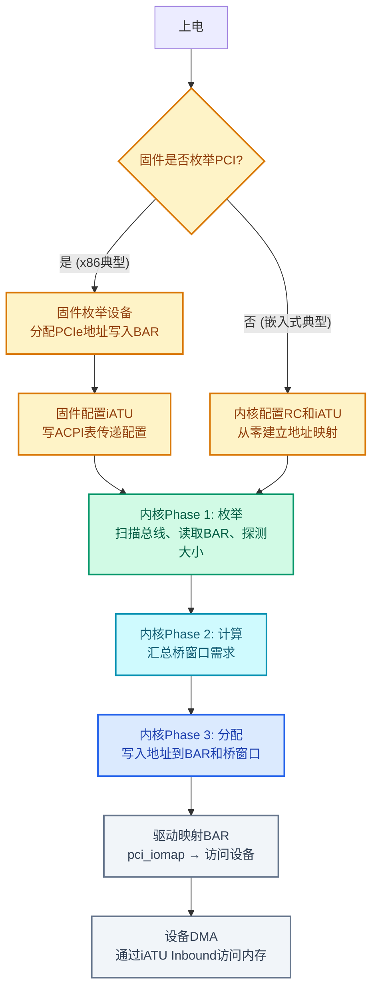
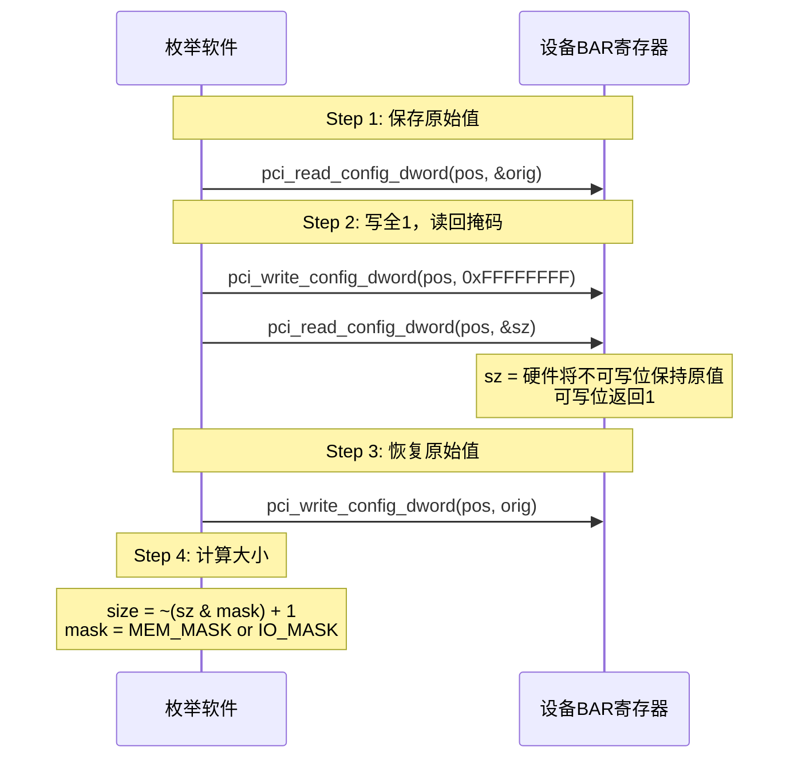
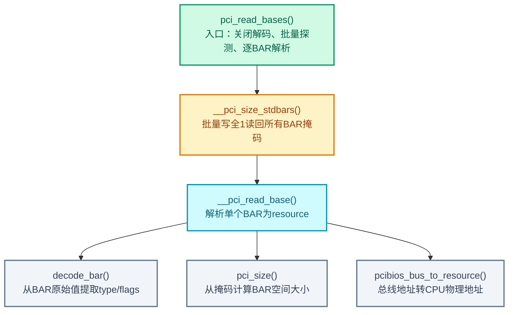
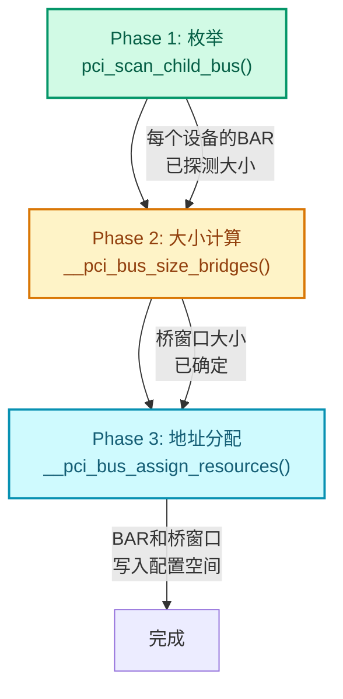
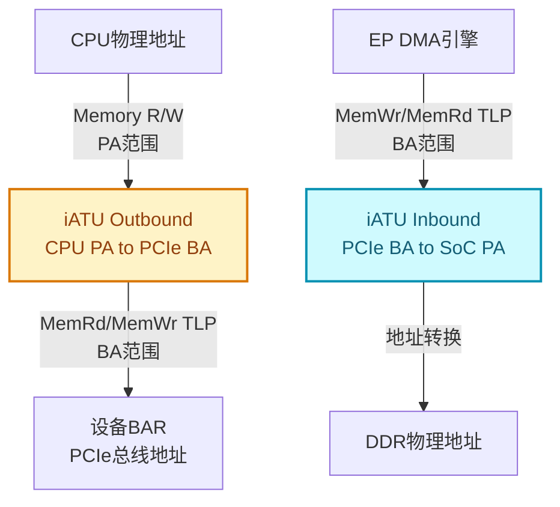

# BAR 与资源分配

> 核心问题：设备如何声明地址需求？系统如何为所有设备分配不冲突的地址？
> 关联索引：[PCIe核心知识索引](./pcie-learning-resources.md) Phase 0, 1.2, 2.1

### 关键术语
| 缩写 | 全称 | 含义 |
|------|------|------|
| BAR | Base Address Register | 基地址寄存器，设备声明地址需求的机制 |
| iATU | Internal Address Translation Unit | 内部地址转换单元，RC中CPU地址与PCIe地址的桥梁 |
| VF | Virtual Function | SR-IOV虚拟功能，轻量级PCIe Function |
| PCIe | Peripheral Component Interconnect Express | 高速外设互连标准 |

---

## 0. 前置背景

### 0.1 什么是BAR

Base Address Register (BAR) 是设备配置空间中的寄存器（Type 0 Header: 0x10-0x27，共6个），用于向系统声明：
- **需要多大的地址空间**（大小）
- **需要什么类型的空间**（Memory还是I/O）
- **是否允许预取**（Prefetchable）

系统启动时通过**写全1读掩码协议**探测这些信息，然后在可用地址范围内为每个设备分配不重叠的地址。

### 0.2 为什么需要BAR

CPU的物理地址空间是全局共享的。如果两个设备的MMIO区域重叠，CPU访问一个设备的数据会被另一个设备响应。BAR机制确保：

```
正确情况:
  GPU BAR  : 0xC000_0000 - 0xCFFF_FFFF (256MB)
  NIC BAR  : 0xD000_0000 - 0xD000_3FFF (16KB)
  NVMe BAR : 0xD000_4000 - 0xD000_7FFF (16KB)
  → 无冲突，每个设备有独立可寻址范围

错误情况:
  GPU BAR  : 0xC000_0000 - 0xCFFF_FFFF
  NIC BAR  : 0xC000_0000 - 0xC000_3FFF  ← 重叠!
  → CPU访问NIC可能读到GPU数据
```

### 0.3 资源分配与iATU的关系

BAR分配的是**PCIe总线地址**，但CPU使用的是**物理地址**。两者的转换由Host Bridge内的iATU完成（详见 [§4. iATU与地址转换](#4-iatu与地址转换)）。因此资源分配必须考虑iATU窗口的限制。

### 0.4 全景视图：从上电到设备可用

BAR地址的分配有**两条路径**，取决于固件是否做了枚举：



**两条路径的区别**：

| | x86 桌面/服务器 | 嵌入式 (ARM/RISC-V) |
|--|----------------|---------------------|
| 固件 | BIOS/UEFI 完成枚举和地址分配 | 可能只初始化RC，不枚举下游设备 |
| 内核 Phase 1 | 读取固件写入的地址，探测大小 | 扫描总线发现设备，BAR为空或未定义 |
| 内核 Phase 3 | 固件分配有效则复用，否则重新分配 | 从零分配所有地址 |

> **无论哪条路径，内核的 Phase 1/2/3 逻辑相同**——区别仅在于 Phase 1 读到的BAR值是否有固件写入的有效地址。

**各章覆盖的阶段**：

| 章节 | 覆盖阶段 |
|------|---------|
| §1 规范机制 | 不对应具体阶段，是理解 §2/§3 的硬件基础 |
| §2 Linux内核实现 | Phase 1：枚举设备、读取BAR、探测大小 |
| §3 资源分配流程 | Phase 2 & 3：计算桥窗口、分配地址、写入BAR |
| §4 iATU与地址转换 | 固件/内核配置iATU、驱动访问设备、设备DMA |
| §5 实战调试 | 驱动使用阶段：查看分配结果、映射BAR、排查问题 |
| §7 Resizable BAR | 运行时调整BAR大小，触发重新走 Phase 2/3 |

---

## 1. 规范机制

本章解释BAR寄存器的硬件规范——它长什么样、怎么探测大小、Prefetchable位的含义。这些规范是后续 §2（内核如何读BAR）和 §3（内核如何分配地址）的基础，不对应全景中的具体阶段。

### 1.1 BAR寄存器结构

Type 0 Header (普通设备) 有6个BAR (BAR0-BAR5, 0x10-0x27)，Type 1 Header (桥) 有2个BAR (BAR0-BAR1, 0x10-0x17)。

**Memory Space BAR**：

```
 31                                           4 3 2 1 0
┌──────────────────────────────────────────────┬─┬─┬─┬─┐
│          Base Address / Size Mask            │P│T│  │0│
│          (可写位决定大小)                      │ │ │  │ │
└──────────────────────────────────────────────┴─┴─┴─┴─┘
                                                │ │  │ └─ 0 = Memory Space
                                                │ │  └─── 保留
                                                │ └────── Type: 00=32bit, 10=64bit
                                                └──────── Prefetchable
```

**I/O Space BAR**：

```
 31                                           2 1 0
┌──────────────────────────────────────────────┬─┬─┐
│          Base Address / Size Mask            │ │1│
└──────────────────────────────────────────────┴─┴─┘
                                                │ └─ 1 = I/O Space
                                                └─── 保留 (硬连线为0)
```

### 1.2 Prefetchable 的含义

BAR的bit3（Prefetchable位）决定了CPU对该地址区域的访问语义：

| Prefetchable | 含义 | 典型用途 |
|-------------|------|---------|
| 0（非预取） | 读取有副作用，CPU不能预取、不能合并访问 | 控制寄存器、状态寄存器、门铃寄存器 |
| 1（可预取） | 读取无副作用，多次读取返回相同值 | 帧缓冲、显存（Expansion ROM使用独立寄存器，Type 0偏移0x30/Type 1偏移0x38，也声明为Prefetchable） |

**为什么区分**：CPU和桥在访问非预取区域时必须严格遵守程序顺序，不能进行读预取（Read Prefetching）或写合并（Write Combining）。对控制寄存器做读预取可能导致状态位被意外清除（如中断状态寄存器读后自动清零）；对帧缓冲做写合并则能显著提升性能。

**规则**：
- 如果设备的某个Memory区域读取**无副作用**，应声明为Prefetchable
- Prefetchable BAR通常使用64-bit类型（bit2:1=10），以便映射到4GB以上地址空间
- 桥窗口分为非预取（Memory Base/Limit）和预取（Prefetchable Base/Limit）两类，分别转发（详见 [§3.2 桥窗口分配](#32-桥窗口分配)）

### 1.3 BAR大小探测协议

> **探测时机**：此协议在枚举阶段执行。此时BAR中可能有固件写入的PCIe地址（x86典型），也可能为空（嵌入式典型）。写全1不影响探测结果——无论BAR原始值是什么，硬件可写位都会返回1。探测后必须恢复原始值。



**示例**：设备需要1MB Memory空间

```
写入: 0xFFFFFFFF
读回: 0xFFF00000  (低20位可写=0, 高12位不可写=1)
掩码: 0xFFF00000 & 0xFFFFFFF0 = 0xFFF00000
大小: ~0xFFF00000 + 1 = 0x00100000 = 1MB
```

**示例**：设备需要256字节I/O空间

```
写入: 0xFFFFFFFF
读回: 0xFFFFFF00  (低8位可写=0, 高24位不可写=1)
掩码: 0xFFFFFF00 & 0xFFFFFFFC = 0xFFFFFF00  (I/O掩码低2位为类型标志)
大小: ~0xFFFFFF00 + 1 = 0x00000100 = 256B
```

> I/O BAR与Memory BAR的探测协议相同，区别仅在于掩码：I/O使用`PCI_BASE_ADDRESS_IO_MASK`（bit2-31），Memory使用`PCI_BASE_ADDRESS_MEM_MASK`（bit4-31）。I/O空间在现代系统中已很少使用，x86平台保留`in/out`指令兼容，ARM/RISC-V平台通常不支持I/O空间。

### 1.4 64-bit BAR

64-bit BAR使用两个连续32位寄存器：

```
BARn  (低32位): [Base/Mask低32位][P][Type=10][0]
BARn+1(高32位): [Base/Mask高32位]
```

- BARn的bit0=0, bit2:1=10 标识64-bit Memory
- 枚举时需同时读写两个寄存器
- BARn+1不单独存在，跳过下一个槽位

---

## 2. Linux内核实现 —— Phase 1: 枚举

对应全景中**内核Phase 1**：内核启动后，PCI子系统扫描总线，对每个发现的设备调用 `pci_read_bases()`，读取BAR中的值（可能是固件写入的地址，也可能是空的），同时用"写全1读掩码"的方式探测每个BAR需要多大的地址空间。本阶段**不分配新地址**，只收集信息。

本节按内核实际调用链自顶向下讲解：`pci_read_bases()` → `__pci_size_stdbars()` → `__pci_read_base()` → `decode_bar()` + `pci_size()`。

### 2.1 调用链总览



核心思路：先**批量**读掩码（只开关一次 PCI Command 的 Memory/IO 解码位，而非每个BAR各开关一次），再**逐个**解析BAR值，最后将总线地址转换为CPU侧资源地址。

### 2.2 pci_read_bases() —— BAR探测入口

这是BAR探测的顶层函数，在设备枚举阶段被调用。它做四件事：

1. **前置检查**：跳过不合规BAR和SR-IOV VF（VF的BAR由PF定义，见 §3.4）
2. **关闭解码**：探测期间设备不应响应BAR地址，否则写全1可能产生总线事务
3. **批量读掩码**：调用 `__pci_size_stdbars()` 一次性获取所有BAR的大小掩码
4. **逐BAR解析**：对每个BAR调用 `__pci_read_base()` 提取地址和大小

```c
// drivers/pci/probe.c (Linux 6.19)
static __always_inline void pci_read_bases(struct pci_dev *dev, unsigned int howmany, int rom)
{
    u32 stdbars[PCI_STD_NUM_BARS], rombar;
    u16 orig_cmd;
    unsigned int pos, reg;

    if (dev->non_compliant_bars)
        return;
    // VF的BAR是只读的，由PF的SR-IOV Capability统一定义
    if (dev->is_virtfn)
        return;

    // ① 关闭 Memory/IO 解码（PCI_COMMAND 寄存器的 bit0 和 bit1），
    //    避免写全1到BAR时设备响应地址0xFFFFFFFF的总线事务
    if (!dev->mmio_always_on) {
        pci_read_config_word(dev, PCI_COMMAND, &orig_cmd);
        if (orig_cmd & PCI_COMMAND_DECODE_ENABLE)
            pci_write_config_word(dev, PCI_COMMAND,
                orig_cmd & ~PCI_COMMAND_DECODE_ENABLE);
    }

    // ② 批量读取所有BAR掩码（__pci_size_stdbars 是 __pci_size_bars 的标准BAR包装）
    __pci_size_stdbars(dev, howmany, PCI_BASE_ADDRESS_0, stdbars);
    if (rom)
        __pci_size_rom(dev, rom, &rombar);  // ROM BAR掩码单独读取

    // ③ 恢复解码
    if (!dev->mmio_always_on && (orig_cmd & PCI_COMMAND_DECODE_ENABLE))
        pci_write_config_word(dev, PCI_COMMAND, orig_cmd);

    // ④ 逐个解析标准BAR
    for (pos = 0; pos < howmany; pos++) {
        struct resource *res = &dev->resource[pos];
        reg = PCI_BASE_ADDRESS_0 + (pos << 2);
        pos += __pci_read_base(dev, pci_bar_unknown, res, reg, &stdbars[pos]);
        // __pci_read_base 返回1表示64-bit BAR，跳过下一个槽位
    }

    // ⑤ 解析 Expansion ROM BAR
    //     Type 0 设备: rom = PCI_ROM_ADDRESS (0x30)
    //     Type 1 桥:   rom = PCI_ROM_ADDRESS_1 (0x38)
    if (rom) {
        struct resource *res = &dev->resource[PCI_ROM_RESOURCE];
        dev->rom_base_reg = rom;
        res->flags = IORESOURCE_MEM | IORESOURCE_PREFETCH |
                     IORESOURCE_READONLY | IORESOURCE_SIZEALIGN;
        __pci_read_base(dev, pci_bar_mem32, res, rom, &rombar);
    }
}
```

> **`__pci_size_stdbars()` 与 `__pci_size_bars()` 的关系**：前者是后者的薄包装，仅将起始偏移从 `PCI_BASE_ADDRESS_0` 开始、数量限制为 `PCI_STD_NUM_BARS`（6个）。核心逻辑完全在 `__pci_size_bars()` 中。

### 2.3 __pci_size_bars() —— 批量读取掩码

此函数对每个BAR执行"保存 → 写全1 → 读回 → 恢复"四步，批量获取大小掩码。

**关键理解**：执行时BAR中已有固件写入的PCIe地址。写全1**不是**为了分配地址，而是为了探测硬件需要多大的地址空间——硬件会把不可写（高位）的位保持为0，可写（低位）的位返回1，这个模式就是大小掩码。探测完后必须恢复原始地址，否则设备会丢失固件分配的地址。

批量处理的原因：① 减少 PCI Command 寄存器的开关次数（只在 `pci_read_bases()` 中开关一次，而非每个BAR各开关一次）；② 虚拟化环境下每次配置空间访问都可能触发VM Exit，批量操作可显著减少开销。

```c
// drivers/pci/probe.c
static void __pci_size_bars(struct pci_dev *dev, int count,
                            unsigned int pos, u32 *sizes, bool rom)
{
    u32 orig, mask = rom ? PCI_ROM_ADDRESS_MASK : ~0;
    int i;

    for (i = 0; i < count; i++, pos += 4, sizes++) {
        pci_read_config_dword(dev, pos, &orig);      // 保存固件写入的PCIe地址
        pci_write_config_dword(dev, pos, mask);       // 写全1，探测大小掩码
        pci_read_config_dword(dev, pos, sizes);       // 读回掩码（可写位=1）
        pci_write_config_dword(dev, pos, orig);       // 恢复固件的PCIe地址
    }
}
```

**掩码的含义**：读回值中，硬件**可写**的位（即返回1的位）代表BAR的大小编码，不可写（返回0）的位是地址高位。例如1MB的BAR，低20位可写=0，高12位不可写=1，读回 `0xFFF00000`。

### 2.4 decode_bar() —— 解码BAR类型

将BAR原始值中的硬件编码位提取为Linux内部的 `resource` flags，供后续资源管理使用。

```c
// drivers/pci/probe.c (Linux 6.19)
static unsigned long decode_bar(struct pci_dev *dev, u32 bar)
{
    u32 mem_type;
    unsigned long flags;

    // bit0 = 1 → I/O Space
    if ((bar & PCI_BASE_ADDRESS_SPACE) == PCI_BASE_ADDRESS_SPACE_IO) {
        flags = bar & ~PCI_BASE_ADDRESS_IO_MASK;
        flags |= IORESOURCE_IO;
        return flags;
    }

    // bit0 = 0 → Memory Space
    flags = bar & ~PCI_BASE_ADDRESS_MEM_MASK;
    flags |= IORESOURCE_MEM;
    if (flags & PCI_BASE_ADDRESS_MEM_PREFETCH)
        flags |= IORESOURCE_PREFETCH;

    mem_type = bar & PCI_BASE_ADDRESS_MEM_TYPE_MASK;
    switch (mem_type) {
    case PCI_BASE_ADDRESS_MEM_TYPE_32:
        break;
    case PCI_BASE_ADDRESS_MEM_TYPE_1M:
        // ISA设备的1MB以下Memory BAR，按32位处理
        break;
    case PCI_BASE_ADDRESS_MEM_TYPE_64:
        flags |= IORESOURCE_MEM_64;
        break;
    default:
        // 未知类型，按32位处理
        break;
    }
    return flags;
}
```

**位编码映射**：

| BAR位 | 含义 | Linux Flag |
|-------|------|-----------|
| bit0 = 1 | I/O Space | `IORESOURCE_IO` |
| bit0 = 0, bit3 = 0 | Memory, Non-Prefetchable | `IORESOURCE_MEM` |
| bit0 = 0, bit3 = 1 | Memory, Prefetchable | `IORESOURCE_MEM \| IORESOURCE_PREFETCH` |
| bit2:1 = 00 | 32-bit Memory | 无额外标志 |
| bit2:1 = 01 | 1MB以下 Memory (ISA) | 按32位处理 |
| bit2:1 = 10 | 64-bit Memory | 额外设置 `IORESOURCE_MEM_64` |

> `decode_bar()` 只提取**类型标志**，不提取地址——地址提取在 `__pci_read_base()` 中通过掩码运算完成。

### 2.5 pci_size() —— 从掩码计算BAR空间大小

这是BAR大小计算的核心算法。输入是 `__pci_size_bars()` 读回的掩码值，输出是BAR请求的字节大小。

```c
// drivers/pci/probe.c
static u64 pci_size(u64 base, u64 maxbase, u64 mask)
{
    u64 size = mask & maxbase;  // 提取大小编码位
    if (!size)
        return 0;

    // 取最低有效位 → 对齐粒度 = 空间大小
    size = size & ~(size - 1);

    // 合法性校验：全0 BAR的低位应全部可写
    if (base == maxbase && ((base | (size - 1)) & mask) != mask)
        return 0;

    return size;
}
```

**算法推导**（以1MB BAR为例）：

```
maxbase (读回掩码) = 0xFFF00000
mask               = 0xFFFFFFF0  (Memory掩码，屏蔽低4位类型标志)

Step 1: size = mask & maxbase
        = 0xFFFFFFF0 & 0xFFF00000 = 0xFFF00000

Step 2: size & ~(size - 1)   // 提取最低位的1
        size - 1     = 0xFFEFFFFF
        ~(size - 1)  = 0x00100000
        size & ~(size - 1) = 0xFFF00000 & 0x00100000 = 0x00100000
        → 0x00100000 = 1MB ✓
```

**为什么 `size & ~(size-1)` 能提取最低位1**：`size-1` 将最低位1及其右侧全部翻转，取反后恰好只有最低位1的位置为1，与原值做AND即得该位。这个技巧在内核中广泛使用（如 `rounddown_pow_of_two`）。

### 2.6 __pci_read_base() —— 解析单个BAR为resource

这是BAR解析的核心函数。此时BAR中已有固件（BIOS/UEFI）写入的PCIe地址，本函数将其读出并转换为 `struct resource`（Linux内部的地址区间表示）。本函数**不分配地址**，只读取固件分配的结果并计算大小。

```c
// drivers/pci/probe.c (Linux 6.19)
// 简化实现，省略了 pci_resource_name() 日志、D3cold 设备检测、ROM 使能位处理
int __pci_read_base(struct pci_dev *dev, enum pci_bar_type type,
                    struct resource *res, unsigned int pos, u32 *sizes)
{
    u32 l = 0, sz;
    u64 l64, sz64, mask64;
    struct pci_bus_region region, inverted_region;

    res->name = pci_name(dev);

    // ① 读取BAR当前值（固件写入的PCIe地址），使用预读的掩码
    pci_read_config_dword(dev, pos, &l);  // l = 固件分配的总线地址
    sz = sizes[0];  // 掩码，由 __pci_size_stdbars() 批量预读

    // ② 无效BAR检查：全0xFFFFFFFF表示设备异常，全0表示BAR未实现
    if (PCI_POSSIBLE_ERROR(sz))
        sz = 0;
    if (PCI_POSSIBLE_ERROR(l))
        l = 0;

    // ③ 解码类型标志，提取地址和大小编码
    if (type == pci_bar_unknown) {
        res->flags = decode_bar(dev, l);
        res->flags |= IORESOURCE_SIZEALIGN;
        if (res->flags & IORESOURCE_IO) {
            l64 = l & PCI_BASE_ADDRESS_IO_MASK;
            sz64 = sz & PCI_BASE_ADDRESS_IO_MASK;
            mask64 = PCI_BASE_ADDRESS_IO_MASK & (u32)IO_SPACE_LIMIT;
        } else {
            l64 = l & PCI_BASE_ADDRESS_MEM_MASK;
            sz64 = sz & PCI_BASE_ADDRESS_MEM_MASK;
            mask64 = (u32)PCI_BASE_ADDRESS_MEM_MASK;
        }
    } else {
        // ROM BAR: 使用 PCI_ROM_ADDRESS_MASK
        if (l & PCI_ROM_ADDRESS_ENABLE)
            res->flags |= IORESOURCE_ROM_ENABLE;
        l64 = l & PCI_ROM_ADDRESS_MASK;
        sz64 = sz & PCI_ROM_ADDRESS_MASK;
        mask64 = PCI_ROM_ADDRESS_MASK;
    }

    // ④ 64-bit BAR: 合并高32位
    if (res->flags & IORESOURCE_MEM_64) {
        pci_read_config_dword(dev, pos + 4, &l);
        sz = sizes[1];
        l64 |= ((u64)l << 32);
        sz64 |= ((u64)sz << 32);
        mask64 |= ((u64)~0 << 32);
    }

    // ⑤ 校验掩码有效性，计算大小
    if (!sz64)
        goto fail;

    sz64 = pci_size(l64, sz64, mask64);
    if (!sz64) {
        pci_info(dev, FW_BUG "reg 0x%x: invalid BAR (can't size)\n", pos);
        goto fail;
    }

    // ⑥ 64-bit BAR 边界检查：32位系统无法处理 >4GB 的BAR
    if (res->flags & IORESOURCE_MEM_64) {
        if ((sizeof(pci_bus_addr_t) < 8 || sizeof(resource_size_t) < 8)
            && sz64 > 0x100000000ULL) {
            res->flags |= IORESOURCE_UNSET | IORESOURCE_DISABLED;
            res->start = 0;
            res->end = 0;
            goto out;
        }
        if ((sizeof(pci_bus_addr_t) < 8) && l) {
            // 总线地址在4GB以上，标记需要重新分配
            res->flags |= IORESOURCE_UNSET;
            res->start = 0;
            res->end = sz64 - 1;
            goto out;
        }
    }

    // ⑦ 总线地址 → CPU物理地址，设置 resource 的 start/end
    region.start = l64;
    region.end = l64 + sz64 - 1;
    pcibios_bus_to_resource(dev->bus, res, &region);

    // ⑧ 往返校验：bus_to_resource(A) → resource_to_bus 应还原为 A
    //    如果不等，说明 host bridge 映射有误，CPU访问该地址不会被设备响应
    pcibios_resource_to_bus(dev->bus, &inverted_region, res);
    if (inverted_region.start != region.start) {
        res->flags |= IORESOURCE_UNSET;
        res->start = 0;
        res->end = region.end - region.start;
    }

    goto out;

fail:
    res->flags = 0;
out:
    return (res->flags & IORESOURCE_MEM_64) ? 1 : 0;
}
```

**关键概念：`pcibios_bus_to_resource()` 与往返校验**

BAR寄存器中存储的是PCIe总线域地址，但内核的 `struct resource` 需要CPU域地址。两者之间的差异来自Host Bridge的地址映射——RC将一段CPU物理地址空间映射到PCIe总线地址空间。

```
BAR值 (总线地址)  ──pcibios_bus_to_resource()──>  res->start (CPU物理地址)
res->start        ──pcibios_resource_to_bus()──>  反推的总线地址
```

如果反推结果 != 原始BAR值，说明映射存在不一致（常见于固件配置错误或iATU未正确配置），此时将resource标记为 `IORESOURCE_UNSET`，等待后续重新分配。

在ACPI/UEFI平台，这个映射关系从CRS资源描述符获取；在嵌入式平台，通常由设备树的 `ranges` 属性定义。

> Phase 1 结束后，内核已知道每个BAR的大小，以及是否有固件分配的有效地址。接下来进入 Phase 2 和 Phase 3：计算桥窗口需求，分配或重新分配地址。见 [§3. 资源分配流程](#3-资源分配流程)。

---

## 3. 资源分配流程 —— Phase 2 & 3

对应全景中**内核Phase 2和Phase 3**。Phase 1（§2）已收集所有BAR的地址和大小，本章负责：计算桥窗口需求（Phase 2），然后为BAR写入最终地址（Phase 3）。

**什么情况下需要重新分配？**
- **嵌入式平台**：固件未枚举，BAR为空，内核从零分配所有地址
- **x86平台**：固件分配的地址可能不满足内核的资源管理需求（如地址对齐、桥窗口约束、Resizable BAR调整后需要更大的地址空间）
- 标记为 `IORESOURCE_UNSET` 的BAR会在Phase 3被重新分配

### 3.1 三阶段分配



### 3.2 桥窗口分配

PCI桥需要为下游设备转发Memory/IO事务，通过桥窗口寄存器配置转发范围：

```
Type 1 Header 桥窗口寄存器 (按地址顺序):
├── I/O Base/Limit (0x1C-0x1F)        → I/O窗口 (含高16位扩展)
├── Memory Base/Limit (0x20-0x27)     → 非预取Memory窗口 (仅32位)
└── Prefetchable Base/Limit (0x28-0x2F) → 预取Memory窗口 (支持64位)
    总线号寄存器:
    ├── Primary Bus (0x18)
    ├── Secondary Bus (0x19)
    └── Subordinate Bus (0x1A)
```

**窗口粒度约束**（来自 PCIe Spec 与内核 `PCI_IO_RANGE_MASK` / `PCI_PREF_RANGE_MASK` 定义）：

| 窗口类型 | 粒度 | 内核默认对齐 | 来源 |
|---------|------|------------|------|
| I/O | 4 KB（部分桥支持 1 KB 扩展） | `SZ_4K` | `PCI_IO_RANGE_MASK = ~0x0f`，A[11:0] 隐含为 0 |
| 非预取 Memory | 1 MB | `SZ_1M` | `PCI_MEMORY_RANGE_MASK = ~0x0f`，A[19:0] 隐含为 0 |
| 预取 Memory | 1 MB | `SZ_1M` | `PCI_PREF_RANGE_MASK = ~0x0f`，A[19:0] 隐含为 0 |

**具体示例**：假设 Bus 01 下有两个设备，BAR 需求如下：

```
Bus 01 设备:
  01:00.0 NVMe: BAR0 = 16 KB (非预取Memory)
  01:01.0 NIC:  BAR0 = 64 KB (非预取Memory), BAR2 = 4 MB (预取Memory)

桥窗口计算:
  非预取Memory: 16KB + 64KB = 80KB → 对齐到1MB → 窗口大小 = 1MB
    Memory Base = 0xD000, Memory Limit = 0xD000 (1MB窗口: 0xD000_0000-0xD00F_FFFF)

  预取Memory: 4MB → 对齐到1MB → 窗口大小 = 4MB
    Pref. Mem Base = 0xD010, Pref. Mem Limit = 0xD013 (4MB窗口: 0xD010_0000-0xD013_FFFF)

  I/O: 无需求 → 不分配I/O窗口
```

### 3.3 资源分配算法

`__pci_bus_size_bridges()` 递归计算每个桥需要的窗口大小：

```c
// drivers/pci/setup-bus.c
// 简化实现，省略了 realloc_head 附加资源、CardBus、热插拔额外空间等分支
void __pci_bus_size_bridges(struct pci_bus *bus, struct list_head *realloc_head)
{
    struct pci_dev *dev;

    // 1. 递归处理下游所有子桥（自底向上）
    list_for_each_entry(dev, &bus->devices, bus_list) {
        struct pci_bus *b = dev->subordinate;
        if (!b)
            continue;
        __pci_bus_size_bridges(b, realloc_head);
    }

    // 2. 计算当前总线的三类窗口大小
    //    pbus_size_io(): 汇总下游I/O BAR需求，计算I/O窗口
    //    pbus_size_mem(): 汇总下游Memory BAR需求，计算Memory窗口
    pbus_size_io(bus, additional_io_size, realloc_head);

    b_res = pbus_select_window_for_type(bus, IORESOURCE_MEM |
                                         IORESOURCE_PREFETCH |
                                         IORESOURCE_MEM_64);
    if (b_res && (b_res->flags & IORESOURCE_PREFETCH))
        pbus_size_mem(bus, b_res, additional_mmio_pref_size, realloc_head);

    b_res = pbus_select_window_for_type(bus, IORESOURCE_MEM);
    if (b_res)
        pbus_size_mem(bus, b_res, additional_mmio_size, realloc_head);
}
```

**`pbus_size_mem()` 的核心逻辑**——按对齐分组汇总：

```c
// drivers/pci/setup-bus.c
// 简化实现，省略了 optional 资源和 realloc 路径
static void pbus_size_mem(struct pci_bus *bus, struct resource *b_res, ...)
{
    resource_size_t aligns[28] = {}; // 按对齐粒度分组: aligns[0]=1MB, aligns[1]=2MB, ...
    int max_order = 0;
    resource_size_t size = 0, min_align;

    list_for_each_entry(dev, &bus->devices, bus_list) {
        pci_dev_for_each_resource(dev, r) {
            align = pci_resource_alignment(dev, r);
            // order = log2(align) - log2(1MB)，即对齐粒度在1MB基础上的阶数
            order = max_t(int, __ffs(align) - __ffs(SZ_1M), 0);
            aligns[order] += align;
            if (order > max_order)
                max_order = order;
            size += max(resource_size(r), align);
        }
    }

    // min_align = 最大对齐要求（保证最大对齐的BAR能放进窗口）
    min_align = calculate_head_align(aligns, max_order);
    // 窗口大小 = ALIGN(总大小, min_align)
    size0 = calculate_memsize(size, ..., win_align);
    resource_set_range(b_res, min_align, size0);
}
```

**关键理解**：
- **自底向上递归**：先处理最深的子桥，逐层向上汇总，确保父桥窗口能容纳所有下游需求
- **按对齐分组**：`aligns[]` 数组按 2 的幂分组，`calculate_head_align()` 从高阶向低阶折叠，计算满足所有对齐约束的最小窗口
- **1MB 最小粒度**：桥 Memory 窗口的 Base/Limit 寄存器只存储 A[31:20]，A[19:0] 隐含为 0，因此窗口粒度至少 1MB
- **热插拔预留**：如果桥是热插拔桥（`is_hotplug_bridge`），内核会额外添加 `pci_hotplug_mmio_size` 等预留空间

`__pci_bus_assign_resources()` 递归分配具体地址：

1. 从Root Bridge的可用窗口开始
2. 按对齐从大到小分配
3. 写入设备BAR和桥窗口寄存器
4. 递归处理子桥

### 3.4 pci_std_update_resource() —— 写入BAR

这是Phase 3中实际将地址写入BAR配置空间的函数。`__pci_bus_assign_resources()` 为每个BAR计算好地址后，调用此函数将CPU侧地址转换为总线侧地址并写入BAR寄存器。

```c
// drivers/pci/setup-res.c
static void pci_std_update_resource(struct pci_dev *dev, int resno)
{
    struct resource *res = pci_resource_n(dev, resno);

    // VF的BAR是只读的
    // VF BAR由PF的SR-IOV Capability中的VF BAR寄存器定义(偏移0x24-0x3C)，
    // 系统在启用VF时通过sriov_enable()统一分配，而非走标准BAR分配路径。
    // VF BAR的值由PF驱动写入SR-IOV Cap，硬件自动将同一BAR值映射到所有同类型VF，
    // 因此VF的配置空间中BAR是只读的，pci_std_update_resource()对VF直接返回。
    if (dev->is_virtfn)
        return;

    // 将CPU侧地址转换为总线侧地址
    pcibios_resource_to_bus(dev->bus, &region, res);
    new = region.start;

    // 合并BAR类型标志位
    if (res->flags & IORESOURCE_IO) {
        mask = (u32)PCI_BASE_ADDRESS_IO_MASK;
        new |= res->flags & ~PCI_BASE_ADDRESS_IO_MASK;
    } else {
        mask = (u32)PCI_BASE_ADDRESS_MEM_MASK;
        new |= res->flags & ~PCI_BASE_ADDRESS_MEM_MASK;
    }

    reg = PCI_BASE_ADDRESS_0 + 4 * resno;

    // 64-bit BAR需先关闭解码再写入
    disable = (res->flags & IORESOURCE_MEM_64) && !dev->mmio_always_on;
    if (disable) {
        pci_read_config_word(dev, PCI_COMMAND, &cmd);
        pci_write_config_word(dev, PCI_COMMAND,
                              cmd & ~PCI_COMMAND_DECODE_ENABLE);
    }

    // 写入低32位
    pci_write_config_dword(dev, reg, new);
    // 64-bit BAR: 写入高32位
    if (res->flags & IORESOURCE_MEM_64)
        pci_write_config_dword(dev, reg + 4, upper_32_bits(region.start));

    // 恢复解码
    if (disable)
        pci_write_config_word(dev, PCI_COMMAND, cmd);
}
```

---

## 4. iATU与地址转换

§2和§3处理的是**PCIe总线域**的地址分配——BAR里存的是总线地址，桥窗口也是按总线地址配置的。但CPU访问设备时用的是**物理地址**，两者的转换由Host Bridge内的iATU完成。本章解释这个转换机制，以及驱动和DMA如何分别通过Outbound和Inbound窗口访问设备。

### 4.1 DWC iATU Outbound (CPU → PCIe)

```c
// drivers/pci/controller/dwc/pcie-designware.c
int dw_pcie_prog_outbound_atu(struct dw_pcie *pci,
                              const struct dw_pcie_ob_atu_cfg *atu)
{
    // 源地址 (CPU物理地址)
    dw_pcie_writel_atu_ob(pci, atu->index, PCIE_ATU_LOWER_BASE,
                          lower_32_bits(atu->parent_bus_addr));
    dw_pcie_writel_atu_ob(pci, atu->index, PCIE_ATU_UPPER_BASE,
                          upper_32_bits(atu->parent_bus_addr));

    // 源地址上限
    dw_pcie_writel_atu_ob(pci, atu->index, PCIE_ATU_LIMIT,
                          lower_32_bits(limit_addr));

    // 目标地址 (PCIe总线地址)
    dw_pcie_writel_atu_ob(pci, atu->index, PCIE_ATU_LOWER_TARGET,
                          lower_32_bits(atu->pci_addr));
    dw_pcie_writel_atu_ob(pci, atu->index, PCIE_ATU_UPPER_TARGET,
                          upper_32_bits(atu->pci_addr));

    // 启用区域
    dw_pcie_writel_atu_ob(pci, atu->index, PCIE_ATU_REGION_CTRL2,
                          PCIE_ATU_ENABLE);
}
```

### 4.2 DWC iATU Inbound (PCIe → SoC)

```c
// drivers/pci/controller/dwc/pcie-designware.c
int dw_pcie_prog_inbound_atu(struct dw_pcie *pci, int index, int type,
                             u64 parent_bus_addr, u64 pci_addr, u64 size)
{
    // 源地址 (PCIe总线地址)
    dw_pcie_writel_atu_ib(pci, index, PCIE_ATU_LOWER_BASE,
                          lower_32_bits(pci_addr));
    dw_pcie_writel_atu_ib(pci, index, PCIE_ATU_UPPER_BASE,
                          upper_32_bits(pci_addr));

    // 源地址上限
    dw_pcie_writel_atu_ib(pci, index, PCIE_ATU_LIMIT,
                          lower_32_bits(limit_addr));

    // 目标地址 (SoC本地地址)
    dw_pcie_writel_atu_ib(pci, index, PCIE_ATU_LOWER_TARGET,
                          lower_32_bits(parent_bus_addr));
    dw_pcie_writel_atu_ib(pci, index, PCIE_ATU_UPPER_TARGET,
                          upper_32_bits(parent_bus_addr));

    // 启用区域
    dw_pcie_writel_atu_ib(pci, index, PCIE_ATU_REGION_CTRL2,
                          PCIE_ATU_ENABLE);
}
```

### 4.3 地址转换全景



**iATU 与 `pcibios_bus_to_resource()` 的关系**：

iATU 是**配置地址映射的硬件机制**，`pcibios_bus_to_resource()` 是**查询映射关系的软件接口**——两者描述的是同一件事，但视角不同：

| 视角 | 机制 | 作用 | 配置来源 |
|------|------|------|---------|
| 硬件 | iATU Outbound 窗口 | 将 CPU PA 翻译为 PCIe BA | 固件/内核驱动写入 iATU 寄存器 |
| 软件 | `pcibios_bus_to_resource()` | 将 BAR 中的 BA 转换为 CPU PA | ACPI `_CRS` 或 DT `ranges` 属性 |

两者的映射关系**必须一致**：iATU 配置的 `parent_bus_addr → pci_addr` 偏移，就是 `ranges` / `_CRS` 中声明的 offset。如果不一致，`__pci_read_base()` 的往返校验会检测到 `resource_to_bus(bus_to_resource(A)) ≠ A`，将 resource 标记为 `IORESOURCE_UNSET`。

```
DWC iATU 配置 (固件/内核驱动):
  parent_bus_addr = 0x8000_0000  (CPU PA)
  pci_addr        = 0x0000_0000  (PCIe BA)
  → offset = 0x8000_0000

DT ranges 属性 (软件查询):
  ranges = <0x82000000 0 0x80000000 0 0x00000000 0 0x10000000>
  → offset = 0x8000_0000

两者 offset 一致 → pcibios_bus_to_resource() 正确转换
```

---

## 5. 实战调试

前四章讲解了BAR的规范、内核实现、地址分配和地址转换。本章对应全景中**驱动使用**阶段：如何查看系统中BAR的实际分配结果，以及驱动如何映射和使用BAR。

### 5.1 查看BAR分配结果

```bash
# 设备资源概览（显示CPU物理地址，即 pci_resource_start() 的值）
lspci -v -s 01:00.0

# 原始配置空间 (BAR在0x10-0x27，显示的是PCIe总线地址)
lspci -xxx -s 01:00.0

# 内核视角的资源（CPU物理地址）
cat /sys/bus/pci/devices/0000:01:00.0/resource
# 格式: start end flags (均为CPU物理地址)

# 查看iomem布局（CPU物理地址视角）
cat /proc/iomem | grep -A5 "PCI"
```

> **地址域区分**：`lspci -v` 和 `/sys/.../resource` 显示的是CPU物理地址（经过 `pcibios_bus_to_resource()` 转换）；`lspci -xxx` 读取的原始配置空间中BAR值是PCIe总线地址。

### 5.2 驱动中使用BAR

```c
// 获取BAR信息（返回的是CPU物理地址，不是PCIe总线地址）
// pci_resource_start() 内部返回 dev->resource[0].start，
// 该值由 __pci_read_base() 中 pcibios_bus_to_resource() 从总线地址转换而来
resource_size_t start = pci_resource_start(dev, 0);  // BAR0 CPU物理地址
resource_size_t len   = pci_resource_len(dev, 0);     // BAR0大小
unsigned int flags     = pci_resource_flags(dev, 0);   // BAR0类型标志

// 映射BAR到内核虚拟地址
void __iomem *base = pci_iomap(dev, 0, 0);  // 映射BAR0
if (!base)
    return -ENOMEM;

// 读写设备寄存器
writel(value, base + REG_OFFSET);
value = readl(base + REG_OFFSET);

// 清理
pci_iounmap(dev, base);
```

### 5.3 常见问题

| 现象 | 原因 | 排查 |
|------|------|------|
| BAR全0 | BIOS未分配或驱动未调用`pci_enable_device()` | `dmesg \| grep "BAR"` |
| `can't handle BAR larger than 4GB` | 32位系统不支持>4GB BAR | 使用64位内核 |
| `initial BAR value invalid` | bus_to_resource/resource_to_bus不对称 | 检查iATU配置 |
| DMA写错位置 | Inbound iATU映射错误 | 检查`pcie-designware.c`中iATU配置 |
| 设备访问返回0xFF | Outbound iATU未配置或BAR解码未启用 | 检查PCI_COMMAND Memory/IO位 |

---

## 6. 代码阅读路线

| 顺序 | 文件 | 关注函数 |
|------|------|----------|
| 1 | `include/uapi/linux/pci_regs.h` | `PCI_BASE_ADDRESS_*` 宏定义 |
| 2 | `drivers/pci/probe.c` | `pci_read_bases()`, `__pci_size_bars()`, `decode_bar()`, `pci_size()`, `__pci_read_base()` |
| 3 | `drivers/pci/setup-res.c` | `pci_std_update_resource()` |
| 4 | `drivers/pci/setup-bus.c` | `__pci_bus_size_bridges()`, `__pci_bus_assign_resources()` |
| 5 | `drivers/pci/controller/dwc/pcie-designware.c` | `dw_pcie_prog_outbound_atu()`, `dw_pcie_prog_inbound_atu()` |
| 6 | `drivers/pci/resize.c` | `pci_resize_resource()`, `pci_reassign_resource()` |

---

## 7. Resizable BAR

前面各章描述的是传统BAR——大小在制造时固定，运行时不变。Resizable BAR是PCIe的扩展Capability，允许运行时调整BAR大小。它会触发重新走一遍 §3 的分配流程（Phase 2+3），因此本章是前文的自然延伸。

传统BAR大小在设备制造时固定（如GPU固定256MB BAR）。但现代GPU需要更大的MMIO窗口（8GB+），而系统启动时256MB可能已足够。Resizable BAR允许**运行时调整BAR大小**：

```
传统方式:
  GPU BAR = 256MB (固定) → GPU只能MMIO映射256MB → 大量数据需DMA

Resizable BAR:
  GPU BAR = 256MB (启动) → 运行时扩展到8GB → GPU可MMIO映射全部显存
  → 显著提升性能 (尤其CPU直接访问显存场景)
```

> AMD "Smart Access Memory" (SAM) 和 NVIDIA "Resizable BAR" 是同一技术的不同品牌名。

### 7.1 Resizable BAR Capability

```
Resizable BAR Extended Capability (PCIe Cap偏移 0x100+):
├── 0x00: Capability Header
│   └── Cap ID = 0x0015, Version, Next Capability Pointer
├── 0x04: Resizable BAR Control Register (每个BAR一个，各4字节)
│   ├── [3:0]  BAR Index (指示此Control关联哪个BAR)
│   ├── [7:4]  Num of Resizable Bits (支持的大小种数)
│   └── [13:8] Current BAR Size (当前大小在bitmask中的索引)
└── 0x08+: Resizable BAR Capability Registers (每个BAR一个，各8字节)
    ├── 0x08-0x0F: BAR0 Capability — [63:0] Supported Sizes Bitmask
    ├── 0x10-0x17: BAR1 Capability
    ├── 0x18-0x1F: BAR2 Capability
    ├── 0x20-0x27: BAR3 Capability
    ├── 0x28-0x2F: BAR4 Capability
    └── 0x30-0x37: BAR5 Capability
    Bitmask说明: Bit[i]=1 表示支持 2^i 字节
    例: Bit[28|29|30|31|32|33] = 1
       → 支持 256MB/512MB/1GB/2GB/4GB/8GB
```

### 7.2 内核实现

```c
// drivers/pci/resize.c
int pci_resize_resource(struct pci_dev *dev, int resno, int size)
{
    struct resource *res = dev->resource + resno;
    struct pci_host_bridge *host;
    int old_size = pci_resource_len(dev, resno);

    // 1. 检查Resizable BAR Capability
    if (!dev->res_bar_cap)
        return -ENOTSUPP;

    // 2. 检查请求的大小是否支持
    if (!(pci_rebar_get_possible_sizes(dev, resno) & BIT(size)))
        return -EINVAL;

    // 3. 释放当前资源
    pci_release_resource(dev, resno);

    // 4. 写入新大小到Resizable BAR Control
    pci_rebar_set_size(dev, resno, size);

    // 5. 重新计算BAR大小 (重新探测)
    res->end = res->start + (1ULL << size) - 1;

    // 6. 重新分配地址
    ret = pci_reassign_resource(dev, resno, size, IORESOURCE_MEM);

    return ret;
}
```

```bash
# 查看Resizable BAR支持
lspci -vvv -s 01:00.0 | grep -i "resizable"

# 启用Resizable BAR (内核5.12+)
echo 1 > /sys/bus/pci/devices/0000:01:00.0/resize

# 内核参数自动启用
pci=realloc
```

---

## 参考资料

- [PCIe Base Specification 6.0](https://pcisig.com/specifications) — §7.5.1.2 BAR寄存器定义, §7.8.5 Resizable BAR Capability
- [Linux Kernel Source](https://git.kernel.org/) — `drivers/pci/setup-res.c`, `kernel/resource.c`
- [PCI Firmware Specification 3.3](https://uefi.org/specifications) — BAR分配与固件交互

---

上一篇：[ECAM与配置空间](./ecam-config-space.md) | 下一篇：[设备枚举流程](./enumeration-flow.md)

---

*源码版本：Linux 6.x | 更新：2026-04-21*
