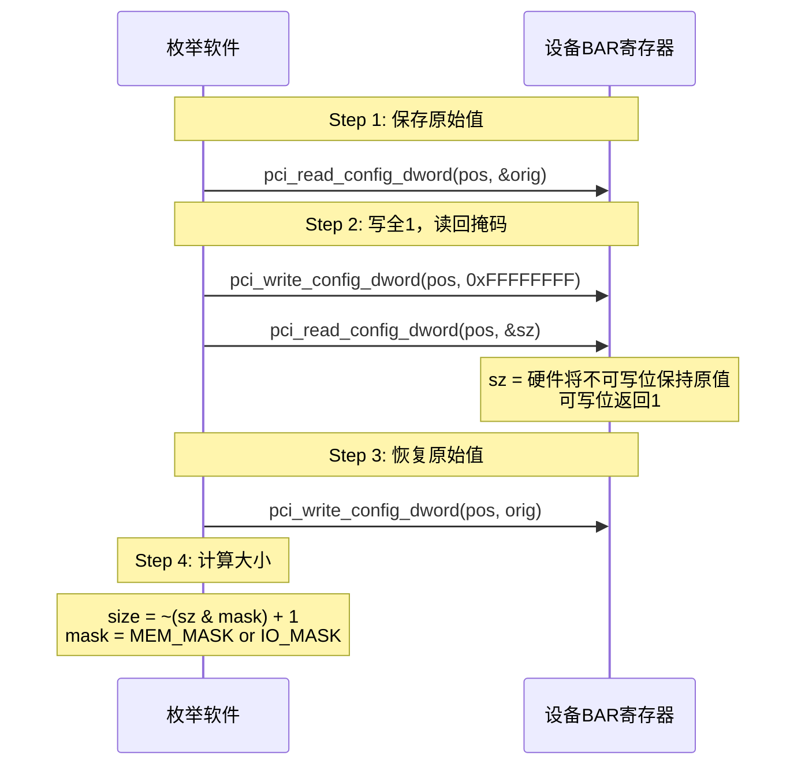
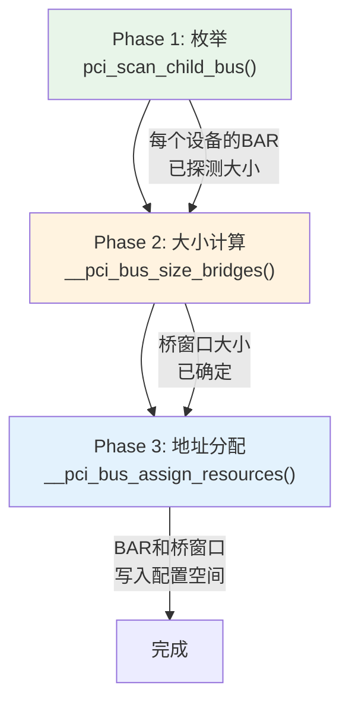
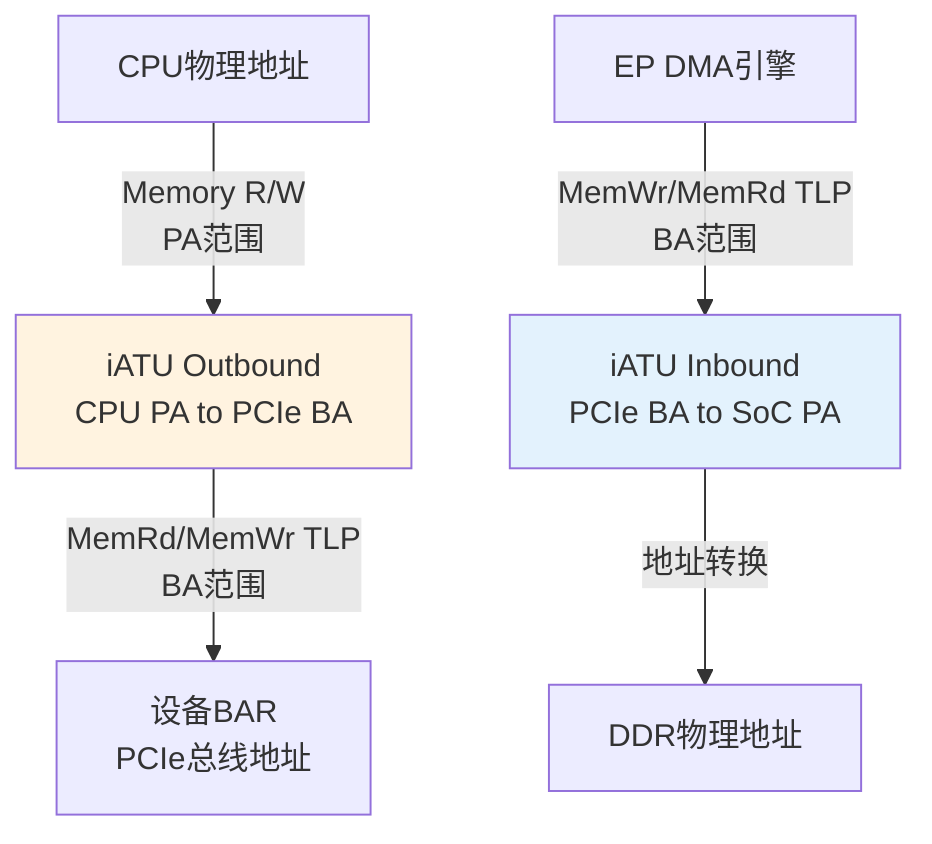

# BAR 与资源分配

> 核心问题：设备如何声明地址需求？系统如何为所有设备分配不冲突的地址？
> 关联索引：[PCIe核心知识索引](./pcie-learning-resources.md) Phase 0, 1.2, 2.1

### 关键术语
| 缩写 | 全称 | 含义 |
|------|------|------|
| BAR | Base Address Register | 基地址寄存器，设备声明地址需求的机制 |
| iATU | Internal Address Translation Unit | 内部地址转换单元，RC中CPU地址与PCIe地址的桥梁 |
| NP | Non-Prefetchable | 不可预取内存，读取有副作用 |
| PF | Prefetchable | 可预取内存，读取无副作用 |
| VF | Virtual Function | SR-IOV虚拟功能，轻量级PCIe Function |
| PCIe | Peripheral Component Interconnect Express | 高速外设互连标准 |

---

## 0. 前置背景

### 0.1 什么是BAR

Base Address Register (BAR) 是设备配置空间中的寄存器（Type 0 Header: 0x10-0x24），用于向系统声明：
- **需要多大的地址空间**（大小）
- **需要什么类型的空间**（Memory还是I/O）
- **是否允许预取**（Prefetchable）

系统启动时通过**写全1读掩码协议**探测这些信息，然后在可用地址范围内为每个设备分配不重叠的地址。

### 0.2 为什么需要BAR

CPU的物理地址空间是全局共享的。如果两个设备的MMIO区域重叠，CPU访问一个设备的数据会被另一个设备响应。BAR机制确保：

```
正确情况:
  GPU BAR  : 0xC000_0000 - 0xCFFF_FFFF (256MB)
  NIC BAR  : 0xD000_0000 - 0xD000_3FFF (16KB)
  NVMe BAR : 0xD000_4000 - 0xD000_7FFF (16KB)
  → 无冲突，每个设备有独立可寻址范围

错误情况:
  GPU BAR  : 0xC000_0000 - 0xCFFF_FFFF
  NIC BAR  : 0xC000_0000 - 0xC000_3FFF  ← 重叠!
  → CPU访问NIC可能读到GPU数据
```

### 0.3 资源分配与iATU的关系

BAR分配的是**PCIe总线地址**，但CPU使用的是**物理地址**。两者的转换由Host Bridge内的iATU完成。因此资源分配必须考虑iATU窗口的限制。

---

## 1. 规范机制

### 1.1 BAR寄存器结构

Type 0 Header (普通设备) 有6个BAR (0x10-0x24)，Type 1 Header (桥) 有2个BAR (0x10-0x14)。

**Memory Space BAR**：

```
 31                                           4 3 2 1 0
┌──────────────────────────────────────────────┬─┬─┬─┬─┐
│          Base Address / Size Mask            │P│T│  │0│
│          (可写位决定大小)                      │ │ │  │ │
└──────────────────────────────────────────────┴─┴─┴─┴─┘
                                                │ │  │ └─ 0 = Memory Space
                                                │ │  └─── 保留
                                                │ └────── Type: 00=32bit, 10=64bit
                                                └──────── Prefetchable
```

**I/O Space BAR**：

```
 31                                           2 1 0
┌──────────────────────────────────────────────┬─┬─┐
│          Base Address / Size Mask            │ │1│
└──────────────────────────────────────────────┴─┴─┘
                                                  └─ 1 = I/O Space
```

### 1.2 Prefetchable 的含义

BAR的bit3（Prefetchable位）决定了CPU对该地址区域的访问语义：

| Prefetchable | 含义 | 典型用途 |
|-------------|------|---------|
| 0（非预取） | 读取有副作用，CPU不能预取、不能合并访问 | 控制寄存器、状态寄存器、门铃寄存器 |
| 1（可预取） | 读取无副作用，多次读取返回相同值 | 帧缓冲、显存、ROM |

**为什么区分**：CPU和桥在访问非预取区域时必须严格遵守程序顺序，不能进行读预取（Read Prefetching）或写合并（Write Combining）。对控制寄存器做读预取可能导致状态位被意外清除（如中断状态寄存器读后自动清零）；对帧缓冲做写合并则能显著提升性能。

**规则**：
- 如果设备的某个Memory区域读取**无副作用**，应声明为Prefetchable
- Prefetchable BAR通常使用64-bit类型（bit2:1=10），以便映射到4GB以上地址空间
- 桥窗口分为非预取（Memory Base/Limit）和预取（Prefetchable Base/Limit）两类，分别转发

### 1.3 BAR大小探测协议



**示例**：设备需要1MB Memory空间

```
写入: 0xFFFFFFFF
读回: 0xFFF00000  (低20位可写=0, 高12位不可写=1)
掩码: 0xFFF00000 & 0xFFFFFFF0 = 0xFFF00000
大小: ~0xFFF00000 + 1 = 0x00100000 = 1MB
```

**示例**：设备需要256字节I/O空间

```
写入: 0xFFFFFFFF
读回: 0xFFFFFF00  (低8位可写=0, 高24位不可写=1)
掩码: 0xFFFFFF00 & 0xFFFFFFFC = 0xFFFFFF00  (I/O掩码低2位为类型标志)
大小: ~0xFFFFFF00 + 1 = 0x00000100 = 256B
```

> I/O BAR与Memory BAR的探测协议相同，区别仅在于掩码：I/O使用`PCI_BASE_ADDRESS_IO_MASK`（bit2-31），Memory使用`PCI_BASE_ADDRESS_MEM_MASK`（bit4-31）。I/O空间在现代系统中已很少使用，x86平台保留`in/out`指令兼容，ARM/RISC-V平台通常不支持I/O空间。

### 1.3 64-bit BAR

64-bit BAR使用两个连续32位寄存器：

```
BARn  (低32位): [Base/Mask低32位][P][Type=10][0]
BARn+1(高32位): [Base/Mask高32位]
```

- BARn的bit0=0, bit2:1=10 标识64-bit Memory
- 枚举时需同时读写两个寄存器
- BARn+1不单独存在，跳过下一个槽位

---

## 2. Linux内核实现

### 2.1 BAR探测核心函数

```c
// drivers/pci/probe.c

static inline unsigned long decode_bar(struct pci_dev *dev, u32 bar)
{
    unsigned long flags;

    if ((bar & PCI_BASE_ADDRESS_SPACE) == PCI_BASE_ADDRESS_SPACE_IO) {
        flags = bar & ~PCI_BASE_ADDRESS_IO_MASK;
        flags |= IORESOURCE_IO;
        return flags;
    }

    flags = bar & ~PCI_BASE_ADDRESS_MEM_MASK;
    flags |= IORESOURCE_MEM;
    if (flags & PCI_BASE_ADDRESS_MEM_PREFETCH)
        flags |= IORESOURCE_PREFETCH;

    switch (bar & PCI_BASE_ADDRESS_MEM_TYPE_MASK) {
    case PCI_BASE_ADDRESS_MEM_TYPE_32:
        break;
    case PCI_BASE_ADDRESS_MEM_TYPE_64:
        flags |= IORESOURCE_MEM_64;
        break;
    }
    return flags;
}
```

`decode_bar()` 将BAR硬件编码转换为Linux `resource` flags：

| BAR编码 | Linux Flag |
|---------|-----------|
| bit0=1 | `IORESOURCE_IO` |
| bit0=0 | `IORESOURCE_MEM` |
| bit3=1 | `IORESOURCE_PREFETCH` |
| bit2:1=10 | `IORESOURCE_MEM_64` |

### 2.2 BAR大小读取优化

```c
// drivers/pci/probe.c

static void __pci_size_bars(struct pci_dev *dev, int count,
                            unsigned int pos, u32 *sizes, bool rom)
{
    u32 orig, mask = rom ? PCI_ROM_ADDRESS_MASK : ~0;
    int i;

    for (i = 0; i < count; i++, pos += 4, sizes++) {
        // 保存原始值
        pci_read_config_dword(dev, pos, &orig);
        // 写全1读回掩码
        pci_write_config_dword(dev, pos, mask);
        pci_read_config_dword(dev, pos, sizes);
        // 恢复原始值
        pci_write_config_dword(dev, pos, orig);
    }
}
```

> 优化：`__pci_size_bars()` 一次性读取所有BAR掩码，而非逐个BAR开关解码。在虚拟化环境中，开关解码的开销可能很大。

### 2.3 __pci_read_base() —— 解析BAR为resource

```c
// drivers/pci/probe.c
int __pci_read_base(struct pci_dev *dev, enum pci_bar_type type,
                    struct resource *res, unsigned int pos, u32 *sizes)
{
    u32 l = 0, sz;
    u64 l64, sz64, mask64;

    pci_read_config_dword(dev, pos, &l);
    sz = sizes[0];  // 使用预读的掩码

    // 解码BAR类型
    res->flags = decode_bar(dev, l);
    res->flags |= IORESOURCE_SIZEALIGN;

    // 提取地址和大小掩码
    if (res->flags & IORESOURCE_IO) {
        l64 = l & PCI_BASE_ADDRESS_IO_MASK;
        sz64 = sz & PCI_BASE_ADDRESS_IO_MASK;
        mask64 = PCI_BASE_ADDRESS_IO_MASK & (u32)IO_SPACE_LIMIT;
    } else {
        l64 = l & PCI_BASE_ADDRESS_MEM_MASK;
        sz64 = sz & PCI_BASE_ADDRESS_MEM_MASK;
        mask64 = (u32)PCI_BASE_ADDRESS_MEM_MASK;
    }

    // 64-bit BAR: 读取高32位
    if (res->flags & IORESOURCE_MEM_64) {
        pci_read_config_dword(dev, pos + 4, &l);
        sz = sizes[1];
        l64 |= ((u64)l << 32);
        sz64 |= ((u64)sz << 32);
        mask64 |= ((u64)~0 << 32);
    }

    // 计算大小
    sz64 = pci_size(l64, sz64, mask64);

    // 转换为CPU侧资源地址
    pcibios_bus_to_resource(dev->bus, res, &region);

    return (res->flags & IORESOURCE_MEM_64) ? 1 : 0;
}
```

### 2.4 pci_size() —— 从掩码计算大小

```c
// drivers/pci/probe.c
static u64 pci_size(u64 base, u64 maxbase, u64 mask)
{
    u64 size = mask & maxbase;
    if (!size)
        return 0;

    // 取最低有效位，得到对齐粒度
    size = size & ~(size - 1);

    // 验证BAR值合法
    if (base == maxbase && ((base | (size - 1)) & mask) != mask)
        return 0;

    return size;
}
```

**算法核心**：`size & ~(size-1)` 提取最低位的1，即对齐粒度，也就是BAR空间大小。

### 2.5 BAR读取入口

```c
// drivers/pci/probe.c
static __always_inline void pci_read_bases(struct pci_dev *dev,
                                           unsigned int howmany, int rom)
{
    u32 stdbars[PCI_STD_NUM_BARS];
    u16 orig_cmd;

    // 关闭解码，避免BAR探测期间产生副作用
    if (!dev->mmio_always_on) {
        pci_read_config_word(dev, PCI_COMMAND, &orig_cmd);
        if (orig_cmd & PCI_COMMAND_DECODE_ENABLE)
            pci_write_config_word(dev, PCI_COMMAND,
                orig_cmd & ~PCI_COMMAND_DECODE_ENABLE);
    }

    // 批量读取所有BAR掩码
    __pci_size_stdbars(dev, howmany, PCI_BASE_ADDRESS_0, stdbars);

    // 恢复解码
    if (!dev->mmio_always_on && (orig_cmd & PCI_COMMAND_DECODE_ENABLE))
        pci_write_config_word(dev, PCI_COMMAND, orig_cmd);

    // 逐个解析BAR
    for (pos = 0; pos < howmany; pos++) {
        struct resource *res = &dev->resource[pos];
        reg = PCI_BASE_ADDRESS_0 + (pos << 2);
        pos += __pci_read_base(dev, pci_bar_unknown, res, reg, &stdbars[pos]);
        // 64-bit BAR返回1，跳过下一个槽位
    }
}
```

---

## 3. 资源分配流程

### 3.1 三阶段分配



### 3.2 桥窗口分配

PCI桥需要为下游设备转发Memory/IO事务，通过桥窗口寄存器配置转发范围：

```
Type 1 Header 桥窗口寄存器:
├── Memory Base/Limit (0x20-0x23)    → 非预取Memory窗口
├── Prefetchable Base/Limit (0x24-0x2B) → 预取Memory窗口
├── I/O Base/Limit (0x1C-0x1F)      → I/O窗口
└── Primary/Secondary/Subordinate Bus → 总线号范围
```

**setup-bus.c** 中的分配策略：

```c
// drivers/pci/setup-bus.c

// 资源类型掩码
#define PCI_RES_TYPE_MASK \
    (IORESOURCE_IO | IORESOURCE_MEM | IORESOURCE_PREFETCH | IORESOURCE_MEM_64)
```

### 3.3 资源分配算法

`__pci_bus_size_bridges()` 递归计算每个桥需要的窗口大小：

1. 从叶子设备开始，收集所有BAR需求
2. 按对齐排序（大对齐优先）
3. 计算所需窗口大小（考虑对齐和间隙）
4. 向上汇总到父桥

`__pci_bus_assign_resources()` 递归分配具体地址：

1. 从Root Bridge的可用窗口开始
2. 按对齐从大到小分配
3. 写入设备BAR和桥窗口寄存器
4. 递归处理子桥

### 3.4 pci_std_update_resource() —— 写入BAR

```c
// drivers/pci/setup-res.c
static void pci_std_update_resource(struct pci_dev *dev, int resno)
{
    struct resource *res = pci_resource_n(dev, resno);

    // VF的BAR是只读的
    // VF BAR由PF的SR-IOV Capability中的VF BAR寄存器定义(偏移0x24-0x3C)，
    // 系统在启用VF时通过sriov_enable()统一分配，而非走标准BAR分配路径。
    // VF BAR的值由PF驱动写入SR-IOV Cap，硬件自动将同一BAR值映射到所有同类型VF，
    // 因此VF的配置空间中BAR是只读的，pci_std_update_resource()对VF直接返回。
    if (dev->is_virtfn)
        return;

    // 将CPU侧地址转换为总线侧地址
    pcibios_resource_to_bus(dev->bus, &region, res);
    new = region.start;

    // 合并BAR类型标志位
    if (res->flags & IORESOURCE_IO) {
        mask = (u32)PCI_BASE_ADDRESS_IO_MASK;
        new |= res->flags & ~PCI_BASE_ADDRESS_IO_MASK;
    } else {
        mask = (u32)PCI_BASE_ADDRESS_MEM_MASK;
        new |= res->flags & ~PCI_BASE_ADDRESS_MEM_MASK;
    }

    reg = PCI_BASE_ADDRESS_0 + 4 * resno;

    // 64-bit BAR需先关闭解码再写入
    disable = (res->flags & IORESOURCE_MEM_64) && !dev->mmio_always_on;
    if (disable) {
        pci_read_config_word(dev, PCI_COMMAND, &cmd);
        pci_write_config_word(dev, PCI_COMMAND,
                              cmd & ~PCI_COMMAND_DECODE_ENABLE);
    }

    // 写入低32位
    pci_write_config_dword(dev, reg, new);
    // 64-bit BAR: 写入高32位
    if (res->flags & IORESOURCE_MEM_64)
        pci_write_config_dword(dev, reg + 4, upper_32_bits(region.start));

    // 恢复解码
    if (disable)
        pci_write_config_word(dev, PCI_COMMAND, cmd);
}
```

---

## 4. iATU与地址转换

BAR分配的是**PCIe总线地址**，CPU使用的是**物理地址**，两者之间的转换由iATU完成。

### 4.1 DWC iATU Outbound (CPU → PCIe)

```c
// drivers/pci/controller/dwc/pcie-designware.c
int dw_pcie_prog_outbound_atu(struct dw_pcie *pci,
                              const struct dw_pcie_ob_atu_cfg *atu)
{
    // 源地址 (CPU物理地址)
    dw_pcie_writel_atu_ob(pci, atu->index, PCIE_ATU_LOWER_BASE,
                          lower_32_bits(atu->parent_bus_addr));
    dw_pcie_writel_atu_ob(pci, atu->index, PCIE_ATU_UPPER_BASE,
                          upper_32_bits(atu->parent_bus_addr));

    // 源地址上限
    dw_pcie_writel_atu_ob(pci, atu->index, PCIE_ATU_LIMIT,
                          lower_32_bits(limit_addr));

    // 目标地址 (PCIe总线地址)
    dw_pcie_writel_atu_ob(pci, atu->index, PCIE_ATU_LOWER_TARGET,
                          lower_32_bits(atu->pci_addr));
    dw_pcie_writel_atu_ob(pci, atu->index, PCIE_ATU_UPPER_TARGET,
                          upper_32_bits(atu->pci_addr));

    // 启用区域
    dw_pcie_writel_atu_ob(pci, atu->index, PCIE_ATU_REGION_CTRL2,
                          PCIE_ATU_ENABLE);
}
```

### 4.2 DWC iATU Inbound (PCIe → SoC)

```c
// drivers/pci/controller/dwc/pcie-designware.c
int dw_pcie_prog_inbound_atu(struct dw_pcie *pci, int index, int type,
                             u64 parent_bus_addr, u64 pci_addr, u64 size)
{
    // 源地址 (PCIe总线地址)
    dw_pcie_writel_atu_ib(pci, index, PCIE_ATU_LOWER_BASE,
                          lower_32_bits(pci_addr));
    dw_pcie_writel_atu_ib(pci, index, PCIE_ATU_UPPER_BASE,
                          upper_32_bits(pci_addr));

    // 源地址上限
    dw_pcie_writel_atu_ib(pci, index, PCIE_ATU_LIMIT,
                          lower_32_bits(limit_addr));

    // 目标地址 (SoC本地地址)
    dw_pcie_writel_atu_ib(pci, index, PCIE_ATU_LOWER_TARGET,
                          lower_32_bits(parent_bus_addr));
    dw_pcie_writel_atu_ib(pci, index, PCIE_ATU_UPPER_TARGET,
                          upper_32_bits(parent_bus_addr));

    // 启用区域
    dw_pcie_writel_atu_ib(pci, index, PCIE_ATU_REGION_CTRL2,
                          PCIE_ATU_ENABLE);
}
```

### 4.3 地址转换全景



---

## 5. 实战调试

### 5.1 查看BAR分配

```bash
# 设备资源概览
lspci -v -s 01:00.0

# 原始配置空间 (BAR在0x10-0x24)
lspci -xxx -s 01:00.0

# 内核视角的资源
cat /sys/bus/pci/devices/0000:01:00.0/resource
# 格式: start end flags

# 查看iomem布局
cat /proc/iomem | grep -A5 "PCI"
```

### 5.2 驱动中使用BAR

```c
// 获取BAR信息
resource_size_t start = pci_resource_start(dev, 0);  // BAR0基地址
resource_size_t len   = pci_resource_len(dev, 0);     // BAR0大小
unsigned int flags     = pci_resource_flags(dev, 0);   // BAR0类型

// 映射BAR到内核虚拟地址
void __iomem *base = pci_iomap(dev, 0, 0);  // 映射BAR0
if (!base)
    return -ENOMEM;

// 读写设备寄存器
writel(value, base + REG_OFFSET);
value = readl(base + REG_OFFSET);

// 清理
pci_iounmap(dev, base);
```

### 5.3 常见问题

| 现象 | 原因 | 排查 |
|------|------|------|
| BAR全0 | BIOS未分配或驱动未调用`pci_enable_device()` | `dmesg \| grep "BAR"` |
| `can't handle BAR larger than 4GB` | 32位系统不支持>4GB BAR | 使用64位内核 |
| `initial BAR value invalid` | bus_to_resource/resource_to_bus不对称 | 检查iATU配置 |
| DMA写错位置 | Inbound iATU映射错误 | 检查`pcie-designware.c`中iATU配置 |
| 设备访问返回0xFF | Outbound iATU未配置或BAR解码未启用 | 检查PCI_COMMAND Memory/IO位 |

---

## 6. 代码阅读路线

| 顺序 | 文件 | 关注函数 |
|------|------|----------|
| 1 | `include/uapi/linux/pci_regs.h` | `PCI_BASE_ADDRESS_*` 宏定义 |
| 2 | `drivers/pci/probe.c` | `decode_bar()`, `__pci_size_bars()`, `__pci_read_base()`, `pci_read_bases()` |
| 3 | `drivers/pci/setup-res.c` | `pci_std_update_resource()` |
| 4 | `drivers/pci/setup-bus.c` | `__pci_bus_size_bridges()`, `__pci_bus_assign_resources()` |
| 5 | `drivers/pci/controller/dwc/pcie-designware.c` | `dw_pcie_prog_outbound_atu()`, `dw_pcie_prog_inbound_atu()` |
| 6 | `drivers/pci/resize.c` | `pci_resize_resource()`, `pci_reassign_resource()` |

---

## 7. Resizable BAR

### 7.1 为什么需要Resizable BAR

传统BAR大小在设备制造时固定（如GPU固定256MB BAR）。但现代GPU需要更大的MMIO窗口（8GB+），而系统启动时256MB可能已足够。Resizable BAR允许**运行时调整BAR大小**：

```
传统方式:
  GPU BAR = 256MB (固定) → GPU只能MMIO映射256MB → 大量数据需DMA

Resizable BAR:
  GPU BAR = 256MB (启动) → 运行时扩展到8GB → GPU可MMIO映射全部显存
  → 显著提升性能 (尤其CPU直接访问显存场景)
```

> AMD "Smart Access Memory" (SAM) 和 NVIDIA "Resizable BAR" 是同一技术的不同品牌名。

### 7.2 Resizable BAR Capability

```
Resizable BAR Extended Capability (0x100+):
├── 0x00: Cap ID = 0x1E, Version, Next Ptr
├── 0x04: Resizable BAR Control
│   ├── [3:0]  BAR Index (哪个BAR)
│   ├── [7:4]  Num of Resizable Bits (支持的大小数)
│   └── [13:8] Current BAR Size (当前大小的索引)
├── 0x08: Resizable BAR Capability (每个BAR一个)
│   └── [63:0] Supported Sizes Bitmask
│        Bit[i]=1 表示支持 2^i 字节
│        例: Bit[28|29|30|31|32|33] = 1
│           → 支持 256MB/512MB/1GB/2GB/4GB/8GB
└── 0x0C: Resizable BAR Capability (下一个BAR)
```

### 7.3 内核实现

```c
// drivers/pci/resize.c
int pci_resize_resource(struct pci_dev *dev, int resno, int size)
{
    struct resource *res = dev->resource + resno;
    struct pci_host_bridge *host;
    int old_size = pci_resource_len(dev, resno);

    // 1. 检查Resizable BAR Capability
    if (!dev->res_bar_cap)
        return -ENOTSUPP;

    // 2. 检查请求的大小是否支持
    if (!(pci_rebar_get_possible_sizes(dev, resno) & BIT(size)))
        return -EINVAL;

    // 3. 释放当前资源
    pci_release_resource(dev, resno);

    // 4. 写入新大小到Resizable BAR Control
    pci_rebar_set_size(dev, resno, size);

    // 5. 重新计算BAR大小 (重新探测)
    res->end = res->start + (1ULL << size) - 1;

    // 6. 重新分配地址
    ret = pci_reassign_resource(dev, resno, size, IORESOURCE_MEM);

    return ret;
}
```

```bash
# 查看Resizable BAR支持
lspci -vvv -s 01:00.0 | grep -i "resizable"

# 启用Resizable BAR (内核5.12+)
echo 1 > /sys/bus/pci/devices/0000:01:00.0/resize

# 内核参数自动启用
pci=realloc
```

---

## 参考资料

- [PCIe Base Specification 6.0](https://pcisig.com/specifications) — §7.5.1.2 BAR寄存器定义, §7.8.5 Resizable BAR Capability
- [Linux Kernel Source](https://git.kernel.org/) — `drivers/pci/setup-res.c`, `kernel/resource.c`
- [PCI Firmware Specification 3.3](https://uefi.org/specifications) — BAR分配与固件交互

---

上一篇：[ECAM与配置空间](./ecam-config-space.md) | 下一篇：[设备枚举流程](./enumeration-flow.md)

---

*源码版本：Linux 6.x | 更新：2026-04-21*
