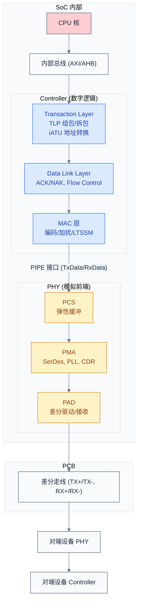
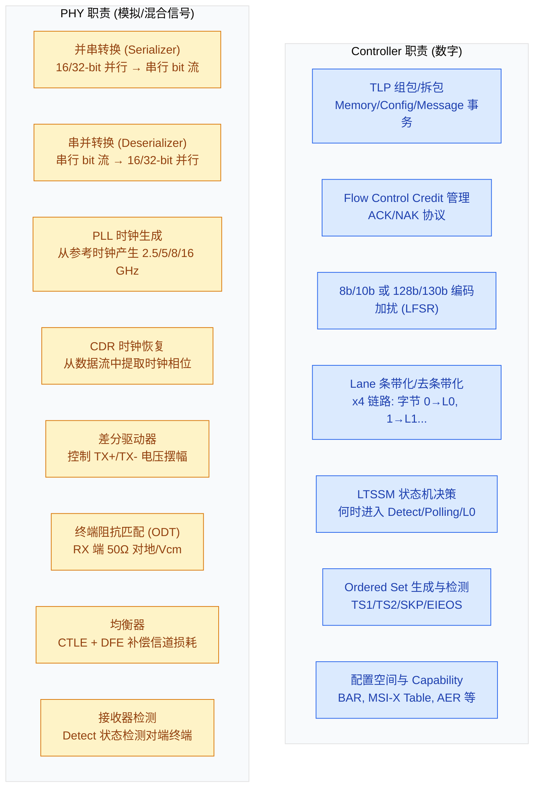
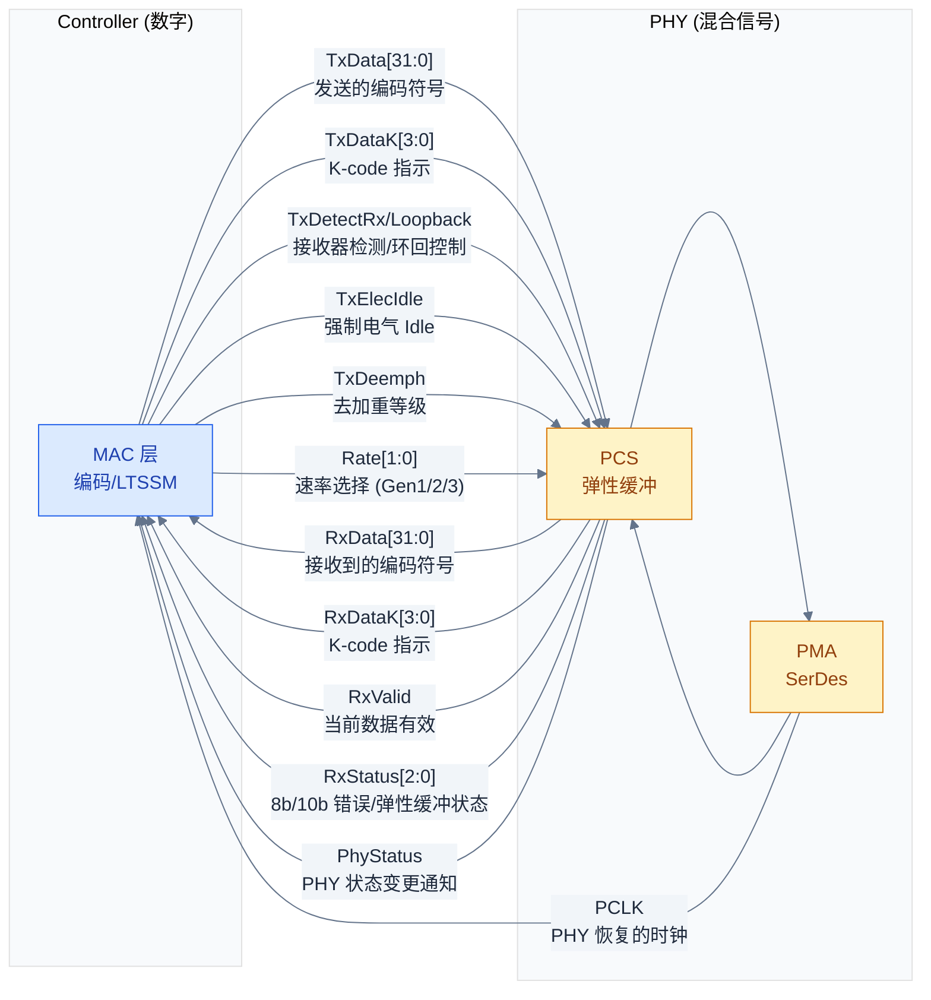
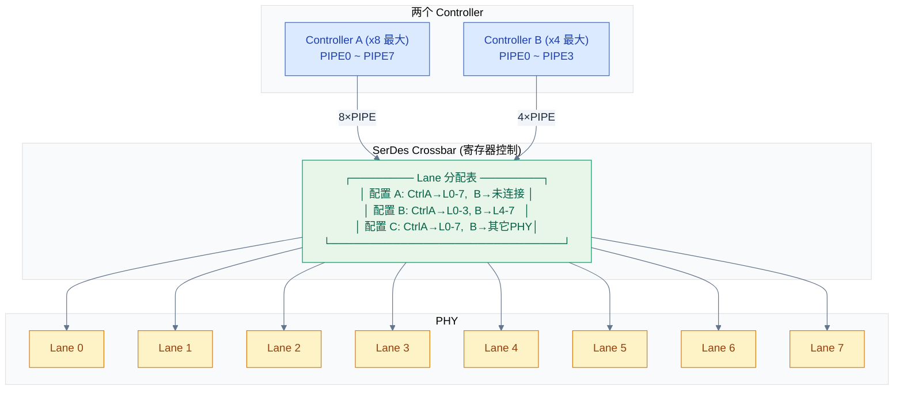
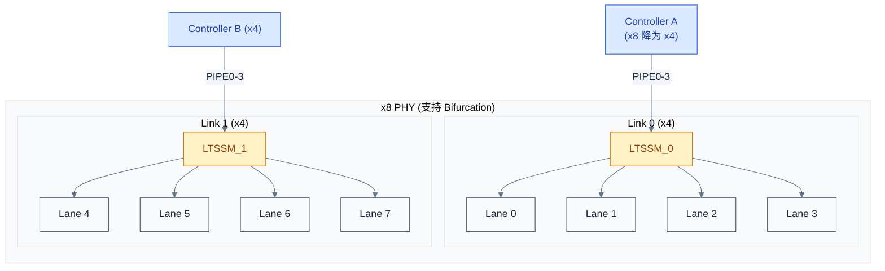
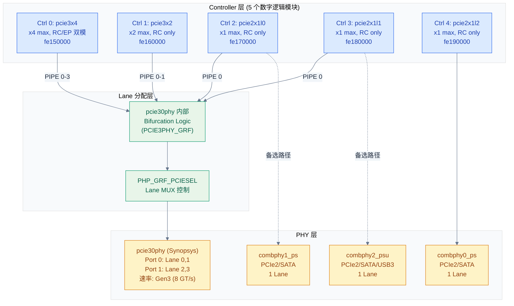
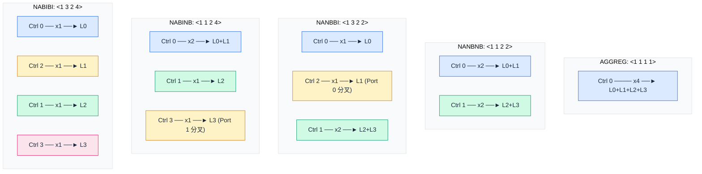
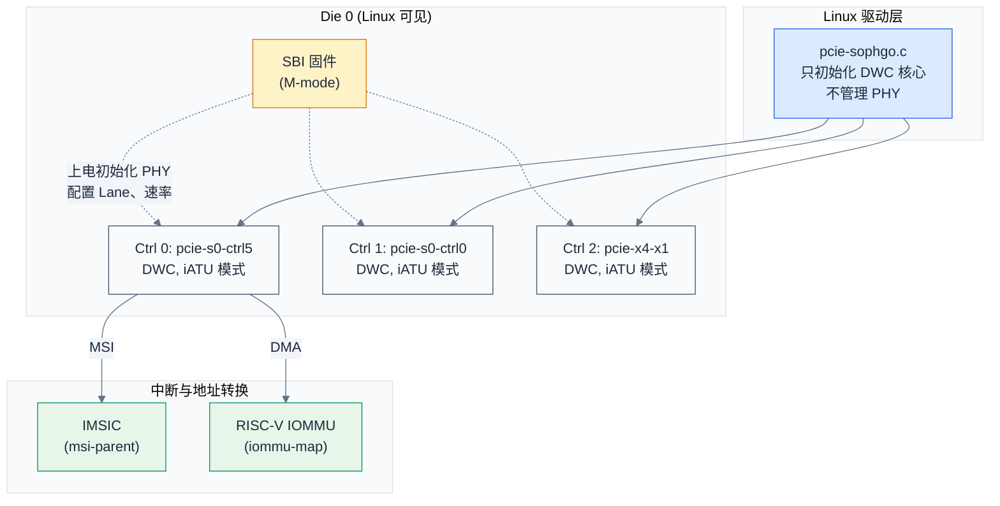

# Controller 与 PHY —— PCIe 的硅片级架构

> 从硅片视角解剖 PCIe：Controller 和 PHY 各自做什么、怎么分界、多个 Controller 如何共享一组 PHY Lane。
> **工程师视角**：理解 Controller/PHY 的分工与 Lane 分配模式，是阅读 SoC 数据手册 PCIe 章节、调试链路训练失败、配置设备树 `data-lanes` 属性的前提。

### 关键术语

| 缩写 | 全称 | 含义 |
|------|------|------|
| PHY | Physical Layer (analog front-end) | PCIe 物理层模拟前端，负责差分信号的发送/接收、时钟恢复、均衡 |
| PIPE | PHY Interface for PCI Express | Controller 与 PHY 之间的标准数字接口，由 Intel 定义 |
| SerDes | Serializer / Deserializer | 串并/并串转换器，PHY 的核心电路 |
| PMA | Physical Medium Attachment | PHY 中负责模拟信号的部分（驱动器、接收器、PLL、CDR） |
| PCS | Physical Coding Sublayer | PHY 中负责编码/解码的数字逻辑（8b/10b、128b/130b、弹性缓冲） |
| LTSSM | Link Training and Status State Machine | 链路训练状态机，协议决策在 Controller，电气执行在 PHY |
| DBI | Data Bus Interface | DWC Controller 内部寄存器访问接口 |
| iATU | Internal Address Translation Unit | DWC Controller 内部地址转换单元 |
| CDR | Clock and Data Recovery | 从串行数据流中恢复时钟，接收端 PHY 的关键功能 |
| CTLE | Continuous Time Linear Equalizer | 连续时间线性均衡器，接收端补偿高频损耗 |
| DFE | Decision Feedback Equalizer | 判决反馈均衡器，用已判决符号消除码间干扰 |

---

## 1. 概述

### 1.1 前置知识

| 需要了解 | 参考文档 |
|----------|----------|
| PCIe 拓扑组件（RC、Switch、EP） | [PCIe 核心知识索引](./pcie-learning-resources.md) §0.2 |
| Lane 与链路宽度 | [PCIe 核心知识索引](./pcie-learning-resources.md) §0.5 |
| TLP 与三层模型 | [PCIe 核心知识索引](./pcie-learning-resources.md) §0.6 |
| LTSSM 链路状态机 | [PCIe 核心知识索引](./pcie-learning-resources.md) §4.1 |
| DWC 控制器 DBI 接口 | [ECAM 与配置空间](./ecam-config-space.md) §3.4 |

### 1.2 系统上下文

本文研究的是 **PCIe 在硅片上的物理实现**——Controller（数字逻辑）与 PHY（模拟前端）如何分工、如何对话、多 Controller 如何共享 PHY Lane。这与协议视角互补：协议定义了"数据包长什么样"，硅片架构定义了"谁在哪个硬件模块里处理这个包"。



> **核心要点**：蓝色框是 Controller（数字逻辑，综合到 SoC 数字区域），黄色框是 PHY（模拟/混合信号，通常作为独立硬宏集成）。两者的分界线是 **PIPE 接口**——Controller 把编码好的符号通过 PIPE 交给 PHY，PHY 把它变成 PCB 铜线上的差分电压。对端设备收到后反向走一遍：PHY 恢复时钟和数据，Controller 解码出 TLP。

---

## 2. Controller 与 PHY 的本质分工

> 上一章建立了 Controller+PHY 的整体框架。一个自然的问题是：**为什么要把 PCIe 接口拆成两块，而不是一个统一的模块？** 本章从数字/模拟的工艺差异出发，说明这个拆分的工程动机和各侧职责。

### 2.1 为什么分开？

**本质原因：数字逻辑和模拟电路在先进工艺节点上的行为完全不同。**

- 数字逻辑（Controller）：在 FinFET 先进工艺（5nm、3nm）下表现良好——晶体管开关更快、功耗更低。RTL 综合到标准单元库即可。
- 模拟电路（PHY）：在先进工艺下漏电流增大、噪声恶化、器件匹配变差。SerDes 驱动器需要精确的阻抗匹配（±10%）、PLL 需要极低抖动、接收器需要微伏级灵敏度——这些对晶体管的模拟特性要求远高于数字逻辑。

如果强行把 PHY 做进先进工艺的数字区域，要么性能不达标（眼图打不开），要么需要大量定制晶体管增加成本。所以业界通行的做法是：

- Controller 作为**可综合 IP**（RTL 交付），跟随 SoC 工艺节点走
- PHY 作为**硬宏**（GDSII 版图交付），在较成熟或专门优化的工艺上实现，以独立宏单元形式拼入 SoC

> **核心要点**：Controller 和 PHY 分开不是协议要求的，而是**工程经济性**决定的。同一套 Controller RTL 可以搭配不同工艺节点的 PHY；同一 PHY 硬宏也可以服务 PCIe/SATA/USB3 多种协议。

### 2.2 各自的职责



> **如何读这张图**：蓝色是 Controller 做的事——全是数字逻辑，可综合、可仿真、可用 UVM 验证。黄色是 PHY 做的事——涉及电压/电流/时序/抖动，需要用 SPICE 仿真、眼图分析、IBIS-AMI 建模。一条经验法则：**"知道自己在处理 TLP 还是 Ordered Set"的逻辑在 Controller，"不知道包是什么、只看到 bit 流"的电路在 PHY。**

| 对比维度 | Controller | PHY |
|----------|-----------|-----|
| **本质** | 数字逻辑（RTL，可综合到标准单元库） | 模拟/混合信号（晶体管级定制） |
| **工艺依赖** | 跟随 SoC 工艺（5nm / 3nm），标准单元库即可 | 通常独立工艺优化，以硬宏形式集成 |
| **知道什么** | 知道 TLP 格式、BAR 地址范围、MSI 向量号 | 不知道协议——只看到差分电压跳变 |
| **关键模块** | iATU, DBI, LTSSM 决策逻辑 | SerDes, PLL, CDR, CTLE, DFE |
| **验证方法** | UVM / SystemVerilog 仿真 | SPICE 仿真, 眼图, IBIS-AMI |
| **对外接口** | CPU 侧: AXI/AHB; PHY 侧: PIPE | Controller 侧: PIPE; 外: 差分焊盘 |
| **IP 形态** | 可综合 IP（RTL 源码或加密网表） | 硬宏（GDSII 版图，包含模拟 layout） |
| **功耗来源** | 动态功耗为主（逻辑翻转） | 静态功耗显著（偏置电流、终端电阻） |

### 2.3 MAC 层归属的"灰色地带"

你可能注意到上图把编码（8b/10b）和 LTSSM 放到了 Controller 侧——这在业界存在两种实现：

| 划分方式 | 编码 (8b/10b, 128b/130b) | LTSSM 决策 | 典型产品 |
|----------|------------------------|-----------|---------|
| **Controller 含 MAC** | Controller (数字) | Controller (数字) | Synopsys DWC PCIe |
| **PHY 含 MAC** | PHY (数字逻辑, 在 PHY 硬宏内) | Controller (少数实时控制给 PHY) | 部分 Cadence / 自研 PHY |

本文以 **DWC 风格**（Controller 含 MAC, 编码和 LTSSM 都在 Controller）为主进行讨论，这也是行业主流。PIPE 接口位于 MAC 和 PCS 之间，传递的是**已编码的符号**（8b/10b 后的 10-bit 符号或 128b/130b 后的 block）。

> **核心要点**：无论 MAC 归哪边，**LTSSM 的"决策"永远在 Controller**——什么时候跳转到 Detect、什么时候进入 Recovery，这些是协议层决策。PHY 只负责执行指令：驱动 `TxDetectRx`、切换速率档位、调整均衡器系数。

---

## 3. PIPE 接口 —— 两者的分界线

> 上一章讲了 Controller 和 PHY 各自做什么。一个自然的问题是：**它们之间怎么对话？** 本章介绍 PIPE——Controller 与 PHY 之间的标准数字接口，是整个 PCIe 硅片架构的核心契约。

### 3.1 为什么需要 PIPE？

**本质原因：Controller IP 和 PHY IP 通常来自不同厂商（或不同团队），需要一个统一接口保证互换性。**

- 一个 SoC 团队可能从 Synopsys 买 DWC Controller、从 Cadence 买 PHY，或反过来
- 同一 Controller IP 需要适配 Gen3/Gen4/Gen5 不同速率的 PHY
- 同一 PHY IP 可能被 PCIe / SATA / USB3 Controller 复用（通过不同接口模式）

Intel 在 2002 年定义了第一版 PIPE 规范，此后随 PCIe 代际演进到 PIPE4（Gen3）、PIPE5（Gen4/5）。规范不是强制标准，但行业已将其视为事实标准。

### 3.2 PIPE 信号

PIPE 是一组并行数字信号（位宽通常 16/32-bit），Controller 作为 PIPE 的 master，PHY 作为 slave：



> **如何读这张图**：→是 Controller 发给 PHY 的控制/数据，←是 PHY 回报的状态/数据。命名规范是从 Controller 视角：`TxData` 意思是"Controller 要发给 PHY 去发送的数据"；`RxData` 意思是"Controller 从 PHY 接收到的数据"。PCLK 是 PHY 从串行数据流中恢复出来后反哺给 Controller 的时钟。

#### 关键信号详解

| 信号 | 方向 | 位宽 | 作用 |
|------|------|------|------|
| `TxData` | C → P | 16/32 | 要发送的编码后符号（ELP 模式下每 Lane n bit） |
| `TxDataK` | C → P | 2/4 | Data/K-code 指示：1 = 该字节是 K-code（控制符号）, 0 = D-code（数据） |
| `TxElecIdle` | C → P | 1/Lane | 强制 Lane 进入电气 Idle：驱动器关闭、差分输出共模电平 |
| `TxDetectRx` | C → P | 1/Lane | 接收器检测：PHY 在 Lane 上执行充电-放电序列，检测对端终端阻抗 |
| `TxDeemph` | C → P | 多 bit | 去加重系数：Gen2 时需要，补偿 PCB 高频损耗 |
| `Rate` | C → P | 2 | 速率选择：`00` = Gen1 (2.5 GT/s), `01` = Gen2 (5 GT/s), `10` = Gen3+ (8 GT/s) |
| `RxData` | P → C | 16/32 | 接收到的符号：PHY 从串行流恢复出的并行数据 |
| `RxDataK` | P → C | 2/4 | 指示接收到的符号是 K-code 还是 D-code |
| `RxValid` | P → C | 1 | 当前 RxData 有效（弹性缓冲有数据可读） |
| `RxStatus` | P → C | 3 | `000` = 正常; `001` = SKP 已增/删; `010` = 检测到 Framing Error; `011` = 8b/10b 或 128b/130b 解码错误 |
| `PhyStatus` | P → C | 1 | PHY 完成 Controller 请求的动作（如速率切换、省电状态进入）后置位 |
| `PCLK` | P → C | 1 | PHY 输出的并行时钟：速率 = 串行速率 / 总线宽度（如 8 GT/s ÷ 32 = 250 MHz） |

### 3.3 PIPE 如何支撑 LTSSM

LTSSM 的每个状态切换都涉及一组 PIPE 信号操作。以下举例说明"Controller 决策 → PIPE 传令 → PHY 执行"：

```
Detect 状态（检测对端是否存在）:
  1. Controller 置位 TxDetectRx
  2. PHY 对 Lane 充电到 Vcm, 测量放电时间
  3. PHY 回报 PhyStatus: 对端存在 / 不存在
  4. Controller 根据结果决定进入 Polling 还是回 Detect.Quiet

Polling 状态（速率协商、位锁定、符号锁定）:
  1. Controller 设 Rate = Gen1 (最低速率), 发送 TS1 Ordered Set
  2. PHY 将 TxData 串行化输出, CDR 从对端信号中恢复时钟
  3. PHY 回报 RxValid = 1, RxStatus = 000
  4. Controller 检测到连续 TS1 → 符号锁定完成 → 进入 Configuration

Configuration 状态（Lane 编号分配、宽度协商）:
  1. Controller 发送含 Lane Number 字段的 TS1
  2. 多 Lane 时 Controller 在每条 Lane 上各发一个 PIPE 通道的 TxData
  3. 收到 TS2 → 确认 Link Up → Controller 将 Rate 切换到协商的最高速率
  4. PHY 回报 PhyStatus 确认速率切换完成 → Controller 进入 L0

L0 → L1 省电:
  1. Controller 发送最后一个 TLP 后发起 L1 Entry
  2. 对端确认后, Controller 置位 TxElecIdle
  3. PHY 关闭驱动器、关闭 PLL 部分偏置
  4. 恢复时 Controller 清除 TxElecIdle, PHY 重新锁定 CDR
```

> **核心要点**：LTSSM 的状态机逻辑 **100% 在 Controller**。PHY 不知道自己在 Detect 还是 L0——它只是看见 `TxDetectRx` 就做充电检测，看见 `TxElecIdle` 就关驱动器。**Controller 是大脑，PHY 是肌肉。**

---

## 4. 多 Controller 共享 PHY 的设计模式

> 前三章讲的是一个 Controller 配一个 PHY 的理想情况。现实中的 SoC 有多个 PCIe Controller，但 PHY 的 Lane 数是固定的。**多个 Controller 如何共享一组 PHY Lane？** 这是 SoC 架构师的核心设计问题。

### 4.1 问题：Lane 不够用

典型 SoC 场景：

- 需要 2 个 PCIe 链路：一个 x8 接 GPU，一个 x4 接 NVMe
- 但 PHY 硬宏只有 8 条 Lane
- x8 + x4 = 12 > 8 → 必须做取舍

三种解决思路：

| 思路 | 本质 | 硬件代价 |
|------|------|---------|
| **SerDes MUX** | 在 Controller 和 PHY 之间加 Lane 级交叉开关 | MUX + 配置寄存器 |
| **PHY Bifurcation** | PHY 自身支持把 Lane 拆成多个独立 Link | PHY 需内置双 LTSSM |
| **虚拟化** | 一个 Controller 出多个 Function，不占额外 Lane | Controller 需 SR-IOV |

### 4.2 方案一：SerDes MUX / Crossbar

Controller 和 PHY Lane 之间插入可配置的 MUX：



**核心约束**：每条 PHY Lane 同一时刻只能连接一个 Controller。当 A 和 B 同时需要 Lane 时，A 必须降级（如 x8 → x4），腾出 Lane 给 B。

**典型配置模式**：

| 模式 | Controller A | Controller B | 总 Lane | 场景 |
|------|-------------|-------------|---------|------|
| A 独占 | x8 (L0-7) | 未使用 | 8 | GPU 单卡, NVMe 走另一组 PHY |
| 对半分 | x4 (L0-3) | x4 (L4-7) | 8 | GPU + NVMe 各 x4 |
| A 降级 + B 独立 | x4 (L0-3) | x2 (L4-5 或其它 PHY) | 6 | 灵活配置 |

### 4.3 方案二：PHY Bifurcation（分叉）

Bifurcation 是**PHY 自身支持**的能力——一个 PHY 硬宏内部的 Lane 拆成两组独立的 Link，各有独立的 LTSSM：



**Bifurcation vs MUX 的区别**：

| 对比维度 | SerDes MUX | PHY Bifurcation |
|----------|-----------|----------------|
| **谁做 Lane 分配** | 外部 Crossbar IP | PHY 内部 |
| **Lane 分组** | 灵活, 可按单 Lane 粒度分配 | 固定, 由 PHY 设计决定（如 Lane 0-3 一组, 4-7 一组） |
| **独立 LTSSM** | Controller 各自维护 | PHY 内部每 Link 各有一套 |
| **额外硬件** | MUX + 寄存器 | PHY 需原生支持（硬宏功能） |
| **配置方式** | 写 SoC 系统寄存器 | 写 PHY 内部寄存器 + Controller 寄存器 |
| **典型场景** | SoC 自己设计的多协议 SerDes | 从 x16 拆出 x8+x8 或 x8+x4+x4 |

### 4.4 方案三：虚拟化（不占 Lane）

一个 Controller 通过 SR-IOV 导出多个 Function。这不是 Lane 级别的共享——所有 Function 共享同一条物理链路。详见 [SR-IOV 虚拟化](./sriov-virtualization.md)。

### 4.5 方案对比

| 对比维度 | SerDes MUX | PHY Bifurcation | 虚拟化 (SR-IOV) |
|----------|-----------|----------------|----------------|
| **物理 Lane 分给多个 Controller** | ✓ | ✓ | ✗ (共享同一链路) |
| **Lane 分配粒度** | 单 Lane | PHY 设计决定的组（通常 4-Lane 一组） | 不适用 |
| **需要 PHY 特殊支持** | 不需要 | 需要 | 不需要 |
| **需要 Controller 特殊支持** | Controller 需接受降级 | Controller 需接受降级 | 需要 SR-IOV |
| **独立 LTSSM** | 每个 Controller 一份 | 每 Link 一份 | 共享一份 |
| **独立配置空间 (BDF)** | ✓ | ✓ | ✓ (PF + VF) |
| **运行时切换** | 通常不支持（启动时静态配置） | 通常不支持 | 支持 VF 动态创建/销毁 |

> **核心要点**：MUX 和 Bifurcation 解决的是"物理 Lane 不够分"的问题；SR-IOV 解决的是"一个物理链路要服务多个逻辑设备"的问题。实际 SoC 经常**组合使用**：例如 RK3588 的 pcie30phy 同时用了 Bifurcation（PHY 内部双 Port）和 MUX（Port 内 Lane 可接不同 Controller）。

---

## 5. 实例：RK3588 的 PCIe 架构

> 前四章讲了一般原理。**一个实际的 SoC 怎么落地这些设计？** 本章以 Rockchip RK3588 为例，展示 Controller、PHY、MUX、Bifurcation 的完整配合。

### 5.1 全局视图

RK3588 有 **5 个 PCIe Controller**，共享 **1 个专用 PCIe3 PHY（4 Lane）+ 3 个组合 PHY（各 1 Lane）**：



> **如何读这张图**：5 个 Controller（蓝色）对 4 条高速 Lane（黄色），必然有资源冲突。RK3588 的解法：**pcie30phy 通过内部 Bifurcation Logic + MUX，让 Lane 可以在多个 Controller 之间分配，但总物理 Lane 数不变**。Ctrl 2/3 还可以走组合 PHY 的 1-Lane 通路（图右虚线），这是"备份路径"——当一个 Controller 接组合 PHY 时，pcie30phy 的对应 Lane 给别的 Controller 用。

### 5.2 pcie30phy 的 Lane 映射规则

pcie30phy 内部有 2 个 Port，每个 Port 2 条 Lane。Lane 到 Controller 的映射**不是完全自由的**，有硬件固定约束：

```
pcie30phy Lane 映射 (硬件固定约束)
┌──────────────────────────────────────────────┐
│                                              │
│  Port 0                                      │
│  ┌────────────┐   ┌───────────────────────┐  │
│  │  Lane 0    │───│ 必须接 Ctrl 0 (4L)     │  │
│  └────────────┘   └───────────────────────┘  │
│  ┌────────────┐   ┌───────────────────────┐  │
│  │  Lane 1    │───│ Ctrl 0 (x4 聚合)       │  │
│  └────────────┘   │   或 Ctrl 2 (1L0 独立)  │  │
│                   └───────────────────────┘  │
│  Port 1                                      │
│  ┌────────────┐   ┌───────────────────────┐  │
│  │  Lane 2    │───│ Ctrl 0 (x4 聚合)       │  │
│  └────────────┘   │   或 Ctrl 1 (2L)       │  │
│                   └───────────────────────┘  │
│  ┌────────────┐   ┌───────────────────────┐  │
│  │  Lane 3    │───│ Ctrl 0 (x4 聚合)       │  │
│  └────────────┘   │   或 Ctrl 1 (2L)       │  │
│                   │   或 Ctrl 3 (1L1 独立)  │  │
│                   └───────────────────────┘  │
└──────────────────────────────────────────────┘
```

在设备树中用 `data-lanes` 属性编码每个 Lane 的目标 Controller：

| `data-lanes` 值 | 含义 | 目标 Controller |
|:---:|------|------|
| `0` | 未连接（硬件不支持此映射） | — |
| `1` | 4L — 该 Lane 属于 Ctrl 0 的聚合 x4 链路 | Ctrl 0 (pcie3x4) |
| `2` | 2L — 该 Lane 属于 Ctrl 1 的 x2 链路 | Ctrl 1 (pcie3x2) |
| `3` | 1L0 — 该 Lane 独立为 Ctrl 2 的 x1 链路 | Ctrl 2 (pcie2x1l0) |
| `4` | 1L1 — 该 Lane 独立为 Ctrl 3 的 x1 链路 | Ctrl 3 (pcie2x1l1) |

### 5.3 五种 Bifurcation 模式

由 `rockchip,pcie30-phymode` 属性 + 两个寄存器（`PCIE3PHY_GRF_CMN_CON0` 低 3 位，`PHP_GRF_PCIESEL_CON` 低 2 位）控制：



| Mode | `data-lanes` | CMN_CON0 | PCIESEL | 效果 |
|------|-------------|:--------:|:-------:|------|
| **AGGREG** | `<1 1 1 1>` | 4 | 0 | x4 聚合, Ctrl 0 独占 |
| **NANBNB** | `<1 1 2 2>` | 0 | 0 | x2 + x2, Ctrl 0 + Ctrl 1 |
| **NANBBI** | `<1 3 2 2>` | 1 | 1 | Ctrl 0(x2) + Ctrl 2(x1) + Ctrl 1(x2)。Ctrl 2 占用 Port 0 Lane1, Ctrl 0 只剩 1 条 |
| **NABINB** | `<1 1 2 4>` | 2 | 2 | Ctrl 0(x2) + Ctrl 1(x1) + Ctrl 3(x1) |
| **NABIBI** | `<1 3 2 4>` | 3 | 3 | 四条 x1, 四个 Controller 各得一条 |

> **核心要点**：模式名中的 "A" = Aggregation (聚合给 Ctrl 0), "N" = No bifurcation, "B" = Bifurcation, "I" = Independent lane。例如 NANBBI = Port 0 不分叉(N) + 聚合(A) + Port 0 不分叉(N) + Port 0 分叉(B) + Port 1 分叉(B) + Port 1 独立 I——实际上编码规则是：**前两个字母对应 Port 0 的两条 Lane, 后两个字母对应 Port 1 的两条 Lane**。N=该 Lane 聚合给单一 Controller, B=该 Lane 分叉为独立链路, I=独立 x1。

### 5.4 驱动实现要点

Linux 驱动 `phy-rockchip-snps-pcie3.c` 的初始化逻辑：

1. 默认进入 **AGGREG 模式**（`RK3588_LANE_AGGREGATION` 标志置位）
2. 遍历 DT `data-lanes` 数组，检测到值 > 1（即 Lane 不属于 Ctrl 0 聚合）时：
   - 清除聚合标志
   - 根据具体的值（3 或 4）设置对应的 Bifurcation 控制位
3. 将计算出的模式值写入 `PCIE3PHY_GRF_CMN_CON0` 和 `PHP_GRF_PCIESEL_CON`
4. PHY 根据寄存器值配置内部 Lane 路由

**模式在启动时一次性配置，运行时不改变**。这意味着：
- 你不能在运行时从 AGGREG (x4) 切换到 NANBNB (x2+x2)
- 如果 AGGREG 模式下 Ctrl 0 外的 Controller 需要 Lane，只能走组合 PHY（combphy）
- 大多数板卡（Rock 5B、官方 EVB）只用 AGGREG, Ctrl 0 独享 4 Lane

---

## 6. 实例对比：RK3588(嵌入式 ARM) vs SG2046(服务器 RISC-V)

> 上一节以 RK3588 为例展示了嵌入式 SoC 的 PCIe 架构——PHY 由 Linux 驱动管理,Lane 通过 Bifurcation 灵活分配。一个自然的问题是:**服务器级 SoC 的 PCIe 架构有何不同?** 本节以 Sophgo SG2046(RISC-V 服务器)为例,与 RK3588 对照,揭示两种设计哲学的差异。

### 6.1 SG2046 PCIe 架构概览

SG2046 是多 die(chiplet)RISC-V 服务器 SoC,每个 die 有多个 PCIe Controller,全部基于 Synopsys DWC IP。与 RK3588 的关键差异:**PHY 完全由固件(SBI/U-Boot)管理,Linux 驱动不触碰 PHY**。



### 6.2 两种设计哲学的对比

| 对比维度 | RK3588(嵌入式 ARM) | SG2046(服务器 RISC-V) |
|----------|-------------------|---------------------|
| **PHY 管理** | Linux 驱动 `phy-rockchip-snps-pcie3.c` | SBI 固件(M-mode),Linux 不触碰 |
| **Lane 分配** | 运行时通过 `data-lanes` DT 属性 + GRF 寄存器 | 固件静态配置,Linux 不可见 |
| **Bifurcation** | PHY 内部支持,5 种模式 | 由固件/硬件固定,Linux 不可见 |
| **配置访问** | 通用 ECAM(`pci-host-ecam-generic`) | iATU 路径(`native_ecam=true`) |
| **MSI 投递** | GIC ITS(ARM) | IMSIC(RISC-V AIA) |
| **IOMMU** | SMMU(ARM) | RISC-V IOMMU |
| **多 die 支持** | 单 die | 多 die,`linux,pci-domain` 区分 |
| **Linux 驱动复杂度** | 高(PHY + Bifurcation + MUX) | 低(只初始化 DWC 核心) |
| **固件复杂度** | 低(U-Boot 只做基础初始化) | 高(SBI 全面管理 PHY) |

> **如何读这张表**:RK3588 是"Linux 中心化"设计——Linux 驱动掌控从 PHY 到应用的全栈;SG2046 是"固件中心化"设计——SBI 固件在 M-mode 完成底层初始化,Linux 只看到已配置好的 DWC Controller。两种方案各有优劣:RK3588 灵活但驱动复杂,SG2046 稳定但调试 PHY 问题需要进入 M-mode。

### 6.3 SG2046 DTS 的"去 PHY 化"特征

对比 RK3588 与 SG2046 的 PCIe DT 节点,能直观看到 PHY 管理职责的差异:

```dts
// RK3588 PCIe DT(节选)——PHY 是 Linux 可见的外设
pcie3x4: pcie@fe150000 {
    phys = <&pcie30phy>;              // ← 引用 PHY 节点
    phy-names = "pcie-phy";
    resets = <&cru SRST_PCIE3_PHY>;   // ← PHY 复位由 Linux 控制
    rockchip,pcie30-phymode = <...>;  // ← Bifurcation 模式
    num-lanes = <4>;                  // ← Lane 数由 DT 声明
    max-link-speed = <3>;             // ← 速率由 DT 声明
};

// SG2046 PCIe DT(节选)——无 PHY 引用,PHY 由固件管理
pcie@200102400000 {
    compatible = "sophgo,sg2046-pcie";
    reg = <0x2001 0x02400000 ...>,    // dbi
          <0x2001 0x02700000 ...>,    // atu
          <0x2001 0x00a0b000 ...>,    // app
          <0x3000 0x00000000 ...>;    // config
    reg-names = "dbi", "atu", "app", "config";
    // 无 phys、无 phy-names、无 num-lanes、无 max-link-speed
    // PHY 已由 SBI 固件在 M-mode 初始化完毕
    msi-parent = <&imsic_s>;          // ← MSI 委托 IMSIC
    iommu-map = <0x0 &iommu_s0_c0 0x0 0x10000>;
};
```

> **核心要点**:SG2046 的 DT 中没有 `phys`/`phy-names`/`num-lanes`/`max-link-speed` 属性——这些全部由 SBI 固件在 M-mode 设置。Linux 驱动 `pcie-sophgo.c` 只做三件事:(1) 映射 dbi/atu/app/config 寄存器;(2) 设置 `native_ecam=true` 走 iATU 配置访问;(3) 注册 INTx 中断处理。PHY 相关的链路训练、均衡、Lane 分配都在固件层完成。

### 6.4 SG2046 多 die 架构的 domain 问题

SG2046 是 chiplet 多 die 架构,每个 die 有独立的 PCIe Controller 集合。DTS 中通过 `linux,pci-domain` 标识:

```dts
// arch/riscv/boot/dts/sophgo/sg2046-pcie-s.dtsi
pcie@200102400000 { linux,pci-domain = <0>; ... };  // Die 0 Ctrl 0
pcie@200109000000 { linux,pci-domain = <0>; ... };  // Die 0 Ctrl 1(注意:同 domain!)
pcie@200119c00000 { linux,pci-domain = <0>; ... };  // Die 0 Ctrl 2
```

> **工程注意**:三个 Controller 都用了 `linux,pci-domain = <0>`,这在单 die 系统中会产生 BDF 冲突。SG2046 的多 die 拓扑中,不同 die 的 PCIe 域应该用不同的 `linux,pci-domain` 值(如 die 0 → domain 0,die 1 → domain 1)。如果固件/DT 配置不当,两个 die 的 Root Port 会都出现在 `0000:00:00.0`,导致 `lspci` 输出混乱。详见 [工程踩坑指南](./pcie-engineering-pitfalls.md) §10.4。

### 6.5 服务器 vs 嵌入式的设计取舍

| 设计取舍 | 嵌入式(RK3588) | 服务器(SG2046) | 原因 |
|----------|---------------|---------------|------|
| **PHY 管理** | Linux 驱动 | 固件 | 服务器需要稳定,固件锁定 PHY 配置避免 OS 误操作 |
| **Lane 灵活性** | 高(Bifurcation) | 低(固定) | 服务器板卡设计固定,不需要运行时切换 |
| **配置访问** | 硬件 ECAM | iATU | 服务器优先用 256MB 对齐的 ECAM,但 SG2046 选择 iATU 可能因地址映射约束 |
| **MSI 控制器** | GIC ITS | IMSIC | 架构决定,RISC-V AIA 是规范 |
| **错误恢复** | AER + DPC | AER + DPC | 服务器对可靠性要求更高,DPC 必须启用 |
| **热插拔** | 通常不用 | 必须支持 | 服务器需要在线更换卡 |

> **核心要点**:RK3588 与 SG2046 代表两种典型的 PCIe SoC 设计哲学——**嵌入式**让 Linux 掌控一切以换取灵活性,**服务器**让固件锁定底层以换取稳定性。理解这种差异有助于在不同平台上调试 PCIe 问题:RK3588 上链路训练失败要查 Linux PHY 驱动;SG2046 上链路训练失败要进 SBI M-mode 查固件日志。

---

## 7. 与现有笔记的衔接

本文从硅片视角建立了 Controller/PHY/Lane 分配的框架。以下是本文概念与现有笔记中对应机制的交叉索引：

| 本文概念 | 在现有笔记中的位置 | 衔接关系 |
|----------|-----------------|---------|
| Controller 内部 iATU | [PCIe 核心知识索引](./pcie-learning-resources.md) §1.3 | iATU 是 Controller 内部的地址转换硬件 |
| Controller 内部 DBI | [ECAM 与配置空间](./ecam-config-space.md) §3.7 | DBI 是 Controller 内部寄存器访问接口 |
| DWC `native_ecam`/iATU 配置访问 | [ECAM 与配置空间](./ecam-config-space.md) §3.3-3.4 | SG2046 走 iATU 路径而非通用 ECAM |
| Controller 的 LTSSM 决策 | [PCIe 核心知识索引](./pcie-learning-resources.md) §4.1 | 状态机逻辑在 Controller, 电气执行在 PHY |
| Lane 与链路宽度 | [PCIe 核心知识索引](./pcie-learning-resources.md) §0.5 | Lane 是 PHY 的物理资源, ×N 宽度受限于 PHY Lane 数 |
| DWC 控制器代码 | [BAR 与资源分配](./bar-resource-allocation.md) §5 | `drivers/pci/controller/dwc/` 中的 `dw_pcie` 结构体 |
| SR-IOV 虚拟化 | [SR-IOV 虚拟化](./sriov-virtualization.md) | 本文 §4.4 提到的第三种"共享"方案 |
| CXL 使用 PCIe PHY | [PCIe 核心知识索引](./pcie-learning-resources.md) §8.3 | CXL.io 复用 PCIe Controller/PHY, CXL.cache/mem 新增协议层 |
| SG2046 iATU 配置访问 | [ECAM 与配置空间](./ecam-config-space.md) §3.4 · [工程踩坑](./pcie-engineering-pitfalls.md) §10.1 | SG2046 的 `native_ecam=true` 走 iATU 而非 ECAM |
| SG2046 IMSIC MSI | [MSI/MSI-X 中断](./msi-interrupt.md) §0.5 · [工程踩坑](./pcie-engineering-pitfalls.md) §5.3 | RISC-V AIA IMSIC 替代 GIC ITS |
| SG2046 工程踩坑 | [工程踩坑指南](./pcie-engineering-pitfalls.md) §10 | RISC-V/SG2046 特定问题汇总 |

> **核心要点**：读现有笔记时，记住"Controller 是数字协议引擎、PHY 是模拟信号前端"这条主线——ECAM/BAR/MSI 都在 Controller 里处理，Lane 宽度/链路训练/信号质量在 PHY 里落地。这样软件调试时就知道：配置空间读写失败大概率是 Controller 问题，链路反复降速/重训练大概率是 PHY/PCB 信号完整性问题。SG2046 上 PHY 问题还需考虑固件层,因为 Linux 不直接管理 PHY。

---

## 官方文档索引

| 文档 | 用途 | 建议阅读时机 |
|------|------|------|
| [PIPE Specification (Intel)](https://www.intel.com/content/www/us/en/io/pci-express/pcie-pipe-spec.html) | PIPE 接口的完整信号定义与时序 | 学完本文 §3 后 |
| [Synopsys DesignWare PCIe Controller Databook](https://www.synopsys.com/designware-ip/interface-ip/pci-express.html) | DWC Controller 内部架构、iATU/DBI 详解 | 需要查阅具体寄存器时 |
| [RK3588 TRM (Rockchip)](https://opensource.rock-chips.com/) | RK3588 PCIe Controller + PHY 寄存器手册 | 研究 RK3588 具体配置时 |
| PCIe Base Spec §4 (Physical Layer) | 物理层协议规范, LTSSM 与电气参数 | 学完本文 §3 后 |
| PCIe Base Spec §6.2 (AER) | 物理层错误如何上报到事务层 | 与 [AER](pcie-learning-resources.md) Phase 7 对照读 |

## 参考资料

- [PIPE Specification 4.4 / 5.2](https://www.intel.com/content/www/us/en/io/pci-express/pcie-pipe-spec.html) — 参考了 PIPE 信号定义与状态机时序
- [PCI Express Base Specification 4.0+](https://pcisig.com/specifications) — 参考了 §4 Physical Layer, §5 LTSSM
- [phy-rockchip-snps-pcie3.c](https://git.kernel.org/pub/scm/linux/kernel/git/torvalds/linux.git/tree/drivers/phy/rockchip/phy-rockchip-snps-pcie3.c) — 参考了 RK3588 Bifurcation 的寄存器编程逻辑
- [pcie-designware.c](https://git.kernel.org/pub/scm/linux/kernel/git/torvalds/linux.git/tree/drivers/pci/controller/dwc/pcie-designware.c) — 参考了 DWC Controller 的 iATU 与 DBI 编程接口
