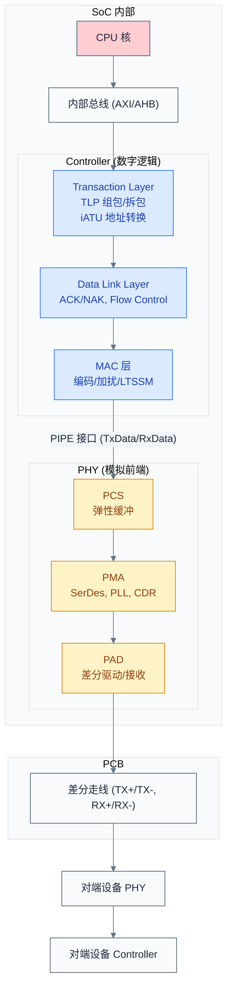
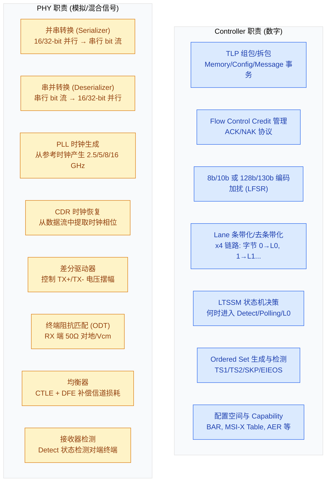
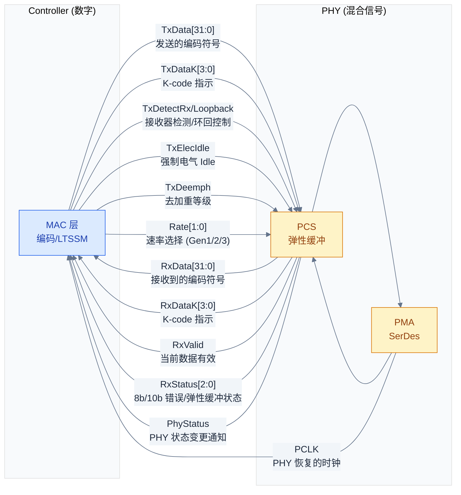
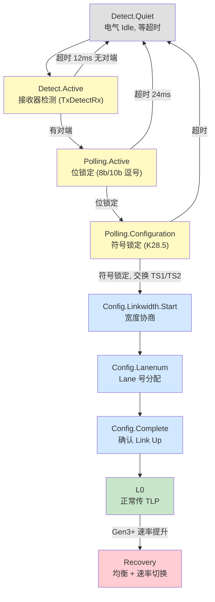
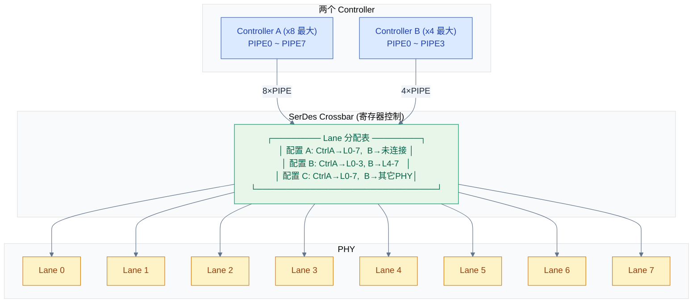
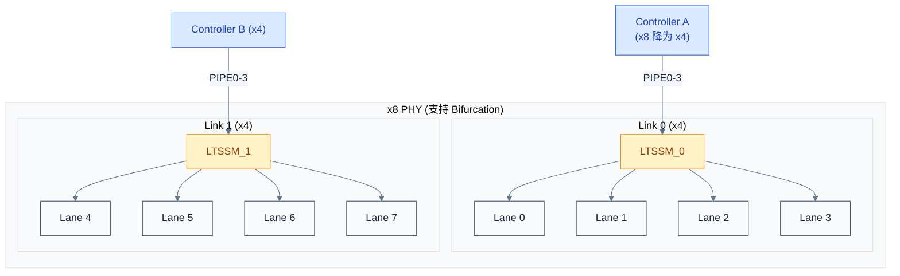
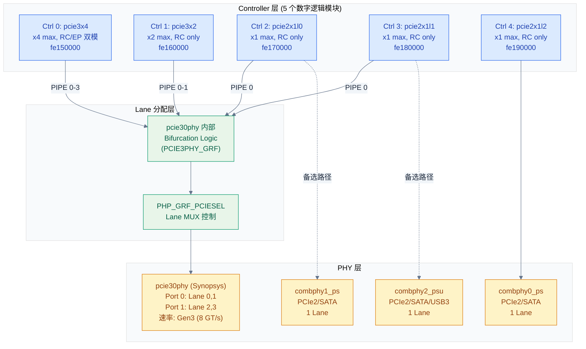
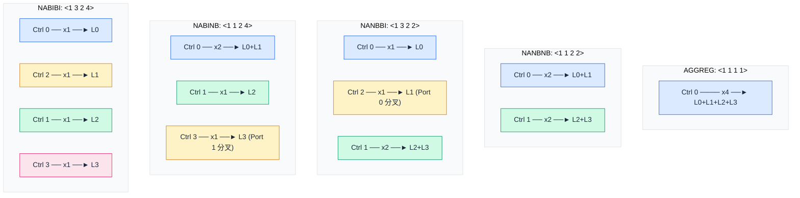
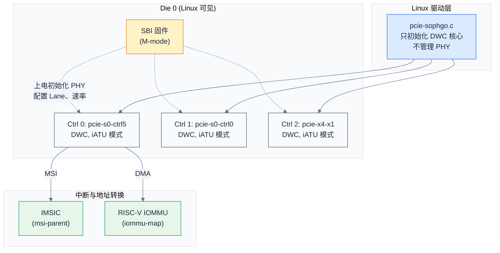

# Controller 与 PHY —— PCIe 的硅片级架构

> 从硅片视角解剖 PCIe：Controller 和 PHY 各自做什么、怎么分界、多个 Controller 如何共享一组 PHY Lane。
> **工程师视角**：理解 Controller/PHY 的分工与 Lane 分配模式，是阅读 SoC 数据手册 PCIe 章节、调试链路训练失败、配置设备树 `data-lanes` 属性的前提。

### 关键术语

| 缩写 | 全称 | 含义 |
|------|------|------|
| PHY | Physical Layer (analog front-end) | PCIe 物理层模拟前端，负责差分信号的发送/接收、时钟恢复、均衡 |
| PIPE | PHY Interface for PCI Express | Controller 与 PHY 之间的标准数字接口，由 Intel 定义 |
| SerDes | Serializer / Deserializer | 串并/并串转换器，PHY 的核心电路 |
| PMA | Physical Medium Attachment | PHY 中负责模拟信号的部分（驱动器、接收器、PLL、CDR） |
| PCS | Physical Coding Sublayer | PHY 中负责编码/解码的数字逻辑（8b/10b、128b/130b、弹性缓冲） |
| LTSSM | Link Training and Status State Machine | 链路训练状态机，协议决策在 Controller，电气执行在 PHY |
| DBI | Data Bus Interface | DWC Controller 内部寄存器访问接口 |
| iATU | Internal Address Translation Unit | DWC Controller 内部地址转换单元 |
| CDR | Clock and Data Recovery | 从串行数据流中恢复时钟，接收端 PHY 的关键功能 |
| CTLE | Continuous Time Linear Equalizer | 连续时间线性均衡器，接收端补偿高频损耗 |
| DFE | Decision Feedback Equalizer | 判决反馈均衡器，用已判决符号消除码间干扰 |
| SSC | Spread Spectrum Clocking | 扩频时钟，通过小幅频率调制降低 EMI |
| CC | Common Clock / Common Refclk | 共同时钟架构，两端共享同一参考时钟 |
| SRIS | Separate Refclk with Independent SSC | 独立参考时钟架构（各自独立时钟且各自 SSC） |
| EIEOS | Electrical Idle Exit Ordered Set | 电气 Idle 退出有序集，由 PHY 生成/检测 |
| TS1/TS2 | Training Sequence 1 / 2 | 训练有序集，承载速率/链路号/Lane 号等协商字段 |
| N_FTS | Number of Fast Training Sequences | 快速训练序列个数，链路唤醒时的同步参数 |
| DLLLA | Data Link Layer Link Active | 数据链路层链路活跃，LTSSM 进入 L0 后置位的握手信号 |
| OCM | Output Clamp Mode | PHY PMA 输出钳位模式，上电初始化时需解除 |
| MLW / SLS / TLS | Max/Max-Link-Width, Supported Link Speed, Target Link Speed | LNKCAP/LNKCTL2 中的能力与目标字段 |

---

## 1. 概述

### 1.1 前置知识

| 需要了解 | 参考文档 |
|----------|----------|
| PCIe 拓扑组件（RC、Switch、EP） | [PCIe 核心知识索引](./pcie-learning-resources.md) §0.2 |
| Lane 与链路宽度 | [PCIe 核心知识索引](./pcie-learning-resources.md) §0.5 |
| TLP 与三层模型 | [PCIe 核心知识索引](./pcie-learning-resources.md) §0.6 |
| LTSSM 链路状态机 | [PCIe 核心知识索引](./pcie-learning-resources.md) §4.1 |
| 链路均衡与能力 | [PCIe 核心知识索引](./pcie-learning-resources.md) §4.2-4.3 |
| 链路训练失败排查 | [工程踩坑指南](./pcie-engineering-pitfalls.md) §1 |
| DWC 控制器 DBI 接口 | [ECAM 与配置空间](./ecam-config-space.md) §3.7 |

### 1.2 系统上下文

本文研究的是 **PCIe 在硅片上的物理实现**——Controller（数字逻辑）与 PHY（模拟前端）如何分工、如何对话、多 Controller 如何共享 PHY Lane。这与协议视角互补：协议定义了"数据包长什么样"，硅片架构定义了"谁在哪个硬件模块里处理这个包"。



> **核心要点**：蓝色框是 Controller（数字逻辑，综合到 SoC 数字区域），黄色框是 PHY（模拟/混合信号，通常作为独立硬宏集成）。两者的分界线是 **PIPE 接口**——Controller 把编码好的符号通过 PIPE 交给 PHY，PHY 把它变成 PCB 铜线上的差分电压。对端设备收到后反向走一遍：PHY 恢复时钟和数据，Controller 解码出 TLP。

---

## 2. Controller 与 PHY 的本质分工

> 上一章建立了 Controller+PHY 的整体框架。一个自然的问题是：**为什么要把 PCIe 接口拆成两块，而不是一个统一的模块？** 本章从数字/模拟的工艺差异出发，说明这个拆分的工程动机和各侧职责。

### 2.1 为什么分开？

**本质原因：数字逻辑和模拟电路在先进工艺节点上的行为完全不同。**

- 数字逻辑（Controller）：在 FinFET 先进工艺（5nm、3nm）下表现良好——晶体管开关更快、功耗更低。RTL 综合到标准单元库即可。
- 模拟电路（PHY）：在先进工艺下漏电流增大、噪声恶化、器件匹配变差。SerDes 驱动器需要精确的阻抗匹配（±10%）、PLL 需要极低抖动、接收器需要微伏级灵敏度——这些对晶体管的模拟特性要求远高于数字逻辑。

如果强行把 PHY 做进先进工艺的数字区域，要么性能不达标（眼图打不开），要么需要大量定制晶体管增加成本。所以业界通行的做法是：

- Controller 作为**可综合 IP**（RTL 交付），跟随 SoC 工艺节点走
- PHY 作为**硬宏**（GDSII 版图交付），在较成熟或专门优化的工艺上实现，以独立宏单元形式拼入 SoC

> **核心要点**：Controller 和 PHY 分开不是协议要求的，而是**工程经济性**决定的。同一套 Controller RTL 可以搭配不同工艺节点的 PHY；同一 PHY 硬宏也可以服务 PCIe/SATA/USB3 多种协议。

### 2.2 各自的职责



> **如何读这张图**：蓝色是 Controller 做的事——全是数字逻辑，可综合、可仿真、可用 UVM 验证。黄色是 PHY 做的事——涉及电压/电流/时序/抖动，需要用 SPICE 仿真、眼图分析、IBIS-AMI 建模。一条经验法则：**"知道自己在处理 TLP 还是 Ordered Set"的逻辑在 Controller，"不知道包是什么、只看到 bit 流"的电路在 PHY。**

| 对比维度 | Controller | PHY |
|----------|-----------|-----|
| **本质** | 数字逻辑（RTL，可综合到标准单元库） | 模拟/混合信号（晶体管级定制） |
| **工艺依赖** | 跟随 SoC 工艺（5nm / 3nm），标准单元库即可 | 通常独立工艺优化，以硬宏形式集成 |
| **知道什么** | 知道 TLP 格式、BAR 地址范围、MSI 向量号 | 不知道协议——只看到差分电压跳变 |
| **关键模块** | iATU, DBI, LTSSM 决策逻辑 | SerDes, PLL, CDR, CTLE, DFE |
| **验证方法** | UVM / SystemVerilog 仿真 | SPICE 仿真，眼图， IBIS-AMI |
| **对外接口** | CPU 侧: AXI/AHB; PHY 侧: PIPE | Controller 侧: PIPE; 外: 差分焊盘 |
| **IP 形态** | 可综合 IP（RTL 源码或加密网表） | 硬宏（GDSII 版图，包含模拟 layout） |
| **功耗来源** | 动态功耗为主（逻辑翻转） | 静态功耗显著（偏置电流、终端电阻） |

### 2.3 MAC 层归属的"灰色地带"

你可能注意到上图把编码（8b/10b）和 LTSSM 放到了 Controller 侧——这在业界存在两种实现：

| 划分方式 | 编码 (8b/10b, 128b/130b) | LTSSM 决策 | 典型产品 |
|----------|------------------------|-----------|---------|
| **Controller 含 MAC** | Controller (数字) | Controller (数字) | Synopsys DWC PCIe |
| **PHY 含 MAC** | PHY (数字逻辑，在 PHY 硬宏内) | Controller (少数实时控制给 PHY) | 部分 Cadence / 自研 PHY |

本文以 **DWC 风格**（Controller 含 MAC, 编码和 LTSSM 都在 Controller）为主进行讨论，这也是行业主流。PIPE 接口位于 MAC 和 PCS 之间，传递的是**已编码的符号**（8b/10b 后的 10-bit 符号或 128b/130b 后的 block）。

> **核心要点**：无论 MAC 归哪边，**LTSSM 的"决策"永远在 Controller**——什么时候跳转到 Detect、什么时候进入 Recovery，这些是协议层决策。PHY 只负责执行指令：驱动 `TxDetectRx`、切换速率档位、调整均衡器系数。

---

## 3. PIPE 接口 —— 两者的分界线

> 上一章讲了 Controller 和 PHY 各自做什么。一个自然的问题是：**它们之间怎么对话？** 本章介绍 PIPE——Controller 与 PHY 之间的标准数字接口，是整个 PCIe 硅片架构的核心契约。

### 3.1 为什么需要 PIPE？

**本质原因：Controller IP 和 PHY IP 通常来自不同厂商（或不同团队），需要一个统一接口保证互换性。**

- 一个 SoC 团队可能从 Synopsys 买 DWC Controller、从 Cadence 买 PHY，或反过来
- 同一 Controller IP 需要适配 Gen3/Gen4/Gen5 不同速率的 PHY
- 同一 PHY IP 可能被 PCIe / SATA / USB3 Controller 复用（通过不同接口模式）

Intel 在 2002 年定义了第一版 PIPE 规范，此后随 PCIe 代际演进到 PIPE4（Gen3）、PIPE5（Gen4/5）。规范不是强制标准，但行业已将其视为事实标准。

### 3.2 PIPE 信号

PIPE 是一组并行数字信号（位宽通常 16/32-bit），Controller 作为 PIPE 的 master，PHY 作为 slave：



> **如何读这张图**：→是 Controller 发给 PHY 的控制/数据，←是 PHY 回报的状态/数据。命名规范是从 Controller 视角：`TxData` 意思是"Controller 要发给 PHY 去发送的数据"；`RxData` 意思是"Controller 从 PHY 接收到的数据"。PCLK 是 PHY 从串行数据流中恢复出来后反哺给 Controller 的时钟。

#### 关键信号详解

| 信号 | 方向 | 位宽 | 作用 |
|------|------|------|------|
| `TxData` | C → P | 16/32 | 要发送的编码后符号（ELP 模式下每 Lane n bit） |
| `TxDataK` | C → P | 2/4 | Data/K-code 指示：1 = 该字节是 K-code（控制符号）, 0 = D-code（数据） |
| `TxElecIdle` | C → P | 1/Lane | 强制 Lane 进入电气 Idle：驱动器关闭、差分输出共模电平 |
| `TxDetectRx` | C → P | 1/Lane | 接收器检测：PHY 在 Lane 上执行充电-放电序列，检测对端终端阻抗 |
| `TxDeemph` | C → P | 多 bit | 去加重系数：Gen2 时需要，补偿 PCB 高频损耗 |
| `Rate` | C → P | 2 | 速率选择：`00` = Gen1 (2.5 GT/s), `01` = Gen2 (5 GT/s), `10` = Gen3+ (8 GT/s) |
| `RxData` | P → C | 16/32 | 接收到的符号：PHY 从串行流恢复出的并行数据 |
| `RxDataK` | P → C | 2/4 | 指示接收到的符号是 K-code 还是 D-code |
| `RxValid` | P → C | 1 | 当前 RxData 有效（弹性缓冲有数据可读） |
| `RxStatus` | P → C | 3 | `000` = 正常; `001` = SKP 已增/删; `010` = 检测到 Framing Error; `011` = 8b/10b 或 128b/130b 解码错误 |
| `PhyStatus` | P → C | 1 | PHY 完成 Controller 请求的动作（如速率切换、省电状态进入）后置位 |
| `PCLK` | P → C | 1 | PHY 输出的并行时钟：速率 = 串行速率 / 总线宽度（如 8 GT/s ÷ 32 = 250 MHz） |

### 3.3 PIPE 如何支撑 LTSSM

LTSSM 的每个状态切换都涉及一组 PIPE 信号操作。以下举例说明"Controller 决策 → PIPE 传令 → PHY 执行"：

```text
Detect 状态（检测对端是否存在）:
  1. Controller 置位 TxDetectRx
  2. PHY 对 Lane 充电到 Vcm, 测量放电时间
  3. PHY 回报 PhyStatus: 对端存在 / 不存在
  4. Controller 根据结果决定进入 Polling 还是回 Detect.Quiet

Polling 状态（速率协商、位锁定、符号锁定）:
  1. Controller 设 Rate = Gen1 (最低速率), 发送 TS1 Ordered Set
  2. PHY 将 TxData 串行化输出, CDR 从对端信号中恢复时钟
  3. PHY 回报 RxValid = 1, RxStatus = 000
  4. Controller 检测到连续 TS1 → 符号锁定完成 → 进入 Configuration

Configuration 状态（Lane 编号分配、宽度协商）:
  1. Controller 发送含 Lane Number 字段的 TS1
  2. 多 Lane 时 Controller 在每条 Lane 上各发一个 PIPE 通道的 TxData
  3. 收到 TS2 → 确认 Link Up → Controller 将 Rate 切换到协商的最高速率
  4. PHY 回报 PhyStatus 确认速率切换完成 → Controller 进入 L0

L0 → L1 省电:
  1. Controller 发送最后一个 TLP 后发起 L1 Entry
  2. 对端确认后, Controller 置位 TxElecIdle
  3. PHY 关闭驱动器、关闭 PLL 部分偏置
  4. 恢复时 Controller 清除 TxElecIdle, PHY 重新锁定 CDR
```

> **核心要点**：LTSSM 的状态机逻辑 **100% 在 Controller**。PHY 不知道自己在 Detect 还是 L0——它只是看见 `TxDetectRx` 就做充电检测，看见 `TxElecIdle` 就关驱动器。**Controller 是大脑，PHY 是肌肉。**

---

## 4. 链路训练：LTSSM 的工程细节

> 上一章讲了 PIPE 接口是 Controller 与 PHY 的对话契约。一个自然的问题是：**真实上电时，链路是怎么从"没接设备"一步步走到 L0 的？** 本章从 PIPE 信号与定时器的角度把 LTSSM 的核心状态逐一遍历——先讲训练前的必要条件，再讲 Detect→Polling→Configuration→L0 每一步背后的硬件动作与超时，最后讲两个训练中最容易踩坑的细节（Lane 反转与极性反转）。这是本文从"架构"走向"工程"的第一站。

### 4.1 训练前的必要条件

链路训练不会"自动发生"，它需要硬件先满足一系列前提。任何一个条件不满足，LTSSM 都会卡在 Detect 循环重复，或根本进入不了训练：

1. **参考时钟就绪**：Controller 和 PHY 拿到稳定的 100 MHz refclk（要求细节见 §5.1）。
2. **复位释放**：PHY 的 SRAM 微码初始化完成、PMA 输出钳位（OCM）解除、Controller 退出复位。RK3588 驱动在 `rockchip_p3phy_rk3588_init()` 里先"解除 PMA 输出钳位"（`BIT(8) | BIT(24)` 写 CMN_CON0），再 poll `SRAM_INIT_DONE` 状态位，读不到就报 `"lock failed ... check input refclk and power supply"`（[phy-rockchip-snps-pcie3.c](file:///home/pbw/sg2046/linux-common/drivers/phy/rockchip/phy-rockchip-snps-pcie3.c) 第 187-198 行）。这条日志出现的全部意义就是提醒你：**refclk、电源、复位没就绪**。
3. **供电稳定**：Controller 数字域和 PHY 模拟域的电压建立到额定值——模拟域的偏置电流、PLL、CDR 对电源纹波极其敏感。
4. **能力配置完成**：目标速率（LNKCTL2 TLS）与 Lane 数（LNKCAP MLW）需在训练开始前按 §6 的清单写好。

> **核心要点**：这四个条件是"软件可先诊断"的部分。学习链路训练时最容易忽略的是 PHY 微码 SRAM 初始化——很多"设备不出现"的根因根本不是 LTSSM 逻辑问题，而是 PHY 内部固件没加载完成、OCM 没解除。

### 4.2 一次完整的训练：Detect → Polling → Configuration → L0

链路初始化是**仅一个方向发起、另一端被动响应**的双向过程。发起方（通常 Downstream Port）在每条 Lane 上以 **Gen1（2.5 GT/s）** 为起始速率运行 LTSSM：



> **如何读这张图**：灰色=电气 Idle / 失败回退，黄色=Detect 与 Polling（训练的前半段），蓝色=Configuration（宽度与 Lane 号协商），绿色=L0（完成），红色=Gen3+ 后面临的 Recovery（均衡）。横向看：一次成功的链路建链一定从左到右走完灰→黄→蓝→绿。

#### Detect —— 接收器检测（有没有对端？）

训练发起方在 Detect.Active 对每条 Lane 执行一次**接收器检测（Receiver Detection）**：控制 PHY 对 Lane 充电，然后观察放电时间——如果对端存在，其差分终端阻抗体现在放电曲线上（PIPE 信号 `TxDetectRx` 置位后由 PHY 完成，PHY 回报 `PhyStatus`）。这步不涉及数据。

| 参数 | 值 | 规范 |
|------|----|------|
| Detect.Quiet 超时 | **12 ms**（默认，可选扩到 24 ms） | PCIe Base Spec §4.2.5 |
| 检测手段 | 充电-放电，观察对端终端阻抗 | PIPE `TxDetectRx` / `PhyStatus` |

> **核心要点**：Detect 不传数据、不做协商，它只回答"对端在不在"。永远停在 Detect = 对端物理不存在或 PHY 的接收器检测能力异常（常见于 refclk/电源问题，见 §4.1）。软件这时查 `PORT_DEBUG0` 的 LTSSM 值，DWC 下回落到 `Detect.Quiet / Detect.Active` 就代表"没有对端"（对应 `dw_pcie_wait_for_link()` 返回 `-ENODEV`）。

#### Polling —— 位锁定与符号锁定（Gen1 下进行）

进入 Polling 后，训练方开始在每 Lane 上发送 **Gen1 速率**的二进制流，目的是对齐时钟并同步符号，依次完成三件事：

1. **位锁定（Bit Lock）**：接收方 CDR 从串行流中恢复时钟并把时钟相位对齐到 bit 边界。
2. **符号锁定（Symbol Lock）**：8b/10b 编码下用 **K28.5** 逗号序列定位字节边界，把连续的 10-bit 符号重新切成字节流。
3. **有序集交换**：双方互发 TS1（训练序列 1），确认符号已锁定，进而进入下一代。

| 参数 | 值 | 规范 |
|------|----|------|
| 起始速率 | Gen1（2.5 GT/s），此后所有协商都在 Gen1 完成 | PCIe Base Spec §4.2.6 |
| Polling.Active 超时 | **24 ms** | PCIe Base Spec §4.2.5 |
| 对齐机制 | K28.5 逗号（8b/10b）；128b/130b 后另有对齐方案 | PCIe Base Spec §4.2 |

#### Configuration —— Lane 编号与宽度协商

进入 Configuration 后，训练方把协商从"单 Lane 是否存在"升级到"多条 Lane 谁的编号是几"。每 Lane 在 TS1/TS2 的 **Lane Number** 字段里广播自己是谁；接收方据此推导链路宽度，并决定采用哪几条 Lane：

- **最高效的链路是连续的、从 Lane 0 起**的：如 x4 用 Lane 0-3，x8 用 Lane 0-7。
- 若某条 Lane 训练失败或物理坏掉，整条链路会**协商降级**（x8→x4→x2→x1），但 Lane 0 是"锚"，必须存在。
- 完成宽度协商后双方互发 TS2 确认，进入 Config.Complete，随后拉起**数据链路层的 DLLLA 握手**。

#### L0 —— 建链完成

进入 L0 说明物理层训练成功。此时 lane 的 PHY/DL 都就绪，但软件还不能立刻发配置请求：

> **工程要点**：依据 PCIe r6.0 §6.6.1，**支持 >5 GT/s 的下游端口，软件必须在链路训练完成后至少等 100 ms**才能发送配置请求。DWC 在 `dw_pcie_wait_for_link()` 里当 `max_link_speed > 2`（即 >Gen2）时会 `msleep(PCIE_RESET_CONFIG_WAIT_MS)` 专门做这件事（[pcie-designware.c](file:///home/pbw/sg2046/linux-common/drivers/pci/controller/dwc/pcie-designware.c) 第 806-807 行）。**这 100 ms 是所有 Gen3+ 平台枚举时总要等的硬时间**，不是 bug。

### 4.3 训练中的 PIPE 信号握手

用"Controller 决策 → PIPE 传令 → PHY 执行"的框架把 §4.2 的每一步串起来，恰好对应 §3.3 的 PIPE 信号：

| LTSSM 动作 | Controller 决策 | PIPE 传令（C→P） | PHY 执行与回报（P→C） |
|-----------|----------------|------------------|----------------------|
| 接收器检测 | 是否发起 Detect | `TxDetectRx` | 充电-放电检测，回报 `PhyStatus` |
| 位/符号锁定 | 何时开始发 TS1 | `TxData` + `TxDataK` | CDR 锁定，回报 `RxValid`/`RxStatus=000` |
| 速率协商 | 选速率档 | `Rate[1:0]` | PLL 切换，回报 `PhyStatus` |
| 电气 Idle | 何时静音 | `TxElecIdle` | 关闭驱动，回报 `PhyStatus` |
| 均衡（Gen3+） | 预设选择 | `TxPreset`/`TxEQ` | 调整驱动/接收均衡，回报 `RxStatus` |

### 4.4 卡在哪个状态 = 哪一层的问题

训练失败时，LTSSM 停留在某个状态，这本身就是最有价值的诊断信号：

| 卡住的状态 | 含义 | 最可能的根因 | 排查方向 |
|-----------|------|-------------|---------|
| **Detect** | 对端不存在或检测不到 | 对端未上电、refclk/电源/复位没就绪、PHY 检测异常 | 检查供电、refclk、PHY 微码初始化（§4.1） |
| **Polling.Active** | 检测到了对端但位锁不住 | 信号完整性差、refclk 抖动大、速率/时钟失配 | 看 AER Receiver Error、查 PCB/连接器 |
| **Polling.Configuration** | 符号锁不住 | 速率协商失败、对端固件没就绪 | 对端重启、检查对端固件时间 |
| **Configuration** | 宽度/Lane 号协商不拢 | Lane 数据位宽、Lane 反转/极性配置错误、Lane 映射冲突 | 核对 `num-lanes`/`data-lanes`、Bifurcation（§7） |
| **Recovery 循环** | 已建链但反复进 Recovery | Gen3+ 均衡失败、ASPM 干扰、信号衰减 | 均衡参数、关闭 ASPM（[工程踩坑](./pcie-engineering-pitfalls.md) §1.2/1.4） |

> **核心要点**：链路是**逐状态推进**的——停在 Detect 别去查均衡，停在 Recovery 别去查 Lane 映射。用"当前停留在哪个状态"作为判断起点，比盲目看 `lspci` 快得多。DWC 下 LTSSM 值可用 `devmem` 读 `PORT_DEBUG0` 低 4 位（对应 [工程踩坑指南](./pcie-engineering-pitfalls.md) §1.1 的排查命令）。

### 4.5 两个训练中最易踩坑的细节：Lane 反转与极性反转

x4/x8 宽链路在 PCB 布线、连接器引脚排布时，Lane 顺序或差分对的正负经常没法按"顺序、原极性"一一对应。规范为此定义了两种容错，它们都在 **Configuration 阶段**靠 TS1/TS2 里的字段搞定：

| 机制 | 现象 | 谁负责 | 规范依据 |
|------|------|--------|---------|
| **Lane 反转** | Lane 0↔Lane N 顺序颠倒（如 Lane0 连的是对端的 Lane7） | 接收方检测后内部重排（支持 x8 及以上的组件必须支持） | PCIe Base Spec §4.2.6 |
| **极性反转** | 某条 Lane 的差分对正负接反了（+/- 互换） | 接收方每条 Lane 独立检测并反相（组件必须支持） | PCIe Base Spec §4.2.6 |

> **核心要点**：这两个是**接收端硬件自动解决**的，软件通常无需干预。但若 SoC 里 Controller 与 PHY 的 Lane 映射与 PCB 上的实际布线不一致（例如 Bifurcation 把 Lane 组切开后编号错位），训练会在 Configuration 阶段反复失败——这类问题只能靠核对 SoC 的 Lane 路由表（RK3588 见 §8.2）和原理图解决，软件调参无效。

---

## 5. 链路的要求

> 上一章讲了链路训练的过程。一个自然的问题是：**训练能顺利走完，对环境（时钟、电气、协议能力）有什么硬性要求？** 本章先讲参考时钟的架构要求，再讲电气要求（去加重/预加重/均衡），最后讲宽度与速率协商的规则——这些"要求"正好决定了 SoC 硬件怎么设计、固件/驱动怎么配置。

### 5.1 参考时钟的要求

训练和传输都依赖时钟。参考时钟（refclk）的架构是 SoC 设计阶段第一个要定的：**两端是否共享同一个时钟？**

| 对比维度 | Common Clock（共同时钟） | Separate Refclk（独立参考时钟 / SRIS） |
|----------|------------------------|--------------------------------------|
| **时钟来源** | 两端共享同一 100 MHz refclk | 两端各自独立时钟 |
| **总偏移容差** | 两端合计 ≤ ±300 ppm（含 SSC） | 各自 ≤ ±300 ppm，两端合计可达 ±600 ppm |
| **SSC** | 可共享同源 SSC | 各自独立 SSC（SRIS 允许独立扩频） |
| **SKP 依赖** | 补偿量较小，弹性缓冲压力小 | 补偿量较大，必须依赖 SKP 吸收偏差 |
| **典型场景** | 板级/系统级共享时钟源 | 不同板卡/不同设备，各自提供时钟 |
| **时钟树成本** | 需要精确共享，布线约束高 | 灵活，但需要更严的同步控制 |

> **如何读这张表**：核心差异是**时钟容差预算**——共同时钟把两端的偏差算在一起（±300 ppm），独立参考时钟虽然灵活，但通过 SKP 有序集和弹性缓冲吸收时钟差（这正是 [§3.2](./controller-phy-architecture.md#32-pipe-信号) 里 `RxStatus` 的 `001 = SKP 已增/删` 的含义）。

**SSC（扩频时钟）**：通过把时钟小幅调频（典型 -0.5% 到 0 的下扩频）展宽频谱、降低 EMI。它直接增加了时钟频率的变化范围，因此训练和接收都要按容差计算。设计上如果 SoC 提供 refclk 给外部设备，需在 DT 里声明；RK3588 的 PHY 用 `rockchip,rx-common-refclk-mode` 属性逐 Lane 配置是否启用公共参考时钟模式（[phy-rockchip-snps-pcie3.c](file:///home/pbw/sg2046/linux-common/drivers/phy/rockchip/phy-rockchip-snps-pcie3.c) 第 147-158 行，逐 Port 写 `RX_CMN_REFCLK_MODE`）。

> **核心要点**：参考时钟这条"要求"常常被当软问题排查——实际上它大多在**硬件设计**阶段定了。若换成代价很大，优先自查：refclk 是否给到 PHY、是否开启 SSC、公共时钟是否真的共源。RK3588 报锁失败时驱动日志里 `check input refclk` 就是明示。

### 5.2 电气要求：去加重、预加重与均衡

| 速率 | 差分阻抗 | 发送端处理 | 接收端均衡 |
|------|---------|-----------|-----------|
| Gen1 2.5 GT/s | 100 Ω 差分 | 无 | 无 |
| Gen2 5.0 GT/s | 100 Ω 差分（趋势同 Gen3） | 去加重 -3.5 dB | 无 |
| Gen3 8.0 GT/s | **85 Ω 差分** | 发送端预加重（TX Preset P0-P10） | CTLE / DFE（均衡 Phase 0-3） |
| Gen4+ 16-32 GT/s | 85 Ω 差分 | 多级 TX EQ | 更复杂均衡 + 接收端识别 |

> **如何读这张表**：从 Gen3 起电气"要求"跃变——阻抗降到 85 Ω、发送端引入预设、接收端强制均衡。这也是为什么 Gen3 是第一档需要**链路均衡（Equalization）**的速率（协议定义 Phase 0-3，见 [PCIe 核心知识索引](./pcie-learning-resources.md) §4.2）。这些全部落在 PHY 层，Controller 通过 PIPE 的 `TxDeemph`（Gen2）/`TxPreset`/`TxEQ`（Gen3+）把预设传给 PHY。

> **核心要点**：**速率 ≤5 GT/s（Gen1/2）靠发送端去加重就能搞定；速率 ≥8 GT/s（Gen3+）必须两端联手做均衡**。这就是为什么"Gen3 起没有均衡就会降速或训练失败"——它不是可选项，是协议要求。均衡失败是 [工程踩坑指南](./pcie-engineering-pitfalls.md) §1.2 里 Gen3+ 降速的头号根因。

### 5.3 宽度与速率协商的规则

协商的"输入"是两端各自的能力，协商的"结果"体现在链路状态寄存器：

| 寄存器 | 角色 | 关键字段 |
|--------|------|---------|
| **LnkCap** | 能力（只读） | Max Link Speed（SLS）、Max Link Width（MLW） |
| **LnkCtl** | 软件控制 | Retrain Link、Common Clock Config、ASPM |
| **LnkCtl2** | 软件控制 | **Target Link Speed（TLS）**、Target Link Width（PCIe 6.0+ 字段） |
| **LnkSta** | 协商结果 | Negotiated Speed（CLS）、Negotiated Width（NLW）、DLLLA |

协商遵循两条硬规则：

1. **宽度取双方能力较小者**：最终宽度 = min(本端 MLW，对端 MLW)，且必须是连续、从 Lane 0 起始的一组 Lane。
2. **速率受预算目标约束**：任何一端可以用 LNKCTL2 TLS 把协商速率上限压低；对端即使在更高速率，也只会协商到 TLS 之下的档位。

```text
举例：本端声明 x8/Gen4，对端只支持 x4/Gen3
  → 协商结果 LnkSta: 宽度 x4, 速率 Gen3   （取双方交集的下限）
```

**降级**：链路在训练中发现某 Lane 失败，就自动以更低宽度重训（x8→x4→x2→x1）。这种"能力子集"的协商保证了两端不匹配时仍能建链，代价是性能损失——这也是 `lspci -vvv` 里 LnkCap 与 LnkSta 不一致的标准解释（[工程踩坑指南](./pcie-engineering-pitfalls.md) §1.2/1.3 区分"速率降级"与"宽度降级"根因不同）。

---

## 6. 控制 Lane 数的工程工作

> 前两章讲了链路怎么训练、有什么要求。一个自然的问题是：**作为一个 SoC/系统工程师，我想让某个 PCIe 口稳定地跑到 x4（而不是误协商成 x8 或降到 x1），需要分别动哪些地方？** 本章给出一份"控制 Lane 数"的完整工程清单——先讲自上而下的配置链路，再讲 DWC 控制器与 Linux 的具体落地，最后讲最常见的几个坑。

### 6.1 一份完整的"指定 Lane 数"清单

控制最终协商宽度，需要 **PHY → Controller → 配置空间 → 设备树 → 训练验证** 五层都对齐。改错一层，都可能出现"训不到 x4 / 训到更宽 / 干脆不训"：

1. **PHY 层（Lane 归属与可用性）**：先把 Lane 路由到目标 Controller。Bifurcation / MUX 配置决定"这条 PHY Lane 属于哪个 Controller"（RK3588 见 §8，SG2046 由固件锁定）。**Lane 冲突时，其他 Controller 抢 Lane 会让目标口少 Lane。**
2. **Controller 层（硬件链路模式）**：在 DWC 等控制器里设置链路模式寄存器，告诉 LTSSM"本次希望训练成几 lane 的链路"。
3. **能力声明（LNKCAP MLW）**：把 MLW 写成目标宽度，对端看到的"我的最大能力"就是它，协商取两者较小者。
4. **协商上限（Target Link Speed / Width）**：限制速率用 LNKCTL2 的 **TLS**（Gen1/2/3+ 均可用）；限制宽度，标准化的 LNKCTL2 **Target Link Width** 字段是 PCIe 6.0 才引入——老控制器往往靠改 LNKCAP MLW 或私有寄存器（DWC 的 `PORT_LINK_CONTROL`）来压低协商上限（见第 2、3 步）。
5. **设备树 `num-lanes` / `data-lanes`**：把"希望多少 lane"用 DT 属性表达出来，驱动据此驱动 PHY 与 Controller（`num-lanes` 给 Controller、`data-lanes` 给 RK3588 style 的 PHY）。
6. **触发重训练**：改完配置后置位 LNKCTL 的 **Retrain Link** 位（或复位/重上电），让链路带着新配置重新走一遍 §4。
7. **验证协商结果**：`lspci -vvv` 看 LnkSta 的 NLW/CLS，或用 `dmesg` 的 `PCIe Gen.x xN link up`。

> **核心要点**：**"希望多少 lane"是分散在五层的**——PHY 决定物理可用性、Controller 决定硬件链路模式、LNKCAP 负责告诉对端、DT 负责软件表达、Retrain 负责让新配置被采纳。调试时先确认 1（Lane 归属）和 2（链路模式）没配错，再去查 3-4（协商），最后看 6（是否真的重训了）。

### 6.2 DWC 控制器：三个寄存器把宽度写进去

DWC 控制器把"设置 Lane 数"落实到三个寄存器，全部在 `dw_pcie_setup()` 里按顺序执行（[pcie-designware.c](file:///home/pbw/sg2046/linux-common/drivers/pci/controller/dwc/pcie-designware.c) 第 1251-1287 行）：

| 寄存器 | 字段 | 作用 |
|--------|------|------|
| `PORT_LINK_CONTROL` | `PORT_LINK_MODE_x_LANES` | 设置 Link Downstream 的链路模式（LTSSM 实际训练的宽度） |
| `LINK_WIDTH_SPEED_CONTROL` | `PORT_LOGIC_LINK_WIDTH_1_LANES` | 设置逻辑 Lane 宽度 |
| LNKCAP | `MLW`（Max Link Width） | 更新能力字段，供对端读取 |

```c
/* 摘自 [pcie-designware.c](file:///home/pbw/sg2046/linux-common/drivers/pci/controller/dwc/pcie-designware.c) 第 898-943 行，已省略部分变量 */
static void dw_pcie_link_set_max_link_width(struct dw_pcie *pci, u32 num_lanes)
{
	/* (1) PORT_LINK_CONTROL: 设置硬件链路模式为 N lane */
	plc = dw_pcie_readl_dbi(pci, PCIE_PORT_LINK_CONTROL);
	plc &= ~PORT_LINK_FAST_LINK_MODE;
	plc &= ~PORT_LINK_MODE_MASK;
	switch (num_lanes) {
	case 1:  plc |= PORT_LINK_MODE_1_LANES;  break;
	case 2:  plc |= PORT_LINK_MODE_2_LANES;  break;
	case 4:  plc |= PORT_LINK_MODE_4_LANES;  break;
	case 8:  plc |= PORT_LINK_MODE_8_LANES;  break;
	case 16: plc |= PORT_LINK_MODE_16_LANES; break;
	default: dev_err(pci->dev, "num-lanes %u: invalid value\n", num_lanes); return;
	}
	/* (2) LINK_WIDTH_SPEED_CONTROL: 设置逻辑 lane 宽度（固定 1 条，配合上面） */
	/* ... 省略 ... */

	/* (3) LNKCAP: 更新最大链路宽度字段，告诉对端 */
	lnkcap = dw_pcie_readl_dbi(pci, cap + PCI_EXP_LNKCAP);
	lnkcap &= ~PCI_EXP_LNKCAP_MLW;
	lnkcap |= FIELD_PREP(PCI_EXP_LNKCAP_MLW, num_lanes);
	dw_pcie_writel_dbi(pci, cap + PCI_EXP_LNKCAP, lnkcap);
}
```

> **如何读这代码**：这段体现了 **"一边告诉硬件训练几 lane，一边告诉对端我的能力"** 的双重设计——PORT_LINK_CONTROL 是给控制器内部 LTSSM 看的（训练几 lane，按 `num-lanes` 走 switch），LNKCAP MLW 是给对端看的（协商用）。两者必须一致，否则会出现"控制器想训 x4、但对端以为你只能 x1"的错位。这个函数只支持 1/2/4/8/16 的 2 幂宽度（`num-lanes` 取其他值会报 `"invalid value"` 并直接 `return`，不写任何寄存器）。

速率同理，`dw_pcie_link_set_max_speed()`（[pcie-designware.c](file:///home/pbw/sg2046/linux-common/drivers/pci/controller/dwc/pcie-designware.c) 第 843-888 行）同时写 LNKCAP `SLS` 和 LNKCTL2 `TLS`。`dw_pcie_setup()` 的完整顺序是：**先设速率、再设 N_FTS、再拉 PORT_LINK_CONTROL 使能 DLL、最后设宽度**——宽度是最后一步，因为它依赖前面速率与 DLL 能力就绪。

### 6.3 Linux 驱动如何落地

| 环节 | 函数 / 属性 | 做了什么 |
|------|------------|---------|
| 解析需求 | `dw_pcie_setup()` 读 `num-lanes`（[pcie-designware.c](file:///home/pbw/sg2046/linux-common/drivers/pci/controller/dwc/pcie-designware.c) 第 194 行） | 把 DT 里的 `num-lanes` 填进 `pci->num_lanes` |
| 驱动控制器 | `dw_pcie_setup_rc()`（[pcie-designware-host.c](file:///home/pbw/sg2046/linux-common/drivers/pci/controller/dwc/pcie-designware-host.c) 第 1104 行）调用 `dw_pcie_setup()` | 执行 §6.2 的寄存器写入 |
| 等待建链 | `dw_pcie_wait_for_link()` | 轮询直到 link up，Gen3+ 先等 100 ms（§4.2） |
| 判断是否起来 | `dw_pcie_link_up()` 读 `PORT_DEBUG1` 的 LINK_UP / LINK_IN_TRAINING | DWC 专用状态位，比读 LnkSta 更直接 |
| 主动限制宽度 | `pcie-tegra194.c` / `pcie-rockchip.c` 的 `num-lanes` 校验与覆盖 | 校验 `num-lanes > 能力` 时回退 |

对 RK3588 这类"PHY 在 Linux 可见"的平台，`num-lanes`（给 Controller）与 `data-lanes`（给 PHY 驱动做 Bifurcation，见 §8.2）**是两个不同层的属性**——前者决定 Controller 训几 lane，后者决定 PHY Lane 怎么路由。两者不匹配是 §6.4 最常见的坑。

### 6.4 常见坑

| 坑 | 现象 | 根因与修复 |
|----|------|-----------|
| `num-lanes` 写太大 | 卡在 Configuration 或协商降级 | `num-lanes` 超过 PHY 实际可用 Lane，或 Controller 硬件上限只到那档；核对 PHY 分配（§6.1 步骤 1-2） |
| `num-lanes` 不是 2 的幂 / 非法值 | 寄存器没被写，或不训练 | DWC 只支持 1/2/4/8/16，其他值 `invalid value` 直接 return |
| `data-lanes` 与 `num-lanes` 不一致 | 训到的宽度不是想要的 | 一个是 PHY 路由、一个是 Controller 训练宽度，必须一致 |
| Lane 被其他 Controller 占用 | 宽度降级（x8 训成 x4） | Bifurcation / MUX 冲突；重新规划 Lane 归属（§7/§8） |
| 改了配置没触发重训练 | 反映的是旧宽度 | 必须置位 Retrain Link 或复位，新配置才会被采纳 |
| 只改了 DT 没动 PHY 路由 | LnkSta 仍是物理路由决定的宽度 | 物理 Lane 归属是 PHY 层的事，DT 不能替 PHY 路由 |

> **核心要点**：控制 Lane 数不是"写一个 `num-lanes` 就行"，而是一条**五层一致**的链路。把 §6.1 的清单当成 checklist：先 PHY、再 Controller、再能力、再 DT、最后重训练 + 验证。逐层对齐后，x8 训成 x4 / 训不到预期宽度这类问题大多能定位到某一层。

---

## 7. 多 Controller 共享 PHY 的设计模式

> 前六章讲的是单个 Controller 配单个 PHY、以及链路训练与 Lane 控制的原理。现实中的 SoC 有多个 PCIe Controller，但 PHY 的 Lane 数是固定的。**多个 Controller 如何共享一组 PHY Lane？** 这是 SoC 架构师的核心设计问题。

### 7.1 问题：Lane 不够用

典型 SoC 场景：

- 需要 2 个 PCIe 链路：一个 x8 接 GPU，一个 x4 接 NVMe
- 但 PHY 硬宏只有 8 条 Lane
- x8 + x4 = 12 > 8 → 必须做取舍

三种解决思路：

| 思路 | 本质 | 硬件代价 |
|------|------|---------|
| **SerDes MUX** | 在 Controller 和 PHY 之间加 Lane 级交叉开关 | MUX + 配置寄存器 |
| **PHY Bifurcation** | PHY 自身支持把 Lane 拆成多个独立 Link | PHY 需内置双 LTSSM |
| **虚拟化** | 一个 Controller 出多个 Function，不占额外 Lane | Controller 需 SR-IOV |

### 7.2 方案一：SerDes MUX / Crossbar

Controller 和 PHY Lane 之间插入可配置的 MUX：



**核心约束**：每条 PHY Lane 同一时刻只能连接一个 Controller。当 A 和 B 同时需要 Lane 时，A 必须降级（如 x8 → x4），腾出 Lane 给 B。

**典型配置模式**：

| 模式 | Controller A | Controller B | 总 Lane | 场景 |
|------|-------------|-------------|---------|------|
| A 独占 | x8 (L0-7) | 未使用 | 8 | GPU 单卡， NVMe 走另一组 PHY |
| 对半分 | x4 (L0-3) | x4 (L4-7) | 8 | GPU + NVMe 各 x4 |
| A 降级 + B 独立 | x4 (L0-3) | x2 (L4-5 或其它 PHY) | 6 | 灵活配置 |

### 7.3 方案二：PHY Bifurcation（分叉）

Bifurcation 是**PHY 自身支持**的能力——一个 PHY 硬宏内部的 Lane 拆成两组独立的 Link，各有独立的 LTSSM：



**Bifurcation vs MUX 的区别**：

| 对比维度 | SerDes MUX | PHY Bifurcation |
|----------|-----------|----------------|
| **谁做 Lane 分配** | 外部 Crossbar IP | PHY 内部 |
| **Lane 分组** | 灵活，可按单 Lane 粒度分配 | 固定，由 PHY 设计决定（如 Lane 0-3 一组， 4-7 一组） |
| **独立 LTSSM** | Controller 各自维护 | PHY 内部每 Link 各有一套 |
| **额外硬件** | MUX + 寄存器 | PHY 需原生支持（硬宏功能） |
| **配置方式** | 写 SoC 系统寄存器 | 写 PHY 内部寄存器 + Controller 寄存器 |
| **典型场景** | SoC 自己设计的多协议 SerDes | 从 x16 拆出 x8+x8 或 x8+x4+x4 |

### 7.4 方案三：虚拟化（不占 Lane）

一个 Controller 通过 SR-IOV 导出多个 Function。这不是 Lane 级别的共享——所有 Function 共享同一条物理链路。详见 [SR-IOV 虚拟化](./sriov-virtualization.md)。

### 7.5 方案对比

| 对比维度 | SerDes MUX | PHY Bifurcation | 虚拟化 (SR-IOV) |
|----------|-----------|----------------|----------------|
| **物理 Lane 分给多个 Controller** | ✓ | ✓ | ✗ (共享同一链路) |
| **Lane 分配粒度** | 单 Lane | PHY 设计决定的组（通常 4-Lane 一组） | 不适用 |
| **需要 PHY 特殊支持** | 不需要 | 需要 | 不需要 |
| **需要 Controller 特殊支持** | Controller 需接受降级 | Controller 需接受降级 | 需要 SR-IOV |
| **独立 LTSSM** | 每个 Controller 一份 | 每 Link 一份 | 共享一份 |
| **独立配置空间 (BDF)** | ✓ | ✓ | ✓ (PF + VF) |
| **运行时切换** | 通常不支持（启动时静态配置） | 通常不支持 | 支持 VF 动态创建/销毁 |

> **核心要点**：MUX 和 Bifurcation 解决的是"物理 Lane 不够分"的问题；SR-IOV 解决的是"一个物理链路要服务多个逻辑设备"的问题。实际 SoC 经常**组合使用**：例如 RK3588 的 pcie30phy 同时用了 Bifurcation（PHY 内部双 Port）和 MUX（Port 内 Lane 可接不同 Controller）。

---

## 8. 实例：RK3588 的 PCIe 架构

> 前七章讲了一般原理、共享 PHY 的模式与 Lane 控制的工程清单。**一个实际的 SoC 怎么落地这些设计？** 本章以 Rockchip RK3588 为例，展示 Controller、PHY、MUX、Bifurcation 的完整配合。

### 8.1 全局视图

RK3588 有 **5 个 PCIe Controller**，共享 **1 个专用 PCIe3 PHY（4 Lane）+ 3 个组合 PHY（各 1 Lane）**：



> **如何读这张图**：5 个 Controller（蓝色）对 4 条高速 Lane（黄色），必然有资源冲突。RK3588 的解法：**pcie30phy 通过内部 Bifurcation Logic + MUX，让 Lane 可以在多个 Controller 之间分配，但总物理 Lane 数不变**。Ctrl 2/3 还可以走组合 PHY 的 1-Lane 通路（图右虚线），这是"备份路径"——当一个 Controller 接组合 PHY 时，pcie30phy 的对应 Lane 给别的 Controller 用。

### 8.2 pcie30phy 的 Lane 映射规则

pcie30phy 内部有 2 个 Port，每个 Port 2 条 Lane。Lane 到 Controller 的映射**不是完全自由的**，有硬件固定约束：

```text
pcie30phy Lane 映射 (硬件固定约束)
┌──────────────────────────────────────────────┐
│                                              │
│  Port 0                                      │
│  ┌────────────┐   ┌───────────────────────┐  │
│  │  Lane 0    │───│ 必须接 Ctrl 0 (4L)     │  │
│  └────────────┘   └───────────────────────┘  │
│  ┌────────────┐   ┌───────────────────────┐  │
│  │  Lane 1    │───│ Ctrl 0 (x4 聚合)       │  │
│  └────────────┘   │   或 Ctrl 2 (1L0 独立)  │  │
│                   └───────────────────────┘  │
│  Port 1                                      │
│  ┌────────────┐   ┌───────────────────────┐  │
│  │  Lane 2    │───│ Ctrl 0 (x4 聚合)       │  │
│  └────────────┘   │   或 Ctrl 1 (2L)       │  │
│                   └───────────────────────┘  │
│  ┌────────────┐   ┌───────────────────────┐  │
│  │  Lane 3    │───│ Ctrl 0 (x4 聚合)       │  │
│  └────────────┘   │   或 Ctrl 1 (2L)       │  │
│                   │   或 Ctrl 3 (1L1 独立)  │  │
│                   └───────────────────────┘  │
└──────────────────────────────────────────────┘
```

在设备树中用 `data-lanes` 属性编码每个 Lane 的目标 Controller：

| `data-lanes` 值 | 含义 | 目标 Controller |
|:---:|------|------|
| `0` | 未连接（硬件不支持此映射） | — |
| `1` | 4L — 该 Lane 属于 Ctrl 0 的聚合 x4 链路 | Ctrl 0 (pcie3x4) |
| `2` | 2L — 该 Lane 属于 Ctrl 1 的 x2 链路 | Ctrl 1 (pcie3x2) |
| `3` | 1L0 — 该 Lane 独立为 Ctrl 2 的 x1 链路 | Ctrl 2 (pcie2x1l0) |
| `4` | 1L1 — 该 Lane 独立为 Ctrl 3 的 x1 链路 | Ctrl 3 (pcie2x1l1) |

### 8.3 五种 Bifurcation 模式

由 `rockchip,pcie30-phymode` 属性 + 两个寄存器（`PCIE3PHY_GRF_CMN_CON0` 低 3 位，`PHP_GRF_PCIESEL_CON` 低 2 位）控制：



| Mode | `data-lanes` | CMN_CON0 | PCIESEL | 效果 |
|------|-------------|:--------:|:-------:|------|
| **AGGREG** | `<1 1 1 1>` | 4 | 0 | x4 聚合， Ctrl 0 独占 |
| **NANBNB** | `<1 1 2 2>` | 0 | 0 | x2 + x2, Ctrl 0 + Ctrl 1 |
| **NANBBI** | `<1 3 2 2>` | 1 | 1 | Ctrl 0(x1) + Ctrl 2(x1) + Ctrl 1(x2)。Port 0 分叉为两条 x1（L0→Ctrl 0、L1→Ctrl 2），Port 1 保持 x2（Ctrl 1） |
| **NABINB** | `<1 1 2 4>` | 2 | 2 | Ctrl 0(x2) + Ctrl 1(x1) + Ctrl 3(x1) |
| **NABIBI** | `<1 3 2 4>` | 3 | 3 | 四条 x1, 四个 Controller 各得一条 |

> **如何读这张表**：`data-lanes` 的四个值按 Lane 0-3 排列——`1` = 聚合给 Ctrl 0，`2` = 归 Ctrl 1，`3` = 独立 x1 给 Ctrl 2（即 Port 0 分叉），`4` = 独立 x1 给 Ctrl 3（即 Port 1 分叉）。CMN_CON0/PCIESEL 两列是写入两个寄存器的值，编码规则：`bit2` = aggregation，`bit1` = Port 1 分叉，`bit0` = Port 0 分叉（见 Rockchip 的 `phy-snps-pcie3.h` 头文件）。例如 NANBBI 值 1 = 只置 bit0（Port 0 分叉成两条 x1），Port 1 保持 x2。
>
> **核心要点**：模式名的六个字母是 Rockchip 的惯例命名（A=Aggregation、N=No bifurcation、B=Bifurcation、I=Independent lane），但**不要试图从字母逐字解码**——同一字母在不同位置含义不同。以 `data-lanes` 数组和寄存器的三个 bit 为准：每个值定义了该 Lane 归哪个 Controller，bit 组合定义了哪条 Lane 被分叉。

### 8.4 驱动实现要点

Linux 驱动 `phy-rockchip-snps-pcie3.c` 的初始化逻辑：

1. 默认进入 **AGGREG 模式**（`RK3588_LANE_AGGREGATION` 标志置位）
2. 遍历 DT `data-lanes` 数组，检测到值 > 1（即 Lane 不属于 Ctrl 0 聚合）时：
   - 清除聚合标志
   - 根据具体的值（3 或 4）设置对应的 Bifurcation 控制位
3. 将计算出的模式值写入 `PCIE3PHY_GRF_CMN_CON0` 和 `PHP_GRF_PCIESEL_CON`
4. PHY 根据寄存器值配置内部 Lane 路由

**模式在启动时一次性配置，运行时不改变**。这意味着：
- 你不能在运行时从 AGGREG (x4) 切换到 NANBNB (x2+x2)
- 如果 AGGREG 模式下 Ctrl 0 外的 Controller 需要 Lane，只能走组合 PHY（combphy）
- 大多数板卡（Rock 5B、官方 EVB）只用 AGGREG, Ctrl 0 独享 4 Lane

---

## 9. 实例对比：RK3588(嵌入式 ARM) vs SG2046(服务器 RISC-V)

> 上一节以 RK3588 为例展示了嵌入式 SoC 的 PCIe 架构——PHY 由 Linux 驱动管理，Lane 通过 Bifurcation 灵活分配。一个自然的问题是:**服务器级 SoC 的 PCIe 架构有何不同?** 本节以 Sophgo SG2046(RISC-V 服务器)为例，与 RK3588 对照，揭示两种设计哲学的差异。

### 9.1 SG2046 PCIe 架构概览

SG2046 是多 die(chiplet)RISC-V 服务器 SoC，每个 die 有多个 PCIe Controller，全部基于 Synopsys DWC IP。与 RK3588 的关键差异:**PHY 完全由固件(SBI/U-Boot)管理，Linux 驱动不触碰 PHY**。



### 9.2 两种设计哲学的对比

| 对比维度 | RK3588(嵌入式 ARM) | SG2046(服务器 RISC-V) |
|----------|-------------------|---------------------|
| **PHY 管理** | Linux 驱动 `phy-rockchip-snps-pcie3.c` | SBI 固件(M-mode),Linux 不触碰 |
| **Lane 分配** | 运行时通过 `data-lanes` DT 属性 + GRF 寄存器 | 固件静态配置，Linux 不可见 |
| **Bifurcation** | PHY 内部支持，5 种模式 | 由固件/硬件固定，Linux 不可见 |
| **配置访问** | 通用 ECAM(`pci-host-ecam-generic`) | iATU 路径(`native_ecam=true`) |
| **MSI 投递** | GIC ITS(ARM) | IMSIC(RISC-V AIA) |
| **IOMMU** | SMMU(ARM) | RISC-V IOMMU |
| **多 die 支持** | 单 die | 多 die,`linux,pci-domain` 区分 |
| **Linux 驱动复杂度** | 高(PHY + Bifurcation + MUX) | 低(只初始化 DWC 核心) |
| **固件复杂度** | 低(U-Boot 只做基础初始化) | 高(SBI 全面管理 PHY) |

> **如何读这张表**:RK3588 是"Linux 中心化"设计——Linux 驱动掌控从 PHY 到应用的全栈;SG2046 是"固件中心化"设计——SBI 固件在 M-mode 完成底层初始化，Linux 只看到已配置好的 DWC Controller。两种方案各有优劣:RK3588 灵活但驱动复杂，SG2046 稳定但调试 PHY 问题需要进入 M-mode。

### 9.3 SG2046 DTS 的"去 PHY 化"特征

对比 RK3588 与 SG2046 的 PCIe DT 节点，能直观看到 PHY 管理职责的差异:

```dts
// RK3588 PCIe DT(节选)——PHY 是 Linux 可见的外设
pcie3x4: pcie@fe150000 {
    phys = <&pcie30phy>;              // ← 引用 PHY 节点
    phy-names = "pcie-phy";
    resets = <&cru SRST_PCIE3_PHY>;   // ← PHY 复位由 Linux 控制
    rockchip,pcie30-phymode = <...>;  // ← Bifurcation 模式
    num-lanes = <4>;                  // ← Lane 数由 DT 声明
    max-link-speed = <3>;             // ← 速率由 DT 声明
};

// SG2046 PCIe DT(节选)——无 PHY 引用,PHY 由固件管理
pcie@200102400000 {
    compatible = "sophgo,sg2046-pcie";
    reg = <0x2001 0x02400000 ...>,    // dbi
          <0x2001 0x02700000 ...>,    // atu
          <0x2001 0x00a0b000 ...>,    // app
          <0x3000 0x00000000 ...>;    // config
    reg-names = "dbi", "atu", "app", "config";
    // 无 phys、无 phy-names、无 num-lanes、无 max-link-speed
    // PHY 已由 SBI 固件在 M-mode 初始化完毕
    msi-parent = <&imsic_s>;          // ← MSI 委托 IMSIC
    iommu-map = <0x0 &iommu_s0_c0 0x0 0x10000>;
};
```

> **核心要点**:SG2046 的 DT 中没有 `phys`/`phy-names`/`num-lanes`/`max-link-speed` 属性——这些全部由 SBI 固件在 M-mode 设置。Linux 驱动 `pcie-sophgo.c` 只做三件事:(1) 映射 dbi/atu/app/config 寄存器;(2) 设置 `native_ecam=true` 走 iATU 配置访问;(3) 注册 INTx 中断处理。PHY 相关的链路训练、均衡、Lane 分配都在固件层完成。

### 9.4 SG2046 多 die 架构的 domain 问题

SG2046 是 chiplet 多 die 架构，每个 die 有独立的 PCIe Controller 集合。DTS 中通过 `linux,pci-domain` 标识:

```dts
// arch/riscv/boot/dts/sophgo/sg2046-pcie-s.dtsi
pcie@200102400000 { linux,pci-domain = <0>; ... };  // Die 0 Ctrl 0
pcie@200109000000 { linux,pci-domain = <0>; ... };  // Die 0 Ctrl 1(注意:同 domain!)
pcie@200119c00000 { linux,pci-domain = <0>; ... };  // Die 0 Ctrl 2
```

> **工程注意**:三个 Controller 都用了 `linux,pci-domain = <0>`，这在单 die 系统中会产生 BDF 冲突。SG2046 的多 die 拓扑中，不同 die 的 PCIe 域应该用不同的 `linux,pci-domain` 值(如 die 0 → domain 0,die 1 → domain 1)。如果固件/DT 配置不当，两个 die 的 Root Port 会都出现在 `0000:00:00.0`，导致 `lspci` 输出混乱。详见 [工程踩坑指南](./pcie-engineering-pitfalls.md) §10.4。

### 9.5 服务器 vs 嵌入式的设计取舍

| 设计取舍 | 嵌入式(RK3588) | 服务器(SG2046) | 原因 |
|----------|---------------|---------------|------|
| **PHY 管理** | Linux 驱动 | 固件 | 服务器需要稳定，固件锁定 PHY 配置避免 OS 误操作 |
| **Lane 灵活性** | 高(Bifurcation) | 低(固定) | 服务器板卡设计固定，不需要运行时切换 |
| **配置访问** | 硬件 ECAM | iATU | 服务器优先用 256MB 对齐的 ECAM，但 SG2046 选择 iATU 可能因地址映射约束 |
| **MSI 控制器** | GIC ITS | IMSIC | 架构决定，RISC-V AIA 是规范 |
| **错误恢复** | AER + DPC | AER + DPC | 服务器对可靠性要求更高，DPC 必须启用 |
| **热插拔** | 通常不用 | 必须支持 | 服务器需要在线更换卡 |

> **核心要点**:RK3588 与 SG2046 代表两种典型的 PCIe SoC 设计哲学——**嵌入式**让 Linux 掌控一切以换取灵活性，**服务器**让固件锁定底层以换取稳定性。理解这种差异有助于在不同平台上调试 PCIe 问题:RK3588 上链路训练失败要查 Linux PHY 驱动;SG2046 上链路训练失败要进 SBI M-mode 查固件日志。

---

## 10. 与现有笔记的衔接

本文从硅片视角建立了 Controller/PHY/Lane 分配的框架。以下是本文概念与现有笔记中对应机制的交叉索引：

| 本文概念 | 在现有笔记中的位置 | 衔接关系 |
|----------|-----------------|---------|
| Controller 内部 iATU | [PCIe 核心知识索引](./pcie-learning-resources.md) §1.3 | iATU 是 Controller 内部的地址转换硬件 |
| Controller 内部 DBI | [ECAM 与配置空间](./ecam-config-space.md) §3.7 | DBI 是 Controller 内部寄存器访问接口 |
| DWC `native_ecam`/iATU 配置访问 | [ECAM 与配置空间](./ecam-config-space.md) §3.3-3.4 | SG2046 走 iATU 路径而非通用 ECAM |
| Controller 的 LTSSM 决策 | [PCIe 核心知识索引](./pcie-learning-resources.md) §4.1 | 状态机逻辑在 Controller, 电气执行在 PHY |
| Lane 与链路宽度 | [PCIe 核心知识索引](./pcie-learning-resources.md) §0.5 | Lane 是 PHY 的物理资源， ×N 宽度受限于 PHY Lane 数 |
| DWC 控制器代码 | [BAR 与资源分配](./bar-resource-allocation.md) §4 | `dw_pcie_prog_outbound_atu()` 等 iATU 函数与本文 Controller 内 iATU 硬件对应 |
| SR-IOV 虚拟化 | [SR-IOV 虚拟化](./sriov-virtualization.md) | 本文 §7.4 提到的第三种"共享"方案 |
| 链路训练(LTSSM) | [PCIe 核心知识索引](./pcie-learning-resources.md) §4.1-4.2 · [工程踩坑](./pcie-engineering-pitfalls.md) §1 | 本文 §4 是训练过程的工程细节，踩坑指南提供故障排查视角 |
| 链路能力与协商 | [PCIe 核心知识索引](./pcie-learning-resources.md) §4.3 | 本文 §5.3 详解 LnkCap/LnkCtl/LnkSta 的协商规则 |
| 控制 Lane 数的软件侧 | [Controller 与 PHY 架构](./controller-phy-architecture.md) §6.2 | `dw_pcie_link_set_max_link_width()` 写 LNKCAP 与 PORT_LINK_CONTROL, 是控制 Lane 数的核心代码 |
| DWC 链路训练代码 | [工程踩坑](./pcie-engineering-pitfalls.md) §1.1 | `PORT_DEBUG0` LTSSM 状态读取，对应本文 §4.4 的定位方法 |
| CXL 使用 PCIe PHY | [PCIe 核心知识索引](./pcie-learning-resources.md) §8.3 | CXL.io 复用 PCIe Controller/PHY, CXL.cache/mem 新增协议层 |
| SG2046 iATU 配置访问 | [ECAM 与配置空间](./ecam-config-space.md) §3.4 · [工程踩坑](./pcie-engineering-pitfalls.md) §10.1 | SG2046 的 `native_ecam=true` 走 iATU 而非 ECAM |
| SG2046 IMSIC MSI | [MSI/MSI-X 中断](./msi-interrupt.md) §0.5 · [工程踩坑](./pcie-engineering-pitfalls.md) §5.3 | RISC-V AIA IMSIC 替代 GIC ITS |
| SG2046 工程踩坑 | [工程踩坑指南](./pcie-engineering-pitfalls.md) §10 | RISC-V/SG2046 特定问题汇总 |

> **核心要点**：读现有笔记时，记住"Controller 是数字协议引擎、PHY 是模拟信号前端"这条主线——ECAM/BAR/MSI 都在 Controller 里处理，Lane 宽度/链路训练/信号质量在 PHY 里落地。这样软件调试时就知道：配置空间读写失败大概率是 Controller 问题，链路反复降速/重训练大概率是 PHY/PCB 信号完整性问题。SG2046 上 PHY 问题还需考虑固件层，因为 Linux 不直接管理 PHY。

---

## 官方文档索引

| 文档 | 用途 | 建议阅读时机 |
|------|------|------|
| [PIPE Specification (Intel)](https://www.intel.com/content/www/us/en/io/pci-express/pcie-pipe-spec.html) | PIPE 接口的完整信号定义与时序 | 学完本文 §3-§4 后 |
| [Synopsys DesignWare PCIe Controller Databook](https://www.synopsys.com/designware-ip/interface-ip/pci-express.html) | DWC Controller 内部架构、iATU/DBI/链路寄存器详解 | 学完本文 §6，需要查寄存器时 |
| [RK3588 TRM (Rockchip)](https://opensource.rock-chips.com/) | RK3588 PCIe Controller + PHY 寄存器手册 | 研究 RK3588 具体配置时 |
| PCIe Base Spec §4 (Physical Layer) | 物理层协议规范， LTSSM 与电气参数 | 学完本文 §4-§5 后 |
| PCIe Base Spec §6.2 (AER) · §6.6 (链路初始化时序) | 物理层错误上报、建链后的 100ms 等待要求 | 学完本文 §4 后对照读 |
| [pcie-designware.c (本地)](file:///home/pbw/sg2046/linux-common/drivers/pci/controller/dwc/pcie-designware.c) | DWC 链路设置(`dw_pcie_setup`/`dw_pcie_link_set_max_*`) | 学完本文 §6 后阅读 |

## 参考资料

- [PIPE Specification 4.4 / 5.2](https://www.intel.com/content/www/us/en/io/pci-express/pcie-pipe-spec.html) — 参考了 PIPE 信号定义、`TxDetectRx`/`PhyStatus` 检测、`RxStatus` 状态、状态机时序
- [PCI Express Base Specification 4.0+](https://pcisig.com/specifications) — 参考了 §4 Physical Layer(电气/均衡)、§4.2.x LTSSM 状态与定时器、§4.2.5 Detect.Quiet、§4.2.6 训练序列与 Lane 反转/极性、§6.6 建链后时序
- [phy-rockchip-snps-pcie3.c](https://git.kernel.org/pub/scm/linux/kernel/git/torvalds/linux.git/tree/drivers/phy/rockchip/phy-rockchip-snps-pcie3.c) — 参考了 RK3588 Bifurcation 的寄存器编程逻辑与 `data-lanes` 解析
- [pcie-designware.c](https://git.kernel.org/pub/scm/linux/kernel/git/torvalds/linux.git/tree/drivers/pci/controller/dwc/pcie-designware.c) — 参考了 `dw_pcie_setup()`/`dw_pcie_link_set_max_link_width()`/`dw_pcie_wait_for_link()` 的链路设置与等待逻辑
- [pcie-designware.c (本地)](file:///home/pbw/sg2046/linux-common/drivers/pci/controller/dwc/pcie-designware.c) — 第 194/806-807/843-943/1251-1287 行，链路速率与宽度设置
