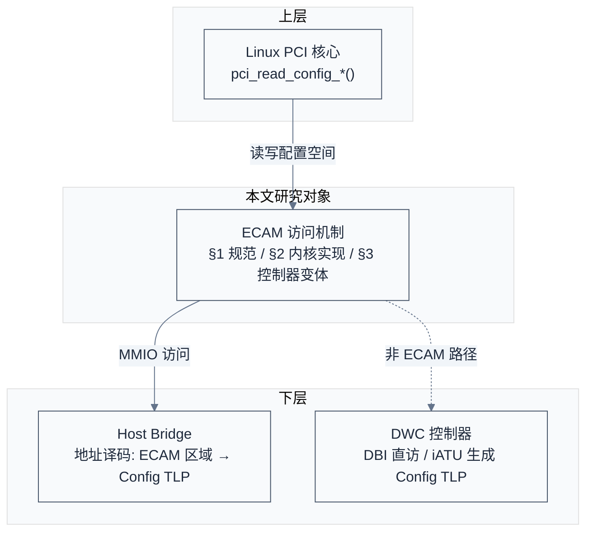
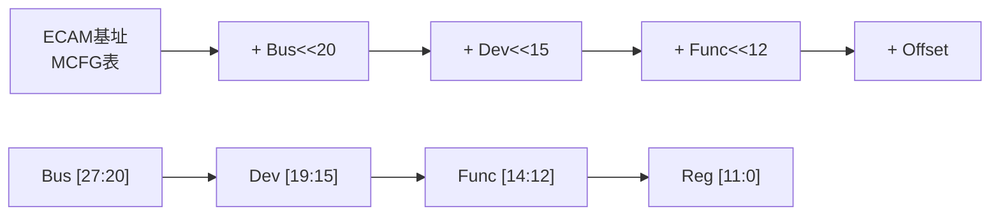
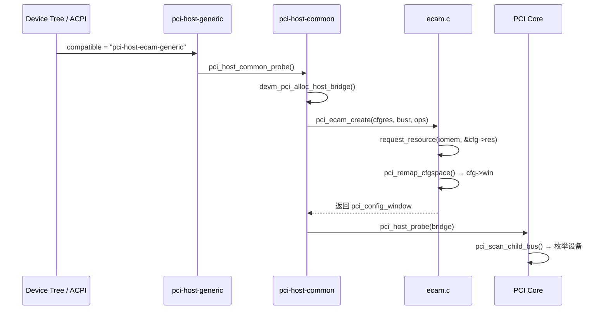
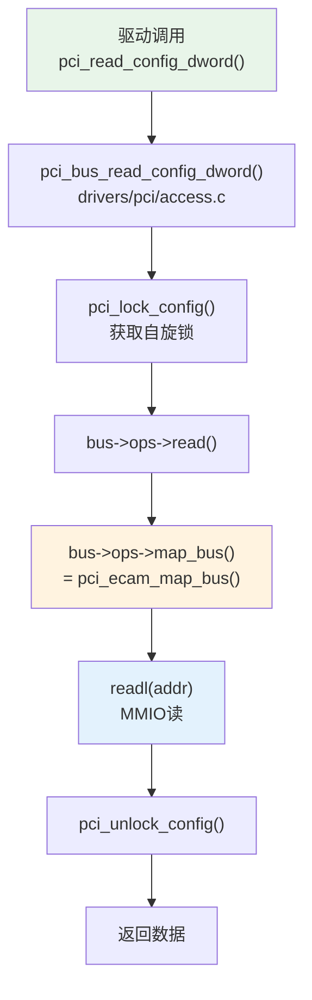
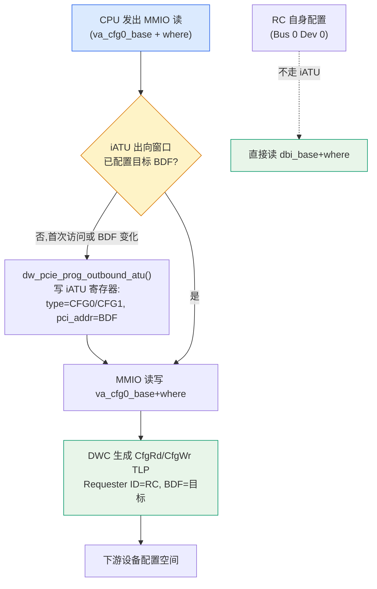
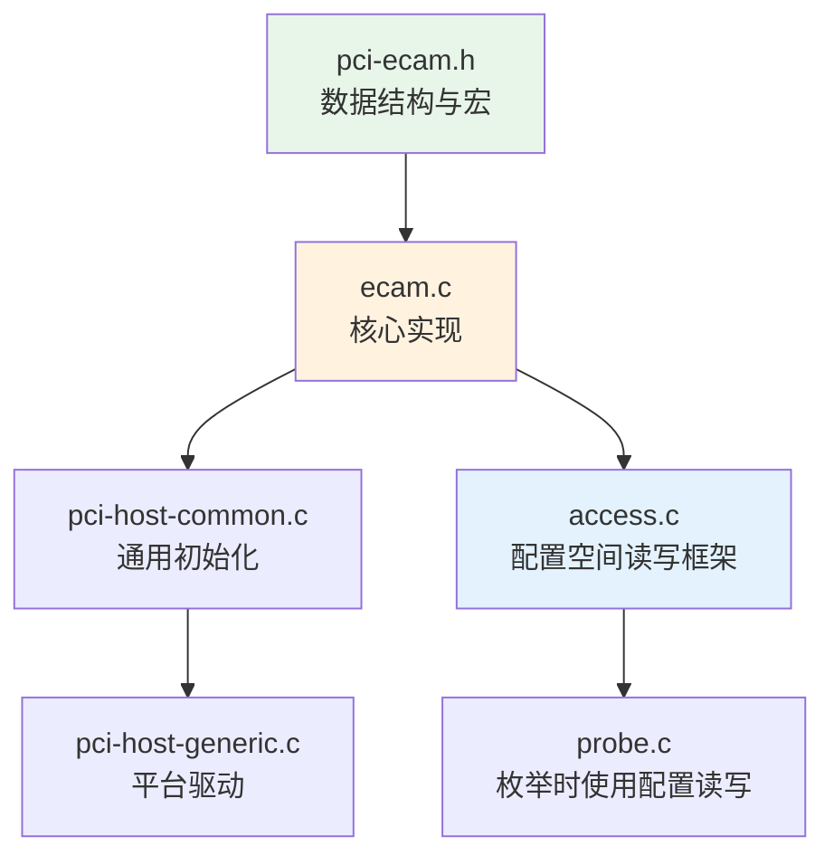

# ECAM 与配置空间访问

> 核心问题：CPU如何读写PCIe设备的4KB配置空间？
> 关联索引：[PCIe核心知识索引](./pcie-learning-resources.md) Phase 0, 1.1

### 关键术语
| 缩写 | 全称 | 含义 |
|------|------|------|
| ECAM | Enhanced Configuration Access Mechanism | 增强型配置访问机制，将配置空间映射到MMIO |
| CAM | Configuration Access Mechanism | 传统PCI配置访问机制，使用端口I/O |
| MCFG | Memory-mapped ConFiGuration | ACPI表，记录ECAM基址和总线范围 |
| DBI | Data Bus Interface | DWC控制器内部寄存器访问接口 |
| RC | Root Complex | 根复合体，PCIe拓扑的根节点 |
| BDF | Bus/Device/Function | PCIe设备的三级地址编号 |
| iATU | Internal Address Translation Unit | DWC控制器内部地址转换单元,可生成 Config TLP |
| DWC | DesignWare PCIe | Synopsys 的可综合 PCIe Controller IP,业界最流行 |

---

## 0. 前置背景

### 0.1 系统上下文

ECAM (Enhanced Configuration Access Mechanism) 在 PCIe 软件栈中是 CPU 访问设备配置空间的统一通道——它把每个 Function 的 4KB 配置空间映射到 MMIO 区域,使 Linux PCI 核心可以通过普通的 `readl/writel` 访问,无需依赖 x86 端口 I/O。理解 ECAM 必须同时看到三个耦合点:

**项目定位**:ECAM 是 PCIe 规范定义的配置访问机制,介于 Linux PCI 核心(枚举/配置)与 Host Bridge 硬件(地址译码)之间。规范只定义"如何把 BDF+Offset 映射为 MMIO 地址",具体实现由 SoC 厂商的 Host Bridge 与 PCIe 控制器落地。

**软硬件耦合点**:

- CPU 发出 MMIO 访问 → Host Bridge 地址译码命中 ECAM 区域 → 生成 CfgRd/CfgWr TLP → 下游设备配置空间
- ECAM 基址由固件描述:ACPI 系统通过 MCFG 表,DT 系统通过 `ranges` 属性
- DWC (DesignWare) 控制器有两条路径:硬件 ECAM 译码器(标准路径)或 iATU 出向窗口(非 ECAM 路径);RC 自身配置空间则通过 DBI 直访,不生成 TLP

**PCIe Controller / Root Complex / Segment 映射关系**:

| 概念 | 本质 | 对应 Linux 结构 | 映射关系 |
|------|------|----------------|----------|
| **PCIe Controller** | 实现 PCIe 协议栈的物理 IP 硬核（DWC、Cadence 等） | 驱动 probe 的对象，一个 `struct dw_pcie` | 一个 Controller 可以独立成一个 RC，或者多个 Controller 合入一个 RC |
| **Root Complex (RC)** | 包含 Controller + 地址转发/DMA/中断汇聚的拓扑实体 | `struct pci_host_bridge` | 一个 RC 可以包含 1 个或多个 Controller（多端口 RC）；一个 RC 可以独立成一个 Segment，也可以与其他 RC 共享 Segment |
| **PCIe Segment (域)** | 独立的总线号空间（Bus 0–255），由固件分配 | `pci_domain_nr()`，ACPI MCFG Entry / DT `linux,pci-domain` | 一个 Segment 包含 1 个 RC（典型）或 多个 RC（如 SynQuacer 10 个 controller 共享 1 个 Segment） |

**核心原则**:Segment 的边界是**总线号空间隔离**。两个 RC 共享 bus 0–255 → 同一 Segment；各自独立 → 不同 Segment。嵌入式 1:1:1 是特例，不是定义。

**跨实现/跨架构对比**:

- 通用 ECAM (`pci-host-ecam-generic`):硬件直接译码 `Bus<<20 + Dev<<15 + Func<<12`,1 次 MMIO 完成访问
- DWC iATU (`native_ecam=true`):每次 BDF 变化需重写 iATU 寄存器,再 1 次 MMIO 访问;不要求 256MB 对齐
- SG2046 实例:`config` 区域虽为 256MB,但 `native_ecam=true` 强制走 iATU 路径,体现 SoC 设计取舍

> **说明**:`native_ecam` 是 DWC 驱动结构体 `struct dw_pcie_rp` 的 bool 字段（不是宏或 DT 属性）,由 glue driver（如 `pcie-al.c`、`pcie-sophgo.c`）在 probe 时设置。`native_ecam=true` 的实际效果是**禁用**硬件 ECAM 译码器,强制走 iATU 出站窗口——命名有误导性,`false` 时才是标准 ECAM 路径。



> **如何读这张图**:本文研究对象是 ECAM 访问机制(中间层),它向上对接 Linux PCI 核心的配置读写 API,向下通过 MMIO 访问 Host Bridge 触发地址译码。Host Bridge 命中 ECAM 区域后生成 Config TLP(实线),这是标准 ECAM 路径;DWC 控制器在 `native_ecam=true` 时改走 iATU 路径(虚线),由软件编程 iATU 寄存器生成 Config TLP,不经过硬件 ECAM 译码器。

### 0.2 什么是配置空间

每个PCIe Function拥有4KB配置空间，包含设备身份、能力声明、控制/状态寄存器等。软件必须先通过配置空间发现设备、了解其能力，才能正确使用设备。

```
配置空间布局:
├── 0x00-0x3F: PCI兼容头 (Type 0/1 Header)
│   ├── Vendor ID / Device ID     ← 设备身份
│   ├── Command / Status           ← 控制/状态
│   ├── BAR0-5 (Type 0)           ← 地址需求声明
│   └── Capability Pointer        ← 能力链表入口
├── 0x40-0xFF: PCI兼容扩展 (Capability链表)
└── 0x100-0xFFF: PCIe Extended Config Space
    ├── AER Capability
    ├── SR-IOV Capability
    ├── ACS Capability
    └── ...
```

### 0.3 Host Bridge的角色

Host Bridge是Root Complex内的核心硬件模块，是CPU访问PCIe世界的门户：

```
CPU发出Memory访问 → Host Bridge地址译码:
  ├── 命中ECAM区域 → 生成CfgRd/CfgWr TLP → 访问配置空间
  ├── 命中BAR MMIO区域 → 生成MemRd/MemWr TLP → 访问设备寄存器
  └── 未命中 → 访问本地内存 (DDR)
```

Host Bridge本身不是PCIe设备，它没有标准的配置空间（不通过ECAM/CfgRd TLP访问）。但Root Port作为PCIe拓扑中的Bridge，拥有Type 1配置空间，通过DBI接口访问（见§3.7）。Host Bridge的地址译码规则由SoC设计者通过硬件连线或固件（ACPI/DT）配置。

### 0.4 配置空间访问的演进

| 机制 | 时代 | 访问方式 | 空间范围 |
|------|------|---------|---------|
| CAM | PCI | CF8/CFC端口对 | 256B |
| ECAM | PCIe | MMIO映射 | 4KB |

---

## 1. 规范机制

> 上一章建立了配置空间访问的基础框架——明确了 4KB 配置空间的结构、Host Bridge 的地址译码角色、以及从 CAM 到 ECAM 的演进。一个自然的问题是:ECAM 在规范层面究竟如何把 BDF 映射为 MMIO 地址？本章用规范机制来回答这个问题——先讲为什么需要 ECAM、与传统 CAM 的差异,再讲 ECAM 地址计算的位域布局,最后讲 ACPI MCFG 表如何描述 ECAM 基址与多 Segment 场景。

### 1.1 为什么需要ECAM

传统PCI使用CF8/CFC端口对（Configuration Address/Data Port）访问配置空间：

```
写CF8: [31:Enable][30:24:Reserved][23:16:Bus][15:11:Dev][10:8:Func][7:2:Reg][1:0:00]
读CFC: 返回配置空间数据
```

局限：
- 每次只能访问256B配置空间（Reg字段7:2，即DWORD偏移0-63）
- PCIe Extended Configuration Space (0x100-0xFFF) 无法访问
- 端口I/O是独占式操作，不可MMIO映射

ECAM (Enhanced Configuration Access Mechanism) 将整个配置空间映射到MMIO：

```
每个Segment: 256MB地址空间
  = 256 Bus × 32 Dev × 8 Func × 4KB
```

### 1.2 地址计算



| 位域 | 位 | 含义 |
|------|-----|------|
| Bus | [27:20] | 总线号 (0-255) |
| Dev | [19:15] | 设备号 (0-31) |
| Func | [14:12] | 功能号 (0-7) |
| Register | [11:0] | 配置空间偏移 (0-0xFFF) |

> 每个Function占4KB，前256B与PCI兼容，后3840B为PCIe Extended Config Space

### 1.3 MCFG表

ACPI MCFG表提供ECAM基址信息：

```
MCFG Table
├── Signature: "MCFG"
├── Length
├── Reserved
└── Allocation Structures[]
    ├── Base Address     ← ECAM基址 (物理地址)
    ├── PCI Segment Group
    ├── Start Bus Number
    └── End Bus Number
```

Linux查看：`cat /sys/firmware/acpi/tables/MCFG`

**多Segment场景**：

大型服务器可能有多个PCIe Segment（域），每个Segment有独立的ECAM基址。MCFG表中包含多个Allocation Structure，每个描述一个Segment的ECAM映射：

```
MCFG表 (多Segment示例):
├── Allocation Structure 0:
│   ├── Base Address = 0xE000_0000
│   ├── Segment Group = 0
│   ├── Start Bus = 0, End Bus = 0xFF
│   └── 覆盖: 256MB (Bus 0-255)
├── Allocation Structure 1:
│   ├── Base Address = 0xC000_0000
│   ├── Segment Group = 1
│   ├── Start Bus = 0, End Bus = 0x7F
│   └── 覆盖: 128MB (Bus 0-127)
└── ...

内核处理:
  pci_mmcfg_list → 逐个解析Allocation Structure
  每个Segment创建独立的 pci_config_window
  设备BDF前缀即Segment号: 0000:xx:yy.z vs 0001:xx:yy.z
```

> Segment Group号与Linux的`pci_domain_nr()`对应。不同Segment的ECAM基址可以不同，甚至Bus范围也可以不同（如一个Segment只覆盖Bus 0-127，只需128MB映射空间）。

---

## 2. Linux内核实现

> 上一章建立了 ECAM 规范机制的核心框架——地址映射公式 `Bus<<20 + Dev<<15 + Func<<12 + Offset`、MCFG 表对 ECAM 基址的描述。一个自然的问题是:Linux 内核如何把这套规范落地为可运行的代码？本章用 Linux 内核实现来回答这个问题——先讲 `pci_config_window`/`pci_ecam_ops` 等关键数据结构,再讲 `pci_ecam_create()` 的初始化流程与 `pci_ecam_map_bus()` 的地址计算入口,最后讲配置空间读写的完整调用链与并发保护。

### 2.1 关键数据结构

```c
// include/linux/pci-ecam.h
// 简化实现，省略了 pci_config_window 中 busr 资源管理和 pci_ecam_ops 中 enable_device/disable_device 等回调

struct pci_config_window {
    struct resource         res;     // ECAM MMIO区域
    struct resource         busr;    // Bus号范围
    unsigned int            bus_shift; // 总线地址偏移位数(默认20)
    void                   *priv;    // 控制器私有数据
    const struct pci_ecam_ops *ops;  // ECAM操作集
    union {
        void __iomem       *win;     // 64位: 单一映射
        void __iomem      **winp;    // 32位: 逐Bus映射
    };
    struct device          *parent;  // 设备父节点
};

struct pci_ecam_ops {
    unsigned int            bus_shift;
    struct pci_ops          pci_ops; // 底层读写操作
    int (*init)(struct pci_config_window *);
    int (*enable_device)(struct pci_host_bridge *, struct pci_dev *);
    void (*disable_device)(struct pci_host_bridge *, struct pci_dev *);
};
```

### 2.2 ECAM地址计算宏

```c
// include/linux/pci-ecam.h

#define PCIE_ECAM_BUS_SHIFT     20
#define PCIE_ECAM_DEVFN_SHIFT   12
#define PCIE_ECAM_BUS_MASK      0xff
#define PCIE_ECAM_DEVFN_MASK    0xff
#define PCIE_ECAM_REG_MASK      0xfff

#define PCIE_ECAM_BUS(x)    (((x) & PCIE_ECAM_BUS_MASK) << PCIE_ECAM_BUS_SHIFT)
#define PCIE_ECAM_DEVFN(x)  (((x) & PCIE_ECAM_DEVFN_MASK) << PCIE_ECAM_DEVFN_SHIFT)
#define PCIE_ECAM_REG(x)    ((x) & PCIE_ECAM_REG_MASK)

#define PCIE_ECAM_OFFSET(bus, devfn, where) \
    (PCIE_ECAM_BUS(bus) | PCIE_ECAM_DEVFN(devfn) | PCIE_ECAM_REG(where))
```

### 2.3 初始化流程



**源码路径**：

| 文件 | 作用 |
|------|------|
| `drivers/pci/ecam.c` | ECAM核心：创建/映射/地址计算 |
| `drivers/pci/controller/pci-host-generic.c` | 通用ECAM平台驱动 |
| `drivers/pci/controller/pci-host-common.c` | 通用Host Bridge初始化 |
| `include/linux/pci-ecam.h` | ECAM数据结构与宏定义 |

### 2.4 pci_ecam_create() 详解

```c
// drivers/pci/ecam.c
// 简化实现，省略了错误处理 goto err_exit 路径、bus_range 截断逻辑、request_resource_conflict 冲突检查、dev_info 日志输出
struct pci_config_window *pci_ecam_create(struct device *dev,
        struct resource *cfgres, struct resource *busr,
        const struct pci_ecam_ops *ops)
{
    unsigned int bus_shift = ops->bus_shift;
    // 1. 分配 pci_config_window
    cfg = kzalloc_obj(*cfg);

    // 2. 设置bus_shift (默认20, 即标准ECAM)
    if (!bus_shift)
        bus_shift = PCIE_ECAM_BUS_SHIFT;

    // 3. 设置cfg各字段
    cfg->parent = dev;
    cfg->ops = ops;
    cfg->busr.start = busr->start;
    cfg->busr.end = busr->end;
    cfg->busr.flags = IORESOURCE_BUS;
    cfg->bus_shift = bus_shift;
    bus_range = resource_size(&cfg->busr);
    bsz = 1 << bus_shift;

    cfg->res.start = cfgres->start;
    cfg->res.end = cfgres->end;
    cfg->res.flags = IORESOURCE_MEM | IORESOURCE_BUSY;
    cfg->res.name = "PCI ECAM";

    // 4. 请求MMIO资源
    conflict = request_resource_conflict(&iomem_resource, &cfg->res);

    // 5. 映射配置空间
    if (per_bus_mapping) {
        // 32位系统: 逐Bus映射
        cfg->winp = kzalloc_objs(*cfg->winp, bus_range);
    } else {
        // 64位系统: 一次映射全部
        cfg->win = pci_remap_cfgspace(cfgres->start, bus_range * bsz);
    }

    // 6. 调用控制器特定初始化
    if (ops->init)
        ops->init(cfg);
}
```

> 64位系统一次性映射整个ECAM区域（可能高达256MB），32位系统按Bus逐个映射（每个Bus 1MB = 32 Dev × 8 Func × 4KB）

### 2.5 pci_ecam_map_bus() —— 配置空间访问的入口

```c
// drivers/pci/ecam.c
// 简化实现，省略了 per_bus_mapping 的逐 Bus ioremap 说明、pci_ecam_add_bus/remove_bus 生命周期
void __iomem *pci_ecam_map_bus(struct pci_bus *bus, unsigned int devfn,
                               int where)
{
    struct pci_config_window *cfg = bus->sysdata;
    unsigned int bus_shift = cfg->ops->bus_shift;
    unsigned int devfn_shift = cfg->ops->bus_shift - 8;
    unsigned int busn = bus->number;
    void __iomem *base;
    u32 bus_offset, devfn_offset;

    // 1. Bus号范围检查
    if (busn < cfg->busr.start || busn > cfg->busr.end)
        return NULL;

    busn -= cfg->busr.start;

    // 2. 获取映射基址
    if (per_bus_mapping) {
        base = cfg->winp[busn];  // 32位: 使用该Bus的映射
        busn = 0;
    } else
        base = cfg->win;          // 64位: 使用全局映射

    // 3. 计算ECAM偏移 (支持非标准bus_shift)
    if (cfg->ops->bus_shift) {
        bus_offset = (busn & PCIE_ECAM_BUS_MASK) << bus_shift;
        devfn_offset = (devfn & PCIE_ECAM_DEVFN_MASK) << devfn_shift;
        where &= PCIE_ECAM_REG_MASK;

        return base + (bus_offset | devfn_offset | where);
    }

    return base + PCIE_ECAM_OFFSET(busn, devfn, where);
}
```

### 2.6 配置空间读写调用链



**access.c中的通用读写**：

```c
// drivers/pci/access.c
// 简化实现，省略了 pci_lock_config 保护、pci_generic_config_read32 路径、pci_generic_config_write32 RMW 路径
int pci_generic_config_read(struct pci_bus *bus, unsigned int devfn,
                            int where, int size, u32 *val)
{
    void __iomem *addr;

    addr = bus->ops->map_bus(bus, devfn, where);
    if (!addr)
        return PCIBIOS_DEVICE_NOT_FOUND;

    if (size == 1)
        *val = readb(addr);
    else if (size == 2)
        *val = readw(addr);
    else
        *val = readl(addr);

    return PCIBIOS_SUCCESSFUL;
}
```

**配置空间访问的并发保护**：

`pci_lock_config()` 使用全局自旋锁 `pci_lock` 保护所有配置空间访问：

```c
// drivers/pci/access.c
// 简化实现，省略了 spin_lock_irqsave 的 flags 参数管理和中断状态保存
static DEFINE_SPINLOCK(pci_lock);

void pci_lock_config(void)
{
    spin_lock_irqsave(&pci_lock, flags);
    *flags_ptr = flags;
}
```

为什么需要全局锁：
- **CAM模式**：CF8/CFC端口对是全局共享的，两次操作（写地址+读写数据）之间不能被其他CPU打断
- **ECAM模式**：虽然MMIO访问本身是原子的，但某些控制器（如CAM兼容模式、自定义pci_ops）仍需要串行化
- **PCI 2.2规范**：要求配置空间访问在Host Bridge级别串行化，确保一个配置事务完成后再开始下一个

> ECAM的per-Bus映射在硬件层面允许不同Bus的访问并行，但Linux仍使用全局锁简化实现。对于高性能场景（如大量VF配置），这个锁可能成为瓶颈。

---

## 3. 控制器变体

> 上一章建立了 Linux 通用 ECAM 实现的核心框架——`pci-host-ecam-generic` 驱动、`pci_ecam_map_bus()` 的标准地址计算、全局 `pci_lock` 的并发保护。一个自然的问题是:真实 SoC 的 PCIe 控制器都严格遵循标准 ECAM 吗？本章用控制器变体来回答这个问题——先讲 DWC 控制器在 ECAM 模式下的幽灵设备过滤,再讲 `native_ecam=true` 时 iATU 生成 Config TLP 的非 ECAM 路径,接着用 SG2046 实例展示完整取舍,最后对比 CAM、DBI 等其他配置访问机制。

不同SoC的PCIe控制器可能需要定制ECAM操作：

### 3.1 DWC控制器的ECAM过滤

```c
// drivers/pci/controller/pci-host-generic.c
// 简化实现，省略了英文源码注释和 pci_dw_ecam_map_bus 包装函数
static bool pci_dw_valid_device(struct pci_bus *bus, unsigned int devfn)
{
    struct pci_config_window *cfg = bus->sysdata;
    // DWC在ECAM模式下不会过滤Type 0配置TLP
    // Bus 0上Dev 1-31会重复响应，需软件过滤
    if (bus->number == cfg->busr.start && PCI_SLOT(devfn) > 0)
        return false;
    return true;
}
```

> DWC RC只有一个下游端口，Bus 0上只应存在Dev 0。不过滤会导致"幽灵设备"。

### 3.2 DWC 通用 ECAM 路径（`dw_pcie_ecam_ops`）

DWC host 核心在 [pcie-designware-host.c](file:///home/pbw/sg2046/linux-common/drivers/pci/controller/dwc/pcie-designware-host.c) 中自带一套 ECAM ops,与 `pci-host-generic.c` 的 `pci_dw_ecam_bus_ops` 思路一致——Bus 0 Dev 0 走 DBI,Bus 0 Dev>0 过滤,Bus>0 走标准 ECAM:

```c
// drivers/pci/controller/dwc/pcie-designware-host.c 第 834-860 行
static void __iomem *dw_pcie_ecam_conf_map_bus(struct pci_bus *bus,
                                               unsigned int devfn, int where)
{
    struct pci_config_window *cfg = bus->sysdata;
    struct dw_pcie_rp *pp = cfg->priv;
    struct dw_pcie *pci = to_dw_pcie_from_pp(pp);
    unsigned int busn = bus->number;

    if (busn > 0)
        return pci_ecam_map_bus(bus, devfn, where);  // 下游:标准 ECAM

    if (PCI_SLOT(devfn) > 0)
        return NULL;                                  // 幽灵设备过滤

    return pci->dbi_base + where;                     // RC 自身:DBI
}

static struct pci_ops dw_pcie_ecam_ops = {
    .map_bus = dw_pcie_ecam_conf_map_bus,
    .read    = pci_generic_config_read,
    .write   = pci_generic_config_write,
};
```

**启用条件**——`dw_pcie_ecam_enabled()` 三项检查全过才走此路径:

```c
// drivers/pci/controller/dwc/pcie-designware-host.c 第 478-504 行
static bool dw_pcie_ecam_enabled(struct dw_pcie_rp *pp, struct resource *config_res)
{
    /* Vendor glue drivers may implement their own ECAM mechanism */
    if (pp->native_ecam)        // ① vendor 标记自行处理
        return false;

    /* PCIe spec r6.0 sec 7.2.2: ECAM 基址必须 2^(n+20) 对齐,DWC n=8 → 256MB */
    if (!IS_256MB_ALIGNED(config_res->start))  // ② 对齐检查
        return false;

    bus_range = resource_list_first_type(...)->res;
    nr_buses = resource_size(config_res) >> PCIE_ECAM_BUS_SHIFT;
    return nr_buses >= resource_size(bus_range);  // ③ 容量检查
}
```

> **如何读这段代码**:三个条件任一不满足就回退到 iATU 路径(§3.3)。条件②要求 DT `config` 区域的物理基址 256MB 对齐——因为 DWC 用 8 位 Bus 号,ECAM 偏移 `Bus<<20` 需要 28 位地址空间,基址必须 2^28 对齐。条件③要求 config 区域足够覆盖所有 Bus。

### 3.3 DWC iATU 配置访问路径（`native_ecam=true` 或不对齐时）

当 `dw_pcie_ecam_enabled()` 返回 `false` 时,DWC 走 **iATU 出向窗口** 生成 Config TLP——这是 DWC 的"原生"(非 ECAM)配置访问方式。**注意变量名 `native_ecam` 的误导性**:它为 `true` 时实际走的是**非 ECAM**(iATU)路径,Sophgo 提交此特性的 commit message 明确写 "Support non-ecam mode"。



**核心函数 `dw_pcie_other_conf_map_bus()`**——每次下游配置访问都重配 iATU:

```c
// drivers/pci/controller/dwc/pcie-designware-host.c 第 724-761 行
// 简化实现,省略了 dw_pcie_link_up 检查、PCIE_ATU_TYPE_CFG0/1 选择逻辑的注释
static void __iomem *dw_pcie_other_conf_map_bus(struct pci_bus *bus,
                                                unsigned int devfn, int where)
{
    struct dw_pcie_rp *pp = bus->sysdata;
    struct dw_pcie *pci = to_dw_pcie_from_pp(pp);
    struct dw_pcie_ob_atu_cfg atu = { 0 };
    u32 busdev;

    if (!dw_pcie_link_up(pci))
        return NULL;  // 链路未就绪直接失败,不产生 TLP

    // 把目标 BDF 编码到 iATU 的 pci_addr 字段
    busdev = PCIE_ATU_BUS(bus->number) | PCIE_ATU_DEV(PCI_SLOT(devfn)) |
             PCIE_ATU_FUNC(PCI_FUNC(devfn));

    // Root Bus 直接下游用 Type 0,更深层用 Type 1
    if (pci_is_root_bus(bus->parent))
        atu.type = PCIE_ATU_TYPE_CFG0;
    else
        atu.type = PCIE_ATU_TYPE_CFG1;

    atu.parent_bus_addr = pp->cfg0_base - pci->parent_bus_offset;
    atu.pci_addr = busdev;
    atu.size = pp->cfg0_size;

    // 每次配置访问都要重写 iATU 寄存器(几次 MMIO 写)
    if (dw_pcie_prog_outbound_atu(pci, &atu))
        return NULL;

    return pp->va_cfg0_base + where;  // CPU 访问此地址,经 iATU 生成 Config TLP
}
```

**ECAM 路径 vs iATU 路径对比**:

| 对比维度 | 通用 ECAM (`dw_pcie_ecam_ops`) | iATU (`dw_pcie_ops`) |
|----------|-------------------------------|---------------------|
| **启用条件** | `native_ecam=false` + 256MB 对齐 + 容量足够 | `native_ecam=true` 或对齐/容量不满足 |
| **配置访问开销** | 1 次 MMIO 读写(硬件直接译码) | 每次 BDF 变化需重配 iATU(数次 MMIO 写) + 1 次读写 |
| **地址计算** | 硬件译码 `Bus<<20 + Dev<<15 + Func<<12` | iATU 寄存器编程,每次只指向一个 BDF |
| **RC 自身配置** | `dbi_base + where` | `dbi_base + where`(相同) |
| **幽灵设备过滤** | `dw_pcie_ecam_conf_map_bus` 中 `PCI_SLOT>0 → NULL` | `dw_pcie_own_conf_map_bus` 中 `PCI_SLOT>0 → NULL` |
| **链路检查** | 无(硬件自动处理) | `dw_pcie_link_up()` 检查,链路 down 时返回 NULL |
| **DT `config` 资源用途** | 作为 `pci_config_window` 映射 | 作为 iATU 出向窗口的 CPU 侧地址 |
| **典型控制器** | 256MB 对齐的通用 DWC 设计 | SG2046、Amazon al_pcie |

> **核心要点**:iATU 路径下每次下游配置访问都要重写 iATU 寄存器,性能远低于硬件 ECAM 译码。大量 VF 枚举(数百次配置访问)时差异明显。但 iATU 路径不要求 256MB 对齐,对 SoC 地址映射更灵活。SG2046 选择 iATU 路径是设计取舍——可能是为了避开 256MB 对齐约束,或因控制器硬件未实现 ECAM 译码器。

### 3.4 SG2046 实例:`native_ecam=true` 的完整路径

SG2046 PCIe 驱动 [pcie-sophgo.c](file:///home/pbw/sg2046/linux-common/drivers/pci/controller/dwc/pcie-sophgo.c) 设置 `pp->native_ecam = true`,走 §3.3 的 iATU 路径:

```c
// drivers/pci/controller/dwc/pcie-sophgo.c 第 233-245 行
static int sophgo_pcie_configure_rc(struct sophgo_pcie *sophgo)
{
    struct dw_pcie_rp *pp;

    pp = &sophgo->pci.pp;
    pp->ops = &sophgo_pcie_host_ops;  // 只定义 .init 回调,不覆盖 pci_ops

#ifdef CONFIG_PCIE_SG2046_DW
    pp->native_ecam = true;           // 强制走 iATU 配置访问
#endif

    return dw_pcie_host_init(pp);     // 进入 DWC 通用 host 初始化
}
```

**SG2046 DTS 的 `config` 区域**:

```dts
// arch/riscv/boot/dts/sophgo/sg2046-pcie-s.dtsi 第 29-33 行
reg = <0x2001 0x02400000  0x0 0x00001000>,   // dbi
      <0x2001 0x02700000  0x0 0x00004000>,   // atu
      <0x2001 0x00a0b000  0x0 0x00001000>,   // app
      <0x3000 0x00000000  0x0 0x10000000>;   // config: 256MB @ 0x3000_00000000
reg-names = "dbi", "atu", "app", "config";
```

虽然 `config` 区域是 256MB 且看起来像 ECAM 窗口,但由于 `native_ecam=true`,`dw_pcie_ecam_enabled()` 直接返回 `false`,DWC 跳过通用 ECAM 库,改用 `dw_pcie_ops`/`dw_child_pcie_ops`(iATU 路径)。`config` 区域被 `devm_pci_remap_cfg_resource()` 映射为 `va_cfg0_base`,作为 iATU 出向窗口的 CPU 侧访问地址。

> **调试提示**:在 SG2046 上 `lspci` 偶发性看不到下游设备时,首先检查 `dw_pcie_link_up()`——iATU 路径在链路 down 时直接返回 NULL,而通用 ECAM 路径没有这个检查。详见 [工程踩坑指南](./pcie-engineering-pitfalls.md) §10.1。

### 3.5 非标准ECAM控制器

| 控制器 | 文件 | 特殊处理 |
|--------|------|----------|
| ThunderX PEM | pci-thunder-pem.c | PEM空间偏移，非标准bus_shift |
| X-Gene | pci-xgene.c | 非ECAM，使用自定义pci_ops |
| HiSilicon | hisi_pcie_ops | 32位只读访问 |
| Aardvark | pci-aardvark.c | 完全自定义，无ECAM |
| Altera | pcie-altera.c | 自定义读写，无ECAM |

### 3.6 CAM (Configuration Access Mechanism)

CAM是ECAM的前身，使用x86端口I/O访问配置空间，bus_shift=16（只支持256B配置空间）：

**CAM操作流程**：

```
1. 构造地址值:
   CF8 = [31:Enable=1][30:Reserved][23:16:Bus][15:11:Dev][10:8:Func][7:2:Reg][1:0:00]

2. 写入地址端口:
   outl(CF8, 0xCF8)

3. 读写数据端口:
   val = inl(0xCFC)          // 读配置空间
   outl(new_val, 0xCFC)      // 写配置空间
```

**CAM的局限**：
- 全局独占：每次配置访问需先写CF8再读写CFC，多CPU并发访问需加锁
- 空间受限：Reg字段仅bit7:2（8位×4=32个DWORD偏移），最多访问256B
- 只支持x86：端口I/O是x86特有的机制，ARM/RISC-V无法使用
- 不可预取：端口I/O是严格有序的，不能做MMIO那样的合并优化

**CAM vs ECAM 对比**：

| 特性 | CAM | ECAM |
|------|-----|------|
| 访问方式 | 端口I/O (CF8/CFC) | MMIO映射 |
| 空间范围 | 256B | 4KB |
| 并发控制 | 全局锁（软件） | per-Bus映射（硬件并行） |
| 架构依赖 | 仅x86 | 通用 |
| 地址计算 | 运行时写CF8 | 编译时偏移计算 |

```c
// drivers/pci/controller/pci-host-generic.c
// 简化实现，省略了 pci_generic_ecam_ops 中 add_bus/remove_bus 回调
// 注意：此结构用于某些将256B配置空间映射到MMIO的控制器（bus_shift=16，每Bus占64KB），
// 不是x86 CF8/CFC端口I/O方式的CAM。
static const struct pci_ecam_ops gen_pci_cfg_cam_bus_ops = {
    .bus_shift = 16,  // CAM: Bus<<16, 无Dev/Func偏移（每Bus 64KB = 32Dev × 8Func × 256B）
    .pci_ops = {
        .map_bus = pci_ecam_map_bus,
        .read    = pci_generic_config_read,
        .write   = pci_generic_config_write,
    }
};
```

### 3.7 DBI —— 控制器内部配置空间访问

ECAM用于访问**下游设备**的配置空间（生成CfgRd/CfgWr TLP），但**Root Complex自身**也有配置空间（Root Port的Type 1 Header、Link Capability等）。这部分配置空间不通过TLP访问，而是通过控制器的**DBI (Data Bus Interface)** 直接MMIO访问。

#### 为什么需要DBI

DBI (Data Bus Interface) 是 DWC 控制器的内部寄存器访问接口。

```
ECAM访问路径:
  CPU → ECAM区域MMIO → Host Bridge → 生成CfgRd/CfgWr TLP → 下游设备配置空间

DBI访问路径:
  CPU → DBI区域MMIO → 控制器内部寄存器 → RC自身配置空间 (无TLP生成)
```

Root Port作为PCIe拓扑的一部分，需要：
- 配置Link速度/宽度（Link Capability/Control）
- 配置ASPM（L0s/L1电源管理）
- 配置AER（高级错误报告）
- 配置MSI/MSI-X（RC自身中断）

这些寄存器在RC内部，通过DBI直接访问。

#### DWC控制器的DBI实现

DWC (DesignWare) PCIe控制器是业界最流行的可综合PCIe IP，其DBI空间布局：

```
DBI空间布局 (典型):
├── 0x000-0xFFF: DBI (RC配置空间 + 控制器寄存器)
│   ├── 0x000-0x03F: Type 1 Header (Bridge配置)
│   ├── 0x040-0x0FF: PCI Capability (PCIe Cap, MSI Cap等)
│   ├── 0x100-0xFFF: Extended Capability (AER, ACS等)
│   └── 控制器私有寄存器 (PORT_LOGIC_*, GEN3_*, 等)
├── 0x1000-0x1FFF: DBI2 (Endpoint模式使用)
└── 0x300000+: iATU寄存器 (DEFAULT_DBI_ATU_OFFSET = 3 << 20)
```

```c
// drivers/pci/controller/dwc/pcie-designware.h
// 简化实现，省略了 dw_pcie 结构体中 clock/reset/edma/msi/iatu_unroll 等大量字段

struct dw_pcie {
    void __iomem *dbi_base;       // DBI寄存器基址
    void __iomem *dbi_base2;      // DBI2 (EP模式)
    void __iomem *atu_base;       // iATU寄存器基址
    // ...
};

// DBI读写API
u32 dw_pcie_readl_dbi(struct dw_pcie *pci, u32 reg);
void dw_pcie_writel_dbi(struct dw_pcie *pci, u32 reg, u32 val);
```

#### DBI只读保护

某些DBI寄存器是只读的（如Link Capability中的最大速度），但固件需要修改它们（如限制链路速度）。DWC提供了**只读写使能**机制：

```c
// drivers/pci/controller/dwc/pcie-designware.h
// 简化实现，省略了 DBI_RO_WR_EN 在 MISC_CONTROL_1_OFF 寄存器的完整位定义上下文
#define PCIE_DBI_RO_WR_EN  BIT(0)

static inline void dw_pcie_dbi_ro_wr_en(struct dw_pcie *pci)
{
    u32 val = dw_pcie_readl_dbi(pci, PCIE_MISC_CONTROL_1_OFF);
    val |= PCIE_DBI_RO_WR_EN;
    dw_pcie_writel_dbi(pci, PCIE_MISC_CONTROL_1_OFF, val);
}

static inline void dw_pcie_dbi_ro_wr_dis(struct dw_pcie *pci)
{
    u32 val = dw_pcie_readl_dbi(pci, PCIE_MISC_CONTROL_1_OFF);
    val &= ~PCIE_DBI_RO_WR_EN;
    dw_pcie_writel_dbi(pci, PCIE_MISC_CONTROL_1_OFF, val);
}
```

典型用法——清除 ASPM L0s 支持（Link Capability 寄存器是 RO 的，需 DBI 写使能）：

```c
// drivers/pci/controller/dwc/pcie-qcom.c
// DBI RO 写使能的实际使用：清除 ASPM L0s
dw_pcie_dbi_ro_wr_en(pci);
pcie_capability_clear_word(pci->dev, PCI_EXP_LNKCAP,
                           PCI_EXP_LNKCAP_ASPM_L0s);
dw_pcie_dbi_ro_wr_dis(pci);
```

#### DBI vs ECAM 对比

| 特性 | DBI | ECAM |
|------|-----|------|
| 访问对象 | RC自身配置空间 | 下游设备配置空间 |
| TLP生成 | 否（直接MMIO） | 是（CfgRd/CfgWr TLP） |
| 地址空间 | 控制器私有（通常几KB） | 256MB/Segment |
| 用途 | 初始化RC、配置链路、iATU | 设备发现、配置设备BAR/MSI |
| 只读保护 | 需要DBI_RO_WR_EN | 无（软件自行管理） |

> **关键理解**：DBI是控制器厂商定义的私有接口，不同控制器实现不同。ECAM是PCIe规范定义的标准机制，所有PCIe系统必须支持。

---

## 4. 实战调试

> 上一章建立了控制器变体的核心框架——通用 ECAM、DWC iATU、SG2046 实例、CAM、DBI 等多种配置访问路径的差异。一个自然的问题是:面对一台真实机器,如何确认它走的是哪条路径、出了问题怎么排查？本章用实战调试来回答这个问题——先讲查看 MCFG 表与 ECAM 映射的命令,再列举 `lspci` 全 FF、Bus 0 重复设备等常见现象的根因与排查方法,最后给出内核启动日志中的关键信息。

### 4.1 查看ECAM映射

```bash
# 查看MCFG表
cat /sys/firmware/acpi/tables/MCFG | hexdump -C

# 查看ECAM MMIO区域
cat /proc/iomem | grep -i ecam
cat /proc/iomem | grep -i "PCI"

# 查看设备配置空间 (通过ECAM)
lspci -xxx -s 00:00.0    # 前64B
lspci -xxxx -s 00:00.0   # 完整4KB
```

### 4.2 常见问题

| 现象 | 原因 | 排查 |
|------|------|------|
| `lspci`显示全FF | ECAM映射失败或Bus号超范围 | 检查dmesg中ECAM ioremap错误 |
| Bus 0出现重复设备 | DWC未过滤Dev>0 | 确认使用`pci_dw_ecam_bus_ops` |
| Extended Cap不可见 | 使用CAM而非ECAM | 检查DT中`compatible`是否为`pci-host-ecam-generic` |
| 32位系统配置空间访问慢 | 逐Bus映射开销 | 正常行为，考虑使用64位内核 |

### 4.3 内核启动日志关键信息

```
ECAM at [mem 0x4010000000-0x401fffffff] for [bus 00-ff]
```

---

## 5. 代码阅读路线

> 上一章建立了实战调试的核心框架——MCFG 表查看、`/proc/iomem` 检查、常见现象的根因排查。一个自然的问题是:想深入理解 ECAM 实现细节,应该按什么顺序读源码？本章用代码阅读路线来回答这个问题——先给出文件依赖的 Mermaid 图,再用阅读顺序表标注每个文件的关注点。



| 阅读顺序 | 文件 | 关注点 |
|----------|------|--------|
| 1 | `include/linux/pci-ecam.h` | `PCIE_ECAM_OFFSET`宏、`pci_config_window`结构 |
| 2 | `drivers/pci/ecam.c` | `pci_ecam_create()`、`pci_ecam_map_bus()` |
| 3 | `drivers/pci/access.c` | `pci_generic_config_read/write()`、`pci_lock` |
| 4 | `drivers/pci/controller/pci-host-generic.c` | DT匹配、DWC过滤 |
| 5 | `drivers/pci/controller/pci-host-common.c` | Host Bridge初始化流程 |

---

## 参考资料

- [PCIe Base Specification 6.0](https://pcisig.com/specifications) — §7.2.2 ECAM 机制定义,§7.2.2.1 ECAM 地址映射
- [ACPI Specification 6.5](https://uefi.org/specifications) — §5.2.12.16 MCFG Table 定义
- [Linux Kernel Source](https://git.kernel.org/) — `drivers/pci/ecam.c`, `drivers/pci/access.c`, `drivers/pci/controller/pci-host-generic.c`
- [DWC PCIe Host 驱动(本地)](file:///home/pbw/sg2046/linux-common/drivers/pci/controller/dwc/pcie-designware-host.c) — `dw_pcie_ecam_enabled()`、`dw_pcie_other_conf_map_bus()`、`dw_pcie_ecam_ops`/`dw_pcie_ops` 的分支选择
- [SG2046 PCIe 驱动(本地)](file:///home/pbw/sg2046/linux-common/drivers/pci/controller/dwc/pcie-sophgo.c) — `native_ecam=true` 的实际使用
- [SG2046 PCIe DTS(本地)](file:///home/pbw/sg2046/linux-common/arch/riscv/boot/dts/sophgo/sg2046-pcie-s.dtsi) — `reg-names = "dbi", "atu", "app", "config"` 的区域划分
- [PCIe 工程踩坑指南](./pcie-engineering-pitfalls.md) — §2 ECAM 配置访问问题、§10.1 `native_ecam` 标志的真实含义

---

上一篇：[PCIe核心知识索引](./pcie-learning-resources.md) | 下一篇：[BAR与资源分配](./bar-resource-allocation.md)

---

*源码版本：Linux 6.x (SG2046) | 更新：2026-07-27*
