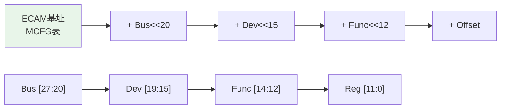
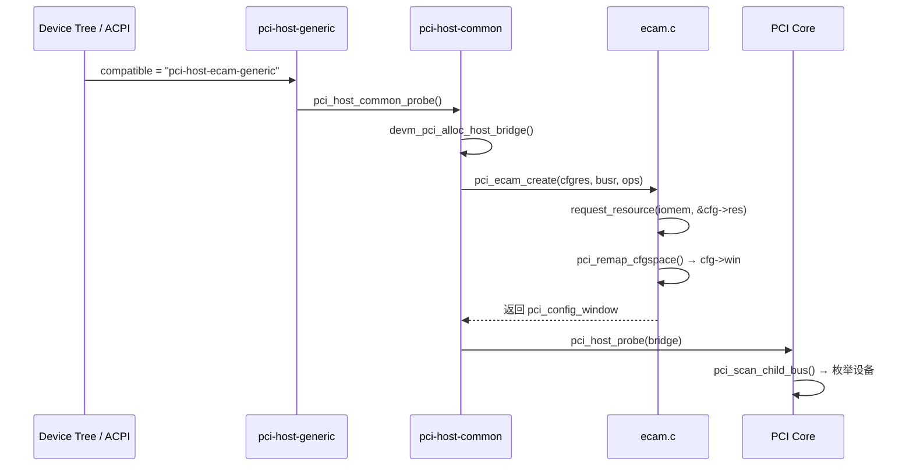
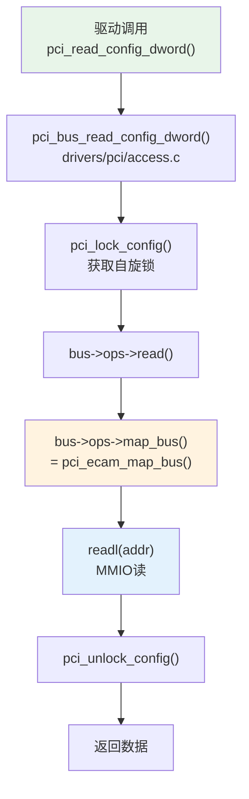
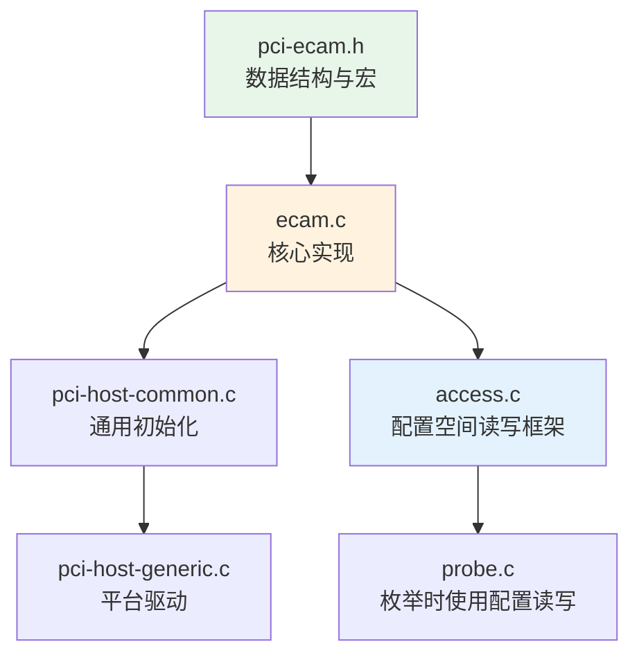

# ECAM 与配置空间访问

> 核心问题：CPU如何读写PCIe设备的4KB配置空间？
> 关联索引：[PCIe核心知识索引](./pcie-learning-resources.md) Phase 0, 1.1

---

## 0. 前置背景

### 0.1 什么是配置空间

每个PCIe Function拥有4KB配置空间，包含设备身份、能力声明、控制/状态寄存器等。软件必须先通过配置空间发现设备、了解其能力，才能正确使用设备。

```
配置空间布局:
├── 0x00-0x3F: PCI兼容头 (Type 0/1 Header)
│   ├── Vendor ID / Device ID     ← 设备身份
│   ├── Command / Status           ← 控制/状态
│   ├── BAR0-5 (Type 0)           ← 地址需求声明
│   └── Capability Pointer        ← 能力链表入口
├── 0x40-0xFF: PCI兼容扩展 (Capability链表)
└── 0x100-0xFFF: PCIe Extended Config Space
    ├── AER Capability
    ├── SR-IOV Capability
    ├── ACS Capability
    └── ...
```

### 0.2 Host Bridge的角色

Host Bridge是Root Complex内的核心硬件模块，是CPU访问PCIe世界的门户：

```
CPU发出Memory访问 → Host Bridge地址译码:
  ├── 命中ECAM区域 → 生成CfgRd/CfgWr TLP → 访问配置空间
  ├── 命中BAR MMIO区域 → 生成MemRd/MemWr TLP → 访问设备寄存器
  └── 未命中 → 访问本地内存 (DDR)
```

Host Bridge不是PCIe设备，它没有配置空间，而是由SoC设计者通过硬件连线或固件（ACPI/DT）配置。

### 0.3 配置空间访问的演进

| 机制 | 时代 | 访问方式 | 空间范围 |
|------|------|---------|---------|
| CAM | PCI | CF8/CFC端口对 | 256B |
| ECAM | PCIe | MMIO映射 | 4KB |

---

## 1. 规范机制

### 1.1 为什么需要ECAM

传统PCI使用CF8/CFC端口对（Configuration Address/Data Port）访问配置空间：

```
写CF8: [31:Enable][30:24:Reserved][23:16:Bus][15:11:Dev][10:8:Func][7:2:Reg][1:0:00]
读CFC: 返回配置空间数据
```

局限：
- 每次只能访问256B配置空间（Reg字段7:2，即DWORD偏移0-63）
- PCIe Extended Configuration Space (0x100-0xFFF) 无法访问
- 端口I/O是独占式操作，不可MMIO映射

ECAM (Enhanced Configuration Access Mechanism) 将整个配置空间映射到MMIO：

```
每个Segment: 256MB地址空间
  = 256 Bus × 32 Dev × 8 Func × 4KB
```

### 1.2 地址计算



| 位域 | 位 | 含义 |
|------|-----|------|
| Bus | [27:20] | 总线号 (0-255) |
| Dev | [19:15] | 设备号 (0-31) |
| Func | [14:12] | 功能号 (0-7) |
| Register | [11:0] | 配置空间偏移 (0-0xFFF) |

> 每个Function占4KB，前256B与PCI兼容，后3840B为PCIe Extended Config Space

### 1.3 MCFG表

ACPI MCFG表提供ECAM基址信息：

```
MCFG Table
├── Signature: "MCFG"
├── Length
├── Reserved
└── Allocation Structures[]
    ├── Base Address     ← ECAM基址 (物理地址)
    ├── PCI Segment Group
    ├── Start Bus Number
    └── End Bus Number
```

Linux查看：`cat /sys/firmware/acpi/tables/MCFG`

---

## 2. Linux内核实现

### 2.1 关键数据结构

```c
// include/linux/pci-ecam.h

struct pci_config_window {
    struct resource         res;     // ECAM MMIO区域
    struct resource         busr;    // Bus号范围
    unsigned int            bus_shift; // 总线地址偏移位数(默认20)
    void                   *priv;    // 控制器私有数据
    const struct pci_ecam_ops *ops;  // ECAM操作集
    union {
        void __iomem       *win;     // 64位: 单一映射
        void __iomem      **winp;    // 32位: 逐Bus映射
    };
    struct device          *parent;  // 设备父节点
};

struct pci_ecam_ops {
    unsigned int            bus_shift;
    struct pci_ops          pci_ops; // 底层读写操作
    int (*init)(struct pci_config_window *);
    int (*enable_device)(struct pci_host_bridge *, struct pci_dev *);
    void (*disable_device)(struct pci_host_bridge *, struct pci_dev *);
};
```

### 2.2 ECAM地址计算宏

```c
// include/linux/pci-ecam.h

#define PCIE_ECAM_BUS_SHIFT     20
#define PCIE_ECAM_DEVFN_SHIFT   12
#define PCIE_ECAM_BUS_MASK      0xff
#define PCIE_ECAM_DEVFN_MASK    0xff
#define PCIE_ECAM_REG_MASK      0xfff

#define PCIE_ECAM_BUS(x)    (((x) & PCIE_ECAM_BUS_MASK) << PCIE_ECAM_BUS_SHIFT)
#define PCIE_ECAM_DEVFN(x)  (((x) & PCIE_ECAM_DEVFN_MASK) << PCIE_ECAM_DEVFN_SHIFT)
#define PCIE_ECAM_REG(x)    ((x) & PCIE_ECAM_REG_MASK)

#define PCIE_ECAM_OFFSET(bus, devfn, where) \
    (PCIE_ECAM_BUS(bus) | PCIE_ECAM_DEVFN(devfn) | PCIE_ECAM_REG(where))
```

### 2.3 初始化流程



**源码路径**：

| 文件 | 作用 |
|------|------|
| [ecam.c](file:///home/pbw/2042f/linux/drivers/pci/ecam.c) | ECAM核心：创建/映射/地址计算 |
| [pci-host-generic.c](file:///home/pbw/2042f/linux/drivers/pci/controller/pci-host-generic.c) | 通用ECAM平台驱动 |
| [pci-host-common.c](file:///home/pbw/2042f/linux/drivers/pci/controller/pci-host-common.c) | 通用Host Bridge初始化 |
| [pci-ecam.h](file:///home/pbw/2042f/linux/include/linux/pci-ecam.h) | ECAM数据结构与宏定义 |

### 2.4 pci_ecam_create() 详解

```c
// drivers/pci/ecam.c
struct pci_config_window *pci_ecam_create(struct device *dev,
        struct resource *cfgres, struct resource *busr,
        const struct pci_ecam_ops *ops)
{
    // 1. 分配 pci_config_window
    cfg = kzalloc_obj(*cfg);

    // 2. 设置bus_shift (默认20, 即标准ECAM)
    if (!bus_shift)
        bus_shift = PCIE_ECAM_BUS_SHIFT;

    // 3. 请求MMIO资源
    cfg->res.flags = IORESOURCE_MEM | IORESOURCE_BUSY;
    conflict = request_resource_conflict(&iomem_resource, &cfg->res);

    // 4. 映射配置空间
    if (per_bus_mapping) {
        // 32位系统: 逐Bus映射
        cfg->winp = kzalloc_objs(*cfg->winp, bus_range);
    } else {
        // 64位系统: 一次映射全部
        cfg->win = pci_remap_cfgspace(cfgres->start, bus_range * bsz);
    }

    // 5. 调用控制器特定初始化
    if (ops->init)
        ops->init(cfg);
}
```

> 64位系统一次性映射整个ECAM区域（可能高达256MB），32位系统按Bus逐个映射（每个4KB×32=128KB）

### 2.5 pci_ecam_map_bus() —— 配置空间访问的入口

```c
// drivers/pci/ecam.c
void __iomem *pci_ecam_map_bus(struct pci_bus *bus, unsigned int devfn, int where)
{
    struct pci_config_window *cfg = bus->sysdata;
    unsigned int busn = bus->number;

    // 1. Bus号范围检查
    if (busn < cfg->busr.start || busn > cfg->busr.end)
        return NULL;

    busn -= cfg->busr.start;

    // 2. 获取映射基址
    if (per_bus_mapping) {
        base = cfg->winp[busn];  // 32位: 使用该Bus的映射
        busn = 0;
    } else {
        base = cfg->win;          // 64位: 使用全局映射
    }

    // 3. 计算ECAM偏移
    return base + PCIE_ECAM_OFFSET(busn, devfn, where);
}
```

### 2.6 配置空间读写调用链



**access.c中的通用读写**：

```c
// drivers/pci/access.c
int pci_generic_config_read(struct pci_bus *bus, unsigned int devfn,
                            int where, int size, u32 *val)
{
    void __iomem *addr = bus->ops->map_bus(bus, devfn, where);
    if (!addr)
        return PCIBIOS_DEVICE_NOT_FOUND;

    if (size == 1)      *val = readb(addr);
    else if (size == 2) *val = readw(addr);
    else                *val = readl(addr);
    return 0;
}
```

---

## 3. 控制器变体

不同SoC的PCIe控制器可能需要定制ECAM操作：

### 3.1 DWC控制器的ECAM过滤

```c
// drivers/pci/controller/pci-host-generic.c
static bool pci_dw_valid_device(struct pci_bus *bus, unsigned int devfn)
{
    struct pci_config_window *cfg = bus->sysdata;
    // DWC在ECAM模式下不会过滤Type 0配置TLP
    // Bus 0上Dev 1-31会重复响应，需软件过滤
    if (bus->number == cfg->busr.start && PCI_SLOT(devfn) > 0)
        return false;
    return true;
}
```

> DWC RC只有一个下游端口，Bus 0上只应存在Dev 0。不过滤会导致"幽灵设备"。

### 3.2 非标准ECAM控制器

| 控制器 | 文件 | 特殊处理 |
|--------|------|----------|
| ThunderX PEM | pci-thunder-pem.c | PEM空间偏移，非标准bus_shift |
| X-Gene | pci-xgene.c | 非ECAM，使用自定义pci_ops |
| HiSilicon | hisi_pcie_ops | 32位只读访问 |
| Aardvark | pci-aardvark.c | 完全自定义，无ECAM |
| Altera | pcie-altera.c | 自定义读写，无ECAM |

### 3.3 CAM (Configuration Access Mechanism)

CAM是ECAM的前身，bus_shift=16（只支持256B配置空间）：

```c
// drivers/pci/controller/pci-host-generic.c
static const struct pci_ecam_ops gen_pci_cfg_cam_bus_ops = {
    .bus_shift = 16,  // CAM: Bus<<16, 无Dev/Func偏移
    .pci_ops = {
        .map_bus = pci_ecam_map_bus,
        .read    = pci_generic_config_read,
        .write   = pci_generic_config_write,
    }
};
```

### 3.4 DBI —— 控制器内部配置空间访问

ECAM用于访问**下游设备**的配置空间（生成CfgRd/CfgWr TLP），但**Root Complex自身**也有配置空间（Root Port的Type 1 Header、Link Capability等）。这部分配置空间不通过TLP访问，而是通过控制器的**DBI (Doorbell Interface)** 直接MMIO访问。

#### 为什么需要DBI

```
ECAM访问路径:
  CPU → ECAM区域MMIO → Host Bridge → 生成CfgRd/CfgWr TLP → 下游设备配置空间

DBI访问路径:
  CPU → DBI区域MMIO → 控制器内部寄存器 → RC自身配置空间 (无TLP生成)
```

Root Port作为PCIe拓扑的一部分，需要：
- 配置Link速度/宽度（Link Capability/Control）
- 配置ASPM（L0s/L1电源管理）
- 配置AER（高级错误报告）
- 配置MSI/MSI-X（RC自身中断）

这些寄存器在RC内部，通过DBI直接访问。

#### DWC控制器的DBI实现

DWC (DesignWare) PCIe控制器是业界最流行的可综合PCIe IP，其DBI空间布局：

```
DBI空间布局 (典型):
├── 0x000-0xFFF: DBI (RC配置空间 + 控制器寄存器)
│   ├── 0x000-0x03F: Type 1 Header (Bridge配置)
│   ├── 0x040-0x0FF: PCI Capability (PCIe Cap, MSI Cap等)
│   ├── 0x100-0xFFF: Extended Capability (AER, ACS等)
│   └── 控制器私有寄存器 (PORT_LOGIC_*, GEN3_*, 等)
├── 0x1000-0x1FFF: DBI2 (Endpoint模式使用)
└── 0x300000+: iATU寄存器 (DEFAULT_DBI_ATU_OFFSET = 3 << 20)
```

```c
// drivers/pci/controller/dwc/pcie-designware.h
struct dw_pcie {
    void __iomem *dbi_base;       // DBI寄存器基址
    void __iomem *dbi_base2;      // DBI2 (EP模式)
    void __iomem *atu_base;       // iATU寄存器基址
    // ...
};

// DBI读写API
u32 dw_pcie_readl_dbi(struct dw_pcie *pci, u32 reg);
void dw_pcie_writel_dbi(struct dw_pcie *pci, u32 reg, u32 val);
```

#### DBI只读保护

某些DBI寄存器是只读的（如Link Capability中的最大速度），但固件需要修改它们（如限制链路速度）。DWC提供了**只读写使能**机制：

```c
// drivers/pci/controller/dwc/pcie-designware.h
#define PCIE_DBI_RO_WR_EN  BIT(0)

static inline void dw_pcie_dbi_ro_wr_en(struct dw_pcie *pci)
{
    u32 val = dw_pcie_readl_dbi(pci, PCIE_MISC_CONTROL_1_OFF);
    val |= PCIE_DBI_RO_WR_EN;
    dw_pcie_writel_dbi(pci, PCIE_MISC_CONTROL_1_OFF, val);
}

static inline void dw_pcie_dbi_ro_wr_dis(struct dw_pcie *pci)
{
    u32 val = dw_pcie_readl_dbi(pci, PCIE_MISC_CONTROL_1_OFF);
    val &= ~PCIE_DBI_RO_WR_EN;
    dw_pcie_writel_dbi(pci, PCIE_MISC_CONTROL_1_OFF, val);
}
```

典型用法——限制链路速度：

```c
// drivers/pci/controller/dwc/pcie-qcom.c
static void qcom_pcie_config_link_speed(struct qcom_pcie *pcie, int speed)
{
    dw_pcie_dbi_ro_wr_en(pci);
    val = readl(pci->dbi_base + offset + PCI_EXP_LNKCAP);
    val &= ~PCI_EXP_LNKCAP_SLS;           // 清除速度字段
    val |= speed;                          // 设置目标速度
    writel(val, pci->dbi_base + offset + PCI_EXP_LNKCAP);
    dw_pcie_dbi_ro_wr_dis(pci);
}
```

#### DBI vs ECAM 对比

| 特性 | DBI | ECAM |
|------|-----|------|
| 访问对象 | RC自身配置空间 | 下游设备配置空间 |
| TLP生成 | 否（直接MMIO） | 是（CfgRd/CfgWr TLP） |
| 地址空间 | 控制器私有（通常几KB） | 256MB/Segment |
| 用途 | 初始化RC、配置链路、iATU | 设备发现、配置设备BAR/MSI |
| 只读保护 | 需要DBI_RO_WR_EN | 无（软件自行管理） |

> **关键理解**：DBI是控制器厂商定义的私有接口，不同控制器实现不同。ECAM是PCIe规范定义的标准机制，所有PCIe系统必须支持。

---

## 4. 实战调试

### 4.1 查看ECAM映射

```bash
# 查看MCFG表
cat /sys/firmware/acpi/tables/MCFG | hexdump -C

# 查看ECAM MMIO区域
cat /proc/iomem | grep -i ecam
cat /proc/iomem | grep -i "PCI"

# 查看设备配置空间 (通过ECAM)
lspci -xxx -s 00:00.0    # 前64B
lspci -xxxx -s 00:00.0   # 完整4KB
```

### 4.2 常见问题

| 现象 | 原因 | 排查 |
|------|------|------|
| `lspci`显示全FF | ECAM映射失败或Bus号超范围 | 检查dmesg中ECAM ioremap错误 |
| Bus 0出现重复设备 | DWC未过滤Dev>0 | 确认使用`pci_dw_ecam_bus_ops` |
| Extended Cap不可见 | 使用CAM而非ECAM | 检查DT中`compatible`是否为`pci-host-ecam-generic` |
| 32位系统配置空间访问慢 | 逐Bus映射开销 | 正常行为，考虑使用64位内核 |

### 4.3 内核启动日志关键信息

```
ECAM at [mem 0x4010000000-0x401fffffff] for [bus 00-ff]
```

---

## 5. 代码阅读路线



| 阅读顺序 | 文件 | 关注点 |
|----------|------|--------|
| 1 | `include/linux/pci-ecam.h` | `PCIE_ECAM_OFFSET`宏、`pci_config_window`结构 |
| 2 | `drivers/pci/ecam.c` | `pci_ecam_create()`、`pci_ecam_map_bus()` |
| 3 | `drivers/pci/access.c` | `pci_generic_config_read/write()`、`pci_lock` |
| 4 | `drivers/pci/controller/pci-host-generic.c` | DT匹配、DWC过滤 |
| 5 | `drivers/pci/controller/pci-host-common.c` | Host Bridge初始化流程 |

---

*源码版本：Linux 6.x | 更新：2026-04-21*
