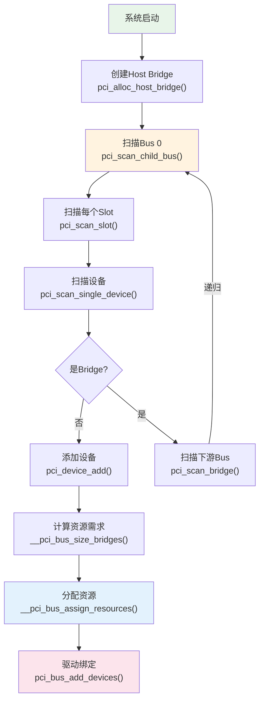
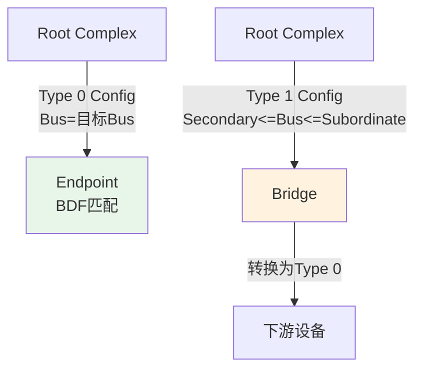
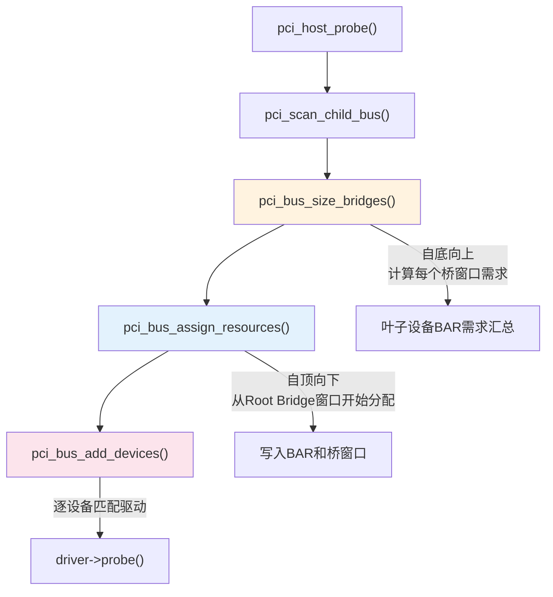
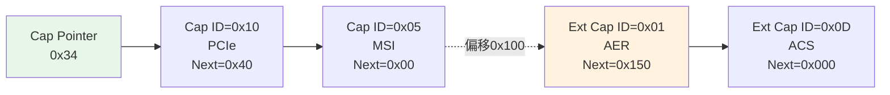
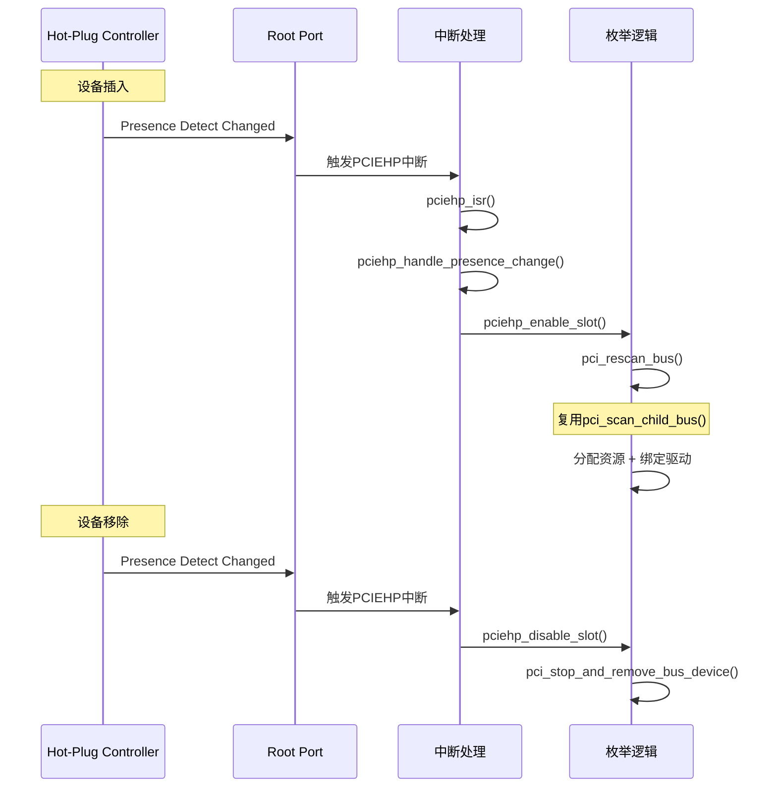
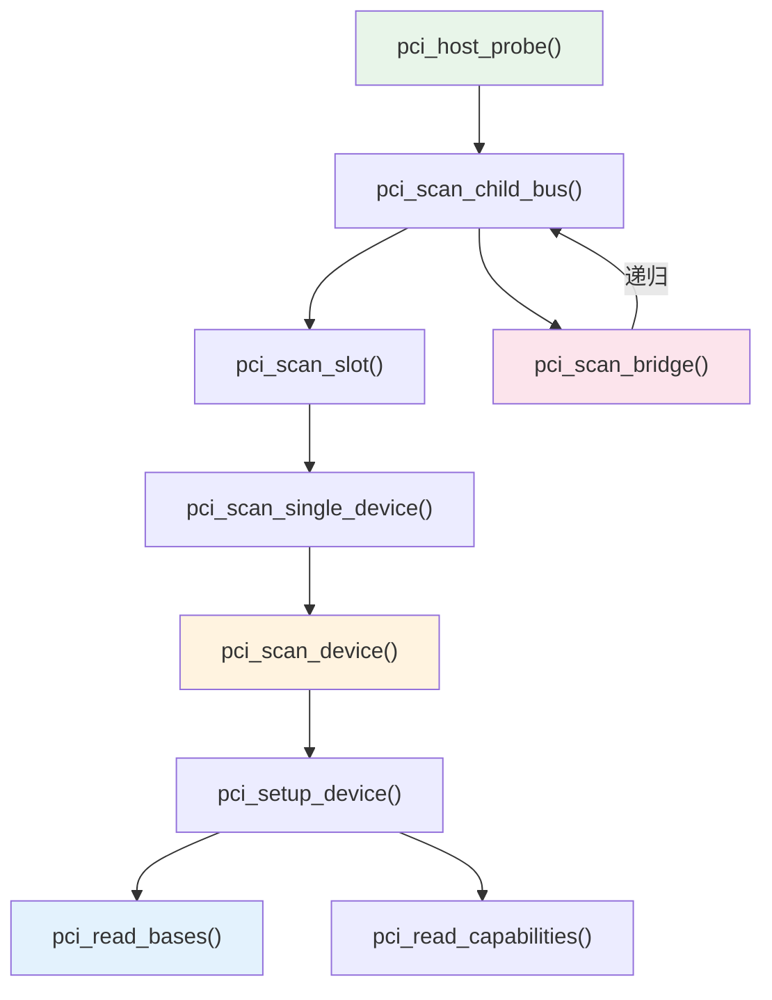

# 设备枚举流程

> 核心问题：系统启动时如何发现所有PCIe设备、建立拓扑、分配资源？
> 关联索引：[PCIe核心知识索引](./pcie-learning-resources.md) Phase 0, 2
> 前置阅读：[ECAM与配置空间](./ecam-config-space.md) · [BAR与资源分配](./bar-resource-allocation.md)

---

## 0. 前置背景

### 0.1 什么是枚举

PCIe是**热插拔不友好的发现式总线**——系统启动时，软件必须主动扫描每个可能的设备位置，判断是否有设备存在。这个过程叫**枚举（Enumeration）**。

与USB等总线不同，PCIe没有"设备插入通知"机制（Hot-Plug除外）。软件必须：
1. 遍历所有可能的Bus/Device/Function组合
2. 通过ECAM读取Vendor ID判断设备是否存在
3. 如果存在，读取配置空间获取设备信息
4. 如果是桥，递归扫描下游

### 0.2 枚举的前提条件

枚举开始前，以下条件必须已满足：

| 条件 | 由谁完成 | 说明 |
|------|---------|------|
| Host Bridge已初始化 | 固件(BIOS/UEFI)或内核 | ECAM基址已映射，iATU已配置 |
| 链路训练完成 | 硬件自动 | LTSSM进入L0状态 |
| ECAM可访问 | 内核pci_mmcfg_init() | MCFG表已解析，MMIO已映射 |
| Bus 0已创建 | 内核 | Host Bridge的Primary Bus |

### 0.3 枚举的产出

枚举完成后，内核建立了完整的设备树：

```
pci_host_bridge (Segment 0)
├── pci_bus 00
│   ├── 00:00.0 Root Port (Bridge to Bus 01)
│   ├── 00:01.0 Root Port (Bridge to Bus 02)
│   └── 00:1f.0 ISA Bridge
├── pci_bus 01
│   └── 01:00.0 NVMe SSD (Endpoint)
└── pci_bus 02
    ├── 02:00.0 Switch Upstream Port (Bridge to Bus 03)
    └── pci_bus 03
        ├── 03:00.0 Switch Downstream Port (Bridge to Bus 04)
        ├── 03:01.0 Switch Downstream Port (Bridge to Bus 05)
        ├── pci_bus 04
        │   └── 04:00.0 GPU (Endpoint)
        └── pci_bus 05
            └── 05:00.0 NIC (Endpoint)
```

---

## 1. 枚举全流程



---

## 2. 关键函数详解

### 2.1 pci_scan_child_bus() —— 总线扫描入口

```c
// drivers/pci/probe.c (简化)
unsigned int pci_scan_child_bus(struct pci_bus *bus)
{
    unsigned int devfn, max;

    // 扫描所有Device/Function
    for (devfn = 0; devfn < 0x100; devfn += 8)
        pci_scan_slot(bus, devfn);

    // 第一遍: 扫描已知桥的下游
    max = bus->busn_res.end;
    for (pass = 0; pass < 2; pass++)
        for_each_pci_bridge(dev, bus)
            max = pci_scan_bridge(bus, dev, max, pass);

    // 读取桥窗口
    pci_read_bridge_bases(bus);

    return max;
}
```

**两遍扫描的原因**：
- Pass 0：只扫描固件已配置的桥（BIOS已分配Bus号）
- Pass 1：为未配置的桥分配新Bus号并扫描

### 2.2 pci_scan_slot() —— 扫描一个Slot

```c
// drivers/pci/probe.c
int pci_scan_slot(struct pci_bus *bus, int devfn)
{
    struct pci_dev *dev;
    int fn, nr = 0;

    // 扫描Function 0
    dev = pci_scan_single_device(bus, devfn);
    if (dev) {
        nr++;
        if (dev->multifunction) {
            // 多功能设备: 扫描Function 1-7
            for (fn = next_fn(bus, dev, 0); fn > 0; fn = next_fn(bus, dev, fn)) {
                dev = pci_scan_single_device(bus, devfn + fn);
                if (dev) nr++;
            }
        }
    }

    // PCIe ASPM初始化
    if (bus->self && nr)
        pcie_aspm_init_link_state(bus->self);

    return nr;
}
```

**ARI (Alternative Routing-ID Interpretation)**：
- 标准PCIe: Function号0-7 (3位)
- ARI: Function号0-255 (8位)，`next_ari_fn()` 读取ARI Capability获取下一个Function号

### 2.3 pci_scan_single_device() —— 扫描单个设备

```c
// drivers/pci/probe.c
struct pci_dev *pci_scan_single_device(struct pci_bus *bus, int devfn)
{
    struct pci_dev *dev;

    // 检查是否已存在
    dev = pci_get_slot(bus, devfn);
    if (dev) {
        pci_dev_put(dev);
        return dev;
    }

    // 扫描设备
    dev = pci_scan_device(bus, devfn);
    if (!dev)
        return NULL;

    // 添加到总线
    pci_device_add(dev, bus);

    return dev;
}
```

### 2.4 pci_scan_device() —— 发现并初始化设备

```c
// drivers/pci/probe.c
static struct pci_dev *pci_scan_device(struct pci_bus *bus, int devfn)
{
    struct pci_dev *dev;
    u32 l;

    // 读取Vendor ID / Device ID (等待设备就绪, 最多60秒)
    if (!pci_bus_read_dev_vendor_id(bus, devfn, &l, 60*1000))
        return NULL;

    // 分配pci_dev
    dev = pci_alloc_dev(bus);
    dev->devfn = devfn;
    dev->vendor = l & 0xffff;
    dev->device = (l >> 16) & 0xffff;

    // 完整配置设备
    if (pci_setup_device(dev)) {
        pci_bus_put(dev->bus);
        kfree(dev);
        return NULL;
    }

    return dev;
}
```

**pci_bus_read_dev_vendor_id()** 的等待机制：
- 读取Vendor ID返回0xFFFFFFFF表示设备不存在或未就绪
- PCIe设备可能需要时间完成初始化（如FW加载）
- 内核最多等待60秒（CRS Software Visibility机制）

### 2.4.1 CRS (Configuration Request Retry Status)

当设备尚未就绪时，它可能返回**CRS Completion**而非正常数据：

```
正常响应:  Completion with Vendor ID
设备忙:    Completion with CRS (Status=0x10)
设备不存在: Completion with Unsupported Request (UR)
```

CRS Software Visibility机制：
- Root Port的CRS Software Visibility Enable位控制是否将CRS可见化
- 启用后，RC收到CRS时向软件返回0x0001 (Vendor ID=1)
- 软件据此判断设备存在但未就绪，应重试

```c
// drivers/pci/probe.c
int pci_bus_read_dev_vendor_id(struct pci_bus *bus, int devfn,
                                u32 *l, int crs_timeout)
{
    // 循环读取，处理CRS
    while (1) {
        pci_bus_read_config_dword(bus, devfn, PCI_VENDOR_ID, l);
        if (*l == 0xffffffff || *l == 0x00000000)
            return 0;  // 设备不存在

        if (*l == 0x0000ffff) {
            // CRS可见: Vendor ID=0x0001 → 设备忙，重试
            if (crs_timeout <= 0)
                return 0;
            msleep(100);
            crs_timeout -= 100;
            continue;
        }

        return 1;  // 正常响应
    }
}
```

> 📌 CRS是NVMe等设备启动慢时枚举不丢失的关键机制。

### 2.5 pci_setup_device() —— 设备配置

```c
// drivers/pci/probe.c (简化)
int pci_setup_device(struct pci_dev *dev)
{
    // 读取Header Type确定设备类型
    pci_read_config_byte(dev, PCI_HEADER_TYPE, &hdr_type);

    switch (dev->hdr_type) {
    case PCI_HEADER_TYPE_NORMAL:   // 普通设备
        pci_read_bases(dev, 6, PCI_ROM_ADDRESS);  // 6个BAR + ROM
        break;
    case PCI_HEADER_TYPE_BRIDGE:   // PCI桥
        pci_read_bases(dev, 2, PCI_ROM_ADDRESS_1); // 2个BAR + ROM
        break;
    case PCI_HEADER_TYPE_CARDBUS:  // CardBus桥
        pci_read_bases(dev, 1, 0);
        break;
    }

    // 读取中断信息
    pci_read_irq(dev);

    // 发现Capabilities
    pci_read_config_word(dev, PCI_STATUS, &status);
    if (status & PCI_STATUS_CAP_LIST)
        pci_read_capabilities(dev);

    return 0;
}
```

### 2.6 pci_scan_bridge() —— 桥扫描与递归

```c
// drivers/pci/probe.c (简化)
int pci_scan_bridge_extend(struct pci_bus *bus, struct pci_dev *dev,
                           int max, unsigned int available_buses, int pass)
{
    u32 buses;
    u8 primary, secondary, subordinate;

    // 读取当前桥配置
    pci_read_config_dword(dev, PCI_PRIMARY_BUS, &buses);
    primary = (buses >>  0) & 0xff;
    secondary = (buses >>  8) & 0xff;
    subordinate = (buses >> 16) & 0xff;

    if (pass == 0) {
        // Pass 0: 固件已配置的桥，直接扫描下游
        if (secondary != 0 && secondary > bus->number) {
            child = pci_find_bus(pci_domain_nr(bus), secondary);
            if (!child) {
                child = pci_add_new_bus(bus, dev, secondary);
            }
            // 递归扫描子总线
            cmax = pci_scan_child_bus_extend(child, available_buses);
        }
    } else {
        // Pass 1: 未配置的桥，分配新Bus号
        if (!pcibios_assign_all_busses())
            goto out;

        // 分配下一个可用的Bus号
        secondary = max + 1;
        subordinate = secondary + available_buses - 1;

        // 写入桥寄存器
        buses = secondary << 8 | subordinate << 16 | primary;
        pci_write_config_dword(dev, PCI_PRIMARY_BUS, buses);

        // 创建子总线并递归扫描
        child = pci_add_new_bus(bus, dev, secondary);
        cmax = pci_scan_child_bus_extend(child, buses_available);

        // 更新Subordinate Bus号
        subordinate = (u8)cmax;
        pci_write_config_dword(dev, PCI_PRIMARY_BUS,
                               primary | (secondary << 8) | (subordinate << 16));
    }
}
```

---

## 3. 桥配置寄存器

### 3.1 Bus号寄存器

```
PCI_PRIMARY_BUS (0x18):
┌──────────┬──────────────┬──────────────┬──────────────┐
│ 31:24    │ 23:16        │ 15:8         │ 7:0          │
│ Reserved │ Subordinate  │ Secondary    │ Primary      │
│          │ Bus Number   │ Bus Number   │ Bus Number   │
└──────────┴──────────────┴──────────────┴──────────────┘
```

| 字段 | 含义 |
|------|------|
| Primary Bus | 桥所在的上游总线号 |
| Secondary Bus | 桥的直接下游总线号 |
| Subordinate Bus | 桥下游所有总线中的最大号 |

> Subordinate Bus在递归扫描完成后更新，用于配置TLP路由。

### 3.2 桥窗口寄存器

```
Memory Base/Limit (0x20-0x23):
┌──────────────┬──────────────┐
│ 31:16        │ 15:0         │
│ Memory Limit │ Memory Base  │
│ (高16位)     │ (高16位)     │
└──────────────┴──────────────┘
低16位固定为0, 粒度1MB

Prefetchable Memory Base/Limit (0x24-0x2B):
├── Base Low (0x24): 高16位 + Type标志
├── Limit Low (0x26): 高16位 + Type标志
├── Base Upper (0x28): 高32位 (64-bit时)
└── Limit Upper (0x2C): 高32位 (64-bit时)

I/O Base/Limit (0x1C-0x1F):
├── Base Low: 高8/16位 + Type标志
├── Limit Low: 高8/16位 + Type标志
├── Base Upper (0x30): 高16位 (32-bit时)
└── Limit Upper (0x32): 高16位 (32-bit时)
```

### 3.3 Type 0 vs Type 1 配置事务



- **Type 0**：当Bus号等于目标Bus时，Switch/桥将TLP转换为Type 0，设备按BDF匹配
- **Type 1**：当Bus号在桥的Secondary-Subordinate范围内时，桥转发TLP到下游

---

## 4. 枚举后的资源分配

### 4.1 分配顺序



### 4.2 pcibios_resource_to_bus() / pcibios_bus_to_resource()

这两个函数是CPU物理地址与PCIe总线地址之间的桥梁：

```c
// CPU物理地址 → PCIe总线地址 (写入BAR时使用)
void pcibios_resource_to_bus(struct pci_bus *bus,
                             struct pci_bus_region *region,
                             struct resource *res)
{
    struct pci_host_bridge *bridge = find_pci_host_bridge(bus);

    // 应用offset (由iATU映射决定)
    resource_list_for_each_entry(window, &bridge->windows) {
        if (resource_contains(window->res, res)) {
            offset = window->offset;
            break;
        }
    }

    region->start = res->start - offset;
    region->end = res->end - offset;
}
```

> offset = CPU物理地址 - PCIe总线地址，由DT/ACPI中的`dma-ranges`属性定义。

---

## 5. Capability发现

枚举过程中，`pci_read_capabilities()` 扫描设备的Capability链表：



**Capability链表规则**：
- Standard Capabilities: 从0x34指向的链表，位于0x00-0xFF
- Extended Capabilities: 从0x100开始，每个占DW对齐空间
- 链表以Next=0结束

---

## 6. 实战调试

### 6.1 枚举日志

```bash
# 查看枚举过程
dmesg | grep -i "pci.*probe\|pci.*scan\|pci.*found\|new device"

# 查看拓扑
lspci -tv

# 查看特定设备的枚举信息
dmesg | grep 0000:01:00.0
```

### 6.2 常见问题

| 现象 | 原因 | 排查 |
|------|------|------|
| 设备未出现 | Vendor ID=0xFFFF (链路未训练) | 检查LTSSM状态 |
| Bus号冲突 | Subordinate Bus未正确更新 | `lspci -tv`检查拓扑 |
| BAR分配失败 | 窗口空间不足 | `dmesg \| grep "not enough"` |
| 桥窗口为0 | `pci_bus_size_bridges()`未执行 | 检查`pci_assign_unassigned_resources()` |
| 设备重复 | DWC ECAM未过滤Dev>0 | 见[ECAM文档](./ecam-config-space.md) |

### 6.3 手动触发重扫描

```bash
# 移除设备
echo 1 > /sys/bus/pci/devices/0000:01:00.0/remove

# 重新扫描
echo 1 > /sys/bus/pci/rescan

# 桥下重扫描
echo 1 > /sys/bus/pci/devices/0000:00:01.0/rescan
```

### 6.4 Hot-Plug枚举

服务器热插拔场景（如NVMe背板、GPU热替换）的枚举流程与启动时不同：



**Hot-Plug vs 启动枚举的关键区别**：

| 方面 | 启动枚举 | Hot-Plug枚举 |
|------|---------|-------------|
| 触发方式 | `pci_host_probe()` | PCIEHP中断 → `pciehp_enable_slot()` |
| Bus号分配 | 全局递增 | 复用已有Subordinate范围 |
| 资源分配 | 全局分配 | 从桥窗口剩余空间分配 |
| 链路训练 | 已完成 | 需等待LTSSM L0 |
| CRS | 60秒超时 | 同样适用 |
| DPC联动 | 不涉及 | DPC触发后需先恢复再枚举 |

```bash
# 查看Hot-Plug状态
cat /sys/bus/pci/devices/0000:00:01.0/slot_power

# 手动触发Hot-Plug事件
echo 1 > /sys/bus/pci/slots/1/power  # 上电
echo 0 > /sys/bus/pci/slots/1/power  # 下电
```

---

## 7. 代码阅读路线

| 顺序 | 文件 | 关注函数 |
|------|------|----------|
| 1 | `drivers/pci/probe.c` | `pci_scan_child_bus()`, `pci_scan_slot()`, `pci_scan_single_device()`, `pci_scan_device()`, `pci_setup_device()` |
| 2 | `drivers/pci/probe.c` | `pci_scan_bridge_extend()`, `pci_read_bridge_windows()` |
| 3 | `drivers/pci/setup-bus.c` | `__pci_bus_size_bridges()`, `__pci_bus_assign_resources()` |
| 4 | `drivers/pci/setup-res.c` | `pci_std_update_resource()` |
| 5 | `drivers/pci/pci-driver.c` | `pci_bus_add_devices()`, `__pci_device_probe()` |



---

*源码版本：Linux 6.x | 更新：2026-04-21*
