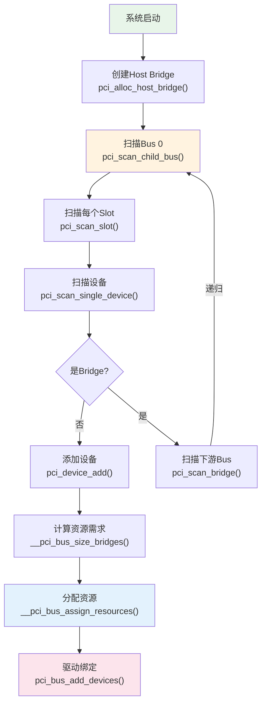
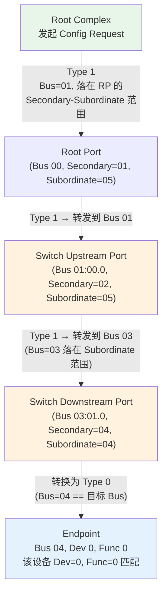
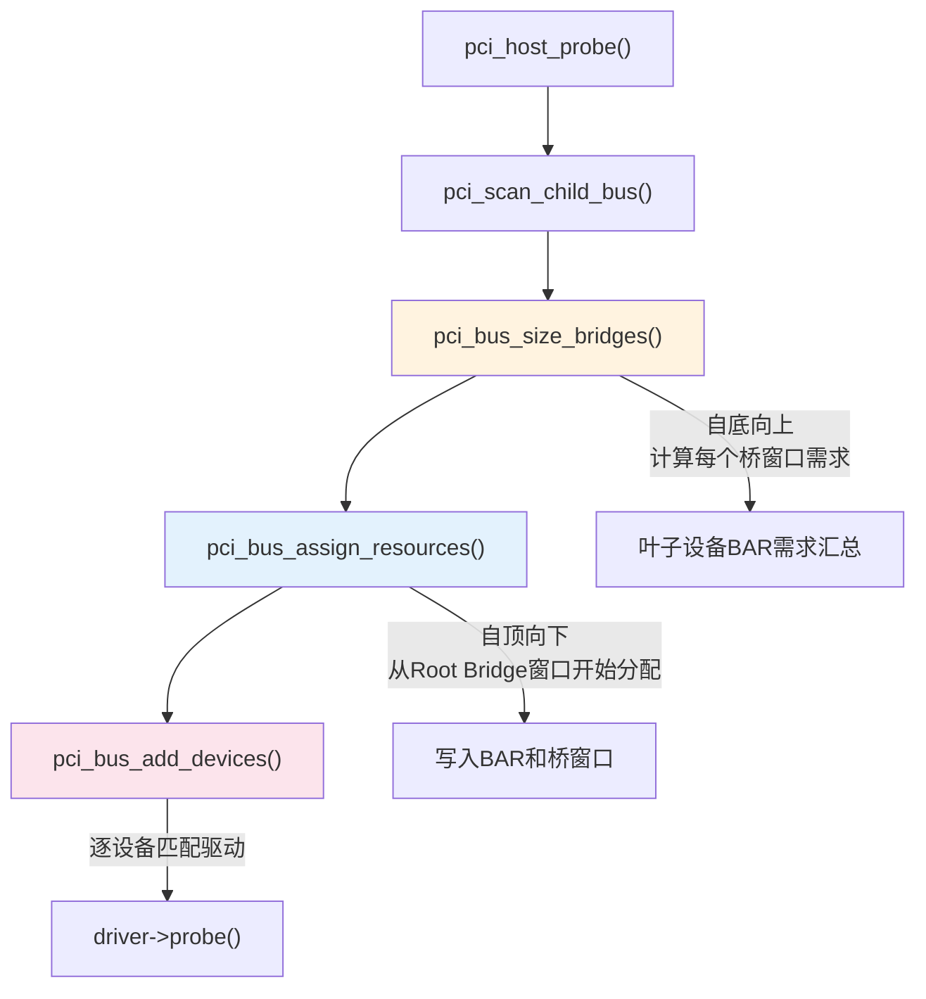
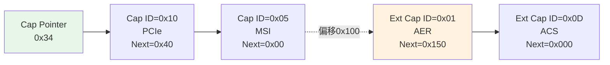
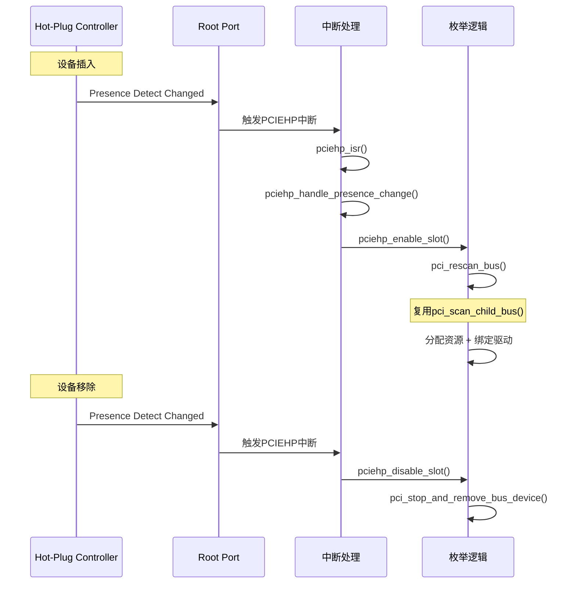
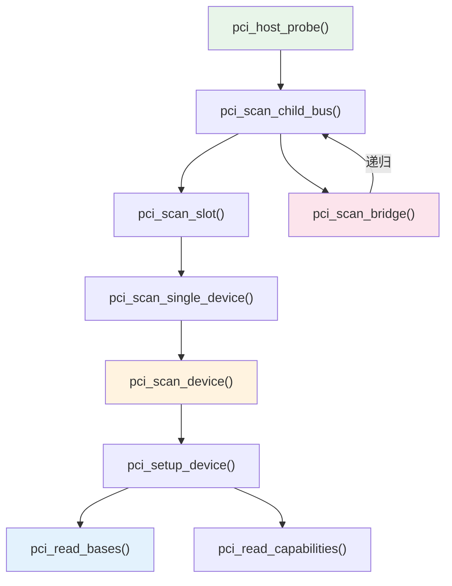

# 设备枚举流程

> 核心问题：系统启动时如何发现所有PCIe设备、建立拓扑、分配资源？
> 关联索引：[PCIe核心知识索引](./pcie-learning-resources.md) Phase 0, 2
> 前置阅读：[ECAM与配置空间](./ecam-config-space.md) · [BAR与资源分配](./bar-resource-allocation.md)

### 关键术语
| 缩写 | 全称 | 含义 |
|------|------|------|
| BDF | Bus/Device/Function | PCIe设备的三级地址编号 |
| ARI | Alternative Routing-ID Interpretation | 替代路由ID解释，扩展Function编号到8位 |
| CRS | Configuration Request Retry Status | 配置请求重试状态，设备未就绪时的特殊响应 |
| D0/D3 | Device Power State 0/3 | 设备电源状态，D0全工作，D3低功耗 |
| ASPM | Active State Power Management | 活动状态电源管理，链路层自动省电 |

---

## 0. 前置背景

### 0.1 什么是枚举

PCIe是**发现式总线**——系统启动时，软件必须主动扫描每个可能的设备位置，判断是否有设备存在。这个过程叫**枚举（Enumeration）**。

与USB等总线不同，PCIe没有"设备插入通知"机制（Hot-Plug除外）。软件必须：
1. 遍历所有可能的Bus/Device/Function组合
2. 通过ECAM读取Vendor ID判断设备是否存在
3. 如果存在，读取配置空间获取设备信息
4. 如果是桥，递归扫描下游

### 0.2 枚举的前提条件

枚举开始前，以下条件必须已满足：

| 条件 | 由谁完成 | 说明 |
|------|---------|------|
| Host Bridge已初始化 | 固件(BIOS/UEFI)或内核 | ECAM基址已映射，iATU已配置 |
| 链路训练完成 | 硬件自动 | LTSSM进入L0状态 |
| ECAM可访问 | 内核pci_mmcfg_init() | MCFG表已解析，MMIO已映射 |
| Bus 0已创建 | 内核 | Host Bridge的Primary Bus |

### 0.3 枚举的产出

枚举完成后，内核建立了完整的设备树：

```
pci_host_bridge (Segment 0)
├── pci_bus 00
│   ├── 00:00.0 Root Port (Bridge to Bus 01)
│   ├── 00:01.0 Root Port (Bridge to Bus 02)
│   └── 00:1f.0 ISA Bridge
├── pci_bus 01
│   └── 01:00.0 NVMe SSD (Endpoint)
└── pci_bus 02
    ├── 02:00.0 Switch Upstream Port (Bridge to Bus 03)
    └── pci_bus 03
        ├── 03:00.0 Switch Downstream Port (Bridge to Bus 04)
        ├── 03:01.0 Switch Downstream Port (Bridge to Bus 05)
        ├── pci_bus 04
        │   └── 04:00.0 GPU (Endpoint)
        └── pci_bus 05
            └── 05:00.0 NIC (Endpoint)
```

---

## 1. 枚举全流程



---

## 2. 关键函数详解

### 2.1 pci_scan_child_bus() —— 总线扫描入口

```c
// drivers/pci/probe.c (简化)
unsigned int pci_scan_child_bus(struct pci_bus *bus)
{
    unsigned int devfn, max;

    // 扫描所有Device/Function
    for (devfn = 0; devfn < 0x100; devfn += 8)
        pci_scan_slot(bus, devfn);

    // 第一遍: 扫描已知桥的下游
    max = bus->busn_res.end;
    for (pass = 0; pass < 2; pass++)
        for_each_pci_bridge(dev, bus)
            max = pci_scan_bridge(bus, dev, max, pass);

    // 读取桥窗口
    pci_read_bridge_bases(bus);

    return max;
}
```

**两遍扫描的原因**：
- Pass 0：只扫描固件已配置的桥（BIOS已分配Bus号）
- Pass 1：为未配置的桥分配新Bus号并扫描

### 2.2 pci_scan_slot() —— 扫描一个Slot

```c
// drivers/pci/probe.c
int pci_scan_slot(struct pci_bus *bus, int devfn)
{
    struct pci_dev *dev;
    int fn, nr = 0;

    // 扫描Function 0
    dev = pci_scan_single_device(bus, devfn);
    if (dev) {
        nr++;
        if (dev->multifunction) {
            // 多功能设备: 扫描Function 1-7
            for (fn = next_fn(bus, dev, 0); fn > 0; fn = next_fn(bus, dev, fn)) {
                dev = pci_scan_single_device(bus, devfn + fn);
                if (dev) nr++;
            }
        }
    }

    // PCIe ASPM初始化
    if (bus->self && nr)
        pcie_aspm_init_link_state(bus->self);

    return nr;
}
```

**ARI (Alternative Routing-ID Interpretation)**：
- 标准PCIe: Function号0-7 (3位)
- ARI: Function号0-255 (8位)，`next_ari_fn()` 读取ARI Capability获取下一个Function号

**ARI Capability工作原理**：

ARI是PCIe Extended Capability（ID=0x0E），位于Extended Config Space中。它只有一个关键寄存器：

```
ARI Capability (Extended Config Space):
├── Cap ID = 0x0E
├── Next Capability Offset
└── ARI Control Register (偏移+0x04)
    └── [0] ARI Capable Hierarchy (由固件/驱动设置)
```

ARI改变了Function扫描方式：

```
标准PCIe扫描:
  for (fn = 1; fn < 8; fn++)       // 固定扫描Func 0-7
    pci_scan_single_device(bus, devfn + fn)

ARI扫描:
  fn = next_ari_fn(bus, dev, 0)    // 读取Next Function Number
  while (fn) {
    pci_scan_single_device(bus, devfn + fn)
    fn = next_ari_fn(bus, dev, fn) // 继续读取下一个
  }
```

`next_ari_fn()` 读取设备的ARI Capability中的**Next Function Number**字段（PCIe Spec §7.32），该字段由硬件自动维护，指向下一个已实现的Function号。这避免了扫描未实现的Function号，也突破了8个Function的限制。

> ARI主要用于SR-IOV场景：一个PF可能创建数十个VF，标准3位Function号不够用。ARI要求整条链路（从Root Port到Endpoint）都支持ARI，由桥的ARI Capable Hierarchy位控制。详见 [SR-IOV虚拟化](./sriov-virtualization.md)。

### 2.3 pci_scan_single_device() —— 扫描单个设备

```c
// drivers/pci/probe.c
struct pci_dev *pci_scan_single_device(struct pci_bus *bus, int devfn)
{
    struct pci_dev *dev;

    // 检查是否已存在
    dev = pci_get_slot(bus, devfn);
    if (dev) {
        pci_dev_put(dev);
        return dev;
    }

    // 扫描设备
    dev = pci_scan_device(bus, devfn);
    if (!dev)
        return NULL;

    // 添加到总线
    pci_device_add(dev, bus);

    return dev;
}
```

### 2.4 pci_scan_device() —— 发现并初始化设备

```c
// drivers/pci/probe.c — 以内核源码为准，保留核心逻辑
static struct pci_dev *pci_scan_device(struct pci_bus *bus, int devfn)
{
    struct pci_dev *dev;
    u32 l;

    // 读取 Vendor ID（含 CRS 等待，最多 60 秒）
    if (!pci_bus_read_dev_vendor_id(bus, devfn, &l, 60*1000))
        return NULL;

    // 分配 pci_dev 并设置 devfn/vendor/device
    dev = pci_alloc_dev(bus);
    if (!dev)
        return NULL;
    dev->devfn = devfn;
    dev->vendor = l & 0xffff;
    dev->device = (l >> 16) & 0xffff;

    // 完整配置设备（读 Header Type、BAR、Capabilities、fixup）
    if (pci_setup_device(dev)) {
        pci_bus_put(dev->bus);
        kfree(dev);
        return NULL;
    }

    return dev;
}
```

**pci_bus_read_dev_vendor_id()** 的等待机制：
- 读取Vendor ID返回0xFFFFFFFF表示设备不存在或未就绪
- PCIe设备可能需要时间完成初始化（如FW加载）
- 内核最多等待60秒（CRS Software Visibility机制）

### 2.4.1 CRS (Configuration Request Retry Status)

当设备尚未就绪时，它可能返回**CRS Completion**而非正常数据：

```
正常响应:  Completion with Vendor ID
设备忙:    Completion with CRS (Status=0x10)
设备不存在: Completion with Unsupported Request (UR)
```

CRS Software Visibility机制：
- Root Port的CRS Software Visibility Enable位控制是否将CRS可见化
- 启用后，RC收到CRS时向软件返回0x0001 (Vendor ID=1)
- 软件据此判断设备存在但未就绪，应重试

```c
// drivers/pci/probe.c — 以内核源码为准，添加注释说明
// pci_bus_read_dev_vendor_id() 是 pci_bus_generic_read_dev_vendor_id() 的薄包装
bool pci_bus_read_dev_vendor_id(struct pci_bus *bus, int devfn, u32 *l,
                                int timeout)
{
    return pci_bus_generic_read_dev_vendor_id(bus, devfn, l, timeout);
}

// 实际工作函数
bool pci_bus_generic_read_dev_vendor_id(struct pci_bus *bus, int devfn,
                                        u32 *l, int timeout)
{
    if (pci_bus_read_config_dword(bus, devfn, PCI_VENDOR_ID, l))
        return false;

    // 空槽位返回 0xFFFFFFFF 或 0，损坏设备可能返回其他异常值
    if (PCI_POSSIBLE_ERROR(*l) || *l == 0x00000000 ||
        *l == 0x0000ffff || *l == 0xffff0000)
        return false;

    // RRS (CRS Software Visibility): Vendor ID=0x0001 表示设备存在但未就绪
    if (pci_bus_rrs_vendor_id(*l))
        return pci_bus_wait_rrs(bus, devfn, l, timeout);

    return true;
}

// CRS 等待：指数退避重试，延迟 1ms, 2ms, 4ms, ... 直到 1s
static bool pci_bus_wait_rrs(struct pci_bus *bus, int devfn, u32 *l,
                             int timeout)
{
    int delay = 1;
    if (!pci_bus_rrs_vendor_id(*l))
        return true;
    while (pci_bus_rrs_vendor_id(*l)) {
        if (delay > timeout) { /* 超时后放弃 */ return false; }
        msleep(delay);
        delay *= 2;                              // 指数退避
        if (pci_bus_read_config_dword(bus, devfn, PCI_VENDOR_ID, l))
            return false;
    }
    return true;
}
```

> CRS是NVMe等设备启动慢时枚举不丢失的关键机制。

### 2.5 pci_setup_device() —— 设备配置

```c
// drivers/pci/probe.c — 简化实现，省略了 fixup/quirk/电源/class检测 等非核心逻辑
int pci_setup_device(struct pci_dev *dev)
{
    u32 class;
    u8 hdr_type;

    hdr_type = pci_hdr_type(dev);  // VF 时从 PF 的 SR-IOV Cap 读取

    dev->hdr_type = FIELD_GET(PCI_HEADER_TYPE_MASK, hdr_type);
    dev->multifunction = FIELD_GET(PCI_HEADER_TYPE_MFD, hdr_type);
    set_pcie_port_type(dev);

    dev_set_name(&dev->dev, "%04x:%02x:%02x.%d", pci_domain_nr(dev->bus),
                 dev->bus->number, PCI_SLOT(dev->devfn),
                 PCI_FUNC(dev->devfn));

    class = pci_class(dev);          // VF 时从 PF 继承 Class Code
    dev->revision = class & 0xff;
    dev->class = class >> 8;

    dev->cfg_size = pci_cfg_space_size(dev);  // 256B 或 4KB

    /* 早期 fixup，在 BAR 探测之前执行 */
    pci_fixup_device(pci_fixup_early, dev);

    // ── 以下为设备结构相关部分 ──
    switch (dev->hdr_type) {
    case PCI_HEADER_TYPE_NORMAL:
        pci_read_irq(dev);                                           // 中断引脚
        pci_read_bases(dev, PCI_STD_NUM_BARS, PCI_ROM_ADDRESS);      // 6个BAR
        pci_subsystem_ids(dev, &dev->subsystem_vendor, &dev->subsystem_device);
        break;
    case PCI_HEADER_TYPE_BRIDGE:
        pci_read_irq(dev);                                           // 中断引脚
        pci_read_bases(dev, 2, PCI_ROM_ADDRESS_1);                   // 2个BAR
        pci_read_config_word(dev, PCI_CB_SUBSYSTEM_VENDOR_ID,
                             &dev->subsystem_vendor);
        pci_read_config_word(dev, PCI_CB_SUBSYSTEM_ID,
                             &dev->subsystem_device);
        break;
    case PCI_HEADER_TYPE_CARDBUS:
        pci_read_irq(dev);                                           // 中断引脚
        pci_read_bases(dev, 1, 0);                                   // 1个BAR
        pci_read_config_word(dev, PCI_CB_SUBSYSTEM_VENDOR_ID,
                             &dev->subsystem_vendor);
        pci_read_config_word(dev, PCI_CB_SUBSYSTEM_ID,
                             &dev->subsystem_device);
        break;
    default:
        goto bad;
    }

    pci_init_capabilities(dev);     // MSI, MSI-X, SR-IOV, AER, Resizable BAR 等
    return 0;

bad:
    return -EIO;
}
```

### 2.6 pci_scan_bridge_extend() —— 桥扫描与递归

```c
// drivers/pci/probe.c — 简化实现，省略了 CardBus、热插拔总线分配、固件总线验证等分支
static int pci_scan_bridge_extend(struct pci_bus *bus, struct pci_dev *dev,
                                  int max, unsigned int available_buses,
                                  int pass)
{
    struct pci_bus *child;
    u32 buses;
    u8 primary, secondary, subordinate;

    pci_read_config_dword(dev, PCI_PRIMARY_BUS, &buses);
    primary     = FIELD_GET(PCI_PRIMARY_BUS_MASK, buses);
    secondary   = FIELD_GET(PCI_SECONDARY_BUS_MASK, buses);
    subordinate = FIELD_GET(PCI_SUBORDINATE_BUS_MASK, buses);

    // Pass 0: 验证固件配置有效性 (Primary 必须 == 当前 Bus, Secondary > 当前 Bus)
    if (!pass && (primary != bus->number || secondary <= bus->number ||
                  secondary > subordinate))
        broken = 1;  // 固件配置无效，需要在 Pass 1 中重新分配

    if ((secondary || subordinate) && !pcibios_assign_all_busses() && !broken) {
        // 固件已配置且有效: 直接扫描下游
        if (pass)
            goto out;

        child = pci_find_bus(pci_domain_nr(bus), secondary);
        if (!child)
            child = pci_add_new_bus(bus, dev, secondary);

        // 递归扫描 (available_buses=0 表示已配置，不再分配额外总线)
        cmax = pci_scan_child_bus_extend(child, 0);
        max = max(max, cmax);
    } else {
        // 固件未配置或配置无效: 在 Pass 1 中分配总线号并扫描
        if (pass != 1)
            goto out;

        secondary = max + 1;
        subordinate = secondary;

        // 分配总线号: 普通桥 1 个总线, 热插拔桥可分配更多
        // 实际代码会计算 hotplug_buses 分配量, 这里简化为一个总线
        child = pci_add_new_bus(bus, dev, secondary);
        if (!child)
            goto out;

        // 写入桥寄存器
        pci_write_config_dword(dev, PCI_PRIMARY_BUS,
                               (subordinate << 16) | (secondary << 8) | primary);

        cmax = pci_scan_child_bus_extend(child, 0);  // 递归扫描

        // 扫描完成后更新 Subordinate 为实际发现的最大总线号
        subordinate = cmax;
        pci_write_config_dword(dev, PCI_PRIMARY_BUS,
                               (subordinate << 16) | (secondary << 8) | primary);
        max = cmax;
    }
out:
    return max;
}
```

> **注意**：`pci_scan_bridge_extend()` 是完整的桥扫描实现。`pci_scan_bridge()` 直接调用 `pci_scan_bridge_extend(bus, dev, max, 0, pass)`，即将 `available_buses` 固定为 0，用于兼容旧调用者。

---

## 3. 桥配置寄存器

### 3.1 Bus号寄存器

```
PCI_PRIMARY_BUS (0x18):
┌──────────┬──────────────┬──────────────┬──────────────┐
│ 31:24    │ 23:16        │ 15:8         │ 7:0          │
│ Reserved │ Subordinate  │ Secondary    │ Primary      │
│          │ Bus Number   │ Bus Number   │ Bus Number   │
└──────────┴──────────────┴──────────────┴──────────────┘
```

| 字段 | 含义 |
|------|------|
| Primary Bus | 桥所在的上游总线号 |
| Secondary Bus | 桥的直接下游总线号 |
| Subordinate Bus | 桥下游所有总线中的最大号 |

> Subordinate Bus在递归扫描完成后更新，用于配置TLP路由。

### 3.2 桥窗口寄存器

桥需要三类窗口寄存器来分别转发 Memory、Prefetchable Memory、I/O 事务。每种窗口由一对 Base/Limit 寄存器定义"转发范围"：下游设备地址落在 [Base, Limit] 内的事务才被转发；超出范围的被桥忽略（不上行也不下行）。

**寄存器只存储地址的高位**，低位隐含为 0，因此窗口粒度是 2 的幂。三种窗口的编码规则如下：

| 寄存器 | 偏移 | 存储的地址位 | 隐含零位 | 粒度 | 说明 |
|--------|------|-------------|---------|------|------|
| Memory Base | 0x20 [15:0] | A[31:20] | A[19:0]=0 | 1 MB | 非预取 Memory 只支持 32-bit |
| Memory Limit | 0x22 [15:0] | A[31:20] | A[19:0]=0 | 1 MB | |
| Pref. Mem Base Low | 0x24 [15:4] | A[31:20] | A[19:0]=0 | 1 MB | bit[3:0] 存 Type 编码 |
| Pref. Mem Limit Low | 0x26 [15:4] | A[31:20] | A[19:0]=0 | 1 MB | bit[3:0] 存 Type 编码 |
| Pref. Mem Base Upper | 0x28 | A[63:32] | — | 1 | 仅在 64-bit 模式下有效 |
| Pref. Mem Limit Upper | 0x2C | A[63:32] | — | 1 | 仅在 64-bit 模式下有效 |
| I/O Base Low | 0x1C [7:4] | A[15:12] | A[11:0]=0 | 4 KB | bit[3:1]保留；bit[0]=0为16-bit模式；=1启用32-bit |
| I/O Limit Low | 0x1D [7:4] | A[15:12] | A[11:0]=0 | 4 KB | |
| I/O Base Upper | 0x30 | A[31:16] | — | 1 | 仅在 32-bit I/O 模式下有效 |
| I/O Limit Upper | 0x32 | A[31:16] | — | 1 | 仅在 32-bit I/O 模式下有效 |

**关键理解**：

- Memory 窗口的粒度是 1 MB。例如 Base = 0xFFF0、Limit = 0xFFF4，实际窗口为 [0xFFF0_0000, 0xFFF4_FFFF]，大小 5 MB（5 个对齐到 1 MB 的区间）。
- Prefetchable Memory 的 `Type 编码`（bit[3:0]）指示 Base/Limit 按 32-bit 还是 64-bit 解释。Type=0 表示 32-bit（Base Upper / Limit Upper 无效），Type=1 表示 64-bit（合并四字节形成 64-bit 地址）。颗粒度同样是 1 MB。
- I/O 窗口的 `Type 标志`（Base Low 的 bit[0]）区分 16-bit 和 32-bit 模式。16-bit 模式下地址高 4 bit 在 Base/Limit Low 的 bit[7:4]，低 12 bit 为 0（粒度 4 KB）；32-bit 模式下使用 Base/Limit Upper 寄存器提供 A[31:16]。
- 这三种窗口在 `__pci_bus_size_bridges()` 中按下游设备的 BAR 需求汇总计算大小，在 `__pci_bus_assign_resources()` 中确定具体 Base 值并写入寄存器（见 [§4.1 分配顺序](#41-分配顺序)）。

### 3.3 Type 0 vs Type 1 配置事务

配置事务分为两种类型，区别在于：**Type 0 到达目标设备，Type 1 穿透桥向下游转发**。



**转发规则**：

| 场景 | 桥收到的事务类型 | 桥的行为 |
|------|----------------|---------|
| Bus 号 == 桥所在 Bus | 无关（不会收到） | — |
| Bus 号 ∈ [Secondary, Subordinate] | Type 1 | 转发到下游，若 Bus == Secondary 则转换成 Type 0 |
| Bus 号 ∉ [Secondary, Subordinate] | Type 1 | 忽略（不转发） |

**Type 0 的终结**：设备收到 Type 0 配置事务时，检查 TLP Header 中的 Device/Function 号是否与自己匹配。匹配则响应，否则忽略。这样就实现了"逐总线、逐设备"的精确定址。整个 PCIe 树的最后一层桥（离目标设备最近的桥）负责把 Type 1 转换为 Type 0。

> Type 0 / Type 1 的区分与 §3.1 中的 Primary/Secondary/Subordinate Bus 编号直接关联。如果桥的 Bus 号配置错误，配置事务无法到达目标设备——这就是 `pci_scan_bridge()` 必须正确分配 Bus 号的原因。

---

## 4. 枚举后的资源分配

### 4.1 分配顺序



### 4.2 pcibios_resource_to_bus() / pcibios_bus_to_resource()

这两个函数是 CPU 物理地址与 PCIe 总线地址之间的桥梁。之所以需要转换，是因为 Host Bridge 可以将一段 CPU 物理地址**偏移地**映射到 PCIe 总线地址空间。

**转换公式**：`PCIe总线地址 = CPU物理地址 - offset`

其中 offset 由 Host Bridge 的 `windows` 列表（即 `pci_host_bridge->windows`）定义——每个 window 描述一段 CPU 物理地址范围对应的 offset 值。

**具体示例**：假设 SoC 的 DDR 从 0x8000_0000 开始，RC 将 CPU 地址 [0x8000_0000, 0x8FFF_FFFF] 映射到 PCIe 总线地址 [0x0000_0000, 0x0FFF_FFFF]：

```
window->res  = [0x8000_0000, 0x8FFF_FFFF]  (CPU物理地址范围)
window->offset = 0x8000_0000                  (偏移量)

转换:
  res->start = 0x8002_0000  (CPU 物理地址)
  → region->start = 0x8002_0000 - 0x8000_0000 = 0x0002_0000  (PCIe 总线地址)
  → 写入BAR的值为 0x0002_0000
```

```c
// CPU物理地址 → PCIe总线地址 (写入BAR时使用)
void pcibios_resource_to_bus(struct pci_bus *bus,
                             struct pci_bus_region *region,
                             struct resource *res)
{
    struct pci_host_bridge *bridge = find_pci_host_bridge(bus);

    // 遍历 windows 列表，找到包含该 resource 的 window
    resource_list_for_each_entry(window, &bridge->windows) {
        if (resource_contains(window->res, res)) {
            offset = window->offset;
            break;
        }
    }

    region->start = res->start - offset;
    region->end = res->end - offset;
}
```

> offset = CPU物理地址 - PCIe总线地址。在 ACPI/UEFI 平台，windows 列表从 Host Bridge 的 `_CRS` 资源描述符获取；在嵌入式平台（设备树），由 `ranges` 属性定义。如果 Host Bridge 没有做地址偏移（CPU 物理地址 == PCIe 总线地址），offset = 0，两个函数简单地拷贝地址值。

### 4.3 枚举性能优化

枚举是系统启动的关键路径，Linux内核做了多项优化：

**BAR掩码批量读取**：`pci_read_bases()` 先关闭解码，一次性调用`__pci_size_stdbars()`读取所有BAR掩码，再恢复解码，最后逐个解析。这比逐个BAR开关解码减少了N次Command寄存器写入（N=BAR数量）。在虚拟化环境中，每次配置空间写操作可能触发VM Exit，批量读取的开销降低更为显著。

**CRS超时机制**：`pci_bus_read_dev_vendor_id()` 对未就绪设备最多等待60秒，使用指数退避轮询（初始延迟1ms，每次翻倍，上限1s）而非忙等。

**两遍桥扫描**：Pass 0只扫描固件已配置的桥（快速路径），Pass 1才分配新Bus号。大多数系统在Pass 0就能完成大部分工作。

**D3cold设备跳过**：枚举时如果设备处于D3cold电源状态，配置空间读取返回0xFFFFFFFF，内核会跳过该设备而非报错。设备在电源恢复后可通过rescan重新发现。

### 4.4 枚举过程中的电源状态

枚举时内核对设备电源状态的处理：

```
枚举前: 设备可能处于任意电源状态 (由固件决定)
  ├── D0 (全工作): 正常枚举
  ├── D3hot (低功耗): 配置空间仍可访问，但设备功能受限
  └── D3cold (断电): 配置空间不可访问，Vendor ID = 0xFFFFFFFF

枚举时:
  1. pci_scan_device() 读取Vendor ID
     → 0xFFFFFFFF: 设备不存在或D3cold，跳过
     → 其他值: 设备存在，继续配置
  2. pci_setup_device() 设置初始电源状态
     → 默认将设备置于D0
     → 设置 pci_dev->current_state = PCI_D0
  3. 驱动绑定后，驱动可主动管理电源状态 (runtime PM)
```

> 内核不会在枚举阶段主动将设备从D3cold唤醒。如果固件将设备置于D3cold，该设备在枚举时不可见，需要固件或驱动在后续阶段恢复。

---

## 5. Capability发现

枚举过程中，`pci_read_capabilities()` 扫描设备的Capability链表：



**Capability链表规则**：
- Standard Capabilities: 从0x34指向的链表，位于0x00-0xFF
- Extended Capabilities: 从0x100开始，每个占DW对齐空间
- 链表以Next=0结束

---

## 6. 实战调试

### 6.1 枚举日志

```bash
# 查看枚举过程
dmesg | grep -i "pci.*probe\|pci.*scan\|pci.*found\|new device"

# 查看拓扑
lspci -tv

# 查看特定设备的枚举信息
dmesg | grep 0000:01:00.0
```

### 6.2 常见问题

| 现象 | 原因 | 排查 |
|------|------|------|
| 设备未出现 | Vendor ID=0xFFFF (链路未训练) | 检查LTSSM状态 |
| Bus号冲突 | Subordinate Bus未正确更新 | `lspci -tv`检查拓扑 |
| BAR分配失败 | 窗口空间不足 | `dmesg \| grep "not enough"` |
| 桥窗口为0 | `pci_bus_size_bridges()`未执行 | 检查`pci_assign_unassigned_resources()` |
| 设备重复 | DWC ECAM未过滤Dev>0 | 见[ECAM文档](./ecam-config-space.md) |

### 6.3 手动触发重扫描

```bash
# 移除设备
echo 1 > /sys/bus/pci/devices/0000:01:00.0/remove

# 重新扫描
echo 1 > /sys/bus/pci/rescan

# 桥下重扫描
echo 1 > /sys/bus/pci/devices/0000:00:01.0/rescan
```

### 6.4 Hot-Plug枚举

服务器热插拔场景（如NVMe背板、GPU热替换）的枚举流程与启动时不同，完整的热插拔机制（Slot寄存器、pciehp状态机、中断处理）详见 [Hot-Plug机制与pciehp驱动](./hotplug-mechanism.md)，本节仅聚焦枚举侧的差异。



**Hot-Plug vs 启动枚举的关键区别**：

| 方面 | 启动枚举 | Hot-Plug枚举 |
|------|---------|-------------|
| 触发方式 | `pci_host_probe()` | PCIEHP中断 → `pciehp_enable_slot()` |
| Bus号分配 | 全局递增 | 复用已有Subordinate范围 |
| 资源分配 | 全局分配 | 从桥窗口剩余空间分配 |
| 链路训练 | 已完成 | 需等待LTSSM L0 |
| CRS | 60秒超时 | 同样适用 |
| DPC联动 | 不涉及 | DPC触发后需先恢复再枚举 |

```bash
# 查看Hot-Plug状态
cat /sys/bus/pci/devices/0000:00:01.0/slot_power

# 手动触发Hot-Plug事件
echo 1 > /sys/bus/pci/slots/1/power  # 上电
echo 0 > /sys/bus/pci/slots/1/power  # 下电
```

---

## 7. 代码阅读路线

| 顺序 | 文件 | 关注函数 |
|------|------|----------|
| 1 | `drivers/pci/probe.c` | `pci_scan_child_bus()`, `pci_scan_slot()`, `pci_scan_single_device()`, `pci_scan_device()`, `pci_setup_device()` |
| 2 | `drivers/pci/probe.c` | `pci_scan_bridge_extend()`, `pci_read_bridge_windows()` |
| 3 | `drivers/pci/setup-bus.c` | `__pci_bus_size_bridges()`, `__pci_bus_assign_resources()` |
| 4 | `drivers/pci/setup-res.c` | `pci_std_update_resource()` |
| 5 | `drivers/pci/pci-driver.c` | `pci_bus_add_devices()`, `__pci_device_probe()` |



---

## 参考资料

- [PCIe Base Specification 6.0](https://pcisig.com/specifications) — §2.2.6 配置请求, §7.5.1.1 Type 0/1 Header
- [Linux Kernel Source](https://git.kernel.org/) — `drivers/pci/probe.c`, `drivers/pci/setup-bus.c`
- [PCI Firmware Specification 3.3](https://uefi.org/specifications) — 固件与OS的枚举协作

---

上一篇：[BAR与资源分配](./bar-resource-allocation.md) | 下一篇：[MSI/MSI-X中断机制](./msi-interrupt.md)

---

*源码版本：Linux 6.x | 更新：2026-04-21*
