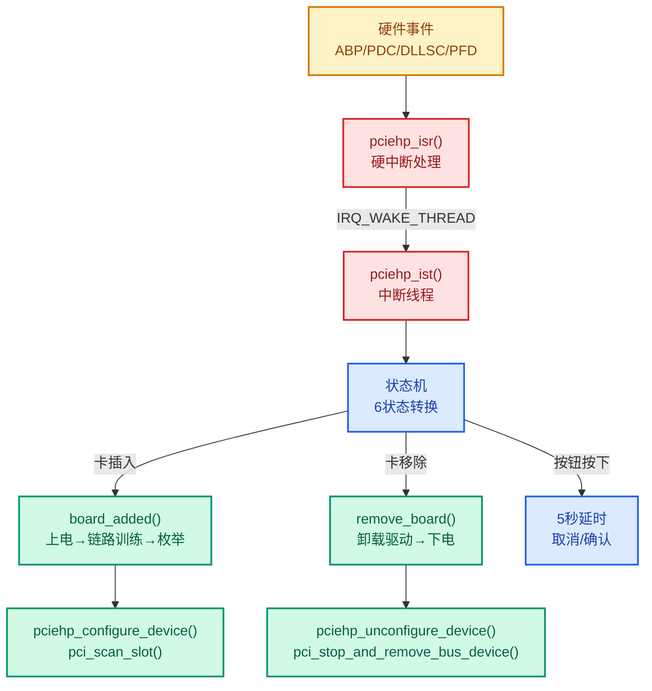
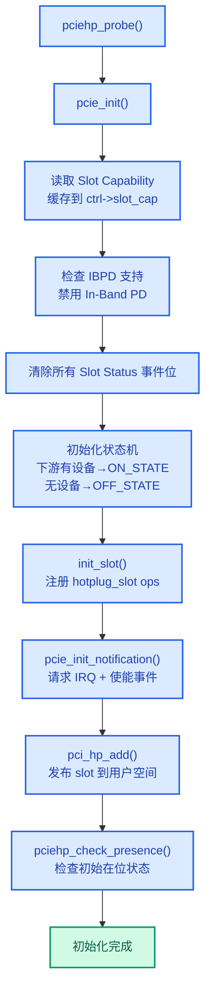
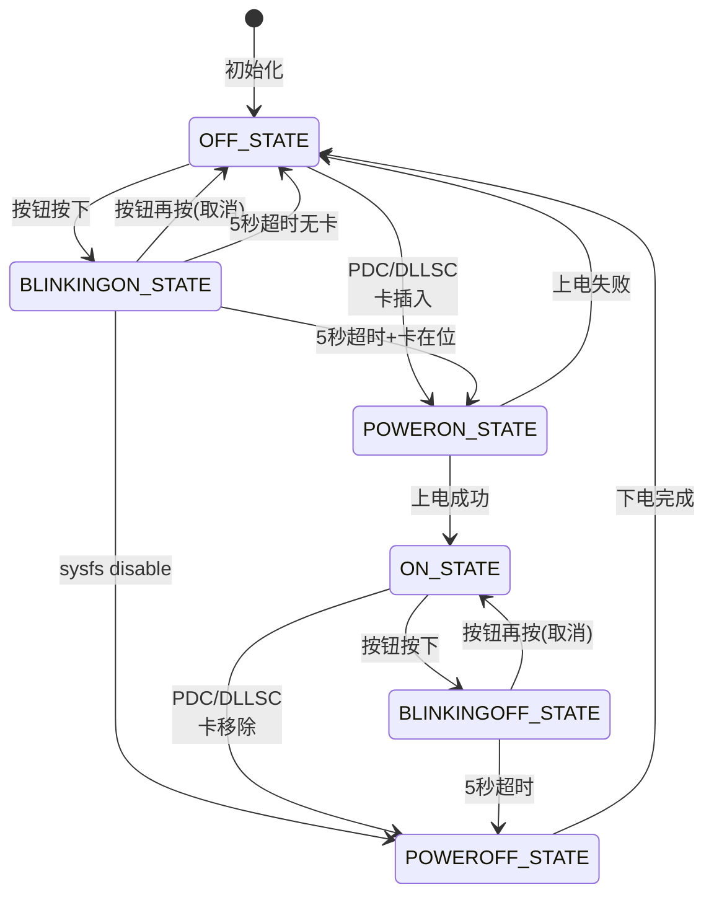
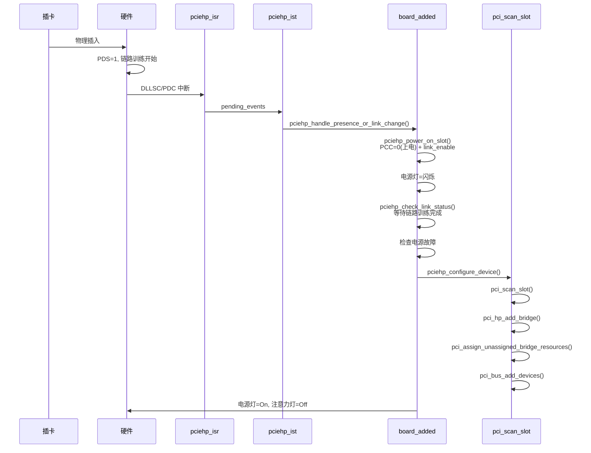

# PCIe Hot-Plug 机制与 pciehp 驱动

> 从硬件信号到内核驱动的完整热插拔流程，聚焦 Slot 寄存器语义、pciehp 状态机与中断处理。
> **工程师视角**：理解热插拔事件从硬件中断到设备枚举/移除的完整路径，是调试 NVMe 热拔插、Thunderbolt 拓扑变化、DPC 恢复后设备消失等问题的关键。

### 关键术语

| 缩写 | 全称 | 含义 |
|------|------|------|
| HPC | Hot-Plug Controller | 热插拔控制器，PCIe Spec 中指 Slot Capability 中 HPC=1 的端口 |
| MRL | Manually Operated Retention Latch | 手动保留锁，检测插槽锁扣状态 |
| PDS | Presence Detect State | 在位检测状态位，指示卡是否在位 |
| DLLSC | Data Link Layer State Changed | 数据链路层状态变化事件 |
| PDC | Presence Detect Changed | 在位检测变化事件 |
| ABP | Attention Button Pressed | 注意力按钮按下事件 |
| PFD | Power Fault Detected | 电源故障检测事件 |
| CC | Command Completed | 命令完成事件 |
| DPC | Downstream Port Containment | 下游端口遏制，错误隔离机制 |
| IST | Interrupt Service Thread | pciehp 的中断服务线程 |
| NCCS | No Command Completed Support | 不需要等待命令完成，Slot Capability 位 |
| IBPD | In-Band Presence Detect | 带内在位检测，通过 PCIe 链路信号检测卡在位 |
| DLLLA | Data Link Layer Link Active | 数据链路层链路活跃信号，指示链路训练完成 |

---

## 1. 概述

### 1.1 前置知识

| 需要了解 | 参考文档 |
|----------|----------|
| PCIe 配置空间与 Capability 结构 | [ECAM与配置空间](./ecam-config-space.md) |
| 枚举流程与设备扫描 | [枚举流程](./enumeration-flow.md) |
| BAR 分配与资源管理 | [BAR与资源分配](./bar-resource-allocation.md) |
| MSI/MSI-X 中断机制 | [MSI中断](./msi-interrupt.md) |

### 1.2 计划性移除 vs 意外拔出

PCIe Spec §6.7 统一使用 **Hot-Plug** 术语，核心区分在于移除是否通知 OS：

| 对比维度 | 计划性移除 (Safe Removal) | 意外拔出 (Surprise Removal) |
|---------|--------------------------|---------------------------|
| 触发方式 | 注意力按钮 5 秒确认 / sysfs 写 power | 直接拔卡，无事先通知 |
| 前提条件 | Slot Cap HPC=1 | Slot Cap HPS=1 |
| 驱动回调 | `pci_device_remove()` 正常路径 | 驱动需处理 MMIO 返回 `0xFFFFFFFF` |
| 数据安全 | 有保障（驱动先 quiesce） | 无保障（可能正在 DMA） |
| 设备标记 | 正常移除 | `pci_dev_set_disconnected()` |

> **术语说明**：Hot-Swap 常见于 CompactPCI 等规范，PCIe Spec 中不使用此术语。本文统一使用 Hot-Plug，涵盖上述两种场景。

### 1.3 全景视图



---

## 2. 硬件基础：Slot 寄存器

### 2.1 Slot Capability（偏移 0x14）

Slot Capability 是只读寄存器，描述端口的热插拔硬件能力：

| 位域 | 名称 | 含义 |
|------|------|------|
| [0] | ABP | Attention Button Present，是否有注意力按钮 |
| [1] | PCP | Power Controller Present，是否有电源控制器 |
| [2] | MRLSP | MRL Sensor Present，是否有锁扣传感器 |
| [3] | AIP | Attention Indicator Present，是否有注意力指示灯 |
| [4] | PIP | Power Indicator Present，是否有电源指示灯 |
| [5] | HPS | Hot-Plug Surprise，支持意外拔出 |
| [6] | HPC | Hot-Plug Capable，端口支持热插拔 |
| [14:7] | SPLV | Slot Power Limit Value，插槽功率限制值 |
| [16:15] | SPLS | Slot Power Limit Scale，功率限制比例（0=1x, 1=0.1x, 2=0.01x, 3=0.001x） |
| [17] | EIP | Electromechanical Interlock Present，是否有机电联锁 |
| [18] | NCCS | No Command Completed Support，不需要等待命令完成 |
| [31:19] | PSN | Physical Slot Number，物理插槽编号 |

**HPC 与 HPS 的区别**：
- **HPC=1**：端口具备热插拔控制器，OS 可以通过 Slot Control 寄存器控制上电/下电
- **HPS=1**：端口支持意外拔出，即卡被突然拔走时硬件不会损坏，OS 能正确处理

### 2.2 Slot Control（偏移 0x18）

Slot Control 是读写寄存器，OS 通过它控制热插拔行为和中断使能：

| 位域 | 名称 | 含义 |
|------|------|------|
| [0] | ABPE | Attention Button Pressed Enable |
| [1] | PFDE | Power Fault Detected Enable |
| [2] | MRLSCE | MRL Sensor Changed Enable |
| [3] | PDCE | Presence Detect Changed Enable |
| [4] | CCIE | Command Completed Interrupt Enable |
| [5] | HPIE | Hot-Plug Interrupt Enable（总开关） |
| [7:6] | AIC | Attention Indicator Control（00=保留, 01=On, 10=Blink, 11=Off） |
| [9:8] | PIC | Power Indicator Control（同 AIC 编码） |
| [10] | PCC | Power Controller Control（0=Power On, 1=Power Off） |
| [11] | EIC | Electromechanical Interlock Control |
| [12] | DLLSCE | Data Link Layer State Changed Enable |
| [13] | ASPLD | Auto Slot Power Limit Disable |
| [14] | IBPD | In-Band Presence Detect Disable |

**关键语义**：
- **HPIE 是中断总开关**：只有 HPIE=1 时，ABPE/PFDE/PDCE 等事件才能产生中断
- **PCC 控制插槽电源**：写 0 上电，写 1 下电
- **命令完成协议**：如果 NCCS=0，每次写 Slot Control 后必须等待 CC 事件（1 秒超时），才能写下一次

### 2.3 Slot Status（偏移 0x1A）

Slot Status 反映当前状态和事件，事件位写 1 清除（Write-1-to-Clear）：

| 位域 | 名称 | 含义 |
|------|------|------|
| [0] | ABP | Attention Button Pressed（事件） |
| [1] | PFD | Power Fault Detected（事件） |
| [2] | MRLSC | MRL Sensor Changed（事件） |
| [3] | PDC | Presence Detect Changed（事件） |
| [4] | CC | Command Completed（事件） |
| [5] | MRLSS | MRL Sensor State（0=Closed, 1=Open）（状态） |
| [6] | PDS | Presence Detect State（0=Empty, 1=Present）（状态） |
| [7] | EIS | Electromechanical Interlock Status（状态） |
| [8] | DLLSC | Data Link Layer State Changed（事件） |

**事件 vs 状态**：
- **事件位**（ABP/PFD/MRLSC/PDC/CC/DLLSC）：变化时置 1，写 1 清除。用于触发中断
- **状态位**（MRLSS/PDS/EIS）：反映当前硬件状态，只读

**PDS 与 DLLSC 的关系**：
- PDS 由插槽的物理引脚信号驱动，卡插入时置 1
- DLLSC 由数据链路层的 DLLLA（Data Link Layer Link Active）信号驱动，链路训练完成后置 1
- 卡插入时：PDS 先变 1，DLLSC 后变 1（链路训练需要时间）
- 卡拔出时：DLLSC 先变 0（链路断开），PDS 后变 0

---

## 3. pciehp 驱动架构

### 3.1 驱动注册与 Port Service 模型

pciehp 是 PCIe Port Bus Driver 的一个 Service，与 PME、AER 等共享同一个 Root Port/Downstream Port：

```c
// drivers/pci/hotplug/pciehp_core.c
static struct pcie_port_service_driver hpdriver_portdrv = {
    .name      = "pciehp",
    .port_type = PCIE_ANY_PORT,
    .service   = PCIE_PORT_SERVICE_HP,
    .probe     = pciehp_probe,
    .remove    = pciehp_remove,
    .slot_reset = pciehp_slot_reset,
};
```

**探测条件**（`pciehp_probe`）：
1. `dev->service == PCIE_PORT_SERVICE_HP`（由 Port Driver 分配）
2. 端口必须有 `subordinate` 总线（已分配 Bus Number）
3. Slot Capability 中 HPC=1（或固件通过 ACPI 声明 `native_pcie_hotplug`）

**Port Service 中断共享**：PME、Hot-Plug、Bandwidth Notification 共享同一个 MSI/MSI-X 向量，pciehp_isr 通过读取 Slot Status 判断是否为热插拔事件。

### 3.2 controller 结构体

pciehp 的核心数据结构，每个热插拔端口一个实例：

```c
// drivers/pci/hotplug/pciehp.h
struct controller {
    struct pcie_device *pcie;
    u32 slot_cap;
    u16 slot_ctrl;
    struct mutex ctrl_lock;       // 串行化 Slot Control 写入
    unsigned long cmd_started;    // 上次写 Slot Control 的 jiffies
    unsigned int cmd_busy:1;      // 正在等待 Command Completed
    wait_queue_head_t queue;      // 等待 CC 事件
    atomic_t pending_events;      // ISR → IST 的事件传递
    u8 state;                     // 状态机当前状态
    struct mutex state_lock;      // 保护状态机
    struct delayed_work button_work; // 5 秒按钮延时
    struct rw_semaphore reset_lock;  // 防止 reset 期间访问链路/在位状态
    unsigned int depth;           // 嵌套热插拔端口深度
};
```

### 3.3 初始化流程



**`pcie_enable_notification()` 使能的事件**：

| 事件 | 使能条件 | 原因 |
|------|---------|------|
| DLLSCE | 始终使能 | 链路 Up/Down 是最可靠的热插拔检测信号 |
| ABPE | ATTN_BUTTN(ctrl) | 有按钮时使能按钮事件 |
| PDCE | !ATTN_BUTTN(ctrl) | 无按钮时使能在位检测事件 |
| HPIE | !pciehp_poll_mode | 中断模式下使能热插拔中断 |
| CCIE | !poll_mode && !NO_CMD_CMPL | 需要命令完成通知时使能 |

---

## 4. 状态机

### 4.1 六状态定义

```c
// drivers/pci/hotplug/pciehp.h
#define OFF_STATE         0   // 插槽下电，无下游设备
#define BLINKINGON_STATE  1   // 5秒后上电，电源灯闪烁
#define BLINKINGOFF_STATE 2   // 5秒后下电，电源灯闪烁
#define POWERON_STATE     3   // 正在上电
#define POWEROFF_STATE    4   // 正在下电
#define ON_STATE          5   // 插槽上电，下游设备已枚举
```

### 4.2 状态转换图



### 4.3 注意力按钮的 5 秒延时

按钮按下后 pciehp 不会立即执行上电/下电，而是进入 BLINKING 状态并启动 5 秒延时：

```c
// drivers/pci/hotplug/pciehp_ctrl.c
void pciehp_handle_button_press(struct controller *ctrl)
{
    mutex_lock(&ctrl->state_lock);
    switch (ctrl->state) {
    case OFF_STATE:
        ctrl->state = BLINKINGON_STATE;
        pciehp_set_indicators(ctrl, PCI_EXP_SLTCTL_PWR_IND_BLINK,
                              PCI_EXP_SLTCTL_ATTN_IND_OFF);
        schedule_delayed_work(&ctrl->button_work, 5 * HZ);
        break;
    case ON_STATE:
        ctrl->state = BLINKINGOFF_STATE;
        pciehp_set_indicators(ctrl, PCI_EXP_SLTCTL_PWR_IND_BLINK,
                              PCI_EXP_SLTCTL_ATTN_IND_OFF);
        schedule_delayed_work(&ctrl->button_work, 5 * HZ);
        break;
    case BLINKINGOFF_STATE:
    case BLINKINGON_STATE:
        // 再次按下按钮 → 取消操作
        cancel_delayed_work(&ctrl->button_work);
        // 恢复原状态...
        break;
    }
    mutex_unlock(&ctrl->state_lock);
}
```

**设计意图**：5 秒延时给操作员反悔的机会。如果误按按钮，在 5 秒内再按一次即可取消。电源灯闪烁提示操作员"即将执行操作"。

---

## 5. 中断处理

### 5.1 两级中断架构

pciehp 使用 `request_threaded_irq()` 注册硬中断处理函数和中断线程：

```c
// drivers/pci/hotplug/pciehp_hpc.c
retval = request_threaded_irq(irq, pciehp_isr, pciehp_ist,
                              IRQF_SHARED, "pciehp", ctrl);
```

| 层级 | 函数 | 上下文 | 职责 |
|------|------|--------|------|
| 硬中断 | `pciehp_isr()` | 中断上下文 | 读取 Slot Status，筛选事件位，存入 `pending_events` |
| 中断线程 | `pciehp_ist()` | 进程上下文 | 执行状态机转换、上电/下电、设备枚举/移除 |

### 5.2 硬中断处理（pciehp_isr）

```c
// drivers/pci/hotplug/pciehp_hpc.c（简化）
static irqreturn_t pciehp_isr(int irq, void *dev_id)
{
    // 1. 读取 Slot Status，只保留事件位
    status &= PCI_EXP_SLTSTA_ABP | PCI_EXP_SLTSTA_PFD |
              PCI_EXP_SLTSTA_PDC | PCI_EXP_SLTSTA_CC |
              PCI_EXP_SLTSTA_DLLSC;

    // 2. 写1清除已读取的事件
    pcie_capability_write_word(pdev, PCI_EXP_SLTSTA, status);

    // 3. MSI 模式下重读，防止 read-clear 之间丢失事件
    if (pci_dev_msi_enabled(pdev) && !pciehp_poll_mode)
        goto read_status;

    // 4. Command Completed 直接唤醒等待者，不延迟到 IST
    if (events & PCI_EXP_SLTSTA_CC) {
        ctrl->cmd_busy = 0;
        wake_up(&ctrl->queue);
        events &= ~PCI_EXP_SLTSTA_CC;
    }

    // 5. 其他事件存入 pending_events，唤醒 IST
    atomic_or(events, &ctrl->pending_events);
    return IRQ_WAKE_THREAD;
}
```

**MSI 重读的必要性**：PCIe Spec §6.7.3.4 规定，MSI 模式下所有事件位必须为 0 端口才会发送新中断。如果在 read 和 clear 之间有新事件置位，端口不会再发中断，必须重读。

### 5.3 中断线程（pciehp_ist）

```c
// drivers/pci/hotplug/pciehp_hpc.c（简化）
static irqreturn_t pciehp_ist(int irq, void *dev_id)
{
    events = atomic_xchg(&ctrl->pending_events, 0);

    // 1. 处理注意力按钮
    if (events & PCI_EXP_SLTSTA_ABP)
        pciehp_handle_button_press(ctrl);

    // 2. 处理电源故障
    if (events & PCI_EXP_SLTSTA_PFD) {
        pciehp_set_indicators(ctrl, PCI_EXP_SLTCTL_PWR_IND_OFF,
                              PCI_EXP_SLTCTL_ATTN_IND_ON);
    }

    // 3. 过滤 DPC 恢复和 SBR 产生的虚假链路变化
    if ((events & (PCI_EXP_SLTSTA_PDC | PCI_EXP_SLTSTA_DLLSC)) &&
        (pci_dpc_recovered(pdev) || pci_hp_spurious_link_change(pdev)) &&
        ctrl->state == ON_STATE) {
        events &= ~ignored_events;
        pciehp_ignore_link_change(ctrl, pdev, irq, ignored_events);
    }

    // 4. DISABLE_SLOT 优先级高于 PDC/DLLSC
    if (events & DISABLE_SLOT)
        pciehp_handle_disable_request(ctrl);
    else if (events & (PCI_EXP_SLTSTA_PDC | PCI_EXP_SLTSTA_DLLSC))
        pciehp_handle_presence_or_link_change(ctrl, events);

    return IRQ_HANDLED;
}
```

**事件优先级**：`DISABLE_SLOT > PDC/DLLSC`。如果用户通过 sysfs 请求禁用插槽，同时卡被拔出，优先执行安全移除路径。

### 5.4 轮询模式

当中断不可用时，pciehp 支持轮询模式（`pciehp_poll_mode=1`）：

```c
// drivers/pci/hotplug/pciehp_hpc.c
static int pciehp_poll(void *data)
{
    schedule_timeout_idle(10 * HZ);  // 启动延迟 10 秒

    while (!kthread_should_stop()) {
        while (pciehp_isr(IRQ_NOTCONNECTED, ctrl) == IRQ_WAKE_THREAD ||
               atomic_read(&ctrl->pending_events))
            pciehp_ist(IRQ_NOTCONNECTED, ctrl);

        if (pciehp_poll_time <= 0 || pciehp_poll_time > 60)
            pciehp_poll_time = 2;
        schedule_timeout_idle(pciehp_poll_time * HZ);
    }
    return 0;
}
```

轮询模式通过内核线程实现，默认 2 秒轮询一次。适用于中断控制器不支持 MSI 或中断线路有问题的平台。

---

## 6. 设备添加与移除

### 6.1 卡插入流程



**`pciehp_configure_device()` 的关键步骤**：

```c
// drivers/pci/hotplug/pciehp_pci.c
int pciehp_configure_device(struct controller *ctrl)
{
    pci_lock_rescan_remove();

    // 1. 扫描设备
    num = pci_scan_slot(parent, PCI_DEVFN(0, 0));

    // 2. 为下游桥分配 Bus Number 和窗口
    for_each_pci_bridge(dev, parent)
        pci_hp_add_bridge(dev);

    // 3. 分配 BAR 资源
    pci_assign_unassigned_bridge_resources(bridge);

    // 4. 绑定驱动
    //    释放 reset_lock 避免 AB-BA 死锁
    up_read(&ctrl->reset_lock);
    pci_bus_add_devices(parent);
    down_read_nested(&ctrl->reset_lock, ctrl->depth);

    pci_unlock_rescan_remove();
    return 0;
}
```

### 6.2 卡移除流程

**安全移除**（通过 sysfs 或按钮 5 秒确认）：

```c
// drivers/pci/hotplug/pciehp_ctrl.c
static void remove_board(struct controller *ctrl, bool safe_removal)
{
    pciehp_unconfigure_device(ctrl, safe_removal);

    if (POWER_CTRL(ctrl)) {
        pciehp_power_off_slot(ctrl);
        msleep(1000);  // 等待电源稳定
    }
    pciehp_set_indicators(ctrl, PCI_EXP_SLTCTL_PWR_IND_OFF, INDICATOR_NOOP);
}
```

**意外拔出**（Surprise Removal）：

```c
// drivers/pci/hotplug/pciehp_pci.c
void pciehp_unconfigure_device(struct controller *ctrl, bool presence)
{
    if (!presence)
        // 意外拔出：标记所有下游设备为 disconnected
        pci_walk_bus(parent, pci_dev_set_disconnected, NULL);

    // 反向遍历：先移除 VF，再移除 PF
    list_for_each_entry_safe_reverse(dev, temp, &parent->devices, bus_list) {
        up_read(&ctrl->reset_lock);
        pci_stop_and_remove_bus_device(dev);
        down_read_nested(&ctrl->reset_lock, ctrl->depth);

        if (presence) {
            // 安全移除：禁用 Bus Master 和 SERR
            pci_read_config_word(dev, PCI_COMMAND, &command);
            command &= ~(PCI_COMMAND_MASTER | PCI_COMMAND_SERR);
            command |= PCI_COMMAND_INTX_DISABLE;
            pci_write_config_word(dev, PCI_COMMAND, &command);
        }
    }
}
```

**安全移除 vs 意外拔出的关键差异**：

| 对比维度 | 安全移除 | 意外拔出 |
|---------|---------|---------|
| `presence` 参数 | `true` | `false` |
| 设备标记 | 正常移除 | `pci_dev_set_disconnected()` |
| Bus Master | 禁用（写 Command 寄存器） | 不写（设备已不在） |
| 驱动回调 | `pci_device_remove()` 正常路径 | 驱动需处理 MMIO 返回 `0xFFFFFFFF` |
| 数据安全 | 有保障（驱动先 quiesce） | 无保障（可能正在 DMA） |

---

## 7. 特殊场景

### 7.1 DPC 恢复后的虚假链路变化

DPC (Downstream Port Containment) 触发后会执行 Secondary Bus Reset 来恢复链路，这会产生 DLLSC 事件。pciehp 必须过滤这些虚假事件，否则会把正在恢复的设备误认为热拔插：

```c
// drivers/pci/hotplug/pciehp_hpc.c
if ((events & (PCI_EXP_SLTSTA_PDC | PCI_EXP_SLTSTA_DLLSC)) &&
    (pci_dpc_recovered(pdev) || pci_hp_spurious_link_change(pdev)) &&
    ctrl->state == ON_STATE) {
    pciehp_ignore_link_change(ctrl, pdev, irq, ignored_events);
}
```

`pci_hp_spurious_link_change()` 还覆盖了 Secondary Bus Reset、D3cold 挂起恢复、固件更新、FPGA 重配置等场景。

### 7.2 系统睡眠期间的设备替换

系统睡眠期间，热插拔槽中的设备可能被替换为不同设备。pciehp 在 `resume_noirq` 阶段检测这种情况：

```c
// drivers/pci/hotplug/pciehp_core.c
static int pciehp_resume_noirq(struct pcie_device *dev)
{
    if (ctrl->state == ON_STATE || ctrl->state == BLINKINGOFF_STATE) {
        pcie_clear_hotplug_events(ctrl);

        if (pciehp_device_replaced(ctrl)) {
            // 标记旧设备 disconnected，防止其驱动访问新设备
            pci_walk_bus(ctrl->pcie->port->subordinate,
                         pci_dev_set_disconnected, NULL);
            // 合成 PDC 事件，触发重新枚举
            pciehp_request(ctrl, PCI_EXP_SLTSTA_PDC);
        }
    }
    return 0;
}
```

`pciehp_device_replaced()` 通过比较 Vendor ID、Device ID、Class Code、Subsystem ID 和 DSN (Device Serial Number) 来判断设备是否被替换。

### 7.3 In-Band Presence Detect 禁用

某些平台（如 Dell NVMe 插槽）的 In-Band Presence Detect 信号不可靠，PDS 位可能始终为 0。pciehp 通过以下方式处理：

1. **Slot Capability 2 的 IBPD 位**：硬件声明支持禁用 In-Band PD
2. **DMI 白名单**：Dell 系统强制禁用 In-Band PD
3. **`pciehp_card_present_or_link_active()`**：同时检查 PDS 和 DLLLA，任一为 1 即认为卡在位

```c
// drivers/pci/hotplug/pciehp_hpc.c
int pciehp_card_present_or_link_active(struct controller *ctrl)
{
    ret = pciehp_card_present(ctrl);
    if (ret)
        return ret;
    return pciehp_check_link_active(ctrl);
}
```

### 7.4 Command Completed Erratum

Intel 某些控制器（CF118 erratum）声明支持 Command Completed，但只在修改电源/指示灯控制位时才置 CC 位，修改中断使能位时不置。内核通过 quirk 标记这些设备：

```c
// drivers/pci/hotplug/pciehp_hpc.c
DECLARE_PCI_FIXUP_CLASS_EARLY(PCI_VENDOR_ID_INTEL, PCI_ANY_ID,
                              PCI_CLASS_BRIDGE_PCI, 8, quirk_cmd_compl);
```

Thunderbolt 控制器一律假设 NCCS=1（不需要等待命令完成），因为部分 Thunderbolt 控制器虚假声明 CC 支持。

---

## 8. sysfs 接口

pciehp 通过 `/sys/bus/pci/slots/` 暴露用户空间接口：

```
/sys/bus/pci/slots/<N>/
├── attention      # 读写注意力指示灯 (0=Off, 1=On, 2=Blink)
├── latch          # 只读锁扣状态 (0=Closed, 1=Open)
├── power          # 读写插槽电源 (0=Off, 1=On)
├── adapter        # 只读在位状态 (0=Empty, 1=Present)
├── max_bus_speed  # 最大总线速度
├── cur_bus_speed  # 当前总线速度
└── reset          # 写1执行 Secondary Bus Reset
```

**典型操作**：

```bash
# 安全移除设备
echo 0 > /sys/bus/pci/slots/5/power

# 热添加设备
echo 1 > /sys/bus/pci/slots/5/power

# 设置注意力指示灯
echo 1 > /sys/bus/pci/slots/5/attention
```

---

## 9. 调试指南

### 9.1 启用动态调试

```bash
# 启用 pciehp 所有调试输出
echo 'file pciehp* +p' > /sys/kernel/debug/dynamic_debug/control

# 仅启用状态机相关调试
echo 'file pciehp_ctrl.c +p' > /sys/kernel/debug/dynamic_debug/control
```

### 9.2 常见问题排查

| 现象 | 可能原因 | 排查方法 |
|------|---------|---------|
| 热插入后设备不出现 | 链路训练失败 | 检查 `lspci -vv` 中 LNKSTA 的 NLW 是否为 0 |
| 热插入后设备不出现 | BAR 分配失败 | `dmesg | grep "BAR.*no space"` |
| 意外拔出后系统卡死 | 驱动未处理 MMIO 错误 | 检查驱动是否注册 `pci_error_handlers` |
| DPC 恢复后设备消失 | pciehp 误判链路变化 | `dmesg | grep "Link Down/Up ignored"` |
| 电源故障循环 | 插卡功耗超限 | `dmesg | grep "Power fault"` |
| 按钮按下无反应 | HPIE 未使能 | 检查 `lspci -vv` 中 Slot Control 的 HPIE 位 |

### 9.3 关键日志消息

```
pciehp: Slot(#N): Card present           # 卡插入检测
pciehp: Slot(#N): Link Up                # 链路训练完成
pciehp: Slot(#N): Link Down              # 链路断开
pciehp: Slot(#N): Card not present       # 卡不在位
pciehp: Slot(#N): Power fault            # 电源故障
pciehp: Slot(#N): Button press: will power off in 5 sec  # 按钮延时
pciehp: Slot(#N): No link                # 链路训练超时
pciehp: Slot(#N): Link Down/Up ignored   # DPC/SBR 虚假事件被过滤
```

---

## 参考资料

- [PCI Express Base Specification r6.2 §6.7](https://pcisig.com) — Hot-Plug 规范定义
- [Linux kernel source: drivers/pci/hotplug/pciehp*](https://git.kernel.org/pub/scm/linux/kernel/git/torvalds/linux.git/tree/drivers/pci/hotplug) — pciehp 驱动实现
- [Linux kernel source: drivers/pci/pcie/portdrv.c](https://git.kernel.org/pub/scm/linux/kernel/git/torvalds/linux.git/tree/drivers/pci/pcie/portdrv.c) — Port Service 驱动框架
- [PCI Express Hot-Plug: A Standard Approach](https://www.intel.com/content/dam/www/public/us/en/documents/white-papers/pci-express-hot-plug-paper.pdf) — Intel 白皮书

> **下一篇**：[SR-IOV虚拟化](./sriov-virtualization.md)
