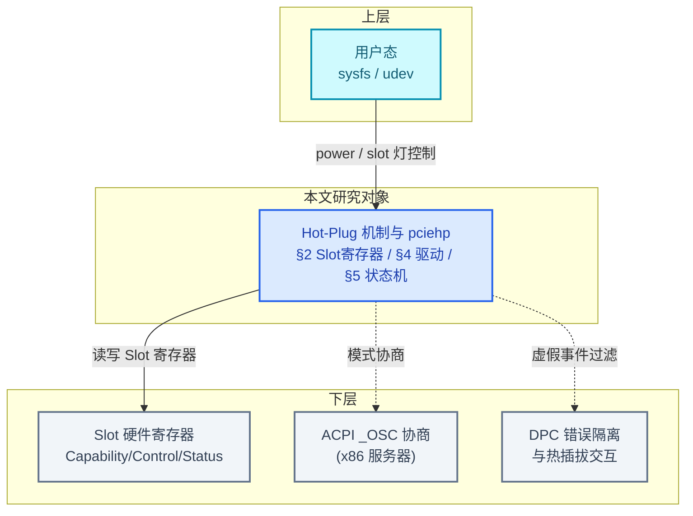
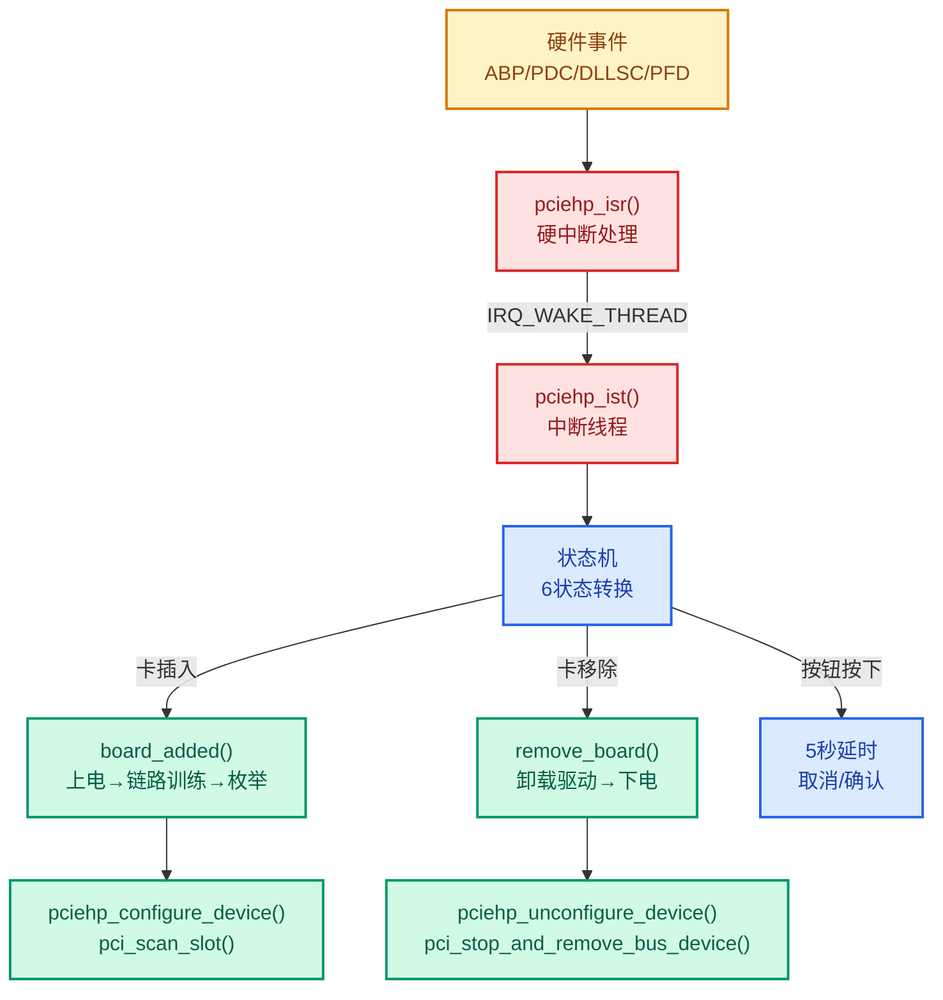
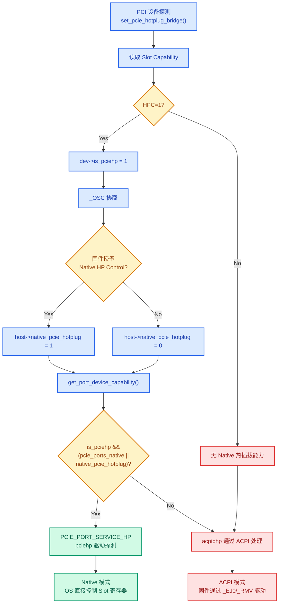
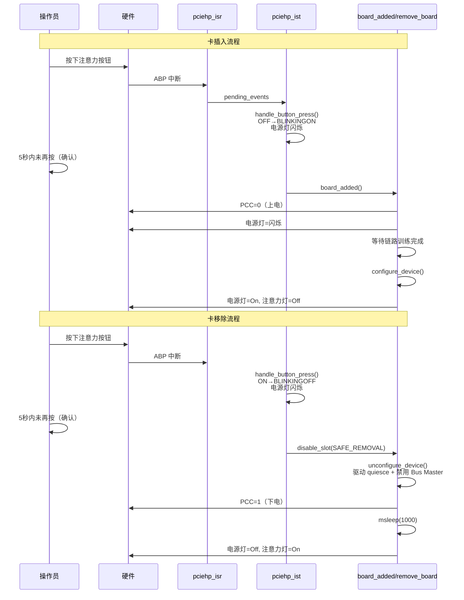
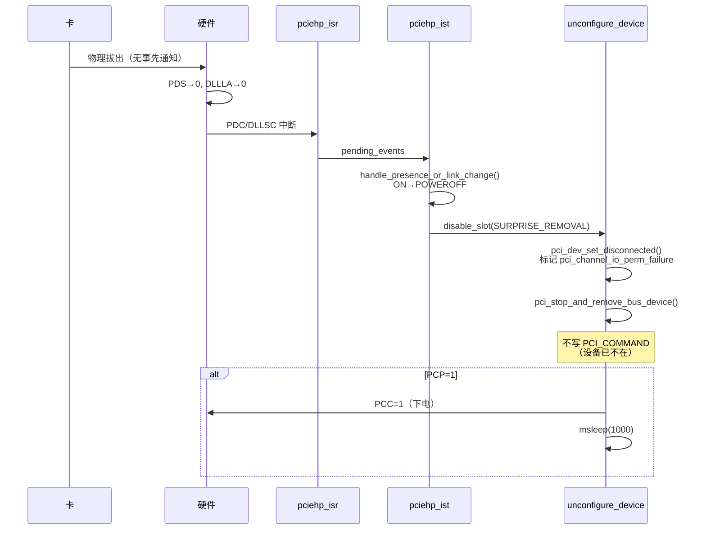
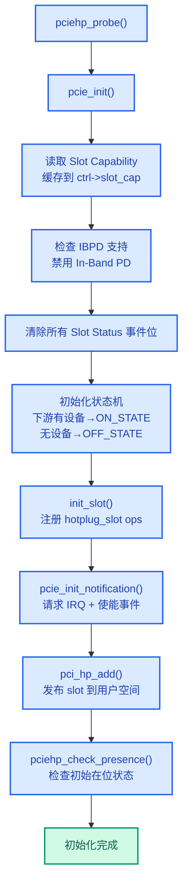
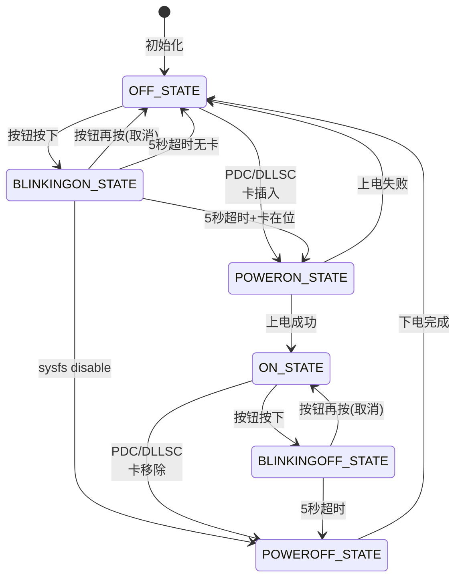
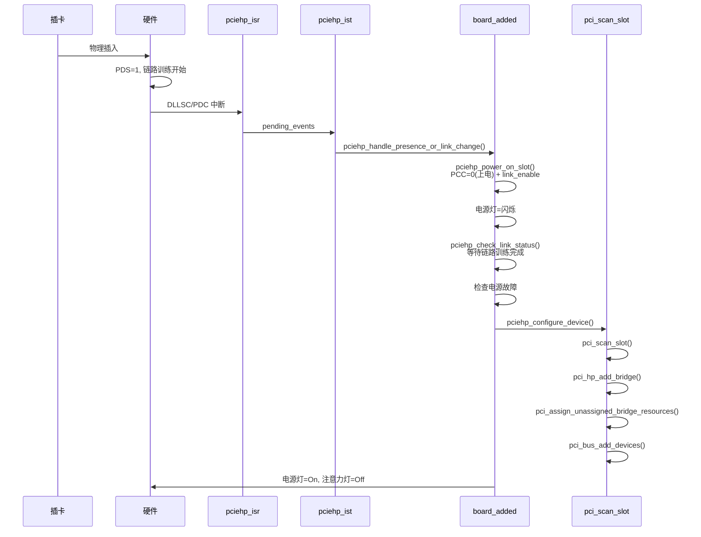

# PCIe Hot-Plug 机制与 pciehp 驱动

> 从硬件信号到内核驱动的完整热插拔流程，聚焦 Slot 寄存器语义、pciehp 状态机与中断处理。
> **工程师视角**：理解热插拔事件从硬件中断到设备枚举/移除的完整路径，是调试 NVMe 热拔插、Thunderbolt 拓扑变化、DPC 恢复后设备消失等问题的关键。

### 关键术语

| 缩写    | 全称                                | 含义                                              |
| ----- | --------------------------------- | ----------------------------------------------- |
| HPC   | Hot-Plug Controller               | 热插拔控制器，PCIe Spec 中指 Slot Capability 中 HPC=1 的端口 |
| PCP   | Power Controller Present          | 电源控制器存在，Slot Capability Bit 1，表示插槽具备软件可控电源      |
| ABP   | Attention Button Present          | 注意力按钮存在，Slot Capability Bit 0                   |
| AIP   | Attention Indicator Present       | 注意力指示灯存在，Slot Capability Bit 3                  |
| PIP   | Power Indicator Present           | 电源指示灯存在，Slot Capability Bit 4                   |
| HPS   | Hot-Plug Surprise                 | 支持意外拔出，Slot Capability Bit 5                    |
| MRL   | Manually Operated Retention Latch | 手动保留锁，检测插槽锁扣状态                                  |
| PDS   | Presence Detect State             | 在位检测状态位，指示卡是否在位                                 |
| DLLSC | Data Link Layer State Changed     | 数据链路层状态变化事件                                     |
| PDC   | Presence Detect Changed           | 在位检测变化事件                                        |
| PFD   | Power Fault Detected              | 电源故障检测事件                                        |
| CC    | Command Completed                 | 命令完成事件                                          |
| NCCS  | No Command Completed Support      | 不需要等待命令完成，Slot Capability Bit 18                |
| DPC   | Downstream Port Containment       | 下游端口遏制，错误隔离机制                                   |
| IST   | Interrupt Service Thread          | pciehp 的中断服务线程                                  |
| IBPD  | In-Band Presence Detect           | 带内在位检测，通过 PCIe 链路信号检测卡在位                        |
| DLLLA | Data Link Layer Link Active       | 数据链路层链路活跃信号，指示链路训练完成                            |
| _OSC  | Operating System Capabilities     | ACPI 方法，OS 与固件协商特性控制权                           |

***

## 1. 概述

### 1.1 前置知识

| 需要了解                     | 参考文档                                     |
| ------------------------ | ---------------------------------------- |
| PCIe 配置空间与 Capability 结构 | [ECAM与配置空间](./ecam-config-space.md)      |
| 枚举流程与设备扫描                | [枚举流程](./enumeration-flow.md)            |
| BAR 分配与资源管理              | [BAR与资源分配](./bar-resource-allocation.md) |
| MSI/MSI-X 中断机制           | [MSI中断](./msi-interrupt.md)              |

### 1.2 系统上下文

**项目定位**：PCIe Hot-Plug 是 PCIe Spec §6.7 定义的标准机制，允许在不关机的情况下在线添加、移除 PCIe 卡片。它是服务器高可用性与可维护性的关键能力——支持 NVMe SSD 在线更换、Thunderbolt 拓扑动态变化、卡上故障组件热替换等场景。在 ARM/RISC-V 嵌入式平台上，热插拔同样用于 AI 加速卡的现场更换与固件热升级。

**软硬件耦合点**：热插拔是一条横跨四层的耦合链路：

- **硬件层**：Slot Capability/Control/Status 三个寄存器（§2）是硬件与驱动的契约，任一 Cap 位误配置都会导致行为偏差
- **固件层**：ACPI `_OSC` 方法（x86 服务器）协商 OS 与固件谁拥有 Native 热插拔控制权；协商结果直接决定 pciehp 还是 acpiphp 接管
- **内核层**：pciehp 驱动通过 Port Service 框架挂载到 Root Port/Downstream Port，与 PME、AER 共享 MSI 向量
- **用户态**：`/sys/bus/pci/slots/` 暴露 power/attention/adapter 等接口，udev 据此触发自动化
- **与 DPC 的交互**：DPC (Downstream Port Containment) 触发后的 Secondary Bus Reset 会产生虚假 DLLSC 事件，pciehp 必须过滤（§8.1）

**跨实现/跨架构对比**：

| 对比维度     | ACPI 模式（x86 服务器）          | Native 模式（嵌入式/ARM/RISC-V）  |
| -------- | ------------------------- | ---------------------------- |
| **控制权归属** | 固件通过 `_OSC` 保留，ACPI 事件驱动  | OS 直接操作 Slot 寄存器             |
| **触发方式** | ACPI Notify → acpiphp     | MSI/MSI-X 中断 → pciehp        |
| **适用场景** | BIOS 主导的服务器平台             | 固件不参与热插拔的嵌入式平台               |
| **D3 约束** | OS 不可将热插拔桥置入 D3           | 理论上可 D3，但 2018 年前硬件未验证       |

此外，热插拔机制与 SR-IOV 虚拟化存在关联：VF (Virtual Function) 的添加/移除走与物理热插拔类似的 `pci_scan_slot()` / `pci_stop_and_remove_bus_device()` 路径，但 VF 不涉及 Slot 寄存器与电源控制——这部分将在 [SR-IOV 虚拟化](./sriov-virtualization.md) 中详述。



> **如何读这张图**：实线表示主控制流方向（用户态 → 驱动 → 硬件），虚线表示旁路或交互关系。pciehp 是研究主体，向下直接读写 Slot 寄存器；ACPI `_OSC` 仅在初始化时协商一次（决定 Native vs ACPI 模式，见 §3.1）；DPC 在错误恢复时与 pciehp 通过虚假事件过滤机制交互（见 §8.1）。

> **核心要点**：热插拔是横跨"用户态 → 内核 → 固件 → 硬件"四层的耦合机制，单看任一层都无法理解全貌。本文后续章节沿"硬件契约（§2）→ 模式选择（§3）→ 驱动实现（§4-§7）→ 边界场景（§8）→ 用户接口（§9）"逐层展开。

### 1.3 计划性移除 vs 意外拔出

PCIe Spec §6.7 统一使用 **Hot-Plug** 术语，核心区分在于移除是否通知 OS：

| 对比维度 | 计划性移除 (Safe Removal)        | 意外拔出 (Surprise Removal)      |
| ---- | --------------------------- | ---------------------------- |
| 触发方式 | 注意力按钮 5 秒确认 / sysfs 写 power | 直接拔卡，无事先通知                   |
| 前提条件 | Slot Cap HPC=1              | Slot Cap HPS=1               |
| 驱动回调 | `pci_device_remove()` 正常路径  | 驱动需处理 MMIO 返回 `0xFFFFFFFF`   |
| 数据安全 | 有保障（驱动先 quiesce）            | 无保障（可能正在 DMA）                |
| 设备标记 | 正常移除                        | `pci_dev_set_disconnected()` |

> **术语说明**：Hot-Swap 常见于 CompactPCI 等规范，PCIe Spec 中不使用此术语。本文统一使用 Hot-Plug，涵盖上述两种场景。

### 1.4 全景视图



***

## 2. 硬件基础：Slot 寄存器

> 上一章概述了 PCIe 热插拔在系统中的位置与全景流程，并区分了计划性移除与意外拔出两种场景。一个自然的问题是：硬件如何把"卡插入/拔出"这件事告诉 OS？OS 又如何控制插槽电源与指示灯？本章用 Slot 寄存器组的三个寄存器来回答这个问题——先讲 Slot Capability 描述硬件能力，再讲 Slot Control 控制行为与中断使能，最后讲 Slot Status 反映事件与状态。

### 2.1 Slot Capability（偏移 0x14）

Slot Capability 是只读寄存器，描述端口的热插拔硬件能力：

| 位域       | 名称    | 含义                                                             |
| -------- | ----- | -------------------------------------------------------------- |
| \[0]     | ABP   | Attention Button Present，是否有注意力按钮                              |
| \[1]     | PCP   | Power Controller Present，是否有电源控制器                              |
| \[2]     | MRLSP | MRL Sensor Present，是否有锁扣传感器                                    |
| \[3]     | AIP   | Attention Indicator Present，是否有注意力指示灯                          |
| \[4]     | PIP   | Power Indicator Present，是否有电源指示灯                               |
| \[5]     | HPS   | Hot-Plug Surprise，支持意外拔出                                       |
| \[6]     | HPC   | Hot-Plug Capable，端口支持热插拔                                       |
| \[14:7]  | SPLV  | Slot Power Limit Value，插槽功率限制值                                 |
| \[16:15] | SPLS  | Slot Power Limit Scale，功率限制比例（0=1x, 1=0.1x, 2=0.01x, 3=0.001x） |
| \[17]    | EIP   | Electromechanical Interlock Present，是否有机电联锁                    |
| \[18]    | NCCS  | No Command Completed Support，不需要等待命令完成                         |
| \[31:19] | PSN   | Physical Slot Number，物理插槽编号                                    |

**HPC、PCP 与 HPS 的关系**：

- **HPC=1**：端口具备热插拔控制器，OS 可参与热插拔流程（中断处理、指示灯控制、在位检测等）
- **PCP=1**：插槽具备电源控制器，OS 可通过 Slot Control 的 PCC 位软件控制上电/下电
- **HPS=1**：端口支持意外拔出，即卡被突然拔走时硬件不会损坏，OS 能正确处理

> HPC 与 PCP 是独立的能力位：HPC=1 不隐含 PCP=1。当 HPC=1 但 PCP=0 时，OS 仍可处理热插拔事件，但无法软件控制电源（电源始终开启或由固件/外部管理）。Linux 内核中 `POWER_CTRL(ctrl)` 宏检查的是 PCP 位而非 HPC 位。

### 2.2 Slot Control（偏移 0x18）

Slot Control 是读写寄存器，OS 通过它控制热插拔行为和中断使能：

| 位域     | 名称     | 含义                                                          |
| ------ | ------ | ----------------------------------------------------------- |
| \[0]   | ABPE   | Attention Button Pressed Enable                             |
| \[1]   | PFDE   | Power Fault Detected Enable                                 |
| \[2]   | MRLSCE | MRL Sensor Changed Enable                                   |
| \[3]   | PDCE   | Presence Detect Changed Enable                              |
| \[4]   | CCIE   | Command Completed Interrupt Enable                          |
| \[5]   | HPIE   | Hot-Plug Interrupt Enable（总开关）                              |
| \[7:6] | AIC    | Attention Indicator Control（00=保留, 01=On, 10=Blink, 11=Off） |
| \[9:8] | PIC    | Power Indicator Control（同 AIC 编码）                           |
| \[10]  | PCC    | Power Controller Control（0=Power On, 1=Power Off）           |
| \[11]  | EIC    | Electromechanical Interlock Control                         |
| \[12]  | DLLSCE | Data Link Layer State Changed Enable                        |
| \[13]  | ASPLD  | Auto Slot Power Limit Disable                               |
| \[14]  | IBPD   | In-Band Presence Detect Disable                             |

**关键语义**：

- **HPIE 是中断总开关**：只有 HPIE=1 时，ABPE/PFDE/PDCE 等事件才能产生中断
- **PCC 控制插槽电源**：写 0 上电，写 1 下电
- **命令完成协议**：如果 NCCS=0，每次写 Slot Control 后必须等待 CC 事件（1 秒超时），才能写下一次

### 2.3 Slot Status（偏移 0x1A）

Slot Status 反映当前状态和事件，事件位写 1 清除（Write-1-to-Clear）：

| 位域   | 名称    | 含义                                            |
| ---- | ----- | --------------------------------------------- |
| \[0] | ABP   | Attention Button Pressed（事件）                  |
| \[1] | PFD   | Power Fault Detected（事件）                      |
| \[2] | MRLSC | MRL Sensor Changed（事件）                        |
| \[3] | PDC   | Presence Detect Changed（事件）                   |
| \[4] | CC    | Command Completed（事件）                         |
| \[5] | MRLSS | MRL Sensor State（0=Closed, 1=Open）（状态）        |
| \[6] | PDS   | Presence Detect State（0=Empty, 1=Present）（状态） |
| \[7] | EIS   | Electromechanical Interlock Status（状态）        |
| \[8] | DLLSC | Data Link Layer State Changed（事件）             |

**事件 vs 状态**：

- **事件位**（ABP/PFD/MRLSC/PDC/CC/DLLSC）：变化时置 1，写 1 清除。用于触发中断
- **状态位**（MRLSS/PDS/EIS）：反映当前硬件状态，只读

**PDS 与 DLLSC 的关系**：

- PDS 由插槽的物理引脚信号驱动，卡插入时置 1
- DLLSC 由数据链路层的 DLLLA（Data Link Layer Link Active）信号驱动，链路训练完成后置 1
- 卡插入时：PDS 先变 1，DLLSC 后变 1（链路训练需要时间）
- 卡拔出时：DLLSC 先变 0（链路断开），PDS 后变 0

***

## 3. Cap 组合与热插拔模式

> 上一章建立了 Slot 寄存器的三个寄存器语义：Capability 描述硬件能力、Control 控制行为、Status 反映事件。一个自然的问题是：不同的 Cap 位组合（HPC/PCP/ABP/HPS 等）会产生怎样不同的热插拔行为？Native 与 ACPI 两种模式如何选择？本章用模式决策链与五个典型场景来回答这个问题——先讲 Native/ACPI 模式选择与 _OSC 协商，再讲 Cap 位对驱动运行时行为的影响，最后用全功能、无电源控制、无按钮、意外拔出、ACPI 五个场景串联完整流程。

### 3.1 Native 与 ACPI 模式选择

PCIe 热插拔存在两种软件处理模式：**Native 模式**（OS 直接操作 Slot 寄存器）和 **ACPI 模式**（固件通过 ACPI 事件驱动）。模式选择由硬件能力、_OSC 协商和内核参数共同决定。



**决策链关键节点**：

| 节点 | 代码位置 | 判断逻辑 |
|------|---------|---------|
| HPC 检测 | `drivers/pci/probe.c:set_pcie_hotplug_bridge()` | `SLTCAP & PCI_EXP_SLTCAP_HPC` → `is_pciehp=1` |
| Host Bridge 默认值 | `drivers/pci/probe.c:pci_init_host_bridge()` | `native_pcie_hotplug = 1`（默认假设 OS 可控） |
| _OSC 协商 | `drivers/acpi/pci_root.c` | 固件未授予 `OSC_PCI_EXPRESS_NATIVE_HP_CONTROL` → 清除 `native_pcie_hotplug` |
| 服务分配 | `drivers/pci/pcie/portdrv.c:get_port_device_capability()` | `is_pciehp && (pcie_ports_native \|\| native_pcie_hotplug)` → 分配 `PCIE_PORT_SERVICE_HP` |
| acpiphp 避让 | `drivers/pci/hotplug/acpiphp_glue.c` | `hotplug_is_native()` 为真时跳过该 Slot |

**内核参数覆盖**：

| 参数 | 效果 |
|------|------|
| `pcie_ports=native` | 忽略 _OSC 结果，强制使用 Native 模式 |
| `pcie_ports=compat` | 禁用所有 PCIe Port Service（包括热插拔） |

> **D3 电源管理约束**：ACPI 模式下 OS 不可将热插拔桥置入 D3，因固件可能需要访问 Slot 寄存器。Native 模式下热插拔桥理论上可进入 D3，但 2018 年前的硬件未经验证，内核默认不允许。

### 3.2 Cap 位对驱动行为的影响

pciehp 驱动在初始化时读取 Slot Capability 寄存器并缓存到 `ctrl->slot_cap`，后续通过宏检查各位：

```c
// drivers/pci/hotplug/pciehp.h
#define ATTN_BUTTN(ctrl)  ((ctrl)->slot_cap & PCI_EXP_SLTCAP_ABP)   // Bit 0
#define POWER_CTRL(ctrl)  ((ctrl)->slot_cap & PCI_EXP_SLTCAP_PCP)   // Bit 1
#define MRL_SENS(ctrl)    ((ctrl)->slot_cap & PCI_EXP_SLTCAP_MRLSP) // Bit 2
#define ATTN_LED(ctrl)    ((ctrl)->slot_cap & PCI_EXP_SLTCAP_AIP)   // Bit 3
#define PWR_LED(ctrl)     ((ctrl)->slot_cap & PCI_EXP_SLTCAP_PIP)   // Bit 4
#define NO_CMD_CMPL(ctrl) ((ctrl)->slot_cap & PCI_EXP_SLTCAP_NCCS)  // Bit 18
```

> `HPS`（Bit 5）没有对应的运行时宏——pciehp 对 PDC/DLLSC 事件的处理方式不依赖 HPS 位。HPS 是硬件声明，表示插槽物理上支持意外拔出不会损坏平台。

各 Cap 位对驱动行为的影响：

| Cap 位 | =1 时的行为 | =0 时的行为 |
|--------|-----------|-----------|
| **PCP** | `pciehp_power_on/off_slot()` 控制 PCC 位；上电后 1s 等待；使能/禁用前检查电源状态 | 跳过所有电源控制命令；假设电源始终开启；跳过 1s 等待 |
| **ABP** | 使能 ABPE 中断；按钮触发 5s 延时（BLINKINGON/OFF 状态）；**禁用** PDCE | 使能 PDCE 中断；无按钮状态；在位检测直接触发上电/下电 |
| **AIP** | 注册注意力指示灯 ops；`pciehp_set_indicators()` 写 AIC 字段 | 不注册注意力指示灯 ops（除非 `hotplug_user_indicators`）；AIC 写入静默丢弃 |
| **PIP** | `pciehp_set_indicators()` 写 PIC 字段 | PIC 写入静默丢弃；电源指示灯操作变为空操作 |
| **NCCS** | `pcie_wait_cmd()` 立即返回；不使能 CCIE 中断 | 每次 Slot Control 写入后等待 CC 事件（1s 超时）；使能 CCIE |
| **MRLSP** | 注册锁扣状态 ops；使能前检查锁扣是否打开 | 不注册锁扣 ops；无锁扣检查 |
| **HPS** | 硬件声明支持意外拔出（信息位，不门控运行时行为） | 不影响软件处理路径；PDC/DLLSC 事件仍正常处理 |

**`pcie_init()` 中的 Cap 修正**：

```c
// drivers/pci/hotplug/pciehp_hpc.c
pcie_capability_read_dword(pdev, PCI_EXP_SLTCAP, &slot_cap);

if (pdev->hotplug_user_indicators)
    slot_cap &= ~(PCI_EXP_SLTCAP_AIP | PCI_EXP_SLTCAP_PIP);

if (pdev->is_thunderbolt)
    slot_cap |= PCI_EXP_SLTCAP_NCCS;

ctrl->slot_cap = slot_cap;
```

- **`hotplug_user_indicators`**：固件要求用户空间控制指示灯时，清除 AIP/PIP，驱动不再操作硬件指示灯
- **Thunderbolt 控制器**：强制设置 NCCS，因部分 Thunderbolt 控制器虚假声明 CC 支持

### 3.3 典型 Cap 组合与交互流程

#### 场景 A：全功能 Native 热插拔

**前置条件**：HPC=1, PCP=1, ABP=1, AIP=1, PIP=1, `native_pcie_hotplug=1`

这是 PCIe Spec §6.7 描述的标准热插拔模型，所有可选硬件均存在：



#### 场景 B：无电源控制的 Native 热插拔

**前置条件**：HPC=1, PCP=0, `native_pcie_hotplug=1`

常见于服务器背板电源始终开启的插槽。与场景 A 的关键差异：

| 对比维度 | PCP=1 | PCP=0 |
|---------|-------|-------|
| 上电 | `pciehp_power_on_slot()` 写 PCC=0 | 跳过，电源始终开启 |
| 下电 | `pciehp_power_off_slot()` 写 PCC=1 + 1s 等待 | 跳过，电源始终开启 |
| 使能前检查 | 读取电源状态，已上电则跳过 | 不检查，直接调用 `board_added()` |
| 禁用前检查 | 读取电源状态，已下电则跳过 | 不检查，直接调用 `remove_board()` |
| 初始化清理 | 空插槽上电时自动下电 | 不清理 |

交互流程简化为：检测在位 → 链路训练 → 枚举设备（跳过电源控制步骤）。

#### 场景 C：无按钮的热插拔

**前置条件**：HPC=1, ABP=0, `native_pcie_hotplug=1`

无注意力按钮时，pciehp 使能 PDCE（在位检测中断）替代 ABPE。卡插入/拔出直接触发上电/下电，无 5s 延时窗口：

- **卡插入**：PDC 事件 → `pciehp_handle_presence_or_link_change()` → OFF→POWERON → `board_added()`
- **卡移除**：PDC/DLLSC 事件 → `pciehp_handle_presence_or_link_change()` → ON→POWEROFF → `pciehp_disable_slot(SURPRISE_REMOVAL)`

> 无按钮时，卡拔出始终走 SURPRISE_REMOVAL 路径，即使是有计划的移除。因为没有按钮信号来区分"计划性"和"意外"。

#### 场景 D：意外拔出（Surprise Removal）

**前置条件**：HPS=1（硬件声明支持），或任何产生 PDC/DLLSC 事件的拔出

pciehp 对意外拔出的处理不依赖 HPS 位——只要收到 PDC 或 DLLSC 事件且 Slot 处于 ON_STATE，即执行 SURPRISE_REMOVAL 路径：



**安全移除 vs 意外拔出的核心差异**：

| 对比维度 | 安全移除 (`safe_removal=true`) | 意外拔出 (`safe_removal=false`) |
|---------|---------------------------|---------------------------|
| 设备标记 | 正常移除 | `pci_dev_set_disconnected()` → `pci_channel_io_perm_failure` |
| Bus Master | 禁用（写 PCI_COMMAND） | 不写（设备已不在） |
| 数据安全 | 驱动先 quiesce | 无保障，可能正在 DMA |
| 触发路径 | 按钮 5s 确认 / sysfs | PDC/DLLSC 事件 |

#### 场景 E：ACPI 热插拔

**前置条件**：`native_pcie_hotplug=0`（固件通过 _OSC 拒绝 Native 控制），或 HPC=0

当 OS 未获得 Native 热插拔控制权时，acpiphp 驱动接管：

1. ACPI 枚举：`acpiphp_enumerate_slots()` 扫描 `_EJ0`/`_RMV` 方法
2. 事件触发：固件通过 ACPI Notify 通知 OS
3. 设备添加：`enable_slot()` → `pci_scan_bridge()` → `pci_bus_add_devices()`
4. 设备移除：`disable_slot()` → `_EJ0` 方法执行 → `pci_stop_and_remove_bus_device()`

acpiphp 通过 `hotplug_is_native()` 检查避免与 pciehp 冲突：若桥的 `is_pciehp && pciehp_is_native()` 为真，acpiphp 跳过该 Slot。

***

## 4. pciehp 驱动架构

> 上一章展示了 Cap 组合如何决定热插拔模式与典型交互流程，但流程图中的"pciehp 驱动"仍是一个黑盒。一个自然的问题是：在 Native 模式下，内核中是哪个组件来操作这些 Slot 寄存器？它的数据结构如何组织？初始化时做了什么？本章用 pciehp 驱动架构来回答这个问题——先讲 Port Service 模型与驱动注册条件，再讲 controller 结构体的核心字段，最后讲初始化流程与事件使能策略。

### 4.1 驱动注册与 Port Service 模型

pciehp 是 PCIe Port Bus Driver 的一个 Service，与 PME、AER 等共享同一个 Root Port/Downstream Port：

```c
// drivers/pci/hotplug/pciehp_core.c
static struct pcie_port_service_driver hpdriver_portdrv = {
    .name      = "pciehp",
    .port_type = PCIE_ANY_PORT,
    .service   = PCIE_PORT_SERVICE_HP,
    .probe     = pciehp_probe,
    .remove    = pciehp_remove,
    .slot_reset = pciehp_slot_reset,
};
```

**探测条件**（`pciehp_probe`）：

1. `dev->service == PCIE_PORT_SERVICE_HP`（由 Port Driver 的 `get_port_device_capability()` 分配，要求 `is_pciehp && (pcie_ports_native || native_pcie_hotplug)`，详见[3.1 节](#31-native-与-acpi-模式选择)）
2. 端口必须有 `subordinate` 总线（已分配 Bus Number）

**Port Service 中断共享**：PME、Hot-Plug、Bandwidth Notification 共享同一个 MSI/MSI-X 向量，pciehp\_isr 通过读取 Slot Status 判断是否为热插拔事件。

### 4.2 controller 结构体

pciehp 的核心数据结构，每个热插拔端口一个实例：

```c
// drivers/pci/hotplug/pciehp.h
struct controller {
    struct pcie_device *pcie;
    u32 slot_cap;
    u16 slot_ctrl;
    struct mutex ctrl_lock;       // 串行化 Slot Control 写入
    unsigned long cmd_started;    // 上次写 Slot Control 的 jiffies
    unsigned int cmd_busy:1;      // 正在等待 Command Completed
    wait_queue_head_t queue;      // 等待 CC 事件
    atomic_t pending_events;      // ISR → IST 的事件传递
    u8 state;                     // 状态机当前状态
    struct mutex state_lock;      // 保护状态机
    struct delayed_work button_work; // 5 秒按钮延时
    struct rw_semaphore reset_lock;  // 防止 reset 期间访问链路/在位状态
    unsigned int depth;           // 嵌套热插拔端口深度
};
```

### 4.3 初始化流程



**`pcie_enable_notification()`** **使能的事件**：

| 事件     | 使能条件                          | 原因                      |
| ------ | ----------------------------- | ----------------------- |
| DLLSCE | 始终使能                          | 链路 Up/Down 是最可靠的热插拔检测信号 |
| ABPE   | ATTN\_BUTTN(ctrl)             | 有按钮时使能按钮事件              |
| PDCE   | !ATTN\_BUTTN(ctrl)            | 无按钮时使能在位检测事件            |
| HPIE   | !pciehp\_poll\_mode           | 中断模式下使能热插拔中断            |
| CCIE   | !poll\_mode && !NO\_CMD\_CMPL | 需要命令完成通知时使能             |

***

## 5. 状态机

> 上一章建立了 pciehp 的驱动架构与初始化流程，初始化时根据在位状态将插槽置入 OFF_STATE 或 ON_STATE。一个自然的问题是：从 OFF 到 ON（或反向）的过程中，驱动如何协调按钮确认、链路训练、电源控制这些异步步骤，避免并发操作与误触发？本章用六状态机来回答这个问题——先讲六个状态的定义，再讲状态转换图与触发条件，最后讲注意力按钮的 5 秒延时设计意图。

### 5.1 六状态定义

```c
// drivers/pci/hotplug/pciehp.h
#define OFF_STATE         0   // 插槽下电，无下游设备
#define BLINKINGON_STATE  1   // 5秒后上电，电源灯闪烁
#define BLINKINGOFF_STATE 2   // 5秒后下电，电源灯闪烁
#define POWERON_STATE     3   // 正在上电
#define POWEROFF_STATE    4   // 正在下电
#define ON_STATE          5   // 插槽上电，下游设备已枚举
```

### 5.2 状态转换图



### 5.3 注意力按钮的 5 秒延时

按钮按下后 pciehp 不会立即执行上电/下电，而是进入 BLINKING 状态并启动 5 秒延时：

```c
// drivers/pci/hotplug/pciehp_ctrl.c
void pciehp_handle_button_press(struct controller *ctrl)
{
    mutex_lock(&ctrl->state_lock);
    switch (ctrl->state) {
    case OFF_STATE:
        ctrl->state = BLINKINGON_STATE;
        pciehp_set_indicators(ctrl, PCI_EXP_SLTCTL_PWR_IND_BLINK,
                              PCI_EXP_SLTCTL_ATTN_IND_OFF);
        schedule_delayed_work(&ctrl->button_work, 5 * HZ);
        break;
    case ON_STATE:
        ctrl->state = BLINKINGOFF_STATE;
        pciehp_set_indicators(ctrl, PCI_EXP_SLTCTL_PWR_IND_BLINK,
                              PCI_EXP_SLTCTL_ATTN_IND_OFF);
        schedule_delayed_work(&ctrl->button_work, 5 * HZ);
        break;
    case BLINKINGOFF_STATE:
    case BLINKINGON_STATE:
        // 再次按下按钮 → 取消操作
        cancel_delayed_work(&ctrl->button_work);
        // 恢复原状态...
        break;
    }
    mutex_unlock(&ctrl->state_lock);
}
```

**设计意图**：5 秒延时给操作员反悔的机会。如果误按按钮，在 5 秒内再按一次即可取消。电源灯闪烁提示操作员"即将执行操作"。

***

## 6. 中断处理

> 上一章建立了状态机的六个状态与转换规则，状态转换的触发源是硬件事件。一个自然的问题是：硬中断上下文能做什么、不能做什么？事件如何从硬件到达状态机？本章用 pciehp 的两级中断架构来回答这个问题——先讲硬中断 pciehp_isr 的事件筛选与写 1 清除，再讲中断线程 pciehp_ist 的状态机调度与事件优先级，最后讲中断不可用时的轮询模式。

### 6.1 两级中断架构

pciehp 使用 `request_threaded_irq()` 注册硬中断处理函数和中断线程：

```c
// drivers/pci/hotplug/pciehp_hpc.c
retval = request_threaded_irq(irq, pciehp_isr, pciehp_ist,
                              IRQF_SHARED, "pciehp", ctrl);
```

| 层级   | 函数             | 上下文   | 职责                                       |
| ---- | -------------- | ----- | ---------------------------------------- |
| 硬中断  | `pciehp_isr()` | 中断上下文 | 读取 Slot Status，筛选事件位，存入 `pending_events` |
| 中断线程 | `pciehp_ist()` | 进程上下文 | 执行状态机转换、上电/下电、设备枚举/移除                    |

### 6.2 硬中断处理（pciehp\_isr）

```c
// drivers/pci/hotplug/pciehp_hpc.c（简化）
static irqreturn_t pciehp_isr(int irq, void *dev_id)
{
    // 1. 读取 Slot Status，只保留事件位
    status &= PCI_EXP_SLTSTA_ABP | PCI_EXP_SLTSTA_PFD |
              PCI_EXP_SLTSTA_PDC | PCI_EXP_SLTSTA_CC |
              PCI_EXP_SLTSTA_DLLSC;

    // 2. 写1清除已读取的事件
    pcie_capability_write_word(pdev, PCI_EXP_SLTSTA, status);

    // 3. MSI 模式下重读，防止 read-clear 之间丢失事件
    if (pci_dev_msi_enabled(pdev) && !pciehp_poll_mode)
        goto read_status;

    // 4. Command Completed 直接唤醒等待者，不延迟到 IST
    if (events & PCI_EXP_SLTSTA_CC) {
        ctrl->cmd_busy = 0;
        wake_up(&ctrl->queue);
        events &= ~PCI_EXP_SLTSTA_CC;
    }

    // 5. 其他事件存入 pending_events，唤醒 IST
    atomic_or(events, &ctrl->pending_events);
    return IRQ_WAKE_THREAD;
}
```

**MSI 重读的必要性**：PCIe Spec §6.7.3.4 规定，MSI 模式下所有事件位必须为 0 端口才会发送新中断。如果在 read 和 clear 之间有新事件置位，端口不会再发中断，必须重读。

### 6.3 中断线程（pciehp\_ist）

```c
// drivers/pci/hotplug/pciehp_hpc.c（简化）
static irqreturn_t pciehp_ist(int irq, void *dev_id)
{
    events = atomic_xchg(&ctrl->pending_events, 0);

    // 1. 处理注意力按钮
    if (events & PCI_EXP_SLTSTA_ABP)
        pciehp_handle_button_press(ctrl);

    // 2. 处理电源故障
    if (events & PCI_EXP_SLTSTA_PFD) {
        pciehp_set_indicators(ctrl, PCI_EXP_SLTCTL_PWR_IND_OFF,
                              PCI_EXP_SLTCTL_ATTN_IND_ON);
    }

    // 3. 过滤 DPC 恢复和 SBR 产生的虚假链路变化
    if ((events & (PCI_EXP_SLTSTA_PDC | PCI_EXP_SLTSTA_DLLSC)) &&
        (pci_dpc_recovered(pdev) || pci_hp_spurious_link_change(pdev)) &&
        ctrl->state == ON_STATE) {
        events &= ~ignored_events;
        pciehp_ignore_link_change(ctrl, pdev, irq, ignored_events);
    }

    // 4. DISABLE_SLOT 优先级高于 PDC/DLLSC
    if (events & DISABLE_SLOT)
        pciehp_handle_disable_request(ctrl);
    else if (events & (PCI_EXP_SLTSTA_PDC | PCI_EXP_SLTSTA_DLLSC))
        pciehp_handle_presence_or_link_change(ctrl, events);

    return IRQ_HANDLED;
}
```

**事件优先级**：`DISABLE_SLOT > PDC/DLLSC`。如果用户通过 sysfs 请求禁用插槽，同时卡被拔出，优先执行安全移除路径。

### 6.4 轮询模式

当中断不可用时，pciehp 支持轮询模式（`pciehp_poll_mode=1`）：

```c
// drivers/pci/hotplug/pciehp_hpc.c
static int pciehp_poll(void *data)
{
    schedule_timeout_idle(10 * HZ);  // 启动延迟 10 秒

    while (!kthread_should_stop()) {
        while (pciehp_isr(IRQ_NOTCONNECTED, ctrl) == IRQ_WAKE_THREAD ||
               atomic_read(&ctrl->pending_events))
            pciehp_ist(IRQ_NOTCONNECTED, ctrl);

        if (pciehp_poll_time <= 0 || pciehp_poll_time > 60)
            pciehp_poll_time = 2;
        schedule_timeout_idle(pciehp_poll_time * HZ);
    }
    return 0;
}
```

轮询模式通过内核线程实现，默认 2 秒轮询一次。适用于中断控制器不支持 MSI 或中断线路有问题的平台。

***

## 7. 设备添加与移除

> 上一章建立了中断如何将事件传递到状态机并触发 POWERON/POWEROFF 转换。一个自然的问题是：状态机进入 POWERON/POWEROFF 后，驱动如何完成下游设备的枚举与卸载？安全移除与意外拔出在代码路径上有什么差异？本章用卡插入与卡移除两条路径来回答这个问题——先讲卡插入的链路训练、电源上电与设备扫描绑定，再讲安全移除与意外拔出的 unconfigure_device 关键差异。

### 7.1 卡插入流程



**`pciehp_configure_device()`** **的关键步骤**：

```c
// drivers/pci/hotplug/pciehp_pci.c
int pciehp_configure_device(struct controller *ctrl)
{
    pci_lock_rescan_remove();

    // 1. 扫描设备
    num = pci_scan_slot(parent, PCI_DEVFN(0, 0));

    // 2. 为下游桥分配 Bus Number 和窗口
    for_each_pci_bridge(dev, parent)
        pci_hp_add_bridge(dev);

    // 3. 分配 BAR 资源
    pci_assign_unassigned_bridge_resources(bridge);

    // 4. 绑定驱动
    //    释放 reset_lock 避免 AB-BA 死锁
    up_read(&ctrl->reset_lock);
    pci_bus_add_devices(parent);
    down_read_nested(&ctrl->reset_lock, ctrl->depth);

    pci_unlock_rescan_remove();
    return 0;
}
```

### 7.2 卡移除流程

**安全移除**（通过 sysfs 或按钮 5 秒确认）：

```c
// drivers/pci/hotplug/pciehp_ctrl.c
static void remove_board(struct controller *ctrl, bool safe_removal)
{
    pciehp_unconfigure_device(ctrl, safe_removal);

    if (POWER_CTRL(ctrl)) {
        pciehp_power_off_slot(ctrl);
        msleep(1000);  // 等待电源稳定
    }
    pciehp_set_indicators(ctrl, PCI_EXP_SLTCTL_PWR_IND_OFF, INDICATOR_NOOP);
}
```

**意外拔出**（Surprise Removal）：

```c
// drivers/pci/hotplug/pciehp_pci.c
void pciehp_unconfigure_device(struct controller *ctrl, bool presence)
{
    if (!presence)
        // 意外拔出：标记所有下游设备为 disconnected
        pci_walk_bus(parent, pci_dev_set_disconnected, NULL);

    // 反向遍历：先移除 VF，再移除 PF
    list_for_each_entry_safe_reverse(dev, temp, &parent->devices, bus_list) {
        up_read(&ctrl->reset_lock);
        pci_stop_and_remove_bus_device(dev);
        down_read_nested(&ctrl->reset_lock, ctrl->depth);

        if (presence) {
            // 安全移除：禁用 Bus Master 和 SERR
            pci_read_config_word(dev, PCI_COMMAND, &command);
            command &= ~(PCI_COMMAND_MASTER | PCI_COMMAND_SERR);
            command |= PCI_COMMAND_INTX_DISABLE;
            pci_write_config_word(dev, PCI_COMMAND, &command);
        }
    }
}
```

**安全移除 vs 意外拔出的关键差异**：

| 对比维度          | 安全移除                       | 意外拔出                         |
| ------------- | -------------------------- | ---------------------------- |
| `presence` 参数 | `true`                     | `false`                      |
| 设备标记          | 正常移除                       | `pci_dev_set_disconnected()` |
| Bus Master    | 禁用（写 Command 寄存器）          | 不写（设备已不在）                    |
| 驱动回调          | `pci_device_remove()` 正常路径 | 驱动需处理 MMIO 返回 `0xFFFFFFFF`   |
| 数据安全          | 有保障（驱动先 quiesce）           | 无保障（可能正在 DMA）                |

***

## 8. 特殊场景

> 上一章建立了卡插入与卡移除的主干路径，覆盖了标准热插拔流程。一个自然的问题是：现实中很多场景并不"标准"——DPC 错误恢复、系统睡眠唤醒、不可靠的硬件信号、有缺陷的控制器——驱动如何应对这些边界情况？本章用四个特殊场景来回答这个问题——先讲 DPC 恢复后的虚假链路变化过滤，再讲系统睡眠期间的设备替换检测，然后讲 In-Band Presence Detect 不可靠的处理，最后讲 Command Completed erratum 的 quirk 修复。

### 8.1 DPC 恢复后的虚假链路变化

DPC (Downstream Port Containment) 触发后会执行 Secondary Bus Reset 来恢复链路，这会产生 DLLSC 事件。pciehp 必须过滤这些虚假事件，否则会把正在恢复的设备误认为热拔插：

```c
// drivers/pci/hotplug/pciehp_hpc.c
if ((events & (PCI_EXP_SLTSTA_PDC | PCI_EXP_SLTSTA_DLLSC)) &&
    (pci_dpc_recovered(pdev) || pci_hp_spurious_link_change(pdev)) &&
    ctrl->state == ON_STATE) {
    pciehp_ignore_link_change(ctrl, pdev, irq, ignored_events);
}
```

`pci_hp_spurious_link_change()` 还覆盖了 Secondary Bus Reset、D3cold 挂起恢复、固件更新、FPGA 重配置等场景。

### 8.2 系统睡眠期间的设备替换

系统睡眠期间，热插拔槽中的设备可能被替换为不同设备。pciehp 在 `resume_noirq` 阶段检测这种情况：

```c
// drivers/pci/hotplug/pciehp_core.c
static int pciehp_resume_noirq(struct pcie_device *dev)
{
    if (ctrl->state == ON_STATE || ctrl->state == BLINKINGOFF_STATE) {
        pcie_clear_hotplug_events(ctrl);

        if (pciehp_device_replaced(ctrl)) {
            // 标记旧设备 disconnected，防止其驱动访问新设备
            pci_walk_bus(ctrl->pcie->port->subordinate,
                         pci_dev_set_disconnected, NULL);
            // 合成 PDC 事件，触发重新枚举
            pciehp_request(ctrl, PCI_EXP_SLTSTA_PDC);
        }
    }
    return 0;
}
```

`pciehp_device_replaced()` 通过比较 Vendor ID、Device ID、Class Code、Subsystem ID 和 DSN (Device Serial Number) 来判断设备是否被替换。

### 8.3 In-Band Presence Detect 禁用

某些平台（如 Dell NVMe 插槽）的 In-Band Presence Detect 信号不可靠，PDS 位可能始终为 0。pciehp 通过以下方式处理：

1. **Slot Capability 2 的 IBPD 位**：硬件声明支持禁用 In-Band PD
2. **DMI 白名单**：Dell 系统强制禁用 In-Band PD
3. **`pciehp_card_present_or_link_active()`**：同时检查 PDS 和 DLLLA，任一为 1 即认为卡在位

```c
// drivers/pci/hotplug/pciehp_hpc.c
int pciehp_card_present_or_link_active(struct controller *ctrl)
{
    ret = pciehp_card_present(ctrl);
    if (ret)
        return ret;
    return pciehp_check_link_active(ctrl);
}
```

### 8.4 Command Completed Erratum

Intel 某些控制器（CF118 erratum）声明支持 Command Completed，但只在修改电源/指示灯控制位时才置 CC 位，修改中断使能位时不置。内核通过 quirk 标记这些设备：

```c
// drivers/pci/hotplug/pciehp_hpc.c
DECLARE_PCI_FIXUP_CLASS_EARLY(PCI_VENDOR_ID_INTEL, PCI_ANY_ID,
                              PCI_CLASS_BRIDGE_PCI, 8, quirk_cmd_compl);
```

Thunderbolt 控制器一律假设 NCCS=1（不需要等待命令完成），因为部分 Thunderbolt 控制器虚假声明 CC 支持。

***

## 9. sysfs 接口

> 上一章覆盖了内核侧的特殊场景处理，焦点一直在驱动内部。一个自然的问题是：用户态如何主动触发热插拔操作？运维人员如何观察 slot 状态、如何安全移除设备？本章用 sysfs 接口来回答这个问题——先讲 `/sys/bus/pci/slots/` 的文件布局与各节点语义，再讲典型操作命令。

pciehp 通过 `/sys/bus/pci/slots/` 暴露用户空间接口：

```
/sys/bus/pci/slots/<N>/
├── attention      # 读写注意力指示灯 (0=Off, 1=On, 2=Blink)
├── latch          # 只读锁扣状态 (0=Closed, 1=Open)
├── power          # 读写插槽电源 (0=Off, 1=On)
├── adapter        # 只读在位状态 (0=Empty, 1=Present)
├── max_bus_speed  # 最大总线速度
├── cur_bus_speed  # 当前总线速度
└── reset          # 写1执行 Secondary Bus Reset
```

**典型操作**：

```bash
# 安全移除设备
echo 0 > /sys/bus/pci/slots/5/power

# 热添加设备
echo 1 > /sys/bus/pci/slots/5/power

# 设置注意力指示灯
echo 1 > /sys/bus/pci/slots/5/attention
```

***

## 10. 调试指南

> 上一章建立了用户态 sysfs 接口，至此热插拔的硬件、驱动、用户接口三层已完整呈现。一个自然的问题是：当热插拔流程出问题时——卡插入后设备不出现、DPC 恢复后设备消失、按钮无反应——如何定位？本章用调试指南来回答这个问题——先讲动态调试启用方法，再讲常见问题排查表，最后讲关键日志消息的含义。

### 10.1 启用动态调试

```bash
# 启用 pciehp 所有调试输出
echo 'file pciehp* +p' > /sys/kernel/debug/dynamic_debug/control

# 仅启用状态机相关调试
echo 'file pciehp_ctrl.c +p' > /sys/kernel/debug/dynamic_debug/control
```

### 10.2 常见问题排查

| 现象          | 可能原因          | 排查方法                                   | <br />                        |
| ----------- | ------------- | -------------------------------------- | :---------------------------- |
| 热插入后设备不出现   | 链路训练失败        | 检查 `lspci -vv` 中 LNKSTA 的 NLW 是否为 0    | <br />                        |
| 热插入后设备不出现   | BAR 分配失败      | \`dmesg                                | grep "BAR.\*no space"\`       |
| 意外拔出后系统卡死   | 驱动未处理 MMIO 错误 | 检查驱动是否注册 `pci_error_handlers`          | <br />                        |
| DPC 恢复后设备消失 | pciehp 误判链路变化 | \`dmesg                                | grep "Link Down/Up ignored"\` |
| 电源故障循环      | 插卡功耗超限        | \`dmesg                                | grep "Power fault"\`          |
| 按钮按下无反应     | HPIE 未使能      | 检查 `lspci -vv` 中 Slot Control 的 HPIE 位 | <br />                        |

### 10.3 关键日志消息

```
pciehp: Slot(#N): Card present           # 卡插入检测
pciehp: Slot(#N): Link Up                # 链路训练完成
pciehp: Slot(#N): Link Down              # 链路断开
pciehp: Slot(#N): Card not present       # 卡不在位
pciehp: Slot(#N): Power fault            # 电源故障
pciehp: Slot(#N): Button press: will power off in 5 sec  # 按钮延时
pciehp: Slot(#N): No link                # 链路训练超时
pciehp: Slot(#N): Link Down/Up ignored   # DPC/SBR 虚假事件被过滤
```

***

## 参考资料

- [PCI Express Base Specification r6.2 §6.7](https://pcisig.com) — Hot-Plug 规范定义
- [Linux kernel source: drivers/pci/hotplug/pciehp\*](https://git.kernel.org/pub/scm/linux/kernel/git/torvalds/linux.git/tree/drivers/pci/hotplug) — pciehp 驱动实现
- [Linux kernel source: drivers/pci/pcie/portdrv.c](https://git.kernel.org/pub/scm/linux/kernel/git/torvalds/linux.git/tree/drivers/pci/pcie/portdrv.c) — Port Service 驱动框架
- [Linux kernel source: drivers/acpi/pci_root.c](https://git.kernel.org/pub/scm/linux/kernel/git/torvalds/linux.git/tree/drivers/acpi/pci_root.c) — _OSC 协商与 Native 热插拔控制权
- [Linux kernel source: drivers/pci/hotplug/acpiphp_glue.c](https://git.kernel.org/pub/scm/linux/kernel/git/torvalds/linux.git/tree/drivers/pci/hotplug/acpiphp_glue.c) — ACPI 热插拔驱动
- [PCI Express Hot-Plug: A Standard Approach](https://www.intel.com/content/dam/www/public/us/en/documents/white-papers/pci-express-hot-plug-paper.pdf) — Intel 白皮书

> **下一篇**：[SR-IOV虚拟化](./sriov-virtualization.md)

