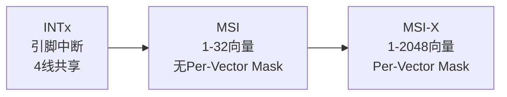
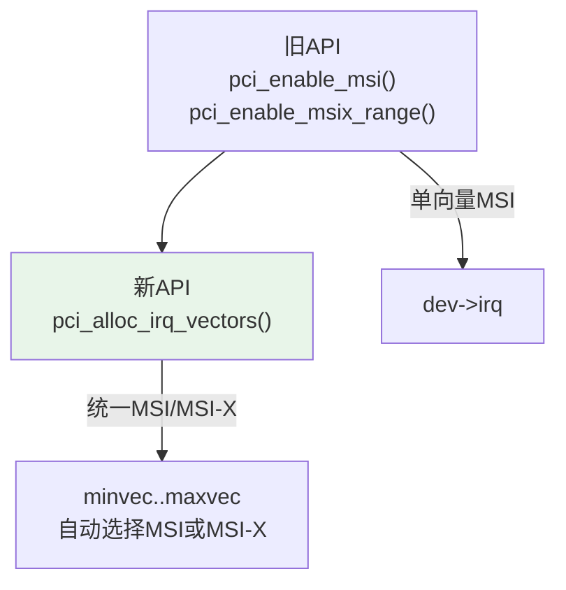
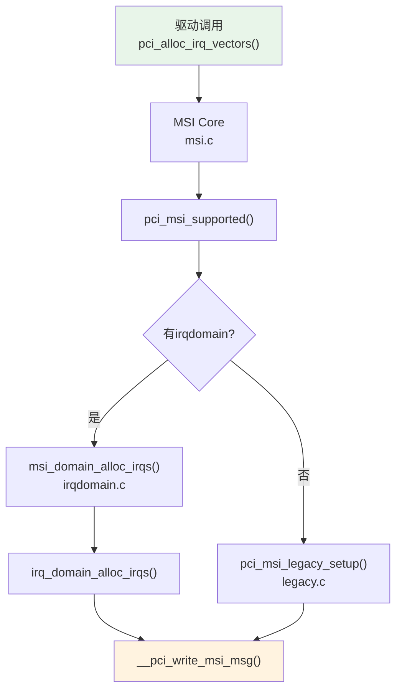
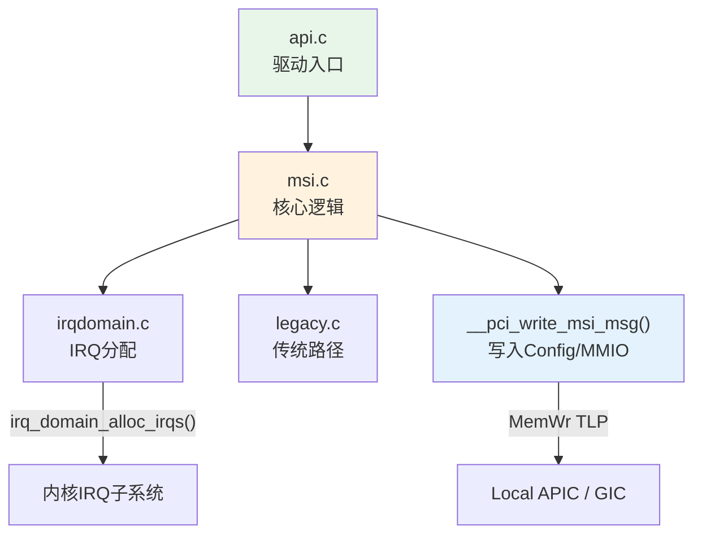

# MSI / MSI-X 中断机制

> 核心问题：PCIe设备如何高效地异步通知CPU？MSI/MSI-X在内核中如何实现？
> 关联索引：[PCIe核心知识索引](./pcie-learning-resources.md) Phase 0, 5

### 关键术语
| 缩写 | 全称 | 含义 |
|------|------|------|
| MSI | Message Signaled Interrupt | 基于消息的中断，通过MemWr TLP投递 |
| MSI-X | Message Signaled Interrupt Extended | MSI扩展版，支持更多向量和Per-Vector Mask |
| APIC | Advanced Programmable Interrupt Controller | x86高级可编程中断控制器 |
| ITS | Interrupt Translation Service | ARM GIC中的中断转换服务 |
| LPI | Locality-specific Peripheral Interrupt | ARM GIC中的局部外设中断 |
| IRTE | Interrupt Remapping Table Entry | 中断重映射表项，VT-d安全机制 |

---

## 0. 前置背景

### 0.1 什么是中断

中断是设备通知CPU有事件需要处理的机制。CPU不需要轮询设备状态，而是等待设备主动发出信号：

```
无中断: CPU不断检查设备状态 → 浪费CPU时间
有中断: CPU做其他工作 → 设备完成时通知CPU → CPU响应处理
```

### 0.2 中断控制器

CPU不是直接接收中断信号，而是通过中断控制器中转：

| 架构 | 中断控制器 | MSI目标地址 |
|------|----------|------------|
| x86 | Local APIC (每CPU一个) | 0xFEEx_xxxx (APIC MMIO区域) |
| ARM | GIC ITS (Interrupt Translation Service) | GIC ITS寄存器地址 |
| RISC-V | AIA IMSIC | IMSIC MMIO地址 |

MSI的Message Address就是中断控制器的MMIO地址，写入该地址即触发中断。

### 0.3 为什么PCIe不用引脚中断

传统PCI使用4根物理引脚(INTA-INTD)传递中断信号，存在严重问题：

```
INTx的问题:
1. 共享: 多个设备共享一根引脚，CPU收到中断后必须逐个查询是哪个设备
2. 数量少: 只有4根线，大型系统严重不足
3. 边带信号: 不在PCIe TLP路径上，Switch需要额外逻辑转发
4. 不支持虚拟化: VF无法拥有独立引脚
```

MSI将中断投递变为一次Memory Write TLP，完全融入PCIe数据路径，解决了上述所有问题。

### 0.4 x86 MSI地址格式

x86架构下，MSI的Message Address指向Local APIC的MMIO区域，格式有严格定义：

```
Message Address (32-bit模式):
  [31:20] = 0xFEE  (APIC MMIO基址)
  [19:12] = Destination ID (目标CPU的APIC ID)
  [11]    = RH (Redirection Hint)
  [10]    = DM (Delivery Mode: 0=Fixed, 1=Lowest Priority)
  [9:0]   = 0 (保留)

Message Data:
  [15:8]  = Vector (中断向量号, 0x10-0xFE)
  [7:0]   = Delivery Mode | Trigger Mode | Level等
```

**x2APIC 64-bit地址格式**：

x2APIC将APIC ID从8位扩展到32位，支持更多CPU核心。对应的MSI地址格式也扩展为64位：

```
x2APIC MSI Address (64-bit):
  [63:40] = 0 (保留)
  [39:32] = Destination ID [31:8]   ← x2APIC扩展的高24位
  [31:20] = 0xFEE                    ← APIC MMIO基址
  [19:12] = Destination ID [7:0]     ← 原始8位
  [11]    = RH (Redirection Hint)
  [10]    = DM (Delivery Mode)
  [9:0]   = 0 (保留)

x2APIC MSI Data:
  [63:32] = 0 (保留, 64-bit Data不使用高32位)
  [31:16] = 0 (保留)
  [15:8]  = Vector
  [7:0]   = Delivery Mode | Trigger Mode | Level等
```

> x2APIC要求MSI Capability支持64-bit Address（bit7=1）。如果设备只支持32-bit MSI Address，则Destination ID限制为8位，最多255个CPU目标。Linux内核在x2APIC模式下自动选择64-bit地址格式。

> ARM架构使用GIC ITS，MSI Address指向ITS的GITS_TRANSLATER寄存器，DeviceID由硬件自动附加（从BDF推导）。

**ARM GIC ITS 工作流程**：

GIC ITS (Interrupt Translation Service) 是ARM GICv3/v4中的MSI分发机制，与x86的Local APIC模型有本质区别：

```
x86 MSI路径:
  设备 → MemWr TLP (Address=APIC地址, Data=向量号) → APIC → CPU中断

ARM ITS MSI路径:
  设备 → MemWr TLP (Address=ITS地址, Data=EventID) → ITS → 查表转换 → Redistributor → CPU中断
```

ITS的核心是三张表：

| 表 | 存储位置 | 作用 |
|---|---------|------|
| Device Table | 内存 (由ITS管理) | DeviceID → ITT (Interrupt Translation Table) 索引 |
| ITT | 内存 (由ITS管理) | EventID → LPI (Locality-specific Peripheral Interrupt) 号 |
| Collection Table | 内存 (由ITS管理) | LPI → 目标Redistributor (即目标CPU) |

**DeviceID的附加**：PCIe设备发出的MemWr TLP不携带DeviceID。ITS通过以下方式获取：
- RC从TLP的Requester ID（BDF）推导DeviceID
- 推导规则由`GITS_BASERn`中的DeviceID字段位数决定
- 典型映射：DeviceID = (Bus << 8) | (Dev << 3) | Func，即BDF的低16位

**LPI分配**：ITS为每个EventID分配一个LPI号（范围8192-2^32-1），LPI号通过Collection Table路由到目标CPU的Redistributor。驱动通过irqdomain API分配LPI，无需手动配置ITS表。

---

## 1. 规范机制

### 1.1 中断演进



| 特性 | INTx | MSI | MSI-X |
|------|------|-----|-------|
| 投递方式 | Message模拟边带信号 | MemWr TLP | MemWr TLP |
| 向量数 | 4 (共享) | 1-32 (2的幂) | 1-2048 |
| Per-Vector Mask | ✗ | ✗ | ✓ |
| 地址/数据 | 固定路由 | Capability寄存器 | MMIO表 |
| 配置位置 | Interrupt Pin/Line | MSI Capability | MSI-X Capability + BIR |

### 1.2 MSI本质

MSI的中断投递就是一次**Memory Write TLP**：

```
设备发起 MemWr TLP:
  Address = Message Address (Local APIC地址)
  Data    = Message Data (向量号)
  → APIC接收 → 触发CPU中断
```

> 不需要中断引脚，不需要共享，不需要CPU轮询。

### 1.3 MSI Capability结构

```
Config Space (Capability链表):
┌─────────────────────────────┐
│ Cap ID = 0x05 (MSI)         │  +0
│ Next Ptr                    │  +1
│ Message Control             │  +2  [16bit]
│   [6:4] MME: 启用的向量数   │
│   [7]   64-bit Address Cap  │
│   [8]   Per-Vector Mask Cap │
│   [0]   MSI Enable          │
├─────────────────────────────┤
│ Message Address (Low)       │  +4  [32bit]
│ Message Address (High)      │  +8  [32bit, 可选]
│ Message Data                │  +8/+C [16bit]
│ Mask Bits                   │  +C/+10 [32bit, 可选]
│ Pending Bits                │  +10/+14 [32bit, 可选]
└─────────────────────────────┘
```

### 1.4 MSI-X Capability与表结构

```
Config Space:
┌─────────────────────────────┐
│ Cap ID = 0x11 (MSI-X)       │  +0
│ Next Ptr                    │  +1
│ Message Control             │  +2  [16bit]
│   [10:0] Table Size (N-1)   │
│   [14]   Function Mask       │
│   [15]   MSI-X Enable        │
├─────────────────────────────┤
│ Table Offset/BIR            │  +4  [偏移 | BAR索引]
│ PBA Offset/BIR              │  +8  [偏移 | BAR索引]
└─────────────────────────────┘

MSI-X Table (MMIO, 每项16B):
┌──────────────────────────────┐
│ Entry 0:                     │
│   Message Address (Low)      │  +0
│   Message Address (High)     │  +4
│   Message Data               │  +8
│   Vector Control (Mask bit)  │  +C  [bit0=1: masked]
├──────────────────────────────┤
│ Entry 1: ...                 │
└──────────────────────────────┘

Pending Bit Array (PBA):
  Bit[i] = 1: Entry[i]有中断被Mask时挂起
```

**MSI vs MSI-X关键区别**：
- MSI的地址/数据在Config Space中，数量有限(最多32)
- MSI-X的地址/数据在MMIO表中(BAR空间)，数量可达2048
- MSI-X支持Per-Vector Mask，MSI不支持(除非有Extended Capability)

---

## 2. Linux内核实现

### 2.1 代码结构

```
drivers/pci/msi/
├── msi.c          # MSI核心逻辑: enable/disable/mask/unmask/write_msg
├── api.c          # 驱动API: pci_enable_msi/msix/alloc_irq_vectors
├── irqdomain.c    # irqdomain集成: 分配/释放IRQ
├── legacy.c       # 非irqdomain路径 (x86传统)
└── pcidev_msi.c   # pci_dev MSI相关操作
```

### 2.2 全局开关

```c
// drivers/pci/msi/msi.c
bool pci_msi_enable = true;  // 可通过 pci=nomsi 关闭
```

### 2.3 MSI支持检查

```c
// drivers/pci/msi/msi.c
// 简化实现，省略了内核源码中的英文注释和 pci_msi_mask_irq 等回调函数
static int pci_msi_supported(struct pci_dev *dev, int nvec)
{
    struct pci_bus *bus;

    if (!pci_msi_enable)
        return 0;

    if (!dev || dev->no_msi)
        return 0;

    if (nvec < 1)
        return 0;

    for (bus = dev->bus; bus; bus = bus->parent)
        if (bus->bus_flags & PCI_BUS_FLAGS_NO_MSI)
            return 0;

    return 1;
}
```

### 2.4 驱动API演进



**推荐使用新API**：

```c
// 驱动中启用MSI-X
int nvec = pci_alloc_irq_vectors(dev, minvec, maxvec,
                                  PCI_IRQ_MSIX | PCI_IRQ_MSI);
if (nvec < 0)
    return nvec;  // 失败

// 请求中断
for (i = 0; i < nvec; i++)
    request_irq(pci_irq_vector(dev, i), handler, 0, name, data);

// 清理
pci_free_irq_vectors(dev);
```

### 2.5 MSI消息写入

```c
// drivers/pci/msi/msi.c
// 简化实现，省略了 pci_write_msg_msix() 和 pci_write_msg_msi() 的内部实现细节
void __pci_write_msi_msg(struct msi_desc *entry, struct msi_msg *msg)
{
    struct pci_dev *dev = msi_desc_to_pci_dev(entry);

    if (dev->current_state != PCI_D0 || pci_dev_is_disconnected(dev)) {
        /* Don't touch the hardware now */
    } else if (entry->pci.msi_attrib.is_msix) {
        pci_write_msg_msix(entry, msg);
    } else {
        pci_write_msg_msi(dev, entry, msg);
    }

    entry->msg = *msg;

    if (entry->write_msi_msg)
        entry->write_msi_msg(entry, entry->write_msi_msg_data);
}
```

### 2.6 MSI-X Mask/Unmask

```c
// drivers/pci/msi/msi.c
// 简化实现，省略了 pci_msi_mask_irq 回调函数和 irq_chip 集成
void pci_msi_update_mask(struct msi_desc *desc, u32 clear, u32 set)
{
    struct pci_dev *dev = msi_desc_to_pci_dev(desc);
    raw_spinlock_t *lock = &dev->msi_lock;
    unsigned long flags;

    if (!desc->pci.msi_attrib.can_mask)
        return;

    raw_spin_lock_irqsave(lock, flags);
    desc->pci.msi_mask &= ~clear;
    desc->pci.msi_mask |= set;
    pci_write_config_dword(dev, desc->pci.mask_pos, desc->pci.msi_mask);
    raw_spin_unlock_irqrestore(lock, flags);
}

// MSI-X的Per-Vector Mask (实际路径: pci_msix_mask → pci_msix_write_vector_ctrl)
// drivers/pci/msi/msi.h
// 简化实现，省略了 desc->pci.msix_ctrl 的缓存同步和 readl 刷新
void pci_msix_mask(struct msi_desc *desc)
{
    desc->pci.msix_ctrl |= PCI_MSIX_ENTRY_CTRL_MASKBIT;
    pci_msix_write_vector_ctrl(desc, desc->pci.msix_ctrl);
}

void pci_msix_unmask(struct msi_desc *desc)
{
    desc->pci.msix_ctrl &= ~PCI_MSIX_ENTRY_CTRL_MASKBIT;
    pci_msix_write_vector_ctrl(desc, desc->pci.msix_ctrl);
}

static inline void pci_msix_write_vector_ctrl(struct msi_desc *desc, u32 ctrl)
{
    void __iomem *desc_addr = pci_msix_desc_addr(desc);

    if (desc->pci.msi_attrib.can_mask)
        writel(ctrl, desc_addr + PCI_MSIX_ENTRY_VECTOR_CTRL);
}
```

### 2.7 irqdomain集成

```c
// drivers/pci/msi/irqdomain.c
// 简化实现，省略了 pci_msi_teardown_msi_irqs 和架构特定的 irqdomain 回调链
int pci_msi_setup_msi_irqs(struct pci_dev *dev, int nvec, int type)
{
    struct irq_domain *domain;

    domain = dev_get_msi_domain(&dev->dev);
    if (domain && irq_domain_is_hierarchy(domain))
        return msi_domain_alloc_irqs_all_locked(&dev->dev,
                                                 MSI_DEFAULT_DOMAIN, nvec);

    return pci_msi_legacy_setup_msi_irqs(dev, nvec, type);
}
```



---

## 3. 中断亲和性与多向量

### 3.1 多向量MSI

MSI支持1-32个向量（2的幂），通过Multiple Message Enable (MME) 控制：

```c
// MSI Message Control
// MME [6:4]: 启用的向量数 = 2^MME
// MMC [3:1]: 设备支持的最大向量数 = 2^MMC

// 驱动请求4个MSI向量:
int nvec = pci_alloc_irq_vectors(dev, 4, 4, PCI_IRQ_MSI);
// MME = 2 (2^2 = 4 vectors)
// Data字段的低2位作为向量偏移
```

> 多向量MSI要求连续的向量号，分配可能失败。MSI-X无此限制。

### 3.2 MSI vs MSI-X 选择策略

从驱动开发者视角，选择MSI还是MSI-X的决策依据：

| 场景 | 推荐机制 | 原因 |
|------|---------|------|
| 只需1个中断向量 | MSI | 最简单，无需映射MMIO表 |
| 需要2-32个向量，且向量数是2的幂 | MSI | 满足MME约束，分配成功率高 |
| 需要非2的幂向量数（如3、5、6） | MSI-X | MSI只支持2的幂，MSI-X支持任意数量 |
| 需要Per-Vector Mask | MSI-X | MSI不支持Per-Vector Mask（除少数设备有Extended Capability） |
| 需要运行时动态增减向量 | MSI-X | Linux 5.17+支持`pci_msix_alloc_irq_at()`动态分配 |
| NVMe/网卡等高性能设备 | MSI-X | 多队列需要独立向量+Per-Vector Mask |
| SR-IOV VF | MSI-X | VF需要独立中断向量，MSI-X更灵活 |

**推荐做法**：使用`pci_alloc_irq_vectors()`统一API，让内核自动选择：

```c
// 优先尝试MSI-X，回退到MSI
int nvec = pci_alloc_irq_vectors(dev, minvec, maxvec,
                                  PCI_IRQ_MSIX | PCI_IRQ_MSI);
if (nvec < 0) {
    // 最后回退到INTx (不推荐，但某些老旧设备必须)
    nvec = pci_alloc_irq_vectors(dev, 1, 1, PCI_IRQ_LEGACY);
}
```

> 实际上，现代设备几乎都实现了MSI-X。MSI主要存在于老旧设备或低成本设备中。新驱动应优先支持MSI-X。

### 3.3 中断亲和性

```c
// 设置中断亲和性 (绑定到特定CPU)
struct cpumask mask;
cpumask_clear(&mask);
cpumask_set_cpu(3, &mask);
irq_set_affinity(pci_irq_vector(dev, 0), &mask);

// 内核自动调整Message Address
// x86: 修改APIC目标地址
// ARM: 修改GIC ITS的Interrupt Translation Table
```

### 3.4 中断重映射 (Interrupt Remapping)

在虚拟化环境中，VF的MSI地址可能被恶意篡改（GPA指向其他VM的内存）。Intel VT-d提供**中断重映射**保护：

```
无中断重映射:
  VF → MemWr TLP (Address=任意) → APIC → 中断到任意CPU
  风险: VF可伪造中断攻击其他VM

有中断重映射:
  VF → MemWr TLP → IOMMU IRTE检查 → 合法则重映射 → APIC
  IRTE (Interrupt Remapping Table Entry):
    - 验证Source ID (BDF) 是否匹配
    - 验证中断向量是否在授权范围
    - 可修改目标CPU和向量号
```

```c
// Intel VT-d中断重映射
struct irte {
    u64 present:1;        // 条目有效
    u64 fpd:1;            // Fault Processing Disable
    u64 dm:1;             // Delivery Mode
    u64 rh:1;             // Redirection Hint
    u64 tm:1;             // Trigger Mode
    u64 pad:3;
    u64 av:1;             // Auto Verify (SVT)
    u64 sid:16;           // Source ID (BDF)
    u64 dest_id:32;       // 目标APIC ID (可被重写)
    // ...
};
```

> 中断重映射是VF直通安全的必要条件。Linux内核在启用VFIO时自动检查IOMMU中断重映射支持。

### 3.5 动态MSI-X分配

Linux 5.17+ 支持运行时动态分配MSI-X向量：

```c
// 检查是否支持动态分配
bool can_dyn = pci_msix_can_alloc_dyn(dev);

// 动态分配一个向量
struct msi_map map = pci_msix_alloc_irq_at(dev, MSI_ANY_INDEX, NULL);
if (map.virq > 0)
    request_irq(map.virq, handler, 0, name, data);

// 释放
pci_msix_free_irq(dev, map);
```

---

## 4. MSI-X与SR-IOV

VF需要独立的MSI-X向量，内核提供了PF驱动的回调接口：

```c
// PF驱动实现
struct pci_driver my_pf_driver = {
    .sriov_get_vf_total_msix = my_get_vf_total_msix,
    .sriov_set_msix_vec_count = my_set_vf_msix_count,
};

// 查看VF总MSI-X向量数
// cat /sys/bus/pci/devices/.../sriov_vf_total_msix

// 设置单个VF的MSI-X向量数
// echo 32 > /sys/bus/pci/devices/.../sriov_vf_msix_count
```

> 详见 [SR-IOV虚拟化](./sriov-virtualization.md)

---

## 5. 实战调试

### 5.1 查看中断信息

```bash
# 设备中断统计
cat /proc/interrupts | grep -i "nvme\|mlx\|eth"

# MSI-X表 (需要debugfs)
cat /sys/kernel/debug/pci/0000:01:00.0/msix

# 查看设备MSI/MSI-X状态
lspci -vvv -s 01:00.0 | grep -E "MSI|MSI-X"

# 查看已分配的IRQ向量
ls /sys/kernel/irq/ | head -20
cat /sys/kernel/irq/32/type  # 查看IRQ类型
```

### 5.2 常见问题

| 现象 | 原因 | 排查 |
|------|------|------|
| `nvec=-ENOSPC` | 可用向量不足 | 减少maxvec或检查`/proc/interrupts` |
| 中断丢失 | MSI-X Entry被Mask | 检查Vector Control bit0 |
| 性能差 | 所有中断在同一CPU | 设置`irqaffinity=`内核参数 |
| VF无MSI-X | PF未配置VF向量 | 检查`sriov_vf_total_msix` |
| `pci=nomsi` | 全局禁用MSI | 移除该内核参数 |

### 5.3 性能优化

```bash
# irqbalance守护进程 (自动分配中断亲和性)
systemctl status irqbalance

# 手动设置NVMe多队列中断亲和性
for i in /sys/kernel/irq/*/; do
    if grep -q nvme "$i/name" 2>/dev/null; then
        echo $(cat "$i/smp_affinity_list")
    fi
done
```

---

## 6. 代码阅读路线

| 顺序 | 文件 | 关注函数 |
|------|------|----------|
| 1 | `drivers/pci/msi/api.c` | `pci_enable_msi()`, `pci_enable_msix_range()`, `pci_alloc_irq_vectors()` |
| 2 | `drivers/pci/msi/msi.c` | `__pci_write_msi_msg()`, `__pci_read_msi_msg()`, `pci_msi_update_mask()` |
| 3 | `drivers/pci/msi/irqdomain.c` | `pci_msi_setup_msi_irqs()`, `pci_msi_domain_write_msg()` |
| 4 | `drivers/pci/msi/legacy.c` | 传统x86 MSI路径 |
| 5 | `include/uapi/linux/pci_regs.h` | `PCI_MSI_*`, `PCI_MSIX_*` 寄存器定义 |



---

## 参考资料

- [PCIe Base Specification 6.0](https://pcisig.com/specifications) — §6.1.4 MSI Capability, §6.1.5 MSI-X Capability
- [Intel VT-d Specification](https://www.intel.com/content/www/us/en/io/virtualization-technology-for-directed-connectivity-vt-d.html) — 中断重映射
- [ARM GICv3 Architecture Specification](https://developer.arm.com/documentation/) — ITS与LPI机制
- [Linux Kernel Source](https://git.kernel.org/) — `drivers/pci/msi/`, `kernel/irq/`

---

上一篇：[设备枚举流程](./enumeration-flow.md) | 下一篇：[Hot-Plug机制与pciehp驱动](./hotplug-mechanism.md)

---

*源码版本：Linux 6.x | 更新：2026-04-21*
