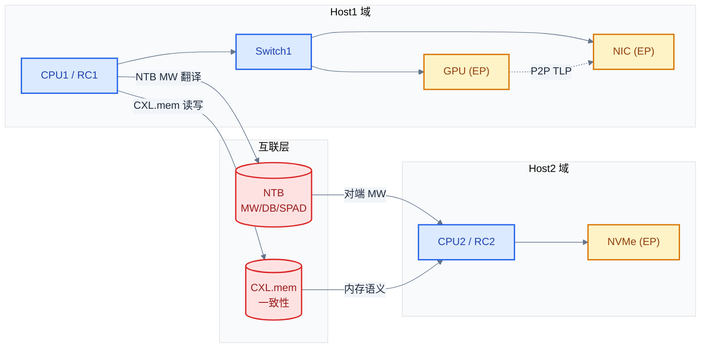
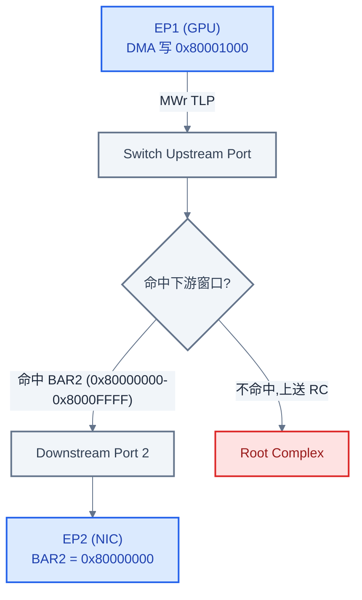
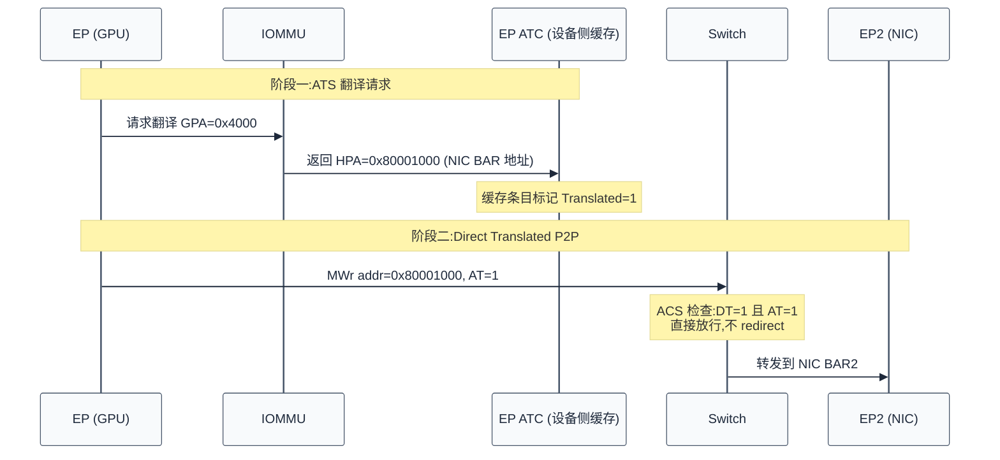
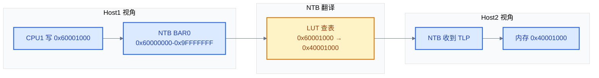
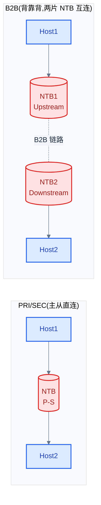
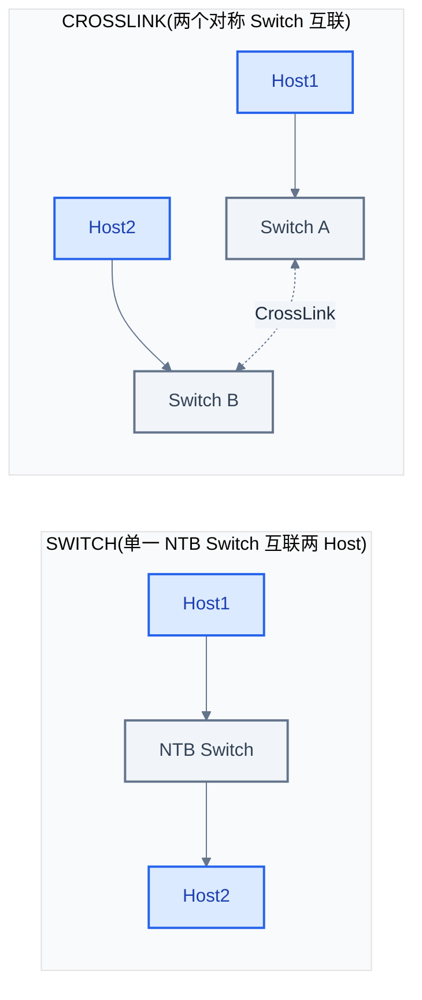
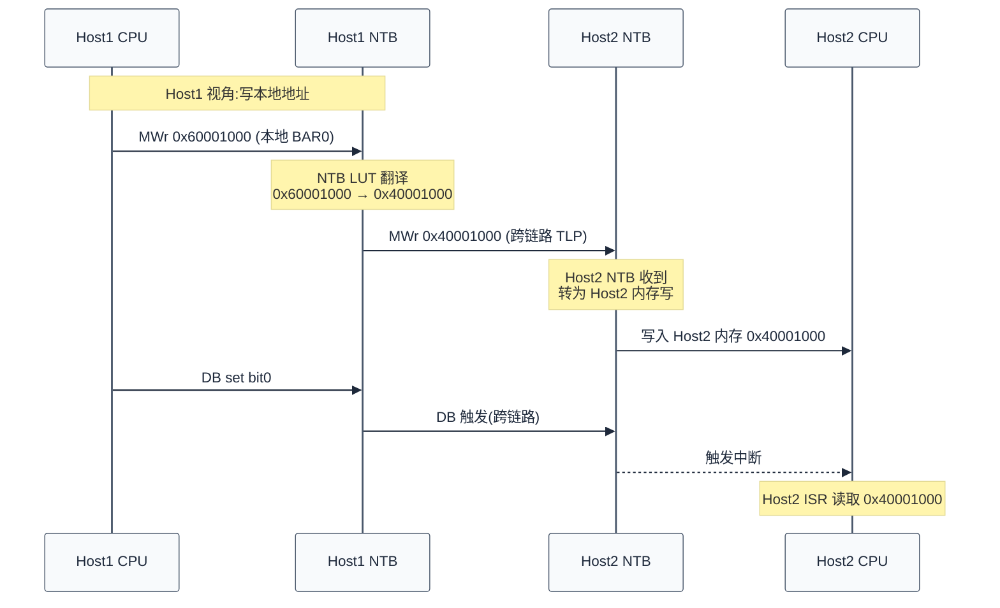
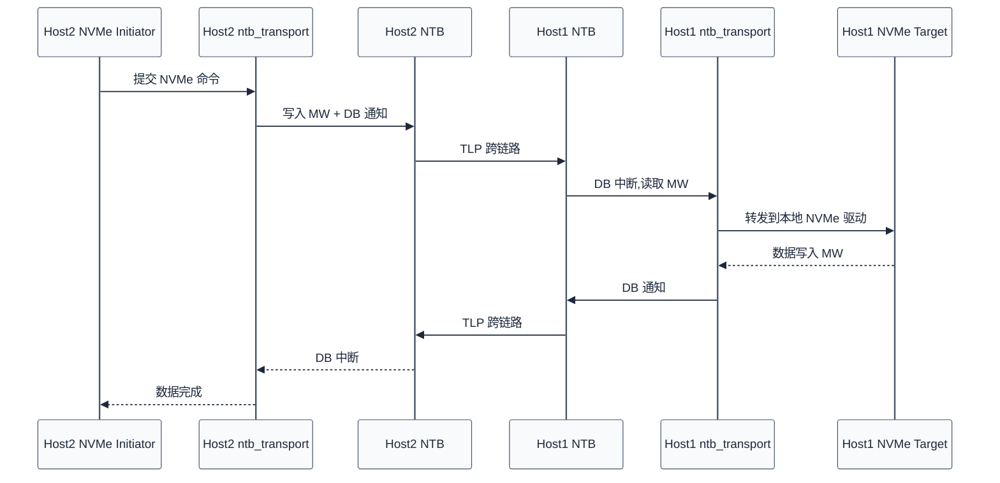
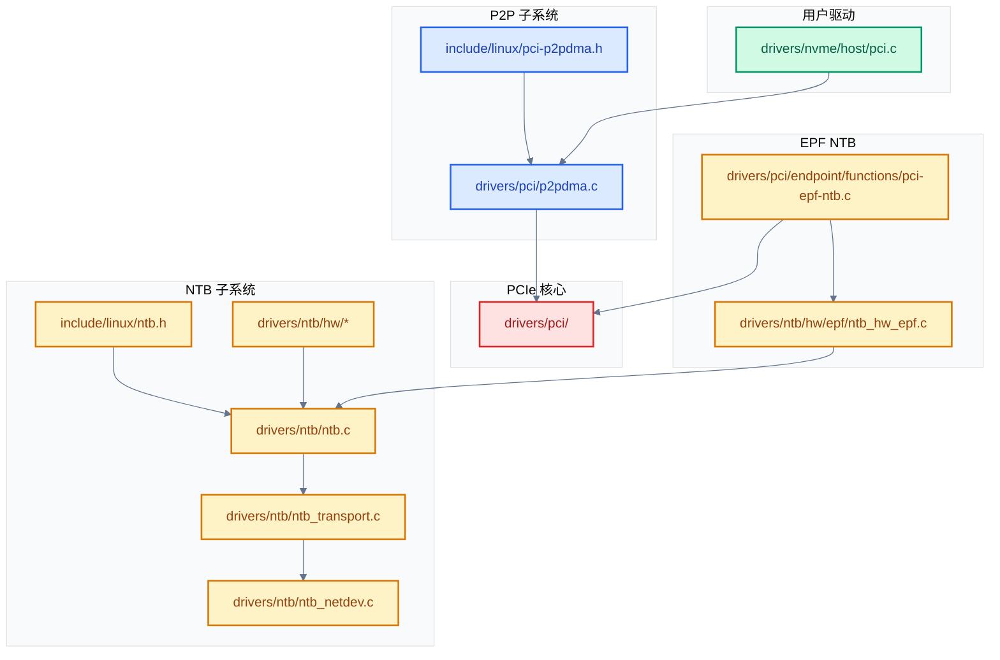

# P2P DMA 与多芯级联 —— 跨 Host/EP 的 PCIe 直传机制

> 核心问题:当数据需要在不同设备、不同 Host 之间流动时，如何绕过"CPU 内存中心化"的默认 PCIe 路由模型?
> **工程师视角**:本文是 Phase 8 现代扩展的深入篇。P2P DMA(同 RC 内两设备直传)、NTB(跨 Host 地址翻译)、CXL.mem(协议层扩展)看似三件事，本质都在回答同一个问题——打破 Root Complex 中心化路由。三者规范成熟度递增，工程取舍各异，适合横向对比学习。
> 关联索引:[PCIe 核心知识索引](./pcie-learning-resources.md) Phase 8 · [SR-IOV 虚拟化](./sriov-virtualization.md) §4 ACS

### 关键术语

| 缩写 | 全称 | 含义 |
|------|------|------|
| P2P | Peer-to-Peer | 设备间直传，不经主机内存 |
| P2PDMA | Peer-to-Peer DMA | Linux 内核对 P2P 的实现框架 |
| NTB | Non-Transparent Bridge | 非透明桥，跨 Host 互联的地址翻译设备 |
| MW | Memory Window | NTB 把对端内存映射到本地的 BAR 窗口 |
| DB | Doorbell | NTB 通知机制，写一位触发对端中断 |
| SPAD | Scratchpad | NTB 两端共享的寄存器，用作小数据交换 |
| ACS | Access Control Services | 访问控制服务，控制 P2P TLP 路由 |
| ATS | Address Translation Service | 地址翻译服务，设备侧缓存 IOMMU 翻译 |
| DT | Direct Translated | ATS P2P 的"已翻译"标志位 |
| CMB | Controller Memory Buffer | NVMe 控制器自带内存，可作 P2P 缓冲 |
| RC | Root Complex | PCIe 树根 |
| TLP | Transaction Layer Packet | 事务层数据包 |
| CXL | Compute Express Link | 基于 PCIe PHY 的互联协议扩展 |
| EPF | Endpoint Function | Linux PCIe Endpoint Framework |
| LUT | Local Address Translation | NTB 内部的本地地址翻译表 |

> 跨规范对照:ACS(PCIe SIG 规范 §6.12) ↔ IOMMU 隔离(架构相关，如 Intel VT-d / ARM SMMUv3 / RISC-V IOMMU);NTB(无 SIG 规范，厂商 de-facto) ↔ OpenSBI M-mode 固件(规范宽松，实现各自为政);CXL.mem(CXL Consortium 规范) ↔ CCIX(Cache Coherent Interconnect for Accelerators，竞争规范，2021 年后基本退出)。

---

## 0. 前置背景

### 0.1 系统上下文

**项目定位**:本文研究"PCIe 数据如何在设备/Host 间直传"的三种机制——P2P DMA、NTB、CXL.mem。它们位于 PCIe 规范的"扩展能力"层，在标准 RC 中心化路由模型之外打开旁路。理解它们需要同时掌握:PCIe 路由规则(规范层)、Linux 内核 P2PDMA / NTB 框架(实现层)、跨 Host 拓扑与 BIOS 配置(系统层)。

**软硬件耦合点**:

- **设备 BAR ↔ P2P 路由**:P2P TLP 的目标地址必须命中对端设备 BAR,Switch 才能完成"向下转发"。BAR 大小/位置(详见 [BAR 与资源分配](./bar-resource-allocation.md) §3)直接决定 P2P 可行性
- **ACS 控制位 ↔ IOMMU 安全模型**:ACS 在硬件层拦截 P2P TLP,IOMMU 在地址翻译层审计 DMA，二者协同维持虚拟化隔离(详见 [SR-IOV 虚拟化](./sriov-virtualization.md) §4)
- **NTB MW ↔ ZONE_DEVICE**:NTB 把对端内存映射进本地 BAR,Linux 用 `devm_memremap_pages()` 把这段 MMIO 包装成 `struct page`，这是与 P2P 共用的基础设施
- **CXL.mem ↔ 缓存一致性域**:CXL.mem 把远端内存纳入 Host 的缓存一致性域，需要 Host CPU 一致性控制器 + CXL 设备的 snoop 响应，任一端缺失都会降级为非一致性模式

**跨实现/跨架构对比**:

| 对比维度 | P2P DMA | NTB | CXL.mem |
|----------|---------|-----|---------|
| 适用范围 | 单 RC 内两设备 | 跨 RC/跨 Host | 跨 Host 内存池化 |
| 规范来源 | PCIe Base Spec §2.2/§6.12 | 无 SIG 规范，厂商 de-facto | CXL 3.1 Spec |
| 地址翻译 | 不翻译，直接用 Bus 地址 | 硬件 LUT 翻译 | 协议层翻译 + 一致性 |
| 缓存一致性 | 无 | 无 | 有(CXL.cache 子协议) |
| Linux 框架 | `drivers/pci/p2pdma.c` | `drivers/ntb/` | `drivers/cxl/` |
| 典型场景 | GPU Direct RDMA | 跨 Host NVMe 共享 | 内存池、CXL 内存扩展 |



> **如何读这张图**:实线是 PCIe 物理拓扑(Host1 内 Switch1 下挂 GPU/NIC,Host2 直接挂 NVMe);虚线是数据流。**P2P**(黄色虚线)完全在 Host1 域内，从 GPU 直达 NIC,**不经 CPU1**。**NTB**(红色实线)是物理桥，两端各自呈现为本地 EP，本地 CPU 写 NTB BAR 等于写对端内存。**CXL.mem** 也是物理链路，但走协议层而非纯地址路由。

### 0.2 三个层次的本质问题 —— 用小例子先行

下面用"GPU 把 4KB 数据送给 NIC 发出"这一场景，走完三个层次。

**层次一:不用 P2P(传统路径)**

1. GPU 驱动调用 `dma_alloc_coherent()` 在主机内存分配 4KB 缓冲，得到 HPA `0x40000000`
2. GPU 配置 DMA:把数据写到 HPA `0x40000000`(GPU → RC → 主机内存，一次 PCIe 写)
3. NIC 驱动配置 DMA:从 HPA `0x40000000` 读数据(NIC → RC → 主机内存，一次 PCIe 读)
4. NIC 把数据从本地 FIFO 送上网线

总数据流:`GPU → 主机内存 → NIC`,**两次穿越 PCIe 链路、两次占用主机内存带宽**。

**层次二:用 P2P DMA(同 RC 内直传)**

1. NIC 驱动调用 `pci_alloc_p2pmem(nic, 4096)` 在 NIC 的 BAR2 上分配 4KB，得到 Bus 地址 `0x80000000`，内核虚拟地址 `vaddr`
2. NIC 驱动把 `vaddr` 传给 GPU 驱动(经 dma-buf 等机制)
3. GPU 驱动调用 `dma_map_page()` 把这个 P2P page 映射成 GPU 可 DMA 的地址——内核识别这是 P2P page，直接返回 Bus 地址 `0x80000000`(不加 IOVA 翻译)
4. GPU 把数据写到 `0x80000000`(GPU → Switch → NIC 的 BAR2,**直传，不经主机内存**)
5. NIC 检测到 BAR2 收到数据，发出

总数据流:`GPU → Switch → NIC`,**一次 PCIe 写、零主机内存占用**。前提:GPU 与 NIC 在同一 Switch 下(或 ACS 允许 P2P)、NIC 暴露了 P2P 内存。

**层次三:用 NTB(跨 Host 共享)**

1. Host1 与 Host2 通过 NTB 物理连接。Host1 侧 NTB 暴露 BAR0(本地地址 `0x60000000`)，映射到 Host2 内存窗口 `0x0000_4000_0000`-`0x0000_7FFF_FFFF`(1GB)
2. Host2 在该窗口内分配一段 4KB 给一个共享队列，队列地址在 Host2 视角是 `0x0000_4000_1000`
3. Host1 通过 NTB 的 LUT(Local Address Translation)配置:`0x6000_1000` → `0x0000_4000_1000`(对端 Host2 内存地址)
4. Host1 写 `0x6000_1000` 实际落到 Host2 的 `0x0000_4000_1000`
5. Host1 写 NTB Doorbell bit0，触发 Host2 NTB 驱动中断，Host2 读取该 4KB 数据

总数据流:`Host1 CPU → Host1 NTB BAR0 → (NTB 物理链路) → Host2 NTB → Host2 内存`。NTB 在两端都呈现为本地 EP，软件层面看不到"跨 Host"，只看到"写本地地址 = 写对端内存"。

> **核心要点**:三个例子的本质差异是"地址落到哪里"。传统路径:地址落到主机内存;P2P:地址落到对端设备 BAR(同 RC 内);NTB:地址落到本地 NTB BAR(被硬件翻译到对端 Host 内存)。地址路由判定由 PCIe Switch/RC 与 NTB LUT 完成，软件只需正确填写 DMA 地址。

### 0.3 为什么不能简单地把两台设备接到同一 Switch

直观想法:既然 P2P 就是"两台设备接同一 Switch"，那随便接不就行了?问题在于**安全**。

PCIe 默认信任模型假设:任何 EP 的 DMA 可访问任意主机内存(早期无 IOMMU 时代)。这种模型在虚拟化场景立即崩溃——VF0 的 DMA 可以读写 VF1 的内存，甚至读写宿主机内核内存。两个解法并行出现:

1. **IOMMU**(架构相关):在 RC 处审计每个 DMA TLP，按页表决定允许/拒绝/翻译。这是软件层的隔离
2. **ACS**(PCIe 规范 §6.12):在 Switch/Root Port 处强制把 P2P TLP 上送到 RC，让 IOMMU 能审计。这是硬件层的隔离

ACS 的几个关键位(`PCI_ACS_RR` / `PCI_ACS_CR` / `PCI_ACS_EC`)一旦置位，**所有 P2P TLP 都被强制 redirect 到上游**，即使两台设备在同一 Switch 下也无法直传。这就是 P2P 在虚拟化平台上常常不工作的根因——BIOS 默认开启 ACS 以保安全。

> 详见 [SR-IOV 虚拟化](./sriov-virtualization.md) §4 ACS 与 §0.3 IOMMU 安全模型。本文 §1.2-1.3 会展开 ACS 真值表。

### 0.4 三种机制的设计哲学

| 维度 | P2P DMA | NTB | CXL.mem |
|------|---------|-----|---------|
| 规范成熟度 | 规范允许，实现可选 | 无统一规范，厂商各自 | 完整规范(CXL 3.1) |
| 谁来做翻译 | 不翻译 | NTB 硬件 LUT | 协议层 + Host 一致性控制器 |
| 软件框架复杂度 | 中(单文件 ~1200 行) | 高(NTB core + transport + 多驱动) | 高(独立子系统 `drivers/cxl/`) |
| 设计哲学 | 最小侵入，复用 DMA 框架 | 硬件抽象，统一 ops 接口 | 协议重构，从 I/O 升级到内存语义 |

> **核心要点**:三者的演进反映 PCIe 生态的"螺旋上升":早期 P2P(规范默许，实现简单)→ 跨 Host 互联的 NTB(厂商各自为政)→ 协议层标准化的 CXL(规范驱动生态)。从"打破 RC 中心化"的角度看，三者递进;从"工程落地"角度看，P2P 最轻、NTB 最重、CXL 介于其间。

---

## 1. P2P DMA 规范机制

> §0 用三个小例子摆出"打破 RC 中心化"的共同本质。但规范层面凭什么允许 P2P?默认路由规则下 P2P 是怎么发生的?ACS 又是如何拦截的?本章用 PCIe Base Spec §2.2 与 §6.12 回答这些问题——先讲路由判定，再讲 ACS 五位控制，最后给出真值表与 ATS 扩展。

### 1.1 P2P TLP 的路由判定

PCIe Base Spec §2.2 定义了三种 TLP 路由方式:地址路由(Address Routing)、ID 路由(ID Routing)、隐式路由(Implicit Routing)。P2P 走的是**地址路由**。

**地址路由规则**(简化版，详见 PCIe Base Spec §2.2.4):

1. **Downstream Port 收到 MRd/MWr TLP**:检查 TLP 地址是否命中某个下游 Bridge 的内存窗口
   - 命中:向下转发到该 Bridge
   - 不命中:若该端口允许 P2P 转发(ACS 未 redirect)，按 Upstream 处理;否则丢弃/上送
2. **Upstream Port 收到 MRd/MWr TLP**:总是向上转发(除非命中本 Switch 的另一 Downstream Port，这种情况叫"Turnaround")

**P2P 发生的关键**:当一个 EP 发出 MWr TLP(目标地址 = 另一个 EP 的 BAR 地址)给上游 Switch 的 Upstream Port 时，Switch 检查所有 Downstream Port 的内存窗口，如果命中，就把 TLP 转回下游。这就是 P2P。



**规范不强制 Switch 支持 P2P 转发**。PCIe Base Spec §2.2 允许 Switch 在 Upstream Port 收到 TLP 时"不回看下游"——这种 Switch 把所有上行 TLP 直接送给 RC,P2P 失败。这是为什么 Linux `pci_p2pdma_whitelist[]` 要逐个 Switch 验证。

### 1.2 ACS —— P2P 的"安全闸"

ACS(Access Control Services，访问控制服务)是 PCIe Base Spec §6.12 定义的可选 Capability，核心作用是**在硬件层控制 TLP 路由**，为虚拟化隔离提供硬件支持。详见 [SR-IOV 虚拟化](./sriov-virtualization.md) §4.1。

ACS Control Register 的关键位(PCIe Base Spec §6.12.1):

| 位 | 名称 | 作用 |
|----|------|------|
| SV | Source Validation | 校验 Requester ID 是否被允许 |
| RR | P2P Request Redirect | 把出向 P2P 请求 redirect 到上游 |
| CR | P2P Completion Redirect | 把 P2P 完成包 redirect 到上游 |
| UF | Upstream Forwarding | 强制所有 P2P 上送 |
| DT | Direct Translated Enable | 允许 ATS Direct Translated P2P(详见 §1.4) |
| EC | Egress Control | 按 Requester ID 限制出口 |
| TB | Translation Blocking | 阻止从下游发出带翻译的请求 |

对 P2P 影响最大的是 **RR / CR / UF** 三位。任意一位置位都会改变 P2P 路径:

- `RR=1`:EP 发给其他 EP 的请求被 Switch 上送，RC 再下发，绕道 RC
- `CR=1`:完成包同样绕道 RC
- `UF=1`:所有 P2P TLP 一律上送，完全禁止直传

**为什么这么设计**:在 SR-IOV 场景下，VF0 与 VF1 可能在同一 Switch 下，如果允许 P2P 直传，VF0 可以直接读写 VF1 的 BAR，绕过 IOMMU 隔离。RR/CR 把 TLP 强制送到 RC，让 IOMMU 能审计，从而维持隔离。

### 1.3 P2P 路径与 ACS 位的真值表

下表列出 5 种有意义的 ACS 组合及对应 P2P 行为:

| ACS RR/CR/UF | P2P 路径 | Switch 行为 | 性能 | 安全性 |
|--------------|---------|------------|------|--------|
| 0/0/0 | EP→Switch→EP(直传) | 转回下游 | 最优 | 弱(无 IOMMU 审计) |
| 0/0/1 | EP→Switch→RC→Switch→EP | UF 强制上送 | 最差(2 次穿越) | 强 |
| 1/0/0 | EP→Switch→RC→Switch→EP(请求绕) | 请求绕道，完成直传 | 中差 | 强 |
| 1/1/0 | EP→Switch→RC→Switch→EP(双向绕) | 请求与完成都绕道 | 差 | 强 |
| 1/1/1 | 完全绕道 | 等同 UF | 最差 | 最强 |

> **如何读这张表**:第一列是 ACS 控制位的组合，从左到右依次是 RR/CR/UF。**RR/CR/UF 任意一位为 1 都会改变 P2P 路径**——性能从最优(0/0/0)递减到最差(1/1/1)，安全性反向递增。**实际系统**的 BIOS 默认设置通常是 `1/1/0`(请求与完成都 redirect)，这是"安全优先"的取舍。要做 P2P 必须显式关闭这些位，常用内核参数 `pci=disable_acs_redir=<BDF>`。

### 1.4 ATS 与 Direct Translated P2P

**ATS(Address Translation Service，地址翻译服务)** 让 EP 在本地缓存 IOMMU 翻译结果(GPA→HPA)，避免每次 DMA 都查 IOMMU。详见 [SR-IOV 虚拟化](./sriov-virtualization.md) §3 ATS。

ATS 引入了一个新场景:**Direct Translated P2P**。当 ATS 缓存的翻译指向**另一个设备的 BAR 地址**时(而不是主机内存)，理论上可以走 P2P 直传。但这要求:

1. ACS 的 DT 位(Direct Translated Enable)必须置位
2. 两台设备的 ATS 缓存必须一致
3. IOMMU 必须显式允许这种"翻译后 P2P"

**为什么需要 DT 位**:常规 ACS 拦截 P2P 是为了安全审计，但 ATS 已经把翻译结果缓存了——ATS 缓存的地址是 IOMMU 已经审计过的"安全地址"。DT 位等于说"既然已经翻译过了，就直接放行"。这绕过了 RR/CR 的 redirect，但前提是 IOMMU 已经为这次 DMA 翻译并校验过。



> **核心要点**:ATS Direct Translated P2P 是"安全 P2P"的规范答案——既享受 P2P 直传的性能，又保留 IOMMU 审计的安全性。但实现复杂度高(需要 IOMMU、ATS、ACS DT 位协同)，目前主流 Linux P2PDMA 框架主要走 `BUS_ADDR` 路径(同 Switch 下直接用 Bus 地址),DT P2P 多见于数据中心 GPU/NIC。

---

## 2. P2P Linux 内核实现

> §1 在规范层确认了两件事:规范允许 P2P(§1.1)，但 ACS 默认拦截(§1.2)。本章用 `drivers/pci/p2pdma.c` 回答内核如何落地——先看映射类型的语义设计，再看 `calc_map_type_and_dist()` 的三段式决策(距离 + ACS + 白名单)，然后看 ZONE_DEVICE 如何把 MMIO 包装成 `struct page`，最后看 provider 选择算法。

### 2.1 四种映射类型的设计意图

`enum pci_p2pdma_map_type`(定义在 [include/linux/pci-p2pdma.h](file:///home/pbw/sg2046/linux-common/include/linux/pci-p2pdma.h) 第 31-68 行)是 P2PDMA 框架的核心枚举，描述"客户端设备如何访问 provider 设备的 P2P 内存":

```c
/* 摘自 include/linux/pci-p2pdma.h 第 31-68 行 */
enum pci_p2pdma_map_type {
    PCI_P2PDMA_MAP_UNKNOWN = 0,    /* 内部初始状态,API 不返回此值 */
    PCI_P2PDMA_MAP_NONE,           /* 非 P2P 传输(普通 DMA) */
    PCI_P2PDMA_MAP_NOT_SUPPORTED,  /* 跨 Host Bridge 且未在白名单 */
    PCI_P2PDMA_MAP_BUS_ADDR,       /* 同 Switch 内,直接用 Bus 地址 */
    PCI_P2PDMA_MAP_THRU_HOST_BRIDGE, /* 跨 Host Bridge 但在白名单 */
};
```

四种"有意义"的映射类型语义对照:

| 类型 | 含义 | 编程 DMA 地址 | 适用条件 |
|------|------|--------------|---------|
| `MAP_NONE` | 非 P2P | 标准 CPU 物理地址或 IOVA | provider 内存非 P2P |
| `MAP_BUS_ADDR` | 同 Switch 直传 | provider 的 PCI Bus 地址 | provider 与 client 同上游桥，ACS 不拦截 |
| `MAP_THRU_HOST_BRIDGE` | 跨 Host Bridge | CPU 物理地址或 IOVA | provider 与 client 跨 Host，但 Host 在白名单 |
| `MAP_NOT_SUPPORTED` | 不支持 | 报错 | 跨 Host 且不在白名单 |

> **如何读这张表**:关注"编程 DMA 地址"列——`MAP_BUS_ADDR` 与其他三种的本质区别就在这里。`MAP_BUS_ADDR` 时，DMA 引擎被编程的是 **PCI Bus 地址**(provider 在 PCI 总线上的地址)，不经过 IOMMU 翻译;其余三种都是经过标准 DMA 映射的地址(CPU 物理地址或 IOVA)。这就是为什么 `MAP_BUS_ADDR` 性能最好——零翻译开销。

**设计意图**:`MAP_BUS_ADDR` 与 `MAP_THRU_HOST_BRIDGE` 的区分反映了一个工程取舍——同 Switch 内的 P2P 一定不走 Host Bridge(物理上不可能走)，所以可以直接用 Bus 地址;跨 Host Bridge 的"伪 P2P"实际会穿越 Host Bridge，这时用 CPU 物理地址让 Host Bridge 自己路由更可靠。

### 2.2 calc_map_type_and_dist() —— 距离 + ACS + 白名单三段式决策

`calc_map_type_and_dist()`(定义在 [drivers/pci/p2pdma.c](file:///home/pbw/sg2046/linux-common/drivers/pci/p2pdma.c) 第 686-779 行)是 P2PDMA 的核心决策函数。给定 provider 与 client，它要回答两个问题:能否 P2P?如果能，距离多远?其逻辑可拆为三段:

```c
/* 简化伪代码,源自 drivers/pci/p2pdma.c 第 686-779 行 calc_map_type_and_dist() */
static enum pci_p2pdma_map_type
calc_map_type_and_dist(provider, client, dist, verbose) {
    map_type = PCI_P2PDMA_MAP_THRU_HOST_BRIDGE;  /* 默认走 Host Bridge */
    acs_redirects = false;

    /* 第一段:沿上游遍历,找公共祖先 + 检查 ACS */
    while (a = provider 上游链) {
        if (pci_bridge_has_acs_redir(a))  /* ACS RR/CR/EC 任一置位 */
            acs_cnt++;
        while (b = client 上游链) {
            if (a == b) goto check_b_path_acs;  /* 找到公共祖先 */
            dist_b++;
        }
        dist_a++;
    }
    /* 没找到公共祖先 → 跨 Host Bridge,跳到第三段 */
    *dist = dist_a + dist_b;
    goto map_through_host_bridge;

check_b_path_acs:
    /* 第二段:检查 client 到公共祖先的 ACS */
    while (bb = client → 公共祖先) {
        if (pci_bridge_has_acs_redir(bb)) acs_cnt++;
    }
    if (!acs_cnt) {
        map_type = PCI_P2PDMA_MAP_BUS_ADDR;  /* 同 Switch,无 ACS */
        goto done;
    }
    /* 有 ACS redirect,降级到 THRU_HOST_BRIDGE 或 NOT_SUPPORTED */
    acs_redirects = true;

map_through_host_bridge:
    /* 第三段:跨 Host Bridge 时查白名单 */
    if (!cpu_supports_p2pdma() &&                       /* 非 AMD Zen+ */
        !host_bridge_whitelist(provider, client, ...))  /* 不在白名单 */
        map_type = PCI_P2PDMA_MAP_NOT_SUPPORTED;
done:
    return map_type;
}
```

`pci_bridge_has_acs_redir()` 的判定就是检查 ACS 三位:

```c
/* 摘自 drivers/pci/p2pdma.c 第 493-508 行 pci_bridge_has_acs_redir() */
static int pci_bridge_has_acs_redir(struct pci_dev *pdev) {
    int pos;
    u16 ctrl;
    pos = pdev->acs_cap;
    if (!pos)
        return 0;
    pci_read_config_word(pdev, pos + PCI_ACS_CTRL, &ctrl);
    if (ctrl & (PCI_ACS_RR | PCI_ACS_CR | PCI_ACS_EC))  /* RR/CR/EC */
        return 1;
    return 0;
}
```

**白名单的设计原因**:跨 Host Bridge 的 P2P 在规范上不保证，但部分 Intel/AMD/Google 平台的 Host Bridge 确实支持"回头转发"(从下游收到的 TLP 又送回下游另一端口)。`pci_p2pdma_whitelist[]` 列出这些已知可用的平台:

```c
/* 摘自 drivers/pci/p2pdma.c 第 531-554 行 pci_p2pdma_whitelist[]，已省略部分条目 */
static const struct pci_p2pdma_whitelist_entry {
    unsigned short vendor;
    int device;
    enum { REQ_SAME_HOST_BRIDGE = 1 << 0 } flags;
} pci_p2pdma_whitelist[] = {
    {PCI_VENDOR_ID_INTEL,  0x3c00, REQ_SAME_HOST_BRIDGE},  /* Xeon E5 */
    {PCI_VENDOR_ID_INTEL,  0x2f00, REQ_SAME_HOST_BRIDGE},  /* Xeon E7 v3 */
    {PCI_VENDOR_ID_INTEL,  0x2030, 0},                     /* Skylake-E */
    {PCI_VENDOR_ID_GOOGLE, PCI_ANY_ID, 0},                 /* Google SoCs */
    {}  /* ... 省略 0x3c01/0x2f01/0x2031-0x2033/0x2020/0x09a2 等条目 ... */
};
```

> **核心要点**:`calc_map_type_and_dist()` 体现了"距离 + ACS + 白名单"三段式决策的设计——先找最近公共祖先(同 Switch 内?跨 Host Bridge?)，再查 ACS 是否拦截，最后对跨 Host 情况查白名单。这是"规范允许但实现可选"的典型工程化方法:规范说"可能支持"，内核就维护一张"实测支持"的清单。

### 2.3 pci_p2pdma_add_resource() —— ZONE_DEVICE 把 MMIO 变成 struct page

P2P 内存必须能被标准 DMA API 接受，这意味着它必须有 `struct page`(因为 `dma_map_page()` 等接口需要 page)。但 P2P 内存实际是设备的 MMIO，不是 RAM。Linux 用 **ZONE_DEVICE** + `devm_memremap_pages()` 把 MMIO 包装成 `struct page`。

```c
/* 简化摘录,源自 drivers/pci/p2pdma.c 第 383-463 行 pci_p2pdma_add_resource() */
int pci_p2pdma_add_resource(struct pci_dev *pdev, int bar, size_t size, u64 offset) {
    struct pci_p2pdma_pagemap *p2p_pgmap;
    struct dev_pagemap *pgmap;
    void *addr;

    /* ... 校验 BAR 与 size 省略 ... */

    p2p_pgmap = devm_kzalloc(&pdev->dev, sizeof(*p2p_pgmap), GFP_KERNEL);
    pgmap = &p2p_pgmap->pgmap;
    pgmap->range.start = pci_resource_start(pdev, bar) + offset;
    pgmap->range.end   = pgmap->range.start + size - 1;
    pgmap->type        = MEMORY_DEVICE_PCI_P2PDMA;   /* 关键:标记为 P2P */
    pgmap->ops         = &p2pdma_pgmap_ops;          /* 自定义释放回调 */
    p2p_pgmap->mem     = pcim_p2pdma_provider(pdev, bar);

    /* 把 MMIO 区域映射为 struct page 数组 */
    addr = devm_memremap_pages(&pdev->dev, pgmap);

    /* 把这片内存加入 gen_pool,后续 pci_alloc_p2pmem() 从池里分配 */
    gen_pool_add_owner(p2pdma->pool, (unsigned long)addr,
                       pci_bus_address(pdev, bar) + offset,
                       range_len(&pgmap->range), &pgmap->ref);
    return 0;
}
```

这段代码体现了两个关键设计决策:

1. **`MEMORY_DEVICE_PCI_P2PDMA` 类型标记**:让 `is_pci_p2pdma_page()` 能识别这种 page，后续 DMA 映射时走特殊路径(直接返回 Bus 地址，不调 IOMMU)
2. **`devm_memremap_pages()` 复用 ZONE_DEVICE 基础设施**:HMM、persistent memory 都用同一套机制把非 RAM 内存包装成 page,P2P 复用而非重造

**普通 DMA 页 vs P2P DMA 页对比**:

| 对比维度 | 普通 DMA 页 | P2P DMA 页 |
|----------|------------|------------|
| 物理位置 | 主机 RAM | 设备 MMIO BAR |
| 内存域 | ZONE_NORMAL/HIGH | ZONE_DEVICE |
| `struct page` 来源 | memmap 数组 | `devm_memremap_pages()` 动态生成 |
| DMA 地址 | 经 IOMMU 翻译或直接 HPA | 直接 Bus 地址(`MAP_BUS_ADDR`) |
| 释放回调 | 标准 free_page | `p2pdma_folio_free()` 归还 gen_pool |
| CPU 可访问 | 是 | 是(但访问设备 MMIO 慢) |

### 2.4 pci_alloc_p2pmem() 与内存池

`pci_alloc_p2pmem()`(定义在 [drivers/pci/p2pdma.c](file:///home/pbw/sg2046/linux-common/drivers/pci/p2pdma.c) 第 928-956 行)是驱动申请 P2P 内存的入口:

```c
/* 简化摘录,源自 drivers/pci/p2pdma.c 第 928-955 行 pci_alloc_p2pmem() */
void *pci_alloc_p2pmem(struct pci_dev *pdev, size_t size) {
    void *ret = NULL;
    struct percpu_ref *ref;
    struct pci_p2pdma *p2pdma;

    rcu_read_lock();
    p2pdma = rcu_dereference(pdev->p2pdma);
    if (!p2pdma) goto out;

    /* 从 gen_pool 分配,同时拿到 percpu_ref 用于生命周期管理 */
    ret = (void *)gen_pool_alloc_owner(p2pdma->pool, size, (void **)&ref);
    if (!ret) goto out;

    /* percpu_ref_tryget_live_rcu:防止分配到正在释放的页 */
    if (unlikely(!percpu_ref_tryget_live_rcu(ref))) {
        gen_pool_free(p2pdma->pool, (unsigned long)ret, size);
        ret = NULL;
    }
out:
    rcu_read_unlock();
    return ret;
}
```

**生命周期管理的设计**:`gen_pool` 负责分配/释放，`percpu_ref` 负责生命周期。当 provider 设备被移除时，`pci_p2pdma_release()` 调 `synchronize_rcu()` 等待所有在途分配完成，再 destroy pool。这套设计避免了"分配到的 P2P 页所属设备被拔出"的悬空引用。

### 2.5 pci_p2pmem_find_many() —— orchestrator 挑选最优 provider

当 client(如 NVMe 驱动)需要 P2P 内存但不知道用哪个 provider 时，调用 `pci_p2pmem_find_many()`:

```c
/* 简化伪代码,源自 drivers/pci/p2pdma.c 第 873-918 行 pci_p2pmem_find_many() */
struct pci_dev *pci_p2pmem_find_many(struct device **clients, int num_clients) {
    int closest_distance = INT_MAX;
    struct pci_dev **closest_pdevs;

    closest_pdevs = kmalloc(PAGE_SIZE, GFP_KERNEL);

    for_each_pci_dev(pdev) {  /* 遍历所有 PCI 设备 */
        if (!pci_has_p2pmem(pdev)) continue;

        distance = pci_p2pdma_distance_many(pdev, clients, num_clients, false);
        if (distance < 0 || distance > closest_distance) continue;

        if (distance < closest_distance) {
            /* 找到更近的,清空之前的候选 */
            for (i = 0; i < dev_cnt; i++) pci_dev_put(closest_pdevs[i]);
            dev_cnt = 0;
            closest_distance = distance;
        }
        closest_pdevs[dev_cnt++] = pci_dev_get(pdev);
    }

    /* 距离相等的候选中随机选一个,避免热点 */
    pdev = pci_dev_get(closest_pdevs[get_random_u32_below(dev_cnt)]);
    return pdev;
}
```

**"距离最近 + 等距随机"的设计**:距离越近意味着 P2P 路径越短(同 Switch 内 distance=2，跨 Switch distance=4+)。等距时随机选择，避免所有 client 都集中到同一 provider 形成热点。这是一种简单但有效的负载均衡策略。

### 2.6 典型用户:NVMe CMB、dma-buf、RDMA

P2PDMA 框架的典型用户:

1. **NVMe CMB(Controller Memory Buffer)**:NVMe 控制器在 BAR 上暴露一段内存，主机驱动调用 `pci_p2pdma_add_resource()` 注册为 P2P 资源。其他设备(如 GPU)可以 P2P 直接访问，避免 NVMe 数据经过主机内存中转。详见 `drivers/nvme/host/pci.c`
2. **dma-buf**:dma-buf 是跨子系统的 buffer 共享框架，P2P page 通过 dma-buf 在 GPU、NIC、NVMe 驱动间传递。`dma_buf_map_attachment()` 会调 `pci_p2pdma_map_type()` 自动判定映射方式
3. **RDMA**:Mellanox NIC 支持 P2P，把 GPU 显存直接作为 RDMA 缓冲，实现 GPU Direct RDMA。详见 §5.2

> **核心要点**:Linux P2PDMA 框架的设计哲学是"最小侵入"——复用 ZONE_DEVICE、gen_pool、dma_map_page 等既有基础设施，只在判定映射类型时插入 P2P 特殊逻辑。这让现有驱动几乎不用改就能用上 P2P，只要 BIOS 关掉 ACS、设备暴露 P2P 内存。

---

## 3. NTB 规范与硬件原理

> §2 解决了"单 RC 内 P2P"。但若两台 Host 想用 PCIe 互联，例如 Host1 的 NVMe 给 Host2 用、双控存储的 HA 心跳——单 RC 的 P2P 模型不适用，因为两台 Host 各自有独立 RC、独立地址空间。NTB(Non-Transparent Bridge，非透明桥)就是为此而生:它在两端各呈现为一个本地 EP，内部做地址翻译。本章先讲 NTB 本质与小例子，再讲为何没有 SIG 规范，然后是六种拓扑与 MW/DB/SPAD 三件套。

### 3.1 NTB 的本质 —— "把对端内存映射进本地 BAR"

NTB 是一种特殊的 PCIe 桥，功能上介于透明桥(Transparent Bridge，普通 Switch)与不透明桥之间。透明桥对软件不可见(软件看到的就是普通 Switch),NTB 对软件**显式可见**——两端各自看到一个本地 EP，有自己的 BAR，有自己的配置空间。

**NTB 的核心机制**用一个 3 步小例子说明:

1. **配置**:Host1 NTB BAR0 大小 1GB，映射到 Host2 内存 `0x40000000-0x7FFFFFFF`;Host2 NTB BAR0 同样 1GB，映射到 Host1 内存 `0x40000000-0x7FFFFFFF`
2. **写**:Host1 CPU 写本地 BAR0 内偏移 0x1000,NTB 硬件把地址翻译为 Host2 内存 `0x40001000`，产生 TLP 发给 Host2 NTB,Host2 NTB 把 TLP 转为 Host2 内存写
3. **通知**:Host1 写 NTB Doorbell bit0，触发 Host2 NTB 中断，Host2 驱动读取该 4KB 数据



**关键设计**:NTB 让软件看到的是"本地地址"，硬件做翻译。Host1 的驱动不需要知道 Host2 的地址布局，只管写本地 BAR 即可。

### 3.2 NTB 没有 SIG 规范 —— 厂商 de-facto

PCI-SIG 规范**没有**定义 NTB。NTB 的概念最早由 AMD/Intel/Microsemi(后为 Microchip)等厂商在自家高速互联产品中实现，各家用不同的寄存器布局、不同的 BAR 数量、不同的拓扑支持。这是"规范定义 vs 常见实现"的典型反例——NTB 是厂商实现先于规范，而非规范驱动实现。

主流 NTB 硬件实现:

| 厂商 | 产品 | 寄存器布局 | MW 数 | 拓扑支持 |
|------|------|-----------|-------|---------|
| Intel | Xeon 集成 NTB | Intel 私有 | 6+ | B2B、SWITCH |
| AMD | AMD NTB | AMD 私有 | 2 | PRI/SEC |
| Microchip | Switchtec NTB | Microchip 私有 | 多 | SWITCH、CROSSLINK |
| Linux EPF | pci-epf-ntb | 用 EP 寄存器模拟 | 1 | B2B |

Linux 内核 `drivers/ntb/` 用 `ntb_dev_ops` 抽象这些差异(详见 §4.1)。每家厂商提供一个 `ntb_hw_*` 驱动填 ops 回调，上层 `ntb_transport` / `ntb_netdev` / `ntb_tool` 看到统一接口。

### 3.3 六种拓扑

NTB 连接拓扑由 `enum ntb_topo`(定义在 [include/linux/ntb.h](file:///home/pbw/sg2046/linux-common/include/linux/ntb.h) 第 78-86 行)描述:

```c
/* 摘自 include/linux/ntb.h 第 78-86 行 */
enum ntb_topo {
    NTB_TOPO_NONE = -1,
    NTB_TOPO_PRI,         /* 本地是 NTB Primary 端 */
    NTB_TOPO_SEC,         /* 本地是 NTB Secondary 端 */
    NTB_TOPO_B2B_USD,     /* Back-to-Back,本地上游 */
    NTB_TOPO_B2B_DSD,     /* Back-to-Back,本地下游 */
    NTB_TOPO_SWITCH,      /* 通过支持 NTB 的 Switch 互联 */
    NTB_TOPO_CROSSLINK,   /* 两个对称 Switch 互联 */
};
```

六种拓扑可拆为两组(避免单图节点超 15):

**组一:直连拓扑(PRI / SEC / B2B)**



**组二:Switch 拓扑(SWITCH / CROSSLINK)**



| 拓扑 | 物理形式 | 适用场景 |
|------|---------|---------|
| PRI / SEC | 单 NTB 芯片两端各接一 Host | 简单双 Host 互联 |
| B2B_USD / B2B_DSD | 两片 NTB 互连，区分上下游 | 标准 PCIe 卡式 NTB |
| SWITCH | 一片 NTB Switch，多 Host 共享 | 多 Host 互联(>2) |
| CROSSLINK | 两个 Switch 对称互联 | 高可用，容错 |

### 3.4 NTB 三件套:MW / DB / SPAD

NTB 硬件提供的三类原语:

| 原语 | 全称 | 作用 | 典型大小 |
|------|------|------|---------|
| MW | Memory Window | 把对端内存映射到本地 BAR，可读写大块数据 | 1MB - 1GB |
| DB | Doorbell | 一组位，本地写触发对端中断，用于事件通知 | 16-64 位 |
| SPAD | Scratchpad | 两端共享的寄存器，小数据交换、握手 | 16-64 个 32 位寄存器 |

> **如何读这张表**:MW 是"数据通道"(大块数据),DB 是"事件信号"(异步通知),SPAD 是"控制面"(小数据 + 握手)。三者配合使用——SPAD 交换元信息(队列头尾指针、版本号),DB 触发对端处理，MW 传实际数据。

**NTB 三件套 vs 普通 PCIe BAR 对比**:

| 对比维度 | 普通 EP BAR | NTB MW |
|----------|------------|--------|
| 映射目标 | 设备自身寄存器/FIFO | 对端 Host 内存 |
| 大小 | 设备硬件固定 | 可配置(限定在 BAR 大小内) |
| 地址翻译 | 无 | NTB LUT 翻译 |
| CPU 写语义 | 写设备寄存器 | 写对端内存 |
| 通知机制 | MSI/MSI-X 中断 | Doorbell(独立于 MW) |

### 3.5 NTB 与 P2P 的关系

NTB 与 P2P 在物理层是同一类机制——都是"PCIe TLP 在非默认路径上转发"。区别在抽象层:

- **P2P** = 同 RC 域内，Switch 直接转发，无地址翻译，源/目标都在同一 PCI 总线地址空间
- **NTB** = 跨 RC 域，NTB 翻译地址后转发，源/目标在两个独立 PCI 总线地址空间



> **核心要点**:NTB = P2P 物理层(跨链路 TLP 转发)+ 地址翻译逻辑层(LUT)。从 PCIe 角度看，NTB 就是一个会改地址的"特殊 Switch";从软件角度看，NTB 是一个有 BAR、有 Doorbell、有 Scratchpad 的本地 EP。这种"硬件翻译、软件透明"的设计让上层协议(如 NVMe-over-Fabrics)能复用单机协议栈。

---

## 4. NTB Linux 内核实现

> §3 摆清了 NTB 硬件原理，但各厂商实现差异巨大——Intel/AMD/Microchip 各自寄存器布局不同、MW 数量不同、拓扑支持不同。本章回答内核如何把这些差异抽象成统一接口——`ntb_dev_ops` 是硬件抽象契约(类比 [SR-IOV 虚拟化](./sriov-virtualization.md) §2 的 `plat_psci_ops_t`)，`ntb_transport` 是数据传输层，`pci-epf-ntb` 用 EP 框架软件模拟 NTB。

### 4.1 ntb_dev_ops —— 硬件抽象的契约

`struct ntb_dev_ops`(定义在 [include/linux/ntb.h](file:///home/pbw/sg2046/linux-common/include/linux/ntb.h) 第 261-334 行)是 NTB 硬件抽象的核心，包含约 40 个回调，分为五组:

```c
/* 摘自 include/linux/ntb.h 第 261-334 行 struct ntb_dev_ops */
struct ntb_dev_ops {
    /* 第一组:端口与拓扑 */
    int  (*port_number)(struct ntb_dev *ntb);
    int  (*peer_port_count)(struct ntb_dev *ntb);
    int  (*peer_port_number)(struct ntb_dev *ntb, int pidx);

    /* 第二组:链路状态 */
    u64  (*link_is_up)(struct ntb_dev *ntb, enum ntb_speed *speed, enum ntb_width *width);
    int  (*link_enable)(struct ntb_dev *ntb, enum ntb_speed, enum ntb_width);
    int  (*link_disable)(struct ntb_dev *ntb);

    /* 第三组:Memory Window */
    int  (*mw_count)(struct ntb_dev *ntb, int pidx);
    int  (*mw_set_trans)(struct ntb_dev *ntb, int pidx, int widx,
                         dma_addr_t addr, resource_size_t size);
    int  (*peer_mw_set_trans)(struct ntb_dev *ntb, int pidx, int widx,
                              u64 addr, resource_size_t size);

    /* 第四组:Doorbell */
    u64  (*db_read)(struct ntb_dev *ntb);
    int  (*db_set)(struct ntb_dev *ntb, u64 db_bits);
    int  (*db_clear)(struct ntb_dev *ntb, u64 db_bits);
    int  (*peer_db_set)(struct ntb_dev *ntb, u64 db_bits);

    /* 第五组:Scratchpad 与 Messaging(可选) */
    u32  (*spad_read)(struct ntb_dev *ntb, int sidx);
    int  (*spad_write)(struct ntb_dev *ntb, int sidx, u32 val);
    int  (*peer_spad_write)(struct ntb_dev *ntb, int pidx, int sidx, u32 val);
    /* ... Messaging 接口省略 ... */
};
```

**五组回调的职责对照**:

| 组 | 作用 | 类比对象 |
|----|------|---------|
| 端口与拓扑 | 报告本地端口、对端数量，识别拓扑 | SR-IOV `pci_iov_virtfn_bus()` |
| 链路状态 | 使能/禁止 NTB 链路，查询速率 | PCIe `pcie_get_link_cap()` |
| MW | 配置 MW 翻译，设置窗口地址 | iATU `dw_pcie_prog_outbound_atu()` |
| DB | 读写 doorbell，设置屏蔽 | MSI-X `__pci_write_msi_msg()` |
| SPAD/MSG | 读写共享寄存器，小数据交换 | 无直接对应 |

`ntb_dev_ops_is_valid()` 在注册时强制校验必填字段——`link_is_up` / `link_enable` / `mw_count` / `db_read` / `db_clear` 等必须实现，SPAD 与 Messaging 可选。这种"必选 + 可选"的契约设计允许厂商按硬件能力裁剪。

> **核心要点**:`ntb_dev_ops` 是"通用框架 ↔ 厂商驱动"的契约。框架只调 ops 回调，不直接碰硬件寄存器;厂商驱动只填 ops，不关心上层协议。这与 `plat_psci_ops_t` 在 TF-A 中的角色完全一致(详见 [SR-IOV 虚拟化](./sriov-virtualization.md) §2 框架抽象)——通用代码可移植，平台代码可替换。

### 4.2 ntb_transport —— 数据传输层

`ntb_transport`(驱动 `drivers/ntb/ntb_transport.c`)在 MW 之上构建虚拟通道(vCHN)，提供可靠的数据传输:

- **vCHN 切分**:一个 MW 被切成多个 vCHN，每个 vCHN 是一个独立的数据队列
- **流量控制**:用 SPAD 交换队列头尾指针，实现生产者-消费者模型
- **DB 通知**:数据入队后用 DB 通知对端，避免轮询

数据流(单次发送):

1. 本地驱动把数据写入 MW 中的 vCHN 队列
2. 更新 SPAD 中的"尾指针"
3. 触发 DB bit，通知对端
4. 对端 DB ISR 读取 SPAD 尾指针，从 MW 拷贝数据
5. 对端更新 SPAD"头指针"，回 DB 通知

`ntb_netdev`(`drivers/ntb/ntb_netdev.c`)在 `ntb_transport` 之上注册一个虚拟网卡，把 NTB 当作网络链路用——两台 Host 通过 NTB 互联，IP 层看到的是一个低延迟(μs 级)的"直连网线"。

### 4.3 pci-epf-ntb —— 用 EP 框架软件模拟 NTB

`pci-epf-ntb`(`drivers/pci/endpoint/functions/pci-epf-ntb.c`)是一个特别的 NTB 实现——它不依赖专用 NTB 硬件，而是用 PCIe Endpoint Framework 把两个 EP Controller 配置成"互相路由"来模拟 NTB:

```c
/*
 * 摘自 drivers/pci/endpoint/functions/pci-epf-ntb.c 第 6-22 行头注释
 *
 * The PCI NTB function driver configures the SoC with multiple PCIe Endpoint
 * (EP) controller instances (see diagram below) in such a way that
 * transactions from one EP controller are routed to the other EP controller.
 * Once PCI NTB function driver configures the SoC with multiple EP instances,
 * HOST1 and HOST2 can communicate with each other using SoC as a bridge.
 *
 *    +-------------+                                   +-------------+
 *    |    HOST1    |                                   |    HOST2    |
 *    +------^------+                                   +------^------+
 *           |                                                 |
 * +---------|-------------------------------------------------|---------+
 * |  +------v------+                                   +------v------+  |
 * |  |  EP CTRL 1  |  <-------------------------------> |  EP CTRL 2  |  |
 * |  +-------------+     SoC (Multi-EP as NTB)          +-------------+  |
 * +---------------------------------------------------------------------+
 */
```

**这段头注释体现的设计决策**:NTB 不一定要专用硬件——只要 SoC 内部能把 EP1 收到的 TLP 路由到 EP2(经 SoC 内部总线)，就等效于 NTB。这把"NTB 是硬件特性"降级为"NTB 是配置模式"，降低了实现门槛。

**EPF NTB 与硬件 NTB 对比**:

| 对比维度 | 硬件 NTB | EPF NTB |
|----------|---------|---------|
| 硬件依赖 | 专用 NTB 芯片 | SoC 内两个 EP Controller + 内部路由 |
| 地址翻译 | LUT 硬件翻译 | EP iATU 模拟 |
| 性能 | 硬件直传，低延迟 | 经 SoC 内部总线，延迟略高 |
| 适用场景 | 跨 Host 专用互联 | SoC 内多 die / 多 cluster 互联 |

### 4.4 硬件驱动纵览

Linux `drivers/ntb/hw/` 下的硬件驱动:

| 驱动 | 厂商 | 硬件 | 特点 |
|------|------|------|------|
| `ntb_hw_intel` | Intel | Xeon 集成 NTB | MW 多(6+)，支持 B2B |
| `ntb_hw_amd` | AMD | AMD NTB | 简单，PRI/SEC 拓扑 |
| `ntb_hw_idt` | IDT/Renesas | 89PEX80NTB 独立芯片 | 独立 NTB 桥片 |
| `ntb_hw_epf` | Linux | EPF 软件模拟 | 见 §4.3 |
| `ntb_hw_switchtec` | Microchip | Switchtec PSX/PFX | NTB Switch，支持多 Host |
| `ntb_hw_mellanox` | Mellanox | BlueField | SoC 内 NTB |

每个驱动都填一份 `ntb_dev_ops`，然后注册到 NTB core。上层客户端(`ntb_transport` / `ntb_netdev` / `ntb_tool`)通过 `ntb_register_client()` 获得设备通知，与具体硬件解耦。

> **核心要点**:Linux NTB 子系统的分层是"硬件驱动(hw/) ↔ NTB core(ntb.c) ↔ 客户端(transport/netdev/tool)"。`ntb_dev_ops` 是 hw 与 core 之间的契约，`ntb_client_ops` 是 core 与客户端之间的契约。这种三层架构让一个上层协议(如 ntb_netdev)能在 Intel/AMD/Switchtec/EPF 等不同硬件上跑同一份代码。

---

## 5. 多芯级联应用场景

> §4 讲完框架，本章回答"实际系统怎么用"。三个招牌场景:NVMe over NTB(跨 Host 共享 SSD)、GPU Direct RDMA(P2P 的旗舰应用)、CXL.mem(内存池化新范式)。三者分别对应 NTB、P2P、CXL 三种机制。

### 5.1 NVMe over NTB —— 跨 Host 共享 SSD

**场景**:双控存储服务器，Host1 与 Host2 共享一组 NVMe SSD，任一 Host 故障时另一台接管。NTB 在两 Host 间提供低延迟(< 1μs)的"内存级"通道，远比走以太网(> 10μs)高效。

**架构**:

- Host1 与 Host2 通过 NTB 互联
- NVMe SSD 接在 Host1 上(本地)
- Host2 通过 NTB 访问 Host1 的 NVMe:
  1. Host2 NTB 驱动注册一个虚拟 NVMe controller(用 `nvme-fabrics` 框架)
  2. Host2 把 NVMe 命令封装成"fabric"消息，通过 `ntb_transport` 发给 Host1
  3. Host1 收到命令，转发给本地 NVMe 驱动执行
  4. 数据通过 NTB MW 直传回 Host2(零拷贝)



**设计要点**:NVMe over NTB 复用了 NVMe-oF(NVMe over Fabrics)框架——把 NTB 当作一种 "fabric"(与 RDMA、FC、TCP 并列)，上层 `nvme` 协议栈完全不变。这是分层抽象的胜利。

### 5.2 GPU Direct RDMA —— P2P 的招牌应用

**场景**:AI 训练中，GPU 计算结果直接送到 NIC 发出，不经主机内存。NVIDIA GPUDirect RDMA 是这一模式的标杆实现。

**传统路径**:

1. GPU 在显存计算结果
2. GPU DMA 把结果搬到主机内存(一次 PCIe 写)
3. NIC DMA 从主机内存读结果(一次 PCIe 读)
4. NIC 发出

**GPUDirect RDMA 路径**:

1. GPU 在显存计算结果
2. NIC P2P DMA 直接从 GPU 显存读(一次 PCIe 读，经 Switch)
3. NIC 发出

省了一次 PCIe 传输 + 一次主机内存带宽占用。在 400GbE NIC + 8 张 H100 的训练集群中，这种节省累计可达数百 GB/s。

**实现要点**:

- GPU 显存通过 `pci_p2pdma_add_resource()` 注册为 P2P 资源(以 BAR 形式暴露)
- NIC 驱动用 `pci_p2pmem_find_many()` 选中 GPU 作为 provider
- `dma_map_page()` 识别 P2P page，返回 Bus 地址
- NIC 用 Bus 地址直接 DMA，经 Switch 路由到 GPU BAR

**前置条件**:

1. GPU 与 NIC 在同一 PCIe Switch 下(或 ACS 允许 P2P，见 §1.2)
2. BIOS 关闭 ACS Redirect(`pci=disable_acs_redir=`)
3. NIC 驱动支持 P2P(Mellanox mlx5、Broadcom bnxt 等)

### 5.3 CXL.mem —— 内存池化的新范式

CXL(Compute Express Link)是基于 PCIe 5.0+ 物理层的协议扩展，定义三种协议:

| 协议 | 功能 | 与 PCIe 关系 |
|------|------|-------------|
| CXL.io | 标准 I/O(等价 PCIe) | 直接复用 PCIe 事务层 |
| CXL.cache | 允许加速器一致性访问 CPU 缓存 | 新增一致性消息 |
| CXL.mem | 允许 CPU 访问远端内存(设备侧 DDR) | 新增内存语义 |

CXL.mem 是 P2P 的"协议层升级版"——PCIe P2P 让设备间直传，但仍是 I/O 语义(Load/Store 寄存器);CXL.mem 让远端内存"看起来像本地内存"，可被 CPU 直接 mmap、参与一致性协议。

**CXL 3.1 Spec 关键能力**:

1. **Type 1**:加速器(如 GPU)用 CXL.cache 一致性访问主机内存
2. **Type 2**:加速器 + 内存，双向一致
3. **Type 3**:内存扩展设备，CPU 访问设备侧 DDR(CXL.mem 主用场景)
4. **Switch**:CXL 2.0 起支持 Switch，实现多 Host 共享内存设备
5. **多级交换**:CXL 3.0 起支持 G-Fabric，实现内存池化

**Linux 子系统**:`drivers/cxl/` 独立于 P2PDMA 与 NTB，包含:

- `cxl_mem` 设备驱动(管理 CXL Type 3 设备)
- `cxl_port` Switch 与多级互联支持
- `cxl_region` 把 CXL 内存组成为 region，挂入 mm 子系统
- CXL 内存可作为 ZONE_DEVICE(`MEMORY_DEVICE_CXL`)或普通 RAM

> **核心要点**:CXL.mem 是 PCIe P2P 的"协议层延续"——P2P 解决"设备间直传",CXL.mem 解决"跨 Host 内存共享 + 缓存一致"。从 P2P(规范允许，实现可选)→ NTB(无规范，厂商各自)→ CXL(完整规范，生态驱动)，反映 PCIe 生态从"I/O 互联"向"内存互联"的演进。

---

## 6. 实战调试

> §5 讲完理想场景，本章回答"为什么不工作"。P2P 与 NTB 的故障大多集中在三个交界处——ACS 配置、设备拓扑、驱动 API 使用。本章给可操作的排查路径，与 [PCIe 工程踩坑](./pcie-engineering-pitfalls.md) §9.2 呼应。

### 6.1 P2P 调试

**第一步:确认设备拓扑与 ACS**

```bash
# 查看 provider 与 client 是否在同一 Switch 下
lspci -tv

# 检查 ACS 是否拦截 P2P
lspci -vvv -s <bridge_bdf> | grep -i "ACS"
#   ACS Control: Source Validation, P2P Request Redirect, P2P Completion Redirect
#   ^^^ RR 与 CR 都启用 → P2P 被强制 redirect 到 RC

# 关闭 ACS redirect(需内核支持,内核参数)
#   pci=disable_acs_redir=0000:01:00.0,0000:02:00.0
```

**第二步:确认 P2P 内存可用**

```bash
# 查看 provider 设备是否暴露 p2pmem
ls /sys/bus/pci/devices/0000:01:00.0/p2pmem/
#   size  available  published  allocate

# 查看大小
cat /sys/bus/pci/devices/0000:01:00.0/p2pmem/size
#   16777216  ← 16MB P2P 内存

# 查看是否已发布(其他驱动可选用)
cat /sys/bus/pci/devices/0000:01:00.0/p2pmem/published
#   1  ← 已发布

# 确认映射类型(p2pdma_map_type 是内核函数,不是 sysfs 节点)
# 要看 client 实际走哪种映射,只能靠 dmesg 或驱动日志
dmesg | grep -iE "p2pdma|ACS redirect|map type"
# 或在 dmesg 查看警告
dmesg | grep -i "p2pdma\|ACS redirect"
```

**第三步:确认驱动使用 P2P API**

```bash
# 如果驱动用了标准 dma_alloc_coherent 而非 pci_alloc_p2pmem,
# P2P 不会启用。检查驱动源码:
grep -rn "pci_alloc_p2pmem\|pci_p2pdma_map" drivers/<your_driver>/

# NVMe CMB 是否启用
dmesg | grep -i "cmb\|controller memory buffer"
#   nvme nvme0: 16B CMB at offset
```

### 6.2 NTB 调试

NTB 子系统提供 `ntb_tool`(`drivers/ntb/test/ntb_tool.c`)作为调试入口:

```bash
# 加载 NTB 驱动与 ntb_tool
modprobe ntb_hw_<vendor>
modprobe ntb_tool

# 查看 NTB 拓扑
ls /sys/bus/ntb/devices/
#   ntb_dev0  ntb_tool0

# 查看链路状态
cat /sys/bus/ntb/devices/ntb0/link
#   Y  ← 链路已建立

# 查看 MW 数量与大小
ls /sys/bus/ntb/devices/ntb0/mw/
#   0  1  2  ← 3 个 Memory Window

# 查看端口与对端
cat /sys/bus/ntb/devices/ntb0/port
cat /sys/bus/ntb/devices/ntb0/peer_ntb/0/port

# 用 ntb_tool 测试 DB 与 SPAD
echo 1 > /sys/bus/ntb/devices/ntb_tool0/db/0  # 触发 doorbell
cat /sys/bus/ntb/devices/ntb_tool0/db_event
```

**ntb_netdev 验证**:

```bash
modprobe ntb_netdev
ip link show  # 应该看到 ntb_iso_eth0 之类的虚拟网卡
# 测试延迟(NTB 应在 μs 级)
ping -c 10 <peer_ip>
```

### 6.3 故障表

| 现象 | 可能根因 | 排查命令 | 修复 |
|------|---------|---------|------|
| P2P 内存分配返回 NULL | provider 未调用 `pci_p2pdma_add_resource()` | `ls /sys/bus/pci/devices/.../p2pmem/` | 检查驱动是否注册 P2P 资源 |
| P2P DMA 数据错乱 | ACS redirect 启用，TLP 绕道 RC | `lspci -vvv \| grep ACS` | 关闭 ACS redirect 或换 Switch |
| `MAP_NOT_SUPPORTED` | 跨 Host Bridge 且不在白名单 | `dmesg \| grep "whitelist"` | 升级内核加白名单或换平台 |
| NTB 链路不 up | NTB 硬件未初始化、拓扑检测失败 | `cat /sys/bus/ntb/devices/ntb0/link` | 检查 NTB 驱动 probe 日志 |
| NTB 数据丢失 | MW 翻译配置错误、SPAD 指针同步失败 | `dmesg \| grep ntb` | 用 ntb_tool 验证 MW 读写 |
| CXL 内存不显示 | CXL 设备未枚举、region 未建立 | `lspci \| grep CXL`，`cxl list -m` | 检查 BIOS CXL 支持、`cxl create-region` |

> **核心要点**:P2P 调试三步走——(1) 查拓扑(同 Switch?),(2) 查 ACS(是否拦截?),(3) 查 API(驱动用对了吗?)。NTB 调试核心是 `ntb_tool` 与 sysfs。具体到 PCIe 层的现象，详见 [PCIe 工程踩坑](./pcie-engineering-pitfalls.md) §9.2 P2P DMA 不工作。

---

## 7. 跨实现对比

> §6 排查走完，本章用对比表把三种机制与不同实现并列，从架构高度回答取舍。先横向对比 P2P / NTB / CXL.mem，再纵向对比四种 NTB 实现，最后落到 SG2046 平台——为什么 RISC-V 服务器目前没有 NTB。

### 7.1 P2P vs NTB vs CXL.mem 横向对比

| 对比维度 | P2P DMA | NTB | CXL.mem |
|----------|---------|-----|---------|
| **本质问题** | 同 RC 域内设备直传 | 跨 RC/Host 互联 | 跨 Host 内存共享 + 一致性 |
| **规范来源** | PCIe Base Spec §2.2/§6.12 | 无 SIG 规范 | CXL 3.1 Spec |
| **规范成熟度** | 规范允许，实现可选 | 厂商 de-facto | 完整规范 |
| **物理拓扑** | 同 RC 下两设备 | 两 Host 间专用桥/卡 | Host + CXL 设备/Switch |
| **地址翻译** | 不翻译 | NTB 硬件 LUT | 协议层 |
| **缓存一致性** | 无 | 无 | 有(CXL.cache) |
| **数据语义** | I/O(Load/Store 寄存器) | I/O | 内存(Load/Store 主存) |
| **延迟** | < 100ns(同 Switch) | 1-10μs | 100ns-1μs |
| **Linux 框架** | `drivers/pci/p2pdma.c` | `drivers/ntb/` | `drivers/cxl/` |
| **核心数据结构** | `struct pci_p2pdma` | `struct ntb_dev` | `struct cxl_dev_state` |
| **典型场景** | GPU Direct RDMA、NVMe CMB | 跨 Host NVMe、HA 心跳 | 内存池、CXL Type 3 内存扩展 |
| **配置难度** | 中(关 ACS、注册 P2P 资源) | 高(NTB 硬件、拓扑、MW 配置) | 中-高(BIOS、CXL region) |

> **如何读这张表**:沿"本质问题 → 规范 → 翻译 → 一致性"四列纵向看，能看到一条清晰的演进线——P2P 是"规范默许下的实现自由",NTB 是"无规范下的厂商分立",CXL 是"规范驱动下的协议重构"。三者并非互相替代，而是面向不同问题:P2P 解决单机内设备直传，NTB 解决跨 Host I/O 互联，CXL 解决跨 Host 内存共享。

### 7.2 Intel/AMD/Switchtec/EPF NTB 纵向对比

| 对比维度 | Intel NTB | AMD NTB | Microchip Switchtec | Linux EPF |
|----------|-----------|---------|---------------------|-----------|
| **硬件形态** | Xeon SoC 集成 | AMD SoC 集成 | 独立 NTB Switch 芯片 | SoC 内两个 EP Controller |
| **MW 数量** | 6+ | 2 | 多(按 Switch 端口数) | 1 |
| **拓扑支持** | B2B、SWITCH | PRI/SEC | SWITCH、CROSSLINK | B2B |
| **DB 位宽** | 16 | 16 | 64 | 16 |
| **SPAD 数量** | 16 | 16 | 64 | 16 |
| **驱动** | `ntb_hw_intel` | `ntb_hw_amd` | `ntb_hw_switchtec` | `ntb_hw_epf` |
| **典型场景** | 双控存储服务器 | AMD 服务器 HA | 多 Host 集群 | SoC 内多 die 互联 |
| **优点** | 性能高，集成度高 | 简单 | 灵活，多 Host | 不需专用硬件 |
| **缺点** | 仅 Intel 平台 | 仅 AMD 平台 | 独立芯片占槽位 | 性能受 SoC 内部总线限制 |

### 7.3 SG2046 现状 —— 为什么不用 NTB

SG2046 是 Sophgo 的 RISC-V 服务器芯片，其 PCIe 控制器驱动仅实现 RC 模式:

```c
// 摘自 drivers/pci/controller/dwc/pcie-sophgo.c 第 186-204 行
// （源码树: /home/pbw/sg2046/linux-common/drivers/pci/controller/dwc/pcie-sophgo.c）
static int sophgo_pcie_host_init(struct dw_pcie_rp *pp)
{
	int irq;

	irq = sophgo_pcie_init_irq_domain(pp);
	if (irq < 0)
		return irq;

	irq_set_chained_handler_and_data(irq, sophgo_pcie_intx_handler, pp);
#ifndef CONFIG_PCIE_SG2046_DW
	sophgo_pcie_disable_l0s_l1(pp);
#endif
	sophgo_pcie_msi_enable(pp);
	return 0;
}

static const struct dw_pcie_host_ops sophgo_pcie_host_ops = {
	.init = sophgo_pcie_host_init,
};
```

> **如何读这段代码**:`dw_pcie_host_ops` 是 DWC 的 RC 端接口，平台驱动只需填 `.init` 回调——初始化 irqdomain、使能 MSI、禁用低功耗状态。驱动**只实现 RC 端接口**，没有任何 `dw_pcie_ep_ops`(EP 端接口)或 NTB 相关 ops。这意味着 SG2046:

- **不能作为 PCIe EP**:无法被其他 Host 当作设备
- **不能作为 NTB**:没有 EP 能力，谈不上 EPF NTB 模拟
- **跨 die 通信走 chiplet**:SG2046 多 die 间用 SoC 内部高速互联(chiplet die-to-die)，不走 PCIe

**SG2046 chiplet vs NTB 对比**:

| 对比维度 | SG2046 chiplet | PCIe NTB |
|----------|---------------|---------|
| 物理层 | SoC 内 die-to-die 专用接口 | PCIe 链路 |
| 协议 | 厂商私有(Sophgo) | PCIe TLP + NTB 翻译 |
| 软件可见性 | 对 OS 透明(看做多 socket NUMA) | 显式 NTB 设备 |
| 延迟 | ns 级 | μs 级 |
| 适用范围 | 单 SoC 内多 die | 跨 Host/跨 SoC |
| 标准化 | 无 | 厂商 de-facto |

> **核心要点**:SG2046 选择 chiplet 而非 PCIe NTB 是合理的设计取舍——同 SoC 内多 die 通信对延迟极敏感(ns 级),PCIe NTB(μs 级)无法满足。NTB 的价值在跨 Host 场景，而 SG2046 的多 die 是单 Host 多 die，用 chiplet 更合适。这反映了"机制选型必须匹配物理拓扑"的工程原则——详见 [Controller 与 PHY 架构](./controller-phy-architecture.md) §9。

---

## 8. 代码阅读路线

> §7 对比摆完，本章给出源码阅读顺序。P2P 与 NTB 是两个独立子系统，建议分别读;CXL 因生态较新，推荐从 Spec 读起再回内核。

### 8.1 P2P 阅读路线

按"数据结构 → 决策 → 资源 → 分配 → 用户"的顺序:

| 顺序 | 文件 | 关键函数 | 关注点 |
|------|------|---------|--------|
| 1 | `include/linux/pci-p2pdma.h` | `enum pci_p2pdma_map_type`、`struct p2pdma_provider` | 五种映射类型的语义 |
| 2 | `drivers/pci/p2pdma.c` L686 | `calc_map_type_and_dist()` | 三段式决策(距离+ACS+白名单) |
| 3 | `drivers/pci/p2pdma.c` L383 | `pci_p2pdma_add_resource()` | ZONE_DEVICE 包装 MMIO |
| 4 | `drivers/pci/p2pdma.c` L928 | `pci_alloc_p2pmem()` | gen_pool + percpu_ref 生命周期 |
| 5 | `drivers/pci/p2pdma.c` L873 | `pci_p2pmem_find_many()` | provider 选择算法 |
| 6 | `drivers/nvme/host/pci.c` | NVMe CMB 注册 | 典型用户 |

### 8.2 NTB 阅读路线

按"硬件抽象 → 硬件驱动 → 传输层 → 客户端"的顺序:

| 顺序 | 文件 | 关键内容 | 关注点 |
|------|------|---------|--------|
| 1 | `include/linux/ntb.h` | `enum ntb_topo`、`struct ntb_dev_ops` | 六种拓扑、五组回调契约 |
| 2 | `drivers/ntb/ntb.c` | `ntb_register_device()`、`ntb_dev_ops_is_valid()` | NTB core 注册流程 |
| 3 | `drivers/ntb/hw/epf/ntb_hw_epf.c` | `ntb_epf_ops` | 最简单的 NTB 实现 |
| 4 | `drivers/ntb/ntb_transport.c` | `ntb_transport_setup()`、`ntb_transport_tx()` | vCHN 数据流 |
| 5 | `drivers/pci/endpoint/functions/pci-epf-ntb.c` | `epf_ntb_epc_init()`、`epf_ntb_write_mw()` | EPF 模拟 NTB 的配置流程 |
| 6 | `drivers/ntb/ntb_netdev.c` | `ntb_netdev_probe()` | 上层客户端样例 |

### 8.3 依赖图



> **核心要点**:P2P 与 NTB 是独立子系统，但都依赖 PCIe 核心。EPF NTB 是两者的交集——用 PCIe Endpoint Framework 实现 NTB 硬件抽象。阅读时先建立"子系统边界"，再深入具体驱动，避免陷入某一硬件的细节。

---

## 官方文档索引

| 文档 | 用途 | 建议阅读时机 |
|------|------|------|
| [PCI Express Base Specification 6.0](https://pcisig.com/specifications) §2.2 | TLP 地址路由规则 | 学完本文 §1.1 后 |
| [PCI Express Base Specification 6.0](https://pcisig.com/specifications) §6.12 | ACS Capability 与控制位 | 学完本文 §1.2 后 |
| [PCI Express Base Specification 6.0](https://pcisig.com/specifications) §6.13 | ATS 与 Direct Translated P2P | 学完本文 §1.4 后 |
| [CXL 3.1 Specification](https://www.computeexpresslink.org/) | CXL.io/cache/mem 协议层 | 学完本文 §5.3 后 |
| [Linux P2PDMA Documentation](https://docs.kernel.org/driver-api/pci/p2pdma.html) | 内核 P2PDMA 框架使用指南 | 学完本文 §2 后 |
| [Linux NTB Documentation](https://docs.kernel.org/driver-api/ntb.html) | 内核 NTB 框架与客户端开发 | 学完本文 §4 后 |

## 参考资料

- [PCI Express Base Specification 6.0](https://pcisig.com/specifications) — 参考了 §2.2 地址路由、§6.12 ACS Capability、§6.13 ATS Direct Translated P2P
- [CXL 3.1 Specification](https://www.computeexpresslink.org/) — 参考了 CXL.io/cache/mem 三协议定义、Type 1/2/3 设备分类
- [Linux P2PDMA Documentation](https://docs.kernel.org/driver-api/pci/p2pdma.html) — 参考了 `pci_p2pdma_map_type` 语义、provider 选择算法
- [Linux NTB Documentation](https://docs.kernel.org/driver-api/ntb.html) — 参考了 `ntb_dev_ops` 契约、六种拓扑定义
- [Logan Gunthorpe: P2P DMA in Linux (LPC 2018)](https://lpc.events/event/280/contributions/336/) — P2PDMA 框架作者的设计阐述
- [Microchip Switchtec NTB User Manual](https://www.microchip.com/) — Switchtec NTB 寄存器布局参考
- 现有笔记:
  - [SR-IOV 虚拟化](./sriov-virtualization.md) — §4 ACS、§3 ATS、§0.3 IOMMU 安全模型
  - [PCIe 工程踩坑](./pcie-engineering-pitfalls.md) — §9.2 P2P DMA 排查、§10 SG2046 现状
  - [Controller 与 PHY 架构](./controller-phy-architecture.md) — §9 RK3588 vs SG2046
  - [BAR 与资源分配](./bar-resource-allocation.md) — §5 iATU 地址转换
  - [PCIe 核心知识索引](./pcie-learning-resources.md) — Phase 8 现代扩展

***

上一篇：[PCIe 工程踩坑](./pcie-engineering-pitfalls.md) | 返回：[PCIe 核心知识索引](./pcie-learning-resources.md)
