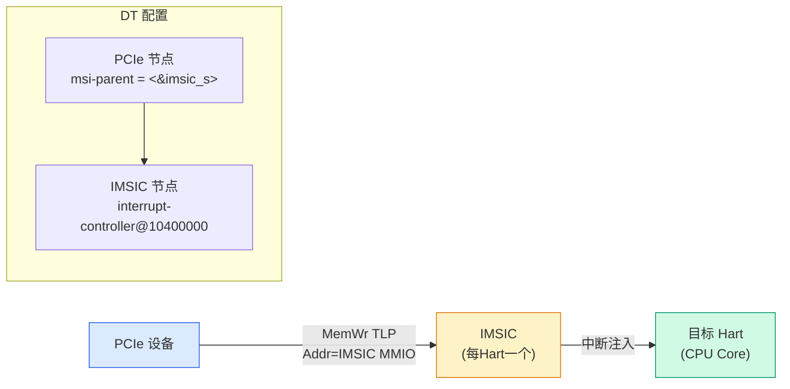
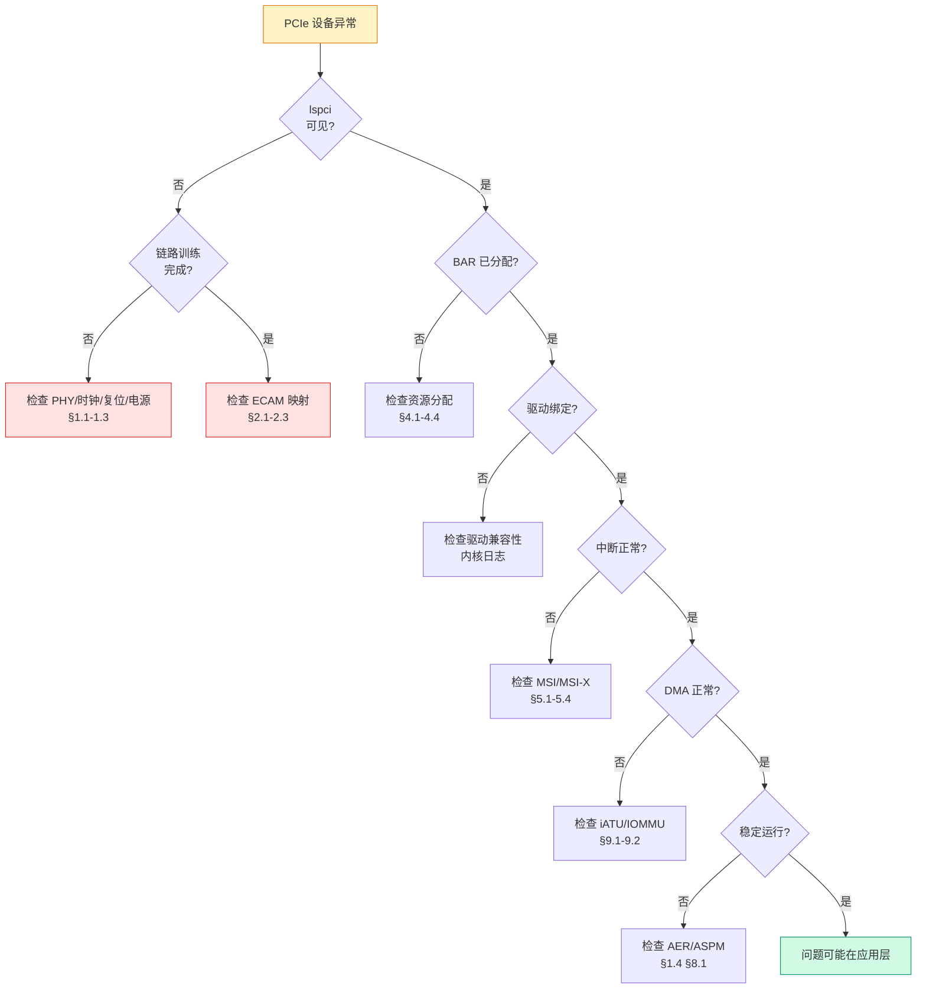

# PCIe 工程实践：常见问题与踩坑指南

> 核心问题：在 PCIe 设计、调试、使用中，哪些坑是反复出现的？根因是什么？如何快速定位？
> **工程师视角**：本文是前 7 篇笔记的"反向索引"——不讲解机制本身，而是从**故障现象**出发，回溯到具体的规范条款与内核代码，给出可操作的排查路径。每条坑都标注了"哪个 Phase、哪个文件、哪个寄存器"。
> 关联索引：[PCIe 核心知识索引](./pcie-learning-resources.md)

### 关键术语

| 缩写 | 全称 | 含义 |
|------|------|------|
| LTSSM | Link Training and Status State Machine | 链路训练状态机 |
| ECAM | Enhanced Configuration Access Mechanism | 增强型配置访问机制 |
| BAR | Base Address Register | 基地址寄存器 |
| iATU | Internal Address Translation Unit | DWC 内部地址转换单元 |
| DBI | Data Bus Interface | DWC 控制器内部寄存器访问接口 |
| MSI-X | Message Signaled Interrupt Extended | 扩展消息信号中断 |
| AER | Advanced Error Reporting | 高级错误报告 |
| DPC | Downstream Port Containment | 下游端口遏制 |
| ASPM | Active State Power Management | 活动状态电源管理 |
| CRS | Configuration Request Retry Status | 配置请求重试状态（PCIe 6.0 起更名为 RRS） |
| IMSIC | Incoming MSI Controller | RISC-V AIA 的 MSI 控制器 |

---

## 0. 本文使用方法

每条坑按统一结构组织：

```
现象 → 根因 → 排查命令 → 修复方法 → 规范/代码依据
```

排查命令均可在真实系统上直接运行。规范依据标注到 PCIe Base Spec 章节号，代码依据标注到内核文件与函数。

> **核心要点**：PCIe 的问题 80% 集中在三个交界处——**固件 ↔ 控制器初始化**、**枚举 ↔ 资源分配**、**驱动 ↔ DMA/中断**。按交界处分类比按子系统分类更容易定位。

---

## 1. 链路训练与物理层

> 链路训练（LTSSM）是所有后续操作的前提。链路起不来，枚举、BAR、中断全部免谈。详见 [Controller 与 PHY 架构](./controller-phy-architecture.md) §3.3 和 [PCIe 核心知识索引](./pcie-learning-resources.md) Phase 4。

### 1.1 设备完全不可见（Vendor ID = 0xFFFFFFFF）

**现象**：`lspci` 看不到设备，或 `lspci -xxx` 返回全 FF。

**根因链**（按概率排序）：

| 根因 | 验证方法 | 修复 |
|------|---------|------|
| 链路未训练（LTSSM 未到 L0） | `lspci -vvv \| grep LNKSTA` 看 DLActive / NLW=0 | 检查 PHY 时钟、复位、电源 |
| ECAM 窗口未配置或地址错误 | `cat /proc/iomem \| grep -i ecam` | 修正固件/DT 的 ECAM 基址 |
| Bus 号超范围 | `dmesg \| grep "bus.*out of range"` | 扩大 Subordinate Bus 号 |
| 设备处于 D3cold | 配置空间返回全 FF | 固件先恢复 D0 再枚举 |
| 复位未完成就扫描 | CRS 超时后放弃 | 增大 `pci_bios_interpret` 等待，或加 reset delay |

**排查命令**：

```bash
# 1. 确认链路状态
lspci -vvv -s 00:01.0 | grep -E "LnkCap|LnkSta|LnkCtl"
#   LnkSta: Speed 8GT/s, Width x0  ← Width=0 说明链路未训练

# 2. 检查 ECAM 是否映射
cat /proc/iomem | grep -i "ecam\|PCI ECAM"

# 3. 检查内核枚举日志
dmesg | grep -iE "pci.*probe|pci.*scan|pci.*found|ECAM"

# 4. 检查 LTSSM 状态（DWC 控制器，通过 DBI）
#    PCIE_PORT_DEBUG0 (DWC 私有寄存器) 的低 4 位是 LTSSM state
#    需要通过 devmem 或驱动 debugfs 读取
```

**规范依据**：PCIe Base Spec §5.0 (LTSSM)；§7.2.2 (ECAM)。

**代码依据**：`pci_bus_read_dev_vendor_id()` 的 60 秒 CRS 等待在 [drivers/pci/probe.c](file:///home/pbw/sg2046/linux-common/drivers/pci/probe.c) 中实现——`pci_bus_generic_read_dev_vendor_id()` 用指数退避轮询。

### 1.2 链路降速（协商到低于能力的速率）

**现象**：`LnkCap` 声明 16 GT/s (Gen4)，但 `LnkSta` 显示 8 GT/s (Gen3) 或更低。

**根因**：

1. **Gen3+ 均衡（Equalization）失败**：最常见。Gen3+ 速率需要发送端预加重 + 接收端 CTLE/DFE 均衡，均衡系数协商失败会降速重试。
2. **信号完整性差**：PCB 走线过长、过孔残桩、连接器接触不良。
3. **ASPM 干扰**：L1.2 子状态退出时的 Recovery 可能触发降速。
4. **固件强制限速**：某些平台通过 LNKCTL2 Target Link Speed 限制速率。

**排查命令**：

```bash
# 查看能力与实际协商
lspci -vvv -s 01:00.0 | grep -E "LnkCap|LnkSta|LnkCtl2"
#   LnkCap: Port #0, Speed 16GT/s, Width x16
#   LnkSta: Speed 8GT/s, Width x16   ← 降速了
#   LnkCtl2: Target Link Speed: 8GT/s ← 可能被固件限制

# 查看 AER 中的 Receiver Error 计数（信号质量指标）
cat /sys/bus/pci/devices/0000:01:00.0/aer_dev_correctable
```

**修复**：

```bash
# 检查是否被固件限速（LnkCtl2）
lspci -xxx -s 00:01.0 | awk 'NR>=4{print}' # 查看 0x30 附近的 LNKCTL2

# 临时强制目标速率（需驱动支持，慎用）
setpci -s 00:01.0 0x30.L=0x0003  # Target Link Speed = Gen3
# 触发链路重训练
setpci -s 00:01.0 0x10.B=0x20   # Link Control Retrain Link bit
```

**规范依据**：PCIe Base Spec §4.2.6 (Equalization)；§7.5.3.7 (Link Control 2 Register)。

> **核心要点**：Gen3+ 降速问题 90% 是**信号完整性**或**均衡参数**问题。先用 AER 的 Receiver Error 计数判断信号质量——如果计数持续增长，是硬件问题，软件调参无效。DWC 控制器的均衡参数通过 `GEN3_EQ_CONTROL`、`GEN3_RELATED_OFF` 等 DBI 寄存器配置，需查 DWC Databook。

### 1.3 链路宽度降级（x16 协商到 x8/x4）

**现象**：`LnkCap` 声明 x16，`LnkSta` 显示 x8 或更少。

**根因**：

1. **Lane 分配/Bifurcation 配置错误**：SoC 的 PHY Lane 被分给其他 Controller。详见 [Controller 与 PHY 架构](./controller-phy-architecture.md) §4-5。
2. **物理 Lane 损坏**：某几条 Lane 的差分对断线或短路。
3. **热插拔槽只接了部分 Lane**：如 x16 插槽只接了 x8 信号。

**排查**：

```bash
lspci -vvv -s 01:00.0 | grep -E "LnkCap|LnkSta"
#   LnkCap: Speed 16GT/s, Width x16
#   LnkSta: Speed 16GT/s, Width x8  ← 速率正常但宽度降级

# 检查设备树的 data-lanes / Lane 分配
# 对于 RK3588: 检查 PCIE3PHY_GRF_CMN_CON0 寄存器
# 对于 SG2046: 检查 DT 的 reg-names 是否包含完整的 PHY 配置
```

> **核心要点**：速率降级通常是均衡/信号问题，宽度降级通常是**Lane 路由/分配**问题。两者根因不同，排查方向也不同。

### 1.4 ASPM 导致间歇性链路断开

**现象**：设备周期性"消失"或性能抖动；`dmesg` 中反复出现 `Link Down` / `Link Up`。

**根因**：

- **L1 子状态（L1.1/L1.2）兼容性差**：部分老设备或低成本设备的 PHY 在 L1.2 退出时无法正确恢复时钟，导致 Recovery 失败。
- **ASPM 配置策略冲突**：固件启用了 ASPM 但内核 `pcie_aspm=off`，或反之。

**排查与修复**：

```bash
# 查看当前 ASPM 配置
lspci -vvv -s 01:00.0 | grep -E "ASPM|LnkCtl"
#   LnkCtl: ASPM L0s Enabled, L1 Enabled

# 临时禁用 ASPM（内核参数）
# 在 GRUB 中加: pcie_aspm=off
# 或运行时:
echo 0 > /sys/module/pcie_aspm/parameters/policy

# SG2046 驱动在初始化时主动清除 ASPM L0s/L1（见 pcie-sophgo.c）
# dw_pcie_dbi_ro_wr_en(pci);
# val &= ~(PCI_EXP_LNKCAP_ASPM_L0S | PCI_EXP_LNKCAP_ASPM_L1);
# dw_pcie_dbi_ro_wr_dis(pci);
```

**代码依据**：SG2046 驱动 [drivers/pci/controller/dwc/pcie-sophgo.c](file:///home/pbw/sg2046/linux-common/drivers/pci/controller/dwc/pcie-sophgo.c) 的 `sophgo_pcie_disable_l0s_l1()` 函数——用 `dw_pcie_dbi_ro_wr_en()` 清除 `PCI_EXP_LNKCAP` 中的 ASPM 支持位。这是工程上常见的 workaround。

> **核心要点**：ASPM 是"省电"与"可靠性"的权衡。服务器/AI 场景通常**关闭 ASPM** 换取稳定性；移动/嵌入式场景开启 ASPM 省电。调试 PCIe 稳定性问题时，第一步是关闭 ASPM 排除干扰。

---

## 2. ECAM 与配置空间

> 详见 [ECAM 与配置空间](./ecam-config-space.md)。

### 2.1 Bus 0 出现"幽灵设备"（重复设备）

**现象**：`lspci` 在 Bus 0 的 Dev 1/2/3... 位置看到与 Dev 0 完全相同的设备。

**根因**：DWC 控制器在 ECAM 模式下**不过滤 Type 0 配置 TLP**。ECAM 对 Bus 0 上的所有 Dev 都生成 Type 0 TLP，而 Type 0 TLP 会被 Dev 0 响应（因为 DWC RC 只有一个下游端口，所有 Dev 都路由到同一个 Root Port）。

**修复**：使用 `pci_dw_ecam_bus_ops`，它的 `map_bus` 回调会过滤掉 Bus 0 上 Dev > 0 的访问。

```c
// drivers/pci/controller/pci-host-generic.c 第 28-42 行
static bool pci_dw_valid_device(struct pci_bus *bus, unsigned int devfn)
{
    struct pci_config_window *cfg = bus->sysdata;
    // DWC 在 ECAM 模式下不会过滤 Type 0 配置 TLP
    if (bus->number == cfg->busr.start && PCI_SLOT(devfn) > 0)
        return false;
    return true;
}
```

**排查**：

```bash
lspci -tv
# 如果看到 00:00.0 和 00:01.0 完全相同 → 幽灵设备

# 检查 DT compatible 是否用了正确的 ECAM ops
#   "pci-host-ecam-generic" → pci_generic_ecam_ops（不过滤）
#   "snps,dw-pcie-ecam" → pci_dw_ecam_bus_ops（过滤）
```

> **核心要点**：这是 DWC ECAM 模式的**已知行为**，不是 Bug。规范不要求 RC 过滤 Type 0 TLP，过滤责任在软件。如果自研控制器驱动用 ECAM，必须实现类似的 `valid_device` 过滤。

### 2.2 配置空间访问偶发返回错误值

**现象**：`lspci -xxx` 偶尔显示错误数据；驱动读配置寄存器得到异常值。

**根因**：

1. **缺少全局配置锁**：自研 `pci_ops` 未使用 `pci_lock_config()` 保护。多 CPU 并发访问时，CAM 兼容模式或自定义控制器的两步操作（写地址 + 读数据）会被打断。
2. **ECAM 映射区域被其他模块覆盖**：`request_resource_conflict()` 未检查冲突。

**代码依据**：[drivers/pci/access.c](file:///home/pbw/sg2046/linux-common/drivers/pci/access.c) 的 `pci_lock_config()` 使用全局自旋锁 `pci_lock` + `spin_lock_irqsave`。自研 `pci_ops` 的 `read/write` 回调在这个锁保护下执行，无需自己加锁——但 `map_bus` 回调也在锁内，不能睡眠。

> **核心要点**：PCIe 配置空间访问在 Linux 中是**全局串行化**的。对于高性能场景（如大量 VF 初始化），这个全局锁可能成为瓶颈，但目前内核没有 per-Bus 锁的方案。

### 2.3 Extended Capability 不可见（只看到 256B）

**现象**：`lspci -xxx` 只显示前 256 字节，看不到 AER、SR-IOV 等 Extended Capability。

**根因**：使用了 CAM 模式（`pci-host-cam-generic`，bus_shift=16）而非 ECAM 模式（`pci-host-ecam-generic`，bus_shift=20）。CAM 只能访问 256B 配置空间。

**修复**：DT 中使用 `compatible = "pci-host-ecam-generic"` 或控制器特定的 ECAM compatible。

```bash
# 确认当前模式
dmesg | grep -i "ecam\|cam"
#   "ECAM at [mem ...]" → 通用 ECAM 模式
#   无此日志 → 可能是 CAM、iATU 模式或自定义模式

# SG2046 设置 pp->native_ecam = true,实际走 iATU 配置访问(非 ECAM)
# 详见本文 §10.1 的详细解释
```

> **核心要点**：注意 `native_ecam` 标志的误导性命名——它实际表示**非 ECAM**(iATU)模式,而非"内建 ECAM"。SG2046 设置此标志后,配置访问走 iATU 出向窗口,Extended Capability 仍可见(因为 iATU 也能访问完整 4KB 配置空间,只是每次访问都要重配窗口)。详见 §10.1。

**代码依据**:[drivers/pci/controller/dwc/pcie-designware-host.c](file:///home/pbw/sg2046/linux-common/drivers/pci/controller/dwc/pcie-designware-host.c) 第 478-504 行 `dw_pcie_ecam_enabled()`——`native_ecam=true` 时返回 `false`,导致 DWC 跳过通用 ECAM 窗口创建,改用 iATU 路径(`dw_pcie_ops`/`dw_child_pcie_ops`)。

---

## 3. 枚举与设备发现

> 详见 [设备枚举流程](./enumeration-flow.md)。

### 3.1 NVMe/大容量设备枚举超时丢失

**现象**：冷启动时 NVMe SSD 偶发性不被发现，但热重启后正常。

**根因**：设备固件加载慢，枚举时 Vendor ID 读取返回 CRS（Configuration Request Retry Status，PCIe 6.0 起更名为 RRS）。如果固件/内核的 CRS 等待时间不够，设备会被跳过。

**机制详解**：

```
设备返回 CRS → Root Port 的 CRS Software Visibility 启用时 → 软件读到 Vendor ID=0x0001
  → 表示"设备存在但未就绪"
  → 内核重试，指数退避：1ms, 2ms, 4ms, ... 上限 1s
  → 总等待上限 60 秒
```

**代码依据**：[drivers/pci/probe.c](file:///home/pbw/sg2046/linux-common/drivers/pci/probe.c) 的 `pci_bus_wait_rrs()`：

```c
// 指数退避：delay 从 1ms 开始翻倍，上限 1s
int delay = 1;
while (pci_bus_rrs_vendor_id(*l)) {
    if (delay > timeout) return false;  // 超时放弃
    msleep(delay);
    delay *= 2;
    // 重读 Vendor ID
}
```

**修复**：

```bash
# 1. 确认 CRS Software Visibility 是否启用
lspci -vvv -s 00:01.0 | grep -i "CRS"
#   RootCtl: CRS Software Visibility Enabled

# 2. 增大内核等待（通过内核参数）
#    pci=crs_timelimit=60  （某些内核版本支持）

# 3. 固件层面：确保 Root Port 的 CRS Software Visibility Enable 位被置位
#    Root Control Register (offset 0x5C) bit3
```

> **核心要点**：CRS/RRS 是 NVMe 等"慢启动"设备的关键机制。固件**必须**启用 Root Port 的 CRS Software Visibility，否则 RC 收到 CRS 时直接返回 0xFFFFFFFF，内核无法区分"设备不存在"和"设备未就绪"。

### 3.2 深层 Switch 拓扑 Bus 号耗尽

**现象**：`dmesg` 报错 `can't enable N VFs (bus XX out of range)` 或 `not enough bus numbers`。

**根因**：PCIe 总线号只有 8 位（0-255）。深层 Switch 拓扑或大量 VF 会耗尽 Bus 号。每个桥的 Subordinate Bus 号限制了其下游可用的 Bus 号范围。

**场景示例**：

```
Root Port (Sub=255)
  └─ Switch L1 (Sub=255)
       └─ Switch L2 (Sub=255)
            └─ Switch L3 (Sub=255)
                 └─ Endpoint
                    假设每层 Switch 占 2 个 Bus 号，4 层就消耗 8 个
                    如果 Endpoint 是 PF，要创建 64 个 VF
                    ARI 模式下 VF 可以共享 Bus 号，但需要足够的 Subordinate 范围
```

**排查**：

```bash
lspci -tv
# 查看每层桥的 Subordinate Bus 号

# 检查 SR-IOV 启用失败
dmesg | grep -i "out of range\|bus.*range\|sriov"
```

**修复**：

1. **增大 Subordinate Bus 号**：固件/内核分配更大的 Bus 号范围给上层桥。
2. **启用 ARI**：ARI 允许单 Bus 上 256 个 Function，减少 Bus 号消耗。
3. **减少 VF 数量**：如果 Bus 号确实不够，减少 NumVFs。

**代码依据**：[drivers/pci/iov.c](file:///home/pbw/sg2046/linux-common/drivers/pci/iov.c) 的 `sriov_enable()` 检查 `pci_iov_virtfn_bus(dev, nr_virtfn - 1) > dev->bus->busn_res.end`。

### 3.3 两遍扫描导致设备重复添加

**现象**：`lspci` 中同一设备出现两次，或 `dmesg` 报 `device already exists`。

**根因**：`pci_scan_bridge_extend()` 的 Pass 0 和 Pass 1 重复扫描了同一桥。Pass 0 扫描固件已配置的桥，Pass 1 扫描未配置的桥。如果固件配置部分有效（`broken` 标志逻辑边界情况），可能重复。

**代码依据**：[drivers/pci/probe.c](file:///home/pbw/sg2046/linux-common/drivers/pci/probe.c) 的 `pci_scan_bridge_extend()`：

```c
// Pass 0: 验证固件配置
if (!pass && (primary != bus->number || secondary <= bus->number ||
              secondary > subordinate))
    broken = 1;  // 固件配置无效

if ((secondary || subordinate) && !pcibios_assign_all_busses() && !broken) {
    // 固件已配置且有效: Pass 0 扫描, Pass 1 跳过
    if (pass) goto out;
    // ... 扫描下游
} else {
    // 固件未配置或无效: Pass 0 跳过, Pass 1 分配并扫描
    if (pass != 1) goto out;
    // ... 分配 Bus 号并扫描
}
```

> **核心要点**：如果固件写的 Primary/Secondary/Subordinate Bus 号不一致（如 Primary ≠ 上游 Bus），内核会判定为 `broken` 并在 Pass 1 重新分配。这是固件 Bug 的常见表现——检查固件是否正确写了桥的 Bus 号寄存器。

---

## 4. BAR 与资源分配

> 详见 [BAR 与资源分配](./bar-resource-allocation.md)。

### 4.1 BAR 分配失败："not enough MMIO resources"

**现象**：`dmesg` 报 `BAR N: no space for` 或 `not enough MMIO resources`；设备 BAR 全 0。

**根因**：桥窗口空间不足以容纳下游所有 BAR 需求。常见于：

1. **GPU 等大 BAR 设备**：现代 GPU BAR 可达 16GB+，如果桥窗口只有 256MB 就会失败。
2. **SR-IOV VF BAR**：N 个 VF × VF BAR 大小可能远超 PF BAR 空间。
3. **固件预留不足**：固件未为热插拔桥预留足够窗口。

**排查**：

```bash
# 查看桥窗口和 BAR 分配
lspci -vvv -s 00:01.0 | grep -E "Memory|Prefetchable"
#   Memory behind bridge: 10000000-1fffffff [size 512M]
#   Prefetchable memory behind bridge: 2000000000-20ffffffff [size 4G]

# 查看设备 BAR 需求
lspci -vvv -s 01:00.0 | grep -E "Region|Memory at"
#   Region 0: Memory at ... [size=256M]  ← 非预取
#   Region 2: Memory at ... [size=16G]   ← 预取，64-bit

# 内核分配日志
dmesg | grep -i "BAR.*no space\|not enough\|resource"
```

**修复**：

1. **启用 Resizable BAR**：让 BAR 动态调整大小，避免固定大 BAR 浪费窗口。

   ```bash
   # 内核参数
   pci=realloc
   # 或运行时
   echo 1 > /sys/bus/pci/devices/0000:01:00.0/resource_resize
   ```

2. **增大桥窗口**：固件/DT 中增大 Root Bridge 的 MMIO 窗口。

3. **热插拔预留**：内核参数 `pci=hpmemsize=XXX` 为热插拔桥预留空间。

**代码依据**：[drivers/pci/setup-bus.c](file:///home/pbw/sg2046/linux-common/drivers/pci/setup-bus.c) 的 `__pci_bus_size_bridges()` 和 `__pci_bus_assign_resources()`。

> **核心要点**：BAR 分配失败的**第一排查方向**是"预取 vs 非预取"匹配。非预取 BAR 只能放在非预取窗口，预取 BAR 可以放在预取窗口（推荐）或非预取窗口（降级）。如果预取窗口太小，预取 BAR 会被挤到非预取窗口，导致非预取窗口溢出。

### 4.2 BAR 探测得到错误大小

**现象**：`lspci` 显示的 BAR 大小与设备手册不符。

**根因**：

1. **探测时未关闭解码**：写全 1 到 BAR 时，如果设备仍在响应该 BAR 地址，可能产生总线事务导致探测错误。`pci_read_bases()` 会先关闭 `PCI_COMMAND` 的 Memory/IO 解码，但 `dev->mmio_always_on` 的设备跳过此步。
2. **64-bit BAR 高 32 位未读**：64-bit BAR 需要读两个 32 位寄存器，如果只读低 32 位会得到错误大小。
3. **VF BAR 探测错误**：VF 的 BAR 是只读 0，不能通过标准路径探测。

**代码依据**：[drivers/pci/probe.c](file:///home/pbw/sg2046/linux-common/drivers/pci/probe.c) 的 `pci_read_bases()`：

```c
// ① 关闭解码（除非 mmio_always_on）
if (!dev->mmio_always_on) {
    pci_read_config_word(dev, PCI_COMMAND, &orig_cmd);
    if (orig_cmd & PCI_COMMAND_DECODE_ENABLE)
        pci_write_config_word(dev, PCI_COMMAND,
            orig_cmd & ~PCI_COMMAND_DECODE_ENABLE);
}
// ② 批量读掩码
__pci_size_stdbars(dev, howmany, PCI_BASE_ADDRESS_0, stdbars);
// ③ 恢复解码
// ④ 逐个解析
```

> **核心要点**：如果设备有 `mmio_always_on` quirk（如某些 GPU 不能关闭解码），BAR 探测可能不可靠。此时需要依赖固件分配的值，或通过 Resizable BAR Capability 直接读取支持的大小列表。

### 4.3 64-bit BAR 在 32 位系统上失败

**现象**：`dmesg` 报 `can't handle BAR larger than 4GB`。

**根因**：32 位内核的 `pci_bus_addr_t` 或 `resource_size_t` 只有 32 位，无法处理 >4GB 的 BAR。

**代码依据**：[drivers/pci/probe.c](file:///home/pbw/sg2046/linux-common/drivers/pci/probe.c) 的 `__pci_read_base()`：

```c
if (res->flags & IORESOURCE_MEM_64) {
    if ((sizeof(pci_bus_addr_t) < 8 || sizeof(resource_size_t) < 8)
        && sz64 > 0x100000000ULL) {
        res->flags |= IORESOURCE_UNSET | IORESOURCE_DISABLED;
        // ...
    }
}
```

**修复**：使用 64 位内核。现代 ARM/RISC-V 服务器都是 64 位，这个问题主要存在于老旧 32 位嵌入式系统。

### 4.4 iATU 窗口配置错误导致 CPU 访问设备失败

**现象**：BAR 已分配，`lspci` 正常，但驱动 `readl/writel` 设备寄存器返回 0xFFFFFFFF。

**根因**：CPU 物理地址到 PCIe 总线地址的 iATU Outbound 映射与 `ranges`/`_CRS` 声明不一致。`pcibios_bus_to_resource()` 的往返校验会检测到不一致并标记 `IORESOURCE_UNSET`。

**排查**：

```bash
# 检查 resource 是否被标记为 UNSET
cat /sys/bus/pci/devices/0000:01:00.0/resource
#   start end flags
#   0x0 0x0 0x0   ← start=0 表示 UNSET，需要重新分配

# 检查 iATU 配置（DWC 控制器，通过 debugfs 或 devmem）
# Outbound 窗口: CPU PA → PCIe BA
# Inbound 窗口: PCIe BA → SoC PA (DDR)
```

**代码依据**：[drivers/pci/probe.c](file:///home/pbw/sg2046/linux-common/drivers/pci/probe.c) 的 `__pci_read_base()` 中的往返校验：

```c
// 总线地址 → CPU物理地址
pcibios_bus_to_resource(dev->bus, res, &region);
// CPU物理地址 → 总线地址（反推）
pcibios_resource_to_bus(dev->bus, &inverted_region, res);
// 如果反推结果 != 原始BAR值，说明映射不一致
if (inverted_region.start != region.start) {
    res->flags |= IORESOURCE_UNSET;
    // ...
}
```

> **核心要点**：iATU 的 `parent_bus_addr → pci_addr` 偏移**必须**与 DT `ranges` 属性声明的偏移一致。SG2046 的 DTS 示例：

```dts
// sg2046-pcie-s.dtsi 中的 ranges
ranges = <0x02000000 0x0 0x20000000  0x0 0x20000000  0x0 0x08000000>;
//         ^flags       ^pci_addr_hi  ^cpu_addr_hi   ^cpu_addr_lo ^size
// 这里 pci_addr = cpu_addr，offset = 0，最简单的 1:1 映射
```

---

## 5. 中断（MSI/MSI-X）

> 详见 [MSI/MSI-X 中断机制](./msi-interrupt.md)。

### 5.1 MSI-X 分配失败：`-ENOSPC`

**现象**：`pci_alloc_irq_vectors()` 返回负值，`dmesg` 报 `not enough IRQs` 或 `-ENOSPC`。

**根因**：

| 根因 | 平台 | 修复 |
|------|------|------|
| IRQ 描述符耗尽 | x86 传统 IOAPIC | 增大 `nr_irqs` 内核参数 |
| ITS Device Table 满 | ARM GICv3 | 增大 ITS 设备表大小 |
| IMSIC 中断号耗尽 | RISC-V AIA | 增大 IMSIC 配置 |
| VF 的 MSI-X 配额不足 | SR-IOV | 通过 `sriov_vf_msix_count` 调整 |

**排查**：

```bash
# 查看已分配的中断
cat /proc/interrupts | grep -i "nvme\|eth\|GPU"

# 查看 IRQ 总数
cat /proc/sys/kernel/nr_irqs

# 查看 MSI-X 表
lspci -vvv -s 01:00.0 | grep -A5 "MSI-X"

# SG2046 IMSIC 中断使用情况
cat /sys/kernel/debug/imsic/state 2>/dev/null
```

### 5.2 MSI-X 中断丢失

**现象**：设备发送中断但 CPU 未收到；或中断偶尔丢失。

**根因**：

1. **Per-Vector Mask 未清除**：MSI-X Entry 的 Vector Control bit0=1 表示 masked，设备不会发送该向量的中断。
2. **中断亲和性配置错误**：所有中断绑到同一 CPU，导致该 CPU 中断队列溢出。
3. **MSI 地址错误**：`Message Address` 指向了错误的中断控制器地址。

**排查**：

```bash
# 查看中断统计
cat /proc/interrupts | grep -i nvme
#   检查各向量的计数是否增长

# 查看 MSI-X 表内容（需 debugfs）
cat /sys/kernel/debug/pci/0000:01:00.0/msix 2>/dev/null

# 检查中断亲和性
for i in /sys/kernel/irq/*/; do
    name=$(cat "$i/name" 2>/dev/null)
    if echo "$name" | grep -q nvme; then
        echo "IRQ $(basename $i): $(cat $i/smp_affinity_list)"
    fi
done
```

**代码依据**：[drivers/pci/msi/msi.c](file:///home/pbw/sg2046/linux-common/drivers/pci/msi/msi.c) 的 `pci_msix_write_vector_ctrl()`：

```c
static inline void pci_msix_write_vector_ctrl(struct msi_desc *desc, u32 ctrl)
{
    void __iomem *desc_addr = pci_msix_desc_addr(desc);
    if (desc->pci.msi_attrib.can_mask)
        writel(ctrl, desc_addr + PCI_MSIX_ENTRY_VECTOR_CTRL);
}
```

> **核心要点**：MSI-X 表在设备的 BAR 空间中（MMIO），驱动 `request_irq()` 后内核会自动清除 Mask 位。但如果驱动手动操作了 MSI-X 表（不推荐），可能忘记清除 Mask。**永远通过 `pci_alloc_irq_vectors()` + `request_irq()` API 操作中断**，不要直接读写 MSI-X 表。

### 5.3 RISC-V AIA IMSIC 的 MSI 路径

**现象**：在 SG2046 等 RISC-V 平台上，MSI 中断通过 IMSIC 投递，与 x86 APIC 和 ARM GIC ITS 路径不同。

**机制**：RISC-V AIA (Advanced Interrupt Architecture) 的 IMSIC 是每 CPU 一个的 MSI 控制器。设备发送 MemWr TLP 到 IMSIC 的 MMIO 地址，IMSIC 根据目标 Hart 和中断号触发中断。



**SG2046 DTS 示例**：

```dts
// arch/riscv/boot/dts/sophgo/sg2046-pcie-s.dtsi
pcie@200102400000 {
    compatible = "sophgo,sg2046-pcie";
    msi-parent = <&imsic_s>;  // 指向 IMSIC supervisor 模式
    // ...
};

// arch/riscv/boot/dts/sophgo/sg2046-imsics-aplic.dtsi
imsic_s: interrupt-controller@10400000 {
    // IMSIC supervisor 模式实例
    // 每个 Hart 有独立的 MSI 中断文件
};
```

**`msi-parent` 如何劫持 MSI 路径**：

```c
// drivers/pci/controller/dwc/pcie-designware-host.c 第 594-619 行
if (pci_msi_enabled()) {
    // 关键判断:有 msi-parent / msi-map / msi_init 则 use_imsi_rx=false
    pp->use_imsi_rx = !(pp->ops->msi_init ||
                     of_property_present(np, "msi-parent") ||
                     of_property_present(np, "msi-map"));

    if (pp->ops->msi_init) {
        ret = pp->ops->msi_init(pp);
    } else if (pp->use_imsi_rx) {
        ret = dw_pcie_msi_host_init(pp);  // ← DWC 内建 MSI 路径
    }
    // SG2046 走到这里时两个分支都不进入:
    //   - sophgo_pcie_host_ops 没有定义 msi_init
    //   - msi-parent 存在 → use_imsi_rx=false → 不调 dw_pcie_msi_host_init
    //   → DWC 内建 MSI irqdomain 不创建,MSI 分配直接委托给 IMSIC
}
```

> **关键区别**:DWC 内建 MSI 路径(`dw_pcie_msi_host_init` → `dw_pcie_msi_parent_ops` 第 57-63 行)仅在**没有** `msi-parent` 时启用。SG2046 的 DT 写了 `msi-parent = <&imsic_s>`,所以 DWC 内建 MSI 逻辑被旁路——设备的 MemWr TLP 直接写入 IMSIC 的 MMIO 地址,PCI core 通过 `msi-parent` 找到 IMSIC 的 irqdomain 分配中断向量。`dw_pcie_msi_parent_ops` 在 SG2046 上**不会**被注册。

> **核心要点**：在 RISC-V 平台上，PCIe MSI **不经过** DWC 的内部 MSI 逻辑（`PCIE_MSI_INTR0_STATUS` 等），而是直接通过 IMSIC。这意味着：(1) `msi-parent` 必须正确指向 IMSIC；(2) IMSIC 的 MMIO 地址必须在设备的 DMA 可达范围内（通过 `dma-ranges` 配置）；(3) 调试 MSI 问题时要用 IMSIC 的 debugfs，而不是 DWC 的 MSI 状态寄存器；(4) 驱动里的 `sophgo_pcie_msi_enable()` 只是使能 app 层的 MSI 中断信号位(`PCIE_INT_EN_INT_MSI`),并不参与 MSI 向量分配。

### 5.4 中断亲和性导致性能问题

**现象**：网卡/NVMe 吞吐量低，CPU 单核 100% 而其他核空闲。

**根因**：所有 MSI-X 中断绑到同一 CPU（通常是 CPU 0），成为瓶颈。

**修复**：

```bash
# 启用 irqbalance 自动分配
systemctl enable --now irqbalance

# 手动设置 NVMe 多队列中断亲和性
# 将每个队列的中断绑到不同 CPU
i=0
for irq in $(grep nvme /proc/interrupts | awk '{print $1}' | tr -d :); do
    mask=$((1 << $i))
    printf "%x\n" $mask > /proc/irq/$irq/smp_affinity
    i=$((i + 1))
done

# 或使用 smp_affinity_list（更直观）
i=0
for irq in $(grep nvme /proc/interrupts | awk '{print $1}' | tr -d :); do
    echo $i > /proc/irq/$irq/smp_affinity_list
    i=$((i + 1))
done
```

> **核心要点**：高性能设备的 MSI-X 中断**必须**分散到多 CPU。`irqbalance` 守护进程是默认方案，但在 NUMA 系统中可能不够智能——建议为关键设备手动设置 NUMA 本地的亲和性。

---

## 6. 热插拔

> 详见 [Hot-Plug 机制与 pciehp 驱动](./hotplug-mechanism.md)。

### 6.1 热插入后设备不出现

**现象**：物理插入卡后，`lspci` 看不到新设备。

**根因链**：

| 根因 | 验证方法 |
|------|---------|
| pciehp 驱动未加载/未绑定 | `ls /sys/bus/pci/drivers/pcieport/` 检查 Root Port |
| _OSC 未授予 Native HP 控制 | `dmesg \| grep _OSC` |
| 链路训练未完成 | `lspci -vvv` 看 LNKSTA |
| BAR 分配失败 | `dmesg \| grep "no space"` |
| 插槽电源未上电 | `cat /sys/bus/pci/slots/N/power` |

**排查**：

```bash
# 1. 确认 pciehp 模块加载
lsmod | grep pciehp

# 2. 确认 Root Port 的热插拔能力
lspci -vvv -s 00:01.0 | grep -i "hotplug\|slot"
#   Capabilities: Slot Hot-plug Surprise Present  ← 支持热插拔

# 3. 确认 _OSC 协商结果
dmesg | grep -i "_OSC\|hotplug"
#   "PCIe port service pciehp loaded" → 正常
#   "Firmware granted native PCIe hotplug control" → _OSC 成功

# 4. 查看插槽状态
cat /sys/bus/pci/slots/N/power  # 0=off, 1=on
cat /sys/bus/pci/slots/N/adapter  # 0=empty, 1=present

# 5. 手动触发热插拔事件
echo 1 > /sys/bus/pci/rescan
```

> **核心要点**：热插拔失败的**第一检查项**是 `_OSC` 协商。如果固件拒绝授予 Native HP 控制，pciehp 不会绑定，热插拔事件只能走 ACPI 路径（acpiphp）。在嵌入式/自研平台上，固件 _OSC 实现错误是热插拔不工作的常见原因。

### 6.2 DPC 恢复后设备消失

**现象**：AER 错误后 DPC 触发，恢复后设备从 `lspci` 消失。

**根因**：DPC 触发 Secondary Bus Reset 恢复链路，这会产生 DLLSC 事件。pciehp 如果未正确过滤这个虚假链路变化事件，会误认为设备被拔出。

**代码依据**：[drivers/pci/hotplug/pciehp_hpc.c](file:///home/pbw/sg2046/linux-common/drivers/pci/hotplug/pciehp_hpc.c) 的 `pciehp_ist()`：

```c
// 过滤 DPC 恢复和 SBR 产生的虚假链路变化
if ((events & (PCI_EXP_SLTSTA_PDC | PCI_EXP_SLTSTA_DLLSC)) &&
    (pci_dpc_recovered(pdev) || pci_hp_spurious_link_change(pdev)) &&
    ctrl->state == ON_STATE) {
    pciehp_ignore_link_change(ctrl, pdev, irq, ignored_events);
}
```

**修复**：确保 DPC 和 pciehp 都正确启用。内核 5.10+ 已自动处理此场景。如果仍有问题，检查 `pci_hp_spurious_link_change()` 是否覆盖了你的场景。

### 6.3 意外拔出后系统卡死

**现象**：直接拔卡后系统挂起或驱动崩溃。

**根因**：驱动未实现 `pci_error_handlers`，无法处理 MMIO 返回 0xFFFFFFFF 的情况。设备被标记为 `pci_channel_io_perm_failure` 后，驱动继续访问设备寄存器导致死循环。

**修复**：驱动必须实现错误处理回调：

```c
static const struct pci_error_handlers my_err_handlers = {
    .error_detected = my_err_detected,    // 设备错误检测
    .slot_reset     = my_slot_reset,      // 槽位复位完成
    .resume         = my_err_resume,      // 恢复完成
    .mmio_enabled   = my_mmio_enabled,    // MMIO 重新启用
};

static struct pci_driver my_driver = {
    // ...
    .err_handler = &my_err_handlers,
};
```

`error_detected` 回调中应：
1. 停止所有 DMA 操作
2. 取消所有未完成的 I/O
3. 保存设备状态（如果需要）
4. 返回 `PCI_ERS_RESULT_NEED_RESET` 或 `PCI_ERS_RESULT_CAN_RECOVER`

> **核心要点**：支持热插拔的驱动**必须**实现 `pci_error_handlers`。否则意外拔出时，驱动对已消失设备的 MMIO 访问会触发死循环或 panic。这是驱动开发中最容易被忽略的"非功能需求"。

---

## 7. SR-IOV 与虚拟化

> 详见 [SR-IOV 虚拟化](./sriov-virtualization.md)。

### 7.1 VF 创建失败："not enough MMIO resources"

**现象**：`echo N > sriov_numvfs` 失败，`dmesg` 报 `not enough MMIO resources for SR-IOV`。

**根因**：PF 的 BAR 空间不足以容纳 N 个 VF 的 BAR。每个 VF 的 BAR 大小固定，N 个 VF 需要 `N × VF_BAR_size` 的 PF BAR 空间。

**排查**：

```bash
# 查看 SR-IOV 能力
lspci -vvv -s 03:00.0 | grep -E "SR-IOV|Initial|Total|Num|VF"
#   Initial VFs: 32, Total VFs: 64, Num VFs: 0
#   VF offset: 1, stride: 2, VF device ID: 154c
#   VF BAR0: size 16384

# 计算 VF BAR 总需求
#   64 VFs × 16KB = 1MB  ← PF BAR0 必须 >= 1MB

# 查看 PF BAR 实际大小
lspci -vvv -s 03:00.0 | grep "Region 0"
```

**修复**：

1. **增大 PF BAR**：在固件/BIOS 中增大 PF 的 BAR 大小（可能需要 Resizable BAR）。
2. **减少 VF 数量**：`echo 32 > sriov_numvfs` 而非 64。
3. **启用 ARI**：ARI 减少 Bus 号消耗，间接缓解资源压力。

**代码依据**：[drivers/pci/iov.c](file:///home/pbw/sg2046/linux-common/drivers/pci/iov.c) 的 `sriov_enable()`：

```c
// 检查 VF BAR 资源是否足够
for (i = 0; i < PCI_SRIOV_NUM_BARS; i++) {
    int idx = pci_resource_num_from_vf_bar(i);
    resource_size_t vf_bar_sz = pci_iov_resource_size(dev, idx);
    // ...
    if (vf_bar_sz * nr_virtfn > resource_size(res))
        continue;  // 此 BAR 不够，检查下一个
    if (res->parent)
        nres++;
}
if (nres != iov->nres) {
    pci_err(dev, "not enough MMIO resources for SR-IOV\n");
    return -ENOMEM;
}
```

### 7.2 VFIO 绑定失败：IOMMU 组问题

**现象**：`echo $BDF > /sys/bus/pci/drivers/vfio-pci/bind` 失败，报 `Device is not on a bus` 或 IOMMU 组错误。

**根因**：

1. **IOMMU 未启用**：内核参数缺少 `intel_iommu=on`（x86）或对应 RISC-V IOMMU 参数。
2. **IOMMU 组不纯**：组内包含多个设备，不能单独直通。
3. **设备仍有驱动绑定**：需先 unbind 原驱动。

**排查**：

```bash
# 1. 确认 IOMMU 启用
dmesg | grep -i "iommu\|smmu\|vt-d"
#   "IOMMU: enabled" → 正常

# 2. 查看设备的 IOMMU 组
readlink /sys/bus/pci/devices/0000:03:00.1/iommu_group
#   ../../../../../kernel/iommu_groups/26

# 3. 查看组内所有设备
ls /sys/kernel/iommu_groups/26/devices/
#   如果有多个设备 → 组不纯，需 ACS 隔离或 pci=pcie_bus_safe

# 4. SG2046 的 IOMMU 配置（DT）
#   iommu-map = <0x0 &iommu_s0_c0 0x0 0x10000>;
```

**修复**：

```bash
# 1. 解绑原驱动
echo 0000:03:00.1 > /sys/bus/pci/devices/0000:03:00.1/driver/unbind

# 2. 绑定 vfio-pci
echo "1af4 1041" > /sys/bus/pci/drivers/vfio-pci/new_id
# 或
echo 0000:03:00.1 > /sys/bus/pci/drivers/vfio-pci/bind

# 3. 如果组不纯，需要启用 ACS 或使用 pci=pcie_bus_perf
```

> **核心要点**：VFIO 直通的前提是**IOMMU 隔离**。IOMMU 组内的设备必须能被独立隔离。如果两个设备在同一个 Switch 下游且未启用 ACS，它们会被分到同一组，无法单独直通。服务器 BIOS 通常有 "ACS Support" 选项，嵌入式平台需在 DT 中正确配置 ACS。

### 7.3 VF 的 MSI-X 向量不足

**现象**：VF 创建成功但驱动无法获取足够的 MSI-X 向量。

**根因**：PF 驱动未为 VF 分配足够的 MSI-X 向量配额。Linux 6.0+ 支持通过 `sriov_vf_msix_count` sysfs 动态调整。

**修复**：

```bash
# 查看 PF 可分配给 VF 的总 MSI-X 向量数
cat /sys/bus/pci/devices/0000:03:00.0/sriov_vf_total_msix

# 设置单个 VF 的 MSI-X 向量数
echo 32 > /sys/bus/pci/devices/0000:03:00.0/sriov_vf_msix_count

# 然后创建 VF
echo 4 > /sys/bus/pci/devices/0000:03:00.0/sriov_numvfs
```

**代码依据**：[drivers/pci/iov.c](file:///home/pbw/sg2046/linux-common/drivers/pci/iov.c) 的 `sriov_get_vf_total_msix` 和 `sriov_set_msix_vec_count` 回调——PF 驱动实现这两个回调，内核通过 sysfs 暴露给用户。

---

## 8. 错误处理（AER/DPC）

> 详见 [PCIe 核心知识索引](./pcie-learning-resources.md) Phase 7。

### 8.1 AER 错误频繁但无实际影响

**现象**：`aer_dev_correctable` 计数持续增长，但设备功能正常。

**根因**：Correctable Error 是硬件自动纠正的瞬时错误，常见于：

- **Receiver Error**：信号完整性问题，偶发比特错误被 CRC 纠正
- **Bad TLP**：链路噪声导致 TLP 损坏，重传后恢复
- **Replay Timer Timeout**：ACK 超时，重传

**排查**：

```bash
# 查看 AER 错误计数
cat /sys/bus/pci/devices/0000:01:00.0/aer_dev_correctable
#   Receiver Error: 1234
#   Bad TLP: 56
#   Replay Timer Timeout: 7

# 查看 AER 错误详情（需要触发）
dmesg | grep -i "AER\|pcieport"
```

**处理策略**：

| 错误类型 | 计数频率 | 处理 |
|---------|---------|------|
| Receiver Error | <1/min | 可忽略，硬件自动纠正 |
| Receiver Error | >100/min | 检查信号完整性、降速运行 |
| Bad TLP | 偶发 | 可忽略 |
| Replay Timeout | 频繁 | 链路质量问题，考虑降速 |

> **核心要点**：Correctable Error 是 PCIe 的**正常容错机制**，少量发生是正常的。只有当计数**持续高速增长**时才需要关注。Uncorrectable Error (Non-Fatal/Fatal) 才是真正需要立即处理的问题。

### 8.2 DPC 触发后设备无法恢复

**现象**：DPC 触发后，设备从 `lspci` 消失且无法恢复。

**根因**：

1. **DPC 恢复流程未完成**：DPC 触发后需要软件清除 DPC Trigger Status 并触发 Secondary Bus Reset。
2. **设备固件不支持错误恢复**：部分设备在 Fatal Error 后无法通过 SBR 恢复，需要物理复位。
3. **驱动未实现 `pci_error_handlers`**：内核不知道如何恢复设备。

**排查**：

```bash
# 查看 DPC 状态
lspci -vvv -s 00:01.0 | grep -i "DPC"
#   DPC Cap: DPC Trigger Reason: Fatal Error
#   DPC Status: DPC Triggered

# 查看内核恢复日志
dmesg | grep -i "DPC\|error.*recovery\|slot.*reset"
```

**修复**：

```bash
# 手动触发 Secondary Bus Reset
echo 1 > /sys/bus/pci/devices/0000:00:01.0/secondary_bus_reset 2>/dev/null

# 或重新扫描
echo 1 > /sys/bus/pci/rescan
```

**代码依据**：[drivers/pci/pcie/dpc.c](file:///home/pbw/sg2046/linux-common/drivers/pci/pcie/dpc.c) 的 `dpc_handler()` 处理 DPC 中断，联动 AER 子系统进行恢复。

---

## 9. DMA 与地址转换

### 9.1 DMA 写入错误位置

**现象**：设备 DMA 数据写到错误的内存位置，导致数据损坏或内核 panic。

**根因**：iATU Inbound 窗口配置错误，或 `dma-ranges` 未正确声明 DMA 地址转换。

**SG2046 示例**：

```dts
// sg2046-pcie-s.dtsi
dma-ranges = <0x03000000 0x0 0x0  0x0 0x0  0x4000 0x0>;
//             ^flags       ^pci_addr ^cpu_addr ^size
// 64-bit prefetchable, pci_addr=0x0, cpu_addr=0x0, size=0x4000_0000_0000 (64TB)
// 这意味着设备 DMA 地址 0x0 → CPU 物理地址 0x0，1:1 映射，覆盖 64TB
```

**排查**：

```bash
# 查看 DMA 地址映射
cat /sys/kernel/debug/iommu/dma 2>/dev/null

# 检查 IOMMU 是否启用
dmesg | grep -i "iommu\|dma.*mapping"

# SG2046 IOMMU 配置
# iommu-map = <0x0 &iommu_s0_c0 0x0 0x10000>;
```

> **核心要点**：DMA 地址转换涉及三层：**iATU Inbound**（控制器内部）、**IOMMU**（系统级，可选）、**`dma-ranges`**（DT 声明）。三者必须一致。在启用 IOMMU 的系统上，iATU Inbound 通常配置为 1:1 透传，真正的地址转换由 IOMMU 完成。SG2046 通过 `iommu-map` 属性将设备 BDF 映射到 IOMMU Stream ID。

### 9.2 P2P DMA 不工作

**现象**：两个设备间的 P2P DMA 失败，数据绕道内存。

**根因**：

1. **ACS Redirect 启用**：ACS 阻止了设备间的直接 P2P TLP，强制重定向到 Upstream。
2. **设备不在同一 Switch 下**：不同 Switch 下的设备无法直接 P2P。
3. **未使用 `pci_p2pdma_map_sg()`**：驱动用了标准 DMA API，无法处理 P2P 地址。

**排查**：

```bash
# 检查 ACS 是否启用
lspci -vvv -s 00:01.0 | grep -i "ACS"
#   ACS Control: Source Validation, P2P Request Redirect, P2P Completion Redirect

# 检查 P2P DMA 支持
cat /sys/bus/pci/devices/0000:01:00.0/p2pmem 2>/dev/null
```

**代码依据**：[drivers/pci/p2pdma.c](file:///home/pbw/sg2046/linux-common/drivers/pci/p2pdma.c) 的 `pci_bridge_has_acs_redir()` 检查 RR/CR/EC 位：

```c
if (ctrl & (PCI_ACS_RR | PCI_ACS_CR | PCI_ACS_EC))
    return 1;  // ACS 重定向启用，P2P 被阻止
```

> **核心要点**：P2P DMA 是 GPU Direct RDMA、NVMe P2P 等高性能场景的关键。启用 P2P 需要：(1) 设备在同一 Switch 下；(2) ACS 不阻止 P2P；(3) 驱动使用 `pci_p2pdma_*` API。服务器 BIOS 通常有 "ACS Support" 选项可关闭。

---

## 10. RISC-V / SG2046 特定问题

### 10.1 native_ecam 标志的真实含义（非 ECAM，iATU 模式）

SG2046 的 PCIe 驱动设置了 `pp->native_ecam = true`，但这个标志名极具误导性——它**并不**表示"使用内建 ECAM"，恰恰相反，它表示**走 DWC 原生 iATU 配置访问路径，绕过通用 ECAM 库**。Sophgo 提交此特性的 commit message 即写明："Support non-ecam mode in sophgo driver"。

```c
// drivers/pci/controller/dwc/pcie-sophgo.c 第 240-242 行
#ifdef CONFIG_PCIE_SG2046_DW
    pp->native_ecam = true;
#endif
```

**两种配置访问路径对比**：

| 标志状态 | `dw_pcie_ecam_enabled()` 返回 | 使用的 `pci_ops` | 访问机制 |
|---------|---------------------------|----------------|---------|
| `native_ecam=false` + 256MB 对齐 + 足够大 | `true` | `dw_pcie_ecam_ops` | 硬件 ECAM 解码,Bus>0 走 `pci_ecam_map_bus()` |
| `native_ecam=true`（SG2046） | `false` | `dw_pcie_ops` + `dw_child_pcie_ops` | iATU 出向窗口,每次访问重配 iATU |
| `native_ecam=false` + 不对齐 | `false` | `dw_pcie_ops` + `dw_child_pcie_ops` | iATU 出向窗口（回退路径） |

**iATU 配置访问的工作方式**（SG2046 实际路径）：

```c
// drivers/pci/controller/dwc/pcie-designware-host.c 第 724-761 行
static void __iomem *dw_pcie_other_conf_map_bus(struct pci_bus *bus,
                                                unsigned int devfn, int where)
{
    struct dw_pcie_rp *pp = bus->sysdata;
    struct dw_pcie *pci = to_dw_pcie_from_pp(pp);
    struct dw_pcie_ob_atu_cfg atu = { 0 };
    int type;
    u32 busdev;

    if (!dw_pcie_link_up(pci))
        return NULL;

    // 把目标 BDF 编码到 iATU 的 pci_addr 字段
    busdev = PCIE_ATU_BUS(bus->number) | PCIE_ATU_DEV(PCI_SLOT(devfn)) |
             PCIE_ATU_FUNC(PCI_FUNC(devfn));

    // Root Bus 下游用 Type 0,更深层用 Type 1
    if (pci_is_root_bus(bus->parent))
        type = PCIE_ATU_TYPE_CFG0;
    else
        type = PCIE_ATU_TYPE_CFG1;

    atu.type = type;
    atu.parent_bus_addr = pp->cfg0_base - pci->parent_bus_offset;
    atu.pci_addr = busdev;
    atu.size = pp->cfg0_size;

    // 每次配置访问都要重配 iATU 出向窗口
    ret = dw_pcie_prog_outbound_atu(pci, &atu);
    if (ret)
        return NULL;

    return pp->va_cfg0_base + where;
}
```

**工程意义与坑**：

1. **性能差异**：iATU 路径下,每次下游设备配置访问都要重写 iATU 寄存器(几次 MMIO 写),比硬件 ECAM 解码慢一个数量级。大量 VF 枚举时差异明显。
2. **RC 自身配置仍走 DBI**：无论 `native_ecam` 是否为 true,Bus 0 Dev 0 的配置访问都走 `dw_pcie_own_conf_map_bus()` → `dbi_base + where`,不经过 iATU。
3. **"config" DT 资源仍需保留**：即使不走通用 ECAM,DT 中的 `config` 区域仍被 `devm_pci_remap_cfg_resource()` 映射为 `va_cfg0_base`,作为 iATU 出向窗口的 CPU 侧地址。SG2046 保留了 256MB(`0x3000_00000000-0x3000_0fffffff`)。
4. **链接未就绪时配置访问返回 NULL**：`dw_pcie_other_conf_map_bus()` 在 `!dw_pcie_link_up()` 时返回 NULL,这会传播为 `PCIBIOS_DEVICE_NOT_FOUND`。链路抖动期间 `lspci` 会偶发性看不到下游设备——这是 iATU 路径的固有行为,硬件 ECAM 路径则没有这个检查。

> **核心要点**：变量名 `native_ecam` 是个历史包袱,它实际含义是"vendor driver 自行处理配置访问,DWC 核心不要建通用 ECAM 窗口"。SG2046 设置此标志后走 iATU 路径,而非硬件 ECAM。调试 SG2046 配置访问问题时,要查 iATU 出向窗口是否配置成功、链路是否 up,而不是查 ECAM 映射。

**代码依据**:[drivers/pci/controller/dwc/pcie-designware-host.c](file:///home/pbw/sg2046/linux-common/drivers/pci/controller/dwc/pcie-designware-host.c) 第 478-504 行 `dw_pcie_ecam_enabled()`、第 506-566 行 `dw_pcie_host_get_resources()` 的分支选择、第 724-761 行 `dw_pcie_other_conf_map_bus()`。

### 10.2 SG2046 的 INTx 处理

SG2046 不使用 DWC 标准的 INTx 机制，而是通过应用层寄存器（`PCIE_INT_SIGNAL` / `PCIE_INT_EN`）处理 INTx 中断：

```c
// drivers/pci/controller/dwc/pcie-sophgo.c
#define PCIE_INT_SIGNAL_INTX    GENMASK(8, 5)   // bit 5-8: INTA-INTD 信号
#define PCIE_INT_EN_INTX        GENMASK(4, 1)   // bit 1-4: INTA-INTD 使能
#define PCIE_INT_EN_INT_MSI     BIT(5)          // bit 5: MSI 使能
```

**工程注意**：SG2046 的 INTx 和 MSI 共用应用层中断寄存器，但 MSI 实际通过 IMSIC 投递（`msi-parent`）。驱动中 `sophgo_pcie_msi_enable()` 只是使能 MSI 中断信号，真正的 MSI 地址/数据由 IMSIC irqdomain 配置。

### 10.3 SG2046 的 I/O 空间

SG2046 的 DTS 中**包含** I/O 空间映射：

```dts
ranges = <0x01000000 0x0 0x00000000  0x3000 0x10000000  0x0 0x00400000>,
//         ^I/O空间    ^pci_addr    ^cpu_addr           ^size(4MB)
```

这与笔记中"ARM/RISC-V 平台通常不支持 I/O 空间"的说法需要修正——**SG2046 等 RISC-V 服务器平台支持 I/O 空间**，但大多数设备仍优先使用 Memory 空间。I/O 空间主要用于兼容老旧的 VGA 设备或特定硬件。

### 10.4 SG2046 的多 Controller 多 die 架构

SG2046 是多 die 架构，每个 die 有多个 PCIe Controller。DTS 中通过 `linux,pci-domain` 区分：

```dts
pcie@200102400000 {
    linux,pci-domain = <0>;  // Domain 0
    // ...
};
pcie@200109000000 {
    linux,pci-domain = <0>;  // 同一 domain（注意：可能需要不同 domain）
    // ...
};
```

**工程注意**：多 die 系统中，不同 die 的 PCIe Controller 应使用不同的 `linux,pci-domain`，否则可能产生 BDF 冲突。检查 DTS 中 domain 编号的唯一性。

> **核心要点**：RISC-V 服务器（如 SG2046）的 PCIe 栈与 x86/ARM 服务器在协议层面完全相同，差异在于：(1) MSI 通过 IMSIC 而非 APIC/GIC ITS；(2) IOMMU 是 RISC-V IOMMU 而非 VT-d/SMMU；(3) 多 die 架构需要特别注意 domain 和 IOMMU Stream ID 的映射。调试时要同时检查 DT 配置和 RISC-V 特定子系统。

---

## 11. 调试工具速查

### 11.1 用户态工具

| 工具 | 用途 | 常用命令 |
|------|------|---------|
| `lspci` | 查看拓扑与配置空间 | `lspci -tvv` `lspci -xxxx -s BDF` |
| `setpci` | 读写配置寄存器 | `setpci -s BDF OFFSET.VALUE` |
| `lspcmcia` | 查看 PCIe 卡信息 | — |
| `aer-inject` | 注入 AER 错误测试 | 需加载 `aer_inject` 模块 |

### 11.2 内核 debugfs

```bash
# PCIe 设备详情
cat /sys/kernel/debug/pci/devices

# AER 错误统计
cat /sys/bus/pci/devices/$BDF/aer_dev_correctable
cat /sys/bus/pci/devices/$BDF/aer_dev_fatal
cat /sys/bus/pci/devices/$BDF/aer_dev_nonfatal

# 动态调试
echo 'file pciehp* +p' > /sys/kernel/debug/dynamic_debug/control
echo 'file drivers/pci/* +p' > /sys/kernel/debug/dynamic_debug/control

# MSI-X 表（如果支持）
cat /sys/kernel/debug/pci/$BDF/msix
```

### 11.3 sysfs 关键接口

```bash
# 资源信息
cat /sys/bus/pci/devices/$BDF/resource          # BAR 地址（CPU 物理地址）
cat /sys/bus/pci/devices/$BDF/config             # 原始配置空间（二进制）

# 热插拔
echo 1 > /sys/bus/pci/rescan                     # 全局重扫描
echo 1 > /sys/bus/pci/devices/$BDF/remove        # 移除设备
echo 0 > /sys/bus/pci/slots/N/power              # 下电插槽

# SR-IOV
echo N > /sys/bus/pci/devices/$BDF/sriov_numvfs  # 创建 VF
cat /sys/bus/pci/devices/$BDF/sriov_vf_total_msix

# 电源管理
echo deep > /sys/bus/pci/devices/$BDF/power/control  # 允许 runtime PM
cat /sys/bus/pci/devices/$BDF/power_state

# 链路控制
echo 1 > /sys/bus/pci/devices/$BDF/link/retrain  # 触发链路重训练（如果支持）
```

### 11.4 内核参数速查

| 参数 | 作用 | 场景 |
|------|------|------|
| `pci=nomsi` | 全局禁用 MSI/MSI-X | 调试中断问题 |
| `pci=realloc` | 重新分配所有资源 | BAR 分配问题 |
| `pcie_aspm=off` | 禁用 ASPM | 链路稳定性问题 |
| `pcie_ports=native` | 强制 Native 模式 | 热插拔不工作 |
| `pci=noaer` | 禁用 AER | AER 刷屏 |
| `pci=pcie_bus_perf` | 性能优先的总线配置 | P2P DMA 场景 |
| `pci=pcie_bus_safe` | 安全优先的总线配置 | 隔离场景 |

---

## 12. 排查流程图



> **如何读这张图**：从"PCIe 设备异常"开始，按顺序检查每一层。**先确认物理层正常（链路训练、ECAM），再检查枚举层（BAR、资源），最后检查运行时层（中断、DMA）**。跳层排查是常见误区——如果链路都没起来，调试 BAR 分配没有意义。

---

## 参考资料

- [PCI Express Base Specification 6.0](https://pcisig.com/specifications) — §2.2 (Config Request), §4 (Physical Layer), §5 (LTSSM), §6.2 (AER), §6.7 (Hot-Plug), §7.2.2 (ECAM), §9.3 (SR-IOV)
- [Linux Kernel Source](https://git.kernel.org/) — `drivers/pci/probe.c`, `drivers/pci/setup-bus.c`, `drivers/pci/msi/`, `drivers/pci/hotplug/`, `drivers/pci/iov.c`, `drivers/pci/pcie/dpc.c`
- [SG2046 PCIe 驱动](file:///home/pbw/sg2046/linux-common/drivers/pci/controller/dwc/pcie-sophgo.c) — Sophgo DWC PCIe 控制器驱动
- [SG2046 PCIe DTS](file:///home/pbw/sg2046/linux-common/arch/riscv/boot/dts/sophgo/sg2046-pcie-s.dtsi) — 设备树配置
- [RISC-V AIA Specification](https://github.com/riscv/riscv-aia) — IMSIC 与 MSI 机制

---

上一篇：[SR-IOV 虚拟化](./sriov-virtualization.md) | 返回：[PCIe 核心知识索引](./pcie-learning-resources.md)

---

*源码版本：Linux 6.x (SG2046) | 更新：2026-07-27*
