# PCIe 核心知识索引

> 定位：系统软件工程师的PCIe核心概念速查与深度指引
> 原则：不摊大饼，每个主题触及核心机制，指向关键规范章节与代码

### 关键术语

| 缩写 | 全称 | 含义 |
|------|------|------|
| RC | Root Complex | PCIe 树的根节点，连接 CPU 和 PCIe 总线 |
| ECAM | Enhanced Configuration Access Mechanism | 增强配置访问机制，通过 MMIO 访问配置空间 |
| BAR | Base Address Register | 基地址寄存器，声明设备的地址空间需求 |
| TLP | Transaction Layer Packet | 事务层数包，PCIe 数据传输的基本单元 |
| LTSSM | Link Training and Status State Machine | 链路训练状态机，控制链路初始化和恢复 |
| AER | Advanced Error Reporting | 高级错误报告机制 |
| SR-IOV | Single Root I/O Virtualization | 单根 I/O 虚拟化，将物理设备拆分为多个虚拟功能 |
| ATS | Address Translation Service | 地址翻译服务，设备侧缓存 IOMMU 翻译结果 |
| ACS | Access Control Services | 访问控制服务，控制 P2P 和 VF 间隔离 |
| CXL | Compute Express Link | 计算互连协议，基于 PCIe 物理层 |
| BDF | Bus/Device/Function | PCIe 设备的三级寻址编码 |
| MCFG | Memory-mapped Configuration | ACPI 表，描述 ECAM 基地址 |
| iATU | Internal Address Translation Unit | DWC 控制器内部地址转换单元 |
| MSI | Message Signaled Interrupt | 基于内存写入的中断信号机制 |
| ASPM | Active State Power Management | 链路级活动状态电源管理 |
| VF | Virtual Function | SR-IOV 虚拟功能，轻量级 PCIe Function |
| PF | Physical Function | SR-IOV 物理功能，管理 VF 的主 Function |
| IMSIC | Incoming MSI Controller | RISC-V AIA 的 MSI 控制器,每 Hart 一个,对应 x86 APIC 与 ARM GIC ITS |
| AIA | Advanced Interrupt Architecture | RISC-V 高级中断架构,含 IMSIC 与 APLIC |
| DPC | Downstream Port Containment | 下游端口遏制,链路致命错误隔离机制 |
| CRS | Configuration Request Retry Status | 配置请求重试状态(PCIe 6.0 起更名 RRS),表示设备存在但未就绪 |

***

### 专题文档

| 序号 | 主题   | 文档                                       | 核心内容                        | 建议学时 |
| --- | ---- | ---------------------------------------- | --------------------------- | ---- |
| 0   | 硅片架构 | [Controller与PHY架构](./controller-phy-architecture.md) | Controller/PHY数字模拟分工、PIPE接口、Lane分配与Bifurcation、RK3588实例 | 3h |
| 1   | ECAM | [ECAM与配置空间访问](./ecam-config-space.md)    | 地址计算、MCFG、内核ECAM实现、控制器变体    | 3h |
| 2   | BAR  | [BAR与资源分配](./bar-resource-allocation.md) | BAR探测协议、资源分配三阶段、iATU地址转换    | 4h |
| 3   | 枚举   | [设备枚举流程](./enumeration-flow.md)          | 深度优先扫描、桥配置递归、Capability发现   | 4h |
| 4   | 中断   | [MSI/MSI-X中断机制](./msi-interrupt.md)      | MSI/MSI-X结构、irqdomain集成、亲和性 | 3h |
| 5   | 热插拔  | [Hot-Plug机制与pciehp驱动](./hotplug-mechanism.md) | Slot寄存器、pciehp状态机、中断处理、DPC交互 | 3h |
| 6   | 虚拟化  | [SR-IOV虚拟化](./sriov-virtualization.md)   | PF/VF架构、ATS缓存、ACS隔离、VFIO    | 4h |
| 7   | 工程实践 | [PCIe工程实践：常见问题与踩坑指南](./pcie-engineering-pitfalls.md) | 链路训练/ECAM/枚举/BAR/中断/热插拔/SR-IOV/DMA 的故障现象→根因→排查→修复,SG2046/RISC-V 特定问题 | 6h |

### 官方文档

| 文档 | 用途 | 建议阅读时机 |
|------|------|------|
| [PCI Express Base Specification 6.0](https://pcisig.com/specifications) | PCIe 协议规范,涵盖物理层/数据链路层/事务层/配置空间 | 学完 Phase 0-1 后查阅具体章节 |
| [PCI Firmware Specification 3.0](https://uefi.org/specifications) | ACPI MCFG 表、_OSC 协商规范 | 学完 ECAM(01)与热插拔(05)后 |
| [PIPE Specification (Intel)](https://www.intel.com/content/www/us/en/io/pci-express/pcie-pipe-spec.html) | Controller 与 PHY 之间的 PIPE 接口定义 | 学完 Controller/PHY 架构(00)后 |
| [Synopsys DesignWare PCIe Databook](https://www.synopsys.com/designware-ip/interface-ip/pci-express.html) | DWC Controller 的 iATU/DBI/LTSSM 寄存器手册 | 调试 DWC 控制器问题时 |
| [RISC-V AIA Specification](https://github.com/riscv/riscv-aia) | IMSIC MSI 控制器、APLIC 中断控制器规范 | 在 RISC-V 平台调试 MSI 时 |
| [ACPI Specification 6.5](https://uefi.org/specifications) | §5.2.12.16 MCFG Table,IORT,_OSC | 学完 ECAM(01)后 |

### 源码导航

| 仓库 | 路径 | 关键目录/文件 | 职责 | 对应文档 |
|------|------|-------------|------|---------|
| linux-common | `drivers/pci/ecam.c` | `pci_ecam_create()` / `pci_ecam_map_bus()` | 通用 ECAM 库,创建配置窗口与地址计算 | [ECAM 与配置空间](./ecam-config-space.md) |
| linux-common | `drivers/pci/controller/pci-host-generic.c` | `pci_dw_valid_device()` / `pci_dw_ecam_bus_ops` | 通用 PCI host 驱动,DWC ECAM 幽灵设备过滤 | [ECAM 与配置空间](./ecam-config-space.md) |
| linux-common | `drivers/pci/controller/dwc/pcie-designware-host.c` | `dw_pcie_ecam_enabled()` / `dw_pcie_other_conf_map_bus()` / `dw_pcie_msi_parent_ops` | DWC host 初始化,`native_ecam` 分支选择,iATU 配置访问,MSI parent 注册 | [ECAM 与配置空间](./ecam-config-space.md) · [MSI/MSI-X](./msi-interrupt.md) · [工程踩坑](./pcie-engineering-pitfalls.md) §10.1 |
| linux-common | `drivers/pci/controller/dwc/pcie-sophgo.c` | `sophgo_pcie_host_init()` / `sophgo_pcie_intx_handler()` / `sophgo_pcie_configure_rc()` | Sophgo SG2046 DWC PCIe 控制器驱动,INTx 处理,`native_ecam=true` 设置 | [工程踩坑](./pcie-engineering-pitfalls.md) §10 |
| linux-common | `arch/riscv/boot/dts/sophgo/sg2046-pcie-s.dtsi` | `pcie@200102400000` 等节点 | SG2046 PCIe 设备树配置,`msi-parent`/`dma-ranges`/`ranges` | [工程踩坑](./pcie-engineering-pitfalls.md) §10 · [BAR 与资源分配](./bar-resource-allocation.md) |
| linux-common | `drivers/pci/probe.c` | `pci_read_bases()` / `pci_scan_bridge_extend()` / `pci_bus_wait_rrs()` | PCI 设备枚举,BAR 探测,CRS/RRS 等待 | [设备枚举流程](./enumeration-flow.md) · [工程踩坑](./pcie-engineering-pitfalls.md) §3-4 |
| linux-common | `drivers/pci/iov.c` | `sriov_enable()` / `pci_iov_virtfn_bus()` | SR-IOV 核心,VF 创建与 BDF 计算 | [SR-IOV 虚拟化](./sriov-virtualization.md) · [工程踩坑](./pcie-engineering-pitfalls.md) §7 |
| linux-common | `drivers/pci/msi/msi.c` | `__pci_write_msi_msg()` / `pci_msix_write_vector_ctrl()` | MSI/MSI-X 核心,消息写入与 Per-Vector Mask | [MSI/MSI-X 中断](./msi-interrupt.md) |
| linux-common | `drivers/pci/hotplug/pciehp_hpc.c` | `pciehp_ist()` / `pciehp_ignore_link_change()` | pciehp 热插拔中断处理,DPC 虚假链路事件过滤 | [Hot-Plug 机制](./hotplug-mechanism.md) · [工程踩坑](./pcie-engineering-pitfalls.md) §6 |
| linux-common | `drivers/pci/pcie/dpc.c` | `dpc_handler()` | DPC 触发与恢复处理 | [工程踩坑](./pcie-engineering-pitfalls.md) §8 |

***

## 学习路径

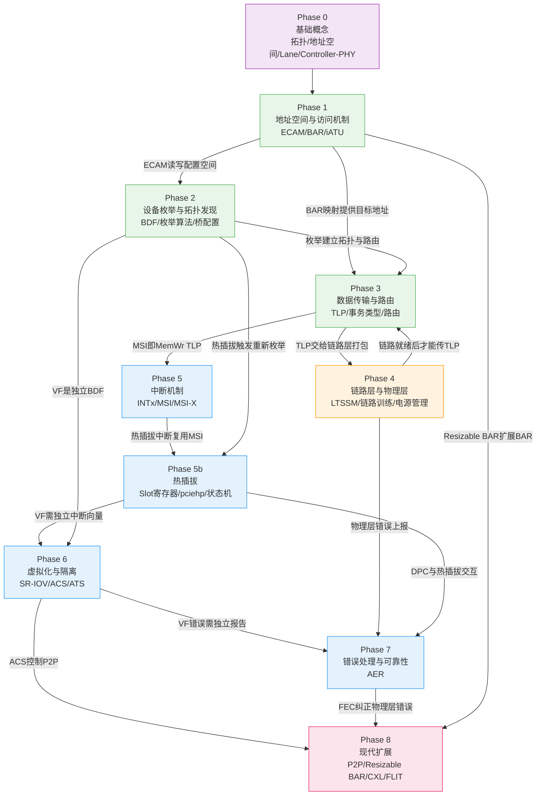

| 阶段        | 层次    | 对应能力                       |
| --------- | ----- | -------------------------- |
| Phase 0   | 🟣 前置 | 理解PCIe是什么、Controller/PHY硅片分工、拓扑与地址空间 |
| Phase 1-3 | 🟢 基础 | 配置设备、读写寄存器、DMA——日常工作的核心    |
| Phase 4   | 🟠 硬件 | 理解链路为何降速、设备为何消失            |
| Phase 5-5b | 🔵 系统 | 中断子系统、热插拔事件处理              |
| Phase 6-7 | 🔵 系统 | 虚拟化、可靠性                    |
| Phase 8   | 🔴 前沿 | 数据中心和高性能计算的现代扩展            |

***

## Phase 0: 基础概念

> 在深入任何具体机制之前，必须先理解PCIe是什么、由哪些组件构成、为什么这样设计。

### 0.1 从PCI到PCIe —— 为什么需要PCIe

| 对比维度 | ISA (1981)    | PCI (1992) | PCI-X (1998) | PCIe (2003)         |
| ------ | ------------- | ---------- | ------------ | ------------------- |
| 总线宽度   | 8/16-bit      | 32/64-bit  | 64-bit       | 串行Lane              |
| 时钟     | 4.77-8.33 MHz | 33/66 MHz  | 66-133 MHz   | 2.5-64 GT/s         |
| 带宽     | \~8 MB/s      | \~133 MB/s | \~1 GB/s     | \~64 GB/s (x16 5.0) |
| 拓扑     | 共享总线          | 共享总线       | 共享总线         | 点对点交换               |
| 并发     | ✗             | ✗          | ✗            | ✓                   |

**PCIe的核心变革**：从并行共享总线变为串行点对点交换网络。每个设备独享链路带宽，不再争抢总线。

### 0.2 PCIe拓扑组件

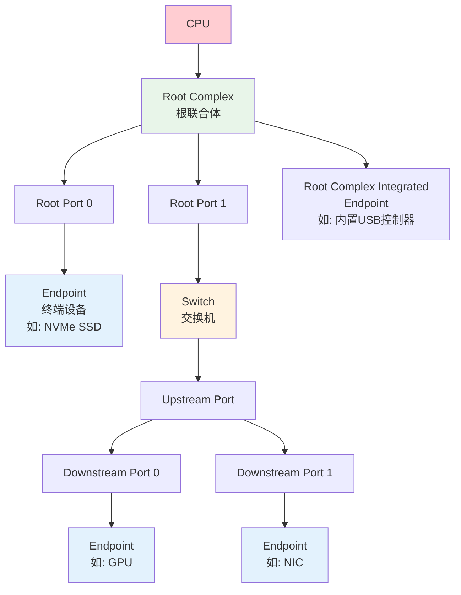

| 组件                    | 作用                           | 类比       |
| --------------------- | ---------------------------- | -------- |
| **CPU**               | 发起Memory/Config读写，接收中断       | 大脑       |
| **Root Complex (RC)** | CPU与PCIe域之间的桥梁，包含Host Bridge | 网关路由器    |
| **Host Bridge**       | RC内的核心逻辑：地址译码、ECAM、iATU      | 路由器的转发引擎 |
| **Root Port**         | RC的下游端口，在拓扑中呈现为PCI桥          | 路由器的网口   |
| **Switch**            | 扩展拓扑，多端口转发TLP                | 以太网交换机   |
| **Endpoint (EP)**     | 最终的I/O设备，TLP的源或目的            | 终端电脑     |
| **Bridge**            | 连接PCIe总线与其他总线（PCI/ISA）       | 协议转换器    |

**关键理解**：

- **Host Bridge不是设备**，它是SoC/CPU内部的硬件模块，负责将CPU的Memory访问转换为PCIe TLP
- **Root Complex是Host Bridge + Root Port + 内部总线的统称**
- **Switch在软件视角中是一组桥**：Upstream Port是一个桥，每个Downstream Port也是一个桥
- **Endpoint是真正做事情的设备**：GPU、NIC、NVMe、USB控制器等

### 0.3 PCIe域与Segment

一个PCIe域（Segment）包含一个RC及其下游所有设备。大型系统可有多个域：

```
Segment 0 (Domain 0000):     Segment 1 (Domain 0001):
  RC0 ─┬─ EP                  RC1 ─┬─ EP
       └─ Switch ─ EP              └─ EP
```

Linux中BDF完整表示为 `Segment:Bus:Device.Function`，如 `0000:01:00.0`。

### 0.4 三种地址空间

PCIe定义了三种独立的地址空间，每种有不同的访问方式：

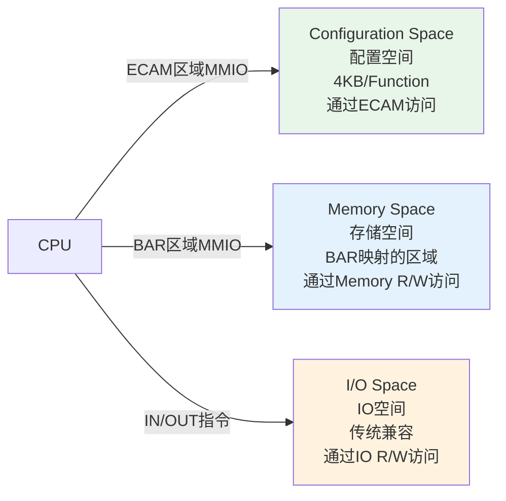

| 空间            | 大小           | 访问方式         | 用途                 |
| ------------- | ------------ | ------------ | ------------------ |
| Configuration | 4KB/Function | ECAM (MMIO)  | 设备发现、配置、Capability |
| Memory        | BAR声明        | 普通Load/Store | 设备寄存器、帧缓冲、DMA      |
| I/O           | BAR声明        | x86 IN/OUT指令 | 传统设备兼容，现代设备很少使用    |

> **MMIO (Memory-Mapped I/O)**：将设备寄存器映射到CPU的物理地址空间，CPU用普通Memory指令即可访问。PCIe的Config Space和Memory Space都通过MMIO访问。

### 0.5 Lane与链路宽度

PCIe链路由1-16条Lane组成，每条Lane包含两对差分信号（TX+/TX- 和 RX+/RX-）：

```
x1链路:  TX  →  RX  (1对发送, 1对接收)
         RX  ←  TX

x4链路:  TX[0:3] → RX[0:3]
         RX[0:3] ← TX[0:3]

x16链路: TX[0:15] → RX[0:15]
         RX[0:15] ← TX[0:15]
```

| 宽度  | 数据位宽      | 常见用途           |
| --- | --------- | -------------- |
| x1  | 1 bit/方向  | 声卡、网卡、SSD      |
| x4  | 4 bit/方向  | NVMe SSD、10G网卡 |
| x8  | 8 bit/方向  | 25G/40G网卡      |
| x16 | 16 bit/方向 | GPU、100G网卡     |

**带宽计算**：`有效带宽 = 速率 × 宽度 × 编码效率 ÷ 8`。Gen1/2 使用 8b/10b 编码（效率 80%），Gen3+ 使用 128b/130b 编码（效率 ≈98.5%）。上表数值均按对应代际编码效率计算。

| 速率             | x1         | x4        | x8        | x16       |
| -------------- | ---------- | --------- | --------- | --------- |
| 2.5 GT/s (1.0) | \~250 MB/s | \~1 GB/s  | \~2 GB/s  | \~4 GB/s  |
| 5.0 GT/s (2.0) | \~500 MB/s | \~2 GB/s  | \~4 GB/s  | \~8 GB/s  |
| 8.0 GT/s (3.0) | \~1 GB/s   | \~4 GB/s  | \~8 GB/s  | \~16 GB/s |
| 16 GT/s (4.0)  | \~2 GB/s   | \~8 GB/s  | \~16 GB/s | \~32 GB/s |
| 32 GT/s (5.0)  | \~4 GB/s   | \~16 GB/s | \~32 GB/s | \~64 GB/s |
| 64 GT/s (6.0)  | \~8 GB/s   | \~32 GB/s | \~64 GB/s | \~128 GB/s |

> **待确认**：PCIe 7.0 目标速率为 128 GT/s，规范尚未正式发布，最终数值可能调整

### 0.6 数据传输模型 —— TLP与DLLP

PCIe事务在三层之间传递：

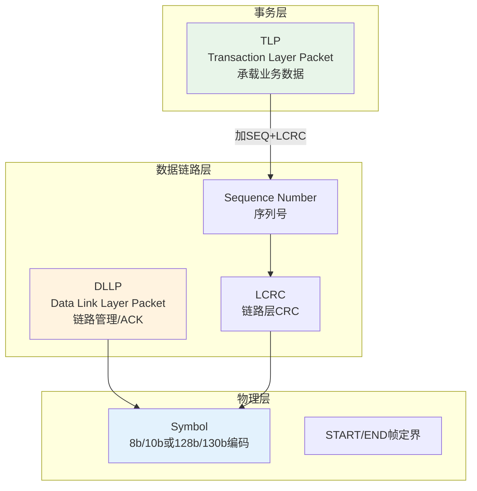

- **TLP**：事务层数据包，承载Memory Read/Write、Config Read/Write、Message等事务
- **DLLP**：数据链路层包，用于链路管理（ACK/NAK、电源管理、流量控制）
- **物理层**：负责编码、加扰、串并转换，将数据变为差分信号

> 软件工程师主要关注TLP（Phase 3），DLLP和物理层是硬件自动处理的

### 0.7 DMA —— 设备主动访问内存

**DMA (Direct Memory Access)** 是设备绕过CPU直接读写系统内存的机制：

```
传统方式:  设备 → 中断通知CPU → CPU读取设备数据 → CPU写入内存 (慢)
DMA方式:   设备 → 直接读写内存 → 完成后中断通知CPU (快)
```

DMA的关键问题：

- 设备使用**PCIe总线地址**访问内存，需要Inbound iATU/IOMMU转换为物理地址
- IOMMU限制设备只能访问授权的内存区域（DMA安全）
- 设备通过MSI/MSI-X中断通知CPU DMA完成

> DMA是高性能I/O的基础，理解DMA是理解PCIe数据面的关键

### 0.8 Controller 与 PHY —— 硅片视角

> 以上是协议视角——RC、Switch、EP 是拓扑概念；TLP、DLLP、Symbol 是数据包概念。**但这些逻辑模块在硅片上怎么划分？** 答案是分两半：Controller 是数字协议引擎（知道 TLP、配置空间、BAR），PHY 是模拟信号前端（只看到 bit 流）。多 Controller 共享一组 PHY Lane 时，通过 SerDes MUX 或 PHY Bifurcation 做 Lane 粒度分配。

详见 [Controller 与 PHY 架构](./controller-phy-architecture.md) — 覆盖 Controller/PHY 数字模拟分工、PIPE 接口与 LTSSM 执行模型、SerDes MUX 与 Bifurcation 方案对比、RK3588 实战案例。

> **核心要点**：先理解硅片上 Controller/PHY/Lane 的物理结构，再读 ECAM（Controller 的 DBI 接口）、BAR（Controller 的 ATU 地址转换）、LTSSM（Controller 做决策、PHY 做电气执行），每一个概念都有明确的硬件归属。

***

## Phase 1: 地址空间与访问机制

> CPU如何找到并访问PCIe设备？设备如何声明自己需要的资源？

### 全局地址映射视图

理解PCIe的第一步是看清CPU地址空间与PCIe总线地址空间之间的映射关系：

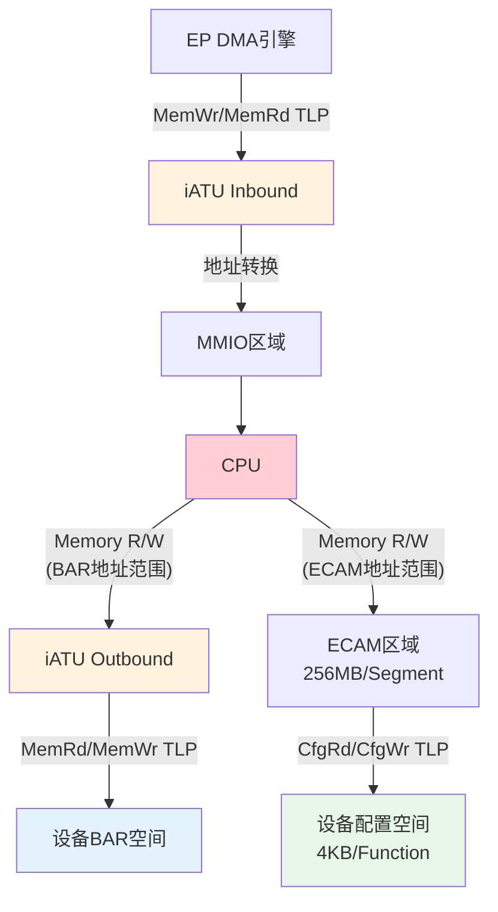

***

### 1.1 ECAM —— CPU访问配置空间的通道

**为什么需要**：传统PCI的CF8/CFC端口机制最多访问256B配置空间，而PCIe需要4KB（含Extended Capabilities）。ECAM将配置空间映射到MMIO，用普通Memory Read/Write即可访问。

**地址计算**：

```
ECAM地址 = 基址 + (Bus << 20) + (Dev << 15) + (Func << 12) + Offset
```

> 枚举（Phase 2）通过ECAM扫描每个BDF位置，读Vendor ID判断设备是否存在

**规范**：PCIe Base Spec §7.2.2 | PCI Firmware Spec 3.0 (MCFG表)

**Linux**：`pci_mmcfg_init()` · `pci_read_config_*()` · `/sys/firmware/acpi/tables/MCFG`

> ECAM访问的是**下游设备**的配置空间。RC自身的配置空间通过控制器的**DBI**接口访问，详见 [ECAM与配置空间](./ecam-config-space.md) §3.7

***

### 1.2 BAR —— 设备声明地址需求的机制

**为什么需要**：系统启动时不知道每个设备需要多大空间、放在哪个地址。BAR是设备与系统之间的"需求协商协议"。

**协商过程**：

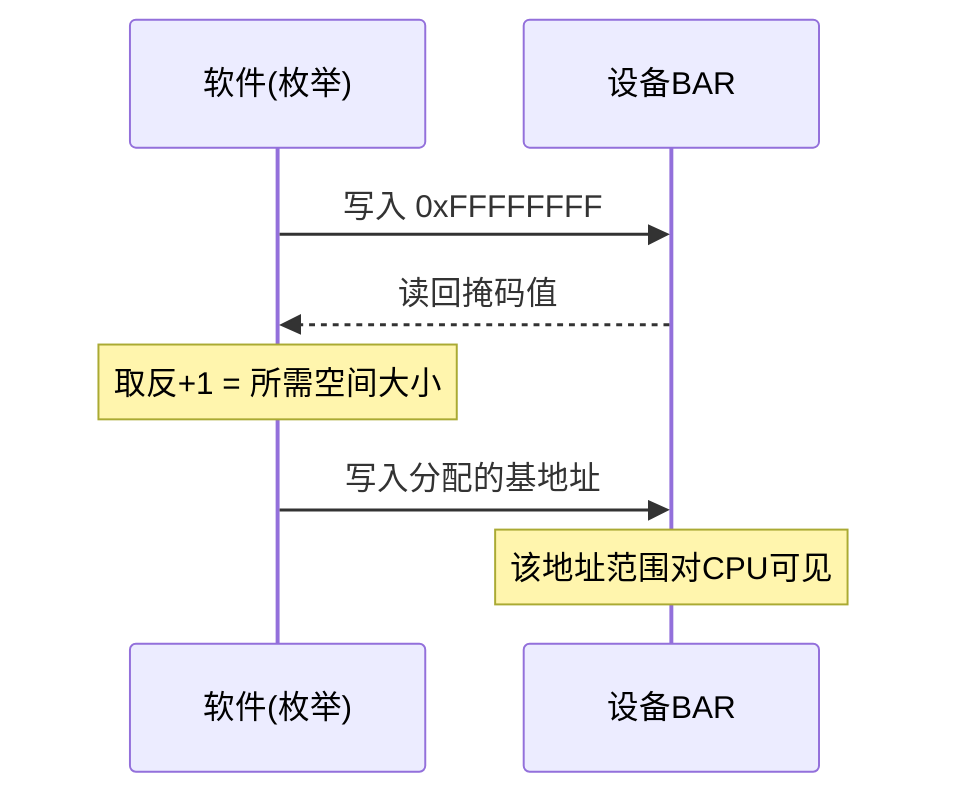

**BAR寄存器编码** (Type 0 Header: 0x10-0x24)：

| Bit  | 含义                                 |
| ---- | ---------------------------------- |
| 0    | 0=Memory Space, 1=I/O Space        |
| 1-2  | 00=32-bit Memory, 10=64-bit Memory |
| 3    | Prefetchable (允许CPU预取)             |
| 4-31 | 可写位掩码，决定空间大小                       |

**关键细节**：

- 64-bit BAR占用两个连续槽位 (BARn + BARn+1)
- Prefetchable：用于帧缓冲等无副作用内存；非Prefetchable：用于有读副作用的寄存器
- BAR0-5最多6个

> BAR分配完成后，CPU对该地址范围的Memory访问被RC转换为MemRd/MemWr TLP（Phase 3）

**规范**：PCIe Base Spec §7.5.1.2.1 | PCI Local Bus Spec §6.2.5.1

**Linux**：`pci_resource_start/end/len()` · `pci_iomap()` · `pci_bus_assign_resources()`

***

### 1.3 iATU —— 地址空间的翻译器

**为什么需要**：CPU物理地址空间和PCIe总线地址空间是两个独立的域。iATU是RC内部的硬件模块，负责两者之间的映射。

**典型场景**：

- SoC的DDR物理地址从0x80000000开始，但PCIe总线地址从0x00000000开始
- 32位CPU需要访问64位PCIe地址空间
- EP发起DMA时，PCIe地址需要转换为SoC内部地址

**双向映射**：

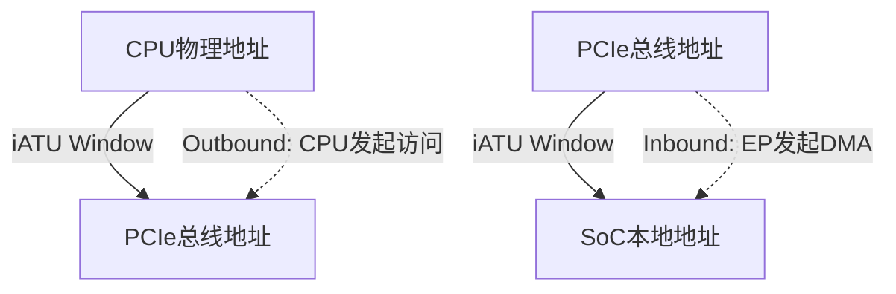

**DWC控制器典型寄存器**：

| 寄存器                          | 作用             |
| ---------------------------- | -------------- |
| `iATU_REGION_CTRL_1/2`       | 区域控制（方向、类型、启用） |
| `iATU_LWR/UPPER_BASE_ADDR`   | 源地址范围基址        |
| `iATU_LIMIT_ADDR`            | 源地址范围上限        |
| `iATU_LWR/UPPER_TARGET_ADDR` | 目标地址           |

> Outbound映射错误→CPU访问设备地址不正确；Inbound映射错误→DMA数据写错位置（Phase 3）

**规范**：各厂商控制器手册（DWC、Cadence、PLDA）

**Linux**：`drivers/pci/controller/dwc/pcie-designware.c` · `drivers/pci/controller/pcie-rcar.c`

***

## Phase 2: PCIe 初始化的完整图景

> EFI/UEFI 固件（或内核自己）如何在一个尚不可见的拓扑中发现所有 PCIe 设备、为它们分配资源、初始化中断？这是一个层层递进的工程流程。

本节站在**固件/内核开发工程师**的角度，将零散的知识串联成一条可执行的初始化时间线。每个环节对应的详细机制在后续文档中展开。

### 2.1 初始化时间线

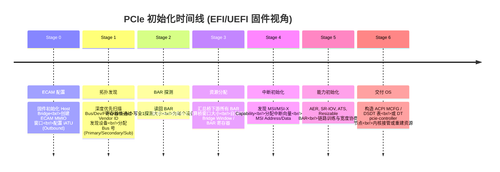

### 2.2 各阶段的核心要素

#### Stage 0 — ECAM 配置（[ECAM与配置空间](./ecam-config-space.md)）

这是所有后续操作的前提：固件必须先让 CPU 能"看到"设备配置空间。

```c
// 关键技术动作
pci_ecam_create(dev, cfgres, busr, ops);        // 分配 cfg->win (MMIO 基址) + cfg->pci_ops
dw_pcie_prog_outbound_atu(pci, outbound);  // 配置 iATU: CPU 地址 → PCIe 总线地址
                                          //   region.select = IATU_REGION_CTRL_CFG;
```

- **FDT 平台**：`pci-host-ecam-generic` 驱动从设备树 `reg` 属性获取 ECAM 基址
- **ACPI 平台**：内核从 MCFG 表获取 ECAM 基址，由固件在 Stage 6 填好
- **结果**：`pci_generic_config_read/write()` 可用，枚举可以开始

#### Stage 1 — 拓扑发现（[枚举流程](./enumeration-flow.md)）

从 Bus 0 开始深度优先遍历：

```
pci_host_probe()
  └─ pci_scan_root_bus()           // Bus 0 作为根总线
       └─ pci_scan_child_bus(bus)
            └─ for devnr = 0..31:
                 └─ pci_scan_slot(bus, PCI_DEVFN(devnr, 0))
                      └─ for func = 0..7 (或至多255, ARI):
                           └─ pci_scan_single_device(bus, PCI_DEVFN(devnr, func))
                           ├─ pci_scan_device()        // 读 Vendor ID
                           │    └─ pci_bus_read_dev_vendor_id()  // CRS 等待最多 60s
                           │    └─ pci_alloc_dev()
                           │    └─ pci_setup_device()   // 读 hdr_type, class, BAR, capabilities
                           └─ pci_device_add()
            └─ for 每个桥设备:
                 └─ pci_scan_bridge_extend()
                      ├─ 读 Primary/Secondary/Subordinate Bus
                      ├─ Pass 0: 固件已配置 → 直接递归
                      └─ Pass 1: 固件未配置 → 分配 Bus 号 → 递归
```

**关键状态转移**：枚举过程中`pci_setup_device()` 会调用 `pci_init_capabilities()`，在此处初始化 MSI、MSI-X、SR-IOV、AER、Resizable BAR 等——这些能力在后面的 Stage 4-5 中才会被实际激活。

#### Stage 2 — BAR 探测（[BAR资源分配](./bar-resource-allocation.md) §2）

枚举中的 `pci_setup_device()` 调用 `pci_read_bases()`，这是 BAR 探测的入口：

```c
// 知识要点，详见 bar-resource-allocation.md §2.2-2.6
pci_read_bases(dev, PCI_STD_NUM_BARS, PCI_ROM_ADDRESS);
  // ① 关闭 Memory/IO 解码 (PCI_COMMAND)
  // ② __pci_size_stdbars() → __pci_size_bars()
  //      对每个 BAR: 保存原始值 → 写全1 → 读回掩码 → 恢复原始值
  // ③ 恢复解码
  // ④ for each BAR:
  //      __pci_read_base() → decode_bar() + pci_size()
  //      从掩码提取类型 (IO/MEM/64bit/Prefetchable) + 大小
  //      将 PCIe 总线地址转换为 CPU 物理地址 (pcibios_bus_to_resource)
```

**关键**：此阶段不分配地址。BAR 中保留的是固件写入的值（或者 0），内核只读取它和探测大小。如果固件已分配有效地址且 resource 正确，后续 Stage 3 会直接复用；否则从零分配。

#### Stage 3 — 资源分配（[BAR资源分配](./bar-resource-allocation.md) §3-4）

内核走"汇总 → 计算 → 写入"三步：

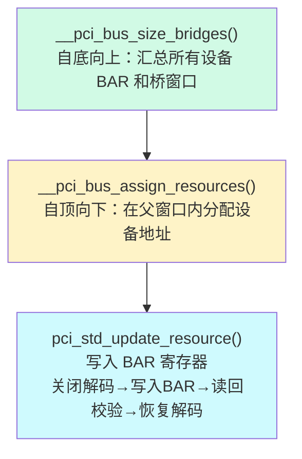

- **Step 1 `__pci_bus_size_bridges()`**：遍历每个桥，将其下游所有设备的 BAR 需求汇总到桥的 I/O、Memory、Prefetchable Memory 三类窗口
- **Step 2 `__pci_bus_assign_resources()`**：从 Root 往下，在每层桥的窗口范围内为设备分配具体地址（最简单的策略：顺序分配 + 对齐）
- **Step 3 `pci_std_update_resource()`**：将 CPU 物理地址转换为 PCIe 总线地址（`pcibios_resource_to_bus()`），写入 BAR 寄存器并读回校验

**iATU 的角色**：iATU 是 Host Bridge 内部的地址转换单元。Outbound iATU 将 CPU 物理地址映射到 PCIe 总线地址（设备侧看到的地址），Inbound iATU 将 PCIe 总线地址映射到 CPU 物理地址（设备 DMA 数据写入的内存位置）。正确配置 iATU 是固件的核心职责之一。

#### Stage 4 — 中断初始化（[MSI中断](./msi-interrupt.md)）

枚举中 `pci_init_capabilities()` 调用了 `pci_msi_init()` / `pci_msix_init()` 来禁用 MSI/MSI-X。驱动加载时才会真正启用：

```c
pci_alloc_irq_vectors(dev, 1, 16, PCI_IRQ_MSI | PCI_IRQ_MSIX);
  // → 分配中断向量，设置 MSI address/data
  // → __pci_write_msi_msg() 写入 MSI Capability 寄存器
```

- **MSI**：3 个关键寄存器 —— Message Address (64-bit)、Message Data (16-bit)、Multiple Message Enable
- **MSI-X**：独立的 BAR 空间，每个向量有独立的 Address + Data 对，支持 per-vector mask
- **x86**：MSI Address 编码目标 APIC ID 和中断模式；**ARM GICv3**：通过 ITS 表将 MSI 的 `(DeviceID, EventID)` 映射到 LPI 中断号

#### Stage 5 — 能力初始化

`pci_init_capabilities()` 触发的其他能力：

| 能力 | 初始化函数 | 作用 |
|------|-----------|------|
| SR-IOV | `pci_iov_init()` | 读取 TotalVFs，记录 PF/VF 关系 |
| AER | `pci_aer_init()` | 发现 AER Capability，准备错误上报路径 |
| ATS | `pci_ats_init()` | 发现 ATC (Address Translation Cache)，记录 STU 页大小 |
| Resizable BAR | `pci_rebar_init()` | 发现 REBAR Capability，记录支持的 BAR 大小列表 |
| PASID | `pci_pasid_init()` | 发现 PASID Capability，记录最大 PASID 宽度 |
| ACS | `pci_acs_init()` | 发现 ACS Capability，用于 P2P 隔离和 VF 间隔离 |

#### Stage 6 — 交付 OS ([ECAM与配置空间](./ecam-config-space.md) §1.3)

固件完成所有初始化后，通过固件-OS 接口将拓扑和资源配置传递给内核：

**ACPI 平台**：

```
MCFG 表 → ECAM MMIO 基址 (每段 Bus 范围一个 entry)
DSDT/SSDT → _CRS (设备资源/BAR/桥窗口) + _PRT (中断路由)
```

**Device Tree 平台**：

```dts
pcie@40000000 {
    compatible = "pci-host-ecam-generic";
    reg = <0x0 0x40000000 0x0 0x10000000>;     // ECAM 窗口
    ranges = <0x81000000 0 0 0x0 0x30000000 0 0x00010000>,  // IO
             <0x82000000 0 0x48000000 0x0 0x48000000 0 0x08000000>; // MEM
};
```

### 2.3 枚举算法 —— 深度优先扫描

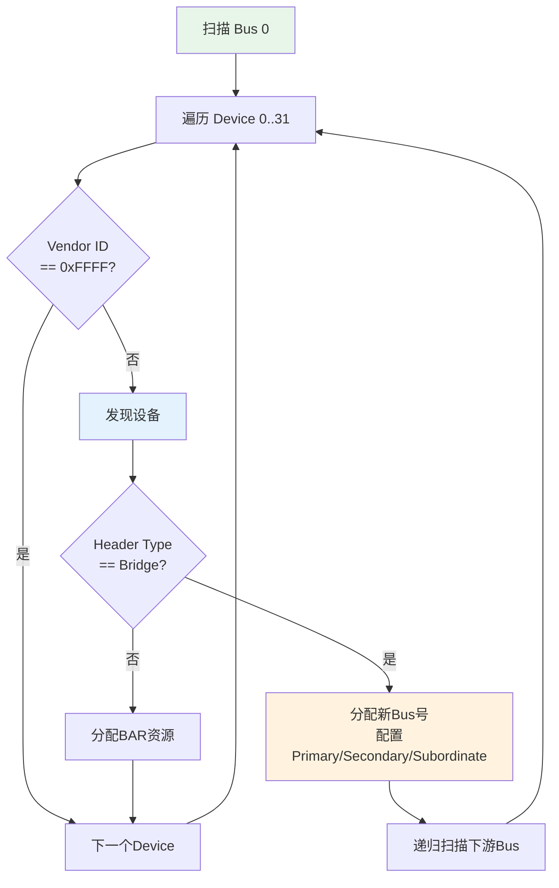

**桥的关键寄存器**：

| 寄存器 | 含义 |
| --------------- | ----------- |
| Primary Bus | 桥的上游总线号 |
| Secondary Bus | 桥的直接下游总线号 |
| Subordinate Bus | 桥下游所有总线的最大号 |

**Type 0 vs Type 1 配置周期**：Type 0 用于到达目标设备（BDF 匹配），Type 1 用于穿透桥接（转发到下游）。

> 枚举通过 ECAM（Phase 1）执行配置读写；完成后 BAR 已分配、路由路径已建立。

### 2.4 BDF —— 设备寻址

```
Bus (8bit, 0-255) : Device (5bit, 0-31) : Function (3bit, 0-7, ARI扩展至0-255)
```

Linux 表示：`0000:01:00.0` = Segment 0, Bus 1, Dev 0, Func 0

> TLP Header中的Requester ID / Completer ID就是BDF（Phase 3）

***

## Phase 3: 数据传输与路由

> 数据如何在PCIe拓扑中流动？如何到达正确的目标？

### 3.1 TLP —— 数据的信封

```
┌──────────┬───────────┬──────────┬──────┐
│ Header   │ Data      │ Digest   │ LCRC │
│ 3-4 DW   │ 0-1024 DW │ 0-1 DW   │ 1 DW │
└──────────┴───────────┴──────────┴──────┘
```

**Memory Request Header (3 DW)**：

```
DW0: [Fmt|Type|R|TC|Attr|R|TD|EP|Attr|AT|Length]
DW1: [Requester ID (BDF) | Tag | Last BE | First BE]
DW2: [Address[63:2] / Address[31:2]]
DW3: [Address[63:32]] (仅64-bit地址)
```

| 字段 | 位宽 | 作用 |
|------|------|------|
| Fmt+Type | 2+5 | 事务类型（MRd/MWr/CfgRd/CfgWr/Msg/Cpl） |
| TC | 3 | Traffic Class（QoS优先级） |
| Attr | 2 | Relaxed Ordering / No Snoop |
| Length | 10 | 数据长度（1-1024 DW） |
| Requester ID | 16 | 发起者BDF（Phase 2枚举分配） |
| Tag | 8 | 事务标识，匹配Completion |
| BE | 各4 | Byte Enable，指示有效字节 |
| Address | 30/62 | 目标地址（Phase 1 BAR分配） |

**Completion Header (3 DW)**：

```
DW0: [Fmt=10|Type=01010|R|TC|Attr|R|TD|EP|Attr|AT|Length]
DW1: [Completer ID (BDF) | Status | BCM | Byte Count]
DW2: [Requester ID | Tag | Lower BE | Upper BE]
```

> Completion携带**Requester ID和Tag**，发起者据此匹配原始请求。

### 3.2 事务类型

| 事务           | 缩写       | 发布式?          | 典型场景           |
| ------------ | -------- | ------------- | -------------- |
| Memory Read  | MRd      | ✗ 需Completion | CPU读设备寄存器      |
| Memory Write | MWr      | ✓ 无需响应        | DMA写、CPU写设备    |
| Config Read  | CfgRd0/1 | ✗             | 枚举、驱动配置        |
| Config Write | CfgWr0/1 | ✗             | 配置设备           |
| Completion   | Cpl/CplD | -             | 响应Non-Posted请求 |
| Message      | Msg/MsgD | ✓             | MSI中断、电源管理、错误  |

**Posted vs Non-Posted**：Posted发出即完成（高吞吐无确认）；Non-Posted必须等Completion（有确认有延迟）。

### 3.3 路由机制

| 方式         | 适用事务              | 机制                                |
| ---------- | ----------------- | --------------------------------- |
| Address路由  | Memory/IO         | Switch匹配Downstream Port窗口；设备匹配BAR |
| ID路由       | Config/Completion | Switch匹配Bus号；桥匹配BDF               |
| Implicit路由 | Message           | RC/Switch特殊处理（广播、本地）              |

> 枚举时配置的桥窗口和BAR就是路由表的"规则"；MSI本质是MemWr TLP（Phase 5）

### 3.4 流量控制 (Flow Control)

PCIe使用**基于信用的流量控制**避免接收端缓冲区溢出：

```
发送端                              接收端
  ┌──────────┐    FC Update DLLP    ┌──────────┐
  │ 维护信用计数 │ ←────────────────── │ 报告可用缓冲区 │
  │ 每发一包减1  │                     │ 释放后更新信用 │
  │ 计数=0时停止 │                     │            │
  └──────────┘                       └──────────┘
```

| VC | 信用类型 | 含义 |
|----|---------|------|
| VC0 (默认) | PH/PD | Posted Header/Data |
| VC0 | NPH/NPD | Non-Posted Header/Data |
| VC0 | CplH/CplD | Completion Header/Data |

> Flow Control是PCIe不需要总线仲裁的原因——每个设备独立管理自己的发送节奏。FC Init在LTSSM Configuration阶段完成（Phase 4）。

**规范**：PCIe Base Spec §2.2.4

### 3.5 TLP错误检测

PCIe在多个层次检测传输错误：

| 层次 | 机制 | 检测的错误 |
|------|------|---------|
| 数据链路层 | LCRC (32-bit) | TLP传输中的比特错误 |
| 数据链路层 | Sequence Number | TLP丢失或重复 |
| 事务层 | ECRC (可选, 32-bit) | 端到端数据完整性（穿过Switch后仍有效） |
| 事务层 | Poisoned TLP | 数据已被上游组件标记为损坏（bit0 of DW0=1） |
| 事务层 | Unsupported Request | 目标不支持该事务类型 |

**LCRC vs ECRC**：LCRC由每条链路的发送端计算、接收端校验，Switch转发时重新计算；ECRC由源端计算、最终目的端校验，中间Switch不修改。ECRC用于检测Switch内部的数据损坏。

> Poisoned TLP是一种"尽力通知"机制：发送端知道数据已损坏但仍传递给接收端，接收端通过AER报告该错误。

***

## Phase 4: 链路层与物理层

> 比特如何在导线上可靠传输？链路状态如何管理？

### 4.1 LTSSM —— 链路生命周期

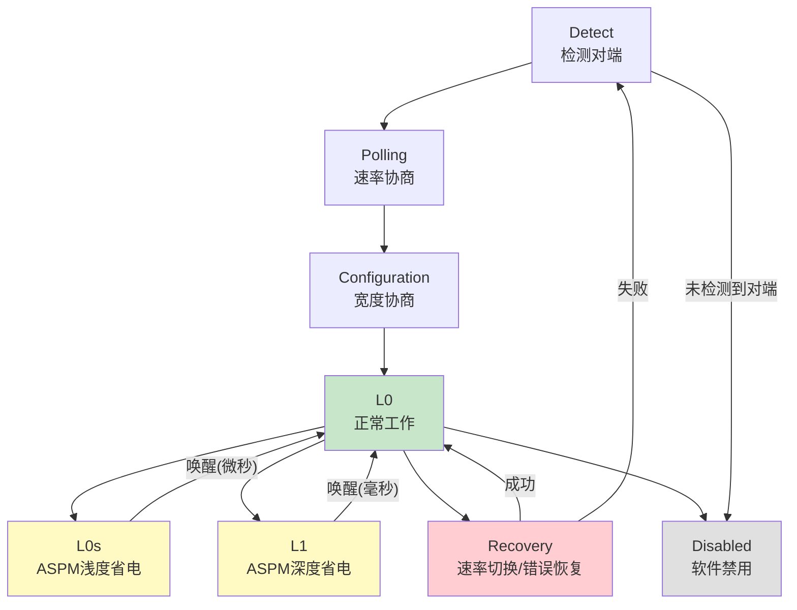

> 只有L0状态才能传TLP（Phase 3）；链路训练失败是设备"消失"最常见原因；Recovery过多触发AER（Phase 7）

### 4.2 链路均衡 (Equalization)

Gen3 (8 GT/s) 及以上速率需要**链路均衡**补偿高频信号损耗：

```
信号损耗问题:
  Gen1/2: NRZ编码 + 2.5/5 GT/s → 信号完整性OK，无需均衡
  Gen3+:  8+ GT/s → 高频衰减严重，需要发送端预加重 + 接收端均衡

均衡阶段 (Phase 0-3):
  Phase 0: 使用默认预设(Preset)建立初始链路
  Phase 1: Downstream Port调整系数 → Upstream Port评估
  Phase 2: Upstream Port调整系数 → Downstream Port评估
  Phase 3: 双方微调，达到最优BER
```

| 速率 | 均衡要求 | 控制寄存器 |
|------|---------|-----------|
| 2.5/5 GT/s | 无需 | - |
| 8 GT/s (Gen3) | 必须 | `GEN3_RELATED_OFF`, `GEN3_EQ_CONTROL` |
| 16+ GT/s (Gen4/5) | 必须，更复杂 | `GEN4_*/GEN5_*` 扩展寄存器 |

> 均衡失败是Gen3+链路降速的常见原因。DWC控制器通过DBI配置均衡参数（见ECAM文档§3.7）。

### 4.3 链路能力

| 寄存器    | 含义               |
| ------ | ---------------- |
| LnkCap | 设备声明的最大能力（速率、宽度） |
| LnkCtl | 软件控制的当前设置        |
| LnkSta | 实际协商结果           |

**查看**：`lspci -vvv | grep -E "LnkCap|LnkSta"`

**常见现象**：x16插槽协商到x8/x4 → 通常是物理连接问题

### 4.4 电源管理

**ASPM**：L0 → L0s (微秒唤醒) → L1 (毫秒唤醒)

**Device PM**：D0 → D1 → D2 → D3hot → D3cold

> 低功耗唤醒需要PME Message（Phase 5）

### 4.5 LTSSM关键状态详解

| 状态 | 触发条件 | 行为 | 延迟 |
|------|---------|------|------|
| Detect | 上电/复位 | 检测对端是否存在（检测RX端差分信号） | - |
| Polling | Detect成功 | 速率协商、位锁定、符号锁定 | ~24ms |
| Configuration | Polling完成 | Lane编号分配、宽度协商 | - |
| L0 | Configuration完成 | 正常工作，可传TLP | 0 |
| L0s | ASPM触发 | 关闭TX，RX保持活跃 | ~1us恢复 |
| L1 | ASPM/软件触发 | 关闭TX和RX，省电更多 | ~10us恢复 |
| Recovery | 速率切换/错误 | 重新训练链路（不回到Detect） | ~24ms |
| Disabled | 软件禁用 | 链路关闭 | 需重新训练 |

> 链路从L0进入Recovery的常见原因：ASPM L1.2子状态退出、链路速率/宽度重新协商、错误恢复。Recovery失败才回退到Detect。

**规范**：PCIe Base Spec §5.0 | §4 (Physical Layer)

***

## Phase 5: 中断机制

> 设备如何异步通知CPU有事件需要处理？

### INTx → MSI → MSI-X 演进

| 机制    | 方式              | 向量数    | Masking      | 缺点          |
| ----- | --------------- | ------ | ------------ | ----------- |
| INTx  | Message模拟边带信号   | 4 (共享) | ✗            | 共享中断、需查询    |
| MSI   | MemWr TLP到APIC  | 1-32   | ✗            | 向量少、不支持mask |
| MSI-X | 独立Address/Data表 | 1-2048 | ✓ Per-Vector | -           |

**MSI Capability结构**：

```
Config Space
├── Message Address  → 中断目标地址 (Local APIC)
├── Message Data     → 中断向量号
└── Message Control  → 启用/禁用，向量数量
```

> MSI本质是MemWr TLP（Phase 3）；VF需要独立MSI-X向量（Phase 6）

**规范**：PCIe Base Spec §6.1

**Linux**：`pci_enable_msi()` · `pci_enable_msix_range()` · `drivers/pci/msi/`

***

## Phase 6: 虚拟化与隔离

> 如何在多个虚拟机之间安全共享PCIe设备？

### 虚拟化栈全景

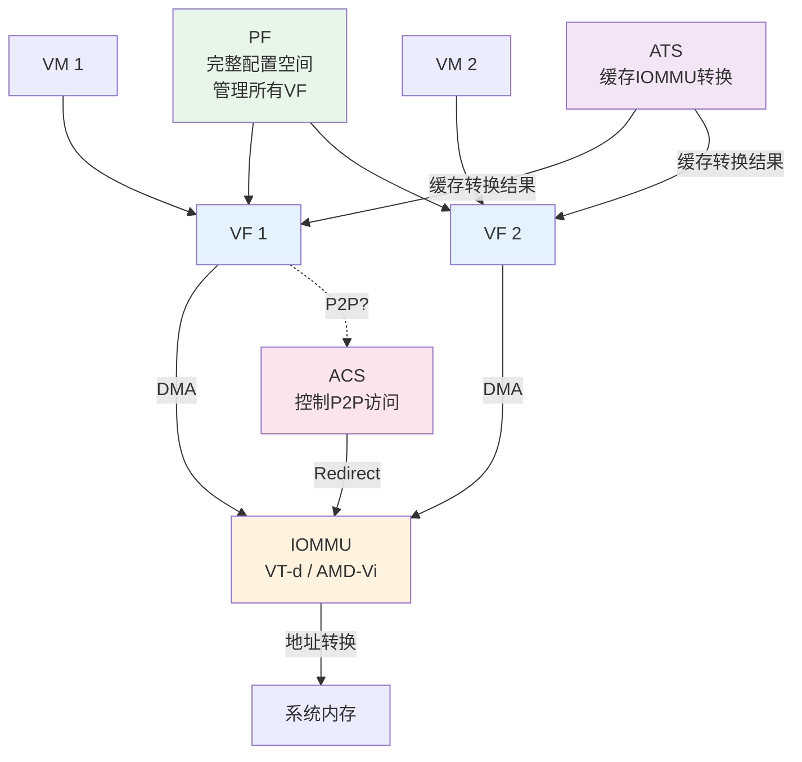

### 6.1 SR-IOV

**PF/VF结构**：

| 对比维度 | PF         | VF       |
| ------ | ---------- | -------- |
| 配置空间   | 完整         | 轻量(部分只读) |
| BAR    | 独立         | 独立       |
| MSI-X  | 独立         | 独立       |
| 管理能力   | 创建/销毁/配置VF | 无        |

**关键寄存器**：`NumVFs` · `VF Enable` · `VF Offset` · `Stride` · `System Page Size`

> VF有独立BDF（Phase 2），枚举时作为独立设备发现

**规范**：SR-IOV Specification 1.1

**Linux**：`pci_enable_sriov()` · `echo N > /sys/bus/pci/devices/.../sriov_numvfs`

### 6.2 ACS —— P2P防火墙

**核心目的**：没有ACS时，一个VF可能直接访问另一个VF的内存。

| 控制点                     | 作用                      |
| ----------------------- | ----------------------- |
| Source Validation       | 验证请求者是否有权访问目标           |
| Translation Blocking    | 阻止已转换地址的P2P，强制走IOMMU    |
| P2P Request Redirect    | 将P2P请求重定向到Upstream      |
| P2P Completion Redirect | 将Completion重定向到Upstream |
| Direct Translated P2P   | 允许特定已转换P2P              |

> ACS影响路由决策（Phase 3），启用Redirect后P2P TLP被重定向到Upstream

**规范**：PCIe Base Spec §6.12

### 6.3 ATS —— IOMMU的缓存

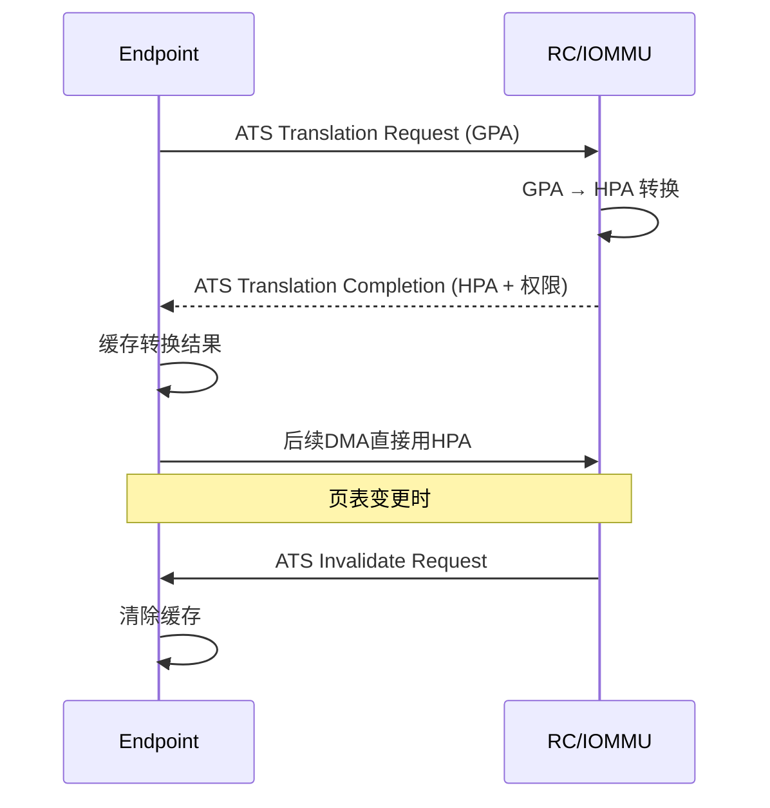

**规范**：PCIe Base Spec §6.13

***

## Phase 7: 错误处理与可靠性

> 传输出现错误时，如何检测、报告、恢复？

### AER —— 分级报警系统

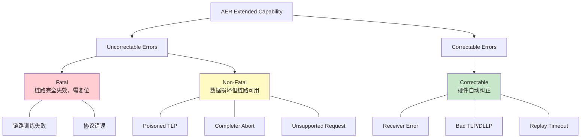

**AER寄存器结构**：

| 寄存器                       | 作用                  |
| ------------------------- | ------------------- |
| UE Status/Mask/Severity   | 不可纠正错误状态/掩码/严重性     |
| CE Status/Mask            | 可纠正错误状态/掩码          |
| Header Log                | 捕获错误TLP Header（诊断用） |
| Root Error Command/Status | Root Port错误收集       |
| Error Source ID           | 错误来源BDF             |

> 物理层Receiver Error→AER（Phase 4）；事务层Poisoned TLP→AER（Phase 3）

**AER错误处理流程**：

```
错误发生 → 设备设置AER Status位
  → Root Port收集错误 (Root Error Command控制是否上报)
  → Root Port发送MSI/MSI-X中断给CPU
  → Linux AER驱动 (aerdrv.c) 处理中断
     ├── Correctable: 计数+1，清除状态位
     ├── Non-Fatal: 记录错误，尝试恢复（重试/链路重训练）
     └── Fatal: 链路复位，可能触发DPC
```

**AER固件优先 (Firmware First)**：某些平台（如ARM服务器）由固件（UEFI/ACPI）先处理AER，再通过GHES (Generic Hardware Error Source) 通知OS。Linux通过`CONFIG_ACPI_APEI`支持此模式。

**规范**：PCIe Base Spec §6.2

**Linux**：`aer_inject` 模块 · `dmesg` 查看报告

### 7.2 DPC (Downstream Port Containment)

DPC是AER的重要补充——当链路发生不可恢复错误时，**自动阻塞下游端口**，防止错误传播：

```
错误发生 → DPC触发 → 下游端口阻塞 → 所有下游TLP被丢弃
                                    → 软件收到DPC中断
                                    → 软件决定恢复策略
```

| DPC事件 | 触发条件 | 恢复方式 |
|---------|---------|----------|
| DPC Trigger | 下游链路Fatal Error | 软件触发DPC Reset |
| DPC RP PIO Err | Root Port PIO错误 | 清除DPC Trigger Status |
| DPC Surprising Down | 链路意外断开 | 检查物理连接 |

```c
// drivers/pci/pcie/dpc.c
static void dpc_handler(struct irq_desc *desc)
{
    // 读取DPC Status
    pci_read_config_word(pdev, pdev->dpc_cap + PCI_EXP_DPC_STATUS, &status);

    if (status & PCI_EXP_DPC_STATUS_TRIGGER) {
        // DPC已触发，阻塞下游
        if (dpc_wait_link_inactive(pdev))
            pci_err(pdev, "DPC: link still active\n");

        // 通知AER子系统
        dpc_process_rp_pio_error(pdev);
    }
}
```

> DPC + AER + Hot-Plug构成现代PCIe错误恢复的完整方案。DPC确保错误不扩散，AER提供诊断信息，Hot-Plug支持设备重新枚举。

***

## Phase 8: 现代扩展

> 传统PCIe机制在现代数据中心场景下的局限，以及如何解决？

### 8.1 P2P —— 绕过内存的数据直传

**传统路径**：GPU → 内存 → NIC（两次搬运）
**P2P路径**：GPU → Switch → NIC（零拷贝）

**前提条件**：

1. 两个设备在同一PCIe域（同一RC下）
2. Switch支持P2P路由
3. ACS不阻止该P2P访问（Phase 6.2）
4. 目标设备BAR地址对源设备可见

**场景**：GPU Direct RDMA · NVMe P2P (SSD ↔ GPU)

**Linux**：`pci_p2pdma_add_resource()` · `CONFIG_PCI_P2PDMA`

### 8.2 Resizable BAR —— 大显存映射

传统BAR大小固定，现代GPU 24GB+显存需要更大MMIO映射。Resizable BAR允许运行时动态调整。

> 对传统BAR机制（Phase 1.2）的扩展，增加 Resizable BAR Capability

**Linux**：`pci_resize_resource()` · `/sys/bus/pci/devices/.../resource_resize`

### 8.3 CXL —— 超越I/O的互联

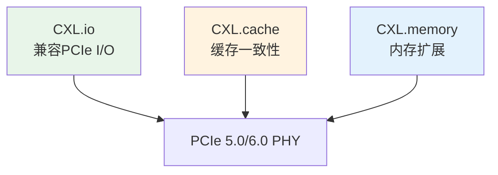

**为什么需要**：PCIe是I/O语义（Load/Store寄存器），AI/ML需要CPU与加速器共享内存、保持缓存一致性、内存池化。

| 协议         | 功能    | 与PCIe关系     |
| ---------- | ----- | ----------- |
| CXL.io     | I/O操作 | 直接使用PCIe事务层 |
| CXL.cache  | 缓存一致性 | 新增一致性消息     |
| CXL.memory | 内存扩展  | 新增内存语义      |

**资源**：<https://www.computeexpresslink.org/> · CXL 3.1 Spec

### 8.4 PCIe 6.0/7.0 —— FLIT模式

| 对比维度 | 5.0及以前          | 6.0+          |
| ------ | --------------- | ------------- |
| 数据单元   | TLP/DLLP (可变长度) | FLIT (固定256B) |
| 编码     | 128b/130b       | PAM4 + FEC    |
| 速率     | 32 GT/s         | 64/128 GT/s   |

**为什么需要FLIT**：PAM4信噪比低需要FEC纠错，FEC需要固定长度数据块。TLP仍然存在，但被封装在FLIT中——事务层语义不变，链路层实现大变。

> FEC纠正物理层比特错误，减少AER Correctable Errors（Phase 7）

***

## 附录

### 规范索引

| 优先级 | 规范                    | 核心章节                                                        | Phase |
| --- | --------------------- | ----------------------------------------------------------- | ----- |
| P0  | PCIe Base Spec 4.0+   | §2 Transaction, §3 Data Link, §4 Physical, §7 Software Init | 1-7   |
| P1  | PCI Firmware Spec 3.0 | MCFG, ACPI \_OSC                                            | 1, 2  |
| P2  | SR-IOV Spec 1.1       | VF结构、配置空间                                                   | 6     |
| P3  | CXL Spec 3.1          | CXL.io/cache/memory                                         | 8     |

### Linux内核代码索引

| 主题        | 路径                                      | Phase |
| --------- | --------------------------------------- | ----- |
| 枚举        | `drivers/pci/probe.c`                   | 2     |
| 资源分配      | `drivers/pci/setup-bus.c` `setup-res.c` | 1, 2  |
| 驱动接口      | `drivers/pci/pci-driver.c`              | 3     |
| MSI/MSI-X | `drivers/pci/msi/`                      | 5     |
| SR-IOV    | `drivers/pci/iov.c`                     | 6     |
| AER       | `drivers/pci/pcie/aer.c`                | 7     |
| ASPM      | `drivers/pci/pcie/aspm.c`               | 4     |
| P2PDMA    | `drivers/pci/p2pdma.c`                  | 8     |
| DWC控制器    | `drivers/pci/controller/dwc/`           | 1     |

### 调试速查

```bash
# 拓扑
lspci -tv                              # 树形拓扑
lspci -vvv -s 01:00.0                  # 单设备详情
lspci -x -s 01:00.0                    # 配置空间原始数据

# 链路
lspci -vvv | grep -E "LnkCap|LnkSta"  # 链路能力与状态

# 内核
dmesg | grep -i pci                    # 枚举/错误日志
cat /sys/kernel/debug/pci/devices      # 内核视角

# SR-IOV
echo N > /sys/bus/pci/devices/.../sriov_numvfs  # 启用VF

# AER
cat /sys/bus/pci/devices/.../aer_dev_correctable  # 错误计数
```

***

*更新：2026-04-21*
