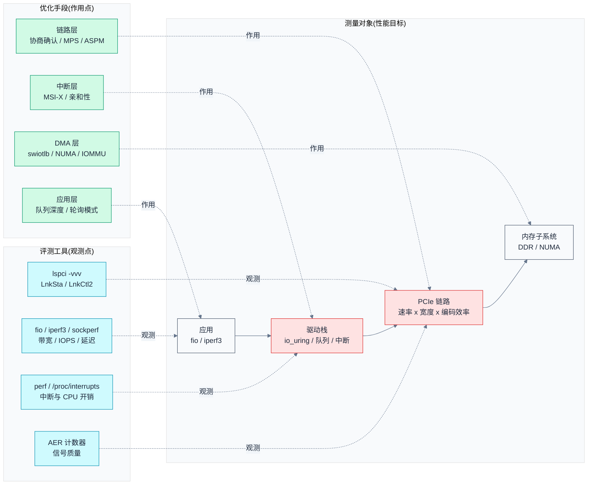
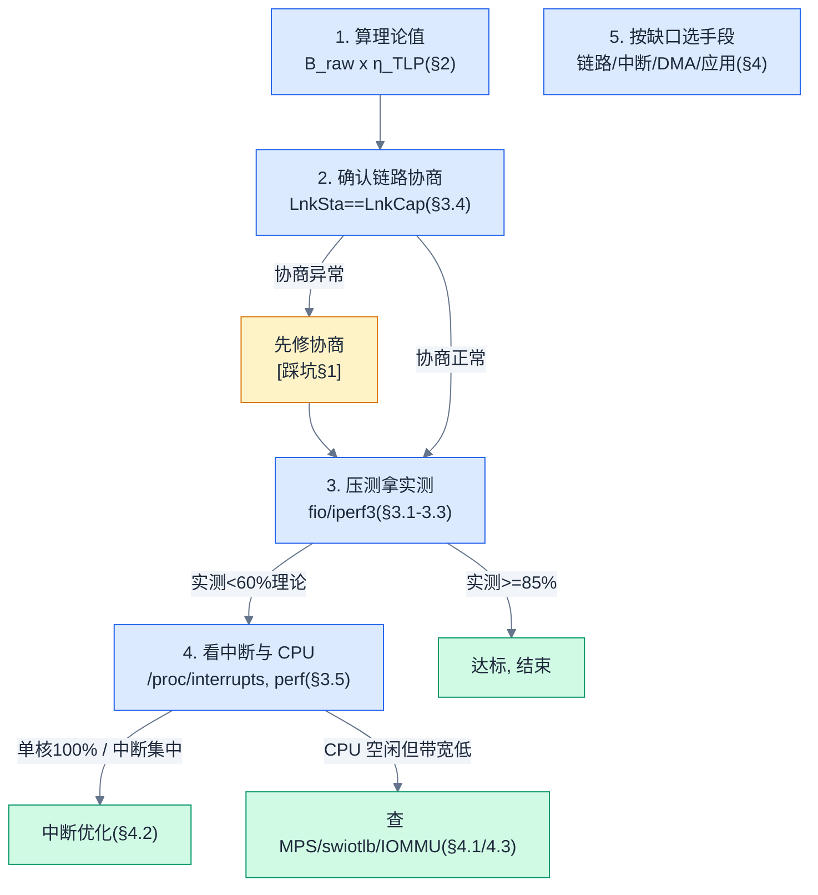

# PCIe 性能评测与优化

> 从"协议规格"到"真实吞吐"之间的鸿沟，如何测量、如何跨越。本文把 PCIe 的性能问题拆成三层：**模型层**（理论带宽/延迟怎么算）、**评测层**（怎么用工具量出真实数字）、**优化层**（把差距补上的手段）。
> **工程师视角**：学会用"理论值 vs 实测值"的差距来定位性能瓶颈——差距在链路（协商没满速/信号差）、在控制器（MPS/MRRS/ASPM）、还是在软件栈（中断/IOMMU/队列），决定了你改硬件、改驱动还是改应用。

### 关键术语

| 缩写 | 全称 | 含义 |
|------|------|------|
| MPS | Max Payload Size | TLP 最大载荷字节数，决定一次写/完成最多带多少有效数据 |
| MRRS | Max Read Request Size | 最大读请求字节数，决定一次读被拆成多少个 TLP |
| TLP | Transaction Layer Packet | 事务层包，性能开销分析的基本单位 |
| DLLP | Data Link Layer Packet | 数据链路层控制包（ACK/NAK、Flow Control），占用部分链路带宽 |
| GT/s | Giga Transfers per Second | 每秒信号跳变次数，PCIe 速率单位（不等于 Gbps 的原始数据位） |
| IOPS | I/O Operations Per Second | 每秒完成的 I/O 操作数，随机小 IO 的核心指标 |
| RTT | Round Trip Time | 请求-完成往返时延，决定随机读性能 |
| swiotlb | Software I/O TLB | 内核软件 DMA 反弹缓冲，设备地址能力受限时的兜底路径 |
| IOMMU | I/O Memory Management Unit | I/O 地址转换硬件，启用时引入 TLB miss 开销 |
| NUMA | Non-Uniform Memory Access | 非一致内存访问，跨节点 DMA 路径更长 |
| AER | Advanced Error Reporting | 高级错误报告，其错误计数是链路信号质量的免费探针 |
| ASPM | Active State Power Management | 链路级电源管理（L0s/L1），与延迟/稳定性此消彼长 |
| SSC | Spread Spectrum Clocking | 扩频时钟，降 EMI 但放大时钟容差 |

---

## 1. 概述

### 1.1 前置知识

| 需要了解 | 参考文档 |
|----------|----------|
| PCIe 三层模型与 TLP | [PCIe 核心知识索引](./pcie-learning-resources.md) §0.6、Phase 3 |
| Lane、链路宽度与带宽计算 | [PCIe 核心知识索引](./pcie-learning-resources.md) §0.5 |
| LTSSM 与链路能力（LnkCap/LnkSta） | [Controller 与 PHY 架构](./controller-phy-architecture.md) §5-§6 · [索引](./pcie-learning-resources.md) §4.1-4.3 |
| MSI-X 中断机制 | [MSI/MSI-X 中断](./msi-interrupt.md) §1-§2 |
| 链路训练失败与降速排查 | [工程踩坑指南](./pcie-engineering-pitfalls.md) §1 |
| DMA 与地址转换（iATU/IOMMU） | [BAR 与资源分配](./bar-resource-allocation.md) §4 |

### 1.2 系统上下文

性能问题发生在**链路规格、硬件配置、软件栈**三层交界处，测量和优化都必须有明确的"作用点"。本文研究对象用红色标注：



> **如何读这张图**：红色是性能瓶颈的候选位置，蓝色是观测工具，绿色是优化手段。任何性能问题都先从红色链路上找到"理论值"，再用蓝色工具量出"实测值"，最后用绿色手段补差距——**优化 = 找到缺口在哪一层，而不是盲目调参**。

> **核心要点**：PCIe 性能优化的主线索是一条**减法链条**：规格带宽 → 编码效率 → TLP 开销 → 协议/驱动/中断开销 → 应用实测。每一步减法对应不同的瓶颈层，评测工具的职责就是量化每一层吃掉了多少。

---

## 2. 性能模型：理论值怎么算

> 上一章把性能问题定位到了"理论 vs 实测"的差距。一个自然的问题是：**理论值到底是多少？** 本章给出两个核心模型——带宽模型（编码效率 + TLP 开销）与延迟模型（一次 DMA 的时间花在哪），并把每个公式用真实数字走一遍，让你能手动验证。

### 2.1 编码效率与原始带宽

**本质**：PCIe 是串行差分信号，信号跳变（Transfer）承载数据位，但并非每个 bit 都可用于载荷——物理层要插入编码开销（8b/10b 或 128b/130b）来保证 DC 平衡和时钟恢复。**Gen1/2 每 10 位信号只有 8 位是数据，Gen3+ 每 130 位只有 128 位是数据。**

原始有用带宽的公式：

$$
B_{raw} = R \times W \times \eta_{enc}
$$

- $R$：单 Lane 速率（GT/s），如 Gen3 = 8、Gen4 = 16、Gen5 = 32
- $W$：链路宽度（Lane 数），如 x4 = 4
- $\eta_{enc}$：编码效率，Gen1/2 = $8/10 = 0.80$，Gen3+ = $128/130 \approx 0.9846$

**数值演算**（Gen3 x4）：

$$
B_{raw} = 8\,\text{GT/s} \times 4 \times 0.9846 = 31.51\,\text{Gb/s} \approx 3.94\,\text{GB/s}
$$

验证：32 GT/s 的总信号率，扣除 1.5% 编码开销后剩 31.5 Gb/s，除以 8 得约 3.9 GB/s。这个数字就是**每方向的理论上限**——任何真实测量都不会超过它。

> **如何读这张表**：常用配置的理论上限（双向翻倍）。注意 Gen1/2 用 0.80、Gen3+ 用 0.9846，同一个速率档 x1 到 x16 只是线性乘宽度。

| 配置 | 单 Lane 速率 | 宽度 | 编码效率 | 理论带宽（单向） |
|------|:---:|:---:|:---:|:---:|
| Gen2 x1 | 5 GT/s | 1 | 0.80 | 0.5 GB/s |
| Gen3 x1 | 8 GT/s | 1 | 0.9846 | ~0.98 GB/s |
| Gen3 x4 | 8 GT/s | 4 | 0.9846 | ~3.94 GB/s |
| Gen3 x16 | 8 GT/s | 16 | 0.9846 | ~15.75 GB/s |
| Gen4 x4 | 16 GT/s | 4 | 0.9846 | ~7.88 GB/s |
| Gen4 x16 | 16 GT/s | 16 | 0.9846 | ~31.5 GB/s |
| Gen5 x16 | 32 GT/s | 16 | 0.9846 | ~63 GB/s |

> **核心要点**：**先把"理论值"背下来**。SSD/NIC 厂商标称的速率（如 "7 GB/s NVMe"）对应的就是 Gen4 x4 的上限——如果实测只有 3 GB/s，缺口不在设备规格，而在后面的 TLP 开销、驱动或中断。

### 2.2 TLP 开销与 MPS：带宽的第二道减法

$B_{raw}$ 是"全链路只搬有效数据"的理想值。真实传输按 TLP 为单位，每个 TLP 要背上三笔固定开销：

| 开销来源 | 字节数 | 属于哪层 |
|----------|:---:|---------|
| TLP 头部（TL Header） | 12（32-bit 地址）或 16（64-bit 地址） | Transaction Layer |
| 序号 + LCRC | 2 + 4 = 6 | Data Link Layer |
| 物理层帧（STP/SDP/END） | ~3 | Physical Layer |

每笔 TLP 开销 ≈ **25 字节**（64-bit 地址时）。设 MPS 为 $P$ 字节，则载荷传输效率为：

$$
\eta_{TLP} = \frac{P}{P + 25}
$$

- $P$：MPS（Max Payload Size），可取 128/256/512/1024/2048/4096 字节

**数值演算**（MPS = 256）：

$$
\eta_{TLP} = \frac{256}{256+25} = \frac{256}{281} \approx 0.911
$$

也就是说 **Gen3 x4 + MPS 256 的实际数据上限 ≈ 3.94 × 0.911 ≈ 3.59 GB/s**。若 MPS 只有 128，效率掉到 128/153 ≈ 0.837，上限只剩约 3.30 GB/s——**这是小 MPS 吃带宽最直观的例子**。

| MPS | 效率 $\eta_{TLP}$ | Gen3 x4 上限（单向） |
|:---:|:---:|:---:|
| 128 | 0.837 | ~3.30 GB/s |
| 256 | 0.911 | ~3.59 GB/s |
| 512 | 0.953 | ~3.75 GB/s |
| 4096 | 0.994 | ~3.92 GB/s |

> **如何读这张表**：MPS 从 128 提到 512 能多拿 ~13% 带宽，从 512 再往上就趋近饱和。**工程结论：小传输（4K 随机）瓶颈不在 MPS，大传输（顺序读写）要把 MPS/MRRS 提到 256 以上。**

> **核心要点**：真实世界的顺序带宽上限 ≈ $B_{raw} \times \eta_{TLP}$，再被 DLLP（ACK/NAK、流控更新）和 SKP 吃掉几个百分点。经验上**大块顺序 IO 实测能到理论值的 85-92%**（不同控制器/SSD 有差异）——低于 85% 就该怀疑链路没协商满速、或软件栈在限速。

### 2.3 读 vs 写：为什么读更难跑满

写入（Posted）不需要等对端回复，发送方可以把大量 TLP 流水线化地发出去，**链路利用率只受发送队列和信用额度（Flow Control Credit）限制**。

读（Non-Posted）不同：每次读请求都要等对端返回 Completion，**在途请求数 × 每次请求的字节数，决定了能占用的带宽**：

$$
B_{read} = \frac{MRRS \times N_{inflight}}{RTT}
$$

- $MRRS$：最大读请求大小（字节），一次读请求最多搬这么多
- $N_{inflight}$：在途读请求数（由信用额度/驱动队列深度决定）
- $RTT$：一次读请求到 Completion 的往返时间（含链路传播、对端处理、内存延迟）

**数值演算**：假设 $MRRS = 256$、$N_{inflight} = 32$、$RTT = 4\,\mu s$：

$$
B_{read} = \frac{256 \times 32}{4\times10^{-6}} = \frac{8192\,\text{B}}{4\,\mu s} = 2.05\,\text{GB/s}
$$

对比 Gen3 x4 写入方向能到 3.5 GB/s 以上，同样链路**读只有 2 GB/s 出头**——这就是"写快读慢"的根源：读受限于 `MRRS × in-flight / RTT` 这个延迟-带宽乘积。

> **核心要点**：**随机读的敌人是 RTT，顺序读的敌人是 MRRS × 在途数**。想让读吞吐上去，要么增大 MRRS（每次请求带更多），要么加深队列深度/信用额度（更多请求同时在途）——后者正是 fio 的 `iodepth` 和网卡的多队列在做的。

### 2.4 延迟模型：一次 DMA 的时间花在哪

把一次"读 4KB 从 NVMe 到 CPU 可见"的延迟拆开看（数量级估算）：

```text
应用发起读 → 系统调用/io_uring 提交 → 驱动写门铃(MMIO) → 设备 DMA 到内存
  → 设备写 MSI-X 中断 → CPU 进入 IRQ 处理 → 软中断 → 应用唤醒
```

| 环节 | 典型量级 | 说明 |
|------|:---:|------|
| 门铃写（MMIO Posted） | ~1 μs | 驱动把请求推进设备 |
| 设备端处理（NVMe 寻址/读 DDR） | 数十 μs | 设备固件 + 存储介质，通常是最大项 |
| DMA 传输（4KB @ Gen3 x4） | ~1-2 μs | 4KB / 3.6 GB/s |
| MSI-X 中断投递 | ~1 μs | 设备到 CPU 的中断延迟 |
| 内核中断处理 + 软中断 | ~2-5 μs | 取决于中断频率与负载 |

> **如何读这张表**：介质访问（数十 μs）远大于 PCIe 传输本身（μs 级）。**对 NVMe 来说 PCIe 链路延迟几乎可忽略**；但对网卡（没有"寻址"，介质就是线缆）和 P2P 场景，PCIe 链路 + 中断延迟就成了大头。所以"优化 PCIe 性能"对不同设备意义完全不同。

> **核心要点**：**延迟优化的第一问是"瓶颈在介质还是链路"**。NVMe 压测里省 μs 级链路开销没意义；网卡/RDMA 场景里减少中断路径（中断合并、轮询模式、busy-poll）才是立竿见影的方向。

---

## 3. 评测方法

> 上一章给了模型，知道了"理论上限"。一个自然的问题是：**怎么用工具把真实数字量出来，并和理论值对上账？** 本章按带宽、随机 IO、延迟、链路健康、中断开销五类评测逐一给出命令与判读方法。

### 3.1 带宽评测：顺序读/写

**工具**：NVMe 用 `fio`；网卡用 `iperf3`；跨地址空间拷贝用 `pcm` / 自研 DMA 测速。

```bash
# 顺序读（NVMe，1M 块，队列深度 64，直接 IO 绕过 page cache）
fio --name=seqread --rw=read --bs=1M --size=8G --iodepth=64 \
    --ioengine=libaio --direct=1 --numjobs=1 \
    --filename=/dev/nvme0n1

# 顺序写同理，把 --rw 换成 write
```

**判读**：把 `bw=` 结果与 §2.2 的上限对比。

> **待确认**：具体平台实测值请以本机为准——本节给出的是判读方法，不是某个硬件的官方数据。示例数字（如"实测为理论 85-92%"）是通用经验区间，不同设备差异显著。

| 实测值 vs 理论 | 结论 | 下一步 |
|------|------|--------|
| ≥ 90% 理论 | 链路和驱动健康 | 无需优化 |
| 60-90% | 正常范围内但有余量 | 查 MPS/MRRS、ASPM、中断聚合 |
| < 60% | 明显受限 | 先查链路协商（§3.4），再查软件栈（§4） |

> **核心要点**：**评测的第一性规则是"固定变量"**——测带宽就固定队列深度和块大小、只动一个变量；`--direct=1` 必须开（否则 page cache 会掩盖 DMA 带宽）；`iodepth` 必须足够高（否则是延迟受限而不是带宽受限）。

### 3.2 随机 IO 与 IOPS

```bash
# 随机读 4K，队列深度 64：测 IOPS 与延迟分布
fio --name=randread --rw=randread --bs=4k --size=2G --iodepth=64 \
    --ioengine=libaio --direct=1 --numjobs=1 --filename=/dev/nvme0n1

# 关注输出里的 lat percentiles: clat (completion latency) p99/p99.9
```

**判读**：随机 4K 的 IOPS ≈ 1000 / (RTT 毫秒) × 队列深度。如果 `iodepth=64` 的 IOPS 远低于此，说明设备端或驱动队列在限速。

### 3.3 延迟评测

```bash
# fio 测量单请求延迟分布（低队列深度，避免排队掩盖真实延迟）
fio --name=lat --rw=randread --bs=4k --size=4G --iodepth=1 \
    --ioengine=libaio --direct=1 --numjobs=1 --filename=/dev/nvme0n1

# 网卡延迟（跨 Host）
sockperf pp --tcp -i <peer_ip>   # 单连接往返
iperf3 -c <peer_ip> -u -b 0 -l 64   # 小包 UDP 延迟
```

**判读**：对比 §2.4 的模型——NVMe 单深 4K 读的 clat 均值通常在 50-100 μs 量级（介质主导）；网卡小包 RTT 在 10-100 μs（链路 + 中断主导）。

### 3.4 链路健康与信号质量：lspci + AER

**这步是性能评测的前提**——链路没协商满速，一切带宽优化都是空谈：

```bash
# 1. 协商结果：速率与宽度
lspci -vvv -s 01:00.0 | grep -E "LnkCap|LnkSta|LnkCtl2"
#   LnkCap: Speed 16GT/s, Width x4
#   LnkSta: Speed 16GT/s, Width x4   ← 两者一致才算协商满
#   LnkCtl2: Target Link Speed: 16GT/s

# 2. 信号质量：AER 可纠正错误计数（Receiver Error 是信号差的最直接信号）
cat /sys/bus/pci/devices/0000:01:00.0/aer_dev_correctable
#   Correctable: RxErr ... Replay_TMO ...（数字持续增长 = 信号差）

# 3. MPS/MRRS 现状
lspci -vvv -s 01:00.0 | grep -iE "MaxPayload|MaxReadReq"
```

> **如何读 AER 计数**：`aer_dev_correctable`（[drivers/pci/pcie/aer.c](file:///home/pbw/sg2046/linux-common/drivers/pci/pcie/aer.c) 第 581 行）把正确可纠正错误按类型计数。**RxErr（Receiver Error）持续增长 = 位流上有错误但被纠掉了**——这正是信号完整性差的免费探针：压测前先确认它不增长，否则测出来的数字全是"重传后的幸存者"，比真实性能偏高。

> **核心要点**：评测顺序是**先链路（§3.4）再应用（§3.1-3.3）**。LnkSta 没协商到 LnkCap 就压测，等于带着残疾测跑步——必须先修复协商（见 [工程踩坑](./pcie-engineering-pitfalls.md) §1）再谈性能。

### 3.5 中断与 CPU 开销观测

```bash
# 中断分布与亲和性：看 MSI-X 向量落在哪些 CPU
cat /proc/interrupts | grep nvme0q
#   CPU0 CPU1 CPU2 CPU3 ...
#   nvme0q0  ...             ← 所有队列是否分散到多核?

# perf 统计中断与软中断开销
perf stat -e irq_vectors:*,softirq_entry:*,cycles:u ./your_benchmark

# 观察单核是否被打满（中断集中在 1 个核 = 带宽被中断路径吃掉）
top -1   # 或 pidstat -I
```

> **核心要点**：**"带宽上不去 + 某单核 100%"几乎必然是中断/亲和性问题**（详见 [MSI/MSI-X 中断](./msi-interrupt.md) §5.3 与 [工程踩坑](./pcie-engineering-pitfalls.md) §5）。评测时顺带看 `/proc/interrupts`，能区分"链路瓶颈"和"CPU 瓶颈"。

---

## 4. 优化手段

> 评测发现缺口后，需要知道每一层能做什么。一个自然的问题是：**从链路到软件，可用的优化手段都有哪些、各针对哪一层？** 本章按链路层、中断层、DMA/内存层、传输层四个作用点组织。

### 4.1 链路层：协商确认、MPS/MRRS、ASPM

| 手段 | 作用点 | 原理 | 风险 |
|------|--------|------|------|
| 确认协商满速满宽 | 物理层 | LnkSta == LnkCap 才有理论带宽可言 | 无 |
| 提高 MPS | 事务层 | 摊薄 TLP 固定开销（§2.2） | 部分老设备 512B MPS 有 bug |
| 提高 MRRS | 事务层 | 增大单次读在途字节数（§2.3） | RC 侧可能不支持超 256B |
| 关闭 ASPM（L0s/L1） | 链路电源 | 消除退唤醒延迟与时钟不稳定 | 功耗上升 |
| `pci=pcie_bus_perf` | 全链路 | 把 MPS/MRRS 统一推到各自最大 | 需要整树设备都支持 |

**MPS/MRRS 在 Linux 里的实际控制**：

- **MRRS**：`pcie_set_readrq()`（[drivers/pci/pci.c](file:///home/pbw/sg2046/linux-common/drivers/pci/pci.c) 第 5806 行）只接受 128-4096 的 2 次幂；并且 `PCIE_BUS_PERFORMANCE` 模式下会把 MRRS 钳到 MPS（第 5821 行），避免 RC 产生超过自己处理能力的读。
- **MPS 默认策略**：`pci_configure_mps()`（[drivers/pci/probe.c](file:///home/pbw/sg2046/linux-common/drivers/pci/probe.c) 第 2208 行）——默认 `PCIE_BUS_DEFAULT` 时，非 RC 端点取 "自己的 MPSS 与上游桥 MPS 的较小者"，保证整条链路上 MPS 一致。想全局最大化就用 `pci=pcie_bus_perf`（解析在 [pci.c](file:///home/pbw/sg2046/linux-common/drivers/pci/pci.c) 第 6762 行）。

```bash
# 查看/修改单个设备的 MPS/MRRS（sysfs）
cat /sys/bus/pci/devices/0000:01:00.0/max_payload_size
cat /sys/bus/pci/devices/0000:01:00.0/max_read_request_size
# 修改需设备驱动支持，一般通过 pci=pcie_bus_perf 全局生效
```

> **核心要点**：链路层优化的优先级很明确——**先确认协商（免费），再关 ASPM（1 行配置，稳定优先），再动 MPS/MRRS（收益有限且要看设备兼容性）**。MPS/MRRS 的收益在 §2.2 算过：256→512 只多 4%，而协商失败直接少 50% 以上。

### 4.2 中断层：MSI-X 多队列与亲和性

| 手段 | 效果 | 落地 |
|------|------|------|
| 启用多队列 + MSI-X 多向量 | 多个核分担中断 | 驱动 `num_queues`/RSS，见 [SR-IOV](./sriov-virtualization.md) §7 |
| 队列与 CPU 亲和 | 消除跨 NUMA 中断 | `irqbalance` 或手动写 `/proc/irq/N/smp_affinity` |
| 中断合并（coalescing） | 降中断频率换吞吐 | 网卡 ethtool -C |
| busy-poll / 轮询模式 | 免除中断路径 | NAPI busy-poll、io_uring NAPI |

> 详见 [MSI/MSI-X 中断](./msi-interrupt.md) §5.3 的性能优化小节与 [工程踩坑](./pcie-engineering-pitfalls.md) §5 的"单核 100%"排查。

> **核心要点**：**中断是"每笔 I/O 都要付的税"**——小包/小 IO 密集场景，税比数据本身还贵。多队列 + 亲和 + 中断合并是把"税"从单核摊到多核、并降低每笔开销的主要手段。

### 4.3 DMA 与内存层：swiotlb、NUMA、对齐

| 手段 | 效果 | 原理 |
|------|------|------|
| 避免 swiotlb 反弹 | 省一次拷贝 | 设备 DMA 地址能力不足或 `iommu=swiotlb` 时，数据要走 bounce buffer |
| 开启 IOMMU 直通/DMA 直通 | 省地址翻译 | IOMMU 使能时每次 DMA 有 TLB miss 风险 |
| NUMA 亲核亲内存 | 缩短 DMA 路径 | 设备所在 NUMA 节点内分配内存与绑定中断 |
| 内存/Cacheline 对齐 | 避免跨行处理 | 驱动描述符、数据缓冲按 64B 对齐 |

swiotlb 的触发条件在 `dma_direct_map_page()`（[kernel/dma/direct.c](file:///home/pbw/sg2046/linux-common/kernel/dma/direct.c) 第 629 行）：`dma_addressing_limited(dev) || is_swiotlb_force_bounce(dev)`——设备 DMA 地址掩码不足以覆盖系统内存、或显式开启 swiotlb 时，数据会先拷进 bounce buffer 再 DMA。**bounce = 一次额外拷贝，直接砍掉大块带宽。**

> **核心要点**：**DMA 路径上每多一次拷贝/翻译，带宽就少一块**。排查顺序：swiotlb 开着吗？IOMMU 的 TLB miss 高吗？内存是不是跨 NUMA 了？这三点在 `dmesg` 和 `perf stat dma_*` 里都有迹可循。

### 4.4 传输层：io_uring、轮询模式、宽松排序

| 手段 | 效果 | 说明 |
|------|------|------|
| io_uring 替代 libaio | 降系统调用与复制开销 | 提交/完成队列都在用户态，省 `read`/`write` 系统调用 |
| 更高队列深度 | 提高在途请求，填满链路 | 代价是延迟变大、内存占用变多 |
| Relaxed Ordering | 打破排序墙，允许并行 | 依赖两端支持，多数场景默认不开 |
| 双缓冲/预取 | 隐藏介质延迟 | 适合读场景 |

> **核心要点**：**应用层优化的本质是"让链路一直有事干"**——高队列深度 + 异步引擎（io_uring）+ 轮询，就是在数据没到的时候不阻塞、数据到了立刻取。对顺序大块 IO，软件层优化通常是把实测从 80% 提到 90% 的那 10%；如果还差得多，瓶颈在更下层。

---

## 5. 工程实践案例

> 前面把模型、评测、优化拆开讲了。一个自然的问题是：**真实平台上怎么串起来用？** 本章给出一个通用的"性能不达标五步定位法"，再用两个典型平台（服务器 DWC、嵌入式 RK3588）和一个信号质量案例演示完整过程。

### 5.1 性能不达标的五步定位法



> **如何读这张图**：五步是硬顺序——理论值（红线）→ 协商确认 → 实测 → CPU 归因 → 对症下药。**跳过第 1 步就没有参照系，跳过第 2 步等于拿残疾链路当基准。**

1. 算理论值：用 §2.1-2.2 的公式算出"这个配置最多能跑多少"。
2. 确认链路协商：`lspci -vvv` 核对 LnkSta == LnkCap；不对先修（[踩坑指南](./pcie-engineering-pitfalls.md) §1）。
3. 压测拿实测：固定变量，`--direct=1`、足够的 `iodepth`。
4. 归因：单核 100% 是中断/亲和；CPU 空闲带宽也低是 DMA/swiotlb/IOMMU 层。
5. 对症下药：按 §4 选手段，改一个量一个，回归第 3 步。

### 5.2 案例：服务器 DWC 平台（Gen4 x4 NVMe）压测

**场景**：DWC 控制器（如 SG2046 一类平台）+ Gen4 x4 NVMe，fio 顺序读只有 ~3.2 GB/s，而理论是 7.88 GB/s。

**按五步走**：

1. 理论值：Gen4 x4 = 7.88 GB/s；MPS 若 256 → ×0.911 ≈ 7.18 GB/s 上限。3.2 GB/s ≈ 41%，明显 <60%。
2. 链路协商：`lspci -vvv` 发现 `LnkSta: Speed 8GT/s, Width x4`——**协商到了 Gen3 而不是 Gen4**。根因指向 Gen4 均衡失败（见 [踩坑指南](./pcie-engineering-pitfalls.md) §1.2），Gen3 理论只有 3.94 GB/s，和实测对上了。
3. 压测：把链路修复到 Gen4 后再测，升到 ~6.5 GB/s（理论 7.18 的 ~91%）。
4. 中断归因：此时 `/proc/interrupts` 显示多队列已分散到 8 核，无单核热点。
5. 收尾：MPS 从 256 提到 512，再升 ~4% 到 ~6.7 GB/s。

> **如何读这个案例**：瓶颈 99% 是"协商没满速"，1% 是 MPS。**这就是为什么要先做第 2 步**——省掉它，你会把 Gen3 信号问题当成软件问题调半天。

### 5.3 案例：嵌入式 RK3588 的 x1 带宽天花板

**场景**：RK3588 的 pcie2x1（Gen2/Gen3 x1，接 NVMe），应用层觉得"慢"。

1. 理论值：RK3588 pcie3x4 口理论 3.94 GB/s；但若接在 **pcie2x1l0（Gen2 x1）**，理论只有 **0.5 GB/s**（§2.1 表格）。
2. 协商确认：`lspci -vvv` 确认协商到 Gen2 x1（速率/宽度受物理 Lane 数与 Bifurcation 配置决定，见 [Controller 与 PHY 架构](./controller-phy-architecture.md) §8）。
3. 结论：这不是"性能问题"，是**配置问题**——用了 x1 口却指望 x4 的带宽。解法是改板卡走线/PHY Lane 分配，而不是调软件。

> **核心要点**：**嵌入式平台的第一课是"看清楚自己连在哪条链路"**。RK3588 有 5 个 Controller（[§8.1](./controller-phy-architecture.md#81-全局视图)），x1 和 x4 口理论带宽差 8 倍——把 NVMe 接错口，怎么优化都白搭。

### 5.4 案例：信号质量导致的"假性能"

**场景**：Gen4 x4 顺序读 6.8 GB/s，看似接近 7.18 上限，但**间歇性掉到 3 GB/s**。

1. 实测曲线锯齿状，说明周期性重传/降速。
2. `cat .../aer_dev_correctable` 的 RxErr 持续增长——信号完整性差，链路在靠重传（Replay）维持。
3. 链路反复降速：Recovery 频繁触发（[Controller 与 PHY 架构](./controller-phy-architecture.md) §4.4 的 Recovery 卡住表）。
4. 对策：换短走线/加连接器/关 ASPM，**重传消失后性能才可信**。

> **核心要点**：**AER 计数是"免费的信号质量探针"**。压测数字漂亮但 RxErr 在涨，等于"带着错误重传跑出来的数字"——先解决信号完整性，性能优化才有意义。这个案例演示了评测工具（§3.4）和链路健康（§4.1）如何闭环。

---

## 6. 与现有笔记的衔接

本文建立了"理论 → 评测 → 优化"的性能闭环。以下把本文的每个环节映射到既有笔记：

| 本文概念 | 在现有笔记中的位置 | 衔接关系 |
|----------|-----------------|---------|
| 链路协商与 LnkSta | [Controller 与 PHY 架构](./controller-phy-architecture.md) §5-§6 | 本文 §3.4 的"先确认协商"，对应的硬件机制在那里 |
| Lane 数与 Bifurcation | [Controller 与 PHY 架构](./controller-phy-architecture.md) §7-§8 | 本文 §5.3 案例的"接错口"，物理 Lane 分配在那 |
| 中断优化 | [MSI/MSI-X 中断](./msi-interrupt.md) §5.3 | 多队列/亲和性的实现细节在中断笔记 |
| 链路训练失败 | [工程踩坑指南](./pcie-engineering-pitfalls.md) §1 | 本文 §5.2 案例的 Gen3 降速根因 |
| 调试工具速查 | [工程踩坑指南](./pcie-engineering-pitfalls.md) §11 | 与本文 §3 的评测命令互补 |
| iATU 与地址转换 | [BAR 与资源分配](./bar-resource-allocation.md) §4 | 与本文 §4.3 的 DMA 路径相关 |
| MRRS/MPS 的代码控制 | [BAR 与资源分配](./bar-resource-allocation.md) §3.3 | `pcie_write_mrrs()`/`pci_configure_mps()` 在资源分配阶段设置，属 PCI core（`drivers/pci/pci.c`） |
| 队列与 VF 中断 | [SR-IOV 虚拟化](./sriov-virtualization.md) §7 | 虚拟化场景的多队列分配 |

> **核心要点**：性能问题从来不是"某一篇笔记能解决的"。**模型在本文 §2，协商在 Controller/PHY，中断在中断笔记，故障在踩坑指南**——评测时沿着这条引用链逐层下钻，就不会在一个层面空转。

---

## 官方文档索引

| 文档 | 用途 | 建议阅读时机 |
|------|------|------|
| [PCI Express Base Specification 6.0](https://pcisig.com/specifications) | §1 定义编码效率、§2 事务层 TLP 格式、§3.6 Flow Control | 学完本文 §2 后 |
| [PCI Firmware Specification](https://uefi.org/specifications) | `pci=pcie_bus_perf` 涉及的平台配置背景 | 学完本文 §4.1 后 |
| [fio Documentation](https://fio.readthedocs.io/) | 带宽/IOPS/延迟评测的引擎与参数 | 学完本文 §3 后动手时 |
| [Linux PCI Documentation](https://docs.kernel.org/PCI/) | MPS/MRRS/ASPM 的内核默认策略 | 学完本文 §4 后 |
| [Intel PCM (pcm-pcie)](https://github.com/intel/pcm) | 平台级 PCIe 带宽/延迟观测 | 深入平台评测时 |

## 参考资料

- [PCI Express Base Specification 6.0](https://pcisig.com/specifications) — 参考了 §1.4 编码效率（8b/10b 80%、128b/130b 98.46%）、§2.2 TLP 格式与头部大小、§3.6 Flow Control
- [fio](https://github.com/axboe/fio) — 评测命令的引擎参数（libaio/io_uring、iodepth、direct）
- [pci.c (本地)](file:///home/pbw/sg2046/linux-common/drivers/pci/pci.c) — `pcie_set_readrq()`/`pcie_get_mps()`、`PCIE_BUS_PERFORMANCE` 钳制逻辑、`pci=pcie_bus_perf` 解析（第 123-132、5806-5847、6759-6765 行）
- [probe.c (本地)](file:///home/pbw/sg2046/linux-common/drivers/pci/probe.c) — `pci_configure_mps()` 的 MPS 默认策略（第 2208-2260 行）
- [direct.c (本地)](file:///home/pbw/sg2046/linux-common/kernel/dma/direct.c) — `dma_direct_map_page()` 的 swiotlb 触发条件（第 629 行）
- [aer.c (本地)](file:///home/pbw/sg2046/linux-common/drivers/pci/pcie/aer.c) — `aer_dev_correctable` sysfs 暴露（第 581、608 行）
