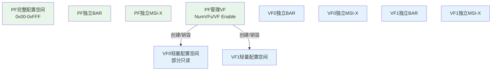
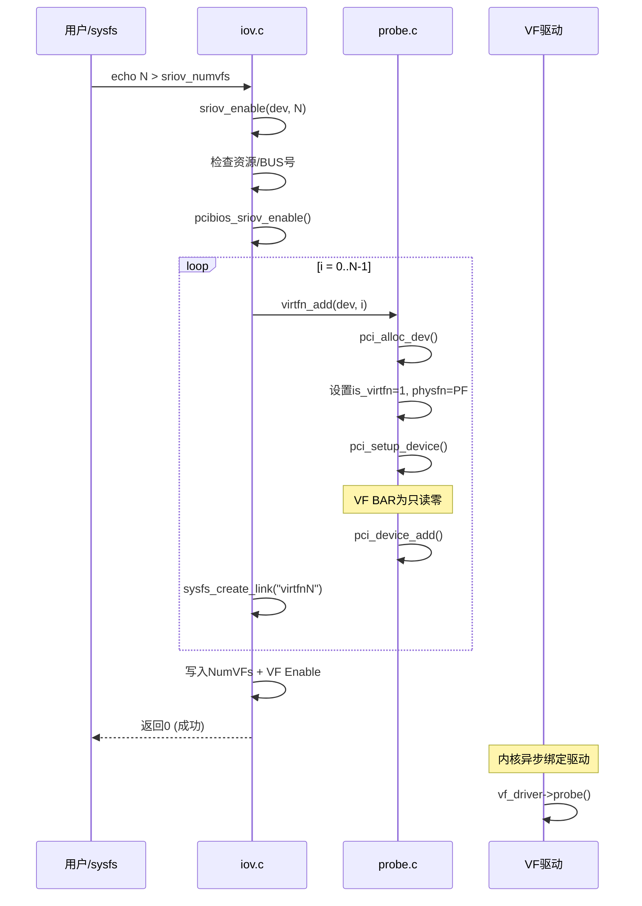
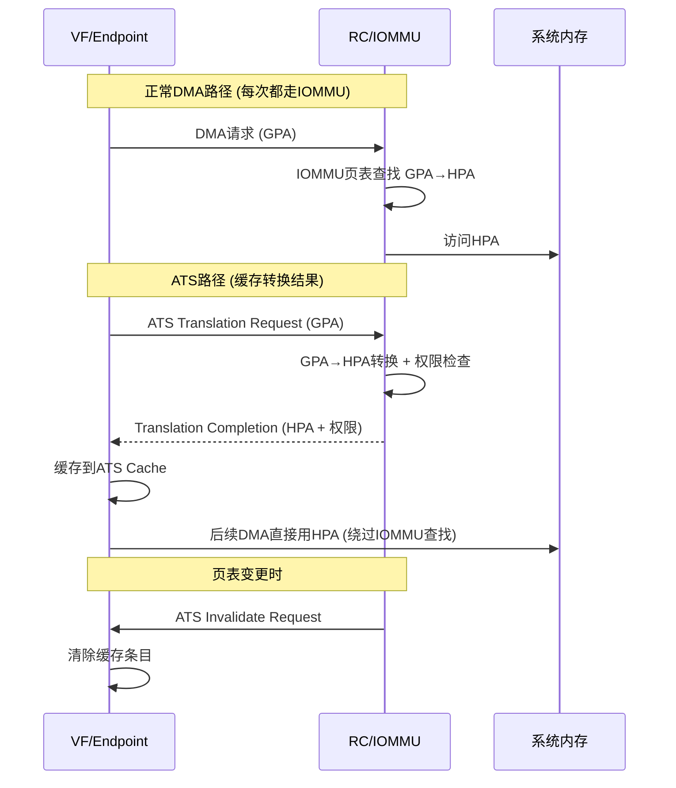
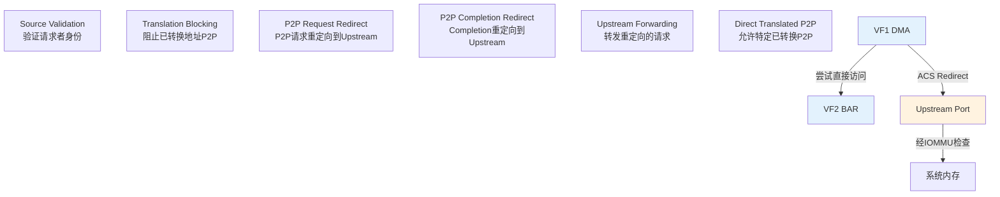
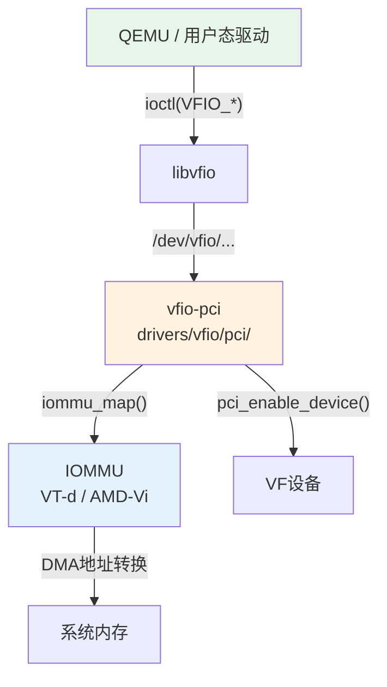
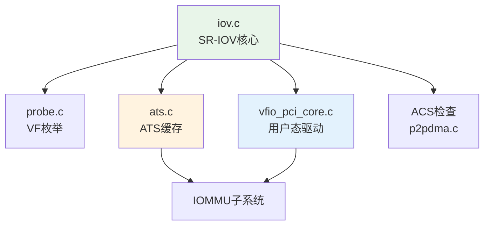

# SR-IOV 虚拟化

> 核心问题：如何让多个虚拟机安全共享同一个PCIe设备？
> 关联索引：[PCIe核心知识索引](./pcie-learning-resources.md) Phase 0, 6
> 前置阅读：[MSI/MSI-X中断](./msi-interrupt.md) · [BAR与资源分配](./bar-resource-allocation.md)

### 关键术语
| 缩写 | 全称 | 含义 |
|------|------|------|
| SR-IOV | Single Root I/O Virtualization | 单根I/O虚拟化，一个PF创建多个VF |
| PF | Physical Function | 物理功能，管理SR-IOV的完整PCIe Function |
| VF | Virtual Function | 虚拟功能，轻量级PCIe Function，可直通给VM |
| ATS | Address Translation Service | 地址转换服务，设备缓存IOMMU转换结果 |
| ACS | Access Control Services | 访问控制服务，控制P2P TLP路由 |
| VFIO | Virtual Function I/O | Linux用户态驱动框架，支持设备直通 |
| IOMMU | Input/Output Memory Management Unit | I/O内存管理单元，DMA地址转换与隔离 |

---

## 0. 前置背景

### 0.1 为什么需要SR-IOV

在虚拟化环境中，多个VM需要访问同一个物理PCIe设备（如网卡）。传统方案存在严重问题：

```
软件模拟: VM → QEMU模拟设备 → 内核驱动 → 物理设备
  问题: 每次I/O都经过VM Exit，性能极差

直通分配: VM → 物理设备 (一个设备只能给一个VM)
  问题: 设备数量有限，无法共享

SR-IOV: VM → VF → 物理设备 (硬件级隔离，线速性能)
  优势: 每个VF是独立的PCIe Function，VM直接操作硬件
```

### 0.2 IOMMU —— DMA安全的基础

IOMMU (Input/Output Memory Management Unit) 是设备侧的内存管理单元，为DMA提供地址转换和访问控制：

```
没有IOMMU:
  设备DMA → 可访问任意物理地址 → 安全风险

有IOMMU:
  设备DMA → GPA(客户机物理地址) → IOMMU页表 → HPA(宿主机物理地址)
  IOMMU限制设备只能访问授权的内存区域
```

| 架构 | IOMMU实现 | 关键特性 |
|------|----------|---------|
| Intel | VT-d (VTD) | DMA Remapping, Interrupt Remapping |
| AMD | AMD-Vi (IOMMU) | Device Table, IOTLB |
| ARM | SMMU | Stream ID匹配, 上下文银行 |

> SR-IOV的VF直通必须依赖IOMMU，否则VF的DMA可以访问任意内存。

### 0.3 SR-IOV的设计哲学

SR-IOV将一个物理设备（PF）拆分为多个虚拟功能（VF），每个VF拥有独立的：
- 配置空间（轻量版）
- BAR（从PF BAR空间划分）
- MSI-X向量
- DMA引擎

但VF**没有管理能力**——所有VF的创建、销毁、配置都由PF驱动完成。这种设计实现了**数据面隔离、控制面统一**。

---

## 1. 规范机制

### 1.1 SR-IOV架构



### 1.2 PF vs VF

| 特性 | PF | VF |
|------|-----|-----|
| 配置空间 | 完整 (4KB) | 轻量 (VF BAR只读零) |
| BAR | 独立 | 独立 (从PF VF BAR划分) |
| MSI-X | 独立 | 独立 |
| 管理能力 | 创建/销毁/配置VF | 无 |
| 驱动 | PF驱动 (管理+数据面) | VF驱动 (纯数据面) |
| 初始化 | 枚举时发现 | PF启用后动态创建 |

### 1.3 SR-IOV Capability结构

```
SR-IOV Extended Capability (Config Space 0x100+):
├── 0x00: Cap ID = 0x10, Version, Next Ptr
├── 0x02: SR-IOV Control
│   ├── [0]  VF Enable
│   ├── [1]  VF Migration Enable
│   ├── [2]  VF Migration Interrupt Enable
│   ├── [3]  VF MSE (Memory Space Enable)
│   └── [4]  ARI Capable Hierarchy
├── 0x04: SR-IOV Status
│   ├── [0]  VF Migration Status
│   └── [3]  VF Initial Value Status
├── 0x06: Initial VFs
├── 0x08: Total VFs (设备支持的最大VF数)
├── 0x0A: Num VFs (当前启用的VF数)
├── 0x0C: VF Function Dependency Link
├── 0x0E: First VF Offset (第一个VF的BDF偏移)
├── 0x10: VF Stride (相邻VF的BDF步长)
├── 0x12: VF Device ID
├── 0x14: Supported Page Sizes
├── 0x18: System Page Size
├── 0x1C-0x2B: VF BAR0-BAR5 (PF配置空间中)
└── 0x2C: VF Migration State Array Offset
```

### 1.4 VF的BDF计算

```
VF[i].BDF = PF.BDF + Offset + Stride × i

其中:
  Offset = SR-IOV First VF Offset
  Stride = SR-IOV VF Stride
  BDF = (Bus << 8) | (Dev << 3) | Func

示例: PF=0000:03:00.0, Offset=1, Stride=2
  VF0 = 0000:03:00.1  (03:00.0 + 1)
  VF1 = 0000:03:00.3  (03:00.0 + 1 + 2)
  VF2 = 0000:03:00.5  (03:00.0 + 1 + 2×2)
  VF3 = 0000:03:00.7  (03:00.0 + 1 + 2×3)
```

> ARI模式下，Function号可超过7，VF可能跨越Bus号。

---

## 2. Linux内核实现

### 2.1 VF BDF计算

```c
// drivers/pci/iov.c
// 简化实现，省略了 ARI (Alternative Routing-ID) 模式下的 Functon 号扩展处理
int pci_iov_virtfn_bus(struct pci_dev *dev, int vf_id)
{
    return dev->bus->number +
        ((dev->devfn + dev->sriov->offset +
          dev->sriov->stride * vf_id) >> 8);
}

int pci_iov_virtfn_devfn(struct pci_dev *dev, int vf_id)
{
    return (dev->devfn + dev->sriov->offset +
            dev->sriov->stride * vf_id) & 0xff;
}
```

> Bus号 = PF.Bus + (PF.DevFn + Offset + Stride × vf_id) >> 8
> DevFn = (PF.DevFn + Offset + Stride × vf_id) & 0xFF

### 2.2 sriov_enable() —— 启用VF

```c
// drivers/pci/iov.c (简化)
// 简化实现，省略了: dep_link sysfs 创建、错误恢复路径(disable+remove link)、kobject_uevent 事件通知
static int sriov_enable(struct pci_dev *dev, int nr_virtfn)
{
    int rc, i, nres, bus, bars = 0;
    u16 initial;
    struct resource *res;
    struct pci_dev *pdev;
    struct pci_sriov *iov = dev->sriov;

    // 0. 保护: VF已启用或请求0个
    if (!nr_virtfn)
        return 0;
    if (iov->num_VFs)
        return -EINVAL;

    // 1. 读取并验证Initial VF (考虑 VF Migration 模式)
    pci_read_config_word(dev, iov->pos + PCI_SRIOV_INITIAL_VF, &initial);
    if (initial > iov->total_VFs ||
        (!(iov->cap & PCI_SRIOV_CAP_VFM) && (initial != iov->total_VFs)))
        return -EIO;

    if (nr_virtfn < 0 || nr_virtfn > iov->total_VFs ||
        (!(iov->cap & PCI_SRIOV_CAP_VFM) && (nr_virtfn > initial)))
        return -EINVAL;

    // 2. 检查VF BAR资源是否足够
    nres = 0;
    for (i = 0; i < PCI_SRIOV_NUM_BARS; i++) {
        int idx = pci_resource_num_from_vf_bar(i);
        resource_size_t vf_bar_sz = pci_iov_resource_size(dev, idx);

        bars |= (1 << idx);
        res = &dev->resource[idx];
        if (vf_bar_sz * nr_virtfn > resource_size(res))
            continue;
        if (res->parent)
            nres++;
    }
    if (nres != iov->nres) {
        pci_err(dev, "not enough MMIO resources for SR-IOV\n");
        return -ENOMEM;
    }

    // 3. 检查Bus号范围
    bus = pci_iov_virtfn_bus(dev, nr_virtfn - 1);
    if (bus > dev->bus->busn_res.end) {
        pci_err(dev, "can't enable %d VFs (bus %02x out of range of %pR)\n",
                nr_virtfn, bus, &dev->bus->busn_res);
        return -ENOMEM;
    }

    // 4. 确保PF的BAR解码已启用
    if (pci_enable_resources(dev, bars)) {
        pci_err(dev, "SR-IOV: IOV BARS not allocated\n");
        return -ENOMEM;
    }

    // 5. 架构特定回调
    iov->initial_VFs = initial;
    if (nr_virtfn < initial)
        initial = nr_virtfn;
    rc = pcibios_sriov_enable(dev, initial);
    if (rc)
        return rc;

    // 6. 写入NumVFs并启用VFE/MSE (需 cfg_access_lock 保护)
    pci_iov_set_numvfs(dev, nr_virtfn);
    iov->ctrl |= PCI_SRIOV_CTRL_VFE | PCI_SRIOV_CTRL_MSE;
    pci_cfg_access_lock(dev);
    pci_write_config_word(dev, iov->pos + PCI_SRIOV_CTRL, iov->ctrl);
    msleep(100);
    pci_cfg_access_unlock(dev);

    // 7. 创建VF设备 (sriov_add_vfs → pci_iov_add_virtfn)
    rc = sriov_add_vfs(dev, initial);
    if (rc)
        goto err_pcibios;

    iov->num_VFs = nr_virtfn;
    return 0;

err_pcibios:
    iov->ctrl &= ~(PCI_SRIOV_CTRL_VFE | PCI_SRIOV_CTRL_MSE);
    pci_cfg_access_lock(dev);
    pci_write_config_word(dev, iov->pos + PCI_SRIOV_CTRL, iov->ctrl);
    ssleep(1);
    pci_cfg_access_unlock(dev);
    pcibios_sriov_disable(dev);
    pci_iov_set_numvfs(dev, 0);
    return rc;
}
```

### 2.3 VF创建流程



### 2.4 VF BAR的特殊处理

```c
// drivers/pci/probe.c
// 简化实现，省略了 ROM BAR 处理和 64-bit BAR 的高低位拼接逻辑
static __always_inline void pci_read_bases(struct pci_dev *dev, ...)
{
    // VF的BAR是只读零，跳过
    if (dev->is_virtfn)
        return;
}
```

```c
// drivers/pci/iov.c
// 简化实现，省略了 pci_resource_num_to_vf_bar 的索引转换细节
resource_size_t pci_iov_resource_size(struct pci_dev *dev, int resno)
{
    if (!dev->is_physfn)
        return 0;
    return dev->sriov->barsz[pci_resource_num_to_vf_bar(resno)];
}
```

**VF BAR分配机制**：
1. PF的SR-IOV Capability中有VF BAR0-5寄存器
2. 枚举时，PF的VF BAR大小被探测
3. 实际分配时，PF的整个BAR空间被划分为N个等大小的VF BAR
4. 每个VF的BAR由硬件自动映射到PF BAR空间中的对应偏移

```
PF BAR空间:
┌──────────────────────────────────────────────┐
│ VF0 BAR │ VF1 BAR │ VF2 BAR │ ... │ VFn BAR │
└──────────────────────────────────────────────┘
← 每个VF BAR大小 = PF VF_BAR_size / NumVFs →
```

### 2.5 VF配置空间

```c
// drivers/pci/iov.c
// 简化实现，省略了 VF 配置空间的完整同步列表 (Revision ID, Cache Line Size 等寄存器)
static void pci_read_vf_config_common(struct pci_dev *virtfn)
{
    struct pci_dev *physfn = virtfn->physfn;

    // 所有VF共享的配置 (从VF0读取一次)
    pci_read_config_dword(virtfn, PCI_CLASS_REVISION,
                          &physfn->sriov->class);
    pci_read_config_byte(virtfn, PCI_HEADER_TYPE,
                         &physfn->sriov->hdr_type);
    pci_read_config_word(virtfn, PCI_SUBSYSTEM_VENDOR_ID,
                         &physfn->sriov->subsystem_vendor);
    pci_read_config_word(virtfn, PCI_SUBSYSTEM_ID,
                         &physfn->sriov->subsystem_device);
}
```

**VF配置空间特点** (PCIe Spec §9.3.4)：
- 部分寄存器只读 (Vendor ID, Device ID, Class Code等)
- VF BAR全为零 (由硬件根据PF VF BAR自动映射)
- INTx禁用 (VF只能用MSI/MSI-X)
- 无SR-IOV Capability (VF不能再创建VF)

**VFIO对VF配置空间的虚拟化**：

VF直通给VM时，QEMU/VFIO不能让VM直接访问VF的配置空间——VM可能修改关键寄存器（如Command寄存器关闭Memory Space）导致VF不可用，或读取不应暴露的信息。VFIO通过`vfio_pci_config.c`实现配置空间拦截：

```
VM访问VF配置空间:
  VM → VFIO ioctl → vfio_pci_config.c → 拦截判断
    ├── 允许直通: 无安全影响的寄存器 (如BAR读取、Status)
    ├── 虚拟化: 返回虚拟值 (如Vendor ID可能被修改)
    └── 拦截写入: 危险操作 (如关闭Memory Space、修改Command寄存器)
```

关键虚拟化策略：

| 寄存器 | 处理方式 | 原因 |
|--------|---------|------|
| Vendor/Device ID | 虚拟化 | VM可能需要看到不同于物理设备的ID |
| Command | 部分拦截 | 禁止VM关闭Memory/IO解码，否则VF不可用 |
| BAR | 直通读取 | BAR值由宿主机分配，VM只读即可 |
| MSI-X Enable | 拦截 | 由VFIO管理中断路由，VM不能直接修改 |
| Power Management | 虚拟化 | VM不能真正控制设备电源状态 |
| AER | 拦截 | 错误报告由宿主机统一处理 |

---

## 3. ATS (Address Translation Service)

### 3.1 ATS机制



### 3.2 内核ATS实现

```c
// drivers/pci/ats.c
// 简化实现，省略了 pci_ats_disabled() 的全局开关检查
void pci_ats_init(struct pci_dev *dev)
{
    int pos;

    if (pci_ats_disabled())
        return;

    pos = pci_find_ext_capability(dev, PCI_EXT_CAP_ID_ATS);
    if (!pos)
        return;
    dev->ats_cap = pos;
}

int pci_enable_ats(struct pci_dev *dev, int ps)
{
    u16 ctrl;
    struct pci_dev *pdev;

    if (!pci_ats_supported(dev))
        return -EINVAL;

    if (WARN_ON(dev->ats_enabled))
        return -EBUSY;

    // ps = IOMMU页大小 (以4K为单位, 最小0=4KB)
    if (ps < PCI_ATS_MIN_STU)
        return -EINVAL;

    /*
     * VF不能独立启用ATS, 必须PF先设置相同的STU
     * VF只写CTRL_ENABLE, PF还写CTRL_STU
     */
    ctrl = PCI_ATS_CTRL_ENABLE;
    if (dev->is_virtfn) {
        pdev = pci_physfn(dev);
        if (pdev->ats_stu != ps)
            return -EINVAL;
    } else {
        dev->ats_stu = ps;
        ctrl |= PCI_ATS_CTRL_STU(dev->ats_stu - PCI_ATS_MIN_STU);
    }
    pci_write_config_word(dev, dev->ats_cap + PCI_ATS_CTRL, ctrl);
    dev->ats_enabled = 1;
    return 0;
}
```

> PF必须在VF创建前调用`pci_prepare_ats()`设置页大小，VF继承此设置。

---

## 4. ACS (Access Control Services)

### 4.1 ACS控制点



| 控制位 | 作用 | 安全意义 |
|--------|------|----------|
| Source Validation | 验证请求者BDF合法 | 防止VF伪装身份 |
| Translation Blocking | 阻止带转换标识的P2P | 强制走IOMMU |
| P2P Request Redirect | 重定向P2P请求 | IOMMU可审计所有DMA |
| P2P Completion Redirect | 重定向Completion | 确保响应路径安全 |
| Direct Translated P2P | 允许ATS缓存的P2P | 性能优化，信任IOMMU |

### 4.2 ACS对P2P DMA的影响

```c
// drivers/pci/p2pdma.c — 以内核源码为准
// 注意：此函数只检查单个桥的 ACS 位，遍历上游桥的逻辑在上层调用者 calc_map_type_and_dist() 中
static int pci_bridge_has_acs_redir(struct pci_dev *pdev)
{
    int pos;
    u16 ctrl;

    pos = pdev->acs_cap;
    if (!pos)
        return 0;

    pci_read_config_word(pdev, pos + PCI_ACS_CTRL, &ctrl);

    // 检查 ACS 重定向相关位：RR (Request Redirect), CR (Completion Redirect), EC (Error Control/Cut-through)
    if (ctrl & (PCI_ACS_RR | PCI_ACS_CR | PCI_ACS_EC))
        return 1;

    return 0;
}
```

---

## 5. VFIO用户态驱动

### 5.1 VFIO架构



### 5.2 VFIO关键操作

```c
// 用户态驱动使用VFIO的典型流程

// 1. 打开VFIO group
container_fd = open("/dev/vfio/vfio", O_RDWR);
group_fd = open("/dev/vfio/26", O_RDWR);

// 2. 设置IOMMU
ioctl(group_fd, VFIO_GROUP_SET_CONTAINER, &container_fd);
ioctl(container_fd, VFIO_SET_IOMMU, VFIO_TYPE1v2_IOMMU);

// 3. 获取设备FD
device_fd = ioctl(group_fd, VFIO_GROUP_GET_DEVICE_FD, "0000:03:00.1");

// 4. 映射设备MMIO
struct vfio_region_info reg = { .argsz = sizeof(reg), .index = 0 };
ioctl(device_fd, VFIO_DEVICE_GET_REGION_INFO, &reg);
mmio = mmap(NULL, reg.size, PROT_READ|PROT_WRITE, MAP_SHARED,
            device_fd, reg.offset);

// 5. 设置MSI-X中断
struct vfio_irq_set irq_set = {
    .argsz = sizeof(irq_set),
    .flags = VFIO_IRQ_SET_DATA_EVENTFD | VFIO_IRQ_SET_ACTION_TRIGGER,
    .index = VFIO_PCI_MSIX_IRQ_INDEX,
    .start = 0,
    .count = num_vectors,
    .data = eventfds,
};
ioctl(device_fd, VFIO_DEVICE_SET_IRQS, &irq_set);
```

---

## 6. VF Migration

SR-IOV Capability中包含VF Migration相关字段（VF Migration Enable、VF Migration Interrupt Enable、VF Migration Status），允许VF的状态在物理主机之间迁移。这是虚拟机热迁移（Live Migration）的关键支撑。

### 6.1 为什么需要VF Migration

VF直通给VM后，VF的设备状态（DMA上下文、队列状态、内部寄存器）绑定在物理主机上。如果需要将VM迁移到另一台物理机，必须：

```
无VF Migration:
  VM迁移 → VF状态丢失 → 目标机VF从头初始化 → 业务中断

有VF Migration:
  VM迁移 → PF驱动保存VF状态 → 传输到目标机 → PF驱动恢复VF状态 → 业务连续
```

### 6.2 Migration流程

```
源主机:                              目标主机:
  1. VM暂停                            1. 创建VF (sriov_numvfs)
  2. PF驱动保存VF状态                   2. PF驱动准备接收VF状态
     - DMA上下文                        3. 接收VF状态数据
     - 队列状态                         4. 写入VF配置空间和BAR寄存器
     - 内部寄存器                       5. VF恢复工作
  3. 传输VF状态数据
  4. 释放源VF
```

### 6.3 当前实现状态

SR-IOV规范定义了Migration的Capability框架，但**具体迁移哪些状态、如何序列化**由设备厂商决定。Linux内核目前提供了基础设施：

- `VF Migration State Array Offset`：SR-IOV Cap中指向VF迁移状态的MMIO偏移
- `VF Migration Enable/Interrupt`：控制迁移流程的开关
- VFIO的`VFIO_DEVICE_FEATURE` ioctl支持设备状态的保存/恢复（Linux 6.0+）

> 实际的VF Migration高度依赖设备厂商的PF驱动实现。目前Mellanox/NVIDIA的网卡（mlx5）和Intel的网卡（ice/iavf）是VF Migration支持较好的参考实现。

---

## 7. Multi-Queue 与 VF

网卡的SR-IOV VF通常需要多个收发队列（Multi-Queue）以实现高性能。队列分配机制是VF驱动设计的核心考量。

### 7.1 队列分配模型

```
物理网卡 (PF):
  总队列数 = 128 (硬件固定)
  ├── PF保留: 16队列
  └── VF池: 112队列
      ├── VF0: 8队列
      ├── VF1: 8队列
      ├── VF2: 16队列
      └── ...

PF驱动负责:
  1. 在VF创建时为每个VF分配队列数
  2. 通过PF-VF邮箱通道通知VF其队列配置
  3. 运行时可调整VF队列数 (通过sriov_vf_msix_count)
```

### 7.2 RSS (Receive Side Scaling)

RSS是网卡将入向流量分散到多个接收队列的机制，避免单队列成为瓶颈：

```
入向数据包 → RSS哈希 (基于五元组) → 哈希值 % 队列数 → 目标队列
  → 不同流的数据包被分散到不同队列
  → 每个队列有独立的MSI-X向量
  → 不同队列的中断可绑定到不同CPU
```

VF的RSS配置由VF驱动通过PF-VF邮箱通道请求PF设置，VF不能直接修改RSS间接表（因为RSS间接表是全局共享资源）。

### 7.3 队列与MSI-X向量的关系

每个VF的队列数决定了其需要的MSI-X向量数：

```
VF MSI-X向量需求:
  向量数 = 接收队列数 + 发送队列数 + 其他向量(如链路状态、错误)
  
  例: 8收8发 + 2其他 = 18个MSI-X向量
```

PF驱动通过`sriov_set_msix_vec_count()`回调为每个VF配置MSI-X向量数。内核6.0+支持通过sysfs动态调整：

```bash
# 查看VF总MSI-X向量数
cat /sys/bus/pci/devices/0000:03:00.0/sriov_vf_total_msix

# 设置单个VF的MSI-X向量数
echo 32 > /sys/bus/pci/devices/0000:03:00.0/sriov_vf_msix_count
```

---

## 8. 实战调试

### 8.1 SR-IOV操作

```bash
# 查看VF能力
lspci -vvv -s 03:00.0 | grep -E "SR-IOV|Initial|Total|Num"

# 启用VF
echo 4 > /sys/bus/pci/devices/0000:03:00.0/sriov_numvfs

# 查看VF
lspci | grep -i "virtual function"

# VF符号链接
ls -la /sys/bus/pci/devices/0000:03:00.0/virtfn*

# 禁用VF
echo 0 > /sys/bus/pci/devices/0000:03:00.0/sriov_numvfs
```

### 8.2 VFIO绑定

```bash
# 解绑原驱动
echo 0000:03:00.1 > /sys/bus/pci/devices/0000:03:00.1/driver/unbind

# 绑定vfio-pci
echo 8086 154c > /sys/bus/pci/drivers/vfio-pci/new_id
# 或
echo 0000:03:00.1 > /sys/bus/pci/drivers/vfio-pci/bind

# 查看IOMMU组
ls /sys/kernel/iommu_groups/
cat /sys/kernel/iommu_groups/26/devices
```

### 8.3 常见问题

| 现象 | 原因 | 排查 |
|------|------|------|
| `not enough MMIO resources` | PF BAR空间不足以分配给所有VF | 减少NumVFs或增大PF BAR |
| `bus out of range` | VF BDF超出Subordinate Bus | 增大桥的Subordinate Bus号 |
| VF无MSI-X | PF驱动未配置VF向量 | 检查`sriov_vf_total_msix` |
| VFIO绑定失败 | IOMMU未启用 | 检查`intel_iommu=on`内核参数 |
| VF间P2P被阻止 | ACS Redirect启用 | 正常行为，确保安全隔离 |

---

## 9. 代码阅读路线

| 顺序 | 文件 | 关注函数 |
|------|------|----------|
| 1 | `drivers/pci/iov.c` | `sriov_enable()`, `sriov_disable()`, `virtfn_add()`, `pci_iov_virtfn_bus/devfn()` |
| 2 | `drivers/pci/ats.c` | `pci_ats_init()`, `pci_enable_ats()`, `pci_prepare_ats()` |
| 3 | `drivers/vfio/pci/vfio_pci_core.c` | VFIO核心: 设备打开/映射/中断 |
| 4 | `drivers/vfio/pci/vfio_pci_config.c` | VFIO配置空间虚拟化 |
| 5 | `drivers/pci/p2pdma.c` | P2P DMA与ACS交互 |



---

## 参考资料

- [PCIe Base Specification 6.0](https://pcisig.com/specifications) — §9.3 SR-IOV Capability, §6.12 ACS, §6.13 ATS
- [Intel VT-d Specification](https://www.intel.com/content/www/us/en/io/virtualization-technology-for-directed-connectivity-vt-d.html) — DMA重映射与设备直通
- [VFIO Documentation](https://www.kernel.org/doc/html/latest/driver-api/vfio.html) — Linux VFIO框架
- [Linux Kernel Source](https://git.kernel.org/) — `drivers/pci/iov.c`, `drivers/vfio/pci/`

---

上一篇：[MSI/MSI-X中断机制](./msi-interrupt.md) | 返回：[PCIe核心知识索引](./pcie-learning-resources.md)

---

*源码版本：Linux 6.x | 更新：2026-04-21*
