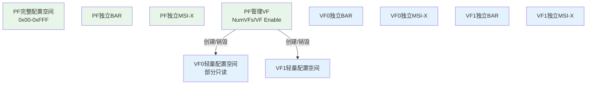
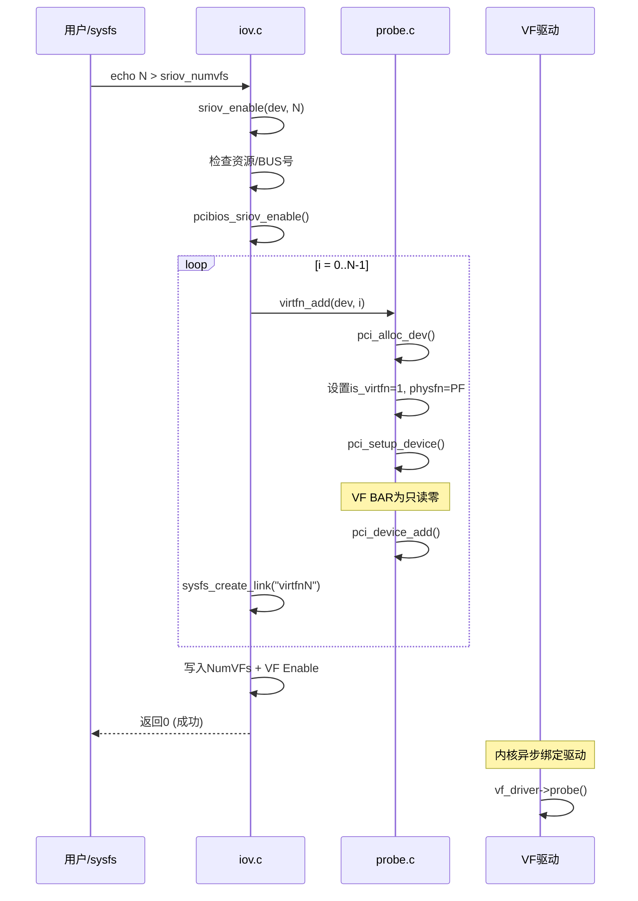
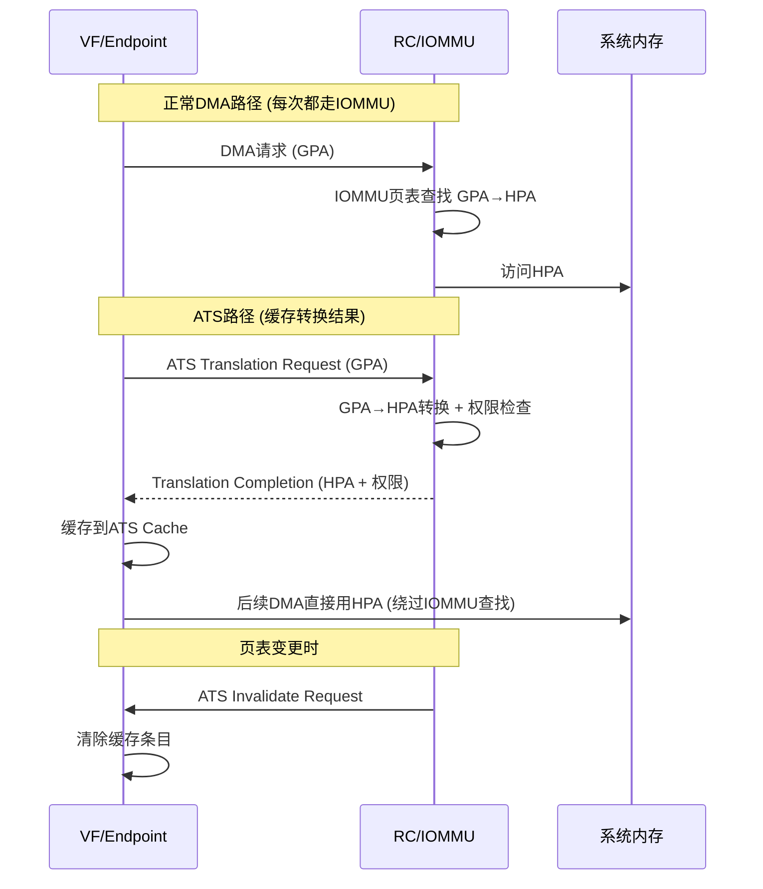
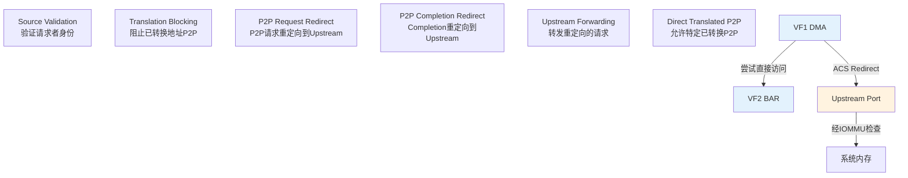
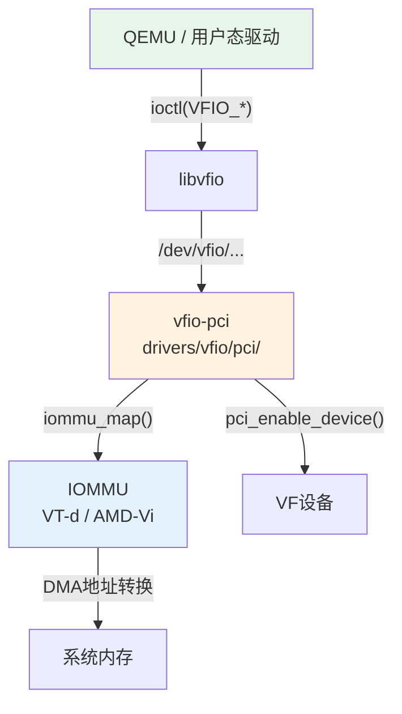
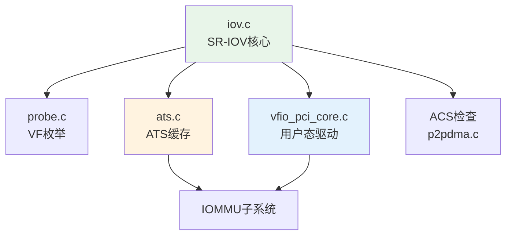

# SR-IOV 虚拟化

> 核心问题：如何让多个虚拟机安全共享同一个PCIe设备？
> 关联索引：[PCIe核心知识索引](./pcie-learning-resources.md) Phase 0, 6
> 前置阅读：[MSI/MSI-X中断](./msi-interrupt.md) · [BAR与资源分配](./bar-resource-allocation.md)

---

## 0. 前置背景

### 0.1 为什么需要SR-IOV

在虚拟化环境中，多个VM需要访问同一个物理PCIe设备（如网卡）。传统方案存在严重问题：

```
软件模拟: VM → QEMU模拟设备 → 内核驱动 → 物理设备
  问题: 每次I/O都经过VM Exit，性能极差

直通分配: VM → 物理设备 (一个设备只能给一个VM)
  问题: 设备数量有限，无法共享

SR-IOV: VM → VF → 物理设备 (硬件级隔离，线速性能)
  优势: 每个VF是独立的PCIe Function，VM直接操作硬件
```

### 0.2 IOMMU —— DMA安全的基础

IOMMU (Input/Output Memory Management Unit) 是设备侧的内存管理单元，为DMA提供地址转换和访问控制：

```
没有IOMMU:
  设备DMA → 可访问任意物理地址 → 安全风险

有IOMMU:
  设备DMA → GPA(客户机物理地址) → IOMMU页表 → HPA(宿主机物理地址)
  IOMMU限制设备只能访问授权的内存区域
```

| 架构 | IOMMU实现 | 关键特性 |
|------|----------|---------|
| Intel | VT-d (VTD) | DMA Remapping, Interrupt Remapping |
| AMD | AMD-Vi (IOMMU) | Device Table, IOTLB |
| ARM | SMMU | Stream ID匹配, 上下文银行 |

> SR-IOV的VF直通必须依赖IOMMU，否则VF的DMA可以访问任意内存。

### 0.3 SR-IOV的设计哲学

SR-IOV将一个物理设备（PF）拆分为多个虚拟功能（VF），每个VF拥有独立的：
- 配置空间（轻量版）
- BAR（从PF BAR空间划分）
- MSI-X向量
- DMA引擎

但VF**没有管理能力**——所有VF的创建、销毁、配置都由PF驱动完成。这种设计实现了**数据面隔离、控制面统一**。

---

## 1. 规范机制

### 1.1 SR-IOV架构



### 1.2 PF vs VF

| 特性 | PF | VF |
|------|-----|-----|
| 配置空间 | 完整 (4KB) | 轻量 (VF BAR只读零) |
| BAR | 独立 | 独立 (从PF VF BAR划分) |
| MSI-X | 独立 | 独立 |
| 管理能力 | 创建/销毁/配置VF | 无 |
| 驱动 | PF驱动 (管理+数据面) | VF驱动 (纯数据面) |
| 初始化 | 枚举时发现 | PF启用后动态创建 |

### 1.3 SR-IOV Capability结构

```
SR-IOV Extended Capability (Config Space 0x100+):
├── 0x00: Cap ID = 0x10, Version, Next Ptr
├── 0x02: SR-IOV Control
│   ├── [0]  VF Enable
│   ├── [1]  VF Migration Enable
│   ├── [2]  VF Migration Interrupt Enable
│   ├── [3]  VF MSE (Memory Space Enable)
│   └── [4]  ARI Capable Hierarchy
├── 0x04: SR-IOV Status
│   ├── [0]  VF Migration Status
│   └── [3]  VF Initial Value Status
├── 0x06: Initial VFs
├── 0x08: Total VFs (设备支持的最大VF数)
├── 0x0A: Num VFs (当前启用的VF数)
├── 0x0C: VF Function Dependency Link
├── 0x0E: First VF Offset (第一个VF的BDF偏移)
├── 0x10: VF Stride (相邻VF的BDF步长)
├── 0x12: VF Device ID
├── 0x14: Supported Page Sizes
├── 0x18: System Page Size
├── 0x1C-0x2B: VF BAR0-BAR5 (PF配置空间中)
└── 0x2C: VF Migration State Array Offset
```

### 1.4 VF的BDF计算

```
VF[i].BDF = PF.BDF + Offset + Stride × i

其中:
  Offset = SR-IOV First VF Offset
  Stride = SR-IOV VF Stride
  BDF = (Bus << 8) | (Dev << 3) | Func

示例: PF=0000:03:00.0, Offset=1, Stride=2
  VF0 = 0000:03:00.1  (03:00.0 + 1)
  VF1 = 0000:03:00.3  (03:00.0 + 1 + 2)
  VF2 = 0000:03:00.5  (03:00.0 + 1 + 2×2)
  VF3 = 0000:03:00.7  (03:00.0 + 1 + 2×3)
```

> ARI模式下，Function号可超过7，VF可能跨越Bus号。

---

## 2. Linux内核实现

### 2.1 VF BDF计算

```c
// drivers/pci/iov.c
int pci_iov_virtfn_bus(struct pci_dev *dev, int vf_id)
{
    return dev->bus->number +
        ((dev->devfn + dev->sriov->offset +
          dev->sriov->stride * vf_id) >> 8);
}

int pci_iov_virtfn_devfn(struct pci_dev *dev, int vf_id)
{
    return (dev->devfn + dev->sriov->offset +
            dev->sriov->stride * vf_id) & 0xff;
}
```

> Bus号 = PF.Bus + (PF.DevFn + Offset + Stride × vf_id) >> 8
> DevFn = (PF.DevFn + Offset + Stride × vf_id) & 0xFF

### 2.2 sriov_enable() —— 启用VF

```c
// drivers/pci/iov.c (简化)
static int sriov_enable(struct pci_dev *dev, int nr_virtfn)
{
    struct pci_sriov *iov = dev->sriov;

    // 1. 验证VF数量
    if (nr_virtfn < 0 || nr_virtfn > iov->total_VFs)
        return -EINVAL;

    // 2. 检查VF BAR资源是否足够
    nres = 0;
    for (i = 0; i < PCI_SRIOV_NUM_BARS; i++) {
        int idx = pci_resource_num_from_vf_bar(i);
        resource_size_t vf_bar_sz = pci_iov_resource_size(dev, idx);

        bars |= (1 << idx);
        res = &dev->resource[idx];
        if (vf_bar_sz * nr_virtfn > resource_size(res))
            continue;  // BAR空间不够分配给所有VF
        if (res->parent)
            nres++;
    }
    if (nres != iov->nres) {
        pci_err(dev, "not enough MMIO resources for SR-IOV\n");
        return -ENOMEM;
    }

    // 3. 检查Bus号范围
    bus = pci_iov_virtfn_bus(dev, nr_virtfn - 1);
    if (bus > dev->bus->busn_res.end) {
        pci_err(dev, "can't enable %d VFs (bus %02x out of range)\n",
                nr_virtfn, bus);
        return -ENOMEM;
    }

    // 4. 确保PF的BAR解码已启用
    if (pci_enable_resources(dev, bars)) {
        pci_err(dev, "SR-IOV: IOV BARS not allocated\n");
        return -ENOMEM;
    }

    // 5. 调用架构特定使能
    rc = pcibios_sriov_enable(dev, initial);

    // 6. 逐个创建VF设备
    for (i = 0; i < initial; i++) {
        // 分配pci_dev, 设置is_virtfn=1, physfn=PF
        rc = virtfn_add(dev, i, 0);
    }

    // 7. 写入NumVFs寄存器
    pci_iov_set_numvfs(dev, nr_virtfn);

    // 8. 启用VF MSE
    pci_write_config_word(dev, iov->pos + PCI_SRIOV_CTRL,
                          ctrl | PCI_SRIOV_CTRL_VFE | PCI_SRIOV_CTRL_MSE);

    iov->num_VFs = nr_virtfn;
    return 0;
}
```

### 2.3 VF创建流程



### 2.4 VF BAR的特殊处理

```c
// drivers/pci/probe.c
static __always_inline void pci_read_bases(struct pci_dev *dev, ...)
{
    // VF的BAR是只读零，跳过
    if (dev->is_virtfn)
        return;
}

// drivers/pci/iov.c
resource_size_t pci_iov_resource_size(struct pci_dev *dev, int resno)
{
    if (!dev->is_physfn)
        return 0;
    return dev->sriov->barsz[pci_resource_num_to_vf_bar(resno)];
}
```

**VF BAR分配机制**：
1. PF的SR-IOV Capability中有VF BAR0-5寄存器
2. 枚举时，PF的VF BAR大小被探测
3. 实际分配时，PF的整个BAR空间被划分为N个等大小的VF BAR
4. 每个VF的BAR由硬件自动映射到PF BAR空间中的对应偏移

```
PF BAR空间:
┌──────────────────────────────────────────────┐
│ VF0 BAR │ VF1 BAR │ VF2 BAR │ ... │ VFn BAR │
└──────────────────────────────────────────────┘
← 每个VF BAR大小 = PF VF_BAR_size / NumVFs →
```

### 2.5 VF配置空间

```c
// drivers/pci/iov.c
static void pci_read_vf_config_common(struct pci_dev *virtfn)
{
    struct pci_dev *physfn = virtfn->physfn;

    // 所有VF共享的配置 (从VF0读取一次)
    pci_read_config_dword(virtfn, PCI_CLASS_REVISION,
                          &physfn->sriov->class);
    pci_read_config_byte(virtfn, PCI_HEADER_TYPE,
                         &physfn->sriov->hdr_type);
    pci_read_config_word(virtfn, PCI_SUBSYSTEM_VENDOR_ID,
                         &physfn->sriov->subsystem_vendor);
    pci_read_config_word(virtfn, PCI_SUBSYSTEM_ID,
                         &physfn->sriov->subsystem_device);
}
```

**VF配置空间特点** (PCIe Spec §9.3.4)：
- 部分寄存器只读 (Vendor ID, Device ID, Class Code等)
- VF BAR全为零 (由硬件根据PF VF BAR自动映射)
- INTx禁用 (VF只能用MSI/MSI-X)
- 无SR-IOV Capability (VF不能再创建VF)

---

## 3. ATS (Address Translation Service)

### 3.1 ATS机制



### 3.2 内核ATS实现

```c
// drivers/pci/ats.c
void pci_ats_init(struct pci_dev *dev)
{
    // 枚举时发现ATS Capability
    int pos = pci_find_ext_capability(dev, PCI_EXT_CAP_ID_ATS);
    if (!pos)
        return;
    dev->ats_cap = pos;
}

int pci_enable_ats(struct pci_dev *dev, int ps)
{
    // ps = IOMMU页大小 (以4K为单位, 最小0=4KB)
    if (ps < PCI_ATS_MIN_STU)
        return -EINVAL;

    // VF继承PF的ATS设置
    if (dev->is_virtfn)
        return 0;

    dev->ats_stu = ps;
    ctrl = PCI_ATS_CTRL_STU(dev->ats_stu - PCI_ATS_MIN_STU);
    ctrl |= PCI_ATS_CTRL_ENABLE;
    pci_write_config_word(dev, dev->ats_cap + PCI_ATS_CTRL, ctrl);
    dev->ats_enabled = 1;
    return 0;
}
```

> PF必须在VF创建前调用`pci_prepare_ats()`设置页大小，VF继承此设置。

---

## 4. ACS (Access Control Services)

### 4.1 ACS控制点



| 控制位 | 作用 | 安全意义 |
|--------|------|----------|
| Source Validation | 验证请求者BDF合法 | 防止VF伪装身份 |
| Translation Blocking | 阻止带转换标识的P2P | 强制走IOMMU |
| P2P Request Redirect | 重定向P2P请求 | IOMMU可审计所有DMA |
| P2P Completion Redirect | 重定向Completion | 确保响应路径安全 |
| Direct Translated P2P | 允许ATS缓存的P2P | 性能优化，信任IOMMU |

### 4.2 ACS对P2P DMA的影响

```c
// drivers/pci/p2pdma.c
static bool pci_upstream_bridge_acs_redir(struct pci_dev *pdev)
{
    // 检查ACS是否阻止P2P
    for (bridge = pci_upstream_bridge(pdev); bridge;
         bridge = pci_upstream_bridge(bridge)) {
        if (!bridge->acs_cap)
            return false;  // 无ACS, 不阻止

        // 检查ACS控制位
        pci_read_config_word(bridge, bridge->acs_cap + PCI_ACS_CTRL, &ctrl);
        if (!(ctrl & PCI_ACS_RR) || !(ctrl & PCI_ACS_CR) ||
            !(ctrl & PCI_ACS_UF))
            return false;  // ACS未完全启用, 不阻止
    }
    return true;  // ACS完全启用, P2P被重定向
}
```

---

## 5. VFIO用户态驱动

### 5.1 VFIO架构



### 5.2 VFIO关键操作

```c
// 用户态驱动使用VFIO的典型流程

// 1. 打开VFIO group
container_fd = open("/dev/vfio/vfio", O_RDWR);
group_fd = open("/dev/vfio/26", O_RDWR);

// 2. 设置IOMMU
ioctl(group_fd, VFIO_GROUP_SET_CONTAINER, &container_fd);
ioctl(container_fd, VFIO_SET_IOMMU, VFIO_TYPE1v2_IOMMU);

// 3. 获取设备FD
device_fd = ioctl(group_fd, VFIO_GROUP_GET_DEVICE_FD, "0000:03:00.1");

// 4. 映射设备MMIO
struct vfio_region_info reg = { .argsz = sizeof(reg), .index = 0 };
ioctl(device_fd, VFIO_DEVICE_GET_REGION_INFO, &reg);
mmio = mmap(NULL, reg.size, PROT_READ|PROT_WRITE, MAP_SHARED,
            device_fd, reg.offset);

// 5. 设置MSI-X中断
struct vfio_irq_set irq_set = {
    .argsz = sizeof(irq_set),
    .flags = VFIO_IRQ_SET_DATA_EVENTFD | VFIO_IRQ_SET_ACTION_TRIGGER,
    .index = VFIO_PCI_MSIX_IRQ_INDEX,
    .start = 0,
    .count = num_vectors,
    .data = eventfds,
};
ioctl(device_fd, VFIO_DEVICE_SET_IRQS, &irq_set);
```

---

## 6. 实战调试

### 6.1 SR-IOV操作

```bash
# 查看VF能力
lspci -vvv -s 03:00.0 | grep -E "SR-IOV|Initial|Total|Num"

# 启用VF
echo 4 > /sys/bus/pci/devices/0000:03:00.0/sriov_numvfs

# 查看VF
lspci | grep -i "virtual function"

# VF符号链接
ls -la /sys/bus/pci/devices/0000:03:00.0/virtfn*

# 禁用VF
echo 0 > /sys/bus/pci/devices/0000:03:00.0/sriov_numvfs
```

### 6.2 VFIO绑定

```bash
# 解绑原驱动
echo 0000:03:00.1 > /sys/bus/pci/devices/0000:03:00.1/driver/unbind

# 绑定vfio-pci
echo 8086 154c > /sys/bus/pci/drivers/vfio-pci/new_id
# 或
echo 0000:03:00.1 > /sys/bus/pci/drivers/vfio-pci/bind

# 查看IOMMU组
ls /sys/kernel/iommu_groups/
cat /sys/kernel/iommu_groups/26/devices
```

### 6.3 常见问题

| 现象 | 原因 | 排查 |
|------|------|------|
| `not enough MMIO resources` | PF BAR空间不足以分配给所有VF | 减少NumVFs或增大PF BAR |
| `bus out of range` | VF BDF超出Subordinate Bus | 增大桥的Subordinate Bus号 |
| VF无MSI-X | PF驱动未配置VF向量 | 检查`sriov_vf_total_msix` |
| VFIO绑定失败 | IOMMU未启用 | 检查`intel_iommu=on`内核参数 |
| VF间P2P被阻止 | ACS Redirect启用 | 正常行为，确保安全隔离 |

---

## 7. 代码阅读路线

| 顺序 | 文件 | 关注函数 |
|------|------|----------|
| 1 | `drivers/pci/iov.c` | `sriov_enable()`, `sriov_disable()`, `virtfn_add()`, `pci_iov_virtfn_bus/devfn()` |
| 2 | `drivers/pci/ats.c` | `pci_ats_init()`, `pci_enable_ats()`, `pci_prepare_ats()` |
| 3 | `drivers/pci/vfio/pci/vfio_pci_core.c` | VFIO核心: 设备打开/映射/中断 |
| 4 | `drivers/pci/vfio/pci/vfio_pci_config.c` | VFIO配置空间虚拟化 |
| 5 | `drivers/pci/p2pdma.c` | P2P DMA与ACS交互 |



---

*源码版本：Linux 6.x | 更新：2026-04-21*
