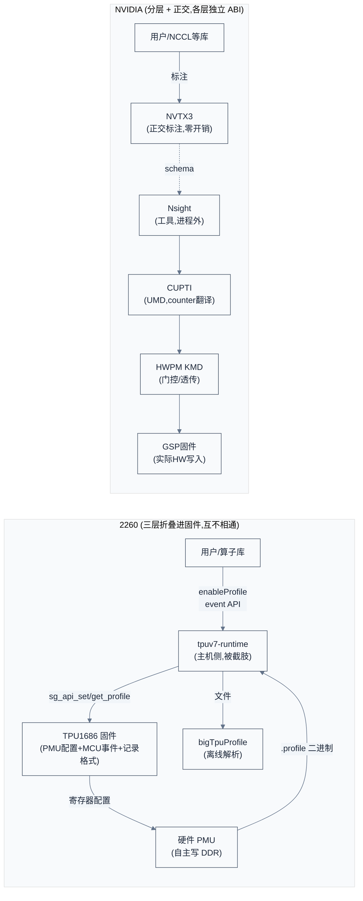

# 2260/2260e Profiling 工具缺陷诊断

> 诊断 Sophon SG2260/SG2260E(代号 AKS/AKSV)既有 trace/profile 工具的架构缺陷,并对照 NVIDIA 的设计概念指出差距。结论:2260 的 profiling 栈是**三层互不相通的拼装**,缺一条从用户标注到硬件计数、跨主机-设备关联的统一数据通路。
> **工程师视角**:2260 芯片侧的硬件 PMU 计数器其实相当齐全(AXI 总线计数、bank conflict、CDMA 8 通道时间戳对都有),问题不在"项不够多"而在"数据通路与架构"——配置翻译、特权门控、硬件动作、记录格式四件事全压进固件,主机侧又被截肢,离线解析器只能补后面两步。

### 关键术语

| 缩写 | 全称 | 含义 |
|------|------|------|
| PMU | Performance Monitor Unit | TPU 硬件性能监视单元,固件编程,记录每条指令起止时间戳 |
| TIU | Tensor Instruction Unit | SG2260 张量计算引擎(代码内代号 BD) |
| GDMA | Global DMA | SG2260 全局 DMA 引擎(DDR ↔ L2 搬运) |
| SDMA | System DMA | GDMA 精简子集,仅保留 6 条指令 |
| CDMA | Cluster DMA | 片间/片外 DMA 引擎,经 CMN/DTN 网络互联 |
| MCU | Microcontroller Unit | TPU core 上的控制核(RISC-V),运行固件 |
| inst_id | Instruction ID | 硬件给每条指令的序号,profile 用它关联 PMU 时间戳与命令码 |
| Perfetto | — | Google 开源 trace 可视化工具,bigTpuProfile 的导出目标 |
| CUPTI | CUDA Profiling Tools Interface | NVIDIA 分析/追踪底层 API(对照对象) |
| NVTX | NVIDIA Tools Extension | NVIDIA 用户态注解 API(对照对象,2260 无对应物) |
| correlationId | — | NVIDIA 主机-设备关联 ID(对照对象,2260 无对应物) |

**跨厂商对照**:

| 2260 概念 | NVIDIA 对应 | 对照说明 |
|----------|------------|----------|
| 固件 PMU 写 DDR | HWPM(KMD)→ GSP + Activity API buffer | 2260 折叠进固件,NVIDIA 分 KMD/UMD/GSP 三层 |
| `firmware_profile` MCU 事件 | Callback API + Activity 记录 | 2260 同步插桩,NVIDIA 异步缓冲 |
| bigTpuProfile 离线解析 | Nsight Systems SQLite 导出 | 2260 仅离线,NVIDIA 在线+离线 |
| (无) | NVTX3 | 2260 缺用户标注层 |
| `inst_id` 16 位启发式匹配 | `correlationId` 单调分配 | 2260 靠启发式,NVIDIA 靠 ID 链 |
| `parse_pmu` 硬编码推导 | NVPerf 3 轴语法 + Python 公式 | 2260 是代码,NVIDIA 是数据 |

---

## 1. 概述

### 1.1 前置知识

| 需要了解 | 参考文档 |
|----------|----------|
| SG2260 TPU 引擎架构(TIU/GDMA/SDMA/CDMA) | [SG2260 全栈知识体系](../sg2260/SG2260-全栈知识体系.md) |
| bigTpuProfile 离线解析器设计 | [bigTpuProfile 设计与实现分析](./bigTpuProfile-design.md) |
| TPUv7 运行时架构 | [TPUv7 Runtime Architecture](../sg2260/TPUv7-Runtime-Architecture.md) |
| NVIDIA profiling 工具设计 | [NVIDIA profiling 设计源码分析](./NVIDIA-profiling设计源码分析.md) |
| CUDA 调试与 Nsight 工具 | [错误处理与调试技术](../cuda/08-错误处理与调试技术.md) |

### 1.2 系统上下文

**项目定位**:本文诊断 2260 profiling 栈的架构缺陷。2260 的 profiling 由三个独立演进的层拼装而成——芯片侧固件(TPU1686)、主机侧运行时(tpuv7-runtime)、离线解析器(bigTpuProfile)。三层之间没有统一的数据模型和关联原语,各自为政。

**软硬件耦合点**:
- **固件 ↔ 硬件 PMU**:固件 `firmware_pmu.c` 写监控寄存器配置窗口,硬件自主把计数记录写进预留 DDR。PMU 记录格式(结构体布局、BlockType 枚举)是固件与主机解析器之间的**人工维护契约**。
- **固件 ↔ 主机运行时**:`Profile1690` 通过 `sg_api_set_profile` / `sg_api_get_profile_data` 两个 API 编排采集,再 D2S 拷回原始 buffer。API 结构体定义在 `sg_api_struct.h`。
- **主机运行时 ↔ 用户**:tpuv7-runtime 暴露 `tpudnnEnableProfile` / event API,但 per-net profile 数据被运行时丢弃。
- **离线解析器 ↔ 固件产物**:bigTpuProfile 解析固件产出的 `.profile` 二进制,靠 `inst_id` 启发式匹配 PMU 与命令码。

**跨实现对比**:NVIDIA 把同一件事分成 HWPM(KMD 门控)→ CUPTI(UMD 翻译)→ Nsight(工具)三层 + NVTX 正交标注层,各层独立 ABI;2260 把配置翻译 + 特权门控 + 硬件动作 + 记录格式全压进固件,主机侧被截肢,离线侧只能补后两步。



> **如何读这张图**:左半 2260 是一条线性链,固件同时承担四件事,离线解析器挂在链尾;右半 NVIDIA 是分层 + 正交,工具进程外消费 CUPTI,NVTX 独立注入。关键差异是 2260 的箭头都经过固件,NVIDIA 的标注走正交旁路。

### 1.3 驱动力与不变量

**驱动力链**:profiling 被一条接力问题推着走——"想知道慢在哪 → 需要主机-设备统一时间线 → 时间线要低开销不扰动测量 → 要定位到指令需采样 → 要把计数器变成工程判断需指标流水线 → 用户要标注自己的语义边界"。每一环的缺失都会把问题留给下一环:没有关联 ID 就只能靠时间戳启发式拼时间线,启发式在 ID 回绕时退化;没有异步缓冲就扰动测量,测出来的不是原程序。

**不变量**:成熟的 profiling 系统守住两条——**"分析器不阻塞被分析者"**(低开销)与**"主机-设备关联是 ID 不是时间戳"**(可推理的时间线)。2260 两条都不成立:`sg_api_set_profile` 内含 `tpu_poll`+`tpu_sync_all` 阻塞;关联靠 `inst_id` 16 位启发式匹配。

**走向**:NVIDIA 把原语(CUPTI)与工具(Nsight)分层 + 正交 NVTX,数据格式标准化(SQLite),规则自动化(Python 插件);2260 仍在"固件一把抓 + 离线解析"阶段,主机侧运行时的 profiling 脚手架从 BM1684 移植后被部分截肢。

---

## 2. 三层工具全景

> 概述建立了"分层 + 正交"的对比框架。一个自然的问题是:2260 现有的工具长什么样,落在了这个框架的哪些位置?本章先盘点三层工具,为后续逐维度诊断立好靶子。

### 2.1 芯片侧:固件 PMU + MCU 事件日志(TPU1686,最成熟)

**硬件 PMU 自主流水(零 MCU 开销)**:固件 `firmware_pmu.c` 把 TIU/GDMA/SDMA/CDMA 的监控寄存器配好后,硬件自主把计数记录写进预留 DDR。各引擎寄存器配置:

| 引擎 | 配置寄存器 | 记录内容 | 规格书引用 |
|------|-----------|----------|-----------|
| TIU | `BD_ENGINE_MAIN_CTRL_AHB + 0x70/0x74/0x78/0x7c` | inst 起止 cycle、inst_id、thread_id、bank_conflict | SG2260_TPU_TIU_Reg0.12 |
| GDMA/SDMA | `*_ENGINE_MAIN_CTRL_AHB + 0x14-0x20` | 13 个 AXI 计数器(ar/aw/w 延迟、stall、valid) | GDMA_SG2260_DES_REG rev 0.68 |
| CDMA | `CDMA_ENGINE_MAIN_CTRL(port) + 0x30-0x3c + 0x240` | 8 通道时间戳对 + replay_number | CDMA_2260_DES_REG_v5.1 |

DDR 预留布局(`sg2260/spec/include/memmap.h:249-258`):每 core GDMA 20MB + TIU 40MB + SDMA 20MB + CDMA 5MB/port,136MB per-core stride。

**MCU 软件事件日志**:`firmware_profile.c` 在 20/22 个 atomic 命令生成器里插 `profile_time_set_node`,打包一个 32-bit type 字(profile kind | engine | op | func | dtype | parallel bit,位布局见 `firmware_profile.c:177-186`)+ 16-bit 截断 `inst_id`,追加到 DDR 链式块。mode 2 额外 dump 完整 128-bit 命令字。

**主机编排**:`tpuDNN/src/profile.h` 的 `Profile1690` 负责启停、D2S 拷回原始 PMU buffer,写出 `.profile` 二进制(`global.profile` + `cdmlib0_<core>.profile` + `cdma_<port>.profile`)。公开 API:`tpudnnEnableProfile(handle, max_record_num, mode)` / `tpudnnDisableProfile(handle)`,mode 0=纯 PMU、1=精简命令、2=完整命令码流。

### 2.2 主机侧运行时(tpuv7-runtime,最弱)

这一层基本是从 BM1684 SDK 搬来后**被部分截肢**的脚手架。真正工作的只有:

- **CUDA 风格 event API**(`cdmlib/host/cdm_runtime/tpuv7_rt.c`):`tpuRtEventCreate`/`Record`/`Wait`/`ElapsedTime`,配合 `measure_time.c` 示例测 CDMA memcpy 和 kernel launch。
- **整网 wall-clock 计时**:`tpu-model-rt`(`model-runtime/runtime/tools/tpu_test.cpp`)用 `gettimeofday` 包 `tpuRtLaunchNetAsync` 循环。
- **daemon 6 时间戳**:`cdmlib/ap/daemon/cdm_daemon/main.c` 为每个任务盖 6 个 ns 时间戳——`kr_time`(请求读)、`ur_time`、`wait_resource_time`、`start_time`/`end_time`、`tp_start_time`/`tp_end_time`(TP 处理器自己的 `timer_get_time_ns()`)。

但 daemon 的丰富时间戳**只过一个到 userspace**:`main.c:1596` 把整个 `struct time_stamp` 拷进响应,`tpuv7_rt.c:636` 只取 `time.end_time` 存进 `event->last_triggered`,其余 5/6 被 `pr_debug` 打印或丢弃。

### 2.3 离线解析器(bigTpuProfile,已有详细笔记)

`bigTpuProfile/` 把固件产出的原始 PMU 二进制解析后导出 Perfetto/Excel/摘要。四阶段流水线(TLV 解析 → DYN_DATA → PMU↔command 最小编辑距离匹配 → 8 步归一化)设计扎实,但**只能离线、只能解析固件已经捕获的东西**。详见 [bigTpuProfile 设计与实现分析](./bigTpuProfile-design.md)。

> **核心要点**:2260 的三层各自为政——芯片侧能采但不能在线导出,主机侧能导出但采不到(被截肢),离线侧能解析但依赖前两层的人工衔接。bigTpuProfile 是三层里工程最成熟的,但它补的是"解析+导出",补不了"采集时的关联与低开销"。

---

## 3. 缺陷诊断

> 上一章盘点了三层工具。本章按"profiling 该回答什么问题"逐条诊断缺陷,每条给出可验证的代码证据。

### 3.1 无主机-设备统一时间线

这是最根本的缺陷。daemon 其实采集了建时间线所需的全部 6 个时间戳,但 userspace 只留 1 个:

```c
/* 摘自 tpuv7-runtime/cdmlib/host/cdm_runtime/tpuv7_rt.c 第 636 行 */
event->last_triggered = info.receive_info.time.end_time;
/* 其余 5 个时间戳(kr_time/ur_time/wait_resource_time/start_time/tp_*)被丢弃 */
```

且两个时钟域未对齐:AP daemon 用 `CLOCK_REALTIME`(易受 NTP 跳变),TP 处理器用 `timer_get_time_ns()`(另一时钟域),无换算公式。对照 NVIDIA:每次主机 API 调用分配 `correlationId`,设备工作继承同一 ID,时间线靠 ID 链接而非时间戳拼凑。

**代价与边界**:没有关联 ID,主机-设备事件只能靠时间戳启发式拼,在 ID 回绕(16 位,1GHz 下约 65ms)或乱序时退化。bigTpuProfile 的最小编辑距离匹配正是对"无关联 ID"的补救——它工作,但本质是在解析阶段重做本该在采集阶段做的事。

### 3.2 主机侧 profiling 被截肢

三处关键截肢,都有行号证据:

```c
/* 摘自 tpuv7-runtime/model-runtime/runtime/src/sgruntime_bmodel.cpp 第 645-649 行 */
/*if (m_profile->is_enabled()) {
  setup_profile_context(model_ctx, net_stage, param->net_profile(),
  ...
}*/
/* 编译器随 bmodel 携带的 per-net profile/stat 数据,运行时整段注释掉——直接丢弃 */
```

```c
/* 摘自 tpuv7-runtime/cdmlib/host/cdm_driver/bm_ctl.c 第 182 行 */
//pattr->tpu_util = c_attr->bm_get_npu_util(bmdi);
/* bm-smi 的 tpu_util/power/fan/clocks 字段几乎全注释成 NOTSUPPORTED */
```

```c
/* 摘自 tpuv7-runtime/cdmlib/ap/daemon/cdm_daemon/cdma/src/bm1690_cdma.c 第 585、741 行 */
#ifdef USING_PMU   /* USING_PMU 永不被定义;enable_cdma_perf_monitor 等函数在本仓库无定义 */
```

**后果**:bmodel 层级 breakdown、TPU 利用率、吞吐计数全缺。文档 `tpuv7-quick-start_zh/quick_start.rst:140-146` 还写着"通过 bmprofile 机制进行 bmodel 的 profile",但 bmprofile 实现在本仓库不存在——文档 stale,从 BM1684 SDK 带过来没清。

### 3.3 频率硬编码 1000 MHz

```c
/* 摘自 TPU1686/sg2260/firmware_base/src/firmware/firmware_pmu.c 第 411 行(GDMA),432(SDMA),453(TIU) 同模式 */
float freq_MHz = 1000;
float period = 1/freq_MHz;
PMU_PRINT("Note: gdma record time_offset=%fus, freq=%gMHz, period=%.3fus\n", time_offset, freq_MHz, period);
```

```c
/* 摘自 TPU1686/tpuDNN/src/profile.h 第 216-219 行 */
// todo get arch code and freq
// bm_get_clk_tpu_freq(handle, &freq_MHz);
fprintf(gfile, "arch=%d\n", 5);       /* arch 硬编码 5 */
fprintf(gfile, "tpu_freq=%d\n", 1000); /* freq 硬编码 1000 */
```

独立 dump 工具 `sg2260/tv_gen/tool/pmu/pmu.cpp` 第 279/318/357/377 行同样硬编码。**代价**:换频段时所有 µs 数值错;只有 `mars3/tv_gen/tool/parse_pld_data/parse_pmu.cpp` 用编译期 freq 查找表(375–1200MHz)绕开,但那是 mars3 专有。

### 3.4 只有事件计数,无采样

全栈无 PC 采样/周期采样概念。`firmware_profile.c:16` 的 `MAX_RECORD_COUNT` 定义为 0(禁用):

```c
/* 摘自 TPU1686/sg2260/firmware_base/src/firmware/firmware_profile.c 第 16、72 行 */
#define MAX_RECORD_COUNT (0)
...
if (MAX_RECORD_COUNT>0 && ctx->real_count>MAX_RECORD_COUNT) return NULL;  /* 永不触发 */
```

**代价**:无法做指令级热点归因(回答"哪个指令、为什么慢"),也无法做"随时间的指标趋势"。对照 NVIDIA:PC 采样周期性快照指令 PC + warp 调度器状态,产出停滞原因分布;PM Sampling 周期性采样 HW 计数器做趋势。2260 两者皆无。

### 3.5 无用户标注 API

无 NVTX 等价物。唯一 callback `tpuRtStreamAddCallback` 是完成回调,不是 profiling hook。用户库(如集合通信库)的内部结构化阶段(AllGather 的 commHash/bytes/op)无法被工具识别为命名字段,工具只能按内置 op 类型分类。对照 NVIDIA:NVTX3 头文件 + 载荷 schema,用户库定义 schema 后工具按 schema ID 解码,schema 直接变成数据库表。

### 3.6 无开销自测量

无 `CUPTI_ACTIVITY_KIND_OVERHEAD` 等价物——profiler 不测自己的成本。更糟的是 `Profile1690::enable` 还跑 `system("rm " + folder + "*")` 做清理(shell 注入隐患),`sg_api_set_profile` 内含 `tpu_poll`+`tpu_sync_all` 阻塞。banner 明示扰动:`profile.h:253` "this program is under PROFILE mode, which will cost extra time"。对照 NVIDIA:CUPTI 把自己的开销(缓冲刷新、命令缓冲满、资源创建)作为一等活动记录发出,工具能像报设备工作一样报 profiler 成本。

### 3.7 代码重复 7-8 份

`firmware_pmu.c` / `firmware_profile.c` / PMU 结构体(`tiu_pmu_item_t` / `gdma_pmu_item_t` / `cdma_pmu_item_t`)跨 sg2260/bm1686/sg2260e/sg2262/sgtpuv8/mars3/sg2380 七个芯片目录复制,又在 tpuDNN + tv_gen 工具里再复制一遍。结构体漂移已发生:bm1686 的 0x70 bit17-31 布局与 sg2260 不同。且只有 sg2260 在 tpuDNN 有完整策略(`tpuDNNImpl.h:226-285`),sg2262 的 `SG2262Policy` 有完整解析器(`tpuDNN/src/sg2262.h`)却是死代码——`NoPMU`/`NoProfile`。

### 3.8 bmlib trace API 是桩

`bmlib_tmp/src/bmlib_internal.h:216-300` 架构了 `bm_trace_item_data`、`bm_trace_enable/disable/dump`(带 sent/start/end 时间戳的主机-设备 trace),但 `bmlib_runtime.cpp:160-200` 全 no-op 返回成功。主机-设备 trace 从驱动层就没有(真实实现在闭源 libsophon)。

### 3.9 单位 bug

```c
/* 摘自 tpuv7-runtime/cdmlib/host/cdm_runtime/tpuv7_rt.c 第 809-811 行 */
tpuRtStatus_t tpuRtEventElapsedTime(float *ms, tpuRtEvent_t start, tpuRtEvent_t end)
{
    *ms = (end->last_triggered - start->last_triggered) / 1000.0;
```

`last_triggered` 是纳秒,除 1000 得微秒,但参数名 `ms`、调用方当毫秒用。且 `last_triggered` 只在 `tpuRtStreamWaitEvent` 赋值,`EventSynchronize`/`EventQuery` 不赋值——不按 `measure_time.c:70-73` 的精确 pattern 调用就静默返回垃圾值。

### 3.10 缺陷汇总

| 缺陷 | 层 | 证据 | 对照 NVIDIA |
|------|----|------|------------|
| 无主机-设备关联 ID | 运行时 | `tpuv7_rt.c:636` 只过 1 时间戳 | `correlationId` 单调分配 |
| 主机侧 profiling 截肢 | 运行时 | `sgruntime_bmodel.cpp:646` 注释;`bm_ctl.c:182` 注释;`USING_PMU` 死代码 | Activity/Callback 全实现 |
| 频率硬编码 1000MHz | 固件+工具 | `firmware_pmu.c:411,432,453`;`profile.h:218`;`pmu.cpp:279` | 运行时查驱动 |
| 无采样 | 全栈 | `MAX_RECORD_COUNT=0` | PC Sampling + PM Sampling |
| 无用户标注 | 全栈 | 无 NVTX 等价 | NVTX3 + payload schema |
| 无开销自测量 | 全栈 | 无 OVERHEAD 记录 | `CUPTI_ACTIVITY_KIND_OVERHEAD` |
| 代码重复 7-8 份 | 固件 | 7 芯片目录复制 | 数据驱动 availability blob |
| bmlib trace 桩 | 驱动 | `bmlib_runtime.cpp:160-200` no-op | CUPTI 完整实现 |
| 单位 bug | 运行时 | `tpuv7_rt.c:811` ns/1000 命名 ms | — |
| 无标准 trace 格式 | 运行时 | grep 不到 JSON/protobuf | SQLite 规范化 |

> **核心要点**:2260 的 profiling 不是"能力差",而是**职责没分层**——固件同时承担配置翻译 + 特权门控 + 硬件动作 + 记录格式四件事,主机侧又被截肢,离线解析器只能补后面两步。真正缺的是一条从用户标注到硬件计数、跨主机-设备关联的统一数据通路。

---

## 4. 与 NVIDIA 的架构差距

> 上一章逐条诊断了缺陷。本章把差距收敛成架构层面的判断,并给出 2260 若要补齐的最小可行路径与代价。NVIDIA 的具体设计与源码实现见 [NVIDIA profiling 设计源码分析](./NVIDIA-profiling设计源码分析.md)。

### 4.1 根本差距:职责折叠 vs 分层

NVIDIA 把 profiling 的四件事分给三层 + 一个正交层:

| 职责 | NVIDIA 归属 | 2260 归属 |
|------|------------|----------|
| 配置翻译(counter→寄存器) | CUPTI(UMD,与工具共演进) | 固件 |
| 特权门控/路由 | KMD HWPM(稳定透传) | 固件 |
| 实际硬件写入 | GSP 固件 | 固件 |
| 记录格式定义 | CUPTI Activity 记录(52 种,自描述) | 固件 + 解析器人工契约 |
| 用户标注 | NVTX3(正交,零开销) | 无 |

2260 把前四件事全压进固件,后果是:换芯片要改固件 + 主机解析器 + 结构体契约三处;新指标要改硬编码;工具与固件紧耦合,无第三方扩展点。

### 4.2 改进选型决策表

| 改进场景 | 推荐方案 | 理由与代价 |
|---------|---------|-----------|
| 要主机-设备统一时间线 | 引入 correlationId:daemon 6 时间戳全量过 userspace + 每调用单调 ID | 改固件+运行时;代价是 ABI 变更,但收益最大(时间线从启发式变可推理) |
| 要降低 profiling 扰动 | 固件写 DDR 改"满则通知、丢则计数",去掉 `tpu_poll` 阻塞 | 改固件;代价是溢出语义从"静默"变"可观测",需解析器配合 |
| 要用户标注语义边界 | 引入 NVTX 等价头文件 + 空指针检查 + 载荷 schema | 改运行时 API+导出;代价是用户库要 adopt,但零开销 detach 保证不拖生产 |
| 要标准 trace 在线导出 | bigTpuProfile 已有 Perfetto 导出,推到在线(运行时直接产 chrome-trace JSON) | 改运行时;代价是 JSON 序列化开销,但可异步 |
| 要指标可扩展 | `parse_pmu` 硬编码改声明式(指标定义外置为数据文件) | 改解析器;代价是学 3 轴语法,但新芯片无需重编译 |
| 要指令级热点 | 加 PC 采样(周期性 HW 快照 + 停滞原因) | 需硬件支持;若 TPU 无 PC 采样硬件则不可行,只能靠 cmodel |

> **核心要点(选型)**:2260 的硬件 PMU 自主流 DDR 是好底子(零 MCU 开销,与 NVIDIA HWPM 流式异曲同工),缺的是"围绕它的软件分层"——关联 ID、异步缓冲、用户标注、声明式度量、标准导出。补齐不需要重写硬件,需要把固件折叠的三层展开。优先级:关联 ID > 异步缓冲 > 用户标注,因为这三项决定"能不能建时间线",其余决定"时间线好不好用"。

---

## 官方文档索引

| 文档 | 用途 | 建议阅读时机 |
|------|------|------------|
| SG2260 TPU 规格书 §6.1.6 | TIU PMU 硬件定义 | 本文 §2.1 |
| GDMA Design Spec §5.2.1 | GDMA PMU 寄存器 | 本文 §2.1 |
| CDMA_2260_DES_REG_v5.1 | CDMA PMU 寄存器 | 本文 §2.1 |
| [CUPTI Documentation](https://docs.nvidia.com/cuda/cupti/) | NVIDIA profiling 底层 API(对照) | 本文 §4 |
| [Nsight Systems User Guide](https://docs.nvidia.com/nsight-systems/UserGuide/index.html) | 系统级追踪(对照) | 本文 §4 |

## 参考资料

- [bigTpuProfile 设计与实现分析](./bigTpuProfile-design.md) — 2260 离线解析器设计,本文 §2.3 的前置
- [NVIDIA profiling 设计源码分析](./NVIDIA-profiling设计源码分析.md) — NVIDIA 源码级拆解,本文 §4 的对照
- [错误处理与调试技术](../cuda/08-错误处理与调试技术.md) §5-6 — Nsight Compute/Systems 使用层面
- SG2260_TPU_SPEC §6.1.6 — TIU PMU 硬件
- GDMA_SG2260_DES_REG rev 0.68 §5.2.1 — GDMA PMU 寄存器
- CDMA_2260_DES_REG_v5.1 — CDMA PMU 寄存器
- 源码:`/home/pbw/2260/TPU1686/`(固件)、`/home/pbw/2260/tpuv7-runtime/`(运行时)
