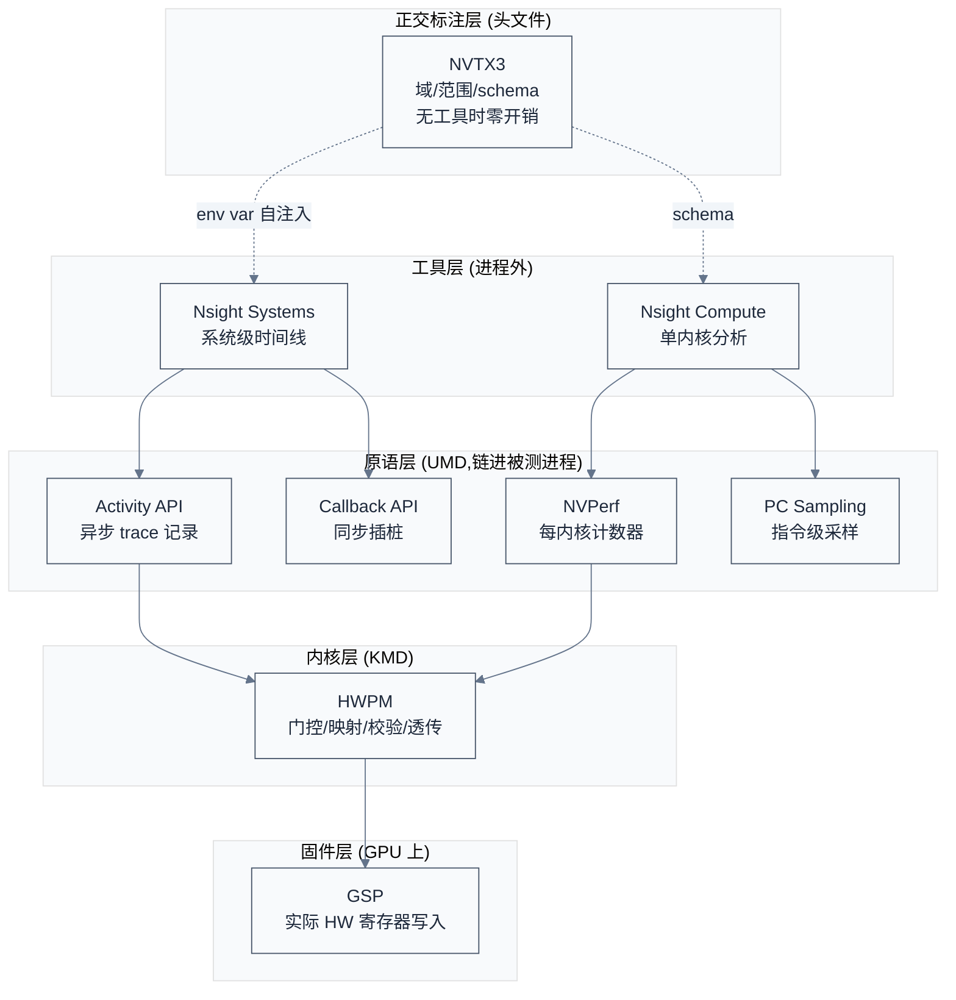

# NVIDIA Profiling 工具设计与源码分析

> 从真实源码(CUPTI 头文件、NVTX3、HWPM 内核驱动、NCCL 生产用法)与官方手册两个维度,拆解 NVIDIA trace/profile 工具的设计与实现。核心论点:NVIDIA 的 profiling 不是一个工具,而是一个**分层 API 体系(CUPTI 原语 → Nsight 工具)+ 正交的 NVTX 注解层**,围绕"分析器不阻塞被分析者"与"主机-设备关联是 ID 不是时间戳"两条不变量设计。
> **工程师视角**:理解 NVIDIA profiling 的价值不在"学用 nsys/ncu",而在看它如何把 profiling 的四件事(配置翻译、特权门控、硬件动作、记录格式)分给三层 + 一个正交层,每层独立 ABI、独立发布节奏。这套分层是 2260"固件一把抓"模型的对照系。

### 关键术语

| 缩写 | 全称 | 含义 |
|------|------|------|
| CUPTI | CUDA Profiling Tools Interface | NVIDIA 分析/追踪底层 C API,所有 Nsight 工具的基础 |
| NVTX | NVIDIA Tools Extension | NVIDIA 用户态注解/标记 API,头文件库 |
| HWPM | Hardware Performance Monitor | GPU 硬件性能监视单元,KMD 编程 |
| nsys | Nsight Systems | NVIDIA 系统级时间线追踪器 |
| ncu | Nsight Compute | NVIDIA 单内核分析器 |
| NVPerf | NVIDIA Perf SDK | ncu 底层的计数器/指标库 |
| KMD | Kernel-Mode Driver | 内核态驱动 |
| UMD | User-Mode Driver | 用户态驱动 |
| RM | Resource Manager | NVIDIA 驱动资源管理器 |
| GSP | GPU System Processor | GPU 上的系统处理器(固件) |
| ABI | Application Binary Interface | 应用二进制接口 |
| PC Sampling | Program Counter Sampling | 指令级统计采样 |
| correlationId | — | 主机-设备关联 ID |
| PMA | Performance Monitor Allocator | HWPM 引擎的计数器资源分配器 |

**跨厂商对照**:

| NVIDIA 概念 | 2260 对应 | 对照说明 |
|------------|----------|----------|
| HWPM(KMD)→ GSP | 固件 PMU 配置 | NVIDIA 分 KMD/GSP,2260 折叠进固件 |
| Activity API 异步 buffer | 固件写 DDR + 主机运行后读 | NVIDIA 异步不阻塞,2260 同步阻塞 |
| `correlationId` ID 链 | `inst_id` 16 位启发式 | NVIDIA 精确 O(1),2260 近似 O(n) |
| NVTX3 payload schema | (无) | 2260 缺用户标注层 |
| NVPerf 3 轴语法 + Python 公式 | `parse_pmu` 硬编码 | NVIDIA 数据驱动,2260 代码驱动 |
| PC Sampling 停滞原因 | (无) | 2260 无采样 |

---

## 1. 概述

### 1.1 前置知识

| 需要了解 | 参考文档 |
|----------|----------|
| CUDA Runtime/Driver 分层 | [CUDA-Runtime 架构设计](../cuda/05-CUDA-Runtime架构设计.md)、[Driver 接口](../cuda/06-CUDA-Driver接口与实现.md) |
| Nsight 工具使用 | [错误处理与调试技术](../cuda/08-错误处理与调试技术.md) §5-6 |
| 2260 profiling 缺陷(对照) | [2260 profiling 工具缺陷诊断](./2260-profiling工具缺陷诊断.md) |
| NCCL 集合通信 | [NCCL 学习笔记](../nccl/) |

### 1.2 系统上下文

**项目定位**:本文拆解 NVIDIA profiling 基础设施的设计与实现,作为 2260 profiling 缺陷诊断的对照系。研究对象是 CUPTI(底层 API)、NVTX(用户标注)、HWPM(内核驱动层),以及构建其上的 Nsight Systems/Compute 工具。

**软硬件耦合点**:
- **CUPTI(UMD)↔ 硬件计数器**:CUPTI 自己掌握 counter→寄存器翻译,与 `dev_perf.h` 寄存器定义共演进,独立于 KMD 发布节奏。
- **KMD HWPM ↔ GSP 固件**:KMD 是通用透传层,保留/映射/校验 PM 区域,转发给 GSP;GSP 做实际硬件寄存器写入。
- **NVTX ↔ 工具**:NVTX 头文件链进任意库,工具在进程启动时通过环境变量自注入;无工具时零开销。
- **Nsight ↔ CUPTI**:Nsight 工具进程外消费 CUPTI 的 Activity/Callback 记录流。

**跨实现对比**:2260 把配置翻译 + 特权门控 + 硬件动作 + 记录格式四件事全压进固件;NVIDIA 分四层(KMD 门控 → CUPTI 翻译 → Nsight 工具 → NVTX 正交标注),各层独立 ABI。



> **如何读这张图**:纵向是特权递降(工具 → UMD → KMD → 固件),横向 NVTX 是正交旁路。关键:NVTX 不经过 CUPTI/KMD,直接通过环境变量注入工具;CUPTI 拥有 counter 翻译知识,KMD 只透传。

### 1.3 驱动力与不变量

**驱动力链**:profiling 被"看见执行 → 定位瓶颈 → 归因到指令 → 跨多核多卡对齐"的接力问题推着走。每一环催生一个子 API:看见执行 → Activity API(时间线);定位瓶颈 → NVPerf(每内核计数器);归因到指令 → PC Sampling(停滞原因);跨多核多卡 → correlationId + 外部关联栈。

**不变量**:两条贯穿全栈——**"分析器不阻塞被分析者"**(Activity 异步 buffer、Callback 只读参数、PC Sampling 从不同步)与**"主机-设备关联是 ID 不是时间戳"**(correlationId 单调分配、外部关联栈)。

**走向**:CUPTI 从早期 Events&Metrics API(命令式、每计数器 ioctl)演进到 Profiler Target API(声明式、会话批处理);Nsight Systems 从软件追踪演进到 Blackwell 硬件追踪(HES,更低开销);NVTX 从 C API 演进到 NVTX3 C++ RAII + payload schema。数据格式从 `.nsys-rep` 封装演进到 SQLite/Arrow/HDF5 标准导出。

---

## 2. 分层架构:为什么是原语层不是工具

> 概述建立了"分层 + 正交"框架。一个自然的问题是:为什么 NVIDIA 不做一个大一统的 profiler,而要分 CUPTI 原语层和 Nsight 工具层?本章用源码拆解这个分层的依据。

### 2.1 四层 + 正交标注层

分层的核心依据是**谁拥有什么知识**:

| 层 | 拥有的知识 | 不做的事 | 源码位置 |
|----|-----------|---------|---------|
| Nsight 工具 | 用户需求、可视化、规则 | counter 翻译、硬件动作 | 闭源 |
| CUPTI(UMD) | counter→寄存器翻译(与 `dev_perf.h` 共演进) | 特权门控、实际 HW 写入 | `cupti_*.h` 头文件 |
| KMD HWPM | 特权门控、区域保留/映射/校验、透传 | counter 翻译、时间切片多路复用、记录拷贝 | `nvidia-kmd/.../gpu/hwpm/` |
| GSP 固件 | 实际 HW 寄存器写入、PMA 引擎绑定 | 翻译、门控 | 闭源 |

KMD 是**通用、经过校验的透传层**——HWPM 源码 `ctrlb0ccprofiler.h` 的 `BIND_PM_RESOURCES` 注释明说:"此调用后接口就绪,可编程计数器集合",编程随后由 UMD 驱动的 `EXEC_REG_OPS` 完成。架构 HAL 只返回拓扑常量(`kern_hwpm_gm107.c` vs `kern_hwpm_gh100.c`),**无翻译逻辑**。

### 2.2 分层的 ABI 与发布节奏

CUPTI 用 **structSize 版本控制**实现前向兼容,而非 version 枚举:

```c
/* CUPTI/NVPerf 所有参数结构体以 structSize + pPriv 开头,字段单调追加 */
typedef struct CUpti_Profiler_BeginSession_Params {
    size_t structSize;                    /* [in] 调用方填 STRUCT_SIZE 宏 */
    void* pPriv;
    /* ... 后续字段可随版本追加 ... */
    uint8_t* pCounterDataImage;           /* [in] 输出 buffer 地址 */
    /* ... */
} CUpti_Profiler_BeginSession_Params;
```

`NVPA_STRUCT_SIZE` + `NVPW_FIELD_EXISTS` 宏让实现探测旧二进制是否支持新字段。**前向兼容是结构性的**:旧二进制可读新字段(忽略),新二进制探测旧字段是否存在。KMD 通过 FINN 生成的 RPC ID(`0xb0cc01xx` 外部、`0xb0cc02xx` GSP 面)与 CUPTI ABI 解耦——独立版本化的控制平面。

> **核心要点**:分层让每层独立演进——CUPTI 跟随 GPU 微架构(新计数器),工具跟随用户需求(新规则),KMD 跟随内核 ABI。2260 折叠进固件意味着换芯片要改固件 + 主机解析器 + 结构体契约三处;NVIDIA 换 GPU 只需更新 CUPTI(数据驱动的 availability blob,见 §5.3)。

**代价与边界**:分层的代价是 ABI 复杂度(structSize 协议、多版本头文件)和层间延迟(KMD→GSP RPC 往返)。边界是极低延迟场景(单次轻量内核)下 RPC 往返本身成为瓶颈,这时 Nsight Systems 的硬件追踪(HES)绕过部分软件层。

---

## 3. Activity API:异步 buffer 模型

> 上一章看到分层把"谁做什么"分开了,但没回答"怎么不扰动测量"。低开销是分析器的第一约束——一个扰动过大的分析器测出来的不是原程序。本章拆解 CUPTI Activity API 的异步 buffer 设计,这是 NVIDIA 时间线追踪的心脏,直接对照 2260"固件写 PMU 到 DDR"模型。

### 3.1 记录模型:52 种类型,扁平,自描述

`CUpti_ActivityKind` 枚举定义 52 种记录类型(内核、memcpy、memset、同步、NVTX 标记、内存池、图跟踪、PC 采样、环境、开销等)。通用头只有一个 kind 标签:

```c
/* 摘自 cupti_activity.h 第 1697-1702 行 */
typedef struct PACKED_ALIGNMENT {
  CUpti_ActivityKind kind;
} CUpti_Activity;
```

所有记录 `__packed__` + 8 字节对齐。**设计**:异构记录类型塞进一个扁平 buffer,用 kind 切换重解释;无变长记录、无指针跟踪。

内核记录 `CUpti_ActivityKernel7` 带**四时间戳延迟分解**:

```c
/* 摘自 cupti_activity.h 第 4996-5020 行(Kernel7 的 queued/submitted 文档与字段) */
uint64_t queued;      /* 主机写命令缓冲的时刻 */
uint64_t submitted;   /* 命令缓冲刷到 GPU 的时刻 */
uint64_t start;       /* GPU 开始执行 */
uint64_t end;         /* GPU 结束执行 */
uint64_t completed;   /* 内核 + 所有 CDP 子内核完成 */
uint32_t correlationId;  /* == 启动 API 记录的 correlationId */
```

文档明说:"所有 CUDA 内核对主机都是异步的;主机写完命令缓冲就返回不查 GPU 进度。"四时间戳把完整主机→设备流水线延迟拆开,而非只给一个 duration。

**对照 2260**:2260 的 PMU 记录只有 `inst_start_time` / `inst_end_time` 两个时间戳,看不到主机→设备流水线延迟(排队、提交)。

### 3.2 buffer 管理:用户分配 + 两个回调,异步

缓冲区模型由两个用户注册的回调驱动:

```c
/* 摘自 cupti_activity.h 第 10033、10049 行 */
typedef void (CUPTIAPI *CUpti_BuffersCallbackRequestFunc)(
    uint8_t **buffer, size_t *size, size_t *maxNumRecords);    /* CUPTI 要一个空 buffer */
typedef void (CUPTIAPI *CUpti_BuffersCallbackCompleteFunc)(
    CUcontext context, uint32_t streamId, uint8_t *buffer,
    size_t size, size_t validSize);                             /* CUPTI 还一个填满的 buffer */
```

注册后(`cuptiActivityRegisterCallbacks`),CUPTI **异步**写记录、工作线程还 buffer、**从不阻塞 launch 线程**。buffer 池由属性控制:

| 属性 | 默认值 | 设计意图(头文件注释) |
|------|--------|---------------------|
| `DEVICE_BUFFER_SIZE` | 3 MB | 每上下文,约 10 万条记录 |
| `DEVICE_BUFFER_POOL_LIMIT` | 250 | "耗尽的 buffer 回收进重用池,内存占用不随内核数增长"(`:9496`) |
| `DEVICE_BUFFER_PRE_ALLOCATE_VALUE` | 3 | "buffer 分配在主线程会阻塞临界路径;预分配 3 个做乒乓缓解"(`:9506`) |
| `MEM_ALLOCATION_TYPE_HOST_PINNED` | 1(CUDA 11.2+) | "默认 pinned host memory,可能提升追踪性能"(`:9521`) |

**溢出处理**:buffer 耗尽时记录**丢弃并计数**(`cuptiActivityGetNumDroppedRecords`),不阻塞应用——保吞吐量,降保真度。

**自指开销测量**:`CUPTI_ACTIVITY_KIND_OVERHEAD` 是一等记录——CUPTI 把自己的开销(buffer 刷新、命令缓冲满、资源创建)作为带时间戳的活动记录发出。工具能像报设备工作一样报 profiler 成本。这是"测量不干扰"原则的体现。

### 3.3 对照 2260 的固件写 DDR 模型

| 维度 | NVIDIA Activity API | 2260 固件写 DDR |
|------|---------------------|----------------|
| buffer 所有权 | 用户 RequestFn 分配,可选 pinned/device | 固件拥有 DDR 区,主机读 |
| 填充时机 | 异步,工作线程,不阻塞 launch | 固件运行时写,主机运行后读 |
| 溢出 | 丢弃 + 计数,吞吐不降 | 无界或固件静默丢 |
| 延迟分解 | 每内核 4 时间戳 | 只有 start/end |
| 自开销 | OVERHEAD 一等记录 | 无 |
| 关联 | correlationId(见 §4) | 无,靠时间戳启发式 |

> **核心要点**:2260 的硬件 PMU 自主流 DDR 在"不阻塞被分析者"上与 NVIDIA 异曲同工(都是硬件自主写,不占 MCU),但差在三点:① 无溢出可观测(丢了不知丢多少);② 无延迟分解(只有 start/end,看不到排队/提交);③ 无自开销测量(用户不知 profiler 拖慢了多少)。补这三点不需要改硬件,改固件 buffer 管理即可。

**代价与边界**:异步 buffer 的代价是 buffer 池内存占用(每上下文最多 250×3MB)和记录可能丢失(高频短内核场景)。边界是 `CONCURRENT_KERNEL` 类型——保留并发性但可能丢时间戳("由于缺乏设备内存,可能含 0 时间戳"),时间戳保真与性能保真是类型系统里的显式权衡。

---

## 4. 主机-设备关联:相关性 ID 链

> 低开销保证了测量不失真,但时间线要可读还需要主机事件与设备事件对齐。NVIDIA 用相关性 ID 链,2260 靠时间戳启发式——这一差异决定了时间线是"可推理的"还是"只能看个大概"。

### 4.1 correlationId:ID 作为数据,不是元数据

`correlationId` 是每条 Activity 记录里的普通 `uint32_t` 字段,由每次 API 调用单调分配。不变性在每种记录类型的文档里逐字重复(如 `cupti_activity.h:1779` Kernel7、`:2096` Memcpy5)。主机 API 调用获得一个 ID,它启动的内核/memcpy 继承同一 ID。

**关键设计**:CUPTI **不构建关联图**——它只提供稳定链接,让工具自己建图。这使得 CUPTI 工具无关(Nsight Systems、Nsight Compute、第三方分析器用同一记录流)。

### 4.2 外部关联栈:NVTX/第三方 → CUDA

外部注解通过**基于栈的推/弹**连接,产生单独的记录:

```c
/* 摘自 cupti_activity.h 第 10440 行 */
CUptiResult cuptiActivityPushExternalCorrelationId(CUpti_ExternalCorrelationKind kind, uint64_t id);
/* 对应 Pop 在第 10454 行 */
```

`CUpti_ExternalCorrelationKind` 提供三个 CUSTOM 插槽(`:8614` CUSTOM0、`:8619` CUSTOM1、`:8624` CUSTOM2)给任意第三方工具——这是非 NVIDIA 工具插入自己关联命名空间的直接钩子。推/弹是**每调用线程**的,嵌套外部范围正确关联。链接记录 `CUpti_ActivityExternalCorrelation`(`:8670`)在流中位于它关联的 CUDA API 记录**之前**——保持 CUDA 记录结构稳定,同时扩展关联图。

### 4.3 NVTX 自动关联

NVTX 注解通过 Callback API 的 `CUPTI_CB_DOMAIN_NVTX` 域自动进入关联链:调用 `nvtxRangePush` 时触发回调,工具把外部关联 ID 推到当前线程栈,随后的 CUDA API 调用和它启动的内核继承该 ID——CPU 注解与 GPU 工作就此关联。

### 4.4 对照 2260 的时间戳启发式

| 维度 | NVIDIA ID 链 | 2260 启发式 |
|------|-------------|------------|
| 关联原语 | correlationId uint32 单调分配 | inst_id 16 位 + 时间戳 |
| 复杂度 | O(1) 查表 | O(n) 最小编辑距离匹配 |
| 正确性 | 精确(ID 唯一) | 近似(ID 回绕/乱序时退化) |
| 工具耦合 | 工具无关 | 固件+解析器紧耦合 |
| 用户扩展 | 3 个 CUSTOM 插槽 | 无 |

> **核心要点**:相关性 ID 是"数据"不是"元数据"——CUPTI 不建图,只提供稳定链接让工具建图。2260 的最小编辑距离匹配(见 [bigTpuProfile 设计](./bigTpuProfile-design.md))是对"无关联 ID"的补救,在 inst_id 回绕(16 位,1GHz 下约 65ms)或乱序时退化。补关联 ID 是 2260 最高性价比的改进。

---

## 5. 每内核分析器:NVPerf 重放模型

> 前两章解决了时间线(看见、对齐)。但"为什么这个内核没跑更快"需要每内核的计数器深入分析。本章拆解 NVPerf 的重放与指标流水线,对照 2260 的硬编码推导。

### 5.1 主机/目标分割:配置 blob 边界

主机库 `nvperf_host.h` 做所有 counter→pass 装箱,产出**不透明配置 blob**;目标 shim 只编程这个 blob 并吐输出:

```c
/* 摘自 cupti_profiler_target.h 第 262-280 行(BeginSession 参数) */
typedef struct CUpti_Profiler_BeginSession_Params {
    size_t structSize;
    /* ... */
    uint8_t* pCounterDataImage;    /* [in] 输出 buffer,主机预分配,热路径零拷贝 */
    /* ... */
} CUpti_Profiler_BeginSession_Params;
```

会话预分配输出 buffer——文档:"用户承担管理 counterDataImage 分配的责任。"**设计**:输出 buffer 由主机预先确定大小(它知道 counter×range 矩阵),热路径零拷贝。

### 5.2 重放:为什么不能一次测完

内核无法在一次执行中产生完整计数器集,原因:(a) 硬件每 SM/SMSP/L2 切片只有有限计数器寄存器,并非所有请求的计数器能同时复用;(b) 软件打补丁的 SASS 指标会修改内核,扭曲同一遍的硬件计数器。解法是**多遍重放**:

```c
/* 摘自 cupti_profiler_target.h 第 116-129 行 */
CUPTI_ApplicationReplay,   /* 用户重跑整个进程,零插桩,最慢 */
CUPTI_KernelReplay,        /* CUPTI 在流中隐式重放,最低用户代码 */
CUPTI_UserReplay,          /* 用户在循环里包每个内核,最灵活 */
```

**关键不变量**:昂贵的 SW 打补丁指标在与它本会扭曲的 HW 计数器**不同的重放遍次**中收集——指标值不受其导致的开销影响。

### 5.3 多路复用:显式 3 轴

硬件计数器槽位不够时,NVIDIA 暴露三个正交控制点:

1. **pass group**(`nvperf_host.h`):用户提示"这些指标一起测",`GenerateConfigImage(mergeAllPassGroups=true)` 让主机重新打包。
2. **isolated vs pipelined pass**:`numIsolatedPasses * numNestingLevels`——隔离 pass 必须在每个并发内核嵌套级重复,流水线 pass 可流式传输。
3. **replay mode**:谁拥有重放循环(见 §5.2)。

**pass 合并是度量类型感知的**:`AccumulateIntoRange`(整数倍,给计数器)vs `WeightedSumIntoRange`(双精度倍,给比率)——比率在 pass 间贡献的分子分母比例不同。

### 5.4 counter→指标推导:3 轴语法 + Python 公式

仅原始计数器离开 GPU;派生指标在事后由主机计算。推导语法是三个枚举的笛卡尔积:

```
NVPW_MetricType{COUNTER, RATIO, THROUGHPUT} ×
NVPW_RollupOp{AVG, MAX, MIN, SUM} ×
NVPW_Submetric{PEAK_SUSTAINED, PER_CYCLE_ACTIVE, PCT_OF_PEAK_SUSTAINED_ELAPSED, ...22 种}
```

命名约定**编码了公式**:`sm__inst_executed.sum.per_cycle_active` 字面意思就是"SM 实例间指令执行求和,除以 active 周期"。字符串后缀就是配方。

指标定义本身是**数据不是编译代码**:`NVPW_MetricsContext_RunScript` 等价 `exec(source, metrics.__dict__)`——新指标作为 Python 数据文件发布,无需更新二进制分析器。

**未来芯片:数据驱动**。`pCounterAvailabilityImage` 是从驱动查的不透明 blob;新芯片无需重编译主机工具——芯片知识是数据不是代码。

### 5.5 对照 2260 的硬编码推导

| 方面 | NVIDIA NVPerf | 2260 |
|------|--------------|------|
| counter→指标 | 3 轴语法 + Python 公式,数据驱动 | `parse_pmu.cpp` / `sg_flops_show` 硬编码 |
| 多路复用 | 显式 3 轴 | 固件隐藏 |
| 新芯片 | availability blob,无需重编译 | 改 7-8 份复制代码 + 结构体契约 |
| 新指标 | 数据文件发布 | 改代码 + 重编译 + 重分发 |

> **核心要点**:NVIDIA 的指标定义是数据(Python 脚本),2260 是代码(硬编码)。数据意味着新 GPU/新指标无需更新分析器二进制;代码意味着每次都要改 + 重编译 + 重分发。这是"声明式 vs 命令式"在 profiling 领域的具体体现。

**代价与边界**:3 轴语法学习曲线陡;重放遍次乘数在高并发内核场景(多嵌套级)成本高;SW 打补丁指标开销最大(指令级修改内核)。边界是内核有主机依赖关系时 KernelReplay 会挂,须退到 ApplicationReplay。

---

## 6. PC 采样:指令级热点归因

> NVPerf 回答"这个内核的整体指标",但要定位到"哪条指令、为什么慢"需要采样。本章拆解 PC 采样,对照 2260 的无采样。

### 6.1 采样对象与停滞原因

采样对象是**指令 PC**(SASS 偏移),按 PC 聚合,每个 PC 关联一个**停滞原因分布**。周期是 `2^samplingPeriod` 周期(5-31)——暴露硬件能力(周期性 HW 快照),不是任意软件节流。默认值"基于 SM 数的 CUPTI 定义值"——采样密度随 GPU 规模自动缩放。

**停滞原因是运行时查询的命名空间,不是固定枚举**:`CUpti_PCSamplingStallReason` 只是 `(index, samples)`,名字通过 `cuptiPCSamplingGetStallReasons` 运行时查。新 GPU 加原因不破 ABI。代价:离线分析必须和采样数据一起持久化原因表。

### 6.2 丢失建模是一等公民

```c
/* cupti_pcsampling.h 的 CUpti_PCSamplingData 字段 */
uint64_t totalSamples;          /* 所有 PC,含丢弃 + 非用户 */
uint64_t droppedSamples;        /* 硬件背压/溢出丢弃 */
uint64_t nonUsrKernelsTotalSamples;  /* 非用户内核,未展开 */
```

三级 buffer(HW 512MB → SW scratch 1MB → 用户)独立可配;`GetData` **从不做设备同步**——最小侵入优先于完整性。统计采样必须告诉用户"丢了多少",否则热点排名被扭曲。

### 6.3 采样与插桩互补

| 维度 | Activity API | PC 采样 |
|------|-------------|---------|
| 粒度 | 内核/memcpy 事件 | 指令 PC + 停滞原因 |
| 完整性 | 穷举(每事件) | 统计(可丢弃) |
| 丢失模型 | 无 dropped 概念 | droppedSamples 一等 |
| 用途 | 时间线、并发 | 热点归因、瓶颈分类 |

两者是**互补并列子域,不是分层**:Activity 告诉你"哪个内核慢",PC 采样告诉你"那个内核里哪条指令、为什么慢"。2260 只有事件计数,既缺热点归因也缺"随时间趋势"。

> **核心要点**:NVIDIA 不强制选采样还是插桩——工具组合它们,通过共享 correlationId 链接。单模式分析器(如 2260 只有事件计数)要么错过时间线(仅采样)要么错过热点(仅事件)。

---

## 7. NVTX:用户可扩展标注的零开销分离

> 前几章解决了"工具看到什么",但用户自己的代码结构(如 NCCL 的 AllGather 阶段)怎么在时间线上显形?NVIDIA 用 NVTX,2260 没有对应物。本章拆解 NVTX3 的零开销分离机制,这是 NVTX 能嵌进热路径库的前提。

### 7.1 三层零开销机制

**第 1 层 —— 编译时 `NVTX_DISABLE`**:`#ifdef` 消除整个 NVTX 代码体,零字节零指令。

**第 2 层 —— 运行时函数指针表 + 空检查**:

```c
/* 摘自 nccl-src/src/include/nvtx3/nvtxDetail/nvtxImplCore.h 第 9-16 行 */
NVTX_DECLSPEC void NVTX_API nvtxMarkEx(const nvtxEventAttributes_t* eventAttrib)
{
#ifndef NVTX_DISABLE
    nvtxMarkEx_impl_fntype local = NVTX_VERSIONED_IDENTIFIER(nvtxGlobals).nvtxMarkEx_impl_fnptr;
    if(local!=0)
        (*local)(eventAttrib);
#endif
}
```

无工具时,每次 NVTX 调用 = 一次内存读 + 一次分支预测命中。

**第 3 层 —— 延迟注入**:`NVTX_INJECTION??_PATH` 环境变量 / 弱符号 `InitializeInjectionNvtx2_fnptr`;注入失败所有函数指针设 noop。库作者 `#include` 头文件 + 调用内联 API,无需链接库、无需改构建系统、无需运行时开关;工具在进程启动时通过环境变量自注入。

### 7.2 域:类型级标签隔离

C++ 包装器用**类型级标签**而非运行时字符串:

```cpp
/* NCCL 声明其域,摘自 nccl-src/src/include/nvtx.h 第 53-54 行 */
struct nccl_domain {
  static constexpr char const* name{"NCCL"};
};
```

多个库定义自己的标签结构体;模板实例化自然隔离。析构**故意不调 `nvtxDomainDestroy`**——为了线程安全放弃回收(引用释放其他线程 TLS 的挑战)。

### 7.3 载荷 schema:开放契约

这是真正的用户可扩展性机制。库定义 schema(命名字段 + 类型)、注册拿 schema ID、用 ID 做类型化标注;工具按 schema ID 解码。NCCL 为每个集合通信操作定义 schema:

```cpp
/* 摘自 nccl-src/src/include/nvtx_payload_schemas.h 第 78-80 行(AllGather) */
NCCL_NVTX_DEFINE_STRUCT_WITH_SCHEMA_ENTRIES(NcclNvtxParamsAllGather, static constexpr,
  NCCL_NVTX_PAYLOAD_ENTRIES((uint64_t, comm, TYPE_UINT64, nccl_nvtxCommStr),
                            (size_t, bytes, TYPE_SIZE, nccl_nvtxMsgSizeStr)))
```

AllReduce 多一个 `ncclRedOp_t` 字段,其枚举通过 `nvtxPayloadEnumRegister` 注册,让 Nsight 显示 `op=Sum` 而非 `op=0`。静态 schema ID 从 `1<<24` 起,不与预定义类型冲突;schema ID 是库与工具间的稳定契约,**绝不能重用**。

### 7.4 对照 2260 的无标注 API

| 维度 | NVTX3 | 2260 |
|------|-------|------|
| 用户标注 | 头文件 + RAII range + schema | 无 |
| 无工具开销 | 3 层零开销(编译/运行/注入) | — |
| 语义结构 | schema 开放契约(命名字段+枚举) | 按内置 op 类型分类 |
| 工具耦合 | 库定义 schema,工具解码 | 用户只能改工具代码 |

> **核心要点**:NVTX 把"工具怎么显示的部分控制权"交给库作者(通过 schema),而 schema 使事件的语义结构成为库与工具之间的**开放协议**。2260 缺这一层,用户库的内部结构化阶段(如集合通信的 commHash + bytes + op)无法被工具识别为命名字段,用户只能改工具代码才能让自己的阶段显形。

**代价与边界**:NVTX 的代价是 domain 对象永久存活(不回收,为线程安全);schema ID 绝不能重用(否则旧 trace 误解码)。边界是 NVTX 只提供标注,不提供计数器——它让工具"看见"用户语义,但不"测量"用户代码,测量仍靠 CUPTI。

---

## 8. 从数据到判断:数据模型、规则与设计原则

> 前几章拆解了采集侧原语。本章先讲 Nsight 工具侧如何把数据变成工程判断(SQLite 数据模型 + Python 规则),再收敛出贯穿全文的六条跨领域设计原则,作为 2260 改进的理论依据。

### 8.1 Nsight Systems 的 SQLite 数据模型

`.nsys-rep` 是前向兼容封装;`nsys export` 转成 **SQLite 规范化关系模型**(公开查询 API):

- **`StringIds`** 字典表压缩事件行(事件通过 `nameId` 引用)。
- **`globalPid/globalTid`** 在单命名空间编码进程/线程/设备/VM,跨节点可排序。
- **按事件类型分表**:`CUPTI_ACTIVITY_KIND_KERNEL`、`..._MEMCPY`、`NVTX_EVENTS`、`OSRT_API`、`GPU_METRICS` 等,每行带 `start`/`end`/`globalTid`/`correlationId`。
- **NVTX 动态 payload 表**:NVTX v3 的自由二进制负载通过 `NVTX_PAYLOAD_SCHEMAS` 自描述,`--dynamic-tables` 展开成每 schema 一张关系表——**用户 schema 直接变数据库表,不改 profiler 模式**。
- **`TARGET_INFO_SESSION_START_TIME`** 存 vClock 对齐原语(手册明确 PTP 必需,NTP 不够)。

### 8.2 Nsight Compute 的指标流水线

原始 HW 计数器 → 四 rollup(`.sum/.avg/.min/.max`)→ 计算子指标(`.peak_sustained` 等)→ 派生指标(`.section` 文件组合)→ throughput → **Speed of Light**(计算/内存利用率)→ **Roofline**(FLOP/s vs 算术强度)。Warp 停滞原因通过 PC 采样收集(§6),约二十几个原因各有调优建议。

### 8.3 规则分析:Python 插件

两个工具都实现自动化瓶颈检测,但设计不同:

- **Nsight Systems**:`nsys analyze` 在 SQLite 导出上跑 Python 规则脚本,检测 6 条反模式(同步 memcpy、同步 memset、阻塞同步 API、GPU 饥饿、低利用率、异步可分页拷贝),每条返回前 50 + 建议。规则数据驱动,用户可扩展。
- **Nsight Compute**:NvRules C++ 接口 + `NvRules.py` 绑定 + `.py` 规则,分析时调 `apply` 回调,可附 UI 元素(警告/表格/图表/加速估计)。规则与 section(指标集)配对,API 无关命名(Range/Action 而非 stream/kernel)。

共同点:规则作为带结构化上下文接口的 Python 插件,声明性指标规范 + 命令性分析逻辑配对,"检测反模式 → 返回带建议的前 N"。

> **核心要点**:NVIDIA 的"把数据变成判断"是分两步的:声明性指标规范(section/Python 公式)产出数值,命令性规则(Rule)产出建议。2260 的 `parse_pmu` 把这两步混在硬编码里,既不能扩展指标也不能扩展规则。

### 8.4 跨领域设计原则

前几节逐维度拆解,下表把可复用的设计原则收敛,作为 2260 改进的理论依据。

| 原则 | NVIDIA 实现 | 2260 现状 |
|------|------------|----------|
| **(a) 稳定 ABI 的分层** | structSize 版本控制;KMD/UMD/工具独立发布 | 固件一把抓,换芯片改三处 |
| **(b) 异步缓冲低开销** | Activity 用户 buffer + 工作线程 + 池化;从不阻塞 launch | 固件写 DDR + `tpu_poll` 阻塞 |
| **(c) 显式关联 ID** | correlationId + 外部关联栈 + 3 CUSTOM 插槽 | inst_id 16 位启发式 |
| **(d) 零开销用户标注** | NVTX3 三层零开销 + schema 开放契约 | 无标注 API |
| **(e) counter→指标流水线** | 3 轴语法 + Python 公式,数据驱动 | 硬编码 |
| **(f) 采样与插桩互补** | Activity + Callback + PC Sampling 并列子域 | 只有事件计数 |

> **核心要点**:这六条原则不是"NVIDIA 专有",而是 profiling 系统的通用工程判断——任何想从"能采"升级到"能诊断"的 profiling 栈都要面对它们。2260 当前只触及(b)的一半(硬件 PMU 自主流式)和(c)的替代(启发式匹配),其余四条完全缺失。补齐路径见 [2260 profiling 工具缺陷诊断](./2260-profiling工具缺陷诊断.md) §4.2。

---

## 官方文档索引

| 文档 | 用途 | 建议阅读时机 |
|------|------|------------|
| [CUPTI Activity API](https://docs.nvidia.com/cuda/cupti/api/group__CUPTI__ACTIVITY__API.html) | 异步 trace 记录模型 | 本文 §3 |
| [CUPTI Callback API](https://docs.nvidia.com/cuda/cupti/api/group__CUPTI__CALLBACK__API.html) | 同步插桩模型 | 本文 §4.3 |
| [CUPTI Profiler API](https://docs.nvidia.com/cuda/cupti/api/group__CUPTI__PROFILER__API.html) | 每内核计数器会话 | 本文 §5 |
| [CUPTI PC Sampling API](https://docs.nvidia.com/cuda/cupti/api/group__CUPTI__PCSAMPLING__API.html) | 指令级采样 | 本文 §6 |
| [Nsight Systems User Guide](https://docs.nvidia.com/nsight-systems/UserGuide/index.html) | 系统级追踪 | 本文 §8.1 |
| [Nsight Compute Profiling Guide](https://docs.nvidia.com/nsight-compute/ProfilingGuide/index.html) | 单内核分析 | 本文 §8.2 |
| [Nsight Compute Customization Guide](https://docs.nvidia.com/nsight-compute/CustomizationGuide/index.html) | 自定义指标/规则 | 本文 §8.2-8.3 |

## 参考资料

- [2260 profiling 工具缺陷诊断](./2260-profiling工具缺陷诊断.md) — 对照对象,本文每章末尾的"对照 2260"
- [错误处理与调试技术](../cuda/08-错误处理与调试技术.md) §5-6 — Nsight Compute/Systems 使用层面
- [CUDA-Runtime 架构设计](../cuda/05-CUDA-Runtime架构设计.md) — CUDA 分层背景
- CUPTI 头文件(CUDA 11.7, API v17):`~/.local/lib/python3.10/site-packages/nvidia/cuda_cupti/extras/CUPTI/include/` — 本文 §3-6 的源码依据
- NVTX3 源码:`../nccl/src/nccl-src/src/include/nvtx3/` — 本文 §7 的源码依据
- NCCL NVTX 生产用法:`../nccl/src/nccl-src/src/include/nvtx.h`、`nvtx_payload_schemas.h`、`src/init_nvtx.cc` — 本文 §7.3
- HWPM KMD 源码:`../nvidia-kmd/src/open-gpu-kernel-modules/src/nvidia/src/kernel/gpu/hwpm/` — 本文 §2.1
- [CUPTI Documentation](https://docs.nvidia.com/cuda/cupti/) — 参考了 Activity/Callback/Profiler/PCSampling API
- [Nsight Systems User Guide](https://docs.nvidia.com/nsight-systems/UserGuide/index.html) — 参考了采集模型、SQLite 数据模型、规则分析
- [Nsight Compute Profiling Guide](https://docs.nvidia.com/nsight-compute/ProfilingGuide/index.html) — 参考了重放模式、指标流水线、Speed of Light/Roofline
