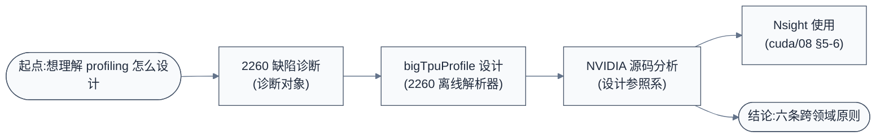

# Profile 学习笔记

> 异构加速器(AI TPU / GPU)trace 与 profile 工具的设计、实现与对照分析。以 Sophon SG2260/2260e 为诊断对象,以 NVIDIA CUPTI/Nsight/NVTX 为设计参照系,回答"profiling 该怎么分层、怎么低开销、怎么把数据变成工程判断"。

### 关键术语

| 缩写 | 全称 | 含义 |
|------|------|------|
| PMU | Performance Monitor Unit | 硬件性能监视单元(TPU 侧称 PMU,GPU 侧称 HWPM) |
| CUPTI | CUDA Profiling Tools Interface | NVIDIA profiling 底层 API |
| NVTX | NVIDIA Tools Extension | NVIDIA 用户态注解 API |
| nsys / ncu | Nsight Systems / Compute | NVIDIA 系统级追踪器 / 单内核分析器 |
| Perfetto | — | Google 开源 trace 可视化框架 |
| correlationId | — | 主机-设备关联 ID |

---

## 学习路线图

## 文档索引

| 序号 | 文档 | 概要 | 建议学时 |
|------|------|------|---------|
| 1 | [2260 profiling 工具缺陷诊断](./2260-profiling工具缺陷诊断.md) | 三层工具(固件/运行时/离线)全景 + 10 类缺陷 + 改进选型 | 1.5h |
| 2 | [bigTpuProfile 设计与实现分析](./bigTpuProfile-design.md) | 2260 离线解析器四阶段流水线(解析→匹配→归一化→导出) | 2h |
| 3 | [NVIDIA profiling 设计源码分析](./NVIDIA-profiling设计源码分析.md) | CUPTI/NVTX/HWPM 源码级拆解 + 六条跨领域设计原则 | 2.5h |

**建议阅读顺序**:先读 1(诊断对象,知道 2260 现状与缺陷)→ 2(看清离线侧是怎么补的)→ 3(对照参照系,知道成熟设计长什么样)。文档 1 与文档 3 的每章末尾有双向"对照"链接。

## 官方文档表

| 文档 | 用途 | 建议阅读时机 |
|------|------|------------|
| [CUPTI Documentation](https://docs.nvidia.com/cuda/cupti/) | NVIDIA profiling 底层 API | 读文档 3 前 |
| [Nsight Systems User Guide](https://docs.nvidia.com/nsight-systems/UserGuide/index.html) | 系统级追踪(采集模型/SQLite/规则) | 读文档 3 §8 前 |
| [Nsight Compute Profiling Guide](https://docs.nvidia.com/nsight-compute/ProfilingGuide/index.html) | 单内核分析(重放/指标流水线/Roofline) | 读文档 3 §5、§8 前 |
| SG2260 TPU 规格书 §6.1.6 | TIU PMU 硬件定义 | 读文档 1 §2 前 |
| GDMA Design Spec §5.2.1 | GDMA PMU 寄存器 | 读文档 1 §2 前 |

## 源码导航表

| 仓库 | 路径 | 关键目录/文件 | 职责 | 对应文档 |
|------|------|--------------|------|---------|
| TPU1686 固件 | `/home/pbw/2260/TPU1686/` | `sg2260/firmware_base/src/firmware/firmware_{pmu,profile}.c` | 硬件 PMU 配置 + MCU 事件日志 | 文档 1 §2.1 |
| tpuv7-runtime | `/home/pbw/2260/tpuv7-runtime/` | `cdmlib/host/cdm_runtime/tpuv7_rt.c`、`cdmlib/ap/daemon/cdm_daemon/main.c` | 主机侧 event API + daemon 时间戳 | 文档 1 §2.2 |
| bigTpuProfile | `./bigTpuProfile/` | `profile_helper/`(binary/matcher/normalizer)、`exporters/`(perfetto/summary) | 离线二进制解析与导出 | 文档 2 |
| NCCL(内含 NVTX3) | `../nccl/src/nccl-src/src/include/nvtx3/` | `nvtx3.hpp`、`nvtxDetail/nvtxImplCore.h` | NVTX3 头文件库 + 零开销注入 | 文档 3 §7 |
| NCCL NVTX 用法 | `../nccl/src/nccl-src/src/include/` | `nvtx.h`、`nvtx_payload_schemas.h`、`src/init_nvtx.cc` | 生产库的域/schema 定义 | 文档 3 §7.3 |
| NVIDIA KMD | `../nvidia-kmd/src/open-gpu-kernel-modules/src/nvidia/src/kernel/gpu/hwpm/` | `kern_hwpm.c`、`kern_hwpm_streamout.c`、`profiler_v2/` | HWPM 内核驱动(门控/透传) | 文档 3 §2 |
| CUPTI 头文件 | `~/.local/lib/python3.10/site-packages/nvidia/cuda_cupti/extras/CUPTI/include/` | `cupti_activity.h`、`cupti_callbacks.h`、`cupti_profiler_target.h`、`cupti_pcsampling.h` | CUPTI API 定义(Activity/Callback/NVPerf/PC采样) | 文档 3 §3-6 |

## 按角色推荐学习路径

- **TPU 系统软件工程师(做 profiling 工具)**:文档 1 → 2 → 3,重点文档 3 §3(异步 buffer)、§4(关联 ID)、§7(NVTX),对照文档 1 §3 找自家差距。
- **TPU 算子/模型工程师(用 profiling 优化模型)**:文档 1 §2(知道能采什么)→ 文档 2(知道离线解析怎么用)→ cuda/08 §5-6(对照 nsys/ncu 怎么用)。
- **GPU/CUDA 工程师(理解 NVIDIA 设计)**:直接文档 3,源码级,配合 cuda/08 §5-6 的使用层。
