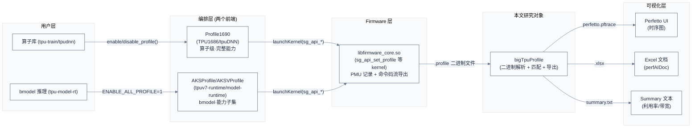
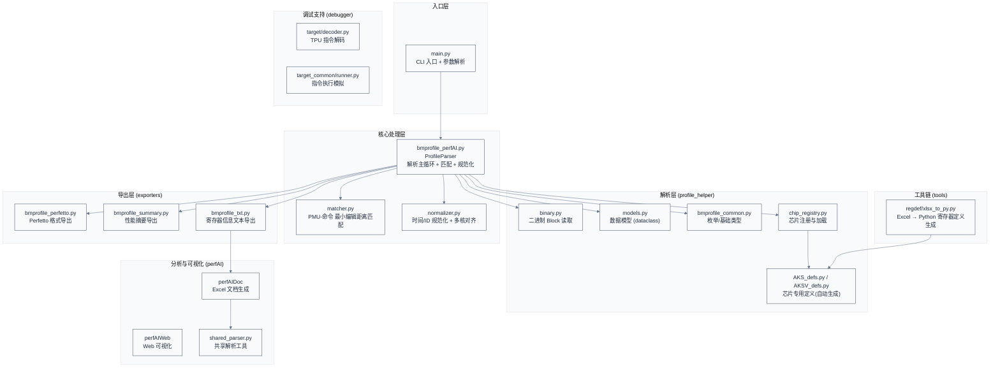
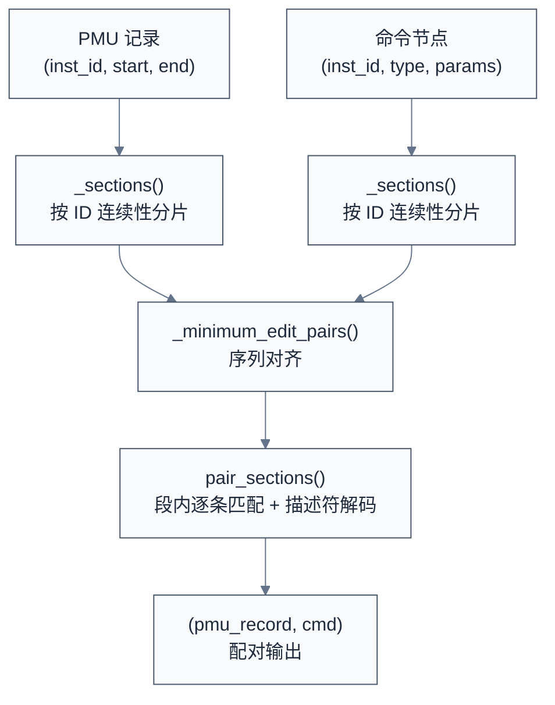

# bigTpuProfile 设计与实现分析

> 本文分析 bigTpuProfile 项目的架构设计、核心数据流与关键实现决策，并沿 `.profile` 数据的生产链路向上游延伸到固件侧（TPU1686）与运行时侧（tpuv7-runtime），向下游锚定到硬件手册（mannul）的权威定义。bigTpuProfile 是 Sophon AKS/AKSV 系列 TPU 芯片的板卡性能 profiling 与可视化工具，将固件导出的原始 PMU 二进制数据解析为 Perfetto 时序图、性能摘要和 Excel 文档。

## 1. 概述

### 1.1 项目定位与系统上下文

**项目定位**：bigTpuProfile 是 TPU 软件栈中的**性能可观测性工具**，连接 TPU 固件（firmware）产生的原始 PMU 数据与工程师可读的性能分析输出。它不参与 TPU 运行时计算，而是对已产生的 profile 数据做离线解析和可视化。

**数据流全景**：`.profile` 文件由两个独立维护的前端产出，经固件共同执行层驱动硬件 PMU 记录，最终由 bigTpuProfile 解析导出：



**两个生产前端**（细节见附录 A）：

| 前端 | 路径 | 编排者 | 能力 |
|------|------|--------|------|
| 算子级 | tpu-train/tpudnn | TPU1686 侧 `Profile1690` 模板类 | 完整：CDMA PMU、多芯片拓扑、`BLOCK_DES_KV` 延迟解码 |
| bmodel 全模型 | tpuv7-runtime 的 model-runtime | `AKSProfile`/`AKSVProfile` | 子集：无 CDMA PMU、无拓扑发现、不解析 MCU 动态流 |

两者最终都通过 firmware kernel（`sg_api_set_profile` 等）驱动硬件 PMU；`libfirmware_core.so` 是共同的执行层。

**前置知识**（硬件背景，详见附录 B）：

| 需要了解 | 参考文档 |
|----------|----------|
| TPU 基本架构（TIU/GDMA/SDMA/CDMA 引擎） | SG2260 TPU 规格书 (§1-§6), GDMA Design Spec (§1-§5) |
| 指令集/同步/PMU 事件模型的权威定义 | TPU V7.1 指令集设计文档 v0.26（§11 同步方式、§12.4 Performance Monitor、§13.1 TPU 性能公式） |
| TIU/GDMA 描述符与 CSR 位域 | SG2260_TPU_TIU_Reg1.0.xlsx、GDMA_SG2260_DES_REG.xlsx（regdef 生成源） |
| Perfetto trace 格式 | [Perfetto 官方文档](https://perfetto.dev/) |
| Python 二进制解析（struct/ctypes） | — |

**引擎一览**（角色、取指、同步的细节见附录 B，此处只给结论）：

| 引擎 | 角色 | 关键点 |
|------|------|--------|
| TIU（BD） | 计算引擎 | 64 lane SIMD；16MB LMEM + 64KB SMEM；不读写外部存储，靠 GDMA 交换数据 |
| GDMA | 数据搬运 | 3 RDMA + 3 WDMA，满载 128GB/s；指令分 SYS(128-bit) 与搬运(768-bit) 两类 |
| SDMA | GDMA 精简子集 | 仅 6 条指令，无 sync_id/gif 接口 |
| HAU | 排序/top-K 加速器 | 每核 1 个，独立指令流，仅访问 GMEM/L2M；AKSV 已删除 |
| CDMA | 片间 DMA（Chip Link DMA） | 服务 C2C/P2P；内部 TX/RX 双通道；另有 VSDMA（C2C 辅助） |

> 每个引擎（TIU/GDMA/SDMA/HAU/CDMA）各有**独立的指令流与指令 buffer**；TIU 是计算引擎而非共享指令前端（术语表 "TIU = TPU Instruction Unit" 的名称有误导性）。取指分 PIO（MCU 经 AXI slave 逐条写）与 DES（引擎经 AXI master 自 DDR 抓描述符）两种模式，见附录 B.1。

**同步机制**（两种原语，细节见附录 B.1 §11）：

| 原语 | 参与引擎 | 延迟 | 指令载体 |
|------|---------|------|---------|
| SyncID | TIU ↔ GDMA | 最低 | 描述符 depend_id 字段（双方指令都有） |
| MSG | 私有段 TIU/GDMA/SDMA/HAU；C2C 段 CDMA/vSDMA | 较高 | SYS 系统指令（send/wait），经 A4S 接口到 MSG Central |

两种原语都落地为 **SYS 系统指令**——不是旁路信号，而是一条普通指令，靠头部类型字段标记为"系统类"（`bd_sys_code=15`/`dma_sys_code=6`/`cdma_sys_code=7`）。send/wait 由第二字段选择：

| 引擎 | 系统码 | send / wait 字段 |
|------|--------|-----------------|
| TIU | `tsk_typ=15` | `tsk_eu_typ` 8=send_msg / 9=wait_msg |
| GDMA | `cmd_type=6` | `cmd_sp_func` 3=sys_send / 4=sys_wait |
| SDMA | — | `sys_send`/`sys_wait`（`sdma_reg_value.h:61-62`） |
| CDMA | `cmd_type=7` | CDMA 经 A4S（见附录 B.3） |

**同步方向是双向的**：SEND 指令自带 `wait_cnt`（`SEND relative_msg_id wait_cnt`），是双向 credit 握手；depend_id 字段在 GDMA/TIU 指令中都有，任何一方都能等另一方。实测 bm1690 profile 的 init 握手为 **GDMA send → BD wait** 两回合，收敛于 BD 的 wait `inst_end_time` 作为该 core 的锚点（§3.4）；正常计算中方向随数据流走——装载 GDMA→TIU、写回 TIU→GDMA。

**命令 ID 架构**（位宽细节见附录 B.1）：V7.1 起指令描述符**不再含 `cmd_id` 字段**，ID 计数由硬件完成（`sys_tr_wr` 可重设）；描述符内只留依赖 ID（TIU `des_cmd_id_dep` 23-bit / GDMA `cmd_id_dep` 21-bit）。解析器看到的 `inst_id` 是硬件计数器镜像，`ID_RESET` 记录对应固件主动重设。

**软硬件耦合点**（决定了解析器的核心假设）：

- **PMU 记录**：硬件在每个 engine 指令执行时自动打时间戳到 32-bit cycle 计数器，profile 工具需处理 ~4.3 秒（1GHz 下）的回绕。
- **命令码流**：firmware 在 CPU 侧同步记录每条命令的编码二进制（BD/DMA descriptor），profile 工具通过 `inst_id` 关联 PMU 时间戳与命令码，解码获得算子类型、带宽等语义信息。
- **多核同步**：每个 TPU core 独立运行（各自有独立的 TIU + GDMA + SDMA）。固件在 profile session 初始化时向各引擎指令流头部插入 2 条同步系统指令（`profile_init_cmd_num=2`）；解析器以 BD（TIU）monitor 中第 2 条（最后一条）同步记录的 `inst_end_time` 作为该 core 的对齐锚点（sync point），用于跨核时间轴对齐（详见 §3.4）。

### 1.2 关键术语

| 缩写 | 全称 | 含义 |
|------|------|------|
| PMU | Performance Monitor Unit | 性能监控单元，记录每条指令的起止时间戳 |
| TIU | Tensor Instruction Unit | 张量指令单元（计算引擎）——"TPU 内部核心控制模块，用于控制 TPU 内部数据的搬运、整理和计算" |
| GDMA | Global DMA | 全局 DMA 引擎（本地 LMEM/SMEM/L2M/GMEM 之间及跨 core 搬运） |
| SDMA | System DMA | GDMA 的精简子集，裁减了 matrix/cw_transpose/compress 等指令仅保留 6 条 |
| CDMA | Chip Link DMA | 片间 DMA 引擎，服务 SPC.c2c 与 SPC.p2p 访问；链路可配 PCIe 或 Ethernet，内部 TX/RX 两个 Channel |
| BD | BD Engine（BDC 指令） | TIU 引擎及其计算指令（BDC 描述符）在代码/固件中的历史代号 |
| DES | Descriptor | 双层含义——硬件层面：引擎经 AXI master 自主抓取指令描述符的模式（与 PIO 相对）；profile 文件层面：预录制的命令码流二进制 block |
| RVT | Runtime Variable Task | 运行时动态任务模式（命令 ID 会回绕，仅 AKSV 支持） |
| TDI | —（代码模式名） | PIO 立即描述符模式，解析器中作为与 RVT/DES 并列的命令来源标记 |
| C2C | Chip-to-Chip | 芯片间互联（经 CDMA 端口承载，底层链路为 PCIe 或 Ethernet） |
| SYS | System Command | 系统同步指令（128-bit），用于 send/wait 消息传递，不产生有效数据搬运或计算 |
| MSG Sync | Message Sync | TIU 与其他加速引擎之间的消息同步机制（灵活但延迟较高，base ID 可外部配置） |
| SyncID Sync | Sync ID Sync | TIU ↔ GDMA 之间的 ID 同步机制（延迟最低） |
| Perfetto | — | Google 开源 trace 可视化工具 |
| AKS/AKSV | — | Sophon 两款 TPU 芯片的内部代号（AKS = SG2260, AKSV = SG2260E） |

### 1.3 核心设计思想

> **核心要点**：bigTpuProfile 的核心设计是一个"多源数据融合匹配"问题——将 PMU 时间戳流与命令码流按 engine 类型和命令 ID 匹配，再通过多核同步点对齐各 core 的时间轴，最后导出为不同可视化格式。整个过程遵循"解析→匹配→规范化→导出"四阶段流水线。

**为什么需要匹配**：PMU 只记录时间和命令 ID，不记录"这条指令是什么算子、搬运了多少数据"。命令码流记录了算子和参数，但不知道执行时刻。两者必须配对才能得到完整信息——"什么操作，何时开始，耗时多少"。

---

## 2. 整体架构

### 2.1 模块分层



### 2.2 核心数据模型

```python
# 参见 bigTpuProfile/profile_helper/models.py

@dataclass
class ProfileIteration:
    """单个 core 的一次 profile session 的中间数据"""
    dyn_data: dict       # 动态记录（TIU/GDMA/SDMA/CDMA 的命令节点）
    dyn_extra: list      # 详细命令码流（mode 2 时启用）
    monitor_bd: list     # TIU PMU 监控记录
    monitor_gdma: list   # GDMA PMU 监控记录
    monitor_sdma: list   # SDMA PMU 监控记录
    monitor_cdma: list   # CDMA PMU 监控记录
    des_kv: dict         # 描述符 KV 映射（offset → DesCommon）
    des_bdc: list        # BD 命令描述符（bmodel 模式）
    des_gdma: list       # GDMA 命令描述符（bmodel 模式）
    des_sdma: list       # SDMA 命令描述符（bmodel 模式）

@dataclass
class ProfileResult:
    """解析完成后的输出数据结构"""
    archlib: Any           # 芯片 profile 定义模块
    bd_events: list        # TIU 事件列表（每个 core 一组）
    gdma_events: list      # GDMA 事件列表
    sdma_events: list      # SDMA 事件列表
    cdma_events: list      # CDMA 事件列表（每个 port 一组）
    num_cores: int         # 核心数
    input_dir: str         # 输入目录
    tail_offset_ns: int    # CPU/PMU 尾端对齐偏移
    pmu_tail_cycle: int    # PMU 尾端 cycle 值
```

每个事件是一个三元组 `(info, extra, meta)`：
- `info`：引擎通用信息（起止时间、命令 ID、算子类型、带宽等）
- `extra`：命令解码后的额外字段（源/目标地址、stride 等）
- `meta`：元数据（Global Index、Core ID、kernel 函数名等）

---

## 3. 核心数据流：四阶段管线

> 一条 profile 数据从磁盘文件到可视化的完整路径：二进制 Block 解析 → 命令码流解析 → PMU-命令匹配 → 规范化对齐。本章按这四个阶段展开。

### 3.1 阶段一：二进制 Block 解析

**输入**：firmware 导出的 `.profile` 二进制文件（如 `cdmlib_core0.profile`、`cdma_0.profile`）。

**输出**：按 BlockType 分类的 `BlockItem` 列表。

**关键设计**：profile 文件采用**自描述的 TLV 结构**（Type-Length-Value），每个 block 由 8 字节头部（4 字节类型 + 4 字节长度）加可变长度内容组成。

```
文件格式:
┌────────────┬──────────┬──────────────────┐
│ BlockType  │  Length  │  Content         │
│  (4 bytes) │ (4 bytes)│  (Length bytes)  │
└────────────┴──────────┴──────────────────┘
... 重复 ...
```

`parse_data_blocks()` 函数（`binary.py:66-94`）顺序读取文件，按 `BlockType` 枚举识别 block 类型：

| BlockType | 值 | 含义 | 内容格式 |
|-----------|-----|------|----------|
| MONITOR_BD | 3 | TIU PMU 记录 | `BDProfileFormat`: inst_start_time(u32), inst_end_time(u32), inst_id(u32), thread_id/bank_conflict(u32)，共 4×u32 = 16B |
| MONITOR_GDMA | 4 | GDMA PMU 记录 | `GDMAProfileFormat`: 16 个 u32 字段（64B，H0-H3），含时间戳、ar_latency、AXI/GIF 读写与 stall 计数器 |
| MONITOR_SDMA | 11 | SDMA PMU 记录 | 同 `GDMAProfileFormat`（SDMA 复用 GDMA 结构布局） |
| MONITOR_CDMA | 12 | CDMA PMU 记录 | `CDMAProfileFormat`: 32 个 u32 字段（128B，H0-H7），含时间戳、replay_number、分阶段计时等 |
| DYN_DATA | 5 | 运行时动态命令记录 | `ProfileFormat` 固定长度结构体数组（混合 NODE_SET/ID_RESET/FUNC/BATCH_IDX/DES_* 等类型） |
| DYN_EXTRA | 6 | 详细命令码流（mode 2） | 嵌套 TLV：`(profile_id, type, length, content)` |
| BLOCK_DES_BDC | 13 | BD 命令描述符（bmodel） | TIU 命令编码二进制，由 `BDCommandParser` 解码 |
| BLOCK_DES_GDMA | 14 | GDMA 命令描述符（bmodel） | DMA 命令编码二进制，由 `GDMACommandParser` 解码 |
| BLOCK_DES_SDMA | 15 | SDMA 命令描述符（bmodel） | 同 GDMA 格式 |
| BLOCK_DES_CDMA | 16 | CDMA 命令描述符（bmodel） | CDMA 命令编码二进制 |
| BLOCK_DES_KV | 17 | 描述符 KV 延迟解码引用 | `(key, cmd_num, id, raw_cmd)`——运行时只记录引用，匹配时按需解码 |

> 其余枚举值（SUMMARY=1、COMPILER_LOG=2、FIRMWARE_LOG=7、COMMAND=8、BMLIB=9、BMLIB_EXTRA=10）在当前解析路径中不承载 PMU/命令数据。
>
> 其中 `BMLIB/BMLIB_EXTRA` 是"历史遗留槽位"：本应记录主机运行时事件（内存分配、流同步），但只被 tpuv7-runtime **已被删除的旧实现**填充过（§7.2），bmodel/算子两条现行路径都不再产生。

> **核心要点**：BlockType 枚举的设计使得同一文件可以混合 PMU 数据（硬件自动记录）、运行时动态记录（firmware CPU 侧记录）、命令描述符（bmodel 模式下预录制）三种不同性质的数据。firmware 只需按时间顺序追加 block，解析器按类型分发即可。其中 `MONITOR_*` 块的 payload 是 PMU 硬件往 DDR 写的**原始记录字节**（逐字节拷贝、无转换），逐字段布局见附录 B.1 §12.4。

**为什么 PMU 和命令码流分开存储**：PMU 由硬件自动记录（每个 cycle 写入），命令码流由 firmware 在 CPU 侧记录（开销敏感）。分开存储允许用户选择三种采集模式：

| Mode | 名称 | PMU | 命令类型 | 命令详情 | 性能开销 |
|------|------|-----|----------|----------|----------|
| 0 | PMU Only | ✓ | ✗ | ✗ | 最小 |
| 1 | 精简 CMD | ✓ | ✓（类型码） | ✗ | ~4% |
| 2 | 详细 CMD | ✓ | ✓（类型码） | ✓（完整寄存器码流） | 7-10% |

> **两个"DES"不是一个概念**：
>
> | 术语 | 含义 | 出现场景 |
> |------|------|---------|
> | `BLOCK_DES_*` | profile 文件里预录制的命令码流 block | bmodel 模式的存储方式 |
> | DES 取指模式 | 引擎经 AXI master 从 DDR 自主抓取描述符 | 硬件指令获取方式 |
>
> 算子级 profile（tpu-train/tpudnn）的命令码经 `DYN_DATA`/`DYN_EXTRA` 记录，而非 `BLOCK_DES_*`。

### 3.2 阶段二：命令码流解析

命令码流并非只有 `DYN_DATA`——解析器按 BlockType 分发，把四类命令来源分别解析成结构化数据（对应 `parse_cmd` 里的 `blocks_factory`，`bmprofile_perfAI.py:129-144`）：

| 输入 block | 内容 | 解析函数 | 输出 |
|-----------|------|---------|------|
| `DYN_DATA` | 运行时固定长度记录（NODE_SET/ID_RESET/FUNC/BATCH_IDX/DES_* 引用）——算子级 PIO 主路径 | `__parse_dyn_data` | 命令节点 `dyn_data["tiu/gdma/sdma/cdma"]` |
| `DYN_EXTRA` | mode 2 详细命令码流（嵌套 TLV） | `__parse_dyn_extra` | `dyn_extra` 列表 |
| `BLOCK_DES_BDC/GDMA/SDMA` | bmodel 预录制命令描述符 | `BD/GDMACommandParser.parse` | `des_bdc`/`des_gdma`/`des_sdma` |
| `BLOCK_DES_KV` | 算子级 DES 命令的延迟解码引用 | `__parse_kvdes_data` | `des_kv` 映射 |

> **PIO 与 DES 混用是常态，不是二选一**：`DYN_DATA` 本身就是一条混合流——`NODE_SET`（PIO 命令，参数内联）与 `DES_*`（DES 命令引用 `(offset, cmd_num)`）按 dispatch 顺序交错。firmware 的 kernel 分 4 种（`dispatch_a_kernel`，`nodechip_multi_fullnet.c:1330-1358`）：type1 PIO、type2 DESC、type3 HYBRID（同一 kernel 内 DES 派发部分引擎 + PIO 派发其余，`dispatch_a_hybrid_kernel` `:1247`）、type4 SUBGRAPH（递归混合）。`BLOCK_DES_KV`/`BLOCK_DES_*` 与 `DYN_DATA` 是**互补**关系——`DES_*` 记录只存引用，真正的 768-bit 命令字节在 DES block 里，§3.3 匹配时按引用解码。

下面详述其中最主要的 `DYN_DATA` 路径（`DYN_EXTRA`/`BLOCK_DES_*`/`BLOCK_DES_KV` 在 §3.3 匹配时被消费）：

**关键设计**：`DYN_DATA` 中的 fixed-length items（由 `ProfileFormat` 定义）是一个混合序列——它包含引擎命令节点（NODE_SET）、ID 重置标记（ID_RESET）、函数作用域标记（FUNC/FUNC_END）、batch 标记（BATCH_IDX）、以及描述符引用（DES_TIU/DES_GDMA 等）。解析器需要根据 `DynRecordType` 枚举区分不同类型的记录。

`__parse_dyn_data()` 方法（`bmprofile_perfAI.py:273-408`）的核心逻辑：

1. 遍历所有 fixed-length items
2. 根据 `DynRecordType` 分发：
   - `NODE_SET` / `RVT_NODE_SET`：按 `EngineType` 追加到对应 engine 的命令列表，同时关联当前生效的 `func_name`、`batch_idx`、`func_scope_id`
   - `ID_RESET`：将对应 engine 的命令 ID 计数器归零（支持命令 ID 回绕）
   - `FUNC`：解析函数名字符串，开启新的 `func_scope_id`
   - `FUNC_END`：关闭当前函数作用域
3. 维护 `pio_tiu_cmd_id` / `pio_gdma_cmd_id` 等自增计数器，为每条命令分配唯一的 `inst_id`

> **核心要点**：`inst_id` 是 PMU 与命令码流之间**唯一的关联键**。解析器必须保证 `inst_id` 的分配与 firmware 侧一致，否则匹配阶段会产生错位。

**RVT 命令 ID 回绕处理**（仅 AKSV）：当 TIU 命令 ID 达到 `command_id_wrap_max`（0x3FFFF）时，firmware 会插入一对 wrap 命令（tiu_wrap_command: type=15, eu=3; dma_wrap_command: type=6, eu=3）重置 ID 计数。解析器检测到 RVT_NODE_SET 且满足回绕条件时，插入 `FixedItemWrapper` 作为占位标记，然后将 `pio_cmd_id` 归零。

### 3.3 阶段三：PMU-命令码流匹配

这是整个 pipeline 中最关键也最复杂的阶段。

**输入**：
- 每 core 的 PMU 记录（`monitor_bd[]`, `monitor_gdma[]`, `monitor_sdma[]`）
- 每 core 的命令节点列表（`dyn_data["tiu"][]` 等）
- 可选的描述符 KV 映射 + 命令解析器

**输出**：配对的 `(pmu_record, parsed_command)` 列表，存储在各 engine 的 `pairs` 列表中。

**匹配算法**（`matcher.py`）：

1. **分片（Sectioning）**：`_sections()` 函数将 PMU 记录和命令节点各自切分为"逻辑连续段"——在命令 ID 回绕处或描述符边界处断开。每个 section 保存 `[id_range, indices]`。

2. **系统命令标记**：PMU 记录中可能存在系统指令（syn/wait），通过 `is_system_monitor()` 检测并在 section 中标记。

3. **最小编辑距离匹配**：`_minimum_edit_pairs()` 函数对 PMU sections 和命令 sections 做序列对齐——以求最小编辑距离的方式找到最优配对（允许删除/插入/替换，代价分别为 1/1/2）。

4. **段内逐条匹配**：对每个匹配的 section pair，用 `inst_id` 的偏移量将 PMU 记录与对应的命令码做关联——即 `pmu_record.cmd = commands[pmu_record.inst_id - section_start_id]`。

5. **描述符延迟解码**：对于 DES 模式（命令码流以引用方式存储在 `des_kv` 中），在匹配时通过 `command_parser` 即时解码命令。



**为什么用最小编辑距离而非简单 ID 对位**：因为 PMU 记录可能包含系统指令（syn/wait/nop），这些指令不出现在命令码流中。同时，固件可能多记录或少记录某些命令（采集模式不同）。最小编辑距离能容忍这种插入/删除。

**指令来源：PIO/TDI 与 DES**（`matcher.py:231-248`）。硬件层面 TIU 有两种取指模式：

| 取指模式 | 机制 |
|---------|------|
| PIO（=TDI，立即描述符） | MCU 经 AXI slave 逐条写指令寄存器 |
| DES | TIU 经 AXI master 从 DDR 抓描述符链 |

profile 数据层面，`DynRecordType` 用三种标记区分指令来源：

| DynRecordType | 来源 | 含义 |
|---------------|------|------|
| `NODE_SET` | firmware CPU 侧逐条记录 | 对应硬件 PIO/TDI 模式，命令参数记录在 `extra_info` 字段中 |
| `RVT_NODE_SET` | firmware 记录（RVT 模式） | 同上但命令 ID 支持回绕 |
| `DES_TIU` / `DES_GDMA` 等 | firmware 按描述符块记录 | 命令码流以引用方式存储（通过 `des_kv` 映射按 `(offset, cmd_num)` 索引），匹配时通过 `command_parser` 延迟解码——减少 profile 数据体积，但增加匹配开销 |

`pair_sections()` 在处理 DES 类型的 command 时，通过 `descriptor_map.get(descriptor.offset).get(descriptor.cmd_num)` 定位到对应的命令码块，再调用 `command_parser.parse()` 即时解码。这种"延迟解码"设计避免了在 profile 文件中存储完整命令码（768-bit 的 DMA 指令），只需存储索引即可。

### 3.4 阶段四：规范化与对齐

**输入**：各 engine 的 PMU-命令 pair 列表。

**输出**：时间归一化、多核时间轴对齐、去除系统命令后的干净数据。

规范化操作（`normalizer.py`）按顺序执行：

1. **normalize_command_ids**：处理 16-bit 命令 ID 的溢出回绕（当 ID 从 65000+ 跳变到 <1000 时，加上 2^16 偏移）

2. **normalize_time**：处理 32-bit 时间戳的溢出回绕（当 `start_time` 倒退时，加上 2^32）

3. **adjust_send_retire_order**：修正 SDMA/CDMA 中 send/wait 记录的顺序错位（硬件可能乱序写入 PMU）

4. **normalize_cdma_time**：CDMA 专用时间戳回绕处理（与普通 normalize_time 逻辑不同——CDMA 的 start 和 end 需要同时判断回绕）

5. **adjust_command_order**：修正相邻命令 ID 顺序错位（swap 前后两条记录）

6. **align_core_time**：以 core 0 的同步点为基准，将所有 core 的 PMU 时间戳平移到同一时间轴

7. **shift_time_to_zero**：将所有时间戳减去全局最小值，使 trace 从 0 开始

8. **omit_system_commands**：移除起止位置的 syn/wait 系统命令（这些命令不产生有效计算/搬运，但会干扰利用率统计）


> **核心要点**：时间戳回绕处理是整个 pipeline 正确性的基础——PMU 硬件使用 32-bit 计数器记录 cycle 数，在 1GHz TIU 频率下每 ~4.3 秒回绕一次。如果处理不当，会导致时间轴出现巨大负跳变，所有后续统计失真。

**PMU 时间戳与多引擎/多核对齐机制**

先厘清两个时间概念：PMU 时间戳与 CPU 侧 timer 无关。`inst_start_time`/`inst_end_time` 是**硬件**在每条引擎指令**真正开始执行/结束执行**的瞬间从**同一个全局 cycle 计数器**采样写入——§B.1 §12.4 原文"记录每个指令ID真正开始执行及结束执行的时间戳记，**不包含等待执行**"（TIU/GDMA/SDMA 同源同频；计数器在拉起 pmu_enable 时从 Initial timer 1GHz 起累加、溢出自动归零）。因此 StartTime 既不是 enable 时刻、也不是指令进入流水线（派发/取指）的时刻——指令等依赖、等数据的时间不计入。CPU（scalar）侧的软件 timer（固件 `cntpct_el0` 类读数）只用于固件自身计时（超时、`tail_offset_ns` 采集锚点），**不参与引擎对齐**；PMU 记录与 PIO/DES 配置码流之间也**不靠时间对齐，而靠 DesID（`inst_id`）对齐**（§3.3 的最小编辑距离匹配）。

因此这里的"对齐"不是时钟同步（无需授时/频率校准，同一把尺子），而是**读数基线的平移**：需处理三类不一致——

1. **32-bit 计数器回绕**（`normalize_time`/`normalize_cdma_time`，见前）。

2. **各引擎头部记录不同步**：profile 启动时每个引擎命令流头部被插入 2 条初始化同步指令（`profile_init_cmd_num=2`，`AKS_defs.py:32`），PMU 记录头部对应产生 2 条同步记录。据此：
   - **取锚点**：`monitor_bd[0][init_num-1]` —— BD 第 2 条（最后一条）同步记录的 `inst_end_time`（`bmprofile_perfAI.py:501-503` 动态路径、`:567-569` bmodel 路径）。
   - **裁头部**：命令流与 PMU 记录**同时**按 `[init_num:]` 裁掉（`:505-517`、`:571-575`），使命令与 PMU 一一对应，锚点对应的同一条同步指令在两侧同步移除。

3. **不同计数域的原点差**：CDMA 是片间 DMA（独立端口、独立 PMU 缓冲），其计数器相位与 SDMA 不同，需用同步点显式对齐——`offset = cdma_wait_point.inst_end_time − sdma_send_point.inst_end_time`，将 CDMA 整体平移（`bmprofile_perfAI.py:520-534`）。同核的 TIU/GDMA/SDMA 则**不再做引擎间 offset 校正**（同源全局计数器，裁剪后天然对齐）。

多核对齐（`normalizer.align_core_time()`，`normalizer.py:98-139`）：每个 core 的锚点（BD 第 2 条同步的 `inst_end_time`）对应 profile 启动时"同一个物理时刻"，故以 core 0 为基准，把其他 core 的 BD/GDMA/SDMA 整体平移 `sync_points[core_id] − sync_points[0]`：

```python
# normalizer.py:98-139, 简化逻辑
base_cycle = sync_points[0]
for core_id in range(num_cores):
    delta_cycle = sync_points[core_id] - base_cycle
    for record in bd_pair + gdma_pair:
        record.inst_start_time -= delta_cycle
        record.inst_end_time -= delta_cycle
```

**为什么取同步点的 `end_time` 而非 start_time**：start_time 是"指令进入流水线"的时刻，抖动大；end_time 是同步指令"握手完成"的物理时刻，跨引擎/跨核可比对。

**为什么是 2 条同步指令**：头部 2 条组成"压流水线 + 握手锚点"的启动序列——第 1 条把引擎排空到已知静默状态（profiler 使能时引擎内部可能还有在途指令），第 2 条在静默状态下完成跨引擎握手，其 `end_time` 才是可信锚点（解析器也恰取最后一条）。N 的值本身没有"恰好为 2"的硬件必然性，它是**装配端与解析端共用的固定契约**——`profile_init_cmd_num` 是 `chip_registry.py` 的 22 项必需芯片接口之一，两端数值必须一致，否则所有记录整体错位。

**init 握手的 send/wait 方向**（实测，bm1690 `cdmlib0_0.profile`）：两个回合都是 **GDMA send → BD wait**，记录交错如下——`GDMA#0 send [2743,2754]` → `BD#0 wait end=3194`（比 send 完成晚 ~440 tick：消息延迟 + 引擎间 counter 相位差）→ `GDMA#1 send [3291,3326]` → `BD#1 wait [3726,3761]`（即锚点）。方向由时序约束唯一确定：wait 的 end 必须 ≥ 被等 send 的 end——若反过来（BD send / GDMA wait），GDMA#0 的 wait 结束(2754)就必须晚于 BD 的 send 结束(3194)，矛盾。这是**数据装载方向**的体现，并非 ISA 限制（§1.1 同步方向是双向的）；数据写回时方向反转为 TIU→GDMA。

---

## 4. 导出层设计

结构化数据经三种导出格式呈现给用户，各自服务不同的分析场景。

**输出产物**：

| 产物 | 路径 | 说明 |
|------|------|------|
| Perfetto trace | `output_dir/perfetto.pftrace` | 拖入 [ui.perfetto.dev](https://ui.perfetto.dev) 查看 |
| Summary | `output_dir/summary.txt` | 每核 TIU/GDMA/SDMA/CDMA 利用率与带宽 |
| Excel 文档 | `output_dir/PerfDoc/*.xlsx` | 寄存器级详细信息（需 `--enable_doc`） |
| RegInfo 文本 | `output_dir/tiuRegInfo_*.txt` 等 | 中间格式（`--enable_doc` 时产生） |

### 4.1 Perfetto 导出

`PerfettoExporter`（`bmprofile_perfetto.py`）将 profile 数据转换为 [Perfetto trace](https://perfetto.dev/) 格式（`.pftrace` 文件）。

**设计要点**：

- **Track 层级**：使用 `TrackDescriptor` 的 `parent_uuid` 属性建立三级树形结构：`Core N → {TIU, GDMA, Kernel Function, TIU Utilization(counter), GDMA Bandwidth(counter)}`，以及独立的 `CDMA → {Port 0, Port 1, ...}`
- **Slice 事件**：每条 PMU 记录映射为一个 `TYPE_SLICE_BEGIN`/`TYPE_SLICE_END` 事件对，携带 `debug_annotations`（算子类型、带宽、命令 ID 等元数据）
- **Counter 事件**：为 TIU 利用率和 GDMA 带宽提供连续的时间序列（每个 slice 开始设值，结束归零），在 Perfetto 中以 counter track 渲染
- **Kernel Function 概览**：同一 `func_scope_id` 或 `(kernel_func, batch_launch)` 的多个 slice 合并为一个汇总区间，方便从算子层快速定位有问题的 kernel
- **Host-TPU 时间对齐**：通过 `--trace_file` 参数合并外部 CPU trace（如 `tpudnn` 的 Chrome Tracing JSON），利用 `tail_offset_ns`（firmware 记录的 disable_profile 到 PMU 尾端的 CPU 时间差）将 CPU 时间与 TPU PMU cycle 对齐

```python
# bmprofile_perfetto.py:260-267, 时间对齐简化逻辑
pmu_relative_time = (
    pmu_tail_anchor_ns
    - get_realtime_from_cycle(p.pmu_tail_cycle - min_start_cycle, tiu_freq)
)
# pmu_relative_time 是所有 PMU cycle 转纳秒后的基准偏移
```

**为什么用 nanosecond 时间戳而非 cycle**：Perfetto 的时序模型基于纳秒。转换公式：

$$t_{ns} = \frac{cycle}{frequency_{MHz}} \times 1000$$

`get_realtime_from_cycle()` 精确到小数点后两位，以纳秒精度存储。

### 4.2 Summary 导出

`SummaryExporter`（`bmprofile_summary.py`）生成每个 core 的综合性能统计并打印到控制台，同时写入 `summary.txt`。

**统计指标**：

| 指标 | 说明 | 计算方式 |
|------|------|----------|
| TIU 有效时间 | TIU 实际计算时间（排除 syn/wait） | Σ TIU slice duration |
| GDMA 有效时间 | GDMA 搬运时间（排除 syn/wait） | Σ GDMA slice duration |
| SDMA 有效时间 | SDMA 搬运时间 | Σ SDMA slice duration |
| 并行率 | 计算与搬运的时间重叠程度 | (TIU_time + GDMA_time + SDMA_time) / total_time (单核改用 TIU+GDMA) |
| uArch Rate | 算法操作数 / 微架构操作数 | Σ Alg Ops / Σ uArch Ops |
| DDR 带宽 | DDR 读写速率 | DDR_datasize / DDR_cycle × frequency |
| L2 带宽 | L2 SRAM 读写速率 | L2_datasize / L2_cycle × frequency |

**为什么 Overall 行用 max 而非 sum**：每个 core 的时间是并行的——profile 总时间由最慢的 core 决定（max(end_cycle) - min(start_cycle)），所以 Overall row 的 TIU/GDMA/SDMA cycle 取所有 core 的最大值。

### 4.3 Doc 导出（PerfAI）

当 `--enable_doc` 选项开启时，先通过 `TxtExporter` 将结构化数据展开为文本格式的中间文件（`tiuRegInfo_*.txt` / `tdmaRegInfo_*.txt` / `cdmaRegInfo_*.txt`），再调用 `perfAIDoc/run_doc.py` 解析这些文本文件生成 Excel。

**为什么用文本中间文件而非直接传内存数据**：TxtExporter 和 perfAIDoc 是两个独立子系统——TxtExporter 属于新架构（直接从 ProfileResult 导出），perfAIDoc 最初是为文本格式的 RegInfo 设计的。通过文本文件解耦允许两者独立演进。

---

## 5. 芯片适配架构

通过插件化架构将芯片差异隔离在定义文件层面。

### 5.1 芯片注册表

`chip_registry.py` 实现了运行时动态加载芯片定义模块的机制：

```python
# chip_registry.py 核心结构
CHIP_SPECS = (
    ChipProfileSpec(name="AKS",  arch_values=(5, 8800), profile_module="AKS_defs", ...),
    ChipProfileSpec(name="AKSV", arch_values=(6, 140814), profile_module="AKSV_defs", ...),
)

def load_chip_profile(arch) -> ChipProfile:
    spec = get_chip_spec_by_arch(arch)
    module = import_module(f"{__package__}.{spec.profile_module}")
    return ChipProfile(spec, module)
```

**设计决策**：每个芯片的 profile 定义模块必须实现 `REQUIRED_PROFILE_API` 中列出的 22 个接口（`arch_name`, `CORE_NUM`, `CDMA_NUM`, `BDProfileFormat`, `get_dma_info`, `bd_sys_code`, `profile_init_cmd_num` 等，见 `chip_registry.py:20-43`）。`ChipProfile` 包装类在初始化时做接口校验（`_validate()`），缺失接口立即报错，避免运行时发现。

**为什么用 import_module 动态加载而非条件 import**：支持未来在运行时根据 `global.profile` 文件中的 `arch` 字段自动选择芯片，无需修改代码。新增芯片只需添加一个 `ChipProfileSpec` 条目和对应的 `*_defs.py` 模块。

### 5.2 芯片定义文件结构

每个 `*_defs.py` 模块（如 `AKS_defs.py`）包含：

| 类别 | 内容 | 示例 |
|------|------|------|
| 常量 | 核心数、端口数、频率、系统码 | `CORE_NUM=8`, `CDMA_NUM=11`, `BD_FREQ=1000`, `BYTE_PER_BEAT=128`, `bd_sys_code=15` |
| 枚举 | 记录类型、引擎类型 | `DynRecordType`, `EngineType` |
| 格式结构 | PMU 记录格式（ctypes.Structure） | `BDProfileFormat`, `GDMAProfileFormat`, `CDMAProfileFormat`, `GDMACmdFormat`, `ProfileFormat` |
| 解析器 | 命令解码器 | `BDCommandParser`, `GDMACommandParser`, `CDMACommandParser` |
| 信息提取 | 算子类型、带宽等 | `get_tiu_info()`, `get_dma_info()` |
| 动态备用 | 无命令码时的降级信息 | `get_tiu_info_dyn()`, `get_dma_info_dyn()` |

> **核心要点**：AKS 和 AKSV 的 `EngineType` 枚举值不同——AKS 为 `BD=0, GDMA=1, HAU=2, SDMA=3, CDMA=4, VSDMA=5`，而 AKSV 删除了 HAU（=2），使得 `SDMA=2, CDMA=3, VSDMA=4`。这意味着相同的 PMU record 中的 engine 字段在不同芯片上可能对应不同的引擎类型，解析时必须根据 `archlib.EngineType` 做芯片特定映射。

### 5.3 寄存器定义自动生成

`tools/regdef/` 目录包含一个代码生成工具，从芯片设计团队提供的 Excel 规格书自动生成 `regdef_*.py` 文件：

```bash
python3 tools/regdef/xlsx_to_py.py \
  --chip AKSV \
  --tiu-xlsx refer/aksv/SG2260E_TPU_TIU_Reg1.0.xlsx \
  --dma-xlsx refer/aksv/GDMA_SG2260E_DES_REG.xlsx \
  --cdma-xlsx refer/aksv/CDMA_2260E_DES_REG_v6.4.xlsx \
  --output bigTpuProfile/debugger/target/regdef_aksv.py
```

**设计动机**：TPU 寄存器定义由硬件团队维护在 Excel 中，字段数量庞大（数百到上千个 bit field）。手动编写 Python ctypes 结构体不仅繁琐，且 Excel 更新时容易遗漏。代码生成保证了寄存器定义与硬件规格书的同步。

**源文件事实链**：`mannul/` 下的两份寄存器表与 `bigTpuProfile/refer/aks/` 下的源文件 **md5 完全一致**，正是生成 `regdef_aks.py` 的直接输入（生成文件头部注释列明了源）。两份表的 sheet 组成与列约定见附录 B.2。

**生成器校验规则**：`high-low+1 == length`、字段不跨 64-bit 边界、空隙自动补 `reserved_start_end`。

---

## 6. debugger 模块：指令级支持

debugger 模块虽然不直接参与 profile 解析，但提供了命令码解码所需的基础设施：

- `target_common/decoder.py`：`DecoderBase` 抽象基类，定义了位域解码的通用逻辑
- `target_common/runner.py`：`Runner` / `CModelRunner` / `DeviceRunner`，定义了 TPU 计算的执行模型（支持 C 模型模拟和真实硬件两种模式）
- `target_common/op_support.py`：操作数类型定义（`MemRefBase`, `Value`, `CmdType` 等）
- `target/decoder.py`：AKS 家族的具体解码器——通过命令头部（TiuHead/DmaHead）的 `tsk_typ`/`tsk_eu_typ` 或 `cmd_type`/`cmd_sp_func` 字段查表定位到具体的操作结构体
- `target/opdef.py`：操作定义索引（`tiu_index`, `dma_index`）——头部到操作类的映射表
- `target/regdef.py`：从 Excel 生成的寄存器结构体定义
- `target/opparam.py`：操作参数字段定义
- `target/multi_core.py`：多核支持

profile 解析时使用 debugger 的**解码能力**（而非执行能力）：当需要从命令码流中获得算子的具体参数（数据类型、矩阵维度、DMA 方向等）时，`BDCommandParser` / `GDMACommandParser` 调用 `Decoder.decode_*_cmd()` 将二进制反序列化为结构化数据。

---

## 7. 设计决策与已知边界

### 7.1 关键设计决策

> 前文各章节已展开论证，此处只保留结论。每条决策指向其出处。

| # | 决策 | 结论 | 出处 |
|---|------|------|------|
| 1 | 多源数据融合匹配 | PMU 时间戳（硬件）与命令码流（CPU 侧）两条独立通道，经 `inst_id` 关联；最小编辑距离匹配（PMU 含 SYS 指令而命令流不含） | §3.3 |
| 2 | TLV 文件格式 | Type-Length-Value 块结构，同文件混合 PMU/动态记录/命令描述符三类数据；新增 BlockType 不破坏旧解析器 | §3.1 |
| 3 | 分层归一化 | 8 个独立步骤（每步一事、可精确定位）；对应硬件行为：32-bit ~4.3s 回绕、SDMA/CDMA send/wait 乱序、CDMA start/end 独立判断 | §3.4 |
| 4 | 芯片插件化 | 运行时动态加载 `*_defs.py`（22 项 `REQUIRED_PROFILE_API` 校验）；两芯片 EngineType 枚举不同，解析经 `archlib.EngineType` 映射；寄存器定义经 `tools/regdef/` 从 Excel 生成 | §5 |
| 5 | 三模采集（渐进式开销） | Mode 0(PMU only)/1(精简 cmd ~4%)/2(详细 cmd 7-10%)；GDMA DES PMU buffer 仅缓存 17 条（GDMA Design Spec §5.2.1），是 firmware 需 CPU 侧配合记录的原因 | §3.1 |
| 6 | 多输出格式 | Perfetto/Summary/Excel 共享同一解析管线；所有 engine 时间统一用 TIU 频率（1GHz）转纳秒 | §4 |
| 7 | 延迟解码策略 | 只记录 `(offset, cmd_num)` 引用而非完整命令码（每条 GDMA 指令 768-bit），经 `des_kv` 按需解码 | §3.3 |
| 8 | 一个格式契约、多个生产前端 | `.profile` TLV 格式被 `Profile1690` 与 `AKSProfile` 共同产出；解析器按"块缺席即跳过"容忍子集差异，但 `arch`/`max_record_num`/`tail_offset_ns` 是硬契约 | 附录 A.5 |

### 7.2 已知边界与缺陷

bigTpuProfile 及其上游生产链路的已知局限，详见 [缺陷诊断](./2260-profiling工具缺陷诊断.md)，此处只列本文直接触及的：

- **主机侧 profiling 被截肢**：tpuv7-runtime 旧实现里挂在 `tpuv7_rt.c`/`tpu_scalar_api.c` 的 C hook（内存分配、流同步、kernel 加载事件时间戳）在 2025-06 重写时被整体删除，`BLOCK_CDMLIB(9)`/`BLOCK_CDMLIB_EXTRA(10)` 成为无生产者的格式孤儿。
- **多芯片 C2C 语义盲区**：C2C 集合通信算子（all_reduce/broadcast 等）不经 `dispatch_a_kernel` 调度，不产生 `PROFILE_FUNC` 标签——profiler 只能看到其 CDMA PMU 计数与 `ID_RESET`，看不到函数名；双链路拓扑下 V1 拓扑接口只覆盖单链路，第二条链路是监控盲区。
- **拓扑基础设施与 profile 前端脱节**：model-runtime 的 `AKSProfile` 不调用拓扑 API、不做多芯片发现，bmodel 路径在多芯片场景下无 CDMA PMU；运行时层新补的拓扑能力（V2 双链路）未被 profile 消费。
- **跨仓代码重复**：BlockType 枚举与 PMU 结构体布局在 TPU1686（`sg2260.h`）、tpuv7-runtime（`AKS_profile.cpp`）、bigTpuProfile（`AKS_defs.py`）三处各维护一份拷贝，靠人工同步；model-runtime 的枚举已止于 16（缺 `BLOCK_DES_KV`）。

---

## 附录 A：开启 profile 后的记录链路（固件 + 运行时）

> 本附录沿源码追述"enable → 执行期记录 → disable/收集"的完整链路，聚焦两条现行前端（算子级 TPU1686 / bmodel tpuv7-runtime）**共用**的记录机制。二者写同一种 `.profile` 格式，差异只在"命令码来自哪里"（§A.3 末尾）。

### A.1 总览：两条独立记录通道 + 三阶段

profile 记录由**两条互不依赖的通道**并行产生，最终在 bigTpuProfile 里靠 `inst_id` 汇合：

| 通道 | 谁来记 | 记在哪 | 内容 | 开销 |
|------|--------|--------|------|------|
| **PMU** | 硬件（零 CPU 参与） | 各引擎 DDR buffer（enable 时由软件指定地址） | 每条指令 `inst_id + 起止时间 + 可选计数器`（原始布局见附录 B.1 §12.4） | 每周期硬件自动写 |
| **命令码** | firmware CPU 侧（dispatch 时调 `profile_record_*`） | firmware 内存链表 `g_profile_context` | 每条命令的 `engine/func/special_func` 编码 + 函数名/batch 标记 +（mode 2）完整命令码 | `if(!g_profile_enabled) return` 门控，关闭时零开销 |

三阶段流程（源码见 A.2~A.4）：

```
enable                执行期记录                          disable/收集
  │                     │                                    │
  │                     ├─ PMU 硬件写 DDR buffer             │
  │                     └─ firmware profile_record_* 写链表   │
  └─ set_pmu_param(地址)                                    └─ get_profile_data 拷回链表
     + enable_pmu(使能)                                        + getPMUdata 拷回 PMU buffer
     + C2C 屏障                                                + tail_offset_ns
```

**两个前端对比**（差异只在 host 侧，firmware 侧三个 kernel 完全共用）：

| 维度 | 算子级（tpuDNN `Profile1690`） | bmodel（model-runtime `AKSProfile`） |
|------|------------------------------|-------------------------------------|
| 触发 | `tpudnnEnableProfile()` API | `ENABLE_ALL_PROFILE=1` env |
| CDMA PMU | 完整（多芯片枚举端口） | 占位 0，不使能 |
| 命令码来源 | `DYN_DATA`（firmware 记）+ `BLOCK_DES_KV`（host 缓存 DES 命令） | `BLOCK_DES_*`（host 从 bmodel 记）+ `DYN_DATA` 原样落盘 |
| 文件命名 | `cdm_profile_data_dev{id}-{ProfileId}/` | `cdm_profile_data_dev{id}/` |

> bmodel 侧环境变量：`PROFILE_MODE`（1 精简/2 详细）、`PROFILE_RECORD_SIZE`（PMU 最大条目，默认 128K）。RVT 命令 ID 回绕仅 AKSV（`rvt_max_id=0x3FFFF`），AKS 不支持。

### A.2 enable：配置 PMU 参数 + 使能

**源码链路**（host `Profile1690::enable()` `profile.h:512-619`；bmodel 侧 `AKSProfile::setPmuParam`/`setProfile` 同构，`sg_profile.cpp`/`AKS_profile.cpp`）：

```
host enable()
  ├─ 1. 分配各引擎 PMU buffer（每 core TIU/GDMA/SDMA + 每 port CDMA），mDevice.malloc + virtToPhys
  ├─ 2. sg_api_set_engine_profile_param → 固件 set_pmu_param()        # firmware_pmu.c:555
  │       写各引擎 perf_monitor_res_start/end_addr 寄存器（GDMA/SDMA +0x14/0x18/0x1c/0x20；
  │       TIU CFG7 +0x70/0x74/0x78/0x7c；CDMA +0x34/0x38/0x3c/0x30）
  │       size==0 的端口跳过 → "单芯片不启用 CDMA PMU"=零尺寸参数，而非不置使能位
  └─ 3. sg_api_set_profile → 固件 sg_api_set_profile()              # firmware_profile.c:362
         ├─ tpu_poll() 排空
         ├─ enable_pmu(cdma_bits, set_profile_time_enabled, mode)    # firmware_pmu.c:518
         │     · before_func = set_profile_time_enabled：malloc + 初始化 g_profile_context（命令码链表）
         │     · 写 TPU_SYS_PMU_ENABLE（bit 使能 TIU/GDMA/SDMA monitor；core≥4 写 VC_SYS）
         │     · 逐 port 写 CDMA reg_perf_monitor_enable[3]
         ├─ g_profile_enabled = mode（0 关 / 1 精简 / 2 详细）
         └─ C2C 同步屏障（仅首次 enable）：tpu_cdma_tx_wait_msg → tpu_cdma_nop → tpu_sync_all
              （firmware_profile.c:372-393，注释 "Bypass hardware bug"——排空 in-flight C2C 防污染 PMU 计数）
```

**`enable_bits` 位语义**（host `profile.h:241-254` 编码，firmware 双重解读）：

| 位 | host 含义 | firmware 读取 |
|----|----------|--------------|
| bit5 | 暂停 | `PROFILE_PAUSE` |
| bit4 | 使能 TIU+GDMA+SDMA | `enable_pmu` 的 `enable_bits>>1` |
| bit3 | 使能 CDMA | `enable_pmu` 的 `enable_bits&0x1` |
| bit1/bit0 | mode2/mode1（精简/详细） | `g_profile_enabled = enable & 0x3` |

### A.3 执行期记录：PMU 硬件 + 命令码 firmware

**PMU 通道（硬件自动）**：使能后，硬件对每条引擎指令采样"真正开始执行/结束执行"（§3.4），把定长记录（TIU 16B / GDMA·SDMA 64B / CDMA 128B，布局见附录 B.1 §12.4）直接写到 `perf_monitor_res_start_addr` 指向的 DDR buffer。**全程无 CPU 参与、无逐条 CPU 开销**。

**命令码通道（firmware CPU 侧，dispatch 时）**：内核派发路径调用 `profile_record_*`（`firmware_profile.c:220-292`，均 `always_inline` + `if(!g_profile_enabled) return` 门控），把记录追加进 `g_profile_context` 的链表（`profile_add_pio_node` 按需 `malloc` 新 `fw_profile_data_block_t`）：

| 记录函数 | 写什么 | 对应 `DynRecordType` |
|---------|--------|---------------------|
| `profile_record_pio(engine, func, special_func, info, …)` | 一条命令的 `engine(3b)/func(5b)/special_func(5b)/info(12b)` 打包进 32-bit type；mode 2 再 `profile_add_extra_binary` 追加完整命令码 | `NODE_SET` |
| `profile_record_des(type, offset, cmd_num, port)` | DES 命令的 `(offset, cmd_num, port)` 引用 | `DES_TIU/GDMA/…` |
| `profile_record_id_reset(engine, port)` | 命令 ID 复位点 | `ID_RESET` |
| `profile_record_pio_func(type, func_name)` | 函数名（字符串经 `profile_add_string` 追加） | `FUNC`/`FUNC_END` |
| `profile_record_batch_idx(idx)` | batch 序号 | `BATCH_IDX` |

> 函数名不走 `global.profile`，而是作为字符串 payload 内嵌在 `DYN_DATA` 的 `PROFILE_FUNC` 记录里（pio node 编码 `| type(7b) | len(25b) |` + 字符串，`firmware_profile.c:231-242`）。

**两前端命令码来源的差异**（二者唯一实质不同）：

- **算子级（tpuDNN）**：命令码主要走 `DYN_DATA`（firmware 记 `NODE_SET`（PIO）与 `DES_*` 引用（DES）——两种记录在同一混合流里交错）；DES 命令的 768-bit 码流不在 DYN_DATA 里，而是 host 侧缓存——算子直发 `Profile1690::storeDesCmds`、graph 模式全局 `ProfileCmdCacheRegistry` 单例（capture/replay 下 DES 命令在 enable 前就缓存），`disable()` 时按 `BLOCK_DES_KV` 写出 `(offset, cmd_num, core_id, cmd_bytes)`，供 `DES_*` 引用按 `(offset, cmd_num)` 取字节（相同物理地址 `std::set` 去重）。
- **bmodel（model-runtime）**：命令码来自 bmodel 加载阶段 `record_cmd_data` 记录的命令二进制（key = `hash(dev_addr, core_idx, engine)`），`disable()` 时写 `BLOCK_DES_BDC/GDMA/SDMA`；firmware 记的 `DYN_DATA` 原样落盘、host 不解析（`sg_profile.cpp:128-175`）。

### A.4 disable：暂停 + 收集 + tail_offset_ns

**源码链路**（host `Profile1690::disable()` `profile.h:620-663`；bmodel 侧 `AKSProfile::getProfileData`/`getPMUdata` 同构）：

```
host disable()
  ├─ 1. stream.sync() → sg_api_set_profile(pause) → 固件 enable_pmu(…, NULL, …) 停 PMU（firmware_pmu.c:518）
  ├─ 2. clock_gettime() 记 CPU 锚点（pause_sync_ts）
  ├─ 3. 收集三类数据：
  │     a. PMU buffer：getPMUdata() 整块 D2S 拷回，扫描首个全零项得 valid_len，原样写 MONITOR_* 块
  │        （AKS_profile.cpp:293-342 —— 无转换，原始布局见附录 B.1 §12.4）
  │     b. 命令码链表：sg_api_get_profile_data → 固件 get_profile_time_data/extra_data 分块拷回
  │        （链表 chunked read：header = {read_len, total_len}，按 byte_offset 续读，firmware_profile.c:408-445）
  │        → host 写 DYN_DATA / DYN_EXTRA 块
  │     c. DES 缓存（算子级）/ bmodel 命令码 → 写 BLOCK_DES_KV 或 BLOCK_DES_*
  ├─ 4. 写 global.profile（arch、tpu_freq、max_record_num、*_record、tail_offset_ns）
  └─ 5. setProfile(false, false) 完全关闭 → clock_gettime 记尾端 → tail_offset_ns
```

> `tail_offset_ns` 是 Host-TPU 时间对齐的唯一桥梁：记录"从 PMU 暂停到 profile 收集完成的 CPU 耗时"，Perfetto 导出（`bmprofile_perfetto.py:260-267`）用它把 CPU 事件锚点对齐到 PMU 尾端 cycle（§4.1）。

### A.5 与 bigTpuProfile 的接口契约

Firmware 侧与 Host 侧（bigTpuProfile）的数据格式契约：

| 契约项 | Firmware 侧 | bigTpuProfile 侧 | 说明 |
|--------|------------|-----------------|------|
| BlockType 枚举值 | `sg2260.h:39-57` | `bmprofile_common.py:20-38` | 必须完全一致（model-runtime 的 `sg_profile.h` 是第三份拷贝，止于 16） |
| PMU 结构体布局 | `sg2260.h:73-174`（C struct） | `AKS_defs.py:114-171`（ctypes） | sizeof 和字段偏移必须一致（tiu 16B / gdma·sdma 64B / cdma 128B） |
| global.profile 内容 | `profile.h:444-484, 661-662` 写：`arch`、`tpu_freq=1000`（硬编码）、`max_record_num`、`cdma_port{N}_record`、`core{N}_tiu/gdma/sdma_record`、`tail_offset_ns` | `__parse_global_file()`（`bmprofile_perfAI.py:453-478`）逐行解析 | arch/`max_record_num`/`tail_offset_ns` 是硬契约；`*_record` 用于校验 |
| arch 值 | `DeviceConfig::ChipId`：sg2260=`0x2260`(=8800)、sg2260e=`0x2260e`(=140814)；model-runtime 直接写 5/6 | `chip_registry.py:84-104` 的 `arch_values=(5, 8800)`(AKS) / `(6, 140814)`(AKSV) | 双值兼容：旧前端写小值 5/6，新前端写 ChipId 十进制值，均能命中芯片规格 |
| tail_offset_ns | `profile.h:657-662` 写入 `global.profile` | `bmprofile_perfAI.py` 解析为 `self.tail_offset_ns` | CPU/TPU 时间对齐的桥梁 |
| `*_record` 有效长度 | `getPMUdata` 返回的 `valid_len`（`7a23bf30e`） | 校验逻辑：`record_num >= max_record_num` → 报错提示调大 `max_record_num`；`record_num < 2` → 报 profile 无效 | 把"数据缺失"从静默截断变成显式报错 |
| DYN_DATA 记录格式 | `ProfileType` 枚举（`profile.h:128-139`：FUNC=0, NODE_SET, ..., DES_TIU=8..DES_CDMA=11, ID_RESET=12, RVT_NODE_SET=13, BATCH_IDX=14, FUNC_END=15） | `DynRecordType` 枚举（`AKS_defs.py:38-56`） | 值必须一致 |
| kernel_func / batch_idx | `profile_record_pio_func`/`profile_record_batch_idx` | `FUNC`/`FUNC_END`/`BATCH_IDX` 记录驱动 Kernel Function track 与 batch 分组 | 语义元数据通道 |
| DES KV 格式 | `(key=offset, cmd_num, core_id, cmd_bytes)` | `DesCommon(cmd_num, id, raw_cmd)` | `binary.py:97-118` 解析 |

> **核心要点**：Firmware 侧和 bigTpuProfile 侧是**独立维护的代码库**（算上 model-runtime 是三个）。兼容性靠上述接口契约保证；芯片硬件升级时多方必须同步更新。`tools/regdef/xlsx_to_py.py` 部分缓解了寄存器定义层面的同步（Excel 自动生成 ctypes），但 BlockType 枚举与 PMU 结构体的对应仍需人工校验。`global.profile` 的文本 key-value 格式是契约中**最脆弱**的一环——新增字段（如 `*_record`）要求消费端同步增加解析/校验分支，否则静默忽略。

---

## 附录 B：硬件权威依据（mannul 手册对照）

> 本附录把设计决策锚定到 `mannul/` 下的硬件手册——SG2260_TPU_SPEC 与 GDMA Design Spec 和 `ref/` 下已有文档相同；TPU V7.1 指令集设计文档与 CDMA spec 是后续补充的权威来源。

### B.1 TPU V7.1 指令集设计文档 v0.26（2023-11-30）

14 章 + 附录 A/B/C 的指令集规格（2354 段、204 表；正文大量内容以图承载）。与 profiler 直接相关的章节：

| 章节 | 内容 | 对 profiler 的意义 |
|------|------|-------------------|
| §9.1 | 指令宽度体系：基本指令 1024-bit，短指令 128/256/384/512-bit 可混编；PIO/DES 两种取指（DES 从 DDR 取指、128-bit 对齐） | 决定 DYN_EXTRA 命令码流的解析粒度与 PIO 计数器逻辑 |
| §11.1.1 | SYNC_ID：depend_id 语义；**V7.1 起指令描述符无 cmd_id 字段，计数由硬件完成**，`sys_tr_wr` 可重设 | `inst_id` 是硬件计数器镜像；`ID_RESET` 记录对应 sys_tr_wr 重设动作 |
| §11.1.2 | 消息同步：8 个消息队列 × 512 条 × 12-bit（sent_cnt/wait_remain_cnt 各 6-bit）；绝对 msg_id = relative + `cfg_base_msgid`（每引擎 base 寄存器运行时映射）；MSG ID 分私有/全局/C2C 三段 | 解析 SYS send/wait（`bd_sys_code=15` 等）重建依赖图时的量化约束：sent/wait 计数器各 6-bit（上限 63），未决计数超出即回绕——依赖图重建时不能假设计数单调 |
| §11.2 + §8.5 | 芯片间同步：CDMA_send/receive 配对，SPC.C2C Credit 协议 | 多芯片 profile 中 CDMA SYS 命令的语义来源 |
| §12.4 | **Performance Monitor**（PMU 的权威定义，细节见下） | 时间戳是纯执行时间；可选事件对应 `GDMAProfileFormat` H1-H3 计数器 |
| §12.5 | Debug Feature：single-step（24-bit DES_ID CSR）、动态断点（DBG 模式下 DMA 单笔抓取、软件可改 DDR 内 DES 的 breakpoint bit）、MPU 16 组地址区间 | debugger 模块指令级调试能力的硬件支撑 |
| §12.6 | 指令 buffer 奇偶校验：64-bit 粒度、`inst_parity_err_intrp`、记录上次正确 cmdid | 解释 `cfg_inst_parity_next_err_id` 类 CSR 的存在 |
| §13.1 | TPU 性能公式：各指令 cycle 计算式（如 CONV INT8：`RES0_N × ROUND_UP(RES_C/CE_NUM) × ROUND_UP(RES_W×RES_H/4)`，CE_NUM=64）+ 各 dtype 算力（INT8 32T/FP16 16T...） | 理论耗时估算模型——summary 的 uArch Rate 之外可引入"理想 cycle"对照 |
| 附录 C.1 | V7.1 增订：**16-bit 可绕回 sync id**、debug/断点、GDMA CSR `message_base_id`/`base_addr_region` | AKS（V7.1）与 BM1686（V7.0 世代）寄存器差异的来源 |

**§12.4 Performance Monitor（详解）**——PMU 数据语义的权威来源，拆为四块：

| 块 | 内容 |
|----|------|
| 配置参数 | `PMU_enable`（拉起始记/拉下停）、`Initial timer(ns)`（1GHz 起始时间轴）、`Eng_Enable`（各 IP 记录开关）、`EngID_Start/End_desID`（各 IP 录制的起始/结束指令 ID）、`Result_Start/End_addr`（PMU Log 落盘地址）、`Event_Select`（可选事件） |
| 固定事件四元组 | Eng_ID / DesID / StartTime / EndTime（**不含等待执行**） |
| 可选事件 | bank conflict、AXI 计数、WriteLastTime、GIF/AXI stall、L2 bank conflict、CDMA latency |
| 中断 | 四种（含 `Info_loss_interrupt`，对应 `*_record` 校验） |

> SG2260 固件只编程了其中子集：`set_pmu_param`/`enable_tpu_perf_monitor` 仅写 result 起止地址 + 使能位 + 可选事件开关（`firmware_pmu.c`），**不写 `EngID_Start/End_desID`**——即 SG2260 上 PMU 是"使能即记录全部执行的指令"，不按指令 ID 范围过滤；profile 的起点是靠解析端 `[init_num:]` 裁剪 + 2 条 init 同步锚点实现（§3.4），而非硬件按 ID 过滤。

**PMU 原始记录的二进制布局**：PMU 硬件往 DDR 写的是**一条条定长记录**，`.profile` 的 `MONITOR_*` 块就是这些原始字节——host `getPMUdata`（`AKS_profile.cpp:293-342`）把设备端 PMU buffer 整块 `MemcpyD2S` 拷回、只扫描首个全零项得 `valid_len` 后 `fwrite` 原样落盘，**不做任何转换**。三种记录布局（firmware `firmware_pmu.c` 的 `tiu/gdma/cdma_pmu_item_t`，三个代码库必须逐位一致，附录 A.5）：

```c
// TIU：16B（4×u32）
struct tiu_pmu_item_t {
    u32 inst_start_time;              // 真正开始执行时刻
    u32 inst_end_time;                // 结束执行时刻
    u32 inst_id;                      // DesID（硬件计数器镜像）
    u32 thread_id_and_bank_conflict;  // [0]=thread_id, [31:1]=bank_conflict 次数
};

// GDMA / SDMA：64B（16×u32）
struct gdma_pmu_item_t {
    u32 inst_start_time, inst_end_time, inst_id;
    u32 h0_word3;           // [0]=thread_id, [19:1]=ar_latency_cnt, [31:20]=rip_valid_latency
    u32 gif_wr_rd_stall_cntr;
    u32 axi_d0_w_cntr, axi_d0_ar_cntr, axi_d0_aw_cntr;        // H1
    u32 axi_d0_wr_stall_cntr, axi_d0_rd_stall_cntr;           // H2
    u32 gif_mem_w_cntr, gif_mem_ar_cntr;
    u32 axi_d0_wr_vaild_cntr, axi_d0_rd_vaild_cntr;           // H3
    u32 gif_wr_valid_cntr, gif_rd_valid_cntr;
};

// CDMA：128B（32×u32）
// H0 = inst_start_time / inst_end_time / inst_id（[24]=thread_id,[23:0]=inst_id）/ reserved
// H1~H7 = m0_data_{aw,w,ar}_cntr、m0_data_{wr,rd}_{valid,stall}_cntr、ati/ari_data_{valid,stall}_cntr、
//         ati_txfifo_stall、replay_number + 7 组分阶段时间戳对（m0_data_{b,ar,aw,rd,wr}、ati_data、ari_data 的 *_st/*_end）
```

> 字段语义来源：起止时间 + inst_id 来自 §12.4 固定事件四元组（Eng_ID/DesID/StartTime/EndTime）；GDMA 的 AXI/GIF 读写与 stall 计数器、CDMA 的分阶段时间戳对来自 §12.4 可选事件——它们分别对应 `GDMAProfileFormat` 的 H1-H3 与 `CDMAProfileFormat` 的 H1-H7。

**命令 ID 与 sync id 的位宽关系**（§11.1.1 + 附录 C.1；正文 §1.1 只留结论，此处为权威版）：

- **sync id**（SyncID 同步的 id）＝ **16-bit 可绕回**，最大 65535。
- **依赖 ID 字段**（指令描述符里引用对方引擎 id 的容器）：TIU `des_cmd_id_dep` 23-bit（含外部 engine 选择位）、GDMA `cmd_id_dep` 21-bit（= [20] enable + [19:0] depend_id）。
- **硬件 cmd_id 计数器**：TIU `cfgr_curr_cmdid` 24-bit、GDMA `mst/slv_current_sync_id` 31-bit。

三者宽度不同，不可混用。解析器的 `normalize_command_ids` 按 16-bit（`1 << 16`）处理 `inst_id` 回绕，正是 sync id 16-bit 可绕回的镜像。

**边界**：全文不含 RVT（runtime variable task）内容——AKSV 的 RVT 回绕行为（`rvt_max_id=0x3FFFF`）只能从代码侧反推，引用时不要落到这份手册。

### B.2 寄存器 Excel：regdef 的生成源（事实链）

`mannul/GDMA_SG2260_DES_REG(1).xlsx` 与 `mannul/SG2260_TPU_TIU_Reg1.0(1).xlsx` 和 `bigTpuProfile/refer/aks/` 下对应文件 **md5 完全一致**——它们就是 `tools/regdef/xlsx_to_py.py --chip AKS` 生成 `regdef_aks.py` 的直接输入（生成文件头部注释列明了源）。两份表的结构与 profiler 相关要点：

| 表 | 规模 | 列约定 | profiler 相关内容 |
|----|------|--------|------------------|
| TIU（40 sheets） | 1 个 CSR 表（`Control register base=0x100`）+ 33 个指令描述符 sheet（CONV/sCONV/MM/MM2/AR/RQ&DQ/SFU/LIN/VC/SYS...）+ TGCR/Descriptor mode 等 | `field \| Length \| High \| Low \| RW \| Default \| descriptions \| 指令操作数列 \| Code` | `cfgr_curr_cmdid`（24-bit RO，上一个执行完的 cmd id）；`des_cmd_id_dep`（23-bit [39:17]）；SYS sheet 的 `des_tsk_eu_typ` 完整编码（8=send_msg, 9=wait_msg, 10-12=fork/join/exit...）与 `des_imm` 编码（send：[6:0]=msg_id, [22:16]=wait_cnt, [39:32]=dst_id）；`cfg_base_msgid`（9-bit） |
| GDMA（26 sheets） | `CSR Table`（638 行，基址 0x58000000）+ 各 DMA 指令 sheet + `典型带宽(待分析)` | 多 3 列 SW 视角（`SW Offset address \| SW High \| SW Low`，按 32-bit word 布局） | `cmd_id_dep`（21-bit = [19:0] depend_id + [20] enable，与 TIU 宽度/语义不同）；CSR：`perf_monitor_res_start/end_addr`（offset 0x14-0x20，**固件 `set_pmu_param` 重写的目标寄存器**）、`perf_monitor_wr_addr`（0xd8）、`mst/slv_current_sync_id`（31-bit，主/副指令流各一套）、`des_hang_timer`；`break_point`（描述符 bit87）；典型带宽（tensor common max 64 / min 28.44 GB/s） |

> **核心要点**：这两份 Excel 是"硬件寄存器 → Python 解码器"自动化的源头（§5.3），而 `CSR Table` 里的 `perf_monitor_*` 寄存器正是整条 PMU 链路的硬件落点——固件 `set_pmu_param` 写它们、硬件 PMU 往它们指向的 DDR 地址写记录、`Profile1690`/`AKSProfile` 动态分配的 buffer 地址最终就出现在这里。把"Excel → regdef → 解码器"与"Excel → 硬件 → PMU 记录"两条链放在同一份源文件上看，寄存器定义单源的意义就具体了。

### B.3 CDMA spec v0.8.3：CDMA 的官方定义与 PMU 细节

CDMA 是四份手册中唯一以单个引擎为对象的完整设计规格（624 段、62 表）。

**术语与架构**（§1 Overview / Terms and Abbreviations）：

| 项 | 定义 |
|----|------|
| **CDMA** | **Chip Link DMA**——"用于 inter chip 搬运数据，可通过配置支持 PCIe/Ethernet 等多种链接方式"，且同一时刻只处于一种链接状态。服务 SPC.c2c 与 SPC.p2p 访问 |
| DES | Descriptor，即 CDMA 指令 |
| A4S | AXI4Stream，用于 CDMA 传输同步信息（sys send/wait 指令经它发给 MSG Engine） |
| Crdt / Flit / Packet | Credit 流控 / 最小传输单位 / 数据包 |
| TX/RX Channel | CDMA 内部两个 Channel，**对软件为两个独立线程**；Channel 间同步由 `CDMA_sys_nop` 完成。连接以太网时 ARI 接 RX、ATI 接 TX；连接 PCIe 时 RX 只传控制包（接 CMAC）、TX 传数据包（接 DMAC） |

**指令集**（§3）：`CDMA_send/receive/write/read/lossy_compress/lossy_decompress` + sys 细分（`sys_eod` DES 结束标志 / `sys_nop` 调试与双 Channel 同步 / `sys_tr_wr` 写寄存器 / `sys_tx_send`/`sys_rx_send`/`sys_tx_wait`/`sys_rx_wait` 同步信号）+ TCP 模式的 `tcp_send/tcp_receive`（带 write-back descriptor）。**场景表**：C2C 场景用 Read/Write/Send/Rcv/Lossy/Sys，TCP 场景用 Tcp send/rcv/wb——即 profiler 在 C2C 部署中看到的 CDMA 记录来自前一组指令。Normal 模式指令间不可流水（一条提交后才开下一条），TCP 模式可流水。

**Performance Monitor**（Software Program Guide）——CDMA PMU 的权威定义，与 profile 数据直接对应：

- **配置寄存器**：`reg_perf_monitor_enable`（bit3 使能）、`reg_perf_monitor_res_start_addr_l32/h1`、`reg_perf_monitor_res_end_addr_l32/h1`（PMU 可写的 DDR 范围）、`reg_des_write_addr_h8`（结果写 DDR 的路径选择 RN/RNI）——这正是固件 `set_pmu_param` 下发动态地址后写入的目标寄存器，与 GDMA CSR 的 `perf_monitor_res_start/end_addr` 同名同义
- **输出内容**："Log 信息主要包括指令 id、指令的开始时间和结束时间、**指令执行过程中相关端口的活动情况**。PMU 会通过 DES 接口向 DDR 中写入统计结果"
- 这句话可以逐字段对到 `CDMAProfileFormat`（32 × u32）："指令 id + 起止时间" = H0 的 `inst_id/inst_start_time/inst_end_time`；"端口活动情况" = `m0_data_aw/w/ar_cntr` 等读写计数器 + `m0_data_{b,ar,aw,rd,wr}` 与 `ati_data/ari_data` 的 **7 组分阶段时间戳对**；`thread_id` 区分 TX/RX Channel（§1 的双线程定义）

> **核心要点**：CDMA spec 把 CDMA PMU 的记录内容定义为"指令 id + 起止时间 + 端口活动"，比 TIU/GDMA 的 PMU 更偏**分阶段计时**（7 组 st/end 对覆盖地址握手到数据完成的各阶段）——这解释了为什么 `CDMAProfileFormat` 是三引擎中最大的记录（128B），也解释了 normalizer 需要 CDMA 专用时间回绕逻辑（§3.4 的 `normalize_cdma_time`）：分阶段时间戳对意味着一条记录内有多对独立的起止时间，任何一对都可能跨 32-bit 回绕边界。

---

## 官方文档索引

- [SG2260 TPU 规格书 v1.1](./ref/SG2260_TPU_SPEC_v1.1.docx) — 参考了 §1 Architecture Overview（总体架构、64 lane 组织）、§3 Functional Description（PIO/DES 模式、时钟复位）、§6 Internal Blocks（TIU/dpcmd/eu_cmd/arrays/pmu 子模块）
- [TPU V7.1 指令集设计文档 v0.26](../mannul/TPU%20V7.1%E6%8C%87%E4%BB%A4%E9%9B%86%E8%AE%BE%E8%AE%A1%E6%96%87%E6%A1%A3v0.26(2).docx)（2023-11-30）— 参考了 §9.1（指令宽度体系、PIO/DES 取指）、§11 同步方式（SYNC_ID 的 cmd_id 架构、消息同步 8×512 条队列、芯片间同步）、§12.4 Performance Monitor（PMU 配置参数、固定事件四元组、可选事件、`Info_loss_interrupt`）、§12.5-12.6（Debug Feature、指令 buffer 侦错）、§13.1 TPU 性能公式（各指令 cycle 计算式）、附录 C.1（V7.1 增订：16-bit 可绕回 sync id）。注意：全文不含 RVT 内容
- [CDMA spec v0.8.3](../mannul/CDMA%20spec%20v0.8.3(3).docx) — 参考了 §1 Overview（**CDMA = Chip Link DMA**、PCIe/Ethernet 可配置链路、TX/RX 双 Channel、Switch 互联）、§3 Functional Description（CDMA 指令集：send/receive/read/write/lossy_*/sys 细分与 tcp_*）、Software Program Guide 的 Performance Monitor 节（CDMA_PMU 配置寄存器与输出内容）
- [GDMA Design Spec](./ref/GDMA%20Design%20spec.docx) — 参考了 §1 Overview（GDMA/SDMA 指令差异表、DES/PMU 特性）、§2 Architecture（3 RDMA + 3 WDMA、128GB/s 带宽、DES 模块 PMU buffer 17 条）、§5 Internal Blocks（sys_ctrl/matrix/cw_transpose/compress 等指令 IP 架构）
- [Perfetto Trace Processor](https://perfetto.dev/docs/) — 参考了 trace 格式定义与 SQL 查询语法

## 参考资料

- [bigTpuProfile README](./bigTpuProfile/README.md) — 项目使用说明（含 bmodel 路径环境变量 `ENABLE_ALL_PROFILE`/`PROFILE_MODE`/`PROFILE_RECORD_SIZE`/`TPUKERNEL_FIRMWARE_PATH`）
- [bigTpuProfile README_EN](./bigTpuProfile/README_EN.md) — 英文版说明
- [profile_helper README](./bigTpuProfile/bigTpuProfile/profile_helper/README.md) — profile_helper 模块说明
- [regdef README](./bigTpuProfile/tools/regdef/README.md) — 寄存器定义生成工具说明
- [SG2260 TPU 寄存器规格书 (Excel)](./bigTpuProfile/refer/aks/) — AKS TIU/GDMA/CDMA 寄存器字段定义
- [SG2260E TPU 寄存器规格书 (Excel)](./bigTpuProfile/refer/aksv/) — AKSV TIU/GDMA/CDMA 寄存器字段定义
- TPU1686 源码 `/home/pbw/2260_clean/TPU1686/` — 固件与算子库侧（附录 A）
- tpuv7-runtime 源码 `/home/pbw/2260_clean/tpuv7-runtime/` — 运行时侧（附录 A）

## 延伸阅读

本文聚焦 bigTpuProfile 本身（离线解析侧），并以附录 A 追认了上游两个生产前端、附录 B 锚定了硬件权威依据。要把视野扩展到整条 profiling 链路，继续读：

- [2260 profiling 工具缺陷诊断](./2260-profiling工具缺陷诊断.md) — 把 bigTpuProfile 放回 2260 三层（固件/运行时/离线）全景中，诊断整条链路的架构缺陷（无关联 ID、无异步缓冲、无 NVTX），并给出改进选型。本文 §7.2 的"已知边界"在那里被归类为"职责折叠进固件""主机侧被截肢"的后果。
- [NVIDIA profiling 设计源码分析](./NVIDIA-profiling设计源码分析.md) — 设计参照系。bigTpuProfile 的"最小编辑距离匹配"对应 NVIDIA 的 correlationId 链；bigTpuProfile 的 Perfetto 导出对应 Nsight Systems 的 SQLite；bigTpuProfile 的硬编码指标对应 NVPerf 的 3 轴语法 + Python 公式。对照阅读可见哪些是"设计选择"、哪些是"缺失"。
