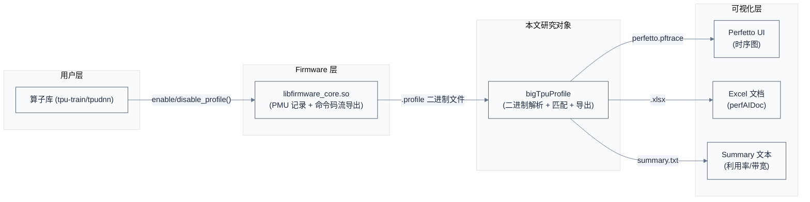
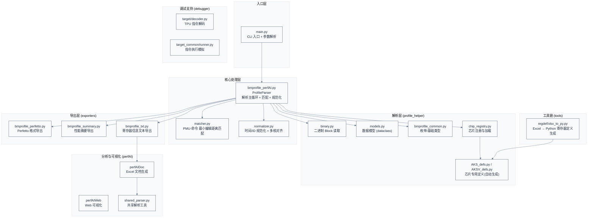
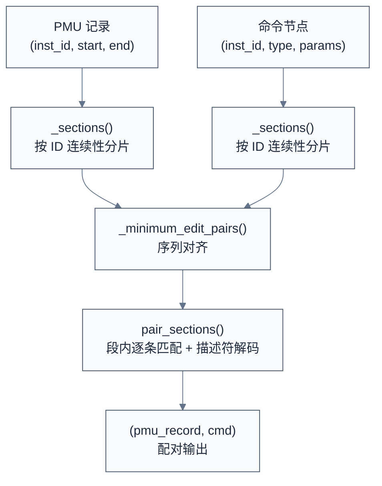

# bigTpuProfile 设计与实现分析

> 本文分析 bigTpuProfile 项目的架构设计、核心数据流与关键实现决策。bigTpuProfile 是 Sophon AKS/AKSV 系列 TPU 芯片的板卡性能 profiling 与可视化工具，将固件导出的原始 PMU 二进制数据解析为 Perfetto 时序图、性能摘要和 Excel 文档。

### 关键术语

| 缩写 | 全称 | 含义 |
|------|------|------|
| PMU | Performance Monitor Unit | 性能监控单元，记录每条指令的起止时间戳 |
| TIU | Tensor Instruction Unit | 张量指令单元（计算引擎） |
| GDMA | General DMA | 通用 DMA 引擎（DDR ↔ L2 搬运） |
| SDMA | System DMA | GDMA 的精简子集（subset），裁减了 matrix/cw_transpose/compress 等 7 条指令仅保留 6 条，无直接 TPU 接口（sync_id 与 gif 接口均不使用） |
| CDMA | Cluster DMA | 片间/片外 DMA 引擎（芯片间数据传输，通过 CMN/DTN 网络互联） |
| BD | BD Engine | TIU 引擎在代码中的内部代号（BD = BDC/Broadcast Descriptor）。SG2260 规格书中统一使用 TIU |
| DES | Descriptor | 双层含义——硬件层面：引擎通过 AXI master 自主从内存抓取指令描述符的模式（与 PIO 相对）；profile 文件层面：预录制的命令码流二进制 block |
| RVT | Runtime Variable Task | 运行时动态任务模式（命令 ID 会回绕，仅 AKSV 支持） |
| TDI | Task Descriptor Immediate | 立即描述符模式（即 PIO 模式——CPU 通过 AXI slave 逐条写入指令） |
| SYS | System Command | 系统同步指令（128-bit），用于 send/wait 消息传递，不产生有效数据搬运或计算 |
| MSG Sync | Message Sync | TIU 与其他加速引擎之间的消息同步机制（灵活但延迟较高，base ID 可外部配置） |
| SyncID Sync | Sync ID Sync | TIU ↔ GDMA 之间的 ID 同步机制（延迟最低） |
| Perfetto | — | Google 开源 trace 可视化工具 |
| AKS/AKSV | — | Sophon 两款 TPU 芯片的内部代号（AKS = SG2260, AKSV = SG2260E） |

---

## 1. 概述

### 1.1 前置知识

| 需要了解 | 参考文档 |
|----------|----------|
| TPU 基本架构（TIU/GDMA/SDMA/CDMA 引擎） | SG2260 TPU 规格书 (§1-§6), GDMA Design Spec (§1-§5) |
| Perfetto trace 格式 | [Perfetto 官方文档](https://perfetto.dev/) |
| Python 二进制解析（struct/ctypes） | — |

### 1.2 项目定位与系统上下文

**项目定位**：bigTpuProfile 是 TPU 软件栈中的**性能可观测性工具**，连接 TPU 固件（firmware）产生的原始 PMU 数据与工程师可读的性能分析输出。它不参与 TPU 运行时计算，而是对已产生的 profile 数据做离线解析和可视化。

**边界**：
- 上游：TPU firmware（`libfirmware_core.so`）在算子执行时通过 PMU 硬件记录时间戳，写入二进制 profile 文件
- 下游：Perfetto UI（浏览器端可视化）、Excel 文档、summary 文本



**硬件架构背景（SG2260 规格书 §1-§6，GDMA 规格书 §1-§5）**：

- **TIU**（SG2260_TPU_SPEC §6.1）：单个 TPU core 内含 64 个 lane（8 组 arrays_with_fab × 8 lane），每个 lane 有 256KB local memory，合计 **16MB LMEM**；另有 **64KB SMEM**（static memory）用于存放 global 数据；**16KB 指令 buffer**（128×1024bit，可存储多达 400 条指令）。TIU 自身不读写外部存储——只能操作 LMEM 和 SMEM 内的数据，对外数据交换依赖 GDMA
- **TIU 指令获取双模式**：**PIO 模式**（MCU 通过 AXI slave 接口逐条写入 dpc_des 寄存器、再存入指令 buffer）和 **DES 模式**（TIU 通过 AXI master 从外部 DDR 读取描述符链、存入指令 buffer）。指令从 buffer 发射时通过 `des_cmd_id_en[0]` 位控制是否等待 SyncID 同步
- **GDMA**（GDMA Design Spec §1-§2）：内部 **3 组 RDMA + 3 组 WDMA**，数据位宽 1024-bit，运行频率 1GHz，**理想满载带宽 128GB/s**（1024 bits × 1GHz ÷ 8 = 128GB/s）。GDMA 为**单线程**，SDMA 为**双线程**。DES 模块内 **PMU buffer 最多缓存 17 条记录**。指令分两类：SYS 系统指令（128-bit，用于同步通信）和数据搬运指令（768-bit）。支持 13 种指令 IP（tensor/matrix/general/cw_transpose/gather/scatter/compress/decompress 等），SDMA 仅保留其中 6 种
- **同步机制**：**MSG 同步**用于 TIU 与其他加速引擎（灵活可扩展，通过 A4S 接口与 MSG Central 通信）；**SyncID 同步**用于 TIU ↔ GDMA（延迟最低）。两种同步在 profile 中均表现为 SYS 命令（send/wait），对应不同的 system code（`bd_sys_code=15`, `dma_sys_code=6`, `cdma_sys_code=7`）
- **PMU 硬件**：TIU 内 `tpu_perf_monitor` 模块（SG2260_TPU_SPEC §6.1.6）实时监测指令 ID 和执行时间；GDMA DES 模块通过 `gdma_monitor_en` 信号使能 PMU 记录。每个 engine 记录 `inst_start_time` 和 `inst_end_time` 到 32-bit 计数器

**软硬件耦合点**：
- **PMU 记录**：硬件在每个 engine 指令执行时自动打时间戳到 32-bit cycle 计数器——profile 工具需要处理 ~4.3 秒（1GHz 下）的回绕
- **命令码流**：firmware 在 CPU 侧同步记录每条命令的编码二进制（BD/DMA descriptor），profile 工具通过 `inst_id` 关联 PMU 时间戳与命令码，解码获得算子类型、带宽等语义信息
- **多核同步**：每个 TPU core 独立运行（各自有独立的 TIU + GDMA + SDMA），固件在 profile session 初始化时插入同步指令作为对齐锚点（`profile_init_cmd_num=2`）

**跨芯片对比**（基于 `AKS_defs.py` 和 `AKSV_defs.py`）：

| 对比维度 | AKS (SG2260) | AKSV (SG2260E) |
|----------|-------------|----------------|
| Core 数 | 8 | 4 |
| CDMA 端口数 | 11 | 10 |
| EngineType 枚举 | BD=0, GDMA=1, HAU=2, SDMA=3, CDMA=4, VSDMA=5 | BD=0, GDMA=1, SDMA=2, CDMA=3, VSDMA=4 |
| 命令 ID 回绕 (RVT) | 不支持 (`rvt_max_id=-1`) | 支持 (`rvt_max_id=0x3FFFF`, wrap cmd: tiu[15,3], dma[6,3]) |
| 系统码 | bd=15, dma=6, cdma=7 | bd=15, dma=6, cdma=7 |
| 寄存器定义 | AKS_defs.py | AKSV_defs.py |

### 1.3 核心设计思想

> **核心要点**：bigTpuProfile 的核心设计是一个"多源数据融合匹配"问题——将 PMU 时间戳流与命令码流按 engine 类型和命令 ID 匹配，再通过多核同步点对齐各 core 的时间轴，最后导出为不同可视化格式。整个过程遵循"解析→匹配→规范化→导出"四阶段流水线。

**为什么需要匹配**：PMU 只记录时间和命令 ID，不记录"这条指令是什么算子、搬运了多少数据"。命令码流记录了算子和参数，但不知道执行时刻。两者必须配对才能得到完整信息——"什么操作，何时开始，耗时多少"。

---

## 2. 整体架构

### 2.1 模块分层



### 2.2 核心数据模型

```python
# 参见 bigTpuProfile/profile_helper/models.py

@dataclass
class ProfileIteration:
    """单个 core 的一次 profile session 的中间数据"""
    dyn_data: dict       # 动态记录（TIU/GDMA/SDMA/CDMA 的命令节点）
    dyn_extra: list      # 详细命令码流（mode 2 时启用）
    monitor_bd: list     # TIU PMU 监控记录
    monitor_gdma: list   # GDMA PMU 监控记录
    monitor_sdma: list   # SDMA PMU 监控记录
    monitor_cdma: list   # CDMA PMU 监控记录
    des_kv: dict         # 描述符 KV 映射（offset → DesCommon）
    des_bdc: list        # BD 命令描述符（bmodel 模式）
    des_gdma: list       # GDMA 命令描述符（bmodel 模式）
    des_sdma: list       # SDMA 命令描述符（bmodel 模式）

@dataclass
class ProfileResult:
    """解析完成后的输出数据结构"""
    archlib: Any           # 芯片 profile 定义模块
    bd_events: list        # TIU 事件列表（每个 core 一组）
    gdma_events: list      # GDMA 事件列表
    sdma_events: list      # SDMA 事件列表
    cdma_events: list      # CDMA 事件列表（每个 port 一组）
    num_cores: int         # 核心数
    input_dir: str         # 输入目录
    tail_offset_ns: int    # CPU/PMU 尾端对齐偏移
    pmu_tail_cycle: int    # PMU 尾端 cycle 值
```

每个事件是一个三元组 `(info, extra, meta)`：
- `info`：引擎通用信息（起止时间、命令 ID、算子类型、带宽等）
- `extra`：命令解码后的额外字段（源/目标地址、stride 等）
- `meta`：元数据（Global Index、Core ID、kernel 函数名等）

---

## 3. 核心数据流：四阶段管线

> 上一章建立了模块分层与数据模型。本章深入到一条 profile 数据从磁盘文件到可视化的完整数据流，重点分析每个阶段的转换逻辑与设计决策。

### 3.1 阶段一：二进制 Block 解析

**输入**：firmware 导出的 `.profile` 二进制文件（如 `cdmlib_core0.profile`、`cdma_0.profile`）。

**输出**：按 BlockType 分类的 `BlockItem` 列表。

**关键设计**：profile 文件采用**自描述的 TLV 结构**（Type-Length-Value），每个 block 由 8 字节头部（4 字节类型 + 4 字节长度）加可变长度内容组成。

```
文件格式:
┌────────────┬──────────┬──────────────────┐
│ BlockType  │  Length  │  Content         │
│  (4 bytes) │ (4 bytes)│  (Length bytes)  │
└────────────┴──────────┴──────────────────┘
... 重复 ...
```

`parse_data_blocks()` 函数（`binary.py:66-94`）顺序读取文件，按 `BlockType` 枚举识别 block 类型：

| BlockType | 值 | 含义 | 内容格式 |
|-----------|-----|------|----------|
| MONITOR_BD | 3 | TIU PMU 记录 | `BDProfileFormat`: inst_start_time(u32), inst_end_time(u32), inst_id(u32), thread_id/bank_conflict(u32) |
| MONITOR_GDMA | 4 | GDMA PMU 记录 | `GDMAProfileFormat`: 32 个 u32 字段，含时间戳、latency、stall 计数器等 |
| MONITOR_SDMA | 11 | SDMA PMU 记录 | 同 `GDMAProfileFormat` |
| MONITOR_CDMA | 12 | CDMA PMU 记录 | `CDMAProfileFormat`: 32 个 u32 字段，含时间戳、replay_number、分阶段计时等 |
| DYN_DATA | 5 | 运行时动态命令记录 | `ProfileFormat` 固定长度结构体数组（混合 NODE_SET/ID_RESET/FUNC/DES_* 等类型） |
| DYN_EXTRA | 6 | 详细命令码流（mode 2） | 嵌套 TLV：`(profile_id, type, length, content)` |
| BLOCK_DES_BDC | 13 | BD 命令描述符（bmodel） | TIU 命令编码二进制，由 `BDCommandParser` 解码 |
| BLOCK_DES_GDMA | 14 | GDMA 命令描述符（bmodel） | DMA 命令编码二进制，由 `GDMACommandParser` 解码 |
| BLOCK_DES_SDMA | 15 | SDMA 命令描述符（bmodel） | 同 GDMA 格式 |
| BLOCK_DES_CDMA | 16 | CDMA 命令描述符（bmodel） | CDMA 命令编码二进制 |
| BLOCK_DES_KV | 17 | 描述符 KV 延迟解码引用 | `(key, cmd_num, id, raw_cmd)`——运行时只记录引用，匹配时按需解码 |

> **核心要点**：BlockType 枚举的设计使得同一文件可以混合 PMU 数据（硬件自动记录）、运行时动态记录（firmware CPU 侧记录）、命令描述符（bmodel 模式下预录制）三种不同性质的数据。firmware 只需按时间顺序追加 block，解析器按类型分发即可。

**为什么 PMU 和命令码流分开存储**：PMU 由硬件自动记录（每个 cycle 写入），命令码流由 firmware 在 CPU 侧记录（开销敏感）。分开存储允许用户选择三种采集模式：

| Mode | 名称 | PMU | 命令类型 | 命令详情 | 性能开销 |
|------|------|-----|----------|----------|----------|
| 0 | PMU Only | ✓ | ✗ | ✗ | 最小 |
| 1 | 精简 CMD | ✓ | ✓（类型码） | ✗ | ~4% |
| 2 | 详细 CMD | ✓ | ✓（类型码） | ✓（完整寄存器码流） | 7-10% |

> **核心要点**：注意 profile 文件中的"DES Block"（`BLOCK_DES_*`，预录制在文件中的命令码流）与硬件层面的"DES 模式"（引擎通过 AXI master 自主从 DDR 抓取描述符）是两个不同概念。前者是 profile 数据存储方式（用于 bmodel 模式），后者是硬件指令获取方式。在算子级 profile（tpu-train/tpudnn）中，命令码通过 `DYN_DATA` 或 `DYN_EXTRA` block 记录，而非 `BLOCK_DES_*`。

### 3.2 阶段二：动态数据记录解析

**输入**：`DYN_DATA` block 的原始字节。

**输出**：按 engine 分类的命令节点列表（`tiu[]`, `gdma[]`, `sdma[]`, `cdma[][]`）。

**关键设计**：`DYN_DATA` 中的 fixed-length items（由 `ProfileFormat` 定义）是一个混合序列——它包含引擎命令节点（NODE_SET）、ID 重置标记（ID_RESET）、函数作用域标记（FUNC/FUNC_END）、batch 标记（BATCH_IDX）、以及描述符引用（DES_TIU/DES_GDMA 等）。解析器需要根据 `DynRecordType` 枚举区分不同类型的记录。

`__parse_dyn_data()` 方法（`bmprofile_perfAI.py:273-408`）的核心逻辑：

1. 遍历所有 fixed-length items
2. 根据 `DynRecordType` 分发：
   - `NODE_SET` / `RVT_NODE_SET`：按 `EngineType` 追加到对应 engine 的命令列表，同时关联当前生效的 `func_name`、`batch_idx`、`func_scope_id`
   - `ID_RESET`：将对应 engine 的命令 ID 计数器归零（支持命令 ID 回绕）
   - `FUNC`：解析函数名字符串，开启新的 `func_scope_id`
   - `FUNC_END`：关闭当前函数作用域
3. 维护 `pio_tiu_cmd_id` / `pio_gdma_cmd_id` 等自增计数器，为每条命令分配唯一的 `inst_id`

> **核心要点**：`inst_id` 是 PMU 与命令码流之间**唯一的关联键**。解析器必须保证 `inst_id` 的分配与 firmware 侧一致，否则匹配阶段会产生错位。

**RVT 命令 ID 回绕处理**（仅 AKSV）：当 TIU 命令 ID 达到 `command_id_wrap_max`（0x3FFFF）时，firmware 会插入一对 wrap 命令（tiu_wrap_command: type=15, eu=3; dma_wrap_command: type=6, eu=3）重置 ID 计数。解析器检测到 RVT_NODE_SET 且满足回绕条件时，插入 `FixedItemWrapper` 作为占位标记，然后将 `pio_cmd_id` 归零。

### 3.3 阶段三：PMU-命令码流匹配

这是整个 pipeline 中最关键也最复杂的阶段。

**输入**：
- 每 core 的 PMU 记录（`monitor_bd[]`, `monitor_gdma[]`, `monitor_sdma[]`）
- 每 core 的命令节点列表（`dyn_data["tiu"][]` 等）
- 可选的描述符 KV 映射 + 命令解析器

**输出**：配对的 `(pmu_record, parsed_command)` 列表，存储在各 engine 的 `pairs` 列表中。

**匹配算法**（`matcher.py`）：

1. **分片（Sectioning）**：`_sections()` 函数将 PMU 记录和命令节点各自切分为"逻辑连续段"——在命令 ID 回绕处或描述符边界处断开。每个 section 保存 `[id_range, indices]`。

2. **系统命令标记**：PMU 记录中可能存在系统指令（syn/wait），通过 `is_system_monitor()` 检测并在 section 中标记。

3. **最小编辑距离匹配**：`_minimum_edit_pairs()` 函数对 PMU sections 和命令 sections 做序列对齐——以求最小编辑距离的方式找到最优配对（允许删除/插入/替换，代价分别为 1/1/2）。

4. **段内逐条匹配**：对每个匹配的 section pair，用 `inst_id` 的偏移量将 PMU 记录与对应的命令码做关联——即 `pmu_record.cmd = commands[pmu_record.inst_id - section_start_id]`。

5. **描述符延迟解码**：对于 DES 模式（命令码流以引用方式存储在 `des_kv` 中），在匹配时通过 `command_parser` 即时解码命令。



**为什么用最小编辑距离而非简单 ID 对位**：因为 PMU 记录可能包含系统指令（syn/wait/nop），这些指令不出现在命令码流中。同时，固件可能多记录或少记录某些命令（采集模式不同）。最小编辑距离能容忍这种插入/删除。

**为什么有 DES 和 TDI 两种模式**（`matcher.py:231-248`）：在硬件层面，TIU 指令获取有两种模式——**PIO**（MCU 通过 AXI slave 逐条写入指令寄存器）和 **DES**（TIU 通过 AXI master 从 DDR 抓取描述符链）。在 profile 数据层面，代码中 `DynRecordType` 区分三种指令来源标记：

| DynRecordType | 来源 | 含义 |
|---------------|------|------|
| `NODE_SET` | firmware CPU 侧逐条记录 | 对应硬件 PIO/TDI 模式，命令参数记录在 `extra_info` 字段中 |
| `RVT_NODE_SET` | firmware 记录（RVT 模式） | 同上但命令 ID 支持回绕 |
| `DES_TIU` / `DES_GDMA` 等 | firmware 按描述符块记录 | 命令码流以引用方式存储（通过 `des_kv` 映射按 `(offset, cmd_num)` 索引），匹配时通过 `command_parser` 延迟解码——减少 profile 数据体积，但增加匹配开销 |

`pair_sections()` 在处理 DES 类型的 command 时，通过 `descriptor_map.get(descriptor.offset).get(descriptor.cmd_num)` 定位到对应的命令码块，再调用 `command_parser.parse()` 即时解码。这种"延迟解码"设计避免了在 profile 文件中存储完整命令码（768-bit 的 DMA 指令），只需存储索引即可。

### 3.4 阶段四：规范化与对齐

**输入**：各 engine 的 PMU-命令 pair 列表。

**输出**：时间归一化、多核时间轴对齐、去除系统命令后的干净数据。

规范化操作（`normalizer.py`）按顺序执行：

1. **normalize_command_ids**：处理 16-bit 命令 ID 的溢出回绕（当 ID 从 65000+ 跳变到 <1000 时，加上 2^16 偏移）

2. **normalize_time**：处理 32-bit 时间戳的溢出回绕（当 `start_time` 倒退时，加上 2^32）

3. **adjust_send_retire_order**：修正 SDMA/CDMA 中 send/wait 记录的顺序错位（硬件可能乱序写入 PMU）

4. **normalize_cdma_time**：CDMA 专用时间戳回绕处理（与普通 normalize_time 逻辑不同——CDMA 的 start 和 end 需要同时判断回绕）

5. **adjust_command_order**：修正相邻命令 ID 顺序错位（swap 前后两条记录）

6. **align_core_time**：以 core 0 的同步点为基准，将所有 core 的 PMU 时间戳平移到同一时间轴

7. **shift_time_to_zero**：将所有时间戳减去全局最小值，使 trace 从 0 开始

8. **omit_system_commands**：移除起止位置的 syn/wait 系统命令（这些命令不产生有效计算/搬运，但会干扰利用率统计）


> **核心要点**：时间戳回绕处理是整个 pipeline 正确性的基础——PMU 硬件使用 32-bit 计数器记录 cycle 数，在 1GHz TIU 频率下每 ~4.3 秒回绕一次。如果处理不当，会导致时间轴出现巨大负跳变，所有后续统计失真。

**多核同步对齐机制**：firmware 在每个 core 的 profile session 开始时插入初始化命令（`profile_init_cmd_num = 2`），最后一个初始化命令（通常是 syn/wait）的 `inst_end_time` 作为该 core 的同步点。所有 core 以 core 0 的同步点为基准平移：

```python
# normalizer.py:98-139, 简化逻辑
base_cycle = sync_points[0]
for core_id in range(num_cores):
    delta_cycle = sync_points[core_id] - base_cycle
    for record in bd_pair + gdma_pair:
        record.inst_start_time -= delta_cycle
        record.inst_end_time -= delta_cycle
```

---

## 4. 导出层设计

> 上一章完成了从二进制到结构化数据的转换。本章讲结构化数据如何呈现给用户——三种导出格式各自服务不同的分析场景。

### 4.1 Perfetto 导出

`PerfettoExporter`（`bmprofile_perfetto.py`）将 profile 数据转换为 [Perfetto trace](https://perfetto.dev/) 格式（`.pftrace` 文件）。

**设计要点**：

- **Track 层级**：使用 `TrackDescriptor` 的 `parent_uuid` 属性建立三级树形结构：`Core N → {TIU, GDMA, Kernel Function, TIU Utilization(counter), GDMA Bandwidth(counter)}`，以及独立的 `CDMA → {Port 0, Port 1, ...}`
- **Slice 事件**：每条 PMU 记录映射为一个 `TYPE_SLICE_BEGIN`/`TYPE_SLICE_END` 事件对，携带 `debug_annotations`（算子类型、带宽、命令 ID 等元数据）
- **Counter 事件**：为 TIU 利用率和 GDMA 带宽提供连续的时间序列（每个 slice 开始设值，结束归零），在 Perfetto 中以 counter track 渲染
- **Kernel Function 概览**：同一 `func_scope_id` 或 `(kernel_func, batch_launch)` 的多个 slice 合并为一个汇总区间，方便从算子层快速定位有问题的 kernel
- **Host-TPU 时间对齐**：通过 `--trace_file` 参数合并外部 CPU trace（如 `tpudnn` 的 Chrome Tracing JSON），利用 `tail_offset_ns`（firmware 记录的 disable_profile 到 PMU 尾端的 CPU 时间差）将 CPU 时间与 TPU PMU cycle 对齐

```python
# bmprofile_perfetto.py:260-267, 时间对齐简化逻辑
pmu_relative_time = (
    pmu_tail_anchor_ns
    - get_realtime_from_cycle(p.pmu_tail_cycle - min_start_cycle, tiu_freq)
)
# pmu_relative_time 是所有 PMU cycle 转纳秒后的基准偏移
```

**为什么用 nanosecond 时间戳而非 cycle**：Perfetto 的时序模型基于纳秒。转换公式：

$$t_{ns} = \frac{cycle}{frequency_{MHz}} \times 1000$$

`get_realtime_from_cycle()` 精确到小数点后两位，以纳秒精度存储。

### 4.2 Summary 导出

`SummaryExporter`（`bmprofile_summary.py`）生成每个 core 的综合性能统计并打印到控制台，同时写入 `summary.txt`。

**统计指标**：

| 指标 | 说明 | 计算方式 |
|------|------|----------|
| TIU 有效时间 | TIU 实际计算时间（排除 syn/wait） | Σ TIU slice duration |
| GDMA 有效时间 | GDMA 搬运时间（排除 syn/wait） | Σ GDMA slice duration |
| SDMA 有效时间 | SDMA 搬运时间 | Σ SDMA slice duration |
| 并行率 | 计算与搬运的时间重叠程度 | (TIU_time + GDMA_time + SDMA_time) / total_time (单核改用 TIU+GDMA) |
| uArch Rate | 算法操作数 / 微架构操作数 | Σ Alg Ops / Σ uArch Ops |
| DDR 带宽 | DDR 读写速率 | DDR_datasize / DDR_cycle × frequency |
| L2 带宽 | L2 SRAM 读写速率 | L2_datasize / L2_cycle × frequency |

**为什么 Overall 行用 max 而非 sum**：每个 core 的时间是并行的——profile 总时间由最慢的 core 决定（max(end_cycle) - min(start_cycle)），所以 Overall row 的 TIU/GDMA/SDMA cycle 取所有 core 的最大值。

### 4.3 Doc 导出（PerfAI）

当 `--enable_doc` 选项开启时，先通过 `TxtExporter` 将结构化数据展开为文本格式的中间文件（`tiuRegInfo_*.txt` / `tdmaRegInfo_*.txt` / `cdmaRegInfo_*.txt`），再调用 `perfAIDoc/run_doc.py` 解析这些文本文件生成 Excel。

**为什么用文本中间文件而非直接传内存数据**：TxtExporter 和 perfAIDoc 是两个独立子系统——TxtExporter 属于新架构（直接从 ProfileResult 导出），perfAIDoc 最初是为文本格式的 RegInfo 设计的。通过文本文件解耦允许两者独立演进。

---

## 5. 芯片适配架构

> 上一章讲了数据如何呈现。本章讲工具如何适配不同芯片——通过插件化架构将芯片差异隔离在定义文件层面。

### 5.1 芯片注册表

`chip_registry.py` 实现了运行时动态加载芯片定义模块的机制：

```python
# chip_registry.py 核心结构
CHIP_SPECS = (
    ChipProfileSpec(name="AKS",  arch_values=(5, 8800), profile_module="AKS_defs", ...),
    ChipProfileSpec(name="AKSV", arch_values=(6, 140814), profile_module="AKSV_defs", ...),
)

def load_chip_profile(arch) -> ChipProfile:
    spec = get_chip_spec_by_arch(arch)
    module = import_module(f"{__package__}.{spec.profile_module}")
    return ChipProfile(spec, module)
```

**设计决策**：每个芯片的 profile 定义模块必须实现 `REQUIRED_PROFILE_API` 中列出的 21 个接口（`arch_name`, `CORE_NUM`, `BDProfileFormat`, `get_dma_info`, `bd_sys_code` 等）。`ChipProfile` 包装类在初始化时做接口校验（`_validate()`），缺失接口立即报错，避免运行时发现。

**为什么用 import_module 动态加载而非条件 import**：支持未来在运行时根据 `global.profile` 文件中的 `arch` 字段自动选择芯片，无需修改代码。新增芯片只需添加一个 `ChipProfileSpec` 条目和对应的 `*_defs.py` 模块。

### 5.2 芯片定义文件结构

每个 `*_defs.py` 模块（如 `AKS_defs.py`）包含：

| 类别 | 内容 | 示例 |
|------|------|------|
| 常量 | 核心数、端口数、频率、系统码 | `CORE_NUM=8`, `CDMA_NUM=11`, `BD_FREQ=1000`, `BYTE_PER_BEAT=128`, `bd_sys_code=15` |
| 枚举 | 记录类型、引擎类型 | `DynRecordType`, `EngineType` |
| 格式结构 | PMU 记录格式（ctypes.Structure） | `BDProfileFormat`, `GDMAProfileFormat`, `CDMAProfileFormat`, `GDMACmdFormat`, `ProfileFormat` |
| 解析器 | 命令解码器 | `BDCommandParser`, `GDMACommandParser`, `CDMACommandParser` |
| 信息提取 | 算子类型、带宽等 | `get_tiu_info()`, `get_dma_info()` |
| 动态备用 | 无命令码时的降级信息 | `get_tiu_info_dyn()`, `get_dma_info_dyn()` |

> **核心要点**：AKS 和 AKSV 的 `EngineType` 枚举值不同——AKS 为 `BD=0, GDMA=1, HAU=2, SDMA=3, CDMA=4, VSDMA=5`，而 AKSV 删除了 HAU（=2），使得 `SDMA=2, CDMA=3, VSDMA=4`。这意味着相同的 PMU record 中的 engine 字段在不同芯片上可能对应不同的引擎类型，解析时必须根据 `archlib.EngineType` 做芯片特定映射。

### 5.3 寄存器定义自动生成

`tools/regdef/` 目录包含一个代码生成工具，从芯片设计团队提供的 Excel 规格书自动生成 `regdef_*.py` 文件：

```bash
python3 tools/regdef/xlsx_to_py.py \
  --chip AKSV \
  --tiu-xlsx refer/aksv/SG2260E_TPU_TIU_Reg1.0.xlsx \
  --dma-xlsx refer/aksv/GDMA_SG2260E_DES_REG.xlsx \
  --cdma-xlsx refer/aksv/CDMA_2260E_DES_REG_v6.4.xlsx \
  --output bigTpuProfile/debugger/target/regdef_aksv.py
```

**设计动机**：TPU 寄存器定义由硬件团队维护在 Excel 中，字段数量庞大（数百到上千个 bit field）。手动编写 Python ctypes 结构体不仅繁琐，且 Excel 更新时容易遗漏。代码生成保证了寄存器定义与硬件规格书的同步。

---

## 6. debugger 模块：指令级支持

> 上一章讲了芯片适配的宏观架构。本章简要介绍 debugger 模块——它虽然不直接参与 profile 解析，但提供了命令码解码所需的基础设施。

debugger 模块提供 TPU 指令的**解码和执行模拟**能力：

- `target_common/decoder.py`：`DecoderBase` 抽象基类，定义了位域解码的通用逻辑
- `target_common/runner.py`：`Runner` / `CModelRunner` / `DeviceRunner`，定义了 TPU 计算的执行模型（支持 C 模型模拟和真实硬件两种模式）
- `target_common/op_support.py`：操作数类型定义（`MemRefBase`, `Value`, `CmdType` 等）
- `target/decoder.py`：AKS 家族的具体解码器——通过命令头部（TiuHead/DmaHead）的 `tsk_typ`/`tsk_eu_typ` 或 `cmd_type`/`cmd_sp_func` 字段查表定位到具体的操作结构体
- `target/opdef.py`：操作定义索引（`tiu_index`, `dma_index`）——头部到操作类的映射表
- `target/regdef.py`：从 Excel 生成的寄存器结构体定义
- `target/opparam.py`：操作参数字段定义
- `target/multi_core.py`：多核支持

profile 解析时使用 debugger 的**解码能力**（而非执行能力）：当需要从命令码流中获得算子的具体参数（数据类型、矩阵维度、DMA 方向等）时，`BDCommandParser` / `GDMACommandParser` 调用 `Decoder.decode_*_cmd()` 将二进制反序列化为结构化数据。

---

## 7. 使用场景与数据流总结

### 7.1 两种采集路径

**算子级路径**（tpu-train / tpu-dnn）：用户在算子调用前后手动控制 `enable_profile(mode)` / `disable_profile()`。固件在每个 core 上独立启用 PMU，CPU 侧同步记录 `DYN_DATA`（命令类型码）和可选的 `DYN_EXTRA`（详细码流）。输出为 `cdmlib_core{N}.profile`（N = 0...CORE_NUM-1）和 `cdma_{port}.profile`。通过 `bigTpuProfile` 命令行工具解析。

**bmodel (全模型) 路径**：通过环境变量 `ENABLE_ALL_PROFILE=1` 启动，固件自动记录整个模型推理过程（不再依赖用户在算子边界手动插桩）。命令描述符以预录制 block 形式嵌入 profile 文件（`BLOCK_DES_BDC`/`BLOCK_DES_GDMA`/`BLOCK_DES_SDMA`/`BLOCK_DES_CDMA`/`BLOCK_DES_KV`），解析时通过 `des_kv` 映射 + `CommandParser` 按需解码。此模式下无须 `DYN_DATA` 动态命令记录。

### 7.2 完整数据流

```
                      Firmware 侧 (SG2260)               │           Host 侧 (bigTpuProfile)
                                                        │
  TIU 指令 buffer (128×1024bit, 可达400条)                │
  ├── PIO 模式: MCU → AXI slave → dpc_des → buffer       │
  └── DES 模式: TIU AXI master → DDR → buffer             │
                                                        │
  sync_id wire: TIU ← [23:0] → GDMA (SyncID 同步)        │
  MSG sync: 通过 A4S 接口与 MSG Central 通信              │
                                                        │
  PMU 记录 (硬件自动, 32-bit cycle 计数器)                 │
  ├── SYS 命令 (128-bit, syn/wait, 不产生数据搬运)         │
  └── 数据命令 (768-bit, tensor/matrix/conv/compress...)  │
                                                        │
  [DYN_DATA: NODE_SET/DES_*/FUNC/BATCH_IDX]              │
  [DYN_EXTRA: 完整寄存器码流 (mode 2)]                     │
                    ↓                                    │
             写入 .profile TLV 文件                       │
                    ↓                                    │
                                                        │   1. parse_data_blocks() → BlockItem[]
                                                        │   2. parse_fixed_length_items() → PMU records
                                                        │   3. parse_fixed_length_items() → DYN_DATA nodes
                                                        │   4. parse_dyn_extra() → 详细命令码 (可选)
                                                        │   5. parse (via BD/GDMA/CDMA CommandParser) → 结构化命令
                                                        │   6. match_sections() → (pmu_record, cmd) pairs
                                                        │   7. normalize_*() → 规范化时间 & 对齐
                                                        │   8. omit_system_commands() → 过滤 SYS 指令
                                                        │   9. __get_engine_info() → (info, extra, meta) 三元组
                                                        │   10. PerfettoExporter / SummaryExporter / Doc
                    ↓                                    │
          Perfetto 时序图 / Summary 文本 / Excel 文档
```

### 7.3 输出产物

| 产物 | 路径 | 说明 |
|------|------|------|
| Perfetto trace | `output_dir/perfetto.pftrace` | 拖入 [ui.perfetto.dev](https://ui.perfetto.dev) 查看 |
| Summary | `output_dir/summary.txt` | 每核 TIU/GDMA/SDMA/CDMA 利用率与带宽 |
| Excel 文档 | `output_dir/PerfDoc/*.xlsx` | 寄存器级详细信息（需 `--enable_doc`） |
| RegInfo 文本 | `output_dir/tiuRegInfo_*.txt` 等 | 中间格式（`--enable_doc` 时产生） |

---

## 8. 关键设计决策回顾

1. **多源数据融合匹配**：PMU 时间戳（硬件自动记录）与命令码流（firmware CPU 侧记录）是两个独立的记录通道，通过 `inst_id` 关联。匹配使用最小编辑距离算法——因为 PMU 记录可能包含 SYS 系统指令（128-bit syn/wait），这些指令不出现在数据命令码流（768-bit）中。SG2260 硬件支持两种同步机制——MSG 同步（TIU ↔ 其他引擎，灵活可扩展）和 SyncID 同步（TIU ↔ GDMA，最低延迟），在 profile 中均表现为 SYS 指令（system code: bd=15, dma=6, cdma=7）。

2. **TLV 文件格式**：profile 文件采用 Type-Length-Value 块结构（8 字节头部：4 字节类型 + 4 字节长度），允许在同一文件中混合 PMU 数据（MONITOR_BD/GDMA/SDMA/CDMA）、运行时动态记录（DYN_DATA/DYN_EXTRA）、命令描述符（BLOCK_DES_BDC/GDMA/SDMA/CDMA/KV）三种性质不同的数据。设计上支持向后兼容——新增 BlockType 不会破坏旧解析器。

3. **分层归一化**：时间戳处理分为 8 个独立步骤——每个步骤只做一件事，出问题时可以精确定位到具体步骤。这种设计源于实际的硬件行为：32-bit PMU 计数器在 1GHz 下每 ~4.3 秒回绕一次；SDMA/CDMA 的 send/wait 记录可能因硬件流水线乱序到达；CDMA 的 start 和 end 需要独立判断回绕（不同于普通 normalize_time）。

4. **芯片插件化**：通过 `chip_registry.py` 的运行时动态加载机制，新增芯片只需提供符合 21 项 `REQUIRED_PROFILE_API` 的 `*_defs.py` 模块。两个芯片的 EngineType 枚举值不同（AKS 有 HAU=2，AKSV 无），解析时必须通过 `archlib.EngineType` 做芯片特定映射。寄存器定义通过 `tools/regdef/` 代码生成工具从 Excel 规格书自动产生，消除手动维护 ctypes 结构体的出错风险。

5. **三模采集（渐进式开销）**：Mode 0 (PMU only, 开销最小)、Mode 1 (精简 cmd, ~4% 开销)、Mode 2 (详细 cmd, 7-10% 开销)。三种模式的选择取决于分析需求——只看时间线用 mode 0，需要区分算子类型用 mode 1，需要完整寄存器字段做深度分析用 mode 2。GDMA DES 模块的 PMU buffer 仅缓存 17 条记录（GDMA Design Spec §5.2.1），这也是 firmware 需要配合 CPU 侧记录的原因。

6. **多输出格式**：Perfetto trace（可视化时序，支持 SQL 查询）、Summary 文本（快速诊断利用率/带宽）、Excel 文档（perfAIDoc，寄存器级详细信息）三种输出共享同一套解析管线。Perfetto 导出将所有 engine 的时间统一用 TIU 频率（1GHz）转换为纳秒（与 Summary 中 TIU/DMA 分别用各自频率不同，但因两者均为 1GHz 故实际一致）。

7. **延迟解码策略**：profile 工具不存储完整命令码（每条 GDMA 指令 768-bit），而是只记录 `(offset, cmd_num)` 引用和原始码流块。匹配时通过 `des_kv` 映射按需调用 `command_parser.parse()` 解码。这种设计大幅减少了 profile 文件的存储开销，代价是在匹配阶段引入额外的解码计算。

---

## 官方文档索引

- [SG2260 TPU 规格书 v1.1](./ref/SG2260_TPU_SPEC_v1.1.docx) — 参考了 §1 Architecture Overview（总体架构、64 lane 组织）、§3 Functional Description（PIO/DES 模式、时钟复位）、§6 Internal Blocks（TIU/dpcmd/eu_cmd/arrays/pmu 子模块）
- [GDMA Design Spec](./ref/GDMA%20Design%20spec.docx) — 参考了 §1 Overview（GDMA/SDMA 指令差异表、DES/PMU 特性）、§2 Architecture（3 RDMA + 3 WDMA、128GB/s 带宽、DES 模块 PMU buffer 17 条）、§5 Internal Blocks（sys_ctrl/matrix/cw_transpose/compress 等指令 IP 架构）
- [Perfetto Trace Processor](https://perfetto.dev/docs/) — 参考了 trace 格式定义与 SQL 查询语法

## 参考资料

- [bigTpuProfile README](./bigTpuProfile/README.md) — 项目使用说明
- [bigTpuProfile README_EN](./bigTpuProfile/README_EN.md) — 英文版说明
- [profile_helper README](./bigTpuProfile/bigTpuProfile/profile_helper/README.md) — profile_helper 模块说明
- [regdef README](./bigTpuProfile/tools/regdef/README.md) — 寄存器定义生成工具说明
- [SG2260 TPU 寄存器规格书 (Excel)](./bigTpuProfile/refer/aks/) — AKS TIU/GDMA/CDMA 寄存器字段定义
- [SG2260E TPU 寄存器规格书 (Excel)](./bigTpuProfile/refer/aksv/) — AKSV TIU/GDMA/CDMA 寄存器字段定义

---

## 附录 A：Firmware 侧 Profile 数据生成（TPU1686 源码分析）

> 本章从 Firmware/Runtime 侧源码出发，分析 `.profile` 二进制文件的生成过程——从 tpudnn 的 `enableProfile()` 调用到 PMU 数据写入磁盘的完整链路。源码位于 `/home/pbw/2260_clean/TPU1686/`。

### A.1 整体调用链

```
tpudnnEnableProfile()                           # tensor/profile.cpp
  └── TPUDNNInterface::enableProfile()           # 虚接口
        └── Profile1690::enable()                # profile.h (模板类)
              ├── 分配 DMA buffer                 # malloc PMU 空间
              ├── setPmuParam()                  # 向 firmware 注册 PMU 物理地址
              └── setProfile(true, false)        # 启动 PMU 记录
                    
... 用户算子执行 ...

tpudnnDisableProfile()                          # tensor/profile.cpp
  └── Profile1690::disable()                    # profile.h:620-663
        ├── stream.sync()                        # 等待所有 TPU 指令完成
        ├── setProfile(false, true)              # 暂停 PMU 记录
        ├── stream.sync()                        # 确保暂停生效
        ├── clock_gettime() 记录 pause_sync_ts   # 锚定 CPU 时间
        ├── getProfileData()                     # 收集 PMU + 命令数据
        │     ├── 写 global.profile (arch, max_record_num, tail_offset_ns)
        │     ├── 读取 CDMA PMU → cdma_{port}.profile
        │     ├── 读取 TIU/GDMA/SDMA PMU → cdmlib0_{core}.profile
        │     └── 读取 MCU 动态数据 (DYN_DATA/DYN_EXTRA/DES_KV)
        ├── setProfile(false, false)             # 关闭 PMU
        └── clock_gettime() 记录 disable_end_ts
              → tail_offset_ns = disable_end_ts - pause_sync_ts
```

**关键文件**：
| 文件 | 模块 | 职责 |
|------|------|------|
| `tpuDNN/src/tensor/profile.cpp` | tpudnn C API | `tpudnnEnableProfile()` / `tpudnnDisableProfile()` |
| `tpuDNN/src/profile.h` | 核心 Profile 引擎 | `Profile1690` 模板类：PMU/DMA 管理、数据收集、文件写出 |
| `tpuDNN/src/arch/sg2260.h` | 芯片配置 | PMU 结构体定义、BlockType 常量、CoreNum/CDMANum、PMU 地址布局 |
| `tpuDNN/src/graph/profile_decorator.cpp` | 图模式装饰器 | DES 命令缓存注册，graph capture 支持 |
| `tpuDNN/src/launch.h` | 启动策略 | `LaunchPolicy::enableProfile()`——将 profile 注入加速器 |
| `tpuDNN/src/optimer.h/cpp` | CPU 侧计时 | `OpTimer` 单例，记录每个 kernel 的 CPU 端耗时 |

### A.2 Profile1690 模板类设计

`Profile1690`（`tpuDNN/src/profile.h:154-669`）是 profile 数据的**生产者**。它是一个 C++ 模板类，参数化在 `TPUDNNDevice`（设备抽象）和 `DeviceConfig`（芯片配置）上，使得同一代码可适配 SG2260/SG2260E/其他芯片。

**核心状态**：

```cpp
// profile.h:170-190, 简化
bool mProfileEnabled;           // profile 是否已启用
int mMode;                      // 0=PMU only, 1=精简cmd, 2=详细cmd
uint32_t mRecordNum;            // max_record_num
// PMU 物理地址（每 core 一个，设备侧 DMA 空间）
std::vector<uint64_t> mTiuPhysAddr;   // [CoreNum] 个
std::vector<uint64_t> mGdmaPhysAddr;  // [CoreNum] 个
std::vector<uint64_t> mSdmaPhysAddr;  // [CoreNum] 个
std::vector<uint64_t> mCdmaPhysAddr;  // [CDMA_ports] 个
// PMU buffer 大小
uint64_t mTiuSize;     // = mRecordNum × sizeof(tiu_pmu_item_t)
uint64_t mGdmaSize;    // = mRecordNum × sizeof(gdma_pmu_item_t)
//...
// DES 命令缓存
std::unordered_map<uint32_t, std::set<uint32_t>> mDesCmds;  // offset → {cmd_num}
std::unordered_map<uint32_t, std::set<CmdCache>> mCaches;   // offset → {cmds}
```

**PMU 物理地址布局**（`sg2260.h:24-62`）：

```
TPU 设备地址空间布局（SG2260）:
  [0x000_0000 - 0x0FF_FFFF]  0-16MB       Runtime 保留
  [0x100_0000 - 0x23F_FFFF]  16-36MB      GDMA PMU (20MB)
  [0x240_0000 - 0x4BF_FFFF]  36-76MB      TIU PMU  (40MB)
  [0x4C0_0000 - 0x5FF_FFFF]  76-96MB      SDMA PMU (20MB)
  Core offset: 136MB per core (PMUCoreOffset)
  CDMA PMU: 5MB per port, 独立管理

PMU item 大小:
  tiu_pmu_item_t  = 16 bytes (4 × u32)
  gdma_pmu_item_t = 16 × 4 = 64 bytes
  sdma_pmu_item_t = 16 × 4 = 64 bytes  
  cdma_pmu_item_t = 32 × 4 = 128 bytes
```

**PMU 结构体定义**（与 `bigTpuProfile` 中的 `*ProfileFormat` 一一对应）：

```cpp
// sg2260.h:72-79 —— 对应 bigTpuProfile 的 BDProfileFormat
typedef struct {
    unsigned int inst_start_time;           // u32: 指令开始 cycle
    unsigned int inst_end_time;            // u32: 指令结束 cycle
    unsigned int inst_id;                  // u32: 命令 ID
    unsigned int thread_id_and_bank_conflict; // bit0: thread_id, bit31-1: bank_conflict
} tiu_pmu_item_t;

// sg2260.h:81-104 —— 对应 GDMAProfileFormat (16 个 u32 字段)
typedef struct {
    // H0: 时间 + 延迟
    unsigned int inst_start_time, inst_end_time, inst_id;
    uint32_t thread_id:1; uint32_t ar_latency_cnt:19; uint32_t rip_valid_latency:12;
    // H1-H3: AXI/GIF 读写计数器和 stall 计数器
    unsigned int gif_wr_rd_stall_cntr, axi_d0_w_cntr, axi_d0_ar_cntr, axi_d0_aw_cntr;
    // ...
} gdma_pmu_item_t;
```

> **核心要点**：PMU 结构体的字段布局在两个代码库（TPU1686 C 头文件 和 bigTpuProfile Python ctypes）之间必须严格一致。`sg2260.h:42-56` 中的 BlockType 枚举值（`BLOCK_MONITOR_BDC=3`, `BLOCK_MONITOR_GDMA=4`, `BLOCK_DYN_DATA=5`...）与 `bmprofile_common.py` 的 `BlockType` 枚举值完全对应——这是 profile 文件可被正确解析的契约基础。

### A.3 enable() 流程详解

`Profile1690::enable(record_num, mode)`（`profile.h:512-619`）：

1. **确定 CDMA 端口**（`profile.h:517-576`）：多芯片互联时通过 `tpuRtGetTopologyV2()` 获取拓扑，记录实际使用的 CDMA port。单芯片场景 `mCdmaPorts` 为空（不启用 CDMA PMU）
2. **分配 PMU DMA buffer**（`profile.h:586-594`）：按 `mRecordNum × pmu_item_size` 计算每个 engine 的 buffer 大小，在设备侧分配 DMA 内存，记录物理地址：
   - `mTiuPhysAddr[CoreNum]`：每个 core 的 TIU PMU 空间
   - `mGdmaPhysAddr[CoreNum]`：每个 core 的 GDMA PMU 空间
   - `mSdmaPhysAddr[CoreNum]`：每个 core 的 SDMA PMU 空间
   - `mCdmaPhysAddr[ports]`：每个 CDMA port 的 PMU 空间
3. **设置 PMU 参数**（`setPmuParam()`, `profile.h:201-236`）：通过 firmware kernel `sg_api_set_engine_profile_param` 将 PMU buffer 的物理地址和大小告知硬件
4. **启动 PMU**（`setProfile(true, false)`, `profile.h:238-254`）：通过 firmware kernel `sg_api_set_profile` 写入 enable bits：
   ```cpp
   enable_bits |= 1 << PROFILE_ENGINE_TGS;   // TIU + GDMA + SDMA
   enable_bits |= 1 << PROFILE_ENGINE_CDMA;  // CDMA
   if (mode == 1)
       enable_bits |= 1 << PROFILE_ENGINE_MCU;      // 精简 CMD
   else if (mode == 2)
       enable_bits |= 1 << (PROFILE_ENGINE_MCU + 1); // 详细 CMD
   ```
5. **创建输出目录**：`cdm_profile_data_dev{DeviceID}-{ProfileId}/`

### A.4 disable() 流程详解

`Profile1690::disable()`（`profile.h:620-663`）是数据收集的核心：

1. **同步**：`stream.sync()` 等待所有 pending TPU 指令完成
2. **暂停 PMU**：`setProfile(false, true)`（enable=false, pause=true）
3. **再次同步**：`stream.sync()` 确保暂停生效
4. **记录 CPU 锚点时间**：`clock_gettime(CLOCK_MONOTONIC, &profile_pause_sync_ts)`——这是 CPU/TPU 时间对齐的关键
5. **收集数据**（`getProfileData()`）：
   - **写 global.profile**：`arch=0x2260`, `max_record_num`, `tail_offset_ns`（在步骤 8 中追加写入）
   - **CDMA PMU**：每个 port 写独立文件 `cdma_{port}.profile`
   - **每 core PMU**：`cdmlib0_{core}.profile` 文件，按 TIU→GDMA→SDMA 顺序写入 `BLOCK_MONITOR_BDC/4/11`
   - **MCU 动态数据**：`BLOCK_DYN_DATA`（精简/详细命令记录）、`BLOCK_DYN_EXTRA`（mode 2 详细码流）
   - **DES 命令缓存**：`BLOCK_DES_KV`（从 `CommandProfileRegister` 注册的 descriptor→command 映射）
6. **关闭 PMU**：`setProfile(false, false)`
7. **释放 DMA buffer**：按 CDMA→SDMA→GDMA→TIU 顺序 `free()`
8. **记录 CPU 尾端锚点**：`clock_gettime(CLOCK_MONOTONIC, &profile_disable_end_ts)`
   - **写 tail_offset_ns**：`disable_end_ts - pause_sync_ts`，即关闭阶段（数据收集期间的 CPU 耗时），写入 `global.profile`

> **核心要点**：`tail_offset_ns` 是 bigTpuProfile 实现 Host-TPU 时间对齐的唯一桥梁。它记录的是"从 PMU 暂停到 profile 数据收集完成的 CPU 耗时"。在 Perfetto 导出中（`bmprofile_perfetto.py:260-267`），这个值用于将 Perfetto trace 中 `disable_profile` 事件的时间锚点与 PMU 最后一条记录的 cycle 位置对齐。具体公式：
>
> $$T_{pmu\_anchor\_ns} = T_{disable\_end\_ns} - T_{tail\_offset\_ns}$$
> $$T_{slice\_ns} = T_{pmu\_anchor\_ns} - \frac{pmu\_tail\_cycle - slice\_cycle}{freq_{MHz}} \times 1000$$

### A.5 DES 命令缓存机制

**为什么需要缓存 DES 命令**：在 TPU 的 DES 模式下，firmware 将编译好的命令描述符链写入设备 DDR，TPU 引擎通过 AXI master 自行抓取执行。profile 数据中的 `DYN_DATA` 只记录命令 ID 和类型，不包含完整的 768-bit 命令码——这些命令码存储在另外一个 DMA 缓冲区中（通过 `CommandProfileRegister` 注册）。如果不在 profile 文件中也保存这些命令码，bigTpuProfile 将无法解码算子的具体参数。

**缓存流程**：

```
用户调用 tpudnn 算子 API
  → LaunchPolicy::launchKernel()
    → CachedKernelAccelerator::addKernel()
      → codegen → execute()
        → CodegenProfileDecorator::execute()        # profile_decorator.cpp:46-53
          → registerProfileCmd()
            → mProfile->storeDesCmds(physAddr, cmds, byteNum, cmdNum, idx)
              → Profile1690::storeDesCmds()          # profile.h:490-506
                → mCaches[offset].insert({cmds, cmdNum, idx})
```

在 `disable()` 阶段，`getDesDate()`（`profile.h:327-366`）将缓存中的所有 DES 命令按 `BlockType::BLOCK_DES_KV` 格式写出：
```
[type=17(u32)][length(u32)][key=offset(u32)][cmd_num(u32)][core_id(u32)][cmds(cmdByteNum bytes)]
```

这对应 bigTpuProfile 中 `des_kv` 字典的解析流程：`matcher.py:234-241` 通过 `descriptor_map.get(descriptor.offset).get(descriptor.cmd_num)` 定位到命令码块，再通过 `command_parser.parse()` 解码。

**DES 命令的去重**：当相同物理地址的命令码被多次使用（例如权重搬运指令不变），`CmdCache` 使用 `std::set` 按 `{cmdNum, cmdByteNum, idx}` 排序去重，只存储一份。

### A.6 Optimer：CPU 侧计时

`OpTimer`（`tpuDNN/src/optimer.h/cpp`）是独立的 CPU 侧性能计时器，与 TPU PMU 完全解耦：

```cpp
struct OpTimer {
    OpTimer &AddTime(const char* func_name, unsigned long time_us);
    void Dump() const;  // 按函数名分组打印：avg us, total us, 占比
    static OpTimer &Instance();  // 线程安全的单例
private:
    std::map<std::string, std::pair<unsigned long, unsigned>> func_time_map_;
    // key=函数名, value=(累计微秒, 调用次数)
};
```

在 tpu-train 的 profile 流程中：
```python
# README.md 示例
torch.ops.my_ops.enable_profile(max_record_num, 0)  # 启动 TPU PMU
# ...
torch.ops.my_ops.disable_profile()                    # 停止 TPU PMU + dump 文件
# 同时调用：
torch_tpu.tpu.optimer_utils.OpTimer_dump()            # 调用 tpudnnDumpOpTimer()
```

这对应 `profile.cpp:32-36` 的 `tpudnnDumpOpTimer()`。如果配合 `--trace_file` 参数，CPU 侧的 `OpTimer` 数据可与 TPU PMU 数据合并到同一个 Perfetto trace 中。

### A.7 硬件 PMU 记录的启动/暂停

firmware 侧通过两个 kernel 控制 PMU：

| Firmware Kernel | 功能 | 参数 |
|----------------|------|------|
| `sg_api_set_engine_profile_param` | 设置每个 engine 的 PMU buffer 物理地址和大小 | `sg_api_engine_profile_param_t{engine, addr, size}` 数组 |
| `sg_api_set_profile` | 启动/暂停/关闭 PMU，设置记录模式 | `enable_bits`：bit[PROFILE_ENGINE_TGS]、bit[PROFILE_ENGINE_CDMA]、bit[PROFILE_ENGINE_MCU] 等 |

`enable_bits` 编码（`profile.h:241-254`）：
- `bit[PROFILE_PAUSE]`：暂停记录（保持使能但不再写入新数据）
- `bit[PROFILE_ENGINE_TGS]`：使能 TIU + GDMA + SDMA PMU
- `bit[PROFILE_ENGINE_CDMA]`：使能 CDMA PMU
- `bit[PROFILE_ENGINE_MCU]`：mode 1——MCU 记录精简命令类型码
- `bit[PROFILE_ENGINE_MCU + 1]`：mode 2——MCU 记录完整寄存器码流

PMU 暂停→收集→关闭的三阶段时序：

```
Time ──────────────────────────────────────────────────────────→

[CPU] enableProfile()           [CPU] disableProfile()
  │ setProfile(1,0)               │ sync()
  │                               │ setProfile(0,1)  ← 暂停
  TPU 正常执行 + PMU 记录          │ sync()
  TIU/GDMA/SDMA/CDMA 各自打点     │ clock_gettime(pause_ts)  ← CPU 锚点
                                   │ getProfileData()  ← 收集阶段
                                   │   PMU DMA → host buffer
                                   │   DYN_DATA → host buffer
                                   │   写 .profile 文件
                                   │ setProfile(0,0)  ← 关闭
                                   │ clock_gettime(end_ts)
                                   │ tail_offset_ns = end_ts - pause_ts
```

### A.8 与 bigTpuProfile 的接口契约

Firmware 侧（Profile1690）与 Host 侧（bigTpuProfile）的数据格式契约：

| 契约项 | Firmware 侧 | bigTpuProfile 侧 | 对应 |
|--------|------------|-----------------|------|
| BlockType 枚举值 | `sg2260.h:39-57` | `bmprofile_common.py:20-38` | **必须完全一致** |
| PMU 结构体布局 | `sg2260.h:73-174`（C struct） | `AKS_defs.py:114-171`（ctypes） | **sizeof 和字段偏移必须一致** |
| arch 值 | `ChipId=0x2260` 写入 `global.profile` | `Arch.AKS=5`（`bmprofile_common.py:14`） | arch 映射在 `chip_registry.py:83-104` 中定义 |
| tail_offset_ns | `profile.h:659-662` 写入 `global.profile` | `bmprofile_perfAI.py:85` 解析为 `self.tail_offset_ns` | CPU/TPU 时间对齐的桥梁 |
| DYN_DATA 记录格式 | `ProfileType` 枚举（`profile.h:128-139`） | `DynRecordType` 枚举（`AKS_defs.py:38-58`） | 值必须一致（DES_TIU=8, DES_GDMA=9...） |
| DES KV 格式 | `(key=offset, cmd_num, core_id, cmd_bytes)` | `DesCommon(cmd_num, id, raw_cmd)` | `binary.py:97-118` 解析 |

> **核心要点**：Firmware 侧和 bigTpuProfile 侧是**独立维护的两个代码库**。它们的兼容性通过上述接口契约保证。当芯片硬件升级（如新增寄存器字段、改变 PMU 结构体布局）时，两侧必须同步更新。代码生成工具 `tools/regdef/xlsx_to_py.py` 部分缓解了寄存器定义层面的同步问题（从 Excel 自动生成 Python ctypes），但 BlockType 枚举和 PMU 结构体的对应关系仍需人工校验。
