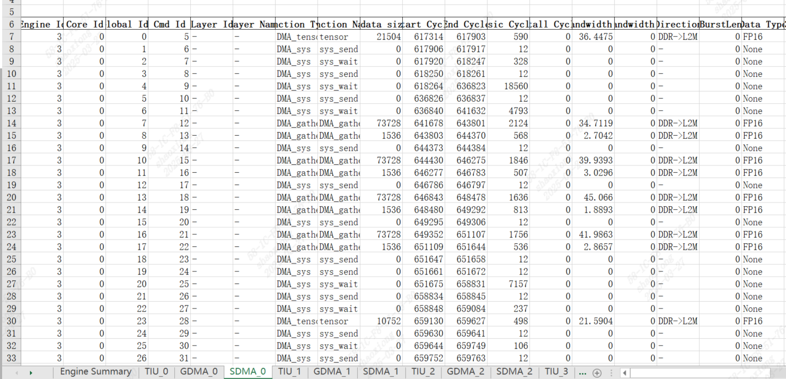
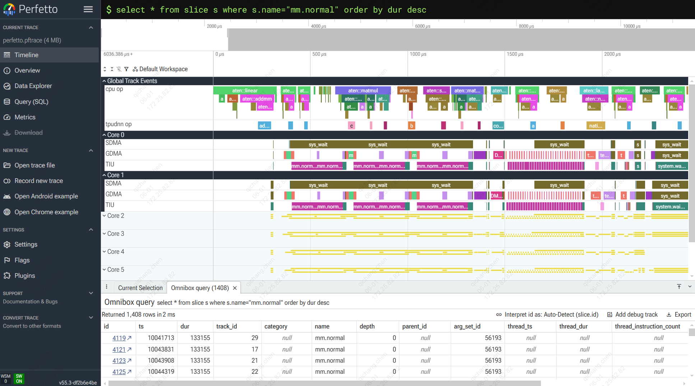
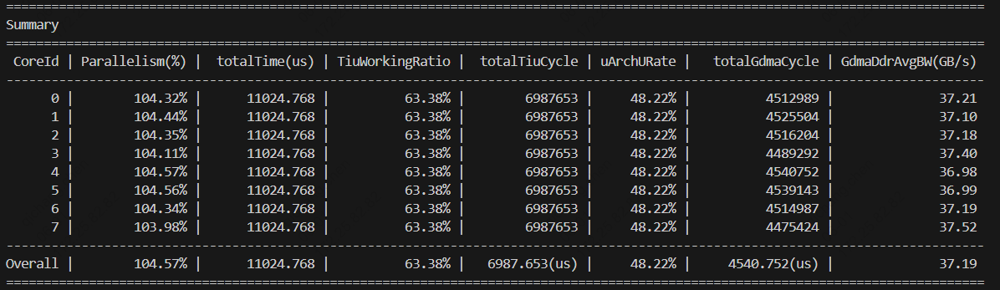

# bigTpuProfile

bigTpuProfile 是一个板卡性能可视化的工具，支持 AKS、AKSV。

## 目录

- [快速开始](#快速开始)
- [profile数据导出](#profile数据导出)
  - [算子](#算子)
    - [tpu-train/tgi](#tpu-traintgi)
    - [tpudnn](#tpudnn)
  - [bmodel](#bmodel)
- [可视化](#可视化)
- [数据分析](#数据分析)
  - [文件夹结构](#文件夹结构)
  - [doc](#doc)
  - [web](#web)
  - [perfetto](#perfetto)
  - [summary](#summary)
- [许可证](#许可证)

## 快速开始

bigTpuProfile的使用主要分为两个步骤：

1. profile数据导出
2. 通过bigTpuProfile进行可视化

## profile数据导出

### 算子

1. bigTpuProfile有三种模式：

    1）模式0 pmu only：不关心算子中具体cmd的类型， 只关心时间维度，该模式对性能影响最小

    2）模式1 精简cmd：关心算子中各cmd的类型，该模式对性能影响较小，dma带宽统计不准确（额外开销 ~4%）

    3）模式2 详细cmd：关心算子中各cmd的详细信息，通常用于调试、各dma带宽统计（额外开销 7 ~ 10%）

2. max_record_num指的是profile的最大记录条数，需注意设置的值要大于记录值。

3. profile输出文件命名规则:

   cdm_profile_data_dev{DeviceID}-{CallNum}

   profile 可在多个设备上独立运行文件名中标记为DeviceID, 也可在该设备上多次被调用(CallNum)

#### tpu-train/tgi

```python
torch.ops.my_ops.enable_profile(max_record_num, mode)  # 设置记录起始点(记录cmd信息, mode: 0 pmu only, 1 精简cmd, 2 详细cmd)

torch.ops.my_ops.disable_profile()  # 设置记录结束点
```

```python
# tpu-train example
# part 0
torch.ops.my_ops.enable_profile(max_record_num, 0)  # enable profile without cmd info (pure pmu
_ = a tpu * b tpu
torch.ops.my_ops.disable_profile()  # disable profile and dump data (cdm_profile_data_dev0-0)
# part 1
torch.ops.my_ops.enable_profile(max_record_num, 1)  # enable profile with condensed cmd info
_ = a tpu + b tpu
torch.ops.my_ops.disable_profile()  #(cdm_profile_data_dev0-1)
# part 2
torch.ops.my_ops.enable_profile(max_record_num, 2)  # enable profile with detailed cmd info
_ = a tpu + b tpu
torch.ops.my_ops.disable_profile()  #(cdm_profile_data_dev0-2)
```

```python
# tgi (text-generation-inference) example
# test_whole_parallel.py

def test_whole_model(batches=1, model_id="llama", model_path='/data', quantize=None, mode="chat"):
    .....
    for it in range(2):
        .....
        for i in range(DECODE_TOKEN_LEN):
            os.environ["TOKEN_IDX"] = str(i)
            generate_start = time.time_ns()
            generations, next_batch, (forward_ns, decode_ns) = model.generate_token(
                next_batch
            )
            generate_end = time.time_ns()
            time_list.append(generate_end - generate_start)
            for generation in generations:
                if i == 0:
                    generated_text[generation.request_id] = generation.tokens.texts[0]
                else:
                    generated_text[generation.request_id] += generation.tokens.texts[0]
            if decode_only and enable_profile and it > 0 and i == 0:                 # condition
                torch.ops.my_ops.enable_profile(max_record_num, book_keeping)        # enable profile
            logger.info(f"Token {i} {[g.tokens.texts[0] for g in generations]}")
            if next_batch is None:
                break

        if enable_profile and it > 0:                                                # condition
            torch_tpu.tpu.optimer_utils.OpTimer_dump()
            torch.ops.my_ops.disable_profile()                                       # disable profile
  .....

```

#### tpudnn

```c++
// 假定handle类型为: tpudnnHandle_t
auto pimpl = static_cast<TPUDNNImpl *>(handle);

pimpl->enableProfile(max_record_num, mode);  // # 设置记录起始点(记录cmd信息, mode: 0 pmu only, 1 精简cmd, 2 详细cmd)
pimpl->disableProfile();  // 设置记录结束点
```

```c++
// tpudnn example
....
const int group_num =1;
const int group_size = pimpl->getCoreNum();
pimpl->enableProfile();    // enable profile
status = pimpl->launchKernel("gelu_forward_multi_core", &api, sizeof(api), group_num, group_size);
pimpl->disableProfile();   // disable profile
pimpl->enableProfile(80);  // enable profile
status = pimpl->launchKernel("gelu_forward_multi_core", &api, sizeof(api), group_num, group_size);
pimpl->disableProfile();   // disable profile
return status;
```

### bmodel

与针对算子的使用方式不同，bmodel主要通过环境变量进行控制，仅需关注最大记录条目数是否合适，无需设置mode模式：

- `ENABLE_ALL_PROFILE=1`： 启动profile

- `TPUKERNEL_FIRMWARE_PATH=/home/xxx/libfirmware_core.so`： 设置fimrware.so 若bmodel版本太老需设置

- `PROFILE_MODE`： （可选项，可选值1 2）查看额外的profile信息，如input，output搬运信息

- `PROFILE_RECORD_SIZE`： （可选项，默认值131072） 设置 pmu 最大记录的条目数

```bash
# 用默认的libfirmware_core.so和条目数
ENABLE_ALL_PROFILE=1 tpu-model-rt --bmodel ./xxx.bmodel

# 指定fimrware.so， 指定记录条目数， 查看inputs ouputs搬运性能
TPUKERNEL_FIRMWARE_PATH=/home/xxx/libfirmware_core.so ENABLE_ALL_PROFILE=1  PROFILE_MODE=2 PROFILE_RECORD_SIZE=40960 tpu-model-rt  --bmodel ./xxx.bmodel
```

## 可视化

通过bigTpuProfile进行解析与可视化

```bash
# 使用 bigTpuProfile -h 查看可用参数
bigTpuProfile <input_dir> <output_dir> [options]
```

### 命令行参数

| 参数 | 类型 | 默认值 | 说明 |
|------|------|--------|------|
| `input_dir` | str | 必填 | bmruntime 生成的 profile 数据目录 |
| `output_dir` | str | `profile_out` | 解析结果输出目录 |
| `--disable_summary` | flag | False | 禁用 summary 输出 |
| `--enable_doc` | flag | False | 生成 doc 可视化 |
| `--trace_file` | str | None | 需要合并的tpudnn trace文件（用于 tpu-train profile 接口） |
| `--tiu_freq` | int | 1000 | 设置 TIU 频率（MHz） |

### 使用示例

```bash
# 基本用法：生成 Perfetto trace 和 summary
bigTpuProfile cdm_profile_data_dev0-0/ result_out

# 生成 doc 可视化
bigTpuProfile cdm_profile_data_dev0-0/ result_out --enable_doc

# 合并外部 trace 文件，自定义 TIU 频率
bigTpuProfile cdm_profile_data_dev0-0/ result_out --trace_file merged_trace.json --tiu_freq 800

```

## 数据分析

### 文件夹结构

```
/result_out/
├── PerfDoc   文档可视化结果
├── perfetto.pftrace   Perfetto可视化文件
├── summary.txt   性能统计摘要
├── tiuRegInfo_x
├── tdmaRegInfo_x
└── cdmaRegInfo_x
```

### doc

使用--enable_doc生成的PerfAI_output.xlsx 中包括总览，及各个core中各engine（tiu gdma sdma cdma）所记录到的有效数据

命名规则为：engineType_coreId




### Perfetto

生成的 `perfetto.pftrace` 文件可通过 [Perfetto UI](https://ui.perfetto.dev) 或安装Perfetto Trace进行可视化，完整使用教程可参见[官方文档](https://perfetto.dev/docs/visualization/perfetto-ui)：

1. 打开 https://ui.perfetto.dev
2. 将 `perfetto.pftrace` 文件拖入页面，即可查看各 engine（TIU/GDMA/SDMA/CDMA）的指令执行时序图
3. 通过 WASD 控制视图缩放，支持范围框选，和点击查看详情
4. 数据已SQL化，下列SQL语句可用于辅助分析

```SQL

// 筛选所有"mm.normal"的项，按照耗时降序展示
select * from slice s
where s.name="mm.normal"
order by dur desc

// 列出指定core下算子的耗时情况
SELECT s.*
FROM slice s
JOIN track t ON s.track_id = t.id
JOIN track parent ON t.parent_id = parent.id
WHERE parent.name = 'Core 0' AND t.name = 'Kernel Function'
ORDER BY s.dur DESC;

// 筛选所有搬运中带宽介于5和20之间的项
SELECT a.real_value AS ddr_bandwidth, s.*  FROM slice s
JOIN args a ON s.arg_set_id = a.arg_set_id
WHERE a.key = 'debug.DDR Bandwidth(GB/s)'
  AND ddr_bandwidth BETWEEN 5 AND 20
order by ddr_bandwidth desc;

// 筛选所有tiu利用率小于40%的项
// uArchRate的值带有%，以文本的形式存储，因此需要读取display_value再做cast到double
SELECT a.display_value  AS uArchRate, s.* FROM slice s
JOIN args a ON s.arg_set_id = a.arg_set_id
WHERE a.key = 'debug.uArch Rate'
  AND CAST(a.display_value  AS DOUBLE) < 40
order by CAST(uArchRate AS DOUBLE) desc;
```

若通过 `--trace_file` 合入了外部的tpudnn trace，还可以在 Perfetto 中同时查看 host 侧与 TPU 侧的对齐时间线。
该参数目前集成在tpu-train中, 调用export_merge_trace可自动合并



### Summary

自动生成的 `summary.txt`，包含每个 core 的性能统计：

- 各 engine（TIU/GDMA/SDMA/CDMA）的有效时间、空闲时间、利用率
- DDR 带宽统计（GDMA/SDMA/CDMA 读写带宽，总带宽）
- 计算与搬运时间占比

会在控制台打印格式化的 summary 表格，同时生成 summary.txt



## 许可证

bigTpuProfile 采用 2-Clause BSD 许可证，但第三方组件除外。
