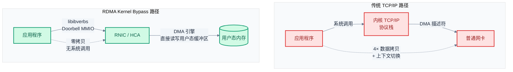
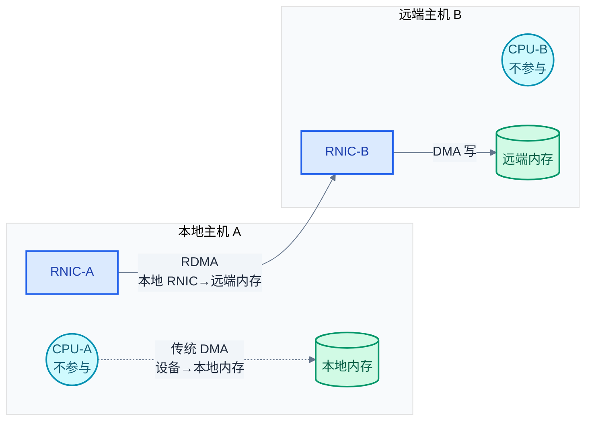

# RDMA 概述与动机

> RDMA（Remote Direct Memory Access，远程直接内存访问）是一种允许一台主机的网卡（RNIC）直接读写另一台主机内存的网络技术，全程绕过远端 CPU。它用硬件取代了传统 TCP/IP 协议栈的软件处理，实现了微秒级延迟和线速吞吐。

### 关键术语

| 缩写 | 全称 | 含义 |
|------|------|------|
| RDMA | Remote Direct Memory Access | 远程直接内存访问 |
| RNIC | RDMA Network Interface Card | RDMA 网卡 |
| HCA | Host Channel Adapter | 主机通道适配器，InfiniBand 语境下的 RNIC |
| DMA | Direct Memory Access | 直接内存访问（本机设备→本机内存） |
| TOE | TCP Offload Engine | TCP 卸载引擎 |
| MMIO | Memory-Mapped I/O | 内存映射 I/O |
| IB | InfiniBand | InfiniBand 网络体系 |
| RoCE | RDMA over Converged Ethernet | 基于融合以太网的 RDMA |
| iWARP | Internet Wide Area RDMA Protocol | 基于 TCP 的 RDMA 协议 |
| MPI | Message Passing Interface | 消息传递接口，HPC 领域标准通信库 |
| NCCL | NVIDIA Collective Communications Library | NVIDIA 集合通信库 |

---

## 概述

RDMA 解决的不是"网络不够快"，而是"CPU 跟不上了"。当单端口带宽从 10GbE 发展到 100GbE、200GbE 甚至 400GbE 时，传统内核网络栈的数据搬运开销——拷贝、上下文切换、中断处理——占据了过半 CPU 时间。RDMA 的思路是：让网卡硬件自己完成数据搬运，CPU 只负责初始化操作和收取完成通知。

### 前置知识

| 需要了解 | 参考文档 |
|----------|----------|
| 操作系统内核态/用户态、系统调用开销 | 操作系统基础 |
| DMA 基本原理（设备直接访问内存，不经过 CPU） | 计算机组成原理 |
| Linux 网络栈基本路径（socket → 协议栈 → 驱动 → 网卡） | Linux 网络编程 |

---

## 一、传统网络栈的瓶颈

在 100Gbps 线速下，每个 64 字节小包只有 **5.12ns** 的处理窗口。传统 Linux 内核网络栈的瓶颈集中在五个方面：

### 1.1 数据拷贝

一次标准 `read()` + `write()` 路径的收发，数据至少经历四次跨缓冲区拷贝：

```
应用程序缓冲区 (用户态)
   │
   └─ copy_from_user ─→ 内核态 socket 缓冲区
                              │
                              └─ 协议栈处理 ─→ sk_buff 链表
                                                  │
                                                  └─ DMA ─→ 网卡 TX 环 (发送)
                                                              │
网卡 RX 环 (接收) ── DMA ──→ 内核态 sk_buff
                                │
                                └─ copy_to_user ─→ 应用程序缓冲区 (用户态)
```

四次拷贝消耗了宝贵的 DDR（Double Data Rate，双倍数据速率）内存带宽。以 DDR4-3200 单通道 ~25.6GB/s 实测带宽计算，100Gbps（~12.5GB/s）线速下仅拷贝就占去近一半带宽，而内存带宽还要服务于 CPU 计算和其他 I/O 设备。

**传统 TCP 在 100Gbps 下的性能基准**：

| 指标 | 数值 |
|------|------|
| 单次 RTT 延迟 | 10-50 μs（内核协议栈路径） |
| CPU 消耗 | ~50%（处理协议栈、拷贝、中断） |
| 内存带宽消耗（拷贝） | ~50% 可用 DDR 带宽 |

### 1.2 上下文切换

每次 I/O 系统调用（`send`、`recv`）都要在用户态和内核态之间切换。在 100GbE 上每秒可能产生 **10^7 量级的 I/O 操作**，对应的上下文切换开销约为每次 1-2μs，累计可达数秒——CPU 根本没有时间处理应用逻辑。

### 1.3 中断风暴

传统网卡每收到一个（或 N 个）包就产生一次硬中断。100Gbps 线速下 64 字节小包一律可达 **148Mpps（Million Packets Per Second，每秒百万包）**，即使使用 NAPI（New API，Linux 中断合并机制）把中断频率降到每 N 个包一次，单核也远不够用。

**包速率换算**：

```
100Gbps ÷ 672 bit/包 ≈ 148 Mpps（最小以太网帧 64B + 12B IFG + 8B Preamble = 84B = 672 bit）
100Gbps ÷ (1500B × 8 bit/B) ≈ 8.3 Mpps  （MTU 帧）

中断频率 = 148 Mpps ÷ NAPI 合并因子(N) ≈ 10^5-10^6 次/秒
```

### 1.4 协议栈开销

TCP 的校验和计算、分段/重组、拥塞控制、重传逻辑全部由 CPU 执行。在 100Gbps 下，单是校验和计算就消耗 ~20% 的单核算力。`perf top` 常见热点：

```
 15.22%  [kernel]  csum_partial           # 校验和
  8.11%  [kernel]  tcp_ack                # ACK 处理
  5.34%  [kernel]  tcp_sendmsg            # 发送路径
  4.87%  [kernel]  tcp_rcv_established    # 接收路径
```

### 1.5 内存带宽争抢

CPU 自身需要访问内存（指令、数据），网卡也需要 DMA 读写内存。二者共享同一 DDR 带宽，在 100Gbps 场景下形成竞争。更严重的是，传统方式下每字节数据被拷贝多次（用户态到内核态往返），成倍放大了内存带宽压力。

---

## 二、Kernel Bypass 原理

RDMA 的解决方案是 **Kernel Bypass（内核旁路）**：应用通过用户态库（libibverbs）直接将命令提交给 RNIC 硬件，数据路径不经过内核。



### 2.1 核心机制

Kernel Bypass 的两大支柱：

1. **用户态命令提交**：libibverbs 将 WR（Work Request，工作请求）置入用户态共享内存中的工作队列（WQ）。然后通过 **MMIO Doorbell** 寄存器通知 RNIC——Doorbell 是一次内存映射 I/O 写入，不需要系统调用。RNIC 的 DMA 引擎直接从用户态 WQ 中拉取 WQE（Work Queue Element，工作队列元素，硬件可读的命令描述符）并执行。

2. **RNIC DMA 直接访问用户缓冲区**：RNIC 通过 IOMMU 或注册的 MR（Memory Region）地址转换表，将应用提供的虚拟地址转换为物理地址，直接用 DMA 引擎读写用户态内存。整个过程不涉及内核态的数据拷贝。

数据路径上的三个关键省略：
- **零次系统调用**：Doorbell 是 MMIO 写，走用户态
- **零次上下文切换**：无需陷入内核
- **零次数据拷贝**：RNIC DMA 直接到用户态缓冲区

---

## 三、RDMA 的核心收益

| 收益维度 | RDMA | 传统 TCP/IP | 差距 |
|----------|------|------------|:----:|
| **CPU 卸载** | 数据搬运由 RNIC 硬件完成，CPU 仅提交/轮询 | 协议栈 + 校验和 + 拷贝全由 CPU 承担 | **~50% CPU 节省** |
| **延迟** | 端到端 ~1μs（RoCEv2，同交换机） | 端到端 ~10-50μs（内核协议栈路径） | **10×+ 降低** |
| **吞吐量** | 任意包大小均可线速（RNIC 硬件处理） | 小包场景 CPU 成为瓶颈，无法达到线速 | 小包场景 10×+ 吞吐提升 |
| **内存带宽** | 单次 DMA，无冗余拷贝 | 4× 跨缓冲区拷贝 | **4× 内存带宽节省** |

### 3.1 剪刀差效应

RDMA 的架构意义可以从一个长期趋势来理解：

```
网络带宽增长：  10G → 25G → 40G → 100G → 200G → 400G（~1.5× / 2年）
CPU 单核性能：  ~5% IPC 提升 / 代（后摩尔定律时代）
   ↓ 差距持续扩大 ↓
结论：必须把网络处理从 CPU 卸载到专用硬件
```

2000 年代初，1GbE 网络对单核 CPU 几乎没有压力。到了 100GbE 时代，即便多核并行处理，内核协议栈的每字节开销（拷贝、校验、协议状态机）仍然让过半 CPU 周期被浪费在网络 I/O 上而非业务逻辑。RDMA 的硬件卸载不是锦上添花，而是保持系统平衡的前提。

要理解 RDMA 的"远程"机制，最自然的起点是理解它的近亲——DMA。

---

## 四、RDMA 与 DMA 的关系

RDMA 是 DMA 概念在远程维度的自然延伸。

| 对比维度 | **DMA** | **RDMA** |
|----------|---------|----------|
| 数据源/目的地 | 本地设备 → 本地内存 | **远端内存** → 本地内存 |
| 绕过对象 | 本地 CPU | **远端 CPU** |
| 需要 | IOMMU 或物理地址 | 远端 RNIC + 远端 MR 注册 + rkey |
| 典型场景 | 磁盘 → 内存（NVMe） | GPU 集群 AllReduce（NCCL + RDMA） |



关键差异：DMA 操作只涉及本地设备与本地的物理地址映射；RDMA 操作则要求**远端主机也注册了内存**并交换 rkey，本端 RNIC 构造包时携带 `(remote_addr, rkey, length)`，远端 RNIC 验证 rkey 有效后执行数据写入。远端 CPU 全程不被唤醒。

---

## 五、三大协议族概览

RDMA 的传输层有三种实现方案，共用同一套 Verbs API 接口，但底层网络层差异很大。

| 对比维度 | **InfiniBand (IB)** | **RoCEv2** | **iWARP** |
|----------|---------------------|------------|-----------|
| 传输层 | IB Transport（BTH） | IB Transport over UDP | RDMAP over TCP |
| 链路层 | IB Link Layer | Ethernet | Ethernet |
| 无损网络 | 原生支持（Credit-based Flow Control） | 依赖 PFC/ECN（优先流控/拥塞通知） | 不需要（TCP 自带可靠性） |
| 路由能力 | IB 子网内（需 SM） | IP 路由，可跨三层 | IP 路由，可跨三层 |
| 硬件成本 | IB 交换机，专用网卡 | 以太网交换机 + RNIC | 以太网交换机 + RNIC |
| 生态系统 | HPC 核心市场 | 数据中心主流 | 边缘（TCP 过渡方案） |

每个协议族的详细架构、包格式差异和适用场景见 [02-rdma-transport-protocols.md](./02-rdma-transport-protocols.md)。这里只说明一个结论：**RoCEv2 是当前数据中心 RDMA 的事实标准**，IB 主导 HPC/Top500 集群，iWARP 因 TCP 开销大而市场份额极小。

---

## 六、典型应用场景

| 场景 | 核心需求 | RDMA 的价值 |
|------|----------|-------------|
| **HPC（MPI）** | 大规模节点间低延迟消息传递 | MPI 的 `MPI_Send`/`MPI_Recv` 映射到 RDMA Send/Recv，集合通信（AllReduce）使用 RDMA Write+Atomic |
| **AI 训练（NCCL）** | GPU 集群梯度同步，AllReduce 是瓶颈 | NCCL 的 Ring/Tree AllReduce 通过 GPUDirect RDMA 将 GPU 显存中的数据直接写入远端 GPU 显存，绕过 CPU 和系统内存 |
| **分布式存储（NVMe-oF）** | 存储节点与计算节点间的块设备访问 | NVMe over Fabrics 通过 RDMA 将远端 NVMe 盘的命令队列映射到本端，延迟媲美本地 PCIe SSD |
| **分布式数据库** | 计算节点间状态同步、数据分片复制 | RDMA 的一边操作（RDMA Write）允许直接写入远端内存而不唤醒远端 CPU，大幅降低复制延迟 |
| **内存池化** | RDMA-based Memory Pool | RDMA READ/WRITE 跨节点访问远端内存，构建分布式内存池 |

---

## 参考资料

- [InfiniBand Architecture Specification](https://www.infinibandta.org/ibta-specification/) — IB 规范的权威来源，定义传输层协议、QP 状态机、包格式
- [RDMAmojo — What is RDMA?](https://www.rdmamojo.com/2013/01/04/what-is-rdma/) — RDMA 基本概念与收益的直观解释
- [RoCE Initiative — RoCEv2 白皮书](https://www.roceinitiative.org/) — RoCEv2 技术概览与部署案例
- [NVIDIA — GPUDirect RDMA](https://docs.nvidia.com/cuda/gpudirect-rdma/) — GPUDirect RDMA 技术文档

---

## 下一篇

- [02-rdma-transport-protocols.md](./02-rdma-transport-protocols.md) — IB / RoCE / iWARP 三协议的深度对比与包格式剖析