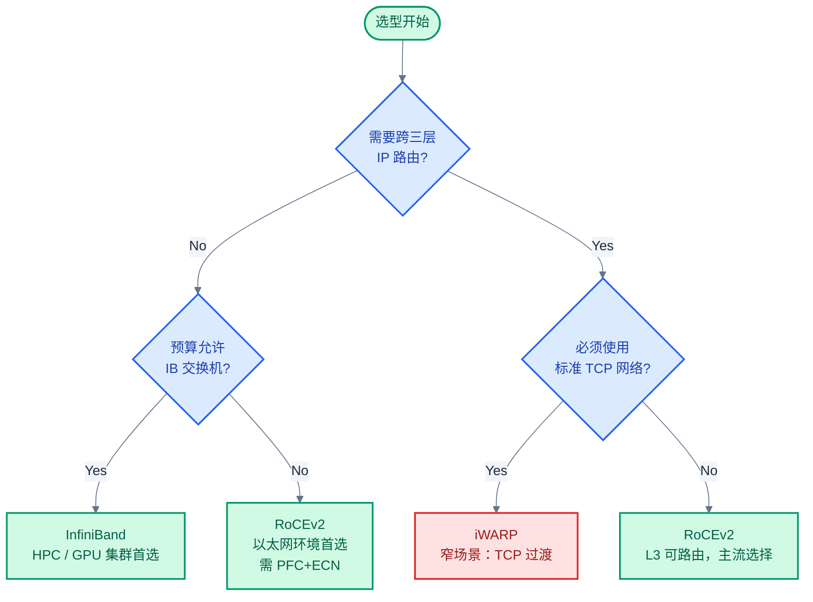

# RDMA 传输协议：IB / RoCE / iWARP

> 三种 RDMA 传输协议共享同一套 Verbs API 语义，但在物理层、包格式、路由能力和网络依赖上差异显著。选型错误意味着要么浪费预算，要么丢包时连接不可恢复。

### 关键术语

| 缩写 | 全称 | 含义 |
|------|------|------|
| IB | InfiniBand | InfiniBand 网络体系，一体化的 RDMA 网络方案 |
| RoCE | RDMA over Converged Ethernet | 基于融合以太网的 RDMA |
| iWARP | Internet Wide Area RDMA Protocol | 基于 TCP/IP 的 RDMA 协议 |
| SM | Subnet Manager | 子网管理器，IB 网络的管理核心 |
| LID | Local Identifier | 本地标识符，IB 子网内的 16 位本地地址 |
| GID | Global Identifier | 全局标识符，128 位，类似 IPv6 地址格式 |
| P_Key | Partition Key | 分区密钥，IB 网络的虚拟化隔离机制 |
| GRH | Global Route Header | 全局路由头部，用于跨子网/IP 路由 |
| LRH | Local Route Header | 本地路由头部，IB 子网内逐跳转发 |
| BTH | Base Transport Header | 基本传输头部，承载 QPN、操作码、PSN |
| DDP | Direct Data Placement | 直接数据放置协议，iWARP 中承载 RDMA 语义 |
| MPA | Marker PDU Aligned | 标记 PDU 对齐，iWARP 中提供 TCP 流上的帧定界 |
| RDMAP | Remote Direct Memory Access Protocol | RDMA 操作的抽象协议层，iWARP 的最高层 |
| ETS | Enhanced Transmission Selection | 增强传输选择（IEEE 802.1Qaz），DCB 的一部分 |
| DCB | Data Center Bridging | 数据中心桥接，以太网无损传输的一组标准 |
| PFC | Priority-based Flow Control | 基于优先级的流量控制（IEEE 802.1Qbb） |
| ECN | Explicit Congestion Notification | 显式拥塞通知（IP 层） |
| VL | Virtual Lane | 虚拟通道，IB 链路上的独立流控通道 |
| CA | Channel Adapter | 通道适配器，IB 语境下的网卡 |
| QPN | Queue Pair Number | 队列对编号，BTH 中标识目标 QP 的 24 位字段 |
| DCT | Dynamically Connected Transport | 动态连接传输，Mellanox 的自定义连接模型 |

---

## 概述

RDMA 的传输层语义（Send/Recv、RDMA Read/Write、Atomic）由 InfiniBand Transport 定义，但这份语义可以承载在**三种截然不同的物理/链路层**之上：IB 的原生链路层、以太网的 RoCE（v1/v2）、和 TCP/IP 的 iWARP。

三者的分水岭在**无损网络的需求**：IB 硬件原生提供信用流控；RoCEv2 依赖 PFC+ECN 在以太网上模拟无损；iWARP 直接放弃无损，让 TCP 处理丢包——代价是 CPU 开销和延迟。

### 前置知识

| 需要了解 | 参考文档 |
|----------|----------|
| RDMA 的基本动机与收益（Kernel Bypass, CPU offload） | [01-rdma-overview.md](./01-rdma-overview.md) |
| —（本文中的 QP/CQ/MR/PD 等核心概念会在首次出现时定义，完整抽象体系见 03） | — |

---

## 一、InfiniBand 体系

InfiniBand 是唯一从物理层到传输层都为 RDMA 原生设计的协议栈。它不是"把 RDMA 嫁接到以太网"，而是一套完整的网络体系——有自己的链路层、地址机制、流控策略和管理架构。

### 1.1 四层协议栈

```
┌─────────────────────────────────────────┐
│  L4 传输层：BTH (Base Transport Header)  │ ← QPN、操作码、PSN
├─────────────────────────────────────────┤
│  L3 网络层：GRH (Global Route Header)    │ ← GID 全局路由（跨子网时）
├─────────────────────────────────────────┤
│  L2 链路层：LRH (Local Route Header)     │ ← LID 子网内路由、VL、流控
├─────────────────────────────────────────┤
│  L1 物理层：SDR/DDR/QDR/FDR/EDR/HDR/NDR  │ ← 1x/4x/12x 通道，每条 2.5-50Gbps
└─────────────────────────────────────────┘
```

| 层 | 头部 | 核心字段 | 职责 |
|----|------|----------|------|
| L1 物理 | — | 通道数（1x/4x/12x）、信号速率 | 电/光信号传输 |
| L2 链路 | **LRH**（8 字节） | SLID、DLID、VL | 子网内逐跳转发、虚通道仲裁、链路层流控 |
| L3 网络 | **GRH**（40 字节） | SGID、DGID、Flow Label | 跨子网/IP 路由（当包需要离开 IB 子网时插入） |
| L4 传输 | **BTH**（12 字节） | Opcode、Dest QPN、PSN | 可靠/不可靠传输、QP 定位、包序 |

### 1.2 子网管理模型

IB 网络的核心特征是**集中式管理**：一个 IP 网络可以自组织（ARP、路由协议），但一个 IB 子网需要一个 **SM（Subnet Manager，子网管理器）** 来集中配置。

SM 的职责：
- 发现子网内所有节点和交换机，分配唯一的 **LID（Local Identifier，16 位本地地址）**
- 为每个节点计算最优路径，写入交换机的转发表（线性转发表，不是 MAC 学习）
- 维护分区（Partition）的 **P_Key（Partition Key）** 表，控制节点间的通信权限
- 周期性扫描（sweep）子网，检测拓扑变化

> IB 交换机的转发原理不同于以太网：它不使用 MAC 学习，而是由 SM 预先计算好所有路径并写入交换机。这意味着 IB 子网内的路径是确定的（deterministic），没有环路和广播风暴风险，但也意味着 SM 是单点——SM 挂了，子网配置不再更新（但已建立的通信继续工作）。

### 1.3 虚通道（Virtual Lanes）

IB 链路支持 **VL（Virtual Lane，虚通道）**，物理链路被划分为最多 16 条逻辑通道（VL0-VL14 用于数据，VL15 保留给管理流量）。每条 VL 有独立的缓冲区对（发送/接收）和独立的信用流控：

| VL 编号 | 用途 | 特点 |
|:-------:|------|------|
| VL0-VL14 | 数据流量 | 可按优先级/QoS 映射到不同 VL |
| VL15 | 子网管理包（SMP） | 最高优先级，独立缓冲，不与数据竞争 |

VL 的核心价值在于**防止 HoL（Head-of-Line Blocking，队头阻塞）**：如果某个 QP 的流被流控暂停，同一 VL 上其他 QP 不受影响（因为 QP 之间是独立调度），但如果 VL 的信用耗尽，则整个 VL 暂停。因此，将不同优先级的流量映射到不同 VL 可以避免低优先级阻塞高优先级。

### 1.4 IB 速率等级

| 代际 | 信号速率（每通道） | 4x 总带宽 | 12x 总带宽 |
|------|:-----------------:|:---------:|:----------:|
| SDR (Single Data Rate) | 2.5 Gbps | 10 Gbps | 30 Gbps |
| DDR (Double Data Rate) | 5 Gbps | 20 Gbps | 60 Gbps |
| QDR (Quad Data Rate) | 10 Gbps | 40 Gbps | 120 Gbps |
| FDR (Fourteen Data Rate) | 14.0625 Gbps | 56 Gbps | 168 Gbps |
| EDR (Enhanced Data Rate) | 25.78125 Gbps | 100 Gbps | 300 Gbps |
| HDR (High Data Rate) | 53.125 Gbps | 200 Gbps | 600 Gbps |
| NDR (Next Data Rate) | 106.25 Gbps | 400 Gbps | — |

实际部署中 4x 端口是主流（与 QSFP 光模块 pin 数对应），12x 仅在背板互联场景使用。

---

## 二、RoCE

RoCE 的设计目标是 **"把 IB Transport 跑在以太网上"**。它保留了 IB 的传输层语义（BTH 格式基本不变），但用 UDP/IP/Ethernet 替换了 IB 的链路层和网络层。

### 2.1 两个版本

| 对比维度 | **RoCEv1** | **RoCEv2** |
|----------|-----------|------------|
| Ethertype | `0x8915`（专用） | `0x0800`（标准 IPv4） |
| 网络层 | 无 IP 头部 | IP（IPv4/IPv6）+ UDP |
| UDP 目的端口 | 无 | **4791**（IANA 注册） |
| 路由能力 | L2 单广播域内通信 | L3 可路由，跨子网 |
| IP 可选字段 | 无 | DSCP（QoS）、ECN（拥塞通知） |
| 交换机要求 | PFC 使能的 L2 交换机 | PFC+ECN 使能的 L3 交换机 |
| ECMP 兼容 | 差（无 UDP 源端口信息） | 好（UDP 源端口承载 QPN 低 16 位） |

### 2.2 包格式对比

```mermaid
%%{init: {"theme": "base", "themeVariables": {"primaryColor": "#f8fafc", "primaryTextColor": "#1e293b", "primaryBorderColor": "#475569", "lineColor": "#64748b", "secondaryColor": "#f1f5f9", "secondaryBorderColor": "#94a3b8", "tertiaryColor": "#f8fafc", "fontFamily": "\"trebuchet ms\", verdana, arial, sans-serif"}}}%%
flowchart TD
    subgraph "RoCEv1 封装 (L2 Only)"
        GRH1[GRH<br/>40B] --> BTH1[BTH<br/>12B] --> Payload1[Payload]
    end
    subgraph "RoCEv2 封装 (L3 Routable)"
        IP[IP Header<br/>20B] --> UDP[UDP Header<br/>8B<br/>Dst Port=4791] --> BTH2[BTH<br/>12B] --> Payload2[Payload]
    end
    subgraph "IB 封装 (Native)"
        LRH[LRH<br/>8B] --> GRH3[GRH<br/>40B 可选] --> BTH3[BTH<br/>12B] --> Payload3[Payload]
    end

    classDef process fill:#dbeafe,stroke:#2563eb,color:#1e40af,stroke-width:2px
    classDef warning fill:#fef3c7,stroke:#d97706,color:#92400e,stroke-width:2px
    classDef success fill:#d1fae5,stroke:#059669,color:#065f46,stroke-width:2px
    class GRH1,BTH1,Payload1 warning
    class IP,UDP,BTH2,Payload2 success
    class LRH,GRH3,BTH3,Payload3 process
```



RoCEv2 的关键设计决策：

- **UDP 而非 TCP**：TCP 的有序交付和重传会与 IB Transport 层的可靠性机制冲突——IB Transport 已有自己的 PSN 和 ACK/NAK，不需要 TCP 重复做一遍。使用 UDP 端口 4791 使网络设备可以识别并施加 PFC 策略
- **UDP 源端口承载 QPN 低 16 位**：以太网交换机的 ECMP 哈希通常是五元组（SIP、DIP、SPort、DPort、Protocol），将 QPN 编码进源端口可让不同 QP 的流分散到不同路径，避免所有 RDMA 流量挤在同一链路
- **IP.ECN 字段用于拥塞控制**：RNIC 在发送时设置 ECN 位为 ECT(0)，交换机在拥塞时将 ECT(0) 改写为 CE（Congestion Experienced），接收方 RNIC 检测到 CE 后生成 CNP（Congestion Notification Packet）回传给发送方——这就是 DCQCN 的基础

### 2.3 RoCE 的无损以太网依赖

RoCE 最大的部署门槛是**必须依赖无损以太网**。IB Transport 假设包不丢（或极少丢），它没有 TCP 那种快速重传和窗口调整机制。在以太网上保证不丢包需要两层机制：

1. **PFC（Priority-based Flow Control，IEEE 802.1Qbb）**：当交换机的接收缓冲区超过阈值，向上一跳发送 PAUSE 帧，暂停该优先级的流量。作用范围是**单跳链路**。
2. **ECN（Explicit Congestion Notification）**：在 IP 头标记拥塞，让发送方减速。作用范围是**端到端**。

PFC 的问题在于粒度太粗（按优先级暂停整条链路），容易产生 HoL Blocking 和 PFC 风暴。DCQCN（Data Center Quantized Congestion Notification，数据中心量化拥塞通知）通过 ECN+CNP 的组合在端到端层面控制发送速率，减少触发 PFC 的次数。PFC 只在 ECN 来不及反应时兜底。

> 详细的无损网络机制（PFC/ECN/DCQCN 工作原理、PFC 风暴的触发条件与缓解）见 [07-rdma-transport-and-hardware.md](./07-rdma-transport-and-hardware.md)。

---

## 三、iWARP

iWARP 的思路和 RoCE 完全相反：**不要求网络无损，而是让 TCP 处理所有可靠性问题**。代价是 TCP 的 CPU 开销和延迟。

### 3.1 协议栈

```
┌──────────────────────────────────────────┐
│  RDMAP  ─ RDMA 操作语义 (Read/Write/Send) │
├──────────────────────────────────────────┤
│  DDP    ─ 直接数据放置：标记数据段归属      │
├──────────────────────────────────────────┤
│  MPA    ─ 帧定界：TCP 流上标记帧边界        │
├──────────────────────────────────────────┤
│  TCP    ─ 可靠传输、拥塞控制、有序交付       │
├──────────────────────────────────────────┤
│  IP + Ethernet                           │
└──────────────────────────────────────────┘
```

| 层 | 职责 | 与 RoCE 对比 |
|----|------|-------------|
| **RDMAP** | 提供 RDMA Read/Write/Send 语义 | 同 IB BTH，但操作码和参数编码方式不同 |
| **DDP**（Direct Data Placement） | 直接将入站数据放置到目标缓冲区（免拷贝），通过 DDP Segment 头部的 Tag/STag 定位远端 MR | RoCE 中这部分由 BTH + RETH（RDMA Extended Transport Header）完成 |
| **MPA**（Marker PDU Aligned） | 在 TCP 字节流中插入 Marker（标记），让接收方在 TCP 流中定位帧边界 | 不需要——RoCE 用 UDP 天然按 datagram 定界 |
| **TCP** | 拥塞控制、丢包重传、有序交付、流控 | RoCE 把可靠性交给 IB Transport 层的 PSN+ACK/NAK |

### 3.2 MPA 的作用

TCP 是字节流协议，不保留消息边界。而 RDMA 操作是消息（message）粒度的。MPA 在 TCP 流中每 512 字节插入一个 **Marker**（一个特殊值的 32 位标记），让接收方 RNIC 可以跳过 TCP 流的字节搜索，直接定位到下一条消息的起始位置。同时 MPA 提供 CRC 校验，检测数据损坏（TCP 校验和太弱，16 位不足以覆盖存储级的数据完整性要求）。

### 3.3 iWARP 为什么没成为主流

| 劣势 | 具体影响 |
|------|----------|
| **TCP CPU 开销** | 尽管 iWARP 硬件卸载了 MPA/DDP/RDMAP 处理，TCP 协议栈仍需要 CPU 参与（尤其是连接建立、拥塞控制决策）。高速场景下 CPU 开销接近传统 TCP |
| **延迟不可预测** | TCP 重传和拥塞窗口调整导致延迟波动，无法保证 ~1μs 级别的一致性低延迟 |
| **连接数限制** | 每个 QP 对应一个 TCP 连接，海量 QP 时需要维护海量 TCP 状态——而 RoCE 的 QP 之间的传输在 UDP 上是无连接的（状态由 BTH 的 QPN+PSN 维护，轻量得多） |
| **硬件复杂度** | 完整的 TCP 卸载（包括拥塞控制）需要 RNIC 实现 TCP 状态机，硅片面积和功耗高于 RoCE RNIC |
| **生态萎缩** | 主要 iWARP 厂商（Chelsio）市场份额持续下降，NVIDIA（Mellanox）和 Intel 均不生产 iWARP RNIC |

> **实用判断**：如果你看到 "iWARP" 出现在需求文档里，问一句"是不是可以用 RoCEv2 替代？"——90% 的情况答案是"是"。iWARP 的剩余价值在于那些必须跑在标准 TCP 网络上且不能部署 PFC 的场景（如跨广域网的 RDMA），但这类场景极罕见。

---

## 四、三协议全面对比

| 对比维度 | **InfiniBand** | **RoCEv2** | **iWARP** |
|----------|:--------------:|:----------:|:---------:|
| 物理层 | IB PHY（SDR → NDR） | 标准以太网 PHY | 标准以太网 PHY |
| 链路层 | IB Link（LRH + VL） | Ethernet（VLAN/DCB 可选） | Ethernet |
| 网络层 | GRH（跨子网时） | IP + UDP | IP + TCP |
| 传输层 | BTH（PSN + ACK/NAK） | BTH over UDP | RDMAP over DDP over MPA over TCP |
| 包定界 | 硬件逐包 | UDP datagram 定界 | MPA Marker 在 TCP 流中定位 |
| 路由能力 | IB 子网内（跨子网需 GRH） | L3 路由，跨三层 | L3 路由，跨三层 |
| 无损网络 | **原生**（Credit-based Flow Control） | **必须**（PFC + ECN） | **不需要**（TCP 自带可靠性） |
| 拥塞控制 | 信用 + 自适应路由 | DCQCN（ECN + CNP） | TCP 拥塞控制（CUBIC/DCTCP） |
| 安全隔离 | P_Key 分区 | IP ACL + VLAN | IP ACL + VLAN |
| 地址格式 | LID（16 位）+ GID（128 位） | MAC + IP（v4/v6） | MAC + IP（v4/v6） |
| 端到端延迟 | ~1 μs（同子网） | ~1-2 μs（同交换机） | ~5-15 μs |
| 交换机硬件 | IB 交换机（专用 ASIC） | 以太网交换机（需 PFC） | 标准以太网交换机 |
| 管理协议 | SM（集中式） | 无特定（IP 网络管理） | 无特定（IP 网络管理） |
| 生态系统 | HPC Top500 集群 | 数据中心主流（阿里/微软/AWS） | 边缘/特殊场景 |
| 厂商支持 | NVIDIA（Mellanox） | NVIDIA, Intel, Broadcom, 华为 | Chelsio（仅存） |

---

## 五、适用场景决策



### 5.1 场景推荐

| 场景 | 推荐协议 | 理由 |
|------|:-------:|------|
| **HPC 集群、Top500 超算** | InfiniBand | 最低延迟（~1μs），原生无损，确定性路由，GPU 集群的 NCCL/RCCL 对 IB 优化最成熟 |
| **多租户数据中心（阿里云/AWS/Azure）** | RoCEv2 | 以太网基础设施通用，运维团队无需学习 IB 管理，L3 可路由天然支持 VPC 组网 |
| **企业私有云、中小规模 GPU 集群** | RoCEv2 | 以太网交换机成本低，PFC 配置成熟（Cisco/Arista 有现成模板），RoCEv2 与通用 TCP/IP 流量共存 |
| **跨数据中心/广域网 RDMA** | 无完美方案 | iWARP 理论上支持（TCP 不丢包），但延迟高；RoCEv2 跨 WAN 部署 PFC 不可行 |
| **传统 TCP 应用平滑迁移** | 不推荐 RDMA | 直接用 TCP over Socket。RDMA 的收益来自重构应用的数据路径，不是"把 socket 换成 RDMA"就能拿到的 |

### 5.2 一个实际的部署考量

RoCEv2 最大的不是技术问题而是**运维问题**：PFC 配置需要两端（服务器和交换机）一致，且 PFC 误配置（pause frame 泛滥）可能导致整个广播域的网络不可用——这是 PFC 风暴。所以 RoCEv2 的落地不是在交换机上"打开一个开关"，而是需要网络团队理解 PFC buffer 分配、headroom 计算、PFC 与 ECN 的配合。

> 关于 PFC 风暴的触发条件、DCQCN 的工作机制和 RNIC 硬件流水线，见 [07-rdma-transport-and-hardware.md](./07-rdma-transport-and-hardware.md)。

---

## 参考资料

- [InfiniBand Architecture Specification, Vol 1, Release 1.5](https://www.infinibandta.org/ibta-specification/) — IB 协议栈权威定义（LRH、GRH、BTH 格式、SM 协议）
- [RoCEv2 Specification — Annex A17 to IBTA Spec](https://www.infinibandta.org/) — RoCEv2 封装格式、UDP 端口 4791 的正式定义
- [IETF RFC 5040: Remote Direct Memory Access Protocol (RDMAP)](https://datatracker.ietf.org/doc/rfc5040/) — iWARP RDMAP 层规范
- [IETF RFC 5044: Marker PDU Aligned Framing for TCP](https://datatracker.ietf.org/doc/rfc5044/) — iWARP MPA 层规范
- [IEEE 802.1Qbb — Priority-based Flow Control](https://standards.ieee.org/standard/802_1Qbb-2011.html) — PFC 标准
- [Congestion Control for Large-scale RDMA Deployments (DCQCN)](https://dl.acm.org/doi/10.1145/2934872.2934892) — SIGCOMM 2015，DCQCN 论文
- [RDMAmojo — RoCE vs iWARP](https://www.rdmamojo.com/2013/01/04/roce-vs-iwarp/) — RoCE 与 iWARP 的比较分析

---

## 下一篇

- [03-rdma-core-abstractions.md](./03-rdma-core-abstractions.md) — RDMA 核心抽象：QP、CQ、MR、PD 的定义与生命周期