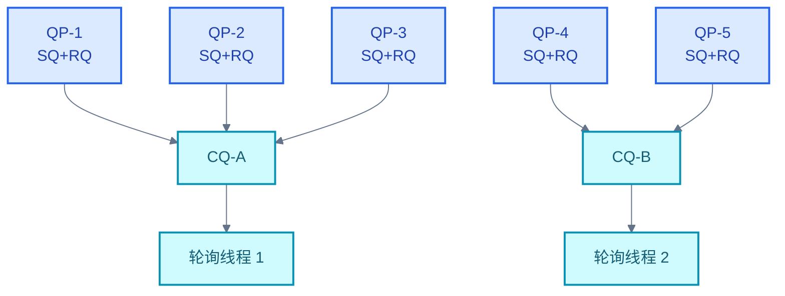
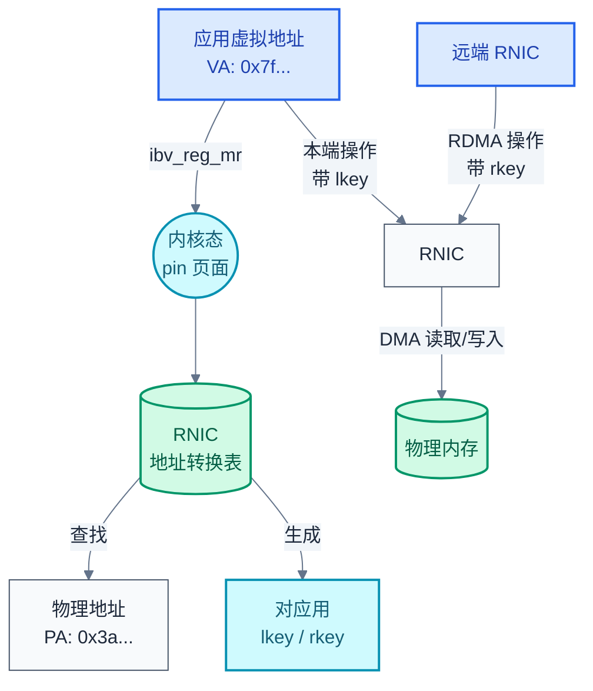
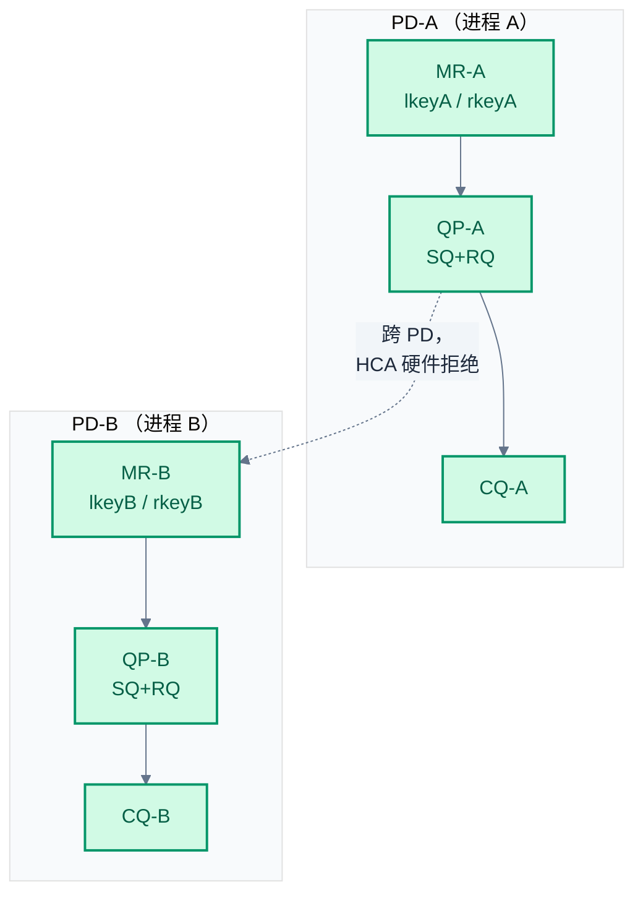
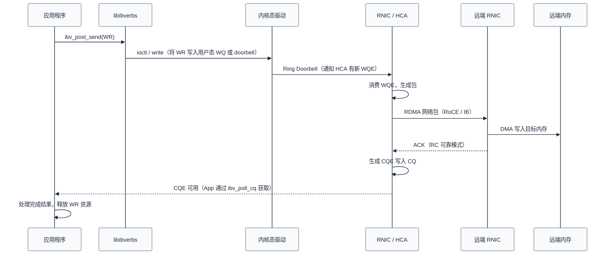
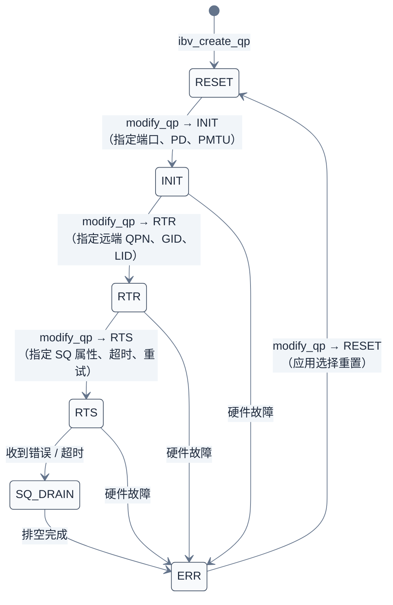

# RDMA 核心抽象：QP/CQ/MR/PD

> RDMA 编程的核心是四个抽象：QP（数据传输通道）、CQ（异步完成通知）、MR（内存安全契约）、PD（资源隔离容器）。理解它们之间的关系与生命周期，是写出正确 RDMA 程序的前提。

### 关键术语

| 缩写 | 全称 | 含义 |
|------|------|------|
| QP | Queue Pair | 队列对，由发送队列（SQ）和接收队列（RQ）组成 |
| QPN | Queue Pair Number | 队列对编号，24 位，HCA 硬件查找 QP 上下文的索引 |
| CQ | Completion Queue | 完成队列，存放已完成的工作完成通知 |
| CQE | Completion Queue Element | 完成队列元素，描述一次完成的 WR 结果 |
| MR | Memory Region | 内存区域，向 RNIC 注册后的虚拟地址空间片段 |
| lkey | Local Key | 本地访问密钥，用于本端 RNIC 发起内存访问 |
| rkey | Remote Key | 远程访问密钥，用于远端 RNIC 发起 RDMA 操作 |
| PD | Protection Domain | 保护域，同 PD 内的资源可互操作，跨 PD 隔离 |
| WR | Work Request | 工作请求，由应用向 QP 提交的操作描述 |
| WQE | Work Queue Element | 工作队列元素，WR 被 RNIC 消费时转换成的硬件描述符 |
| HCA | Host Channel Adapter | 主机通道适配器，即 InfiniBand 语境下的 RNIC |
| RC | Reliable Connected | 可靠连接型 QP |
| UC | Unreliable Connected | 不可靠连接型 QP |
| UD | Unreliable Datagram | 不可靠数据报型 QP |

---

## 概述

RDMA 的传输通道不是 socket。传统 socket 编程中，数据的收发通过一个文件描述符完成，而在 RDMA 中，这一职责被拆分为四个独立的抽象：**QP** 承载数据传输，**CQ** 承载完成通知，**MR** 定义可访问的内存范围，**PD** 划定资源间的安全边界。

这种拆分不是设计上的过度抽象，而是硬件卸载的必然结果——RNIC 自己完成数据搬运，CPU 只负责提交任务和收取结果，所以任务通道（QP）和结果通道（CQ）必须分开。

### 前置知识

| 需要了解 | 参考文档 |
|----------|----------|
| RDMA 三大收益（kernel bypass / zero-copy / CPU offload） | [01-rdma-overview.md](./01-rdma-overview.md) |
| IB / RoCE / iWARP 协议差异 | [02-rdma-transport-protocols.md](./02-rdma-transport-protocols.md) |

---

## 一、Queue Pair（QP）

QP 是 RDMA 数据传输的基本单元。一个 QP 由**发送队列（SQ, Send Queue）**和**接收队列（RQ, Receive Queue）**组成，两者在物理上是独立的硬件队列，但在逻辑上成对绑定。

应用程序通过向 SQ 提交 Send/Write/Read 等 WR 来发起数据传输，而接收端则向 RQ 提交 Recv WR 来声明接收缓冲区。**RQ 中的 Recv WR 必须被预提交（pre-post）**，否则当数据到达时，RNIC 发现 RQ 为空，会丢弃数据并产生一个 RNR（Receiver Not Ready）错误——这是 RDMA 编程中最常见的坑之一。

### 1.1 QP 类型对比

RDMA 定义了四种 QP 类型，每种在可靠性、连接拓扑和多播能力上不同：

| 对比维度 | **RC**（Reliable Connected） | **UC**（Unreliable Connected） | **UD**（Unreliable Datagram） | **RD**（Reliable Datagram） |
|----------|-----------------------------|-------------------------------|-----------------------------|-----------------------------|
| 连接关系 | 一对一 | 一对一 | 一对多 | 一对多 |
| 可靠性 | 保证送达，顺序保持 | 保证送达（链路层），无序 | 不保证送达，可乱序 | 保证送达，顺序保持 |
| 多播 | 不支持 | 不支持 | 支持（多播 GID） | 不支持 |
| 最大未确认消息 | 16M（每个 QP） | — | — | 128K |
| 预提交 Recv | 必须 | 必须 | 必须 | 必须 |
| 典型场景 | 存储/数据库 | 流媒体 | 管理/查询 | 已基本废弃 |

实际上 RC 占了绝大多数使用场景，UD 主要用于连接管理通信和查询类操作，UC 在视频流传输等对丢包不敏感的场景偶尔使用，RD 则因实现复杂度高而几乎不被使用。

### 1.2 QPN：24 位的硬件索引

每个 QP 在 HCA 中由一个 **24 位 QPN（Queue Pair Number）**唯一标识。这意味着一个 HCA 理论上可以有 $2^{24}$ 个 QP（约 1600 万），但实际上受片上 SRAM 容量限制，通常支持几千到几万个并发 QP。

QPN 的工作方式：

- 应用发起操作时，在 Work Request 中**不需要**显式填写 QPN，内核态驱动会负责将 QP 信息填入 WQE
- HCA 收到数据包后，从包头的 **Dest QPN 字段**直接查表，定位到对应 QP 的硬件上下文（QP Context Table），找到 RQ/WQE 地址
- 每个 QP 的独立 QPN 意味着 QP 之间的状态不共享任何硬件结构，天然支持多核并行——每个 CPU 核可以绑定不同的 QP，互不干扰

QPN 的分配由内核态 Provider 控制，应用无法自行指定。**RoCE v2 场景下，UDP 源端口承载 QPN 的低 16 位**——这一设计利用了标准以太网交换机对 UDP 五元组的 ECMP（Equal-Cost Multi-Path，等价多路径）哈希，无需交换机感知 IB 协议即可实现 QP 级别的负载均衡。注意：RoCE v2 使用 ETH/IP/UDP/BTH 封装，不存在 GRH（GRH 仅用于 IB 原生路由和 RoCE v1）。

QP 解决了"把数据交给谁"的问题，但应用如何知道操作是否完成了？RNIC 用 **Completion Queue** 来回答这个问题。

---

## 二、Completion Queue（CQ）

CQ 是 RDMA 中用于获取**异步完成通知**的队列。当一个 WR 被 RNIC 处理完毕（数据已发出或已接收入指定缓冲区），RNIC 会向与该 QP 关联的 CQ 写入一个 **CQE（Completion Queue Element）**，包含操作结果、状态码和 WR ID。

关系是 **N:1**：一个 CQ 可以服务于多个 QP。这在设计上的编码意义是：一个线程只需要轮询一个 CQ 就能处理所有已连接的 QP 的完成事件。

### 2.1 两种通知模式

| 模式 | 机制 | 延迟 | CPU 开销 | 适用场景 |
|------|------|:----:|:--------:|----------|
| **轮询**（Polling） | `ibv_poll_cq` 主动查询 CQ | 极低 | 高（忙等） | 低延迟路径 |
| **事件驱动**（Event-Driven） | `ibv_get_cq_event` + `ibv_req_notify_cq` 等待文件描述符可读 | 较高 | 低 | 低负载连接 |

在追求低延迟的场景中，通常使用 `ibv_poll_cq` 作为首选。CQ 还支持 **CQ moderation（完成队列聚合）**，即 RNIC 不会每个 CQE 都立刻写入，而是积累 N 个或等 T 时间后批量写入，降低 PCIe 写次数，代价是额外的延迟。

一个 CQE 的结构（`ibv_wc`）中，对应用最重要的三个字段是：

| 字段 | 含义 |
|------|------|
| `wr_id` | 用户定义的操作 ID（在 WR 中填入），用于回溯是哪个 WR 完成了 |
| `status` | 完成状态：`IBV_WC_SUCCESS` 表示正常，非零值表示错误 |
| `opcode` | 完成的操作类型（`IBV_WC_SEND`、`IBV_WC_RECV`、`IBV_WC_RDMA_WRITE` 等） |

**wr_id 是关键**：应用在 WR 中填入 wr_id（如指向上下文结构体的指针），当 CQE 返回时通过 wr_id 反向索引到相应的请求上下文。这使得异步编程模型成为可能——投递一批 WR，在轮询 CQ 时通过 wr_id 知道每个 CQE 对应哪个请求。

CQ 告诉应用"操作完成了"，但 RNIC 还需要知道"可以从哪块内存搬数据"——这就是 Memory Region 的作用。

---

## 三、Memory Region（MR）

MR 是 RDMA 内存模型中最重要的抽象。它的本质是应用与 RNIC 之间的**一份契约**：应用告诉 RNIC"这片内存我授权你访问"，RNIC 则在一张内部地址转换表中记录这个区域，并返回一对密钥。

### 3.1 为什么需要 MR

CPU 使用的是**虚拟地址（VA, Virtual Address）**，而 RNIC 只能使用**物理地址（PA, Physical Address）**。这是因为 RNIC 是一个独立的 PCIe 设备，不具备访问 CPU MMU 页表的能力（在 IOMMU/SMMU 介入之前，它只能按物理地址 DMA）。

所以注册 MR 的过程实际做了三件事：

1. **锁定（pin）页面**：确保物理页不会被内核换出到交换空间
2. **建立地址转换表**：在 RNIC 可访问的内存中建立 VA→PA 的映射表，或利用 IOMMU
3. **生成两个密钥**：`lkey`（Local Key，本地侧使用）和 `rkey`（Remote Key，远端使用）

### 3.2 lkey 与 rkey

- **lkey**：本地访问密钥。任何经由**本端 RNIC** 发起的内存访问（Send/Recv/RDMA Write/RDMA Read）都必须提供有效的 lkey，否则 RNIC 会直接拒绝
- **rkey**：远程访问密钥。远端 RNIC 在对端做 RDMA Read/Write 时，必须在 WR 中提供对端 MR 的 rkey

lkey 和 rkey 的作用类似于 IPC 中的 capability——你持有一个有效的 lkey 意味着你被授权了对应 MR 的访问权限。一个进程可以持有多个 MR 的 key。

### 3.3 注册的成本

MR 注册是一个昂贵操作：需要遍历页表、pin 每页、填充 RNIC 地址转换表。`ibv_reg_mr` 的延迟在毫秒级（取决于区域大小），而 RDMA 数据传输延迟在微秒级。所以实际编程中**预注册长生命周期的大块内存**，而非每次操作都注册。

> 对 MR 内存管理的深入讨论（MW、PBL、GPUDirect RDMA）见 [06-rdma-memory-management.md](./06-rdma-memory-management.md)。

MR 解决了"哪些内存可访问"，但还没有解决一个关键问题：多个应用或 QP 共享 RNIC 时，如何保证互不干扰？Protection Domain 就是为这个"隔离"目的设计的。

---

## 四、Protection Domain（PD）

PD 是 RDMA 中的**安全隔离容器**。所有资源（QP、CQ、MR）都属于某个 PD，核心规则只有一条：

> **同 PD 内的资源可以互操作；跨 PD 访问被 HCA 硬件拒绝。**

具体表现为：

- 一个 QP 只能访问同 PD 内的 MR
- 一个 QP 只能将 CQE 写入同 PD 内的 CQ
- 一个 MR 注册时指定的 `pd` 参数决定了它的归属

这对**多租户**场景至关重要：系统为每个进程分配一个独立 PD，就算进程 A 碰巧知道了进程 B 的 lkey/rkey，RNIC 也会因为 PD 不匹配而拒绝，实现了硬件级的安全隔离，无需内核参与。

---

## 五、WR / WQE / CQE 生命周期

QP/CQ/MR/PD 四个抽象现在全部讲完了。但理解它们各自独立还不够——一次 RDMA 操作需要它们协同工作。下面用 WR/WQE/CQE 生命周期把四者串联起来。

从应用提交一个操作到获得完成通知，WR 在 RDMA 体系中的流转路径如下：

**步骤说明**：

1. **提交阶段**：应用填充 `ibv_send_wr` / `ibv_recv_wr` 结构体，调用 `ibv_post_send` / `ibv_post_recv`
2. **WQE 生成**：libibverbs 或内核驱动将 WR 转换为 **WQE**——这是 RNIC 直接读取的硬件描述符，包含操作码（SEND/RDMA_WRITE 等）、SGE 列表、目标 QPN 等
3. **Doorbell**：驱动写 MMIO 寄存器通知 HCA 新 WQE 已就绪。这一步是 kernel bypass 的关键——**doorbell 操作不需要系统调用**
4. **HCA 处理**：HCA 的 DMA 引擎从主机内存中取出 WQE，生成网络包，发送到对端
5. **远端处理**：远端 HCA 收到后，根据操作类型将数据 DMA 到目标内存（如果是 RDMA Write），或检查 RQ 是否有匹配的 Recv WQE（如果是 Send）
6. **完成通知**：本端 HCA 生成 CQE，写入 CQ。应用通过 `ibv_poll_cq` 获取 CQE，字段包括操作状态、字节数、WR ID

---

## 六、Queue Pair 状态机详解

QP 不是创建即可用的——它有一个严格的状态机，必须通过 `ibv_modify_qp` 逐步迁移。这个状态机由 InfiniBand 规范定义，也适用于 RoCE。

| 状态 | 含义 | 允许的操作 |
|------|------|-----------|
| **RESET** | 刚创建，尚未初始化 | 只能 `modify_qp` → INIT |
| **INIT** | 端口和 PD 已绑定，已分配 QPN | 只能 `modify_qp` → RTR |
| **RTR**（Ready to Receive） | 已知道远端地址，可接收数据 | 可接收数据，不能发送 |
| **RTS**（Ready to Send） | 完整就绪，可收发 | Send、Recv、RDMA Read/Write |
| **SQ_DRAIN**（SQ Drained） | SQ 中的残余 WQE 正在排空 | 等待 WQE 完成，不可投新 WR |
| **ERR**（Error State） | 致命错误 | 不可用，必须 → RESET → 重新转换 |

### 6.1 状态迁移的参数依赖

每次 `ibv_modify_qp` 都需要提供 `ibv_qp_attr` 和一组 `ibv_qp_attr_mask` 位掩码，指定此次迁移要设置的属性：

- **RESET → INIT**：必须指定 `IBV_QP_STATE`, `IBV_QP_PKEY_INDEX`, `IBV_QP_PORT`, `IBV_QP_ACCESS_FLAGS`
- **INIT → RTR**：必须指定 `IBV_QP_AV`（Address Vector，含远端 GID/LID/QPN）、`IBV_QP_PATH_MTU`、`IBV_QP_RQ_PSN`、`IBV_QP_MAX_DEST_RD_ATOMIC`、`IBV_QP_MIN_RNR_TIMER`
- **RTR → RTS**：必须指定 `IBV_QP_SQ_PSN`、`IBV_QP_TIMEOUT`、`IBV_QP_RETRY_CNT`、`IBV_QP_RNR_RETRY`、`IBV_QP_MAX_QP_RD_ATOMIC`

一个实际编程中常见的问题是忘记某个 mask 位导致 `modify_qp` 返回 `EINVAL`。`ibv_modify_qp` 的 mask 机制要求你精确声明哪些属性将被更新，这是为了防止未初始化的字段被写入硬件。

---

## 参考资料

- [RDMAmojo — RDMA基本概念](https://www.rdmamojo.com/2013/06/01/rdma-basic-components/) — QP/CQ/MR 的直观解释
- [InfiniBand Architecture Specification, Vol 1, Release 1.5](https://www.infinibandta.org/ibta-specification/) — QP 状态机、CQE 格式的权威定义
- [Linux RDMA 子系统文档](https://www.kernel.org/doc/html/latest/infiniband/index.html) — 内核态 verbs 的实现

---

## 下一篇

- [04-rdma-verbs-api.md](./04-rdma-verbs-api.md) — Verbs API 编程接口与完整代码示例