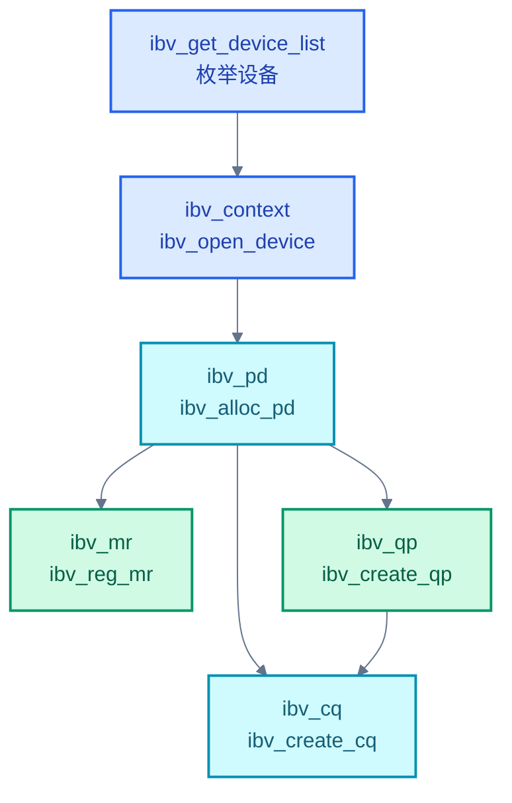
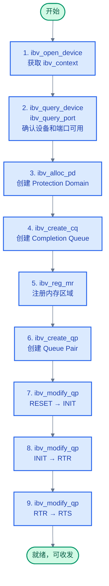

# Verbs API 与编程模型

> Verbs API 是 RDMA 应用编程的唯一入口。它屏蔽了 InfiniBand、RoCE 和 iWARP 的底层差异，提供统一的资源创建与数据收发接口。掌握 Verbs API 的使用流程，就掌握了 RDMA 编程的骨架。

### 关键术语

| 缩写 | 全称 | 含义 |
|------|------|------|
| Verbs | — | RDMA 编程接口，定义 QP/CQ/MR/PD 的创建与操作语义 |
| OFED | OpenFabrics Enterprise Distribution | 开源 RDMA 软件栈集合，包含 libibverbs、libmlx5 等 |
| CM | Communication Manager | 连接管理器，负责 RC QP 的连接建立 |
| RDMA CM | RDMA Communication Manager | librdmacm，基于 IP 的 RDMA 连接管理库 |
| WC | Work Completion | 工作完成对象，`ibv_wc` 结构体，即 CQE 的用户态表示 |
| SGE | Scatter-Gather Element | 分散-聚集元素，描述一段连续内存的首地址与长度 |
| PSN | Packet Sequence Number | 包序列号，用于可靠传输的丢包检测与重传 |
| GRH | Global Routing Header | 全局路由头部，IB 原生子网间路由使用；**RoCE v2 线缆上不存在 GRH（由 IP/UDP 替代）** |
| GID | Global Identifier | 全局标识符，RDMA 端口的全局地址（128 位） |
| LID | Local Identifier | 本地标识符，InfiniBand 子网内的本地地址（16 位） |
| MTU | Maximum Transmission Unit | 路径最大传输单元 |
| RNR | Receiver Not Ready | 接收方未就绪错误 |

---

## 概述

Verbs API 不属于传输层——它是位于应用与 RNIC 驱动之间的**抽象接口层**。这个设计思路和 POSIX 对文件系统的抽象类似：无论底层是 IB、RoCE 还是 iWARP，应用看到的都是同一套 `ibv_*` 函数。

RDMA 的软件栈分为两层：

- **libibverbs**：用户态库，提供控制路径 API（`ibv_create_qp`、`ibv_modify_qp` 等）。数据路径（`ibv_post_send`）在大多数实现中直接操作硬件 doorbell，不走系统调用
- **内核提供者（provider）**：厂商驱动（如 `mlx5`、`hlx5`、`bnxt_re`），实现硬件控制：资源管理、地址转换、中断处理

### 前置知识

| 需要了解 | 参考文档 |
|----------|----------|
| QP、CQ、MR、PD 的定义与职责 | [03-rdma-core-abstractions.md](./03-rdma-core-abstractions.md) |
| IB/RoCE/iWARP 协议区别 | [02-rdma-transport-protocols.md](./02-rdma-transport-protocols.md) |

### Verbs API 的边界

Verbs API 的一个重要特征是**语义（semantics）与传输无关**：同一个 `ibv_post_send` 调用，在 IB、RoCE 或 iWARP 网络下都能工作。API 层不关心底层 IP 封装、流控和重传机制——这些由硬件/provider 自动处理。

但 Verbs API 也**不等于用户态友好**。它暴露了大量硬件概念（QPN、PSN、LID、GID），这些参数需要由应用或 CM 库填充。实际开发中很少直接使用裸 Verbs API 写完整程序，通常会配合 `librdmacm` 的 `rdma_create_qp` 等高层函数来完成连接协商。这篇文档的目的是让你理解 Verbs 每一层的原理，而不是倡导每行代码都手写 `ibv_*`。

---

## 一、Verbs 体系架构

### 1.1 对象层次

Verbs API 的核心对象之间存在严格的依赖关系：



这个层次关系不是纯粹的编码习惯，而是硬件约束：HCA 要求 QP 和 MR 必须绑定在同一个 PD 内，CQ 也需要 PD 来标识归属，而 PD 是设备上下文（`ibv_context`）的子对象。

### 1.2 软件栈分层

RDMA 软件栈从用户态应用到底层硬件的完整分层结构如下：

| 层 | 组件 | 职责 |
|----|------|------|
| 应用 | 用户程序 | 调用 `ibv_*`、`rdma_*` 函数 |
| 用户态连接管理 | `librdmacm` | 基于 IP 地址建立 RDMA 连接，隐藏 QPN/GID/LID 交换 |
| 用户态 Verbs | `libibverbs` | 统一接口、用户态 WQE 构建、提供者加载 |
| 用户态 Provider | `libmlx5.so`、`libhns.so` | 厂商 DPDK 式数据路径实现、doorbell 映射 |
| 内核态通用层 | `ib_uverbs` | 资源创建/销毁、中断分发、内存 pin |
| 内核态 Provider | `mlx5_ib`、`hns_roce` | 厂商硬件控制：QP/CQ 寄存器编程、地址解析 |
| 硬件 | RNIC/HCA | WQE 消费、DMA、包收发与 ACK 生成 |

关键点：`libibverbs` 本身不包含任何厂商特定代码——每个厂商以**插件**形式提供 provider 库，`libibverbs` 在运行时会自动搜索 `/usr/lib64/libibverbs/` 下的 `.so` 文件。这种设计意味着同一套应用二进制可以跨不同厂商的 RNIC 运行，无需重新编译。

### 1.3 OFED 与 rdma-core

两个名字容易混淆：

- **OFED（OpenFabrics Enterprise Distribution）**：由 OpenFabrics Alliance 维护的完整 RDMA 软件发行版，包含内核模块、用户态库、诊断工具和性能测试套件。传统上有两种版本：MLNX_OFED（Mellanox/NVIDIA 维护）和 Inbox OFED（随 Linux 内核主线发布）
- **rdma-core**：Linux 主线 RDMA 用户态软件包，是 libibverbs 等多个库的集合体。它从 OFED 分拆出来，自 2017 年起成为 Linux 发行版的标准 RDMA 用户态包（`apt install rdma-core` / `yum install libibverbs`）

---

## 二、设备发现与打开

RDMA 编程的第一步是找到设备并打开上下文。与 socket 的 `socket()` 不同，`ibv_get_device_list` 返回的是已经在内核中初始化的设备列表——这些设备在 `modprobe mlx5_ib` 或模块自动探测时完成初始化。

```c
#include <infiniband/verbs.h>

int num_devices;
struct ibv_device **dev_list = ibv_get_device_list(&num_devices);
if (!dev_list || num_devices == 0) {
    fprintf(stderr, "No RDMA devices found\n");
    return -1;
}

// 遍历设备列表，找到合适的设备
struct ibv_device *dev = NULL;
for (int i = 0; i < num_devices; i++) {
    struct ibv_context *tmp_ctx = ibv_open_device(dev_list[i]);
    if (!tmp_ctx) continue;
    struct ibv_port_attr port_attr;
    if (ibv_query_port(tmp_ctx, 1, &port_attr)) {
        ibv_close_device(tmp_ctx);
        continue;
    }
    if (port_attr.state == IBV_PORT_ACTIVE) {
        dev = dev_list[i];
        ibv_close_device(tmp_ctx);
        break;
    }
    ibv_close_device(tmp_ctx);
}
```

实际代码中通常用 `ibv_get_device_name` 获取设备名（如 `mlx5_0`），并根据配置或命令行参数选择特定设备。`ibv_open_device` 返回的 `ibv_context` 是所有后续操作的基础句柄。

`ibv_query_device` 返回的 `ibv_device_attr` 中最常被检查的字段：

| 字段 | 含义 | 典型值（ConnectX-5） |
|------|------|:----:|
| `max_qp` | 最大 QP 数 | 262144 |
| `max_cq` | 最大 CQ 数 | 16777216 |
| `max_mr_size` | 单个 MR 最大字节数 | $2^{64}-1$ |
| `max_qp_wr` | 每个 QP 的最大 WR 数 | 32768 |
| `max_sge` | 每个 WR 的最大 SGE 数 | 30 |

这些字段的值决定了你可以创建多少资源——**如果你尝试创建超过 `max_qp` 数量的 QP，`ibv_create_qp` 会返回 NULL**。在生产代码中，建议在创建资源前先调用 `ibv_query_device` 获取能力上限，避免运行时出现 `ENOMEM` 等难调试错误。

```c
struct ibv_context *ctx = ibv_open_device(dev);
struct ibv_device_attr device_attr;
ibv_query_device(ctx, &device_attr);

struct ibv_port_attr port_attr;
ibv_query_port(ctx, 1, &port_attr);
if (port_attr.state != IBV_PORT_ACTIVE) {
    fprintf(stderr, "Port is not active, state=%d\n", port_attr.state);
    return -1;
}
```

---

## 三、资源创建流程

RDMA 程序的资源创建遵循严格的顺序：



### 3.1 核心创建代码

以下代码展示了五个核心对象的创建顺序。这个顺序是由 HCA 内部依赖决定的——PD 是所有资源的容器，CQ 和 MR 依附于 PD 但彼此独立，而 QP 依赖 PD（归属）和 CQ（完成事件去向），所以排在最后。

```c
// 1. 创建 PD — 安全隔离域，所有后续资源的归属
struct ibv_pd *pd = ibv_alloc_pd(ctx);
if (!pd) { /* 错误处理 */ }

// 2. 创建 CQ — 异步完成通知队列，QP 将 CQE 写入此处
struct ibv_cq *cq = ibv_create_cq(ctx,
    256,              // cqe: CQ 深度（CQE 数量）
    NULL,             // cq_context: 用户上下文指针，轮询模式下可为 NULL
    NULL,             // channel: 事件通知通道（NULL = 轮询模式）
    0);               // comp_vector: 完成向量，影响中断分发的 CPU 向量
if (!cq) { /* 错误处理 */ }

// 3. 注册 MR — 与 RNIC 签订内存契约，pin 页面并获取 lkey/rkey
size_t buf_size = 4096;
char *buf = aligned_alloc(sysconf(_SC_PAGESIZE), buf_size);  // 页对齐
struct ibv_mr *mr = ibv_reg_mr(pd,
    buf,                                // addr: 起始虚拟地址
    buf_size,                           // length: 区域长度（字节）
    IBV_ACCESS_LOCAL_WRITE |            // 本地可写
    IBV_ACCESS_REMOTE_READ |            // 远端可读（RDMA Read）
    IBV_ACCESS_REMOTE_WRITE);           // 远端可写（RDMA Write）
if (!mr) { /* 错误处理 */ }
uint32_t lkey = mr->lkey;               // 本地访问密钥，所有本端操作都需要
uint32_t rkey = mr->rkey;               // 远程访问密钥，需通过 OOB 传给对端

// 4. 创建 QP — 数据传输通道，指定 SQ/RQ 容量和类型
struct ibv_qp_init_attr qp_init_attr = {
    .send_cq = cq,                      // SQ 完成通知发往此 CQ
    .recv_cq = cq,                      // RQ 完成通知发往此 CQ（可分开）
    .cap     = {
        .max_send_wr  = 128,            // SQ 深度：最多 128 个未完成的 send WR
        .max_recv_wr  = 128,            // RQ 深度：最多 128 个预提交的 recv WR
        .max_send_sge = 16,             // 每个 send WR 最多 16 个 SGE（零散内存段）
        .max_recv_sge = 16,             // 每个 recv WR 最多 16 个 SGE
    },
    .qp_type = IBV_QPT_RC,              // RC 类型：一对一、可靠、顺序
    .sq_sig_all = 0,                    // 0 = 仅在 IBV_SEND_SIGNALED 时生成 CQE
};
struct ibv_qp *qp = ibv_create_qp(pd, &qp_init_attr);
if (!qp) { /* 错误处理 */ }
```

**设计点**：`send_cq` 和 `recv_cq` 可以指向同一个 CQ（简单场景），也可以分离（高频场景下将 send 完成和 recv 完成分到不同 CQ，方便多线程处理，避免 send 线程和 recv 线程争抢同一个 CQ 的轮询）。

`sq_sig_all = 0` 是一个重要的性能优化：当此标志为 0 时，只有 `send_flags` 包含 `IBV_SEND_SIGNALED` 的 WR 才会在完成后产生 CQE。在批量发送场景中，你可以只对每 N 个 WR 中的最后一个设置 SIGNALED，中间 N-1 个 WR 不需要轮询完成——这称为 **unsignaled send**。

`max_recv_wr` 的值决定 RQ 可容纳的预提交 Recv WR 数量。如果这个值设得太小，在高吞吐场景下接收方来不及 `ibv_post_recv` 时就会出现 RNR 错误。通常建议设为 SQ 深度的 1-2 倍。

### 3.2 `ibv_modify_qp`：状态迁移

QP 创建后处于 RESET 状态，需要三次 `ibv_modify_qp` 调用才能进入 RTS（就绪）。每次调用的参数都有严格限制，掩码机制决定了哪些字段会生效：

```c
struct ibv_qp_attr attr;

// RESET → INIT：绑定端口和 PD
memset(&attr, 0, sizeof(attr));
attr.qp_state        = IBV_QPS_INIT;
attr.pkey_index      = 0;
attr.port_num        = 1;                  // 使用物理端口 1
attr.qp_access_flags = IBV_ACCESS_REMOTE_WRITE | IBV_ACCESS_REMOTE_READ;
ibv_modify_qp(qp, &attr,
    IBV_QP_STATE | IBV_QP_PKEY_INDEX | IBV_QP_PORT | IBV_QP_ACCESS_FLAGS);

// INIT → RTR：指定远端地址（需先通过 OOB 交换 QPN、GID、LID）
memset(&attr, 0, sizeof(attr));
attr.qp_state           = IBV_QPS_RTR;
attr.path_mtu           = IBV_MTU_4096;    // 路径 MTU，两端需一致
attr.dest_qp_num        = remote_qpn;      // 远端 QP 编号（OOB 获取）
attr.rq_psn             = 0;               // 接收端期望的起始 PSN
attr.max_dest_rd_atomic = 16;              // 远端允许的最大 RDMA Read/Atomic
attr.min_rnr_timer      = 12;              // RNR 定时器最小值
attr.ah_attr.is_global  = 1;               // RoCE v2 必须设置 is_global=1（使用 GID 寻址。线缆上无 GRH，但 Verbs API 用 grh 字段存放 GID）
attr.ah_attr.grh.dgid   = remote_gid;      // 远端 GID（OOB 获取）
ibv_modify_qp(qp, &attr,
    IBV_QP_STATE | IBV_QP_AV | IBV_QP_PATH_MTU | IBV_QP_DEST_QPN |
    IBV_QP_RQ_PSN | IBV_QP_MAX_DEST_RD_ATOMIC | IBV_QP_MIN_RNR_TIMER);

// RTR → RTS：配置超时和重试参数
memset(&attr, 0, sizeof(attr));
attr.qp_state      = IBV_QPS_RTS;
attr.sq_psn        = 0;                   // SQ 起始 PSN
attr.timeout       = 14;                  // 本地 ACK 超时（4.096us × 2^timeout）
attr.retry_cnt     = 7;                   // 传输重试次数
attr.rnr_retry     = 7;                   // RNR 重试次数
attr.max_rd_atomic = 16;                  // 本地允许的 RDMA Read/Atomic
ibv_modify_qp(qp, &attr,
    IBV_QP_STATE | IBV_QP_SQ_PSN | IBV_QP_TIMEOUT |
    IBV_QP_RETRY_CNT | IBV_QP_RNR_RETRY | IBV_QP_MAX_QP_RD_ATOMIC);
```

> **常见错误**：忘记在 mask 中包含 `IBV_QP_ACCESS_FLAGS` 会导致虽然 QP 状态迁移成功，但后续 RDMA Read/Write 操作因访问权限不够而被拒绝。另外，`path_mtu` 的值（1024/2048/4096）必须在通信双方一致，否则 `ibv_modify_qp` 会返回失败。

---

## 四、收发基本流程

### 4.1 发送操作

```c
struct ibv_sge sge = {
    .addr   = (uintptr_t)buf,           // 数据源地址
    .length = 128,                      // 发送数据长度
    .lkey   = mr->lkey,                 // MR 的 lkey
};

struct ibv_send_wr send_wr = {
    .wr_id      = 42,                   // 用户定义的 WR ID，将在 CQE 中返回
    .sg_list    = &sge,                 // SGE 列表
    .num_sge    = 1,                    // SGE 数量
    .opcode     = IBV_WR_SEND,          // 操作码：Send
    .send_flags = IBV_SEND_SIGNALED,    // 要求 CQE
    .next       = NULL,                 // 可链式发送多个 WR
};

struct ibv_send_wr *bad_wr;
int ret = ibv_post_send(qp, &send_wr, &bad_wr);
if (ret) {
    // bad_wr 指向第一个处理失败的 WR
    fprintf(stderr, "ibv_post_send failed: %s\n", strerror(ret));
}
```

### 4.2 接收操作（必须先发布！）

```c
struct ibv_sge sge = {
    .addr   = (uintptr_t)recv_buf,      // 接收缓冲区地址
    .length = 4096,                     // 缓冲区大小
    .lkey   = mr->lkey,
};

struct ibv_recv_wr recv_wr = {
    .wr_id   = 100,
    .sg_list = &sge,
    .num_sge = 1,
    .next    = NULL,
};

struct ibv_recv_wr *bad_wr;
ret = ibv_post_recv(qp, &recv_wr, &bad_wr);
if (ret) { /* 错误处理 */ }
```

> **关键规则**：`ibv_post_recv` 必须在对端 `ibv_post_send` 之前调用。如果 RQ 为空时数据到达，RNIC 返回 RNR NAK，发送方收到后启动 RNR 重试计时器。连续 RNR 错误会导致连接进入 ERR 状态。

### 4.3 完成轮询

```c
struct ibv_wc wc;
int num_completed;

while (1) {
    num_completed = ibv_poll_cq(cq, 1, &wc);   // 每次最多取 1 个 CQE
    if (num_completed < 0) {
        // CQ 异常（如 QP 进入 ERR 状态）
        break;
    }
    if (num_completed == 0) {
        // 没有完成事件，可以 yield / sleep / 做其他事
        continue;
    }

    if (wc.status != IBV_WC_SUCCESS) {
        fprintf(stderr, "WC error: %s\n", ibv_wc_status_str(wc.status));
        break;
    }

    if (wc.opcode == IBV_WC_RECV) {
        printf("Recv completed: wr_id=%lu, byte_len=%u\n",
               wc.wr_id, wc.byte_len);
        // 处理接收到的数据...
        // 处理完后，重新提交 Recv WR
        ibv_post_recv(qp, &recv_wr, &bad_wr);
    } else if (wc.opcode == IBV_WC_SEND) {
        printf("Send completed: wr_id=%lu\n", wc.wr_id);
    }
}
```

`ibv_poll_cq` 的第二个参数 `num_entries` 指定单次最多取几个 CQE，返回实际数量。这里设为 1 只是示例，实际高性能程序中通常一次取一批（batch polling），摊销 dispatch 开销。

---

## 五、完整 Ping-Pong 示例

以下示例展示一个简化的服务器-客户端 RC QP 场景。服务器接收字符串后原样回传。省略了错误处理和资源清理以保持骨架清晰。

```c
// ---------- 公共结构与资源 ----------
struct rdma_resources {
    struct ibv_context   *ctx;
    struct ibv_pd        *pd;
    struct ibv_cq        *cq;
    struct ibv_qp        *qp;
    struct ibv_mr        *mr;
    char                 *buf;
    size_t                buf_size;
};

void init_resources(struct rdma_resources *res, struct ibv_device *dev) {
    res->ctx = ibv_open_device(dev);

    res->pd  = ibv_alloc_pd(res->ctx);
    res->cq  = ibv_create_cq(res->ctx, 256, NULL, NULL, 0);

    res->buf_size = 4096;
    res->buf      = calloc(1, res->buf_size);
    res->mr       = ibv_reg_mr(res->pd, res->buf, res->buf_size,
                               IBV_ACCESS_LOCAL_WRITE |
                               IBV_ACCESS_REMOTE_WRITE |
                               IBV_ACCESS_REMOTE_READ);

    struct ibv_qp_init_attr attr = {
        .send_cq = res->cq,
        .recv_cq = res->cq,
        .cap     = { .max_send_wr = 128, .max_recv_wr = 128,
                     .max_send_sge = 1, .max_recv_sge = 1 },
        .qp_type = IBV_QPT_RC,
    };
    res->qp = ibv_create_qp(res->pd, &attr);
}

// ---------- 服务端 ----------
void server_run(struct rdma_resources *res) {
    // 1. 将 QP 转移至 RTR → RTS（需要客户端提供 QPN、LID 等信息）
    //    具体 modify_qp 步骤见第三章

    // 2. 预提交 Recv WR
    struct ibv_sge sge = { .addr = (uintptr_t)res->buf,
                           .length = res->buf_size,
                           .lkey = res->mr->lkey };
    struct ibv_recv_wr rwr = { .wr_id = 0, .sg_list = &sge, .num_sge = 1 };
    struct ibv_recv_wr *bad_rwr;
    ibv_post_recv(res->qp, &rwr, &bad_rwr);

    // 3. 等待接收并回传
    struct ibv_wc wc;
    while (1) {
        int n = ibv_poll_cq(res->cq, 1, &wc);
        if (n < 0) { fprintf(stderr, "CQ error\n"); break; }
        if (n == 0) continue;

        if (wc.status != IBV_WC_SUCCESS) {
            fprintf(stderr, "WC error: %d\n", wc.status); break;
        }

        if (wc.opcode == IBV_WC_RECV) {
            printf("Server received: %s\n", res->buf);

            // Echo: 只发回实际接收的字节数
            sge.length = wc.byte_len;
            struct ibv_send_wr swr = {
                .wr_id = 1, .sg_list = &sge, .num_sge = 1,
                .opcode = IBV_WR_SEND, .send_flags = IBV_SEND_SIGNALED,
            };
            struct ibv_send_wr *bad_swr;
            ibv_post_send(res->qp, &swr, &bad_swr);

            // 重新提交 Recv WR
            sge.length = res->buf_size;
            rwr.wr_id++;
            ibv_post_recv(res->qp, &rwr, &bad_rwr);
        }
    }
}

// ---------- 客户端 ----------
void client_run(struct rdma_resources *res) {
    // 1. modify_qp 至 RTS（需要服务端提供的连接信息），QPN 等已通过 OOB 交换

    // 2. 预提交 Recv WR —— 必须在发送之前！
    struct ibv_sge sge = { .addr = (uintptr_t)res->buf,
                           .length = res->buf_size,
                           .lkey = res->mr->lkey };
    struct ibv_recv_wr rwr = { .wr_id = 1, .sg_list = &sge, .num_sge = 1 };
    struct ibv_recv_wr *bad_rwr;
    ibv_post_recv(res->qp, &rwr, &bad_rwr);

    // 3. 发送数据
    snprintf(res->buf, res->buf_size, "Hello RDMA");
    struct ibv_send_wr swr = {
        .wr_id = 0, .sg_list = &sge, .num_sge = 1,
        .opcode = IBV_WR_SEND, .send_flags = IBV_SEND_SIGNALED,
    };
    struct ibv_send_wr *bad_swr;
    ibv_post_send(res->qp, &swr, &bad_swr);

    // 4. 轮询 CQ：先收到 SEND 完成 CQE（wr_id=0），再收到 RECV 完成 CQE（wr_id=1）
    struct ibv_wc wc;
    while (ibv_poll_cq(res->cq, 1, &wc) == 0);
    if (wc.status == IBV_WC_SUCCESS && wc.opcode == IBV_WC_SEND) {
        // 等待服务端 echo 到达
        while (ibv_poll_cq(res->cq, 1, &wc) == 0);
        if (wc.status == IBV_WC_SUCCESS && wc.opcode == IBV_WC_RECV)
            printf("Client received echo: %s\n", res->buf);
    }
}
```

### 5.1 数据流总结

```mermaid
%%{init: {"theme": "base", "themeVariables": {"primaryColor": "#f8fafc", "primaryTextColor": "#1e293b", "primaryBorderColor": "#475569", "lineColor": "#64748b", "secondaryColor": "#f1f5f9", "secondaryBorderColor": "#94a3b8", "tertiaryColor": "#f8fafc", "fontFamily": "\"trebuchet ms\", verdana, arial, sans-serif"}}}%%
sequenceDiagram
    participant C as 客户端
    participant CQP as 客户端 QP
    participant CRNIC as 客户端 RNIC
    participant SRNIC as 服务端 RNIC
    participant SQP as 服务端 QP
    participant S as 服务端

    Note over S: 预提交 Recv WR
    S->>SQP: ibv_post_recv()
    Note over C: 准备发送
    C->>CQP: ibv_post_send(SEND)
    CQP->>CRNIC: 消费 WQE，封装包
    CRNIC->>SRNIC: RDMA Send 包
    SRNIC->>SQP: 匹配 RQ 中的 Recv WQE
    SQP->>S: CQE（Recv 完成）
    S->>S: 处理数据
    Note over S: 回传数据
    S->>SQP: ibv_post_send(SEND) +<br/>ibv_post_recv()（重新预提交）
    SQP->>SRNIC: 消费 WQE
    SRNIC->>CRNIC: RDMA Send 包
    CRNIC->>CQP: 匹配 RQ 中的 Recv WQE
    CQP->>C: CQE（Recv 完成）

    classDef process fill:#dbeafe,stroke:#2563eb,color:#1e40af,stroke-width:2px
    classDef success fill:#d1fae5,stroke:#059669,color:#065f46,stroke-width:2px
    class C,S process
    class CQP,CRNIC,SRNIC,SQP success
```

注意服务端在 echo 之后**立即重新 post recv WR**——如果遗漏这一步，下一次客户端发送时会出现 RNR 错误。

---

## 六、错误处理

`ibv_wc` 的 `status` 字段反映完成状态，是整个 Verbs API 中最重要的运行时诊断信息：

| 状态码 | 含义 | 常见原因 |
|--------|------|----------|
| `IBV_WC_SUCCESS` | 正常完成 | — |
| `IBV_WC_LOC_LEN_ERR` | 本地长度错误 | SGE 描述的缓冲区太小，数据溢出 |
| `IBV_WC_LOC_PROT_ERR` | **本地保护域错误** | 跨 PD 使用 MR key，或 lkey 已过期 |
| `IBV_WC_WR_FLUSH_ERR` | WR 被刷新 | QP 进入了 ERR 状态，SQ/RQ 中所有未完成 WR 被强制清空 |
| `IBV_WC_REM_ACCESS_ERR` | **远端访问错误** | 对端 rkey 不匹配，或远端 MR 权限不足 |
| `IBV_WC_RNR_RETRY_EXC_ERR` | RNR 重试超限 | 对端 RQ 持续为空，RNR 重试次数耗尽 |
| `IBV_WC_RETRY_EXC_ERR` | 传输重试超限 | 链路丢包或拥塞，超时后重试次数耗尽 |
| `IBV_WC_REM_INV_REQ_ERR` | 远端无效请求错误 | 对端发送了无效的 opcode 或参数组合 |

收到 `IBV_WC_WR_FLUSH_ERR` 后的标准恢复流程：

1. 通过 `ibv_query_qp` 确认 QP 已进入 ERR 状态
2. 继续调用 `ibv_poll_cq`，消费完剩余的所有 FLUSH ERR CQE（直到 `ibv_poll_cq` 返回 0）
3. `ibv_modify_qp` 将 QP 从 ERR 迁回 RESET
4. 重新走 RESET → INIT → RTR → RTS 三个迁移步骤
5. 重新提交 Recv WR

**如果在消费完所有 FLUSH CQE 之前尝试 `ibv_modify_qp`，操作会失败（返回 `EBUSY`）。** 这是 RDMA 开发者最常踩的坑之一——QP 在 ERR 状态时，虽然所有 WQE 都已被硬件丢弃，但 CQE 还需要应用显式消费。

### 6.1 防御性编程建议

在实际工程中，建议对每个 `ibv_poll_cq` 返回的 `wc.status` 进行检查，而不是默认假定 `IBV_WC_SUCCESS`。尤其注意：

- 批量发送中某个 WR 失败不会阻止后续 WR 被硬件处理——你可能在成功 CQE 中间看到失败 CQE
- `IBV_WC_RNR_RETRY_EXC_ERR` 通常不是硬件问题，而是设计问题——接收端处理太慢或 Recv WR 预提交不足
- `IBV_WC_REM_ACCESS_ERR` 意味着远端 rkey 过期或权限被撤销，检查 OOB 通道传递的 rkey 是否正确

---

## 参考资料

- [rdma-core 项目文档](https://github.com/linux-rdma/rdma-core) — libibverbs 源码与 man pages
- [RDMAmojo — RDMA Programming Basics](https://www.rdmamojo.com/2014/08/23/rdma-programming-example/) — 完整 ping-pong 教程
- [Linux RDMA Subsystem Docs](https://www.kernel.org/doc/html/latest/infiniband/user_verbs.html) — 用户态 Verbs 规范

---

## 下一篇

- [05-rdma-connection-and-operations.md](./05-rdma-connection-and-operations.md) — 连接管理与 RDMA READ/WRITE 单边操作