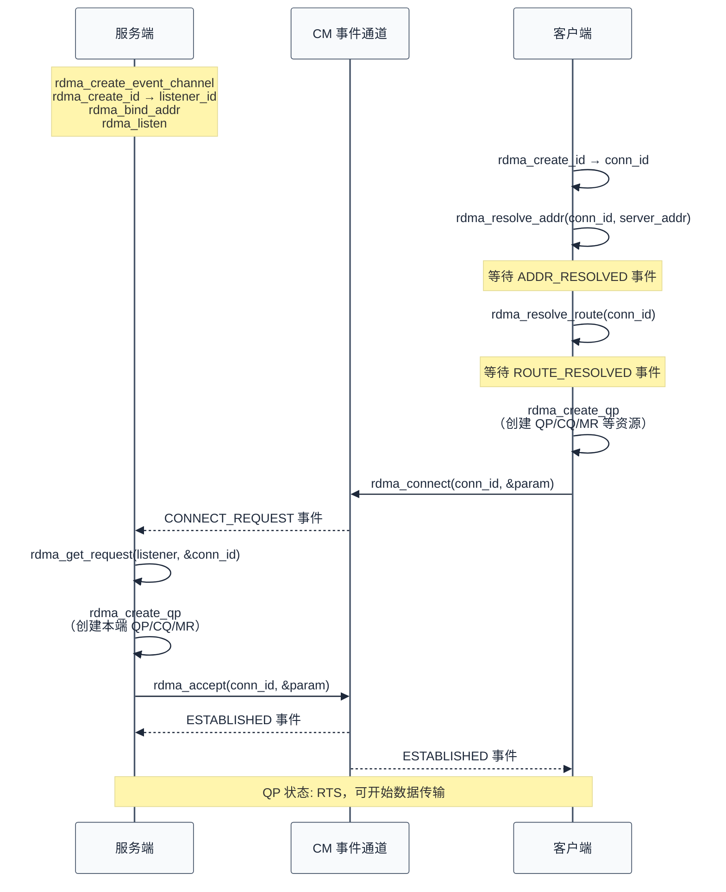
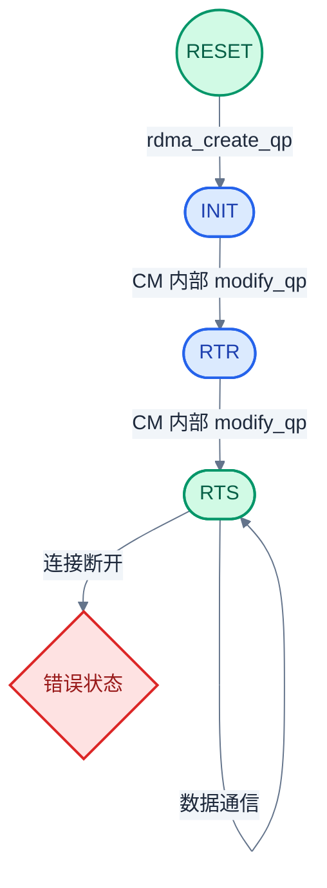
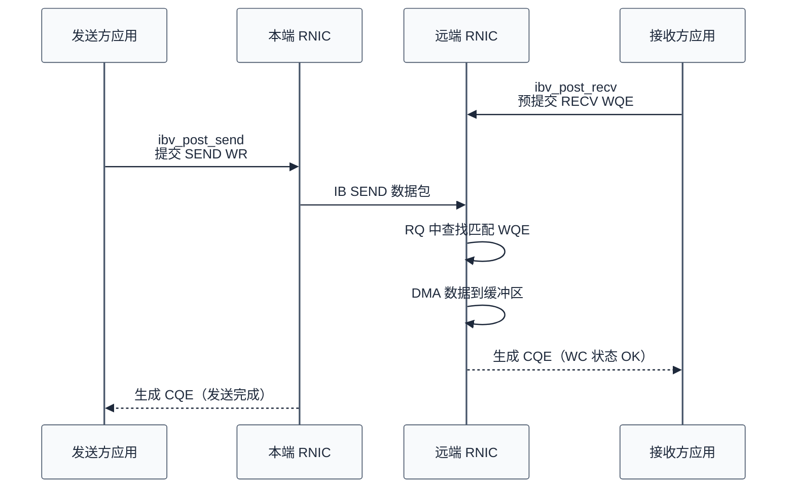
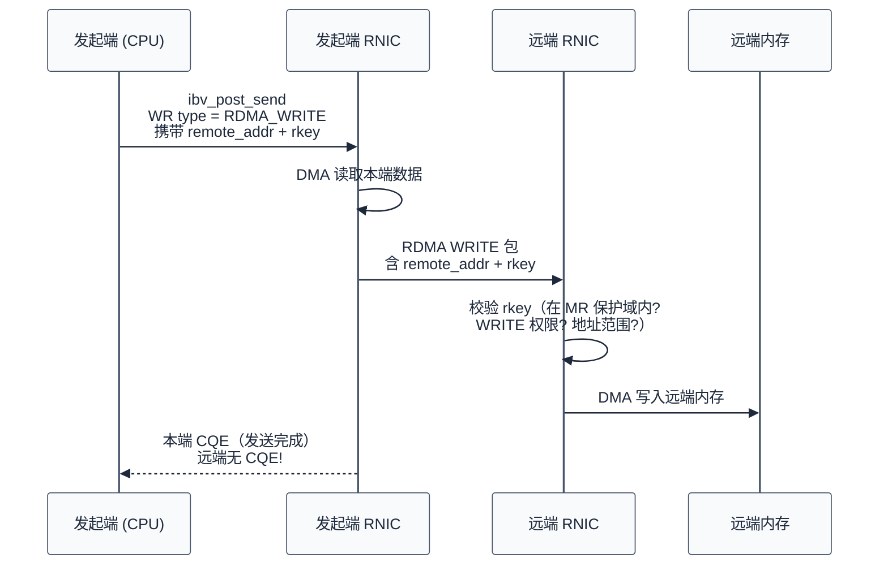

# RDMA 连接管理与数据操作

> RDMA CM 封装了 QP 状态机的自动化流转（RESET→INIT→RTR→RTS），SEND/RECV 提供可靠的双边通信，RDMA READ/WRITE 实现零 CPU 参与的单边数据搬运。理解这些操作的语义边界，是写出正确 RDMA 程序的关键。

### 关键术语

| 缩写 | 全称 | 含义 |
|------|------|------|
| CM | Communication Manager | 连接管理器，负责 RC QP 的建连流程 |
| RC | Reliable Connection | 可靠连接型 QP，一对一、保证送达 |
| SEND | — | 双边发送操作，接收方必须预提交 RECV WQE |
| RECV | — | 双边接收操作，为对端的 SEND 声明接收缓冲区 |
| RDMA_WRITE | — | 单边写入操作，远程 CPU 零参与 |
| RDMA_READ | — | 单边读取操作，远程 CPU 零参与 |
| CAS | Compare And Swap | 原子比较并交换，远程验证相等后写入 |
| FADD | Fetch And Add | 原子获取并加，返回远程旧值 |
| IMM | Immediate Data | 即时数据，附加在 SEND/WRITE 中的 32 位值 |
| RNR | Receiver Not Ready | 接收方未就绪，RQ 为空时 RNIC 返回的 NAK 错误 |
| PSN | Packet Sequence Number | 包序列号，用于可靠传输的丢包检测与重传 |
| NAK | Negative Acknowledgement | 否定确认，接收方通知发送方需重传 |
| WQE | Work Queue Element | 工作队列元素，WR 被 RNIC 消费后的硬件描述符 |
| CQE | Completion Queue Element | 完成队列元素，描述一次完成的 WR 结果 |

---

## 概述

RDMA 的数据操作分两类：**双边操作**（SEND/RECV），要求通信双方都参与；**单边操作**（RDMA READ/WRITE），只有发起方 CPU 参与，远程 CPU 完全不知情。理解这两类操作的语义，先得理解连接建立——因为 QP 必须先进入 RTS（Ready To Send）状态，一切数据操作才有可能。

### 前置知识

| 需要了解 | 参考文档 |
|----------|----------|
| QP 队列对、CQ 完成队列、MR 内存区域的定义 | [03-rdma-core-abstractions.md](./03-rdma-core-abstractions.md) |
| Verbs API 对象层次与资源创建流程 | [04-rdma-verbs-api.md](./04-rdma-verbs-api.md) |

---

## 一、RDMA CM 连接管理

裸 Verbs API 中，RC QP 的状态机需要手动操控：用户依次调用 `ibv_modify_qp`，将 QP 从 RESET 推向 INIT、RTR、RTS，每步需要填充几十个字段。RDMA CM（librdmacm）封装了这一切——它用类 socket 的语义完成 QP 状态迁移，用户只需要关心业务逻辑。

### 1.1 连接建立流程

下面是 RC QP 的完整建连流程：



### 1.2 服务端代码骨架

```c
struct rdma_event_channel *ec = rdma_create_event_channel(NULL);
struct rdma_cm_id *listener = NULL;
rdma_create_id(ec, &listener, NULL, RDMA_PS_TCP);

struct sockaddr_in addr = {
    .sin_family = AF_INET,
    .sin_port   = htons(8888),
};
rdma_bind_addr(listener, (struct sockaddr *)&addr);
rdma_listen(listener, 16);

while (1) {
    struct rdma_cm_id *conn_id = NULL;
    rdma_get_request(listener, &conn_id);  // 阻塞等待客户端连接

    // 在 accept 之前创建本端资源
    struct ibv_qp_init_attr qp_attr = {
        .send_cq = cq,
        .recv_cq = cq,
        .cap     = { .max_send_wr = 64, .max_recv_wr = 64 },
        .qp_type = IBV_QPT_RC,
    };
    rdma_create_qp(conn_id, pd, &qp_attr);

    struct rdma_conn_param param = {
        .responder_resources = 8,
        .initiator_depth     = 8,
    };
    rdma_accept(conn_id, &param);
    // conn_id→verbs→qp 现在处于 RTS 状态
}
```

### 1.3 客户端代码骨架

```c
struct rdma_cm_id *conn_id = NULL;
rdma_create_id(NULL, &conn_id, NULL, RDMA_PS_TCP);

struct sockaddr_in server_addr = {
    .sin_family = AF_INET,
    .sin_addr   = { .s_addr = inet_addr("192.168.1.10") },
    .sin_port   = htons(8888),
};
rdma_resolve_addr(conn_id, NULL, (struct sockaddr *)&server_addr, 2000);

// 等待 ADDR_RESOLVED 事件，然后：
rdma_resolve_route(conn_id, 2000);

// 等待 ROUTE_RESOLVED 事件，然后创建 QP：
struct ibv_qp_init_attr qp_attr = { /* 同服务端 */ };
rdma_create_qp(conn_id, pd, &qp_attr);

struct rdma_conn_param param = { .responder_resources = 8, .initiator_depth = 8, };
rdma_connect(conn_id, &param);
// 等待 ESTABLISHED 事件
```

### 1.4 CM 背后的 QP 状态机

CM 屏蔽了 QP 状态机，但理解底层的迁移顺序有助于排查连接问题：



- **RESET→INIT**：创建 QP 后立刻进入 INIT。此时 QP 有了资源和 QPN，但还没有对端信息
- **INIT→RTR**（Ready To Receive）：需要填充远程 QPN、PSN 起始值、对端 GID/LID。到达 RTR 后可以接收数据，但不能发送
- **RTR→RTS**（Ready To Send）：填充超时参数、重试次数。到达 RTS 后 QP 完全就绪

CM 的 `rdma_accept` 和 `rdma_connect` 在事件驱动的回调中自动执行这两步 `ibv_modify_qp` 调用。

---

## 二、SEND / RECV 双边操作

### 2.1 核心语义

SEND 和 RECV 是 RDMA 中最基础的通信操作，也是其他高层语义的基石：

- 发送方通过 `ibv_post_send` 提交一个类型为 `IBV_WR_SEND` 的 WR，指定要发送的数据缓冲区（通过 SGE 列表描述）
- 接收方**必须先通过** `ibv_post_recv` 提交一个 `IBV_WR_RECV` 类型的 WR，预先在 RQ 中放置好接收缓冲区
- 当 SEND 数据到达时，RNIC 硬件从 RQ 中取出第一个 WQE，执行 DMA 将数据写入其 SGE 指向的缓冲区，然后生成 CQE

接收方的 WQE 被「消费」——一条 SEND 对应一条 RECV WQE，**严格 1:1 匹配**。



### 2.2 如果接收方没预提交 RECV

这是 RDMA 编程中最常见的错误场景。当 SEND 数据到达但 RQ 为空：

1. 远端 RNIC 返回 **RNR NAK**（Receiver Not Ready Negative Acknowledgement）
2. 本端 RNIC **自动重试**——重试次数由 QP 属性的 `min_rnr_timer` 和 `rnr_retry` 字段决定
3. 如果重试次数耗尽，QP 陷入错误状态，产生 CQE 状态码为 `IBV_WC_RNR_RETRY_EXC`

这个机制的设计初衷是：临时 RQ 枯竭不应立即拆毁连接，给应用一点时间补上 RECV WQE。

### 2.3 代码示例

```c
// ---------------------- SGE 结构说明 ----------------------
// struct ibv_sge 在 <infiniband/verbs.h> 中定义，此处仅作结构说明：
//     uint64_t addr;      // 数据缓冲区虚拟地址（必须在 MR 内）
//     uint32_t length;    // 数据长度
//     uint32_t lkey;      // MR 的本地密钥，RNIC 用于校验访问权限

// ---------------------- 发送端 ----------------------
struct ibv_sge send_sge = {
    .addr   = (uint64_t)(uintptr_t)send_buf,
    .length = 4096,
    .lkey   = mr->lkey,
};

struct ibv_send_wr send_wr = {
    .wr_id      = 0x1234,                   // 随意 ID，在 CQE 中匹配用
    .sg_list    = &send_sge,
    .num_sge    = 1,
    .opcode     = IBV_WR_SEND,              // 双边发送
    .send_flags = IBV_SEND_SIGNALED,        // 要求生成 CQE
};

struct ibv_send_wr *bad_wr;
ibv_post_send(qp, &send_wr, &bad_wr);

// ---------------------- 接收端（必须在收到数据前完成）----------------------
struct ibv_sge recv_sge = {
    .addr   = (uint64_t)recv_buf,
    .length = 4096,
    .lkey   = mr->lkey,
};

struct ibv_recv_wr recv_wr = {
    .wr_id   = 0x5678,
    .sg_list = &recv_sge,
    .num_sge = 1,
};

ibv_post_recv(qp, &recv_wr, &bad_wr);
```

> **坑点提醒**：`ibv_post_send` 和 `ibv_post_recv` 本身**立即返回**（非阻塞），数据真正完成时间由 CQE 决定。不要在 `ibv_post_send` 返回后立刻修改缓冲区。

---

## 三、RDMA READ / WRITE 单边操作

### 3.1 单边操作的核心价值

这是 RDMA 区别于传统 socket 的最核心特性：发起端向 RNIC 提交的 WR 中**直接携带远端内存的地址和 rkey**，远端 RNIC 据此直接 DMA 读写远端内存——远程主机 CPU 完全不参与。

对 HPC 和存储来说这意味着：
- 进程间数据搬运绕过 OS、绕过远程用户态
- 远程服务器可以专注于计算，而数据传输在后台自主进行
- 带宽基本受限于 PCIe/网络带宽，而非 CPU 拷贝速率

### 3.2 RDMA WRITE 流程



**关键结论**：
- 只有**发起端**收到 CQE——远端不产生任何完成通知
- 远端不需要任何 RECV WQE——单边操作不消耗 RQ
- 数据落地完全靠 RNIC 硬件校验 rkey 来做安全控制

### 3.3 参数交换（Out-of-Band）

发起端如何知道远端的 MR 地址和 rkey？这是面试和调优中常见的追问点：

| 交换方式 | 机制 | 适用场景 |
|----------|------|----------|
| **CM 私有数据** | `rdma_connect/rdma_accept` 的 `private_data` 字段（最多 256 字节） | 少量小 MR（如 ping-pong 缓冲区） |
| **TCP socket** | 先建 socket 交换 MR 信息，再走 RDMA 数据路径 | 生产环境常见方案 |
| **共享内存** | 同主机内多个进程通过 shm 交换 | 本机通信 |
| **RDMACM私数据 + 协商协议** | 在 CM 私数据中传 MR 列表地址，再通过 SEND/RECV 交换机密 | 复杂场景推荐 |

```c
// RDMA WRITE WR 构造
struct ibv_sge sge = { .addr = (uint64_t)local_buf, .length = 4096, .lkey = mr->lkey };

struct ibv_send_wr wr = {
    .wr_id      = 0,
    .opcode     = IBV_WR_RDMA_WRITE,
    .sg_list    = &sge,
    .num_sge    = 1,
    .send_flags = IBV_SEND_SIGNALED,
    .wr.rdma.remote_addr = remote_mr_addr,   // 对方 MR 基址 + 偏移
    .wr.rdma.rkey        = remote_mr_rkey,   // 对方 MR 的远程密钥
};

ibv_post_send(qp, &wr, &bad_wr);

// 同理，RDMA READ 用 IBV_WR_RDMA_READ：RNIC DMA 读取远端数据，写入本端缓冲区
```

### 3.4 RDMA READ 补充说明

RDMA READ 与 WRITE 结构对称：发起端指定 `remote_addr + rkey`，远端 RNIC DMA 读取远端内存→发送数据包→本端 RNIC DMA 写入本端缓冲区→本端 CQE。**同样远端无 CQE**。

---

## 四、Atomic 操作

RDMA 硬件实现了两种原子操作，在远端内存上直接执行，**不需要远端 CPU 参与**：

| 操作 | 全称 | 语义 |
|------|------|------|
| **CAS** | Compare And Swap | 原子比较：`if remote_val == compare_val → remote_val = swap_val`；始终**返回旧值** |
| **FADD** | Fetch And Add | 原子加：`old = remote_val; remote_val += add_val`；**返回旧值** |

硬件保证——即使多个并行线程同时访问同一地址——CAS 不会出现丢失更新。对外部网络并发来说，这种保证是 RDMA 独有的。

```c
// CAS: 尝试获取分布式锁（0 表示未锁定，1 表示锁定）
struct ibv_send_wr atomic_wr = {
    .opcode    = IBV_WR_ATOMIC_CMP_AND_SWP,
    .send_flags = IBV_SEND_SIGNALED,
    .wr.atomic.remote_addr  = lock_addr,
    .wr.atomic.rkey         = lock_rkey,
    .wr.atomic.compare_add  = 0,    // 期望值：锁空闲
    .wr.atomic.swap         = 1,    // 交换值：加锁
};

// FADD: 分布式计数器
/* wr.opcode = IBV_WR_ATOMIC_FETCH_AND_ADD; */
/* wr.atomic.compare_add = 1;  // 对远程计数器加 1，返回旧值 */
```

CAS 在分布式锁场景中直接被用作原子 Test-and-Set 操作：`if lock==0 → lock=1, return 0（成功）` else `return 1（失败）`。

**注意事项**：
- 远程操作地址**必须 8 字节对齐**
- 远程操作长度固定 8 字节
- 单次操作无法超过 8 字节
- 受限于现代 RDMA 硬件实现，非 NVIDIA Versatile 产品通常支持 CAS，但不保证

---

## 五、Immediate Data

### 5.1 Immediate Data 是什么

Immediate Data（即时数据）是一个附着在 SEND 或 RDMA WRITE 上的**32 位无符号值**。它不是数据缓冲区的一部分——它是硬件携带的元数据，出现在接收方的 CQE 中。

两种操作类型：

| 操作 | OpCode | 远端行为 |
|------|--------|----------|
| `SEND_WITH_IMM` | `IBV_WR_SEND_WITH_IMM` | 接收方 CQE 的 `wc.imm_data` 填充为 32 位值；常规 CQE |
| `RDMA_WRITE_WITH_IMM` | `IBV_WR_RDMA_WRITE_WITH_IMM` | **写入完成后，远端 RNIC 消耗下一个 RECV WQE**；接收方 CQE 含 `wc.imm_data`；本端 CQE 照常产生 |

`SEND_WITH_IMM` 语义与 SEND 相同——接收方已经有排队好的 RECV WQE。`IBV_SEND_IMMEDIATE` 只是标志位，表示 wr 中 `.imm_data` 字段有效。

### 5.2 RDMA_WRITE_WITH_IMM 的特殊性

这是**唯一一种**让 RDMA WRITE 在远端生成 CQE 的方式。工作原理：

1. RNIC 执行与普通 RDMA WRITE 相同的操作：DMA 读取本端数据，发送到远端，远端校验 rkey，DMA 写入
2. 特殊之处：写入完成后，远端的下一可用的 RECV WQE 被消耗，生成 CQE，同时 CQE 的 `imm_data` 字段被填入发送方指定的 imm_data 值
3. 这意味着应用可以在 WRITE 完成后**主动通知**远端有数据到达

```c
// SEND_WITH_IMM
wr.opcode = IBV_WR_SEND_WITH_IMM;
wr.imm_data = htonl(0xDEADBEEF);   // 32 位用户值

// RDMA_WRITE_WITH_IMM
wr.opcode = IBV_WR_RDMA_WRITE_WITH_IMM;
wr.imm_data = htonl(MESSAGE_COOKIE);

// 接收方: WC 中的 imm_data 自动获取
struct ibv_wc wc;
ibv_poll_cq(cq, 1, &wc);
uint32_t cookie = ntohl(wc.imm_data);
```

这种方法在 RPC 风格的 RDMA 消息传输中被广泛采用——发送方 WRITE 到接收方的命名缓冲区池，同时附带 cookie 接收方可以索引到具体的缓冲区。

---

## 六、操作对比总结

| 操作类型 | 需要远端 CPU? | 需要远端 RECV WQE? | 远端生成 CQE? | 方向 | 典型用途 |
|----------|:-------------:|:------------------:|:------------:|------|----------|
| **SEND** | 否 | **是**，必须预提交 | 是，常规 | 本→远 | RPC、控制消息 |
| **RECV** | N/A（本地） | N/A（本端操作） | N/A | — | 声明接收缓冲区 |
| **SEND_WITH_IMM** | 否 | **是**，必须预提交 | 是，含 imm_data | 本→远 | 带标签的控制消息 |
| **RDMA_WRITE** | **零** | **不需要** | **无** | 本→远 | 存储落盘、数据推送 |
| **RDMA_WRITE_WITH_IMM** | **零** | **是**（写入后消耗一条） | 是，含 imm_data | 本→远 | 推送完成后通知远端 |
| **RDMA_READ** | **零** | **不需要** | **无** | 本←远 | 分布式数据库读取、数据拉取 |
| **ATOMIC_CAS** | **零** | **不需要** | **无** | 本→远（往返） | 分布式锁 |
| **ATOMIC_FADD** | **零** | **不需要** | **无** | 本→远（往返） | 分布式计数器 |

四个核心规则：
1. **只阅读键（rkey）的合法性——不是 MR 的保护——就能发起单边操作**——APM 需要可靠的带外密钥交换
2. SEND/RECV 兜底——一切无基础保护的需求都用双边操作
3. WRITE_WITH_IMM 是唯一让远端感知的 WRITE 变体
4. `ibv_post_recv` 迟一次可以容忍，但重试耗尽就是连接终局

以上规则的核心思路是：单边操作用 rkey 管理信任边界，双边操作用预提交机制兜底。理解了这六种操作的语义与边界，下一步是理解让它们成立的基础——内存管理。

---

## 参考资料

- [RDMA Aware Networks Programming Manual (Mellanox)](https://docs.nvidia.com/networking/display/RDMAAware) — IBV_WR_SEND 等 OpCode 的完整说明
- [librdmacm 源码 (OFED defunct.tar.gz)](https://github.com/linux-rdma/rdma-core/tree/master/librdmacm) — 实际 CM 调试时最直接的参考
- [InfiniBand Architecture Specification 1.5](https://www.infinibandta.org) — QP 状态机指定 (Vol 1, Ch 10)

---

## 下一篇

- [06-rdma-memory-management.md](./06-rdma-memory-management.md) — 内存管理深入：MR 注册策略、IOMMU、GPUDirect