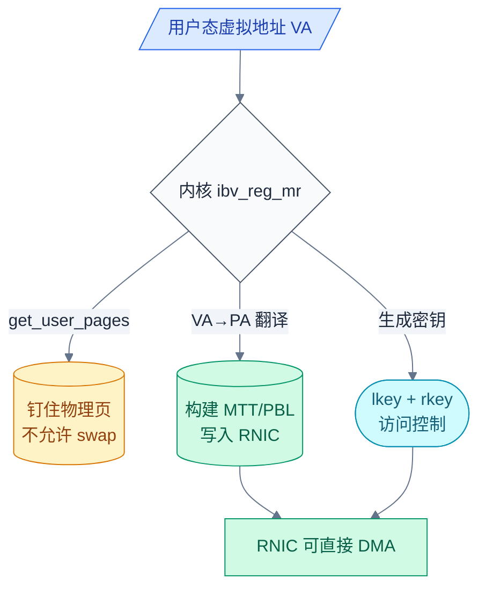
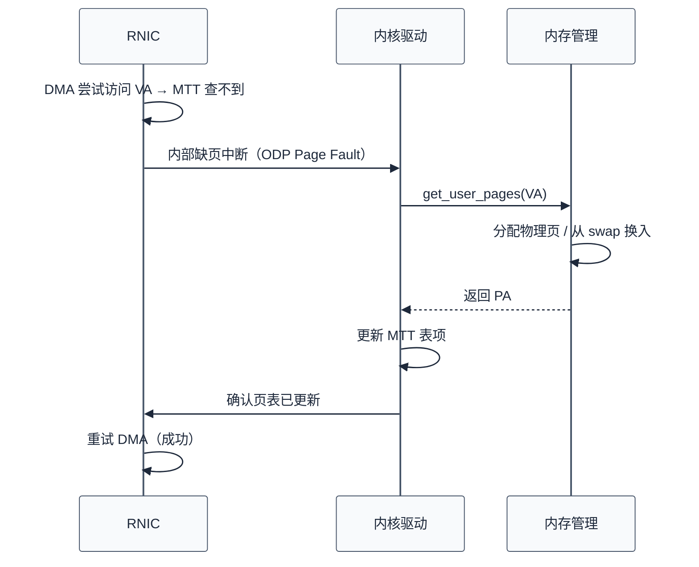
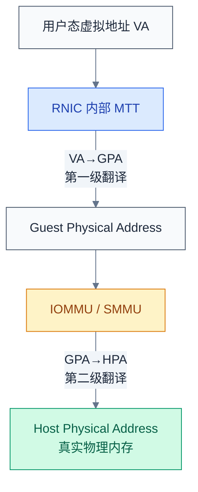
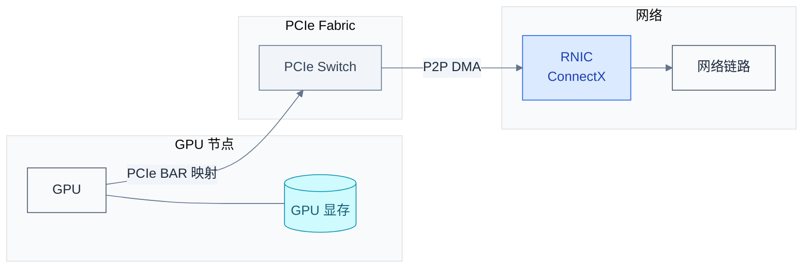

# RDMA 内存管理深入

> MR 注册不是多余的 API 调用——它是 RDMA 实现 kernel bypass 的安全代价。从页面钉住到 MTT 编程，从 Memory Window 动态权限到 GPUDirect 跨设备 DMA，这一层决定了数据路径的效率和灵活度。

### 关键术语

| 缩写 | 全称 | 含义 |
|------|------|------|
| MR | Memory Region | 内存区域，向 RNIC 注册后的虚拟地址空间片段 |
| MTT | Memory Translation Table | 内存转换表，RNIC 内部 VA→PA 的页表结构 |
| PBL | Physical Buffer List | 物理缓冲区列表，存放 PA 链表的另一种 MR 结构 |
| ODP | On-Demand Paging | 按需分页，RNIC 缺页时触发 CPU 处理而非直接失败 |
| MW | Memory Window | 内存窗口，可动态绑定到 MR 子区域的轻量级访问控制对象 |
| IOMMU | I/O Memory Management Unit | I/O 内存管理单元，将设备 DMA 地址转换为物理地址 |
| SMMU | System MMU | ARM 架构下的系统 MMU，功能等同 IOMMU |
| VT-d | Intel Virtualization Technology for Directed I/O | Intel 的 IOMMU 实现 |
| GPUDirect | — | NVIDIA 技术，允许 RNIC 通过 PCIe BAR 直接访问 GPU 显存 |
| PeerDirect | — | PCIe P2P DMA 技术，允许 RNIC 直接访问 NVMe SSD |
| lkey | Local Key | 本地密钥，本端 RNIC 发起内存访问时校验 |
| rkey | Remote Key | 远程密钥，远端 RNIC 发起 RDMA 操作时校验 |
| DMA | Direct Memory Access | 直接内存访问，设备不经过 CPU 直接读写内存 |

---

## 概述

在传统 socket 编程中，`write(sockfd, buf, len)` 的内存管理工作由内核代劳：缺页了内核帮你处理，TLB miss 了硬件帮你填。但 RDMA 走 kernel bypass 数据路径，RNIC 自己执行 DMA——它没有 CPU 的页表遍历能力，也没有内核的缺页处理流程。MR 注册就是填补这个鸿沟：把用户态虚拟地址翻译成 RNIC 能理解的物理地址表，同时把页面锁在内存中。

### 前置知识

| 需要了解 | 参考文档 |
|----------|----------|
| QP/CQ/MR/PD 的定义与职责，lkey/rkey 概念 | [03-rdma-core-abstractions.md](./03-rdma-core-abstractions.md) |
| RDMA READ/WRITE 单边操作中 rkey 的使用 | [05-rdma-connection-and-operations.md](./05-rdma-connection-and-operations.md) |

---

## 一、为什么需要 MR 注册

### 1.1 三个核心技术原因



**原因 ①：RNIC 需要物理地址做 DMA**

CPU 通过 MMU 将虚拟地址（VA）转为物理地址（PA），这个过程对软件透明。但 RNIC 没有 MMU——它有一张自己的地址转换表（MTT 或 PBL）。`ibv_reg_mr` 的核心工作就是把用户态的 VA 区间翻译成一组 PA 列表，写入这张表。

**原因 ②：页面必须被钉住（pin）**

RNIC 的 DMA 是异步的——数据到达的时间可能比 `ibv_post_send` 晚几微秒甚至几毫秒。如果在这期间内核把相关页面换出（swap），RNIC 的 DMA 会写入错误地址——而且没有 CPU 缺页处理器来拦截和修复。解决方案简单粗暴：注册时调用 `get_user_pages` 将页面锁死在物理内存中，直到 `ibv_dereg_mr`。

**原因 ③：lkey/rkey 提供访问控制**

RNIC 每次 DMA 访问都会校验 WQE 中的 `lkey`（本端操作）或数据包中的 `rkey`（远程操作）是否匹配 MR 注册时分配的密钥。密钥不匹配→访问拒绝。这是 kernel bypass 模型下的安全最后一道防线——RNIC 不会替内核做权限检查，只会比对密钥。

### 1.2 注册流程中的数据流

`ibv_reg_mr(pd, addr, length, access_flags)` 的内部流程：

1. 内核驱动调用 `get_user_pages(addr, length)`，锁住页面并获取 `struct page` 数组
2. 对每个 `struct page` 提取物理地址 `page_to_phys(page)`
3. 将 PA 列表构建成 RNIC 格式的 MTT（多级页表）或 PBL（链表）
4. 通过固件接口（如 ConnectX 的 `CREATE_MKEY` 命令）编程到 RNIC
5. 返回 `lkey` 和 `rkey`（可以是同一个值，具体由硬件实现决定）

---

## 二、注册开销与策略

### 2.1 注册的成本

`ibv_reg_mr` 不是免费的。以 1GB 内存为例：

| 步骤 | 耗时占比 | 说明 |
|------|:--------:|------|
| `get_user_pages`（pin 页面） | ~60% | 1GB = 262,144 个 4KB 页，逐个 pin |
| 构建 MTT 页表 | ~25% | 多级页表需要填充每级表项 |
| 编程 RNIC 固件 | ~15% | 固件命令 + 等待硬件确认 |

典型耗时：1GB 注册约 **10-50ms**（取决于 CPU 频率和页面是否已在内存中），256MB 约 3-10ms，4KB 小块约 5-15μs。

### 2.2 三种注册策略

| 策略 | 原理 | 优势 | 劣势 | 适用场景 |
|------|------|------|------|----------|
| **静态注册** | 初始化时注册所有要用到的 MR，运行期不复用 | 零运行时开销，数据路径最快 | 浪费钉住内存（不能 swap），大内存系统不适用 | HPC 固定缓冲区、ping-pong |
| **动态注册** | 每次 I/O 前注册，完成后 deregister | 灵活，内存可 swap | 每次 I/O 额外 10-50ms 延迟 | 慢速存储、灵活性优先场景 |
| **ODP**（按需分页） | 不 pin 页，RNIC 缺页时硬件触发 CPU 处理 | 零显式注册，无限虚拟内存 | 缺页延迟 50-100μs，仅 NVIDIA 硬件支持 | 数据库、内存池、大容量服务 |

### 2.3 静态注册代码示例

```c
// 初始化时注册大片内存池
#define POOL_SIZE (1UL << 30)  // 1GB

char *pool = mmap(NULL, POOL_SIZE, PROT_READ | PROT_WRITE,
                  MAP_PRIVATE | MAP_ANONYMOUS | MAP_HUGETLB, -1, 0);
if (pool == MAP_FAILED) {
    // MAP_HUGETLB 失败常见原因：未预先分配大页
    // echo 512 > /proc/sys/vm/nr_hugepages   (分配 512 个 2MB 大页)
    perror("mmap MAP_HUGETLB");
    exit(1);
}

struct ibv_mr *pool_mr = ibv_reg_mr(pd, pool, POOL_SIZE,
    IBV_ACCESS_LOCAL_WRITE   |
    IBV_ACCESS_REMOTE_WRITE  |
    IBV_ACCESS_REMOTE_READ   |
    IBV_ACCESS_REMOTE_ATOMIC);

// 运行期：每次 RDMA WRITE 用 pool + offset + pool_mr->lkey
// 无需再注册或 deregister
```

> **大页优化**：`MAP_HUGETLB` 将单页从 4KB 提升到 2MB 或 1GB。对 1GB 内存池：4KB 页需 262K 个页表项，2MB 页仅需 512 个——MTT 表体积缩减 512 倍，注册时间和 RNIC 片上 SRAM 占用都大幅降低。

---

## 三、On-Demand Paging（ODP）

### 3.1 工作原理

ODP 改变了 MR 注册的语义：注册时不再 pin 页面，只建一个「空壳」MR。当 RNIC 第一次访问某个未映射的虚拟地址时：



与传统 CPU 缺页的关键区别：
- CPU 缺页是**同步**的：进程被挂起，等缺页处理完才继续执行
- ODP 缺页是**异步**的：RNIC 发出中断后可以处理其他 QP 的流量，被中断的 DMA 操作稍后重试

### 3.2 ODP 类型

| 类型 | 创建方式 | 页面状态 | 内存开销 |
|------|----------|----------|:--------:|
| **Explicit ODP** | `ibv_reg_mr` + `IBV_ACCESS_ON_DEMAND` | 注册时 MR 存在但页空；按需 pin | 小（MR 元数据） |
| **Implicit ODP** | 不需要 `ibv_reg_mr`，任意已分配内存都是隐式可 RDMA 的 | 完全按需 | 几乎为零 |

Implicit ODP 是 NVIDIA ConnectX-5+ 的专有特性：应用程序不需要任何 `ibv_reg_mr` 调用，任何 `malloc` 出来的内存都可以直接作为 RDMA 的 src/dst 缓冲区。但代价是**每次首次访问都可能触发缺页中断**，延迟 50-100μs。

### 3.3 适用性

ODP 对以下场景几乎是必选项：
- 数据库（buffer pool 巨大，无法全部 pin）
- JVM/解释型语言（堆动态分配，无法预知哪些区域会用于 RDMA）
- 容器化部署（内存过量分配，物理页面不确定）

限制：**仅 NVIDIA/Mellanox ConnectX-4 及以上**支持 ODP，且需要加载 `mlx5` 驱动并确保固件版本 ≥ 12.20。

---

## 四、Memory Window（MW）

### 4.1 MW vs MR：动态 vs 静态

MR 一旦注册，其基地址、长度、remote access 权限都不可变。这对安全场景不友好：如果你想让对端写入你的某个 4KB 缓冲区，最小粒度的注册对象是整个 MR——对端看到的是全部。MW 解决了这个粒度问题。

| 对比维度 | **MR** | **MW** |
|----------|--------|--------|
| 生命周期 | 注册后持久，直到 deregister | 分配后反复 bind/unbind |
| 权限 | 注册时固定 | 每次 bind 时指定 |
| 地址范围 | 注册时固定 | bind 时可以指定 MR 的偏移和子范围 |
| 拥有者 | PD | Type 1：特定 QP；Type 2：任意 QP（同 PD 内） |
| 用途 | 长期暴露的缓冲区 | 临时授权（grant-then-revoke） |

### 4.2 Type 1 vs Type 2

```
| 对比维度 | Type 1 MW | Type 2 MW |
|---------|-----------|-----------|
| **绑定对象** | 绑定到**特定 QP** | 可在**同一 PD 内任意 QP** 绑定 |
| **使用约束** | 绑定后仅该 QP 可用此 MW | 授予之后需保管 MW 句柄 |
| **吊销方式** | unbind，该 QP 即时无法再用 | unbind，所有持有旧 rkey 的远端失效 |
| **远程权限** | 绑定时可重置 | 绑定时可重置 |

现代 RDMA 实践中 Type 1 也较少使用——MW 总体而言是边缘特性，多数场景直接用多 MR 分区方案。

### 4.3 使用流程

```c
// 1. 分配 MW（父 PD 与 MR 相同）
struct ibv_mw *mw = ibv_alloc_mw(pd, IBV_MW_TYPE_2);
if (!mw) { perror("ibv_alloc_mw"); exit(1); }

// 2. 绑定：限制远程可见范围为 MR 的子区间，并授予 remote write 权限
struct ibv_mw_bind bind = {
    .wr_id               = 0,
    .send_flags          = IBV_SEND_SIGNALED,
    .bind_info.mr         = mr,
    .bind_info.addr       = (uint64_t)mr->addr + OFFSET_1GB,
    .bind_info.length     = 4 * 1024,              // 仅 4KB
    .bind_info.mw_access_flags = IBV_ACCESS_REMOTE_WRITE,
};

struct ibv_send_wr *bad;
ibv_bind_mw(qp, mw, &bind, &bad);

// 3. 获取 CQE 后，rkey 更新为 mw->rkey（每次绑定重新生成）
uint32_t temp_rkey = mw->rkey;

// 4. 将 rkey 传给远端 → 远端 WRITE 临时区间

// 5. 吊销：发送 INVALIDATE 命令
/* 后续远端再用此 rkey → RNIC 拒绝访问 */
```

MW 适用于**临时授予 remote write 权限**的场景：服务器暴露一个大 MR，但对每个客户端只在它需写入时才 bind 一个窄窗口给该客户端——写入完成后 unbind。即使客户端积压了 rkey 也没用。

---

## 五、IOMMU/SMMU 交互

### 5.1 双重地址转换

当系统启用 IOMMU（Intel VT-d / AMD-Vi / ARM SMMU）时，RNIC 的 DMA 路径要经过两级转换：



第一级（RNIC MTT）：`VA → GPA`——和普通 MR 注册相同。如果系统没有虚拟化，GPA 就是 HPA。第二级（IOMMU）：`GPA → HPA`——在虚拟化场景下，GPA 是虚拟机看到的「假物理地址」，IOMMU 执行最终翻译。

### 5.2 性能影响与权衡

IOMMU 的页表遍历需要访问内存（走 IOMMU 自己的 I/O 页表），每次 4KB 边界上的翻译大致消耗 100-200ns：

| 维度 | **IOMMU 开启** | **IOMMU 关闭 / Passthrough** |
|------|:-----------:|:------------------------:|
| RNIC DMA 延迟增量 | +100-200ns/4KB | 0 |
| RDMA 最大带宽影响 | I/O 页表容量可成为瓶颈 | 无影响 |
| 内存隔离 | **有**，VM/容器不能逃逸 | **无** |
| PCIe ACS 支持 | 需要 | 不需要 |
| 安全合规 | 满足大多数企业安全策略 | 裸金属 RDMA 部署通常需要豁免审批 |

对于物理机上的裸 RDMA 部署，**IOMMU passthrough 或禁用**是目前常见的性能调优手段——因为物理单租户系统不需要 DMA 隔离。但容器和 VM 场景中 IOMMU 是必不可少的。

查看 IOMMU 状态：
```bash
dmesg | grep -i iommu
# 或
ls /sys/kernel/iommu_groups/ 2>/dev/null
```

---

## 六、GPUDirect RDMA & PeerDirect

### 6.1 传统路径 vs GPUDirect

传统 RDMA 访问 GPU 显存的路径：GPU → GPU 显存 → CUDA memcpy → CPU DRAM → RNIC DMA read → 网络。两段数据传输，依赖 CPU，延迟翻倍。

GPUDirect RDMA 的直接路径：RNIC 通过 PCIe BAR 直接 DMA 读写 GPU 显存，完全不经过 CPU DRAM：



### 6.2 启用 GPUDirect RDMA

条件：
1. NVIDIA GPU：Tesla/Quadro/Ampere 架构及以上，driver ≥ 450
2. Mellanox ConnectX-4 及以上，MLNX_OFED ≥ 4.7
3. 加载 `nvidia-peermem` 内核模块：暴露 GPU BAR 空间供 `ibv_reg_mr` 注册
4. PCIe 拓扑：GPU 和 RNIC 必须在同一 PCIe root complex 下（P2P DMA 不需要穿越 CPU）

验证：
```bash
# 检查 nvidia-peermem 是否加载
lsmod | grep nvidia_peermem

# PCIe 拓扑：GPU 和 RNIC 在同一 root complex?
lspci -t | grep -E "NVIDIA|Mellanox"
```

### 6.3 PeerDirect：RNIC ↔ NVMe SSD

PeerDirect 是 GPUDirect 的同理扩展，目标从 GPU 换成 NVMe SSD：RNIC 直接通过 PCIe P2P DMA 读写 NVMe SSD。这意味着数据可以从网络流入直接落盘，或从盘读出直接发送——全程不需要经过 CPU DRAM。

数据流对比：

| 路径 | 传统 Flow | PeerDirect Flow |
|------|-----------|-----------------|
| 网络→存储 | Network→RNIC→CPU DRAM→NVMe | Network→RNIC→NVMe SSD |
| 存储→网络 | NVMe→CPU DRAM→RNIC→Network | NVMe SSD→RNIC→Network |
| CPU 参与 | 两次 memcpy | 零 |

技术栈要求：内核 `pci-peer-direct` + 支持 PCIe ACS Direct Translate 功能的 NVMe SSD控制器。市场上的支持有限——这仍然是先进特性。

### 6.4 注册 GPU 内存

```c
// 1. 分配 GPU 内存
cudaMalloc(&gpu_buf, BUF_SIZE);

// 2. 注册到 RDMA MR（需要 nvidia-peermem 已加载）
struct ibv_mr *gpu_mr = ibv_reg_mr(pd, gpu_buf, BUF_SIZE,
    IBV_ACCESS_LOCAL_WRITE | IBV_ACCESS_REMOTE_WRITE | IBV_ACCESS_REMOTE_READ);
if (!gpu_mr) {
    perror("ibv_reg_mr GPU memory");
    exit(1);
}

// 3. 正常使用 RDMA WRITE——RNIC 直接 DMA GPU 显存
/* wr.sg_list[0].addr = (uint64_t)gpu_buf; */
/* wr.sg_list[0].lkey = gpu_mr->lkey;      */
```

---

## 参考资料

- [NVIDIA GPUDirect RDMA Documentation](https://docs.nvidia.com/cuda/gpudirect-rdma/) — GPUDirect 的完整原理与配置

---

## 下一篇

- [07-rdma-transport-and-hardware.md](./07-rdma-transport-and-hardware.md) — 传输层协议与 RNIC 硬件流水线
- [RDMA Core: Memory Region Management (GitHub)](https://github.com/linux-rdma/rdma-core/blob/master/libibverbs/memory.c) — `ibv_reg_mr` 用户态代码
- [linux/drivers/infiniband/core/umem.c](https://github.com/torvalds/linux/blob/master/drivers/infiniband/core/umem.c) — `ib_umem_get` (get_user_pages 内核侧)
- [Mellanox: On-Demand Paging Deep Dive](https://docs.nvidia.com/networking/display/OFEDv502030/On-Demand+Paging) — ODP 使用方法与调试
- [Intel VT-d Specification](https://www.intel.com/content/www/us/en/developer/articles/technical/intel-sdm.html) — IOMMU IO页表结构