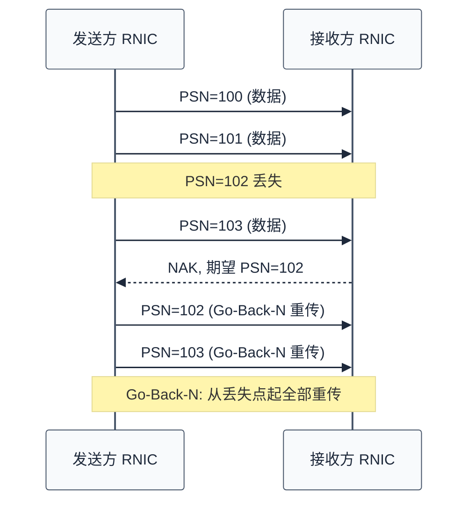
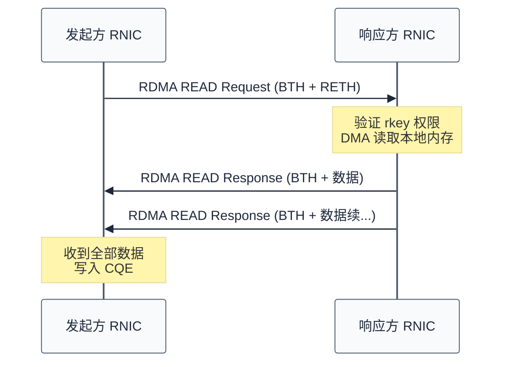
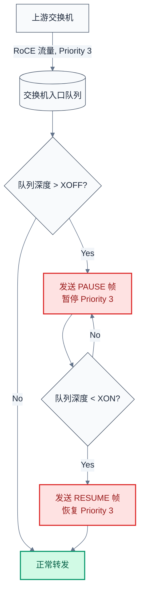
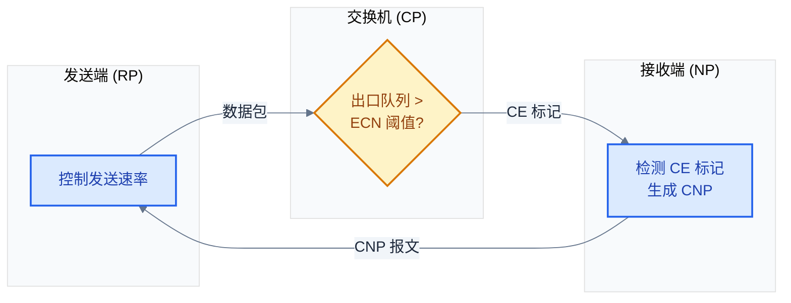
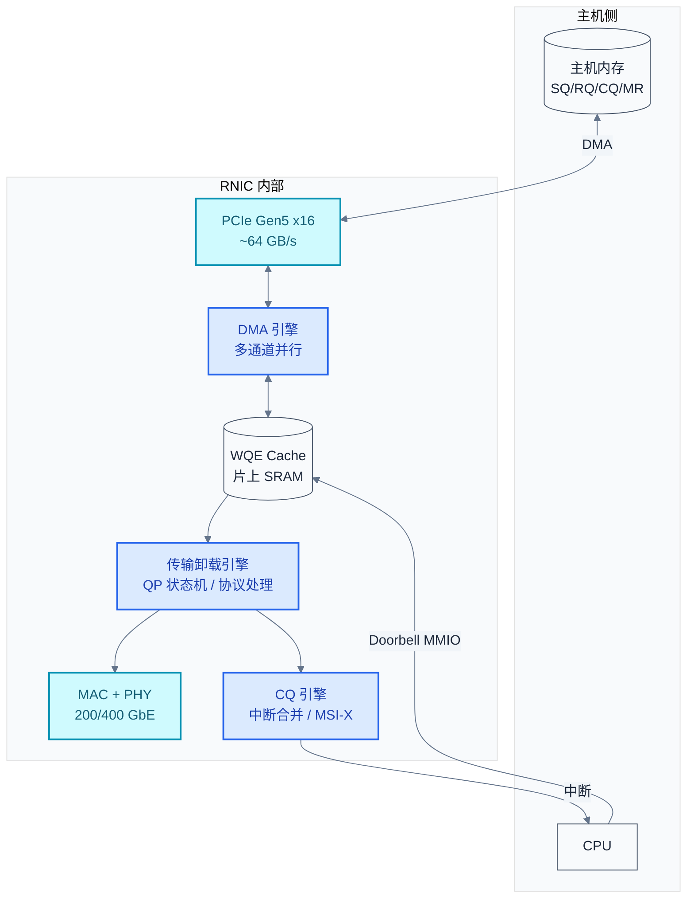

# 传输层与硬件架构

> RDMA 的性能优势来自两个层面：传输层用硬件实现了可靠性与拥塞控制，硬件架构用专用流水线将协议处理完全卸载。两者合在一起，才实现了"CPU 零参与"的数据搬运。

### 关键术语

| 缩写 | 全称 | 含义 |
|------|------|------|
| PSN | Packet Sequence Number | 包序列号，24 位，RC 可靠传输的核心字段 |
| Go-Back-N | — | 回退 N 步重传，IB 链路层默认重传策略 |
| RNR NAK | Receiver Not Ready Negative Acknowledgment | 接收方未就绪否定确认 |
| BTH | Base Transport Header | IB 基础传输头，12 字节 |
| RETH | RDMA Extended Transport Header | RDMA 扩展传输头，16 字节 |
| PFC | Priority-based Flow Control | 基于优先级的流量控制（IEEE 802.1Qbb） |
| ECN | Explicit Congestion Notification | 显式拥塞通知（RFC 3168） |
| DCQCN | Data Center Quantized Congestion Notification | 数据中心量化拥塞通知 |
| RP | Reaction Point | DCQCN 速率调节点（发送端 RNIC） |
| CP | Congestion Point | DCQCN 拥塞检测点（交换机） |
| NP | Notification Point | DCQCN 拥塞通告点（接收端 RNIC） |
| CNP | Congestion Notification Packet | DCQCN 拥塞通知报文 |
| SRQ | Shared Receive Queue | 共享接收队列 |
| DC | Dynamically Connected | 动态连接传输（Mellanox 专有） |
| DDIO | Data Direct I/O | Intel CPU 的 DMA 数据 LLC 缓存技术 |
| HoL | Head-of-Line Blocking | 队头阻塞 |

---

## 概述

RDMA 的"快"来自两个硬件卸载：**传输层的可靠性协议**（ACK/NAK/重传）在 RNIC 硅片中完成，不需要内核 TCP 栈；**RNIC 硬件流水线**将 WQE 解析、DMA 搬运、协议封装、包收发全部并行化处理。本章先讲协议面的可靠传输和无损网络，再讲硬件面的 RNIC 内部架构。

### 前置知识

| 需要了解 | 参考文档 |
|----------|----------|
| QP 基本概念与类型 | [03-rdma-core-abstractions.md](./03-rdma-core-abstractions.md) |
| 三大传输协议对比 | [02-rdma-transport-protocols.md](./02-rdma-transport-protocols.md) |
| Memory Region 注册原理 | [06-rdma-memory-management.md](./06-rdma-memory-management.md) |

---

## 一、RC 可靠传输协议

### 1.1 包序列号（PSN）

RC（Reliable Connection）传输的可靠性基石是 PSN（Packet Sequence Number，包序列号）。PSN 是一个 24 位字段，每个 RC QP 独立维护：

| 角色 | PSN 用途 |
|------|---------|
| **发送方** | 每个数据包 PSN 递增 1，请求应答包（AckReq=1）也占一个 PSN |
| **接收方** | 期望下一个包的 PSN = 上次收到的 PSN + 1 |

当接收方收到的 PSN 与期望不符时，触发 NAK（Negative Acknowledgment）：



### 1.2 Go-Back-N 的代价

IB 传输层默认使用 **Go-Back-N** 重传策略：一旦丢包，从丢失的 PSN 起重新发送**所有后续包**，即使只有1个包丢失。这在 200GbE+ 速率下代价极高——一个丢包可能触发数百 KB 的无效重传。这也是为什么 RDMA 网络必须是**无损的**：丢包对性能是灾难性的。

Mellanox/NVIDIA 在 ConnectX-4 后引入了硬件级选择性重传来缓解此问题，但无损网络仍然是 RoCE 部署的前提条件。

### 1.3 RNR NAK

除了丢包 NAK，还有一类特殊的 NAK：**RNR NAK**（Receiver Not Ready）。当接收方 QP 的 Receive Queue 中没有预提交的 RECV WQE 时，RNIC 无法将到达的数据 DMA 到应用内存，只能回复 RNR NAK。发送方收到后**指数退避**重试，极大增加延迟。

> **工程师结论**：RECV WQE 必须预提交，且接收队列（RQ）深度要足够深以避免占用到 RNR NAK 重试极限。

---

## 二、IB 包格式详解

### 2.1 BTH（Base Transport Header）

BTH 是 IB/RoCE 共用的核心头部，12 字节：

| 字段 | 位宽 | 含义 |
|------|:----:|------|
| **Opcode** | 8 | 操作类型：SEND_FIRST/MIDDLE/LAST/ONLY、RDMA_WRITE/READ_REQ、ACK 等 |
| SE | 1 | Solicited Event（是否触发接收方完成事件） |
| MigReq | 1 | 迁移请求（已废弃） |
| PadCount | 2 | 尾部填充字节数 |
| TVer | 4 | 传输头版本（固定 0） |
| **P_Key** | 16 | 分区键（IB 安全隔离） |
| F/Res1 | 8 | 保留 |
| **DestQP** | 24 | 目标 QP 编号 |
| AckReq | 1 | 请求对方发送 ACK |
| Res2 | 7 | 保留 |
| **PSN** | 24 | 包序列号 |

### 2.2 RETH（RDMA Extended Transport Header）

RDMA READ/WRITE 操作需要 RETH（16 字节），携带远程内存访问信息：

```
 0                   1                   2                   3
 0 1 2 3 4 5 6 7 8 9 0 1 2 3 4 5 6 7 8 9 0 1 2 3 4 5 6 7 8 9 0 1
+-+-+-+-+-+-+-+-+-+-+-+-+-+-+-+-+-+-+-+-+-+-+-+-+-+-+-+-+-+-+-+-+
|                    Virtual Address (高 32 位)                    |
+-+-+-+-+-+-+-+-+-+-+-+-+-+-+-+-+-+-+-+-+-+-+-+-+-+-+-+-+-+-+-+-+
|                    Virtual Address (低 32 位)                    |
+-+-+-+-+-+-+-+-+-+-+-+-+-+-+-+-+-+-+-+-+-+-+-+-+-+-+-+-+-+-+-+-+
|                         Remote Key (32 位)                      |
+-+-+-+-+-+-+-+-+-+-+-+-+-+-+-+-+-+-+-+-+-+-+-+-+-+-+-+-+-+-+-+-+
|                       DMA Length (32 位)                        |
+-+-+-+-+-+-+-+-+-+-+-+-+-+-+-+-+-+-+-+-+-+-+-+-+-+-+-+-+-+-+-+-+
```

三个字段的含义：
- **Virtual Address**：远程 MR 内的偏移地址，64 位
- **Remote Key（rkey）**：远端 MR 注册时分配的密钥，RNIC 由此验证访问权限
- **DMA Length**：本次 RDMA 操作的数据长度（字节）

### 2.3 RDMA READ 的包交换流程



RDMA READ 是一次"请求-响应"交互：发起方发送 RETH，响应方 RNIC **自己**读本地内存并返回数据——响应方 CPU 全程不参与。

---

## 三、RoCE 无损网络机制

RoCE v2 基于 UDP/IP，UDP 本身不提供可靠性，因此 RoCE 需要在以太网层面构建**无损传输环境**。核心机制是 PFC（防丢包）与 ECN/DCQCN（防拥塞）。

### 3.1 PFC（Priority-based Flow Control）

PFC 是 IEEE 802.1Qbb 标准，为以太网引入了**逐优先级**的链路级流控：



PFC 的阈值设计至关重要：

| 参数 | 含义 | 设置原则 |
|------|------|---------|
| XOFF 阈值 | 触发 PAUSE 的入队深度 | 足够低，留给上游"刹车"时间 |
| XON 阈值 | 触发 RESUME 的入队深度 | 足够高，避免 PAUSE/RESUME 震荡 |
| **Headroom Buffer** | PAUSE 生效前仍可能到达的包量 | `(2 × 线缆延迟 + 交换机响应时间) × 线速` |

> Headroom 不足 → PAUSE 来不及生效 → 丢包 → Go-Back-N 重传 → 性能崩塌。

### 3.2 PFC 的三类问题

| 问题 | 描述 |
|------|------|
| **HoL Blocking** | 一个优先级被 PAUSE，同链路上其他优先级不受影响（比普通流控好），但被 PAUSE 的优先级上所有流都被阻塞 |
| **PFC Storm** | 拥塞点 PAUSE 上游 → 上游也被反压 → 继续向上传播，形成"静默区域" |
| **PFC Deadlock** | 环形拓扑中，多个端口互相 PAUSE，形成循环等待，无人发送 RESUME |

正是因为 PFC 有这些局限，DCQCN 才被设计出来：用端到端的速率控制**减少 PFC 触发次数**。

### 3.3 ECN 标记机制

ECN（RFC 3168）在 IP 头 ToS 字段的低 2 位中承载拥塞信号：

| bits 6-7 | 含义 |
|:--------:|------|
| 00 | Not ECN-capable |
| 01 | ECT(1) — 支持 ECN |
| 10 | ECT(0) — 支持 ECN（另一种编码） |
| 11 | CE — Congestion Experienced（拥塞） |

当交换机出口队列超过 ECN 阈值时，将经过的 RoCE 包的 ECN 字段改写为 CE（11）。接收方看到 CE 标记后，触发拥塞响应。

### 3.4 DCQCN 算法

DCQCN 是 RoCE v2 的端到端拥塞控制算法，由 Microsoft/Mellanox 联合提出：



DCQCN 包含三个角色——**RP**（Reaction Point，发送端 RNIC）、**CP**（Congestion Point，交换机）、**NP**（Notification Point，接收端 RNIC）——构成一个闭环控制系统。

**速率调节算法**：

| 事件 | 行为 | 公式 |
|------|------|------|
| **定时器触发**（未收到 CNP） | 加法增大 | `rate += (target_rate - rate) × α` |
| **收到 CNP** | 乘法减小 | `rate = rate × (1 − β)`，同时 `target_rate = rate` |

典型参数：α = 1/256（慢恢复），β = 1/2（快降速）。DCQCN 是 **RTT 公平**的——速率调节与往返延迟无关，适合跨数据中心场景。

> 生产经验（来自 Azure）：三代 RNIC 的 DCQCN 实现不一致——有的在 NP 侧做 CNP 合并（coalescing），有的在 RP 侧做——导致跨代 RNIC 通信时出现过度的速率削减。这也是 BSP 工程师需要关注的：部署前必须验证交换机 ECN 阈值、Headroom 大小与 RNIC DCQCN 参数的协同关系。

---

## 四、RNIC 硬件架构

### 4.1 内部框图

现代 RNIC（以 ConnectX-6/7 为参考）内部集成多个专用硬件引擎：



关键硬件参数对比：

| 组件 | ConnectX-5 | ConnectX-6 Dx | ConnectX-7 |
|------|:----------:|:------------:|:----------:|
| 线速 | 100 Gb/s | 200 Gb/s | 400 Gb/s |
| PCIe | Gen3 ×16 | Gen4 ×16 | Gen5 ×16 |
| 单向延迟 | ~600ns | ~500ns | ~300ns |
| 最大 QP 数 | 16K | 32K | 64K |
| MSI-X 向量 | 64 | 128 | 256 |
| 片上 SRAM | ~4 MB | ~8 MB | ~16 MB |

### 4.2 一次 SEND 的硬件流水线

以下是从 `ibv_post_send` 到线缆的全链路硬件步骤：

| 步骤 | 硬件动作 | 延迟 |
|:----:|---------|:----:|
| 1 | CPU 将 WQE 写入 SQ（主机内存） | — |
| 2 | **CPU 写 Doorbell**（PCIe MMIO 寄存器，更新 SQ tail pointer） | ~50ns |
| 3 | RNIC **DMA 预取 WQE** 到片上 SRAM | ~100ns |
| 4 | 传输引擎**解析 WQE**：opcode、SGE 地址、数据长度 | ~50ns |
| 5 | DMA 引擎按 SGE 列表**分散-聚集读取**数据 | ~100-500ns |
| 6 | 传输引擎**封装包头**（BTH + 协议头）+ 计算 CRC | ~100ns |
| 7 | MAC 发送包到线缆 | ~10ns（40B 小包） |

总计硬件延迟约 300-800ns，与线速无关（包大小影响步骤 5 的 DMA 时间）。

### 4.3 接收侧的 CQE 生成

接收方 RNIC 收到包后：

1. MAC 验证 CRC → 丢弃损坏包
2. 传输引擎匹配 DestQP → 查找 QP 上下文（状态、PSN 期望值、关联的 CQ）
3. 验证 PSN → 乱序则发 NAK
4. DMA 引擎将 payload 写入 MR（根据 WQE 中的 SGL）
5. 生成 CQE 写入 CQ（包含 wr_id、byte_len、status、opcode 等）
6. 如果 Solicited Event 位被置位，触发 MSI-X 中断（或 Completion Channel 事件）

> Intel DDIO（Data Direct I/O）技术的介入：步骤 4 的 DMA 写入不是直接到 DRAM，而是写入 LLC（末级缓存），使得应用 poll CQ 时缓存命中，避免 DRAM 访问的 ~100ns 延迟。

---

## 五、SRQ 与 DC 传输

### 5.1 SRQ（Shared Receive Queue）

常规模式下，每个 QP 有自己的 RQ（Receive Queue）。当应用需要 10000 个 QP 时，光是 RQ 的 WQE 内存就是巨大的开销。SRQ 允许多个 QP **共享一个接收队列**：

```mermaid
%%{init: {"theme": "base", "themeVariables": {"primaryColor": "#f8fafc", "primaryTextColor": "#1e293b", "primaryBorderColor": "#475569", "lineColor": "#64748b", "secondaryColor": "#f1f5f9", "secondaryBorderColor": "#94a3b8", "tertiaryColor": "#f8fafc", "fontFamily": "\"trebuchet ms\", verdana, arial, sans-serif"}}}%%
flowchart LR
    subgraph "普通模式"
        QP1_SQ[QP1 SQ] --> QP1_RQ[QP1 RQ]
        QP2_SQ[QP2 SQ] --> QP2_RQ[QP2 RQ]
        QP3_SQ[QP3 SQ] --> QP3_RQ[QP3 RQ]
    end
    subgraph "SRQ 模式"
        QP4_SQ[QP4 SQ] --> SRQ[共享 RQ (SRQ)]
        QP5_SQ[QP5 SQ] --> SRQ
        QP6_SQ[QP6 SQ] --> SRQ
    end

    classDef info fill:#cffafe,stroke:#0891b2,color:#155e75,stroke-width:2px
    class QP1_RQ,QP2_RQ,QP3_RQ,SRQ info
```

SRQ 的代价：接收方无法预知数据来自哪个 QP——需要在应用层或 payload 中带 QP 标识。

### 5.2 DC（Dynamically Connected）

DC 是 NVIDIA/Mellanox 的专有传输类型，解决 RC 在超大规模下的 QP 爆炸问题：

| 对比维度 | RC | DC |
|---------|----|----|
| QP 对应关系 | 1 个 RC QP ↔ 1 个远端 QP | 1 个 DC initiator ↔ 任意 DC target |
| QP 总数 | O(N^2)（全互联） | O(N) |
| 可靠性 | 端到端 ACK/NAK | 硬件 ACK/NAK |
| 丢包处理 | Go-Back-N | Go-Back-N |
| 标准兼容 | IBTA 标准 | 仅 Mellanox |

DC 的工作方式：DC initiator 对每个目标维护一个 DC Connection Key（DCT），发送时在包中携带 DCT。RNIC 硬件自动建立临时连接，完成传输后立即释放。应用编程接口与 RC 类似（通过 Verbs API），但对端使用的是 DC target 而非常规 QP。

---

## 参考资料

- [IEEE 802.1Qbb — Priority-based Flow Control](https://standards.ieee.org/ieee/802.1Qbb/4800/) — PFC 标准定义
- [RFC 3168 — Explicit Congestion Notification](https://datatracker.ietf.org/doc/html/rfc3168) — ECN 位编码与语义
- [DCQCN — Congestion Control for Large-Scale RDMA Deployments (SIGCOMM 2015)](https://dl.acm.org/doi/10.1145/2785956.2787484) — DCQCN 算法设计与评估
- [InfiniBand Architecture Specification Vol.1 Ch.7-9](https://www.infinibandta.org) — BTH/RETH 包格式与传输层协议
- [ConnectX-7 Datasheet](https://docs.nvidia.com/networking/display/ConnectX7DxEth) — RNIC 硬件规格参考

---

## 下一篇

- [08-rdma-performance-and-ecosystem.md](./08-rdma-performance-and-ecosystem.md) — 性能测量、调优参数与应用生态

---

**文档版本**: v1.0
**适用对象**: 驱动工程师、BSP 工程师