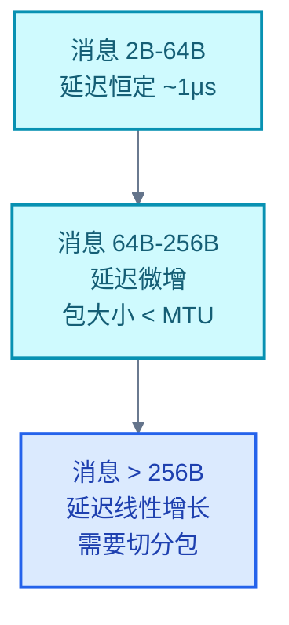
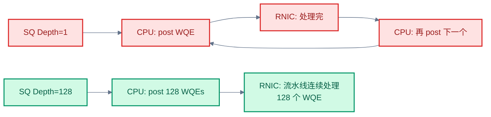
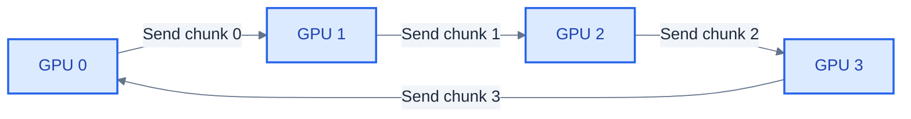

# 性能分析与应用生态

> RDMA 的价值最终体现在数据上：微秒级延迟、线速带宽——但前提是正确测量和调优。本章从 perftest 工具出发，讲延迟/带宽的测量方法、性能调优参数，以及 NVMe-oF、AI 训练、分布式存储三大应用场景中的 RDMA 实践。

### 关键术语

| 缩写 | 全称 | 含义 |
|------|------|------|
| perftest | — | RDMA 性能测试工具集 |
| NCCL | NVIDIA Collective Communications Library | NVIDIA 集合通信库 |
| RCCL | ROCm Collective Communications Library | AMD ROCm 集合通信库 |
| AllReduce | — | 全归约，分布式训练中最核心的集合通信操作 |
| NVMe-oF | NVMe over Fabrics | 基于网络的 NVMe 存储协议 |
| SPDK | Storage Performance Development Kit | 用户态存储性能开发套件 |
| DDIO | Data Direct I/O | Intel CPU 的 DMA 数据 LLC 缓存技术 |
| NUMA | Non-Uniform Memory Access | 非统一内存访问架构 |
| MSI-X | Message Signaled Interrupts Extended | 扩展消息信号中断 |
| SQ | Send Queue | 发送队列 |

---

## 概述

RDMA 的标称性能是"1 微秒延迟、200Gb/s 带宽"，但实际部署中可达性能取决于测量方法是否正确、调优参数是否合理。本章先讲如何用 perftest 测量，再讲影响性能的关键调优参数，最后讲三大应用场景中 RDMA 的实际落地方案。

### 前置知识

| 需要了解 | 参考文档 |
|----------|----------|
| Verbs API 编程模型 | [04-rdma-verbs-api.md](./04-rdma-verbs-api.md) |
| 连接管理与操作类型 | [05-rdma-connection-and-operations.md](./05-rdma-connection-and-operations.md) |
| 无损网络与 RNIC 硬件 | [07-rdma-transport-and-hardware.md](./07-rdma-transport-and-hardware.md) |
| GPU 集群互联基础 | [../LLM/10-GPU集群互联：NVLink到InfiniBand.md](../LLM/10-GPU集群互联：NVLink到InfiniBand.md) |

---

## 一、RDMA 性能特征

### 1.1 延迟来源分解

一次 RDMA SEND 的端到端延迟由以下组件构成：

```mermaid
%%{init: {"theme": "base", "themeVariables": {"primaryColor": "#f8fafc", "primaryTextColor": "#1e293b", "primaryBorderColor": "#475569", "lineColor": "#64748b", "secondaryColor": "#f1f5f9", "secondaryBorderColor": "#94a3b8", "tertiaryColor": "#f8fafc", "fontFamily": "\"trebuchet ms\", verdana, arial, sans-serif"}}}%%
gantt
    title 一次 RDMA SEND 的延迟分解（约 1.2μs）
    dateFormat X
    axisFormat %s

    section 发送方
    Doorbell MMIO 写      :a1, 0, 50
    RNIC DMA 预取 WQE     :a2, after a1, 100
    传输引擎解析 WQE       :a3, after a2, 50
    DMA 读取数据           :a4, after a3, 200
    协议封装 + CRC         :a5, after a4, 100

    section 线缆
    光纤传播 (10m)         :b1, after a5, 50

    section 接收方
    包解析 + PSN 验证      :c1, after b1, 80
    DMA 写入目标内存       :c2, after c1, 200
    生成 CQE               :c3, after c2, 60
    应用 Poll CQ           :c4, after c3, 50
```



> 注：实际延迟受消息大小、PCIe 代次、RNIC 型号影响。以上为 ConnectX-6 100GbE 下单包（≤ 256B）的典型数值。

### 1.2 典型延迟与带宽数据

| 操作 | 消息大小 | ConnectX-5 (100GbE) | ConnectX-6 Dx (200GbE) | ConnectX-7 (400GbE) |
|------|:--------:|:-------------------:|:----------------------:|:-------------------:|
| **SEND 半往返** | 2 字节 | ~1.2μs | ~1.0μs | ~0.7μs |
| **RDMA WRITE** | 8 字节 | ~0.9μs | ~0.7μs | ~0.5μs |
| **RDMA READ** | 8 字节 | ~1.8μs | ~1.5μs | ~1.0μs |
| **单流带宽** | 1 MB | ~96 Gb/s | ~190 Gb/s | ~390 Gb/s |

> 半往返（half round-trip）= 发出一条 SEND 消息到收到对应 CQE 的时间。RDMA WRITE 延迟更低是因为远端不产生 CQE。

### 1.3 延迟 vs 消息大小曲线



延迟曲线的三个区域：
- **平坦区**（2B-64B）：延迟由 RNIC 处理时间主导，与包大小无关
- **微增区**（64B-256B）：DMA 时间随数据量增加，但仍在单包 MTU 内
- **线性区**（> 256B）：数据超过 MTU 需要分包，DMA 时间主导延迟

---

## 二、perftest 工具

perftest 是 RDMA 的事实标准性能测试工具（来自 linux-rdma 项目），测试半往返延迟和单向带宽。

### 2.1 基本用法

```bash
# === 延迟测试 ===

# 服务器端（先启动）
ib_send_lat -d mlx5_0

# 客户端（指定服务器 IP）
ib_send_lat -d mlx5_0 192.168.100.10

# 带宽测试
# 服务器端
ib_write_bw -d mlx5_0 -a --report_gbits

# 客户端（测试所有消息大小，报告 Gbps）
ib_write_bw -d mlx5_0 192.168.100.10 -a --report_gbits
```

### 2.2 关键选项

| 选项 | 含义 | 典型值 |
|------|------|:------:|
| `-d <dev>` | 指定 RDMA 设备（如 mlx5_0） | — |
| `-s <size>` | 消息大小（字节），默认递增 | 16, 64, 256, 1024, 65536 |
| `-n <N>` | 迭代次数 | 100000 |
| `-a` | 测试所有消息大小 | — |
| `--report_gbits` | 以 Gbps 报告带宽 | — |
| `-F` | 不绑定 CPU（避免 NUMA 误导） | — |
| `-t <depth>` | 发送队列深度（影响流水线） | 1（lat 测试）/ 128（bw 测试） |

### 2.3 测试矩阵

| 测试工具 | 操作类型 | 测量指标 |
|----------|---------|---------|
| `ib_send_lat` | SEND/RECV | 半往返延迟 |
| `ib_send_bw` | SEND/RECV | 单向带宽 |
| `ib_write_lat` | RDMA WRITE | 半往返延迟 |
| `ib_write_bw` | RDMA WRITE | 单向带宽 |
| `ib_read_lat` | RDMA READ | 半往返延迟 |
| `ib_read_bw` | RDMA READ | 单向带宽 |

### 2.4 结果解读

典型输出（`ib_send_lat`）：

```bash
#bytes #iterations    t_min[usec]    t_max[usec]  t_typical[usec]
     2      100000          1.05           2.30            1.10
    64      100000          1.08           2.10            1.12
   256      100000          1.15           2.50            1.20
  1024      100000          1.35           3.20            1.40
```

- 在 256B 处延迟开始明显上升 → MTU 边界（第一个需要分包的尺寸）
- `t_max` 远大于 `t_typical` → 可能存在中断延迟抖动或 DCQCN 速率调节

---

## 三、性能调优

### 3.1 调优参数总览

| 参数 | 配置位置 | 效果 | 权衡 |
|------|---------|------|------|
| **CQ Moderation** | `ethtool -C <if> rx-frames N` | N 越大，中断越少，CPU 越低 | N 小延迟低，N 大延迟增加 ~μs 级 |
| **MSI-X 亲和性** | `/proc/irq/N/smp_affinity_list` | 绑定 RNIC IRQ 到 NUMA 本地 CPU | 跨 NUMA → +50-100ns |
| **SQ Depth** | `qp_init_attr.cap.max_send_wr` | 越大越能填满 RNIC 流水线 | 每个 WQE 开销 ~64B，1000 QP × 256 depth = 16MB |
| **PCIe MaxPayloadSize** | `lspci -vv` 查看，BIOS 设置 | 512B/4096B 减少 TLP 开销 | 部分设备/交换机不兼容 |
| **NUMA 绑定** | `numactl --membind=0 --cpunodebind=0` | 避免跨 NUMA 节点 DMA | — |
| **中断合并** | `ethtool -C <if> rx-usecs 0` | 0 = 禁用（最低延迟），20 = 20μs 合并 | 禁用 → 中断率飙升 ~10^6/s |
| **DDIO** | Intel CPU 自动启用 | DMA 数据写入 LLC 而非 DRAM | 太小/太大的包 DDIO 无效；可能污染 LLC |

### 3.2 NUMA 的重要性

RDMA 操作涉及两个物理地址：**WQE/CQE 所在队列内存**和**MR 中的数据内存**。RNIC DMA 访问这两种内存时，如果内存位于非本地 NUMA 节点，每次 PCIe 事务增加跨 socket 延迟（~50-100ns）：

```bash
# 查看 RDMA 设备的 NUMA 亲和性
cat /sys/class/infiniband/mlx5_0/device/numa_node

# 绑定应用进程到设备所在的 NUMA 节点
numactl --membind=0 --cpunodebind=0 ./my_rdma_app
```

### 3.3 SQ Depth 与流水线效率



SQ Depth 太小 → WQE 消费完，RNIC 空闲等待 CPU 提交下一批 → 流水线气泡。对于带宽测试，建议 SQ Depth ≥ 128；对于延迟测试（单包收发），SQ Depth = 1 是合理的。

### 3.4 CQ Moderation 策略

CQ Moderation 控制 RNIC 产生 MSI-X 中断的频率：

| 场景 | ethtool 设置 | 效果 |
|------|-------------|------|
| **极低延迟** | `rx-frames 1`, `rx-usecs 0` | 每个 CQE 触发一次中断，延迟最低但 CPU 开销大 |
| **平衡** | `rx-frames 16`, `rx-usecs 10` | 每 16 个 CQE 或 10μs 触发一次中断 |
| **高吞吐** | `rx-frames 64`, `rx-usecs 50` | 批量 CQE 处理，CPU 效率最高 |

应用在 Polling 模式下（`ibv_poll_cq` 循环）时，中断可以完全禁用——延迟最低但 CPU 占 100%。

以上是 RDMA 性能测量的方法和调优手段。这些技术最终服务于具体场景——下面介绍 RDMA 在存储、AI 和分布式系统中的实际应用。

---

## 四、NVMe-oF / RDMA

### 4.1 架构

```mermaid
%%{init: {"theme": "base", "themeVariables": {"primaryColor": "#f8fafc", "primaryTextColor": "#1e293b", "primaryBorderColor": "#475569", "lineColor": "#64748b", "secondaryColor": "#f1f5f9", "secondaryBorderColor": "#94a3b8", "tertiaryColor": "#f8fafc", "fontFamily": "\"trebuchet ms\", verdana, arial, sans-serif"}}}%%
flowchart LR
    subgraph "计算节点 (Initiator)"
        App[应用/文件系统]
        NVMeInit[NVMe Initiator<br/>RDMA Verbs]
        RNIC_A[RNIC]
    end
    subgraph "RDMA 网络"
        Fabric[RoCE v2 / InfiniBand]
    end
    subgraph "存储节点 (Target)"
        RNIC_B[RNIC]
        NVMeTarget[NVMe-oF Target<br/>SPDK / 内核]
        SSD[(NVMe SSD)]
    end

    App --> NVMeInit
    NVMeInit --> RNIC_A
    RNIC_A -->|RDMA SEND 命令| Fabric
    Fabric -->|RDMA READ/WRITE 数据| RNIC_B
    RNIC_B --> NVMeTarget
    NVMeTarget --> SSD

    classDef process fill:#dbeafe,stroke:#2563eb,color:#1e40af,stroke-width:2px
    class NVMeInit,NVMeTarget process
```



NVMe-oF 将 RDMA 作为传输层：**NVMe 命令**（64B，如 READ/WRITE）通过 RDMA SEND 发送到 Target；**数据块**（4KB-1MB）通过 RDMA READ/WRITE 直接在 Initiator 和目标端内存之间搬运——**数据路径上 CPU 零参与**。

### 4.2 NVMe-oF/RDMA vs NVMe-oF/TCP

| 对比维度 | NVMe-oF/TCP | NVMe-oF/RDMA |
|----------|:-----------:|:------------:|
| 4KB 随机读延迟 | ~100μs | ~10μs |
| CPU 使用率（1M IOPS） | 2-4 核 | 0.1-0.5 核 |
| 网络要求 | 标准 TCP 网络 | 无损以太网（PFC + ECN） |
| 部署复杂度 | 低 | 中（需配置 DCB） |
| 代表性实现 | Linux kernel nvme-tcp | SPDK nvme-rdma |

### 4.3 SPDK 用户态 NVMe-oF Target

SPDK（Storage Performance Development Kit）提供了基于 RDMA 的用户态 NVMe-oF Target：

```bash
# 启动 SPDK NVMe-oF Target（RDMA 传输）
./build/bin/nvmf_tgt -m 0x3 &

# 创建 RDMA 传输层
./scripts/rpc.py nvmf_create_transport -t RDMA -u 8192

# 添加 NVMe SSD 子系统
./scripts/rpc.py nvmf_create_subsystem nqn.2026-05.io.spdk:cnode1 -a -s SPDK0001
./scripts/rpc.py nvmf_subsystem_add_ns nqn.2026-05.io.spdk:cnode1 /dev/nvme0n1

# 添加 RDMA 监听器（端口 4420）
./scripts/rpc.py nvmf_subsystem_add_listener nqn.2026-05.io.spdk:cnode1 \
    -t RDMA -a 192.168.100.1 -s 4420
```

> SPDK 将 NVMe 驱动和 NVMe-oF 协议栈全部移到用户态，配合 RDMA 传输，实现端到端零拷贝 I/O。

---

## 五、AI 训练中的 RDMA

### 5.1 AllReduce Ring 算法

分布式训练的核心通信操作是 **AllReduce**（全归约）：N 个 GPU 各持有一部分梯度，全部归约求和后广播给所有 GPU：



Ring AllReduce 分为两步：
1. **Scatter-Reduce**：N-1 轮，每轮每个 GPU 发送 (1/N) 的数据到下一个 GPU 并做局部归约
2. **AllGather**：N-1 轮，每轮每个 GPU 发送完成归约后的数据到下一个 GPU

每个 GPU 发送的总数据量 = 2 × `(N-1)/N` × 完整梯度大小。当 N 很大时，接近 2 倍数据——但环上 N 个 GPU 同时发送到不同邻居，总线带宽被 N 充分利用。

### 5.2 NCCL 与 RDMA

NCCL 通过 IB Verbs API 使用 RDMA 进行跨节点通信：

```bash
# 指定 RDMA 设备
export NCCL_IB_HCA=mlx5_0,mlx5_1

# 指定 RDMA 操作类型（默认 SEND/RECV + RDMA WRITE）
# 可选：NCCL_IB_QPS_PER_CONNECTION=4（每连接 4 个 QP 增加并行度）

# 查看 NCCL 使用的 RDMA 拓扑
nvidia-smi topo -m
```

NCCL 内部使用 **GPUDirect RDMA**：梯度从 GPU 显存 → RNIC DMA 读取 → 网络 → 远端 RNIC DMA 写入 GPU 显存——整个路径上 CPU 零参与。

### 5.3 为什么延迟对训练至关重要

AllReduce 操作包含 N-1 轮串行通信（环的每一跳）。假设 8 个 GPU，每跳 RDMA 延迟 1μs：

- 延迟部分：(8-1) × 2 × 1μs = 14μs（Scatter-Reduce 7 轮 + AllGather 7 轮）
- 数据部分：2 × (7/8) × gradient_size / bandwidth

对于典型 GPT 类模型（梯度 ~1GB）：数据部分约 14ms，延迟部分 14μs → 延迟占比 ~0.1%，可忽略。但小模型（梯度 1MB）或大 N（数千 GPU）时延迟占比显著上升。这也是 NVSwitch（节点内零跳转）和 SHARP（网内归约，消除环延迟）的设计动机——详见 [../LLM/10-GPU集群互联：NVLink到InfiniBand.md](../LLM/10-GPU集群互联：NVLink到InfiniBand.md)。

---

## 六、分布式系统生态

| 系统 | 类型 | RDMA 用法 | 性能亮点 |
|------|------|----------|---------|
| **RAMCloud** | DRAM KV Store | RDMA WRITE（请求）+ RDMA READ（响应） | 5μs 远程读 |
| **FaRM** | 分布式计算 | RDMA WRITE for RPC | 乐观并发，事务级 |
| **HERD** | RPC 框架 | RDMA WRITE + SEND | 单机 7M ops/s |
| **eRPC** | 微秒级 RPC | RDMA WRITE_WITH_IMM | NIC 微码辅助，< 3μs |
| **Ceph/RDMA** | 分布式存储 | RDMA SEND/RECV | 替换 TCP messenger，CPU 降低 30% |

这些系统的共同设计模式：
- **请求路径**：客户端通过 RDMA WRITE 将请求写入服务端预注册的环形缓冲区——服务端 CPU **无需参与接收**（WRITE 不产生远端 CQE），只需定期 Poll 缓冲区
- **响应路径**：服务端通过 RDMA WRITE_WITH_IMM 将结果写回客户端缓冲区，IMM 值携带请求 ID——客户端凭 IMM 匹配请求与响应

---

## 参考资料

- [rdma-core（用户态 Verbs 库）](https://github.com/linux-rdma/rdma-core)
- [perftest（性能测试工具）](https://github.com/linux-rdma/perftest)
- [NCCL 环境变量文档](https://docs.nvidia.com/deeplearning/nccl/user-guide/docs/env.html)
- [SPDK NVMe-oF RDMA Target](https://spdk.io/doc/nvmf.html)
- [DCQCN 论文 — Congestion Control for Large-Scale RDMA Deployments (ACM SIGCOMM 2015)](https://dl.acm.org/doi/10.1145/2785956.2787484)

---

## 前置阅读

- [07-rdma-transport-and-hardware.md](./07-rdma-transport-and-hardware.md) — 传输层协议与 RNIC 硬件流水线
- [05-rdma-connection-and-operations.md](./05-rdma-connection-and-operations.md) — 连接管理与 RDMA 操作类型
- [04-rdma-verbs-api.md](./04-rdma-verbs-api.md) — Verbs API 编程模型

---

**文档版本**: v1.0
**最后更新**: 2026-05-10
**适用对象**: 性能工程师、系统架构师